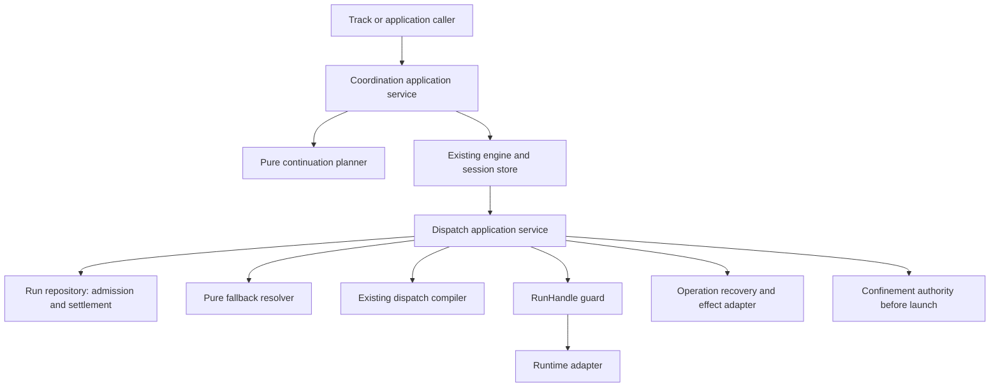

# Runtime Recovery And Work Continuity

Design status: PROPOSED detailed design. Implementation: NOT IMPLEMENTED.
Product direction agreed; technical choices below are recommendations for review,
not newly accepted laws. This is the entry point and proof map, not a fourth
runtime component. Contract owners remain Run, runtime adapters and Coordination.

## 1. Scope And Reading Order

Read `docs/specs/reading-map.md`, `docs/specs/runner.md`, this document, then:

1. [Run admission amendment](../contracts/assignment-run-runresult.md#proposed-runtime-recovery-amendment).
2. [RunHandle and recovery material](run-handle.md).
3. [Fallback eligibility and selection](executor-health-and-fallback.md).
4. [Session planning and continuation](coordination-continuation-recovery.md).

Source of product agreements:
`plans/reports/runtime-recovery-design-discussion-260911-1754.md`.
Independent findings: `plans/reports/design-review-second-opinion-260911-1709-runtime-recovery.md`.
Earlier settled constraints: `plans/reports/design-review-260911-1617-run-handle-continuation-health.md` sections 6-8.

Keep long-horizon continuity without making every worker understand checkpoints.
The first release may cover a subset, but must identify unsupported operations
explicitly. No Work claim, merge, approval or status authority is added here.

## 2. Identity And Existing Reality

| Identity | Owner | Current evidence and design consequence |
|---|---|---|
| Lead conversation/session | Agent harness outside Coordination | May drive many cells; not a persisted CoordinationSession identity. |
| Track/cell | Consuming track/domain harness | `fgos-plan-loop` sections 0/1/5 use plan/phase documents and one `<track>--<cell>` session convention. `chain.mjs:24` derives membership from that name. No universal core Cell entity exists. |
| CoordinationSession | Coordination engine/store | Bounded ledger, actors, authority, graph and budget; not a cell acceptance authority. |
| Actor | Session | `replaceSessionActor` preserves role and old Assignment provenance; replacing one executor is not actor replacement. |
| Assignment | Assignment builder/store | Immutable semantic task, session-blind; session owns membership refs. |
| Run | Dispatch runtime | One attempt, deterministic identity, eligibility and settlement; retry retains Assignment. |

A consumer may map multiple cells to nodes/bindings in one CoordinationSession,
or map a cell to several replacement sessions. This proposal permits both, but
does not claim the current `chain` implementation already supports both.
Represent correlation as optional session-owned `workUnits[]`:
`{owner, trackId, unitId, contractRef, bindingRefs[]}`. `contractRef` pins the
external acceptance document revision/digest. `bindingRefs` identify the subset
of this session participating in that unit; empty means the whole session only
when explicitly declared `scope: session` by the consumer schema.

The tracking adapter validates that owner namespace and membership; core stores
the correlation but never treats it as authorization or quorum. Legacy name
inference remains labeled legacy-derived, used only when explicit correlation is
absent. A continuation copies only transferred unit correlations. `chain` groups
by explicit unit identity and lists all associated sessions; it does not select
the newest active session as the sole authority when several are active. Mixed
or conflicting mappings are surfaced, not silently merged. Track acceptance
still comes from the consuming harness, never the child session's existence.

## 3. Ownership And Dependencies

| Responsibility | Sole owner | Excluded responsibility |
|---|---|---|
| Legal bindings, visibility, quorum and disposition | Existing Coordination evaluators | Planner does not reimplement them. |
| Next-action recommendation | Pure planner | No store import, I/O, executor selection or authority. |
| Session/transfer mutation | Existing engine/store doors | CLI/request builder cannot enforce policy on their behalf. |
| Attempt admission and result eligibility | Run repository/runtime | No separate attempt-admission service. |
| Runtime control | Guard over repository + runtime adapter | No graph policy or result acceptance. |
| Effect/recovery-material interpretation | Operation recovery adapter | Runtime observations never certify external effects. |
| Run evidence and lineage evaluation | Run Result Evaluator | Must distinguish inherited artifacts from current-Run delta; no runtime adapter or planner may perform acceptance. |
| Workspace grant/identity | Workspace-grant repository or Work-runner claim (profile-specific) | No implicit "existing owner"; absent issuer means writable takeover parks. |
| Executor candidate order | Fallback resolver | Compiler and confinement retain governance. |

Two persistence ports plus one guard service in RunHandle are enough. Do not
create crates per method or a shared mutable recovery manager. Data schemas
below specify persisted/exchanged boundaries; in-process APIs can use native types.

## 4. Recovery Choice

| Situation | Action | Identity retained |
|---|---|---|
| Worker result available | Normalize/store, publish only if eligible | Original Run. |
| Observer lost, worker still working | Inspect/reattach/wait | Same Run and Assignment. |
| Worker cannot continue | Reconcile effects and writers, then eligible replacement Run | Same Assignment and unit objective. |
| Participant must be replaced across tasks | Existing actor replacement and governed future dispatch | Role, old membership and evidence. |
| Session no longer executable | Legal continuation transfer, new ledger | Objective/provenance, not authority/quorum credit. |
| Cell accepted, next cell begins | Existing track transition | Track acceptance history. |

Result scanning wins before any new execution, including after budget exhaustion
or cancellation. Read/collect is not admission. Cancellation bars retry and
automatic continuation of the cancelled intent, but does not discard late results.
An explicit new user intent is a new request, not an escape through continuation.

## 5. Arbitrary Interruption Is Not A Checkpoint

Default recovery preserves recoverable state. The old worker need not publish a
progress report, commit, or recognize an internal milestone. A half-edited file
is permitted input to a replacement, not completion evidence.

| Recovery level | Required interpretation |
|---|---|
| Baseline | Immutable Assignment and original inputs; no claim partial work survived. |
| Recoverable state | Workspace/artifact capture plus explicit completeness/unknowns; replacement inspects before using. |
| Declared checkpoint | Operation-specific checkpoint schema, version and resume validator; optional capability. |

Task notes are untrusted advisory context. Never restore claimed worker reasoning
as authority. Preserve prior acceptance criteria and validate the final state.
Failed-attempt edits inherited by the next Run must be attributed as inherited;
they must not masquerade as newly produced changes under dirty-before checks.
The evaluator may assess the cumulative Assignment outcome only with an explicit
lineage of admitted Runs and artifacts; otherwise it reports insufficient proof.
This requires a named Run Result Evaluator owner only for profiles that accept
inherited edits as part of acceptance. Read-only replacement or a new isolated
workspace can continue to use the current per-Run delta evaluator. The
cumulative-Assignment view and `inherited` attribution are dependencies of the
same-workspace writable profile; X05 remains a proof gate for that profile, not
for all S2 recovery.

## 6. Local Concurrency And Durability

Lock order for mutation: session lock(s), sorted by coordinationId when more
than one is needed; Assignment locks sorted by assignmentId; Run control lock.
Standalone runtime takes only the latter locks. No code holding an Assignment
or Run lock may call upward to acquire a session lock. Normalization may persist
a per-Run result first; linking later reacquires locks in the prescribed order.
No session/Assignment lock spans provider I/O. Their sections only validate and
write durable intent/commit facts. Launch/control rechecks admitted permission
under a short gate, records a pending command, then performs adapter I/O under
the Run control lock. Cancellation ordered after that gate is an in-flight
cancellation, not a retroactive claim that dispatch never began.

Control acquisition must not reclaim a live process merely because TTL expired.
Holder identity is `{hostId, bootId, pid, processStartTime}` of the process doing
control, not a guessed Rust parent. Unknown liveness is not dead. A dead holder
may leave a remotely queued command: successor first reconciles pending control.

Recommended local implementation for safe reclaim without unlink races:
one per-scope lock directory containing immutable generation records and
token-specific release markers. Contenders publish generation `g+1` only after
`g` is released or its exact process identity is proven dead. Exactly one wins
exclusive publication. Never unlink/overwrite an earlier generation during
acquire/release, so a delayed release cannot delete its successor. A live holder
never self-recognizes a second concurrent acquisition as reentrant. Generation
records are retained with the runtime/session artifacts; compaction is offline
only after the scope is quiescent.

Publication uses a fully written/fsynced temp file in the same directory,
followed by atomic non-overwriting publication (local filesystem hard-link on
the initial Linux adapter), then directory fsync. State replacement uses
temp+rename+directory fsync under the owning lock. This retains exclusive-create
semantics while avoiding empty-lock and conditional-unlink races seen in P12.
This refinement is not a claim that today's lock helper already implements it.
Unsupported filesystem guarantees refuse mutation with a named diagnostic;
doctor must probe them before this writer profile is enabled. No distributed
lease, background renew service or TTL-only takeover is required by default.

## 7. Agent-Facing Contract

Extend the existing `coordination run` request door with a proposed recovery
request variant: `{contract, coordinationId, writerId, intent: recover,
target?: {assignmentId}, budgetGrantRef?: string}`. Omitted target scans the
session; engine chooses one eligible action and returns progress. `show --json`
exposes the same typed recommendation without refreshing/writing runtime facts.
The headless adapter calls the same use case. These are proposed request fields,
not commands/features available in the current release. A fresh controller may
omit `writerId` only when the session manifest supplies a replacement-driver
grant; otherwise the request returns `needs-input` with the exact identity
requirement. Recovery executes exactly the planner's selected action. It does
not unconditionally call close-after-steps; close is invoked only when the
selected action is `close-session`.

Return `{outcome: applied | already-applied | waiting | needs-input | refused,
action, subjectRefs, reasonCode, evidenceRefs, nextCheckAt?}`. A repeated recover
call recomputes facts and resumes a durable pending action. It never uses a
worker-supplied child ID, task key, supersession boolean or ownership assertion.
`needs-input` names the exact missing semantic decision/grant; it is not the
default for ordinary concurrency, a slow observer or already-applied action.
Blocked targets remain individually visible; another eligible independent target
may progress. Stable ordering prevents one parked target monopolizing the scan.

## 8. Compatibility And Rollout

New semantics are opt-in by version, not unknown fields silently added to v1.
Proposed Run writer format is `assignment-run.v2`; handle and material are new
v1 formats. Continuation uses proposed CoordinationSession schema `2` and a
FlowDefinition version supporting its optional continuation profile. Existing
schema `1` sessions retain their existing engine path until a quiescent upgrade
is explicitly supported. No old reader is allowed to execute against new state.

One runtime owns a scope's writes. A Node-launched Run keeps its Node writer;
Rust readers may inspect a supported version or return version-unsupported.
Rust control of a Node-owned Run must route to the owning implementation, or
refuse `owner-runtime-unavailable`. A new CLI process of the same owning runtime
may recover a dead controller; spawn ownership is not controller PID identity.
Move the complete writer boundary only after parity, quiescence and rollback
compatibility proof; never dual-run writers for shadow testing.

`bin/fgos.mjs` remains the legacy payload entry. No file relocation or new host
composition root. Setup/doctor must register filesystem publication checks,
adapter reconcile/control capabilities, workspace-preservation support and any
new config defaults. Project-over-global precedence remains unchanged.

## 9. Implementation Slices And Gates

| Slice | Scope | Exit evidence; dependency |
|---|---|---|
| S0 | Freeze fixtures for existing ladder, budgets, retry/recheck, context and close behavior | Existing Node suites green; capture known deficiencies without marking them solved. |
| S1 | Versioned Run admission, strict publish fencing and local lock/reclaim | Concurrent admission and every pre-launch crash window; no two winners. Node first. |
| S2 | Herdr launch reconciliation, handle guard, pending-control reconciliation, material capture | Reattach/observe/reconcile through public door; isolated or read-only takeover only. The first Node adapter uses a deterministic Herdr agent name derived from `runId`; exit proof includes duplicate-name refusal and no resurrection after close. Writable partial-edit takeover parks until workspace-grant and evaluator owners exist; depends on S1. |
| S3 | Eligible fallback through compiler and confinement | Same Assignment, bounded attempts, unknown effects park; depends on S1/S2 for takeover. |
| S4 | Pure snapshot/planner + show | Can develop beside S1-S3 using recorded facts; no claim of automatic repair. |
| S5 | One protocol continuation, transfer/import/budget/apply + chain read model | Parent-child crash/concurrency, fresh agent proof; needs runtime safety and relevant open/close fixes. |
| S6 | Additional runtime/operation adapters and optional checkpoint support | Capability-specific proof before enabling; no promise all adapters ship with S2. |
| S7 | Rust writer port | Same fixtures for all supported Node semantics, sole writer and recovery compatibility. |

S5's first protocol is a coding repair-and-recheck entry consuming a candidate
and findings. It validates inputs, authorizes repair freshly, performs fresh
independent review/red-team and disposition. It does not jump into the original
protocol's revise node or borrow the parent's quorum. Exact operation schemas
use the current FlowDefinition primitives, not a second graph language.

## 10. Proof Matrix

These are required executable scenarios, not tests claimed to have passed.
Initial implementation places them in the existing runner/verbs test families;
fixtures record inputs, injected interruption, durable state and expected result.

| ID | One primary verifiable scenario |
|---|---|
| F-a | Reused pane locator with stale handle/incarnation: destructive control refused; unrelated pane unchanged. |
| F-b | Coordinator dies after bind; recovery finds live worker, same Run, zero new spawn. |
| F-c | Caller timeout while worker present/working: stale observation, no failure settlement or new Run. |
| F-d | Provider pause through automated cleanup and retryAfter: preserve pane, inspect only. |
| F-e | Worker-liveness branch is explicit: live/working writer yields partial or deferred capture; dead writer after quiescence yields preserved capture; unknown liveness parks. Zero stdout never infers launch failure or completion. |
| F-f | Two callers race admission through launch/bind, including injected crash: one admitted launch identity and no duplicate resource. |
| F-g | In-flight refusal identifies Run/handle when known, explicit pre-bind/ambiguous cause otherwise. |
| C-a | Review-only request with omitted roster obligations refuses before open; valid restricted roster still opens. |
| C-b | Valid partial escape hatch with pending fix: first pass does not close prematurely; authorized fix and eventual valid close succeed. |
| C-c | Fresher existing authorization consumed with identity-derived distinct taskKey; no redundant authorize or reuse of old result. |
| C-d | Parent-owned but unreleased artifact cannot be imported/granted to child; valid scoped import passes. |
| C-e | Clock exceeds parent wall bound: collecting late results allowed, new parent dispatch refused. |
| C-f | Crash after normalization before link: eligible result linked once, receipt alone never linked. |
| C-g | Two callers continue exhausted parent: one child, one grant reservation; missing authority yields needs-input. |
| E-a | Real zero-output ceiling shape: reconcile workspace/effects; fallback only after proven eligibility, not by stdout heuristic. |
| E-b | Handshake unknown: reconcile or park; proven not-delivered branch uses next candidate within the same Assignment cap. |
| E-c | Quota line with/without parseable reset: park same Run, preserve line, no timed relaunch. |
| E-d | Observer timeout with nonterminal ladder and live worker: wait, no fallback/cooldown. |
| E-e | Candidate rejected by capability/governance/confinement cannot launch; next eligible candidate retains original constraints. |
| E-f | Table-driven config failure, launch failure and semantic rejection remain distinct; semantic rejection does not trigger infra fallback. |
| X01 | Pause live lock holder past TTL, race acquire/release: no successor until release; dead generation takeover cannot delete successor. |
| X02 | Crash after control send but before ack: reconcile the pending command; Herdr may resend only while the adapter reports ready and no ack, and must not resend after ack/working. Unknown delivery remains unknown. |
| X03 | Delayed superseded result before/after new link: retained per Run, never becomes current authoritative link. |
| X04 | Capture half-edited file and untracked artifact after writer quiescence: replacement sees exact manifest or explicit incomplete coverage. |
| X05 | Writable/inherited-acceptance profile: Run Result Evaluator attributes preserved failed-attempt edits as inherited and independently verifies final acceptance. Read-only/isolated profiles use per-Run delta evaluation and do not claim X05. |
| X06 | Cancel during admission/control/transfer: ordering documented, no later unauthorized attempt; late result retained. |
| X07 | Crash at each transfer step: resume through public request; no manual claim-file deletion or second child. |
| X08 | Parent terminal/flow drift/destination entry invalid: transfer refuses; no post-terminal bookkeeping, synthetic quorum or reopening terminal session. |
| X09 | Session with two external work-unit correlations and one unit across two sessions: chain renders both without conflating acceptance. |
| X10 | Unknown state version or foreign owning runtime: explicit refusal; unchanged schema-1 requests retain behavior. |
| X11 | Fresh agent follows short public instructions; runtime derives identity from the session manifest or returns typed needs-input; no manual IDs/state fixes; record intervention count and blocked independent-work progress. |

## 11. Review Finding Resolution And Limits

| Findings | Design response |
|---|---|
| R01/R02 | Run amendment specifies exact supersession identity, serialized admit/publish, pending declaration recovery and launch reconciliation. |
| R03 | Section 6 and RunHandle specify no TTL theft, immutable lock generation and pending remote-control handling. |
| R04/R05/R06 | Continuation contract defines evaluator projections, typed action identities, idempotent apply and transfer transaction/grants. |
| R07/R08/R09 | Fallback defines one default, ceiling/spawn mapping, budget arithmetic and typed effect eligibility. |
| R10 | C-b/C-c proof corrected; no blanket refusal of valid partial policy or extra authorization. |
| R11/R12/R13 | RunHandle separates liveness/progress, defines transitions/control coverage and one visibility binding source. |
| R14/R15 | Ownership table, shared mutation door, versioned rollout and dependency gates. |

Distributed leases, live partial session transfer, shared chain-budget allocation,
health store/scoring and generic effect ledger are unsupported in the first writer
profile. Their absence returns typed unsupported/unknown, never silently widens
authority. No temporal estimate or successful live proof is asserted here.

Profile decisions are now fixed: a terminal parent refuses transfer; the first
Herdr adapter uses deterministic `runId` naming while retaining registry-lookup
semantics; repeat mode is explicit in the operation/protocol contract; driver
replacement requires a `driver-replaced` door; and live-process force-release is
not available in Node/R1-R2. Operation-specific grants or business effect
policies must be supplied by that operation's owner; a runtime adapter cannot
infer permission to duplicate an external effect from this design.

R3 may add an audited force-release door. Until then every control critical
section must release its token in `finally` and append a release marker, even
when the controlled process remains alive.
