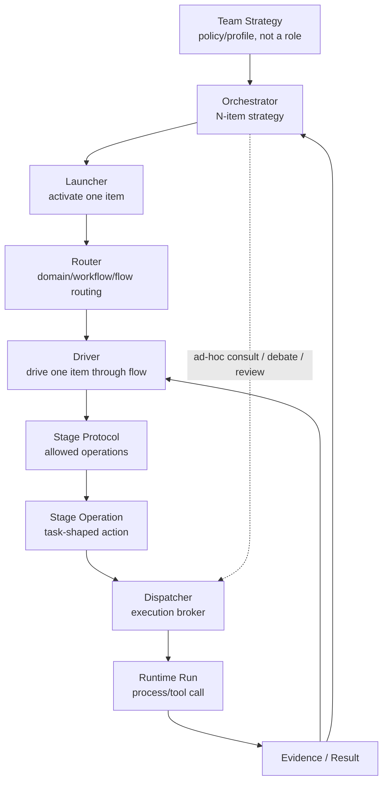
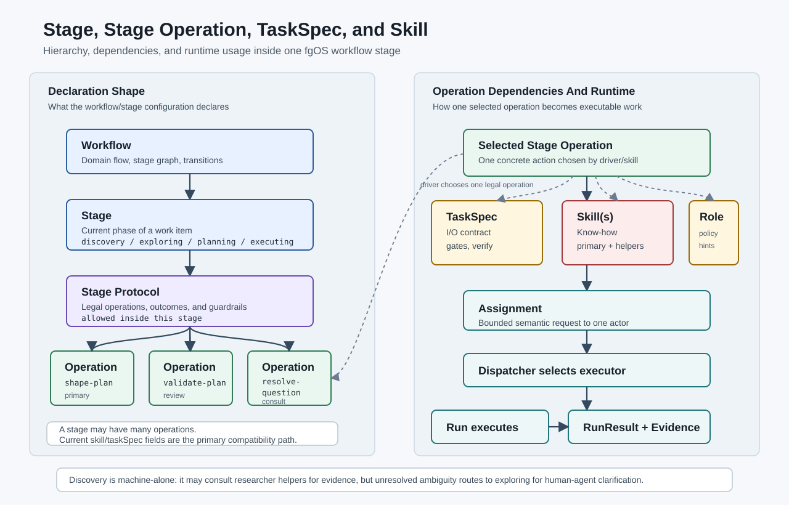

# Orchestration Vocabulary Map

Status: agreed architecture vocabulary
Date: 2026-08-27
Scope: fgOS work lifecycle, mission/team coordination, assignments, dispatch, runtime execution, evidence, and visibility

## 1. Purpose

fgOS already has several working coordination layers: work lifecycle, workflow routing, role handoff, dispatch planning, executor resolution, and Herdr visibility. Team dispatch adds another layer: several agent roles, possibly backed by different providers, contributing to a larger mission.

This document defines the shared vocabulary so new team-dispatch work does not duplicate or blur existing concepts.

The main rule:

```txt
Do not create a second lifecycle system beside work.
```

`work` remains the lifecycle authority. `mission`, `assignment`, `run`, and `AgentMessage` sit around it for team coordination and execution.

## 2. Layer Map

This map is an architecture synthesis over existing fgOS concepts plus the
new team-dispatch vocabulary proposed in this design thread:

```txt
Mission -> Work -> Workflow -> Stage -> Stage Protocol -> Stage Operation -> Assignment -> Dispatch -> Runtime -> Evidence -> Visibility
```

```txt
Mission layer      = team collaboration envelope [Proposed]
Work layer         = lifecycle/state authority [Existing]
Workflow layer     = domain flow and stage graph [Existing]
Stage layer        = one phase inside a workflow [Existing/Formalized]
Stage Protocol     = legal operations and outcomes inside a stage [Proposed/Formalized]
Stage Operation    = one task-shaped action available inside a stage [Proposed/Formalized]
Assignment layer   = bounded semantic request to one role/executor [Proposed/Formalized]
Dispatch layer     = decide which executor/mechanism should run [Existing]
Runtime layer      = process/run execution and logs [Existing/Formalized]
Evidence layer     = proof and confidence classification [Existing/Formalized]
Visibility layer   = Herdr/tmux/dashboard surfaces for humans [Existing]
```

These layers should remain separate even when a single command crosses several of them.

`Existing` means the concept already exists in current docs or code. `Proposed`
means the concept is new team-dispatch vocabulary. `Formalized` means the
behavior partly exists today but needs a clearer first-class contract before
team dispatch relies on it.

## 3. Canonical Concepts

### 3.1 Work

`work` is the primary lifecycle-bearing unit in fgOS.

It has durable state, event history, status, stage, claim/return semantics, verification, and merge behavior. It is the unit that appears in the backlog and moves through the fgOS lifecycle.

Use `work` when the thing needs lifecycle ownership.

Examples:

- a bugfix item;
- a feature item;
- a documentation task;
- a reviewable implementation unit.

### 3.2 Child Work

`child work` is not a separate kind. It is ordinary `work` with a parent relationship.

Use child work when a larger work item is decomposed into lifecycle-bearing sub-items that can be tracked, claimed, verified, and merged independently.

Do not reintroduce `rootTask` or `subTask` as canonical vocabulary. A historical "subtask" should resolve to either child work or an ad-hoc assignment.

### 3.3 Mission

`mission` is a team-level collaboration envelope.

A mission groups the conversation, assignments, results, and evidence around a larger objective. It can involve one work item, several work items, or exploratory/advisory activity that has not become work yet.

Mission is not a replacement for work and should not have a duplicate work-style lifecycle unless a concrete need appears.

Use `mission` when multiple roles or providers need shared context across several assignments.

Examples:

- "make multi-provider dispatch stable";
- "redesign Herdr visibility without trusting pane status";
- "plan and review a broad architecture change before filing work items".

### 3.4 Assignment

`assignment` is a bounded semantic request given to one role, agent, tool, or executor.

An assignment answers:

```txt
Who should act?
What should they do?
What context refs should they read?
What output is expected?
What success criteria apply?
```

An assignment may be attached to a work item, a child work item, a mission, or no durable work item at all.

Use `assignment` for a concrete handoff to one actor.

Examples:

- ask Codex to review a patch;
- ask agy to implement a small fix;
- ask Claude to verify a test failure;
- ask GitNexus to analyze impact.

### 3.5 Workflow / Flow

`workflow` or `flow` is the domain-specific path a work item follows.

It defines the stage graph and the supported movement between stages. A flow
may be selected by work kind, risk, domain, or router policy.

Use `workflow` when talking about the declared graph. Use `flow` when talking
about a work item moving through that graph.

Examples:

- coding feature flow;
- coding bugfix flow;
- lightweight documentation flow;
- cross-domain triage-to-coding flow.

### 3.6 Stage

`stage` is one phase inside a workflow.

A stage is larger than a single task. It represents the item's current position
inside the flow, such as discovery, exploring, planning, or executing.

Near-term code currently maps a stage to one primary skill and often one
primary task-spec. That should be read as the stage's primary operation, not as
the full meaning of the stage.

### 3.7 Stage Protocol

`stage protocol` is the set of legal operations, outcomes, role handoffs, and
internal loops available inside one stage.

It answers:

```txt
While this item is at this stage, what may happen?
```

Examples:

- planning may shape a plan, consult research, ask an advisor, or validate the
  plan;
- executing may implement, assist, review, fix after review, verify, or ask for
  advice;
- discovery may judge ambiguity, consult researcher helpers for evidence, or
  route into exploring. It is machine-alone and must not ask the human
  directly; human-agent clarification belongs in exploring.

Stage protocol should provide guardrails, not script every decision. The skill
or soul chooses among legal operations; the driver enforces the protocol.

### 3.8 Stage Operation

`stage operation` is one task-shaped action available inside a stage.

It usually points to a task-spec, a role, required skill(s), an optional handoff
reason, and expected outcomes.

Examples:

- `shape-plan`;
- `validate-plan`;
- `scout-blast-radius`;
- `implement-item`;
- `review-item`;
- `fix-verify-red`;
- `scoped-subtask`.

A stage can have many operations. A task-spec defines one operation's
input/output/gates. A skill may implement one or many operations.

### 3.9 Ad-Hoc Task / Exec Packet / DispatchAssignment

`ad-hoc task` is the current name for an ephemeral runtime-composed request outside the work ledger.

`exec packet` is the legacy transport-shaped name.

`DispatchAssignment` is the preferred design-target name if the protocol layer is later renamed. It should mean the bounded semantic assignment handed to dispatch, not the process run that executes it.

Near-term rule:

```txt
Keep current code names unless a real implementation consumer needs the rename.
```

ID note:

```txt
Assignment ids are design-target until Step 03 implements a generator.
Use an explicit prefix such as `asgn_<token>` in new examples.
Do not reuse `tsk-*`; that namespace belongs to lifecycle work.
```

### 3.10 AgentMessage

`AgentMessage` is the semantic message envelope for team communication.

It can carry task requests, results, questions, answers, blockers, review results, or coordination proposals. It should describe meaning, not process mechanics.

Examples:

```json
{
  "type": "TASK",
  "assignmentId": "asgn_001",
  "missionId": "mission_001",
  "toRole": "reviewer",
  "objective": "Review the dispatch adapter's completion rules",
  "contextRefs": ["docs/architect/agent-coordination/dispatch-control-plane-redesign.md"],
  "expectedOutputs": ["findings", "risk assessment"]
}
```

```json
{
  "type": "RESULT",
  "assignmentId": "asgn_001",
  "status": "done",
  "summary": "The done path can still false-positive without evidence.",
  "artifacts": ["report:asgn_001"]
}
```

An `AgentMessage RESULT` is an agent claim. It becomes trustworthy only after runtime and evidence data are attached.

### 3.11 Run

`run` is one runtime execution attempt for an assignment.

A run answers:

```txt
Which executor was run?
Which command or tool call was used?
Where did it run?
What was the timeout?
Where are stdout, stderr, exit data, and evidence?
```

Runs belong to the runtime layer, not the semantic team layer.

Use `run` when recording actual execution.

Reserve `job` for a future queued or scheduled execution unit with its own
lease, priority, cancellation, or worker-pool semantics. V1 team dispatch does
not need that concept.

### 3.12 Capability

`capability` is an abstract behavior promise.

Examples:

- `fgos-coding-implement`;
- `impact-analysis`;
- `review`;
- `research`.

Capability says what kind of behavior is needed, not which provider will do it.

### 3.13 Executor

`executor` is the concrete backend that can satisfy a capability or be selected directly.

Examples:

- `agy`;
- `codex`;
- `claude`;
- `pi`;
- `gitnexus`;
- `herdr`.

Executor config owns provider, command, invocation shape, adapter, model policy, and governance metadata.

### 3.14 Role

`role` is a responsibility position in a team or workflow.

Examples:

- planner;
- implementer;
- researcher;
- reviewer;
- verifier;
- advisor;
- helper.

Role is not the same as provider. A reviewer can be Codex in one mission and Claude in another.

### 3.15 Agent Type / Persona

`agent-type` or `persona` is a behavioral identity: skills, tool scope, decision boundary, model tier, and style.

It is different from executor:

```txt
agent-type = how the actor should behave
executor   = what backend runs it
```

Provider-specific projection may differ. Claude, agy, and Codex do not need to expose the same agent-selection mechanism.

### 3.16 DispatchPlan

`DispatchPlan` is the canonical decision object for one dispatch request.

It resolves selector, target, mechanism, governance, execution details, model/tier, adapter, and reason codes.

It is not a mission planner. It answers:

```txt
Given this target, what execution mechanism should fgOS use?
```

### 3.17 Runtime Execution Contract

The runtime execution contract describes how a run executes.

It is still needed. It just sits below `AgentMessage`.

```json
{
  "runId": "run_asgn_001_01",
  "assignmentId": "asgn_001",
  "executorId": "codex",
  "command": ["codex", "exec", "--json", "-o", ".fgos/results/asgn_001.txt", "{prompt}"],
  "cwd": "/repo/worktree",
  "timeoutMs": 1800000,
  "visibility": {
    "kind": "herdr-pane"
  }
}
```

### 3.18 Evidence / Result

Evidence records why fgOS trusts or distrusts a result.

Examples:

- process exit code;
- structured result file;
- stdout/stderr logs;
- git head before/after;
- working tree before/after;
- changed files;
- test results;
- expected artifacts.

Result confidence should be explicit:

- `reported` - the agent emitted a structured claim, but external proof is absent or not required;
- `verified` - the claim is backed by external evidence;
- `inferred` - no structured claim, but external evidence shows real effect;
- `no-evidence` - process or pane settled, but no useful proof exists;
- `failed` - timeout, nonzero exit, invalid result, explicit failure, or blocked execution.

### 3.19 Herdr

Herdr is a visibility and process-control surface.

Herdr may open a pane, run a command, show progress, or help a human observe an agent. It must not be the source of task truth.

```txt
Herdr status can help decide when to inspect.
Herdr status cannot prove success.
```

### 3.20 Dispatch Policy / Execution Policy

`dispatch policy` or `execution policy` is the set of constraints and
preferences used before a `DispatchPlan` chooses the concrete execution path.

It answers:

```txt
For this role, operation, work item, and assignment, what execution shape is preferred or required?
```

It may influence:

- provider family;
- executor id;
- model tier;
- model name;
- persona;
- tool scope;
- visibility mode;
- egress allowance;
- fallback executors.

Policy is not all one kind of override. It has three different semantics:

| Policy kind | Meaning | Merge rule |
|---|---|---|
| Constraint | A requirement that cannot be weakened by a lower layer. | union / fail closed |
| Preference | A desired choice when no stronger selector overrides it. | highest-specificity wins |
| Rigor | Minimum reasoning/review strength. | strongest required tier wins |

Examples:

- a reviewer role may require at least `standard` tier;
- a high-risk work item may raise review to `critical`;
- `review-item` may prefer the `code-reviewer` persona;
- a human may explicitly request a visible Herdr run;
- governance may refuse a cross-provider executor even when it was preferred.

Canonical policy resolution order:

```txt
Global defaults
-> Domain defaults
-> Workflow defaults
-> Stage defaults
-> Stage operation / taskSpec defaults
-> Role defaults
-> Persona defaults
-> Work-item policy
-> Assignment explicit policy
-> Human / CLI explicit override
-> Governance gate
```

Field-specific rules:

- provider/executor preference uses highest-specificity wins;
- tier/rigor uses strongest required tier wins;
- model name resolves after provider and tier through provider-specific model
  policy;
- literal model-name override is allowed only at assignment or human/CLI level;
- governance is final and may reject the resolved plan.

Workflow operations should mostly declare role, task-spec, skill, mode, and
lightweight policy hints. They should not hardcode one provider permanently
unless the operation truly requires that backend.

### 3.21 ID Namespaces

Team dispatch introduces several conceptual ids. They must not collapse into
the existing work id namespace.

Current implemented ids:

| ID | Shape | Created by | Authority |
|---|---|---|---|
| Work id | `tsk-<hash>` for submitted work, or `parent-id-<n>` for decomposed child work | `generateId()` in intake classification; child reconciliation in planning | fgOS work event log |
| Claim id | implementation/runtime-specific claim token | claim/runtime coordination code | runtime claim overlay and attempt events |
| Executor id | config key such as `claude`, `agy-cli`, `pi`, `gitnexus` | runner config | runner config |
| Operation id | usually task-spec id such as `validate-plan` | workflow YAML / task-spec catalog | domain workflow registry |

Design-target ids:

| ID | Recommended shape | Future creator | Notes |
|---|---|---|---|
| Mission id | `mission_<token>` | mission/thread layer, deferred | no V1 lifecycle |
| Assignment id | `asgn_<token>` | assignment builder in Step 03 | semantic request, not work |
| Run id | `run_<assignment-id>_<attempt>` | run executor / RunResult writer | one runtime attempt |
| AgentMessage id | `msg_<token>` | AgentMessage/mailbox layer, deferred | only when message protocol exists |
| Trace id | `trace_<token>` | observability/correlation layer, deferred | distributed trace correlation |

Rules:

- `tsk-*` is reserved for lifecycle work only.
- `asgn_*` must not imply lifecycle, claim, merge, approval, or backlog
  visibility.
- `run_*` is created only when execution starts.
- `msg_*` and `trace_*` must remain examples until their respective layers have
  real writers and readers.
- Docs may use placeholder ids only when they are labeled as examples or
  design-target ids.

## 4. Coordination Roles

Coordination roles are not a linear call chain. They sit in four decision
rings with different scopes.

```txt
Strategic ring  = Orchestrator
Activation ring = Launcher
Flow ring       = Router + Driver
Execution ring  = Dispatcher
```



### 4.1 Strategic Ring: Orchestrator

The orchestrator is the T0 strategy role over many items, assignments, or
drivers.

It decides:

- which ready item should run next;
- which item should be skipped for now;
- which items should be grouped into a batch;
- whether work should run sequentially or in parallel;
- when results from several drivers should be merged;
- when another assignment, review, verification, or debate is needed.

The orchestrator should not need to know executor command details. It chooses
the strategic shape; dispatch handles concrete execution.

Do not use `orchestrator` in the older historical sense of `launcher`.

### 4.2 Team Strategy

Team strategy is not a coordination role. It is the policy or profile the
orchestrator applies when choosing what should happen next.

Examples:

- `frontier-drain` - keep selecting ready work until available slots are full;
- `fanout` - split or select several independent items and run them together;
- `review-gated` - require review before verification or merge;
- `risk-first` - run impact analysis or review before implementation;
- `debate` - ask several agents for independent opinions, then synthesize;
- `bottleneck-first` - prefer work that unblocks the largest downstream set.

Strategy tells the orchestrator how to choose. It is not a sixth actor sitting
above the orchestrator.

### 4.3 Activation Ring: Launcher

The launcher activates one work item or dispatch target and then steps away.

It is a fire-and-forget role. It can be used by a user command, runner, or
orchestrator when the caller wants to start one item but not stay attached to
drive the flow.

Examples:

- activate the next selected item;
- call the equivalent of pick/cook/start for one item;
- start a run and let another loop observe the result later.

Launcher is not strategy and is not flow ownership. If the actor continues to
read state and progress the item, it is acting as a driver, not only a launcher.

### 4.4 Flow Ring: Router

The router is the harness/domain/workflow authority.

It decides:

- which domain owns a work item;
- which workflow or flow applies;
- which stage path is supported;
- which role handoffs are legal;
- which skill or flow entrypoint should receive the item;
- when a work item should pass from one flow to another;
- how the output of one flow becomes input to a later flow;
- whether the item is unsupported by the current harness.

The router answers:

```txt
Where does this work belong, which flow is valid for it, and should it move to another flow next?
```

The router does not choose provider commands or process mechanics.

Router can pass work around. A flow is not necessarily terminal: its output
may become the input to another flow in the same domain or a different domain.
The driver leads the item inside the selected flow; the router owns the
boundary crossing between flows.

### 4.5 Flow Ring: Driver

The driver stays attached to one active work item and leads it through its
selected flow.

It can:

- advance stages;
- choose among allowed stage operations;
- request role handoffs;
- create bounded assignments;
- call the dispatcher when a concrete execution need appears;
- evaluate returned results and evidence;
- decide whether this item should continue, block, ask a question, wait for
  approval, or finish.

Driver is one-item flow ownership. It is not N-item strategy.

### 4.6 Execution Ring: Dispatcher

The dispatcher is the shared execution broker for any concrete execution need
inside a workflow, stage operation, task, skill, or capability.

It decides:

- direct or delegated execution;
- role/position to satisfy the need, when relevant;
- agent persona to sit in that role, when relevant;
- capability required;
- executor to run;
- mechanism: in-process, cli-spawn, mcp, api, or visible Herdr/tmux execution;
- runtime execution contract;
- result and evidence handling.

The dispatcher answers:

```txt
Given this execution need, which infrastructure should run it and how should fgOS read the result?
```

It owns `DispatchPlan`, governance, adapter selection, runtime handoff, and
result normalization. It does not own team strategy.

## 5. Concept Boundaries

### 5.1 Work vs Mission

```txt
Work    = lifecycle authority
Mission = collaboration envelope
```

Create work when state, ownership, verification, approval, or merge semantics matter.

Create a mission when several roles/providers need shared context for a larger objective.

A mission may contain references to many work items. A work item may be executed as part of a mission. Neither replaces the other.

### 5.2 Work vs Assignment

```txt
Work       = durable lifecycle item
Assignment = one bounded request to one actor
```

An assignment can implement, review, research, or verify a work item. It should not become a second backlog row unless it needs independent lifecycle.

If the request needs tracking, claim, return, verification, and merge, make it child work. If it is just a bounded call to an actor, make it an assignment.

### 5.3 Assignment vs Run

```txt
Assignment = semantic request
Run        = runtime attempt
```

An assignment may have multiple runs if it retries or runs on several executors.

### 5.4 Stage vs Stage Operation vs TaskSpec vs Skill



```txt
Stage           = phase in the workflow
Stage Protocol  = allowed operations/outcomes inside that phase
Stage Operation = one task-shaped action in that phase
TaskSpec        = input/output/gates contract for an operation
Skill           = know-how used to perform one or more operations
```

Relationship shape:

```txt
Workflow
  -> Stage
    -> Stage Protocol
      -> Stage Operation(s)
        -> TaskSpec
        -> Skill(s)
        -> Role / policy hints
```

Dependencies:

- `Stage` belongs to a workflow and marks the item's current phase.
- `Stage Protocol` belongs to a stage and declares what may happen inside that
  phase.
- `Stage Operation` belongs to a stage protocol and names one concrete action
  the driver may choose.
- `TaskSpec` is referenced by an operation and defines the input, output,
  gates, verification expectations, and collaboration table for that action.
- `Skill` is referenced by an operation and provides the know-how/prose for
  performing it. One skill may cover several operations; one operation may use
  a primary skill and helper skills.

A stage should not be reduced to one task and one skill. The current
stage-to-skill/taskSpec mapping is the primary operation compatibility shape.
The fuller model is one stage with many legal operations.

Example:

```txt
Stage planning
  primary operation: shape-plan
  optional operations:
    validate-plan
    scout-blast-radius
    resolve-question
```

Runtime usage:

```txt
Driver reads current Stage
  -> reads Stage Protocol / allowed Operations
  -> chooses one Stage Operation
  -> resolves TaskSpec + Skill + Role/policy hints
  -> builds Assignment
  -> Dispatcher selects executor
  -> Run executes
  -> RunResult/Evidence returns to Driver
```

The stage graph should define legality and guardrails. It should not hardcode
every consult/review/verify/fix loop as a separate FSM state. The skill or soul
chooses among legal operations; the driver enforces that choice; the dispatcher
runs the selected operation.

### 5.5 AgentMessage vs Runtime Execution Contract

```txt
AgentMessage              = meaning
Runtime Execution Contract = mechanics
```

AgentMessage says "review this patch". Runtime execution says "run `codex exec --json` in this directory with this timeout and result file".

### 5.6 Role vs Executor vs Provider

```txt
Role     = responsibility
Executor = configured backend
Provider = model/service family
```

Do not bind roles permanently to providers. Use role-to-executor preferences that can be overridden by mission, work kind, cost, availability, or governance.

### 5.6a Role vs Persona vs Dispatch Policy

```txt
Role            = responsibility seat
Persona         = behavioral identity sitting in that seat
Dispatch Policy = constraints and preferences for how that actor runs
```

Role is more durable than persona. Persona is more durable than provider.
Provider and model should remain late-bound unless the operation requires a
specific tool ecosystem.

Hãy nghĩ `role` như **chức năng xã hội trong một tình huống**, không phải con người cụ thể.

Ví dụ một phiên tòa:

```txt
Role:
- thẩm phán
- luật sư bào chữa
- công tố viên
- thư ký tòa
- nhân chứng
```

Các role này là các **seat**. Nghĩa là phiên tòa cần những vị trí trách nhiệm đó để vận hành đúng. Ai ngồi vào ghế có thể thay đổi, nhưng “ghế thẩm phán” vẫn là “ghế thẩm phán”.

```txt
Role = ghế/trách nhiệm cần có
Person = người đang ngồi ghế đó
Persona = phong cách/năng lực/hành vi của người đó
Provider/executor = tổ chức/cơ chế đưa người đó vào làm việc
```

Ví dụ:

```txt
Role: thẩm phán
Persona: thẩm phán nghiêm khắc, thiên về thủ tục
Person/executor: bà A được phân công xử vụ này
```

Sang vụ khác:

```txt
Role: thẩm phán
Persona: thẩm phán hòa giải, thiên về thương lượng
Person/executor: ông B được phân công xử vụ khác
```

Role không đổi: vẫn là **thẩm phán**. Nhưng persona và người thực hiện có thể đổi.

Another everyday process:

```txt
Restaurant shift:

Role / seat:
  - server
  - cook
  - cashier
  - shift manager

Meaning:
  The process needs someone to take orders, prepare food, take payment,
  and resolve exceptions.
  A person may be the server today and the shift manager tomorrow.
  The role is the process responsibility being filled, not the actor's identity.
```

In fgOS:

```txt
Role:
  reviewer

Meaning:
  The workflow needs a review responsibility to be filled.
  It does not mean "Claude reviewer", "Codex reviewer", or any other
  specific agent type.

Persona:
  code-reviewer

Meaning:
  The actor sitting in the reviewer seat should behave like a code reviewer:
  use the expected skills, tool scope, decision boundary, rigor, and style.

Dispatch policy:
  Selects the executor, provider, model tier, visibility mode, and fallback
  path that should fill that reviewer seat for this mission or work item.
```

For example, `review-item` can require the reviewer role and prefer the
`code-reviewer` persona. The dispatch policy can then prefer Claude for code
review, allow `pi` as a fallback, and raise tier when the work item is high
risk.

### 5.7 Dispatch vs Handoff

`handoff` moves responsibility between roles inside a workflow item.

`dispatch` chooses and runs an execution mechanism for a target.

They may occur together, but they are not the same concept.

### 5.8 Driver vs Router Across Flows

```txt
Driver = progresses one item inside the selected flow
Router = moves work into, across, or out of flows
```

A driver should not silently invent the next flow when the current flow's
output needs a different flow. It should return the flow outcome to the router,
and the router decides whether that outcome becomes input to another supported
flow.

### 5.9 Visibility vs Truth

Visibility is what the human sees.

Truth is what the control plane can prove.

Herdr, tmux, terminal panes, and dashboards belong to visibility. Process exit, structured results, event logs, git deltas, artifacts, and tests belong to truth/evidence.

## 6. Full Model And Implementation Profiles

The full conceptual model is:

```txt
Mission
  -> Work
    -> Workflow / Flow
      -> Stage
        -> Stage Protocol
          -> Stage Operation
            -> Assignment
              -> DispatchPlan
                -> Run / Runtime Execution
                  -> Evidence / Result
                    -> Visibility
```

This full model is the architecture vocabulary. It does not require every
concept to become a separate physical file or runtime object in the first
implementation.

The simplified implementation profile for team dispatch is documented in
`step-00-team-dispatch-v1-overview.md`.

## 7. Rules For Creating Things

Create `work` when:

- the unit needs lifecycle state;
- it needs independent claim/return;
- it needs approval or merge;
- it should appear in backlog/frontier;
- failure must persist as state.

Create `child work` when:

- a parent work item has decomposed lifecycle-bearing parts;
- each child can be independently claimed, verified, approved, or merged.

Create `mission` when:

- multiple roles/providers collaborate toward a larger goal;
- the team needs a shared thread and assignment history;
- the objective spans multiple work items or several dispatches.

Create or select `workflow` when:

- a work item needs a domain-specific flow;
- different work kinds require different stage graphs;
- output from one flow needs routing into another flow.

Create `stage` when:

- the workflow needs a durable position marker;
- the item can pause, resume, or be routed at that point;
- several operations share the same phase objective.

Create `stage operation` when:

- one task-shaped action is available inside a stage;
- the action has its own task-spec, role, handoff reason, or expected outcome;
- the driver may choose it based on stage context.

Create `assignment` when:

- one role/executor needs a bounded request;
- the request can be represented as a message/prompt/tool call;
- independent lifecycle is not needed.

Create `run` when:

- an assignment is actually executed;
- a retry is attempted;
- a different executor is tried for the same assignment.

Create `job` only in a future queue/scheduler design where the execution unit
has queue ownership, lease, priority, cancellation, or worker-pool semantics.

Create `AgentMessage` when:

- a role communicates task, result, question, answer, blocker, review, or coordination intent;
- the content belongs in the mission thread.

Create `DispatchPlan` when:

- fgOS must decide native vs out-of-process;
- an executor, capability, work item, or assignment needs execution.

Create or apply `dispatch policy` when:

- a stage operation needs default execution preferences;
- a role or persona has a minimum tier or tool boundary;
- a work item raises or narrows execution requirements;
- an assignment needs an explicit executor, tier, visibility mode, or fallback
  set;
- a human/CLI explicitly overrides the execution target.

## 8. Deprecated Or Risky Vocabulary

Avoid these meanings in new docs/code:

- `rootTask` - use work with no parent, or root work if a plain-language distinction is needed.
- `subTask` - use child work or assignment depending on lifecycle.
- `capacity` - use capability for abstract behavior or executor for concrete backend.
- `orchestrator` meaning launcher - use launcher.
- `exec packet` as a long-term semantic name - use assignment or DispatchAssignment when protocol migration needs it.

Existing historical docs may retain old terms when quoting decisions or describing past designs. New architecture docs should use the canonical terms above.

## 9. Relationship To Existing Architecture Docs

This vocabulary map sits above the existing specialized docs:

- `dispatch-control-plane-redesign.md` defines DispatchPlan, governance, executor invocation, adapter selection, Herdr visibility, and result signaling.
- `agent-team-dispatch-and-herdr-stability.md` defines the three-channel model, evidence wrapper direction, and near-term Herdr stabilization.
- `step-00-team-dispatch-v1-overview.md` defines the simplified implementation profile for this full vocabulary.
- `doing-coordination-redesign.md` defines the separation between runtime claims and durable state history.
- `knowledge-registry-redesign.md` covers knowledge organization and registry concerns.

The intended split:

```txt
dispatch-control-plane-redesign = how one target is selected and run
agent-team-dispatch-and-herdr-stability = how team dispatch uses reliable execution and visibility
orchestration-vocabulary-map = what each concept means
step-00-team-dispatch-v1-overview = how to implement the first small slice
```

## 10. Open Questions

1. Whether `mission` should remain a lightweight file/thread envelope forever or later gain a formal lifecycle.
2. Whether `DispatchAssignment` should replace current ad-hoc task / exec packet naming in code, or stay design-target only.
3. Whether team dispatch should allow agents to propose assignments only, or eventually allow trusted roles to create assignments directly under policy.
4. Where the current `claims:` vs `skills:` vocabulary drift should be officially recorded if not in this file.
5. Whether stage operations should eventually become their own reusable registry or remain embedded under workflow stages.
6. Whether dispatch policy should stay embedded in workflow/role/persona config or later become a reusable named policy profile registry.

## 11. Summary

The unified model is:

```txt
Mission coordinates the team.
Work owns lifecycle.
Workflow selects the flow.
Stage marks the item's phase.
Stage Protocol lists legal operations.
Stage Operation names one task-shaped action.
Dispatch Policy resolves constraints, preferences, tier, provider, and persona.
Assignment gives one bounded request to one actor.
DispatchPlan chooses how that target should run.
Run records the runtime attempt.
Evidence proves or downgrades the result.
Herdr shows the work to humans.
```

This lets fgOS build team dispatch through `cli-spawn` first, using Claude, Codex, agy, and other executors, without creating a second lifecycle system or making Herdr the authority.
