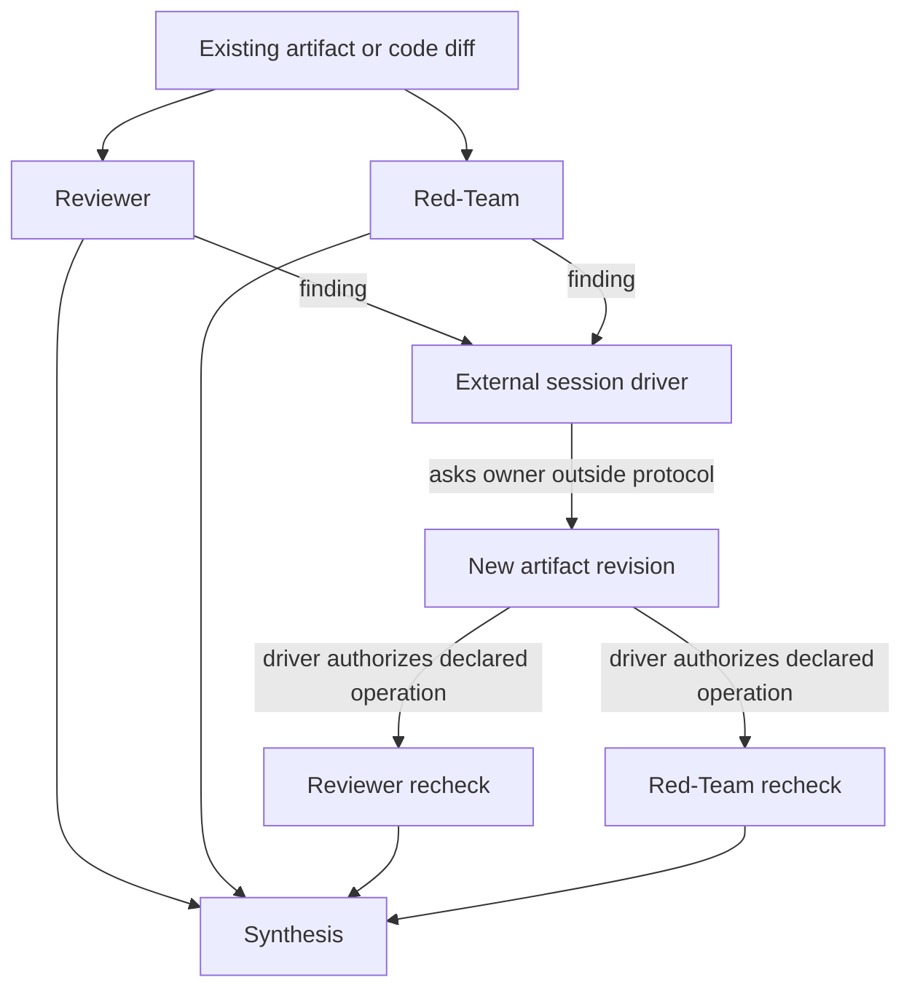

# Architecture Intent

Document type: Architecture intention / discussion
Design status: Discussion
Implementation: Not started
Last reviewed: 2026-09-02
Canonical for: nothing until explicitly accepted

Scope: preserve architecture-wide design intent across deferred capabilities,
so later implementation plans can narrow scope safely without accidentally
turning "not yet" into "not part of the design."

Active thread: widen fgOS coordination so it can support common
group-thinking/problem-solving patterns, including but not limited to code
review loops, without weakening the already-proven isolation-heavy
`group-cognition-framework.yaml`.

Related:
- `docs/architect/agent-coordination/proposals/team-communication-protocol-v1.md`
- `docs/architect/proposals/step-09-group-thinking-substrate.md`
- `docs/architect/proposals/step-10-coding-domain-adoption.md`
- `docs/architect/proposals/component-authority-boundary-map.md`
- `docs/architect/agent-coordination/intent-preservation-ledger.md`

This is a discussion document. It does not accept a design, does not change
runtime behavior, and does not authorize implementation.

## 0. Active Intent Threads

| Thread | Status | Purpose |
|---|---|---|
| Group-cognitive coordination | Active discussion | Preserve the original intent to grow fgOS beyond strict fan-out/fan-in into broader group-thinking/problem-solving capability. |

## 1. One-Screen Summary

The earlier proposal was too hard to read because it mixed five things:
history, theory, schema shape, runtime primitive, and future implementation
fixture. This rewrite separates them.

The corrected framing:

```txt
The current system is too narrow for general group-cognitive work.

It can express:
  static declared graphs,
  one-shot or fixed-round handoffs,
  isolated fan-out/fan-in,
  mediated consult,
  synthesis.

It cannot yet express many common patterns:
  Delphi-style repeated feedback,
  Nominal Group Technique phase changes,
  RFC review with optional follow-up,
  adversarial triad with judge-driven rounds,
  master-coordinator style adaptive review/fix/red-team loops,
  dynamic specialist pull-in.
```

So the proposal should not be "just build a review loop." The proposal should
separate:

1. **Capability expansion** — which coordination dimensions must become
   expressible at all.
2. **Safety boundary** — what remains kernel-hard and non-negotiable.
3. **First slice** — the smallest useful fixture to prove the expanded model.

The product move is:

```txt
Keep isolation-heavy fixtures hard.
Add declared ways to express more group-thinking shapes.
Start with a bounded review loop only as the first safe proof slice.
```

## 2. Why This Exists

Step 08 produced an asymmetry:

- Phase 05 hardened `group-cognition-framework.yaml`, an isolation-heavy
  topology. It proves that peer chat, recursive graph growth, vote-as-truth,
  and hidden sibling influence cannot be expressed in that fixture.
- Phases 06-07 were implemented with the manual `master-coordinator` playbook,
  which is communication-heavy: Doer, Reviewer, Fixer, Red-Team, and a
  persistent coordinator deciding whether another round is needed. That process
  found real bugs, including critical security bugs.

So the real question is not only:

```txt
Isolation or communication?
```

Nor is it only:

```txt
What is the smallest review-loop V1?
```

It is:

```txt
Which group-cognitive capabilities should fgOS make expressible, and how do
we add them without weakening fixtures whose value comes from strict isolation?
```

## 3. Non-Negotiables

This proposal must not:

- change `group-cognition-framework.yaml`;
- relax its R3 negative-test invariant;
- add peer edges between isolated explorer branches;
- weaken evidence immutability, governance-final, budget caps, path safety, or
  mutation exclusivity;
- put an autonomous leader actor inside the declared graph;
- treat this discussion as accepted design;
- implement `schema.mjs`, `session-engine.mjs`, or any runtime source before
  the direction is accepted.

## 4. The Simple Model

There are three layers:

```txt
Tier 1: Kernel safety
  Always enforced. No fixture opts out.

Tier 2: Fixture posture
  Each fixture declares whether it allows runtime communication deviation.
  Isolation fixture: no deviation envelope.
  Communication fixture: bounded deviation envelope.

Tier 3: Runtime rounds
  The external session driver may request extra review/recheck/consult rounds,
  but only through governed, budgeted, immutable events.
```

The important architectural rule:

```txt
The graph is the default route.
The external session driver is the leader.
The leader is not a graph node.
```

Reason: a leader inside the graph would be another dispatched worker claiming
"I verified this." That is self-report, not independent stop-gate authority.
The master-coordinator worked because the persistent driver re-read evidence
and decided whether the process could stop.

## 5. Capability Axes As The Map

The original seven axes are not decorative. They are the capability map. The
second sol-agent pass surfaced two more axes, deliberation memory and speech
acts, that explain why merely adding more graph edges would still leave common
review/problem-solving methods under-specified.

| Axis | What it asks | What fgOS supports today | What broader group cognition needs |
|---|---|---|---|
| Topology shape | Who can see/send to whom? | Static edges only; no runtime-added edges; isolation fixture intentionally has no peer edges. | Static, star, pipeline, fan-out/fan-in, RFC-style many reviewers, optional specialist pull-in, possibly later dynamic edges. |
| Timing | Real-time or round-based? | Round-based async only. | Mostly round-based for V1; synchronous pair/mob remains separate because mutation exclusivity makes it expensive. |
| Role symmetry | Peers or asymmetric roles? | Mostly asymmetric roles. | Both asymmetric roles and symmetric reviewer sets, depending on fixture. |
| Information visibility | Raw peer output, aggregate, mediated artifact, or anonymous feedback? | Mediated, isolated-until-fan-in, or broadcast as static fixture posture. | Delphi/NGT need aggregate/anonymized feedback phases; RFC review may expose sibling comments after first pass; adversarial work needs controlled visibility windows. |
| Control regime / meta-authority | Fixed graph, driver-selected, data-triggered, or graph self-changing? | Fixed graph; external driver can imperatively call existing verbs, but protocol schema does not declare optional driver-selected rounds cleanly. | Driver-authorized optional rounds, conditional transitions, maybe later dynamic edge creation. In-graph autonomous leader remains rejected. |
| Feedback loop | One-shot, fixed-N, adaptive, convergence-based? | Fixed declared handoffs, often `maxRounds: 1`; retry exists but is not recheck. | Bounded adaptive loops: repeat review, critique, feedback, or recheck until stop condition or budget. |
| Decision / aggregation rule | How does N output become group answer? | `completion.mode` is coarse: synthesize/all-required/explicit-partial. | Vote, rank, Delphi convergence, author synthesis, judge ruling, dissent-preserving synthesis, explicit no-consensus. |
| Deliberation memory | What state persists across rounds? | Assignment artifacts and evidence refs. | Proposal versions, objections, responses, dispositions, unresolved issues, and revision lineage. |
| Speech acts | What kind of contribution was made? | Generic assignment result. | Typed `propose`, `challenge`, `clarify`, `respond`, `rank`, `request-round`, and `disposition` events. |

The first brainstorm was right that the current shape is too strict for many
ordinary group-thinking methods. The correction is that we do not need to
soften everything globally. Each fixture should declare where it sits on these
axes.

## 6. What Is Strictly Not Supported Today

These are strict gaps if the goal is broad group-cognitive capability:

| Pattern | Strict gap today | Why it matters |
|---|---|---|
| Delphi | No first-class aggregate/anonymized feedback phase. | Participants cannot receive controlled group feedback between rounds without ad hoc driver prose. |
| Nominal Group Technique | No declared phase rule for "silent generation -> round-robin sharing -> discussion -> private vote." | The schema can approximate phases, but not the visibility/voting rules that define the method. |
| RFC review | No clean optional follow-up rounds or comment visibility windows. | Many reviewers can run, but "author responds, selected reviewers recheck" is not declared as a reusable protocol. |
| Adversarial triad | No judge/driver authorization event and no distinct ruling/disposition primitive. | Doer/Red-Team/Judge can be simulated manually, but the protocol cannot show who ruled what and why. |
| Master-coordinator loop | No declared adaptive review/fix/red-team loop. | Retry exists, but recheck is semantically different and must preserve prior verdicts. |
| Dynamic specialist pull-in | No runtime `addSessionEdge` or equivalent. | A driver cannot add a previously unknown expert edge while keeping the graph/event audit complete. |
| Conditional materialization | No schema field for "run this operation only if prior result has accepted finding." | Driver can decide imperatively, but fixture cannot declare the condition. |
| Rich aggregation | `completion.mode` is too coarse for vote/rank/convergence/no-consensus semantics. | Group answer rules are part of cognition, not output formatting. |
| Deliberation memory | No first-class proposal/objection/response/disposition state. | Assignment artifacts alone are not enough for RFC review, NGT clarification, or judge disposition. |

These gaps do not mean the current architecture is wrong. It means Step 08
built the first strict, safe subset. This proposal is about widening that
subset deliberately.

## 7. Expansion Order

Capability expansion should happen in layers:

1. **Optional declared rounds** — let a fixture declare operations that may be
   materialized only after driver authorization. This unlocks bounded
   review/recheck loops, RFC follow-up, and adversarial rechecks without
   dynamic topology mutation.
2. **Visibility windows / context grants** — let the fixture say what an actor
   may see before and after named milestones. This unlocks NGT/RFC patterns
   without destroying first-pass independence.
3. **Request/disposition events** — let actors request another round, and let
   the driver accept/reject with evidence refs. This unlocks judge/triad and
   master-coordinator auditability.
4. **Typed deliberation events** — add durable, artifact-backed events such as
   `propose`, `challenge`, `clarify`, `respond`, `rank`, and `disposition`.
   This is not a live peer-chat mailbox; it is structured deliberation state
   the runtime can audit.
5. **Richer aggregation modes** — extend beyond coarse `synthesize` toward
   vote/rank/convergence/dissent/no-consensus modes where the fixture needs
   them.
6. **Dynamic specialist edges** — add `addSessionEdge` only after the previous
   layers prove insufficient. This is useful, but it is a larger and riskier
   axis than optional declared rounds.

## 8. First Safe Slice: `bounded-review-loop.yaml`

The first slice can still be a read-only coordination fixture around an
existing artifact. It is not the whole answer; it is the first proof that the
expanded capability model works without weakening isolation fixtures.



What it can do:

- run independent Reviewer and Red-Team passes;
- keep Reviewer and Red-Team isolated before first verdict;
- allow driver-authorized clarification, consult, or recheck rounds;
- preserve failed actors, dissent, unsupported claims, and evidence refs;
- prove all extra rounds are visible in the session ledger.

What it cannot do yet:

- mutate source code as a protocol-owned Doer;
- move Work status/stage;
- merge or approve Work;
- spawn unbounded rounds;
- make an in-graph actor the stop gate.

That means a real mutating `code-implementation-cell.yaml` is a later design,
after Work-attached mutation authority and worktree isolation are explicitly
designed.

This is not really "peer communication." It is artifact-mediated orchestration:
agents produce independent artifacts, the driver dispositions them, and later
agents receive explicit context grants.

## 9. The Primitive Is Still Open

The earlier draft centered one topology-changing primitive:

```txt
addSessionEdge(coordinationId, { from, to, intent, reason, triggeredBy, maxRounds })
```

That should probably not be V1's first primitive.

Most master-coordinator behavior is:

```txt
Run another declared operation because evidence now says it is needed.
```

Examples:

- Reviewer reports a bug, so a fix/recheck round is needed.
- Red-Team reports an exploit, so a fix/adversarial-recheck round is needed.
- A recheck fails, so another bounded recheck round is needed if budget remains.

That suggests a smaller first primitive:

```txt
authorizeDeclaredOperation(...)
```

Shape:

```json
{
  "operationId": "reviewer-recheck",
  "triggerEvidenceRefs": ["run-result-or-assignment-id"],
  "requestedBy": "reviewer-actor",
  "authorizedBy": "external-session-driver",
  "roundKey": "reviewer-recheck:2",
  "reason": "Reviewer found a regression; owner supplied a new artifact revision."
}
```

Possible split:

| Primitive | Use |
|---|---|
| `requestRound` | Actor records that another round is needed. No dispatch authority. |
| `authorizeDeclaredOperation` | Driver authorizes one already-declared optional operation. |
| `addSessionEdge` | Later-only primitive for a genuinely unknown specialist consult edge. |

This is the main thing to decide before implementation.

## 10. Proposed First-Slice Shape

Sketch only, not accepted schema. The important change from the previous draft:
`artifact-source` is not modeled as a topology actor. Initial Reviewer and
Red-Team operations are root operations over explicit artifact refs; rechecks
are separately declared operations authorized by the driver.

```yaml
profile:
  kind: CoordinationProtocol
  completion:
    mode: synthesize
  topology:
    contextVisibility: mediated
    edges: []
  optionalRounds:
    authority: external-session-driver
    requestedByRoles: [reviewer, red-team]
    operations:
      - reviewer-recheck
      - red-team-recheck
      - specialist-consult
    maxRoundsPerOperation: 1
    mutatingOperationsAllowed: false
  independence:
    noCrossReadBefore:
      - actors: [reviewer-actor, red-team-actor]
        milestone: first-independent-verdicts-linked
```

Plain-English meaning:

- The fixture declares optional operations upfront.
- The external session driver authorizes an optional operation at runtime.
- Reviewer and Red-Team may request another round, but cannot dispatch it.
- Reviewer and Red-Team cannot see each other before first independent verdict.
- Rechecks receive explicit evidence/artifact refs from the driver.
- Extra rounds are capped by both fixture limits and session aggregate bounds.
- Mutation remains out of scope.

## 11. Current System Fit And Conflicts

The current system does not perfectly match the proposed V1. There is no fatal
contradiction with existing accepted contracts, but there are real gaps to
resolve before implementation.

| Area | Current system | Conflict / gap for V1 |
|---|---|---|
| `FlowDefinition` topology | Edges connect SessionActors. | An artifact/diff is not a SessionActor, so initial review must be modeled as root operations with explicit context refs, not `artifact-source -> reviewer`. |
| Declared operation dispatch | Runtime has declared-operation dispatch paths today. | A new primitive must explain how it differs from simply calling existing dispatch again. The missing piece is authorization/provenance for optional rounds. |
| Runtime graph shape | Existing protocol graph is static. | V1 should avoid topology mutation and only schedule declared optional operations. This avoids weakening isolation fixtures. |
| Round counting | Existing hard cap is Assignment-count-like. | Good as conservative budget enforcement, but not precise enough as the conceptual model for "review round." |
| Retry/replacement | `retrySessionTask` supersedes a run for the same Assignment. | Recheck must not be modeled as retry. Recheck is a new judgment that preserves previous verdicts. |
| Context visibility | Existing tests prove sibling leakage can be rejected for isolation cases. | V1 needs a named milestone such as `first-independent-verdicts-linked`, including behavior for failed/late/replaced actors. |
| Driver authority | Agent-led session already behaves like the persistent overseer. | Contract still needs to name driver identity, authorization, event trail, and race handling for two attempted authorizations. |
| Mutation | Standalone CoordinationSession is read-only with respect to Work. | V1 cannot honestly include protocol-owned Doer/Fixer mutation. Fix/owner action must remain outside protocol or wait for a separate Work-attached design. |
| Synthesis | Existing mode is `completion.mode: synthesize`. | V1 needs a stricter output contract so synthesis cannot hide failed actors, unresolved dissent, unsupported claims, or stale artifact revisions. |

So the answer is: **there is no reason to change the isolation fixture, but
the current system is not ready to express the bounded review loop cleanly
without one small new authorization/event surface.**

## 12. Architecture Change Size

There are three possible scopes. They should not be mixed.

### 12.1 Small V1: bounded review loop, no topology mutation

This is the current recommendation.

Expected architecture change: **small to medium**, not a rewrite.

What already works:

- `CoordinationProtocol` fixtures already declare actors, operations, graph
  phases, topology, completion mode, and policy.
- `dispatchDeclaredOperation` can already materialize a declared operation.
- A declared operation with no incoming topology edge can already receive
  explicit `contextRefs`.
- Session-wide hard bounds are already forwarded into the locked
  `createSessionAssignment` path: `maxAssignments`, `maxConcurrency`, and
  `maxRounds`.
- Existing isolation fixtures are unaffected if the new fixture uses a separate
  schema field and leaves their topology unchanged.

What must be added:

- A way to declare optional rounds, such as `optionalRounds`.
- An event/verb pair like `requestRound` and `authorizeDeclaredOperation`, so
  the ledger shows who requested, who authorized, why, and which evidence refs
  triggered the extra round.
- A context grant shape for rechecks: which artifact/diff revision and which
  previous verdicts the recheck may see.
- Negative tests for no pre-verdict Reviewer/Red-Team leakage, no unauthorized
  actor dispatch, no unbounded rounds, no mutation, and no budget bypass.

This scope does **not** require changing Work lifecycle, adding dynamic graph
mutation, or changing `group-cognition-framework.yaml`.

### 12.2 Medium/Large: `addSessionEdge`

This was the first brainstorm's main proposal.

Expected architecture change: **medium to large**.

Why bigger:

- Today the declared topology is static. `FlowDefinition` says an edge not
  declared in `topology.edges` is illegal at runtime.
- `dispatchDeclaredOperation` finds the incoming edge from the loaded static
  definition. A runtime-added edge would need to be replayed from session
  events and merged with the definition before dispatch.
- The added edge must carry context provenance, authorization, round cap,
  trigger evidence, and crash/retry behavior.
- The validator must prove fixtures with no deviation envelope still reject
  runtime-added edges.

This is doable, but it is not the smallest path to the bounded review loop.

### 12.3 Large / separate design: true mutating `code-implementation-cell`

Expected architecture change: **large**, and out of scope for this proposal.

Why:

- `CoordinationSession` currently references Work only as read-only context.
  It cannot move Work status/stage, approve, merge, or claim lifecycle
  authority.
- `CoordinationProtocol` forbids Workflow-only concepts such as
  `result.kind: gate-verdict`.
- Tier 1 mutation exclusivity says two concurrent mutating actors must not
  touch the same workspace.
- A real Doer/Fixer that edits code inside the protocol would need
  Work-attached authority, worktree isolation, stale-artifact handling, and
  merge/approval boundaries.

That is why V1 should not be called `code-implementation-cell`.

### 12.4 What Is Strictly Impossible Today?

Under current accepted contracts/runtime, these are strictly not expressible:

- Dynamic topology mutation inside a declared protocol: no runtime
  `addSessionEdge` exists, and undeclared edges are illegal.
- A topology edge from an artifact/diff to an actor: topology edges connect
  SessionActors, not files or artifacts.
- Protocol-owned code mutation: standalone CoordinationSession has read-only
  Work context only.
- In-graph leader with stop-gate authority: not a runtime primitive and
  rejected by this proposal's verification-laundering argument.
- Reviewer/Red-Team first-pass cross-read while preserving independence:
  if independence is claimed, their first verdicts need no shared context
  except the starting artifact.
- Recheck as retry: retry supersedes a run for the same Assignment; recheck
  must be a new judgment preserving the earlier verdict.

These are currently possible with modest additions:

- Run declared root review operations over explicit artifact refs.
- Add an authorization event before re-dispatching a declared optional recheck.
- Keep all extra rounds under existing aggregate bounds.
- Preserve isolation-heavy fixtures unchanged by putting optional-round support
  in a separate field used only by the new fixture.

### 12.5 Change Size By Capability

| Capability | Change size | Notes |
|---|---|---|
| Independent review, fan-out/fan-in, synthesis | Small | The base exists. Needs tighter synthesis and artifact revision contracts. |
| Bounded optional recheck/consult | Small to medium | Add optional operations, request/authorize events, context grants, and semantic round records. |
| Adversarial triad with declared rebuttal | Medium | Needs visibility by phase/epoch, preserved verdict chains, and judge/driver disposition. |
| Delphi | Medium | Needs anonymous or pseudonymous actor facade, aggregate feedback artifact, iteration policy, and convergence rule. |
| Nominal Group Technique | Medium | Needs silent generation, ordered sharing, clarification, and ranking/vote phases. |
| RFC review | Medium to large | Needs deliberation objects: thread, anchor, revision, objection, disposition, resolution, reopen. |
| Dynamic specialist recruitment | Large | Needs event-sourced topology overlay, authorization, race-proof bounds, and context provenance. |
| In-graph master coordinator | Large | Requires separating worker self-report from control-plane authority; still risky because of verification laundering. |
| Mutating implementation cell | Very large | Needs Work-attached mutation authority, worktree isolation, mutation lease/exclusivity, stale revision handling, approval, and merge boundaries. |

## 13. Working Assumptions For The Plan

These are not accepted decisions. They are working assumptions that make the
roadmap concrete enough for a later agent to plan and deliver against. If
evidence breaks one, the next plan revises that assumption explicitly instead
of silently narrowing the original intent.

### 13.1 Authority: External Driver First

Recommendation:

```txt
Only the external session driver/governance path in V1.
```

Actors may request a round through their result. They do not directly call the
operation-authorizing primitive.

### 13.2 Intent: Avoid New Edge Intents In V1

Recommendation:

```txt
For V1, avoid custom runtime edge intents.
```

If V1 only schedules declared operations, it may not need new edge intents at
all. Operation ids and result contracts carry the meaning:

```txt
reviewer-first-pass
red-team-first-pass
reviewer-recheck
red-team-recheck
specialist-consult
```

If `addSessionEdge` is later added, use kernel-known intent classes plus
fixture-local intent names. Do not use a fully open custom string list.

### 13.3 Rounds: Strictest Cap Wins

Recommendation:

```txt
The strictest applicable cap wins.
```

A runtime round must fit:

- requested cap;
- fixture `maxRoundsPerOperation`;
- remaining `aggregateBounds.maxRounds`;
- remaining `aggregateBounds.maxAssignments`;
- current `aggregateBounds.maxConcurrency`.

Caveat: current code largely treats "round" as Assignment count for hard-cap
purposes. That is acceptable as a conservative V1 limit, but the documentation
should not pretend it is a perfect semantic model of a review round.

### 13.4 Recheck Roles: Keep Reviewer And Red-Team Distinct

Recommendation:

```txt
Yes. Keep them distinct.
```

Reviewer recheck asks whether the fix satisfies the contract without
regression. Red-Team recheck asks whether the invariant can still be falsified.
The Step 08 evidence supports keeping those postures separate.

## 14. Problems In The Earlier Proposal

The earlier draft had the right instinct but unclear shape:

1. It used the phrase `code-implementation-cell` while mutation stayed out of
   scope.
2. It over-centered `addSessionEdge`, although the safest V1 needs another
   declared round, not topology mutation.
3. It treated `session-driver` too much like a graph actor, even though the
   driver is outside the graph.
4. It blurred "actor requests another round" and "driver authorizes another
   round."
5. It did not clearly state that `maxRounds` is currently enforced through
   Assignment-count-like machinery.
6. It used role-level `forbiddenPairs`, but the real rule is time-windowed:
   Reviewer and Red-Team must not see each other before first independent
   verdicts; after that, driver-mediated synthesis or recheck may be valid.
7. It sketched `artifact-source` as if it were a SessionActor. Under the
   accepted FlowDefinition contract, topology edges connect SessionActors;
   artifacts should be explicit context/evidence refs, not fake actors.
8. It did not separate request, authorization, dispatch, and result events.
   Collapsing those would make auditability weaker exactly where V1 needs it
   strongest.

## 15. Default Path And Deferred Path

Default path for V1: do not add `addSessionEdge` at all.

Instead:

```txt
V1 only adds requestRound + authorizeDeclaredOperation.
```

That would mean:

- the fixture must declare all possible Reviewer/Red-Team/Fixer/Recheck paths
  upfront;
- runtime can choose whether to run a declared optional path;
- no new actor-to-actor edge can appear mid-session;
- specialist consult remains out of V1 unless declared upfront as an optional
  operation.

Benefit: smaller schema, easier negative tests, less risk of weakening
isolation guarantees by accident.

Cost: less flexible than the master-coordinator playbook. Some real "pull in a
specialist now" cases would still need manual driver behavior outside the
declared fixture.

This is the safest first slice if the goal is to prove bounded review-loop
coordination without immediately opening topology mutation.

## 16. Additional Risks From Sol-Agent Review

These objections should stay visible until answered:

- Driver authority is now central. The design must define driver identity,
  authorization, audit trail, and bounds. Calling it "external driver" is not
  enough.
- Fixes happen outside the protocol, so each verdict must pin the artifact or
  diff revision it reviewed. Otherwise a later fix can make earlier evidence
  stale or ambiguous.
- Retry is not recheck. Retry supersedes an attempt for the same Assignment;
  recheck is a new judgment that must preserve both old and new verdicts.
- Assignment count is not full round semantics. It is a conservative hard cap,
  but future runtime should avoid treating it as the conceptual definition of
  a round.
- `first-independent-verdicts-linked` needs precise behavior when an actor
  fails, is late, is replaced, or the session closes partial.
- Synthesis must not hide dissent. The output contract must preserve findings,
  dispositions, evidence refs, failed/missing actors, and unresolved dissent as
  separate fields or sections.
- P05.2 proves the current infra can produce an honest null result under
  failure. It does not prove the bounded review loop improves quality. A later
  live proof must test that claim directly.

## 17. MVP Roadmap

This is the plan shape, not a menu of questions. Each MVP keeps the original
intention alive while adding only the architecture needed for that layer. The
detailed proposal lives in
[Step 09 - Group Thinking Substrate](proposals/step-09-group-thinking-substrate.md).

Stable spine:

```txt
FlowDefinition = static legality envelope
CoordinationSession = event-sourced runtime ledger
External driver = adaptive authority outside the worker graph
Assignment / Run / RunResult = execution and evidence path
Context grant = visibility and memory access path
Skill / surface = thin launcher only
```

| MVP | Goal | Real shape | Architecture change | Proof |
|---|---|---|---|---|
| 0 | Shape lock. | Record the stable spine and boundaries before runtime work. | Docs-only. | Link/check review; no runtime/schema edit. |
| 1 | Standalone Master Coordination fixture. | `plan.md` or `artifact.md` enters a declared worker graph: Doer, Reviewer, Red-Team, Fixer/Doer-followup, optional Synthesizer. Doer/Fixer produce session-local artifacts/revisions. | Fixture draft first; schema validation after acceptance. | Static skeleton expresses Master Coordination without Work fields or git authority. |
| 2 | Driver authorization primitive. | Optional operations require `operation-authorized` before dispatch, with `authorizationId`, `operationId`, `targetActorId`, `invocationKey`, `authorizedBy`, `reason`, `grantedContextRefs`, and `artifactRevision`. | Schema/runtime after acceptance. | Missing authorization, undeclared operation, over-cap invocation, terminal-session authorization, and context beyond grant are rejected. |
| 3 | Recheck and disposition. | Recheck is a new Assignment against a new artifact revision; disposition is a driver event, not worker self-report. | Schema/runtime after MVP 2. | Old verdict remains immutable; new verdict links to revision; synthesis preserves dissent and unresolved findings. |
| 4 | Surface launcher. | A skill/slash surface builds a request for a declared fixture and calls `fgos coordination run --file`, then reads `coordination show`/evidence. | Surface only; no group-thinking logic inside the skill. | Launcher cannot bypass FlowDefinition/session authorization. |
| 5 | Live standalone proof. | Run the Master Coordination loop with no Work: input plan, Doer artifact, Reviewer report, Red-Team report, driver-authorized fix, revision, recheck, final disposition. | CLI/headless run. | CLI/headless parity, crash/resume no duplicate, unauthorized optional operation rejected, hidden context rejected, bounds enforced. |
| 6 | Visibility windows. | First-pass isolation, post-verdict controlled sharing, aggregate/anonymized feedback, judge-only visibility. | Deferred schema/runtime. | RFC/NGT/Delphi fixtures can express their defining visibility rules. |
| 7 | Aggregation rules. | Completion modes such as `synthesize-with-dissent`, `vote`, `rank`, `convergence`, `judge`, and `no-consensus`. | Deferred schema/runtime. | Synthesis cannot hide dissent, failed actors, missing actors, or unsupported claims, and cannot upgrade evidence confidence. |
| 8 | Deliberation memory. | Typed records such as `proposal`, `challenge`, `response`, `clarification`, `rank`, and `disposition`. | Deferred schema/runtime. | Replay preserves why a decision happened without chat history. |
| 9 | Dynamic specialist pull-in. | Opt-in `addSessionEdge` or topology overlay after authorization/context/replay are solid. | Deferred large feature. | Same action works in an opt-in fixture and is rejected in isolation fixtures. |

Step 09 considers read-only/mutation as an execution-effect dimension, but its
MVP uses only read-only/session-local artifact production. Work, git, repo
mutation, merge, and lifecycle transitions remain Step 10 or later concerns.

## 18. Intention Preservation Rules

This file exists because repeated deferral can accidentally turn "not yet" into
"not part of the design." That is a failure mode. Use these rules when later
plans defer a capability:

1. A deferred capability keeps an explicit revisit trigger unless an accepted
   decision removes it from the product intent.
2. A safe first slice must say which broader capability it preserves and which
   part it deliberately does not attempt.
3. Every new group-cognitive capability must have double negative proof:
   accepted in an opt-in fixture, rejected in the isolation-heavy fixture.
4. A manual playbook success may justify a runtime capability, but it must not
   silently become runtime authority.
5. Coordination may reference Work, but Work lifecycle and coding mutation stay
   with the Work/Coding authorities named by the Component Authority Boundary
   Map and Step 10 until a later accepted mutation design changes that
   explicitly.

## 19. Relation To Step 09 And Step 10

Step 09 is now the standalone group-thinking substrate track. Step 10 is the
coding-domain adoption track. This file is the broader group-cognitive
intention that neither step should accidentally narrow.

How they connect:

- Step 09 proves the group-thinking substrate with no Work dependency, using a
  Master Coordination style loop as the first useful fixture.
- Step 10's Work Driver / Domain Workflow Interpreter is the right owner for
  choosing legal coding operations and opening Work-attached sessions.
- Agent Coordination owns CoordinationSession, topology/session bounds,
  Assignment membership, and group-cognitive protocol behavior.
- Coding Domain owns repo mutation, worktree/branch/merge/technical approval,
  and evidence adapters.
- The first coding adoption slice can use MVP 2/3 read-only review loops.
- The true mutating implementation cell waits for Step 10's Work-attached
  mutation proof and the Component Authority Boundary Map.

This avoids two distortions:

- forcing all group cognition to become coding-specific just because coding is
  the first heavy consumer;
- forcing coding-domain mutation into standalone CoordinationSession just
  because a group-cognitive fixture wants a Doer/Fixer loop.

## 20. Evidence Pointers

- Step 08 plan:
  `plans/260901-1542-step08-standalone-coordination/plan.md`
- Isolation-heavy fixture:
  `core/coordination-protocols/group-cognition-framework.yaml`
- P05.2 live null result and infrastructure failures:
  `docs/architect/agent-coordination/verification/step-08-standalone-coordination/P05.2.md`
- CoordinationSession contract:
  `docs/architect/agent-coordination/contracts/coordination-session.md`
- FlowDefinition contract:
  `docs/architect/agent-coordination/contracts/flow-definition.md`
- Master-coordinator playbook:
  `docs/architect/agent-coordination/playbooks/prompts/master-coordinator.md`
- Hardened runtime primitives:
  `src/runner/coordination/session-engine.mjs`,
  `src/runner/coordination/store.mjs`
