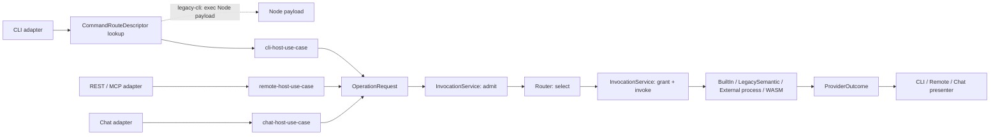

# Host Invocation And Provider Routing Architecture

**Status:** Vision / architecture advisory, not a locked platform law and not an implementation plan.
**Date:** 2026-09-10.
**Revised:** per [architecture-review-260910-1537-host-invocation-provider-routing-design-review.md](../../../plans/reports/architecture-review-260910-1537-host-invocation-provider-routing-design-review.md).
**Source:** Product-owner component-boundary and Node-to-Rust migration discussion.

This is the **kernel contract**: the permanent invocation/routing boundary every fgOS host uses, independent of transport (CLI, remote, chat) and provider mechanism (built-in, legacy Node, external process, WASM). Ecosystem plugin mechanics: [External Provider Protocol](./external-provider-protocol.md). Transitional Node CLI lane: [Legacy CLI Transition](./legacy-cli-transition.md). Both depend on this document. Migration staging and first proof: [Node To Rust Component Migration](./node-to-rust-component-migration.md), [Rust Host And Proof Providers Implementation Plan](./rust-cli-and-proof-components-plan.md).

## 1. Architecture Name

Named **Host Invocation And Provider Routing**; central component the **Operation Provider Router**. `Component Router` is avoided — not every component is a dispatchable provider. `Command Router` is avoided — commands are only a CLI projection of semantic operations.

```txt
host invocation  -> a transport-specific host use case admits/normalizes a request
provider routing -> the Operation Provider Router selects an implementation
```

## 2. Problem And Scope

fgOS has more than one entry surface (local CLI, remote REST/MCP, chat) that may request the same semantic operation but differ in parsing, auth context, streaming, and response projection. Provider choice is a separate dimension — built-in Rust, transitional legacy Node, external process, or WASM. Host transport and provider mechanism must not form a Cartesian product of special paths: one normalized invocation path, one provider router.

## 3. Canonical Names

One name per concept; no alias appears anywhere in this document or its two companions.

| Name | What it is |
|---|---|
| `OperationId` | Stable semantic identifier, independent of CLI/REST/MCP spelling (§5). |
| `HostInvocation` | Host/caller context (identity, deadline, cancellation, tracing) admitted before routing (§5). |
| `OperationRequest` | `OperationId` + `ContractRef` + typed semantic input (§5). |
| `ContractRef` | `{id, version}` that always travels with a request/outcome (§5). |
| `ProviderOutcome` | Typed, `ContractRef`-identified result plus typed error, events, evidence, diagnostics (§5). |
| `ProviderError` | Closed failure family a provider call can terminate with (§7). |
| `OperationProvider` | Trait: `descriptor()` + `invoke(...)` (§6). |
| `ProviderDescriptor` | Identity, component class, mechanism, contract versions, allowed hosts/modes, capabilities, `lifecycle`, replacement, concurrency, health (§5). |
| `OperationDescriptor` | One catalog entry: operation id, owning component, contracts, effect, idempotency, authority policy, allowed hosts, streaming (§5). |
| `OperationCatalog` | Authority-bearing inventory of `OperationDescriptor`s, authored by owning components (§5). |
| `RegistrySnapshot` | Immutable linked provider registry for one invocation (§5, §6). |
| Router | Pure selection function: inputs -> one `ProviderDescriptor` or a refusal (§6). |
| `InvocationService` | Pipeline: admit -> select -> grant -> invoke -> normalize -> record (§6). |
| `InvocationControl` | Deadline, cancellation token, granted capabilities passed to a provider call (§6). |
| `EventSink` | Progress/event/diagnostic sink passed to a provider call (§6). |
| `CommandRouteDescriptor` | Per-CLI-selector `legacy-cli`/`native` record, owned by the CLI adapter — [Legacy CLI Transition](./legacy-cli-transition.md). |
| `ConfigPort` | Port a provider receives resolved configuration/context through; never a second global file read (§5). |

## 4. Peer Host Use Cases

`cli-host-use-case`, `remote-host-use-case`, and `chat-host-use-case` are peers; none wraps, shells out to, or calls through another.



The dashed lookup/direct-exec arrow to "Node payload" is the only non-`OperationRequest`/`ProviderOutcome` path and never touches `InvocationService` or the router — see "Transitional CLI Lane" below.

| Host use case | Owns | Never does |
|---|---|---|
| `cli-host-use-case` | CLI options; verb -> `OperationId`; terminal stdio; `fgos.v1`/exit-code presentation; `CommandRouteDescriptor` lookup. | Own an operation's implementation; define the plugin ABI. |
| `remote-host-use-case` | Remote caller context; REST/MCP method -> `OperationId`; deadlines/disconnect/stream lifecycle; response projection. | Invoke the CLI; parse argv; treat `fgos.v1`/HTTP as an internal API; spawn `bin/fgos.mjs`. |
| `chat-host-use-case` | Chat caller/session context; intent -> `OperationId`; clarification/progress/interruption; response projection. | Invoke the CLI/remote host; parse argv; treat `fgos.v1`/HTTP as an internal API. |

R3's remote peer is the project-local gateway (current herdr, same release) — §10 has the future shared-gateway constraint.

**Shared boundary:** all three projectors build the same `HostInvocation`/`OperationRequest` and call one `InvocationService` — deliberate reuse, not wrapping; presenters stay separate per transport. Peer status does not require one OS process — separate binaries each compose the same host-runtime crate rather than calling another host.

**Transitional CLI lane:** the legacy Node lane lives in the CLI adapter, not the kernel — the kernel has exactly one input/output pair. The CLI adapter looks up `CommandRouteDescriptor[selector]`: `legacy-cli` execs the Node payload directly (argv preserved, inherited stdin/cwd/env, signal forwarding, one invocation record) without building an `OperationRequest`; `native` builds one and calls `InvocationService`. Mechanics: [Legacy CLI Transition](./legacy-cli-transition.md).

## 5. Core Contracts

The name table (§3) says what each type is; this adds the rules it has no room for.

**`OperationId`** — `<component>.<object-type>.<action>[.<variant>]`. `<component>` owns authority; `<object-type>` is singular (`work.item.list` still names `WorkItem`); `<action>` is a small verb set (`create`, `submit`, `show`, `claim`, `approve`, `run`, ...). E.g. `work.item.submit`, `distribution.build.show`. Each host owns its own projection — CLI verbs, REST paths, MCP names, chat intents are not `OperationId`s unless explicitly mapped; REST may keep plural URLs (`GET /work-items` -> `work.item.list`). Not suffixed for a compatible field addition (see versioning below).

**`HostInvocation`** — host kind is an **open string** (`"cli" | "remote" | "chat"`, not a closed enum every future host must exist in R1).

**`OperationRequest`** = `{ operation: OperationId, contract: ContractRef, input: Box<dyn Any + Send> }` — typed per contract; a built-in downcasts `input` directly, never through a decode step.

**No serialization for built-in providers** — the semantic contract is schema + version (`ContractRef`), but in-process representation is typed Rust through `OperationProvider`. `EncodedMessage` (contract id, version, content type, bytes) exists only at the external-process/WASM boundary ([External Provider Protocol](./external-provider-protocol.md)), never as a kernel type. Raw `OsString` argv is never a semantic `OperationRequest` — it stays inside the CLI adapter's transitional lane.

**`ProviderOutcome`** — not a nested `fgos.v1` envelope or HTTP response; the presenter owns public projection; diagnostics travel through the trace/evidence sink, never silently on compatibility stdout/stderr. Human-in-the-loop rule: §8.

**`ProviderDescriptor` / `ConfigPort`** — `lifecycle` is `singleton | per-invocation | pooled`. Invocation mechanism is an **open string** (`"builtin" | "legacy-node" | "external-process" | "wasm"`), not a closed enum. `"legacy-node"` names `LegacySemanticProvider`: a normal `OperationProvider` whose implementation still calls an extracted Node use case, introduced per operation only when a non-CLI host needs it before the native provider exists ([Legacy CLI Transition](./legacy-cli-transition.md) §1) — distinct from the CLI adapter's exec lane, which is not a provider at all. A provider receives resolved config/context through `ConfigPort` and never reads a second global config file itself.

**`OperationDescriptor` / `OperationCatalog`** — authored by owning components, never inferred from CLI commands or provider manifests. Fields: operation id, owning component id, request/outcome contracts, effect (`read | write | external`), idempotency (`none | keyed | safe`), authority policy id, allowed host kinds, streaming mode. The CLI command registry stays authority for CLI help/grammar and maps selectors into catalogued operations; a registry entry alone cannot create an operation. **R1 simplicity:** one native operation (`distribution.build.show`), so `OperationCatalog` is a `const` array and `RegistrySnapshot` is assembled once at the host's composition root (`apps/fgos`) from const tables via a pure `build_snapshot(catalog, providers, fingerprint)` — the kernel crate never depends on a provider crate, and there is no catalog system, linker, cache, or manifest scan in R1 (§10).

**Contract versioning:** request/outcome contracts version independently; linking picks one exact version pair from the host/provider range intersection — no runtime "best effort" coercion. An incompatible change gets a new operation variant or major contract version per the owning component's policy; adapters may perform an explicit registered upgrade/downgrade transform, recorded in diagnostics — the router never reshapes payloads implicitly.

## 6. Router (Pure) And InvocationService (Pipeline)

**Router** — no I/O, no async, no invocation, no failure normalization, no reporting:

```txt
Router: (OperationId, request/outcome contract versions, host kind,
         invocation mode, project policy, RegistrySnapshot)
        -> Result<ProviderDescriptor, SelectionRefused>
```

It reads the `RegistrySnapshot`, matches operation/mode/host/compatible contract versions, applies an explicit binding or named replacement policy, and fails closed on ambiguity or incompatibility. It never parses CLI/HTTP input, admits, grants, holds domain policy, lets a provider reach another by recursively spawning `fgos`, or renders a response.

**`InvocationService`** owns the pipeline and is the only thing that invokes a provider:

```txt
received -> admit -> Router.select -> grant -> invoke(adapter)
         -> normalize transport failure -> record lifecycle
```

`admit`/`grant` are the two authority stages (§7); `invoke` calls the granted `OperationProvider` with deadline/cancellation/trace context; `normalize` maps adapter-specific transport failures onto the closed `ProviderError` families (§8) without changing semantic errors; `record` emits the lifecycle record (§8) and reports which provider/registry fingerprint served the call.

Numeric priority, registration order, and last-writer-wins are not selection policy — a binding names one provider, a replacement names the provider it replaces plus the authorizing policy; otherwise duplicates are ambiguous and linking fails. `RegistrySnapshot` is immutable per invocation: assembled once at the composition root from const tables in R1; from R2 a long-running host may build and atomically publish a new snapshot between invocations, never half-relinked.

```rust
pub trait OperationProvider: Send + Sync {
    fn descriptor(&self) -> &ProviderDescriptor;
    fn invoke<'a>(
        &'a self, invocation: &'a HostInvocation, request: OperationRequest,
        control: InvocationControl, events: &'a dyn EventSink,
    ) -> Pin<Box<dyn Future<Output = Result<ProviderOutcome, ProviderError>> + Send + 'a>>;
}
```

## 7. Authority (Two-Stage)

Core operation/command namespaces are reserved; plugins add vendor-scoped operations (`acme.deploy.release`) and implement published extension points only; `.fgos` writes, Git mutation, process/network/secret access require explicit capability grants; unknown or ambiguous claims fail closed. **Configuration can never replace a built-in provider** — closed as "prohibit," not open. Rollback of a native operation in R1–R2 is a release rollback through `fgctl` (the previous release still ships both the native provider and the Node payload during the observation window), never a runtime provider-selection swap.

The provider manifest is never an authority source:

1. **Caller admission** (before routing): principal, operation, project policy, requested context, host surface.
2. **Selected-provider grant** (after routing): intersects the admitted action with the operation's capability policy and the provider's requested capabilities.

The provider receives only the resulting least-privilege grant via `InvocationControl`, identically for every host — a single pre-selection gate cannot evaluate the selected provider's identity, trust, or capability request.

Selecting a different provider never silently transfers authority — a replacement returns a result or proof; the existing authority owner still applies transitions and writes state, for built-in, legacy, and external providers alike. Work Lifecycle remains the only owner of Work transitions; Run Result Evaluation may compute confidence without choosing the next status; Dispatch may execute an approved assignment without inventing its operation; an external manifest claim never grants `.fgos`, Git, process, network, or secret access.

## 8. Failure, Cancellation, Lifecycle, And Human Input

Closed failure families, common across every invocation mechanism:

- semantic validation, precondition, conflict, not-found;
- caller admission denied, selected-provider capability denied;
- no binding, ambiguous binding, incompatible contract;
- provider unavailable, protocol violation, provider crash;
- deadline exceeded, caller cancelled, completion unknown.

Each host presenter maps these onto its own contract (`fgos.v1`/exit codes, REST/MCP response, chat result); `InvocationService` preserves invocation/provider IDs so projections correlate without scraping output. Transport adapters never turn a provider crash into a semantic failure or infer success from partial output. A remote disconnect cancels through the same invocation context as a CLI interrupt; a crash never authorizes an automatic replay of a non-idempotent operation. The provider port is asynchronous from v1 — deadlines, cancellation, progress, and backpressure are already runtime requirements, so deferring async would change the ABI at the first real remote/process integration.

```txt
received -> admitted | admission-refused
         -> selected | selection-refused
         -> granted | grant-refused
         -> dispatched
         -> succeeded | semantic-failed | cancelled | deadline-exceeded
                       | provider-failed | completion-unknown
```

Exactly one terminal record is emitted; `dispatched` is the point after which a transport loss may be completion-unknown, and a late response after cancellation/deadline is diagnostic evidence, not a second terminal truth. Records carry invocation/parent-correlation ID, contract versions, registry fingerprint, provider ID, host kind, timing, terminal family, evidence references — never secrets or capability material.

For idempotency-keyed operations the key lives in the owning operation contract and is stable across an authorized retry; the router never invents one. Read-only does not imply retry-safe when the provider has external effects — the catalog's declared idempotency decides.

**Human input:** a provider never blocks waiting for a person. It returns a `parked` `ProviderOutcome`; the host or work lifecycle re-invokes later. No provider is ever given a mid-invocation callback to solicit input.

## 9. Physical Placement

The public command name stays `fgos` — runtime identity is the release digest, not the name, and every skill, hook, plugin, and Herdr call already targets `fgos <verb>`. `fgctl` is a separate bootstrap binary, not a renamed `fgos`. Crate names are kebab-case with an `fgos-` prefix; modules are snake_case.

```txt
Cargo.toml                           # workspace root; herdr-plugin/ excluded in R1
apps/
  fgos/                              # crate `fgos`, binary `fgos` — thin CLI adapter
    src/cli_projector.rs             # argv -> OperationRequest
    src/cli_presenter.rs             # ProviderOutcome -> fgos.v1 / exit code
    src/legacy_exec.rs               # CommandRouteDescriptor lookup + Node payload exec
  gateway/                           # later: thin REST/MCP/remote adapter (repo-layout-vision)

packages/
  host-runtime/rust/                 # crate `fgos-host-runtime` — the kernel
    src/contracts.rs                 # OperationId, HostInvocation, OperationRequest, ProviderOutcome, ...
    src/operation_provider_router.rs
    src/invocation_service.rs
    src/authority_gate.rs
    src/providers/builtin.rs
    src/remote_host_use_case.rs      # R3
    src/chat_host_use_case.rs        # later
    src/registry_linker.rs           # R2
    src/providers/{external_process,external_wasm}.rs   # R2+
  distribution/rust/                 # crate `fgos-distribution` — owns distribution.build.show
  component-protocol/{rust,node}/    # R2: EncodedMessage, framed protocol

bin/fgos.mjs, src/, scripts/, core/ ...   # the Node payload, unmoved (Legacy CLI Transition §2)
```

R1 is three crates: `fgos`, `fgos-host-runtime`, `fgos-distribution`. The legacy exec lane is a module inside `apps/fgos`, not a crate, because it is CLI-adapter-local (§4). `component-protocol` waits for R2 (only an external-process adapter needs `EncodedMessage`). Extract further crates only when pressure is real. Neither app owns provider selection; neither host use case imports another; every host feeds the shared authority/router/contracts layer, and provider adapters depend on component protocols, not host presentation. A component is not created merely because one proof verb is convenient (`gate-bypass` stays under its settled authority, not a manufactured `gate-policy` component).

Distribution selects and activates the trusted runtime (`fgctl`: acquire/stage/verify/activate/upgrade/rollback); host invocation routes inside the activated runtime. Local `fgos init` adopts a workspace under the active identity on first use; `fgos doctor --fix` performs every later registered repair. There is no `setup` verb. See [Runtime Identity And Activation](../packaging-distribution/runtime-identity-and-activation.md).

## 10. Release Boundaries

| Release | Required architecture slice | Explicitly not a gate |
|---|---|---|
| R1 — distributable Rust CLI host | Invocation kernel; `const` `OperationCatalog` / `RegistrySnapshot` assembled once at the composition root; two-stage authority; transitional CLI lane in the CLI adapter; native `distribution.build.show`; `fgctl`-driven install/activate/rollback proof. | External ecosystem discovery, WASM, chat, production gateway migration, a `setup` verb. |
| R2 — external process preview | Process protocol, supervision, fixture conformance, static manifest validation; one-shot CLI loads the derived cache by fingerprint, rebuilds only on mismatch; explicit test/dev roots. | Core replacement, signatures/marketplace, WASM. |
| R3 — production remote peer | Remote projector/presenter, native route adoption, per-operation Node semantic bridge only where needed; remote peer is the **project-local gateway** (current herdr, same release) composing the host-runtime crate in-process. | Parsing CLI envelopes as internal API; a future **shared multi-project gateway**, which never links a project runtime in-process and instead reaches it through the out-of-process Project Runtime Adapter ([Future Constraints](../packaging-distribution/future-constraints.md) §2) — itself a `remote-host-use-case` adapter inside the project runtime. |

Chat is a valid future peer but does not gate R1/R2 until a real chat adapter and its admission/interruption/presentation contracts exist. "Ship the Rust host" means a reproducible artifact, target matrix, `fgctl` install/activation coverage, external-project install test, and named rollback channel — passing repository tests alone is a candidate, not a shipped host.

## 11. Open Questions

1. Which fgOS-owned capabilities should ship as packaged extensions rather than core components?
2. What are the exact `OperationId` descriptors and CLI/REST/MCP projections for the first native operations?
3. Which extension points are public in the first ecosystem release?
4. Does a later protocol version add a local socket transport after framed stdio has production evidence?
5. What integrity/signature policy separates local development plugins from distributable ecosystem plugins?

Target matrix, install/upgrade mechanism, and R1 definition are owned by packaging — see [Runtime Identity And Activation](../packaging-distribution/runtime-identity-and-activation.md).

## Related Documents

- [External Provider Protocol](./external-provider-protocol.md)
- [Legacy CLI Transition](./legacy-cli-transition.md)
- [Node To Rust Component Migration](./node-to-rust-component-migration.md)
- [Rust Host And Proof Providers Implementation Plan](./rust-cli-and-proof-components-plan.md)
- [Component Boundary Advisory](../component-boundary/component-boundary-advisory.md)
- [Runtime Identity And Activation](../packaging-distribution/runtime-identity-and-activation.md)
