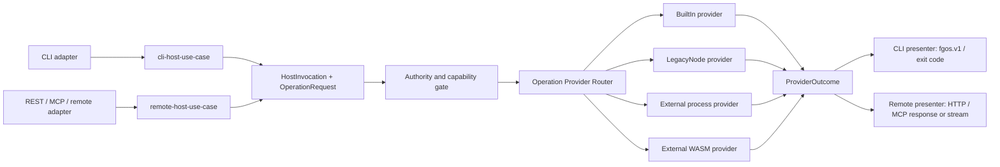

# Host Invocation And Provider Routing Architecture

**Status:** Vision / architecture advisory, not a locked platform law and not
an implementation plan.
**Date:** 2026-09-03.
**Source:** Product-owner component-boundary and Node-to-Rust migration
discussion.

This document defines how every fgOS host surface invokes semantic operations
through one provider-selection boundary. It is independent of whether the host
is a CLI, a remote API, MCP, or another future entry surface, and independent
of whether an operation is implemented by a built-in crate, a legacy process,
or an external plugin.

For the staged replacement of the current Node implementation, read
[Node To Rust Component Migration](./node-to-rust-component-migration.md).
For the first executable proof, read
[Rust CLI And Proof Components Implementation Plan](./rust-cli-and-proof-components-plan.md).

## 1. Architecture Name

The architecture is named **Host Invocation And Provider Routing**. Its central
component is the **Operation Provider Router**.

The more generic name `Component Router` is avoided because not every component
is a dispatchable provider and the router does not own component authority.
`Command Router` is also avoided because commands are only one CLI projection
of semantic operations; remote hosts do not have to expose a command grammar.

The name states the two boundaries precisely:

```txt
host invocation
  -> a transport-specific host use case admits and normalizes a request

provider routing
  -> the Operation Provider Router selects an implementation for its OperationId
```

## 2. Problem And Scope

fgOS has more than one way to enter the system. A local CLI invocation and a
remote REST/MCP invocation differ in parsing, authentication context, streaming,
and response projection, but they may request the same semantic operation.

Provider choice is a separate dimension. The operation may be served by:

- a statically linked built-in Rust component;
- the transitional legacy Node implementation;
- an external process plugin;
- a sandboxed WebAssembly plugin.

Host transport and provider mechanism must not form a Cartesian product of
special paths. There is one normalized invocation path and one provider router.

## 3. Peer Host Use Cases

`cli-host-use-case` and `remote-host-use-case` are peers. Neither wraps, shells
out to, nor calls through the other.



### `cli-host-use-case`

Owns only CLI-host behavior:

- global CLI option handling;
- command/verb projection to an `OperationId`;
- terminal stdin/stdout/stderr context;
- `fgos.v1` presentation and process exit-code mapping;
- CLI-specific compatibility behavior during migration.

It does not own the semantic implementation of an operation and does not define
the external plugin ABI.

### `remote-host-use-case`

Owns only remote-host behavior:

- authenticated remote caller context supplied by the remote adapter;
- REST/MCP method projection to an `OperationId`;
- request deadlines, disconnect cancellation, and stream lifecycle;
- remote response/status/tool-result projection;
- remote-specific rate, session, and connection context where required.

It does not invoke the CLI, parse CLI argv, consume a `fgos.v1` envelope as its
internal API, or spawn `bin/fgos.mjs` to reach semantic behavior.

### Shared Boundary

Both host use cases construct the same transport-neutral `HostInvocation` and
`OperationRequest`, pass through the same authority gate, and call the same
Operation Provider Router. Their presenters remain separate because a CLI
process and a remote protocol have different response contracts.

Logical peer status does not require the CLI and remote gateway to be the same
operating-system process. If deployed as separate binaries, both compose the
same host-runtime crate and provider contracts rather than calling each other.

## 4. Core Contracts

### `OperationId`

A stable semantic identifier, independent of CLI spelling, HTTP path, MCP tool
name, implementation language, and provider kind.

```txt
work.show
work.submit
dispatch.decide
coding.merge.approve
vendor.plugin.operation
```

Each host owns its projection into this identifier. Alias and presentation
changes do not rename the semantic operation accidentally.

### `HostInvocation`

Carries host and caller context needed before authority and routing:

- invocation ID and optional parent/correlation ID;
- host kind (`cli`, `remote`, or a future registered host);
- authenticated principal or local caller identity;
- project/global resolution context;
- deadline, cancellation, and tracing context;
- requested capability context, never an already-granted authority claim.

### `OperationRequest`

Contains an `OperationId`, protocol/schema version, and the typed semantic input
for that operation. It does not contain raw HTTP or MCP objects. Raw argv is
permitted only inside the transitional `LegacyNode` compatibility adapter.

### `ProviderOutcome`

Represents a semantic result, typed error, events/progress stream, evidence, and
provider diagnostics. It is not a nested `fgos.v1` envelope or HTTP response.
The calling host presenter owns the public projection.

### `ProviderDescriptor`

Declares provider identity, kind, supported operation/schema versions,
capabilities, lifecycle, priority/replacement policy, and health metadata. A
descriptor is a claim considered by the registry; it is not self-granted
authority.

## 5. Operation Provider Router

The router maps one admitted semantic operation to one selected provider:

```txt
(OperationId, schema version, invocation context)
  -> ProviderDescriptor
  -> ProviderAdapter
  -> ProviderOutcome
```

Its responsibilities are deliberately narrow:

1. Read the already-linked provider registry.
2. Match the exact operation and compatible schema/protocol version.
3. Apply explicit precedence/replacement policy.
4. Reject ambiguity or incompatibility fail closed.
5. Invoke the selected adapter with deadline, cancellation, and trace context.
6. Normalize provider transport failures without changing semantic errors.
7. Report which provider served the operation.

The router does not:

- parse CLI flags or HTTP payloads;
- grant authority requested by a provider;
- contain domain or lifecycle policy;
- allow one provider to reach another by recursively spawning `fgos`;
- decide how a host renders the final response.

Cross-component calls return through typed ports or the router as defined by
the owning component contract. They do not route through a CLI subprocess.

## 6. Provider Kinds

Conceptually, a Rust host can compose providers behind one adapter contract:

```rust
enum Provider {
    BuiltIn(Arc<dyn OperationProvider>),
    LegacyNode(LegacyNodeClient),
    ExternalProcess(ProcessRpcClient),
    ExternalWasm(WasmComponent),
}
```

This enum is an illustrative host implementation detail, not the public ABI.

### Built-In

A trusted Rust crate statically linked into the host binary and called through
a typed trait. This is the normal provider kind for foundation components. It
has no serialization or cross-process cost, but still obeys the owning port and
authority boundary.

### Legacy Node

A transitional provider for built-in operations not yet migrated from Node.
Provider selection stays at whole-verb or whole-use-case granularity so one
write transaction is not divided accidentally across runtimes. This provider
disappears when migration completes; it is not an ecosystem extension ABI.

### External Process

An independently installed, language-neutral plugin reached through persistent
framed RPC. It fits extensions needing filesystem, Git, network, subprocess, or
other operating-system capabilities. Crash/restart and resource isolation are
part of the adapter contract.

### External WebAssembly

A sandboxed plugin reached through a typed component interface such as WIT. It
fits pure or tightly capability-scoped extensions. Required host functions are
explicit capabilities, not ambient access.

Native Rust dynamic libraries are not the default external provider kind. Rust
does not promise a stable Rust ABI, and in-process third-party native code loses
the crash and memory isolation supplied by process or WASM boundaries.

## 7. Component Protocol

The semantic component protocol is versioned independently from public host
protocols. A name such as `fgos.component.v1` distinguishes it from CLI
`fgos.v1` and any remote API version.

It carries:

- operation identity and protocol/schema version range;
- request ID and optional parent/correlation ID;
- typed request, result, and error payloads;
- deadline, cancellation, progress, and events where supported;
- capability context granted by the host;
- provider identity and diagnostics needed for tracing.

For process plugins, JSON-RPC 2.0 semantics over length-prefixed or otherwise
unambiguous framed stdio are a practical first transport. Stdout is protocol
only and logs go to stderr. Persistent connections define concurrency,
backpressure, timeout, cancellation, and crash-recovery rules.

The semantic contract remains transport-neutral. A future binary codec or
local socket transport may replace framing without renaming the operation.

## 8. Plugin Registry Linker

External discovery is data-first. The host scans a static manifest and never
executes unknown provider code merely to discover what it claims.

A `component.yaml` plugin manifest declares at least:

- plugin ID, version, publisher, and component protocol range;
- provided `OperationId` values or named extension points;
- request/result schema references;
- provider kind and executable/module location;
- requested host capabilities;
- platform compatibility and integrity metadata;
- health and post-selection `describe` operations.

The registry linker:

1. Scans configured global and project plugin locations.
2. Parses and validates manifests without running the provider.
3. Verifies compatibility, provider presence, and integrity policy.
4. Resolves IDs, namespace claims, precedence, and explicit replacements.
5. Emits a deterministic derived lock/cache for help, introspection, dispatch,
   setup, and doctor.
6. Starts a selected provider and uses `describe` only to confirm it matches
   the accepted manifest.

This is a compiler only in the linking/validation sense. It does not compile
plugin source or the `fgos` host binary.

Project configuration overrides global configuration, but duplicate operation
claims do not silently use last-writer-wins. Ambiguity fails closed unless an
explicit replacement policy selects one provider.

## 9. Namespace And Authority

The safe ecosystem default is:

- core operation and command namespaces are reserved;
- plugins add vendor-scoped operations, for example `acme.deploy.release`;
- plugins may implement extension points explicitly published by a built-in
  component;
- `.fgos` writes, Git mutation, process execution, network, secrets, and host
  callbacks require explicit capability grants;
- unknown capability requests and ambiguous claims fail closed.

The provider manifest is never an authority source. The common host authority
gate evaluates the caller, operation, project policy, and selected provider
before invocation. This rule is identical for CLI and remote hosts.

Whether explicit configuration may replace a built-in provider remains open.
The current recommendation is to prohibit it by default and require a named
replacement plus an explicit authority grant when enabled.

## 10. Failure, Cancellation, And Observability

Every provider kind must converge on the same semantic failure categories even
though its transport failures differ:

- semantic validation/precondition/conflict/not-found errors;
- provider unavailable or incompatible;
- deadline exceeded or caller cancellation;
- provider crash/protocol violation;
- capability or authority refusal.

The `cli-host-use-case` maps these to `fgos.v1`, stderr, and exit codes. The
`remote-host-use-case` maps them to the owning REST/MCP response contract. The
router preserves invocation/provider IDs so logs and evidence can correlate the
two projections without scraping output.

A remote disconnect must cancel through the same invocation context used by a
CLI interrupt. A provider crash never authorizes the router to replay a
non-idempotent operation automatically unless the operation contract explicitly
permits it.

## 11. Physical Placement

The intended layout keeps host surfaces thin and puts shared routing behavior
in one package. `cli-host-use-case` and `remote-host-use-case` are visibly peer
modules:

```txt
apps/
  fgos/                              # thin CLI adapter/binary
  gateway/                           # thin REST/MCP/remote adapter

packages/
  host-runtime/
    contracts/
      host-invocation.*
      operation-request.*
      provider-outcome.*
    rust/
      src/
        cli_host_use_case.rs
        remote_host_use_case.rs
        operation_provider_router.rs
        authority_gate.rs
        registry_linker.rs
        providers/
          builtin.rs
          legacy_node.rs
          external_process.rs
          external_wasm.rs
  component-protocol/
    rust/
    node/
```

The exact crate split may wait until implementation pressure justifies it, but
the dependency direction does not:

```txt
CLI adapter ----> cli-host-use-case ------+
                                          +--> shared authority/router/contracts
Remote adapter -> remote-host-use-case ---+
```

Neither app owns provider selection. Neither host use case imports the other.
Provider adapters depend on component protocols, not public host presentation.

External runtime installation locations are distribution concerns, not source
layout. Every new location, cache, executable expectation, config default, or
runtime dependency registers with `fgos setup` and `fgos doctor` and respects
project-over-global configuration.

## 12. Open Questions

1. May explicit configuration replace a built-in provider, or may plugins only
   add vendor operations and implement published extension points?
2. What is the exact `OperationId`/namespace grammar and its CLI, REST, and MCP
   projections?
3. Which extension points are public in the first ecosystem release?
4. Is framed stdio the only version-one process transport, or is a Unix socket
   also part of the initial compatibility promise?
5. What integrity/signature policy separates local development plugins from
   distributable ecosystem plugins?
