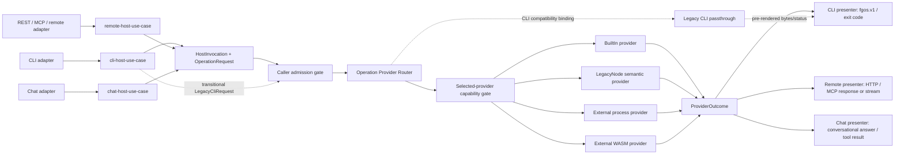

# Host Invocation And Provider Routing Architecture

**Status:** Vision / architecture advisory, not a locked platform law and not
an implementation plan.
**Date:** 2026-09-03.
**Source:** Product-owner component-boundary and Node-to-Rust migration
discussion.

This document defines how every fgOS host surface invokes semantic operations
through one provider-selection boundary. It is independent of whether the host
is a CLI, a remote API, MCP, or another future entry surface, and independent
of whether an operation is implemented by a built-in crate, a legacy process,
or an external plugin.

For the staged replacement of the current Node implementation, read
[Node To Rust Component Migration](./node-to-rust-component-migration.md).
For the first executable proof, read
[Rust Host And Proof Providers Implementation Plan](./rust-cli-and-proof-components-plan.md).

## 1. Architecture Name

The architecture is named **Host Invocation And Provider Routing**. Its central
component is the **Operation Provider Router**.

The more generic name `Component Router` is avoided because not every component
is a dispatchable provider and the router does not own component authority.
`Command Router` is also avoided because commands are only one CLI projection
of semantic operations; remote hosts do not have to expose a command grammar.

The name states the two boundaries precisely:

```txt
host invocation
  -> a transport-specific host use case admits and normalizes a request

provider routing
  -> the Operation Provider Router selects an implementation for its OperationId
```

## 2. Problem And Scope

fgOS has more than one way to enter the system. A local CLI invocation and a
remote REST/MCP invocation differ in parsing, authentication context, streaming,
and response projection, but they may request the same semantic operation.

Provider choice is a separate dimension. The operation may be served by:

- a statically linked built-in Rust component;
- the transitional legacy Node implementation;
- an external process plugin;
- a sandboxed WebAssembly plugin.

Host transport and provider mechanism must not form a Cartesian product of
special paths. There is one normalized invocation path and one provider router.

## 3. Peer Host Use Cases

`cli-host-use-case`, `remote-host-use-case`, and `chat-host-use-case` are peers.
None wraps, shells out to, nor calls through another.



### `cli-host-use-case`

Owns only CLI-host behavior:

- global CLI option handling;
- command/verb projection to an `OperationId`;
- terminal stdin/stdout/stderr context;
- `fgos.v1` presentation and process exit-code mapping;
- CLI-specific compatibility behavior during migration.

It does not own the semantic implementation of an operation and does not define
the external plugin ABI.

### `remote-host-use-case`

Owns only remote-host behavior:

- authenticated remote caller context supplied by the remote adapter;
- REST/MCP method projection to an `OperationId`;
- request deadlines, disconnect cancellation, and stream lifecycle;
- remote response/status/tool-result projection;
- remote-specific rate, session, and connection context where required.

It does not invoke the CLI, parse CLI argv, consume a `fgos.v1` envelope as its
internal API, or spawn `bin/fgos.mjs` to reach semantic behavior.

### `chat-host-use-case`

Owns only chat-host behavior:

- conversational caller/session context supplied by the chat adapter;
- natural-language or structured chat intent projection to an `OperationId`;
- chat-visible clarification, progress, and interruption lifecycle;
- chat response/tool-result projection;
- chat-specific transcript, attachment, and turn context where required.

It does not invoke the CLI or remote host, parse CLI argv, consume a `fgos.v1`
envelope or HTTP response as its internal API, or spawn another host to reach
semantic behavior.

### Shared Boundary

All host projectors construct the same transport-neutral `HostInvocation` and
`OperationRequest`, then call one shared invocation service. The invocation
service owns caller admission, provider selection, selected-provider capability
grant, invocation, cancellation, and tracing. Host presenters remain separate
because a CLI process, remote protocol, and chat turn have different response
contracts.

This is deliberate reuse, not one host wrapping another and not three copies of
the orchestration pipeline:

```txt
CLI adapter    -> CLI projector ----+
Remote adapter -> remote projector -+-> InvocationService -> provider router
Chat adapter   -> chat projector ---+

ProviderOutcome -> CLI | remote | chat presenter
```

Logical peer status does not require the CLI, remote gateway, and chat host to
be the same operating-system process. If deployed as separate binaries or
services, each composes the same host-runtime crate and provider contracts
rather than calling another host.

## 4. Core Contracts

### `OperationId`

A stable semantic identifier, independent of CLI spelling, HTTP path, MCP tool
name, implementation language, and invocation mechanism.

`OperationId` is globally namespaced and authority-bearing:

```txt
<component>.<object-type>.<action>[.<variant>]
```

`<component>` names the component or bounded context that owns the operation's
decision and authority. `<object-type>` is a singular model/type name owned by
that component, not a specific object instance and not a plural REST collection
name. Plurality belongs in the action or result shape: `work.item.list` may
return many work items, but `item` still names the `WorkItem` object type.
`<action>` is a small verb vocabulary such as `create`, `submit`, `show`,
`list`, `update`, `move`, `claim`, `release`, `ask`, `answer`, `approve`,
`reject`, `review`, `sync`, `repair`, `check`, `start`, `stop`, or `run`.
`<variant>` is optional and only distinguishes a real semantic variant of the
same action.

```txt
work.item.show
work.item.submit
work.claim.acquire
coding.proposal.approve
coordination.session.run
dispatch.plan.decide
evidence.run-result.evaluate
knowledge.doc.index
distribution.health.check
vendor.plugin.operation
```

Each host owns its projection into this identifier. CLI verbs, slash-command
names, REST paths, MCP tool names, chat intents, FlowDefinition local
operation ids, task-spec ids, and provider implementation names are not
`OperationId`s unless they are explicitly mapped to this grammar. Alias and
presentation changes do not rename the semantic operation accidentally.

REST APIs may still use plural URL resources where that is natural:
`GET /work-items` can project to `work.item.list`, and
`POST /work-items` can project to `work.item.create`.

### `HostInvocation`

Carries host and caller context needed before authority and routing:

- invocation ID and optional parent/correlation ID;
- host kind (`cli`, `remote`, or a future registered host);
- authenticated principal or local caller identity;
- project/global resolution context;
- deadline, cancellation, and tracing context;
- requested capability context, never an already-granted authority claim.

### `OperationRequest`

Contains an `OperationId`, protocol/schema version, and the typed semantic input
for that operation. It does not contain raw HTTP or MCP objects.

The router boundary is type-erased but not schema-free. It carries encoded bytes
with an explicit contract identity, version, and content type. Each built-in
component decodes those bytes into its own request type before entering the
component use case. A naked generic JSON value is not the semantic contract.

```rust
pub struct EncodedMessage {
    pub contract_id: ContractId,
    pub version: ContractVersion,
    pub content_type: ContentType,
    pub bytes: Bytes,
}

pub struct OperationRequest {
    pub operation: OperationKey,
    pub input: EncodedMessage,
}
```

Raw `OsString` argv is permitted only in the transitional CLI-compatibility
request described under Legacy Node. It is never accepted as a semantic
`OperationRequest` and can never be invoked by remote or chat hosts.

### `ProviderOutcome`

Represents an encoded, schema-identified semantic result plus typed error,
events/progress, evidence, and provider diagnostics. It is not a nested
`fgos.v1` envelope or HTTP response. The calling host presenter owns the public
projection. Provider diagnostics travel through the trace/evidence sink or an
explicit diagnostics surface; they never appear silently on compatibility
stdout or stderr.

### `ProviderDescriptor`

Declares provider identity, component class, invocation mechanism, supported
operation and request/outcome contract versions, allowed host/invocation modes,
requested capabilities, lifecycle, replacement declaration, concurrency, and
health metadata. A descriptor is a claim considered by the registry; it is not
self-granted authority.

### `OperationDescriptor` And `OperationCatalog`

Semantic operations are authored by their owning components, not inferred from
CLI commands or provider manifests. The catalog entry contains at least:

```txt
OperationDescriptor {
  operationId
  componentId
  requestContract
  outcomeContract
  effect: read | write | external
  idempotency: none | keyed | safe
  authorityPolicyId
  allowedHostKinds
  streamingMode
}
```

The `OperationCatalog` is the authority-bearing inventory of these descriptors.
The CLI command registry remains the authority for CLI help/grammar and maps
command selectors into catalogued operations. A new command therefore needs an
explicit projection, but a CLI registry entry cannot create a semantic
operation or assign component authority by itself.

`OperationId` names semantics; it is not suffixed merely because a JSON field
was added compatibly. Request and outcome contracts version independently under
the component protocol. Linking chooses one exact request version and one exact
outcome version from the intersection of host and provider ranges; runtime
“best effort” coercion is forbidden. An incompatible semantic change receives a
new operation variant or a new major contract version according to the owning
component's compatibility policy. Adapters may perform an explicit registered
upgrade/downgrade transform, and diagnostics record that transform; the router
does not reshape payloads implicitly.

## 5. Operation Provider Router

The router maps one admitted semantic operation to one selected provider from
an immutable linked registry snapshot:

```txt
(OperationId, request/outcome contract versions, host kind,
 invocation mode, project policy, registry snapshot)
  -> ProviderDescriptor
  -> ProviderAdapter
  -> ProviderOutcome
```

Its responsibilities are deliberately narrow:

1. Read the already-linked provider registry.
2. Match the exact operation, invocation mode, allowed host, and compatible
   request/outcome contract versions.
3. Apply an explicit binding or named replacement policy.
4. Reject ambiguity or incompatibility fail closed.
5. Return the selected descriptor to the capability-grant gate.
6. Invoke the granted adapter with deadline, cancellation, and trace context.
7. Normalize provider transport failures without changing semantic errors.
8. Report which provider and registry fingerprint served the operation.

The router does not:

- parse CLI flags or HTTP payloads;
- perform caller admission or grant capabilities requested by a provider;
- contain domain or lifecycle policy;
- allow one provider to reach another by recursively spawning `fgos`;
- decide how a host renders the final response.

Cross-component calls return through typed ports or the router as defined by
the owning component contract. They do not route through a CLI subprocess.

Numeric priority, registration order, directory scan order, and silent
last-writer-wins are not selection policy. A binding names one provider; a
replacement names the provider it replaces and the policy that authorizes the
replacement. Otherwise duplicates are ambiguous and linking fails.

The linked registry snapshot is immutable for one invocation. A long-running
host may build and atomically publish a new snapshot between invocations, but an
in-flight request never observes a half-relinked registry.

During migration the same selection boundary also accepts a typed
`LegacyCliRequest` after local CLI admission. Its selector resolves only a
CLI-compatibility binding and returns a `PreRenderedCliResult`; it does not
claim that raw argv is a semantic operation or that pre-rendered bytes are a
`ProviderOutcome`. This temporary lane keeps provider choice centralized
without weakening the permanent semantic contract.

## 6. Component Classes

Invocation mechanism describes how an implementation is invoked. It does not
describe the product nature, release ownership, or authority posture of the
component being invoked. Those are a separate axis: the **component class**.

```txt
component class
  -> who owns/releases/configures the component

invocation mechanism
  -> how the selected provider is invoked at runtime
```

A provider descriptor therefore declares both:

- component class: core, packaged extension, or user plugin;
- invocation mechanism: built-in, legacy node, external process, or external
  WASM.

### Core Component

A core component is required for a useful fgOS release. It is owned by fgOS,
released atomically with the host, and normally statically linked into the host
binary once migrated.

Core components are not optional feature packs and are not replaceable by
default. They may still expose extension points, but a plugin that implements
one of those extension points does not become the authority owner of the core
component.

Examples include Work Lifecycle, Host Invocation, authority gating, provider
routing, DispatchPlan selection, Assignment/Run/RunResult contracts, setup and
doctor health, and the minimum domain/runtime contracts needed for fgOS to
operate.

### Packaged Extension

A packaged extension is owned and shipped by fgOS, but is not required for the
minimum release to be useful. It may be enabled, disabled, or omitted by
configuration, edition, install profile, or environment.

It follows fgOS release discipline, compatibility policy, setup/doctor
registration, documentation, and tests. Because fgOS delivers it, it can be
trusted more than a user plugin, but its optionality must be explicit: disabling
it must not corrupt core state or make the core host unable to boot.

Examples may include optional domain packages, optional coordination protocol
packs, optional Herdr/dashboard surfaces, or optional integrations that fgOS
chooses to distribute as part of its own product.

### User Plugin

A user plugin is supplied, installed, upgraded, and removed outside the fgOS
release train. It cannot be assumed present when fgOS ships and cannot be
compiled into the host as part of the fgOS release.

It is discovered from manifests, linked into the derived provider registry, and
granted only explicit capabilities. It may add vendor-scoped operations or
implement extension points published by core or packaged-extension components.
It does not own core namespaces, built-in authority, setup invariants, or
ambient access merely because its manifest claims support for an operation.

### Orthogonality

The two axes are deliberately independent:

| Component class | Common invocation mechanism | Notes |
|---|---|---|
| Core component | Built-in after migration; LegacyNode during transition | Required, fgOS-owned, atomically released. |
| Packaged extension | Built-in, ExternalProcess, or ExternalWasm | fgOS-owned but optional; install/setup/doctor aware. |
| User plugin | ExternalProcess or ExternalWasm | User-owned, independently installed; manifest-linked and capability-gated. |

This classification prevents two common mistakes:

1. Treating every statically linked implementation as architecturally core.
2. Treating every out-of-process implementation as a user plugin.

Packaging and authority follow component class. Runtime calling details follow
invocation mechanism.

## 7. Invocation Mechanisms

Conceptually, a Rust host can compose providers behind one adapter contract:

```rust
enum Provider {
    BuiltIn(Arc<dyn OperationProvider>),
    LegacyNodeSemantic(LegacyNodeSemanticClient),
    ExternalProcess(ProcessRpcClient),
    ExternalWasm(WasmComponent),
}
```

This enum covers semantic providers and is an illustrative host implementation
detail, not the public ABI. The CLI-only legacy passthrough is a typed
compatibility binding adjacent to this semantic adapter set; it cannot be
selected for remote/chat semantic calls.

### Built-In

A trusted Rust crate statically linked into the host binary and called through
a typed trait. This is the normal invocation mechanism for core components, and
may also serve packaged extensions that fgOS chooses to compile in. It has no
serialization or cross-process cost, but still obeys the owning port and
authority boundary.

### Legacy Node

Transitional adapters for operations not yet migrated from Node. Semantic Node
bridges and CLI passthrough are distinct as specified in §13. Provider selection
stays at whole-use-case granularity so one write transaction is not divided
accidentally across runtimes. Both adapters disappear when migration completes;
neither is an ecosystem extension ABI.

### External Process

An independently installed, language-neutral plugin reached through persistent
framed RPC. It fits extensions needing filesystem, Git, network, subprocess, or
other operating-system capabilities. Crash/restart and resource isolation are
part of the adapter contract.

### External WebAssembly

A sandboxed plugin reached through a typed component interface such as WIT. It
fits pure or tightly capability-scoped extensions. Required host functions are
explicit capabilities, not ambient access.

Native Rust dynamic libraries are not the default external invocation
mechanism. Rust does not promise a stable Rust ABI, and in-process third-party
native code loses the crash and memory isolation supplied by process or WASM
boundaries.

## 8. Component Protocol

The semantic component protocol is versioned independently from public host
protocols. A name such as `fgos.component.v1` distinguishes it from CLI
`fgos.v1` and any remote API version.

It carries:

- operation identity and protocol/schema version range;
- request ID and optional parent/correlation ID;
- typed request, result, and error payloads;
- deadline, cancellation, progress, and events where supported;
- capability context granted by the host;
- provider identity and diagnostics needed for tracing.

For process plugins, version one uses JSON-RPC 2.0 semantics over 4-byte
big-endian length-prefixed UTF-8 JSON frames on stdio. Newline-delimited JSON is
not the contract: a length prefix gives one enforceable maximum-frame boundary
and does not make embedded or future formatted content ambiguous. Stdout is
protocol only and logs go to stderr or a declared log notification.

The host starts a process only after static manifest selection. Its first
exchange confirms the provider identity, accepted manifest digest, component
protocol range, supported operation/contract pairs, and concurrency limit.
Discovery never depends on this handshake. A mismatch terminates the provider
and fails closed.

One connection obeys these lifecycle rules:

- request IDs are unique per connection;
- responses may complete out of order only when concurrency greater than one
  was negotiated;
- requests, frames, and event queues are bounded to provide backpressure;
- cancellation sends a protocol notification, waits a bounded grace period,
  then terminates the provider process if necessary;
- cancellation acknowledgement does not claim that semantic side effects were
  rolled back;
- a crash after dispatch yields completion-unknown unless the operation's
  idempotency contract and key explicitly permit retry;
- a one-shot CLI may own one process for its lifetime, while a gateway may pool
  or persist connections under the adapter's health/restart policy.

The semantic contract remains transport-neutral. A future binary codec or
local socket transport may replace framing without renaming the operation.

## 9. Plugin Registry Linker

External discovery is data-first. The host scans a static manifest and never
executes unknown provider code merely to discover what it claims.

A `manifest.yaml` provider declaration declares at least:

- plugin ID, version, publisher, and component protocol range;
- provided `OperationId` values or named extension points;
- request/result schema references;
- invocation mechanism and executable/module location;
- requested host capabilities;
- platform compatibility and integrity metadata;
- health and post-selection `describe` operations.

`manifest.yaml` is the one canonical filename for authored, static provider
declarations. The `kind` field distinguishes the declaration shape, for
example `fgos.component`, `fgos.plugin`, or `fgos.domain`; every kind shares
the common `manifestVersion`, `id`, `version`, `provides`, `requires`, and
`capabilities` fields before its kind-specific fields are validated.

The word **registry** is reserved for the host's derived runtime index (and
its lock/cache), not for another authored file. Discovery scans
`manifest.yaml`, validates by `kind`, then links accepted claims into the
provider registry.

The registry linker:

1. Scans configured global and project plugin locations.
2. Parses and validates manifests without running the provider.
3. Verifies compatibility, provider presence, and integrity policy.
4. Resolves IDs, namespace claims, precedence, and explicit replacements.
5. Emits a deterministic derived lock/cache for help, introspection, dispatch,
   setup, and doctor.
6. Starts a selected provider and uses `describe` only to confirm it matches
   the accepted manifest.

Its complete input/output physics are:

```txt
authored OperationCatalog
+ built-in provider descriptors
+ transitional CLI-compatibility bindings
+ validated external manifest declarations
+ explicit global/project enable-disable-replacement policy
  -> immutable RegistrySnapshot + source fingerprint
```

Authored catalogs, manifests, and policy are durable inputs. The linked registry
lock/cache is rebuildable derived state. It records the host version and source
fingerprint, is replaced atomically, and is ignored/rebuilt when stale or
corrupt. A cache never outranks its authored sources.

This is a compiler only in the linking/validation sense. It does not compile
plugin source or the `fgos` host binary.

Project configuration overrides global configuration values, but duplicate
operation claims do not silently use last-writer-wins. Override precedence is
not authority precedence. Ambiguity fails closed unless an explicit replacement
policy names both the selected provider and the provider being replaced.

## 10. Namespace And Authority

The safe ecosystem default is:

- core operation and command namespaces are reserved;
- plugins add vendor-scoped operations, for example `acme.deploy.release`;
- plugins may implement extension points explicitly published by a built-in
  component;
- `.fgos` writes, Git mutation, process execution, network, secrets, and host
  callbacks require explicit capability grants;
- unknown capability requests and ambiguous claims fail closed.

The provider manifest is never an authority source. Authorization has two
ordered decisions:

1. **Caller admission**, before routing, evaluates principal, operation,
   project policy, requested context, and host surface.
2. **Selected-provider grant**, after routing, intersects the admitted action
   with the operation's capability policy and the selected provider's requested
   capabilities.

The provider receives only the resulting least-privilege grant. This rule is
identical for CLI and remote hosts. A single gate drawn before provider
selection is insufficient because it cannot evaluate the selected provider's
identity, trust class, or capability request.

Whether explicit configuration may replace a built-in provider remains open.
The current recommendation is to prohibit it by default and require a named
replacement plus an explicit authority grant when enabled.

## 11. Failure, Cancellation, And Observability

Every invocation mechanism must converge on the same semantic failure
categories even though its transport failures differ:

- semantic validation/precondition/conflict/not-found errors;
- provider unavailable or incompatible;
- deadline exceeded or caller cancellation;
- provider crash/protocol violation;
- capability or authority refusal.

The `cli-host-use-case` maps these to `fgos.v1`, stderr, and exit codes. The
`remote-host-use-case` maps them to the owning REST/MCP response contract. The
router preserves invocation/provider IDs so logs and evidence can correlate the
two projections without scraping output.

A remote disconnect must cancel through the same invocation context used by a
CLI interrupt. A provider crash never authorizes the router to replay a
non-idempotent operation automatically unless the operation contract explicitly
permits it.

The provider port is asynchronous from its first version. Although the first
CLI built-in can complete synchronously, deadlines, Ctrl-C/remote disconnect,
progress, persistent process supervision, and backpressure are already runtime
requirements. Deferring async would change the central provider ABI during the
first real remote or process integration.

An implementation may use an object-safe boxed future and an event sink rather
than coupling every provider to one stream library:

```rust
pub trait OperationProvider: Send + Sync {
    fn descriptor(&self) -> &ProviderDescriptor;

    fn invoke<'a>(
        &'a self,
        call: ProviderCall,
        control: InvocationControl,
        events: &'a dyn EventSink,
    ) -> Pin<Box<dyn Future<Output = Result<ProviderResponse, ProviderError>>
                  + Send + 'a>>;
}
```

The closed failure families are:

- semantic validation, precondition, conflict, and not-found;
- caller admission denied and selected-provider capability denied;
- no binding, ambiguous binding, and incompatible contract;
- provider unavailable, protocol violation, and provider crash;
- deadline exceeded, caller cancelled, and completion unknown.

Host presenters own the mapping from these families into CLI exit codes,
HTTP/MCP responses, or chat results. Transport adapters do not turn a provider
crash into a semantic failure and do not infer success from partial output.

Each invocation records a monotonic lifecycle for evidence and recovery:

```txt
received
  -> admitted | admission-refused
  -> selected | selection-refused
  -> granted | grant-refused
  -> dispatched
  -> succeeded | semantic-failed | cancelled | deadline-exceeded
               | provider-failed | completion-unknown
```

Exactly one terminal record is emitted. `dispatched` is the point after which a
transport loss may be completion-unknown. A late provider response after the
host has recorded cancellation or deadline termination is diagnostic evidence,
not a second terminal truth. Invocation records carry invocation ID, parent
correlation ID, operation/contract versions, registry fingerprint, provider ID,
host kind, timing, terminal family, and evidence references, but never secrets
or unrestricted capability material.

For idempotency-keyed operations, the key is part of the owning operation
contract and is stable across an explicitly authorized retry. The router never
invents a key. Read-only does not automatically mean retry-safe when the provider
can perform external effects; the catalog's declared idempotency is decisive.

## 12. Physical Placement

The intended layout keeps host surfaces thin and puts shared routing behavior
in one package. `cli-host-use-case` and `remote-host-use-case` are visibly peer
modules:

```txt
apps/
  fgos/                              # thin CLI adapter/binary
  gateway/                           # thin REST/MCP/remote adapter

packages/
  host-runtime/
    contracts/
      host-invocation.*
      operation-request.*
      provider-outcome.*
    rust/
      src/
        cli_host_use_case.rs
        remote_host_use_case.rs
        chat_host_use_case.rs
        operation_provider_router.rs
        authority_gate.rs
        registry_linker.rs
        providers/
          builtin.rs
          legacy_node.rs
          external_process.rs
          external_wasm.rs
  legacy-node/
    rust/                            # transitional CLI compatibility adapter
  component-protocol/
    rust/
    node/
```

The exact crate split may wait until implementation pressure justifies it, but
the dependency direction does not:

```txt
CLI adapter ----> cli-host-use-case ----+
                                        +--> shared authority/router/contracts
Remote adapter -> remote-host-use-case -+
Chat adapter ---> chat-host-use-case ---+
```

Neither app owns provider selection. Neither host use case imports the other.
The shared invocation service owns the common admission-selection-grant-invoke
sequence. Provider adapters depend on component protocols, not public host
presentation.

This layout expresses dependency direction, not a requirement to maximize the
crate count on day one. A provider adapter starts as a module when it has no
independent dependency or release reason and is extracted only when pressure is
real. Conversely, a component is not created merely because one convenient
proof verb exists; `gate-bypass`, for example, must remain under its settled
component authority rather than manufacturing a `gate-policy` component for the
migration.

External runtime installation locations are distribution concerns, not source
layout. Every new location, cache, executable expectation, config default, or
runtime dependency registers with `fgos setup` and `fgos doctor` and respects
project-over-global configuration.

## 13. Technical Consequences And Tradeoffs

### Same-Process Built-Ins Versus Runtime Extensions

The router presents one semantic interface but does not force one deployment
mechanism onto every provider.

A built-in Rust provider is compiled into the host and called through a typed
trait. This is the fastest path: there is no serialization, process startup,
context switch, or runtime ABI. Static linking is appropriate because host and
foundation component are released atomically.

An external extension is installed and versioned independently, so it pays a
runtime boundary in exchange for language neutrality, failure isolation, and
no-recompile installation. A persistent process is the baseline for plugins
that need normal operating-system capabilities; WASM is the stronger sandbox
for pure or capability-scoped extensions.

The architecture deliberately does not promise both hot replacement and direct
function-call performance for the same provider. Component class decides
release ownership and authority posture; invocation mechanism decides the
runtime calling path behind the semantic port.

### Cross-Process Cost

Cold process startup is materially more expensive than communication with an
already running provider. Startup includes runtime initialization, imports,
configuration, and protocol negotiation. It is acceptable for a coarse,
infrequent operation but not for thousands of helper-sized calls.

A persistent stdio connection or local socket removes repeated startup cost.
Even then, serialization, scheduling, and backpressure remain. Ports therefore
expose complete use-case operations and batch hot loops behind one request.

For a normal one-shot CLI invocation, keeping a Node or plugin process alive
beyond the host lifetime adds daemon lifecycle without necessarily saving work.
Persistence is justified for the remote host, interactive sessions, or a single
invocation that performs repeated provider calls.

### Legacy Node Compatibility And Semantic Modes

Node transition requires two adapters with different contracts. Treating them
as one provider creates the false impression that captured CLI output is a
semantic result.

1. **`LegacyCliPassthroughProvider`:** receives preserved `OsString` argv,
   inherited stdin, cwd/environment and signal context; returns pre-rendered
   stdout/stderr bytes plus process exit/signal termination. It is allowed only
   for the CLI host and does not return `ProviderOutcome`.
2. **`LegacySemanticProvider`:** receives and returns real versioned semantic
   contracts. Its Node bridge calls an extracted Node use case directly, not
   `bin/fgos.mjs` and not an envelope parser. It can serve any admitted host and
   is introduced per operation only when a non-CLI host needs Node behavior
   before the native provider exists.

Capturing stdout/stderr in a supervised child improves CLI cancellation and
tracing but remains passthrough presentation. It never becomes the bridge used
by a remote host.

Both adapters delegate a complete use case. A host must not split one state
transaction between native and legacy providers unless a component contract
already defines locking, atomicity, recovery, and authority at that boundary.

The adapters resolve the legacy payload relative to the installed host, never
from the caller's cwd, and invoke the Node entry/bridge directly rather than
spawning `fgos` recursively. The CLI parent forwards termination consistently;
Unix signal equivalence and Windows process-tree behavior are explicit
target-specific compatibility tests, not an undocumented `exit.code()` guess.

### Legacy Payload Identity, Ownership, And Repair Path

`bin/fgos.mjs` is the current public Node entry, not a durable name for the
implementation that Rust delegates to. Before the R1 public-entry cutover, the
existing Node CLI program moves to this canonical source location:

```txt
packages/legacy-node/node/fgos.mjs
```

The release builder copies that program and only its declared Node runtime
dependencies to this private installed payload location:

```txt
<install-root>/libexec/fgos/legacy-node/fgos.mjs
```

The public `fgos` executable is the platform Rust host. The payload path is
not a public command, is never discovered from `PATH` or caller cwd, and is
not an alternate package-manager `bin` entry. During the source-tree
transition only, `bin/fgos.mjs` may be a deliberately thin development
compatibility shim to the canonical source payload. It contains no command
implementation and is removed once checkout tooling has a Rust dev entry.

Every selector has exactly one generated `CommandRouteDescriptor`, derived
from the Node command registry plus checked migration annotations. Its minimum
fields are:

```txt
selector               # canonical command/subcommand selector
route_kind             # legacy-cli | native
operation_id           # required only for native semantic routing
legacy_payload         # required only for legacy-cli; named payload identity
owner_path             # canonical implementation boundary to edit
compatibility_tests    # named parity/vector suites required for a repair
```

`legacy-cli` means the Node payload owns argument parsing and behavior; the
Rust host must only recognize the checked selector and preserve the remaining
`OsString` argv. `native` means the typed provider owns the operation and the
legacy implementation is retained only as an explicitly bounded rollback
oracle. A descriptor may not name both paths as active, and an unlisted
selector fails the build rather than choosing a fallback.

The descriptor is both the routing input and the contributor repair map. A
repository-local `scripts/explain-command-route.mjs <selector>` reads the same
checked artifact and prints route kind, owner path, payload identity, and
required compatibility suites. `packages/legacy-node/AGENTS.md` and a header
in the payload repeat the legacy ownership rule for editors already at that
path. CI rejects a descriptor whose owner or required proof is missing, drift
between the Node registry and descriptor, a direct production spawn of the
private payload outside `LegacyCliPassthroughProvider`, or a legacy payload
removal before its compatibility binding is removed.

### Command Metadata And Parser Ownership

The router needs operation identity and provider metadata, but it does not need
to parse every host's full input grammar. Metadata is separated into:

- host-visible identity, summary, namespace, and provider mapping;
- host-owned projection from CLI/REST/MCP input to an operation request;
- provider-owned semantic validation;
- transitional provider-owned CLI parsing for `LegacyNode`.

While a CLI verb is legacy, the Rust CLI recognizes only a checked command
selector and forwards every provider-owned `OsString` unchanged. The selector
routes under a reserved, CLI-only compatibility contract; it does not mint an
implementation-shaped `legacy.<verb>` semantic `OperationId`. When a command
becomes native, its option grammar and typed request conversion move together
and its projection points at the component-owned operation. This avoids two
independent parsers accepting subtly different inputs.

A deterministic generated command descriptor may bridge the current Node
registry into the Rust host during migration. Generated metadata is validated
for drift; it is not a second manually edited source of truth.

### Public Presentation Versus Semantic Outcome

`fgos.v1` belongs to the CLI presenter, not to the provider protocol. Likewise,
HTTP status and MCP tool results belong to the remote presenter.

Native providers return `ProviderOutcome`; the calling presenter wraps it once.
Transparent legacy output is already a public presentation and passes through
unchanged. It must never be parsed and wrapped in a second `fgos.v1` envelope.

Current `fgos.v1` hashes compact `JSON.stringify(data)` bytes but prints the
final envelope using two-space pretty JSON. Cross-runtime compatibility tests
therefore separate semantic data equality, compact hash input, hash output,
envelope order/pretty rendering, timestamp shape, trailing newline,
stdout/stderr, and exit/signal mapping.

Golden vectors are necessary but not sufficient. A Node-generated differential
corpus covers object insertion order, integer limits, negative zero, floating
exponent formatting, Unicode/control characters, nested arrays/maps, null and
booleans. Timestamp values are checked for shape/range rather than equality.
Generic byte parity is not inferred from the narrow `version` payload.

### Authority Does Not Follow Implementation

Selecting a different provider does not silently transfer authority. A provider
that replaces calculation returns a result or proof; the existing authority
owner still applies lifecycle transitions and writes state.

Authority moves only when the owning component contract explicitly moves it.
This applies equally to built-in, legacy, and external providers. In particular:

- Work Lifecycle remains the only owner of Work transitions;
- Run Result Evaluation may compute confidence without choosing the next Work
  status;
- Dispatch may execute an approved assignment without inventing its operation;
- Coding Domain owns repository semantics without leaking them into foundation;
- an external manifest claim never grants `.fgos`, Git, process, network, or
  secret access.

### Rust Host First: Benefit And Cost

Making Rust the host before migrating components places the final composition
root, peer host use cases, provider registry, and plugin seam in their permanent
runtime immediately. Every native migration then removes a `LegacyNode` edge
instead of building more infrastructure into a temporary Node host.

The cost is temporary: a legacy CLI call pays both the small Rust launcher and
Node startup, distribution must ship both runtimes, and compatibility failures
can occur before any command becomes faster. The architecture only pays off if
the first Rust host remains thin and forwards legacy behavior rather than
rewriting every parser and use case at once.

### Distribution Runtime, Setup, Doctor, And Configuration Boundary

R1 changes the installed runtime shape. Distribution is therefore not a
post-build script inside the CLI host, and setup/doctor are not permitted to
guess how an artifact was produced. The existing **Setup, Doctor, And
Distribution Health** component is one high-level component with five distinct
authority boundaries:

| Boundary | Owns | Must not own |
|---|---|---|
| Release builder | deterministic target build, staging, artifact manifest, checksum/provenance, and archive creation | caller configuration, artifact activation, or product state |
| Distribution manager | target selection, integrity verification, atomic install/activation, upgrade, rollback, and uninstall | Rust compilation on a consumer machine or config merging |
| Runtime locator | resolving a coherent development checkout or active installed release, then the Rust binary and declared Node payloads beneath it | PATH-based legacy discovery, config precedence, or downloads |
| Setup/config service | registered defaults, global/project precedence, shell integration, and idempotent local repair | release selection or silently replacing an active binary |
| Doctor health service | read-only facts about the active layout and named safe repairs through `doctor --fix` | mutating by default, choosing a release, or hiding an incompatible runtime |

The public command layout in R1 has two deliberately different entries:

```txt
fgos         -> native Rust host
fgos-runner  -> still-public Node runner in R1, pinned to the same release
```

`fgos-runner` is not implicitly migrated by changing `fgos`. A release that
ships any Node compatibility selector also ships the named legacy CLI payload,
the Node runner payload, and their declared runtime dependency closure. The
release manifest records the host version, target triple, Node runtime range,
payload digests, and public-entry-to-payload mapping. Activating a release
switches one versioned release directory or pointer atomically; it never mixes
a Rust binary from one release with a Node payload from another.

There are three execution environments with different allowed behavior:

| Environment | What runs | Toolchain rule | Required proof |
|---|---|---|---|
| Source development | source Rust host plus source Node payload through an explicit dev launcher | contributor has Rust and Node; generated inputs must be checked before use | focused Rust/Node tests and parity harness |
| Staged bundle | target binary plus staged payloads in the exact release layout, before publication | builder/CI owns cross-target toolchains | manifest completeness, locator, no accidental source-path access |
| External consumer | only an installed immutable artifact | no Rust toolchain, Cargo, or package lifecycle build | clean install, `setup`, read-only `doctor`, compatibility, upgrade, rollback, uninstall |

The staged bundle is mandatory: passing `cargo run` in a checkout is not proof
that the installed host can locate its payloads. Generated command-route and
protocol artifacts are build inputs with a checked source form; the release
builder embeds their digest in the manifest, and doctor compares the active
layout to that manifest without regenerating it.

Configuration remains data owned by the existing configuration boundary. A
Rust provider receives resolved configuration/context through a port; it does
not silently read a second global config file or create defaults. Until a
setup/doctor use case is intentionally migrated, those selectors remain whole
legacy Node invocations under the same route descriptor and the release bundle
must include their Node dependency closure.

The safe R1 default is that `fgos doctor` is read-only and `fgos doctor --fix`
repairs only named local layout/config problems. Upgrade/download policy is an
explicit Distribution Manager operation, not an implicit side effect of a
health check. If product policy instead requires setup or doctor to upgrade an
installed release, it must define user consent, channel selection, integrity
verification, atomic activation, and rollback before implementation; it cannot
be inferred from the current Node-only setup behavior.

## 14. Initial Release Boundaries

The permanent architecture is larger than the first release. Proofs are grouped
so architecture breadth does not delay user value:

| Release | Required architecture slice | Explicitly not a gate |
|---|---|---|
| R1 — distributable Rust CLI host | invocation kernel, immutable static bindings, two-stage authority, CLI compatibility provider, native `version`, target/install/setup/doctor/rollback proof | external ecosystem discovery, WASM, chat, production gateway migration |
| R2 — external process preview | process protocol, supervision, fixture conformance, static manifest validation, explicit test/dev roots | core replacement, signatures/marketplace, WASM |
| R3 — production remote peer | remote projector/presenter, native route adoption, per-operation Node semantic bridge only where needed | parsing CLI envelopes as internal API |

Chat remains a valid future peer surface, but it does not gate R1 or R2 until a
real chat adapter and its admission/interruption/presentation contracts exist.
CLI and the existing remote gateway are already the two unlike consumers needed
to prove the common invocation service.

The phrase “ship the Rust host” means an installed default with a reproducible
artifact, target matrix, setup/doctor coverage, external-project install test,
and named rollback channel. A binary that only passes repository tests is an
architecture candidate, not a shipped host.

External process support in R2 separates adapter/protocol proof from the full
ecosystem product. Project/global discovery UX, cache lifecycle, integrity
signatures, publisher trust, and built-in replacement require their own release
contract; they are not smuggled into the first fixture.

## 15. Open Questions

1. Which supported target matrix and install/upgrade mechanism define R1?
2. May a later explicit configuration replace a core component's built-in
   provider, or may user plugins only add vendor operations and implement
   published extension points? R1 and R2 prohibit replacement.
3. Which fgOS-owned capabilities should ship as packaged extensions rather
   than core components?
4. What are the exact `OperationId` descriptors and CLI/REST/MCP projections
   for the first native operations?
5. Which extension points are public in the first ecosystem release?
6. Does a later protocol version add a local socket transport after framed
   stdio has production evidence?
7. What integrity/signature policy separates local development plugins from
   distributable ecosystem plugins?
8. Does product policy retain the safe default that setup/doctor never select
   or download a release, or authorize an explicit upgrade operation with the
   consent/channel/rollback contract described above?
