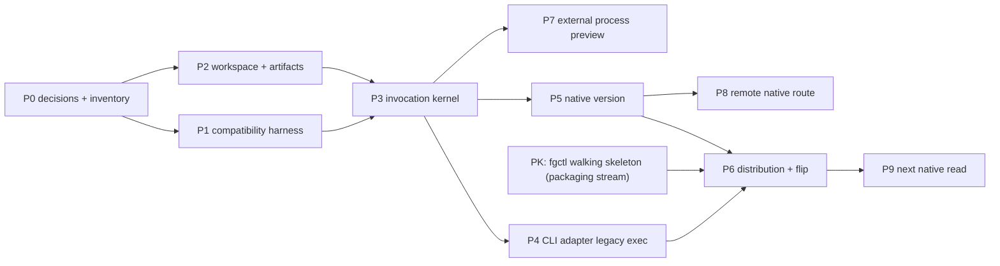

# Rust Host And Proof Providers Implementation Plan

**Status:** Proposed execution plan; blocked only by the remaining §3 decisions
(target matrix, preview-vs-stable, compatibility-window duration) and the
packaging stream's `fgctl` walking skeleton (§4, node `PK`).
**Date:** 2026-09-04.
**Revised:** 2026-09-10 (see plans/reports/architecture-review-260910-1537-host-invocation-provider-routing-design-review.md).
**Architecture:** [Host Invocation And Provider Routing](./host-invocation-provider-routing.md).
**Migration strategy:** [Node To Rust Component Migration](./node-to-rust-component-migration.md).
**Component placement:** [fgOS Component Boundary Advisory](../component-boundary/component-boundary-advisory.md).
**Distribution/activation authority:** [Runtime Identity And Activation](../packaging-distribution/runtime-identity-and-activation.md); this plan consumes that stream's walking skeleton, it does not redefine install/activation.

This document contains execution order, deliverables, gates, verification, and
rollback. Semantic contracts, provider lifecycle, authority, framing, registry
rules, compatibility modes, and technical trade-offs are owned by the
architecture document and are intentionally not redefined here.

## 1. Outcome

Execution is complete in three independently shippable releases:

1. **R1 — distributable Rust CLI host:** installed `fgos` is Rust; every
   unmigrated CLI invocation transparently reaches Node; `version` is native;
   install, init/doctor, upgrade, rollback, and uninstall are reproducible
   (install/upgrade/rollback/uninstall via `fgctl`; init/doctor local, under
   the active identity — `runtime-identity-and-activation.md` §12).
2. **R2 — external process preview:** one vendor fixture proves the framed
   process protocol and fail-closed provider path without expanding into a full
   plugin marketplace.
3. **R3 — production remote peer:** at least one native gateway route calls the
   shared invocation service directly; migrated routes neither shell through
   CLI nor parse `fgos.v1` internally.

R1 is useful without R2 or R3. R2 and R3 may start after the R1 runtime kernel
is stable, but neither delays the R1 installed-entry flip.

## 2. Non-Goals

- No Work Lifecycle writer, event append, claim/return, merge, runner, or
  coordination execution migration.
- No repository-wide Node thinning before a component is selected.
- No production WASM provider, marketplace, publisher trust, or signature
  system.
- No core-provider replacement and no speculative chat adapter.
- No parser rewrite while a command remains on Node compatibility.
- No Node deletion in the same change that flips its binding.
- No Rust toolchain or hidden lifecycle build on consuming projects.

## 3. Decisions Required Before R1 Execution

These are product/release inputs, not implementation details to guess:

1. supported R1 target matrix;
2. ~~native archive publication and installation mechanism~~ — settled, see
   `runtime-identity-and-activation.md` §13 (`fgctl` Rust bootstrap; local
   path/tarball/GitHub release asset acquisition sources) and §5
   (content-addressed release store, release tree manifest);
3. ~~upgrade and rollback channel~~ — settled, see
   `runtime-identity-and-activation.md` §11 (`fgctl upgrade`/`fgctl repair`
   pipeline; rollback via `ActivationRecord.previousArtifactDigest` plus the
   preserved release directory). Compatibility-window duration remains open
   (carried forward as decision 6 below);
4. ~~release artifact naming and integrity/checksum policy~~ — settled, see
   `runtime-identity-and-activation.md` §5 (release tree manifest digest
   identity, not archive digest) and §11 (quarantine on digest mismatch);
5. whether the first public R1 is preview or immediate stable default;
6. compatibility-window duration for R1's Node fallback (§16).

Decision "whether setup/doctor may ever select or download an upgrade" is
closed: **never**. `fgctl` owns acquisition/upgrade/rollback; local `fgos
init` and `fgos doctor --fix` never select or download a release
(`runtime-identity-and-activation.md` §12, Command Authority Matrix). There is
no `setup` verb — see the P0 deliverable on inventorying `fgos setup` callers
(§5).

Record decisions 1, 5, and 6 in the packaging stream
(`docs/architect/packaging-distribution/`), which owns install/activation;
`docs/specs/distribution.md` is regenerated from it later. Local P1–P5 work
may proceed; the public entry flip (P6) may not infer these decisions and also
depends on the packaging stream's `fgctl` walking skeleton (§4, node `PK`).

## 4. Delivery Graph



P7 does not block P8 when the first production remote route is native
`distribution.build.show`.

`PK` is delivered by the packaging stream's own plan
(`docs/architect/packaging-distribution/`), not this plan; this plan only
consumes its interface (see the P0 deliverable in §5 below). `PK` is an
external dependency node, not a new P-package — P-numbering stays P0–P9.

## 5. P0 — Lock Release Inputs And Baseline Inventory

### Deliverables

- Distribution decision update covering the remaining §3 items (target
  matrix, preview-vs-stable, compatibility-window duration), recorded in the
  packaging stream.
- Confirm the packaging walking skeleton's interface this plan needs: release
  tree layout for `bin/fgos` (Rust) + legacy payload + `fgos-runner`,
  activation binding fields the runtime locator reads, and `fgctl init`'s tail
  (`fgos init` → `fgos doctor --fix` → `fgos doctor`) — per
  `runtime-identity-and-activation.md` §11 and §14.
- Inventory every caller of `fgos setup` (README, CHANGELOG, AGENTS.md, specs,
  `src/setup/*` messages, tests) and record the migration to `init`/`doctor
  --fix`; the verb's removal is a CHANGELOG-visible CLI contract change
  scheduled in its own change, not inside this plan's P-packages.
- Machine-readable inventory of every public command selector/subcommand mode.
- Each selector classified as compatibility-only or projected to an existing
  semantic operation.
- Checked command-route descriptor for every selector, with route kind,
  canonical owner path, required compatibility suites, and no ambiguous
  native/legacy binding.
- Confirm the legacy payload contract (no source relocation, no file rename):
  payload = the npm package as `package.json` `files` defines it, staged whole
  under the manifest's `components.legacyNode.root`; identity `legacy-node`;
  the Rust host resolves `join(activeReleasePath, root, entry)` from the
  activation binding, never a hardcoded path
  ([Legacy CLI Transition](./legacy-cli-transition.md) §2).
- Caller inventory for the old path: the nine real call sites (shell function
  tier-1, Herdr `fgos.rs`/`gateway.rs`/`main.rs`, `src/runner/dispatch/cli.mjs`,
  `src/evolve/iron-law.mjs`, `src/setup/registrations.mjs` reachability check,
  `core/skills/_shared/fgos-cli-fallback.md`, `package.json` `bin`), each
  classified; the ~75 Node tests spawning `bin/fgos.mjs` are fixtures and stay;
  `.agents`/`plugins` copies are render targets of the one `core/skills` source.
  The cutover (P4/P6) adds tier 0 = workspace shim to each runtime's single
  resolver rather than editing nine sites independently.
- Confirmed component owner for `distribution.build.show`.
- Confirmed ownership of `gate-bypass`, or a different next read proof.
- R1 runtime inventory includes the separately public Node `fgos-runner`, its
  payload/dependency closure, and its compatibility tests; it is not assumed
  migrated with `fgos`.

### Scout evidence

- `package.json` current binaries and package files.
- `src/cli/command-registry.mjs` selector inventory.
- `bin/fgos.mjs` global parsing, presentation, and error mapping.
- `src/cli/version.mjs` and `src/state/envelope.mjs` behavior.
- Every direct `bin/fgos.mjs` caller, classified as public CLI use, test-only
  fixture, or an obsolete direct-entry dependency that must be removed.
- Herdr `VerbGateway` call sites in `ports.rs` and `gateway.rs`.

### Exit gate

No selector is absent; every future binary, payload, cache, config, or runtime
dependency has a planned init/doctor registration owner; unresolved
distribution choices (§3 decisions 1, 5, 6) and the packaging walking skeleton
are named as the only P6 blockers. Every selector has one repair owner and
proof suite; no caller treats the private legacy payload as a public entry.

### Verify

```sh
node bin/fgos.mjs --help --json
npm test
```

## 6. P1 — Compatibility Harness

### Changed areas

```txt
test/rust-host/
packages/component-protocol/contracts/
scripts/export-command-selectors.mjs
scripts/explain-command-route.mjs
```

### Steps

1. Build one harness that invokes Node or a candidate Rust binary with identical
   argv bytes, stdin, cwd, selected environment, and timeout.
2. Capture stdout/stderr bytes, normal exit, signal termination, filesystem
   diff, spawned-process evidence, and wall-clock timing per case.
3. Generate a checked command-route descriptor from the current command
   registry plus explicit migration annotations; do not hand-maintain a second
   command list. Require one `legacy-cli` or `native` route kind, one canonical
   owner path, and one or more required proof suites for every selector.
4. Add a byte drift test for the generated artifact.
5. Add Node-generated `fgos.v1` vectors and the architecture's differential
   serialization corpus.
6. Add `scripts/explain-command-route.mjs <selector>` as a developer-only view
   over that same checked artifact; its output names the owner path and suites
   to run for a bug repair.
7. Declare comparison mode per case: exact bytes, semantic JSON plus timestamp
   predicate, filesystem delta, or signal.
8. Prove the harness detects an injected stdout byte, exit-code change, missing
   argv token, and unexpected child process.

### Coverage floor

- Every selector: recognition and help/syntax passthrough.
- Every selector: route descriptor has exactly one active route, an owner, and
  a required proof suite; unknown selectors and ambiguous routes fail closed.
- Every exit category: stdout/stderr/status.
- Reads `version` and `ready`; one validation failure; unknown verb.
- Isolated write: `init` then `add` in a temp repository.
- `--dir`, caller cwd distinct from product root, stdin consumer if present.
- Target-specific signal/process-tree behavior.

### Performance gates

- Legacy exec overhead: wall time of `fgos <legacy selector>` through the Rust
  CLI minus direct `node <payload> <selector>` on the same machine, both warm.
  Threshold placeholder `≤ 25 ms p50 on the reference target` — initial
  budget, confirm in P0.
- Native `version` latency budget placeholder `≤ 10 ms p50`.
- Both become regression gates in P6 (§11 exit gate).

### Exit gate and verify

The harness fails on every injected difference and passes Node-against-Node.

```sh
node --test test/rust-host/envelope-contract.test.mjs
node scripts/export-command-selectors.mjs --check
```

## 7. P2 — Rust Workspace And Generated Inputs

### Target areas

```txt
Cargo.toml                          # workspace root
Cargo.lock
apps/fgos/                          # crate `fgos`, binary `fgos`; legacy_exec.rs is a module here
packages/host-runtime/rust/         # crate `fgos-host-runtime`
packages/distribution/rust/         # crate `fgos-distribution` (owner of distribution.build.show)
scripts/build-rust-distribution.mjs
scripts/run-rust-dev-host.mjs
```

R1 is exactly these three crates. `packages/component-protocol/rust/` is
created in P7 (only the external-process adapter needs `EncodedMessage`); there
is no `packages/legacy-node/` crate or directory — the legacy exec lane is a
module in `apps/fgos` and the Node payload stays where it is. Start adapters as
modules unless dependency/lifecycle pressure justifies a crate. Do not add a
`gate-policy` component for migration convenience.

### Steps

1. Add explicit workspace members/excludes.
2. Keep `herdr-plugin` and `upstreams/*` outside the new dependency graph.
3. Prove excluded nested crates still build independently.
4. Embed/include the generated selector and contract artifacts.
5. Add one explicit development launcher that runs the source Rust host with
   source payloads, never an ambient PATH `fgos`; it verifies generated inputs
   before execution.
6. Add one staging builder that materializes the exact release layout into a
   disposable directory, emits a versioned manifest with target/payload/artifact
   digests, and never compiles or downloads during consumer installation.
7. Add formatting, lint, warnings-as-errors, tests, and target CI cache.

### Exit gate and verify

The workspace contains only intended members and causes no Herdr dependency or
lockfile drift. The dev launcher cannot read an installed payload accidentally,
and the staged layout can run without source-tree paths.

```sh
cargo fmt --all -- --check
cargo clippy --workspace --all-targets -- -D warnings
cargo test --workspace
cargo test --manifest-path herdr-plugin/Cargo.toml
```

## 8. P3 — Invocation Kernel Vertical Slice

The kernel exposes exactly one contract: `OperationRequest` → `ProviderOutcome`.
`legacy-cli` selectors never enter it — see P4 and
[Legacy CLI Transition](./legacy-cli-transition.md).

### Deliverables

- `OperationId` and typed in-process `OperationRequest`/`ProviderOutcome`
  types. `EncodedMessage` bytes are deferred entirely to the external-process
  adapter (P7); built-in providers, including `version`, never decode bytes.
- Minimum operation catalog: a compile-time `const` array holding the single
  native operation `distribution.build.show` and one fixture — no linker, no
  cache, no manifest scan until P7.
- Immutable registry snapshot and exact selector.
- Caller-admission and selected-provider-grant ports, deny by default.
- Async invocation, cancellation, event sink, outcome, and closed errors.
- A pure Router (selection function: `OperationId` + versions + hostKind +
  mode + policy + `RegistrySnapshot` → `ProviderDescriptor` |
  `SelectionRefused`; no I/O, no async) kept separate from the
  `InvocationService` pipeline (admit → select → grant → invoke → normalize →
  record), which owns invocation, failure normalization, and the lifecycle
  record.
- CLI projector/presenter and in-memory remote projector/presenter proof.

### Steps

1. Write failing tests for duplicate/missing bindings, incompatible contracts,
   disallowed host, and denied provider capability.
2. Implement catalog validation and immutable snapshot construction via a pure
   `build_snapshot(catalog, providers, fingerprint)` called once at the `apps/fgos` composition root (no linker/cache/manifest scan in R1).
3. Implement exact binding without priority or scan-order fallback.
4. Implement the `InvocationService` pipeline: admit → `Router.select` (pure,
   no I/O) → grant → invoke → normalize → record.
5. Propagate cancellation/deadline through an in-memory provider.
6. Project one semantic outcome independently for CLI and remote tests.
7. Assert no host adapter imports or invokes another.
8. Capture diagnostics in trace/evidence; stable output changes only under an
   explicit diagnostics mode.

### Exit gate and verify

Both host projectors reach the same provider and all negative cases fail
closed. The Router is unit-testable with no I/O and no async runtime. No
Node/process/filesystem/production-gateway dependency is involved.

```sh
cargo test --workspace host_runtime
cargo test --workspace invocation_service
```

## 9. P4 — CLI Adapter Legacy Exec

This lane lives in the CLI adapter, not the kernel: for `legacy-cli`
selectors the CLI adapter looks up `CommandRouteDescriptor`, then execs the
Node payload directly — argv bytes preserved, inherited stdin, cwd/env, and
signal forwarding, plus one invocation record through the shared recorder. It
never builds an `OperationRequest` and never calls `InvocationService`. See
[Legacy CLI Transition](./legacy-cli-transition.md) for the exec/recorder
mechanics.

### Deliverables

- Candidate Rust `fgos` executable.
- CLI adapter descriptor lookup and direct-exec path for every `legacy-cli`
  selector via `CommandRouteDescriptor`, bypassing `InvocationService`
  entirely.
- Executable-relative Node payload resolution, recursion protection, and
  process evidence.
- One invocation record per legacy exec, written through the same shared
  recorder `InvocationService` uses for native operations.
- Node payload left in place (`bin/fgos.mjs` + the rest of `package.json`
  `files`), identified as `legacy-node`; a header in `bin/fgos.mjs` and a root
  `AGENTS.md` note guide legacy bug fixes. Its installed location is
  `components.legacyNode.root` in the release tree manifest owned by the
  packaging stream (`runtime-identity-and-activation.md` §5), not a path
  hardcoded here.

### Steps

1. Add the ownership header to `bin/fgos.mjs` and the `AGENTS.md` note; no
   file move, no rename.
2. Scan only host-global options and a checked selector using `args_os`; keep
   all legacy-owned arguments as `OsString`.
3. Resolve the active release path from the workspace activation binding,
   independently from caller cwd.
4. Resolve the legacy entry as `join(activeReleasePath, components.legacyNode.root,
   components.legacyNode.entry)` from the manifest — `root: "."` for a
   `dev:<rev>` source activation, `libexec/legacy-node` for a staged release —
   with an explicit test override only in the P1 harness.
5. Invoke `node` and the named legacy payload directly, never `fgos`.
6. Preserve stdin/stdout/stderr, cwd, environment, exit, and signal behavior;
   add only a private recursion marker.
7. Run every P1 case through both entry points.
8. Test an unrelated caller, `dev:<rev>` source activation, staged-release
   payload, and PATH recursion trap. Reject a production direct spawn of the
   private payload outside the CLI adapter's legacy exec path (Node test
   fixtures excepted).
9. Add tier 0 (workspace shim `.fgos/installation/bin/fgos`) to each runtime's
   single resolver — `src/setup/bin-discovery.mjs`, the shell function in
   `scripts/fgos-shell-integration.sh`, one `resolve_fgos` in Herdr — and route
   the nine inventoried call sites (P0) through it; keep `node bin/fgos.mjs`
   only as the fallback for a workspace without an activation binding.

### Exit gate and verify

Stable bytes, status, and filesystem effects match P1. The route kind
(`legacy-cli`) is visible in captured diagnostics without changing public
output. Node remains directly runnable at its named payload path.
`explain-command-route` identifies the legacy owner and proof suite for every
unmigrated selector.

```sh
node --test test/rust-host/legacy-compatibility.test.mjs
cargo test --workspace legacy_node
```

## 10. P5 — Native `version`

### Deliverables

- Typed `distribution.build.show` contracts and built-in provider.
- CLI `version` projection and cross-runtime/no-Node proof.

### Steps

1. Port package version, product-checkout commit, and sorted public verb data.
2. Test transition-time version equality with root `package.json`.
3. Resolve Git against product root and return `null` outside a checkout.
4. Read the embedded generated selector inventory for verbs.
5. Return a semantic outcome; let CLI presenter create exactly one envelope.
6. Run serialization and focused version differential cases.
7. Prove no Node child with the process spy.

### Exit gate and verify

The immutable binding selects built-in `version`, matches Node contract, and
creates no Node process.

```sh
node --test test/rust-host/version-parity.test.mjs
cargo test --workspace distribution_build_show
```

## 11. P6 — Distribution And Installed-Entry Cutover

P6 is part of R1, not late cleanup. Install, activation, upgrade, rollback,
and uninstall are owned by the packaging stream
(`runtime-identity-and-activation.md`), not by a home-grown installer in this
package. This package builds the release tree `fgctl` consumes and proves the
walking skeleton (node `PK`, §4) against it; the `<install-root>/libexec/...`
layout is superseded by the release tree manifest contract.

### Steps

1. Confirm the remaining §3 decisions (target matrix, preview-vs-stable) are
   recorded in the packaging stream before adding a new build-script module.
2. Extend `scripts/build-rust-distribution.mjs` to build the release tree:
   stage the Rust `fgos`, Node `fgos-runner`, legacy CLI payload, their
   declared dependency closure, and generated artifacts into a release tree +
   manifest consumable by `fgctl`, per the release tree manifest contract
   (`runtime-identity-and-activation.md` §5) — not a home-grown installer.
   Prove the staged bundle uses no checkout-relative path.
3. Build one reproducible target artifact, then the approved matrix; the
   manifest and integrity metadata follow the release tree manifest contract
   (digest of the canonical release tree manifest, not an archive digest).
4. Prove `fgctl init` — clean and repeated (idempotent) — against an external
   temp project with no Rust toolchain or source tree, staged from this
   release tree: it acquires/stages/verifies the release, publishes the
   workspace activation binding, then invokes active local `fgos init` →
   `fgos doctor --fix` → `fgos doctor` (`runtime-identity-and-activation.md`
   §11, §14). Also prove standalone read-only `fgos doctor`, and that `doctor
   --fix` repairs only named local conditions.
5. Prove `fgctl upgrade` and `fgctl repair` (rollback) against the same
   external project, per the §11 drift/repair/rollback pipeline; rollback
   restores the previous release via `ActivationRecord.previousArtifactDigest`
   plus the preserved release directory, without work-state mutation.
6. Prove uninstall via `fgctl`; this plan does not implement a separate
   uninstaller.
7. Register `doctor` checks for Rust binary/version/target, public
   `fgos-runner`, Node runtime/payload while compatibility bindings remain,
   catalog/selector drift, registry load, and release integrity, through the
   existing check registry (`src/setup/checks.mjs`).
8. Register safe fixes/defaults through the existing registries, preserving
   project-over-global and customized settings; `doctor` validates the active
   manifest without regenerating build inputs or changing releases — that
   authority stays with `fgctl`.
9. Update README/end-user install docs and `CHANGELOG.md`, including the
   `fgos setup` → `init`/`doctor --fix` migration (§5 P0 deliverable).
10. Flip the installed entry in a separately revertible change.
11. Observe the named compatibility window (§3 decision 6).

### Exit gate and verify

All targets pass P1/P5 through `fgctl init` from outside the repo; missing
Node payload is diagnosed before legacy invocation; a broken runner payload is
diagnosed separately; no lifecycle script builds/downloads implicitly outside
`fgctl`; rollback restores one complete prior release without work-state
mutation; legacy exec overhead and native `version` p50 latency stay within
the P1 performance-gate thresholds (§6) — a regression fails this gate.

```sh
npm test
cargo test --workspace
node --test test/install-packaging.test.mjs
```

Add explicit matrix commands after §3's remaining target-matrix and
preview-vs-stable decisions land.

## 12. P7 — External Process Provider Preview

See [External Provider Protocol](./external-provider-protocol.md) for the
wire-format/handshake contract this section proves against. This is also
where `EncodedMessage` bytes are introduced — built-in providers (P3, P5)
never carry them.

### Steps

1. Create the provider fixture in a temp external directory.
2. Validate its static manifest without execution.
3. Prove handshake identity/digest/version/concurrency negotiation.
4. Prove framed request/response, stderr logging, events, and ID correlation.
5. Prove maximum frame, bounded queue, backpressure, deadline, cancellation,
   crash, protocol violation, and completion-unknown.
6. Refuse core namespaces, duplicates, unknown capabilities, and handshake drift.
7. Invoke the fixture through CLI and remote test projectors.
8. Keep roots explicit and test/dev-scoped; defer broad ecosystem discovery.

### Exit gate and verify

Built-in and process providers are distinguishable through one router; all
negative cases fail closed; no production component moved. `legacy-cli`
selectors never reach the router (P4 exec path is outside the kernel).

```sh
cargo test --workspace external_process
node --test test/rust-host/external-provider.test.mjs
```

## 13. P8 — Production Remote Native Route

Use `distribution.build.show` first unless another already-native read has more
product value. Do not choose a Node-only route merely to justify a bridge.

### Steps

1. Compose the production remote projector/presenter around the shared service.
2. Replace only the selected route's `VerbGateway` call.
3. Preserve gateway auth, request validation, rate/session context, status, and
   response schema.
4. Assert the migrated route neither spawns CLI/Node nor parses `fgos.v1`.
5. Run CLI/remote semantic equality and transport response tests.
6. Keep untouched routes on the old adapter with an explicit consumer list.
7. Repeat route by route; add a Node semantic bridge only where a required
   operation cannot migrate first.
8. Delete `VerbGateway` when its consumer list is empty.

### Exit gate and verify

One production route is a true peer invocation. Remaining old routes are
visible and no migrated route can fall back to envelope parsing.

```sh
cargo test --manifest-path herdr-plugin/Cargo.toml
npm test
```

## 14. P9 — Next Native Read

`gate-bypass` is a candidate, not a pre-created component. Confirm authority
and placement first. If selected: freeze precedence/malformed fixtures; port
only the read; consume resolved project context; prove zero writes and zero Node
spawn; flip binding separately from Node deletion. If ownership stays unclear,
choose another settled read instead of inventing a component boundary.

The provider never blocks on human input; a `parked` outcome is the only
allowed response when human input is needed (matches `ask`/awaiting-human;
"Release con người" law). This applies to P9 and to any later native
migration slice.

```sh
node --test test/rust-host/gate-bypass-parity.test.mjs
cargo test --workspace
```

## 15. Test And Review Gates

| Gate | Required proof |
|---|---|
| Per commit | focused tests; Rust format and lint |
| R1 integration | compatibility inventory, native no-Node proof, `npm test`, workspace tests |
| R1 release | external install/upgrade/rollback/uninstall via `fgctl`, init/doctor on every target, legacy-exec/`version` p50 latency within the P1 budget |
| R2 | protocol conformance and fail-closed negative cases |
| R3 | gateway suite, CLI/remote semantic equality, no CLI/envelope on migrated routes |
| Future writer | replay, lock, atomicity, recovery, idempotency, mutual exclusion, rollback compatibility |

Use process-spy evidence, not timing, for no-spawn/no-Node claims — the §6/§11
performance gates are the one place timing is the proof, and they measure
wall-clock explicitly rather than inferring it from spawn evidence. Use
filesystem snapshots for zero-write claims. Use explicit timestamp
predicates; never normalize arbitrary differences.

## 16. Commit And Rollback Slices

Independently revertible slices:

1. harness and generated selector artifact;
2. workspace skeleton;
3. invocation kernel/in-memory providers;
4. Node compatibility;
5. native `version` binding;
6. artifact production;
7. init/doctor and external install tests;
8. installed-entry flip;
9. process protocol fixture/adapter;
10. first remote route;
11. each later native binding;
12. each Node deletion after its observation window.

Before P6, discard the candidate binary. After P6, roll back via `fgctl`
release rollback (restores the previous complete release via
`ActivationRecord.previousArtifactDigest` plus the preserved release
directory; R1–R2 use no other rollback channel — config never selects or
replaces a built-in provider). Roll back a single native read by changing its
binding in code and shipping a new release, never by a runtime
provider-selection toggle: R1–R2 bindings are immutable and static. Never
shadow-run or auto-retry a writer. Never delete a Node writer before
cross-version recovery is proven or the cutover is explicitly irreversible.

## 17. Risks And Controls

| Risk | Control |
|---|---|
| Rust re-parses legacy flags | `args_os`, checked selector, argv corpus |
| Double envelope | compatibility bytes pass through; semantic outcomes alone reach presenter |
| Hash drift | Node differential corpus plus golden vectors |
| Wrong root | installation/caller/project/`.fgos` roots are distinct fixtures |
| Silent override | immutable exact binding; named replacement only |
| Capability escalation | admission then least-privilege provider grant |
| Remote wraps CLI | no-spawn/no-envelope assertions per route |
| “Ship” without install | distribution is in R1 |
| `fgos-runner` silently points at a different release | public-entry mapping and single release manifest/pointer proof |
| checkout-only success hides missing payload | staged-bundle proof before external install |
| doctor mutates or upgrades unexpectedly | read-only default; named `--fix` scope; explicit upgrade contract |
| Fake proof component | component advisory gate before package creation |
| Workspace absorbs Herdr | explicit excludes and independent build proof |
| Crash becomes success | completion-unknown; idempotency-gated retry only |
| Diagnostics break output | trace/evidence or explicit diagnostics surface |

## 18. Definition Of Done

1. R1 installs Rust on every approved target while every unmigrated selector
   preserves Node behavior.
2. `version` is typed, native, compatible, and proven not to spawn Node.
3. Init/doctor diagnoses every new binary, payload, config, registry, and
   integrity dependency.
4. External install, upgrade, rollback, and uninstall reproduce via `fgctl`
   without Rust toolchain or lifecycle build.
5. R2 process conformance passes positive and fail-closed cases.
6. R3 has a production gateway route using the semantic path with no CLI API.
7. `npm test`, workspace tests, and independent Herdr tests are green at their
   owning gates.
8. Architecture owns contracts/trade-offs, migration owns sequence policy, and
   this file contains no competing technical design.
9. A stranger starting at `docs/specs/reading-map.md` can reproduce each proof
   and identify every rollback point.
