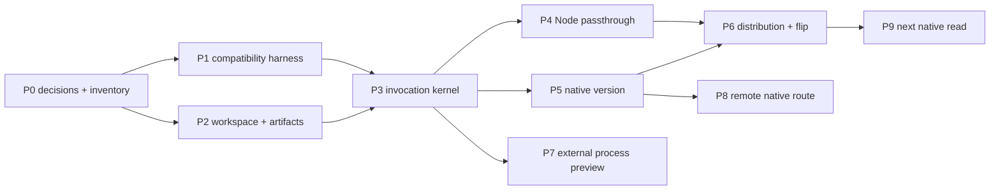

# Rust Host And Proof Providers Implementation Plan

**Status:** Proposed execution plan; blocked only by the named decisions in §3.
**Date:** 2026-09-04.
**Architecture:** [Host Invocation And Provider Routing](./host-invocation-provider-routing.md).
**Migration strategy:** [Node To Rust Component Migration](./node-to-rust-component-migration.md).
**Component placement:** [fgOS Component Boundary Advisory](../component-boundary/component-boundary-advisory.md).

This document contains execution order, deliverables, gates, verification, and
rollback. Semantic contracts, provider lifecycle, authority, framing, registry
rules, compatibility modes, and technical trade-offs are owned by the
architecture document and are intentionally not redefined here.

## 1. Outcome

Execution is complete in three independently shippable releases:

1. **R1 — distributable Rust CLI host:** installed `fgos` is Rust; every
   unmigrated CLI invocation transparently reaches Node; `version` is native;
   install, setup/doctor, upgrade, rollback, and uninstall are reproducible.
2. **R2 — external process preview:** one vendor fixture proves the framed
   process protocol and fail-closed provider path without expanding into a full
   plugin marketplace.
3. **R3 — production remote peer:** at least one native gateway route calls the
   shared invocation service directly; migrated routes neither shell through
   CLI nor parse `fgos.v1` internally.

R1 is useful without R2 or R3. R2 and R3 may start after the R1 runtime kernel
is stable, but neither delays the R1 installed-entry flip.

## 2. Non-Goals

- No Work Lifecycle writer, event append, claim/return, merge, runner, or
  coordination execution migration.
- No repository-wide Node thinning before a component is selected.
- No production WASM provider, marketplace, publisher trust, or signature
  system.
- No core-provider replacement and no speculative chat adapter.
- No parser rewrite while a command remains on Node compatibility.
- No Node deletion in the same change that flips its binding.
- No Rust toolchain or hidden lifecycle build on consuming projects.

## 3. Decisions Required Before R1 Execution

These are product/release inputs, not implementation details to guess:

1. supported R1 target matrix;
2. native archive publication and installation mechanism;
3. upgrade and rollback channel plus compatibility-window duration;
4. release artifact naming and integrity/checksum policy;
5. whether the first public R1 is preview or immediate stable default.
6. whether setup/doctor may ever select or download an upgrade; R1 defaults to
   read-only doctor and named local `--fix` repairs unless this policy is
   explicitly changed.

Record them in `docs/distribution-vision.md` and
`docs/specs/distribution.md` before Work Package 6 changes installation. Local
P1–P5 work may proceed; the public entry flip may not infer these decisions.

## 4. Delivery Graph



P7 does not block P8 when the first production remote route is native
`distribution.build.show`.

## 5. P0 — Lock Release Inputs And Baseline Inventory

### Deliverables

- Distribution decision update covering §3.
- Machine-readable inventory of every public command selector/subcommand mode.
- Each selector classified as compatibility-only or projected to an existing
  semantic operation.
- Checked command-route descriptor for every selector, with route kind,
  canonical owner path, required compatibility suites, and no ambiguous
  native/legacy binding.
- Approved relocation from `bin/fgos.mjs` to the architecture's canonical Node
  legacy payload source path; source-tree shim and installed payload policy are
  recorded before any public-entry cutover.
- Confirmed component owner for `distribution.build.show`.
- Confirmed ownership of `gate-bypass`, or a different next read proof.
- R1 runtime inventory includes the separately public Node `fgos-runner`, its
  payload/dependency closure, and its compatibility tests; it is not assumed
  migrated with `fgos`.

### Scout evidence

- `package.json` current binaries and package files.
- `src/cli/command-registry.mjs` selector inventory.
- `bin/fgos.mjs` global parsing, presentation, and error mapping.
- `src/cli/version.mjs` and `src/state/envelope.mjs` behavior.
- Every direct `bin/fgos.mjs` caller, classified as public CLI use, test-only
  fixture, or an obsolete direct-entry dependency that must be removed.
- Herdr `VerbGateway` call sites in `ports.rs` and `gateway.rs`.

### Exit gate

No selector is absent; every future binary, payload, cache, config, or runtime
dependency has a planned setup/doctor owner; unresolved distribution choices
are named as the only P6 blockers. Every selector has one repair owner and
proof suite; no caller treats the private legacy payload as a public entry.

### Verify

```sh
node bin/fgos.mjs --help --json
npm test
```

## 6. P1 — Compatibility Harness

### Changed areas

```txt
test/rust-host/
packages/component-protocol/contracts/
scripts/export-command-selectors.mjs
scripts/explain-command-route.mjs
```

### Steps

1. Build one harness that invokes Node or a candidate Rust binary with identical
   argv bytes, stdin, cwd, selected environment, and timeout.
2. Capture stdout/stderr bytes, normal exit, signal termination, filesystem
   diff, and spawned-process evidence.
3. Generate a checked command-route descriptor from the current command
   registry plus explicit migration annotations; do not hand-maintain a second
   command list. Require one `legacy-cli` or `native` route kind, one canonical
   owner path, and one or more required proof suites for every selector.
4. Add a byte drift test for the generated artifact.
5. Add Node-generated `fgos.v1` vectors and the architecture's differential
   serialization corpus.
6. Add `scripts/explain-command-route.mjs <selector>` as a developer-only view
   over that same checked artifact; its output names the owner path and suites
   to run for a bug repair.
7. Declare comparison mode per case: exact bytes, semantic JSON plus timestamp
   predicate, filesystem delta, or signal.
8. Prove the harness detects an injected stdout byte, exit-code change, missing
   argv token, and unexpected child process.

### Coverage floor

- Every selector: recognition and help/syntax passthrough.
- Every selector: route descriptor has exactly one active route, an owner, and
  a required proof suite; unknown selectors and ambiguous routes fail closed.
- Every exit category: stdout/stderr/status.
- Reads `version` and `ready`; one validation failure; unknown verb.
- Isolated write: `init` then `add` in a temp repository.
- `--dir`, caller cwd distinct from product root, stdin consumer if present.
- Target-specific signal/process-tree behavior.

### Exit gate and verify

The harness fails on every injected difference and passes Node-against-Node.

```sh
node --test test/rust-host/envelope-contract.test.mjs
node scripts/export-command-selectors.mjs --check
```

## 7. P2 — Rust Workspace And Generated Inputs

### Target areas

```txt
Cargo.toml
Cargo.lock
apps/fgos/
packages/component-protocol/rust/
packages/host-runtime/rust/
packages/legacy-node/rust/
packages/distribution-health/rust/
scripts/build-rust-distribution.mjs
scripts/run-rust-dev-host.mjs
```

Start adapters as modules unless dependency/lifecycle pressure justifies a
crate. Do not add a `gate-policy` component for migration convenience.

### Steps

1. Add explicit workspace members/excludes.
2. Keep `herdr-plugin` and `upstreams/*` outside the new dependency graph.
3. Prove excluded nested crates still build independently.
4. Embed/include the generated selector and contract artifacts.
5. Add one explicit development launcher that runs the source Rust host with
   source payloads, never an ambient PATH `fgos`; it verifies generated inputs
   before execution.
6. Add one staging builder that materializes the exact release layout into a
   disposable directory, emits a versioned manifest with target/payload/artifact
   digests, and never compiles or downloads during consumer installation.
7. Add formatting, lint, warnings-as-errors, tests, and target CI cache.

### Exit gate and verify

The workspace contains only intended members and causes no Herdr dependency or
lockfile drift. The dev launcher cannot read an installed payload accidentally,
and the staged layout can run without source-tree paths.

```sh
cargo fmt --all -- --check
cargo clippy --workspace --all-targets -- -D warnings
cargo test --workspace
cargo test --manifest-path herdr-plugin/Cargo.toml
```

## 8. P3 — Invocation Kernel Vertical Slice

### Deliverables

- IDs and encoded-message types.
- Minimum operation catalog with `distribution.build.show` and one fixture.
- Immutable registry snapshot and exact selector.
- Caller-admission and selected-provider-grant ports, deny by default.
- Async invocation, cancellation, event sink, outcome, and closed errors.
- Shared invocation service.
- CLI projector/presenter and in-memory remote projector/presenter proof.

### Steps

1. Write failing tests for duplicate/missing bindings, incompatible contracts,
   disallowed host, and denied provider capability.
2. Implement catalog validation and immutable snapshot construction.
3. Implement exact binding without priority or scan-order fallback.
4. Implement admission → selection → grant → invoke.
5. Propagate cancellation/deadline through an in-memory provider.
6. Project one semantic outcome independently for CLI and remote tests.
7. Assert no host adapter imports or invokes another.
8. Capture diagnostics in trace/evidence; stable output changes only under an
   explicit diagnostics mode.

### Exit gate and verify

Both host projectors reach the same provider and all negative cases fail closed.
No Node/process/filesystem/production-gateway dependency is involved.

```sh
cargo test --workspace host_runtime
cargo test --workspace invocation_service
```

## 9. P4 — Transparent Node CLI Compatibility

### Deliverables

- Candidate Rust `fgos` executable.
- CLI-only compatibility binding for every unmigrated selector.
- Executable-relative Node payload resolution, recursion protection, and
  process evidence.
- Relocated, named Node payload at `packages/legacy-node/node/fgos.mjs` in the
  source tree and `libexec/fgos/legacy-node/fgos.mjs` in an installed artifact;
  a colocated ownership note and payload header guide legacy bug fixes.

### Steps

1. Relocate the current Node entry to the canonical legacy payload path before
   changing public entry wiring. Keep `bin/fgos.mjs` only as a source-tree
   compatibility shim until checkout tooling uses the Rust development entry;
   prove the shim is implementation-free.
2. Scan only host-global options and a checked selector using `args_os`; keep
   all provider-owned arguments as `OsString`.
3. Resolve installation root independently from caller cwd.
4. Resolve the legacy entry by explicit test override, installed relative
   payload, then validated checkout path.
5. Invoke `node` and the named legacy payload directly, never `fgos`.
6. Preserve stdin/stdout/stderr, cwd, environment, exit, and signal behavior;
   add only a private recursion marker.
7. Run every P1 case through both entry points.
8. Test an unrelated caller, source-tree shim, installed payload, and PATH
   recursion trap. Reject a production direct spawn of the private payload
   outside the compatibility provider.

### Exit gate and verify

Stable bytes, status, and filesystem effects match P1. Provider identity is
visible in captured diagnostics without changing public output. Node remains
directly runnable at its named payload path. `explain-command-route` identifies
the legacy owner and proof suite for every unmigrated selector.

```sh
node --test test/rust-host/legacy-compatibility.test.mjs
cargo test --workspace legacy_node
```

## 10. P5 — Native `version`

### Deliverables

- Typed `distribution.build.show` contracts and built-in provider.
- CLI `version` projection and cross-runtime/no-Node proof.

### Steps

1. Port package version, product-checkout commit, and sorted public verb data.
2. Test transition-time version equality with root `package.json`.
3. Resolve Git against product root and return `null` outside a checkout.
4. Read the embedded generated selector inventory for verbs.
5. Return a semantic outcome; let CLI presenter create exactly one envelope.
6. Run serialization and focused version differential cases.
7. Prove no Node child with the process spy.

### Exit gate and verify

The immutable binding selects built-in `version`, matches Node contract, and
creates no Node process.

```sh
node --test test/rust-host/version-parity.test.mjs
cargo test --workspace distribution_build_show
```

## 11. P6 — Distribution And Installed-Entry Cutover

P6 is part of R1, not late cleanup.

### Steps

1. Update distribution vision/spec and architecture manifest before adding a
   new installation module.
2. Implement the release builder before installer work: stage the Rust `fgos`,
   Node `fgos-runner`, legacy CLI payload, their declared dependency closure,
   generated artifacts, and a content-addressed release manifest. Prove the
   staged bundle uses no checkout-relative path.
3. Build one reproducible target artifact, then the approved matrix; publish
   the manifest and integrity metadata according to §3.
4. Implement an atomic Distribution Manager transition: verify target and
   manifest before switching the active release pointer; preserve the prior
   complete release for rollback; never mix Rust/Node files between releases.
5. Install into an external temp project with no Rust toolchain or source tree.
6. Register checks for Rust binary/version/target, public `fgos-runner`, Node
   runtime/payload while
   compatibility bindings remain, catalog/selector drift, registry load, and
   release integrity.
7. Register safe fixes/defaults through existing registries, preserving
   project-over-global and customized settings; doctor validates the active
   manifest without regenerating build inputs or changing releases by default.
8. Prove clean install, repeated setup, read-only doctor, `doctor --fix` only
   repairs named local conditions, upgrade, rollback,
   uninstall, and global/project configurations.
9. Update README/end-user install docs and `CHANGELOG.md`.
10. Flip the installed entry in a separately revertible change.
11. Observe the named compatibility window.

### Exit gate and verify

All targets pass P1/P5 from outside the repo; missing Node payload is diagnosed
before legacy invocation; a broken runner payload is diagnosed separately; no
lifecycle script builds/downloads implicitly; rollback restores one complete
prior release without work-state mutation.

```sh
npm test
cargo test --workspace
node --test test/install-packaging.test.mjs
```

Add explicit matrix commands after §3 is decided.

## 12. P7 — External Process Provider Preview

### Steps

1. Create the provider fixture in a temp external directory.
2. Validate its static manifest without execution.
3. Prove handshake identity/digest/version/concurrency negotiation.
4. Prove framed request/response, stderr logging, events, and ID correlation.
5. Prove maximum frame, bounded queue, backpressure, deadline, cancellation,
   crash, protocol violation, and completion-unknown.
6. Refuse core namespaces, duplicates, unknown capabilities, and handshake drift.
7. Invoke the fixture through CLI and remote test projectors.
8. Keep roots explicit and test/dev-scoped; defer broad ecosystem discovery.

### Exit gate and verify

Built-in, compatibility, and process providers are distinguishable through one
router; all negative cases fail closed; no production component moved.

```sh
cargo test --workspace external_process
node --test test/rust-host/external-provider.test.mjs
```

## 13. P8 — Production Remote Native Route

Use `distribution.build.show` first unless another already-native read has more
product value. Do not choose a Node-only route merely to justify a bridge.

### Steps

1. Compose the production remote projector/presenter around the shared service.
2. Replace only the selected route's `VerbGateway` call.
3. Preserve gateway auth, request validation, rate/session context, status, and
   response schema.
4. Assert the migrated route neither spawns CLI/Node nor parses `fgos.v1`.
5. Run CLI/remote semantic equality and transport response tests.
6. Keep untouched routes on the old adapter with an explicit consumer list.
7. Repeat route by route; add a Node semantic bridge only where a required
   operation cannot migrate first.
8. Delete `VerbGateway` when its consumer list is empty.

### Exit gate and verify

One production route is a true peer invocation. Remaining old routes are
visible and no migrated route can fall back to envelope parsing.

```sh
cargo test --manifest-path herdr-plugin/Cargo.toml
npm test
```

## 14. P9 — Next Native Read

`gate-bypass` is a candidate, not a pre-created component. Confirm authority
and placement first. If selected: freeze precedence/malformed fixtures; port
only the read; consume resolved project context; prove zero writes and zero Node
spawn; flip binding separately from Node deletion. If ownership stays unclear,
choose another settled read instead of inventing a component boundary.

```sh
node --test test/rust-host/gate-bypass-parity.test.mjs
cargo test --workspace
```

## 15. Test And Review Gates

| Gate | Required proof |
|---|---|
| Per commit | focused tests; Rust format and lint |
| R1 integration | compatibility inventory, native no-Node proof, `npm test`, workspace tests |
| R1 release | external install/upgrade/rollback/uninstall and setup/doctor on every target |
| R2 | protocol conformance and fail-closed negative cases |
| R3 | gateway suite, CLI/remote semantic equality, no CLI/envelope on migrated routes |
| Future writer | replay, lock, atomicity, recovery, idempotency, mutual exclusion, rollback compatibility |

Use process-spy evidence, not timing. Use filesystem snapshots for zero-write
claims. Use explicit timestamp predicates; never normalize arbitrary differences.

## 16. Commit And Rollback Slices

Independently revertible slices:

1. harness and generated selector artifact;
2. workspace skeleton;
3. invocation kernel/in-memory providers;
4. Node compatibility;
5. native `version` binding;
6. artifact production;
7. setup/doctor and external install tests;
8. installed-entry flip;
9. process protocol fixture/adapter;
10. first remote route;
11. each later native binding;
12. each Node deletion after its observation window.

Before P6, discard the candidate binary. After P6, use the distribution
rollback channel. Roll back a read by changing one binding. Never shadow-run or
auto-retry a writer. Never delete a Node writer before cross-version recovery is
proven or the cutover is explicitly irreversible.

## 17. Risks And Controls

| Risk | Control |
|---|---|
| Rust re-parses legacy flags | `args_os`, checked selector, argv corpus |
| Double envelope | compatibility bytes pass through; semantic outcomes alone reach presenter |
| Hash drift | Node differential corpus plus golden vectors |
| Wrong root | installation/caller/project/`.fgos` roots are distinct fixtures |
| Silent override | immutable exact binding; named replacement only |
| Capability escalation | admission then least-privilege provider grant |
| Remote wraps CLI | no-spawn/no-envelope assertions per route |
| “Ship” without install | distribution is in R1 |
| `fgos-runner` silently points at a different release | public-entry mapping and single release manifest/pointer proof |
| checkout-only success hides missing payload | staged-bundle proof before external install |
| doctor mutates or upgrades unexpectedly | read-only default; named `--fix` scope; explicit upgrade contract |
| Fake proof component | component advisory gate before package creation |
| Workspace absorbs Herdr | explicit excludes and independent build proof |
| Crash becomes success | completion-unknown; idempotency-gated retry only |
| Diagnostics break output | trace/evidence or explicit diagnostics surface |

## 18. Definition Of Done

1. R1 installs Rust on every approved target while every unmigrated selector
   preserves Node behavior.
2. `version` is typed, native, compatible, and proven not to spawn Node.
3. Setup/doctor diagnoses every new binary, payload, config, registry, and
   integrity dependency.
4. External install, upgrade, rollback, and uninstall reproduce without Rust
   toolchain or lifecycle build.
5. R2 process conformance passes positive and fail-closed cases.
6. R3 has a production gateway route using the semantic path with no CLI API.
7. `npm test`, workspace tests, and independent Herdr tests are green at their
   owning gates.
8. Architecture owns contracts/trade-offs, migration owns sequence policy, and
   this file contains no competing technical design.
9. A stranger starting at `docs/specs/reading-map.md` can reproduce each proof
   and identify every rollback point.
