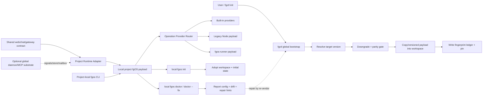

# Packaging And Distribution Architecture

**Status:** Architecture distillation / discussion baseline, not a locked spec
and not an implementation plan.
**Date:** 2026-09-04.
**Sources:** `docs/specs/distribution.md`, `docs/distribution-vision.md`,
`docs/architect/host-invocation-routing/*`, and the `tsk-1fp` distribution
version-safety task family.

This document collects the distribution facts and design pressure that now
affect Host Invocation And Provider Routing. Its job is to make the packaging
problem visible before the next brainstorm/refinement round. The authoritative
area spec remains `docs/specs/distribution.md`; this document names where that
spec is already settled, where the pending `tsk-1fp` direction would supersede
it, and what must be decided before the Rust host or any new installer becomes
the public path.

## 1. Why This Exists

The current Host Invocation And Provider Routing design can route a CLI,
remote host, or chat host to the right operation provider. That is necessary
but not sufficient for shipping fgOS. The host that does the routing must come
from a coherent installed payload: CLI host, legacy Node payload,
`fgos-runner`, plugins/skills, docs, setup/doctor registries, and any future
Rust artifacts must all agree on version, location, and repair ownership.

The packaging layer therefore owns a different question:

```txt
How does a project receive, select, verify, upgrade, repair, and roll back the
fgOS payload that its host invocation surfaces will run?
```

If this layer is left as "whatever executable is on PATH", Host Invocation
cannot provide project-specific version safety. Two projects on one machine may
need different fgOS versions, and a gateway serving multiple projects must not
silently route both through one shared global install.

## 2. Current Settled Baseline

`docs/specs/distribution.md` currently describes the shipped baseline:

- Install is a GitHub-backed npm package install, commonly
  `npm install -g github:vantt/forgent#v0.1.0`.
- The package exposes two public binaries: `fgos` and `fgos-runner`.
- `package.json` defines the installable surface with `bin` and `files`.
- Install runs no lifecycle script; contributor hooks are manual.
- Setup and doctor are real product entry points. `setup` writes/fixes, while
  plain `doctor` reports and `doctor --fix` runs registered fixes.
- Doctor checks, doctor fixes, and config defaults are extensible registries,
  not a hardcoded closed list.
- Global config and project config coexist; project config wins.
- A dev checkout shell helper can resolve three tiers from one sourced shell
  function: dev checkout, project-local `node_modules/.bin`, then global
  install.
- The Claude Code plugin distribution is separate from the npm CLI package and
  must ship both wrapper skills and copied coding-domain dev-skills.

This baseline is working and tested as a Node/npm distribution story. It does
not yet solve the project-vendored version-safety story proposed by `tsk-1fp`,
and it is not enough for the planned Rust-host artifact story.

## 3. What Local fgOS Is For

Installing fgOS is not an end in itself. fgOS is a workshop runtime: it carries
the executable surface plus prose, skills, agent instructions, setup/doctor
registries, state, events, logs, and automation needed to drive work. In the
normal product case, the fgOS payload that drives a workspace must be local to
that project workspace, not a shared global version.

There are three jobs this local fgOS payload may drive:

| Job | Workspace | What fgOS drives |
|---|---|---|
| Business workflow driving | A business/project workspace using fgOS as an operations substrate | Base workflow steps, human gates, automation, state, evidence, and recovery for non-coding business processes. |
| Coding product development | A product/code workspace using fgOS to build that product | Natural-language request intake, planning, isolated agent implementation, verification, review, merge, and learning for that product's code. |
| fgOS self-development | The forgent source workspace itself | The same driving loop, but the product being changed is fgOS. This is dogfood, and it creates the hardest packaging cleanliness problem. |

The first two are the mission workloads. The third exists because fgOS develops
itself with its own machinery while the platform is being built.

The self-development case must not be modeled as a separate "product fgOS" vs
"workshop fgOS" binary. fgOS is always the workshop. The problem is spatial:
when the product being packaged is fgOS itself, the workshop files and the
product source/package files live in the same project workspace unless the
architecture separates them deliberately. Earlier nested-repository approaches
made this worse by putting the fgOS product repo inside another workshop repo,
creating nested-git and path-resolution ambiguity.

This creates the key authority question for packaging:

```txt
Where does the local fgOS workshop payload live inside a project workspace, and
how is it kept out of that project's clean product/package surface?
```

The answer cannot be "whatever `fgos` resolves first" and cannot rely on nested
git boundaries. Driving work means writing `.fgos/` state, claiming work,
spawning agents, creating branches, running verification, presenting human
gates, and possibly approving merge. A wrong local payload version is a
control-plane bug, not a cosmetic command lookup problem. A dirty boundary
between workshop files and product files is a packaging bug.

The current confirmed direction is:

- global install may exist as bootstrap, fallback, or installer surface;
- distributed fgOS used to drive business/coding workflows should be local to
  the project workspace;
- local install must include more than binaries: prose, skills, agent
  instructions, manifests, setup/doctor material, and adapters are part of the
  payload;
- local fgOS workshop files must be excluded from the product package surface
  by manifest and doctor checks, not by a nested repo trick.
- global/machine management uses a different command from project workflow:
  `fgctl` is the bootstrap/controller command, while `fgos` is the
  project-local runtime CLI.

### Skill, Agent, And Prose Materialization

Skills, agent instructions, and runtime prose cannot live only in a hidden
runtime folder if the host agent discovers them from workspace paths such as
`.agents/skills` or `.claude/skills`. The local payload therefore needs a
source/projection split:

```txt
.fgos/runtime/workshop/
  skills/       # canonical installed skill payload, immutable/fingerprinted
  agents/       # canonical installed agent instructions
  prose/        # canonical runtime prose/contracts

workspace projections:
  .agents/skills/
  .claude/skills/
  AGENTS.md or other host-visible instruction entry points
```

The canonical workshop material is versioned with the local fgOS payload.
`fgos setup` materializes host-visible projections into the locations the
current harness actually reads. Those projections may live outside `.fgos/`,
but they are still fgOS-owned generated files and must be recorded in the
install ledger so `doctor` can check freshness/drift and product packaging can
exclude or classify them deliberately.

For forgent self-development, this is especially sensitive: source-authored
skills/prose in the product tree must not be silently overwritten by generated
workspace projections. The self-hosting case needs an explicit policy before
the architecture can call its package boundary clean.

## 4. Host Surface Scope And Semantic Authority

Host surface scope and semantic/runtime authority scope are separate axes.

```txt
shared web/chat/gateway surface
  -> stable UI command context
  -> Project Runtime Adapter
  -> local project fgOS semantic/runtime
  -> Project Runtime Adapter
  -> stable UI result/event context
```

The web dashboard is expected to be shared: one website can manage many
projects on a machine. The gateway front door is also shared at machine level:
remote/web/chat callers should not have to discover one port/process per
project just to use fgOS. The part that remains open is the execution
deployment behind that front door: per-request spawn, per-project worker, or a
future project-local daemon.

The shared gateway front door must not become a global fgOS runtime that owns
every project's semantics. It may aggregate projects, authenticate users,
serve web/chat contracts, and route requests; mutating project operations must
cross into the selected project's local fgOS payload.

Each project definitely has a local CLI that matches its own version/schema.
Remote web/chat access needs a translation boundary because the shared
web/gateway/chat contract is stable while each project may run a different
local fgOS version. That boundary is the **Project Runtime Adapter**.

The adapter is versioned with the local project fgOS payload and translates in
both directions:

- inbound `UiCommandContext` to the local project's semantic operation/request;
- local outcome, event, progress, and error back to the global UI response
  contract;
- capability/support reporting when a project version cannot serve a shared
  UI command;
- permission and project-context validation before the local runtime mutates
  state or code.

The adapter should not live purely in the global gateway. If it does, the
gateway has to learn every project's historical schema and becomes a disguised
global runtime. The global gateway should know a narrow protocol: discover a
project payload, ask which adapter contract/capabilities it supports, send UI
command context, receive UI result context, and stream progress/errors.

MCP belongs in this architecture as a possible global service substrate, not
as "turn every fgOS verb into an MCP tool." Good global daemon/MCP candidates
are project registry, store/read-model acceleration, event sourcing services,
signals, event bus, mailbox, cache, process/session supervision, and
notification fanout. Project workflow semantics such as submit, approve, move,
plan, or run-workflow are only safe through the selected project's local
payload/adapter, even if MCP is the transport.

### Command Boundary

The global/machine command is `fgctl`. It owns bootstrap and machine-level
management:

```txt
fgctl init
fgctl upgrade
fgctl repair
fgctl gateway start
fgctl gateway status
fgctl doctor machine
fgctl projects list
```

`fgctl init` is the one-command onboarding path. It detects the workspace,
installs or repairs the local fgOS runtime package under `.fgos/runtime`, then
executes the newly installed local runtime:

```txt
fgctl init
  -> install/repair .fgos/runtime
  -> .fgos/runtime/bin/fgos init
  -> .fgos/runtime/bin/fgos doctor --fix
  -> .fgos/runtime/bin/fgos doctor
```

The important boundary is that `fgctl init` orchestrates the phases; it does
not own project semantics itself. Project adoption and local repair are still
performed by the local `fgos` version that was just installed.

The project-local command remains `fgos`. It owns workspace workflow
semantics:

```txt
fgos init
fgos submit
fgos pick
fgos return
fgos review
fgos approve
fgos doctor
fgos doctor --fix
fgos-runner --watch
```

Invariant: if a command can mutate project workflow, state, code, or merge
gates, it belongs to the selected project's local `fgos` payload. If a command
installs, upgrades, discovers projects, or manages machine services, it belongs
to `fgctl`.

The shared web/gateway service is a separate machine artifact managed by
`fgctl`, not a per-project payload. It may be delivered through the same
release channel, but it is not the project workflow authority.

The previous `setup` mental model should not survive as a third public concept.
Its responsibilities move into local `fgos init` for workspace adoption and
local `fgos doctor --fix` for safe repair/materialization under the current
runtime identity.

## 5. Active Design Pressure

The `tsk-1fp` family captures the pending change in direction:

- The primary install path should move away from a shared global npm location
  toward a git-hosted installer that vendors/copies fgOS into each project.
- The installer, not the already-installed fgOS binary, should resolve the
  target version, copy the payload, write the baseline ledger, and fail closed
  when the payload is unsafe.
- The project-vendored fgOS version should own version-specific setup,
  doctor, config merge, and schema knowledge. A generic installer should not
  embed the business rules of every fgOS release.
- A project that already has fgOS should honor its pinned version unless a
  deliberate upgrade path is invoked.
- A downgrade must be refused unless the user explicitly forces it and both
  versions are known.
- Drift should be reportable from `fgos doctor`, but repair should flow through
  the installer/re-vendor path, not by ad hoc patching individual installed
  files.
- A parity gate must fail closed: if the files/projections that make up one
  project's fgOS payload do not agree on version/fingerprint, install success
  must not be reported.
- The current `distribution.md` Entry Points and RUL1-RUL12 baseline are a
  locked spec surface; switching the primary install model requires an explicit
  supersession in the spec body, not a silent edit.

The six current child tasks map to this shape:

| Task | Architectural Topic | Notes |
|---|---|---|
| `tsk-1fp-1` | Installer core | `install.sh` + `install.ps1`; resolve latest stable tag and copy payload into a project. |
| `tsk-1fp-2` | Version safety ledger | Downgrade refusal plus per-project fingerprint ledger. |
| `tsk-1fp-3` | Drift diagnostics | `fgos doctor` check reports ledger drift without repairing it directly. |
| `tsk-1fp-4` | Pin and upgrade path | Version pin plus `fgos upgrade` / `setup --latest`; depends on ledger semantics. |
| `tsk-1fp-5` | Fail-closed parity | Installer-owned R21/R22 gate; depends on installer core. |
| `tsk-1fp-6` | Spec supersession | Update `docs/specs/distribution.md` under the current decision-in-spec convention. |

## 6. Required Architecture Split

The emerging split is:



The installer owns payload acquisition and cross-version safety. The local
project payload owns semantic operations and version-specific setup/doctor
knowledge. The Project Runtime Adapter translates shared UI command context
into that local payload's semantic contracts. Host Invocation owns request
admission and provider routing after the correct local payload/adapter has
been selected. These responsibilities should not collapse into one component.

## 7. Payload Identity

A distributable fgOS payload needs a manifest-level identity, not just a
package version string:

- fgOS release version or tag;
- source revision or artifact revision;
- target platform where applicable;
- public entry binaries included in the payload;
- global `fgctl` controller artifact identity;
- machine gateway/web service artifact identity when installed;
- legacy Node payload location and digest;
- Rust host artifact location and digest when present;
- `fgos-runner` payload and digest;
- plugin/skill payload identity when distributed with the project install;
- workshop source/projection manifest for skills, agents, and prose;
- Project Runtime Adapter identity, contract versions, and capabilities;
- end-user docs/index payload identity;
- fingerprint ledger schema version.

This identity is the bridge between distribution and Host Invocation. A host
must be able to say which payload it is running before it can explain why an
operation was routed to a Rust provider, a Node compatibility provider, or an
external provider.

## 8. Host Invocation Coupling

The Host Invocation design introduces `HostInvocation`, `OperationRequest`,
`ProviderDescriptor`, and the Operation Provider Router. Distribution affects
each one:

- `HostInvocation` must carry project/global resolution context. With local
  project payloads, this context should resolve to the project payload and its
  Project Runtime Adapter before provider routing begins.
- `ProviderDescriptor` must identify the provider implementation from the same
  payload manifest. A Rust host must not bind to a legacy Node file from a
  different release.
- CLI compatibility cannot point at an ambiguous historical `bin/fgos.mjs`.
  The migration docs already select a named legacy payload path:
  `packages/legacy-node/node/fgos.mjs` in source and
  `libexec/fgos/legacy-node/fgos.mjs` when installed.
- Remote/gateway/chat invocation must not shell through whatever `fgos`
  happens to be on PATH and must not interpret project semantics in the global
  gateway. It should send stable UI command context through the selected
  project's Project Runtime Adapter, then invoke the same local host
  runtime/provider contracts as CLI.
- `distribution.build.show` or equivalent native version/build operation is
  the first useful proof operation because it can expose payload identity
  without spawning Node.

The invariant is simple: shared host surfaces may aggregate projects, but
project semantics belong to the selected local payload. Provider routing
chooses among providers inside that payload; distribution chooses which payload
and adapter are selected for the project.

## 9. Rust Host Release Implications

The Rust migration plan makes distribution an R1 blocker for the public entry
flip. R1 is not just "a Rust binary builds"; it is "the installed `fgos` entry
is Rust, unmigrated selectors still reach the correct Node compatibility
payload, and install/upgrade/rollback are reproducible."

Before R1 can flip the public installed entry, the packaging layer must settle:

- supported target matrix;
- artifact/archive publication mechanism;
- installer entry path;
- artifact naming and integrity policy;
- upgrade and rollback channel;
- compatibility-window duration;
- whether first Rust host release is preview or stable default;
- whether `setup`/`doctor` may download/select an upgrade or only report/fix
  local configuration.
- how the R1 payload exposes Project Runtime Adapter metadata, even if early
  adapter execution still delegates to legacy Node.

Until those are locked, Rust host implementation can still proceed locally, but
the public distribution cutover cannot honestly be called done.

## 10. Current Install Contexts

There are three contexts on one developer machine:

| Context | Current Resolution | Desired Property |
|---|---|---|
| Dev checkout | Shell helper runs the checkout's `bin/*.mjs` when cwd is inside forgent. | Contributor self-hosting remains explicit and never installs itself. |
| Project-local install | Shell helper walks up to `node_modules/.bin/fgos`. | Project can pin its own fgOS independently of other projects. |
| Global install | PATH or cached global bin path. | Fallback only; should not override a project-local payload. |

The project-vendored installer direction introduces a stronger form of the
project-local row: the project owns a complete fgOS payload, not merely a
package-manager bin link. The exact on-disk location is still open and should
be decided alongside the manifest/ledger design. That location must live inside
the project workspace because fgOS includes prose, skills, and agent
instructions, not just executable binaries; the design cannot depend on a
driver root outside the workspace.

## 11. Init And Doctor Contract

Existing setup/doctor registry work remains valuable under the new model, but
the public `setup` concept should collapse into `init` and `doctor --fix`:

- modules register config defaults, checks, and fixes in one discoverable
  system;
- local `fgos init` adopts the workspace and creates initial state/config/
  doctrine/projections;
- plain `doctor` remains read-only;
- `doctor --fix` runs named safe repairs/materialization under the currently
  installed runtime identity and then reports again.

The hard boundary is runtime identity. `fgctl init`, `fgctl repair`, and
`fgctl upgrade` may change `.fgos/runtime`, the local distributed package
identity, manifest, ledger, and pin. Local `fgos init` and
`fgos doctor --fix` may not. They configure or repair the workspace under the
runtime identity already installed.

If a ledger says the local runtime payload has drifted, local `doctor` should
report the drift and point to `fgctl repair` or `fgctl upgrade`. It should not
silently mutate release payload files, because that would erase the evidence
the ledger exists to preserve and turn `doctor --fix` into an installer in
disguise.

## 12. Documentation Placement

For now, all new thinking in this thread stays under `docs/architect/`.
`docs/specs/` is generated/curated as the state layer and should be updated
only after this architecture discussion settles and the generated-source
workflow is checked.

Expected later destinations, after settlement:

- `docs/specs/distribution.md` receives the actual distribution contract
  supersession.
- `docs/specs/system-overview.md` receives only the cross-area flow summary.
- `docs/specs/runner.md` receives runner/remote driving authority only if the
  adapter affects runner lifecycle.
- `docs/specs/fgos-plugin.md` receives skill/prose materialization changes.
- `docs/specs/herdr-web-dashboard.md` or a gateway spec receives the shared UI
  surface contract once the front-door/project-execution boundary is settled.
- `docs/architect/host-invocation-routing/*` receives cross-links to Project
  Runtime Adapter and local payload selection once this spine is stable.

## 13. Open Questions For Brainstorm

These are the questions this architecture thread still needs to refine:

1. What is the project-vendored payload location? Candidates include a hidden
   `.fgos/vendor/` tree, a package-manager-managed local dependency, or a
   dedicated `.fgos/bin`/`.fgos/libexec` layout.
2. Is the installer still a source-copy installer for the Node era, or should
   it immediately adopt the future artifact layout that Rust R1 needs?
3. Does the installer vendor plugin skills and end-user docs with the CLI
   payload, or are plugin/skills still a separate distribution channel?
4. What exactly is fingerprinted: every copied file, only executable/provider
   payloads, generated manifests, docs, skills, or all shipped files?
5. Where is the pin stored, and is it part of the same ledger as fingerprints?
6. What is the force-downgrade UX and audit record?
7. What are the exact `fgctl init` phases and failure semantics when install,
   local init, local doctor-fix, or final doctor fails?
8. Which old `setup` behaviors become local `fgos init` responsibilities, and
   which become local `fgos doctor --fix` responsibilities?
9. How does a gateway serving many projects cache or avoid caching payload
   resolution without violating project-specific version selection?
10. What is the rollback unit: previous payload directory, previous manifest,
    previous pin, or an external archive ref?
11. How long must the Node compatibility payload remain shipped after Rust host
    R1, and what evidence allows removing one legacy selector?
12. Which distribution facts belong in `docs/specs/distribution.md` versus this
    architecture document once decisions settle?
13. Where does the local fgOS payload live inside a workspace so it can carry
    prose/skills/agent instructions without entering the product package
    surface?
14. Which execution deployment sits behind the shared gateway front door:
    per-request spawn, per-project worker processes, or project-local daemon?
15. What is the minimal Project Runtime Adapter contract: capability discovery,
    UI command input, result output, progress stream, error families, and
    version negotiation?
16. Which global daemon/MCP substrate services are allowed before they start
    owning project semantics?
17. What is the exact compatibility behavior for the old globally installed
    `fgos` command during the transition to `fgctl`?
18. Which host-visible projection paths are supported for skills/agents/prose,
    and how does self-development avoid overwriting source-authored material?
19. Should local `fgos doctor --fix` be allowed to invoke `fgctl repair` as an
    explicit suggested command only, or as a subprocess when the user passes a
    stronger flag?

## 14. Proposed Brainstorm Order

The least tangled order is:

1. Lock the payload model: project location, manifest fields, ledger/pin shape.
2. Lock `fgctl` authority: what it may mutate, what it refuses, how rollback
   works, and how `fgctl init` composes local `fgos init`/`doctor --fix`.
3. Lock local init/doctor relationship: what belongs to adoption vs safe repair
   after `setup` is removed from the public model.
4. Lock Project Runtime Adapter: how shared web/chat/gateway command context
   translates into local project semantics.
5. Lock host invocation resolution: how CLI/gateway/chat select the project
   payload/adapter before provider routing.
6. Lock global daemon/MCP substrate boundaries.
7. Lock Rust R1 artifact shape and compatibility payload placement.
8. Only then supersede `docs/specs/distribution.md` and derive implementation
   tasks.

This order keeps the distribution conversation from being split between
installer mechanics, Rust migration, and gateway routing. The central contract
is the payload identity and manifest; every other piece hangs from that.
