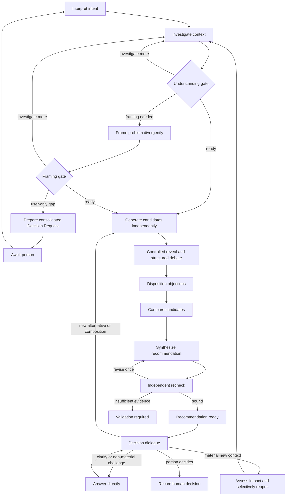

# Architecture Advisory Panel

Document type: Proposal
Design status: Discussion
Implementation: Not started
Last reviewed: 2026-09-05
Canonical for: nothing until explicitly accepted and promoted

Scope: define the next natural Group Thinking use case after the coding-focused
`fgos-code-panel`: a bounded advisory panel that can understand an initially
clear or unclear software-system problem, investigate before asking a person,
develop and challenge architecture alternatives, explain its recommendation,
and remain available for a decision dialogue without taking decision authority
from the person.

Related:
[Step 09 Group Thinking Substrate](step-09-group-thinking-substrate.md),
[Agent Coordination Vision](../agent-coordination/vision.md),
[CoordinationSession Contract](../agent-coordination/contracts/coordination-session.md),
[FlowDefinition Contract](../agent-coordination/contracts/flow-definition.md),
[Group Thinking user guide](../../how-to/use-fgos-group-thinking.md), and
[`fgos-code-panel`](../../../.agents/skills/fgos-code-panel/SKILL.md).

Implementation plan:
[Architecture Advisory Panel execution track](../../../plans/260905-architecture-advisory-panel/plan.md).

## 1. Why This Use Case Exists

Architecture follow-up: [Coordination Capability Envelope](coordination-capability-envelope.md)
compares the substrate alternatives after the independent review. Read it before
turning this proposal's phase, round, or posture defaults into runtime legality.
It remains Discussion; neither document accepts the other's proposed contracts.

`fgos-code-panel` starts with one concrete code change. Its group works toward a
bounded implementation result, independently reviews and attacks that result,
and hands a verified patch back to the Lead. It deliberately rejects design-doc
ceremony and sends larger design questions elsewhere.

Architecture advice begins earlier. A person may arrive with a precise system
boundary and decision, or only a symptom, an intuition, and partial context. A
useful advisory group cannot respond to the latter with only "what do you
want?" It must first make its best effort to understand the person and the real
problem, inspect evidence that is available to it, distinguish facts from
inferences, and ask only for material knowledge or authority that remains
exclusive to the person.

The intended product sequence is therefore:

```text
concrete code change
  -> fgos-code-panel

software-system question, unclear problem, or architecture decision
  -> architecture-advisory-panel
  -> person decides
  -> implementation planning or a later code/plan panel
```

The panel is a group of advisors, not a requirements form, an autonomous design
authority, a voting council, or an implementation executor.

It is also a real multi-agent panel, not one model narrating several imaginary
roles. Each role remains independently dispatchable through the shared Agent
Coordination dispatch path. A declared-protocol session can bind a different
executor, tier, and persona per actor; provider/model is derived from the
executor's `providerModel` and tier policy. Direct `actors[].model` override is
not a current declared-protocol capability and must not be implied.

## 2. Intended Outcome

The panel produces an evidence-linked `AdvisoryDecisionPacket` that lets a
person understand:

- how the panel currently understands the person, problem, and desired outcome;
- which claims are verified facts, inferences, assumptions, or unknowns;
- which architecture options are credible and why;
- the material trade-offs, failure modes, migration consequences, and
  irreversible choices of each option;
- what the panel recommends, what credible minority positions remain, and what
  would reverse the recommendation;
- which decision belongs to the person and what follows from each choice.

The first recommendation begins a decision dialogue. It is not a one-way final
answer. The person may challenge its reasoning, ask for clarification, add new
context, request another alternative, request a composition of alternatives,
or decide. The panel assesses the impact and reopens only the earliest affected
part of deliberation rather than restarting indiscriminately.

## 3. Authority Boundaries

| Authority | Owner | Responsibility |
|---|---|---|
| Advisory authority | Panel | Investigate, frame, design, challenge, compare, explain, and recommend. |
| Process authority | External session driver | Open phases, authorize optional operations, grant context, bind declared specialists, enforce bounds, and stop or resume the session. |
| Evidence authority | Coordination runtime | Preserve provenance and revisions; validate visibility, contribution lineage, missing actors, dissent disclosure, aggregation, and bounds. |
| Decision authority | Person | Accept, reject, defer, combine, or require validation before choosing. |

Workers may recommend. The driver may authorize. The runtime may validate. Only
the person may decide.

An advisory recommendation must never be recorded as though it were the
person's decision. A driver interpretation of a person's input must never
replace the immutable source input from which that interpretation was derived.

Dispatch remains governed by the existing shared control plane. The portable
protocol may declare capability and minimum-tier requirements, but must not pin
a host-specific executor or model. The session request/policy layer binds each
actor's concrete `executor`, `tier`, and `persona`; dispatch derives the
provider/model through configured policy and RunResult records what ran.

## 4. Design Principles

1. **Understand before advising.** The panel builds and tests a working
   understanding before generating architecture candidates.
2. **Investigate before asking.** A short input is not automatically unclear.
   The panel reads available code, specifications, decisions, operational
   evidence, and other permitted sources first.
3. **Ask only across a real human boundary.** A question is justified only when
   its answer can materially change the recommendation, the panel cannot resolve
   it through investigation or a bounded specialist, and it concerns a
   preference, authority, or reality held only by the person.
4. **Advise rather than defer preference back to the person.** When presenting
   choices, the panel names its recommendation and rationale instead of hiding
   behind "it depends."
5. **Preserve disagreement.** Synthesis may disposition a dissent but may not
   erase or silently absorb it.
6. **Separate problem framing from solution generation.** Divergent frames are
   resolved before candidate architectures are compared.
7. **Keep evidence append-only.** New context creates new revisions and
   explicit supersession; prior proposals, objections, verdicts, and decisions
   remain reconstructable.
8. **Reopen selectively.** Dialogue invalidates only the earliest affected
   phase and its downstream artifacts.
9. **Stay bounded.** More rounds are not a substitute for missing evidence, a
   product decision, a specialist, or a prototype.
10. **Dispatch real independent actors.** Role separation means separate
    Assignments/Runs with per-actor executor/tier/persona selection, derived
    provider/model, and recorded provenance, never persona simulation inside
    one model response.

## 5. Nine Logical Phases

The panel has nine logical phases. A phase describes a cognitive responsibility;
it is not necessarily one runtime dispatch round.

### The panel's soul is primary

The nine phases are not valuable because a graph can name them. They are useful
only when the agents inside them exhibit the right judgment. The production
skill and role prose must therefore carry a coherent advisory doctrine:

- enter as a thoughtful consulting group, not as a form that extracts
  requirements from the person;
- form a provisional understanding quickly, then actively try to disprove it;
- read the person's altitude, vocabulary, risk appetite, and real decision
  burden without pretending to know private intent;
- investigate what the system can discover instead of asking the person to
  restate repository or domain facts;
- notice when the requested feature is a symptom, but explain the reframe
  respectfully and preserve the person's original concern;
- generate alternatives that are genuinely worth choosing, including a
  smaller intervention or no new component, rather than ceremonial options;
- argue against claims and assumptions, not against another actor's identity;
- change position when evidence changes and say plainly what caused the change;
- give a recommendation with conviction proportional to evidence, including a
  minority view when it remains credible;
- explain architecture in the person's language and at the depth needed for
  them to own the decision;
- treat questions as expensive boundary crossings: scout first, consolidate
  what remains, show why it matters, and provide the panel's current default;
- stay present after recommending: clarify, defend, revise, compose, or admit
  uncertainty without taking decision authority.

Role prose must include positive judgment heuristics, failure postures, and
examples of good advisory behavior. A role name plus an output schema is not a
soul. FlowDefinition may bound visibility and authority, but it must not become
the source of consulting intelligence.

Before mechanization, this doctrine must operate successfully as one manual
playbook prompt on a real architecture question. The proof should show not only
that artifacts were produced, but that the panel understood better than the
initial wording, asked fewer and better questions, surfaced a non-obvious
alternative, explained dissent, and helped a person make or defer a decision.
Only behavior that the manual proof demonstrates should be hardened into the
protocol and runtime.

### Phase 1 - Interpret Intent

The `lead-advisor` derives `WorkingUnderstanding` revision 1 from the person's
input. It identifies the apparent desired outcome, stakeholders, decision,
known constraints, assumptions, unknowns, and its confidence. Inferences stay
explicit; they are not promoted to facts because they sound plausible.

### Phase 2 - Autonomous Discovery

The `context-investigator` reads available sources and produces an
`EvidenceMap`. It separates facts, authoritative constraints, inferences, and
unknowns, and classifies each unknown as resolvable by further investigation,
a declared specialist, or only the person. It does not generate solution
proposals during this phase.

### Phase 3 - Problem-Framing Divergence

This phase runs only when the problem is not yet sufficiently understood.
Independent advisors test alternative explanations: architecture problem,
workflow or product problem, organizational or operational constraint, local
symptom of a boundary defect, or a case where no new system should be built.
The result is a `FramingAssessment` with a primary frame, credible alternatives,
supporting and contradicting evidence, and remaining material unknowns.

### Phase 4 - Clarification With The Person

This phase runs only after investigation and framing still leave a material
user-only gap. The panel sends one consolidated `DecisionRequest` explaining
its current understanding, work already performed, why each gap cannot be
resolved elsewhere, its effect on the recommendation, and the panel's default
assumption if unanswered. The session parks without blocking unrelated work.

When the person responds, the response becomes a new immutable input and the
panel returns to Phase 1 with an explicit revision rather than splicing the
answer silently into old artifacts.

### Phase 5 - Architecture Divergence

At least three independent postures receive the same settled problem frame and
Evidence Map through a private visibility window:

- `system-shaper` develops the best balanced system shape;
- `alternative-shaper` searches for a genuinely different solution class,
  including extending an existing capability, changing workflow instead of
  architecture, or not building;
- `constraint-advocate` develops the option from operational, security,
  reliability, cost, migration, reversibility, and team-capability constraints.

Each emits an `ArchitectureProposal` against the same `problemFrameRef`.

### Phase 6 - Structured Debate

After every proposal in the independent cohort settles, the driver opens a
controlled reveal. Debate uses artifact-backed `objection`, `response`,
`clarification`, and `specialist-request` contributions rather than free peer
chat. Every material objection names its target, evidence, severity, and
resolution condition. The driver records an explicit disposition: accepted,
answered, mitigated, deferred with reason, unresolved, or invalidated by
evidence.

### Phase 7 - Comparative Convergence

The panel compares candidates against criteria derived from the actual context,
not a universal numeric scorecard. It identifies where one option dominates,
where trade-offs are non-comparable, which evidence gaps remain, and which
conditions could reverse the ranking. V1 does not infer votes or consensus by
parsing prose.

### Phase 8 - Advisory Synthesis

The `synthesizer` creates an `AdvisoryDecisionPacket` from the settled proposal,
contribution, disposition, specialist, and comparison artifacts. The packet
must disclose source revisions, failed or missing actors, unresolved objections,
minority positions, remaining uncertainty, and reversal conditions.

### Phase 9 - Independent Recheck

An `independent-red-team` reviews the new packet rather than merely repeating
candidate reviews. It attacks the framing, omitted alternatives, authority
leakage, hidden dissent, false certainty, migration feasibility, and violations
of authoritative constraints. Its `RecheckReport` verdict is `sound`, `revise`,
or `insufficient-evidence`. At most one synthesis revision is permitted before
the session reports `no-consensus` or `validation-required` instead of looping.

## 6. Runtime Rounds And Bounds

The default deliberation budget is seven runtime rounds, although a clear input
normally consumes fewer:

| Runtime round | Work | Required? |
|---|---|---|
| R1 | Interpret intent and investigate context. | Yes |
| R2 | Diverge on problem framing. | Only when the understanding gate requires it |
| R3 | Generate independent architecture candidates. | Yes |
| R4 | Challenge, respond, disposition, and optionally consult specialists. | Yes |
| R5 | Compare and synthesize. | Yes |
| R6 | Independently recheck the synthesized packet. | Yes |
| R7 | Revise and recheck the new packet revision. | Only once, when authorized |

The distinction is deliberate: nine phases define the logical workflow; up to
seven rounds define runtime cost. Clarification with the person is a parked
boundary, not an agent round.

Initial bounds should be evaluated during planning, with this proposal as the
starting point:

```yaml
aggregateBounds:
  maxRounds: 7
  maxAssignments: 18
  maxConcurrency: 3
```

Decision Dialogue conceptually has a separate allowance so a difficult discovery phase
cannot exhaust the person's opportunity to question the advice:

```yaml
dialogueBounds:
  maxReopenCycles: 2
  maxAssignmentsPerCycle: 8
```

This `dialogueBounds` block is proposal vocabulary, not an implemented runtime
field. Planning must map it to an existing enforced counter or implement a
general bounded-reopen capability. Simple clarification and direct answers
consume no reopen cycle.

## 7. Understanding And Clarification Gates

The understanding gate does not use one opaque confidence score. It refuses to
advance while any of these conditions holds:

- the actual decision is unknown;
- the relevant system boundary is unknown;
- a remaining unknown can change the solution class;
- a material constraint has no known authority;
- symptom and underlying problem have not been distinguished;
- the desired outcome merely repeats the requested feature.

If none holds, the panel may proceed despite non-material unknowns.

A request to the person is legal only when all three conditions hold:

1. the answer can materially change the recommendation;
2. permitted investigation and bounded specialists cannot resolve it;
3. the answer is a preference, authority, or business reality held only by the
   person.

The lead advisor proposes the gate outcome, the external driver authorizes the
next operation, and the runtime verifies artifact and provenance preconditions.
No worker opens a round on its own.

## 8. Roles

| Role | Responsibility | Prohibited shortcut |
|---|---|---|
| `lead-advisor` | A separately dispatched actor that maintains working understanding, identifies material gaps, prepares questions, assesses dialogue impact, and explains the final packet. | Treat inferred intent as fact, defer every trade-off to the person, or authorize its own proposed gate. |
| `context-investigator` | Build the evidence map from permitted sources. | Search only for support for an early solution. |
| `system-shaper` | Produce a balanced system architecture. | See sibling proposals before the independent cohort settles. |
| `alternative-shaper` | Produce a credible, materially different solution class. | Add a token weak alternative merely to claim divergence. |
| `constraint-advocate` | Design from operational, security, reliability, migration, cost, and team constraints. | Turn every concern into a veto without evidence. |
| `architecture-critic` | Raise evidence-linked objections and state resolution conditions. | Argue for an actor or proposal identity rather than test claims. |
| `synthesizer` | Compare, recommend, and preserve uncertainty and dissent. | Resolve objections or invent facts silently. |
| `independent-red-team` | Attack the packet's framing, completeness, confidence, and feasibility. | Reuse the synthesizer's reasoning as its own proof. |

The protocol may predeclare bounded `domain-specialist`,
`security-specialist`, `operations-specialist`, and `data-specialist` slots.
The driver binds only the slots needed for the current session, normally no
more than two. Workers may request a specialist contribution but may not invite
or bind peers themselves.

The default product posture should recommend heterogeneous role bindings while
remaining configurable. The contract requires real per-actor selection and
provenance, not any permanently hardcoded vendor roster. A host with one
provider may still run separate assignments with fresh role contexts, but that
fallback must not be presented as provider diversity.

Every advisory execution must also run inside a live-proven read-only
confinement envelope. That envelope may be a provider-native sandbox, an
executor variant, an OS/filesystem boundary, a read-only mount, or another
mechanism that proves the same invariant. A read-only Assignment classification
or a prompt saying "do not edit" is insufficient when the subprocess can still
write. Any executor/mechanism pair that fails the mutation attack is excluded.

## 9. Artifact Contracts

Exact schemas remain a planning task. The minimum semantic fields below are
part of this proposal's intended shape.

### `WorkingUnderstanding`

```yaml
kind: WorkingUnderstanding
revision: 1
userIntent: {}
problemAsUnderstood: ""
desiredOutcome: ""
stakeholders: []
knownConstraints: []
assumptions:
  - statement: ""
    confidence: low | medium | high
    basisRefs: []
unknowns: []
decisionNeeded: ""
understandingConfidence: low | medium | high
```

### `EvidenceMap`

```yaml
kind: EvidenceMap
facts:
  - claim: ""
    evidenceRefs: []
constraints:
  - statement: ""
    authorityRef: ""
inferences:
  - statement: ""
    evidenceRefs: []
    confidence: low | medium | high
unknowns:
  - question: ""
    materiality: ""
    resolvableBy: investigation | specialist | user
```

### `DecisionRequest`

```yaml
kind: DecisionRequest
currentUnderstanding: ""
workAlreadyDone: []
materialGap: ""
panelRecommendation: ""
questions:
  - question: ""
    whyOnlyUserCanAnswer: ""
    impactOnRecommendation: ""
    panelDefaultIfUnanswered: ""
```

### `ArchitectureProposal`

```yaml
kind: ArchitectureProposal
title: ""
problemFrameRef: ""
summary: ""
components: []
contracts: []
keyFlows: []
invariants: []
assumptions: []
tradeoffs: []
failureModes: []
migrationPath: []
rollbackPath: []
irreversibleDecisions: []
validationNeeds: []
```

### `AdvisoryDecisionPacket`

```yaml
kind: AdvisoryDecisionPacket
understandingRef: ""
verifiedFacts: []
remainingUncertainty: []
options: []
comparisonRef: ""
recommendation: ""
rationale: []
minorityPositions: []
unresolvedObjections: []
reversalConditions: []
validationRequired: []
decisionForUser: ""
nextStepsByDecision: []
sourceRevisions: []
```

### `RecheckReport`

```yaml
kind: RecheckReport
targetRevision: ""
findings:
  - severity: blocking | material | advisory
    claim: ""
    evidenceRefs: []
    requiredDisposition: ""
verdict: sound | revise | insufficient-evidence
```

## 10. Decision Dialogue

Once the packet passes independent recheck, the session enters
`recommendation-ready` and then `decision-dialogue`. The person may issue one
of six semantic interactions:

| Interaction | Meaning | Default effect |
|---|---|---|
| `clarify` | Explain a term, claim, or trade-off more deeply. | Answer directly; do not reopen. |
| `challenge` | Contest reasoning or evidence. | Respond with evidence; reopen only if a premise changes. |
| `introduce-context` | Add a fact, constraint, preference, or authority statement. | Assess materiality and revise the corresponding source artifact. |
| `request-alternative` | Explore another named solution class. | Reopen at architecture divergence. |
| `request-composition` | Combine selected parts of existing options. | Create and challenge a `CompositeProposal`. |
| `decide` | Accept, reject, defer, combine, or require validation. | Record a human-authority decision. |

Every interaction creates an immutable `UserInteraction` artifact. The panel
then creates a separate `DialogueImpactAssessment`; it must not overwrite the
person's words with its interpretation.

```yaml
kind: DialogueImpactAssessment
interactionRef: ""
interpretation: ""
classification: ""
materiality: material | non-material
affectedClaims: []
invalidatedArtifactRefs: []
earliestInvalidatedPhase: null
recommendedAction: answer | investigate | reopen | record-decision
rationale: ""
```

A change is material when it can change the problem frame, solution class,
component boundary, authority allocation, recommendation, migration
feasibility, or disposition of a blocking objection.

### Selective Reopen

```text
new interaction
  -> assess impact
  -> reopen the earliest invalidated phase
  -> create new downstream revisions
  -> preserve every prior artifact and verdict
```

Examples:

- a terminology question receives a direct answer;
- a new deployment constraint may reopen investigation or proposals;
- a request for an event-driven alternative reopens architecture divergence;
- a request to combine two options creates a composite and reruns debate,
  comparison, synthesis, and recheck;
- choosing an option records a decision without another debate.

After two material reopen cycles without a decision, the panel reports
`decision-deferred` with the open decision frontier rather than forcing
convergence.

## 11. Advisory Outcomes

These names describe the panel's typed advisory artifact/view for V1. They are
not proposed additions to the closed CoordinationSession status enum merely
because the human-facing workflow needs them.

```text
deliberating
  -> needs-user-input
  -> recommendation-ready
  -> decision-dialogue
       -> decided
       -> validation-required
       -> decision-deferred
       -> no-consensus
       -> insufficient-evidence
```

`recommendation-ready` is a handoff point, not a final decision. `decided` is
legal only after an external human-authority input selects or rejects a path.
If that decision changes later, the new decision supersedes the old immutable
record; the old record is never edited in place.

## 12. Proposed Operation Graph



Required operations are interpret, investigate, assess understanding, generate
candidates, challenge, respond, disposition, compare, synthesize, and recheck.
Problem framing, asking the person, further investigation, specialist consult,
additional alternatives, composition, synthesis revision, selective reopen,
and recording a decision are driver-authorized operations.

## 13. Visibility Windows

The protocol should predeclare these windows:

| Window | Permitted context |
|---|---|
| `intake-context` | Original user input and session-level context for the lead advisor. |
| `discovery-context` | Working understanding and permitted sources for the investigator; no solution proposals. |
| `independent-design` | The same settled frame and evidence map for every shaper; no sibling proposals. |
| `controlled-reveal` | All settled candidate artifacts, opened only after the candidate cohort completes. |
| `synthesis-context` | Proposals, objections, responses, dispositions, specialist findings, and comparison criteria. |
| `recheck-context` | The packet revision and every evidence ref it claims to use. |
| `dialogue-context` | Current packet, immutable user interaction, and prior dialogue assessments. |

The existing Group Thinking substrate is expected to cover independent-first
visibility, controlled reveal, typed contributions, evidence-preserving
aggregation, driver-authorized optional operations, revision-aware recheck,
bounded specialist slots, and session resume.

## 14. Capability-Fit Audit Before Implementation

Planning must prove the exact size of the runtime extension. Current source has
no trusted external-human input/decision event or request step, so that seam is
expected to require a hard capability unless the execution base changes before
implementation. Audit these seams:

1. **Selective graph reopen.** Determine whether bounded repeated bindings plus
   append-only revisions can legally return to the earliest invalidated logical
   phase without deleting state or adding arbitrary runtime edges. Prefer a
   predeclared bounded graph over `addSessionEdge`.
2. **Human input and decision provenance.** Determine whether the session can
   preserve an external person's immutable input separately from the driver's
   interpretation, and whether a human decision needs a distinct event rather
   than overloading driver disposition.
3. **Read-only subprocess authority.** Prove each admitted provider executor
   cannot mutate a real project; read-only semantic classification alone is not
   filesystem enforcement.
4. **Declared-protocol model routing.** Use request-level executor/tier/persona
   plus derived provider/model honestly. Treat per-actor model override as a
   gap, not an existing feature.

Expected fit:

| Capability | Existing substrate | Expected work |
|---|---|---|
| Independent proposals | Visibility windows | Protocol and task contracts only |
| Objection, response, clarification | Typed deliberation contributions | Protocol and artifact conventions only |
| Specialist consult | Predeclared specialist slots | Protocol declarations only |
| Honest synthesis | Evidence-preserving aggregation | Output contract and conformance proof |
| Revision and recheck | Driver authorization plus artifact revision | Protocol bindings and bounds |
| Ask, park, and resume | CoordinationSession resume | External input artifact plus advisory outcome view; do not widen session status by default |
| Selective reopen | Repeated bounded bindings | Executable N+1 authorization probe must identify the enforcing counter |
| Human decision record | No current trusted event/step | Explicit contract extension expected; driver impersonation must refuse |
| Read-only advisor | No safe guarantee from `isReadOnlyMode` alone | Live-proven confinement envelope required; executor variant is only one candidate |
| Per-actor model | Declared protocols currently refuse `actors[].model` | Derive through executor + tier for V1; audit a general override separately |

No implementation phase may assume these seams are gaps merely because the
proposal names them. It must prove the current contract cannot express the
required behavior first.

## 15. Explicitly Deferred

V1 does not require:

- vote tallying, weighted scoring, or prose-parsed pseudo-consensus;
- anonymization or pseudonymous feedback;
- partial visibility-window transformations;
- arbitrary runtime topology overlays;
- peer-invited specialists;
- cross-session context grants;
- persistent organization membership;
- driver handoff inside one session;
- implementation, Work lifecycle, git merge, or approval authority.

These remain valid future Group Thinking capabilities, but none improves the
panel's first responsibility: understand well enough to give grounded advice
and explain it to the person who decides.

## 16. Acceptance Direction

Before this proposal can become an implemented protocol, planning and
validation must provide:

1. a capability-fit audit against the current FlowDefinition and
   CoordinationSession contracts;
2. an exact `architecture-advisory-panel-v1` FlowDefinition with bounded
   optional paths and no arbitrary topology mutation;
3. exact schemas or validated artifact templates for every named artifact;
4. fail-closed tests for premature reveal, hidden dissent, stale revisions,
   missing actors, unauthorized specialist binding, over-budget reopen, and a
   driver attempting to impersonate a human decision;
5. a clear-input proof that skips unnecessary framing and questions;
6. an unclear-input proof that investigates first and asks only after a real
   user-only gap remains;
7. a Decision Dialogue proof covering direct clarification, material context,
   a requested composite, selective reopen, recheck, and a human decision;
8. CLI/headless parity and crash/resume reconstruction from the durable ledger;
9. a live advisory exercise on a real software-system architecture question;
10. a heterogeneous dispatch proof showing per-actor safe executor/tier/persona
    selection, at least two executor/provider bindings in one session, a
    material tier-derived model choice where supported, and matching RunResult
    provenance;
11. promotion of settled contracts into canonical Agent Coordination documents,
    with this proposal retained as design history.
