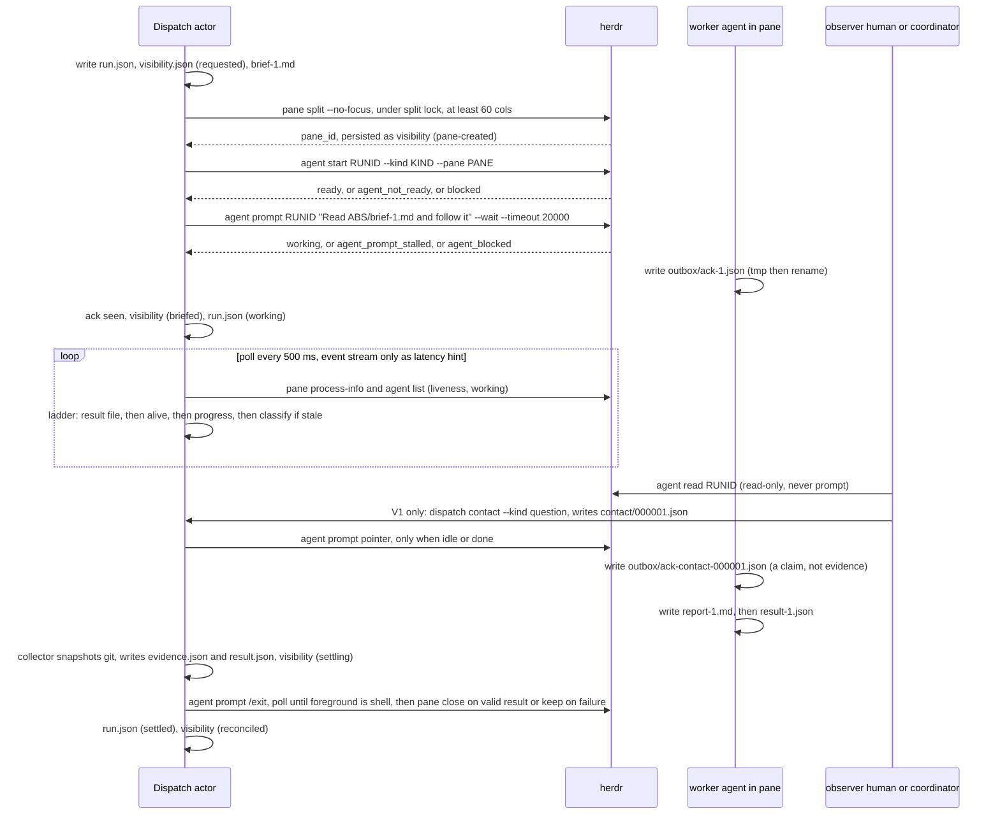

# Visibility và Interactive Contact trong Dispatch & Execution — herdr-spawn là candidate đầu tiên

Document type: Proposal (investigation, lượt conceptual đầu — read-only)
Design status: Discussion
Implementation: Existing `herdr-spawn` adapter (family A bên dưới); không có source nào được sửa trong lượt này
Last reviewed: 2026-09-06
Canonical for: nothing until accepted; reconstruct hiện trạng + failure modes + boundary + conceptual design cho visibility/contact của mechanism interactive
State class: State

Related: [Visibility And Herdr](../agent-coordination/architecture/visibility-and-herdr.md),
[Dispatch Control Plane](../agent-coordination/architecture/dispatch-control-plane.md),
[Coordination ↔ Dispatch contract](coordination-dispatch-contract.md),
[Worker/provider/control boundary](coordination-worker-provider-boundary.md),
[herdr-spawn adapter history](../../explanation/herdr-spawn-adapter-fresh-pane.md),
[Brainstorm 2026-08-27 (superseded)](../agent-coordination/history/brainstorms/agent-team-dispatch-and-herdr-stability-2026-08-27.md).

Nhãn chứng cứ dùng trong tài liệu: **native proven** (code + test có trong repo, chạy được), **native observed but incomplete** (code có, hành vi chỉ đúng một phần hoặc chưa test), **prototype-only**, **unproven** (chỉ là prose/giả định), **unsafe** (đã đo là gây hại), **upstream-proven** (beegog v2.33.2 đã đo và ship, chưa chạy trong fgOS).

---

## 1. Working Understanding

Câu hỏi thật không phải "làm pane herdr chạy chắc hơn". Câu hỏi là: **khi Dispatch chọn một mechanism interactive, nó phải trả về cho caller một bộ capability quan sát/liên lạc tương ứng, và lifecycle truth của Run phải nằm ở Dispatch chứ không ở terminal.**

```txt
Coordinator judgment
  → semantic Assignment
  → coordination grants / bounds
  → Dispatch & Execution
       → executor / provider / model / tier / persona
       → mechanism (in-process | cli-spawn | herdr-spawn …)
       → execution capability set   ← MỚI, mechanism khai báo
            observe · contact · interrupt · checkpoint · resume
       → Run + VisibilitySession + RunResult
  → durable deliberation memory
  → coordinator chọn bước tiếp
```

Ba nguyên tắc khoá (giữ nguyên từ brief, đã đối chiếu với evidence bên dưới):

1. **Dispatch sở hữu lifecycle truth.** Pane, process handle, provider session là *binding* có thể mất và rebind.
2. **Visibility và contact là capability riêng, có thể refuse.** Observe không kéo theo contact; contact không kéo theo interrupt.
3. **Interactive vẫn đi qua Assignment → Run → RunResult.** Không có "đường herdr riêng" bỏ qua policy, bounds, provenance, evidence.

Kết luận sớm cho câu hỏi của người dùng ("có cần contact mới làm được visibility không?"): **Không.** Visibility cần ba thứ: Run identity bền, một kênh output đọc được, và evidence độc lập với màn hình. Cả ba không cần inbox. Nhưng **readiness handshake + delivery receipt** (worker tự ghi một file ack) thì cần ngay để herdr-spawn ổn định — và chính file đó là hạt giống rẻ nhất của contact sau này, không phải một message bus.

---

## 2. Current visibility/contact map của Dispatch & Execution

Nguồn: `src/runner/dispatch/transport.mjs` (`herdrSpawnInteractiveAdapter`, dòng 549–971), `assignment-runner.mjs`, `cli.mjs`, `result-ladder.mjs`, `src/runner/coordination/session-engine.mjs`, `herdr-plugin/src/{gateway,mcp,pick}.rs`, `herdr 0.8.2` (`herdr --skill`, `herdr agent list`).

| Capability | Tồn tại? | Symbol / cửa | Caller | Authz | Provenance | Idempotent | Timeout | Failure | Test | Nhãn |
|---|---|---|---|---|---|---|---|---|---|---|
| Observe pane (người xem) | Có, gián tiếp | pane thật do `herdr pane split` tạo; người nhìn màn hình | human tại herdr UI | không | không | n/a | n/a | pane đóng ở **mọi** outcome (`closePaneBestEffort`, transport.mjs:641,663,785,958) | mocked | native observed but incomplete — không có forensics sau lỗi |
| Stream output (tail) | cli-spawn: có; herdr-spawn: **không** | `onChunk` → `appendWorkerLogChunk` (`.fgos/logs/<id>.log`, RUL39); herdr-spawn chỉ gọi `onChunk` **một lần** ở cuối với stdout best-effort (transport.mjs:954) | loop.mjs | không | không | — | — | — | cli-spawn: có; herdr: không | herdr-spawn: prototype-only |
| Fetch recent output | herdr có (`pane read`, `agent read`); fgOS không expose | — | — | — | — | — | — | — | — | unproven cho fgOS |
| Send input | **không** | cli-spawn: `stdin: 'ignore'`; herdr-spawn chỉ gõ `exitCommand` + sentinel | — | — | — | — | — | — | — | absent |
| Structured contact | **không** | Work-level `ask`/`answer` (`/v1/work/{id}/ask`, MCP `ask_work`) là contact human ↔ *work item*, không phải human ↔ *agent đang chạy* | — | — | — | — | — | — | — | absent |
| Interrupt / cancel Run | **không** | `cancelSession` chỉ ghi status `cancelled` + `inFlightAssignmentIds`, **không kill process, không đóng pane** (session-engine.mjs:4695–4717); kill chỉ xảy ra khi timeout (`killChildTree`) | engine | lock | có (event) | có | — | process vẫn chạy | có (status) / không (kill) | native observed but incomplete — cancel là *ghi sổ*, không phải *effect* |
| Checkpoint | **không** | — | — | — | — | — | — | — | — | absent |
| Inspect current Run | một phần | `.fgos/assignments/<a>/runs/NN/run.json` ghi `status:"running"` trước spawn và **không bao giờ cập nhật**; `exit.json`/`result.json` ghi khi settle; `paneId` **không được persist**, `pid` không bao giờ ghi | `fgos coordination show` | — | có | — | — | crash giữa chừng → run.json kẹt "running", không có marker `pending-reconciliation` | có (settle path) | native observed but incomplete |
| Resume same interactive agent | **không** | herdr có `agent_session` (integration claude báo session id, `herdr agent list` trả `agent_session.value`) và native resume; fgOS không ghi lại | — | — | — | — | — | — | — | absent (herdr-side proven) |
| Reopen với context | **không** | mỗi dispatch = pane mới + `--new-project` | — | — | — | — | — | — | — | absent |
| Contact coordinator tách khỏi worker | **không** | — | — | — | — | — | — | — | — | absent |

Hai cửa contact *có sẵn nhưng ở tầng khác*: (a) Work-level `fgos ask`/`answer` (awaiting-human) — có audit, có lifecycle, nhưng nhắm vào work item; (b) herdr `agent prompt`/`send-keys`/`agent wait` — có transport, **không** authz, **không** audit, không biết Run.

**Kết luận map:** hôm nay fgOS có *visibility thô* (pane thật) và *evidence collector* (run dir + git before/after), nhưng **không có** VisibilitySession, không có contact, không có interrupt-as-effect, không persist binding nào (paneId/pid/agent_session) để một process khác quan sát hay rebind.

---

## 3. Evidence về herdr-spawn hiện tại và failure modes

### 3.1 herdr-spawn làm gì chính xác (transport.mjs:549–971)

1. `herdr pane split --direction right --no-focus [--cwd] [--env K=V]*` → parse `pane_id`.
2. `herdr pane run <pane> "<command> <args…>"` — **toàn bộ command line kể cả prompt** được `posixShellQuote` rồi *gõ vào pty như keystroke*.
3. Poll `herdr pane get <pane>` mỗi 500 ms, đọc `agent_status`; `idle` chỉ tin sau khi thấy `working` ≥ 1 lần (`sawWorking`), `done` không cần; cả hai cần 3 poll liên tiếp.
4. `pane run <pane> <exitCommand>` (`/exit`), rồi poll `pane get` tới khi trường `agent` biến mất (≤ 10 s, `Atomics.wait` sync).
5. `pane run <pane> 'echo "<sentinel>:$?"'`, rồi `pane wait-output --regex … --source recent-unwrapped --lines 500` (spawn detached, đọc stdout).
6. Cắt scrollback: bỏ echo command, bỏ echo `/exit`, lấy exit code từ sentinel; `stdout` **best-effort**; `closePaneBestEffort()`; resolve `{status, signal, stdout, stderr:'', tier, model, paneId}`.
7. `timeoutMs` (mặc định 15 phút, từ cli.mjs): kill observer group + đóng pane + reject `worker-timeout`.

Workspace/cwd/env: `cwd` từ opts; env = `process.env` **+** executor env + `FGOS_DISPATCH_DEPTH` (kế thừa toàn bộ môi trường host — đã ghi ở worker-provider-boundary). Process group: chỉ observer `wait-output` là con của fgOS; **agent process là con của herdr server**, fgOS không giữ pid, không giữ pgid → timeout không kill được agent, chỉ đóng pane.

### 3.2 Failure modes — bảng evidence

| # | Failure mode | Evidence | Nhãn |
|---|---|---|---|
| F1 | Startup race: `agent_status=idle` giả tại ~3.5 s trong khi banner còn nguyên, file chưa tồn tại; poll 500 ms từ sớm kích hoạt gần như mọi lần | `docs/history/agy-herdr-false-idle-polling-race/RESEARCH.md` Round 2 | unsafe (đã vá bằng sawWorking, vá là heuristic) |
| F2 | Mid-turn dip: giữa hai tool call `agent_status` rơi về idle 1 poll → `/exit` gửi giữa chừng, ~25% run, tệ hơn dưới load | cùng file Round 3; 3-poll debounce chỉ "0/4 fail", không phải chứng minh | native observed but incomplete |
| F3 | Multi-line prompt làm hỏng argv: `pane run` gõ newline trong `'…'` → agy nhận prompt rỗng và `--model` rỗng; **mọi** prompt thật của fgOS đều multi-line | `docs/history/agy-herdr-interactive-mode-multiline-prompt-corruption/RESEARCH.md` | unsafe (đường chính hiện tại **không dùng được** cho prompt thật; production đã revert prefer về `agy-cli`) |
| F4 | Sentinel bị nuốt như chat input: echo gửi ngay sau `/exit` khi agy chưa teardown (~1 s) | transport.mjs:793–804 | native proven (đã vá bằng poll `agent` biến mất, có deadline 10 s) |
| F5 | Alternate-screen redraw: `/exit` xoá màn hình → `recent-unwrapped` không giữ nội dung; herdr xác nhận rows rời alt-screen không vào host scrollback | transport.mjs:913–923; `herdr --skill` §Run | native proven là *mất* — stdout của interactive là opportunistic |
| F6 | Pane đóng ở mọi outcome, kể cả timeout/thất bại → mất forensics | transport.mjs:641–652 và 4 call site | native observed but incomplete |
| F7 | Không persist paneId/pid/agent_session → không observer nào khác tìm được pane; crash của process dispatch = mất binding | assignment-runner (run.json không có paneId), dispatch-runner scout | structural |
| F8 | `run.json` `status:"running"` không bao giờ cập nhật; không có reconciliation cho Run mồ côi | assignment-runner.mjs | structural |
| F9 | Cancel không phải effect: `cancelSession` không kill/đóng | session-engine.mjs:4695–4717 | structural |
| F10 | Timeout observer ≠ timeout execution: fgOS chỉ kill observer + đóng pane; agent process (con của herdr) có thể còn sống nếu đóng pane không SIGHUP được nó | transport.mjs:654–670; không có test | unproven |
| F11 | Env/credential/socket inheritance: `{...process.env, ...}` vào pane; HERDR socket, provider creds thừa kế | transport.mjs:565; worker-provider-boundary.md | structural |
| F12 | Depth cap là cooperative (env var), worker có thể xoá | transport.mjs:46–56 | structural |
| F13 | `done` không qua sawWorking; quyết định dựa trên "không tái hiện được done" trong một phiên bản agy/herdr | transport.mjs:729–741 | native observed but incomplete |
| F14 | Send ≠ submit; `idle` mơ hồ giết agent; trust-dialog đọc thành `idle` không phải `blocked` | distillery herdr-vs-tmux §3 (airemote); upstream beegog herding-prompt-stall D5 | unsafe (đo ở 2 dự án) |
| F15 | Herdr API trả OK nhưng hành động chưa xảy ra: `agent_prompt_stalled` (5 s) và client-timeout đua nhau; 5 s timeout thì fail, 20 s cùng pane thì working | upstream hps-11 | upstream-proven |
| F16 | Pane hẹp < 60 cột: submission stall trước khi agent xử lý; 5 spawn đồng thời đọc cùng root → split race | upstream herding-prompt-stall hps-12/13, split-serialize D1 | upstream-proven |
| F17 | Gateway restart / observer disconnect bị coi là worker chết | chưa có code nào phân biệt — vì không có observer identity | unproven (chưa có cơ chế để sai) |
| F18 | Interactive mode viết ngoài boundary: `--mode accept-edits` + full env; P00.1 đã đo agy/claude **mutate được** khi không có bwrap; bwrap ro-bind lại khiến CLI không khởi động private state | P00.1 Proof Matrix + Known Limitation | unsafe / unproven cho interactive |

### 3.3 Drift giữa tài liệu và code

- `dispatch-control-plane-redesign.md` §12.2 mô tả adapter dùng *temporary script + runner-owned sentinel sau khi command exit*. `tsk-by0` đã **xoá** đường đó; đường còn lại là `interactiveMode` gõ `/exit`. Prose lỗi thời.
- `docs/specs/runner.md` RUL40 (luật cứng, D d3dbe7f5): "KHÔNG BAO GIỜ gọi `herdr agent start` hay đọc `agent_status` làm tín hiệu quyết định". `herdrSpawnInteractiveAdapter` **đọc `agent_status` làm tín hiệu quyết định duy nhất** để gửi `/exit`. Code đang vi phạm luật; luật lại cấm đúng công cụ mà upstream chứng minh dùng được *nếu* hạ cấp nó thành failure detector. **Đã re-scope 2026-09-06** (decision "RUL40 re-scope", scope `runner`, supersedes d3dbe7f5 — xem §14 H1): herdr không bao giờ là truth/receipt, nhưng agent API được dùng làm transport và failure detector.
- `visibility-and-herdr.md` ghi "Visibility adapters should consume canonical Run/RunResult state". Không adapter nào làm vậy (không có Run state để consume ngoài run.json kẹt "running").
- `herdr-scout` ghi nhận `pane rename` "không còn hỗ trợ" là **sai**: `herdr pane --help` 0.8.2 vẫn liệt kê `rename`; `/fgOS:terminal` dùng được. Không có drift ở đây.

---

## 4. Những gì đã có / chỉ là prose / chưa chứng minh

**Native proven**
- Fresh pane mỗi dispatch, không reuse (`tsk-1nih` hard constraint) — giữ.
- Sentinel exit-code sau `/exit`, poll `agent` biến mất trước echo.
- Process-group kill + settle-immediately cho cli-spawn (không áp dụng cho agent trong pane herdr).
- Run dir + `evidence.json` (git before/after, changed files) + `agent-result.json` hash-bound — evidence collector tách khỏi màn hình.
- Live tee `.fgos/logs/<id>.log` cho cli-spawn.
- Mutation posture check tại dispatch (`resolveMutatingCwdPosture`, stamp không giả mạo được).

**Native observed but incomplete**
- `sawWorking` + 3-poll debounce (heuristic trên tín hiệu ngoài, load-sensitive; tác giả tự ghi "not proof of never").
- `run.json` status, cancelSession, closePane — có code, sai ngữ nghĩa.

**Prose only / unproven**
- "Herdr shows the Run" — chưa có Run ↔ pane mapping nào để show.
- Capability parity interactive/headless (ADR-010) — chưa có headless herdr.
- Reconnect/observer identity, resume, checkpoint, contact — không có dòng code nào.

**Unsafe (đã đo)**
- Prompt trong argv của `pane run` (F3). `idle`-là-ready (F1, F14). Interactive không confinement (F18).

**Upstream-proven, chưa có trong fgOS** (beegog v2.33.2 @ `thanhsmind/beegog` main 2026-09-05; snapshot local `upstreams/beehive` **stale từ 2026-07-23** — mọi trích dẫn dưới đây lấy từ upstream live, không từ snapshot)
- Brief đi bằng **file** + **pointer một dòng** qua `herdr agent prompt --wait` (herding-brief-file D1, herding-prompt-stall D1).
- Receipt = **file ack worker tự ghi**, không phải lifecycle transition (herding-prompt-stall D4). "any confirmation an actor can produce BY ITSELF … is not evidence the other side received anything."
- Ready gate = `idle` **hoặc** `done` (`done` là trạng thái nghỉ bình thường của pane `--no-focus` vì CLI read không "mark seen") (herding-prompt-stall D2).
- Signal ladder: result file › agent liveness (`pane process-info` foreground pid ≠ shell pid) › progress (log mtime / `working` / `activity.json`) › classification chỉ khi stale (herding-liveness-signals D1–D6); liveness read fail **open**, death phải **consecutive** (3 lần), `unknown` reset đếm.
- Hook activity: worker's own hook ghi `activity.json` `{state, event, at, job_id, round}` tmp-then-rename; đọc trước screen classifier; fence theo round + 120 s freshness (herding-activity-hook D1–D3).
- Pane lifecycle theo kết quả, không theo đồng hồ: result hợp lệ → đóng; timeout/died/blocked → **để mở làm forensics**; `paused_limit` không bao giờ đóng (herding-executor D6, limit-pause D1–D4).
- Split lock cross-process (`.bee/locks/herding-pane-split.lock`, pid+token, stale takeover) và floor 60 cột.
- Contact với session đang chạy = **intervention mailbox record đọc tại next turn boundary qua prompt hook**, không bao giờ inject giữa turn; frequency cap "cùng điểm hai lần = escalate, không lặp"; danger-class notify ngay, fail-open (c80debd7, supervisor-observer).
- `awaiting-human`: waiting mark được clear bởi `UserPromptSubmit` hook / agent / stale-heartbeat expiry (D2).
- Hang detection: **parked** — CPU và output counter đều fail vì spinner/event loop; cần calibration trace.
- Socket event stream **bị từ chối** làm nguồn quyết định (herding-liveness-signals D5): edge-triggered, im lặng không phân biệt được với `working`, không nói gì về result file; poll 200 ms level-triggered giữ lại.
- Job id `job-<epoch-millis>` không check trùng (latent); wave không xác nhận được "finish" vì tín hiệu duy nhất là pane attention — chính lý do file receipt là bắt buộc.
- Dissent/options/leaning đi **như data trên result file**, không phải lệnh; parse lenient.

Điều upstream **không** có: inbox/message bus mà agent phải "thường xuyên check". Không có polling từ phía agent. Hai kênh của họ là (1) job mailbox (file, một chiều mỗi round, ack/result) và (2) intervention mailbox (file, delivered bởi hook tại turn boundary). Từ khoá "inbox" duy nhất là `--inbox-session` pointer marker cho caller detached (pi-result-mailbox D6).

---

## 5. Hard / soft boundary cho visibility và contact

**Hard (contract, runtime kiểm)**

| Boundary | Quy tắc |
|---|---|
| Lifecycle truth | Run state chỉ đổi qua Dispatch (`run.json`/event). Pane, pid, agent_session, observer là *binding* trong `VisibilitySession`, mất được, rebind được. |
| Evidence | Chỉ collector đọc từ outbox/run dir + git snapshot. Scrollback, `agent_status`, `agent prompt` reply, human's eyes **không** là evidence. |
| Contact là action có cấu trúc | `{runId, channel, kind, seq, idempotencyKey, payloadRef, authorization}`; ghi event trước khi transport; ack là event thứ hai. Không action nào của contact mở rộng grant, đổi provider/model, tạo specialist, xác nhận human decision. |
| Capability refusal | Mechanism không hỗ trợ capability → `refused:{capability, reason}` có type; không fallback im lặng sang gõ text. |
| Interrupt là effect | Cần grant riêng; đi qua Dispatch; reconcile outcome thành `cancelled | unknown | completed-before-cancel`. |
| Observer ≠ actor | N observer read-only; đúng 1 actor (Dispatch process giữ lease). Observer reconnect không tạo contact. |
| Binding lifecycle | Gateway/observer mất ≠ worker chết. Worker chết chỉ kết luận từ liveness ladder (process/pane/receipt), sau N đọc liên tiếp, không phải từ một kết nối rớt. |

**Soft (doctrine, prose, adapter tự do)**

- Cách adapter phát hiện ready (agent API, screen classifier, hook) — miễn không đưa lên làm truth.
- Layout pane, focus, label, cockpit — chrome.
- Nội dung human contact (hỏi gì, bằng ngôn ngữ nào).
- Provider-specific startup (trust store pre-seed, `--new-project`, `--mode`).

**Ranh giới contact (trả lời câu hỏi §4 của brief)**

- Ai được contact worker: human tại cockpit (channel `human`), coordinator giữ epoch của session (channel `coordinator`), Dispatch tự thân (channel `system`: readiness pointer, exit, cancel).
- Contact **là** Dispatch action (một verb `fgos dispatch contact`/port `contactRun`), Run-scoped grant, audit event.
- Contact chỉ truyền thông tin/yêu cầu; **không** đổi task/authority. Muốn đổi task → Assignment mới qua Coordination door.
- Worker reply **không** là evidence; nó là "claim" đi vào outbox như mọi claim khác, collector ghi nhận, coordinator diễn giải.
- Worker không thể tự cấp quyền qua contact: transport (herdr) không có authz; runtime mới có; mọi thứ worker gõ ngược lại là data.

---

## 6. Ba (+1) architecture families

### Family A — Pane-as-process (hiện tại)
Herdr pane là process/session owner; adapter quan sát `agent_status`; contact qua gõ text; Run giữ truth *sau khi* pane trả kết quả.
- Readiness: heuristic (sawWorking). Contact: gõ vào pty. Output: scrollback. Evidence: git delta + sentinel. Restart: mất (không persist). Crash: unknown, pane bị đóng. Process-group: không sở hữu. Provider: chỉ agy đã thử. Ergonomics: người xem được nhưng không can thiệp được. Coordinator: không. Cost: đã trả. Rigid-harness risk: thấp nhưng **không ổn định được về nguyên lý** — mọi tín hiệu đều do chính actor tự sinh (echo, boot flap).

### Family B — Dispatch-owned interactive session + file-receipt contract (đề xuất)
Dispatch tạo `VisibilitySession` (Run-scoped) trước khi split pane; brief đi bằng **file** trong run dir; pointer một dòng qua `herdr agent prompt --wait`; worker ghi `ack`/`result`/`report` vào **outbox** (tmp-then-rename); poll theo ladder (result › liveness › progress › classify); herdr chỉ là transport + failure detector; gateway reconnect = reattach observer.
- Readiness: `agent start` trả về khi ready (herdr hứa 30 s, `agent_not_ready`) + gate `idle|done` + receipt = ack file. Contact: `contact` action → event → pointer chỉ khi `idle|done` (system channel) hoặc turn-boundary hook (nếu provider có hook). Output: live `agent read` cho observer + outbox cho evidence. Evidence: outbox + git. Restart: `VisibilitySession` persist paneId/agent_session/terminal_id → rebind bằng `agent list`. Crash: reconcile qua liveness ladder, Run → `unknown|failed|reconnectable`. Process-group: vẫn không sở hữu pid — chấp nhận, bù bằng `pane process-info` + `pane close` + `agent send-keys ctrl+c`. Provider: bất kỳ CLI nào đọc được file (đã đo với agy/claude ở upstream). Ergonomics: người thấy pane, thấy cùng file. Coordinator: contact qua cùng door. Cost: trung bình (adapter viết lại ~1 file + VisibilitySession record + 2 verb). Rigid risk: trung bình — phải kỷ luật không đưa cognition vào contact kind.

### Family C — Agent host / control channel
Agent host (hook hoặc integration của herdr: `pane report-agent`, `report-agent-session`, `activity.json`) có kênh riêng cho readiness/contact/checkpoint/stop; herdr chỉ projection; terminal không còn là source lifecycle.
- Readiness/liveness: chính xác (hook `PermissionRequest` biết blocked nơi screen đoán sai). Contact: hook `UserPromptSubmit`/`Stop` nhận pending message tại turn boundary. Checkpoint: có thể (hook Stop ghi state). Restart: agent_session bền. Provider: **chỉ** provider có hook (claude, pi, codex một phần; agy: unverified). Cost: cao hơn, phụ thuộc provider. Rigid risk: cao nếu bắt mọi executor phải có host.

### Family D (phụ) — Headless-in-pane (`agy -p` trong pane herdr)
Truth = exit code + stdout; pane chỉ để nhìn. Đã bị người dùng loại (tsk-by0: "herdr's only job is real TTY visibility"; brief: không dùng `-p` làm đường chính). Ghi lại như reversal condition, không đề xuất.

---

## 7. Walkthrough A–H (dưới Family B, ghi rõ chỗ hôm nay gãy)

**A. Happy path.** Coordinator → Assignment → Dispatch resolve `agy-herdr` → tạo run dir + `visibility.json {paneId:null, status:'requested'}` → split lock → `pane split --no-focus` (≥ 60 cột) → persist paneId → `agent start <runId> --kind antigravity-cli --pane …` (ready hoặc `agent_not_ready`) → ghi `brief-1.md` → `agent prompt <runId> "Read <abs path> and follow it" --wait --timeout 20000` → chờ `ack-1.json` (hoặc `result-1.json` nếu quá nhanh) → status `working` → người xem pane/`agent read` → worker ghi `report-1.md` rồi `result-1.json` → collector đọc, snapshot git → RunResult → pane đóng (result hợp lệ) hoặc giữ theo policy. *Hôm nay gãy ở:* prompt argv (F3), receipt = agent_status (F1/F2), không persist paneId (F7).

**B. Human contact giữa chừng.** Người gõ vào pane trực tiếp là *ngoài hệ thống* (herdr cho phép, không cấm được) — ghi nhận là **untracked human input**; RunResult mang cờ `humanInputObserved` nếu `agent_status` chuyển mà không có contact event tương ứng (best-effort). Đường có audit: `fgos dispatch contact <runId> --channel human --kind question --text …` → event → pointer khi `idle|done`. Agent trả lời trong pane; câu trả lời **không** vào evidence trừ khi worker ghi vào outbox. Grants không đổi.

**C. Coordinator contact.** Coordinator giữ epoch → `contact --channel coordinator --kind checkpoint` → event có lineage (assignmentId, sessionId, seq) → worker ghi `checkpoint-N.json` vào outbox (nếu executor khai `checkpoint:true`; agy-herdr: `false` → refused có type) → coordinator đọc từ outbox, không từ màn hình.

**D. Gateway restart.** herdr server restart: pane id bền (herdr: "Closed tab and pane IDs are not reused"; UNVERIFIED liệu pane sống qua server restart — probe P3). Dispatch: observer mất → `visibility.status='detached'`, Run **không** đổi; reattach: `agent list` tìm theo `pane_id` hoặc `agent_session.value` đã persist; không gửi pointer lại vì `ack-N` đã có (idempotent theo round). Nếu pane mất: liveness ladder → `reconnectable` (agent_session còn, provider hỗ trợ resume) hoặc `unknown`.

**E. Agent crash.** `pane process-info` foreground = shell only, 3 lần liên tiếp, không `result-N` → `died`; pane **giữ mở**; Run → `failed` với `evidence.json` + tail màn hình làm diagnostic (không phải evidence); retry = round mới hoặc Run mới có `parentRunRef`; mutation không duplicate vì mutating chỉ trong worktree riêng + CAS khi integrate (đã có trong dispatch contract).

**F. Startup race.** `agent start` chưa ready → không gửi pointer; `agent_not_ready` → chờ `agent wait --until idle --until done` có timeout; pointer chỉ gửi từ ready; `agent_prompt_stalled` → retry bounded (đếm + budget), chỉ khi agent về ready mà vẫn không ack; `blocked` (trust dialog) → dừng, pane giữ, người trả lời. Input không bao giờ bị nuốt vì pointer idempotent và brief ở file.

**G. Long run.** Output lớn/alt-screen: observer dùng `agent read --lines`, chấp nhận mất; evidence là `report-N.md` worker viết (herdr's own fallback rule). Heartbeat = `log`/`activity.json`/`working`; idle-timeout 15 phút + ceiling 6 giờ (số của upstream, fgOS tự chọn). Observer reconnect chỉ đọc.

**H. Malicious worker.** Env: **hôm nay thừa kế toàn bộ** — phải allowlist (worker-provider-boundary). Provider credential: ngoài scope adapter, ghi là gap. Gọi herdr API: worker trong pane herdr **có socket** (`HERDR_*` env, socket path) → có thể `pane run` vào pane khác, kể cả pane người. Cần: không inject `HERDR_*` vào worker pane hoặc herdr session riêng (`--session`) cho worker; ghi là **open risk**. Giả contact: contact event chỉ do fgOS process ghi vào `.fgos/`; worker không có quyền ghi `.fgos/` (ADR0020 + write guard) → giả mạo chỉ có thể là *text trong pane*, không phải event. Sửa Run/evidence: collector ghi ngoài namespace worker; outbox riêng. Spawn child: depth env cooperative (F12) — ghi gap. Sentinel giả: sentinel không còn là truth (result file + liveness mới là).

---

## 8. Brainstorm ổn định hoá herdr-spawn theo lớp

### 8.1 Lifecycle state machine (Dispatch sở hữu, persist trong `visibility.json` + Run event)

```txt
requested → pane-created → agent-starting → agent-ready → briefed(ack) → working
        ↘ start-failed (pane đóng)          ↘ blocked (pane giữ, chờ người)
working → settling(result file xuất hiện) → exited(agent gone) → reconciled(RunResult)
working → detached(observer mất, Run không đổi) → reattached
working → died(3× absent) | timed-out-idle | timed-out-ceiling | paused-limit  (pane giữ)
```
Tách bạch: pane exists (`pane list`), process exists (`process-info`), shell foreground (`foreground_processes==[]`), agent ready (`agent start` return / `idle|done`), agent working (`working` | activity | log mtime), agent exited (foreground = shell), observer disconnected (client-side).

### 8.2 Readiness handshake
- Không dùng `idle` một mình. Dùng `herdr agent start <runId> --kind <k> --pane <p> --timeout <ms> [-- <agent args>]` — **đã đo trực tiếp 2026-09-06** (§12b): nó tự chờ shell prompt (hấp thụ boot race, không cần fgOS tự làm gate), tự gõ lệnh đúng, và trả về ready hoặc `agent_not_ready`/`blocked` có lý do trong vài giây. Sau đó mới gate `idle|done`. **Không dùng `pane run` để khởi động agent nữa.**
- Handshake thật = worker ghi `ack-N.json` (tên, runId, round, agent, received_at). Không có ack trong budget → `never-acked` (khác `never-delivered` = stalled).
- Timeout có lý do: `agent_not_ready`, `agent_prompt_stalled`, `blocked:<matched line>`, `never-acked`.

### 8.3 Contact protocol (defer được, nhưng thiết kế shape ngay để mailbox ack/result không phải làm lại)

```yaml
contact:               # ghi vào .fgos/assignments/<a>/runs/NN/contact/<seq>.json TRƯỚC khi transport
  runId: …
  seq: 7               # đơn điệu tăng per Run
  channel: human | coordinator | system
  kind: question | checkpoint | interrupt | cancel | exit | resume-pointer
  idempotencyKey: …
  payloadRef: contact/7.md   # nội dung ở file, pointer một dòng qua transport
  authorization: {grantRef, epoch}
delivery:              # ack là event thứ hai
  attempts: [{at, method: agent-prompt|hook, result: submitted|stalled|blocked|refused}]
  ackRef: outbox/ack-contact-7.json | null
```
Quy tắc: user message/coordinator request chỉ gửi khi `idle|done`; `interrupt` = `agent send-keys esc|ctrl+c` (cần grant); `cancel` = interrupt + `exit` + reconcile; `exit` = `exitCommand` như hôm nay nhưng chỉ sau `result-N` hoặc cancel. Replay: đọc lại contact dir, gửi lại cái chưa có ack và agent đang ready. Không có timer resend khi `working`.

Trả lời trực tiếp câu hỏi "làm sao agent thường xuyên check message": **agent không check**. Hai cơ chế push: (1) transport push — Dispatch gõ pointer khi agent ready (mọi provider); (2) hook push — provider có `UserPromptSubmit`/`Stop` hook thì hook đọc pending contact và append vào turn kế (claude/pi), là upgrade không phải yêu cầu. Cả hai đều không inject giữa turn.

### 8.4 Observer / actor
- Actor = process Dispatch giữ `lease` trong `visibility.json {actorPid, actorHost, leaseUntil}`; hết lease → process khác được takeover (như split-lock của upstream: pid + token).
- Observer: `fgos dispatch watch <runId>` chỉ `agent read`/`pane read`, không bao giờ `prompt`. Quyền observe ≠ contact.

### 8.5 Output channels
| Kênh | Nguồn | Vai trò |
|---|---|---|
| live display | pane thật / `agent read` | người xem |
| control events | `contact/`, `visibility.json`, Run events | lifecycle |
| canonical result | outbox `result-N.json`, `report-N.md`, `evidence.json` | truth |
| diagnostic | tail màn hình khi wait give-up, `stderr` của herdr CLI | giải thích, không quyết định |

### 8.6 Gateway resilience
- `visibility.json` persist: `paneId, terminalId, agentName(=runId), agentSession{kind,value,source}, startedAt, actor lease`.
- Reattach: `agent list` → match `pane_id` rồi `agent_session.value`; `state_change_seq` để phát hiện đổi trạng thái khi vắng mặt.
- Stale handle: pane id không tái sử dụng (herdr) → stale = "không còn trong list", không bao giờ trỏ nhầm pane khác.
- Không relaunch khi reattach; relaunch chỉ là Run/round mới có lineage.
- `pane.agent_status_changed` (socket `SubscriptionEventKind`) chỉ được dùng làm **gợi ý độ trễ** để rút ngắn chu kỳ poll, **không** thay poll: upstream đã thử và từ chối event stream làm nguồn quyết định (edge-triggered — bỏ lỡ một edge là sai mãi; im lặng không phân biệt được với `working`; không nói gì về result file). Poll là level-triggered, tự sửa. Probe P4 đo độ trễ, không đo tính đúng.
- Start retry: `agent start` gặp `agent_pane_busy` (shell chưa boot) → retry bounded (~10 lần, ~1 s) — upstream herding-start-retry D1.
- Liveness read mỗi ~10 tick, died sau 3 lần absent liên tiếp, một lần `unknown` reset đếm.

### 8.7 Process ownership
- Chấp nhận: agent là con của herdr server. Bù: liveness qua `process-info`; cancel = `send-keys ctrl+c` → chờ → `pane close`; orphan detection = pane còn mà Run đã reconciled → sweep có báo cáo; unknown outcome → `pending-reconciliation` trên RunResult (đã có trong dispatch contract), không retry mù.
- Nếu cần kill cứng: worker pane chạy trong herdr `--session fgos-worker-<runId>` riêng để `session` có thể bị stop độc lập — probe P5.

### 8.8 Interactive CLI constraints
- Private state: bind scratch riêng (P00.1 Known Limitation), không HOME thật.
- Alt-screen: chấp nhận mất, evidence ở file.
- Kích thước: floor 60 cột, split DOWN trong cột worker, không ăn pane người (upstream đo).
- stdin: không dùng `pane run` cho prompt; chỉ `agent prompt` pointer một dòng.
- Prompt echo: không dùng echo làm receipt.
- Shell foreground: `exit` chỉ sau khi `foreground == shell` (đã có).
- Provider startup: `--kind` theo integration (herdr có `antigravity-cli`), trust store pre-seed.
- Env: allowlist; **không** inject `HERDR_*` của cockpit vào worker (ngăn worker điều khiển pane người).

### 8.9 Test/proof matrix

| Case | Fake herdr | Live |
|---|---|---|
| startup race (idle trước ready) | seq `unknown,idle,working,…` + ack muộn | agy, claude |
| delayed readiness / `agent_not_ready` | | trust dialog cố ý |
| output redraw | | alt-screen, đọc report file |
| gateway restart / reattach | `agent list` đổi seq | herdr `server stop` + start |
| duplicate contact / lost ack | seq trùng, ack thiếu | |
| pane id reuse | id mới sau close | |
| process descendant còn sống | process-info fake | `sleep` con |
| crash trước/sau RunResult | kill dispatch process | |
| resume same session | agent_session persist | `claude --resume` |
| observer-only reconnect | không tạo contact event | |
| malicious contact/control | worker gõ "ack" giả vào pane | worker gọi `herdr pane run` sang pane khác |

---

## 8b. Giải pháp cụ thể đề xuất (brainstorm thành thiết kế chạy được)

Nguyên tắc chọn: **simple** (một run dir, file thường, không daemon, không bus), **flexible** (mechanism khai capability, provider hook là upgrade), **ổn định** (mọi receipt do receiver ghi; mọi timeout có lý do; forensics giữ lại).

### 8b.1 Ba mức, mỗi mức tự đứng được

| Mức | Có gì | Cần code ở đâu | Trả lời câu hỏi nào |
|---|---|---|---|
| **V0 — visibility không cần contact** | `visibility.json` persist binding; brief-as-file + pointer; ack/result file receipt; ladder poll; pane forensics; `fgos dispatch show-run <runId>` + `watch` (read-only) | `transport.mjs` (viết lại `herdrSpawnInteractiveAdapter`), `assignment-runner.mjs` (ghi visibility.json, cập nhật run.json status), 2 verb read-only | "Có làm visibility mà không cần contact không?" — **Có, đây là V0.** |
| **V1 — contact tối thiểu** | `contact/<seq>.json` + verb `fgos dispatch contact <runId> --kind question|exit|interrupt`; delivery = pointer khi `idle|done`; ack = `outbox/ack-contact-<seq>.json` | thêm 1 verb + 1 hàm delivery dùng lại pointer path của V0 | "Contact có phát sinh nhiều vấn đề không?" — ít, vì V1 chỉ dùng lại đúng đường pointer của V0 |
| **V2 — hook-based (per executor)** | hook `UserPromptSubmit`/`Stop` của provider đọc `contact/` pending, append vào turn kế, ghi `activity.json` | hook script trong plugin fgOS (claude), integration của herdr (pi); agy: không | "Làm sao agent thường xuyên check message?" — **agent không check; hook đưa vào turn boundary** |

### 8b.2 Layout file trong run dir (không entity mới, tuân V-011)

```txt
.fgos/assignments/<assignmentId>/runs/NN/
  dispatch-plan.json, run.json          # đã có; run.json.status nay cập nhật: running→settled|failed|unknown
  visibility.json                       # MỚI: {status, paneId, terminalId, agentName, agentSession, actor{pid,token,leaseUntil}, stateChangeSeq, lastSeenAt}
  brief-1.md                            # MỚI: prompt thật (multi-line) — worker đọc qua pointer
  contact/000001.json …                 # V1: contact action, ghi TRƯỚC khi transport
  outbox/                               # worker CHỈ được ghi ở đây (tmp-then-rename)
    ack-1.json  report-1.md  result-1.json  activity.json  ack-contact-000001.json
  evidence.json, result.json            # collector ghi, ngoài quyền worker (đã có)
```

`agent-result.json` hiện tại = `outbox/result-N.json` sau khi đổi tên; schema giữ nguyên `{status, summary, findings, evidenceRefs}` cộng optional `report_path`, `options[]`, `leaning`, `dissent{claim,alternative,severity}` (parse lenient như upstream — không bao giờ làm hỏng một round vì thiếu field).

### 8b.3 Sequence V0 + V1



### 8b.4 Ba cách đưa message tới một agent interactive — so sánh và chọn

| Cách | Cơ chế | Agent phải làm gì | Vấn đề phát sinh | Kết luận |
|---|---|---|---|---|
| (1) Inbox/poll — agent "thường xuyên check" | file/queue; agent được dặn "cứ N phút đọc inbox" | tự nhớ để poll giữa công việc | LLM không có timer; poll xen giữa turn phá luồng tool-call; quên là mất; không idempotent; không ack | **Loại** — upstream cũng không làm; không có cách nào ép agent "thường xuyên" |
| (2) Transport push — pointer qua `agent prompt` khi ready | Dispatch gõ một dòng khi `idle|done`; nội dung ở file | không gì; nhận như turn mới | chỉ giữa turn rảnh; cần ready gate + stalled retry bounded; multi-message → gộp thành một pointer theo seq | **Chọn cho V0/V1** — mọi provider, không cần hook |
| (3) Hook push — turn boundary | `UserPromptSubmit`/`Stop` hook của provider đọc `contact/` pending, append vào context, stamp delivered | không gì | chỉ provider có hook; hook chạy trong worker namespace (cần đọc-only `contact/`, ghi `outbox/`); trùng lặp với (2) nếu cả hai bật → cần "delivered by" stamp | **V2 opt-in** — chính xác hơn (biết blocked, biết turn kết thúc) |
| (4) Signal bus / socket riêng cho agent | daemon + subscribe | client trong agent | agent CLI không có client; phải viết wrapper mỗi provider; thêm daemon (trái V-011) | **Loại** cho giai đoạn này; herdr socket đã là bus cho *Dispatch*, không phải cho *agent* |

Vấn đề chung của (2) và (3), và cách chốt: **duplicate** (seq + idempotencyKey + ack file), **lost first** (retry chỉ khi agent về ready mà không có ack, bounded), **ordering** (một pointer mang "đọc contact từ seq k trở đi", không mỗi message một pointer), **authority** (file contact là read-only với worker; worker chỉ ghi outbox), **mid-turn** (không bao giờ; interrupt là `send-keys`, kind riêng, grant riêng).

### 8b.6 Brief-as-file: mặc định vì di động, không còn vì đúng-sai (cập nhật sau P6)

P6 đo được `agent prompt` giữ nguyên prompt 7 dòng tới claude. Nên lý do "phải dùng file vì multi-line hỏng" **không còn đúng cho claude**. Ba lý do còn lại vẫn giữ file làm mặc định:

1. **Di động.** Upstream đã đo ít nhất một agent kind nuốt mất multi-line injected prompt; agy chính là loại chưa có integration hook. Một shape chạy cho mọi CLI rẻ hơn hai shape.
2. **Kích thước.** Prompt thật của `fgos-coding-implement` dài; đẩy toàn bộ qua một lần paste vào TUI là rủi ro không cần thiết, và file cho worker đọc lại nhiều lần.
3. **Round & resume.** `brief-N.md` gắn với round number, là mốc để so sánh freshness của `report-N.md` (bẫy stale-report upstream đã gặp).

Vì vậy: **file là mặc định**, nhưng adapter được phép khai `promptDelivery: 'inline' | 'file-pointer'` per executor, và `inline` giờ là một lựa chọn đã có bằng chứng cho claude, không phải canh bạc.

### 8b.5 Điều gì KHÔNG làm (giữ harness mỏng)
- Không mailbox tổng, không AgentMessage bus, không daemon, không lifecycle thứ hai.
- Không đưa `agent_status` vào RunResult như evidence; nó chỉ nằm trong `visibility.json` làm diagnostic.
- Không bắt executor nào cũng có hook; không bắt Dispatch hiểu "review/debate".
- Không sửa herdr plugin Rust cho V0/V1 (adapter node đủ); plugin chỉ cần đọc `visibility.json` để hiện paneId trên dashboard sau này.

---

## 9. Comparative trade-off matrix

| Tiêu chí | A pane-as-process | B dispatch-owned + file receipt | C agent-host control channel |
|---|---|---|---|
| Readiness | heuristic, đã sai 2 lần | herdr `agent start` + ack file | hook chính xác, chỉ provider có hook |
| Contact | gõ text, không audit | action có event + pointer khi ready | hook tại turn boundary |
| Output streaming | scrollback, mất alt-screen | observer `agent read` + report file | như B + hook event |
| Evidence separation | sentinel + git | outbox + git, tách hẳn | như B |
| Restart/reconnect | không | persist binding + `agent list` | agent_session native |
| Crash/resume | unknown, pane mất | ladder + forensics pane | như B + checkpoint |
| Process-group | không sở hữu | không sở hữu, bù bằng process-info | như B |
| Provider compat | agy only | mọi CLI đọc file | provider có hook |
| Human ergonomics | xem được, không hỏi được | xem + contact có audit | như B |
| Coordinator | không | cùng door | cùng door |
| Cost | 0 (đã có) | trung bình | cao |
| Rigid-harness risk | thấp | trung bình | cao |
| Ổn định về nguyên lý | **không** (tự-xác-nhận) | có (receiver-written artifact) | có |

---

## 10. Structured debate

**Objection 1 — "RUL40 cấm `agent start`/`agent_status`; B vi phạm."**
Response: RUL40 cấm dùng herdr làm *nguồn trạng thái quyết định*. B dùng herdr làm transport + failure detector; truth là file. Chính adapter hiện tại mới vi phạm RUL40. Re-scope luật: "herdr state không bao giờ là truth" thay vì "không bao giờ gọi agent API". Resolved 2026-09-06: người dùng xác nhận, decision "RUL40 re-scope" đã ghi (supersedes D d3dbe7f5 — xem §14 H1).

**Objection 2 — "Bắt worker ghi ack/result là bắt agent biết fgOS — trái 'agent does the work, control plane handles the rest'."**
Response: brief chỉ dạy một gesture (write tmp, rename) và ba tên file; upstream chứng minh worker "bee-ignorant" làm được với agy/claude. `agent-result.json` của fgOS đã là contract cùng loại. Unresolved: tỉ lệ tuân thủ của agy với `accept-edits` chưa đo trong fgOS (upstream đo commit-trailer compliance chỉ 1/14 → ack cũng có thể không tuyệt đối → cần fallback result-file-as-receipt cho round quá nhanh, upstream đã có).

**Objection 3 — "Không cần contact; chỉ cần visibility. Đừng phức tạp harness sớm."**
Response: đồng ý defer contact *verb*; nhưng readiness pointer + ack là contact `system` channel tối thiểu, không thêm được gì nếu bỏ. Thiết kế shape `contact/<seq>.json` ngay để không làm lại; implement `question/interrupt/checkpoint` sau. Unresolved: không.

**Objection 4 — "Hook-based contact (C) đúng hơn, làm luôn."**
Response: chỉ claude/pi có hook đủ; agy unverified; herdr integration `antigravity-cli` có tồn tại nhưng "partial agents" (screen detection vẫn chạy). C là upgrade trên B, không thay B. Unresolved: liệu herdr `report-agent`/`activity` từ claude hook có đọc được từ fgOS mà không cần code trong worker (probe P6).

**Objection 5 — "Process-group không sở hữu được → không bao giờ có cancel thật."**
Response: đúng là gap; giảm thiểu bằng process-info + ctrl+c + pane close + `--session` riêng. Unresolved: hard kill trong herdr cần probe P5; nếu không được, `cancel` trả `unknown` trung thực thay vì `cancelled`.

**Objection 6 — "Worker trong pane có socket herdr → có thể điều khiển pane người."**
Response: đây là rủi ro thật của mọi family dùng herdr, kể cả A. Giảm: không inject `HERDR_*`, hoặc session riêng. Unresolved: herdr có cho pane không kế thừa caller context không (P7).

---

## 11. Recommendation với reversal conditions

**Chọn Family B**, với C là opt-in upgrade theo executor (`activityHook: true`), A retired.

Cụ thể:
1. Thêm `executionCapabilities` vào executor/mechanism profile; herdr-spawn khai: `interactive:true, observe:true, contact:true(system+human+coordinator, kinds question/exit/interrupt), interrupt:true(send-keys), checkpoint:false, resume:'reattach-or-relaunch', lifecycleOwner:'dispatch', visibilityTransport:'herdr'`.
2. `VisibilitySession` record trong run dir, persist binding trước khi split.
3. Brief-as-file + pointer qua `agent prompt --wait`; receipt = ack file; ladder poll; forensics pane.
4. Contact action shape + hai verb read-only trước (`watch`, `show visibility`), verb `contact` sau khi B ổn định.
5. Re-scope RUL40 + cập nhật visibility-and-herdr.md, dispatch-control-plane-redesign §12.2.

**Reversal conditions**
- Nếu probe P1 cho thấy agy không tuân thủ ack/result file > 20% run → chuyển herdr-spawn về Family D (headless-in-pane, `-p`) cho agy và giữ B cho claude/codex; đây là thay đổi quyết định của người dùng, trình lại.
- Nếu probe P3 cho thấy pane không sống qua herdr server restart → "reattach" chỉ còn là "relaunch với agent_session" và `resume:'relaunch-only'`.
- Nếu probe P7 cho thấy không cô lập được socket herdr khỏi worker → herdr-spawn chỉ được dùng cho executor read-only-confined hoặc trusted, ghi vào capability profile.

---

## 12. Minimal probes trước implementation plan (read-only với repo, live với herdr thật, disposable dir)

| # | Probe | Câu hỏi | Pass |
|---|---|---|---|
| P1 | agy `-i` trong pane, brief file + pointer qua `agent prompt --wait --timeout 20000`, brief yêu cầu ack→report→result tmp-rename; 10 lần, prompt multi-line thật | Delivery + receipt compliance | ≥ 9/10 có ack, 10/10 có result hoặc typed failure |
| P2 | `agent start --kind antigravity-cli` vs `pane run agy -i`: thời gian tới ready, `agent_not_ready`, trust dialog → `blocked`? | Readiness API có dùng được cho agy | `blocked` hoặc `agent_not_ready` xuất hiện đúng lúc dialog |
| P3 | `herdr server stop` rồi start khi pane worker đang `working` | Pane/agent sống? id giữ? `agent list` còn thấy? | ghi rõ sống/chết; nếu chết: `agent_session` còn resume được không |
| P4 | `herdr api` subscribe `pane.agent_status_changed` từ node (socket NDJSON), chạy song song poll | Event có rút ngắn độ trễ không, và có bỏ lỡ edge không | ghi số edge bỏ lỡ so với poll; event chỉ là hint nếu > 0 |
| P5 | Cancel: `agent send-keys ctrl+c` → `process-info` → `pane close`; con `sleep` của agent còn không | Cancel thật | foreground rỗng sau close; nếu còn: ghi gap |
| P6 | Claude trong pane với integration claude: `agent list` có `agent_session`? hook `report-agent` báo `blocked`? | Family C khả thi cho claude | có session id + blocked chính xác |
| P7 | Worker pane với env không có `HERDR_*`: `agent prompt` từ Dispatch còn hoạt động? worker chạy `herdr pane list` có thấy pane người? | Cô lập socket | Dispatch điều khiển được, worker không |
| P8 | Ladder liveness: kill agy giữa chừng; 3× `process-info` absent → died trong ≤ 3 s; pane còn mở | Died detection + forensics | đúng |
| P9 | Split lock + 60-col floor với 5 dispatch đồng thời từ một tab | Không sliver, không race | 5 pane đều ≥ 60 cột |

Không probe nào sửa `src/runner/dispatch/**`; script probe để dưới `docs/architect/agent-coordination/verification/visibility-herdr/proofs/`.

### 12b. Kết quả probe đã chạy 2026-09-06 (herdr 0.8.2, default session, tab tạm `fgos-probe-p7`, không agent)

| Probe | Kết quả đo | Hệ quả thiết kế |
|---|---|---|
| **P7 — cô lập socket** | `tab create --env HERDR_PANE_ID= --env HERDR_SOCKET_PATH= --env HERDR_ENV=` **không** xoá được: herdr inject lại `HERDR_*` của chính pane (pane id mới, socket path) đè lên `--env`. Tệ hơn: `env -i PATH HOME herdr pane list` (không có biến herdr nào) vẫn liệt kê **toàn bộ pane của người dùng** kèm `agent_session` id — socket nằm ở `~/.config/herdr/herdr.sock` (mode 0600, cùng user). | Không cô lập được bằng env. Chỉ ba cách: (a) worker chạy với **HOME riêng** (trùng với private-scratch mà P00.1 đã đòi cho bwrap → một giải pháp giải hai bài), (b) user OS riêng, (c) herdr `--session` riêng cho worker (socket khác; chưa probe vì cần TUI/attach). **H5 cập nhật:** default = (a). Cho tới khi có (a), herdr-spawn phải ghi `unsafe: worker-can-drive-cockpit` trong capability profile. |
| **P5-lite — descendant sau `pane close`** | Foreground `sleep 733` bị kill khi đóng pane; `setsid sleep 731 &` **sống sót** sau `pane close` (phải kill tay bằng pid). | `pane close` ≠ cancel. Cancel thật cần process-group/`setsid` tracking ngoài herdr, hoặc chấp nhận `cancelled-with-orphans` có type + sweep. Đồng thời cảnh báo: `pkill -f` theo pattern lệnh là nguy hiểm (probe này tự giết shell của chính nó vì pattern khớp command line cha). |
| **Boot race — với `pane run`** | `pane run` ngay sau `tab create`: hai lệnh được **gõ vào pane nhưng không chạy** (shell còn đang boot `.zshrc`); `pane process-info` báo `foreground_processes` khác rỗng suốt ~21 s. Sau khi shell rảnh, cùng lệnh chạy bình thường. | Đây là lỗi của **`pane run`**, không phải của herdr nói chung — xem dòng dưới. Adapter hiện tại dùng `pane run` để khởi động agent nên dính. |
| **`agent start` HẤP THỤ boot race** (probe bổ sung, câu hỏi của người dùng) | Tạo tab lúc `17:12:34.197`, gọi `agent start fgosprobe --kind claude --pane <p> --timeout 40000` **ngay lập tức**: herdr gõ `claude --dangerously-skip-permissions` vào pane và tiến trình chạy thật (`process-info` xác nhận pid 1682022, argv đúng). Không mất keystroke. | **Bỏ hẳn `pane run` khỏi đường khởi động.** §8.2 không cần tự làm shell-readiness gate nữa — `agent start` đã làm. Đây là bằng chứng mạnh cho Family B và cho H1 (re-scope RUL40 mở đúng cái cửa này). |
| **`agent start` trả typed failure, không treo** | Trả về sau **3928 ms** với `agent_not_ready` + `agent_status: blocked` + `launch_pending: true` (claude hiện trust dialog cho `/tmp`), không chờ hết 40 s, không báo thành công giả. | Đúng readiness handshake §8.2: ready / `agent_not_ready` / `blocked`, mỗi cái có lý do. |
| **`agent explain` giải thích được quyết định detect** | Trả `rule: live_blocked_form (region=after_last_horizontal_rule priority=980)`, `manifest: remote:~/.local/state/herdr/agent-detection/remote/claude.toml 2026.08.31.1`, kèm evidence nguyên văn đoạn màn hình. | Detect là manifest-driven, có version, giải thích được — khác hẳn regex tự chế. Nhưng manifest **fetch từ remote và có version** → là mặt drift phải pin/probe (`herdr server update-agent-manifests`). |
| **Cảnh báo phát sinh: `--kind claude` tự thêm `--dangerously-skip-permissions`** | Quan sát trực tiếp trong `terminal_title` và `process-info.argv`. | Agent khởi động qua `agent start --kind claude` chạy **không confinement** theo mặc định của herdr. Ăn thẳng vào H5/P00.1: capability profile phải ghi rõ, và `-- <agent args>` phải được dùng để ghi đè nếu muốn khác. |
| **Không có "prompt lúc tạo pane"** | Help đầy đủ của `pane split`/`tab create`/`workspace create`: chỉ có `--cwd`, `--env`, `--label`, `--direction`, `--ratio`, `--focus/--no-focus`, `--right-click`. Không có `--command`, không có prompt. | Prompt luôn là bước riêng sau khi agent ready: `agent prompt <target> <text> --wait`. Đường brief-as-file + pointer của Family B giữ nguyên. |
| **TRUST DIALOG là blocker sản xuất, không phải phiền toái probe** | claude lưu trust tại `~/.claude.json` → `projects[<đường dẫn TUYỆT ĐỐI CHÍNH XÁC>].hasTrustDialogAccepted`. Khóa theo path chính xác, **không** theo prefix (đo: 9/145 path được tin, toàn project root; `/home/vantt/projects/forgentX` = true nhưng **không một worktree path nào** có trong store). Mỗi dispatch fgOS tạo worktree path mới → dialog mới → `agent start` trả `blocked`. `--dangerously-skip-permissions` (herdr tự thêm) **không** bỏ qua được — đo trực tiếp: cờ có trong argv, dialog vẫn hiện. | Family B với claude **chết ngay từ dispatch đầu** nếu không xử lý. Giải: **pre-seed trust store** trước `agent start` (upstream đã ghi cùng cách). Rào chắn: chỉ seed path do fgOS tạo từ repo root **đã được tin** (trust là dẫn xuất, không bịa); khai trong executor config như capability `trustStore`; idempotent + fail loud khi field đổi tên; đăng ký `fgos doctor`; xoá entry khi teardown worktree (store đã 145 entry). |
| **P3 — pane sống qua server restart** | **Chưa chạy**: session `default` đang chứa nhiều pane claude thật của người dùng; restart sẽ giết chúng. Cần session tên riêng (`herdr --session fgos-probe`, do người mở) trước khi đo. | `resume` tạm ghi `reattach-or-relaunch`, chưa chốt. |

### 12c. P6 — V0 end-to-end với claude thật, 2026-09-06 (PASS toàn bộ)

Script + kết quả thô: `../agent-coordination/verification/visibility-herdr/proofs/2026-09-06-p6/{p6-probe.sh,p6-result.json}`.
Setup: worktree `--detach` dùng một lần dưới `/var/tmp`, trust pre-seed, `herdr tab create --no-focus`, `agent start --kind claude -- --model haiku`. Dọn sạch sau khi chạy (trust entry gỡ, worktree gỡ, store về đúng 145 entry).

| Bước | Đo được | Kết luận |
|---|---|---|
| Trust pre-seed + `agent start` | rc=0, **3897 ms**, `agent_status: idle`, `interactive_ready: true`. Dialog **không** xuất hiện. (So sánh: cùng lệnh không seed trust → `agent_not_ready` + `blocked` sau 3928 ms.) | Pre-seed là cơ chế đúng và đủ. Readiness handshake của §8.2 chạy thật, latency ~4 s. |
| `agent_session` do hook báo | `{agent:"claude", kind:"id", source:"herdr:claude", value:"ae0e5101-…"}` có ngay trong response của `agent start` | Identity để resume/reattach lấy được **tại thời điểm khởi động**, không cần đợi. Đây là trường `agentSession` của `visibility.json`. |
| Brief-as-file + pointer một dòng qua `agent prompt --wait` | rc=0, **20143 ms**, kết thúc ở `agent_status: **done**` (không phải `idle`) | Xác nhận tại fgOS điều upstream đã chốt (herding-prompt-stall D2): pane `--no-focus` nghỉ ở `done`, vì CLI read không "mark seen". **Ready gate phải nhận `idle` HOẶC `done`.** |
| Receipt do worker ghi | `ack-1.json` (+20147 ms) và `result-1.json` (+20149 ms) đều có; nội dung đúng schema; agent theo đúng thứ tự ack-trước-result | Receiver-written receipt hoạt động với claude, không cần agent biết gì về fgOS. |
| **MULTI-LINE prompt** (câu hỏi F3 còn treo) | Gửi thẳng prompt 7 dòng qua `agent prompt`; agent trả `{"lines":7,"markers":["LINE-TWO-MARKER","LINE-THREE-MARKER"]}` | **F3 được giải quyết dứt điểm** cho claude: `agent prompt` (bracketed paste) giữ nguyên xuống dòng. Brief-as-file **hạ cấp** từ "bắt buộc để đúng" xuống "mặc định vì tính di động" — xem §8b.6. |
| **F19 MỚI — worktree kế thừa hook hỏng** | Mọi turn kết thúc bằng `Stop hook error: Cannot find module '<wt>/.claude/hooks/cook-after-plan-reminder.cjs'`. Nguyên nhân: `.claude/settings.json` **được track** (vào mọi worktree) và đăng ký 12+ hook trỏ `${CLAUDE_PROJECT_DIR}/.claude/hooks/*.cjs`, nhưng `.gitignore:58 /.claude/*` khiến **0 hook script nào được track**. | Mọi agent claude dispatch vào worktree mới đều dính. Lần này non-blocking, nhưng 4 trong số đó là `PreToolUse` (privacy-block, scout-block, descriptive-name) — một hook blocking hỏng sẽ chặn tool call. Cần **worker marker env** làm mọi hook của repo im lặng exit 0, đúng cách upstream giải (`BEE_HERDING_WORKER=1`, herding-worker-standalone D1-D3). Đã submit thành work item riêng. |

---

## 13. Thay đổi conceptual cần cập nhật vào tài liệu

- `docs/specs/runner.md` RUL40: **đã làm 2026-09-06** — decision "RUL40 re-scope" (scope `runner`, `supersedes:d3dbe7f5`) ghi qua `fgos decision`, RUL40 viết lại giữ phát biểu cũ làm lịch sử. Còn dangling citation ở `docs/backlog.md:84` (file generated, không sửa tay) và hai `docs/history/*/CONTEXT.md` (đã chú thích superseded).
- `visibility-and-herdr.md`: thêm Invariant "receipt is an artifact the receiver wrote"; thêm VisibilitySession, observer≠actor, pane forensics policy; sửa "Implementation: Partial" thành mô tả đúng (family A).
- `dispatch-control-plane.md`: flow thêm `execution capability set` giữa mechanism và Run; Separation thêm `visibility: binds pane/session, never settles`.
- `dispatch-control-plane-redesign.md` §12.2: xoá mô tả temp-script/sentinel (đã bị tsk-by0 xoá), thay bằng B.
- `coordination-dispatch-contract.md`: câu cuối "Visibility and interactive contact are intentionally outside" → trỏ sang tài liệu này; thêm `contactRun`/`interruptRun` vào minimal capability table với refusal có type.
- `coordination-worker-provider-boundary.md`: thêm dòng `HERDR_*`/socket inheritance vào bảng Environment.
- `docs/explanation/herdr-spawn-adapter-fresh-pane.md`: thêm section "why the prompt must leave the command line" trỏ tới đây.
- `docs/distillery/sources/beehive.md`: ghi rõ snapshot stale 2026-07-23, upstream live tại `thanhsmind/beegog` v2.33.2, các area `bee-herding`/`human-mailbox`/`hook-runtime` cần re-distill (task riêng).
- ADR mới (sau khi accept): "Interactive execution: lifecycle owner = Dispatch, herdr = transport, receipt = receiver-written artifact".

---

## 14. Quyết định cần con người (kèm default)

**Chốt 2026-09-06 (người dùng):** chấp nhận toàn bộ default H1–H7 bên dưới. Thứ tự thực thi đã đồng ý: H1 ghi decision supersede ngay → probe P3, P7 (rẻ, không sửa source) → P6 với claude (chứng minh V0) → P1 với agy → mới viết plan V0. Nếu P7 fail thì dừng lại bàn lại H5 trước khi tốn công vào V0.

| # | Quyết định | Default đề xuất |
|---|---|---|
| H1 | Re-scope RUL40 (supersede D d3dbe7f5) để cho phép `agent start`/`agent prompt`/`agent wait` làm transport | **Có** — luật hiện tại cấm đúng công cụ ổn định nhất; giữ cấm "làm truth". **Đã ghi 2026-09-06:** decision "RUL40 re-scope", scope `runner`, `supersedes:d3dbe7f5`; RUL40 trong runner.md đã viết lại |
| H2 | Contact verb: defer hay làm cùng lượt B | **Defer verb, lock shape ngay** (contact/<seq>.json + system channel dùng cho pointer/exit) |
| H3 | Pane sau thất bại: giữ mở (forensics) hay đóng | **Giữ mở**; `--close-always` là flag |
| H4 | agy có giữ là executor interactive mặc định không, hay chuyển sang claude (có hook/integration đầy đủ) cho proof đầu tiên | **Proof đầu tiên bằng claude** (P6), agy là proof thứ hai (P1); nếu P1 fail → reversal về D cho agy |
| H5 | Worker pane có được kế thừa socket herdr của cockpit không | **Không**. P7 (2026-09-06) đo: `--env` không xoá được, và không cần env cũng chạm socket qua HOME → cách khả thi là worker chạy với **HOME riêng** (gộp với private scratch của P00.1) hoặc herdr session riêng; cho tới lúc đó capability profile ghi `unsafe: worker-can-drive-cockpit` |
| H6 | Có nhận "hook-based contact" (Family C) làm target parity cho headless không | **Có, opt-in per executor**, không bắt buộc |
| H7 | Vị trí VisibilitySession: trong run dir (`.fgos/assignments/<a>/runs/NN/visibility.json`) hay entity riêng | **Trong run dir** — V-011: không tạo entity mới khi run dir đã đủ authority |

---

## Phụ lục — Capability profile đề xuất cho herdr-spawn

```yaml
mechanism: herdr-spawn
lifecycleOwner: dispatch
visibilityTransport: herdr
capabilities:
  interactive: true
  observe: true            # pane + agent read, observer read-only, N observers
  contact:
    channels: [system, human, coordinator]
    kinds: [question, exit, resume-pointer]       # question chỉ khi idle|done
    delivery: [agent-prompt-pointer]              # + [hook-turn-boundary] khi activityHook:true
  interrupt: true          # agent send-keys esc|ctrl+c; grant riêng
  checkpoint: false        # refused:{capability:checkpoint, reason:'no host channel'}
  resume: reattach-or-relaunch
receipt: receiver-written-file   # ack-N.json | result-N.json
truth: [result-file, liveness-ladder, evidence-collector]
neverTruth: [agent_status, scrollback, echo, sentinel]
```

## Câu hỏi chưa giải quyết

1. Pane herdr có sống qua `herdr server stop/start` không (P3) — quyết định `resume` là reattach hay relaunch.
2. agy tuân thủ ack/result file ở mức nào dưới `accept-edits` (P1).
3. Có cách nào để worker pane không kế thừa socket/caller-context của herdr (P7).
4. Hang detection: upstream đã park; fgOS có chấp nhận "không phát hiện hang, chỉ có idle-timeout + ceiling" không.
