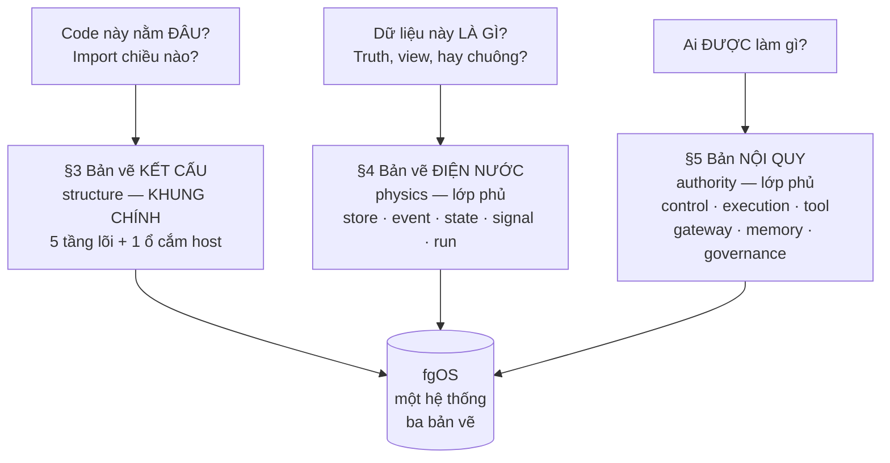
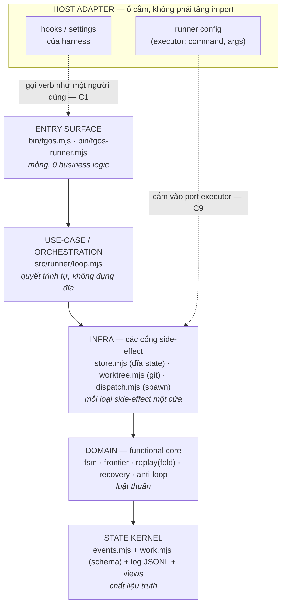
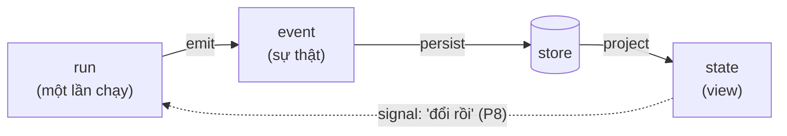
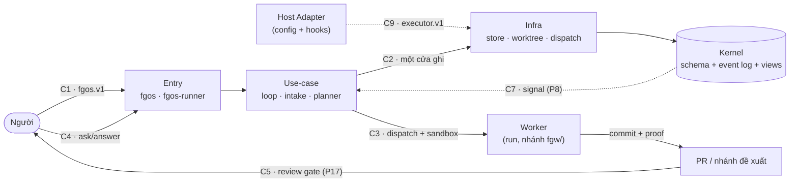
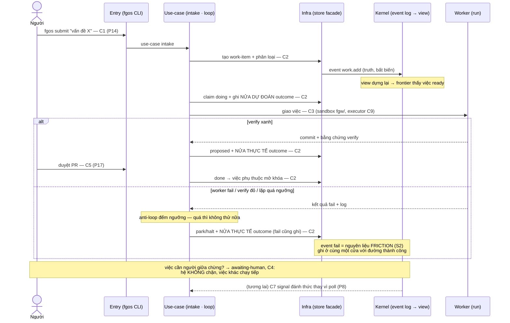

# Bản đồ kiến trúc fgOS — một khung chính, hai lớp phủ, hai sổ đăng ký

**Phiên bản:** v0.2. **Trạng thái:** ĐỀ XUẤT — chờ phản biện của chủ sản phẩm.
**Ngày:** 2026-07-16.

Chưng từ tài liệu bàn luận ở xưởng và hai deep-dive distillery (`work-item-management`,
`work-item-schema-and-io-contracts`); v0.2 sửa theo hai vòng tự phản biện có kiểm
chứng trên code (hồ sơ hai vòng lưu ở xưởng). Khi được chấp nhận, tài liệu này là
**bản chuẩn kiến trúc của sản phẩm**: mọi ví dụ là thành phần fgOS. Thay đổi bản đồ
về sau đi qua decision record kèm nâng version — supersede, không sửa ngầm.

**Changelog v0.1 → v0.2** (tóm tắt — chi tiết ở §11):

1. Thứ tự tầng sửa theo import graph THẬT: `Entry → Use-case → Infra → Domain →
   Kernel` (v0.1 đặt Domain trên Infra — bị chính đồ thị import bác bỏ).
2. Host Adapter không còn là tầng đầu chuỗi — là **ổ cắm** (port + config) bên hông.
3. Sổ component xây lại bottom-up từ inventory file: đủ 14 module (v0.1 thiếu 5),
   tách hai loại row **component** (một nhà) và **slice** (lát dọc).
4. Thêm contract **C9 · executor.v1** (biên model-gateway ↔ provider — đã live,
   trước đây vô danh); C6 hạ maturity `live` → `designed` cho đúng sự thật.
5. Sequence §8 thêm **nhánh fail** (park/halt → friction, chỗ S2 cắm vào).
6. Thêm §12: quan hệ với `system-overview.md`, `reading-map.md`, `backlog.md`.

---

## 0 · Đọc trong 5 phút

- Toàn hệ được mô tả bằng **một khung chính** (kết cấu — code nằm đâu) và **hai lớp
  phủ** (điện nước — dữ liệu là gì; nội quy — ai được làm gì). Không có bản vẽ thứ tư.
- Thần chú giải tranh cãi "X để đâu":
  **Ở đâu = kết cấu · Là gì = điện nước · Được làm gì = nội quy.**
  Và khi tranh cãi dai dẳng không dứt: **đó là dấu hiệu phần tử cần TÁCH làm đôi,
  không phải cần thêm tag** (mọi lời giải đẹp ở §5 đều là phép tách).
- Mỗi **module** có một thẻ căn cước trong Sổ component (§6); mỗi **tính năng xuyên
  tầng** là một slice trỏ về các thẻ module. Mỗi ranh giới đáng tin cậy có **một hợp
  đồng có tên** trong Sổ contract (§7).
- Luật duy nhất phải nhớ khi cắm thứ mới: **thẻ căn cước trước, code sau** (§9).

---

## 1 · Vấn đề và mục tiêu

Sắp tới hệ nhận một loạt thành phần mới (friction capture, intake, clarify, planner,
PR lifecycle — S2, P14–P17). Nếu mỗi thành phần tự tìm chỗ ngồi theo cảm tính, sáu
tháng nữa không ai vẽ lại được hệ thống. Bản đồ tồn tại để năm điều sau **luôn đúng**:

1. **Tên dễ hiểu** — mỗi khái niệm một từ, mỗi từ một nghĩa, không va chạm.
2. **Trách nhiệm phân định được** — mọi module trả lời "tôi là ai, tôi được làm gì"
   bằng một dòng.
3. **Luồng dữ liệu hình dung được** — người mới vẽ lại được đường đi của một
   work-item, kể cả đường thất bại, mà không cần đọc code.
4. **Người đến sau hiểu cách ta chia** — bản đồ dạy được, không chỉ tra được.
5. **Bản đồ phản chiếu repo, không phản chiếu buổi bàn luận** — sổ đăng ký xây
   bottom-up từ inventory file và được máy đối chiếu (§9.3), không xây top-down từ
   trí nhớ. (Bài học trực tiếp từ v0.1: phía state — được bàn nhiều — đủ gần hết;
   phía runner — ít được bàn — thiếu 5/7 module.)

---

## 2 · Ý tưởng trung tâm: ba câu hỏi — ba bản vẽ

Một ngôi nhà có bản vẽ kết cấu, bản vẽ điện nước, và nội quy sử dụng. Không ai đòi
gộp ba tờ thành một — nhưng cũng không ai nói chúng mâu thuẫn: chúng trả lời **ba
loại câu hỏi khác nhau về cùng một ngôi nhà**. fgOS y hệt:

**Kết cấu là khung chính; hai bản còn lại là lớp phủ.** Mỗi module có **đúng một
nhà** trên bản kết cấu và mang **tag** từ hai bản kia; mang nhiều tag là bình thường.

Vì sao kết cấu làm khung chính chứ không phải sáu vai (planes):

1. **Kết cấu là trục duy nhất kiểm được bằng máy** — chiều import là fact của đồ
   thị file. *Trạng thái thật:* phép kiểm này **chưa chạy trong verify** — nó là
   việc kèm theo khi chấp nhận bản đồ (§9.3); v0.2 đã chạy tay trên toàn đồ thị
   import và chính nhờ đó phát hiện thứ tự tầng của v0.1 sai. Vai thì many-to-many
   với file — bắt file "chọn vai" là bắt nó nói dối.
2. **fgOS đã khóa hình này** (decision b0da87aa: functional-core/imperative-shell,
   một execution path, parse-first tại biên). Bản đồ đặt tên cho cái đã chốt.
3. **Ranh giới vai chỉ hóa vật lý khi tách tiến trình**, và luật vàng của ta là
   *đừng mua bậc mạng khi interface đủ* (Phụ lục A). Chọn vai làm khung là mua
   trước cái chưa cần trả tiền.

---

## 3 · Bản vẽ kết cấu — STRUCTURE (khung chính)

Năm tầng lõi, phụ thuộc **một chiều xuống** — đo trên đồ thị import thật, toàn bộ
14 module hiện hành tuân thủ. Host Adapter đứng ngoài chuỗi: nó là **ổ cắm**.

**Vì sao Infra đứng TRÊN Domain** (điểm v0.2 sửa lớn nhất): đo trên import thật,
`store.mjs` *import* `fsm/replay/frontier/work` — vỏ mệnh lệnh (imperative shell)
bọc lõi thuần (functional core), đúng hình b0da87aa. Domain không biết gì ngoài
Kernel; Kernel (schema + log) không biết ai. Đây cũng là hình chính thống của
dependency-rule: adapter phụ thuộc domain, domain phụ thuộc mỗi chất liệu truth.

| Tầng | Phận sự một dòng | File thật |
|---|---|---|
| Host Adapter | *ổ cắm*: nội dung config + hook đặc-thù-harness; **không có code trong repo** — code chỉ có port | runner config (executor claude CLI…), hooks |
| Entry Surface | cửa vào mỏng — parse, gọi xuống, in kết quả + exit code | `bin/fgos.mjs` · `bin/fgos-runner.mjs` |
| Use-case | dàn trình tự nghiệp vụ — "làm gì trước, gì sau" | `src/runner/loop.mjs` |
| Infra | cổng side-effect, mỗi loại đúng một cửa | `store.mjs` · `worktree.mjs` · `dispatch.mjs` |
| Domain | luật thuần — transition, ready, fold, recovery-matrix, anti-loop | `fsm` · `frontier` · `replay` · `recovery` · `anti-loop` |
| State Kernel | chất liệu bền — schema + event log + views | `events.mjs` · `work.mjs` · JSONL |

**Bốn luật của bản kết cấu:**

1. **Phụ thuộc một chiều xuống, được nhảy tầng.** Tầng trên import mọi tầng dưới
   tùy ý (`fgos.mjs` gọi thẳng store là hợp lệ); import ngược lên = bug kiến trúc.
2. **Entry mỏng.** "Một execution path" đo được: *mỗi verb đúng một đường code từ
   cửa tới store*. Hai binary là hai surface chia sẻ module — không nhân đôi logic;
   hook làm việc của orchestrator là red flag.
3. **Host-ism sống trong config, không trong code.** `dispatch.mjs` chỉ định nghĩa
   port executor + validate; tên harness (claude CLI…) chỉ xuất hiện trong runner
   config. Đổi harness = đổi config + hooks, **zero dòng code**.
4. **Test đi theo nhà của module nó kiểm; e2e là công dân toàn chuỗi.** Cây
   `test/{state,runner,cli,e2e}` hôm nay đã tự cắt đúng tầng — bằng chứng thực
   nghiệm rằng trục kết cấu là trục tự nhiên của repo.

---

## 4 · Bản vẽ điện nước — PHYSICS (lớp phủ dữ liệu)

Năm chất liệu. **Năm từ này là từ dành riêng** của toàn hệ: `event`, `state`,
`store`, `signal`, `run` chỉ mang nghĩa dưới đây, không dùng đặt tên thứ khác (§9).

| Chất liệu | Là gì | Luật đã khóa |
|---|---|---|
| **store** | chất liệu lưu vật lý — append-only đã commit, một cửa ghi | R3 platform-foundations |
| **event** | sự thật đã xảy ra — bất biến, đủ payload, nguồn truth | nhật ký đã commit bất khả xâm phạm |
| **state** | view hiện tại — **dựng lại được từ zero** từ event log | rebuild-determinism test |
| **signal** | lời báo "có đổi" — thoáng qua, con trỏ tối thiểu, mất cũng được | chưa dựng (P8) |
| **run** | một lần chạy có lifecycle — sandbox, crash-recovery, proof khi kết thúc | nhánh `fgw/` cô lập |

Ghi chú ranh giới nghĩa (v0.2):

- **`run` là chất liệu của WORKER**, không phải của vòng orchestrate — runner loop
  không mang tag run (v0.1 tự vi phạm từ dành riêng ở chính sổ của nó).
- **"Một cửa ghi" nghĩa là một cửa GHI** — `appendEvent` chỉ được gọi qua store
  facade; *đọc* thì tự do (replay đọc thẳng log để fold — hợp lệ).
- **Luật một-cửa hôm nay là per-process.** Nhiều tiến trình ghi đồng thời cần
  lease/lock chưa tồn tại — chỗ yếu thật khi đi multi-process, ghi thẳng vào C2
  (§7) làm nợ có tên, không giấu.
- **`docs/specs/` KHÔNG nằm trong Kernel.** Kernel là truth máy-vận-hành (schema +
  log + views, mỗi artifact một schema máy-đọc). Specs là tri thức người-viết cho
  người-và-agent đọc — chất liệu của vai memory (§5), sống ở tầng tài liệu, không
  phải component runtime. Chung "bền", khác họ.
- **Config không phải chất liệu thứ sáu.** Nó là *tham số wiring* của Host Adapter,
  validate tại cửa nạp (`dispatch.mjs` — RunnerConfigError), không phải dữ liệu hệ.

### Event ≠ Signal — bảng luật

| | **Event** | **Signal** |
|---|---|---|
| là gì | sự thật đã xảy ra | lời báo "có đổi" |
| thì | quá khứ, bất biến | hiện tại, thoáng qua |
| hướng | pull — nằm chờ được đọc | push — bắn đi đánh thức |
| nội dung | đủ payload | con trỏ tối thiểu |
| khi mất | không được phép — đó là truth | chỉ trễ nhịp, không sai |
| vai | ghi lịch sử | kích hoạt phản ứng |

Ba hệ quả: (1) reactor nhận signal phải đọc lại event/state trước khi hành động;
(2) signal lossy ⇒ reactor idempotent ⇒ **anti-loop là điều kiện tiên quyết của
signal** (và anti-loop đã là module sống — `src/runner/anti-loop.mjs`, §6); (3) một
signal thường gộp nhiều event.

### Vòng phản ứng — động cơ tương lai của fan-out

Hôm nay mũi tên signal chưa tồn tại — runner poll frontier. Nét đứt = chỗ P8 cắm
vào, không phải thiếu sót vô danh.

---

## 5 · Bản nội quy — AUTHORITY (lớp phủ quyền)

Sáu vai. **Vai là nội quy, không phải chỗ ở**: module nằm trên bản kết cấu và
**mang tag vai**; mang hai tag là bình thường (loop vừa quyết chọn việc vừa giao việc).

| Vai | Câu luật (SRP) | Bất biến |
|---|---|---|
| **control** | quyết *ai làm gì, khi nào* — không tự thực thi | mọi quyết định chọn-việc/route/gate truy về control |
| **execution** | chạy vòng reason→act của một việc, cô lập | không tự chọn việc; nhận việc được giao |
| **tool** | cổng side-effect ra thế giới | **nơi duy nhất** có side-effect thật |
| **model gateway** | trừu tượng hóa LLM provider — chọn model, tier, fallback | code nghiệp vụ không biết tên provider |
| **memory** *(xuyên suốt)* | giữ trạng thái và hiểu biết — ngắn hạn + bền | truth chỉ có một nguồn (event log) |
| **governance** *(xuyên suốt)* | canh mọi luồng — gate, privacy, audit, chi phí | chèn vào được mọi biên, không sở hữu biên nào |

**Bốn bất biến toàn cục:** (1) control quyết — execution làm, không trộn; (2) tool
là nơi duy nhất có side-effect; (3) memory & governance là hai lớp phủ xuyên suốt;
(4) mọi ranh giới agent↔agent và agent↔model là **phi tất định** ⇒ bắt buộc có
contract (§7).

Tinh chỉnh v0.2: **tag control không đặt trên cửa.** Entry "0 business logic" thì
không quyết gì — control thuộc use-case/domain đứng sau verb (frontier quyết ready,
loop quyết dispatch), không thuộc `bin/fgos.mjs`.

### Mô hình tag giải tan các câu hỏi ranh giới cũ

Chú ý cách mọi lời giải đều là **phép tách** — đó chính là câu thần chú thứ hai §0:

| Câu cũ | Lời giải bằng nhà + tag (+ tách) |
|---|---|
| R1 — gates thuộc control hay governance? | luật gate: tag **governance** · điểm đặt: nhà **Use-case**, tag control |
| R2 — khóa file thuộc tool hay control? | chính sách: tag **control** · thực thi khóa: nhà **Infra**, tag tool |
| R3 — working context thuộc memory hay execution? | sở hữu: tag **memory** · execution mượn-đọc |
| R4 — handoff là luồng hay hợp đồng? | là **contract C6** (§7); phần quyết ở lại control |
| R5 — specs/learnings tách tầng nào? | tri thức vai memory, tầng tài liệu — KHÔNG vào Kernel (§4) |
| R6 — entry surface là plane riêng? | không — là **tầng Entry** của bản kết cấu, luật "mỏng" |

---

## 6 · Sổ đăng ký component

Hai loại row — **component** (một module, đúng một nhà) và **slice** (tính năng
xuyên tầng, trỏ về các component). Cột maturity buộc sổ nói thật: `live` · `partial`
· `planned` (có PBI) · `idea`. Sổ xây bottom-up từ `find src bin -name "*.mjs"` —
**đủ 14/14 module**, và §9.3 giao cho máy giữ tình trạng "đủ" này.

### Component — live (14/14 file có thẻ)

| Module | Nhà | Physics | Vai | Contracts |
|---|---|---|---|---|
| `bin/fgos.mjs` (add/list/ready/move/ask/answer/check) | Entry | — | — (cửa) | C1 *(exit-code taxonomy đã live; envelope port tại P14)*, C2 |
| `bin/fgos-runner.mjs` | Entry | — | — (cửa) | C1, C3 (surface), C9 (nạp config) |
| `src/runner/loop.mjs` | Use-case | — | control + execution | C2, C3 |
| `src/runner/dispatch.mjs` — port executor + validate config + spawn | Infra | — | model gateway + tool | **C9 (định nghĩa port)**, C3 |
| `src/runner/worktree.mjs` — vòng đời nhánh `fgw/` | Infra | — | tool | C3 (nửa sandbox) |
| `src/state/store.mjs` — facade một cửa ghi | Infra | store | tool | C2 |
| `src/runner/recovery.mjs` — ma trận crash-recovery | Domain | — | control | — (nội bộ) |
| `src/runner/anti-loop.mjs` — chặn lặp vô hạn | Domain | — | governance | — (nội bộ) |
| `src/state/fsm.mjs` — luật transition | Domain | — | memory | C2 |
| `src/state/frontier.mjs` — truy vấn ready | Domain | state (derived) | control | — (nội bộ) |
| `src/state/replay.mjs` — fold/rebuild view | Domain | state | memory | C2 |
| `src/state/events.mjs` — engine đọc/ghi log | Kernel | event | memory | C2 |
| `src/state/work.mjs` — schema + DEFAULTS | Kernel | — (schema) | memory | C2 (schema v2) |
| *(test/{state,runner,cli,e2e} — đi theo nhà module nó kiểm, không row riêng)* | | | | |

### Slice — live (tính năng xuyên tầng, trỏ về component)

| Slice | Ghép từ | Physics | Contracts | Maturity |
|---|---|---|---|---|
| human-gate (`awaiting-human`) | verbs ask/answer (Entry) + FSM edge (Domain) + fold (Domain) | event | C4 | live (P19) |
| outcome hai-nửa + `fgos check` | loop ghi 2 nửa (Use-case) + fold (Domain) + check (Entry) | event→state | C2 | live |
| worker-run trên nhánh `fgw/` | dispatch spawn (Infra) + worktree sandbox (Infra) + loop giám sát (Use-case) | run | C3, C9 | live |

### Slice — sắp cắm (planned; mỗi cái PHẢI qua nghi thức §9 + trỏ PBI)

| Slice | Component con dự kiến (nhà) | Contracts | PBI |
|---|---|---|---|
| friction capture | fold friction (Domain) + điểm ghi tại park/halt (Use-case) | C2 | P3-S2 |
| `fgos submit` + auto-classify | verb (Entry) + use-case intake (Use-case) | **C1 port tại đây**, C2 | P14 |
| runner sơ khởi clarify/discovery | use-case (Use-case) | C3, C4 | P15 |
| planner/decomposer | use-case (Use-case) — tag **control**, decide-altitude, không bao giờ là worker | C2 | P16 |
| PR adapter + merge policy | adapter (Infra) + policy (Use-case) | C5 | P17 |
| signal fabric | emit (Kernel) + reactor wiring (Use-case) | C7 | P8 |
| attention hub | ngoài process — bậc vật lý duy nhất của sổ | C8 | idea |

---

## 7 · Sổ đăng ký contract

**Luật phạm vi** (v0.2 — chốt cho hết bất nhất): ranh giới **phi tất định**
(người↔hệ, agent↔agent, agent↔model) *bắt buộc* có contract row. Ranh giới
in-process chỉ cần row khi nó public cho caller ngoài module (C2 là ví dụ);
mũi tên nội bộ (frontier, recovery) không cần — đó không phải lỗ hổng.

| ID | Ranh giới | Hợp đồng | Trạng thái | Định nghĩa ở |
|---|---|---|---|---|
| **C1** | người/agent ↔ CLI | `fgos.v1` envelope `{contract, generated_at, data_hash, data}` + exit-code taxonomy đóng + stdout=data/stderr=chẩn-đoán | **part-live** — exit codes + categoryOf đã chạy ở cả 2 binary; envelope port tại P14 | deep-dive schema §5; porting-log `agent-output-envelope-contract` |
| **C2** | mọi caller ↔ store | ba vế: (a) verbs một-cửa-GHI — đọc tự do; (b) event schema v2; (c) luật evolution (additive event, lazy view key, tolerate-unknown-field, hard-fail-unknown-version). **Nợ có tên:** một-cửa là per-process; multi-process cần lease (chưa có) | **live** | `store.mjs` · spec work-state · luật R3 |
| **C3** | orchestrator ↔ worker | dispatch: việc + verify đòi hỏi + proof khi về; **trust boundary của worker**: sandbox = nhánh `fgw/` cô lập (worktree) + vay 3 field RUN_CONTRACT khi fan-out (`forbidden_paths`, `required_outputs`, `result_json_schema`) | partial | `loop.mjs` · `worktree.mjs`; deep-dive schema §3 |
| **C4** | người ↔ hệ (bất đồng bộ) | ask/answer + trạng thái `awaiting-human`; frontier loại việc đang chờ | **live** (P19) | spec work-state |
| **C5** | hệ ↔ người (PR) | review gate + merge policy + integrated re-verify sau merge | planned (P17) | lifecycle vision §4 |
| **C6** | agent ↔ agent | routing-handoff contract + trust boundary | **designed** — spec đầy đủ, chưa có code implement | `docs/routing-handoff-contract.md` |
| **C7** | state ↔ reactor | signal: con trỏ tối thiểu, lossy/at-least-once, consumer bắt buộc idempotent | planned (P8) | §4 bảng event≠signal |
| **C8** | hệ ↔ hub chú ý | attention envelope (`gate-opened`/`question-raised`/`blocked`), versioned | idea | deep-dive quản-lý §9 |
| **C9** | model gateway ↔ provider | `executor.v1`: runner config `{command, args[]}` thay `{prompt}`/`{model}` per-element — không nối chuỗi; validate RunnerConfigError tại nạp | **live** (v0.1 để vô danh — chính là ranh giới doc cũ tự hỏi "còn thiếu contract nào") | `dispatch.mjs` |

**Luồng lỗi giữa các tầng** (v0.2 — trước đây bản đồ im): mỗi cửa Infra/Kernel ném
lỗi có tên (`StoreError`, `EventLogError`, `FsmError`, `WorkValidationError`,
`RunnerConfigError`, lỗi dispatch/worktree) — tầng nào xử được thì xử, không thì để
nổi lên; chỉ **Entry** convert lỗi thành exit code qua taxonomy `EXIT_CODES` +
`categoryOf` (vế sống của C1). Domain không nuốt lỗi, Entry không đoán lỗi.

---

## 8 · Luồng dữ liệu qua một vòng đời — kể cả đường thất bại

Một work-item đi từ submit đến done — **và một nhánh fail**, vì khách hàng đầu tiên
của bản đồ là S2-friction, thứ sống ở đúng nhánh đó:

Bốn điều sơ đồ chứng minh: (1) **mọi ghi đi qua đúng một cửa** — C2 ở mọi mutation;
(2) **đường thất bại cũng một cửa ấy** — friction không cần kênh riêng, chỉ cần fold
riêng; (3) **người là participant có hợp đồng riêng** (C1/C4/C5); (4) các PBI tương
lai (S2, P14, P17, P8) **đã có chỗ ngồi vẽ sẵn**.

---

## 9 · Luật vận hành bản đồ

1. **Thẻ căn cước trước code.** Một *module hoặc slice mới* phải có row §6 (nhà,
   tag, hợp đồng, maturity) trước khi có code; sửa cái đã có thẻ thì không nghi
   thức gì. **Ràng buộc quy trình ghi rõ:** luật này *mở rộng definition-of-done* —
   mà definition-of-done là luật khóa L5 của platform-foundations. Vậy nó **chỉ có
   hiệu lực qua decision record chạm L5** khi bản đồ được chấp nhận, không tự động
   có hiệu lực vì được viết ở đây (đúng quy trình "changing a locked law" của repo).
2. **Năm từ dành riêng.** `event` · `state` · `store` · `signal` · `run` chỉ mang
   nghĩa §4. Không đặt tên module, biến, khái niệm khác bằng năm từ này.
3. **Bản đồ nói thật — và máy giữ lời.** Mọi row mang maturity; khát vọng ghi là
   `planned`/`idea`. Kèm theo chấp nhận bản đồ là một cell nhỏ: **registry-manifest
   máy-đọc + script hai phép kiểm trong verify** — (a) chiều import một-chiều-xuống
   theo nhà đã khai; (b) **đủ sổ**: mọi file `src/**` `bin/**` có row. Hai phép kiểm
   là hai mặt một script; v0.1 thiếu cả hai nên vừa sai chiều tầng vừa thiếu 5 module
   mà không ai thấy.
4. **Một nhà duy nhất cho component; slice khai là slice.** Tranh cãi "X để đâu"
   giải bằng thần chú §0; một *component* thật sự cần hai nhà = tách nó làm hai;
   một *tính năng* chạm nhiều nhà = nó là slice, khai đúng loại row.
5. **Đổi bản đồ qua decision record + nâng version.** Bản đồ có version (đầu file);
   supersede theo version, không edit ngầm.

**Nghi thức cắm một thành phần mới** (3 bước, chạy trong exploring/planning của
feature): ① điền row §6 (component hoặc slice + component con) → ② chọn contract
có sẵn §7 hoặc đặt tên contract mới kèm version → ③ mới đến code.

---

## 10 · Kiểm chứng: khung chịu được 5 thứ sắp cắm — chấm theo rubric

Phép thử của bản đồ là thành phần *chưa xây*. **Rubric viết trước** (v0.1 tự chấm
không rubric nên đã cho đậu một bài thi rớt — các thẻ nó sinh ra vi phạm luật
một-nhà mà vẫn tuyên "khung đứng vững"): mỗi item planned phải ra được

- (a) một slice row với component con, **mỗi con đúng một nhà** trong 5 tầng;
- (b) **không nhà mới** ngoài 5 tầng (ngoại lệ duy nhất được khai báo: attention hub
  — ngoài process, bậc vật lý, maturity `idea`);
- (c) contract nêu tên có row §7.

Kết quả trên bảng planned §6: **S2, P14, P15, P16, P17 đậu cả ba tiêu chí** (P8
đậu; hub là ngoại lệ khai báo). Hai ca đáng giá nhất:

- **P16 planner** lộ đúng bản chất nhờ tag: nó là **control** (quyết chia việc) dù
  chạy bằng LLM — nghĩa là không bao giờ được giao cho worker tự quyết.
- **P17 PR lifecycle** chạm ba vai — mô hình cũ kẹt ở "thuộc plane nào"; mô hình
  mới: slice gồm adapter (Infra) + policy (Use-case), ba tag, xong.

---

## 11 · Khác gì các bản trước — và vì sao

| Bản bàn luận (xưởng) | v0.1 | v0.2 (bản này) |
|---|---|---|
| 3 trục ngang hàng, người đọc tự hợp nhất | 1 khung chính + 2 lớp phủ | giữ |
| `execution` hai nghĩa | foundation đổi tên `run` | giữ + vá chỗ v0.1 tự dùng sai tag run |
| — | Host Adapter là tầng trên cùng | **ổ cắm** port+config — vì import thật cho thấy U/I gọi xuống port, host cắm từ ngoài |
| — | thứ tự U→D→I→K | **E→U→I→D→K** — đo trên đồ thị import thật; shell bọc core |
| contracts là nhãn mũi tên | Sổ C1–C8 | + **C9 executor.v1** (live, trước vô danh) · C6 hạ về designed · C1 part-live · luật phạm vi contract |
| — | registry 11 row, thiếu 5 module runner | **14/14 bottom-up** + tách component/slice + máy giữ đủ sổ (§9.3) |
| — | luồng chỉ happy path | + nhánh fail (chỗ S2 sống) + luồng lỗi/exit-code |
| thang 7 bậc đứng đầu doc | rút thành Phụ lục A | giữ |

Không nguyên liệu nào bị vứt: bảng event≠signal, 4 bất biến, 6 vai, 2 luật vàng —
giữ nguyên; mọi thứ khác được đặt lại đúng chỗ theo bằng chứng import graph.

---

## 12 · Chỗ đứng trong hệ tài liệu

Ba bản ghi, ba câu hỏi, không giẫm chân:

| Tài liệu | Trả lời | Sở hữu |
|---|---|---|
| `docs/specs/system-overview.md` + area specs | hệ **LÀM GÌ** (BA-grade, tech-agnostic) | entity nghiệp vụ, luồng nghiệp vụ |
| `docs/architecture-map.md` (file này) | code **Ở ĐÂU** + ranh giới **KÝ GÌ** | tầng, tag, hai sổ đăng ký |
| `docs/backlog.md` | **SẮP LÀM GÌ** | PBI — mọi row `planned` §6 phải trỏ về một PBI ở đây |

Entity xuất hiện ở cả hai bản đồ cross-link qua contract: work item ↔ C2 ·
human-gate ↔ C4 · outcome ↔ C2 · handoff ↔ C6. Khi bản đồ được chấp nhận:
thêm dòng vào `docs/specs/reading-map.md` + mục lục README (hôm nay chưa có — agent
lạ theo L5 câu 1 chưa gặp được bản đồ này; đó là việc của decision chấp nhận).

---

## Phụ lục A · Hai luật vàng của thang phân chia

1. **Logic vs vật lý gãy một lần, không fractal.** Ranh giới trong-tiến-trình đổi
   rẻ; ranh giới qua-mạng đổi đắt — latency, partial failure, versioning. Một điểm
   đứt gãy chất, không phải bản thu nhỏ của các bậc dưới.
2. **Kéo ranh giới xuống bậc rẻ nhất vẫn đủ cô lập.** Đừng mua mạng khi interface
   đủ. (Áp dụng: attention hub là thành phần ngoài-process duy nhất của sổ — và nó
   ở maturity `idea`, đúng như luật này đòi.)

Tiêu chí cắt khác nhau ở mỗi bậc — class cắt theo actor, service cắt theo
deploy/team, agent cắt theo kinh tế context-window và tính phi tất định.

---

## Câu hỏi mở — mời phản biện

1. **Đa tiến trình:** điểm yếu thật là **C2 một-cửa-ghi per-process** (JSONL + fs,
   chưa lease/lock) — không phải ranh giới vai. Chấp nhận ghi nợ trong C2 và giải ở
   PBI riêng khi swarm thật đến, hay phải giải trước P15?
2. **Nghi thức thẻ-trước-code đi qua decision record chạm L5** (§9.1) — đồng ý xử
   lý như một amendment L5, hay tách thành luật mới (L9)?
3. **Nhà của `dispatch.mjs`:** v0.2 đặt Infra (cổng side-effect spawn + port
   executor). Phương án khác: tách đôi — port definition (Use-case) / spawn thật
   (Infra). Hiện một file làm cả hai; có đáng tách theo §9.4 không?
4. **C1 part-live:** envelope hóa `fgos check` ngay tại S2 (nó là consumer máy-đọc
   đầu tiên) thay vì đợi P14 — sớm một nhịp có đáng không?
5. **Registry-manifest + 2 phép kiểm máy (§9.3):** gộp vào cell đầu của S2-friction
   hay đứng riêng trước S2? (Đề xuất: đứng riêng trước — nó canh mọi feature sau.)
