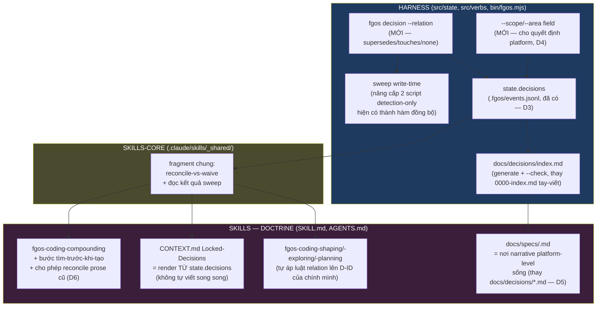

# DISCUSSION: Chống outdate/mâu thuẫn giữa rule, decision, doc (tsk-1lv)

## 1. Trạng thái hiện tại

Vòng 16 (2026-08-17): NGAY SAU khi CONTEXT.md đã viết và item đã chuyển
stage sang `planning`, người dùng chỉ ra một khoảng trống thật: Diataxis
(4 quadrant) chỉ giải trục NHẬN THỨC (cách viết theo mức độ), KHÔNG giải
trục ĐỐI TƯỢNG NGƯỜI ĐỌC và trục SCOPE/AREA — và nghi ngờ D6/D8 ngầm giả
định OKF tự giải được việc này, trong khi đã có 1 lần cố gắng trước hình
như chưa giải xong. Scout xác nhận NGAY: đúng — `docs/specs/enduser-docs-
index.md` R4 khoá cứng `audience` "gieo từ quadrant", KHÔNG PHẢI trục độc
lập. "Một lần đã thử" chính là **tsk-28x** — điểm D+E trong DISCUSSION.md
của họ đều ghi CHƯA RÕ, chưa giải xong round 3-5 của họ. D6/D8 (đã lock,
đã viết CONTEXT.md) có claim SAI PHẠM VI — ngầm coi audience/area là trục
có sẵn để `authoritative_for` hoạt động trên đó, trong khi trục đó CHƯA
TỒN TẠI. Sửa qua D14, append vào CONTEXT.md theo đúng "re-entry, append
never rewrite" của `fgos-coding-exploring` — xem §5 round 16.

Vòng 15 (2026-08-17): người dùng đồng ý cả 2 khuyến nghị round 14 (door áp
mọi item + skeleton-match backstop) — riêng điểm 2 thêm yêu cầu: triển khai
dạng hexagon/service để thay giải pháp khác sau này không cần đổi caller.
Xác nhận fgOS đã có tiền lệ port/adapter thật (CTR009 executor.v1,
`dispatch.mjs`) — tái dùng contract-style đó, không phát minh kiến trúc
mới. Mint D11 (seq 19036) + D12 (seq 19037). **Toàn bộ D1-D12 đã khoá — cả
2 điểm mở còn lại từ §6 "Còn mở" đều đã đóng.** Không còn điểm nào chưa
D-ID. Sẵn sàng hỏi người dùng có coi discussion đã converge để set `refs`
+ handoff sang `fgos-coding-exploring`.

Vòng 14 (2026-08-17): người dùng xác nhận đánh đổi round 13 chấp nhận
được. Mint D10 (seq 19035). Tổng cộng D1-D10 đã khoá. Còn 2 điểm nhỏ chưa
D-ID (door risk-tier scope, cơ chế tra "chủ đề" cụ thể cho D8) — hỏi người
dùng có muốn giải quyết tiếp hay đủ để hand-off sang `fgos-coding-exploring`.

Vòng 13 (2026-08-17): người dùng chất vấn trực tiếp D7 — bee viết
continuous ở 4 điểm, fgOS viết 1 lần sau cùng (batch, retrospective); nếu
không continuous, fgOS có mất thông tin xảy ra trong lúc làm việc không?
Đây là câu hỏi threat-model thật (theo `review-audit-self-decision.md`
"Threat Model" — phải xác định rõ cái gì thật sự bị mất trước khi trấn an),
không phải câu hỏi tu từ. Trả lời ở §5 round 13: KHÔNG mất raw fact/decision
(đã ghi ngay lúc chốt qua `state.decisions`, không đổi bởi D7) — nhưng CÓ
một khoảng trễ thật, có giới hạn, có phát hiện được (không phải zero-risk)
ở tầng NARRATIVE SYNTHESIS (`docs/specs/<area>.md`). Cần người dùng xác
nhận khoảng trễ này chấp nhận được.

Vòng 12 (2026-08-17): người dùng quay lại quyết phối hợp với tsk-37i (nêu
ở round 9) — đồng ý thu hẹp tsk-37i, tách mảnh 2 (ADR reversal sweep) +
mảnh 4 (routing close-gate) để tsk-1lv xử lý; sau khi thu hẹp, 2 item chạy
song song, không cần `deps`. Mint D9 (seq 19033). Đã kiểm `ListAgents` —
không xác định được chính xác session nào đang giữ `fgw/tsk-37i` trong 77
peer session (phần lớn nhãn generic `forgentx-XX`) — KHÔNG tự ý sửa
`DISCUSSION.md`/`deps` của tsk-37i từ phiên này (khác branch, khác claim,
one-door-write). Ghi rõ D9 + khuyến nghị cụ thể cho phía tsk-37i, để người
dùng hoặc phiên đang giữ tsk-37i tự áp.

Vòng 11 (2026-08-17): người dùng xác nhận round 10, hỏi làm rõ: chỉ đổi
THỜI ĐIỂM (retrospective thay vì approve), hay cả CÁCH GỌI skill cũng đổi
theo bee? Trả lời rõ ở §5 round 11: CHỈ đổi thời điểm — cách gọi
`fgos-coding-compounding` (1 lần, batch, qua `/fgOS:retro-loop`, không cron)
giữ NGUYÊN như hiện tại, KHÔNG bắt chước cadence liên tục
(sync/capture/flush/harvest) của bee's Scribe. Round 10→11 giữ ổn định qua
2 round — mint D7 (seq 19006, reuse retrospective + cadence không đổi) và
D8 (seq 19007, sửa cơ chế D6 thành doctrine+backstop, không phải gate sống).

Vòng 10 (2026-08-17): người dùng nêu 2 việc — (3) cơ chế "tìm-trước-khi-tạo"
của D6 thật sự bee làm sao, có xem xét hệ OKF của bee-upstream không; (2)
fgOS đã có khái niệm `retrospective` (status, không phải stage), có nên
dùng trong không gian thảo luận này không — cụ thể approve/merge tạo doc
trước rồi merge, hay merge rồi mới tạo doc, bee làm sao. Cả 2 câu trả lời
đều SỬA lại phần đã trình bày trước đó, không chỉ bổ sung — xem §5 round 10.
Kết quả: (a) D6 cần viết lại — `scribingTarget()` bee dùng ở round 1 giờ là
DEAD CODE, cơ chế thật hiện tại là doctrine-convention + mechanical-backstop-
check, không phải 1 hàm gate sống; (b) fork #3 (round 4, "approve hay verb
riêng") có câu trả lời rõ — KHÔNG gate ở `fgos approve` (mâu thuẫn trực
tiếp với tsk-1ca, quyết định đã được evidence hoá 3 lần), nên REUSE
`retrospective`/`fgos-coding-compounding` đã có sẵn.

Vòng 9 (2026-08-17): người dùng chỉ ra một work khác đang thảo luận song
song — **tsk-37i** (`docs/history/self-contained-id-references/
DISCUSSION.md`, branch `fgw/tsk-37i`, 8 round riêng, D1 đã lock) — cùng chủ
đề trích dẫn/quyết định-outdate nhưng hẹp hơn (format trích dẫn D-ID/RUL-ID/
ADR, không phải kiến trúc lưu trữ). Phiên tsk-37i ĐÃ TỰ ĐỌC discussion này
(round 8 của họ, cùng mốc giờ ~10:25Z) và ghi nhận 3 điểm overlap từ phía họ
— xác nhận lại từ phía tsk-1lv ở §5 round 9, kèm khuyến nghị phối hợp cụ
thể. Chưa đổi D1-D6 đã lock; chỉ thêm bối cảnh phối hợp liên-item.

Vòng 8 (2026-08-17): người dùng xác nhận mở rộng scope sang tầng
compounding/Diataxis. 6 điểm đã giữ ổn định đủ round (D4) — đã mint D1-D6
qua `fgos decision --id tsk-1lv` (seq 18961-18966), viết lại §4/§6/§7 đầy
đủ, kèm sơ đồ kiến trúc 3 tầng. Còn 3 điểm mở (door risk-tier scope, approve
vs verb riêng, cơ chế tìm-trước-khi-tạo cụ thể) — CHƯA D-ID, cần thêm ít
nhất 1 round nữa trước khi coi là chốt. `refs` CHƯA set (còn 3 điểm mở, và
`fgos-coding-shaping` chỉ set `refs`/handoff khi người dùng xác nhận
discussion đã converge — chưa tới bước đó).

Vòng 7 (2026-08-17): người dùng chọn (B) — retire `docs/decisions/*.md`
corpus, dồn narrative vào `docs/specs/<area>.md`. Đồng thời nêu vấn đề rộng
hơn: quá nhiều tài liệu spec/doc ngày càng phình, không rõ cái nào mới
nhất, không ai retire cái cũ. Đã đo thật: `docs/history/` chiếm 1157/1546
file md toàn repo (75%, 614 feature folder — TĂNG-THEO-THIẾT-KẾ, là lịch sử,
không phải mục tiêu sửa). Vùng THẬT ĐÁNG LO: 267 file Diataxis end-user docs
(`explanation` 161 + `reference` 85 + `how-to` 21) do `fgos-coding-compounding`
tự sinh — và kỹ năng đó CÓ SẴN 2 lỗ hổng đúng lớp bug đang bàn: (1) không có
bước tìm-trước-khi-tạo (thiếu `scribingTarget()`-tương-đương), (2) CÓ MỘT
LUẬT TƯỜNG MINH CẤM prune/rewrite prose cũ ("never delete, shorten,
restructure") — khả năng là NGUYÊN NHÂN CƠ HỌC trực tiếp gây phình. Xem §5
round 7. Câu hỏi: mở rộng scope thiết kế sang cả tầng compounding/Diataxis
này, không chỉ docs/decisions?

Vòng 6 (2026-08-17): người dùng yêu cầu định nghĩa lại rõ ràng — đã có 3
LOẠI quyết định (item-level/CONTEXT.md, engine bookkeeping, platform-level
ADR corpus), giờ dồn về 1 store thì mỗi loại ghi GÌ vào đó. Trả lời ở §5
round 6: loại 1+2 đã có sẵn field khớp (`id` + `kind`), loại 3 cần thêm
dimension mới (`scope`/`area`, bee gọi là vậy) VÀ có một phát hiện cấu trúc
sắc hơn — `docs/decisions/*.md` (1 file/quyết định, Nygard-style) có thể là
một tầng THỪA so với shape thật của bee (bee không có "1 file/quyết định" —
narrative sống ở `docs/knowledge/areas/` mà fgOS đã có bản tương đương là
`docs/specs/*.md`). Đây là câu hỏi mới, chưa quyết.

Vòng 5 (2026-08-17): người dùng hỏi "bee một tầng nằm đâu" — trả lời ở §5
round 5: fgOS ĐÃ CÓ sẵn store hợp nhất kiểu bee (`state.decisions`, event
`type: 'decision'` trong CHÍNH `.fgos/events.jsonl`, port từ bee's schema từ
`tsk-63c`) — không phải chưa xây. Nhưng `tsk-1ud` (đã done) tự đo ra
`state.decisions` có 1.711 bản ghi, **0 skill đọc** — mọi skill vẫn đọc
`CONTEXT.md` (đắt hơn ~20 lần/lần đọc) — và tự xếp việc này vào đúng mẫu
hình lặp lại 3 lần trong 1 phiên: "ghi trước, nối dây sau — dây không bao
giờ nối". Việc wire skill đọc `state.decisions` bị CỐ TÌNH để ngoài scope
tsk-1ud, ghi rõ là follow-up riêng — tức cuộc thảo luận này đang tiếp đúng
follow-up đó. Sửa lại fork #1 round 4 (không còn "1 hay 2 store" — đã có 1,
vấn đề là 3 BỀ MẶT chỉ 1 được đọc).

Vòng 4 (2026-08-17): người dùng yêu cầu distill thành một thiết kế tổng quát
theo 3 tầng kiến trúc fgOS thật (harness / skills-core / skills-doctrine) để
hình dung sẽ làm gì. Đã viết bản nháp tổng hợp ở §5 round 4 — **CHƯA lock
vào §6** vì chưa D-ID nào giữ ổn định qua >1 round (D4) và còn ít nhất 3 fork
kiến trúc thật chưa quyết (đơn/kép decision-store, scope theo risk-tier hay
mọi item, harness đặt ở approve hay verb riêng). Trình bày trong chat + ghi
lại đây, chờ người dùng chọn trước khi mint D-ID và viết §6 thật.

Vòng 3 (2026-08-17): người dùng yêu cầu dò tiếp bee từ sau v1.18.3 (distillery
cũ) lên bản mới nhất — thật ra bee đã lên **v2.7.0** (`beegog` local clone,
`abde5ca7`, title chính "doc-rot doors — impact, routing, doc-deferral,
freshness"), tức ĐÚNG package feature mới nhất của bee giải ĐÚNG bài toán
người dùng đang hỏi, không phải một release phụ. Đã đọc trực tiếp
`docs/knowledge/areas/decision-memory/overview.md` + `workflow-state/gates.md`
của bee (nguồn thật, không phải distillery cũ). Phát hiện quan trọng nhất:
bee có quyết định tường minh **R9 "No stored graph, no daemon"** — SỬA lại
khuyến nghị graph ở vòng 2 (xem §5 round 3). Còn 2 câu hỏi treo từ vòng 2
(a/b) — nay có thêm dữ liệu để trả lời phần (a).

Vòng 2 (2026-08-17): người dùng đã trả lời vòng 1 — (1) muốn năng lực CHUNG
cho mọi project dùng fgOS (không chỉ dogfood nội bộ); (2) đồng ý hướng ghép
2 lớp (drift-check rẻ + LLM-compile đắt); và nêu câu hỏi mới: có nên đưa về
một hệ graph để dễ detect không, kèm yêu cầu rescan bee (workshop gốc,
`upstreams/bee/`) xem họ đã giải bài này thế nào. Đã rescan xong — bee CÓ
đúng câu trả lời gần nhất cho câu hỏi graph: từ v1.18.3, bee đã tự thay
`docs/specs/` (prose tay) bằng `docs/knowledge/areas/<area>/` — một "queryable
concept graph" thật, với cơ chế chống-fork 3 lớp và index regenerate như pure
function. Chưa D-ID nào chốt (2 điểm vòng 1 mới trả lời 1 round, theo D4 phải
giữ ổn định thêm ít nhất 1 round nữa mới mint D-ID) — trình bày phân tích bee
+ khuyến nghị graph trước khi hỏi tiếp.

## 2. Mục tiêu & đề bài

Người dùng (chủ fgOS) quan sát một vấn đề vận hành thật: rule/decision/doc
trong repo này sinh ra quá nhiều, decision này supersede decision kia, doc
này lẽ ra phải được viết lại theo quyết định mới nhất nhưng không ai cập nhật
— và hệ quả cụ thể đã xảy ra: một agent làm việc quét ra quyết định CŨ (dù
quyết định mới đã tồn tại), hoặc dùng một tài liệu đã outdate làm kim chỉ nam
trong khi thiết kế thật đã đổi. Yêu cầu: (1) research xem thế giới đã có giải
pháp sẵn cho lớp vấn đề "tổng hợp một tập luật/quyết định rời rạc, có
supersede lẫn nhau, thành MỘT ảnh cuối cùng đúng-nhất-hiện-tại cho agent dùng"
chưa; (2) chỉ sau đó mới bàn có nên tự xây, xây gì, xây ở tầng nào.

## 3. Vấn đề rõ / chưa rõ

| # | Điểm | Trạng thái | Ghi chú |
|---|------|-----------|---------|
| 1 | Vấn đề có thật, đã xảy ra trong repo này (STR72, 2026-07-21: mọi phiên đọc STR64 là bee-tooling dù đã chốt fgOS, vì source artifact không đồng bộ ngược khi decision supersede) | rõ | Bằng chứng thật, không phải giả định — xem §5 round 1 |
| 2 | fgOS đã có sẵn 3 mảnh cơ chế liên quan (event-log decision, citation-drift check hẹp, §6-regeneration pattern) nhưng KHÔNG mảnh nào tổng quát hoá cho toàn bộ docs/specs + AGENTS.md/CLAUDE.md | rõ | Xem §5 round 1 |
| 3 | Thế giới bên ngoài đã "giải" bài toán này chưa, ở mức tổng quát (không riêng ADR)? | rõ — CHƯA có giải pháp đóng gói sẵn, chỉ có 3 hướng tiếp cận rời rạc | Xem §5 round 1 — ADR community 2026 tự nhận đây là "emerging tension", chưa có tool chuẩn |
| 4 | Phạm vi mong muốn: chỉ dogfood cho fgOS tự quản trị docs của chính nó, hay là năng lực chung mọi project dùng fgOS cũng được hưởng? | người dùng trả lời vòng 1: **năng lực chung** — chưa mint D-ID (mới 1 round, chờ ổn định thêm theo D4) | Ảnh hưởng lớn tới thiết kế — AGENTS.md ưu tiên "Ship Faster" đo bằng tốc độ project DÙNG fgOS, không phải tốc độ tự thân team fgOS |
| 5 | Cơ chế ưu tiên: mở rộng deterministic drift-check (rẻ, chỉ bắt được citation tường minh) hay thêm tầng LLM-assisted "compile lại" kiểu §6 (đắt hơn, bắt được staleness ngầm không trích id) hay cả hai theo lớp? | người dùng trả lời vòng 1: **đồng ý ghép 2 lớp** — chưa mint D-ID (chờ ổn định thêm) | Bee (xem round 2) đã tự đi xa hơn: không chỉ 2 lớp check, mà thay hẳn tầng lưu trữ prose bằng concept-graph |
| 6 | Điểm chặn (gate) đặt ở đâu: CI/pre-commit cứng, hay advisory lúc agent sắp dùng một doc (giống GitNexus impact-check theo AGENTS.md hiện tại), hay cả hai? | CHƯA RÕ | Liên hệ "Release con người" — không nên biến mọi doc-edit thành một cổng chờ người |
| 7 | Có nên đưa decision/doc governance về MỘT hệ graph để dễ detect (câu hỏi mới của người dùng)? | **rõ, ĐÃ SỬA sau round 3**: bee tự trả lời KHÔNG — quyết định tường minh R9 "No stored graph, no daemon" ("a second source of truth is exactly the failure mode this area exists to kill"). Kể cả anti-fork gate cũng không dùng stored graph, chỉ scan-tại-thời-điểm-ghi. Cơ chế thật của bee: sweep tươi mỗi lần (docs/** quét lại từ đầu mỗi close, không cache) + derived index regenerate-được-check-drift + 4 "door" chặn cứng lúc đóng feature | Xem §5 round 3 — thay khuyến nghị round 2 |

## 4. Quyết định đã chốt

| D-ID | Tóm tắt | Round chốt | fgos decision seq |
|---|---|---|---|
| D1 | Năng lực chung cho MỌI project dùng fgOS, không chỉ dogfood nội bộ forgentX | round 1→8 (ổn định, không đổi) | 18961 |
| D2 | Không xây stored graph/daemon riêng — consistency derive tại write-time sweep + close-time door (mirror bee R9), không phải một graph lưu trữ song song | round 3→8 (sửa khuyến nghị sai ở round 2) | 18962 |
| D3 | KHÔNG xây decision-store mới — fgOS đã có `state.decisions` (event-sourced, port từ bee tsk-63c); việc cần làm là WIRE bề mặt đọc (CONTEXT.md, docs/specs) vào đây | round 5→8 | 18963 |
| D4 | 3 loại quyết định gốc map vào `state.decisions`: bookkeeping máy→`kind:engine` (đã có); quyết định cấp item→`kind:design`+`id` (ghi đã có, thiếu render); quyết định platform→cần field MỚI `scope`/`area` | round 6→8 | 18964 |
| D5 | Retire `docs/decisions/*.md` corpus (35 file, 1-file/quyết định) — narrative dồn vào `docs/specs/<area>.md`; `state.decisions` giữ record ngắn làm nguồn thật | round 6 đề xuất → round 7 xác nhận → round 8 mint | 18965 |
| D6 | Mở rộng scope sang tầng Diataxis end-user docs (267 file, `fgos-coding-compounding`) — cho phép reconcile/retire prose cũ (sửa luật cấm hiện tại); MỤC TIÊU giữ nguyên, CƠ CHẾ tìm-trước-khi-tạo được D8 sửa lại | round 7→8 mint, cơ chế sửa bởi D8 round 11 | 18966 |
| D7 | 4-door check + D5's narrative-sync chạy BÊN TRONG lần gọi batch hiện có của `retrospective`/`fgos-coding-compounding` (`/fgOS:retro-loop`) — cadence KHÔNG đổi (không bắt chước continuous kiểu bee); `state.decisions` vẫn ghi ngay lúc chốt; `fgos approve` KHÔNG bị gate | round 10 đề xuất → round 11 xác nhận+làm rõ → mint | 19006 |
| D8 | Sửa cơ chế D6: tìm-trước-khi-tạo = doctrine (tra `authoritative_for` theo chủ đề, update-in-place) + harness backstop (check mechanical trong verify chain) — KHÔNG BAO GIỜ một hàm gate sống, mirror bài học thật của bee (`scribingTarget()` dead surface) | round 10 đề xuất → round 11 xác nhận → mint | 19007 |
| D9 | Phối hợp tsk-37i: tsk-1lv nhận mảnh 2 (ADR reversal sweep, siêu hình bởi D5) + mảnh 4 (routing door, = D7); tsk-37i giữ mảnh 1 (khuôn citation) + mảnh 3 (dọn file cũ). Không cần `deps` — scope hết overlap, chạy song song | round 9 đề xuất → round 12 xác nhận → mint | 19033 |
| D10 | Đánh đổi batch-narrative-synthesis chấp nhận được: raw capture ghi ngay (không đổi), narrative trễ có giới hạn (TTL 3 ngày, `classifyStalePostDelivery`) + có phát hiện được, doctrine bắt buộc đọc `state.decisions`/index trước khi tin prose spec | round 13 đề xuất → round 14 xác nhận → mint | 19035 |
| D11 | Door (freshness/impact/routing/doc-deferral) áp cho MỌI item trong retrospective batch, KHÔNG scope theo risk-tier — doc-rot không phân biệt tier, door là check thuần cơ học | round 14 đề xuất → round 15 xác nhận → mint | 19036 |
| D12 | Cơ chế tra chủ đề (D8b) = skeleton-match chuỗi (mirror bee, không semantic search), triển khai dưới dạng PORT/ADAPTER swappable — mirror CTR009 executor.v1 đã có sẵn (`dispatch.mjs`), không hardcode inline | round 14 đề xuất → round 15 xác nhận (yêu cầu port/adapter) → mint | 19037 |

**Tất cả điểm mở đã đóng — D1-D12 đầy đủ, không còn treo.** (chưa đủ round ổn định hoặc chưa hỏi): scope 4-door
(mọi item hay theo risk-tier — round 4 fork #2), harness đặt ở `fgos
approve` hay verb/CI riêng (round 4 fork #3), cơ chế tìm-trước-khi-tạo cho
D6 cụ thể là gì (semantic search, fuzzy filename, hay tra `docs/specs/
reading-map.md` bằng tay như bee-scribing đang làm).

## 5. Q&A log

### Round 1 — 2026-08-17T04:46Z — scouting + research trình bày

**Nội bộ (scout thật, không suy đoán):**

- `docs/decisions/*.md`: đã là một event-log append-only đúng nghĩa — mỗi
  bản ghi có frontmatter OKF-style, và một quyết định supersede quyết định
  cũ thì KHÔNG sửa đè, chỉ trỏ tới. Đây chính là "nguồn sự thật" (write
  model) mà bài toán cần.
- `scripts/check-decision-citation-drift.mjs` (spec:
  `docs/specs/decision-citation-drift.md`, sinh từ STR72): quét
  `docs/backlog.md` + `docs/specs/*.md` tìm dòng còn trích một decision-id
  ĐÃ bị supersede mà không kèm id thay thế trên cùng dòng. Đây là bước đầu
  fgOS đã tự xây cho ĐÚNG lớp vấn đề người dùng vừa nêu — nhưng có 2 giới
  hạn cứng theo spec: (a) chỉ bắt citation TƯỜNG MINH (viết `ADR0002` hay số
  4-chữ-số khớp id thật) — một đoạn văn xuôi mô tả lại thiết kế cũ mà không
  trích id nào thì lọt qua hoàn toàn; (b) "Open Gaps" tự ghi rõ: KHÔNG wired
  vào CI/npm script/gate nào — phải chạy tay, nên drift có thể tồn tại vô
  thời hạn giữa hai lần chạy tay.
- STR72 (backlog dòng 114, đã `done`) chính là bằng chứng gốc: root cause
  đào ra 2026-07-21 là "khi một quyết định supersede, thay đổi rơi vào
  decision-log nhưng không lan về artifact nguồn (ticket/backlog/spec) đã
  gieo quyết định gốc" — nói cách khác, đúng hiện tượng người dùng vừa mô tả
  đã từng xảy ra thật trong chính repo này, không phải giả định.
- `fgos-coding-shaping` (skill đang chạy discussion này) đã tự áp một kỷ luật
  hẹp cho ĐÚNG lớp vấn đề này, nhưng chỉ trong phạm vi MỘT feature: §6
  "Thiết kế đã chốt" của `DISCUSSION.md` **regenerate toàn bộ mỗi khi decision
  đổi hình dạng thiết kế — không bao giờ append/patch từng mảnh**. Đây chính
  là mô hình "projection rebuild from event log" áp cho văn xuôi, nhưng hiện
  chỉ tồn tại ở quy mô một file `DISCUSSION.md`/feature, chưa tổng quát hoá
  lên `docs/specs/*.md`, `docs/platform-foundations.md`, hay `AGENTS.md`.
- `CLAUDE.md` (project root, mục "Changing a locked law"): đã tự đặt luật
  "Laws … fixed until threshold hit. Changing one supersedes its decision
  ID — never edit in place" — cùng kỷ luật supersede-not-overwrite, đã có ở
  tầng platform-foundations rồi, không cần phát minh lại.
- `docs/specs/reading-map.md`: bản thân file này CHÍNH LÀ một "bản đồ trỏ
  tới sự thật hiện tại" — nhưng nó là văn xuôi tay-viết, không có cơ chế nào
  xác nhận nó còn khớp quyết định mới nhất; nó có thể tự rơi vào đúng bẫy mà
  người dùng mô tả (outdate mà vẫn được dùng làm kim chỉ nam).
- Kiến trúc state layer của chính fgOS (`.fgos/events.jsonl` = nguồn sự
  thật, `.fgos/state.json` = view fold lại, không bao giờ sửa tay) là một
  ví dụ event-sourcing/CQRS SỐNG, đang chạy thật trong repo — cùng mô hình
  mà research external bên dưới xác nhận là hướng tiếp cận chuẩn cho đúng
  lớp bài toán "nhiều bản ghi rời rạc, một số supersede nhau, cần một ảnh
  hiện tại đáng tin".

**External research (WebSearch, 2026-08-17):**

1. **ADR community tự nhận đây là "emerging 2026 tension", chưa có tool
   chuẩn giải trọn**: ADR gốc (Nygard format, adr.github.io) chủ trương
   "supersede, don't overwrite" — đúng hướng fgOS đang làm — nhưng search
   xác nhận rõ: "the running system … changes orders of magnitude faster
   than the ADR corpus … a static document has no way to know whether the
   decision it captured remains consistent" — và 2026 thêm biến số mới: AI
   agent giờ trực tiếp đọc corpus này để hành động, nên độ lệch không còn
   chỉ ảnh hưởng người đọc mà ảnh hưởng hành vi agent thật.
   (adr.github.io, martinfowler.com/bliki/ArchitectureDecisionRecord.html)
2. **Log4brains/adr-tools**: publish ADR thành static site có xem được
   supersede-chain, nhưng KHÔNG tự động regenerate tài liệu hướng-dẫn
   downstream (spec/README/AGENTS.md) từ corpus quyết định — dừng ở
   "browse decision log đẹp hơn", không giải bài "đồng bộ ngược" mà STR72
   đã đào ra là gốc vấn đề. (npmjs.com/package/log4brains)
3. **Policy-as-code / rules engine** (OPA-style): hướng khác hẳn — thay vì
   viết luật lặp lại trong nhiều doc rồi hy vọng đồng bộ tay, đưa luật vào
   MỘT lớp khai báo, version-controlled, được TRUY VẤN SỐNG tại điểm thực
   thi, thay vì LLM phải tự diễn giải lại từ prose (có thể đã cũ) mỗi lần.
   Về bản chất: "đừng nhân bản sự thật vào nhiều doc — trỏ về một nguồn,
   query lúc cần" — đúng hướng `AGENTS.md`'s "Impact-analysis capability
   gate" đã làm cho GitNexus (query `fgos tool query --capability` thay vì
   giả định), chỉ là chưa áp cho lớp decision/rule.
4. **Event sourcing/CQRS "projection rebuild"**: xác nhận trực tiếp mô hình
   fgOS đã tự dùng cho state layer — "events are the single source of
   truth … projections can be rebuilt from the raw events at any time …
   read-side schema evolution safe and routine". Đây là mô tả chính xác cho
   những gì §6 của `DISCUSSION.md` đã làm ở quy mô nhỏ.
5. **AGENTS.md/CLAUDE.md "context rot" là vấn đề được đặt tên rộng rãi
   trong chính giới AI-coding-agent năm 2026**: "Configuration files rot
   just like any other documentation. Stale structural references actively
   mislead." Và một phát hiện đáng chú ý: nghiên cứu ConInstruct (AAAI 2026)
   đo Claude 4.5 Sonnet phát hiện được conflict trong instructions ở mức
   87.3% F1 — NHƯNG "even when models spotted the contradiction, they
   almost never flagged it to the user — they just silently picked one
   interpretation and kept going." Nói cách khác: agent CÓ khả năng nhận ra
   mâu thuẫn, nhưng mặc định im lặng chọn một hướng thay vì báo — đúng cơ
   chế lỗi người dùng vừa mô tả ("agent lại quét và dùng quyết định cũ").
   (augmentcode.com/blog/your-agents-context-is-a-junk-drawer,
   infoworld.com/article/4187057)

**Tổng hợp — chưa có sản phẩm đóng gói sẵn cho đúng bài toán này.** Có 3
mảng rời rạc thế giới đã giải riêng lẻ (ADR supersede discipline, policy-as-
code single-source query, event-sourcing projection-rebuild) nhưng chưa ai
ghép cả 3 lại thành một hệ "compile corpus quyết định → một ảnh văn xuôi
hiện tại, tự phát hiện + tự làm mới khi lệch" dành riêng cho ngữ cảnh coding
agent đọc doc để hành động. fgOS may mắn đã có sẵn cả 3 viên gạch (event-log
decisions, citation-drift checker, §6-regeneration pattern) — vấn đề là
CHƯA GHÉP LẠI VÀ CHƯA TỔNG QUÁT HOÁ, không phải thiếu từ đầu.

**Câu hỏi mở cho người dùng (2 điểm ở §3, #4 và #5):**

Anh muốn bàn tiếp theo hướng nào trước — (a) phạm vi: đây là việc fgOS tự
dọn nhà cho chính nó (docs/specs, AGENTS.md, platform-foundations.md của
repo forgentX), hay muốn thiết kế thành một năng lực fgOS cấp cho MỌI
project đang dùng fgOS (một verb/skill chung, không riêng gì repo này)? Hay
(b) cơ chế: em nghiêng về hướng ghép 2 lớp — lớp rẻ (mở rộng
`check-decision-citation-drift` để bắt cả staleness KHÔNG trích id tường
minh, chạy được ở gate/CI) cộng lớp đắt hơn (LLM-assisted "compile" kiểu §6,
chỉ chạy khi lớp rẻ báo nghi ngờ hoặc theo lịch, để không biến mọi edit nhỏ
thành một cổng chờ người) — anh thấy hướng ghép 2 lớp này có đúng hay có
hướng khác anh đang nghĩ tới?

### Round 2 — 2026-08-17T05:05Z — rescan bee upstream + câu hỏi graph

**Người dùng trả lời vòng 1:** (1) năng lực chung cho mọi project dùng fgOS;
(2) đồng ý ghép 2 lớp; (3) hỏi thêm: có nên đưa về một hệ graph để dễ detect,
và yêu cầu rescan bee upstream trước.

**Scout bee thật** (đã có sẵn distillery: `docs/distillery/sources/bee.md`,
re-extract 2026-07-28 tại bee v1.18.3, cộng grep trực tiếp
`~/.codex/skills/bee-{scribing,grooming,evolving}/SKILL.md` — không suy đoán):

1. **`knowledge-bundle-state-layer`** (v1.18.3, thay đổi lớn nhất liên quan
   trực tiếp câu hỏi) — bee đã tự thay `docs/specs/` (prose tay-viết, đúng
   lớp file mà fgOS repo này cũng đang dùng) bằng
   `docs/knowledge/areas/<area>/`: một **"queryable concept graph"** thật,
   gate bởi `bundleMode(root)` (true chỉ khi có dir VÀ ≥1 concept parse
   được — "một thư mục không tự nhiên là bundle"). Reading order khi có
   bundle: `bundle → decisions → history`; `docs/specs/` cũ trở thành
   **read-only compat surface** — một fence script CHẶN mọi prose mới ghi
   vào đó, chỉ còn resolve các citation cũ qua pointer stub. Đây chính là
   câu trả lời trực tiếp nhất cho câu hỏi "có nên graph hoá" — bee đã làm,
   và làm đúng nghĩa graph (concept nodes + ownership + cross-ref), không
   chỉ ẩn dụ.
2. **`anti-fork-gate-three-layer`** — cơ chế graph-integrity thật: một
   subject đã có concept sở hữu (`bee.authoritative_for`) KHÔNG BAO GIỜ bị
   concept thứ hai claim lại — check toàn-bundle, không chỉ trong 1 area.
   3 lớp: (a) so khớp "khung xương" chữ (NFKC + lowercase + bỏ dấu + fold
   ký tự giả-giống + gộp dấu câu) chặn tên gần-giống; (b) authority sai
   dạng (list/boolean/rỗng) fail-closed thay vì bị lờ đi; (c)
   `bee knowledge check` quét toàn-bundle bắt trùng-nghĩa-diễn-đạt-khác
   ("refunds and reversals" vs "reversals and refunds") — lớp (a) một mình
   không bắt được. Đây trực tiếp là cơ chế "detect" người dùng hỏi tới.
3. **`structured-decision-recall-surface`** — decision recall đi qua filter
   có cấu trúc (`decisions search --tag/--scope/--text`) cộng
   `docs/decisions/index.md` theo area, tuyên bố thẳng: **"bare substring
   grep is the fallback, never the recall path."** Đây là câu trả lời cho
   đúng triệu chứng gốc người dùng nêu ("agent quét ra quyết định cũ") —
   bee không sửa bằng cách dọn dẹp doc tay, mà đổi hẳn CÁCH TRUY XUẤT sang
   index có cấu trúc thay vì grep tự do.
4. **`scribingTarget()`** — một hàm DUY NHẤT trả lời "write này đi đâu",
   trả về path thật hoặc một trong hai typed refusal
   (`fork_denied` kèm tên chủ hiện tại, `subject_required`) — "`path: null`
   là một refusal, refusal không bao giờ là giấy phép tự chọn đường khác."
   Đây là NGĂN CHẶN nhân bản sự thật NGAY TỪ LÚC GHI, không phải dọn dẹp
   sau khi đã nhân bản — mạnh hơn hẳn một checker chạy sau.
5. **`bootstrap-vs-harvest-distinction`** — ở bundle-mode, index của bundle
   là **pure function, regenerate qua `bee.mjs knowledge index`, không bao
   giờ hand-edit** — đúng khớp giả thuyết CQRS/projection-rebuild đã nêu ở
   round 1, bee đã thật sự triển khai nó cho lớp doc/concept, không chỉ
   cho state layer.
6. **`bee-grooming`**'s entropy score đếm thẳng "stale decisions ×5",
   "stale specs ×5", và liệt kê riêng "superseded-but-still-cited
   decisions" là một hạng mục hunt — một sweep định kỳ, không chặn cứng,
   đúng tinh thần "Release con người" (không biến mọi edit thành cổng chờ).
7. **`one-area-one-file-forever`** + **`tech-agnostic-rebuild-bar`** — kỷ
   luật hình dạng nội dung giảm bề mặt outdate: một area đúng một file mãi
   mãi (không `-v2`), và spec phải viết tech-agnostic (đổi framework/lib
   không làm spec sai) — giảm tần suất chính spec đó cần sửa theo quyết
   định implementation.

**Đối chiếu với GitNexus (đã sống sẵn trong repo này, khác bee):** bee không
có sẵn công cụ graph nào nên phải tự xây `docs/knowledge/` từ đầu. fgOS thì
CÓ SẴN GitNexus — một knowledge graph thật đang chạy (17220 symbols, 23895
relationships) — nhưng scan `gitnexus-guide/SKILL.md` không thấy tài liệu
nào về ingest node ngoài-code (decision/doc) vào graph đó; GitNexus theo mọi
tài liệu đang có là graph CODE (symbol/relationship từ static analysis), chưa
rõ có mở được cho node kiểu "Decision"/"Doc"/"Concept" hay không mà không lai
tạp với graph code. Đây là một fork thiết kế thật, chưa suy đoán:

- **(A) Graph mới kiểu bee** — tự xây `docs/knowledge/areas/` hoặc tương
  đương, độc lập GitNexus. An toàn, đã có tiền lệ chạy thật ở bee, nhưng là
  xây lại một cơ chế đã tồn tại dạng khác trong cùng hệ sinh thái công cụ
  của người dùng.
- **(B) Tận dụng GitNexus** — thêm node-kind Decision/Doc vào graph GitNexus
  đã có, để một truy vấn kiểu `impact({target: "0027"})` trả ra mọi
  spec/backlog-row/AGENTS.md-block đang cite quyết định đó. Rẻ hơn nếu
  GitNexus thực sự mở được cho non-code node — nhưng CHƯA XÁC NHẬN được khả
  năng này, cần hỏi thẳng GitNexus hoặc đọc source, không nên giả định.
- **(C) Không cần graph riêng** — chỉ cần structured index (`decisions
  search --tag/--scope`, không nhất thiết phải là graph) là đã đủ giải
  đúng triệu chứng "agent grep ra quyết định cũ" (điểm 3 ở trên) — graph
  chỉ thật sự cần cho bài fork/duplicate-detection (điểm 2), không phải
  cho bài "tìm quyết định mới nhất".

**Khuyến nghị của em:** graph ĐÁNG làm cho đúng MỘT bài toán cụ thể — chống
duplicate-authority/fork giữa các doc/decision đang mô tả cùng một chủ đề
(giống anti-fork-gate của bee) — vì đây là bài toán quan hệ nhiều-nhiều thật
sự khó giải bằng danh sách phẳng. Nhưng phần "agent dùng quyết định cũ"
(triệu chứng gốc anh nêu) có thể giải RẺ HƠN chỉ bằng structured
recall-surface (mục 3) mà không cần graph — bee tự tách 2 cơ chế này ra
làm hai thứ khác nhau (structured recall vs. anti-fork gate), không gộp làm
một. Trước khi quyết (A) hay (B), cần xác nhận thật GitNexus có mở được cho
non-code node không — chưa nên giả định.

**Câu hỏi cho người dùng:** (a) đồng ý tách graph riêng cho fork/duplicate-
detection khỏi structured-recall cho "tìm bản mới nhất" (2 cơ chế khác
nhau, giống bee), hay anh muốn gộp làm một hệ thống? (b) nếu chọn hướng
graph, muốn em xác nhận khả năng non-code node của GitNexus trước khi quyết
(A) tự xây kiểu bee hay (B) tận dụng GitNexus?

### Round 3 — 2026-08-17T09:15Z — bee v2.7.0 (nguồn thật, không phải distillery cũ)

**Nguồn**: `/home/vantt/projects/beegog` (bee source repo thật, local clone,
KHÁC `docs/distillery/sources/bee.md` — file đó dừng ở v1.18.3 2026-07-28).
`git log` xác nhận HEAD = `abde5ca7`, tag `v2.7.0`, commit message tự đặt
tên chính xác: **"doc-rot doors — impact, routing, doc-deferral, freshness"**
— tức đây KHÔNG phải một release phụ, mà là gói tính năng MỚI NHẤT của bee
giải ĐÚNG bài toán người dùng đang hỏi (feature `knowledge-distill-trigger` +
`doc-impact-synthesis`, đóng 2026-08-05 → 2026-08-16). Đọc trực tiếp
`docs/knowledge/areas/decision-memory/overview.md` +
`docs/knowledge/areas/workflow-state/gates.md`.

**Sửa lại câu trả lời graph ở round 2:** bee có quyết định tường minh
**R9 — "No stored graph, no daemon"**: *"All consistency is derived at
read/mutation time; a second source of truth is exactly the failure mode
this area exists to kill."* Ngay cả anti-fork gate (round 2 đã nêu) cũng
KHÔNG dùng stored graph — chỉ là scan `docs/**`/bundle tại thời điểm ghi.
Khuyến nghị "graph đáng làm cho fork-detection" ở round 2 — SAI theo bằng
chứng mới, rút lại.

**Cơ chế thật bee dùng (không graph, không daemon):**

1. **Sweep tươi mỗi lần, không cache/không graph** — một `supersede` tính
   citation sweep qua TOÀN BỘ `docs/**` (khớp full-id + word-boundary
   short8) NGAY TRƯỚC KHI append event; mỗi hit phải reconcile cùng-lượt
   hoặc waive tường minh kèm lý do ghi log; hit chưa reconcile tự tạo một
   "capture stub" nên nó **tái xuất hiện ở mọi lần flush sau** — không thể
   âm thầm biến mất. `decisions log --relation touches:<id>` chạy CÙNG
   sweep này ở thời điểm log thường (không chỉ lúc supersede) — loại trừ
   hợp lý: file index tự-sinh, và thư mục history của chính feature đang
   sống (tự-trích-dẫn không tính là stale).
2. **Mọi write BẮT BUỘC khai quan hệ — không còn chỗ trốn trong prose**
   (R2a): `decisions log` đòi `--relation supersedes:<id>|touches:<id>|none`
   — thiếu hoặc sai dạng bị REFUSE thẳng, kèm gợi ý tới 3 candidate cùng
   scope/tag để sửa ngay. Văn bản decision ĐỌC NHƯ một tuyên bố supersede
   (chứa "supersedes/replaces/overrides/no longer applies/instead of the
   previous") mà không khai `--relation supersedes:` bị REFUSE — số liệu
   thật họ tự audit ra: **70 decide event từng giấu supersession trong
   prose kiểu này so với chỉ 29 supersede event khai đúng** trước khi có
   guard này. Đây CHÍNH XÁC là root cause STR72 mà fgOS từng đào (decision
   đổi framing nhưng chỉ "narrated in prose", máy không thấy) — bee đã đóng
   lỗ này ở tầng CHẶN-GHI, không phải dọn dẹp sau.
3. **Prose "để sau" cũng bị chặn tương tự** — văn bản đọc như trì hoãn
   ("we'll handle this later"...) bị refuse trừ khi trỏ `--trigger <id>` đã
   đăng ký (`bee triggers add --decision <id> --condition "..."` trước).
   Trigger 2 tầng: predicate (`path-exists:`/`path-missing:`, tự
   re-evaluate mỗi lần đọc registry, tự lật `waiting → due`) và manual
   (không bao giờ tự bắn, chờ người xác nhận). Cùng guard này còn áp cho
   PROSE TRONG DOC của feature đang đóng, không chỉ decision text
   (doc-impact-synthesis D3) — "để tính sau" ghi trong spec cũng phải trỏ
   trigger, không được lửng lơ.
4. **Index là projection thật, regenerate-được, có --check drift mode**
   (R5): `docs/decisions/index.md` — never hand-edited, complete by
   construction, byte-stable cho cùng một store, search qua filter có cấu
   trúc (`--tag/--scope/--since/--untagged/--all`), "bare substring grep is
   fallback, never the recall path" — khớp đúng khuyến nghị round 2 (mục
   3), bee đã làm y hệt, không đổi.
5. **4 "door" chặn cứng lúc ĐÓNG feature** (workflow-state/gates.md) — đây
   là điểm MỚI NHẤT, mạnh nhất, chưa từng nêu ở round 1/2:
   - **knowledge-freshness door**: chặn close nếu `bee knowledge check` báo
     `dangling_source`/`dangling_required_context` bên trong area feature
     này ĐÃ ĐỘNG TỚI — feature khác không bị vạ lây.
   - **impact door**: chặn close nếu còn doc nào trong `docs/**` vẫn cite
     một decision CỦA CHÍNH feature đang đóng mà chưa reconcile — sweep lại
     TỪ ĐẦU mỗi lần close (không cache), nên một doc vừa sửa xong tự động
     hết bị chặn ở lần chạy kế.
   - **routing door**: chặn close nếu một D-ID đã khoá trong CONTEXT.md của
     feature KHÔNG có citation nào trong area-spec thật và cũng không có
     record cục bộ — tức bắt đúng lỗi "quyết định khoá rồi nhưng chưa bao
     giờ lan vào spec sống" (đúng gốc rễ STR72).
   - **doc-deferral door**: chặn close nếu prose kiểu "để sau" trong doc đã
     đổi của feature không trỏ trigger nào.
   - Mỗi door đều có escape hatch TƯỜNG MINH, có log — không bao giờ âm
     thầm bypass: `knowledge-freshness-deferral` / `impact-deferral` /
     `routing-deferral` / `doc-deferral`, mỗi cái phải NÊU TÊN feature.

**Ý nghĩa cho fgOS:** đây không còn là gợi ý kiến trúc trừu tượng — bee đã
CHẠY THẬT 4 door này trong production của chính họ (2026-08-05→08-16, nhiều
cell/commit thật). Với fgOS, phần tương ứng gần nhất là điểm chuyển
`awaiting-approval → done` (hoặc `fgos approve`) — đó là nơi tự nhiên để đặt
một "freshness door" tương tự: chặn approve nếu (a) quyết định feature này
log ra còn bị doc nào cite mà chưa reconcile, (b) D-ID khoá trong CONTEXT.md
không có citation nào trong spec sống. Không cần graph, không cần daemon —
chỉ cần sweep tại đúng 2 thời điểm (log-time cho việc khai quan hệ, close/
approve-time cho việc chặn) và một index projection có thể `--check`.

**Câu hỏi cho người dùng (thay câu hỏi (b) ở round 2 — graph không còn là
lựa chọn theo bằng chứng mới):** anh có muốn khoanh scope thiết kế theo đúng
4-door model của bee (freshness/impact/routing/doc-deferral, gắn vào
`fgos approve` thay vì một CI job riêng), hay anh thấy fgOS cần một hình dạng
khác? Và với câu hỏi phạm vi đã chốt tạm ở round 1 (năng lực chung mọi
project dùng fgOS) — model 4-door này gắn ở "approve" verb vốn đã là verb
lõi mọi project dùng fgOS đều đi qua, nên tự nhiên khớp — anh xác nhận đúng
hướng này chứ?

### Round 4 — 2026-08-17T09:33Z — bản nháp tổng hợp theo 3 tầng harness/skills-core/skills-doctrine

**Scout thêm trước khi tổng hợp** (không suy đoán): `docs/decisions/0000-index.md`
là file TAY-VIẾT (frontmatter `updated: 2026-07-18`, không script nào generate
nó — khác hẳn `docs/decisions/index.md` của bee, byte-stable/regenerate-được).
Có thêm `scripts/check-decision-supersession.mjs` (chưa nêu ở round 1-3, từ
p-9fb81485): kiểm consistency 2 chiều của backward-pointer (record supersede
có trỏ ngược đúng không) — nhưng CŨNG chỉ detection-only, chạy tay, giống
`check-decision-citation-drift.mjs`. Xác nhận: **CẢ 2 script fgOS đang có
đều chỉ phát hiện-sau, không có write-time refusal, không có close-time
door nào** — đúng khoảng cách với bee v2.7.0 đã nêu ở round 3.

**Bản nháp — chưa lock, sắp theo 3 tầng người dùng yêu cầu:**

**1. HARNESS** (`src/state/`, `src/verbs/`, `bin/fgos.mjs` — máy, không prose):
- Nâng `fgos decision` (đã có, đang dùng bởi fgos-coding-shaping/-planning ở
  cấp TỪNG ITEM) và/hoặc `docs/decisions/*.md` ADR corpus (cấp PLATFORM,
  đang tay-viết) để đòi khai quan hệ tường minh khi ghi — mirror bee's
  `--relation supersedes:<id>|touches:<id>|none` — refuse nếu văn bản đọc
  như supersession mà không khai flag.
- Nâng `check-decision-citation-drift.mjs` + `check-decision-supersession.mjs`
  từ "chạy tay, detection-only" thành hàm PURE gọi được ĐỒNG BỘ tại thời
  điểm ghi (supersede/touches) — sweep `docs/**` tươi mỗi lần, không cache.
- `docs/decisions/0000-index.md`: cân nhắc đổi từ tay-viết sang generate +
  `--check` drift mode (giống `docs/enduser-docs-index.json` đã có sẵn cơ
  chế generate tương tự trong repo này — không phải phát minh mới, chỉ áp
  lại pattern đã có cho một file khác).
- Registry trigger cho quyết định "để sau" (tương đương `bee triggers
  add/list/resolve`) — chưa có gì tương đương trong fgOS hiện tại.
- 4 "door" chặn ở điểm chuyển trạng thái gần nhất với "đóng việc" của fgOS —
  ứng viên tự nhiên nhất: `fgos approve` (hoặc `return`→`awaiting-approval`).
  Cần quyết fork: áp cho MỌI item hay chỉ theo risk-tier (bee dùng
  "lane scales ceremony, never memory" — tiny/light có thể miễn).

**2. SKILLS-CORE** (tầng dùng chung nhiều skill, khớp pattern
`.claude/skills/_shared/` đã có — vd. `capacity-dispatch-fallback.md`):
- Một fragment chung mô tả "cách đọc kết quả 4-door + cách viết một deferral
  hợp lệ" — để `fgos-coding-validating`, `fgos-coding-implement`, và skill
  wrapper `/fgOS:approve` không mỗi nơi tự suy diễn lại logic, giống cách
  `capacity-dispatch-fallback.md` đang được share hiện nay.
- Một helper chung "reconcile vs. waive" — dùng lại được bởi
  `fgos-coding-planning` (lúc khoá D-ID) VÀ chính `fgos-coding-shaping` (kỹ
  năng đang chạy discussion này, §4 mint D-ID) — vì §4 hiện tại CHƯA đòi
  khai quan hệ với D-ID cũ nào, đúng lỗ hổng bee vừa đóng ở tầng của họ.

**3. SKILLS — DOCTRINE** (`AGENTS.md`/`CLAUDE.md` + `SKILL.md` prose — luật,
không phải máy):
- Luật mới kiểu bee's AGENTS.md critical rules: "mọi `fgos decision` write
  PHẢI khai `--relation`", "approve bị refuse nếu còn citation chưa
  reconcile/D-ID chưa route — sửa hoặc log deferral có tên", "prose để-sau
  PHẢI trỏ trigger đã đăng ký".
- Cập nhật `docs/specs/reading-map.md`/`AGENTS.md`: thêm thứ tự đọc tường
  minh "index đã generate → decisions → history/specs", với câu y hệt tinh
  thần bee: "grep trần là fallback, không bao giờ là đường đọc chính" — đây
  chính là câu trả lời trực tiếp cho TRIỆU CHỨNG GỐC người dùng nêu ở round
  1 ("agent quét ra quyết định cũ").
- Tự áp ngược lại cho CHÍNH `fgos-coding-shaping` (hard rules hiện tại) và
  `fgos-coding-exploring`/`-planning` — 3 skill này đều tự mint D-ID, nên
  đều là nguồn có thể gieo "quyết định mới nhưng không khai quan hệ với cái
  cũ" nếu không tự áp luật mới lên chính mình trước.

**3 fork kiến trúc thật, còn treo, cần người dùng quyết trước khi lock D-ID
nào ở đây:**

1. **Một decision-store hay hai?** fgOS hiện có 2 cơ chế decision riêng
   biệt — `fgos decision --id <item-id>` (per-item, dùng bởi
   shaping/exploring/planning) và `docs/decisions/*.md` (platform-level ADR
   corpus, 33+ file, tay-viết). Bee chỉ có MỘT log (`.bee/decisions.jsonl`).
   fgOS có nên hợp nhất, hay giữ 2 tầng riêng (item-level + platform-level)
   nhưng áp CÙNG kỷ luật relation/sweep/door cho cả hai?
2. **Door áp mọi item hay theo risk-tier?** (nêu ở mục HARNESS trên)
3. **Harness đặt ở `approve` hay một verb/CI job riêng?** — `approve` khớp
   tự nhiên nhất theo tiền lệ bee (gắn vào chỗ "đóng việc" thật), nhưng cần
   xác nhận không xung đột với luồng review/reject hiện có của `approve`.

### Round 5 — 2026-08-17T09:53Z — "bee một tầng nằm đâu?"

**Scout thật** (không suy đoán): `src/state/store.mjs:1123` `addDecision` —
ghi decision event NGAY VÀO `.fgos/events.jsonl` (cùng log với mọi state
khác, qua `appendEventLocked`), không phải file riêng. Comment tại chỗ
(tsk-63c D1-D3): *"Schema … ported from bee's live `.bee/decisions.jsonl`
shape"* — fgOS đã port cấu trúc quyết định của bee từ trước, có sẵn field
`rationale` (bắt buộc), `alternatives` (tuỳ chọn), `source` (mặc định
`'session'`), `id` (tuỳ chọn — scope theo item khi có), và
`kind: 'engine'|'design'` (tsk-1ud D7, mặc định `'design'`) — TÁCH RIÊNG
bookkeeping máy (`resolveDiscovery`/`resolvePlan`'s own verdict) khỏi quyết
định thiết kế thật, không match theo prefix chuỗi (đã tự tránh đúng
anti-pattern mà cuộc thảo luận này cũng đang tránh).

**Nhưng `tsk-1ud` (done, đọc trực tiếp
`docs/explanation/state-decisions-splits-engine-bookkeeping-from-cited-design-decisions.md`)
tự đo ra và để lại một khoảng trống rõ ràng:** 1.711 bản ghi trong
`state.decisions`, **0 skill nào đọc** — mọi skill (`fgos-coding-planning`
...) vẫn đọc `CONTEXT.md` (prose, ~20 lần đắt hơn mỗi lần đọc). Item tự đặt
tên mẫu hình: *"ghi trước, nối dây sau — dây không bao giờ nối"*, liệt kê 3
lần lặp lại trong CÙNG 1 phiên thảo luận (kể cả `state.decisions`), và tự
nói thẳng: *"Wiring fgos-coding-planning/fgos-coding-validating to actually
read state.decisions instead of CONTEXT.md … is a separate, hard-dependent
follow-up item — this item only makes that future read safe, it doesn't
perform it."* — tức cuộc thảo luận NÀY đang tiếp chính follow-up đó, không
phải bắt đầu từ số 0.

**Sửa lại fork #1 (round 4 nói sai "1 store hay 2"):** fgOS đã có ĐÚNG 1
store hợp nhất (`state.decisions`, event-sourced, không phải file). Vấn đề
thật không phải "gộp bao nhiêu store" mà là **3 BỀ MẶT, chỉ 1 được đọc**:
`state.decisions` (rẻ, có sẵn, 0 consumer) / `CONTEXT.md` per-item (đắt, cái
mọi skill đang đọc thật) / `docs/decisions/*.md` platform ADR (tay-viết,
tách biệt hoàn toàn, còn chưa qua `addDecision` bao giờ).

### Round 6 — 2026-08-17T10:05Z — 1 store thì ghi gì cho 3 loại quyết định gốc

**3 loại quyết định gốc, map vào field đã có / cần thêm của `state.decisions`:**

1. **Bookkeeping máy** (verdict nội bộ `resolveDiscovery`/`resolvePlan`) →
   `kind: 'engine'`. ĐÃ CÓ, đã đúng, không cần đổi gì — chỉ cần bất kỳ
   recall-surface/index nào sau này build ra đều LOẠI kind:engine ra khỏi
   mặc định (giống bee's `active_decisions()` không lẫn noise vào).
2. **Quyết định cấp item** (hiện là bảng "Locked Decisions" tay-viết trong
   `CONTEXT.md`) → `kind: 'design'`, `id: <item-id>`. ĐÃ CÓ SẴN CƠ CHẾ GHI
   (`fgos decision --id <item-id>`, các skill exploring/planning/shaping đã
   gọi đúng lúc D-ID chốt) — cái CHƯA có là chiều ĐỌC: `CONTEXT.md`'s bảng
   Locked-Decisions nên trở thành một VIEW render từ `state.decisions` lọc
   theo `id`, giống nguyên tắc `bee-context-locking`: *"it renders; it does
   not decide … every locked-decision row comes from the caller's resolved
   input verbatim, never originated."* — không phải field mới, là NỐI DÂY
   (đúng phần tsk-1ud để lại).
3. **Quyết định cấp platform/repo-wide** (hiện là `docs/decisions/0001..
   0033+.md`, hand-authored, Nygard-style, 1 file/quyết định) → CẦN field
   MỚI chưa có: một `scope`/`area` dimension (bee gọi `Scope — the area
   dimension (spec-area slug; legacy default repo)`), ghi qua `fgos
   decision` KHÔNG `--id` + `--scope repo`/`<area>`. Đây là field thật sự
   thiếu, không phải chỉ thiếu dây nối.

**Phát hiện cấu trúc sắc hơn, đáng cân nhắc trước khi chỉ "thêm field":** đối
chiếu lại bee thật kỹ — bee KHÔNG có khái niệm "1 file narrative/quyết
định" nào cả. Record trong `.bee/decisions.jsonl` NGẮN VÀ CÓ CẤU TRÚC
(`decision`, `rationale`, `alternatives`, `scope`, `confidence`, `tags[]` —
toàn field ngắn, không phải văn bản dài); narrative dài thật sự sống ở
`docs/knowledge/areas/<area>/*.md` (frontmatter cite `decisions: [...]` id
ngắn, thân bài là spec sống theo AREA, không theo TỪNG quyết định). fgOS đã
CÓ SẴN bản tương đương của tầng narrative-theo-area đó: `docs/specs/*.md`.
Vậy `docs/decisions/0001..0033+.md` (1 file dài/quyết định, Nygard) có thể
đang là MỘT TẦNG THỪA so với shape bee đã chứng minh chạy được — không phải
thứ cần "thêm field vào state.decisions rồi giữ nguyên file corpus", mà là
câu hỏi thật: **giữ 1-file-per-decision (chỉ đổi thành generated projection
từ `state.decisions`, giống `docs/decisions/index.md` của bee), hay retire
hẳn corpus đó và dồn narrative dài vào `docs/specs/<area>.md` (đã tồn tại,
đã đúng vai trò area-doc), chỉ giữ lại record ngắn trong `state.decisions`
làm nguồn sự thật?**

**Câu hỏi cho người dùng:** với loại 3 (platform-level), anh muốn (A) giữ
`docs/decisions/*.md` như hiện tại nhưng chuyển thành file GENERATED/regenerate
được từ `state.decisions` (giữ hình dạng, đổi quyền tác giả), hay (B) đi xa
hơn bee một bước — thấy rằng bản thân corpus 1-file/quyết định là thừa,
retire nó, dồn narrative vào `docs/specs/<area>.md` (area đã có sẵn) và chỉ
giữ record ngắn trong `state.decisions` làm nguồn thật?

### Round 7 — 2026-08-17T10:20Z — người dùng chọn B, mở rộng ra toàn bộ sprawl doc

Người dùng chọn (B). Đồng thời nêu: "càng ngày càng nhiều tài liệu spec ...
không có giới hạn/tiêu chuẩn theo scope/area được rewrite, retire theo mới
nhất — vô vàng tài liệu outdate, đọc tài liệu mới cũng không rõ cái nào."

**Đo thật** (không suy đoán): `find docs -iname "*.md" | wc -l` = **1546**
file trong toàn `docs/`. Breakdown: `history/` 1157 (614 feature folder),
`explanation/` 161, `reference/` 85, `decisions/` 35, `how-to/` 21,
`distillery/` 31, `task-specs/` 13, `specs/` chỉ 12 (2 file trong đó —
`runner.md`, `work-state.md` — nặng 235KB/file, phần còn lại gọn).

`docs/history/` KHÔNG phải mục tiêu — nó là lịch sử append-forever theo
thiết kế (một feature/item một folder, giống git log, không kỳ vọng "một
file/scope mới nhất"). `docs/specs/` đã khá kỷ luật (12 file, ít, đã có thói
quen "one area = one file"). **Vùng thật sự khớp đúng triệu chứng người
dùng vừa nêu: 267 file Diataxis end-user doc** (`explanation`+`reference`+
`how-to`+`tutorials`), sinh bởi kỹ năng `fgos-coding-compounding`.

**Đọc trực tiếp `.agents/skills/fgos-coding-compounding/SKILL.md` (bước 2-3)
— tìm ra 2 lỗ hổng đúng lớp bug đang bàn, không phải suy đoán:**

1. **Không có bước tìm-trước-khi-tạo.** Bước 2 chọn quadrant (Diataxis),
   bước 3 "Decide the target path from the quadrant chosen in step 2:
   `docs/<quadrant>/<file>.md`" — TÊN FILE do phiên agent hiện tại tự đặt,
   KHÔNG có bước search "đã có file nào phủ đúng chủ đề này chưa, dù tên
   khác" trước khi quyết filename. So sánh trực tiếp với bee's
   `one-area-one-file-forever` (round 1): *"check … existing `docs/specs/
   *.md` for an area that already covers this surface (it may be named
   differently than you'd name it today — search by what it describes, not
   by the name you expect)"* — đúng bước fgOS đang thiếu. Đây chính là lỗ
   khiến 2 phiên khác nhau có thể viết 2 file khác tên cho cùng một chủ đề.
2. **Có một luật CẤM prune/rewrite prose cũ, tường minh.** Bước 3: *"If the
   file already exists, grow it: accumulate … append what is new, and do
   NOT delete, shorten, or restructure prose that is already there."* — và
   dòng 225 lặp lại luật cấm y hệt. Đây RẤT có thể là NGUYÊN NHÂN CƠ HỌC
   trực tiếp của "vô vàng tài liệu outdate": ngay cả khi một capture mới
   phủ định capture cũ, luật hiện tại buộc phải GIỮ NGUYÊN văn cũ, chỉ được
   thêm — không bao giờ được sửa/rút gọn/retire đoạn đã sai. Khác hẳn tinh
   thần bee's `bootstrap-vs-harvest` + decision-memory's R2 (reconcile
   citing artifact khi supersede) — bee cho phép SỬA khi có bằng chứng mới,
   fgOS hiện tại thì không.

**Ý nghĩa:** đây là bằng chứng CƠ HỌC, không phải cảm tính, cho đúng câu
người dùng mô tả từ đầu round 1 ("tài liệu outdate được dùng làm kim chỉ nam
dù thiết kế đã đổi") — root cause nằm ngay trong SKILL ghi tài liệu, không
chỉ ở tầng decision. Việc redesign quyết định B (docs/decisions →
docs/specs) và việc sửa 2 lỗ hổng này ở `fgos-coding-compounding` là CÙNG
MỘT LỚP SỬA (write-time authority check + cho phép reconcile khi có bằng
chứng mới), chỉ khác bề mặt áp dụng.

**Câu hỏi cho người dùng:** xác nhận mở rộng scope thiết kế sang cả tầng
Diataxis/`fgos-coding-compounding` (267 file, lớn hơn hẳn 35 file
docs/decisions), áp cùng 2 nguyên lý — (1) tìm-trước-khi-tạo theo nội dung
chứ không theo tên, (2) cho phép reconcile/retire prose cũ khi có capture
mới mâu thuẫn, thay vì cấm tuyệt đối như hiện tại — hay anh muốn giữ scope
lần này CHỈ ở docs/decisions + state.decisions, để phần compounding/Diataxis
thành một item riêng sau?

### Round 8 — 2026-08-17T10:25Z — xác nhận mở rộng, mint D1-D6

Người dùng trả lời "có muốn mở rộng" — xác nhận D6. Với D6 giữ ổn định qua
round 7→8 (2 round, không đổi), cộng D1 (round 1, dùng xuyên suốt không bị
thách thức qua 7 round sau), D2/D3 (round 3/5, dùng làm nền cho mọi round
sau không bị revise), D4/D5 (round 6→7 xác nhận), tất cả đủ điều kiện D4
(giữ ổn định qua >1 round) — mint 6 D-ID qua `fgos decision --id tsk-1lv`:
D1 (seq 18961), D2 (18962), D3 (18963), D4 (18964), D5 (18965), D6 (18966).
Viết lại §4 (bảng D-ID) và §6 (tổng hợp đầy đủ + sơ đồ mermaid) toàn bộ theo
đúng shape hiện tại — không lắp ghép đoạn cũ. §7 mở 5 candidate task, 4 cái
đầu phụ thuộc chuỗi (`relation/sweep` → `scope+index` → `CONTEXT.md render`
/ `retire corpus`), task thứ 5 (compounding anti-fork) độc lập, làm song
song được. 3 điểm còn mở nêu ở §1/§6 — chưa đủ round để mint, cần hỏi tiếp
trước khi coi discussion converge và set `refs`/handoff sang
fgos-coding-exploring.

### Round 9 — 2026-08-17T10:38Z — đối chiếu tsk-37i (work song song)

**Đọc trực tiếp** `docs/history/self-contained-id-references/DISCUSSION.md`
trên branch `fgw/tsk-37i` (không checkout, `git show`) — 336 dòng, 8 round,
D1 đã lock (seq 18919): *"Cấu trúc 3 tầng trích dẫn hiện có của fgOS
(global-vĩnh viễn / scope-theo-file / cục bộ-1-feature) đã xác nhận đúng,
không phải chỗ cần sửa"* — beegog hội tụ độc lập cùng 3 tầng (short8 global
~ ADR, `R<n>` reset-mỗi-file ~ RUL, D-local ~ D-local). Phạm vi tsk-37i:
**format trích dẫn** (id trần → id+gloss) + **enforcement 2 lớp** (pointer-
integrity máy-kiểm + gloss-đúng/đủ người-phán) — hẹp hơn nhiều so với tsk-1lv
(kiến trúc lưu trữ + 267+ file Diataxis).

**tsk-37i đã tự ghi nhận 3 điểm overlap ở round 8 của họ (cùng mốc giờ
~10:25Z) — xác nhận lại từ phía tsk-1lv, không suy đoán thêm:**

1. **Mảnh 4 của tsk-37i (routing close-gate, `fgos return`/`approve` chặn
   D-ID locked mà chưa route) TRÙNG đúng "routing door" trong 4-door bundle
   mà tsk-1lv đang thiết kế ở tầng harness chung** (§6 round 8 "Còn mở" —
   fork #2/#3, chưa D-ID). Cả hai độc lập tìm ra CÙNG cơ chế beegog v2.7.0.
   Nguy cơ thật nếu làm song song: 2 item cùng sửa `fgos return`/`approve`
   theo 2 thiết kế khác nhau cho cùng 1 cửa chặn.
2. **Mảnh 2 của tsk-37i (reversal sweep cho ADR supersede, nhắm
   `docs/decisions/0000-index.md`) có nguy cơ lỗi thời bởi D5 đã lock ở đây**
   — D5 retire hẳn corpus `docs/decisions/*.md`, dồn narrative vào
   `docs/specs/<area>.md`. Nếu D5 thi công trước, mục tiêu sweep của mảnh 2
   không còn là nguồn quyền uy nữa — xây sweep cho một corpus sắp bị retire
   là phí công.
3. **Cả hai item độc lập phát hiện CÙNG 2 script detection-only** đã có sẵn
   trong repo (`check-decision-citation-drift.mjs`,
   `check-decision-supersession.mjs`, cả hai chạy tay, không CI) — cả tsk-1lv
   §7 task 1 (round 8) lẫn tsk-37i mảnh 1 đều định nâng cấp 2 script này.
   Không nên làm song song trên cùng 2 file.

**Không overlap, giá trị riêng thật của tsk-37i:** mảnh 1 (khuôn `<ID>
(<gloss>)` canonical ở `.agents/skills/_shared/`) và mảnh 3 (dọn ~36-69 file
đang vi phạm, kể cả chính `fgos-coding-shaping/SKILL.md` — D2/D4/D6 trích
trần) đứng độc lập với mọi quyết định lưu trữ của tsk-1lv — format trích
dẫn và dọn nợ cũ cần làm dù `state.decisions` cuối cùng có shape gì.

**Khuyến nghị phối hợp (trình bày cho người dùng, chưa tự quyết — đây là
quyết định liên-item, thuộc người dùng theo `review-audit-self-decision.md`
"User Decisions"):**

- **Mảnh 4 tsk-37i → gộp vào fgork #2/#3 còn mở của tsk-1lv** (4-door bundle
  nên thiết kế VÀ ghép 1 lần ở `fgos approve`, không tách routing-door ra
  làm riêng khỏi 3 door kia).
- **Mảnh 2 tsk-37i → treo chờ D5 tsk-1lv thi công**, hoặc bỏ hẳn nếu D5 làm
  trước (sweep nhắm đúng target sẽ bị retire).
- **Mảnh 1 nửa-máy (pointer-integrity check) → phối hợp chung 1 lần nâng
  cấp 2 script hiện có**, tránh 2 item cùng sửa 1 file.
- **Mảnh 1 nửa-văn-xuôi (khuôn gloss canonical) + mảnh 3 (dọn file cũ) →
  GIỮ NGUYÊN ở tsk-37i**, độc lập thật, không cần chờ tsk-1lv.
- Cơ chế phối hợp cụ thể (deps field, gộp làm 1 item, hay giữ 2 item song
  song với scope đã thu hẹp) — để người dùng quyết, chưa tự ý sửa `deps`
  của item nào ở đây (one-door-write, ngoài phạm vi phiên đang chạy trên
  `fgw/tsk-1lv`).

### Round 10 — 2026-08-17T10:55Z — hệ OKF của bee + reuse retrospective (2 sửa lớn)

**(3) Đọc trực tiếp `docs/knowledge/areas/okf-profile/{overview,concept-model-and-authoring}.md`
của beegog** (OKF = Open Knowledge Format, spec mở bên ngoài
`github.com/GoogleCloudPlatform/knowledge-catalog`, bee xây "profile" riêng
— lớp đóng chặt hơn — trên nền spec mở đó). Phát hiện SỬA LẠI trực tiếp
điều đã nói ở round 1-4 về `scribingTarget()`:

> *"`scribingTarget` (the scribing-target resolver) is **dead surface**,
> kept only as a reference: it has no runtime caller, no CLI verb, and is
> absent from the command registry... The anti-fork rule it once looked
> like it enforced is a convention the scribe follows, not a gate."*
> — `okf-profile/concept-model-and-authoring.md` dòng 311-316

Tức bee đã TỰ THỬ xây một hàm gate sống (`scribingTarget()`) trước, rồi
BỎ nó, thay bằng đúng 2 lớp — không phải 1 hàm chặn-ghi:

1. **Doctrine (skill prose)** — `bee-capturing/SKILL.md` ("Scribe" section)
   hướng dẫn agent: trước khi tạo `bee.area` mới, tra `bee.authoritative_for`
   toàn bundle theo CHỦ ĐỀ; nếu đã có chủ, UPDATE IN PLACE, không tạo file
   thứ 2. Đây chỉ là **quy ước agent tự theo**, không phải hàm được gọi.
2. **Harness backstop (mechanical, nằm trong verify chain)** —
   `bee knowledge check` phát hiện `duplicate_authority` (2+ concept cùng
   claim 1 subject) như MỘT CHAIN-FAILING FINDING, tức fail `npm test`/CI
   nếu convention ở (1) bị phá. 3-lớp anti-fork (skeleton-match chữ +
   malformed-input fail-closed + bundle-wide backstop) áp Ở TẦNG CHECK NÀY,
   không phải ở một gate-lúc-ghi.

**Sửa D6:** không xây "hàm tìm-trước-khi-tạo" như 1 gate sống — đúng
nguyên lý D2/D3 (không thêm cơ chế mới nếu cái cũ đủ) VÀ đúng bài học thật
của bee (họ xây gate sống rồi bỏ). Thay vào: (a) doctrine — sửa
`fgos-coding-compounding` bước 3, thêm hướng dẫn tra chủ đề toàn
`docs/<quadrant>/` trước khi quyết path (giống bee-capturing); (b) harness
backstop — thêm 1 check mới (mở rộng bộ verify hiện có, KHÔNG phải gate
sống) phát hiện 2 file cùng chủ đề (cần thêm field kiểu `authoritative_for`
vào frontmatter hiện có của `docs/explanation|reference|how-to|tutorials`,
qua `src/report/frontmatter.mjs` đã tồn tại).

**(2) fgOS đã có `retrospective` (status, KHÔNG phải stage) — đọc trực tiếp
`docs/explanation/why-done-split-into-delivered-retrospective-cleanup-done.md`
(tsk-1ca, 16 D-ID, đã evidence-hoá thêm 2 lần bởi tsk-1q1/tsk-1bl):**
`delivered` = code đã merge thật (có mergedSha/mergedInto — xác nhận qua
`bin/fgos.mjs:1366-1382`); `retrospective` = doc/decision-synthesis, chạy
SAU merge, BATCH riêng (`/fgOS:retro-loop`), **cố tình KHÔNG chạy inline
trong `return`/`approve`**. Lý do đã evidence hoá rõ: trước đây RUL50
(doc-completeness) gate CHUNG với RUL58 (code-correctness) vào 1 `done`
duy nhất — khiến dependent phải chờ cả doc-writing xong mới được mở, dù code
đã merge xong an toàn. Tách ra để dependent mở sớm (đúng "Ship Faster"),
đã bị 2 advisor-review từ chối gộp lại (5 bằng chứng cụ thể, §5 doc trên).

**Đối chiếu bee:** Scribe của bee (`bee-capturing`) viết liên tục — "on
every sync, capture, flush and harvest run" — KHÔNG đợi một bước
retrospective riêng sau khi đóng feature. Khác ORDERING với fgOS thật —
nhưng cả hai đều đồng ý CÙNG MỘT NGUYÊN TẮC: quyết định (ngắn, ghi ngay lúc
chốt) và narrative-doc-sync (dài, có thể trễ) là 2 việc khác nhịp, không
gộp chung 1 gate.

**Sửa fork #3 (round 4, "harness đặt ở `fgos approve` hay verb riêng"):**
CÓ CÂU TRẢ LỜI RÕ, không còn mở — **KHÔNG được gate ở `fgos approve`**, vì
điều đó tái tạo đúng lỗi tsk-1ca đã sửa (gate code-correctness chung với
doc-completeness, chặn dependent chờ vô ích) — mâu thuẫn trực tiếp một
quyết định đã evidence hoá 3 lần (per `review-audit-self-decision.md`
"Verified Decisions" — không đảo ngược trừ khi có bằng chứng mới, và ở đây
bằng chứng đi NGƯỢC hướng round 3/4 đã đề xuất, không phải ủng hộ). Hướng
đúng: **REUSE `retrospective`/`fgos-coding-compounding` đã có sẵn** — 4-door
check (freshness/impact/routing/doc-deferral) chạy trong retrospective
batch loop, không phải gate đồng bộ tại `approve`. `state.decisions`/D-ID
vẫn ghi NGAY lúc chốt (giống item-level D-ID hiện tại, giống Scribe của bee)
— chỉ NARRATIVE SYNC (docs/specs/<area>.md rewrite, D5) mới trễ theo
retrospective.

### Round 11 — 2026-08-17T10:58Z — làm rõ: chỉ đổi thời điểm, không đổi cách gọi

Người dùng xác nhận round 10, hỏi làm rõ: "chỉ thay đổi thời điểm, còn lúc
gọi skill thì vẫn như họ (bee)?"

**Trả lời rõ, tách 2 trục độc lập đã bị gộp lẫn ở round 10:**

- **Trục 1 — THỜI ĐIỂM tương đối với merge** (đã trả lời round 10): bee
  Scribe viết TRƯỚC/TRONG LÚC làm việc (continuous); fgOS's compounding
  viết SAU merge (`retrospective`, batch). Round 10 chốt: giữ nguyên
  fgOS's ordering (sau merge) — không đổi, vì đổi sẽ mâu thuẫn tsk-1ca.
- **Trục 2 — CÁCH GỌI/tần suất trigger** (CHƯA từng trả lời rõ trước round
  11, người dùng hỏi đúng chỗ thiếu): bee's Scribe được gọi **4 điểm khác
  nhau, liên tục trong lúc làm việc** — "on every sync, capture, flush and
  harvest run". fgOS's `fgos-coding-compounding` được gọi **1 lần, dạng
  batch, qua `/fgOS:retro-loop`** (thủ công, không cron — xác nhận lại từ
  `why-done-split...md`: *"this repo has no cron/scheduler at all"*).

**Xác nhận: CHỈ trục 1 giữ đúng ordering hiện tại của fgOS (không đổi gì,
vì đã đúng theo tsk-1ca) — TRỤC 2 (cách gọi) HOÀN TOÀN KHÔNG ĐỔI, không bắt
chước cadence liên tục của bee.** 4-door check + D5's narrative-sync là
NHỮNG BƯỚC MỚI được thêm VÀO BÊN TRONG lần gọi batch hiện có của
`fgos-coding-compounding` — không phải lý do để thêm điểm trigger mới hay
đổi từ batch sang continuous. Lý do không đổi trục 2: (a) D2/D3 (không thêm
cơ chế mới khi cái cũ đủ) áp y hệt cho tầng invocation — fgOS đã có đúng 1
batch loop, không cần 4 trigger point riêng; (b) round 10 đã chỉ ra rule
50/58 tách nhau CHÍNH VÌ batch-sau-merge bảo vệ dependent — đổi sang
continuous (bắt chước bee) sẽ vô tình kéo trigger sớm hơn, có nguy cơ tái
tạo lại đúng vấn đề tsk-1ca đã sửa (dù không hoàn toàn giống, vẫn là rủi ro
không cần thiết khi chưa có bằng chứng đòi hỏi continuous).

Mint D7 (reuse retrospective, cadence batch không đổi, seq 19006) và D8
(sửa cơ chế D6 thành doctrine+backstop, seq 19007) — cả hai giữ ổn định qua
round 10→11.

### Round 12 — 2026-08-17T11:05Z — chốt phối hợp với tsk-37i

Người dùng: "khoan, quay qua 4 mảnh của tsk-37i, đồng ý thu hẹp tsk-37i,
tách mảnh 2 + mảnh 4 của họ tách ra để tsk-1lv xử lý. đã thu hẹp scope thì
2 item song song." — xác nhận trực tiếp khuyến nghị đã trình bày ở round 9.
Mint D9 (seq 19033).

**Trạng thái sau D9, cho người đọc lạ:**
- **tsk-1lv nhận:** mảnh 2 (ADR reversal sweep — thực chất đã bị D5 làm
  siêu hình, vì corpus mục tiêu của sweep sẽ bị retire; tsk-1lv không xây
  sweep riêng cho corpus sắp mất, mà giải qua D5's migration path) + mảnh 4
  (routing close-gate — đã là D7 của tsk-1lv, chạy trong retrospective
  batch, không phải gate approve).
- **tsk-37i giữ lại:** mảnh 1 (khuôn citation `<ID> (<gloss>)` canonical,
  nửa văn xuôi + nửa máy pointer-integrity) + mảnh 3 (dọn ~36-69 file đang
  vi phạm, kể cả `fgos-coding-shaping/SKILL.md` chính nó).
- **Không cần `deps`** giữa 2 item sau khi thu hẹp — scope không còn
  overlap, chạy song song được.

**Chưa tự sửa `DISCUSSION.md`/scope của tsk-37i từ phiên này** — đã kiểm
`ListAgents` (77 peer session, phần lớn nhãn generic không xác định được
đâu là phiên giữ `fgw/tsk-37i`); one-door-write + khác branch/khác claim
nghĩa là việc cập nhật §3/§4/§6/§7 của chính tsk-37i để phản ánh D9 thuộc
về phiên đang giữ item đó (hoặc người dùng tự relay quyết định này). D9 ở
đây là đủ để tsk-1lv tự thiết kế không chờ tsk-37i, và để bất kỳ phiên nào
đọc lại tsk-37i sau này thấy đúng lý do thu hẹp.

### Round 13 — 2026-08-17T11:15Z — bee 4-điểm continuous vs fgOS 1-lần: có mất gì không?

**Câu hỏi thật, cần tách đúng 2 tầng đang bị gộp lẫn — giống lỗi round 10
đã tự mắc rồi round 11 phải tách lại:**

1. **RAW CAPTURE (bản ghi quyết định, ngắn, có cấu trúc)** — bee's 4 điểm
   (sync/capture/flush/harvest) phần lớn là timing của bước NÀY: bắt sự
   kiện "chốt" (`settlement-triggers-mandatory-capture`, round 1: các cụm
   "chốt"/"final"/"ok ship it" bắt buộc capture NGAY CÙNG LƯỢT, không đợi).
   **fgOS đã làm ĐÚNG timing này rồi, không đổi bởi D7**: `fgos decision
   --id <item-id>` được gọi NGAY lúc D-ID ổn định (hard rule có sẵn của
   chính `fgos-coding-shaping`, §4 "mỗi entry... ghi qua fgos decision...
   ngay lúc ổn định, không đợi tới handoff"). D4/D7 không chạm bước này —
   `state.decisions` ghi tức thời, giống hệt cadence "capture" của bee.
2. **NARRATIVE SYNTHESIS (viết lại prose sống, `docs/specs/<area>.md`)** —
   ĐÂY mới là chỗ khác thật: bee's Scribe cập nhật prose area NGAY (cùng
   nhịp continuous), fgOS's D5+D7 dồn việc này vào batch `retrospective`
   sau merge.

**Vậy có mất thông tin không — trả lời trực tiếp, không suy đoán:**

- **KHÔNG mất raw fact.** `state.decisions` (event-sourced,
  `.fgos/events.jsonl`) là nguồn sự thật bền, replay-được bất kỳ lúc nào,
  bởi bất kỳ phiên nào — đúng nguyên lý CQRS đã khoá ở D2/D3
  ("projections can be rebuilt from the raw events at any time"). Việc
  viết narrative sau KHÔNG PHẢI chép lại trí nhớ phiên chat (thứ dễ mất) —
  nó là RENDER từ dữ liệu có cấu trúc đã ghi bền từ trước. Phiên viết
  synthesis có thể hoàn toàn khác phiên đã ra quyết định, không cần lịch
  sử chat, chỉ cần đọc `state.decisions`.
- **CÓ một khoảng trễ thật ở `docs/specs/<area>.md`, không phải zero-risk
  — cần nói thẳng, không giấu (theo Threat Model discipline):** giữa lúc
  quyết định chốt và lúc `/fgOS:retro-loop` thật sự chạy (thủ công, không
  cron), prose trong `docs/specs/<area>.md` CHƯA phản ánh quyết định mới.
  Một agent chỉ đọc riêng file spec đó trong đúng khoảng trễ này vẫn có
  thể thấy bản cũ.
- **Khoảng trễ này khác về BẢN CHẤT so với bug gốc STR72 đã mở đầu cả cuộc
  thảo luận này** — không phải cùng loại rủi ro: STR72 là staleness VÔ HẠN
  ĐỊNH, KHÔNG AI PHÁT HIỆN (quyết định supersede, artifact nguồn không bao
  giờ được nhắc lại). Khoảng trễ round 13 nêu là **có giới hạn VÀ có phát
  hiện được**: `tsk-1bl`'s `classifyStalePostDelivery` (đã có sẵn, xem
  round 10) tự đánh dấu item nằm ở `retrospective` quá 3 ngày chưa quét —
  không tự động sửa, nhưng không để trôi vô thời hạn trong im lặng như
  STR72 đã từng.
- **Lối thoát thật cho agent cần sự thật NGAY trong khoảng trễ đó**: đọc
  `state.decisions` (hoặc index generate từ D4) — nguồn LUÔN current,
  không bị trễ theo batch — thay vì chỉ đọc `docs/specs/<area>.md` prose.
  Đây chính là lý do "reading order" doctrine (round 4/7: index →
  decisions → specs/history, "grep trần là fallback") quan trọng — nó là
  cái ĐÓNG khoảng trễ này lại cho agent, không phải chỉ đẹp hình thức.
  `docs/specs/<area>.md` là bản tiện đọc cho người, không phải nguồn duy
  nhất agent phải tin.

**Kết luận:** D7 không đổi timing của RAW CAPTURE (đã đúng, giống bee) —
chỉ trễ NARRATIVE SYNTHESIS, có giới hạn (3 ngày, tsk-1bl), có phát hiện
được, và có lối thoát (đọc `state.decisions` trực tiếp thay vì chỉ đọc
spec prose). Không phải zero-risk tuyệt đối, nhưng khác hẳn loại risk đã
gây ra STR72 — cần người dùng xác nhận đây là đánh đổi chấp nhận được,
hay muốn siết thêm (vd rút ngắn TTL 3 ngày, hay bắt buộc agent luôn đọc
`state.decisions` trước khi tin `docs/specs/`).

### Round 14 — 2026-08-17T11:12Z — xác nhận đánh đổi, mint D10

Người dùng: "đánh đổi chấp nhận được." Round 13→14 giữ ổn định qua 2 round
— mint D10 (seq 19035): đánh đổi batch-narrative-synthesis (raw capture
ngay lập tức, không đổi; narrative trễ có giới hạn 3 ngày + có phát hiện
qua `classifyStalePostDelivery`; doctrine bắt buộc agent đọc
`state.decisions`/index trước khi tin prose spec) là chấp nhận được.

### Round 15 — 2026-08-17T11:21Z — mint D11+D12, đóng 2 điểm mở cuối

Người dùng: "1. đồng ý; 2. đồng ý, nhưng có thể triển khai theo dạng
hexagon/service giúp replace giải pháp khác sau này không?"

**Scout trước khi trả lời** (không suy đoán): `docs/architecture-map.md`
dòng 357 xác nhận fgOS đã có port/adapter THẬT, đang sống —
**CTR009 · executor.v1** (`dispatch.mjs`, model gateway ↔ provider, "định
nghĩa port" tường minh trong sổ contract). Không cần phát minh khái niệm
hexagon mới cho fgOS — chỉ cần áp LẠI đúng contract-style đã có cho
cơ chế skeleton-match của D8(b).

Mint:
- **D11**: door áp cho MỌI item trong retrospective batch, không scope
  theo risk-tier — doc-rot không phân biệt tier, door là check thuần cơ
  học (không có ceremony để giảm).
- **D12**: cơ chế tra chủ đề = skeleton-match chuỗi (mirror bee, không
  semantic search — bee tự thừa nhận kể cả layer mạnh nhất của họ vẫn chỉ
  group theo skeleton), triển khai dưới dạng PORT/ADAPTER swappable,
  mirror CTR009 executor.v1 đã có sẵn — không hardcode inline, để sau này
  thay bằng giải pháp khác (semantic search thật) mà không đổi caller.

**D1-D12 đã khoá đầy đủ. Không còn điểm mở nào chưa D-ID.**

### Chuyển sang `fgos-coding-exploring` — D13 (tsk-28x cross-reference)

`refs` được set trỏ `DISCUSSION.md#design`; native-first dispatch sang
`fgos-coding-exploring` trong CÙNG phiên. Scout thêm trong lúc viết
CONTEXT.md phát hiện **item thứ 3** cũng động vào `fgos-coding-compounding`:
**tsk-28x** ("Extensible multi-audience artifact-producer registry"). Trình
bày hệ quả nếu không phối hợp (nguy cơ tsk-28x tự thiết kế registry KHÔNG đi
qua check `authoritative_for` của D8, mở lại lỗ hổng sprawl cho artifact
type mới) — người dùng đồng ý cross-reference nhẹ (không `deps` cứng). Mint
**D13** (seq 19040): tsk-28x's producer type mới phải route qua D8's check;
khai `--footprint` trùng để `fgos conflicts` bắt xung đột cơ học.

Viết `CONTEXT.md`, chạy Gate (`canAutoApprove: true`, level `standard`,
auto-approved), fire `fgos discover --verdict clear` — item chuyển stage
sang `planning`.

### Round 16 — 2026-08-17T11:33Z — NGAY SAU stage chuyển: phát hiện D6/D8 claim sai phạm vi

Người dùng, ngay khi thấy dòng "chuyển sang planning": *"cập nhật vào các
bên liên quan là anh nhận thấy Diataxis chỉ mới giải vấn đề mức độ nhận
thức của tài liệu ..., còn đối tượng người đọc và vấn đề (scope/area) liên
quan đối tượng thì ... chưa giải quyết và đang tưởng tượng rằng okf có thể
giải quyết. một lần chúng ta đã thử nổ lực rồi nhưng hình như chưa giải
được."*

**Scout xác nhận NGAY, không suy đoán:**

- `docs/specs/enduser-docs-index.md` dòng 46-53 (Business Rule R4, ĐÃ
  KHOÁ): `purpose`/`audience` **"gieo từ quadrant"**, KHÔNG đọc từ bên
  trong tài liệu — "mọi tài liệu CÙNG NGĂN mang CÙNG cặp purpose/audience".
  Diataxis quadrant là "trục cấu trúc DUY NHẤT" — audience chỉ là nhãn phái
  sinh, KHÔNG PHẢI trục độc lập. Nói cách khác: hiện tại KHÔNG có cách nào
  để 2 tài liệu trong cùng 1 quadrant (vd 2 bài `how-to`) mang audience
  khác nhau — schema không có chỗ cho việc đó.
- **"Một lần đã thử" = tsk-28x**, đọc trực tiếp
  `docs/history/compound-learn-artifact-registry/DISCUSSION.md`: điểm D
  ("Ai giữ 'một chủ đề một chủ sở hữu' khi số tài liệu tăng") — **CHƯA RÕ,
  chưa bàn vòng 3**; điểm E ("Ranh giới scope tsk-28x vs tsk-12m") —
  **CHƯA RÕ, đã đổi bản chất so với vòng 1-2**. tsk-28x's dòng 45-46 tự nêu
  đúng nhu cầu: audience MỚI ngoài 4 quadrant kỹ thuật hiện có, ví dụ cụ
  thể được liệt kê — đúng người đã thấy vấn đề này trước, và dừng lại chưa
  giải được, không phải giả định của em.

**Hệ quả cho D6/D8 (đã lock, đã viết vào CONTEXT.md) — SAI PHẠM VI, cần
sửa:** D8's cơ chế "tra `authoritative_for` theo chủ đề" NGẦM GIẢ ĐỊNH
audience/area đã là một trục có sẵn để so khớp lên trên — nhưng trục đó
KHÔNG TỒN TẠI trong schema hiện tại (R4 khoá audience = quadrant, không
độc lập). `authoritative_for` (mirror bee) chỉ giải đúng bài "trùng chủ đề
TRONG một subject-space đã định nghĩa rõ" — bee có subject-space đó
(`bee.areas`, một trục độc lập thật). fgOS's Diataxis hiện tại KHÔNG có
trục tương đương — D8 đang cố gắn 1 cơ chế chống-trùng lên một không gian
chưa được định nghĩa đủ để chống-trùng có ý nghĩa.

**Sửa D13 (framing một chiều sai) + mint D14:** D13 trước đó coi tsk-28x
CHỈ LÀ consumer của D8 (họ phải route qua check của mình). Thực ra quan hệ
là HAI CHIỀU: D8's check chỉ có ý nghĩa đầy đủ SAU KHI tsk-28x (hoặc một
quyết định khác) định nghĩa được audience/area như một trục độc lập thật
— hiện chưa ai định nghĩa. D14 sửa lại phạm vi: D6/D8 trong tsk-1lv chỉ
cam kết đúng những gì đã chứng minh — chống trùng/reconcile TRONG
subject-space quadrant-scoped HIỆN CÓ (không mở rộng thêm audience-as-
dimension, đó vẫn là việc CHƯA GIẢI của tsk-28x). Ghi D14 append vào
`CONTEXT.md`'s bảng Locked decisions (đúng luật "re-entry, append never
rewrite" của `fgos-coding-exploring`, không chạy lại Gate).

### `fgos-coding-planning` — viết plan.md, split 6 mảnh, high-risk lane

Sau D14, vào thẳng `fgos-coding-planning` (native-first). Đếm cờ Mode-gate
trung thực: 4 cờ áp dụng (data model, public contracts, existing covered
behavior, weak proof — GitNexus present nhưng stale) → **high-risk**.
`fgos graph --json` chạy (816 node, 449 component) — `tsk-1lv` là component
riêng, `criticalPath`/`topUnblock` chưa có tín hiệu dùng được trước khi con
thật tồn tại; thứ tự 6 mảnh suy từ chuỗi phụ thuộc DỮ LIỆU thật, không phải
suy đoán. Viết risk map + split 6 mảnh vào `plan.md`, mỗi mảnh cite D-ID
thật, verify command thật (`node --test <path>`).

### Round 17 — 2026-08-17T11:48Z — review độc lập trước khi materialize

Theo yêu cầu người dùng ("bật một opus agent... xem kỹ trước khi làm"), bật
1 subagent `code-reviewer` (model opus) TRƯỚC khi chạy Gate của
`fgos-coding-validating` — đọc trực tiếp DISCUSSION.md/CONTEXT.md/plan.md,
tự re-verify claim bằng cách đọc file thật thay vì tin theo tóm tắt.

**3 claim nặng nhất được review tự verify, và em xác nhận lại bằng grep
trực tiếp — đều đúng thật:**
- `src/runner/merge.mjs:393-394` — `DECISION_INDEX_PATH = 'docs/decisions/
  0000-index.md'` + `DECISION_FILE_RE` — một subsystem collision-resolve
  ~250 dòng hoàn toàn chưa được nhắc tới ở plan.md gốc.
- `scripts/check-decision-supersession.mjs:136` — `readFileSync` KHÔNG có
  try/catch trên `0000-index.md` — throw cứng, không fail-soft.
- `test/skills/fgos-mirror.test.mjs` — enforce byte-identical giữa
  `.agents/skills/`↔`plugins/fgOS/skills/` — sửa 1 bên mà quên bên kia thì
  `npm test` đỏ ngay.

**8 lỗi cơ học tìm thấy, đã tự sửa trực tiếp vào `plan.md`** (không cần hỏi
— đều là footprint thiếu file thật hoặc risk-tier lệch giữa map và JSON,
không phải judgment call): merge.mjs+test thiếu ở mảnh 2/4;
check-decision-supersession.mjs thiếu ở mảnh 2/4; mảnh 5+6 cùng khai
`fgos-coding-compounding/SKILL.md` (mâu thuẫn "mảnh 6 độc lập hoàn toàn" —
bỏ khỏi mảnh 5, vì door là harness-only không phải doctrine agent đọc);
thiếu skill-mirror `plugins/fgOS/skills/*` ở mảnh 3/5/6; `src/intake/
plan.mjs` thiếu ở mảnh 3; mảnh 3's footprint chỉ khai `fgos-coding-
exploring` trong khi risk map tự nói "MỌI skill" — thêm planning+shaping;
risk-tier lệch (mảnh 1 map "Cao" nhưng JSON `standard` — sửa `high-risk`;
mảnh 3 map "Vừa" nhưng JSON `light` — sửa `standard`); mảnh 2's verify chỉ
test index tĩnh, không test chính field `scope` mới — thêm test round-trip
qua `addDecision`.

**2 điểm em tự quyết được (không phải judgment call mới, chỉ áp đúng cái
đã quyết/tiền lệ đã có):**
- **A — phạm vi quét của sweep**: D2 tự nói "sweep docs/**" nhưng
  `check-decision-citation-drift.mjs` hiện tại chỉ quét `docs/backlog.md`+
  `docs/specs/*.md` — review đo được 32 hit thật nằm ngoài phạm vi đó
  (`docs/enduser-docs-index.json`). Sửa mảnh 1: mở rộng quét đúng
  `docs/**`+`src/**`+`plugins/**` — đây là THI HÀNH ĐÚNG D2 đã quyết, không
  phải quyết định mới.
- **B — `docs/decisions/` có còn tồn tại không sau D5**: áp tiền lệ bee đã
  trích ở round 3 — `docs/decisions/index.md` là "standing exemption",
  path/owner/shape giữ nguyên vĩnh viễn. Quyết: thư mục VẪN TỒN TẠI, chỉ
  còn chứa `index.md` generate-được; 35 file NGƯỜI-QUYẾT-ĐỊNH (Nygard) mới
  là thứ bị retire, không phải cả thư mục.

**1 điểm CẦN người dùng quyết, chưa tự sửa:**
- **C — footprint tsk-37i chưa khai matching, dù overlap SẮC hơn tsk-28x.**
  Mảnh 4 viết lại citation khắp `docs/specs` + retire corpus; tsk-37i's
  mảnh 3 (phần họ giữ lại sau D9) dọn ~36-69 file cùng citation text đó.
  D13 đã bắt buộc `--footprint` trùng với tsk-28x để `fgos conflicts` bắt
  cơ học — KHÔNG có tương đương cho tsk-37i dù overlap ở đây rõ hơn. Chưa
  tự sửa vì tsk-37i là item KHÁC, branch khác, phiên khác đang giữ (đã xác
  nhận round 9 — `ListAgents` không định danh được chính xác session nào).
  **Người dùng quyết: khai `--footprint` một chiều phía tsk-1lv (không chờ
  phối hợp tsk-37i).** Kiểm tra: footprint hiện có của `tsk-1lv`
  (`.agents/skills/fgos-coding-compounding/SKILL.md`, `docs/decisions`,
  `docs/specs`, `src/state/store.mjs` — đặt lúc `fgos-coding-exploring`)
  ĐÃ PHỦ đúng vùng overlap (`docs/decisions`, `docs/specs`) — không cần sửa
  thêm, `fgos conflicts` bắt được từ phía này ngay khi tsk-37i khai
  footprint của họ, dù chưa biết khi nào.

## 6. Thiết kế đã chốt {#design}

### Vấn đề

fgOS (và mọi project dùng fgOS) đang tích luỹ rule/decision/doc theo 3 kênh
tách rời — quyết định cấp item (CONTEXT.md, prose), quyết định cấp platform
(`docs/decisions/*.md`, 35 file Nygard-style tay-viết), và tài liệu người-
dùng-cuối (267 file Diataxis: explanation/reference/how-to/tutorials, sinh
bởi `fgos-coding-compounding`) — không kênh nào có cơ chế "đây là bản mới
nhất, đúng nhất" đáng tin. Hệ quả đã xảy ra thật (STR72, 2026-07-21): một
quyết định đổi rồi nhưng agent phiên sau vẫn đọc ra kết luận cũ, vì (a)
không ai bắt buộc sync artifact nguồn khi supersede, và (b)
`fgos-coding-compounding` có luật CẤM tường minh việc sửa/rút gọn prose cũ
— khiến tài liệu chỉ có thể phình, không bao giờ tự làm sạch.

### Nguyên lý thiết kế (từ bee v2.7.0, đã kiểm chứng chạy thật trong production của họ)

1. **Không một store/graph mới** (D2, D3) — fgOS đã có `state.decisions`
   (event-sourced, `.fgos/events.jsonl`). Sửa/mở rộng cái đã có, không xây
   song song.
2. **Mọi write khai quan hệ tường minh** — thêm `--relation
   supersedes:<id>|touches:<id>|none` vào `fgos decision`; văn bản đọc như
   supersession mà không khai flag bị refuse (đóng đúng lỗ STR72 đã đào —
   bee tự đo được 70/99 decision từng giấu supersession trong prose trước
   khi có guard này).
3. **Sweep tươi tại write-time, không cache** — supersede/touches quét lại
   `docs/**` mỗi lần, hit chưa reconcile tự "sống lại" ở lần flush sau.
4. **Index là projection, generate-được, có `--check` drift mode** — không
   còn file tay-viết đóng vai "nguồn sự thật".
5. **Cho phép reconcile/retire, không chỉ cấm-rồi-thêm** — sửa luật hiện
   tại của `fgos-coding-compounding` (D6) để một capture mới có thể sửa/rút
   gọn prose cũ khi có bằng chứng mâu thuẫn, thay vì chỉ được append mãi.

### Kiến trúc theo 3 tầng fgOS thật

### D7/D8 (round 10→11, đã mint) — tóm tắt cho người đọc lạ

- **D6+D8**: tìm-trước-khi-tạo = doctrine (tra `authoritative_for` theo chủ
  đề, update-in-place) + harness backstop (check mechanical trong verify
  chain) — KHÔNG một hàm gate sống, mirror bee tự bỏ `scribingTarget()`.
- **D7**: 4-door + D5's narrative-sync chạy TRONG lần gọi batch hiện có của
  `retrospective`/`fgos-coding-compounding` (`/fgOS:retro-loop`), cadence
  KHÔNG đổi (không bắt chước continuous của bee). `state.decisions` vẫn ghi
  ngay lúc chốt. `fgos approve` KHÔNG bị gate bởi cơ chế nào ở đây.

### D9-D12 (round 12→15, đã mint) — tóm tắt cho người đọc lạ

- **D9**: tsk-1lv nhận mảnh 2+4 của tsk-37i (siêu hình bởi D5, = D7); không
  `deps` giữa 2 item.
- **D10**: đánh đổi batch-synthesis chấp nhận được — raw capture ngay,
  narrative trễ có giới hạn+có phát hiện.
- **D11**: door áp mọi item, không theo risk-tier.
- **D12**: skeleton-match, triển khai port/adapter (mirror CTR009), không
  hardcode.

### Còn mở

Không còn điểm nào. D1-D12 đầy đủ.

## 7. Danh mục hạng mục / task

### {#task-decision-relation-and-sweep}

- **Mục tiêu:** `fgos decision` đòi khai `--relation supersedes:<id>|
  touches:<id>|none`; văn bản đọc như supersession mà không khai flag bị
  refuse; supersede/touches chạy sweep `docs/**` đồng bộ, tạo capture-stub
  cho hit chưa reconcile.
- **Trích §6:** mục "Mọi write khai quan hệ tường minh" + "Sweep tươi tại
  write-time".
- **D-ID áp dụng:** D2, D3.
- **Quan hệ:** nền tảng cho mọi task khác — task sau phụ thuộc field
  `--relation`/`--scope` đã có.
- **Verify nháp:** `node bin/fgos.mjs decision "supersedes old X" --rationale "..." ` (không `--relation`) phải bị refuse; kèm `--relation supersedes:0012` phải qua.

### {#task-scope-field-and-index-generate}

- **Mục tiêu:** thêm field `scope`/`area` vào schema `state.decisions`;
  sinh `docs/decisions/index.md` (generate, thay `0000-index.md` tay-viết)
  với `--check` drift mode.
- **Trích §6:** mục "Index là projection, generate-được".
- **D-ID áp dụng:** D4.
- **Quan hệ:** phụ thuộc task trên (field `scope` cần tồn tại trước khi
  index group theo scope).
- **Verify nháp:** `node bin/fgos.mjs decisions index --check` exit 0 sau
  khi generate lại, exit non-zero nếu file tay-sửa lệch.

### {#task-context-md-render-from-state-decisions}

- **Mục tiêu:** bảng "Locked Decisions" trong `CONTEXT.md` trở thành render
  từ `state.decisions` lọc theo `id`, không còn viết tay song song (đóng
  gap tsk-1ud để lại).
- **Trích §6:** mục kiến trúc SKILLS-CORE (`HELPER`→`CTX`).
- **D-ID áp dụng:** D3.
- **Quan hệ:** phụ thuộc task đầu (cần field `--relation` ổn định trước khi
  đổi authoring convention của CONTEXT.md).
- **Verify nháp:** một D-ID mint qua `fgos decision --id` phải xuất hiện
  đúng hàng trong `CONTEXT.md` sau lần render kế tiếp, không cần sửa tay.

### {#task-retire-decisions-corpus-to-specs}

- **Mục tiêu:** migrate nội dung 35 file `docs/decisions/000N-*.md` vào
  `docs/specs/<area>.md` tương ứng (narrative) + `state.decisions` (record
  ngắn, `scope`/`area` field); retire corpus cũ.
- **Trích §6:** mục "Cho phép reconcile/retire" + nguyên lý D5.
- **D-ID áp dụng:** D5.
- **Quan hệ:** phụ thuộc `{#task-scope-field-and-index-generate}` (cần field
  `scope` tồn tại trước khi migrate).
- **Verify nháp:** sau migrate, `docs/decisions/` không còn file quyết định
  cá nhân (chỉ còn artifact generate nếu giữ); mọi id ADR cũ resolve được
  qua `state.decisions --scope`.

### {#task-four-door-in-retrospective}

- **Mục tiêu:** thêm 4 check (freshness/impact/routing/doc-deferral, mirror
  bee v2.7.0 close-gate bundle) vào lần gọi batch hiện có của
  `fgos-coding-compounding`/`/fgOS:retro-loop` — KHÔNG gate `fgos approve`.
  Freshness: dangling pointer trong area đã động tới. Impact: doc còn cite
  decision của item này chưa reconcile. Routing: D-ID locked mà không có
  citation trong spec sống (nhận lại từ tsk-37i mảnh 4, D9). Doc-deferral:
  prose "để sau" không trỏ trigger đã đăng ký. Mỗi door có escape hatch có
  log (mirror bee: `*-deferral` decision naming feature). Áp cho MỌI item,
  không theo risk-tier (D11).
- **Trích §6:** nguyên lý "cho phép reconcile/retire" + round 3 (bee
  doc-rot doors) + round 10/14 (reuse retrospective, mọi item).
- **D-ID áp dụng:** D7, D9, D11.
- **Quan hệ:** phụ thuộc `{#task-decision-relation-and-sweep}` (routing
  door cần field `--relation` ổn định) và `{#task-retire-decisions-corpus-to-specs}`
  (impact door cần biết đích cite là `docs/specs/<area>.md`, không còn
  `docs/decisions/*.md`).
- **Verify nháp:** item test có D-ID locked chưa route → retrospective
  batch báo routing-door finding; sửa xong → lần chạy kế sạch. Item có
  citation chưa reconcile → impact-door báo, không chặn `approve`/merge.

### {#task-compounding-anti-fork-and-reconcile}

- **Mục tiêu (SỬA round 10/15 — không còn "1 hàm gate", nay là port/adapter):**
  (a) doctrine — `fgos-coding-compounding` bước 3 thêm hướng dẫn tra
  `authoritative_for` toàn `docs/<quadrant>/` theo CHỦ ĐỀ trước khi quyết
  path, update-in-place nếu đã có chủ (giống bee-capturing's Scribe
  convention, KHÔNG phải gọi 1 hàm); (b) harness backstop — thêm field
  `authoritative_for` vào frontmatter (`src/report/frontmatter.mjs` đã có,
  mở rộng) + 1 check mechanical trong verify chain phát hiện 2 file cùng
  subject qua **port/adapter skeleton-match** (mirror CTR009 executor.v1
  shape — hàm so khớp đứng sau 1 interface swappable, KHÔNG hardcode
  inline, để thay bằng semantic search thật sau này không cần đổi caller,
  D12); (c) sửa luật "never delete, shorten, restructure" thành cho phép
  reconcile khi có capture mới mâu thuẫn bằng chứng cũ.
- **Trích §6:** mục "Cho phép reconcile/retire, không chỉ cấm-rồi-thêm" +
  round 10 (OKF, `scribingTarget()` dead surface) + round 15 (D12,
  port/adapter).
- **D-ID áp dụng:** D6, D8, D12.
- **Quan hệ:** độc lập với 4 task trên (bề mặt khác — Diataxis, không phải
  decisions) — có thể làm song song.
- **Verify nháp:** case thật — 2 capture cùng chủ đề khác tên gọi phải hội
  tụ về 1 file (doctrine bắt được) hoặc bị check mechanical báo trùng
  (harness backstop bắt được nếu doctrine bị bỏ qua); 1 capture phủ định
  capture cũ phải sửa được đoạn cũ, không chỉ append.
