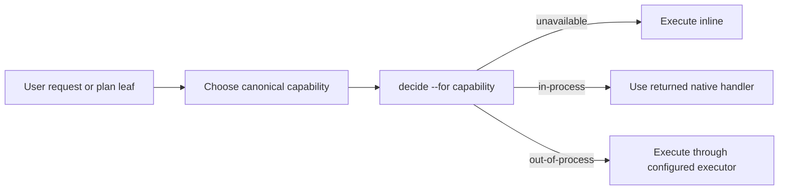

# Capability-aware dispatch activation

## Trạng thái hiện tại

Thảo luận đã hội tụ ở một lát đầu tiên nhỏ: giữ nguyên primitive capability và resolver hiện tại; thay đổi điểm kích hoạt bằng instruction để agent phân loại capability trước khi thực hiện, đồng thời làm planning nhận biết capability ở từng execution unit. Hard enforcement và thay đổi schema được hoãn cho tới khi có bằng chứng instruction không đủ ổn định.

## Mục tiêu & đề bài

fgOS cần cho phép người vận hành cấu hình executor theo phẩm chất công việc thay vì theo tên skill, stage, flow hay work item. Một agent nhận yêu cầu trực tiếp hoặc đang lập kế hoạch phải tự nhận ra loại năng lực cần dùng, chọn một canonical capability từ catalog, rồi luôn hỏi dispatch xem capability đó có executor hay không. Capability có thể generic như `advise` hoặc được định danh kép theo domain như `code:implement`; Work lifecycle chỉ là một nguồn sinh execution unit, không phải điều kiện của dispatch.

## Vấn đề rõ / chưa rõ

| Điểm | Trạng thái | Kết luận hiện tại |
|---|---|---|
| Primitive dùng để route | Rõ | Dùng `runner.capabilities` và `decide --for` hiện có. |
| Định danh | Rõ | Generic capability giữ nguyên; capability theo domain dùng canonical `domain:capability`. |
| Awareness khi thực thi | Rõ | Agent phải decide-before-execute, không chỉ decide-before-dispatch. |
| Awareness khi planning | Rõ | Mỗi execution unit độc lập được gắn một canonical dispatch capability. |
| Quan hệ với Work | Rõ | Không phụ thuộc Work; Work/stage/flow chỉ có thể cung cấp capability cho execution unit. |
| Executor trong plan | Rõ | Không pin executor/provider/model; runtime resolve lại bằng `decide`. |
| Enforcement cứng | Hoãn có chủ đích | Bắt đầu bằng instruction/prose và đo compliance; chỉ thêm guard/schema khi có bằng chứng cần thiết. |

## Quyết định đã chốt

| ID | Quyết định | Lý do |
|---|---|---|
| D1 | Giữ nguyên capability là primitive dispatch; canonical identity hỗ trợ cả generic (`advise`) và domain-scoped (`code:implement`). | Capability hiện đã là behavior promise/purpose và `decide --for` đã resolve nó sang executor. |
| D2 | Đổi activation doctrine thành decide-before-execute: trước một execution unit có thể giao, agent chọn capability từ catalog và luôn hỏi dispatch. | Nếu chỉ yêu cầu decide-before-dispatch, agent có thể tự quyết định làm inline và bỏ qua dispatch hoàn toàn. |
| D3 | Planning phải ghi canonical capability cho từng execution unit độc lập; capability là tín hiệu decomposition nhưng không buộc xé plan quá nhỏ. | Capability boundary giúp chọn executor và parallelize mà không biến tên task thành routing keyword. |
| D4 | Lát đầu là instruction-first; không đổi dispatch resolver, Work schema, Assignment shape hay thêm mutation guard. | Kiểm chứng ontology và hành vi trước; chỉ xây enforcement khi có bằng chứng prose không đủ. |
| D5 | Plan không lưu executor/provider/model; execution-time `decide` là nguồn quyết định hiện hành. | Giữ plan portable và không đóng băng cấu hình runtime. |

## Q&A log

### 2026-09-08T13:58:15+07:00

- Người dùng bác việc dùng tên skill `fgos-coding-implement` hoặc keyword do agent tự nghĩ làm định danh dispatch.
- Hai bên phân biệt Work item, stage operation, task instance và capability; capability được xác định là primitive phù hợp.
- Người dùng chốt định danh kép `domain:capability`, đồng thời giữ generic capability.
- Hai bên chốt awareness phải xuất hiện cả trước execution và trong planning/decomposition.
- Người dùng đồng ý bắt đầu bằng lát instruction-first, chưa xây thêm harness cứng.

## Thiết kế đã chốt {#design}

Agent nhận một yêu cầu trực tiếp hoặc một execution unit do planner tạo ra. Trước khi thực hiện, agent phân loại bản chất công việc bằng cách chọn đúng một canonical capability từ curated catalog; nó không được tự sáng tác keyword. Capability generic không có domain prefix, còn capability chuyên biệt dùng định danh `domain:capability`, ví dụ `code:implement` hoặc `code:review` (D1).

Planner áp dụng cùng phép phân loại cho từng execution leaf. Khác capability là tín hiệu mạnh để tách các phần có thể giao độc lập hoặc chạy song song, nhưng những nghĩa vụ gắn liền như implement kèm verification có thể ở cùng một unit. Plan chỉ ghi capability, objective, boundary và evidence cần có; không ghi executor/provider/model (D3, D5).

Ngay trước execution, agent gọi `decide --for <canonical-capability>`. `unavailable` cho phép làm inline; `in-process` hoặc `out-of-process` phải tuân theo hand-back của dispatch. Quy tắc này đặt quyết định inline-vs-dispatch ở control plane thay vì trong suy đoán của agent (D2). Lát đầu thực hiện bằng instruction và các scenario kiểm chứng; schema/hook chỉ được mở rộng nếu compliance thực tế không đạt (D4).

## Danh mục hạng mục / task {#tasks}

### Capability-aware instruction slice {#task-capability-aware-instruction-slice}

**Goal:** thay capability lifecycle-shaped hiện tại bằng canonical `code:implement` ở đường coding tương tác, và dạy planning/execution luôn chọn capability rồi hỏi `decide` mà không thay resolver hay schema.

**Thiết kế áp dụng:** D1-D5; cụ thể là bổ sung catalog/config mapping tương thích, cập nhật shared dispatch doctrine cùng planning/implementation instructions, và chứng minh ba nhánh `unavailable`/`in-process`/`out-of-process` không bị thay nghĩa.

**Quan hệ:** một hạng mục duy nhất; hard enforcement là follow-up chỉ được tạo khi scenario compliance chỉ ra instruction có thể bị bypass.

**Draft verify:** `npm test`
