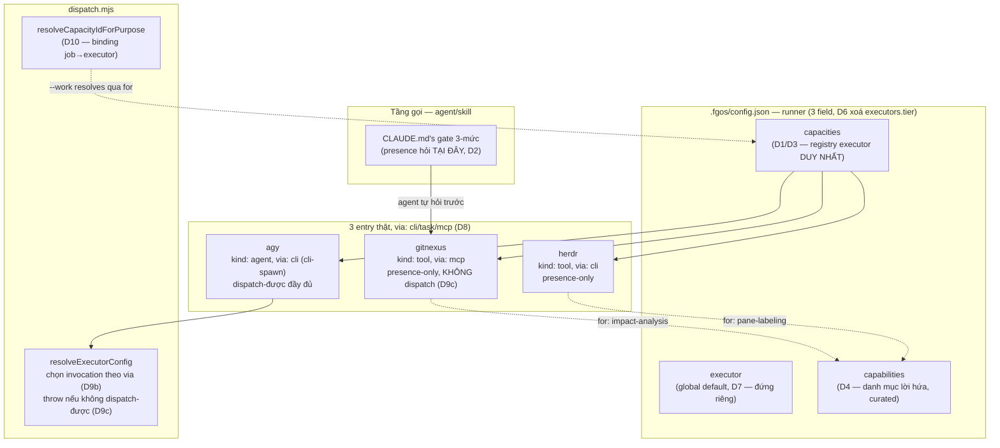

# DISCUSSION — Hợp nhất vocab capability + đối chiếu lại registry executor

Item: `tsk-in1`. Nối tiếp lineage `tsk-5tm` (task-dispatch-unification,
D1-D12, `docs/history/task-dispatch-unification/`) và `tsk-62v`
(agent-executor-capacity-dispatch, nguồn gốc thật của `capacities.<id>`,
`docs/history/agent-executor-capacity-dispatch/`). Phát sinh từ 1 phiên
review report `plans/reports/task-dispatch-system-architecture-spec-
260815-1916-concepts-triggers-config-and-real-flows-report.md`.

## 1. Trạng thái hiện tại

Vòng 3 (2026-08-15). **12 D-ID đã CHỐT (D1-D12, trừ D-số cũ đã đổi
đánh số — xem bảng §4)**. Vòng 3 dùng 1 agent Opus tư vấn độc lập
(`adapter-porting-consult`), đối chiếu marketing-cockpit's `## harness`
(bản chưng cất, không có checkout thật) với chính code `dispatch.mjs` —
mọi claim về fgOS đã spot-check lại bằng grep/read trực tiếp, khớp
100%. Kết quả: KHÔNG port thêm adapter nào (0 producer thật cho http/
binary/skill/api — event log xác nhận); nhưng D5 (kind agent/tool split)
tự nó cần sửa (D8, bỏ `api` khỏi vocab) VÀ cần 3 gate mới mới ship được
(D9) — nếu không, chính entry `gitnexus` §6 vẽ ra sẽ vỡ ngay lúc load
config. #3 (namespace job-id/executor-name) đã có hướng giải (D10, dùng
`resolveCapacityIdForPurpose` có sẵn) nhưng còn 1 câu hỏi con chưa đóng
(bug hay thiết kế cố ý — xem Outstanding). #7 (dead reference
`submit-assist-classify`) đã XÁC NHẬN qua event log, hết nghi ngờ. 2 ý
tưởng marketing-cockpit khác (silent downgrade, model-policy.yaml tách
file) đã đánh giá và TỪ CHỐI (D11).

Còn 2 điểm mở trước khi viết `plan.md`: #3's câu hỏi con (bug/thiết kế
cố ý — đọc `tsk-5tm-6` D4), và xác nhận `gitnexus`/`herdr` có bao giờ
chạm `resolveExecutorConfig` thật không (quyết định B3/D9(c) là bug thật
hay chỉ hardening phòng ngừa).

## 2. Mục tiêu & đề bài

`runner.capacities` (`.fgos/config.json`) và `src/state/tool-registry.mjs`
hôm nay duy trì 2 vocab "capability" tách rời hoàn toàn (dispatch: enum
đóng `CAPACITY_PURPOSES` chỉ `'judge'`; tool-registry: free-text mở qua
`normalizeCapability`) phục vụ 2 câu hỏi khác nhau (dispatch: gọi thế
nào; tool-registry: ai đang có mặt) nhưng ghi nhận CÙNG 1 loại thực thể —
provider/executor — qua 2 cơ chế ghi khác nhau (config-edited vs
event-sourced). 2 tầng này từng được nối qua field `needs`
(`tsk-62v` D6) rồi bị `tsk-5tm` D1 chủ động cắt, có bằng chứng (GitNexus —
ví dụ động lực gốc — chưa bao giờ thực sự là 1 `capacities.<id>` entry).
Đồng thời, cách KEY của registry đã pivot 1 lần (`tsk-62v` D3: job-identity
→ `tsk-5tm-4` D11: executor-name) để lại 2 namespace sống chung 1 object
mà chưa ai đối chiếu. Và bản thân `kind` — trục phân loại executor — đã
được THIẾT KẾ là `agent|tool` (khớp marketing-cockpit ADR0027/0042,
chính `DISCUSSION.md` gốc của `tsk-5tm` viết `kind:"agent"` cho ví dụ
`agy`) nhưng CHƯA BAO GIỜ lên code thật (`CAPACITY_KINDS` vẫn flat
`cli/binary/mcp/skill/http/task`, config thật phải dùng `kind:"cli"` để
load được). Đề bài phiên này: hợp nhất vocab + registry, đúng vị trí đã
xác nhận (không khôi phục gate cũ), đúng tên field (không đụng field đã
khoá), và đúng hình dạng `kind`/`invocations` mà thiết kế gốc đã định
nhưng chưa từng thực thi.

## 3. Vấn đề rõ / chưa rõ

| # | Vấn đề | Trạng thái |
|---|---|---|
| 1 | Hợp nhất vocab "capability" giữa tool-registry và dispatch thành 1 danh mục curated dùng chung? | **CHỐT — D4.** |
| 2 | Có nên khôi phục cầu nối "dispatch tự hỏi tool-registry lúc resolve" (`tsk-62v` D6)? | **CHỐT — D2 (không khôi phục, giữ nguyên).** |
| 3 | Xung đột 2-namespace: `capacityIdForWork` tính job-identity (`"fgos-coding-implement"`), registry key theo executor-name — `decide --work` tra job-id vào object key-theo-tên-executor, gần như luôn miss. | **ĐÓNG HẲN — D10 + D12.** Miss là thiết kế cố ý (`dispatch.mjs:1599-1613`, `tsk-5tm-6` D4), không phải bug. D10 (purpose-lookup) là đường riêng, không mâu thuẫn. |
| 4 | Tên field cho registry hợp nhất | **CHỐT — D3 (giữ `capacities`, không đổi `executors`).** |
| 5 | Bỏ tool-registry event-sourced registration, gộp vào config? | **CHỐT — D1.** |
| 6 | Presence-probe logic + local status overlay giữ làm hàm thuần, tách khỏi registry file | **CHỐT, kèm trong D1.** |
| 7 | `docs/how-to/diagnose-a-blocked-return-from-an-unrelated-verify-failure.md`'s tham chiếu `submit-assist-classify` — dead reference? | **XÁC NHẬN — dead.** Event log: register (08-01) → remove (08-09) → re-register dưới capability khác (08-09) → remove (08-12). Sự kiện cuối cùng là `tool.remove` — entry không còn sống. Sửa doc cùng lúc với việc gộp tool-registry (D1). |
| 8 | `kind` tách `agent`/`tool`, vocab cũ dời vào `invocations[].via` | **CHỐT — D5.** |
| 9 | Blast radius của D5: bao nhiêu chỗ đọc `capacity.kind`/`CAPACITY_KINDS`/`INVOCATION_VIA` sẽ cần sửa khi đổi ngữ nghĩa | **1 phần đã rà — D8/D9** (3 gate B1/B2/B3 xác định cụ thể). Còn phần thuần liệt kê call site cho `plan.md`. |
| 10 | Danh mục `capabilities` — hình dạng cụ thể (object có alias/description, hay tập tên đơn giản) | **CHỐT — D14** (`{description, aliases: [...]}`), hỏi ở `fgos-coding-exploring`. |
| 11 | Số phận `executors.<tier>` (0 entry live, chỉ 2 điểm chạm code, đều trong `dispatch.mjs`) — giữ làm escape hatch hay xoá theo YAGNI? | **CHỐT — D6 (xoá hẳn).** |
| 12 | Có nên thêm adapter mới (`http`/`api`/`bash`/`python`/`native`) khớp marketing-cockpit's `adapter bash/python/native/mcp`? | **CHỐT — KHÔNG (D8/D9's rationale).** 0 producer lịch sử; `bash`/`python` đã phủ bởi `cli-spawn`; `native` đã có `decideDispatchMechanism`. |
| 13 | Silent model-tier downgrade + `model-policy.yaml` tách file (marketing-cockpit) — port? | **CHỐT — KHÔNG, D11.** |
| 14 | Xoá `probeHttp`/`'http'` khỏi `tool-registry.mjs`/`KINDS` khi gộp? | **CÒN MỞ** — nghiêng xoá (0 registration lịch sử), chưa mint. |

## 4. Quyết định đã chốt

| D-ID | Quyết định |
|---|---|
| D1 | Bỏ tool-registry event-sourced registration (`fgos tool register`/`tool.register`, `.fgos/tool-registry.json`'s committed `providers[]`), gộp khai báo provider (`gitnexus`, `herdr`) thẳng vào `runner.capacities` trong `.fgos/config.json`. Giữ lại làm hàm thuần (không phải registry riêng): `probeTool`/`findExecutableOnPath`/`isIndexStale`. Giữ tách riêng, local, gitignored: `tool-status.local.json`. |
| D2 | Không khôi phục cầu nối "dispatch tự query tool-registry lúc resolve" (`tsk-62v` D6, qua field `needs`) mà `tsk-5tm` D1 đã cắt — giữ nguyên hiện trạng, presence-gate ở tầng gọi (agent/skill, `CLAUDE.md`'s gate 3-mức), không phải tầng `dispatch.mjs`. |
| D3 | Giữ nguyên tên field `capacities` (không đổi thành `executors`) cho registry hợp nhất; field `executors` (tier-keyed) không dời đi đâu, không đổi tên — tránh xung đột validator thật (`dispatch.mjs:521-528`). |
| D4 | Thêm `runner.capabilities` — danh mục capability curated, predefined + đăng ký thêm được, hợp nhất vocab tool-registry (free-text) và dispatch (`CAPACITY_PURPOSES` enum đóng). |
| D5 | `kind` tách thành 2 giá trị `agent`/`tool` (trục BẢN CHẤT), vocab cũ (`cli`/`binary`/`mcp`/`skill`/`http`/`task`) dời vào `invocations[].via` (trục CƠ CHẾ GỌI); `INVOCATION_VIA` mở rộng từ `['cli']` thành `['task','cli','mcp','api']`. Khớp ADR0027/0042 marketing-cockpit VÀ đúng thiết kế gốc `tsk-5tm` đã viết (`DISCUSSION.md` §6/§7 viết `kind:"agent"` cho `agy`) nhưng chưa từng lên code thật (`CAPACITY_KINDS` chưa từng có `agent`, config thật phải dùng `kind:"cli"` — lệch thiết kế, `tsk-1qn` không bắt được vì D2 chỉ spot-read). |
| D6 | Xoá hẳn `executors.<tier>` (tier-keyed fallback, từ P41). Chỉ còn 2 tầng: `executor` (global default) và `capacities` (registry hợp nhất, D1/D3). | 0 entry live (`runner.executors` = `undefined` trên máy), không module nào ngoài `dispatch.mjs` đọc/ghi nó (2 điểm chạm: validate dòng 682-686, resolve dòng 902). Lịch sử đã gây bug thật: `tsk-5tm` D10 xác nhận bug `judge-decompose` (`tsk-5ge`) là do nhầm lẫn đặt nội dung vào `runner.executors.judge` tưởng đang cấu hình capacity `judge`, trong khi `executors` chỉ nhận key tier — `tsk-4eu`'s validator sinh ra để chặn đúng loại nhầm lẫn này. `capacities` không thay thế 100% về biểu đạt (mất khả năng blanket-fallback-theo-tier khi không ai gọi đích danh capacity) nhưng tính năng đó chưa từng được dùng thật — mất không tốn gì. |
| D7 | Giữ `cfg.executor` (global default) đứng riêng, KHÔNG gộp vào `capacities.default`. | `executor` là field BẮT BUỘC (không có guard optional, khác hẳn `capacities`/`capabilities`), là hạt giống bootstrap (`ensureRunnerConfigForDir`/`DEFAULT_RUNNER_CONFIG`) và là template nguồn cho `buildAgentTypeExecutor`. Gộp vào 1 key đặc biệt `'default'` bên trong map tuỳ chọn sẽ tạo đúng loại bẫy tên-key-mang-ý-nghĩa-ngầm đã gây bug thật ở D6 (`judge`/`executors` collision). Quyết định phạm vi item này, không đồng nghĩa mãi mãi không xem lại. |
| D8 | Sửa `INVOCATION_VIA` của D5 thành `['cli','task','mcp']` (bỏ `'api'`); bỏ hẳn `'binary'`/`'skill'`/`'http'` khỏi vocab `kind` khi gộp tool-registry vào `capacities`. | Event log thật: toàn bộ lịch sử chỉ 2 kind từng đăng ký (`cli`, `mcp`) — `http`/`binary`/`skill` = 0 lần, dead vocab. `dispatch.mjs:1104-1107` tự ghi rõ rpc/app-server adapter "deferred... until a real system needs to plug into this port". 1 capacity dispatch-được duy nhất (`agy`) dùng `via:cli`. |
| D9 | D5 cần 3 gate sửa kèm, không thể ship thiếu: **(a)** `validateCapacityShape` không bắt buộc `command`/`args` cho MỌI invocation — tuỳ theo `via`; **(b)** `resolveExecutorConfig` phải CHỌN invocation đúng theo `via`, không lấy `invocations[0]` mù; **(c)** `resolveExecutorCommand` phải THROW khi 1 invocation không có adapter/via dispatch-được, không được âm thầm rơi về `DEFAULT_ADAPTER` (`cli-spawn`). | Không sửa thì entry `gitnexus` mà §6 vẽ ra sẽ vỡ ngay lúc load config: `validateExecutorShape` (`:609`) bắt buộc `command`+`args` cho mọi invocation — `{via:"mcp"}` không có `command` sẽ fail validate. `resolveExecutorConfig` (`:894-896`) lấy `invocations[0]` vô điều kiện — đúng khi vocab 1 giá trị, sai khi đã nhiều `via`. `adapter = executor.adapter ?? DEFAULT_ADAPTER` (`:1039`) sẽ âm thầm spawn literal `"mcp:gitnexus"` như 1 binary — cùng họ bug `judge-decompose` mà D6 đã dùng làm bằng chứng. |
| D10 | Giải #3 (xung đột namespace job-id vs executor-name) KHÔNG bằng đổi cách key của `capacities` — registry giữ key theo TÊN EXECUTOR đúng như D3 đã chốt. Binding "job nào chạy executor nào" là 1 tra cứu TÁCH BIỆT, dùng hàm có sẵn `resolveCapacityIdForPurpose(cfg, purpose)` qua field `for`, không cần máy mới. | Marketing-cockpit's `## harness` (`marketing-cockpit.md:143`): "Orchestrator đọc `next_stage_model/executor/interface` từ `run.yaml` khi dispatch" — họ tách hẳn binding job→executor khỏi chính registry, đúng model fgOS đã có sẵn (purpose-lookup) nhưng chưa dùng cho đường `--work`. |
| D11 | Đánh giá và TỪ CHỐI 2 mô hình marketing-cockpit — không port: **(a)** silent model-tier downgrade; **(b)** tách `model-policy.yaml` thành file riêng. | (a) fgOS đã có giải pháp TƯỜNG MINH cho đúng vấn đề (`rigorOverrides` trên `agy`, `modelForTier` throw rõ tier+provider khi thiếu) — bản chưng cất không ghi điều kiện kích hoạt downgrade, port hình dạng mà không biết ngữ nghĩa là liều lĩnh; ngược triết lý loud-failure. (b) `mergeWithGlobalConfig` đã cho đúng tính chất "sửa 1 chỗ đổi cả hệ" mà không cần đăng ký nguồn config mới vào `fgos setup`/`doctor`. |
| D12 | Xác nhận #3's câu hỏi con: `capacityIdForWork` miss khi tra vào `capacities` (key theo executor-name) KHÔNG PHẢI bug, là thiết kế cố ý (`tsk-5tm-6` D4). | `dispatch.mjs:1599-1613` tự ghi rõ: miss = tín hiệu "không có override cấu hình" — theo Native-First Dispatch Doctrine rule 2, mọi candidate `fgos-fanout` là same-provider + cần soul nên mặc định native. Code tự trích dẫn bug thật từng xảy ra khi làm sai hướng này. D10 không mâu thuẫn — đường `--for`/purpose (D10) và đường `--work` (D12) đã tách bạch từ trước. |
| D14 | `runner.capabilities.<name>` mang shape `{description, aliases: [...]}` (chốt tại `fgos-coding-exploring`). | Kế thừa tinh thần `description`/`responsibility` của provider shape cũ (tool-registry); `aliases` cho phép 1 capability có nhiều tên gọi khác `normalizeCapability`'s chuẩn hoá tự động. |
| D15 | `capacities.<id>.for` đổi từ string đơn sang `string[]` — 1 executor phục vụ nhiều capability cùng lúc (chốt tại `fgos-coding-exploring`). | Hệ quả blast radius: `resolveCapacityIdForPurpose` (`:850-856`) so sánh `for === purpose` (đơn) cần đổi `for?.includes(purpose)` (mảng); `validateCapacityShape`'s check `for` cũng cần sửa mỗi phần tử mảng phải nằm trong `capabilities` (D4/D14). |
| D13 | Xây 1 `http`/`api` adapter thật (`EXECUTOR_ADAPTERS['http']`) làm tiền lệ chứng minh port pluggable. Sửa lại D8: đưa `'api'` trở lại `INVOCATION_VIA`, lần này có code thật đứng sau. Tổng quát hoá chữ ký `EXECUTOR_ADAPTERS` từ `(command,args,cwd,opts)` thành nhận thẳng object `invocation`, mỗi adapter tự destructure phần mình cần. | Người dùng muốn tiền lệ THẬT (không chỉ tài liệu) để kiểm chứng port `EXECUTOR_ADAPTERS` thật sự pluggable. Chọn `http` thay vì `bash`/shell — an toàn hơn (không mở lại shell-injection surface `cli-spawn` cố tình đóng, RUL45), khác biệt bản chất thực thi đủ để chứng minh khái niệm. Chữ ký cũ định hình theo CLI — ép `http` vào sẽ lặp lại đúng bẫy B1 (gitnexus's invocation không fit `command`/`args`). Tổng quát hoá nhất quán với D9(a). |

## 5. Q&A log

*(Vòng 1 — trước khi vào shaping, diễn ra trong chat, phục dựng lại đầy
đủ)*

- **Round a-c.** Phát hiện report kiến trúc dispatch gọi nhầm `agy` là
  "capacity" thay vì "executor". Xác nhận khung capacity=lời hứa,
  executor=hiện thực hoá (vòng 1 gốc của `tsk-5tm`). Đối chiếu
  marketing-cockpit thật — họ chỉ có 1 `executor-registry.yaml`, fgOS có
  nhiều trục hơn nhưng tên field `capacities` là di sản trước D11, không
  phải thừa kế từ họ.
- **Round d-f.** Chốt hướng hợp nhất vocab. Đếm 6 call site thật của
  `fgos tool query --capability X --status present` (loại boilerplate
  docs/history). Xác nhận "nếu X present thì check tươi" KHÔNG PHẢI cách
  dispatch hoạt động — là `tool-registry.mjs`'s `probeTool`/`isIndexStale`
  + `CLAUDE.md`'s prose gate, dispatch không có dòng staleness nào.
- **Round g-i.** Bác bỏ ý "bỏ tool-registry, chỉ giữ dispatch" (GitNexus
  không dispatch-được, ép vào shape dispatch sai bản chất). Ultrathink:
  xác nhận `isIndexStale` là hack đặc thù GitNexus núp vỏ tổng quát;
  kiểm event log thật (5 register+3 remove/2 tuần, có ý nghĩa thật —
  không phải "không làm gì"); dù vậy đồng ý gộp phần REGISTRATION (không
  phải probe-logic) vào config, vì `capacities` đã là tiền lệ sống
  không-event-sourced. Vẽ nháp config đầu tiên (`tierExecutors`/
  `capabilities`/`executors`-đổi-tên).
- **Round j (lật quan trọng).** Người dùng chỉ ra nháp round i "làm mới
  hoàn toàn" mà bỏ qua lịch sử đã chốt. Tìm lại `tsk-62v`'s CONTEXT.md
  (D3: capacityId=job-identity gốc; D6: cầu nối `needs`→tool-registry đã
  từng xây). Dừng đề xuất tự do, vào `fgos-coding-shaping`.

*(Vòng 2 — trong shaping, ghi lại đầy đủ)*

- **2026-08-15, round k.** Claim `tsk-in1`, tạo `DISCUSSION.md` v1
  (7 mục, §4 để trống — chưa đủ điều kiện mint). Commit.
- **round l.** Đọc chéo D1 (`tsk-5tm`) với D6 (`tsk-62v`) đầy đủ. Phát
  hiện: GitNexus/`impact-analysis` — động lực gốc của D6 — chưa bao giờ
  thực sự là 1 `capacities.<id>` entry (agent gọi MCP trực tiếp). Kết
  luận: D1 rút đúng chỗ D6 đặt sai vị trí (gate presence không thể đứng
  trong dispatch cho 1 capability không dispatch-được) — không phải D1
  mâu thuẫn D6. → mint **D2**.
- **round m.** Người dùng hỏi lại config, em show nhầm — trộn lẫn "còn mở"
  cho cả điểm ĐÃ chốt (D1/việc gộp tool-registry) lẫn điểm thật sự mở
  (D2's hệ quả). Người dùng phản ứng gắt ("ông nội ơi ông nội... tùm
  lum") — đúng, đã lẫn lộn 2 câu hỏi độc lập.
- **round n.** Sửa lại, tách rõ: D1 (gộp tool-registry) đứng độc lập,
  không bị D2 ảnh hưởng. Show lại config đúng — nhưng dùng nhầm tên field
  `executors` cho registry mới + đặt `tierExecutors` không cần thiết.
- **round o (người dùng paste lại nháp round i, chỉ đúng 1 lỗi).** Người
  dùng chỉ thẳng: bản round i "đẹp", chỉ sai tên `executors` (đụng field
  đã khoá của `tsk-5tm`). Sửa đúng 1 chỗ: giữ tên `capacities` (không đổi
  `executors`), bỏ hẳn khái niệm `tierExecutors` (không cần dời gì cả).
  → mint **D1** (nội dung gộp, đã có sẵn từ round i-n) + **D3** (tên
  field).
- **round p.** Người dùng xác nhận "ok, nhớ config trên nhé" — khoá config
  round o. Đồng thời nhắc: "đã từng chốt kind là agent|tool, mcp/cli/http/
  xxx cấu hình trong invocations". Kiểm lại `DISCUSSION.md` gốc của
  `tsk-5tm` §6/§7 — xác nhận đúng: ví dụ tham chiếu `agy` viết
  `kind:"agent"`, nhưng `CAPACITY_KINDS` (`dispatch.mjs:443`) chưa từng
  có `'agent'`, config thật phải dùng `kind:"cli"` mới load được — lệch
  thiết kế thật, `tsk-1qn` review không bắt (D2 chỉ spot-read). → mint
  **D4** (danh mục capabilities, đã ngầm định từ D1/round d-f) + **D5**
  (kind agent/tool split).
- **round q'.** Người dùng hỏi "có thể bỏ luôn `executor` không, thêm 1
  item default trong `capacities`". Quét code: `executor` BẮT BUỘC
  (không guard optional), là hạt giống bootstrap + template cho
  `buildAgentTypeExecutor` — khác hẳn `executors.<tier>` (optional, 0
  live). Đề xuất giữ tách riêng — người dùng đồng ý "tạm thời để nguyên"
  → mint **D7**.
- **round r.** Người dùng: "port luôn cli-spawn, http của marketing-
  cockpit... quét lại harness của nó, cái gì bất ổn/thiếu thì port qua...
  nhờ 1 opus agent tư vấn". Spawn agent Opus độc lập
  (`adapter-porting-consult`), brief đầy đủ: dispatch.mjs hiện tại,
  D1-D7 đã chốt, chỉ dùng bản chưng cất marketing-cockpit (không có
  checkout thật). Agent trả về báo cáo có cấu trúc — spot-check lại
  3 claim quan trọng nhất (dòng `dispatch.mjs:1039`/`1104-1107`, event
  log kind-history, `submit-assist-classify` register/remove sequence)
  bằng grep/read trực tiếp, khớp 100%. Kết quả: 0 adapter mới cần thêm
  (0 producer lịch sử cho http/binary/skill/api); nhưng D5 tự nó cần sửa
  (bỏ `api`) + 3 gate mới (shape-theo-via, chọn-invocation-theo-via,
  dispatchability-throw) mới ship được, nếu không entry `gitnexus` §6 vẽ
  ra sẽ vỡ ngay lúc load config. #3 có hướng giải (dùng
  `resolveCapacityIdForPurpose` có sẵn). #7 xác nhận dead qua event log.
  2 ý tưởng khác (silent downgrade, model-policy.yaml riêng) đánh giá và
  từ chối. → mint **D8/D9/D10/D11**.
- **round s.** Người dùng hỏi lại "runtime thực thi" (marketing-cockpit's
  `adapter`) vs "hàm transport" (fgOS's `EXECUTOR_ADAPTERS`) khác nhau ở
  đâu — giải thích bằng ví dụ. Đào tiếp câu hỏi con của #3: đọc lại
  chính comment `dispatch.mjs:1599-1613` (đã đọc từ đầu buổi, chưa nối
  vào đây) — xác nhận miss là thiết kế cố ý (`tsk-5tm-6` D4), không phải
  bug, có bug thật ADR0026 trích dẫn làm bằng chứng đối chứng → mint
  **D12**, đóng hẳn #3.
- **round q.** Người dùng hỏi số phận `executors.<tier>` giờ `capacities`
  đã đủ phẩm chất. Quét code: chỉ 2 điểm chạm, cả 2 trong `dispatch.mjs`
  (validate + resolve), 0 module khác đụng tới, `runner.executors` =
  `undefined` trên máy hôm nay. Bằng chứng nặng: `tsk-5tm` D10's bug
  `judge-decompose` chính là do nhầm `runner.executors.judge` với cách
  cấu hình 1 capacity — cơ chế này đã từng GÂY NHẦM LẪN thật, không chỉ
  "chưa ai dùng". Trình bày, người dùng chốt xoá hẳn → mint **D6**.
- **round t.** Người dùng phản biện gắt: "adapter là adapter... dispatch
  phải có/implement sẵn adapter để thực thi và trả ra kết quả... trong
  tiến trình học chúng ta đã chấp nhận học cách này rồi". Đọc lại đúng
  comment `dispatch.mjs:1100-1107` (đã đọc từ đầu buổi) — xác nhận
  `EXECUTOR_ADAPTERS` VỐN ĐÃ là 1 port mở, không phải khái niệm mới.
  Đính chính: `python` đã phủ bởi `cli-spawn` (đúng), nhưng
  `bash`-với-ngữ-nghĩa-shell KHÔNG phủ (khác `shell:false` cố ý của
  `cli-spawn`) — D8/D9 không sai HÀNH ĐỘNG nhưng diễn đạt sai (nghe như
  đóng cửa mở rộng).
- **round u.** Người dùng: "ý là anh muốn làm thêm 1 adapter để có tiền
  lệ luôn" — xây THẬT, không chỉ ghi tài liệu. Trình bày 2 ứng viên
  (`http`/`api` vs `bash`/shell), khuyến nghị `http` (an toàn hơn, khác
  bản chất đủ chứng minh khái niệm) — người dùng chọn `api`. Phát hiện
  thêm: chữ ký `EXECUTOR_ADAPTERS` hiện định hình theo CLI
  (`command,args,cwd,opts`) — ép http vào sẽ lặp bẫy B1. Đề xuất tổng
  quát hoá nhận `invocation` object → mint **D13**.
- **round v.** Người dùng: "ok chốt hết rồi đó" — discussion converged,
  chuyển sang §6/§7 + terminal handoff.

## 6. Thiết kế đã chốt {#design}

`runner.capacities` (`.fgos/config.json`) trở thành registry executor
DUY NHẤT — gộp cả provider cũ của tool-registry (`gitnexus`, `herdr`) lẫn
capacity dispatch-được (`agy`), key theo TÊN EXECUTOR (D3, không đổi).
`executors.<tier>` — cơ chế tier-keyed fallback cũ, từng gây nhầm lẫn
thật với `capacities` (`tsk-5tm` D10) và không còn entry sống nào — bị
XOÁ HẲN (D6). `executor` (global default) đứng riêng, không gộp vào
`capacities` (D7 — nó là field bắt buộc + hạt giống bootstrap, khác hẳn
tính chất optional của `executors.<tier>`). Config `runner` còn đúng 3
field thực thi: `executor`, `capabilities` (danh mục curated, D4 — nơi
DUY NHẤT mô tả "lời hứa", vocab đóng nhưng đăng ký thêm được), và
`capacities` (registry hợp nhất).

Mỗi entry executor tách 2 trục orthogonal (D5): `kind` (`agent`|`tool` —
bản chất) và `invocations[].via` — vocab đã SỬA còn `['cli','task','mcp']`
(D8, bỏ `'api'` — 0 producer lịch sử; `'binary'`/`'skill'`/`'http'` cũng
bỏ khi gộp, cùng lý do). `gitnexus` (`kind:"tool"`, `via:"mcp"`) và
`herdr` (`kind:"tool"`, `via:"cli"`) presence-only, không bao giờ bị
dispatch tự spawn. `agy` (`kind:"agent"`, `via:"cli"` qua `cli-spawn`)
dispatch-được đầy đủ. D5 tự nó cần 3 gate đi kèm mới ship an toàn (D9):
shape-validate theo `via` (không ép `command`/`args` cho mọi invocation),
chọn invocation đúng theo `via` (không lấy `[0]` mù), và throw tường
minh khi 1 invocation không dispatch-được (không âm thầm rơi về
`cli-spawn`).

Dispatch KHÔNG tự động gate presence bên trong `resolveExecutorConfig`
(D2, giữ nguyên hiện trạng `tsk-5tm` D1 để lại) — 1 capability không
dispatch-được (như `gitnexus`) không thể có gate trong đường dispatch,
presence luôn hỏi ở tầng gọi. Binding "job nào chạy executor nào"
(`decide --work`) dùng lại `resolveCapacityIdForPurpose` có sẵn (D10),
không đổi cách key của registry.

2 ý tưởng marketing-cockpit khác đã đánh giá và từ chối (D11): silent
model-tier downgrade (fgOS đã có `rigorOverrides` tường minh hơn), và
tách `model-policy.yaml` thành file riêng (`mergeWithGlobalConfig` đã
cho đúng tính chất đó).

`EXECUTOR_ADAPTERS` VỐN LÀ 1 port mở (không phải khái niệm mới của item
này) — quyết định D8/D9 chỉ giữ vocab `via` được VALIDATE hẹp đúng thực
tế hôm nay, không đóng cửa mở rộng. Item này xây 1 tiền lệ THẬT (D13):
adapter `http` (`EXECUTOR_ADAPTERS['http']`), đưa `'api'` trở lại
`INVOCATION_VIA` — lần này có code thật, không còn vocab chết. Đi kèm:
tổng quát hoá chữ ký `EXECUTOR_ADAPTERS` từ `(command,args,cwd,opts)`
(định hình theo CLI) thành nhận thẳng object `invocation` — mỗi adapter
tự đọc field mình cần (`cliSpawnAdapter` đọc `command`/`args`;
`httpAdapter` đọc `method`/`url`/`headers`/`body`), tránh lặp bẫy B1
(ép 1 shape không fit vào khuôn có sẵn).

Còn treo trước khi viết `plan.md`: câu hỏi con của #3 (miss hôm nay là
bug hay cố ý — đọc `tsk-5tm-6` D4), xác nhận `gitnexus`/`herdr` có bao
giờ thật sự chạm `resolveExecutorConfig` (quyết định D9c là bug thật hay
hardening phòng ngừa), số phận `probeHttp`/`'http'` trong
`tool-registry.mjs` (§3 #14).

## 7. Danh mục hạng mục / task {#tasks}

6 mảnh, tách theo đúng ranh giới footprint (giống cách `tsk-5tm` từng
tách 6 con) — mỗi mảnh chạm 1 cụm file riêng, phụ thuộc tuần tự nêu rõ
bên dưới.

### `#task-retire-tool-registry` (D1)

- **Mục tiêu:** Bỏ event-sourced registration (`fgos tool register`/
  `remove`, `.fgos/tool-registry.json`'s `providers[]`); gộp `gitnexus`/
  `herdr` thẳng vào `runner.capacities`; giữ `probeTool`/
  `findExecutableOnPath`/`isIndexStale` làm hàm thuần đọc từ `capacities`
  thay vì registry file riêng; giữ nguyên `tool-status.local.json`.
- **Trích §6:** *"`runner.capacities`... trở thành registry executor DUY
  NHẤT — gộp cả provider cũ của tool-registry"*.
- **File:** `src/state/tool-registry.mjs`, `.fgos/config.json`,
  `.fgos/tool-registry.json` (xoá), `src/cli/command-registry.mjs`
  (bỏ verb `tool register`/`remove`), `docs/how-to/diagnose-a-blocked-
  return-from-an-unrelated-verify-failure.md` (sửa dead reference #7).
- **Quan hệ:** độc lập, có thể làm trước tiên.
- **Verify nháp:** `npm test` xanh; `fgos tool query --capability
  impact-analysis --status present` vẫn trả `gitnexus` (nguồn đổi, hành
  vi CLI không đổi); `.fgos/tool-registry.json` không còn tồn tại.

### `#task-drop-tier-executor` (D6, D7)

- **Mục tiêu:** Xoá hẳn `executors.<tier>` (2 điểm chạm: validate dòng
  682-686, resolve dòng 902) + test liên quan. Xác nhận `executor`
  (global) đứng nguyên, không đổi.
- **File:** `src/runner/dispatch.mjs`, `test/runner/dispatch.test.mjs`
  (phần test `executors.<tier>`, ~34 dòng).
- **Quan hệ:** độc lập, có thể song song với `#task-retire-tool-registry`.
- **Verify nháp:** `npm test` xanh; `grep -n "cfg.executors\b"
  src/runner/dispatch.mjs` không còn kết quả nào.

### `#task-capabilities-catalog` (D4)

- **Mục tiêu:** Thêm `runner.capabilities` — danh mục curated, validate
  shape, hình dạng chi tiết field còn mở (§3 #10, quyết ở `fgos-coding-
  planning` hoặc vòng shaping tiếp — object có alias/description hay tập
  tên đơn giản).
- **File:** `src/runner/dispatch.mjs` (validate mới), `.fgos/config.json`.
- **Quan hệ:** độc lập về code, nhưng `for` validate sẽ đọc danh mục này
  — nên land trước hoặc cùng `#task-kind-agent-tool-split`.
- **Verify nháp:** test mới xác nhận `for` không hợp lệ (không có trong
  `capabilities`) bị từ chối rõ ràng.

### `#task-kind-agent-tool-split` (D5, D8, D9, D10, D12)

- **Mục tiêu:** `CAPACITY_KINDS` → `['agent','tool']`; `INVOCATION_VIA` →
  `['cli','task','mcp']` (D8); 3 gate D9 (shape-theo-`via`, chọn
  invocation đúng `via` thay vì `[0]` mù, throw khi không dispatch-được);
  sửa `decideCapacityDispatchMechanism`'s `hasNativeMechanism` đọc
  `kind==='agent'`. Ghi lại (không sửa code) kết luận D10/D12 vào comment
  `capacityIdForWork`/`decideCapacityCli` cho rõ — tránh người sau tưởng
  đây là bug.
- **Trích §6:** *"D5 tự nó cần 3 gate đi kèm mới ship an toàn"*.
- **File:** `src/runner/dispatch.mjs` (trung tâm), `.fgos/config.json`
  (`agy`'s `kind:"cli"`→`"agent"`), `test/runner/dispatch.test.mjs`.
- **Quan hệ:** phụ thuộc `#task-retire-tool-registry` land trước (cần
  `gitnexus`/`herdr` đã có mặt trong `capacities` để viết test thật cho
  gate B1/B2/B3).
- **Rủi ro cần xử ở planning:** blast radius đầy đủ của đổi `kind`
  enum — liệt kê hết call site đọc `capacity.kind`/`CAPACITY_KINDS`
  (§3 #9 phần còn lại).
- **Verify nháp:** test mới cho từng gate (B1: entry không `command`
  load được nếu `via` không cần; B2: chọn đúng invocation nhiều `via`;
  B3: throw rõ ràng khi invocation không dispatch-được, không rơi
  `cli-spawn` mù).

### `#task-http-adapter-precedent` (D13)

- **Mục tiêu:** Tổng quát hoá chữ ký `EXECUTOR_ADAPTERS` từ
  `(command,args,cwd,opts)` thành nhận `invocation` object; viết
  `httpAdapter` thật, đăng ký `EXECUTOR_ADAPTERS['http']`; test độc lập
  (không cần capacity thật đăng ký).
- **Trích §6:** *"xây 1 tiền lệ THẬT... mỗi adapter tự đọc field mình
  cần"*.
- **File:** `src/runner/dispatch.mjs` (`EXECUTOR_ADAPTERS`,
  `cliSpawnAdapter`'s call site sửa theo chữ ký mới), test mới.
- **Quan hệ:** phụ thuộc `#task-kind-agent-tool-split` (dùng chung
  `INVOCATION_VIA`/shape-theo-`via` vừa tổng quát hoá) — làm SAU.
- **Verify nháp:** test `httpAdapter` thật gọi 1 URL giả (test server
  local hoặc mock), trả đúng shape `{status, body, ...}`; test xác nhận
  đổi chữ ký không phá `cliSpawnAdapter` (toàn bộ test cũ vẫn xanh).

### `#task-http-status-decision` (§3 #14)

- **Mục tiêu:** Quyết + xoá `probeHttp`/`'http'` khỏi `KINDS` trong
  `tool-registry.mjs` nếu xác nhận 0 dùng thật (đã nghiêng xoá, chưa
  mint D-ID).
- **Quan hệ:** liên quan `#task-retire-tool-registry`, có thể gộp làm
  cùng lúc nếu nhỏ, hoặc tách nếu `fgos-coding-planning` thấy cần.
- **Verify nháp:** `npm test` xanh sau khi xoá.
