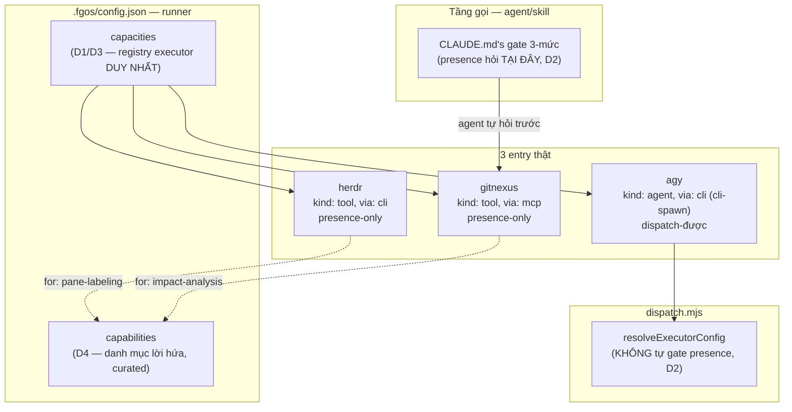

# DISCUSSION — Hợp nhất vocab capability + đối chiếu lại registry executor

Item: `tsk-in1`. Nối tiếp lineage `tsk-5tm` (task-dispatch-unification,
D1-D12, `docs/history/task-dispatch-unification/`) và `tsk-62v`
(agent-executor-capacity-dispatch, nguồn gốc thật của `capacities.<id>`,
`docs/history/agent-executor-capacity-dispatch/`). Phát sinh từ 1 phiên
review report `plans/reports/task-dispatch-system-architecture-spec-
260815-1916-concepts-triggers-config-and-real-flows-report.md`.

## 1. Trạng thái hiện tại

Vòng 2 (2026-08-15). **5 D-ID đã CHỐT (D1-D5)** — xem §4. Config đích đã
rõ hình, người dùng đã xác nhận "nhớ config trên nhé" cho phần
registry/naming (D1/D3/D4), và vừa xác nhận thêm phát hiện `kind`
(D5). Còn 3 điểm mở thật sự (§3 #3/#7/#8-shape-chi-tiết) chưa đủ vòng để
mint. Việc tiếp theo: rà blast radius thật của D5 (bao nhiêu chỗ đọc
`capacity.kind`/`CAPACITY_KINDS` hôm nay sẽ vỡ khi thêm `agent`/`tool` và
đổi nghĩa `invocations[].via`), và giải quyết xung đột namespace job-id
vs executor-name (#3) trước khi đủ điều kiện viết `plan.md`.

## 2. Mục tiêu & đề bài

`runner.capacities` (`.fgos/config.json`) và `src/state/tool-registry.mjs`
hôm nay duy trì 2 vocab "capability" tách rời hoàn toàn (dispatch: enum
đóng `CAPACITY_PURPOSES` chỉ `'judge'`; tool-registry: free-text mở qua
`normalizeCapability`) phục vụ 2 câu hỏi khác nhau (dispatch: gọi thế
nào; tool-registry: ai đang có mặt) nhưng ghi nhận CÙNG 1 loại thực thể —
provider/executor — qua 2 cơ chế ghi khác nhau (config-edited vs
event-sourced). 2 tầng này từng được nối qua field `needs`
(`tsk-62v` D6) rồi bị `tsk-5tm` D1 chủ động cắt, có bằng chứng (GitNexus —
ví dụ động lực gốc — chưa bao giờ thực sự là 1 `capacities.<id>` entry).
Đồng thời, cách KEY của registry đã pivot 1 lần (`tsk-62v` D3: job-identity
→ `tsk-5tm-4` D11: executor-name) để lại 2 namespace sống chung 1 object
mà chưa ai đối chiếu. Và bản thân `kind` — trục phân loại executor — đã
được THIẾT KẾ là `agent|tool` (khớp marketing-cockpit ADR0027/0042,
chính `DISCUSSION.md` gốc của `tsk-5tm` viết `kind:"agent"` cho ví dụ
`agy`) nhưng CHƯA BAO GIỜ lên code thật (`CAPACITY_KINDS` vẫn flat
`cli/binary/mcp/skill/http/task`, config thật phải dùng `kind:"cli"` để
load được). Đề bài phiên này: hợp nhất vocab + registry, đúng vị trí đã
xác nhận (không khôi phục gate cũ), đúng tên field (không đụng field đã
khoá), và đúng hình dạng `kind`/`invocations` mà thiết kế gốc đã định
nhưng chưa từng thực thi.

## 3. Vấn đề rõ / chưa rõ

| # | Vấn đề | Trạng thái |
|---|---|---|
| 1 | Hợp nhất vocab "capability" giữa tool-registry và dispatch thành 1 danh mục curated dùng chung? | **CHỐT — D4.** |
| 2 | Có nên khôi phục cầu nối "dispatch tự hỏi tool-registry lúc resolve" (`tsk-62v` D6)? | **CHỐT — D2 (không khôi phục, giữ nguyên).** |
| 3 | Xung đột 2-namespace: `capacityIdForWork` tính job-identity (`"fgos-coding-implement"`), registry key theo executor-name — `decide --work` tra job-id vào object key-theo-tên-executor, gần như luôn miss. | **CÒN MỞ** — chưa đọc kỹ `tsk-5tm-6` D4 để xác nhận đây là thiết kế cố ý hay khoảng trống. |
| 4 | Tên field cho registry hợp nhất | **CHỐT — D3 (giữ `capacities`, không đổi `executors`).** |
| 5 | Bỏ tool-registry event-sourced registration, gộp vào config? | **CHỐT — D1.** |
| 6 | Presence-probe logic + local status overlay giữ làm hàm thuần, tách khỏi registry file | **CHỐT, kèm trong D1.** |
| 7 | `docs/how-to/diagnose-a-blocked-return-from-an-unrelated-verify-failure.md`'s tham chiếu `submit-assist-classify` — dead reference, xử lý cùng lúc hay tách item? | **CÒN MỞ** — chưa xác nhận qua đọc `tsk-6ar`'s scope thật. |
| 8 | `kind` tách `agent`/`tool`, vocab cũ dời vào `invocations[].via` | **CHỐT — D5.** |
| 9 | Blast radius của D5: bao nhiêu chỗ đọc `capacity.kind`/`CAPACITY_KINDS`/`INVOCATION_VIA` sẽ cần sửa khi đổi ngữ nghĩa | **CÒN MỞ** — chưa rà, cần trước khi viết `plan.md`. |
| 10 | Danh mục `capabilities` — hình dạng cụ thể (object có alias/description, hay tập tên đơn giản) | **CÒN MỞ**, phụ thuộc D4 nhưng chưa quyết chi tiết field. |

## 4. Quyết định đã chốt

| D-ID | Quyết định |
|---|---|
| D1 | Bỏ tool-registry event-sourced registration (`fgos tool register`/`tool.register`, `.fgos/tool-registry.json`'s committed `providers[]`), gộp khai báo provider (`gitnexus`, `herdr`) thẳng vào `runner.capacities` trong `.fgos/config.json`. Giữ lại làm hàm thuần (không phải registry riêng): `probeTool`/`findExecutableOnPath`/`isIndexStale`. Giữ tách riêng, local, gitignored: `tool-status.local.json`. |
| D2 | Không khôi phục cầu nối "dispatch tự query tool-registry lúc resolve" (`tsk-62v` D6, qua field `needs`) mà `tsk-5tm` D1 đã cắt — giữ nguyên hiện trạng, presence-gate ở tầng gọi (agent/skill, `CLAUDE.md`'s gate 3-mức), không phải tầng `dispatch.mjs`. |
| D3 | Giữ nguyên tên field `capacities` (không đổi thành `executors`) cho registry hợp nhất; field `executors` (tier-keyed) không dời đi đâu, không đổi tên — tránh xung đột validator thật (`dispatch.mjs:521-528`). |
| D4 | Thêm `runner.capabilities` — danh mục capability curated, predefined + đăng ký thêm được, hợp nhất vocab tool-registry (free-text) và dispatch (`CAPACITY_PURPOSES` enum đóng). |
| D5 | `kind` tách thành 2 giá trị `agent`/`tool` (trục BẢN CHẤT), vocab cũ (`cli`/`binary`/`mcp`/`skill`/`http`/`task`) dời vào `invocations[].via` (trục CƠ CHẾ GỌI); `INVOCATION_VIA` mở rộng từ `['cli']` thành `['task','cli','mcp','api']`. Khớp ADR0027/0042 marketing-cockpit VÀ đúng thiết kế gốc `tsk-5tm` đã viết (`DISCUSSION.md` §6/§7 viết `kind:"agent"` cho `agy`) nhưng chưa từng lên code thật (`CAPACITY_KINDS` chưa từng có `agent`, config thật phải dùng `kind:"cli"` — lệch thiết kế, `tsk-1qn` không bắt được vì D2 chỉ spot-read). |

## 5. Q&A log

*(Vòng 1 — trước khi vào shaping, diễn ra trong chat, phục dựng lại đầy
đủ)*

- **Round a-c.** Phát hiện report kiến trúc dispatch gọi nhầm `agy` là
  "capacity" thay vì "executor". Xác nhận khung capacity=lời hứa,
  executor=hiện thực hoá (vòng 1 gốc của `tsk-5tm`). Đối chiếu
  marketing-cockpit thật — họ chỉ có 1 `executor-registry.yaml`, fgOS có
  nhiều trục hơn nhưng tên field `capacities` là di sản trước D11, không
  phải thừa kế từ họ.
- **Round d-f.** Chốt hướng hợp nhất vocab. Đếm 6 call site thật của
  `fgos tool query --capability X --status present` (loại boilerplate
  docs/history). Xác nhận "nếu X present thì check tươi" KHÔNG PHẢI cách
  dispatch hoạt động — là `tool-registry.mjs`'s `probeTool`/`isIndexStale`
  + `CLAUDE.md`'s prose gate, dispatch không có dòng staleness nào.
- **Round g-i.** Bác bỏ ý "bỏ tool-registry, chỉ giữ dispatch" (GitNexus
  không dispatch-được, ép vào shape dispatch sai bản chất). Ultrathink:
  xác nhận `isIndexStale` là hack đặc thù GitNexus núp vỏ tổng quát;
  kiểm event log thật (5 register+3 remove/2 tuần, có ý nghĩa thật —
  không phải "không làm gì"); dù vậy đồng ý gộp phần REGISTRATION (không
  phải probe-logic) vào config, vì `capacities` đã là tiền lệ sống
  không-event-sourced. Vẽ nháp config đầu tiên (`tierExecutors`/
  `capabilities`/`executors`-đổi-tên).
- **Round j (lật quan trọng).** Người dùng chỉ ra nháp round i "làm mới
  hoàn toàn" mà bỏ qua lịch sử đã chốt. Tìm lại `tsk-62v`'s CONTEXT.md
  (D3: capacityId=job-identity gốc; D6: cầu nối `needs`→tool-registry đã
  từng xây). Dừng đề xuất tự do, vào `fgos-coding-shaping`.

*(Vòng 2 — trong shaping, ghi lại đầy đủ)*

- **2026-08-15, round k.** Claim `tsk-in1`, tạo `DISCUSSION.md` v1
  (7 mục, §4 để trống — chưa đủ điều kiện mint). Commit.
- **round l.** Đọc chéo D1 (`tsk-5tm`) với D6 (`tsk-62v`) đầy đủ. Phát
  hiện: GitNexus/`impact-analysis` — động lực gốc của D6 — chưa bao giờ
  thực sự là 1 `capacities.<id>` entry (agent gọi MCP trực tiếp). Kết
  luận: D1 rút đúng chỗ D6 đặt sai vị trí (gate presence không thể đứng
  trong dispatch cho 1 capability không dispatch-được) — không phải D1
  mâu thuẫn D6. → mint **D2**.
- **round m.** Người dùng hỏi lại config, em show nhầm — trộn lẫn "còn mở"
  cho cả điểm ĐÃ chốt (D1/việc gộp tool-registry) lẫn điểm thật sự mở
  (D2's hệ quả). Người dùng phản ứng gắt ("ông nội ơi ông nội... tùm
  lum") — đúng, đã lẫn lộn 2 câu hỏi độc lập.
- **round n.** Sửa lại, tách rõ: D1 (gộp tool-registry) đứng độc lập,
  không bị D2 ảnh hưởng. Show lại config đúng — nhưng dùng nhầm tên field
  `executors` cho registry mới + đặt `tierExecutors` không cần thiết.
- **round o (người dùng paste lại nháp round i, chỉ đúng 1 lỗi).** Người
  dùng chỉ thẳng: bản round i "đẹp", chỉ sai tên `executors` (đụng field
  đã khoá của `tsk-5tm`). Sửa đúng 1 chỗ: giữ tên `capacities` (không đổi
  `executors`), bỏ hẳn khái niệm `tierExecutors` (không cần dời gì cả).
  → mint **D1** (nội dung gộp, đã có sẵn từ round i-n) + **D3** (tên
  field).
- **round p.** Người dùng xác nhận "ok, nhớ config trên nhé" — khoá config
  round o. Đồng thời nhắc: "đã từng chốt kind là agent|tool, mcp/cli/http/
  xxx cấu hình trong invocations". Kiểm lại `DISCUSSION.md` gốc của
  `tsk-5tm` §6/§7 — xác nhận đúng: ví dụ tham chiếu `agy` viết
  `kind:"agent"`, nhưng `CAPACITY_KINDS` (`dispatch.mjs:443`) chưa từng
  có `'agent'`, config thật phải dùng `kind:"cli"` mới load được — lệch
  thiết kế thật, `tsk-1qn` review không bắt (D2 chỉ spot-read). → mint
  **D4** (danh mục capabilities, đã ngầm định từ D1/round d-f) + **D5**
  (kind agent/tool split).

## 6. Thiết kế đã chốt {#design}

`runner.capacities` (`.fgos/config.json`) trở thành registry executor
DUY NHẤT — gộp cả provider cũ của tool-registry (`gitnexus`, `herdr`) lẫn
capacity dispatch-được (`agy`). Không đổi tên field (D3) — tránh đụng
`cfg.executors` (tier-keyed, giữ nguyên, không dời). Thêm `runner.
capabilities` — danh mục curated, độc lập với registry executor — là nơi
DUY NHẤT mô tả "lời hứa" (D4); mỗi entry executor tuỳ chọn gắn `for` trỏ
vào danh mục này.

Mỗi entry executor tách 2 trục orthogonal (D5): `kind` (`agent`|`tool` —
bản chất, có tự suy luận được không) và `invocations[].via` (`task`|
`cli`|`mcp`|`api` — cơ chế gọi thật). `gitnexus` (`kind:"tool"`,
`via:"mcp"`) và `herdr` (`kind:"tool"`, `via:"cli"`) presence-only, không
bao giờ bị dispatch tự spawn. `agy` (`kind:"agent"`, `via:"cli"` qua
`cli-spawn`) dispatch-được đầy đủ.

Dispatch KHÔNG tự động gate presence bên trong `resolveExecutorConfig`
(D2, giữ nguyên hiện trạng `tsk-5tm` D1 để lại) — 1 capability không
dispatch-được (như `gitnexus`) không thể có gate trong đường dispatch,
presence luôn hỏi ở tầng gọi.

Còn treo trước khi viết `plan.md`: xung đột namespace job-id/executor-
name (§3 #3), blast radius thật của D5 (§3 #9), dead reference
`submit-assist-classify` (§3 #7).

## 7. Danh mục hạng mục / task {#tasks}

Chưa chia — còn 2 điểm mở (§3 #3, #9) có thể đổi shape đủ để ảnh hưởng
ranh giới task. Vòng tiếp theo: giải quyết #3/#9 trước khi viết §7 thật.
