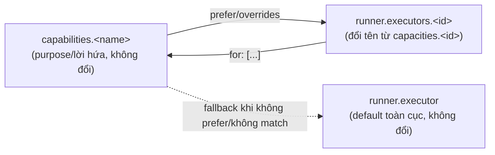

# DISCUSSION.md — tsk-225: capacity/capacities naming

## 1. Trạng thái hiện tại

Round 3: D1 đã khoá (executor thắng backend, full rename config+code, no
back-compat). User chỉ ra hỏi decision-record round trước quá mơ hồ (chưa
liệt kê nội dung thật) — đã đọc thật cả 7 file, tìm ra một phát hiện quan
trọng: 0029 D8 định nghĩa gốc "capacity" = gộp cả promise+helper-unit,
đúng thứ tsk-34n sau này tách thành capability/capacity mà chưa từng sửa
D8 chính thức. Chỉ 0026/0029/0033 có nội dung thật cần xử lý; 0028/0030/
0031 chỉ nhắc thoáng qua. Đề xuất: 1 decision record mới annotate vào
`0000-index.md` theo đúng tiền lệ 0028 đã annotate 0026, không mở lại nội
dung còn đúng. Đang chờ user xác nhận đề xuất này để tiến vào §7 (task
breakdown) và terminal handoff.

Round 2: user chốt không ngại effort đổi tên toàn bộ nếu đổi đúng — và tự
nhận ra "capacities → executors" thực chất KHỚP (không collision) với
`runner.executor` hiện có, chứ không đối chọi. User đưa thêm một khung ngữ
nghĩa mới: `capability` = một lời hứa hành vi (promised behavior); còn cái
đang bàn (capacity) = sự hiện thực hóa lời hứa đó. Scout xác nhận khung
này đúng về mặt kỹ thuật: `resolveExecutorConfig` (dòng 1143,
`src/runner/dispatch.mjs`) đã giải CẢ capacity riêng LẪN executor toàn cục
mặc định thành một shape chung mà chính code gọi là `executor` — nghĩa là
"capacity" và "executor toàn cục mặc định" vốn đã CÙNG MỘT LOẠI trong tư
duy code, chỉ khác named vs anonymous-default. "backend" bị loại vì là
danh từ tĩnh (mô tả một hệ thống/nơi chốn), không mang nghĩa "hành động
hiện thực hóa" như "executor" (gốc động từ "to execute"), và sẽ thêm một
từ thứ ba không liên quan thay vì tái dùng từ đã có sẵn. Hướng đang nghiêng
về: `runner.executor` (giữ nguyên, số ít, default toàn cục) +
`runner.executors.<id>` (đổi từ `capacities.<id>`, danh mục có tên, vẫn
khai `for: [...]`) + `runner.capabilities.<name>` (giữ nguyên). Chưa chốt
D-ID — điểm này mới chỉ có 1 vòng trả lời, chưa giữ ổn định qua vòng thứ
2. Hai câu hỏi còn mở: phạm vi rename (chỉ field config hay cả code
identifier nội bộ) và cách xử lý 7 decision record đã locked.

## 2. Mục tiêu & đề bài

Sau khi tsk-34n xong, `capacity`/`capacities` là thuật ngữ chỉ "một
backend cụ thể có thể thực thi công việc" (vd. `agy`, `gitnexus`), phân
biệt với `capability`/`capabilities` — "một purpose/công việc trừu tượng"
(vd. `fgos-coding-implement`, `impact-analysis`). User đặt câu hỏi: giờ
ranh giới capability/capacity đã rõ, liệu cái TÊN "capacity" còn đúng bản
chất không, hay nên đổi thành thứ gì đó gần với ngôn ngữ ngành hơn (như
`backend`/`executor`) — và nếu đổi, đổi thành gì để không đụng khái niệm
`executor` đã có sẵn (`runner.executor`, global default command/args
template, một khái niệm HOÀN TOÀN khác — không phải danh sách các
backend, mà là cấu hình mặc định khi không backend nào được chọn).

## 3. Vấn đề rõ / chưa rõ

| # | Vấn đề | Trạng thái |
|---|---|---|
| 1 | Phạm vi thật trong `src/`: 466 lần xuất hiện `capacit*` trải trên 7 file (`src/state/worker-slots.mjs`, `src/state/tool-registry.mjs`, `src/state/replay.mjs`, `src/setup/registrations.mjs`, `src/runner/loop.mjs`, `src/runner/dispatch.mjs`, `src/cli/command-registry.mjs`) | **Rõ** — đo trực tiếp bằng grep, không suy đoán |
| 2 | Phạm vi thật trong `test/`: 500 lần xuất hiện `capacit*` trải trên 8 file | **Rõ** |
| 3 | Phạm vi thật trong `docs/decisions/`: 7 decision record đã LOCKED dùng "capacity" làm thuật ngữ chính thức — 0026 (khai sinh khái niệm), 0028, 0029, 0030, 0031, 0033, 0000-index | **Rõ** |
| 4 | Phạm vi thật trong skill prose: 17 file dưới `.claude/skills`/`.agents/skills`/`plugins` nhắc "capacity" | **Rõ** |
| 5 | Collision thật với `executor`: `runner.executor` đã là một field tồn tại sẵn, ý nghĩa hoàn toàn khác — cấu hình mặc định TOÀN CỤC (`command`/`args` template dùng khi capacity không tự khai riêng), không phải danh sách backend. `resolveExecutorConfig`, `SUPPORTED_EXECUTOR_TEMPLATES`, `buildAgentTypeExecutor`, biến `executor` cục bộ trong nhiều hàm — tất cả đang dùng đúng chữ "executor" cho khái niệm NÀY. Đổi `capacities` → `executors` (số nhiều) sẽ đụng trực tiếp, gây lẫn giữa "danh sách backend" và "cấu hình executor mặc định" — đúng như user đã lường trước | **Rõ — "executor" số nhiều bị loại vì collision thật, không phải giả định** |
| 6 | "backend" có bị collision không? | **Rõ — không.** Grep thấy "backend" đã xuất hiện 3 chỗ nhưng CHỈ ở dạng văn xuôi mô tả (comment/spec prose gọi capacity là "backend" một cách không chính thức), chưa bao giờ là tên field/key thật. Không có xung đột kỹ thuật nếu chọn `backend`/`backends` |
| 7 | Effort thật để đổi tên toàn bộ (966 lần xuất hiện code+test, cộng 7 decision record, cộng 17 skill file) so với lợi ích (rõ nghĩa hơn cho người đọc mới) | **Rõ (round 2) — user chốt không ngại đánh đổi effort, ưu tiên rõ ràng khái niệm** |
| 9 | Chọn từ nào: `backend` hay `executor`? | **Rõ (round 2, cần giữ ổn định thêm 1 vòng để lên D-ID) — `executor` thắng: khớp kỹ thuật thật với `resolveExecutorConfig`'s existing return shape, đúng khung "capability=lời hứa, X=hiện thực hóa lời hứa" (executor = gốc động từ "thực thi"), backend bị loại vì là danh từ tĩnh không mang nghĩa hành động** |
| 10 | Phạm vi rename: chỉ field config `.fgos/config.json` (`capacities`→`executors`), hay cả identifier code nội bộ (tên hàm/biến `capacity`/`capacityId` khắp `src/`)? | **Rõ (D1, round 3) — full rename, config field + code identifier, không back-compat** |
| 11 | 7 decision record: cái nào thật sự có nội dung định nghĩa "capacity" cần xử lý, cái nào chỉ nhắc thoáng qua? | **Rõ (round 3) — chỉ 0026 (khai sinh vocabulary)/0029 (D8, định nghĩa thật)/0033 (dùng dày đặc, mechanistic) có nội dung thật; 0028/0030/0031 chỉ nhắc thoáng qua, không cần động tới** |
| 12 | Cách xử lý 0026/0029/0033: supersede formal hay chỉ annotate vào `0000-index.md`? | **Đang chờ user xác nhận đề xuất round 3 — xem §5** |

## 4. Quyết định đã chốt

| D-ID | Quyết định | Vòng chốt |
|---|---|---|
| D1 | Đổi tên toàn bộ `capacity`/`capacities` → `executor`/`executors` (thắng `backend`) — cả config field (`runner.capacities`→`runner.executors`) LẪN identifier code nội bộ (biến/hàm `capacity`/`capacityId` khắp `src/`). Không giữ back-compat/alias nào — đổi dứt điểm. | Round 2 (chọn executor, lý do kỹ thuật+ngữ nghĩa) giữ ổn định sang Round 3 (user xác nhận phạm vi full rename, "không có giữ compatible gì hết") |

## 5. Q&A log

**[Round 1, scout]** — Scan `docs/decisions/` cho "capacit": 7 file khớp
(`0000-index.md`, `0026-vision-orchestrator-roottask-capacity-native-vs-
cli-spawn.md`, `0028-doi-ten-orchestrator-thanh-launcher.md`, `0029-...`,
`0030-...`, `0031-...`, `0033-cli-spawn-shaped-capacity-thang-
hasLiveTaskAccess.md`). Grep phạm vi `src/`/`test/`: 466 + 500 lần xuất
hiện `capacit*`. Grep `runner.executor`/`cfg.executor` trong
`src/runner/dispatch.mjs`: 9 chỗ, xác nhận đây là một field/khái niệm khác
hẳn (global default), không phải danh sách backend — collision thật nếu
đổi `capacities` → `executors`. Grep "backend" (word boundary) trong
`src/`+`docs/decisions/`+`docs/specs/`: chỉ 3 chỗ, toàn văn xuôi mô tả,
không phải tên field — không collision.

**[Round 2]** — User: không sợ đánh đổi effort, cần sự rõ ràng; chốt dùng
`capability` (giữ nguyên), nhưng "capacity" gây khó hiểu — nếu đổi thành
`executor` hoặc `backend` sẽ rõ hơn hẳn; đổi `capacities`→`executors`
thực chất KHỚP với `executor` hiện tại (không phải collision); hỏi từ nào
đúng đắn nhất giữa backend/executor; đưa khung ngữ nghĩa: capability = a
promised behavior, còn cái đang bàn = hiện thực hóa lời hứa đó.

Scout xác nhận: `resolveExecutorConfig` (dòng 1143, `src/runner/
dispatch.mjs`) giải cả capacity riêng lẫn `cfg.executor` toàn cục thành
một shape chung mà chính code đặt tên `executor` — bằng chứng kỹ thuật
capacity và executor-mặc-định vốn cùng loại. Doc `docs/how-to/wire-a-
headless-function-through-an-agent-executor-capacity.md` đã dùng cụm
"agent-executor capacity" — thêm bằng chứng "executor" là từ tự nhiên
người viết code đã hướng tới. Kết luận trình bày lại cho user: `executor`
thắng `backend` vì khớp kỹ thuật thật (không phải chỉ nghe xuôi tai) và
đúng khung "hiện thực hóa lời hứa" (executor = gốc động từ, backend =
danh từ tĩnh mô tả hệ thống). Đề xuất shape: `runner.executor` (giữ
nguyên, default toàn cục) + `runner.executors.<id>` (đổi từ
`capacities.<id>`) + `runner.capabilities.<name>` (giữ nguyên). Hỏi lại 2
điều: (a) phạm vi rename — chỉ field config, hay cả identifier code nội
bộ (`capacity`/`capacityId` biến/hàm khắp `src/`); (b) 7 decision record
đã locked xử lý sao.

**[Round 3]** — User: (a) không sợ, đổi hết, "nhớ đổi đúng không có giữ
compatible gì hết" → khoá D1 (full rename, config + code identifier, no
back-compat). (b) User chỉ ra đúng: phải liệt kê nội dung thật của 7
decision trước khi hỏi cách xử lý, không được hỏi mơ hồ.

Đọc thật cả 7 file (không suy đoán từ tên): 0026 khai sinh "capacity" làm
vocabulary; 0028 chỉ đổi tên orchestrator→launcher, nhắc capacity thoáng
qua; **0029 D8 là phát hiện quan trọng nhất** — định nghĩa gốc `capacity`
= "một năng lực có tên (behavior-promise / functional-helper)", tức lịch
sử "capacity" từng gộp CẢ lời hứa lẫn đơn vị hiện thực — đúng cái mà
tsk-34n sau này TÁCH thành `capability` (lời hứa) + `capacity` (backend cụ
thể) mà chưa bao giờ chính thức sửa lại D8; 0030 chỉ nhắc thoáng qua trong
bối cảnh; 0031 không nhắc "capacity" trong thân bài; 0033 (tsk-pdg, làm
xong phiên này) dùng dày đặc, mechanistic thật (kind:agent, cli-spawn-
shaped). 0000-index.md đã có sẵn cơ chế annotate supersede (vd. dòng 0026
đã ghi "Đã supersede bởi 0028 lẫn 0029") — đây là tiền lệ có thật, không
phải cơ chế mới bịa ra.

Đề xuất: mở 1 decision record mới (số tiếp theo sau 0033), ghi lại việc
đổi tên `capacity`→`executor`, đồng thời chính thức hoá luôn việc tách
capability/capacity mà D8 để lại chưa rõ — annotate vào `0000-index.md`
theo đúng cách 0028 đã annotate vào 0026, không mở lại nội dung CÒN ĐÚNG
của 0026/0029/0033. Đang chờ user xác nhận.

## 6. Thiết kế đã chốt {#design}

Sau tsk-34n, `.fgos/config.json`'s runner model có 3 tầng: `capabilities`
(một purpose trừu tượng, vd `fgos-coding-implement`), `capacities` (một
backend cụ thể có thể thực thi, vd `agy`/`gitnexus`, mỗi cái khai
`for: [...]` để nói nó phục vụ purpose nào), và `executor` (số ít — cấu
hình mặc định toàn cục khi không backend nào được chọn riêng).

Vấn đề: chữ "capacity" không mang nghĩa "backend/thứ thực thi" một cách
tự nhiên, và tách rời khỏi chữ "executor" đã có sẵn — dù về mặt kỹ thuật
hai khái niệm này CÙNG LOẠI (`resolveExecutorConfig` giải cả hai thành
cùng một shape `executor`). D1 chốt: đổi `capacity`/`capacities` thành
`executor`/`executors` trên toàn bộ — cả field config lẫn identifier code
— không giữ back-compat. Kết quả:

Lý do "executor" thắng "backend": (1) kỹ thuật — `resolveExecutorConfig`
đã giải cả named-capacity lẫn global-default thành cùng một shape gọi là
`executor`, nên đổi tên là hợp nhất một sự thật đã có sẵn trong code, không
phải chọn một từ mới tùy ý; (2) ngữ nghĩa — user's khung: capability = lời
hứa hành vi, executor = sự hiện thực hóa lời hứa đó (executor có gốc động
từ "thực thi"); backend là danh từ tĩnh, không mang nghĩa hành động này.

Việc rename còn chạm tới 3 decision record có nội dung thật (0026 khai
sinh vocabulary, 0029 D8 định nghĩa gốc — hoá ra gộp cả capability+capacity
làm một, điều tsk-34n sau này mới tách mà chưa sửa D8, 0033 dùng dày đặc
mechanistic) — xử lý bằng 1 decision record mới, annotate vào
`0000-index.md`, không mở lại nội dung còn đúng (đề xuất, đang chờ xác
nhận — xem §5 round 3).

## 7. Danh mục hạng mục / task {#tasks}

(chưa chốt shape — chưa mở task nào)

