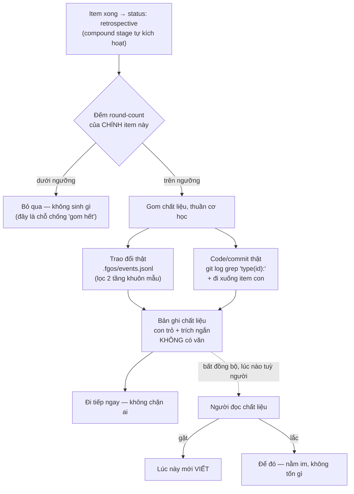

# Extensible multi-audience artifact-producer registry for compound-learn — Discussion

## 1. Trạng thái hiện tại

**Vòng 8 (2026-08-11) — kết luận Làn B của vòng 6 bị RÚT LẠI.** Chủ sản
phẩm phản biện: *"tại sao không đánh giá cơ hội từng task mà lại quét
thành bộ? vì nếu làm theo task thì stage compound được kích, chúng ta sẽ
kích hoạt làm luôn"*. Kiểm lại báo cáo phép thử thì phản biện đúng — vòng
6 lẫn giữa **chọn tiêu chí** (cần quần thể, một lần, offline — phép thử
đã làm rồi) và **áp tiêu chí lúc chạy** (chỉ cần bản thân item). Tín hiệu
phép thử tìm ra, `round-count-per-item`, là thuộc tính của CHÍNH item đó.
Nên phần chọn lọc không mất, nó đổi từ **xếp hạng tương đối** (cần quần
thể) sang **ngưỡng tuyệt đối** (không cần). Và per-item còn mạnh hơn ở
đúng ràng buộc khó nhất R6: quét-theo-lô là một bước cần-người-nhớ-chạy,
đúng hình dạng đã đo hỏng 32%; chạy tại compound stage thì không có bước
mới nào để quên. Chi tiết §5 vòng 8, §6.4 viết lại.

**Chốt được nghĩa của chữ "bản nháp" — trống suốt 4 vòng.** Em tra: fgOS
KHÔNG có `lifecycle`/`draft` ở đâu cả; chữ này mượn từ bee, chưa ai định
nghĩa trong fgOS. Hai nghĩa rất khác nhau (bài đã viết sẵn / chất liệu đã
trích), và **chi phí của nháp quyết định ngưỡng phải chặt tới đâu** — chỗ
dính nhau chưa ai nối. Chủ sản phẩm chọn **chất liệu đã trích**, kèm mở
rộng phạm vi: *"ý tưởng câu chuyện và chất liệu thật cho câu chuyện với
đầy đủ dẫn chứng, struggle/problem → solution, trao đổi thật, code thật,
commit thật"*. Xem §3 dòng M/N, §6.6.

**Chưa mint D-ID nào cho hai điều trên** — cả hai mới qua một vòng, luật
D4 đòi đứng vững qua hơn một vòng. Chờ vòng 9 xác nhận.

Còn mở: đo hình dạng struggle→solution ở diện rộng (mới có 2 ví dụ); đặt
ngưỡng ở đâu; hai trục có cần triển khai cùng lúc không; va giữa
D-tsk12m-B với mô hình mới; doctor check index drift gộp vào `tsk-3ip`
hay tách.

*Vòng 4 (giữ lại để đối chiếu):* Chủ sản phẩm chặn việc chốt vội, yêu cầu đánh giá lại chính mô
hình 5 pha vòng 3 phác ra. Session đo dữ liệu thật rồi tự phê bình, kết
quả: **rút lại một khẳng định của vòng 3** (`friction` KHÔNG phải chất
liệu kể chuyện — 92% là telemetry máy; vòng 3 suy rộng từ một bản ghi
duy nhất), và **bác phần lớn đường ống 5 pha** (4 lỗi: cửa gác chặn thay
vì trạng thái `draft`; triage cần quần thể nhưng vòng lặp chạy từng item;
gộp nhầm artifact cơ học với artifact phán đoán; quy mô kiến trúc lệch
quy mô vấn đề gốc). Số đo chặn lại quyết định: **54 item đang đứng ở
`retrospective`** — hàng đợi thật, nên mọi phương án thêm bước per-item
đều đi ngược. §6.4 viết lại thành 5 ràng buộc + 4 phương án.

Vòng 6. Chấm lại §6.4 cho **nửa storytelling**: bảng bốn phương án co còn
**một** — Làn B của phương án 2 (quét theo lô, xếp hạng trên quần thể, đẻ
ứng viên `draft`, curate bất đồng bộ, kèm doctor check canh chính nó).
Ba phương án kia tự loại chứ không bị chấm thua. **R1 sụp** (hàng đợi 54
là tồn đọng chứ không phải trần — đo lại còn 2, riêng 07-08 đẩy 86 item
qua `cleanup`), gộp vào R6. Kết luận **chưa mint**, chờ xác nhận. Nửa
changelog vẫn chờ số đo tỉ lệ quên (`tsk-12m` đang park `awaiting-human`).

*Vòng 5 (giữ lại để đối chiếu):* Phép thử Cách 1 (`tsk-1hy`) **đã chạy thật và merge** — trả lời
xong câu hỏi của nó: vỉa chất liệu **dùng được nhưng mật độ không đều**,
kèm ứng viên tín hiệu xếp hạng đầu tiên có căn cứ (round-count trên mỗi
item). Đồng thời đo được một thí nghiệm tự nhiên chưa ai để ý: bước
hậu-kỳ dựa vào "có người nhớ" đang hỏng ở **32%** (`docs/enduser-docs-
index.json` thiếu 70/220 tài liệu, không doctor check nào canh) — thành
ràng buộc R6 ở §6.4. Hệ quả lớn nhất: **§6.4 giờ trả lời được TỪNG NỬA**
— nửa storytelling đã có chứng cứ, nửa changelog còn chờ `tsk-3ip`.

Vòng 7 (2026-08-11). Một phiên `fgos-researching` độc lập (chạy trong
`fgos-coding-driving`'s discovery-stage pass cho `tsk-28x`, không đọc
trước §3 dòng E) tự đọc lại toàn bộ discussion và tự nêu đúng hai câu hỏi
§1/§3 dòng E đã treo: (1) kết luận Làn B chưa mint, (2) `deps: [tsk-12m]`
đáng ngờ. Trùng khớp độc lập này được tính là thêm một điểm dữ liệu, không
phải bằng chứng mới. Chủ sản phẩm trả lời câu (2) trực tiếp: **tách quan
hệ `tsk-28x` → `tsk-12m`** — xem D-tsk28x-2. Câu (1) (mint Làn B) vẫn
CHƯA chốt, chờ vòng sau.

Đứng vững: D-tsk28x-1 (hai trục), D-tsk28x-2 (tách dep `tsk-12m`), nguyên
tắc tách-theo-giai-đoạn, và toàn bộ 6 ràng buộc R1-R6. Còn mở: mint kết
luận Làn B cho nửa storytelling (đã đủ chứng cứ, chờ vòng xác nhận thứ
hai theo D4), hai trục có cần cùng lúc không, va giữa D-tsk12m-B với mô
hình mới, và một câu mới — có gộp doctor check cho index drift vào
`tsk-3ip` hay tách riêng.

**Vòng 9 (2026-08-18) — chủ sản phẩm đổi thứ tự bàn: khoá trục Diataxis+OKF
("row D") trước, đóng băng changelog/marketing-storytelling lại đã.**
Nguyên văn: hiện có Diataxis (nhận thức) và OKF (audience/scope/area), cần
CƠ CHẾ xác định capture của một work-item vừa xong nên bổ sung vào tài
liệu/nhóm tài liệu nào — không có cơ chế thì số tài liệu tăng chóng mặt
theo số work-item, "đã từng và đang bị". Đây chính là §3 dòng D, treo từ
vòng 3. Đo lại trước khi bàn (kỷ luật D-tsk28x đã lặp lại nhiều lần: đo
trước khi rút ràng buộc):

- `docs/explanation/` hiện có **161 file** (`how-to` 85, `reference` 21,
  `tutorial` 1 — tổng **268**; số 127/223 ghi lần scout đầu là đo trên
  worktree cũ, đã sửa sau khi đồng bộ `main`). **Tốc độ tăng đo bằng
  tree-diff chính xác: +50 tài liệu end-user trong đúng 7 ngày**
  (2026-08-11 13:32 → 2026-08-18, `git diff --diff-filter=A 7df2b894
  HEAD`) ≈ **7,1 tài liệu/ngày**, tức corpus tự nhân đôi trong ~5 tuần nếu
  không đổi gì. Đây là con số biến lời chủ sản phẩm "đã từng và đang bị"
  thành tốc độ đo được — và 50 tài liệu đó sinh ra TRONG lúc chính thảo
  luận này đang đỗ. Kèm cụm chủ đề trùng lặp rõ: riêng nhóm
  worktree/discover/decompose đã chiếm ~20 file rời (`discover-loop-pool-
  ordering-and-stop-rules.md`, `why-discover-was-rewritten-...md`, `why-
  decomposes-skip-and-advance-...md`, `orphaned-worktree-reclaim-...md`,
  `worktree-isolation-axis-decision.md`, …) mà đúng ra nên gộp vào 2-3 tài
  liệu sống theo chủ đề. Xác nhận bằng đọc trực tiếp `fgos-coding-compounding`
  SKILL.md bước 3: grow-vs-create hiện CHỈ so khớp `fs.existsSync` trên một
  đường dẫn tự chọn TỰ DO mỗi lần — không có cách nào một phiên compound
  biết đã có tài liệu chủ đề gần đó, nên gần như luôn "create". Đúng luật
  đã ghi thành văn ở `docs/specs/enduser-docs-authoring.md` R4 (grow-vs-
  create theo tồn-tại-tệp) — không phải bug, là quyết định hiện hành cần
  bàn lại.
- **ĐÍNH CHÍNH (cùng vòng 9, sau khi đo lại trên `main`):** lần scout đầu
  đọc nhầm vì worktree `fgw/tsk-28x` LÙI SAU `main`. Sự thật mạnh hơn nhiều
  so với "tiền lệ gần giống": `tsk-1lv-4` **CHÍNH LÀ cuộc di cư Row D đang
  tính làm, đã chạy xong**. Trước: 30+ file ADR, mỗi quyết định một file
  (`docs/decisions/0001-*.md` … `0035-*.md`) — đúng hình dạng "một output
  một file". Sau: narrative fold vào tài liệu sống có chủ, corpus retire
  hẳn, còn đúng `index.md` sinh tự động (`fgos decision-index`) + doctor
  check `decision-index-stale` canh tươi. Tỉ lệ fold thật: **36 quyết định
  → 5 đích** (`runner` 15, `work-state` 12, `platform-foundations` 4,
  `architecture-map` 3, `system-overview` 2).
- **fgOS đã có sẵn cơ chế "một chủ đề một chủ sở hữu" — không phải nhập từ
  OKF, mà tự chạy thật, mới landing trong tuần qua (`tsk-1lv-4`).** Lớp
  `docs/specs/` có đúng 11 AREA cố định (`system-overview.md` § Area Map),
  mỗi area sở hữu một file spec riêng, và mục "Lịch sử quyết định" ở cuối
  file đó GOM mọi quyết định thuộc area này — không phân biệt quyết định
  do work-item nào tạo ra — thành PROSE TÍCH LUỸ trong đúng một file,
  không bao giờ sinh file mới mỗi quyết định. `docs/decisions/index.md`
  (sinh bởi `fgos decision-index`) chỉ là hình chiếu đọc-theo-tag; narrative
  thật sống trong area spec. Đây CHÍNH LÀ mẫu OKF `authoritative_for` đòi
  hỏi — fgOS tự làm ra một bản nhẹ hơn (không anti-fork gate 3 tầng, không
  NFKC/confusable-fold) và nó đã chạy thật.
  - **Lớp Diataxis (`docs/<quadrant>/`) không có gì tương đương.** Không
    area map, không registry chủ đề nào để một phiên compound tra trước
    khi quyết create/grow. Đây đúng là khoảng trống row D chỉ ra từ vòng 3.
  - Cũng xác nhận `docs/specs/enduser-docs-authoring.md` (area spec của
    CHÍNH `fgos-coding-compounding`) đang lỗi thời: § Open Gaps còn viết "mỗi
    đường dẫn mới có một capture liên kết" / "mới ngăn how-to có tài liệu
    thật" — không khớp thực tế hôm nay (127/76/19/1). R5 của area spec đó
    tự để một cửa thoát: "chỉ cân nhắc trục thứ hai khi tài liệu thật va
    chạm (per D16)" — 127 file với cụm trùng chủ đề rõ ràng là bằng chứng
    va chạm đã xảy ra.

**Trả lời hai câu hỏi mở của Row D — có bằng chứng đo, chờ chủ sản phẩm
xác nhận (chưa mint):**

**(1) Tái dùng CƠ CHẾ, KHÔNG tái dùng VOCABULARY.** Ba căn cứ:
- Fold ở độ mịn "area" ĐÃ tạo ra file khổng lồ, nhìn thấy được:
  `runner.md` **2476 dòng**, `work-state.md` **2290 dòng** — repo tự đặt
  `docs.maxLoc: 800`, tức vượt gấp 3, mà mới hấp thụ 15 và 12 narrative.
- Histogram từ khoá trên tên file end-user docs: `merge` 23, `verify`
  19, `item` 19, `approve` 13, `executor` 12, `discover` 12, `checkout`
  12, `worktree` 11, `lock` 11, `decompose` 11 — gần như tất cả rơi vào
  đúng hai area `runner` + `work-state`. Fold 268 file vào 10 area ⇒ riêng
  tài liệu "runner" hấp thụ 60-80 file ≈ **10.000+ dòng**. Tái tạo đúng
  thất bại đang có, chỉ đổi hình dạng từ 127 file rời sang 1 file không ai
  đọc nổi.
- **D-ADR0008 (đã khoá) trả lời thẳng:** *"chọn kiểu routing theo audience
  của TỪNG interface, không toàn cục"*. Area Map = góc nhìn agent-đọc-
  trước-khi-sửa-code. End-user docs = góc nhìn "tôi đang cố làm X với
  fgos". Cùng nội dung, hai cách chia, theo một luật đã locked.

**(2) Fold-mechanism làm nền: CÓ. Anti-fork gate: KHÔNG — lý do đo được.**
LẤY ý tưởng `authoritative_for` (một chủ đề ⇒ đúng một tài liệu sở hữu).
BỎ anti-fork gate 3 tầng (skeleton NFKC/confusable-fold), vì nó chống fork
do **tên gần-giống-nhau**, còn thất bại thật của fgOS là fork **ngữ
nghĩa** — tên khác hẳn, chủ đề chồng nhau. Ba file thật cùng một chủ đề
(thu hồi worktree/session mồ côi): `orphaned-worktree-reclaim-must-check-
for-live-uncommitted-work.md`, `why-reclaimorphanedcheckout-refuses-a-live-
session-worktree.md`, `why-session-claim-liveness-reuses-worktree-activity-
not-pid-or-event-age.md` — so khớp skeleton bắt được **0/3**. Port về là
giải bài toán fgOS không có và bỏ sót bài toán fgOS đang có.
Thứ thật sự chặn được: **vocabulary chủ đề ĐÓNG tại lúc GHI** — compound
buộc chọn chủ đề đã đăng ký hoặc đăng ký mới tường minh, không tự bịa tên
file. Cưỡng chế lúc viết, không phải so sánh sau khi đã viết.

**Lỗ hổng thật của chính tiền lệ, phải mang theo:** `fgos decision --scope`
hiện là **free text** (help: *"An area slug (e.g. 'repo', or one matching
docs/specs/<area>.md)"*). Tự giữ gọn ở 5 giá trị vì mới 36 quyết định —
đúng khuôn B6b (luật viết lúc N nhỏ, lật khi N lớn). End-user docs đã 223
và tăng theo mỗi work-item.

**Nguyên tắc chọn độ mịn, tính được thay vì cảm tính:** chọn số chủ đề sao
cho tài liệu sống sau fold vẫn dưới `docs.maxLoc: 800` dòng. Ước lượng thô:
268 tài liệu × ~50-150 dòng prose sau fold ⇒ ~8-11 nguồn mỗi đích ⇒
**~25-35 chủ đề**. Tự hiệu chỉnh khi corpus lớn lên — và với tốc độ
+7,1/ngày đo được, "tự hiệu chỉnh" không phải tính năng xa xỉ mà là điều
kiện sống của registry.

**Một nửa cỗ máy đã xây xong và đang xanh** — Row D không phải xây từ đầu:
`docs/enduser-docs-index.json` + `fgos docs-index` ✓; doctor check
`enduser-docs-index-stale` xanh 269/269 ✓; móc truy ngược `fgos doc-sources`
✓; cơ chế fold đã chạy thật (`tsk-1lv-4`) ✓. **Thiếu đúng ba mảnh:**
registry chủ đề (đích fold), luật chọn chủ đề lúc compound, và doctor check
canh registry trôi. Mảnh thứ ba không phải thêm cho đủ bộ: `herdr-web-
dashboard.md` là area thật đang sống, mang 20 quyết định, mà KHÔNG có trong
Area Map — registry tự nó cũng trôi, và R6 cấm trả lời bằng "sẽ có kỷ luật".

**Hai câu còn lại cần chủ sản phẩm quyết (chưa trả lời):** (a) vocabulary
chủ đề suy bottom-up từ 223 tài liệu đang có (lộ chủ đề thật, nhưng tốn một
phép thử phân cụm kiểu `tsk-1hy` thứ hai) hay liệt kê top-down bằng tay
(rẻ, nhanh, nhưng ra chủ đề mình TƯỞNG); (b) corpus 223 file cũ xử lý thế
nào — fold ngược toàn bộ như `tsk-1lv-4` làm với 30 ADR (sạch nhất, đắt
nhất), chỉ áp cho tài liệu MỚI (rẻ, mang nợ mãi, chỉ mục hai thế hệ), hay
fold dần theo chủ đề khi có capture mới chạm vào (trung dung, lâu hết nợ).

Changelog/marketing-storytelling (Làn A/B, "bản nháp") đóng băng theo yêu
cầu chủ sản phẩm — bàn tiếp sau khi row D (trục danh tính cho Diataxis)
rõ ràng.

**Năm kiểu sai thảo luận này đã thật sự mắc — đọc trước khi tin bất cứ
kết luận nào ở đây.** Bảy lần vấp, năm cơ chế khác nhau. Không cái nào do
session tự phát hiện: hoặc chủ sản phẩm bắt, hoặc lòi ra khi đo lại.

| # | Kiểu sai | Đã xảy ra ở | Nguyên tắc rút ra |
|---|---|---|---|
| 1 | **Kết luận rút từ MỘT ảnh chụp**, bị dữ liệu-theo-thời-gian bác | 3 lần: `friction` (§3 dòng G), hàng đợi 54 (R1), Làn B (dòng L) | Một ảnh chụp không phân biệt được "trần năng lực" với "lúc chưa ai chạy" — nhìn chuỗi thời gian trước khi rút ràng buộc từ một con số |
| 2 | **Đọc dữ kiện repo trong worktree đã claim từ nhiều ngày trước**, không phải `main` | Vòng 9(d): nhánh lùi 1438 commit ⇒ đếm thiếu 17% corpus, và suýt bỏ mất con số +50 tài liệu/7 ngày | Scout dữ-kiện-repo luôn đọc ở `main`; worktree cũ chỉ dùng để ghi, không dùng để đo |
| 3 | **Chứng cứ ĐÚNG nằm im nhiều vòng vì không ai hỏi đúng câu** | Vòng 9(g): câu "vocabulary cấu trúc ĐÓNG + dữ liệu chủ đề MỞ" chép về từ OKF ở **vòng 2**, 7 vòng sau mới được nối vào bài toán trục danh tính | Khác kiểu 1 (chứng cứ sai): đây là chứng cứ đúng chưa dùng. Khi bí một câu thiết kế, đọc lại §5 trước khi đi scout mới |
| 4 | **Kết luận mới mâu thuẫn chẩn đoán CŨ của chính tài liệu**, cả hai cùng nằm trong một file đang mở | Vòng 9(h): dòng D2 viết `docs/<quadrant>/<topic>.md` — đúng thứ §6.1 đã gọi là bệnh gốc từ vòng 3; session vừa viết lại §6.3 cùng vòng mà vẫn không đối chiếu | Sau khi trả lời một câu thiết kế, rà ngược xem nó có va vào §6 hiện hành không — §6 tồn tại đúng để làm việc đó, nhưng chỉ có tác dụng nếu ai đó thật sự đối chiếu |
| 5 | **Ước lượng chi phí sai làm lệch một khuyến nghị** | Vòng 9(i): "chồng hai việc nặng — fold 268 file rồi lại dời 268 file", trong khi fold VÀ dời là cùng một thao tác; con số phóng đại đó suýt đẩy chủ sản phẩm khỏi đường (1) | Trước khi lấy chi phí làm lý do loại một phương án, kiểm xem hai việc đang cộng vào nhau có thật sự là hai việc rời không |

**Điểm đứng cuối vòng 9 — đọc dòng này trước nếu quay lại sau nhiều ngày.**
Row D không còn là câu hỏi mở chung chung; nó đã vỡ thành sáu câu con và
**cả sáu đều có câu trả lời**, chỉ chờ vòng 10 xác nhận để mint (§3 dòng
D2-D7):

| Câu | Trả lời vòng 9 |
|---|---|
| Vocabulary lấy từ đâu | Bottom-up, suy từ 268 tài liệu thật (chủ sản phẩm chọn) |
| 268 file cũ xử lý sao | Fold ngược toàn bộ — nhưng **chỉ thi công sau khi registry chốt** (chủ sản phẩm chọn) |
| Phẳng hay phân cấp | **Phẳng** + field nhóm, theo đúng khuôn `work.id` + `parent` — ⚠️ phần "file nằm ở `docs/<quadrant>/`" của câu này SAI, xem D11 |
| Quadrant có làm thư mục không | **KHÔNG** (chủ sản phẩm bắt lỗi + chọn đường 1) — trục cách-viết không được quyết nơi lưu (§6.1) |
| Layout mới trên đĩa | **`docs/<mục-đích>/<vai-trò>.md`** — đường dẫn là cặp topic nên chống-trùng miễn phí; `ls docs/` ra bản đồ chủ đề (~15-25 thư mục). ⚠️ Sửa ở D16: toạ độ thư mục là **mục đích**, KHÔNG phải entity — entity là ĐA TRỊ (đo: 28% tài liệu chạm >=2 entity ngay trong tên) nên chỉ được làm tag |
| Mấy toạ độ | **BỐN nhãn trên HAI trục** (D16+D17). Danh tính: mục đích (đơn ⇒thư mục) + vai trò (đơn, ĐÓNG ⇒tên file) + entity (ĐA trị ⇒tag). Cách viết: framework+mode, Diataxis là framework đầu tiên (⇒frontmatter). **Diataxis KHÔNG bị bỏ** — chỉ thôi làm thư mục. Luật kèm: vai trò không được trùng tên quadrant/mode nào |
| Có biến hình không | **Có, bắt buộc** — đóng cấu trúc/schema/luật-chọn-lúc-ghi, mở danh sách topic |
| Cái gì kích hoạt tách | Doctor check đo kích thước, không phải người nhớ (thoả R6) |
| Lưu ở đâu | Event `.fgos/` + verb `fgos topic *` (chủ sản phẩm chọn), **bắt buộc kèm ảnh cuối cùng** |
| Mấy nhóm vocabulary | **Hai** — Loại (ĐÓNG) + Đối tượng (MỞ); topic là CẶP `(loại, đối tượng)`, không phải slug mờ |
| Hai trục cùng lúc hay tuần tự | **Cùng lúc** (chủ sản phẩm chốt) — bị ÉP bởi contract của skill viết, không phải lựa chọn phạm vi |

Cái giá đã lộ và phải mang sang planning: tách topic làm gãy linkage
`docPath` — `findAllSourceCaptureIds` + `fgos doc-sources` sẽ phải biết
đến registry thay vì so khớp chuỗi thuần (§3 dòng D5).

Câu vòng 4(d) treo từ 2026-08-07 ("hai trục có cần cùng lúc không") **đã
đóng ở vòng 9** — xem §3 dòng D10.

**Mint D-tsk28x-3 (vòng 9).** Chủ sản phẩm tự tổng quát hoá
row B (§3): trục "cách viết" không chỉ nhiều *profile* trong một lưới, mà
là registry mở của nhiều *framework* khác bản chất — Diataxis là một
framework cụ thể (đóng, 4 quadrant), không phải bản thân trục. Đứng vững
3 lần độc lập (vòng 2/3/8) trước khi tổng quát hoá — đủ D4, đã ghi qua
`fgos decision --id tsk-28x` seq 19924. Row D (trục danh tính) vẫn CHƯA
xong — hai câu hỏi (tái dùng Area Map hay bộ area riêng; fold-mechanism
hay `authoritative_for` từ đầu) còn chờ chủ sản phẩm.

## 2. Mục tiêu & đề bài

Chủ sản phẩm coi compound-learn (bước `fgos-coding-compounding` chạy khi item ở
`status: retrospective`, phân loại capture thật thành tài liệu Diataxis)
là một hướng chiến lược quan trọng, không chỉ công cụ nội bộ. Tầm nhìn: về
sau muốn hệ thống viết được NHIỀU LOẠI tài liệu hơn, phục vụ NHIỀU
audience hơn — không dừng ở 4 quadrant kỹ thuật (tutorial/how-to/
reference/explanation) hiện có. Ví dụ audience mới được nêu cụ thể:
marketing-storytelling — chất liệu kể chuyện cho người dùng fgOS để phát
triển sản phẩm của họ, hệ thống tự ghi nhận chi tiết/chất liệu và phát
hiện ý tưởng đáng kể chuyện, không bịa. `tsk-12m` (changelog tự động) là
use case CỤ THỂ đầu tiên của hướng này. Việc ở đây là thiết kế một cơ chế
đăng ký (registry) để mỗi audience/loại-tài-liệu mới cắm vào compound-learn
mà không phải sửa lại logic lõi mỗi lần — nhưng PHẢI giữ nguyên 4 quadrant
Diataxis hiện có (không đụng, không pha trộn — hard rule của
`fgos-coding-compounding` cấm thẳng việc bịa quadrant thứ 5).

## 3. Vấn đề rõ / chưa rõ

| # | Điểm | Trạng thái | Ghi chú |
|---|---|---|---|
| 1 | Không đụng 4 quadrant Diataxis hiện có | RÕ | Hard rule `fgos-coding-compounding` SKILL.md, xác nhận lại từ discussion `tsk-12m` |
| 2 | Tiền lệ registry mở-rộng-được đã chạy thật trong repo | RÕ, nhưng KHÔNG còn là tiền lệ phù hợp nhất | `registerCheck`/`registerFix` (`src/setup/registrations.mjs:64/85/110`) là registry cho FUNCTION máy tự chạy. Phân loại tài liệu không phải chuyện đó — Bee OKF Profile mới là tiền lệ đúng ngành, và nó chọn NGƯỢC lại (vocabulary đóng). Xem §5 vòng 2 |
| 3 | fgOS mới port lớp nông nhất của OKF | RÕ (scout vòng 2) | Có: `frontmatter.mjs` (codec phẳng, không nested), `fgos docs-index`. KHÔNG có: checker 2 tầng, `authoritative_for`/anti-fork, `context --budget`, `promote`. Bảng đối chiếu đầy đủ ở §5 |
| A | **Trục nào?** | **D-tsk28x-1** (vòng 3) | Hai trục, bắt buộc, hiện fgOS mới có một. Diataxis = trục TRẠNG THÁI NHẬN THỨC người đọc; OKF 9-type = trục DANH TÍNH (tài liệu này LÀ gì, của ai, về vấn đề gì). Vuông góc, một tài liệu mang cả hai nhãn |
| B | Đóng hay mở | **ĐÃ CHỐT — D-tsk28x-3 (vòng 9)** | `struggle` KHÔNG nằm trong 4 quadrant Diataxis (Diataxis dựng từ 2 chiều hành-động/nhận-thức × tiếp-thu/vận-dụng, ra đúng 4 ô, không ô nào là struggle). Trục trạng-thái-nhận-thức ("cách viết") là **registry MỞ của nhiều FRAMEWORK**, không chỉ nhiều profile trong một lưới — Diataxis là một framework cụ thể (đóng, 4 ô); marketing-storytelling có thể cần một framework khác hẳn bản chất (cung truyện/narrative arc, không xuất phát từ lưới action×cognition của Diataxis). Mỗi framework tự đóng vocabulary riêng; trục thì mở cho framework mới gia nhập. Chủ sản phẩm tổng quát hoá đúng câu này ở vòng 9, sau khi vòng 2/3/8 đã ba lần khẳng định không ai bác |
| C | **GHI hay ĐỀ XUẤT** | **TRẢ LỜI V3** (chưa D-ID) — câu hỏi vòng 2 đặt SAI | Không chọn một cho cả hệ thống — tách theo GIAI ĐOẠN. **Thu chất liệu: ghi thẳng, liên tục, không bao giờ dừng để hỏi** (ràng buộc chủ sản phẩm đặt: nhanh, rẻ, ít token, không cắt ngang luồng làm việc khác — loại thẳng mọi phương án gọi LLM phân loại ngay lúc capture). **Tổng hợp: nhiều pha, có triage nổi ứng viên, có người duyệt.** Lý do OKF sợ tự-ghi chỉ áp cho TÀI LIỆU (giả vờ là kết luận đã biên tập), không áp cho CHẤT LIỆU THÔ (chỉ ghi "đã xảy ra chuyện này"). Cửa gác đặt đúng chỗ chất liệu biến thành khẳng định |
| D | Ai giữ "một chủ đề một chủ sở hữu" khi số tài liệu tăng | **ĐANG BÀN — vòng 9; hai câu hỏi con ĐÃ CÓ CÂU TRẢ LỜI CÓ BẰNG CHỨNG (chưa mint), hai câu mới mở** | `fgos-coding-compounding` grow-vs-create CHỈ bằng `fs.existsSync` — đúng luật văn bản (`docs/specs/enduser-docs-authoring.md` R4), không phải bug. Đo vòng 9 (sau khi đồng bộ `main`): `explanation` 161 / `how-to` 85 / `reference` 21 / `tutorial` 1 = **268 file**, tăng **+50 trong 7 ngày** (tree-diff `7df2b894..HEAD`) ≈ 7,1/ngày; cụm worktree/discover/decompose ~20 file rời — bằng chứng va chạm thật (R5 area spec đó tự mở khoá: "chỉ cân nhắc trục thứ hai khi tài liệu thật va chạm"). **Tiền lệ: `tsk-1lv-4` CHÍNH LÀ cuộc di cư này, đã chạy xong — 30+ file ADR → fold vào 5 đích + index sinh tự động + doctor check.** Trả lời (1): tái dùng CƠ CHẾ, không tái dùng VOCABULARY — fold ở độ mịn area đã đẻ `runner.md` 2476 dòng / `work-state.md` 2290 dòng (repo đặt `docs.maxLoc: 800`), và 223 file đo được đều dồn vào 2 area đó ⇒ 10.000+ dòng một file; D-ADR0008 (đã khoá) đòi chia theo audience của TỪNG interface. Trả lời (2): fold-mechanism làm nền CÓ; anti-fork gate KHÔNG — nó chống fork tên-gần-giống, còn fgOS fork NGỮ NGHĨA (3 file cùng chủ đề reclaim-worktree, skeleton-match bắt 0/3); thứ chặn được là vocabulary ĐÓNG tại lúc GHI. Còn mở: (a) vocabulary suy bottom-up hay liệt kê top-down; (b) 223 file cũ fold ngược toàn bộ / chỉ áp cho mới / fold dần |
| D2 | **Hình dạng topic-registry: phẳng hay phân cấp** | **TRẢ LỜI V9** (chưa D-ID) — PHẲNG + field nhóm | Bốn tiền lệ trong repo đều phẳng: ngăn Diataxis (đo: **0 thư mục con** trong cả `how-to`/`explanation`/`reference`), Area Map (danh sách 10), decision scope (5 giá trị), và quan trọng nhất `work` item — thực thể lõi — dùng **id phẳng `tsk-<hash>` + field `parent`/`supersededBy`**, không id lồng không thư mục lồng (`src/state/work.mjs`). Hai lý do thật: (a) phân cấp biến mỗi lần ghi thành 2 quyết định, và chọn sai tầng 1 làm tài liệu BIẾN MẤT khỏi nhánh người tìm, tệ hơn hẳn chọn sai một ô trong danh sách phẳng; (b) thư mục ép chọn MỘT cách nhóm vĩnh viễn, nhưng đã biết có ÍT NHẤT HAI cách nhóm hợp lệ cùng lúc (theo area hệ thống cho người bảo trì / theo việc người dùng đang làm — D-ADR0008), field chở được cả hai. `QUADRANT_DIR_ALIASES` (`explanation`→`['decisions']`) đã tách "ngăn logic" khỏi "vị trí đĩa" từ trước |
| D3 | **Registry có biến hình không** | **TRẢ LỜI V9** (chưa D-ID) — CÓ, và bắt buộc; nhưng chỉ một nửa được phép | Câu trả lời nằm sẵn ở §5 vòng 2 (scout OKF): **"vocabulary cấu trúc ĐÓNG + dữ liệu chủ đề MỞ"**. Áp xuống một tầng: ĐÓNG = có những trục nào (D-tsk28x-1), schema một mục topic, luật "lúc ghi phải chọn từ registry" (chỗ chặn máu). MỞ = chính danh sách topic — đẻ/tách/gộp/đổi tên/nghỉ hưu là vận hành đúng, không phải rủi ro. Chống biến hình TUỲ TIỆN bằng luật repo đã có: *supersede, không sửa tại chỗ* (AGENTS.md, `fgos decision --relation supersedes:`, `work.supersededBy`) — không phát minh ngữ nghĩa mới. Năm thao tác: `register`/`split`/`merge`/`rename`/`retire` |
| D4 | **Cái gì KÍCH HOẠT biến hình** | **TRẢ LỜI V9** (chưa D-ID) — tín hiệu máy-đo-được, không phải người nhớ | Tách topic là đúng loại việc không ai nhớ làm, nhưng tín hiệu tách thì đo được: tài liệu của topic vượt ngưỡng độ dài. Doctor check kiểu `topic-doc-oversize` biến bảo trì registry từ "hy vọng có người để ý" thành "máy chỉ mặt" — dùng lại khuôn `enduser-docs-index-stale` (xanh 269/269) + `decision-index-stale`. Đây là cách R6 được thoả: không thêm bước cần-người-nhớ. Hệ quả đẹp: **số topic tự hiệu chỉnh theo kích thước corpus**, nên pass bottom-up (Câu A) KHÔNG cần ra danh sách hoàn hảo — chỉ cần điểm khởi đầu hợp lý. Lưu ý trung thực: 800 dòng là config công cụ của phiên, không phải luật repo đã khoá — con số chỉnh được, thứ bất biến là tín hiệu phải máy-đo-được |
| D5 | **Cái giá của biến hình: linkage gãy** | **RÕ — nêu vòng 9, phải mang sang planning** | Topic tách ⇒ tài liệu tách ⇒ mọi capture cũ trỏ vào file đó thành trỏ sai. `findAllSourceCaptureIds` khớp `docPath` CHÍNH XÁC TỪNG KÝ TỰ (`src/report/enduser-index.mjs`). Lời giải không phải đi sửa `docPath` cũ mà là luật đã khoá **D-ADR0001** (nhật ký là sự thật, store là bản chiếu): `outcome.docPath` = **sự thật lịch sử** "lúc đó viết ở đây", đúng vĩnh viễn, không sửa; "topic X hiện sống ở file nào" = **bản chiếu hiện tại** do registry trả lời qua lineage `split`/`merge`. Hệ quả thi công phải mang theo: `findAllSourceCaptureIds` + verb `fgos doc-sources` phải biết đến registry, không còn so khớp chuỗi thuần |
| D6 | **Registry sống ở đâu** | **CHỦ SẢN PHẨM CHỌN V9** (chưa D-ID) — event trong `.fgos/` + verb riêng, KÈM ảnh cuối cùng bắt buộc | Ba đường: (1) JSON soạn tay — đơn giản, nhưng không có lịch sử biến hình và dễ trôi như Area Map đã trôi (`herdr-web-dashboard` là area thật mang 20 quyết định mà thiếu trong danh sách); (2) event + verb `fgos topic register/split/merge/retire` — một cửa ghi, lịch sử biến hình miễn phí, đúng D-ADR0001, nặng hơn; (3) suy từ đĩa — LOẠI NGAY vì registry phải tồn tại TRƯỚC lúc ghi để cưỡng chế lựa chọn, suy-từ-đĩa là quay lại `fs.existsSync` đang hỏng. Chủ sản phẩm chọn **(2)**, kèm điều kiện: *"nhưng luôn có ảnh cuối cùng không, vì nếu ép vào store sẽ khó cảm nhận được hình dạng cuối cùng của docs"* — xem D7 |
| D7 | **Ảnh cuối cùng (projection) của registry** | **TRẢ LỜI V9** (chưa D-ID) — HAI ảnh, theo audience | Không phải chiều lòng mà là ĐIỀU KIỆN để (2) đáng chọn: thiếu ảnh thì (2) mua lịch sử nhưng mất khả năng nhìn. Repo đã chạy khuôn này 2 lần: `docs/decisions/index.md` (sinh bởi `fgos decision-index` từ `state.decisions`, frontmatter `generated: true` + cảnh báo never-hand-edit) và `docs/enduser-docs-index.json`. Theo D-ADR0008 nên có ĐÚNG HAI ảnh: **JSON cho máy** (skill tra lúc ghi, doctor kiểm) + **Markdown cho người** (mở ra cảm nhận hình dạng). Ảnh Markdown phải cho thấy thứ `ls` KHÔNG thấy được: lineage biến hình ("`worktree-reclaim` tách từ `worktree-lifecycle`, ngày, vì vượt ngưỡng"), topic đã đăng ký mà CHƯA có tài liệu, topic đang quá ngưỡng chờ tách, topic đã nghỉ hưu + ai thay. Bắt buộc kèm `topic-index-stale` doctor check, nếu không nó trôi đúng như Area Map |
| D8 | **Trục danh tính có MẤY nhóm vocabulary** | **TRẢ LỜI V9** (chưa D-ID) — ĐÚNG HAI, và OKF đã làm y hệt | Chủ sản phẩm quan sát: *"một topic thường sẽ là 2 khái niệm gộp lại: loại tài liệu và đối tượng tài liệu đó nói về"*. Đo kiểm: `how-to` (85 file) tên đều `<động từ>-<đối tượng>`, LOẠI không đổi (đều là công thức), chỉ đối tượng đổi. `explanation` (161) thì **90 file `why-*` (56%)**, 15 file `design`/`decision`/`audit`, còn lại `*-pattern`/`*-discipline`/`*-overview`/`*-gate` — nhiều loại khác nhau trong CÙNG một ngăn, không chỗ nào khai báo. **Cạm bẫy phải né:** `why-*` lặp lại đúng định nghĩa ngăn `explanation` của Diataxis ⇒ nếu vocabulary "loại" chỉ đẻ lại `why` thì nó là trục Diataxis đội lốt, vi phạm luật chống-phình OKF (§5 vòng 2: *"không thêm loại mới để mã hoá một phân biệt vốn nhét vừa vào field của loại đã có"*). Loại THẬT là phần còn lại (`design`/`audit`/`pattern`/`discipline`/`overview`) — khác nhau về VAI TRÒ TRONG DÒNG CÔNG VIỆC, không khác về trạng thái nhận thức. Kết luận: trục danh tính cần đúng hai nhóm — **Loại (ĐÓNG, nhỏ, đếm được)** + **Đối tượng (MỞ, lớn theo sản phẩm)** — chính là `9 type` + `authoritative_for`/`areas`/`tags` của OKF, và cũng chính là câu "vocabulary cấu trúc ĐÓNG + dữ liệu chủ đề MỞ" ghi ở §5 vòng 2 mà 7 vòng qua chưa ai nối vào chỗ này |
| D9 | **Hệ quả: topic là CẶP TOẠ ĐỘ, không phải slug mờ** | **TRẢ LỜI V9** (chưa D-ID) — làm sắc D2 | Vẫn phẳng (không thư mục lồng) nhưng có cấu trúc: `(loại, đối tượng)`. Ba cái lợi cụ thể: (1) **chống fork thành ràng buộc cơ học** — duy nhất trên CẶP, hai tài liệu cùng cặp = fork, so khớp chính xác, rẻ hơn hẳn skeleton-matching 3 tầng mà D vừa loại. Kiểm thật trên 3 file worktree-reclaim: 2 file đầu cùng cặp `(rationale, worktree-reclaim)` → BẮT ĐƯỢC; file thứ ba `(rationale, session-claim-liveness)` → KHÔNG bắt được vì khai đối tượng khác ⇒ **2/3, phần còn lại phụ thuộc độ mịn vocabulary đối tượng — cải thiện lớn, không phải viên đạn bạc**; (2) **tách topic có nghĩa rõ**: loại đóng nên không tách được, thứ bị tách luôn là ĐỐI TƯỢNG; (3) nửa MỞ (đối tượng) khớp đúng nửa chịu lực tăng trưởng +7 tài liệu/ngày, nửa ĐÓNG (loại) đứng yên |
| D10 | **Skill viết tài liệu + tại sao hai trục BUỘC phải cùng lúc** | **TRẢ LỜI V9** (chưa D-ID) — chủ sản phẩm chốt "2 trục triển khai cùng lúc" | Chủ sản phẩm mô tả: một skill viết tài liệu có **contract đầu vào rõ ràng** mô tả tài liệu sẽ viết/cập nhật; dựa vào metadata đó, skill **tự nạp một hoặc nhiều kỹ năng viết** rồi dùng expertise đó để viết. Hình dạng contract: `{loại, đối tượng}` (trục danh tính → GHI VÀO ĐÂU) + `{framework viết}` (trục cách viết → NẠP EXPERTISE NÀO) + `{capture thật}` (chất liệu). **Contract không thể well-formed nếu thiếu một trong hai trục** — chỉ danh tính thì biết ghi vào đâu mà không biết viết kiểu gì, và ngược lại. Nên "hai trục cùng lúc" KHÔNG phải lựa chọn phạm vi mà bị ÉP bởi hình dạng contract. **Session rút lại nghiêng-về-làm-tuần-tự nêu cuối vòng 9** (lý do sai: chưa nhìn ra hai trục gặp nhau tại đúng contract này) — trả lời luôn câu vòng 4(d) treo từ 2026-08-07. Cơ chế nạp expertise đã có tiền lệ chạy thật: `.agents/skills/_shared/` (`executor-dispatch-fallback.md` 18K, `citation-format.md` 4.4K) — mảnh chuyên môn dùng chung, skill trỏ vào chứ không chép lại |
| D11 | **Quadrant Diataxis có được làm THƯ MỤC không** | **MỞ LẠI — chủ sản phẩm bắt lỗi vòng 9; session viết SAI ở dòng D2** | Chủ sản phẩm hỏi: *"em đang dùng diataxis'quadrant để làm thư mục à? anh nhớ là chúng ta dùng nó để xác định cách viết, outline, structure... cách nhìn này có đúng không"*. **Đúng — và §6.1 của chính tài liệu này đã chẩn đoán từ vòng 3**: *"Trục đó đang gánh ba việc cùng lúc: quyết định cách viết, quyết định NƠI LƯU..., và là danh sách duy nhất một tài liệu có thể thuộc về"*. Cả thiết kế sinh ra để gỡ việc 2+3 khỏi Diataxis, vậy mà dòng D2 vòng 9 vẫn viết `docs/<quadrant>/<topic>.md` — session đi ngược chính chẩn đoán của tài liệu mà không nhận ra. **Không chỉ là thiếu nhất quán khái niệm: nó chặn thẳng D-tsk28x-3 vừa mint cùng vòng** — trục cách viết là registry MỞ nhiều framework, nên khi có framework thứ hai (vd. cung truyện cho marketing) thì tài liệu đó nằm thư mục nào? Không có `docs/narrative-arc/`. Quadrant-làm-thư-mục **vỡ ngay khi có framework thứ hai**, tức mâu thuẫn nội tại chứ không phải rủi ro xa. Triệu chứng đang có thật: một đối tượng cần nhiều cách viết (`worktree-reclaim` xứng đáng có cả how-to lẫn explanation) ⇒ hôm nay thành 2 file ở 2 thư mục, không gì nối lại. **Ba đường:** (1) lưu theo ĐỐI TƯỢNG, quadrant thành metadata — đúng khái niệm nhất, gom mọi cách-viết của cùng đối tượng về một chỗ, nhưng phải dời 268 file + gãy toàn bộ `docPath` (cộng dồn với D5); (2) **giữ nguyên thư mục nhưng thư mục THÔI LÀM DANH TÍNH** — registry trả lời "đối tượng X sống ở file nào", điều hướng bằng chỉ mục; chi phí gần bằng 0 và repo ĐÃ chấp nhận nguyên tắc này qua `QUADRANT_DIR_ALIASES`; nhược: cây thư mục thành di sản, mở `docs/` bằng mắt vẫn thấy cách bày cũ; (3) phẳng hẳn — vẫn dời 268 file như (1) mà MẤT cái lợi gom-theo-đối-tượng, tệ nhất trong ba. **Session nghiêng (2)** vì sửa đúng sai lầm khái niệm với chi phí ~0 và không chồng hai việc nặng (fold 268 file vừa chốt + dời 268 file) vào cùng một lần. **Điều kiện của (2):** phải chấp nhận cây thư mục không còn là cách đọc chính, ảnh Markdown (D7) thành cửa vào thật. Câu chờ chủ sản phẩm: muốn hình dạng cảm nhận được nằm ở **cây thư mục** (⇒ trả giá (1)) hay ở **trang ảnh cuối cùng** (⇒ (2) đủ)? |
| D12 | **Layout trên đĩa sau khi bỏ quadrant-làm-thư-mục** | **CHỦ SẢN PHẨM CHỌN V9 — đường (1): lưu theo ĐỐI TƯỢNG** | Chủ sản phẩm chọn (1) sau khi D11 mở lại câu hỏi. **Session tự rút lại phản đối của chính mình:** lập luận "chồng hai việc nặng — fold 268 file RỒI lại dời 268 file" là SAI — fold nghĩa là gộp 268 file thành ~33 tài liệu chủ đề, tức viết file mới ở đường dẫn mới rồi xoá file cũ, **chính là việc dời**. Một thao tác, không phải hai; chi phí thật của (1) thấp hơn hẳn con số session đưa ra, và session đã dùng con số phóng đại đó để đẩy chủ sản phẩm về (2). Hình dạng: **`docs/<đối-tượng>/<loại>.md`** (vd. `docs/worktree-reclaim/decision.md`, `docs/gate-bypass/design.md`). Ba thứ rơi ra tự nhiên: (a) **ràng buộc duy-nhất-trên-cặp thành MIỄN PHÍ** — đường dẫn CHÍNH LÀ cặp `(đối tượng, loại)`, hệ tệp tự cưỡng chế, không cần gate nào; ba file worktree-reclaim rời rạc không thể tồn tại nữa; (b) **`ls docs/` thành bản đồ chủ đề thật** — ước lượng 268 tài liệu / ~8 nguồn mỗi đích ≈ 33 tài liệu chủ đề ≈ **15-25 thư mục đối tượng**, đúng thứ chủ sản phẩm muốn "cảm nhận hình dạng"; (c) **KHÔNG mâu thuẫn lập luận chống-phân-cấp ở D2** — lý do chống phân cấp là "biến một quyết định thành hai, chọn sai tầng 1 làm tài liệu biến mất", nhưng ở đây hai toạ độ `(loại, đối tượng)` DÙ SAO CŨNG PHẢI QUYẾT vì chúng là bản chất của topic; thư mục không thêm quyết định, chỉ hiện hình cặp đã quyết lên đĩa |
| D13 | **`loại` có trùng với quadrant Diataxis không** | **TRẢ LỜI V9** (chưa D-ID) — gợi ý mặc định, KHÔNG đồng nhất | Đo thấy hai kiểu: rõ ràng KHÁC (`decision`/`design`/`pattern`/`discipline`/`overview` — cả năm cùng nằm trong ngăn `explanation`, quadrant không phân biệt nổi) và có vẻ TRÙNG (`runbook`↔`how-to`, `why-*`↔`explanation`). Cách đọc đề xuất: **`loại` GỢI Ý một framework viết mặc định nhưng không đồng nhất với nó** — `runbook` tự nhiên viết lối how-to, `decision` tự nhiên viết lối explanation, nhưng `evidence` viết được cả dạng bảng tra (reference) lẫn dạng thuật lại đã đo gì (explanation), người viết chọn. Đọc như vậy thì `loại` không phải Diataxis đội lốt: nó là **vai trò trong dòng công việc**, quadrant là **hình dạng văn xuôi**, quan hệ là mặc-định-có-thể-đè chứ không một-đối-một. Đây cũng là chỗ giữ luật chống-phình OKF không bị vi phạm (xem D8) |
| D14 | **Hệ quả cứng của (1): ánh xạ cũ→mới là việc NGÀY ĐẦU** | **RÕ — nêu vòng 9, ràng buộc bắt buộc** | Chọn (1) thì mọi `docPath` trong 268 capture hiện có trỏ vào file không còn tồn tại. Đúng nguyên tắc D5 (docPath = sự thật lịch sử, registry = bản chiếu), nhưng **với (1) thì registry PHẢI mang bảng ánh xạ cũ→mới ngay từ ngày đầu**, không phải cải tiến sau — nếu không `fgos doc-sources` gãy cho TOÀN BỘ tài liệu cũ ngay khi dời. Dưới (2) việc này hoãn được; dưới (1) thì không. Nằm trong nhóm việc bắt buộc, không phải nice-to-have |
| D15 | **Một bộ máy hay hai, cho tầng BA (`docs/specs/`) và tầng end-user** | **CHỦ SẢN PHẨM CHỐT V9** — MỘT bộ máy, HAI registry tách rời | Câu này vòng 9 session trả lời hụt: đã trả lời "tái dùng cơ chế, không tái dùng vocabulary" nhưng đó là trả lời cho *end-user docs có dùng GIÁ TRỊ của Area Map không*, chưa trả lời *có nên một bộ máy phục vụ CẢ HAI tầng không*. Chủ sản phẩm chốt: **nên có một bộ máy phục vụ 2 tầng, và nên TÁCH** — lý do nêu thẳng: *"viết cho người càng rõ ràng chi tiết càng tốt và có thể trùng tài liệu vì viết cho nhiều người. nhưng cho máy thì chỉ cần đủ và gọn"*. Tức hai tầng **tối ưu NGƯỢC CHIỀU nhau**: tầng người tối ưu độ rõ, chấp nhận trùng lặp có chủ đích (cùng một sự thật kể lại cho nhiều đối tượng đọc); tầng máy tối ưu độ gọn, đủ là dừng. Chung bộ máy (verb + ảnh cuối cùng + doctor check) nhưng KHÔNG chung vocabulary và KHÔNG chung ngưỡng — ép chung sẽ kéo một trong hai về sai hướng tối ưu của nó. Lợi ích phụ đã đo: Area Map đang trôi (`herdr-web-dashboard` là area sống mang 20 quyết định, thiếu trong danh sách) — cưỡi chung bộ máy thì hết trôi |
| D16 | **Entity là ĐA TRỊ — mô hình hai-toạ-độ của session SAI, cần ba toạ độ** (lưu ý: nhãn hàng của bảng này, không liên quan D16 của `enduser-docs-authoring` trích ở hàng D) | **CHỦ SẢN PHẨM SỬA V9** — cách hiểu của chủ sản phẩm không bất ổn; nó sửa lỗi thật + bổ sung lớp thiếu | Chủ sản phẩm nêu: một audience cần tài liệu theo **mục đích sử dụng** (giải quyết vấn đề gì); trong MỘT tài liệu có thể chứa **nhiều đối tượng (entity liên quan)**; các entity đó **dùng lại, nói lại** ở nhiều loại tài liệu khác nhau. **Đo kiểm: 93/330 tài liệu (28%) nhắc >=2 entity ngay trong TÊN FILE** (sàn, không phải trần — thân bài chắc chắn nhiều hơn); ví dụ `why-decomposes-skip-and-advance-is-narrower-than-discoverys` (discover+decompose), `why-approves-iron-law-gate-scopes-changedfiles-to-the-leafs-own-root` (approve+gate+root). **Lỗi của session:** dùng chữ "đối tượng" theo HAI nghĩa mà không tự nhận ra — lúc thì *vùng vấn đề* (`worktree-reclaim`), lúc thì *entity* ("tài liệu này nói VỀ CÁI GÌ"). Hệ quả: entity KHÔNG thể làm toạ độ lưu trữ vì thư mục phải đơn trị mà tài liệu chạm nhiều entity ⇒ layout `docs/<đối-tượng>/<loại>.md` ở D12 SAI nếu đọc "đối tượng" = entity. **Chỗ bất ổn trong cách chủ sản phẩm phát biểu:** nếu `loại` = *mục đích* thì nửa ĐÓNG biến mất (mục đích sinh sôi theo sản phẩm như entity), mà nửa đóng chính là thứ làm registry cưỡng chế được lúc ghi (D8/D9). Thứ tự nhiên đóng là **VAI TRÒ** tài liệu (`decision`/`runbook`/`pitfall`/`reference`) vì nó nói về hình dạng TRI THỨC, không nói về sản phẩm. **Tổng hợp — BA toạ độ:** (1) **Mục đích** (vấn đề gì, cho ai) — đơn trị, mở-nhưng-chậm ⇒ THƯ MỤC; (2) **Vai trò** — đơn trị, ĐÓNG ⇒ TÊN FILE; (3) **Entity** — ĐA TRỊ, mở ⇒ METADATA/TAG, không bao giờ là thư mục. Ví dụ: `why-a-stale-worktree-index-produced-a-wrong-iron-law-test-count.md` ⇒ `docs/stale-index-vs-uncommitted-work/pitfall.md` + `entities: [worktree-index, iron-law, test-count]`. **Ba lợi ích mô hình cũ không có:** entity sinh sôi mà đẻ 0 file mới (cải thiện thật cho +7 tài liệu/ngày); trả lời được "có tài liệu nào nhắc `worktree`?" xuyên mọi mục đích; giúp fold 268 file vì entity giữ khả năng tìm lại dù nội dung đã dời. **Tiền lệ nằm sẵn ở §5 vòng 2 mà session lấy thiếu:** OKF tách `authoritative_for` (ĐƠN trị — LÀ chủ của chủ đề nào) khỏi `areas`/`tags` (ĐA trị — CHẠM tới vùng nào); session lần trước chỉ lấy nửa đầu, bỏ nửa sau — nên thiếu lớp entity. Lặp lại **kiểu sai #3** (chứng cứ đúng ngủ quên), lần thứ hai trong cùng vòng 9 |
| D17 | **Diataxis có bị bỏ không sau khi thêm ba toạ độ danh tính** | **TRẢ LỜI V9** — KHÔNG bỏ; bảng "ba toạ độ" của session viết ẩu | Chủ sản phẩm hỏi thẳng "ủa vậy bỏ Diataxis à?" — vì bảng ba-toạ-độ ở D16 chỉ liệt kê toạ độ của TRỤC DANH TÍNH mà không nói rõ, đọc vào tưởng Diataxis biến mất. **Bức tranh đủ là BỐN nhãn trên HAI trục:** trục danh tính = mục đích (đơn ⇒ thư mục) + vai trò (đơn, ĐÓNG ⇒ tên file) + entity (ĐA ⇒ tag frontmatter); trục cách viết = framework + mode, Diataxis là framework đầu tiên (⇒ frontmatter). Diataxis vẫn quyết hành văn/outline/trình tự y như cũ; thứ nó THÔI LÀM chỉ là làm thư mục (D11/D12) vì đó là việc của trục danh tính. **Lỗi thật câu hỏi này lòi ra:** danh sách vai trò session đưa có `reference` — TRÙNG NGUYÊN VĂN một quadrant Diataxis; thêm `runbook`↔`how-to`, `decision`↔`explanation` đối ứng gần một-một. Kiểm bằng hai phép thử: (1) cùng vai trò viết được hai mode khác nhau không — `pitfall` viết dạng how-to ("các bước phân biệt") HOẶC explanation ("vì sao trông giống nhau"), được cả hai ⇒ không đồng nhất; (2) hai vai trò khác nhau có chung một mode không — `decision`/`pattern`/`incident` đều là explanation dưới mắt Diataxis, nhưng khác thật: **decision** ghi một lựa chọn tại một thời điểm, có phương án bị loại, và **bị supersede**; **pattern** ghi hình dạng lời giải lặp lại, được **tinh chỉnh dần**, không supersede. Vòng đời khác hẳn, Diataxis không nhìn thấy. Bằng chứng vòng đời có thật trong repo: `state.decisions` + ngữ nghĩa supersede tồn tại riêng cho decision, pattern không có gì tương đương. ⇒ **Vai trò là chiều thật, không phải Diataxis đội lốt. NHƯNG thêm một luật bắt buộc:** vocabulary vai trò KHÔNG được dùng lại tên của bất kỳ quadrant/mode nào — `reference` phải đổi tên (vd. `lookup-table`/`spec-sheet`), nếu không sáu tháng sau không ai phân biệt nổi hai nhãn. Luật này bổ sung cho D13 (vai trò GỢI Ý framework mặc định nhưng không đồng nhất) |
| E | Ranh giới scope `tsk-28x` vs `tsk-12m` | **ĐÃ CHỐT — D-tsk28x-2 (vòng 7)** | Vòng 1 hỏi "thứ tự nào trước". Vòng 3 đổi câu hỏi: đường ống 5 pha (§6) rõ ràng lớn hơn cả hai item cộng lại. **Bổ sung 2026-08-09:** `tsk-12m` vòng 4 tìm ra ranh giới **quan sát/nhắc vs quyết/viết/chặn** (`docs/history/automated-changelog-compound-learn/DISCUSSION.md` §6.1) — loại quan sát/nhắc độc lập hoàn toàn với câu hỏi §6.4 ở đây và **sống sót qua mọi phương án**, nên làm được ngay, không cần chờ `tsk-28x`. **Vòng 7 (2026-08-11):** chủ sản phẩm xác nhận tách quan hệ — `tsk-28x` không còn `deps` trên `tsk-12m`; `tsk-12m` tự xây phần quan-sát/nhắc độc lập, phần ghi/registry của nó cắm vào bất cứ hình dạng `tsk-28x` chốt sau, không phải chờ ngược lại |
| F | Hình dạng pha TRIAGE (pha 1, §6) | ĐỠ MỜ sau vòng 5 — xem J2 | Pha triage phải chấm điểm ứng viên. Bài học B6b (§5 vòng 2): tín hiệu xếp hạng phải chọn BẰNG ĐO, không bằng trực giác — trùng tag đo ra AUC 0.550 (≈ tung đồng xu), `areas` 0.500 (đúng bằng tung đồng xu). **Vòng 5 có ứng viên đầu có căn cứ: round-count trên mỗi item (J2).** Còn mở: đo nó bằng bộ nhãn nào — fgOS vẫn chưa có tập nhãn tay như bee đã có, nên chưa chạy được phép đo AUC tương đương |
| G | ~~Chất liệu `struggle` đã có sẵn trong `friction`~~ | **RÚT LẠI — SAI** (đo lại vòng 4) | Vòng 3 kết luận "RÕ" từ ĐÚNG MỘT bản ghi (`tsk-1gn`) rồi suy rộng ra cả hệ thống. Đo toàn log: 131 friction = 81 `verify-miss` + 39 `merge-conflict` (92% telemetry máy), `detail` điển hình `goal-check failed on branch "fgw/tsk-puz" (exit null)` — ghi RẰNG hỏng, không ghi ĐÃ THỬ GÌ / VÌ SAO / CHỖ NGOẶT. Không phải chất liệu kể chuyện. Thứ làm vòng 3 phấn khích thực ra là `gates.askHistory`, KHÁC `friction` — vòng 3 lẫn hai thứ |
| G2 | Vỉa chất liệu thật nằm ở đâu | RÕ (đo vòng 4) | (a) **375 event mang question/ask** — tranh cãi thật, văn bản thật, ví dụ "vòng 2 (kiểm tra độc lập) không đồng ý: ..."; (b) **715 rationale xuất hiện đúng một lần** trong tổng 1583 decision. Đây là vỉa, không phải `friction` |
| H | Tỉ lệ nhiễu đã ở mức nguy hiểm NGAY HÔM NAY | RÕ (đo vòng 4) | 1583 decision nhưng chỉ **765 rationale riêng biệt**. Khuôn mẫu đo được: `x321` "caller-supplied verdict…", `x132` rỗng, `x96`, `x82` "see CONTEXT.md", `x38` → **~42% là khuôn mẫu/con trỏ, không phải nội dung**. Nghĩa là bài học B6b (không bao giờ "gom hết", phải xếp hạng) KHÔNG phải rủi ro tương lai của fgOS — nó là hiện trạng |
| J | **Vỉa chất liệu có thật sự dùng được không** | **RÕ — phép thử `tsk-1hy` đã chạy thật (2026-08-09)** | **Dùng được, nhưng mật độ KHÔNG ĐỀU.** 10119 event → vỉa (a) 314 ask event trên ~230 item; vỉa (b) 778 rationale singleton sau lọc. Tìm được arc thật, trích nguyên văn: `tsk-19j` (15 entry, 3 ngày) có khoảnh khắc ngoặt tự-nhận-ra đóng một câu hỏi mở; `tsk-1ca` (25 entry) có quyết định người bẻ lái giữa chừng + một khoảnh khắc session tự kìm trước rủi ro git-surgery. Báo cáo đầy đủ: `reports/tsk-1hy-storytelling-material-probe-report.md` |
| J2 | Tín hiệu xếp hạng ứng viên — câu trả lời SƠ BỘ cho dòng F | RÕ (phép thử `tsk-1hy`) | **Số vòng trên mỗi item** (round-count). Arc thật tập trung ở item có nhiều entry theo ngày; item một-hai entry gần như không mang chuyện. Đến từ dữ liệu, không phải trực giác — đúng kỷ luật B6b. CHƯA đo bằng AUC (fgOS vẫn chưa có bộ nhãn tay), nên đây là ứng viên có căn cứ, chưa phải tín hiệu đã chứng minh |
| J3 | Vỉa (a) còn TẦNG KHUÔN MẪU THỨ HAI chưa lọc | RÕ (phép thử `tsk-1hy`) | Ngoài 4 khuôn mẫu của decision-rationale đã lọc, vỉa ask còn khuôn mẫu riêng: `"Không phán được rõ ràng — cần người xác nhận thủ công."`, `"Đề xuất: không chia (pass-through) — Item gốc có risk cao (heavy)..."` (lặp 4 lần nguyên văn trong CÙNG một item). Thiết kế nào đọc thẳng vỉa (a) phải lọc thêm tầng này |
| K | **Bước hậu-kỳ dựa vào "có người nhớ" đang hỏng ở 32%** | **RÕ (đo 2026-08-09) — thí nghiệm tự nhiên, miễn phí** | 220 tài liệu end-user trên đĩa (`how-to`/`explanation`/`reference`/`decisions`), 151 có trong `docs/enduser-docs-index.json`, **70 thiếu = 32%**; 0 mục ma (index đúng nguyên vẹn, chỉ TỤT LẠI). Có hẳn skill `fgos-indexing` mà nhiệm vụ duy nhất là regenerate index sau mỗi lần compound-learn ghi doc — không được chạy. 6 doctor check đang đăng ký (`config-not-stale`, `main-checkout-hook-wired`, `node-version-and-git`, `root-drift`, `shell-integration-sourced`, `tool-registry-configured`), **không cái nào canh chuyện này**. Đây KHÔNG còn là rủi ro giả định: nó là tỉ lệ hỏng đã đo, trong đúng subsystem này |
| L | **Quét theo lô hay chạy per-item tại compound stage** | **TRẢ LỜI V8** (chưa D-ID, chờ vòng 9) — per-item | Vòng 6 kết luận "tín hiệu nằm ở quần thể nên phải quét lô". Sai: lẫn giữa CHỌN tiêu chí (cần quần thể, một lần, offline — phép thử `tsk-1hy` đã làm) và ÁP tiêu chí lúc chạy (chỉ cần item đó). `round-count-per-item` là thuộc tính per-item. Chọn lọc đổi hình thức: **xếp hạng tương đối → ngưỡng tuyệt đối**, không mất. Vòng 4 lỗi (2) "triage cần quần thể" đúng lúc chưa đo, nhưng phép thử vòng 5 đổi sự thật: arc nằm TRONG một item (`tsk-19j` 15 entry, `tsk-1ca` 25 entry), không trải qua nhiều item — vòng 6 giữ kết luận sau khi chứng cứ đỡ nó đã thay đổi. **Đây là lần thứ BA** một kết luận đứng trên chứng cứ lỗi thời (lần 1: `friction`, dòng G; lần 2: R1 hàng đợi 54) |
| L2 | Per-item mạnh hơn ở đúng R6 | RÕ (suy ra từ L) | Quét-theo-lô LÀ một bước cần-người-nhớ-chạy — đúng hình dạng `fgos-indexing` đã đo hỏng 32% (dòng K). Vòng 6 trả lời bằng "thêm doctor check canh nó" = vá vấn đề lẽ ra đừng tạo. Compound stage đã tự kích hoạt sẵn: `pickNextRetrospectiveItem` (`src/state/retro-pool.mjs`) vốn nhận nguyên `rawEvents`, đếm round-count của item đó là chuyện tại chỗ. Cộng ưu tiên AGENTS.md #1 Ship Faster + #2 Release con người: không verb mới, không hàng đợi mới, không ai phải lên lịch |
| L3 | Cái giá thật của ngưỡng tuyệt đối | RÕ, phải mang theo | Xếp hạng tương đối luôn ra đúng N cái và tự hiệu chuẩn. Ngưỡng tuyệt đối thì không: đặt thấp → ngập nháp, cao → cả tháng không ra gì, và nếu item trung bình dày lên thì vạch cũ vô nghĩa. Cần xem lại định kỳ / để trong config. **Không** phải lý do dựng lại cơ chế quét |
| M | **"Bản nháp" nghĩa là gì** | **TRẢ LỜI V8** (chưa D-ID) — chất liệu đã trích, KHÔNG phải bài viết | Trống suốt 4 vòng: fgOS không có `lifecycle`/`draft` ở đâu (`frontmatter.mjs` chỉ là codec `key: value` chung, không ai đọc field nào tên vậy); chữ mượn từ bee. Hai nghĩa: (A) **bài đã viết sẵn** — tốn một lượt LLM/item, không ai duyệt thì đốt token cho 100 bài không đọc, ngưỡng phải CHẶT; (B) **chất liệu đã trích** — gần như 0 chi phí, cơ học, không ai duyệt thì chỉ là dữ liệu nằm im, ngưỡng LỎNG được. **Chi phí của nháp quyết định ngưỡng phải chặt tới đâu** — chỗ dính nhau chưa ai nối trong 7 vòng. Chủ sản phẩm chọn **(B)**. Ba căn cứ đã có sẵn: lời chính chủ sản phẩm vòng 3 (thu chất liệu = ghi thẳng, không hỏi, rẻ, ít token); OKF `promote` trả ứng viên trích nguyên văn và KHÔNG BAO GIỜ ghi (`writes: []`); nỗi lo "nghĩa địa nháp" tan phần lớn vì dữ liệu nằm im không tốn gì. **Nhược điểm thật:** B đẩy phần VIẾT về phía người — nâng cấp việc TÌM, không nâng cấp việc VIẾT |
| N | **Phạm vi chất liệu rộng hơn chỗ phép thử đã đo** | MỚI (vòng 8) — nối được về cơ học, hình dạng chưa đo | Chủ sản phẩm yêu cầu chất liệu gồm: struggle/problem → solution, **trao đổi thật, code thật, commit thật**. Phép thử `tsk-1hy` CHỈ đọc `.fgos/events.jsonl` = chỉ nửa "trao đổi thật". Nửa code/commit chưa từng đo — xem N2 (khoá nối) và N3 (hình dạng arc) |
| N2 | Khoá nối item ↔ commit | RÕ (đo vòng 8) | **Không dùng được branch**: `fgw/tsk-19j` đã bị xoá sau merge, commit còn trên `main`, branch thì không. **Không dùng được `branchHeadAtTake`**: `tsk-2zv` ghi rõ mỗi lần reclaim nó bị tính lại theo tip hiện tại, **nuốt mất commit làm trước đó** — dùng làm mốc gom là kế thừa đúng bug đó. **Dùng được: quy ước commit message `type(id): subject`.** Đo: 800 commit gần nhất phủ **85%** (560 mang id + 120 merge `fgw/`), toàn bộ 3157 commit phủ 67% — quy ước mạnh dần theo thời gian. 15% rơi rụng gần đây gần như toàn dọn dẹp (`chore(fgos): sync event log`, `merge: sync main into fgw/...`), vốn không mang chuyện |
| N3 | Gãy mới: công việc thật nằm ở item CON | RÕ (đo vòng 8) | `tsk-19j` — chính item phép thử tìm ra arc hay nhất — code thật nằm ở `tsk-19j-2/-3/-4`. Gom commit khớp đúng một id sẽ **hụt mất phần code**. Phải đi xuống cây con (field `parent` đã có). Chưa ai nêu trong 7 vòng trước |
| N4 | Hình dạng struggle → solution có dày không | **CHƯA ĐO** | Phép thử tìm được 2 ví dụ có đủ hình dạng (`tsk-19j` có câu đóng vấn đề "đúng, không còn câu hỏi mở nào nữa"; `tsk-1ca` có người bẻ lái giữa chừng). Nhưng 2 ví dụ đúng bằng cỡ mẫu đã hai lần làm thảo luận này rút lại kết luận (dòng G, R1). Chưa đo diện rộng: **bao nhiêu item mang đủ CẢ HAI nửa**, không chỉ nửa "bí" |
| I | Hàng đợi tổng hợp đã tồn tại thật | RÕ (đo vòng 4) | **54 item đứng ở `retrospective`**, 16 `delivered`, 99 `cleanup`, 166 `done` / tổng 435. Đọc ngược: tổng hợp hiện đắt và làm theo TỪNG ITEM (phán đoán LLM + viết doc + commit mỗi item) — hàng đợi 54 chính là bằng chứng thiết kế per-item hiện tại đã không co giãn nổi. Hệ quả trực tiếp: mọi phương án THÊM pha vào mỗi item đều đi ngược, gồm cả đường ống 5 pha ở §6 |

## 4. Quyết định đã chốt

| D-ID | Tóm tắt | Ghi chú |
|---|---|---|
| D-tsk28x-1 | Phân loại tài liệu cần HAI trục vuông góc, không phải một danh sách dài hơn: trục trạng-thái-nhận-thức (Diataxis là một profile của nó) + trục danh tính (LÀ gì, của ai, về vấn đề gì) | Nêu vòng 2 (scout OKF), chủ sản phẩm xác nhận + làm sắc vòng 3, không bị sửa. Ghi qua `fgos decision --id tsk-28x` seq 9180 |
| D-tsk28x-2 | Tách quan hệ `tsk-28x` → `tsk-12m`: bỏ `tsk-12m` khỏi `deps` của `tsk-28x`. Hai item độc lập — `tsk-12m` tự xây phần quan-sát/nhắc; phần ghi/registry của nó cắm vào hình dạng `tsk-28x` chốt sau, không chặn ngược | Câu hỏi treo từ §3 dòng E (vòng 1), một phiên `fgos-researching` độc lập vòng 7 tự nêu lại đúng câu này, chủ sản phẩm xác nhận trực tiếp cùng vòng. Căn cứ: `tsk-12m` vòng 4 đã tách quan-sát/nhắc khỏi quyết/viết/chặn, nửa quan-sát sống sót qua mọi phương án §6.4 |
| D-tsk28x-3 | Trục "cách viết" (trạng thái nhận thức) là REGISTRY MỞ của nhiều FRAMEWORK viết, không chỉ nhiều profile trong một lưới. Diataxis là một framework cụ thể (đóng, 4 quadrant) — không phải bản thân trục. Framework khác (vd. narrative-arc cho marketing-storytelling) có thể cắm vào cùng trục, mỗi framework tự đóng vocabulary riêng | Nêu vòng 2 (scout OKF v0.1 lỏng + Bee Profile đóng), chủ sản phẩm xác nhận vòng 3 (dạng hẹp: "Diataxis là một profile"), đứng vững không ai bác qua vòng 8, chủ sản phẩm tự tổng quát hoá đúng thành "nhiều framework" ở vòng 9 — đủ D4 (đứng vững nhiều hơn một vòng). Trả lời §3 dòng B |

## 5. Q&A log

- **2026-08-07** — Khởi tạo từ điểm E của `tsk-12m`'s discussion, theo
  yêu cầu chủ sản phẩm "chuyển sang coding-shape để bàn". Submit `tsk-28x`
  (`deps: [tsk-12m]`, dependency candidate `tsk-12m` được xác nhận bởi
  chủ sản phẩm trước khi submit). Scout tái sử dụng từ discussion
  `tsk-12m`: `src/setup/registrations.mjs:64/85/110` (tiền lệ registry),
  `.claude/skills/fgos-coding-compounding/SKILL.md` (hard rule không bịa
  quadrant thứ 5, không ghi ngoài `docs/<quadrant>/`). 3 câu hỏi mở đặt ra
  cho vòng tiếp theo (§3).

- **2026-08-07 (vòng 2 — scout sâu OKF, không hỏi câu mới)** — Chủ sản
  phẩm hỏi: "compound system của chúng ta đã ứng dụng OKF chưa?". Đọc
  toàn văn 4 concept của Bee OKF Profile (`upstreams/beegog/docs/knowledge/
  areas/okf-profile/`: `overview.md`, `concept-model-and-authoring.md` 385
  dòng, `conformance-check.md`, `context-and-promote.md`) + `src/report/
  frontmatter.mjs` của fgOS + kiểm tra `docs/distillery/comparison-matrix.md`
  và `deep-dives/fgos-capture-gaps-vs-bee.md` (xác nhận: OKF CHƯA từng
  được distill vào fgOS — vùng chưa khai thác, không phải đã bàn rồi).

  **Trả lời câu hỏi: mới ứng dụng lớp NÔNG nhất.** Đối chiếu thật:

  | Bee OKF Profile | fgOS hôm nay | Khoảng cách |
  |---|---|---|
  | Codec frontmatter emitter-first + canonical round-trip guard (`not_canonical` bắt file sửa tay còn parse được nhưng re-emit không khớp byte) | `frontmatter.mjs` — codec phẳng, hand-rolled, không nested, KHÔNG có khái niệm canonical | Đã port hình dáng, chưa port bảo đảm |
  | Vocabulary 9 type ĐÓNG + luật cấm type thứ 10 | 4 quadrant Diataxis đóng cứng trong `DIATAXIS_DOC_TYPES` | Khác trục, xem §3 điểm A |
  | `bee knowledge check` 2 tầng (OKF error / profile error / profile warning), 7+2+6 mã lỗi có tên, chain-failing | KHÔNG có checker nào | Thiếu hoàn toàn |
  | `authoritative_for` duy-nhất-theo-chủ-đề + anti-fork gate 3 tầng (so khớp skeleton chuẩn hoá NFKC/confusable-fold, fail-closed, backstop toàn bundle) | grow-vs-create chỉ bằng `fs.existsSync` | Thiếu hoàn toàn |
  | `context --work --budget` trả MANIFEST (không nội dung), xếp hạng IDF, có floor/conservation/zero-signal guard | KHÔNG có | Thiếu hoàn toàn |
  | `promote` ĐỀ XUẤT, không bao giờ ghi (`writes: []`) | `compound` GHI thẳng (viết doc + commit + tag) | **Triết lý ngược nhau** |

  **Phát hiện 1 — OKF trả lời câu hỏi "bao nhiêu loại" bằng ĐÓNG, không
  phải registry mở.** Luật nguyên văn: vocabulary đóng ở 9 type, "không
  bao giờ thêm type thứ 10 để mã hoá một phân biệt vốn nhét vừa vào field
  của một type đã có" — ví dụ chuẩn đang chạy: pitfall KHÔNG thành type
  riêng, nó là `bee.polarity: practice|pitfall` bên trong `bee.pattern`,
  vì pattern và pitfall mang metadata giống hệt và được tiêu thụ giống
  hệt. Đây là bằng chứng NGƯỢC lại đề xuất "registry mở-rộng-được" của
  vòng 1. Nhưng OKF vẫn để MỞ phần dữ liệu (`areas`, `authoritative_for`,
  `tags` là free-text) — mô hình thật là **vocabulary cấu trúc ĐÓNG +
  dữ liệu chủ đề MỞ**, không phải chọn một trong hai.

  **Phát hiện 2 — 9 type và 4 quadrant là HAI TRỤC VUÔNG GÓC, không phải
  hai danh sách cạnh tranh.** Diataxis phân theo mục đích người đọc
  (học/làm/tra/hiểu); OKF phân theo vai trò trong dòng công việc
  (area/feature/work-item/plan/delivery/decision/pattern/runbook/evidence).
  Một tài liệu có cả hai thuộc tính cùng lúc. Vì vậy câu hỏi lõi của
  `tsk-28x` KHÔNG phải "mở hay đóng" mà là **"loại mới nằm trên trục
  nào"** — viết lại thành §3 điểm A. Đáng chú ý: cả 9 type OKF lẫn 4
  quadrant Diataxis đều KHÔNG chứa changelog lẫn marketing-storytelling,
  nên không copy nguyên si danh sách nào được.

  **Phát hiện 3 — tầm nhìn của chủ sản phẩm khớp `promote` hơn khớp
  `compound`.** `promote` trả đúng 3 mục: (a) bản nháp delivery, (b) gạch
  đầu dòng cập nhật area, (c) ứng viên pattern/pitfall — mọi dòng trích
  nguyên văn từ cell trace đã capped, không bịa, và KHÔNG GHI gì cả. Chữ
  của chủ sản phẩm — "hệ thống sẽ ghi nhận chi tiết, chất liệu, PHÁT HIỆN
  các ý tưởng kể chuyện" — đọc gần với "đề xuất ứng viên cho người duyệt"
  hơn là "tự động viết ra bài marketing". Nếu đúng vậy thì
  marketing-storytelling là MỤC ĐỀ XUẤT THỨ TƯ của promote, không phải
  quadrant/type mới của compound. Lý do OKF đưa ra cho luật này đáng
  trích: "một đề xuất tự ghi mình vào bundle sẽ đến với dáng vẻ tri thức
  đã được biên tập và được tin ngay, mà chưa ai phán xét nó."

  **Phát hiện 4 — bài học quy mô đã được ĐO, không phải suy đoán (B6b).**
  Luật gốc "đưa mọi critical pattern vào context" viết khi có 3 pattern;
  tới 49 pattern nó lật ngược: 40/45 mục manifest là critical pattern,
  ngốn 13.000/19.726 token, phần lớn không liên quan, 7 mục liên quan bị
  cắt vì hết chỗ — công cụ sinh ra để chống lãng phí context trở thành
  nguồn lãng phí lớn nhất. Tín hiệu liên quan được CHỌN BẰNG ĐO: tag
  overlap bị loại (AUC 0.550, 48/49 hoà 0 điểm), `areas` overlap 0.500
  (đúng bằng tung đồng xu), bản ship là IDF-weighted vocabulary coverage
  (AUC 0.805). Liên hệ trực tiếp fgOS: `findAllSourceCaptureIds` gom MỌI
  capture theo `docPath` sẽ phình đúng kiểu đó khi số item tăng — hiện
  chưa có ranking, floor, hay guard nào.

- **2026-08-07 (vòng 3)** — Chủ sản phẩm trả lời cả 4 phát hiện vòng 2.

  **(1) Câu "GHI hay ĐỀ XUẤT" của vòng 2 là câu hỏi SAI.** Nguyên văn:
  ghi thẳng liên tục (raw material) thì nên làm luôn, liên tục, không cần
  hỏi; việc ghi nhận chất liệu và các vấn đề tốt nhất không nên dừng lại
  để hỏi; quan trọng là ghi sao cho nhanh, đỡ tốn kém, đỡ tốn token và
  không ảnh hưởng tới luồng làm việc khác. Phần đề xuất thì **dịch chuyển
  xuống khâu tổng hợp** — khâu đó có thể mở ra nhiều giai đoạn, trong đó
  chạy triage trước để xác định và gợi ý các ý tưởng hay, và **khi này con
  người có mặt để duyệt**. Tức tách theo GIAI ĐOẠN, không chọn một cho cả
  hệ thống. Phân tích thêm (session): nỗi sợ của OKF ("tài liệu tự viết ra
  trông như tri thức đã biên tập nên được tin mà chưa ai phán xét") chỉ áp
  cho TÀI LIỆU, không áp cho CHẤT LIỆU THÔ — chất liệu thô không giả vờ là
  kết luận, nó chỉ ghi "đã xảy ra chuyện này". Cửa gác vì vậy thuộc đúng
  chỗ chất liệu biến thành khẳng định.

  **(2) Hai trục là đương nhiên, chỉ chưa triển khai** — chủ sản phẩm xác
  nhận. Và nêu thêm: với marketing-story, trục Diataxis còn giúp neo chất
  liệu vào một vùng trạng thái nhận thức quan trọng là `struggle`. Session
  kiểm lại: **`struggle` KHÔNG nằm trong 4 quadrant Diataxis** — Diataxis
  dựng từ 2 chiều (hành động/nhận thức × tiếp thu/vận dụng) ra đúng 4 ô,
  không ô nào là struggle. Suy ra kết luận mạnh hơn cả hai bên vừa nói:
  trục trạng-thái-nhận-thức là trục TỔNG QUÁT, **Diataxis chỉ là một
  PROFILE của trục đó** cho miền tài liệu kỹ thuật; marketing có profile
  riêng trên cùng trục ấy. Đây đúng là kiến trúc OKF đã dùng (OKF v0.1 cố
  ý lỏng — chỉ bắt buộc `type`; Bee OKF Profile là lớp ĐÓNG dựng trên nó
  cho một miền) — và nó giải xong câu "đóng hay mở" treo từ vòng 1:
  **trục mở, mỗi profile đóng.**

  Kiểm tra thêm trong vòng này: chất liệu cho `struggle` **fgOS đã thu
  rồi, chưa ai dùng**. Bản ghi thật `tsk-1gn` mang `friction` (`errorClass:
  verify-miss`, `layer: verification`, `disposition: blocked`),
  `gates.askHistory` giữ nguyên văn một tranh cãi thật giữa hai vòng kiểm
  tra, `outcome.actual.attempts`. Hiện chỉ được dùng làm tín hiệu entropy
  (`src/report/entropy.mjs`). Nghĩa là tầm nhìn marketing-storytelling
  không cần cơ chế THU mới — cần cơ chế KHAI THÁC.

  **(3) Chủ sản phẩm xác nhận hướng `promote`, và mô tả lại mental model
  của mình**: hệ thống đang ghi nhận chất liệu xuyên suốt quá trình làm
  việc — đó là một công việc trong component `compound-engineering/learning`
  của fgOS; `compound` ở giai đoạn retro là việc trích lọc và xây dựng tài
  liệu. Câu hỏi đặt ra: promote diễn ra như thế nào — lúc chạy compound
  thì hỏi promote, hay promote hỏi trước rồi ok mới collect? Trả lời
  (session): **không phải cái nào** — phần collect đã xong từ pha 0 rồi.
  Promote không hỏi gì; nó đọc cái đã thu và in ra đề xuất. Việc hỏi nằm ở
  pha duyệt, và hỏi về BẢN NHÁP, không phải về chất liệu thô. Đường ống 5
  pha viết ở §6.

  **(4) Bài học B6b là bắt buộc phải học** — chủ sản phẩm đọc nó thành
  "ghi bài học tách ra khỏi CONTEXT". Session bổ sung phần còn thiếu: đó
  mới là bước MỘT (bee cũng làm đúng bước đó: `critical-patterns.md` →
  thư mục `patterns/`, mỗi bài học một concept địa chỉ hoá được). Bài học
  thật của B6b xảy ra SAU bước đó: khi đã tách ra 49 mảnh, luật "nạp hết"
  vỡ — tách nhỏ không giải quyết gì nếu khâu LẤY RA vẫn là "lấy tất". Đủ
  bộ là ba bước: (1) tách thành đơn vị riêng, (2) xếp hạng khi lấy ra,
  không bao giờ nạp hết, (3) chọn tín hiệu xếp hạng bằng ĐO. Với fgOS,
  bước 2+3 chính là pha TRIAGE ở §6, không phải việc khác.

- **2026-08-07 (vòng 4 — chủ sản phẩm chặn việc chốt vội, yêu cầu đánh giá
  lại chính mô hình 5 pha)** — Nguyên văn: "khoan quyết này quyết kia,
  quay lại thông tin của anh về các pha, suy nghĩ và đánh giá thật kỹ xem
  có hợp lý không đã, cách tiếp cận có đúng chưa, có cách tiếp cận cụ thể
  nào không. thảo luận trước rồi mới chốt chứ." Session đo dữ liệu thật
  trước khi tự phê bình.

  **(a) RÚT LẠI một khẳng định của vòng 3.** Xem §3 dòng G. `friction`
  không phải chất liệu kể chuyện — 92% là telemetry máy. Vòng 3 suy rộng
  từ một bản ghi duy nhất. Vỉa thật là ask/tranh cãi (375 event) và
  rationale-xuất-hiện-một-lần (715/1583). Ghi lại chỗ sai này tường minh
  vì nó là lý do vòng 4 hạ độ tin vào mọi kết luận chưa-đo-được khác.

  **(b) Bốn lỗi của đường ống 5 pha (§6), tìm ra khi soi lại:**

  1. **Cửa gác CHẶN, trong khi thứ chủ sản phẩm yêu cầu là QUYỀN QUYẾT
     ĐỊNH.** Vòng 3 dịch "người có mặt để duyệt" thành cửa chặn đường ống.
     Có cách đạt đúng mục đích mà không chặn: **trạng thái `draft`** —
     tổng hợp cứ chạy cứ ghi, nhưng ghi ra dạng nháp; người nâng nháp lên
     chính thức lúc nào tuỳ họ. Không ai bị chặn, không gì được tin cho
     tới khi có người gật. bee làm đúng vậy (`lifecycle: draft|active|
     superseded|archived`; ứng viên pattern của `promote` ra đời với
     `draft`) — vòng 2 đã đọc qua mà bỏ sót.
  2. **Triage cần QUẦN THỂ, vòng lặp lại chạy TỪNG ITEM.** `retro-next`
     bốc một item theo FIFO; không xếp hạng được quần thể một phần tử.
     "Xác định và gợi ý các ý tưởng hay" vốn là việc nhìn ngang nhiều
     item. Nên triage là một LƯỢT QUÉT trên pool, một verb khác hẳn —
     không phải một bước trong vòng lặp per-item như sơ đồ §6 vẽ.
  3. **Gộp nhầm hai loại sản phẩm rất khác.** Changelog/bản ghi delivery:
     đơn vị = từng item, gần như cơ học, không cần xếp hạng, gần như
     không cần người. Pattern/câu chuyện: đơn vị = nhiều item, nặng phán
     đoán, cần xếp hạng, cần người. Ép một ống lên cả hai làm changelog
     quá nặng và câu chuyện quá nông. bee cũng tách hai thứ này (`promote`
     per-item; `context` mới là cái xếp hạng trên quần thể) — vòng 2 đã bê
     bài học ranking của `context` gắn nhầm vào luồng per-item.
  4. **Quy mô kiến trúc lệch quy mô vấn đề gốc.** Vấn đề khởi phát là
     thiếu `CHANGELOG.md` + version đứng yên 0.1.0 — lỗ hổng nhỏ, cơ học.
     Đáp lại bằng kiến trúc 5 pha là ngược ưu tiên số 1 (Ship Faster,
     AGENTS.md).

  **(c) Bốn cách tiếp cận cụ thể, đặt cạnh nhau** — xem §6.4 (viết lại).

  **(d) Tự soi D-tsk28x-1 (hai trục) — mô hình đúng, giả định triển khai
  thì chưa kiểm.** Áp lên ba ca thật: (1) doc how-to đang có — trục danh
  tính chưa gánh gì cả, mọi doc hiện có sẽ nhận cùng một danh tính (cờ đỏ
  YAGNI: trục này chỉ chịu lực khi đã có nhiều danh tính); (2) changelog —
  có thể chỉ là `{nhận thức: reference, danh tính: changelog}`, tức KHÔNG
  cần trạng thái nhận thức mới, chỉ cần danh tính mới; (3) marketing story
  — ca duy nhất cần cả hai trục mới. Suy ra hai trục **không nhất thiết
  cần đến cùng lúc**, và cái nào trước phụ thuộc làm changelog hay story
  trước. D-tsk28x-1 giữ nguyên (mô hình vẫn đúng), nhưng giả định ngầm
  "triển khai cả hai cùng lúc" bị gỡ ra thành câu hỏi riêng. Ngoài ra
  chưa ai tính **chi phí retro-fit toàn bộ doc đang có** khi áp trục danh
  tính — vòng 2 và 3 đều không nêu.

  **(e) Thiên hướng của session (chưa phải đề xuất chốt):** làm Cách 1
  (mặt đọc, không đường ống) trước — rẻ, không cam kết gì, và nó trả lời
  đúng câu hỏi mà vòng 4 vừa chứng minh là session đoán sai (vật liệu có
  thật sự dùng được không). Quyết Làn A/Làn B sau, dựa trên cái nhìn thấy
  thật. Chủ sản phẩm chưa trả lời.

- **2026-08-09 (vòng 5)** — Cách 1 đã được submit thành `tsk-1hy`, **chạy
  thật và đã merge** (`delivered`). Kèm một phát hiện đo được, ngoài dự
  kiến, trong lúc soát các câu hỏi còn mở.

  **(a) Phép thử trả lời xong câu hỏi của chính nó — xem §3 dòng J/J2/J3.**
  Vật liệu dùng được, mật độ không đều; tín hiệu xếp hạng có ứng viên đầu
  tiên có căn cứ (round-count); vỉa ask còn một tầng khuôn mẫu thứ hai
  chưa lọc.

  **(b) Đính chính một câu trong chính báo cáo phép thử.** Báo cáo viết
  kết quả "không xác nhận cả khẳng định quá rộng của vòng 3 lẫn việc rút
  lại toàn phần của vòng 4". Không chính xác, và phải sửa ở đây kẻo phiên
  sau tin nhầm: vòng 4 **chỉ** rút lại khẳng định về `friction` (§3 dòng
  G), đồng thời chỉ đúng vỉa thật là **ask + rationale singleton** (dòng
  G2). Phép thử soi đúng hai vỉa G2 đã chỉ ra và xác nhận chúng tốt — tức
  **XÁC NHẬN vòng 4**, không bác. Không có "rút lại toàn phần" nào để bác
  cả. Điều phép thử thật sự thêm vào là chiều *mật độ không đều*, thứ cả
  vòng 3 lẫn vòng 4 đều chưa nói tới.

  **(c) Phát hiện mới: bước hậu-kỳ dựa vào "có người nhớ" đang hỏng ở
  32%** — §3 dòng K. Ý nghĩa với discussion này: ta đang tranh luận "ghi
  thẳng thì có ai gác không" bằng suy luận, trong khi **fgOS đã vô tình
  chạy đúng thí nghiệm đó rồi** và kết quả là 32%. Ba hệ quả: (1) luận
  điểm của `tsk-3ip` (quan sát/nhắc vì người quên) tổng quát hơn phạm vi
  changelog, vừa được xác nhận bằng một ca độc lập đã xảy ra; (2) mọi
  phương án §6.4 thêm một bước "nhớ chạy" nữa phải trả lời được vì sao nó
  sẽ không tụt như bước này — đã thành ràng buộc R6; (3) đây là **mẫu đo
  thứ hai**, trước đó chỉ có changelog (0%, vì chưa từng có file).

  **(d) Mỉa mai đáng ghi, và là bằng chứng bổ sung cho chính (c):** kết
  quả phép thử `tsk-1hy` nằm trong `reports/`, còn phát hiện 32% ban đầu
  chỉ được nói miệng — cả hai đứng đúng vị trí "chờ ai đó nhớ gấp vào chỗ
  cần". Vòng 5 này chính là thao tác gấp đó, làm bằng tay.

  **(e) Câu hỏi phương án §6.4 vừa được mở khoá MỘT NỬA.** Nửa
  storytelling giờ có bằng chứng (vật liệu dùng được + ứng viên tín hiệu
  xếp hạng). Nửa changelog vẫn chưa (chờ `tsk-3ip` đo tỉ lệ quên). Đúng
  như lỗi 3 của vòng 4 đã tách: hai loại artifact, hai nguồn chứng cứ,
  không đi cùng nhịp — nên §6.4 **có thể được trả lời từng nửa**, không
  phải chờ chốt một lượt.

- **2026-08-10 (vòng 6 — chấm lại §6.4 cho nửa storytelling)** — Chứng cứ
  đã đủ (phép thử + R6 có tiền lệ), nên chấm. Hai kết quả.

  **(a) R1 SỤP, và cách nó sụp mới là điều đáng ghi.** R1 rút từ ảnh chụp
  "54 item đứng ở `retrospective`", suy ra ngầm rằng tổng hợp per-item
  không co giãn nổi. Đo lại hai ngày sau: `retrospective` còn **2**,
  `done` 229 (từ 166), tổng 518 item (từ 435); nhật ký cho thấy riêng
  2026-08-07 đẩy **86 item** qua `cleanup`. Hàng đợi 54 là **tồn đọng**,
  không phải trần — nó là khoảnh khắc chưa ai chạy vòng lặp, tức **cùng
  gốc với R6**, không phải ràng buộc riêng. Gạch R1, gộp vào R6, giữ
  nguyên dòng cũ để thấy lịch sử.

  Đây là **lần thứ hai** trong thảo luận này một kết luận rút từ MỘT ảnh
  chụp bị dữ liệu-theo-thời-gian bác (lần đầu: `friction`, §3 dòng G).
  Bài học lặp lại đủ hai lần để đáng thành nguyên tắc làm việc: **một
  ảnh chụp không phân biệt được "trần năng lực" với "lúc chưa ai chạy" —
  phải nhìn chuỗi thời gian trước khi rút ràng buộc từ một con số.**

  **(b) Bảng bốn phương án co còn hai, rồi còn một.** Phương án 1 đã làm
  (`tsk-1hy`); phương án 4 không độc lập (bỏ cửa chặn để thoả R2 thì nó
  BIẾN THÀNH phương án 2); phương án 3 trượt R3 vì lý do đã đo — phép thử
  chứng minh tín hiệu nằm ở quần thể, mà 3 thì per-item. Còn **Làn B của
  phương án 2**. Bảng chấm chi tiết theo R2-R6 ở §6.4.

  Đáng chú ý: R6 từng là ràng buộc khó nhất, cấm trả lời bằng lời hứa
  ("sẽ có kỷ luật" không tính). Trong đúng một ngày nó có **hai tiền lệ
  chạy thật**: `tsk-3ip` đăng ký `changelog-unreleased-stale`, `tsk-1m0`
  đăng ký `enduser-docs-index-stale` (hiện FAIL đúng như thiết kế: "85/237
  tài liệu end-user chưa có trong index"). Doctor giờ 14 check. Câu trả
  lời cho R6 không còn là hứa hẹn.

  **(c) Chưa mint D-ID.** Kết luận Làn B mới qua một vòng; chờ xác nhận.
  Ba điều còn chưa chắc ghi ở cuối §6.4 — round-count mới là ứng viên
  chưa đo, tầng khuôn mẫu thứ hai chưa lọc, chi phí curate chưa ước.

- **2026-08-11 (vòng 7 — `fgos-researching` độc lập + xác nhận chủ sản
  phẩm)** — `tsk-28x` được pick qua `/fgOS:pick tsk-28x` (`take` từng từ
  chối claim vì `deps` chưa xong: `tsk-12m` `awaiting-human`, `tsk-1hy`
  lúc đó còn `cleanup`; `pick` claim được vì không kiểm deps — phát hiện
  phụ, ghi riêng ở `tsk-2v3`). Dispatch vào `fgos-researching` ở stage
  `discovery`: đọc lại toàn bộ `DISCUSSION.md` từ đầu, KHÔNG có ngữ cảnh
  hội thoại trước, tự nêu lại đúng hai câu §1/§3 dòng E đang treo — trùng
  khớp độc lập, tính là một điểm dữ liệu thêm, không phải bằng chứng mới.
  Trả về verdict `unclear`, item park `awaiting-human`.

  Chủ sản phẩm trả lời (`/fgOS:answer`): "đồng ý tiếp tục thảo luận
  coding-shape" — chọn tiếp tục discussion trước khi khoá Socratic. Vòng
  này (qua `/fgOS:coding-shape tsk-28x`) trình bày lại phân tích Làn B +
  câu hỏi dep bằng tiếng Việt theo yêu cầu, rồi hỏi riêng từng câu.

  **Câu (2) — dep `tsk-12m`:** chủ sản phẩm trả lời thẳng "tách quan hệ
  giữa tsk-28x → tsk-12m". Chốt thành D-tsk28x-2 (bảng §4) — xem thêm §3
  dòng E, §7 "Quan hệ với tsk-28x".

  **Câu (1) — mint Làn B:** chưa được trả lời trong vòng này, vẫn treo.

- **2026-08-11 (vòng 8 — chủ sản phẩm phản biện, Làn B bị rút lại)** —
  Session trình bày lại phân tích Làn B bằng tiếng Việt (theo yêu cầu),
  rồi hỏi có mint không. Chủ sản phẩm không gật mà phản biện.

  **(a) Phản biện đúng, vòng 6 sai.** Nguyên văn: *"tại sao không đánh giá
  cơ hội từng task mà lại quét thành bộ. vì nếu làm theo task thì stage
  compound được kích chúng ta sẽ kích hoạt làm luôn."* Session đọc lại
  `reports/tsk-1hy-...report.md` để kiểm thay vì bảo vệ kết luận cũ. Câu
  kết luận thật của phép thử (dòng 96-100): *"A future design should weight
  by **round-count-per-item**"* — đây là thuộc tính của CHÍNH item, không
  cần hàng xóm. Vòng 6 lẫn hai việc: chọn tiêu chí (cần quần thể, MỘT LẦN,
  offline — phép thử đã làm xong) và áp tiêu chí lúc chạy (chỉ cần item
  đó). Chi tiết §3 dòng L/L2/L3.

  Đáng ghi hơn cả kết luận: **vòng 4 lỗi (2) "triage cần quần thể" đúng
  vào lúc nó được viết**, nhưng phép thử vòng 5 đã đổi sự thật (arc nằm
  TRONG một item, không trải qua nhiều item). Vòng 6 giữ nguyên kết luận
  vòng 4 sau khi chứng cứ đỡ nó đã bị rút chân. Nguyên tắc làm việc rút
  ra: **sau mỗi phép thử phải rà lại xem kết luận CŨ nào vừa mất chỗ dựa,
  không chỉ đọc kết quả mới.** Đây là lần thứ ba trong thảo luận này
  (dòng G, R1, và L).

  **(b) Câu hỏi thứ hai của chủ sản phẩm lộ ra một lỗ trống 4 vòng:**
  *"bỏ quần thể sinh luôn bản nháp? bản nháp này là gì"*. Session tra
  repo: fgOS **không có** `lifecycle`/`draft` ở đâu cả. Chữ "bản nháp" đi
  qua 4 vòng chưa từng được định nghĩa. Hai nghĩa khác nhau về chi phí một
  trời một vực, và **chi phí nháp quyết định ngưỡng phải chặt tới đâu** —
  hai thứ trước giờ bàn rời nhau. Xem §3 dòng M.

  **(c) Chủ sản phẩm chọn nghĩa B + mở rộng phạm vi chất liệu.** Nguyên
  văn: *"B, chất liệu đã trích thôi. ở đây không cần bài viết, này là ý
  tưởng câu chuyện và chất liệu thật cho câu chuyện với đầy đủ dẫn chứng,
  struggle/problem → solution, trao đổi thật, code thật, commit thật."*

  **(d) Phần "code thật, commit thật" mở vỉa ra ngoài chỗ đã đo** — phép
  thử chỉ đọc `.fgos/events.jsonl`. Session đo khoá nối trước khi gật:
  branch không dùng được (đã xoá sau merge), `branchHeadAtTake` không dùng
  được (`tsk-2zv` ghi rõ nó nuốt commit khi reclaim), quy ước commit
  message dùng được (**85%** trên 800 commit gần nhất). Kèm một gãy mới
  chưa ai nêu: công việc thật nằm ở item CON (`tsk-19j` → `tsk-19j-2/-3/
  -4`). Chi tiết §3 dòng N/N2/N3/N4.

  **(e) Chưa mint gì.** Cả kết luận per-item lẫn nghĩa B đều mới qua một
  vòng — luật D4 đòi đứng vững qua hơn một vòng. Chờ vòng 9.

- **2026-08-18 (vòng 9 — chủ sản phẩm đổi thứ tự bàn)** — Trước vòng này,
  session trình bày lại phân tích vòng 8 (per-item+ngưỡng, nghĩa B "nháp")
  kèm bằng chứng mới (`enduser-docs-index-stale` doctor check nay xanh
  269/269 — xác nhận R6; `retrospective` queue lên lại 118 sau khi xuống 2
  — xác nhận đọc bursty của vòng 6; `tsk-12m` vừa đo xong tỉ lệ quên 73.8%
  và tự nêu đúng câu "va giữa D-tsk12m-B với mô hình mới" mà §1 đang treo
  — đọc là đã tự giải sau khi Làn B bị rút ở vòng 8, cả changelog lẫn
  storytelling giờ cùng chạy per-item trong `fgos-coding-compounding`, không còn
  population-sweep skill riêng nào để va nhau). Session cũng hỏi xác nhận
  hai kết luận vòng 8 + đề xuất câu trả lời cho "hai trục cần cùng lúc
  không" (không cần — changelog chỉ cần tag danh tính, không cần state
  nhận thức mới).

  **Chủ sản phẩm không trả lời các câu trên, mà đổi thứ tự bàn:** khoá
  trục Diataxis+OKF (row D, §3) trước — nguyên văn "hiện chúng ta có
  diataxis (nhận thức) và okf (audience, scope/area), hiện nay cần có một
  cơ chế để xác định tài liệu/nhóm tài liệu nào là cần được tạo ra... đúng
  thì có hệ thống xác định xem thông tin tạo ra bởi work-item vừa xong sẽ
  được bổ xung vào tài liệu nào". Lý do nêu thẳng: không có cơ chế thì số
  tài liệu tăng chóng mặt theo work-item — "đã từng và đang bị". Changelog/
  marketing-storytelling đóng băng, bàn lại sau khi row D rõ.

  Session scout trước khi hỏi tiếp (xem §1 vòng 9 để chi tiết đầy đủ):
  đo thật `docs/explanation/` = 127 file với cụm chủ đề trùng lặp rõ
  (worktree/discover/decompose ~20 file rời); đọc `fgos-coding-compounding`
  SKILL.md bước 3 xác nhận grow-vs-create hiện chỉ so khớp đường dẫn tự do
  từng lần — khớp đúng luật văn bản `docs/specs/enduser-docs-authoring.md`
  R4; và tìm ra fgOS đã có sẵn cơ chế "một chủ đề một chủ sở hữu" chạy
  thật — không phải nhập OKF, mà chính `docs/specs/`'s Area Map 11-area +
  mục "Lịch sử quyết định" gom-theo-area (`tsk-1lv-4`, mới landing tuần
  này) — nhẹ hơn `authoritative_for`+anti-fork 3 tầng OKF. Đặt lại câu hỏi
  cho chủ sản phẩm: tái dùng chung Area Map đó cho Diataxis luôn, hay
  end-user docs cần bộ area riêng theo audience; và cơ chế fold-vào-
  section-sẵn-có có nên làm nền thay vì xây `authoritative_for` từ đầu.

  **(b) Chủ sản phẩm xác nhận D-tsk28x-3 bằng cách tự tổng quát hoá nó.**
  Trước đó session hỏi Diataxis có thật sự chỉ quyết "cách viết" chứ không
  quyết số lượng/việc chọn tài liệu không — chủ sản phẩm xác nhận, rồi
  nâng lên: *"trục cách viết sẽ có thể có nhiều framework tham gia"*, không
  chỉ nhiều profile trong một lưới. Mint D-tsk28x-3 (§4), seq 19924.

  **(c) Chủ sản phẩm yêu cầu tư vấn/brainstorm hai câu mở của Row D.**
  Session đo bốn thứ trước khi tư vấn, và **tự đính chính lần scout đầu
  cùng vòng**: worktree `fgw/tsk-28x` lùi sau `main`, nên lần đầu nhìn
  `docs/decisions/` còn 30 file ADR và tưởng đó là "tiền lệ gần giống".
  Đọc lại trên `main`: corpus đã retire hẳn, chỉ còn `index.md` sinh tự
  động — tức `tsk-1lv-4` KHÔNG phải tiền lệ gần giống mà là **chính cuộc
  di cư Row D đang tính làm, đã hoàn tất** (36 quyết định → 5 đích).
  Ghi lại chỗ đọc nhầm này tường minh vì nó là lần thứ TƯ trong thảo luận
  này một kết luận đứng trên dữ liệu lỗi thời (trước đó: `friction` dòng G,
  R1 hàng đợi 54, và Làn B dòng L) — lần này nguyên nhân mới: **đọc trong
  worktree cũ thay vì `main`**. Nguyên tắc bổ sung: scout dữ-kiện-repo phải
  đọc ở `main`, không đọc trong worktree đã claim từ nhiều ngày trước.

  **(d) Chủ sản phẩm yêu cầu đồng bộ worktree — làm ngay, và nó tự trả
  công.** `fgw/tsk-28x` lùi **1438 commit** sau `main` (claim 2026-08-11).
  Merge `main` vào nhánh: xung đột đúng một chỗ — `DISCUSSION.md` dòng D/E,
  vì `main` giữ bản CŨ (vòng 7-9 chưa merge lên) nhưng đã áp một sweep đổi
  tên skill `fgos-compounding` → `fgos-coding-compounding`. Giải: giữ nội
  dung mới, áp tên mới (10 tham chiếu). `.fgos/` staged là `M` từ merge,
  các dòng ` D` là strip ADR0020 để nguyên unstaged — không `git add -A`,
  đúng cảnh báo tsk-56u. Đo lại sau đồng bộ thì **mọi con số đều đổi và
  đổi theo hướng làm luận điểm mạnh hơn**: 223 → **268** tài liệu, và lộ
  ra thứ chưa ai đo trong 9 vòng — **tốc độ sinh +50 tài liệu/7 ngày**.
  Tức nếu không đồng bộ, vòng 9 đã chốt trên một corpus nhỏ hơn thực tế
  17% và bỏ mất chính con số định lượng được vấn đề gốc.

  **(e) Chủ sản phẩm trả lời hai câu mở, rồi mở phần bàn sâu về chính
  registry.** Câu A: **chọn (2) bottom-up** — suy vocabulary từ 268 tài
  liệu thật thay vì liệt kê tay. Câu B: **chọn (a) fold ngược toàn bộ**,
  kèm ràng buộc thời điểm: *"nhưng không làm cho tới khi mọi việc về
  topic-registry được chốt"* — tức thi công dọn nợ bị chặn sau thiết kế,
  không chạy song song. Rồi hỏi thẳng vào hình dạng registry: *"nó có biến
  hình không, flat hay hierarchy"*.

  Session scout trước khi trả lời, tìm được hai tiền lệ quyết định: đo
  `find -mindepth 1 -type d` trên cả ba ngăn Diataxis ra **0 thư mục con**
  (phẳng tuyệt đối hôm nay), và `src/state/work.mjs` cho thấy `work` —
  thực thể lõi của repo — đã giải đúng bài phẳng-hay-phân-cấp này bằng
  **id phẳng + field `parent`/`supersededBy`**. Bốn câu trả lời ghi ở §3
  dòng D2/D3/D4/D5.

  **(f) Chủ sản phẩm chọn phương án lưu (2) — event + verb — nhưng đặt
  đúng một điều kiện, và điều kiện đó cứu chính phương án.** Nguyên văn:
  *"chọn 2, nhưng luôn có ảnh cuối cùng không, vì nếu ép vào store sẽ khó
  cảm nhận được hình dạng cuối cùng của docs"*. Đây không phải yêu cầu
  tiện nghi: thiếu ảnh thì (2) đổi một vấn đề (trôi) lấy một vấn đề khác
  (không nhìn được). Session xác nhận repo đã chạy khuôn ảnh-cuối-cùng hai
  lần (`docs/decisions/index.md` sinh từ `state.decisions`;
  `docs/enduser-docs-index.json`), và đề xuất HAI ảnh theo D-ADR0008 —
  JSON cho máy, Markdown cho người — với danh sách cụ thể những thứ ảnh
  phải cho thấy mà `ls` không thấy được. Xem §3 dòng D6/D7.

  **(g) Chủ sản phẩm chốt hai trục CÙNG LÚC, và tự nhìn ra cấu trúc
  hai-nhóm-vocab từ tên file.** Nguyên văn: *"2 trục triển khai cùng lúc
  và sẽ có một skill kiểu skill viết tài liệu có contract đầu vào rõ ràng
  mô tả về tài liệu sẽ viết/cập nhật, dựa vào metadata được cung cấp vào
  thì 1 hoặc nhiều kỹ năng viết sẽ được nạp bởi chính skill đó rồi nó sẽ
  sử dụng expertise đó để viết tài liệu. về vocabulary có thể có 2 hoặc
  nhiều nhóm vocab không, tôi thấy một topic thường sẽ là 2 khái niệm gộp
  lại: loại tài liệu và đối tượng tài liệu đó nói về"*.

  Session đo kiểm quan sát này trên tên file thật trước khi đồng ý — kết
  quả xác nhận (số liệu ở §3 dòng D8), kèm một cạm bẫy tìm ra khi đo: 90
  file `why-*` đang lặp lại đúng định nghĩa ngăn `explanation`, nên nếu
  vocabulary "loại" chỉ đẻ lại `why` thì nó là Diataxis đội lốt. Ba câu
  trả lời mới ghi ở §3 dòng D8/D9/D10.

  **Đáng ghi nhất của vòng này:** quan sát của chủ sản phẩm hoá ra trùng
  khít với thứ chính thảo luận này đã chép về từ OKF ở **vòng 2** —
  *"vocabulary cấu trúc ĐÓNG + dữ liệu chủ đề MỞ"* — nhưng suốt 7 vòng
  không ai nối câu đó vào bài toán trục danh tính. Nó nằm im trong §5 như
  một nhận xét chung chung. Bài học lặp lại: **chứng cứ đã có trong hồ sơ
  vẫn có thể ngủ quên nhiều vòng nếu không ai hỏi đúng câu để đánh thức
  nó** — khác với ba lần trước (chứng cứ lỗi thời), lần này là chứng cứ
  ĐÚNG mà chưa được dùng.

  **(h) Chủ sản phẩm bắt một lỗi thật của session, ngay trong cùng vòng.**
  Hỏi: *"em đang dùng diataxis'quadrant để làm thư mục à? anh nhớ là chúng
  ta dùng nó để xác định cách viết, outline, structure hoặc heirrachy
  trong một tài liệu, cách nhìn này có đúng không"*. Đúng: dòng D2 viết
  `docs/<quadrant>/<topic>.md`, tức vẫn để trục CÁCH VIẾT quyết NƠI LƯU —
  đúng thứ §6.1 đã chẩn đoán là bệnh gốc từ vòng 3, và đúng thứ cả thiết
  kế này sinh ra để chữa. Session **không tự phát hiện**, dù vừa viết lại
  §6.3 cùng vòng.

  Kiểu sai này khác ba lần trước (chứng cứ lỗi thời) và khác lần vòng 9(g)
  (chứng cứ đúng ngủ quên): đây là **kết luận mới mâu thuẫn với chẩn đoán
  cũ của chính tài liệu, trong khi cả hai cùng nằm trong một file đang
  mở**. Nguyên tắc rút ra: sau khi trả lời một câu thiết kế, phải rà ngược
  xem câu trả lời có va vào §6 hiện hành không — §6 tồn tại đúng để làm
  việc đó, nhưng chỉ có tác dụng nếu ai đó thật sự đối chiếu. Chi tiết ba
  đường xử lý + câu chờ chủ sản phẩm: §3 dòng D11.

  **(i) Chủ sản phẩm chọn đường (1) — lưu theo đối tượng — và session tự
  rút lại phản đối của chính mình.** Phản đối "chồng hai việc nặng: fold
  268 file rồi lại dời 268 file" là SAI: fold = gộp 268 file thành ~33 tài
  liệu chủ đề = viết file mới ở đường dẫn mới + xoá file cũ = **chính là
  việc dời**. Một thao tác, không phải hai. Session đã dùng con số phóng
  đại đó để đẩy chủ sản phẩm về (2) — ghi lại tường minh vì đây là kiểu
  sai khác hẳn bốn kiểu trước: không phải dữ liệu lỗi thời, không phải
  chứng cứ ngủ quên, không phải mâu thuẫn nội tại — mà là **ước lượng chi
  phí sai làm lệch một khuyến nghị**. Nguyên tắc: trước khi lấy chi phí
  làm lý do loại một phương án, phải kiểm xem hai việc được cộng vào nhau
  có thật sự là hai việc rời không.

  Hình dạng + ba hệ quả tự nhiên: §3 dòng D12. Chỗ làm sạch khái niệm
  `loại` vs quadrant: dòng D13. Ràng buộc ngày-đầu về bảng ánh xạ cũ→mới:
  dòng D14.

  **Chưa mint D-ID nào cho D2-D14** — tất cả mới qua một vòng, luật D4 đòi
  đứng vững qua hơn một vòng. Và **D2 nay phải sửa theo D11/D12 trước khi
  mint** — không được mint D2 nguyên trạng (phần "file nằm ở
  `docs/<quadrant>/`" đã sai).
  Bốn phép đo + hai câu trả lời có bằng chứng: xem §1 vòng 9. Hai câu mới
  (vocabulary bottom-up/top-down; xử lý 223 file cũ) chờ chủ sản phẩm.

## 6. Thiết kế đã chốt {#design}

**Tái sinh vòng 9.** Đã chốt thật: D-tsk28x-1 (hai trục), D-tsk28x-2
(tách dep `tsk-12m`), **D-tsk28x-3 (trục cách viết = registry mở của
nhiều framework)** — §6.3 viết lại theo D-tsk28x-3. §6.1-6.2 giữ nguyên
từ vòng 3, chưa vòng nào bác. **§6.4 viết lại lần hai ở vòng 8**: Làn B
của vòng 6 bị rút, phương án 3 (per-item + ngưỡng) lên thay. **§6.6 từ
vòng 8** — định nghĩa "bản nháp". Viết cho người đọc không có lịch sử
hội thoại.

> **§6.7 (trục danh tính / topic-registry) CHƯA viết ở đây — cố ý.** Vòng
> 9 đã trả lời sáu câu về hình dạng của nó (§3 dòng D2-D7: phẳng + field;
> có biến hình, đóng-cấu-trúc/mở-danh-sách; tách kích hoạt bằng doctor
> check đo được; `docPath` là sự thật lịch sử còn registry là bản chiếu;
> lưu bằng event+verb; hai ảnh cuối cùng theo audience). Tất cả mới qua
> MỘT vòng — luật D4 chưa cho mint, và §6 không được chắp vá từng mảnh
> chưa chốt. Vòng 10 xác nhận xong thì §6 tái sinh trọn, có §6.7 đầy đủ
> kèm sơ đồ.

### 6.1 Vấn đề gốc: một trục gánh ba việc

fgOS hôm nay phân loại tài liệu người-dùng-cuối bằng đúng một trục —
bốn quadrant Diataxis (`tutorial` / `how-to` / `reference` / `explanation`,
đóng cứng trong `DIATAXIS_DOC_TYPES`, `src/state/store.mjs:846`). Trục đó
đang gánh ba việc cùng lúc: quyết định **cách viết**, quyết định **nơi
lưu** (hard rule của `fgos-coding-compounding`: không viết ra ngoài
`docs/<quadrant>/` khớp tag vừa lưu), và là **danh sách duy nhất** một tài
liệu có thể thuộc về.

Hệ quả: một loại tài liệu không phải là bốn trạng thái nhận thức đó thì
không có chỗ ngồi hợp lệ. Changelog không phải học/làm/tra/hiểu. Chất liệu
marketing cũng vậy. Cách duy nhất còn lại là bịa quadrant thứ năm — đúng
thứ hard rule của skill cấm thẳng, và cũng là category error thật vì
Diataxis vốn là khung bốn góc đóng.

### 6.2 Hai trục vuông góc (D-tsk28x-1)

Lời giải không phải kéo dài danh sách quadrant, mà tách ra hai trục độc
lập; một tài liệu mang nhãn trên cả hai:

- **Trục trạng thái nhận thức** — lúc đọc, trong đầu người đọc đang diễn
  ra gì. Trục này trả lời "viết thế nào".
- **Trục danh tính** — tài liệu này LÀ gì, thuộc về ai, nói về vấn đề gì.
  Trục này trả lời "đây là cái gì, của ai". Tiền lệ ngành: chín type đóng
  của Bee OKF Profile (`bee.area`, `bee.decision`, `bee.pattern`,
  `bee.evidence`, …) cộng `authoritative_for` (chủ sở hữu duy nhất của một
  chủ đề).

### 6.3 Trục mở, profile đóng

Trục trạng thái nhận thức là trục **tổng quát**; Diataxis chỉ là **một
profile** của nó — profile dành cho tài liệu kỹ thuật, gồm đúng bốn trạng
thái, đóng vĩnh viễn. Miền khác có profile riêng trên cùng trục ấy: chất
liệu marketing neo vào những trạng thái như `struggle` — một trạng thái
thật, và là trạng thái không tồn tại trong Diataxis (Diataxis dựng từ hai
chiều hành-động/nhận-thức × tiếp-thu/vận-dụng, ra đúng bốn ô).

Quy tắc rút ra, **bản chốt vòng 9 (D-tsk28x-3)**: trục "cách viết" là
**registry MỞ của nhiều FRAMEWORK viết**, mỗi framework ĐÓNG vocabulary
của chính nó (Diataxis mãi mãi đúng bốn, không bao giờ năm). Diataxis là
MỘT framework cụ thể cắm vào trục, **không phải bản thân trục** — nên
marketing-storytelling không cần (và không được) nhét vào ô thứ năm của
Diataxis; nó có thể cần một framework khác hẳn bản chất, ví dụ cung truyện
(narrative arc), thứ không xuất phát từ lưới hành-động×nhận-thức của
Diataxis chút nào. Vòng 2/3 diễn đạt điều này hẹp hơn ("Diataxis là một
*profile*"); vòng 9 chủ sản phẩm tổng quát hoá đúng thành *framework*.
Đây đúng là kiến trúc OKF v0.1 (cố ý lỏng, chỉ bắt buộc `type`) cộng Bee
OKF Profile (lớp đóng dựng trên nó cho một miền) — không phải phát minh
mới.

**Hệ quả bắt buộc, suy từ D-tsk28x-3 + xác nhận vòng 9:** Diataxis chỉ
quyết **cách viết** (cấu trúc/trình tự/giọng văn bên trong một tài liệu đã
chọn), KHÔNG quyết **viết cái gì** hay **bao nhiêu tài liệu**. Không có
đường nào "mở rộng Diataxis" để giải bài toán số-lượng-tài-liệu — thử theo
hướng đó là category error, đúng thứ hard rule của `fgos-coding-compounding`
cấm. Cơ chế trục danh tính (§6.7, đang thiết kế) phải cắm SONG SONG với
Diataxis, không nằm bên trong nó.

Kèm theo, mượn nguyên luật chống-phình của OKF: **không bao giờ thêm một
loại mới để mã hoá một phân biệt vốn nhét vừa vào field của loại đã có.**
Ví dụ đang chạy trong OKF: pitfall không thành type riêng, nó là
`polarity: practice|pitfall` bên trong type `pattern`, vì hai thứ mang
metadata giống hệt và được tiêu thụ giống hệt.

### 6.4 Tách theo giai đoạn — nguyên tắc đứng vững, đường ống thì không

**Phần đứng vững (vòng 3, vòng 4 không bác):** câu hỏi "hệ thống nên GHI
thẳng hay ĐỀ XUẤT cho người duyệt" là câu hỏi sai vì nó giả định một câu
trả lời cho toàn hệ thống. Tách theo giai đoạn: **thu chất liệu thì ghi
thẳng, không bao giờ hỏi; tổng hợp thì có chỗ cho phán xét của người.**
Cơ sở: nỗi lo "một đề xuất tự ghi mình vào kho sẽ trông như tri thức đã
biên tập và được tin dù chưa ai phán xét" chỉ đúng với **tài liệu** — thứ
giả vờ là kết luận. Không đúng với **chất liệu thô**, thứ chỉ tuyên bố
"đã xảy ra chuyện này".

**Phần bị bác (vòng 4):** vòng 3 hiện thực nguyên tắc trên thành một
đường ống 5 pha per-item có cửa gác chặn. Bốn lỗi, xem §5 vòng 4(b): cửa
gác chặn thay vì trạng thái `draft`; triage cần quần thể nhưng vòng lặp
chạy từng item; gộp nhầm hai loại sản phẩm khác nhau; quy mô kiến trúc
lệch quy mô vấn đề gốc. Số đo chặn lại: **54 item đang đứng ở
`retrospective`** — thêm pha vào mỗi item là đi ngược.

**Ràng buộc rút ra, dùng để chấm mọi phương án:**

- ~~R1 — không thêm bước per-item nào vào một hàng đợi đã 54.~~
  **SỤP (vòng 6, 2026-08-10) — gộp vào R6.** Tiền đề sai: hàng đợi 54
  không phải trần năng lực mà là **tồn đọng lúc chưa ai chạy vòng lặp**.
  Đo lại: `retrospective` còn **2** (từ 54), `done` 229 (từ 166), tổng
  item 518 (từ 435); riêng 2026-08-07 đẩy **86 item** qua `cleanup`. Mô
  hình per-item xử lý được 518 item. Cùng gốc với R6 (bước cần người
  chạy, có lúc không ai chạy) — không phải ràng buộc riêng. Giữ dòng này
  gạch ngang thay vì xoá: đây là lần THỨ HAI một kết luận rút từ MỘT ảnh
  chụp bị dữ liệu theo thời gian bác (lần đầu: `friction` là chất liệu
  kể chuyện, §3 dòng G).
- R2 — quyền quyết định của người phải đạt được **không bằng cửa chặn**
  (dùng trạng thái `draft`, hoặc curate bất đồng bộ).
- R3 — cái gì cần xếp hạng thì phải chạy trên **quần thể**, không nằm
  trong vòng lặp per-item.
- R4 — không bao giờ "gom hết": 42% decision hôm nay là khuôn mẫu (§3
  dòng H).
- R5 — artifact cơ học (changelog) và artifact phán đoán (pattern/câu
  chuyện) không dùng chung một đường.
- **R6 (vòng 5) — mọi phương án thêm một bước "nhớ chạy" phải trả lời
  được vì sao nó không tụt như bước đã tụt.** Không phải ràng buộc suy
  diễn: `fgos-indexing` là đúng một bước như vậy, và index đang thiếu
  **70/220 tài liệu = 32%** (§3 dòng K), không doctor check nào canh.
  Trả lời "sẽ có kỷ luật" không tính là trả lời — bước đang tụt cũng đã
  có kỷ luật bằng lời.

**Đọc lại R3 (vòng 8) — ràng buộc này bị đọc quá rộng.** Nguyên văn R3:
*"cái gì cần xếp hạng thì phải chạy trên quần thể"*. Đúng cho **xếp hạng
tương đối** (so item với nhau, lấy top N — buộc phải có mặt đủ để so).
KHÔNG đúng cho **ngưỡng tuyệt đối** (mỗi item tự đo mình so với một vạch).
Vòng 6 đọc R3 theo nghĩa thứ nhất rồi loại phương án 3 bằng nghĩa đó. Cả
hai đều là chọn lọc; chỉ nghĩa thứ nhất cần quần thể.

**Bốn phương án — chấm lại vòng 8:**

| # | Hình dạng | Trạng thái sau vòng 8 |
|---|---|---|
| 1 | **Chỉ mặt đọc** — verb/script truy vấn chất liệu đã có, không state mới, không gate | **ĐÃ LÀM RỒI** — chính là `tsk-1hy`, đã merge. Không còn là ứng viên; nó là phép thử đã hoàn thành, và kết quả của nó là đầu vào cho việc chấm này |
| 2 | **Hai làn tách theo chi phí phán đoán** — Làn A (cơ học, per-item): changelog. Làn B (quét theo lô, xếp hạng trên quần thể) | **LÀN B BỊ RÚT LẠI (vòng 8).** Làn A vẫn đúng và đã xong (`tsk-469` + `tsk-3ip`). Làn B trượt chính R6: quét-theo-lô LÀ một bước cần-người-nhớ-chạy, đúng hình dạng đã đo hỏng 32% (§3 dòng K). Vòng 6 vá bằng "thêm doctor check canh nó" — vá một vấn đề lẽ ra đừng tạo ra. Và tiền đề của nó (cần quần thể) sai, xem §3 dòng L |
| 3 | **Sinh nháp ngay tại compound stage, per-item** — cộng NGƯỠNG để không gom hết | **ĐƯỢC CHỌN (chưa mint, chờ vòng 9).** Lý do loại ở vòng 6 (trượt R3) không đứng: tín hiệu phép thử tìm ra là per-item. Xem bảng chấm dưới |
| 4 | **Đường ống 5 pha (bản vòng 3)** | **KHÔNG PHẢI LỰA CHỌN ĐỘC LẬP.** R1 sụp nên hết bị chặn bởi R1, nhưng R2 vẫn chặn (cửa gác chặn). Bỏ cửa chặn để thoả R2 thì nó biến thành phương án 2 — vốn cũng vừa bị rút |

**Chấm phương án 3 (per-item + ngưỡng, nháp = chất liệu) theo R2-R6:**

| Ràng buộc | Thoả? | Căn cứ |
|---|---|---|
| R2 — không cửa chặn | ✓ | Sinh bản ghi chất liệu rồi đi tiếp ngay; người xem lúc nào tuỳ họ. Không ai đứng chờ |
| R3 — xếp hạng | ✓ **theo nghĩa đúng** | Chọn lọc bằng **ngưỡng tuyệt đối** trên thuộc tính per-item, không phải xếp hạng tương đối. Xem đoạn "Đọc lại R3" ở trên |
| R4 — không gom hết | ✓ **nhờ có ngưỡng** | Ngưỡng chính là chỗ chống "gom hết": dưới vạch thì bỏ qua, không sinh gì. Vẫn phải lọc tầng khuôn mẫu thứ hai của vỉa ask (§3 dòng J3) |
| R5 — tách cơ học/phán đoán | ✓ | Làn A (changelog) đã xong và đi đường riêng. Nháp ở đây là **chất liệu**, cũng cơ học — phần phán đoán dời hẳn sang người, xem §6.6 |
| R6 — không tụt | ✓ **mạnh hơn Làn B** | Không có bước mới nào để quên: compound stage đã tự kích hoạt sẵn cho mỗi item. `pickNextRetrospectiveItem` (`src/state/retro-pool.mjs`) vốn đã nhận nguyên `rawEvents` |

**Cái giá phải mang theo, không được giấu:** ngưỡng tuyệt đối không tự
hiệu chuẩn. Đặt thấp → ngập; cao → cả tháng không ra gì; item trung bình
dày lên thì vạch cũ vô nghĩa. Cần để trong config + xem lại định kỳ (§3
dòng L3).

**Ba điều còn chưa chắc, không được lờ khi thi công:**

1. **Round-count mới là ỨNG VIÊN, chưa phải tín hiệu đã chứng minh.** bee
   chọn được tín hiệu vì có bộ nhãn tay để đo AUC; fgOS chưa có. Không
   khoá round-count như thể đã đo.
2. **Tầng khuôn mẫu thứ hai của vỉa ask chưa ai lọc** — phải lọc trước
   khi áp ngưỡng, kẻo đo trên rác.
3. **Hình dạng struggle → solution chưa đo diện rộng** (§3 dòng N4) — mới
   có 2 ví dụ. Rủi ro "nghĩa địa nháp" của vòng 4 thì đã nhẹ hẳn nhờ chọn
   nghĩa B: bản ghi chất liệu nằm im không tốn gì (§3 dòng M).

Ghi chú sự thật hiện trạng, đúng cho mọi phương án: `fgos compound` chạy
khi item ở `retrospective`, tức SAU cổng duyệt `awaiting-approval`
(`src/state/work.mjs:83-94`) — nội dung tài liệu hiện **không đi qua cổng
duyệt nào của con người**, dù code thì có.

### 6.5 Kỷ luật cho pha triage: xếp hạng phải ĐO được

Pha 1 phải chấm điểm ứng viên, và đây là chỗ dễ tự lừa nhất. Bee đã trả
giá thật: luật "nạp mọi pattern quan trọng" viết lúc kho có 3 pattern; tới
49 pattern nó lật — 40/45 mục ngốn 13.000/19.726 token, phần lớn không
liên quan, 7 mục liên quan bị cắt vì hết chỗ.

Cách họ sửa mới là phần đáng port: **không đoán một luật tốt hơn, mà đo**.
Chấm từng tín hiệu ứng viên bằng AUC trên nhãn tay (0.5 = tung đồng xu):
trùng tag — ứng viên trực giác nhất — ra 0.550 với 48/49 hoà nhau ở 0
điểm, bị loại; trùng `areas` ra đúng 0.500; bản ship là IDF-weighted
vocabulary coverage, 0.805. Kèm ba khoá an toàn: floor (giữ chỗ cho vài
mục top), conservation (mọi mục phải được kể tên đúng một lần — trong danh
sách, trong phần bị cắt, hoặc trong phần loại trừ; thiếu một cái là ném
lỗi), và zero-signal guard (đa số hoà 0 điểm thì báo lỗi, vì đó là sắp
theo path đội lốt xếp hạng).

Ba bước bắt buộc, theo thứ tự: (1) tách bài học thành đơn vị riêng địa chỉ
hoá được, (2) xếp hạng khi lấy ra — không bao giờ "lấy tất", (3) chọn tín
hiệu xếp hạng bằng đo. Bước 1 không giải quyết gì nếu bước 2 vẫn là "lấy
tất".

### 6.6 "Bản nháp" là gì — chất liệu đã trích, không phải bài đã viết

Chữ này đi qua bốn vòng mà chưa lần nào được định nghĩa; nó mượn từ bee
(`lifecycle: draft|active|superseded|archived`), còn fgOS thì **không có
khái niệm nào tương đương** — không `lifecycle`, không `draft`;
`frontmatter.mjs` chỉ là codec `key: value` phẳng, không ai đọc field nào
tên như vậy. Vòng 8 đóng lỗ này.

**Nháp KHÔNG phải một bài đã viết chờ duyệt.** Nó là **một bản ghi chất
liệu**: ý tưởng câu chuyện, kèm dẫn chứng thật, chưa có văn, chưa có phán
đoán biên tập. Người đọc bản ghi rồi tự quyết có viết hay không; lúc gật
mới có ai đó viết.

Ba căn cứ, đều đã nằm sẵn trong thảo luận này từ trước:

1. Chính lời chủ sản phẩm vòng 3: *thu chất liệu thì ghi thẳng, liên tục,
   không cần hỏi — nhanh, rẻ, ít token, không cắt ngang luồng khác*; còn
   *tổng hợp mới là chỗ có phán xét của người*. Bản ghi chất liệu nằm
   đúng bên "thu", nên nó được phép chạy tự do.
2. OKF `promote` (§5 vòng 2): trả về ứng viên, mọi dòng trích nguyên văn
   từ trace đã capped, và **không bao giờ ghi** (`writes: []`). Lý do họ
   nêu — *"một đề xuất tự ghi mình vào kho sẽ đến với dáng vẻ tri thức đã
   được biên tập và được tin ngay, mà chưa ai phán xét nó"* — đúng là mô
   tả nghĩa (A), không phải nghĩa (B).
3. Nỗi lo "nghĩa địa nháp" (vòng 4) tan phần lớn: dữ liệu nằm im không
   ai đọc thì không tốn gì, khác hẳn một đống file `.md` rác trong
   `docs/` làm tụt thêm cái index vốn đã thiếu 32%.

**Chi phí nháp và độ chặt của ngưỡng dính nhau** — bảy vòng trước bàn hai
thứ này rời nhau. Nháp là bài đã viết ⇒ mỗi lần vượt ngưỡng tốn một lượt
LLM ⇒ ngưỡng phải chặt. Nháp là chất liệu cơ học ⇒ gần như 0 chi phí ⇒
ngưỡng lỏng được.

**Nội dung một bản ghi chất liệu** (chủ sản phẩm, vòng 8): ý tưởng câu
chuyện + chất liệu thật với đầy đủ dẫn chứng — struggle/problem →
solution, trao đổi thật, **code thật, commit thật**.

**Hệ quả bắt buộc: bản ghi là DANH MỤC CON TRỎ kèm trích ngắn, không phải
bản sao.** Mã commit (sha), file đụng tới, vài dòng trích nguyên văn, để
người mở ra xem bản thật. Nhét nguyên diff vào là phình bản ghi và chép
lại thứ git đã giữ — đi ngược đúng tinh thần "dẫn chứng, không chép".

**Nơi lưu:** bản ghi trong `.fgos/` (không phải file `.md` trong `docs/`)
thì không làm bẩn cây tài liệu và không kéo index tụt thêm. Chưa chốt.

**Nhược điểm thật của lựa chọn này:** nghĩa (B) đẩy phần VIẾT về phía con
người — không bao giờ có thứ gì "sẵn sàng đọc", lúc nào người cũng phải
làm chặng cuối. Nó nâng cấp việc TÌM, không nâng cấp việc VIẾT.

## 7. Danh mục hạng mục / task {#tasks}

§6.4 còn bốn phương án chưa chọn, nên **chưa chia được task thi công**.
Nhưng một việc chia được ngay và không phụ thuộc lựa chọn đó: phép thử
đọc vỉa chất liệu.

### tsk-1hy — phép thử vỉa chất liệu kể chuyện {#task-storytelling-material-probe}

> **XONG 2026-08-09** (`delivered`). Giao: `scripts/probe-storytelling-
> material.mjs` + báo cáo `reports/tsk-1hy-storytelling-material-probe-
> report.md`. Kết quả đã gấp vào §3 (dòng J/J2/J3) và §5 vòng 5 — đọc ở
> đó, không cần mở lại báo cáo trừ khi cần trích dẫn nguyên văn.

**Mục tiêu:** script đọc-thuần gom + lọc chất liệu kể chuyện từ event log
đã có, để biết **vỉa đó có thật sự dùng được không** trước khi cam kết
bất kỳ kiến trúc nào. Là phép thử, không phải tính năng.

**Trích §6.4 áp dụng:** Cách 1 — "chỉ mặt đọc, không đường ống". Được
chọn làm việc-làm-trước vì nó **là phép thử**: trả lời đúng câu hỏi mà
vòng 4 vừa chứng minh session đoán sai.

**Vì sao nó tồn tại — §5 vòng 4(a):** vòng 3 khẳng định "chất liệu
struggle đã có sẵn trong `friction`"; đo lại thì SAI (92% friction là
telemetry máy), suy rộng từ đúng một bản ghi. Chính vì đã sai một lần
theo kiểu đó nên phải đọc vỉa thật trước khi ai đó thiết kế tiếp trên
giả định.

**Ràng buộc mang theo:** bài học B6b (§5 vòng 2) — không bao giờ "gom
hết"; nhưng phạm vi task này CHƯA cần ranking đầy đủ, chỉ cần lọc khuôn
mẫu + nhóm. Chọn tín hiệu xếp hạng bằng đo là giai đoạn sau.

**Quyết định thiết kế đáng ghi:** làm script trong `scripts/` (không nằm
trong `package.json` `files`, nên không được ship), **không** thêm verb
vào `bin/fgos.mjs`. Hai lý do thật: một phép thử chưa nên thành mặt công
khai vĩnh viễn khi chưa biết vật liệu có dùng được; và `bin/fgos.mjs`
đang có xung đột footprint sẵn giữa `tsk-3ip` và `tsk-3cb` — thêm cái
thứ ba là tự chuốc khó.

**Quan hệ anh em:** độc lập hoàn toàn. `fgos conflicts` xác nhận không
xung đột với bất kỳ item nào đang mở. Chạy song song được với `tsk-469`
và `tsk-3ip` (hai task nửa changelog, ở
`docs/history/automated-changelog-compound-learn/DISCUSSION.md` §7).

**Footprint:** `scripts/probe-storytelling-material.mjs`,
`test/scripts/probe-storytelling-material.test.mjs`,
`docs/history/compound-learn-artifact-registry/reports`.
**Verify:** `node --test test/scripts/probe-storytelling-material.test.mjs`

### Quan hệ với `tsk-28x` (chính nó)

**Cập nhật vòng 7 (D-tsk28x-2):** `tsk-28x` chỉ còn `deps: [tsk-1hy]` —
`tsk-1hy` đã `delivered`, dep này giờ luôn thoả. Dep trên `tsk-12m` đã bị
bỏ (đã tách quan hệ, xem §3 dòng E, §4) — `tsk-12m` không còn chặn
`tsk-28x` tiến tiếp.

### Chưa chia được — nhưng đã thấy hình (vòng 8)

Chưa mint nên chưa chia task chính thức (luật D4: chờ vòng 9 xác nhận
per-item + nghĩa B). Nhưng §6.4/§6.6 giờ đủ cụ thể để thấy các mảnh sẽ
tách ra thế nào, ghi lại đây để vòng sau không phải nghĩ lại:

- **Lọc tầng khuôn mẫu thứ hai của vỉa ask** (§3 dòng J3) — độc lập, cơ
  học, làm được trước mọi thứ khác vì mọi thứ khác đo trên đầu ra của nó.
- **Nối item ↔ commit** (§3 dòng N2/N3) — grep `type(id):` + đi xuống item
  con qua field `parent`. Độc lập với phần event log. Lưu ý: KHÔNG dùng
  branch (đã xoá sau merge) và KHÔNG dùng `branchHeadAtTake` (`tsk-2zv`).
- **Đo hình dạng struggle → solution ở diện rộng** (§3 dòng N4) — có thể
  cần một phép thử thứ hai kiểu `tsk-1hy`, vì hiện mới có 2 ví dụ và
  thảo luận này đã hai lần trả giá cho cỡ mẫu đó.
- **Bản ghi chất liệu + ngưỡng, cắm vào compound stage** — phụ thuộc ba
  mảnh trên.
- Chưa đụng tới: hình dạng registry/trục danh tính, port
  `authoritative_for`. Vẫn chờ, và câu vòng 4(d) "hai trục có cần cùng
  lúc không" vẫn chưa ai trả lời.
