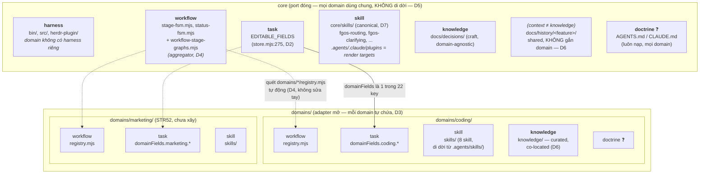
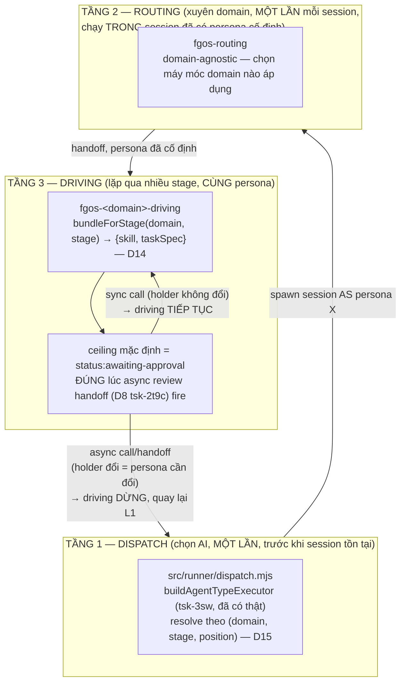

# Core-foundation vs domain-specific directory/module boundary (tsk-397)

## 1. Trạng thái hiện tại

Round 14 (2026-08-19): Sau D9-D12 (folder-layout đã ổn định), thảo luận
mở rộng sang tầng DISPATCH/COORDINATION — trả lời "khi không gian đã tách,
cơ chế nào điều phối việc thật giữa workflow/stage/taskSpec/skill/
position/agent-type". Kết quả (D13-D15, ghi qua `fgos decision --id
tsk-397`, seq 20756-20758):

- **D13 — kiến trúc 3 tầng dispatch/routing/driving**, nguyên lý tổ chức:
  soul/persona của một session KHÔNG hoán đổi được giữa chừng (khác
  skill/task-spec — chỉ là văn xuôi đọc lại tự do). DISPATCH (chọn AI,
  một lần, trước khi session tồn tại) → ROUTING (`fgos-routing`, chọn
  MÁY MÓC nào áp dụng, xuyên domain, chạy một lần trong session đã có
  persona cố định) → DRIVING (`fgos-<domain>-driving`, lặp qua nhiều
  stage, CÙNG một persona, load lại skill+taskSpec tự do mỗi stage).
  Bằng chứng thật: `fgos-coding-driving`'s ceiling mặc định là
  `status=='awaiting-approval'` — ĐÚNG chỗ tsk-2t9c D18 gắn async review
  handoff — driving đã dừng đúng lúc persona cần đổi, dù chưa ai đặt tên
  nguyên lý này trước đây.
- **D14 — `bundleForStage(domain, stage)` trả `{skill, taskSpec}` cùng
  lúc**, sống ở tầng DRIVING — đóng gap "skill hardcode path task-spec
  trong prose" (dòng 88/177/291 của `fgos-coding-implement`).
- **D15 — persona/agent-type resolve theo `(domain, stage, position)`**,
  không chỉ `(domain, position)` — team-hợp-tác trong 1 stage = chuỗi sync
  call (consult/assist, holder không đổi) từ 1 holder chính tới nhiều
  persona chuyên biệt, KHÔNG BAO GIỜ multi-holder cùng lúc; song song thật
  = decompose ra item con (`fgos-fanout`, đã có), không phải concurrency
  trên cùng 1 worktree. CỐ Ý CHƯA XÂY: liệu ranh giới stage (persona mặc
  định đổi dù cùng position, không có handoff tường minh) có nên cũng làm
  driving dừng — chưa có bằng chứng persona đa dạng thật để thiết kế theo.

So sánh `upstreams/marketing-cockpit`'s cách gán position→agent
(`workflow.md`'s `agents:`/`stages:` hardcode tên agent, PUSH, tác giả
quyết lúc viết) đã xác nhận: field `skills:` trên agent-type của họ chỉ
là catalog khai báo (đọc bởi người/LLM lúc thiết kế), KHÔNG được dispatch
mechanism nào truy vấn runtime — `claims` của tsk-2t9c (PULL, agent tự
khai eligibility) thực ra đã đi XA HƠN marketing-cockpit, không phải thứ
cần bắt kịp.

15/15 quyết định đã chốt. Còn mở thật: `agents/*.yaml`→`.claude/agents/*.md`
render-pair đặt vào D7 hay tách riêng (đề xuất chưa lock: mirror D7,
domain riêng có `domains/<name>/agents/`), và `doctrine` domain-scoped
(mở từ đầu, chưa ai đề xuất giải pháp cụ thể).

Round 12 (2026-08-18): Xác nhận `tsk-2t9c` ĐÃ MERGE VÀO MAIN (`e268376e`)
— không phải nhánh treo. `codingDomain` thật có 10+ field (§7 task-1 đã
cập nhật đủ danh sách). Trợ lý đề xuất drop task-3 (dispatcher wiring),
bị người bác: bugfix-workflow sắp landing thật, đây chính là lý do làm
domains/ split BÂY GIỜ để tránh migrate 2 lần → D10, task-3 giữ lại, đổi
khung ("làm sẵn seam" thay vì "sửa bug"). Thêm GATE bắt buộc vào task-1:
xác nhận dynamic import giữ đúng identity `workflows.feature.stages ===
codingDomain.stages` trước khi plan thật — nếu không giữ được, cơ chế
aggregator (D4) phải đổi shape. Còn treo: `roleGraph`/`taskSpecMap`/
`agents/*.yaml`→`.claude/agents/*.md` render-pair chưa có quyết định
placement cụ thể trong `domains/coding/` — cần tiếp tục hoà giải.

Round 11 (2026-08-17): **PHÁT HIỆN QUAN TRỌNG — thảo luận này đã bỏ sót
một thiết kế đã chốt VÀ đã triển khai thật trước đó: `tsk-2t9c`
(`docs/history/fgos-marketing-domain-foundation/`, 13 quyết định, wiring
code thật trong `fgos-coding-implement`/`discovering`/`exploring`/
`planning`/`validating`, có chạy end-to-end thật trên `tsk-ogx`).**
tsk-2t9c D10 đã khoá "four-layer ontology": task-spec (contract) / skill
(know-how) / knowledge (domain expertise) / context (fact tức thời) —
KHÁC và chính xác hơn ma trận 6-concern của thảo luận này. "task-spec"
đúng nghĩa (D6/D10) là hợp đồng theo TỪNG LOẠI việc (input/output/gates/
verify-template), một file/domain/loại-việc — hoàn toàn KHÁC "task" mà
trợ lý đã dùng xuyên suốt thảo luận này (field-schema work-item,
`EDITABLE_FIELDS`/`domainFields`). D8 (cả bản sai lẫn bản sửa lần 1) đều
dựa trên định nghĩa sai này. D9 ghi sửa lại — `docs/task-specs/coding/`
(13 file thật, machine-checked bởi `registrations.mjs`'s
`task-specs-resolve`) chuyển vào `domains/coding/task-specs/`, giữ đúng
tên gọi đã có. tsk-2t9c CÒN có `roleGraph` (trục role/holder) và
`taskSpecMap` trong registry entry của domain — 2 field registry.mjs của
thảo luận này (D3/D4) chưa từng tính tới. **Câu hỏi treo cho người:**
thảo luận này có nên coi tsk-2t9c là authoritative và chỉ tự giới hạn vào
câu hỏi folder-layout ĐẶT LÊN TRÊN thiết kế đó, hay cần hoà giải đầy đủ
2 thiết kế ngay trong phiên này?

Round 10 (2026-08-17): D8 SỬA LẠI ngay sau khi chốt sai — bản đầu (seq
19349) hiểu nhầm "task-specs" thành toàn bộ `docs/specs/`, di dời cả 12
file platform/core. Người sửa ngay: chỉ tạo mới `domains/<name>/specs/`
(rỗng, chờ domain tự viết task-spec riêng); `docs/specs/` giữ nguyên
100%, không đụng gì. Bản sửa ghi qua `fgos decision --id tsk-397` (seq
19351). Layout: 5/6 concern đối xứng đầy đủ (workflow/task-schema qua
registry.mjs, skill qua skills/, knowledge qua knowledge/, task-specs qua
specs/-khi-cần) — `harness` chủ đích chỉ core (D1/D5), `doctrine` vẫn mở.
D7 (skill canonical → `core/skills/`+`domains/*/skills/`) vẫn đứng, chốt
round 9 (seq 19342) — không đổi. D7 đòi cơ chế mới (assembly step trong
`skill-wrappers.mjs`) trước khi implement thật, việc cho
`fgos-coding-planning` xử lý, không phải discussion này.

Round 7 (2026-08-17): D6 sửa lại và chốt — ghi qua `fgos decision --id
tsk-397` (seq 19297), thay bản D6 đầu (SAI, lẫn context với knowledge).
`docs/history/` là context (thô, feature-scoped, share, không tag
domain) — giữ nguyên. Domain-knowledge (curated, do team bảo trì) là
khái niệm riêng, sống tại `domains/<name>/knowledge/`, co-located theo
tinh thần D3 — tiền lệ thật `/home/vantt/projects/beegog/expertise/`.
5/6 mối quan tâm giờ có hình dạng chốt (harness/workflow/task/skill/
knowledge); chỉ còn `doctrine` domain-scoped là mở thật (không giải được
bằng tag như knowledge, vì doctrine luôn-nạp chứ không tra-theo-yêu-cầu).
Layout (ASCII + mermaid, §6) đã đồng bộ theo D6 mới.

Round 6 (2026-08-17): tầng CODE+SKILL của boundary đã chốt — D3/D4/D5,
ghi qua `fgos decision --id tsk-397` (seq 19128-19130). Hình dạng cuối:
`domains/<name>/` là folder tự chứa (registry.mjs + skills/ đi cùng nhau)
ở top-level, mirror đúng cơ chế plugin thật đã có trong chính repo này
(`plugins/fgOS/` — tự chứa manifest + skills, thêm `dogfood-fixture`
không đụng gì bên trong `fgOS/`). `workflow-stage-graphs.mjs` chỉ còn là
aggregator quét `domains/*/registry.mjs` tự động — thêm domain không sửa
file có sẵn nào. `core` (bin/, src/, herdr-plugin/) KHÔNG di dời vật lý —
881 tham chiếu `bin/fgos.mjs` trong repo + fgOS đã cài global ở nhiều
project khác (mission 0035) khiến việc di dời phá vỡ diện rộng cho lợi
ích thuần biểu tượng; `.agents/skills/core/` là chỗ duy nhất rẻ đủ để gắn
nhãn core tường minh. Người mở rộng khung phân tích thành ma trận 6 mối
quan tâm (harness/workflow/task/knowledge/skill/doctrine) × {core,
domain} — 4/6 đã có hình dạng rõ (harness chỉ ở core theo D1; workflow/
task/skill đã chốt qua D2-D4); **knowledge và doctrine domain-scoped vẫn
là câu hỏi MỞ, chưa thiết kế** — không có tiền lệ trong code hiện tại,
cần quyết định có scope cho item này hay để lại khi marketing thật bắt
tay xây. Người vừa yêu cầu vẽ layout — xem diagram đầy đủ ở §6.

Round 5 (2026-08-17): D1 (share store) và D2 (top-level = port đóng,
`domainFields` = adapter mở) đã chốt và ghi qua `fgos decision --id
tsk-397` (seq 19058/19059). §6 đã regenerate cho tầng STATE (data layer)
— đây mới là MỘT lớp của hexagon (data/store), chưa phải toàn bộ
folder-layout. Còn mở: trục (b) engine-vs-prose (tiêu chí tách + duplicate
3 cây skill), và phần domain-specific của CODE (không chỉ data) — 4 điểm
nối STR89 đã định vị (registry/discovery.mjs+decompose.mjs/fgos-routing/
skill-bundle) chưa có quyết định thư mục cụ thể nào.

Round 4 (2026-08-17): người xác nhận mục tiêu thật của item — tổ chức
folder-layout để ranh giới rõ, dễ theo hexagonal/ports-adapters, dễ giữ
contract, dễ thêm/mở rộng, VÌ sẽ có thêm domain thật (không phải suy đoán
— STR52 backlog xác nhận domain "marketing" đã proposed). Scout tìm thấy
STR89 (done) đã định vị sẵn 4 điểm nối domain-specific cần mở
(registry/`discovery.mjs`+`decompose.mjs`/`fgos-routing`/skill-bundle
riêng) — đây chính là "ports" hexagon cần thiết kế quanh, không phải suy
diễn từ đầu. Người cũng sửa cách làm việc của trợ lý: khi có đủ chất liệu
để phân tích, phải tự phân tích và đề xuất — không hỏi ngược lại người mà
chưa đưa ra khuyến nghị. Áp dụng ngay: đã phân tích 3 tiêu chí người cho
(field-compatible, security/phân vùng, performance) cho câu hỏi mở của
STR52 (share store hay cài riêng) — cả 3 đều KHÔNG chặn share-store
(field-compat đã có hạ tầng `domainFields` sẵn, security không có gì phải
build vì chỉ cần filter theo `work.domain` có sẵn, performance đã chịu
tải thật 19K events/8.4MB với incremental-replay fast path) → khuyến nghị
**share store**, chờ người xác nhận khoá. Trục (b) engine-vs-prose vẫn có
tiền lệ thật từ `/home/vantt/projects/beegog/` (đã xác nhận round 2-3),
trục (a) giờ không còn "chỉ 1 domain thật" — có domain #2 (marketing)
thật đang chờ shape.

## 2. Mục tiêu & đề bài

Mục tiêu thật (chốt round 4, lời người): tổ chức lại folder-layout của
fgOS sao cho ranh giới RÕ, phù hợp tư duy hexagonal/ports-and-adapters
(port = hợp đồng cố định mọi domain phải tuân, adapter = phần domain tự
cắm vào), giữ được contract ổn định, và dễ THÊM domain mới/mở rộng —
không phải bài tập lý thuyết, vì fgOS có domain thật thứ hai đang chờ
(STR52: "marketing", proposed, đã có scope draft). Việc tách hai trục
(core-foundation vs domain-specific; engine vs skill/prose) là công cụ để
đạt mục tiêu đó, không phải mục tiêu tự thân. Tham khảo mô hình bee
upstream — nguồn thật đã xác nhận là `/home/vantt/projects/beegog/` (live
checkout v2.7.0: packages/bee-rs = rust core 1 crate/1 binary,
packages/bee = vendor payload, skills/ = 9-skill prose) — làm tiền lệ cho
trục engine-vs-prose; bản thân beegog không có multi-domain nên KHÔNG cho
tiền lệ trục core-foundation-vs-domain-specific — trục này phải tự thiết
kế dựa trên chất liệu thật của fgOS: STR52 (scope marketing) + STR89 (4
điểm nối domain-pluggable đã xác định: `DOMAINS` registry,
`discovery.mjs`/`decompose.mjs` retrofit, `fgos-routing` domain-aware,
skill-bundle riêng theo domain) + hạ tầng `work.domainFields` (đã xây sẵn
làm "infrastructure for a FUTURE domain", decision 0027 D6). Đây là item
thảo luận kiến trúc thuần tuý — không quyết định implement gì trong
chính item này — cần shaping/discovery trước khi khoá quyết định, rồi
handoff sang `fgos-coding-exploring`/`fgos-coding-planning` cho việc thực
thi thật.

## 3. Vấn đề rõ / chưa rõ

| # | Điểm | Trạng thái | Ghi chú |
|---|------|-----------|---------|
| 1 | Domain nào trong `DOMAINS` là domain sản xuất thật, có skill/harness riêng, cần một ranh giới domain-specific để phục vụ? | Rõ (scout) | Chỉ `coding` có skillMap thật + worktree-backed. `synthetic`, `triage`, `fixture-marketing` đều tự nhận là illustrative/disposable fixture trong chính comment của code — không skill nào từng load, không worktree/merge thật. |
| 2 | Mô hình bee upstream (packages/bee-rs/packages/bee/skills, decision 0025-rust-migration-strategy) có phải một hợp đồng sống với forgentX hiện tại không? | Rõ (scout) | Không. `docs/history/bee-to-fgos-rename/CONTEXT.md` D1 (chốt 2026-08-13, người trả lời trực tiếp): forgentX đã cô lập hoàn toàn khỏi bee, không còn interop sống, "anything learned from bee has already been internalized rather than depended on". Decision 0025 của forgentX là một quyết định khác hẳn (product-priority-order), không phải rust-migration-strategy. |
| 3 | Cây thư mục hiện tại đã có tách engine (code chạy được) khỏi skill/prose chưa? | Rõ một phần (scout) | Có JS engine (`bin/`, `src/`) + Rust engine riêng (`herdr-plugin/`, crate độc lập, song song `src/` chứ không lồng trong nó) tách khỏi ba cây skill: `.claude/skills/` (16, generated wrapper), `.agents/skills/` (16, nguồn canonical thật — CLAUDE.md tự ghi rõ), `plugins/fgOS/skills/` (~52, cây route theo plugin manifest, chứa cả wrapper theo-verb lẫn các skill `fgos-coding-*` cốt lõi). Prose đã tách khỏi code, nhưng đang nhân bản qua 3 cây thay vì 1 nguồn + render. |
| 4 | `upstreams/` (path item liệt kê để khảo sát) có tồn tại trong repo không? | Rõ (scout, sửa lại round 1) | Có, trong main checkout (`upstreams/bee/`, `upstreams/beegog/`, gitignored) — round 1 chỉ kiểm trong worktree cô lập nên báo sai "không tồn tại". Cả hai đều là bản CŨ hơn `/home/vantt/projects/beegog/` (live). |
| 5 | Doctrine layer (AGENTS.md/CLAUDE.md) đã có tiền lệ "luôn nạp vs nạp theo nhu cầu" nào gần với trục engine/skill chưa? | Rõ một phần (scout) | `docs/platform-foundations.md` L8 đã khoá placement test này CHO RIÊNG tầng doctrine (standing sheet vs reference nạp theo nhu cầu) — cùng tinh thần trục (b) nhưng chưa từng generalize ra toàn cây thư mục. |
| 6 | Ranh giới cụ thể core-foundation vs domain-specific nên nằm ở đâu? | Chưa rõ (nhưng không còn speculative) | STR52 (marketing, proposed) + STR89 (done, đã định vị 4 điểm nối domain-pluggable) là chất liệu thật để thiết kế ranh giới, xem #10/#11 dưới. Vẫn cần thiết kế cụ thể layout. |
| 7 | Engine vs skill/prose tách theo tiêu chí nào (ngôn ngữ? runtime-executable vs instruction-only? mức nạp?) | Chốt — D7 | `core/skills/` + `domains/*/skills/` là canonical AUTHORING; `.agents/skills/`, `.claude/skills/`, `plugins/fgOS/skills/` cả ba đều là render target (D7, mở rộng tsk-1qi D5). |
| 8 | Mô hình plugin/extension theo domain có đáng chi phí duy trì thêm một tầng tổ chức? | Chốt — D3/D12 | Đáng. Chi phí thấp hơn dự đoán ban đầu — không cần package/workspace riêng (folder đủ, D3), và cơ chế enforce ranh giới đã có sẵn trong repo (`architecture-manifest.json`, chỉ cần mở rộng thêm 1 rule, D12) chứ không phải xây từ đầu. |
| 9 | Nguồn so sánh bee/beegog thật nằm ở đâu, và nó có tiền lệ cho trục nào? | Rõ (scout + xác nhận người, round 2) | `/home/vantt/projects/beegog/` (live checkout, KHÁC repo-con `upstreams/beegog/` đã pull nhưng vẫn cũ) có đúng cấu trúc v2.7.0: `packages/bee-rs` (1 crate, 1 binary), `packages/bee` (vendor payload), `skills/` (9 skill, giảm từ 18/15). Không tìm thấy khái niệm multi-domain nào trong beegog (`grep -i "multi-domain\|DOMAINS\b"` không ra kết quả liên quan) — beegog là tiền lệ thật cho trục (b), KHÔNG phải tiền lệ cho trục (a). |
| 10 | Domain thật thứ hai có tồn tại/đang chờ không? | Rõ (scout, round 4) | Có — `docs/backlog.md` STR52: "Domain thứ hai THẬT: marketing", status `proposed`, nêu 2026-07-18. Người dùng có sẵn workflow marketing ở project khác, muốn điều phối qua fgOS. Câu hỏi scope gốc của STR52 (share store hay cài fgOS riêng) — xem #12. |
| 11 | Domain-specific cần mở những điểm nối nào trong code hiện tại? | Rõ (scout, round 4) | STR89 (done) định vị 4 điểm: (1) `DOMAINS` registry entry riêng cho domain mới (`src/state/workflow-stage-graphs.mjs`); (2) `discovery.mjs`/`decompose.mjs` retrofit — hiện hardcode literal stage-name của coding, cảnh báo sẵn trong comment `workflow-stage-graphs.mjs:29-34`; (3) `fgos-routing` domain-pluggable hoá — tự thú nhận hôm nay "the only domain this induction targets [is coding]"; (4) bộ skill nội dung riêng theo domain-extension, song song bộ coding. Thứ tự đã xác nhận: software-dev (coding) trước, marketing sau, không chặn nhau. |
| 12 | STR52's câu hỏi scope (share store hay cài fgOS riêng cho domain mới) — trả lời thế nào? | Chốt — D1 | (nội dung phân tích giữ nguyên, xem D1 ở §4) |
| 13 | Domain-specific code+skill nên tổ chức theo layout nào (nested trong cây có sẵn, hay folder riêng)? | Chốt — D3/D4 | `domains/<name>/` tự chứa, top-level, mirror `plugins/fgOS/`. Đề xuất nested đầu tiên (`.agents/skills/domains/coding` + `src/domains/coding` tách rời) bị người bác — "không phát triển được dạng plugin/extension". |
| 14 | Core (bin/, src/, herdr-plugin/) có nên di dời vào folder `core/` tường minh để đối xứng với `domains/` không? | Chốt — D5 (cập nhật bởi D7) | `bin/`, `src/`, `herdr-plugin/` KHÔNG di dời — 881 tham chiếu `bin/fgos.mjs` + external install (mission 0035) khiến chi phí lớn hơn hẳn lợi ích biểu tượng. Riêng SKILL thì có: canonical authoring chuyển hẳn sang `core/skills/` (D7) — rẻ hơn hẳn di dời `bin/`/`src/` vì không đụng path nào external project gọi trực tiếp, chỉ đổi chỗ maintainer sửa nguồn. |
| 15 | Áp ma trận 6 mối quan tâm (harness/workflow/task/knowledge/skill/doctrine) × {core, domain} — còn chỗ nào thiếu? | Rõ phần lớn | harness: chỉ core (D1). workflow/task/skill: đã chốt (D2-D4). knowledge: đã chốt (D6). **doctrine: vẫn mở** — không có cơ chế nạp-có-điều-kiện theo domain trong AGENTS.md/CLAUDE.md hôm nay. |
| 16 | `docs/history/<feature>/` có phải "knowledge" không? | Chốt — sửa lại (round 7) | KHÔNG — người chỉ ra `docs/history/` là **context** (biên bản thô, append-only, theo feature), không phải knowledge. "Knowledge" đúng nghĩa = domain-knowledge, curated, do team tự bảo trì — khác hẳn context. D6 (bản đầu, gắn tag `domain` lên `docs/history/`) SAI vì lẫn 2 khái niệm — đã thay bằng D6 mới. |
| 17 | Domain-knowledge (curated, private, do team tự bảo trì) nên sống ở đâu? | Chốt — D6 | `domains/<name>/knowledge/`, co-located cùng `skills/`, theo đúng tinh thần tự-chứa của D3. Tiền lệ thật: `/home/vantt/projects/beegog/expertise/` — hệ curated knowledge base thật (`knowledge.md` tự mô tả "craft vs project layers, harvesting from finished work, recorded trust, dated freshness, migration rot, retirement") — khác hẳn `docs/history/` (context thô). |
| 18 | `.agents/skills/core` có nên đổi thành `core/skills/` (bỏ dấu chấm, đối xứng `domains/`)? `.agents` và `.claude` có phải thin wrapper cả hai không? | Chốt — D7 | Có, nhưng không phải rename đơn thuần. `.agents/skills/*` là canonical THEO một quyết định TRƯỚC đó (tsk-1qi D5, `skill-wrappers.mjs` tự ghi rõ "the canonical, orchestrator-neutral skill source") — và `fgos setup` vendor NGUYÊN VĂN `.agents/skills/*` vào MỌI external project (`materializeSkillsIntoProject`), nên hình dạng bên ngoài (host project nhận được gì) không được đổi. D7: canonical AUTHORING chuyển sang `core/skills/` + `domains/*/skills/`; `.agents/skills/`, `.claude/skills/`, `plugins/fgOS/skills/` CẢ BA thành render target thật (thêm bước assembly trong `skill-wrappers.mjs`) — mở rộng quyết định tsk-1qi D5 (bối cảnh mới: `domains/` chưa tồn tại lúc đó), không đảo ngược nó. |
| 19 | Task-specs nên tách vào đâu? | SỬA LẠI LẦN 2 — D9 (round 11) | Cả bản D8 đầu (di dời toàn bộ `docs/specs/`) lẫn bản sửa lần 1 (định nghĩa task-specs = field-schema work-item) đều SAI. Người chỉ ra `docs/task-specs/coding/*.md` — 13 file THẬT ĐÃ TỒN TẠI, thuộc thiết kế đã chốt `tsk-2t9c` (D6/D10: task-spec = hợp đồng theo LOẠI việc, input/output/gates/verify-template — khác hẳn field-schema). Xem D9. |
| 20 | tsk-2t9c (`fgos-marketing-domain-foundation`) phủ những gì, và quan hệ với thảo luận này ra sao? | Rõ (scout round 11-12) | tsk-2t9c ĐÃ MERGE VÀO MAIN (`e268376e`) — không còn nằm trên nhánh riêng. `codingDomain` object thật hôm nay có 10+ field (stages/stepMap/transitions/skillMap/taskSpecMap/worktreeBacked/statusLabels/parkReason/classification/roleGraph + workflows/defaultWorkflow/workflowFor), không phải 4-5 field thảo luận này giả định. Người xác nhận: `bugfix` workflow (un-merge theo D7/D7a của tsk-2t9c, đang hoãn) sắp thật, không còn giả thuyết — đây chính là LÝ DO làm domains/ split BÂY GIỜ, trước khi code bugfix-workflow viết ra, để không phải migrate 2 lần. |
| 21 | Task-3 (dispatcher domain/workflow-aware) có nên drop khỏi scope thảo luận này không (trợ lý từng đề xuất drop)? | SỬA LẠI — D10 (round 12) | Trợ lý đề xuất drop vì tsk-2t9c đã chủ đích KHÔNG wiring dispatcher (lý do: chỉ 1 workflow đăng ký, wiring đổi 0 hành vi). Người bác: bugfix-workflow sắp landing thật — tiền đề "chỉ 1 workflow" sắp hết đúng. Task-3 GIỮ LẠI, đổi khung: không phải "sửa bug" mà "làm sẵn seam trước khi workflow thứ 2 tồn tại". |
| 22 | Sau khi không gian đã tách (D3-D10), cơ chế cross-boundary để đọc file/giao tiếp giữa core và domain là gì? | Chốt — D11 | `workflow-stage-graphs.mjs` ĐÃ có 13 hàm resolver (`getDomain`, `skillForStage`, `resolveWorkflow`, `roleGraphFor`, ...) — đây chính là "port" ở tầng DATA, không cần xây mới. Chỗ hổng duy nhất: `registrations.mjs` (dòng 407/424) tự ghép path thô `path.join('docs','task-specs',domainName,...)`, không qua resolver nào — sau khi D9 di dời task-specs, chỗ này vỡ trước tiên. D11 thêm `resolveTaskSpecPath(domain, specId)` để đóng nốt pattern đã có. |
| 23 | Layout nội bộ + cách kết nối module của `upstreams/pi` ("everything is a plugin") có bài học gì cho fgOS? | Chốt — D12 | Pi enforce ranh giới module bằng `package.json`'s `exports` map (path không khai = không import được, Node tự chặn) — cấp package thật, mỗi package trong workspace tự khai bề mặt công khai. fgOS là 1 package, không workspace — chuyển sang mô hình pi tốn hơn hẳn. NHƯNG fgOS đã có tương đương: `docs/architecture-manifest.json` + `test/architecture.test.mjs` (5 layer kỹ thuật: entry/use-case/infra/domain/kernel, import chỉ được xuống tầng sâu hơn, ngược tầng = test đỏ). Bài học thật: mở rộng cơ chế ĐÃ CÓ này thêm 1 rule domain-siloing, không xây cơ chế mới kiểu pi. **Lưu ý naming va chạm:** layer `"domain"` trong manifest là khái niệm DDD kỹ thuật, KHÔNG liên quan `DOMAINS` (coding/marketing) của toàn thảo luận này — cùng từ, 2 nghĩa khác nhau, cùng tồn tại trong 1 repo. |
| 24 | Sau khi domain có N workflow, mỗi workflow N stage, mỗi stage N task-spec — cơ chế điều phối (dispatch) thật là gì, ai chủ động? | Chốt — D13 | 3 tầng: DISPATCH (chọn persona, 1 lần, trước khi session tồn tại) → ROUTING (`fgos-routing`, chọn máy móc domain nào, xuyên domain, 1 lần/session) → DRIVING (`fgos-<domain>-driving`, lặp qua stage, CÙNG persona). Nguyên lý tổ chức: soul không hoán đổi giữa chừng session — khác skill/task-spec (văn xuôi, đọc lại tự do). Bằng chứng: `fgos-coding-driving` ceiling mặc định = `awaiting-approval`, ĐÚNG lúc async review handoff (D18 tsk-2t9c) fire — driving đã dừng đúng chỗ persona cần đổi từ trước, chỉ chưa ai gọi tên nguyên lý. |
| 25 | Skill có cần thiết phải hardcode load task-spec không, hay nên tách? | Chốt — D14 | Không nên hardcode trong prose (3 chỗ ở `fgos-coding-implement` dòng 88/177/291 đã hardcode literal path). `bundleForStage(domain, stage)` trả `{skill, taskSpec}` cùng lúc, sống ở tầng DRIVING (D13) — `skillMap`/`taskSpecMap` đã nằm cạnh nhau cùng object, cùng key stage, hàm này chỉ bọc lại dữ liệu có sẵn. |
| 26 | Agent-type/persona/team-collab đặt vào đâu trong cơ chế dispatch, và "2 flow nối tiếp" (PO+BA rồi Tech-Lead+SWE+Tester) có cần 2 workflow riêng? | Chốt — D15 | Không cần 2 workflow. Persona resolve theo `(domain, stage, position)` thay vì chỉ `(domain, position)` — cùng roleGraph, cùng position (`implementer`), khác persona theo cụm stage. Team-hợp-tác = chuỗi sync call (holder không đổi, D8) tới nhiều persona, KHÔNG multi-holder cùng lúc; song song thật = decompose ra item con (`fgos-fanout`, có sẵn). So sánh marketing-cockpit: field `skills:` trên agent-type của họ chỉ là catalog thiết-kế-thời, KHÔNG được dispatch runtime nào truy vấn — `claims` (pull) của tsk-2t9c đã đi xa hơn họ rồi. CỐ Ý CHƯA XÂY: ranh giới stage-đổi-persona-ngầm có nên cũng dừng driving — chưa có bằng chứng đa dạng persona thật. |

## 4. Quyết định đã chốt

| D-ID | Quyết định | Lý do |
|------|-----------|-------|
| D1 | Domain share MỘT store/event-log của fgOS — không cài fgOS riêng cho domain mới (trả lời câu hỏi scope của STR52). | Field-compat đã có sẵn hạ tầng `work.domainFields.<domain>.*` (decision 0027 D6, xây trước cho "future domain"); security không có gì phải xây — chỉ filter theo `work.domain` (scalar) khi cần; performance đã chịu tải thật (`.fgos/events.jsonl` 19,037 events/8.4MB, 1 domain, `replay.mjs` có incremental+snapshot fast path, không phải linear replay toàn bộ). |
| D2 | Field top-level là "port" đóng (core sở hữu, `EDITABLE_FIELDS` 22 key cố định, `store.mjs:275`, `edit` từ chối mọi key ngoài set); `domainFields.<domain>.*` là "adapter" mở duy nhất — domain ghi tự do không đụng core. Field domain-local mặc định vào `domainFields`; chỉ lên top-level nếu cần nghĩa giống nhau + đọc giống nhau ở MỌI domain. | `store.mjs:275/307-310`: `edit` hard-reject key ngoài `EDITABLE_FIELDS`. Thêm field top-level mới = sửa core, ảnh hưởng mọi domain; thêm field trong `domainFields` = không đụng core. |
| D3 | Domain code+skill sống trong folder tự chứa `domains/<name>/` (registry.mjs + skills/ đi cùng nhau), top-level, không nested trong `.agents/skills/`/`src/` có sẵn. | Mirror cơ chế plugin thật đã có (`plugins/fgOS/`: manifest + skills tự chứa, thêm `dogfood-fixture` không đụng `fgOS/`). Đề xuất nested đầu (`.agents/skills/domains/coding` tách rời `src/domains/coding`) bị bác vì vẫn rải một domain qua 2 cây + cần sửa aggregator bằng tay — không phải hình dạng plugin/extension thật. |
| D4 | `workflow-stage-graphs.mjs` chỉ còn là aggregator quét `domains/*/registry.mjs` tự động (directory scan), không phải import list sửa tay. | Điều kiện để D3 thật sự "pluggable" — thêm domain không được đụng file domain khác hay aggregator, giống hệt cách thêm `dogfood-fixture` không đụng `fgOS/`. |
| D5 | Core (`bin/`, `src/`, `herdr-plugin/`) giữ nguyên vị trí top-level — KHÔNG di dời vào folder `core/` để đối xứng với `domains/`. Chỉ `.agents/skills/core/` (sau khi domain skill dọn ra `domains/*/skills/`) được gắn nhãn tường minh. | Grep: 881 tham chiếu `bin/fgos.mjs` trong `.md`/`.mjs` toàn repo (mọi action step skill, docs, test); fgOS đã cài global ở nhiều project khác (mission 0035) gọi thẳng path đó — di dời phá vỡ diện rộng cho lợi ích thuần biểu tượng, vì `domains/` tồn tại đã làm "không phải domains/" tự nhiên đọc là core. |
| D6 | Domain-knowledge (curated, private, do team tự bảo trì) sống co-located tại `domains/<name>/knowledge/` — KHÔNG phải tag `domain` gắn lên `docs/history/` (bản đầu SAI, đã thay). `docs/history/<feature>/` là **context** (thô, append-only, theo feature) — giữ nguyên chỗ, không đổi. | Sửa theo người: knowledge ≠ context. Tiền lệ thật `/home/vantt/projects/beegog/expertise/` — hệ curated knowledge base có `knowledge.md` tự mô tả "harvesting from finished work, recorded trust, dated freshness, migration rot, retirement" — một hệ bảo trì chủ động, khác hẳn log thô. Theo tinh thần tự-chứa D3, domain-knowledge thuộc về folder riêng của domain đó. |
| D7 | Canonical skill-source AUTHORING chuyển sang `core/skills/` + `domains/<name>/skills/`; `.agents/skills/`, `.claude/skills/`, `plugins/fgOS/skills/` cả BA trở thành render target thật (thêm bước assembly trong `skill-wrappers.mjs`) — KHÔNG đổi thứ `fgos setup` vendor vào external project. | Mở rộng (không đảo ngược) quyết định trước đó tsk-1qi D5 (`skill-wrappers.mjs` tự ghi "`.agents/skills/*` is the canonical, orchestrator-neutral skill source") — bối cảnh mới: `domains/` (D3) chưa tồn tại lúc D5 đó chốt. `.agents/skills/*` được `fgos setup`'s `materializeSkillsIntoProject` vendor NGUYÊN VĂN vào MỌI external project — hình dạng/nội dung bên ngoài phải giữ nguyên byte-identical; chỉ chỗ maintainer sửa nguồn đổi. |
| D8 | ~~Task-specs tách khỏi `docs/specs/` chung vào `core/specs/` (toàn bộ 12 file) + `domains/<name>/specs/`~~ — **SAI 2 LẦN, xem D9.** | (giữ lại làm lịch sử — nội dung không còn đúng, D9 thay thế hoàn toàn định nghĩa "task-specs".) |
| D9 | "Task-spec" đúng nghĩa là khái niệm của `tsk-2t9c` (D6/D10): hợp đồng theo LOẠI việc (input/output/gates/verify-template), một file/domain/loại-việc — KHÔNG phải field-schema work-item. `docs/task-specs/coding/*.md` (13 file thật, machine-checked bởi `registrations.mjs`'s `task-specs-resolve`) chuyển vào `domains/coding/task-specs/`, giữ nguyên tên "task-specs" (không đổi thành "specs"). | Người chỉ ra folder `docs/task-specs/coding/` đã tồn tại thật — thảo luận này bỏ sót toàn bộ `tsk-2t9c` (13 quyết định đã chốt + code đã wiring thật) trong suốt các round trước. D8 (cả 2 bản) sai vì dựa trên định nghĩa "task-specs" tự chế, chưa từng đọc tsk-2t9c. Còn treo: `roleGraph`/`taskSpecMap` trong registry.mjs (D3/D4 của thảo luận này) chưa tính tới — chờ người quyết định mức hoà giải. |
| D10 | Task-3 (dispatcher domain/workflow-aware wiring) GIỮ LẠI trong scope §7 — đảo ngược đề xuất drop của chính trợ lý (round 12). | Bugfix-workflow (un-merge `feature`/`bugfix`/`lightweight` theo D7/D7a tsk-2t9c, đang hoãn) sắp landing thật, không còn giả thuyết — tiền đề tsk-2t9c dùng để hoãn wiring dispatcher (chỉ 1 workflow đăng ký, wiring đổi 0 hành vi) sắp hết đúng. Lý do sâu hơn để làm domains/ split NGAY: code bugfix-workflow viết ra ở đâu phụ thuộc `codingDomain` đang sống ở đâu lúc đó — split trước khi code đó viết ra thì nó không bao giờ chạm `workflow-stage-graphs.mjs` cũ, tránh migrate 2 lần. |
| D11 | Mở rộng pattern resolver-function đã có của `workflow-stage-graphs.mjs` sang cross-boundary FILE lookup — thêm `resolveTaskSpecPath(domain, specId)`, `registrations.mjs` gọi hàm này thay vì tự ghép `path.join('docs','task-specs',domainName,...)`. | Người: sau khi không gian đã tách hoàn toàn, việc quan trọng tiếp theo là cơ chế đọc file/giao tiếp cross-boundary. Scout: `workflow-stage-graphs.mjs` đã có 13 hàm resolver cho DATA (`getDomain`, `skillForStage`, ...) — pattern port đã tồn tại. `registrations.mjs` là chỗ DUY NHẤT còn tự ghép path thô, bỏ qua pattern — sau D9 di dời task-specs, đây là chỗ vỡ đầu tiên nếu không sửa. |
| D12 | Mở rộng `docs/architecture-manifest.json` + `test/architecture.test.mjs` thêm 1 rule domain-siloing: core không import domain cụ thể nào, `domains/<name>/` không import `domains/<other>/` — tái dùng nguyên cơ chế one-directional-import đã chứng minh cho 5 layer kỹ thuật. | So sánh `upstreams/pi` ("everything is a plugin"): pi enforce ranh giới bằng `package.json`'s `exports` map (path không khai = Node tự chặn import) — cấp package thật, cần workspace. fgOS là 1 package, không workspace — chuyển hẳn sang mô hình pi tốn hơn hẳn cái đang có. fgOS đã có tương đương thật: architecture-manifest + test đỏ khi import ngược layer. Bài học từ pi không phải "xây cơ chế mới" mà "mở rộng cơ chế đã có sang trục domain". |
| D13 | Kiến trúc 3 tầng dispatch/routing/driving. DISPATCH (`src/runner/dispatch.mjs`, `buildAgentTypeExecutor`, tsk-3sw — chọn persona, MỘT LẦN, trước khi session tồn tại) → ROUTING (`fgos-routing`, xuyên domain, chọn máy móc nào áp dụng, chạy MỘT LẦN trong session đã có persona cố định) → DRIVING (`fgos-<domain>-driving`, lặp qua stage, CÙNG persona, load lại skill+taskSpec tự do mỗi stage). | Nguyên lý tổ chức: soul/persona một session KHÔNG hoán đổi giữa chừng — khác skill/task-spec (văn xuôi đọc lại tự do). Bằng chứng thật, không phải suy diễn: `fgos-coding-driving` ceiling mặc định = `status=='awaiting-approval'`, ĐÚNG trạng thái tsk-2t9c D18 gắn async review handoff (holder đổi, D8) — driving đã dừng đúng lúc persona cần đổi từ trước khi nguyên lý này được đặt tên. Sync/async (D8) không phải lựa chọn API tuỳ tiện — cùng ràng buộc soul-không-hoán-đổi, đã mã hoá đúng sẵn. |
| D14 | `bundleForStage(domain, stage)` trả `{skill, taskSpec}` cùng lúc, sống ở tầng DRIVING (D13) — đóng gap skill hardcode literal path task-spec trong prose. | `skillMap`/`taskSpecMap` đã nằm cạnh nhau, cùng object `codingDomain`, cùng key theo stage — hàm này chỉ bọc lại dữ liệu sẵn có, không phải dữ liệu mới. Task-spec (khung sườn/hợp đồng) nên được máy móc tầng khung sườn resolve, không phải nằm rải rác hardcode bên trong skill (lớp da). |
| D15 | Persona/agent-type resolve theo `(domain, stage, position)`, không chỉ `(domain, position)`. Team-hợp-tác trong 1 stage = chuỗi sync call (consult/assist, D8, holder không đổi) từ 1 holder chính tới nhiều persona chuyên biệt — KHÔNG multi-holder cùng lúc; song song thật = decompose ra item con (`fgos-fanout`, có sẵn), không phải concurrency trên cùng 1 worktree. | Người: "flow triển khai 1 feature có thể là nối tiếp của 2 flow" (PO+BA lúc discovery/exploring, Tech-Lead+SWE+Tester lúc planning) không cần 2 workflow riêng — cùng roleGraph, cùng position (`implementer`), khác persona theo cụm stage; field key thêm không tốn gì hôm nay (1 persona chung cho mọi stage) nhưng mở cửa cho sau. So sánh marketing-cockpit: `skills:` trên agent-type của họ chỉ là catalog thiết-kế-thời, KHÔNG dispatch runtime nào truy vấn — `claims` (pull, tsk-2t9c) đã đi xa hơn họ. CỐ Ý CHƯA XÂY: ranh giới stage-đổi-persona-ngầm có nên cũng dừng driving — chưa đủ bằng chứng persona đa dạng thật (cùng kỷ luật grow-tasks-before-roles giữ roleGraph đóng ở 5 position, D10 tsk-2t9c). |

## 5. Q&A log

- 2026-08-17 — Round 1 scout: đọc `src/state/workflow-stage-graphs.mjs`
  (`DOMAINS`), `docs/history/bee-to-fgos-rename/CONTEXT.md`,
  `docs/platform-foundations.md` L1/L2/L8, cây thư mục top-level +
  `.claude/skills` + `.agents/skills` + `plugins/fgOS/skills` +
  `herdr-plugin/src`. Không tìm thấy `upstreams/` hay
  `docs/decisions/0025-rust-migration-strategy.md` trong repo này
  (SAI — chỉ tìm trong worktree cô lập, xem round 2).
- 2026-08-17 — Round 2 Q&A: người chỉ ra round 1 sai — `upstreams/`
  CÓ tồn tại trong main checkout. Scout tìm thấy `upstreams/bee/` (snapshot
  nhẹ skills/+AGENTS.md, nguồn "forgent-workshop", bee v1.18.3,
  2026-07-28) và `upstreams/beegog/` (git clone `github.com/vantt/beegog`,
  1.7.10-rc @ 05a131f, 2026-07-21) — cả hai đều CŨ hơn cấu trúc v2.7.0 item
  mô tả (không có `packages/bee-rs`). Người pull `upstreams/beegog` lên
  bản mới nhất — vẫn không thấy `packages/`, skill giảm còn 15 (mất
  bee-context-locking/bee-herding/bee-qualifying) nhưng chưa tới rust-core.
  Người hỏi "upstream/bee là project gì" — trả lời: `bee` và `beegog` là
  MỘT project (không phải hai), chỉ khác cơ chế capture (`bee` = trích
  định kỳ từ workshop sống, `beegog` = git clone của repo đã push). Người
  hỏi "project nào đang có code tận v2.7?" — tìm thấy
  `/home/vantt/projects/beegog/` (live checkout riêng, khác
  `upstreams/beegog/`), xác nhận có `packages/bee-rs` (1 crate `bee`, 1
  binary), `packages/bee` (vendor payload: prompts/, hooks/, statusline/,
  agents/*.tmpl, AGENTS.block.md), `skills/` (9 skill), và
  `docs/decisions/0025-rust-migration-strategy.md` — khớp đúng mô tả của
  item. Grep "multi-domain"/"DOMAINS\b" trong beegog không ra kết quả liên
  quan — beegog không có khái niệm multi-domain. Người xác nhận: dùng
  `/home/vantt/projects/beegog/` làm nguồn so sánh cho phần còn lại của
  thảo luận.
- 2026-08-17 — Round 3 Q&A: người sửa lại mục tiêu thảo luận cho trợ lý —
  "mục tiêu là tổ chức folder-layout để rõ boundary, dễ hexagon, dễ
  contract, dễ thêm, dễ mở rộng, vì còn có thêm domain". Ghi nhận: đây
  KHÔNG phải giả định — có domain thật thứ hai đang chờ (xem round 4).
- 2026-08-17 — Round 4 Q&A: scout `docs/backlog.md` tìm STR52 (marketing
  domain, proposed) + STR89 (done, domain-pluggable seams). Trợ lý hỏi
  ngược người câu hỏi scope của STR52 (share store hay cài riêng) mà
  KHÔNG tự phân tích trước — người phản hồi: đây là việc trợ lý phải tự
  làm advisor, đưa ra 3 tiêu chí cân nhắc (field-compat, security,
  performance) và mặc định share nếu giải được hết. Trợ lý scout
  `src/state/work.mjs` (`validateDomainFields`, dòng 699-740) và
  `src/state/store.mjs`/`replay.mjs` (incremental fast path) + kiểm tra
  `.fgos/events.jsonl` thật (19,037 events/8.4MB) — cả 3 tiêu chí đều
  không chặn share-store. Khuyến nghị: share store — chờ người khoá.
- 2026-08-17 — Round 5a Q&A: người hỏi chi tiết "domain đã ghi field
  riêng ở vùng riêng chưa, common field ở top-level hay không cần chia vì
  2 domain không thể cùng tác động 1 workitem?" Trợ lý xác nhận qua code
  (`work.mjs:674-683`): `domainFields` đã shape đúng `{ [domainName]:
  {...} }`, common field đã ở top-level tách biệt, `work.domain` là
  scalar (không phải set) nên đúng — không có ca 2 domain cùng sở hữu 1
  item, đã đúng cấu trúc từ đầu.
- 2026-08-17 — Round 5b Q&A: người hỏi "vậy ghi domainFields hay
  top-level đều ổn cả?" Trợ lý SỬA — không đúng: top-level là
  `EDITABLE_FIELDS` (`store.mjs:275`), một Set 22 key CỐ ĐỊNH, `edit`
  hard-reject key lạ (`store.mjs:307-310`) — domain không tự thêm được
  field top-level mới (cần sửa core). `domainFields` mới là chỗ mở tự do
  duy nhất. Người nói "ok ghi" → D1+D2 chốt, ghi qua `fgos decision`.
- 2026-08-17 — Round 6a Q&A: người hỏi "cuối cùng thì suggest structure
  như thế nào?" Trợ lý đưa layout đầu tiên: giữ nguyên mọi cây có sẵn,
  chỉ tách `DOMAINS` registry thành file riêng + fix dispatcher. Người
  phản hồi "như cũ rồi, đâu khác gì?" — đúng: layout đó không tạo ranh
  giới THƯ MỤC, chỉ dựa naming convention (`fgos-coding-*`).
- 2026-08-17 — Round 6b Q&A: trợ lý sửa — đề xuất nested
  `.agents/skills/domains/coding` + `src/domains/coding` tách rời. Người
  bác: "nếu làm vậy thì không phát triển được dạng plugin/extension".
  Scout tìm ra tiền lệ thật trong chính repo: `plugins/fgOS/`
  (`.claude-plugin/plugin.json` + `skills/` tự chứa, đăng ký qua 1 dòng
  `marketplace.json`, thêm `dogfood-fixture` không đụng `fgOS/`) — áp
  đúng cơ chế đó cho domain → D3/D4.
- 2026-08-17 — Round 6c Q&A: người hỏi "đặt core vào cùng bối cảnh xem"
  (core có nên có folder riêng đối xứng `domains/` không). Scout: 881
  tham chiếu `bin/fgos.mjs` toàn repo + external install (mission 0035)
  → di dời phá vỡ diện rộng, không đáng — D5. Người hỏi tiếp "nếu cả
  core, domain đều có harness/workflow/task/knowledge/skill/doctrine thì
  cấu trúc thế nào?" — trợ lý map 6 mối quan tâm × {core, domain}: 4/6 đã
  có hình dạng (harness/workflow/task/skill), 2/6 mở (knowledge,
  doctrine) — chưa có tiền lệ domain-scoped trong code hiện tại.
- 2026-08-17 — Round 6d: người yêu cầu "vẽ layout đi" → diagram đầy đủ ở
  §6, D3/D4/D5 ghi qua `fgos decision`.
- 2026-08-17 — Round 7 Q&A: người hỏi "sao không vẽ ascii layout" → thêm
  cây thư mục dạng `text` (không chỉ mermaid). Người hỏi tiếp "trong từng
  domain không có workflow/task-specs/knowledge à?" — trợ lý sửa: workflow
  đã có (registry.mjs), task-specs cũng ĐÃ có trong CÙNG file
  (`fieldSchema`), riêng spec dạng văn xuôi (BA-grade) nên ở
  `docs/specs/` (shared, không lồng domains/) để giữ `reading-map.md` là
  1 điểm tra cứu duy nhất; knowledge lúc này chưa có tiền lệ, đề xuất D6
  bản đầu (tag `domain` lên `docs/history/`). Người chỉ ra core cũng
  không đối xứng — trợ lý bảo vệ D5 (881 ref), thêm bảng ánh xạ
  concern→path cho core thay vì di dời. Người yêu cầu vẽ lại ascii —
  redraw đủ 6 concern cho cả core lẫn domain. **Người sửa lại D6 bản đầu:
  `docs/history/` là CONTEXT (thô, theo feature), không phải knowledge —
  domain-knowledge là khái niệm KHÁC, curated riêng của team.** Trợ lý
  scout `/home/vantt/projects/beegog/expertise/` (chưa xem trước đó) —
  tìm thấy hệ curated knowledge-base thật với `knowledge.md` tự mô tả
  đúng khái niệm người muốn (harvesting/trust/freshness/retirement, khác
  hẳn raw log) → D6 mới: `domains/<name>/knowledge/`, co-located.
- 2026-08-17 — Round 8 Q&A: người hỏi "`.agents/skills/core` thành
  `core/skills/` được không? `.agents` và `.claude` là thin wrapper?"
  Trợ lý scout `src/setup/skill-wrappers.mjs` — tìm ra `.agents/skills/*`
  là canonical theo một quyết định TRƯỚC (tsk-1qi D5), và `fgos setup`
  vendor nguyên văn `.agents/skills/*` vào MỌI external project
  (`materializeSkillsIntoProject`) — không phải rename đơn giản. Trợ lý
  đề xuất: canonical AUTHORING chuyển sang `core/skills/` +
  `domains/*/skills/`, cả 3 cây cũ thành render target thật (thêm bước
  assembly), giữ nguyên hình dạng bên ngoài host project nhận được. Người
  xác nhận "ừ ghi D7 đi" → D7 chốt.
- 2026-08-17 — Round 9 Q&A: người nói "tôi muốn tách các task-specs từ
  docs/spec vào từng domain folder và core folder riêng luôn" — đảo ngược
  trực tiếp đề xuất trước của trợ lý (giữ `docs/specs/` chung cho
  `reading-map.md`). Trợ lý scout `docs/specs/` — cả 12 file hiện có đều
  là spec core/platform, không file nào business-spec riêng domain nào →
  D8 (SAI): toàn bộ chuyển `core/specs/`, `domains/*/specs/` khởi tạo rỗng.
- 2026-08-17 — Round 10 Q&A: người sửa ngay "sai, không di dời
  docs/specs/*.md, chỉ di dời task-specs only" — trợ lý đã hiểu nhầm
  "task-specs" thành toàn bộ khu `docs/specs/`. Đọc lại đúng ngữ cảnh
  round 7: task-specs = spec của RIÊNG concern `task`, không phải mọi
  spec nền tảng. D8 sửa lại: `docs/specs/` giữ nguyên 100%, chỉ thêm mới
  `domains/<name>/specs/` cho task-spec riêng của domain.
- 2026-08-17 — Round 11 Q&A: người hỏi "em có biết mình có folder
  `docs/task-specs/coding/*.md`? cái này là move vào task-specs trong
  domain coding." Trợ lý scout — tìm thấy 13 file thật, machine-checked
  bởi `registrations.mjs`'s `task-specs-resolve`, thuộc thiết kế đã chốt
  `tsk-2t9c` (`docs/history/fgos-marketing-domain-foundation/`, 13 quyết
  định, code đã wiring thật). D10 của tsk-2t9c khoá "four-layer ontology"
  (task-spec/skill/knowledge/context) — task-spec đúng nghĩa là hợp đồng
  theo LOẠI việc, không phải field-schema work-item mà trợ lý hiểu nhầm
  từ round 7. D9 (thảo luận này) sửa lại theo đúng định nghĩa gốc; câu
  hỏi treo cho người: hoà giải registry.mjs (D3/D4, chưa có
  `roleGraph`/`taskSpecMap`) với tsk-2t9c ở mức nào.
- 2026-08-17/18 — Round 12 Q&A: người xác nhận muốn hoà giải đầy đủ ("cần
  xem cả 2 luôn vì anh có ý định reconstruct"). Trợ lý scout xác nhận
  `tsk-2t9c` đã MERGE VÀO MAIN (`e268376e`), liệt kê đủ 10+ field thật của
  `codingDomain`, tìm thêm render-pair thứ 2 chưa biết (`agents/*.yaml` →
  `.claude/agents/*.md`, cơ chế `claims`). Trợ lý phân tích chủ động (theo
  đúng phản hồi "advisor, not mechanical worker" — tự nghiên cứu/đề xuất
  trước khi hỏi) và đề xuất DROP task-3 (dispatcher wiring), lý do:
  tsk-2t9c đã chủ đích hoãn việc này vì chỉ 1 workflow đăng ký. Người bác
  ngay: bugfix-workflow sắp landing thật, tiền đề "chỉ 1 workflow" sắp
  hết đúng, và chính đó là lý do làm domains/ split BÂY GIỜ để không phải
  migrate 2 lần → D10, task-3 giữ lại, đổi khung.
- 2026-08-18 — Round 13 Q&A: người yêu cầu tổng hợp toàn cục — trợ lý recap
  D1-D10 + việc còn mở. Người giới thiệu thêm nguồn so sánh mới:
  `upstreams/pi` ("everything is a plugin"). Trợ lý scout, tìm cơ chế
  extension-là-package-thật + `exports` map enforce (Node tự chặn import
  path không khai). Người làm rõ ưu tiên: folder/package không quan trọng
  (cả 2 chỉ là cách isolate footprint) — quan trọng là tách bạch HOÀN
  TOÀN core/domain, rồi tới cơ chế cross-boundary file/communication. →
  D11 (resolver function `resolveTaskSpecPath`, mở rộng pattern 13 hàm đã
  có). Người yêu cầu thêm: học layout nội bộ + module-connection của pi.
  Trợ lý scout `packages/agent`'s `exports` field thật, rồi tìm ra fgOS
  ĐÃ CÓ cơ chế tương đương (`architecture-manifest.json` +
  `architecture.test.mjs`) — chỉ cần mở rộng, không xây mới → D12. Người
  xác nhận "Đồng ý" — D11+D12 chốt.
- 2026-08-19 — Round 14 Q&A (ultrathink, nhiều lượt): người hỏi "domain
  đã có N workflow, mỗi workflow N stage, mỗi stage N taskSpec — cơ chế
  điều phối thật là gì, ai chủ động?", dặn tham khảo (không bắt chước)
  marketing-cockpit. Trợ lý scout `orchestration/delegation.yaml` (PUSH,
  orchestrator dispatch), `agents/seo-specialist.md` (`skills:` list —
  nhìn tưởng multi-skill repertoire), rồi phát hiện quan trọng: field
  `skills:` đó KHÔNG được bất kỳ dispatch mechanism nào truy vấn — chỉ là
  catalog thiết-kế-thời, gán agent→stage vẫn 100% hardcode trong
  `workflow.md`. Kết luận: `claims` (pull) của tsk-2t9c đã đi XA HƠN
  marketing-cockpit, không phải thứ cần bắt kịp. Người hỏi tiếp "skill có
  cần thiết hardcode load task-spec?" — trợ lý xác nhận (đọc dòng
  88/177/291 của `fgos-coding-implement`) đúng là hardcode literal path,
  đề xuất doctor-check thay vì sửa cơ chế. Người chỉnh sửa framing sâu
  hơn: "workflow/stage/taskSpec là khung sườn/hợp đồng/chữ ký của việc,
  skill+persona là lớp da giúp việc chất hơn" và nêu ràng buộc cứng
  "MỘT SESSION KHÔNG THỂ ĐỔI SOUL GIỮA CHỪNG". Trợ lý ultrathink, xác
  nhận qua code thật (`dispatch.mjs`'s `buildAgentTypeExecutor`,
  `fgos-coding-driving`'s ceiling mặc định = `awaiting-approval` — ĐÚNG
  lúc async review handoff D18 fire) → D13 (kiến trúc 3 tầng) + D14
  (`bundleForStage`). Người mở rộng vision: 1 flow có thể là 2 flow nối
  tiếp (PO+BA rồi Tech-Lead+SWE+Tester) — trợ lý brainstorm, kết luận
  không cần 2 workflow, chỉ cần persona resolve theo `(domain, stage,
  position)` → D15, người xác nhận "đồng ý vụ (domain, stage, position)".

## 6. Thiết kế đã chốt {#design}

fgOS tổ chức folder-layout theo mô hình hexagonal: **core = port đóng,
dùng chung mọi domain; `domains/<name>/` = adapter tự chứa, mỗi domain
một folder, thêm domain mới không đụng file nào có sẵn.** Đây không phải
suy diễn lý thuyết — mirror đúng cơ chế plugin đã chạy thật trong chính
repo này (`plugins/fgOS/`: manifest + skills tự chứa, thêm
`dogfood-fixture` không đụng gì bên trong `fgOS/`).

Layout thư mục thật, đủ 6 mối quan tâm cho cả core lẫn domain:

```text
forgentX/
│
│ ── CORE (port đóng — dùng chung mọi domain, KHÔNG di dời vật lý, D5) ──
│
├── bin/                                  # harness
├── src/
│   ├── state/
│   │   ├── stage-fsm.mjs                 # workflow — FSM cơ học domain-agnostic
│   │   ├── status-fsm.mjs                # workflow — FSM cơ học domain-agnostic
│   │   ├── work.mjs                      # task — EDITABLE_FIELDS (22 key cố định, D2)
│   │   └── workflow-stage-graphs.mjs     # workflow — AGGREGATOR (D4)
│   │                                     #   trước: chứa cả codingDomain (~390 dòng) inline
│   │                                     #   sau:   quét domains/*/registry.mjs, build DOMAINS tự động
│   └── intake/{discovery,plan}.mjs       # workflow — dispatcher, sửa đọc DOMAINS[item.domain] thay vì hardcode
├── herdr-plugin/                         # harness — Rust engine
├── core/
│   └── skills/                           # ★ D7 — canonical AUTHORING (thay .agents/skills/core/)
│       ├── fgos-routing/  fgos-clarifying/  fgos-researching/
│       └── fgos-unlock/   fgos-fanout/      fgos-indexing/   distill/
├── docs/
│   ├── specs/                            # ★ D8 SỬA LẠI — GIỮ NGUYÊN, KHÔNG di dời (bản D8 đầu sai, đã sửa).
│   │   │                                 #   12 file platform/core (work-state, runner, distribution, ...)
│   │   │                                 #   ở đúng chỗ cũ; core's task-contract đã tự tài liệu hoá bằng
│   │   │                                 #   CODE (EDITABLE_FIELDS, D2), không cần file spec riêng ở đây.
│   │   └── reading-map.md                # không đổi
│   ├── decisions/                        # knowledge — quyết định nền tảng, domain-agnostic (craft, không phải domain)
│   └── history/                          # CONTEXT, không phải knowledge (sửa round 7) — thô, append-only,
│                                         #   theo feature, giữ nguyên chỗ, share, KHÔNG gắn tag domain
├── AGENTS.md / CLAUDE.md                 # doctrine — luôn nạp, KHÔNG phân domain (❓ vẫn mở, chưa có
│                                         #   cơ chế nạp-có-điều-kiện theo domain)
│
│ ── DOMAINS (adapter mở — mỗi domain 1 folder tự chứa, D3) ──
│
├── domains/                              # ★ MỚI — top-level
│   ├── coding/
│   │   ├── registry.mjs                  # workflow (stages/stepMap/transitions/skillMap)
│   │   │                                 #   + task-specs (fieldSchema — CÙNG file, work.mjs đọc
│   │   │                                 #   domain?.fieldSchema từ đây, D2)
│   │   ├── skills/                       # skill — canonical AUTHORING (D7), di dời từ .agents/skills/
│   │   │   ├── discovering/  exploring/  planning/  validating/
│   │   │   └── implement/    shaping/    driving/    compounding/
│   │   ├── knowledge/                    # ★ D6 — curated domain-knowledge, riêng của team, co-located
│   │   │   # (KHÁC docs/history/ — knowledge được bảo trì chủ động, context thì thô/append-only)
│   │   │   # tiền lệ thật: /home/vantt/projects/beegog/expertise/ (knowledge.md tự mô tả
│   │   │   # harvesting/trust/dated-freshness/retirement — một hệ bảo trì, không phải log)
│   │   └── specs/                        # ★ D8 — RỖNG hôm nay; chờ BA spec riêng của coding-domain
│   │       # task (data thật): domainFields.coding.* — sống trong .fgos/events.jsonl, không phải file
│   │
│   └── marketing/                        # ★ tương lai (STR52) — thêm vào đây, KHÔNG sửa gì trong coding/
│       ├── registry.mjs
│       ├── skills/
│       └── specs/                        # ★ D8 — spec business trước khi có code (luật AGENTS.md)
│
├── .agents/skills/                       # ★ D7 — render target (trước: canonical, tsk-1qi D5). Hình dạng/nội
│                                         #   dung KHÔNG đổi (vẫn được fgos setup vendor nguyên văn vào
│                                         #   external project) — chỉ nguồn sinh ra nó đổi (assembly step mới)
├── .claude/skills/                       # render target (không đổi cơ chế — vẫn generate, nay từ core/skills/+domains/*/skills/)
└── plugins/fgOS/skills/                  # render target (không đổi cơ chế — mirror plugins/fgOS/ tự nó)
```



**Quy tắc đặt field/code (D2-D4):** cần cùng nghĩa + cùng cách đọc ở MỌI
domain → core (sửa `EDITABLE_FIELDS`/aggregator, ảnh hưởng mọi domain,
cân nhắc kỹ). Chỉ một domain cần → `domains/<name>/` (registry.mjs cho
workflow, `domainFields.<name>.*` cho task, `skills/` cho skill) — không
đụng core, domain khác không thấy/không bị ảnh hưởng.

**Core KHÔNG di dời vật lý (D5).** `bin/`, `src/`, `herdr-plugin/` giữ
nguyên vị trí — 881 tham chiếu `bin/fgos.mjs` toàn repo + external
install (mission 0035) khiến di dời phá vỡ diện rộng cho lợi ích thuần
biểu tượng. Chỉ `.agents/skills/core/` được gắn nhãn tường minh (rẻ,
không có external path phụ thuộc).

**Domain-knowledge ≠ context (D6, sửa lại round 7).** `docs/history/` là
CONTEXT — biên bản thô, append-only, theo feature — giữ nguyên chỗ, share,
KHÔNG gắn tag `domain`. "Knowledge" đúng nghĩa là curated, do team chủ
động bảo trì (harvest, đánh giá độ tin cậy, hết hạn/rút khi lỗi thời) —
tiền lệ thật là `/home/vantt/projects/beegog/expertise/`. Domain-knowledge
sống co-located tại `domains/<name>/knowledge/`, cùng tinh thần tự-chứa
với `skills/` (D3).

**Còn mở (❓ trong diagram):** chỉ còn `doctrine` domain-scoped — chưa có
cơ chế nạp-có-điều-kiện theo domain nào trong AGENTS.md/CLAUDE.md hôm
nay, và tagging (cách D6 giải cho knowledge) không áp dụng được cho thứ
luôn-nạp. Trục
engine-vs-prose ở tầng SKILL đã tự nhiên giải quyết qua D3 (skill sống
trong `domains/<name>/skills/` hoặc `.agents/skills/core/`, không còn là
câu hỏi tách riêng) — phát hiện round 5: 3 cây skill cũ (`.agents/skills`,
`.claude/skills`, `plugins/fgOS/skills`) KHÔNG phải trùng lặp, mà là 1
nguồn canonical + N target render (đúng cơ chế beegog tự dùng cho chính
nó) — không cần sửa cơ chế render, chỉ cần domain skill di dời đúng chỗ
trong nguồn canonical trước khi render.

### Tầng DISPATCH — điều phối workflow/stage/taskSpec/skill/persona (D13-D15)

Ranh giới không gian (D1-D12) trả lời "cái gì sống ở đâu". Tầng này trả
lời "khi item thật chạy, ai làm gì, theo thứ tự nào, ai chủ động".
Nguyên lý tổ chức duy nhất: **soul (persona của một session) không hoán
đổi được giữa chừng session** — khác skill/task-spec, chỉ là văn xuôi đọc
lại tự do bất cứ lúc nào.



**Team-hợp-tác trong 1 stage (D15):** chuỗi sync call (consult/assist,
holder không đổi) từ 1 holder chính tới nhiều persona chuyên biệt —
KHÔNG BAO GIỜ multi-holder cùng lúc trên 1 item (worktree/branch chỉ 1
writer). Song song thật = decompose ra item con (`fgos-fanout`, đã có),
không phải concurrency trên cùng 1 item.

**"2 flow nối tiếp" không cần 2 workflow (D15):** persona mặc định đổi
theo cụm stage (PO+BA lúc discovery/exploring → Tech-Lead+SWE+Tester lúc
planning) qua key `(domain, stage, position)` — cùng roleGraph, cùng
position (`implementer`), khác persona. Field key thêm không tốn gì hôm
nay (1 persona chung mọi stage) — chỉ mở cửa cho sau.

**So sánh marketing-cockpit (tham khảo, không bắt chước):** `agents/*.md`
của họ có field `skills:` (nhìn giống multi-skill repertoire) nhưng
KHÔNG được bất kỳ dispatch mechanism nào truy vấn runtime — gán
agent→stage 100% hardcode trong `workflow.md` (PUSH, tác giả quyết lúc
viết). fgOS's `claims` (PULL, tsk-2t9c D12) đã đi xa hơn — agent-type tự
khai eligibility, frontier tự surface work-order, claimant tự chọn.

**Cố ý CHƯA XÂY (D15):** liệu ranh giới stage-đổi-persona-ngầm (cùng
position, persona mặc định khác, không có handoff tường minh) có nên
cũng làm driving dừng — chưa có bằng chứng persona đa dạng thật để thiết
kế theo, cùng kỷ luật grow-tasks-before-roles giữ `roleGraph` đóng ở 5
position (D10 tsk-2t9c).

## 7. Danh mục hạng mục / task {#tasks}

### {#task-domain-registry-split} Tách `DOMAINS` registry thành aggregator + per-domain file

- **Mục tiêu (cập nhật round 11-12 — shape thật lớn hơn giả định ban
  đầu):** tách `codingDomain` — object thật hôm nay có 10+ field
  (`stages`/`stepMap`/`transitions`/`skillMap`/`taskSpecMap`/
  `worktreeBacked`/`statusLabels`/`parkReason`/`classification`/
  `roleGraph` + `workflows`/`defaultWorkflow`/`workflowFor`, KHÔNG phải
  4-5 field giả định ban đầu) ra `domains/coding/registry.mjs`
  NGUYÊN VẸN, không cắt bớt field nào; `workflow-stage-graphs.mjs` chỉ
  còn quét `domains/*/registry.mjs` để build `DOMAINS`, giữ nguyên
  `synthetic`/`triage`/`fixture-marketing` (fixture, ở lại core).
- **★ GATE bắt buộc trước khi plan thật (round 12):** xác nhận dynamic
  `import()` giữ đúng identity `workflows.feature.stages ===
  codingDomain.stages` (tsk-2t9c D7a's chủ đích tránh copy ~130 dòng) —
  nếu KHÔNG giữ được, cơ chế aggregator (D4) phải đổi từ directory-scan
  sang static-import-list trong 1 file index nhỏ, kém "auto-discover"
  hơn nhưng an toàn identity.
- **§6 excerpt áp dụng:** khối `workflow` trong diagram + quy tắc
  aggregator D4.
- **D-ID áp dụng:** D3, D4, D10.
- **Quan hệ:** nên làm TRƯỚC code bugfix-workflow (D10) — độc lập với
  task skill-migration bên dưới, có thể làm song song.
- **Verify nháp:** `test/state/domain-fields.test.mjs`,
  `test/e2e/fixture-marketing-domain.test.mjs`, mọi test đụng `DOMAINS`
  export vẫn xanh không đổi; test riêng cho GATE identity ở trên; test
  cho `taskSpecMap`/`roleGraph` (test hiện có của tsk-2t9c, vd
  `test/state/handoff.mjs`-related) không hồi quy.

### {#task-coding-skill-migration} Di dời 8 skill `fgos-coding-*` vào `domains/coding/skills/`, 7 skill còn lại vào `core/skills/`

- **Mục tiêu:** hiện thực D3+D7 cho tầng skill — di dời
  `fgos-coding-{discovering,exploring,planning,validating,implement,
  shaping,driving,compounding}` từ `.agents/skills/` sang
  `domains/coding/skills/`; 7 skill domain-agnostic còn lại
  (`fgos-routing`, `fgos-clarifying`, `fgos-researching`, `fgos-unlock`,
  `fgos-fanout`, `fgos-indexing`, `distill`) sang `core/skills/`. Hai nơi
  này trở thành nguồn canonical AUTHORING mới (D7) — `.agents/skills/`
  không còn là nơi sửa tay.
- **§6 excerpt áp dụng:** khối `skill` trong cả CORE và CODING subgraph.
- **D-ID áp dụng:** D3, D7.
- **Quan hệ:** phụ thuộc task {#task-skill-assembly-mechanism} tồn tại
  trước (hoặc song song) — nếu di dời trước khi assembly-step sẵn sàng,
  `.agents/skills/` (và mọi thứ generate từ nó) sẽ trống cho tới khi cơ
  chế mới chạy.
- **Verify nháp:** mọi `/fgOS:*` slash-command action step vẫn resolve
  đúng skill sau khi đổi path; golden-file/snapshot test cho wrapper
  pointer nếu có.

### {#task-skill-assembly-mechanism} Thêm bước assembly vào `skill-wrappers.mjs`/`build-skill-wrappers.mjs`

- **Mục tiêu:** hiện thực D7 — `skill-wrappers.mjs` (và
  `scripts/build-skill-wrappers.mjs`) hiện đọc trực tiếp
  `.agents/skills/*` để sinh wrapper; thêm bước MỚI đứng trước: lắp ráp
  `.agents/skills/*` từ `core/skills/*` + `domains/*/skills/*` (copy hoặc
  symlink), rồi mới chạy generate-wrapper như cũ. `materializeSkillsIntoProject`
  (vendor vào external project) phải chạy SAU bước lắp ráp, không đổi gì
  ở phía external project nhận được.
- **§6 excerpt áp dụng:** dòng `.agents/skills/` trong ASCII tree — "★ D7
  — render target ... chỉ nguồn sinh ra nó đổi".
- **D-ID áp dụng:** D7.
- **Quan hệ:** phải xong TRƯỚC hoặc CÙNG lúc với task di dời skill ở
  trên, nếu không `.agents/skills/` sẽ mồ côi giữa chừng.
- **Verify nháp:** test coexistence/setup hiện có
  (`test/e2e/coexistence-canary.test.mjs` và tương đương cho
  `materializeSkillsIntoProject`) phải xanh KHÔNG ĐỔI — bằng chứng hình
  dạng external-project-facing không đổi; thêm test mới cho riêng bước
  assembly (input `core/skills/`+`domains/*/skills/` → output
  `.agents/skills/` đúng nội dung mong đợi).

### {#task-domain-specs-folder} Tạo `domains/coding/specs/` + `domains/marketing/specs/` rỗng

- **Mục tiêu:** hiện thực D8 (bản sửa) — CHỈ tạo thư mục
  `domains/coding/specs/` và `domains/marketing/specs/`, rỗng, làm chỗ
  chờ khi domain đó có task-spec riêng (BA-grade, hợp đồng field
  work-item của domain đó) cần viết ra. `docs/specs/` KHÔNG đụng tới —
  12 file hiện có (work-state, runner, distribution, ...) giữ nguyên
  chỗ, không phải một phần scope của item này.
- **§6 excerpt áp dụng:** dòng `specs/` trong `domains/coding/` và
  `domains/marketing/` của ASCII tree.
- **D-ID áp dụng:** D8.
- **Quan hệ:** độc lập, không phụ thuộc task nào khác — chỉ là tạo thư
  mục trống, không di dời/sửa file có sẵn nào.
- **Verify nháp:** `git status` sau khi tạo chỉ hiện thư mục mới (rỗng,
  hoặc `.gitkeep` nếu cần), không có file `docs/specs/*` nào bị đổi.

### {#task-dispatcher-workflow-aware} Nối `discovery.mjs`/`plan.mjs` vào `resolveWorkflow` — làm sẵn seam cho bugfix-workflow

- **Mục tiêu (SỬA LẠI round 12, D10):** KHÔNG phải "fix STR89" —
  `fgos-routing` đã domain-pluggable từ trước (theo chính
  `docs/specs/reading-map.md`'s ghi nhận str89-fgos-domain-skills). Việc
  thật còn thiếu, và tsk-2t9c CHỦ ĐÍCH chưa làm: `src/intake/discovery.mjs`/
  `src/intake/plan.mjs` (+ `stage-fsm.mjs`/`frontier.mjs`) chưa nối vào
  `resolveWorkflow` — tsk-2t9c hoãn việc này vì với đúng 1 workflow
  (`feature`) đăng ký, `domain.transitions` và
  `resolveWorkflow(...).transitions` LÀ CÙNG MỘT object, nối dây hôm nay
  đổi 0 hành vi. Tiền đề đó sắp hết đúng (bugfix-workflow landing thật) —
  nối dây bây giờ là làm sẵn seam, không phải sửa bug.
- **§6 excerpt áp dụng:** mũi tên `workflow_core -.-> wf_c/wf_m` trong
  diagram — dispatcher phải đọc qua `resolveWorkflow`, không giả định
  `domain.transitions` mãi mãi đồng nhất với workflow đang chạy.
- **D-ID áp dụng:** D4, D10.
- **Quan hệ:** phụ thuộc task {#task-domain-registry-split} (aggregator)
  xong trước — và nên làm TRƯỚC khi code bugfix-workflow thật được viết,
  đúng tinh thần D10 (seam có sẵn, không migrate 2 lần).
- **Verify nháp:** test hiện có của `resolveWorkflow`/`workflows.feature`
  (module test dày đặc nhất repo, theo chính ghi nhận của tsk-2t9c) phải
  xanh không đổi; thêm test riêng: đăng ký 1 workflow thứ hai giả lập
  (khác `feature`), xác nhận dispatcher chọn đúng graph theo
  `resolveWorkflow(item)` thay vì đọc `domain.transitions` mặc định.

### {#task-taskspec-path-resolver} Thêm `resolveTaskSpecPath(domain, specId)`, sửa `registrations.mjs` gọi qua hàm này

- **Mục tiêu:** hiện thực D11 — thêm hàm resolver mới vào
  `workflow-stage-graphs.mjs` (cùng chỗ 13 hàm hiện có), trả về path thật
  của 1 task-spec theo domain (`domains/<domain>/task-specs/<specId>.md`
  sau D9, không phải `docs/task-specs/<domain>/...` cũ); sửa 2 chỗ trong
  `registrations.mjs` (dòng 407, 424) đang tự ghép `path.join` thô để gọi
  hàm này thay vì hardcode.
- **§6 excerpt áp dụng:** không có sẵn — cần bổ sung vào §6 khi diagram
  regenerate lần tới (dòng resolver-function trong khối `workflow`).
- **D-ID áp dụng:** D11.
- **Quan hệ:** phụ thuộc task {#task-domain-registry-split} (vị trí
  `domains/<domain>/task-specs/` phải tồn tại thật trước khi resolver có
  gì để trỏ tới) và D9 (định nghĩa đích path).
- **Verify nháp:** 2 doctor check hiện có của tsk-2t9c
  (`task-specs-resolve`, `agent-claims-resolve`) vẫn PASS sau khi đổi path
  — đây là bằng chứng resolver đúng, không chỉ code compile được.

### {#task-architecture-manifest-domain-silo} Mở rộng `architecture-manifest.json` + `architecture.test.mjs` thêm rule domain-siloing

- **Mục tiêu:** hiện thực D12 — thêm 1 rule mới bên cạnh rule
  one-directional-layer đã có: file trong `core/` không được import từ
  bất kỳ `domains/<name>/` cụ thể nào; file trong `domains/<name>/` không
  được import từ `domains/<other>/`. Mọi giao tiếp cross-domain phải qua
  hàm resolver của core (D11) hoặc qua data (`work.domain`/`DOMAINS`), không
  bao giờ import thẳng file của domain khác.
- **§6 excerpt áp dụng:** không có sẵn — cần bổ sung vào §6.
- **D-ID áp dụng:** D12.
- **Quan hệ:** nên làm SAU khi `domains/` thật sự tồn tại (task 1+2) —
  rule domain-siloing không có gì để kiểm nếu chưa có domain thứ hai
  hoặc chưa tách folder.
- **Verify nháp:** thêm 1 fixture-import cố tình vi phạm rule (domain A
  import domain B), xác nhận `architecture.test.mjs` đỏ đúng lỗi mới;
  suite hiện có (5 layer cũ) không hồi quy.

### {#task-bundle-for-stage} Thêm `bundleForStage(domain, stage)`, sửa skill bỏ hardcode task-spec path

- **Mục tiêu:** hiện thực D14 — thêm hàm resolver mới vào
  `workflow-stage-graphs.mjs` (cùng chỗ 13 hàm hiện có), trả `{skill,
  taskSpec}` cùng lúc từ `skillMap`/`taskSpecMap` (đã cùng object, cùng
  key stage). `fgos-<domain>-driving` gọi hàm này MỘT LẦN mỗi
  stage-entry, hand cả 2 xuống session đang active. Sửa `fgos-coding-
  implement`'s SKILL.md (dòng 88/177/291) bỏ literal path hardcode, thay
  bằng tham chiếu tới bundle đã resolve.
- **§6 excerpt áp dụng:** khối tầng DRIVING trong diagram dispatch mới.
- **D-ID áp dụng:** D14.
- **Quan hệ:** phụ thuộc task {#task-domain-registry-split} (registry
  đã tách) và D9 (task-spec đã ở `domains/coding/task-specs/`).
- **Verify nháp:** test mới cho `bundleForStage` (input domain+stage →
  output {skill, taskSpec} đúng); grep `docs/task-specs/coding/`/
  `domains/coding/task-specs/` literal citations trong mọi SKILL.md phải
  về 0 sau khi sửa (trừ nơi cố ý còn giữ làm tài liệu).

### {#task-persona-key-extension} Mở rộng persona/agent-type resolution key thành `(domain, stage, position)`

- **Mục tiêu:** hiện thực D15 — nơi nào đang/sẽ resolve agent-type cho
  một `(position, task-spec)` work-order (layer DISPATCH, `src/runner/
  dispatch.mjs` + tương lai `claims`-matching) nhận thêm tham số `stage`
  vào key tra cứu, không chỉ `domain`+`position`. Hôm nay là no-op (1
  persona chung mọi stage) — chỉ cần đúng SHAPE của key, chưa cần dữ
  liệu persona đa dạng thật.
- **§6 excerpt áp dụng:** khối tầng DISPATCH trong diagram dispatch mới.
- **D-ID áp dụng:** D15.
- **Quan hệ:** độc lập, có thể làm bất cứ lúc nào — không phụ thuộc
  task nào khác, vì hôm nay không đổi hành vi.
- **Verify nháp:** test xác nhận key cũ `(domain, position)` vẫn resolve
  đúng qua wrapper mới (không hồi quy); KHÔNG cần test cho đa dạng
  persona thật — đó là phần cố ý chưa xây (D15's "chờ bằng chứng").

**Việc CHƯA đủ hình dạng để thành task riêng:** knowledge/doctrine
domain-scoped (câu hỏi mở #15, §3), ranh giới stage-đổi-persona-ngầm có
nên dừng driving (D15's phần cố ý chưa xây), `agents/*.yaml`→
`.claude/agents/*.md` render-pair placement — chờ người quyết định mức
scope cho item này.
