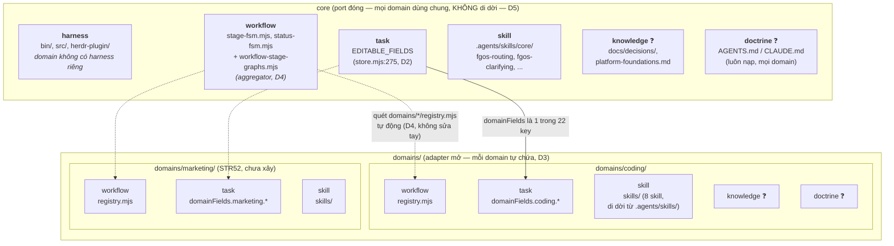

# Core-foundation vs domain-specific directory/module boundary (tsk-397)

## 1. Trạng thái hiện tại

Round 6 (2026-08-17): tầng CODE+SKILL của boundary đã chốt — D3/D4/D5,
ghi qua `fgos decision --id tsk-397` (seq 19128-19130). Hình dạng cuối:
`domains/<name>/` là folder tự chứa (registry.mjs + skills/ đi cùng nhau)
ở top-level, mirror đúng cơ chế plugin thật đã có trong chính repo này
(`plugins/fgOS/` — tự chứa manifest + skills, thêm `dogfood-fixture`
không đụng gì bên trong `fgOS/`). `workflow-stage-graphs.mjs` chỉ còn là
aggregator quét `domains/*/registry.mjs` tự động — thêm domain không sửa
file có sẵn nào. `core` (bin/, src/, herdr-plugin/) KHÔNG di dời vật lý —
881 tham chiếu `bin/fgos.mjs` trong repo + fgOS đã cài global ở nhiều
project khác (mission 0035) khiến việc di dời phá vỡ diện rộng cho lợi
ích thuần biểu tượng; `.agents/skills/core/` là chỗ duy nhất rẻ đủ để gắn
nhãn core tường minh. Người mở rộng khung phân tích thành ma trận 6 mối
quan tâm (harness/workflow/task/knowledge/skill/doctrine) × {core,
domain} — 4/6 đã có hình dạng rõ (harness chỉ ở core theo D1; workflow/
task/skill đã chốt qua D2-D4); **knowledge và doctrine domain-scoped vẫn
là câu hỏi MỞ, chưa thiết kế** — không có tiền lệ trong code hiện tại,
cần quyết định có scope cho item này hay để lại khi marketing thật bắt
tay xây. Người vừa yêu cầu vẽ layout — xem diagram đầy đủ ở §6.

Round 5 (2026-08-17): D1 (share store) và D2 (top-level = port đóng,
`domainFields` = adapter mở) đã chốt và ghi qua `fgos decision --id
tsk-397` (seq 19058/19059). §6 đã regenerate cho tầng STATE (data layer)
— đây mới là MỘT lớp của hexagon (data/store), chưa phải toàn bộ
folder-layout. Còn mở: trục (b) engine-vs-prose (tiêu chí tách + duplicate
3 cây skill), và phần domain-specific của CODE (không chỉ data) — 4 điểm
nối STR89 đã định vị (registry/discovery.mjs+decompose.mjs/fgos-routing/
skill-bundle) chưa có quyết định thư mục cụ thể nào.

Round 4 (2026-08-17): người xác nhận mục tiêu thật của item — tổ chức
folder-layout để ranh giới rõ, dễ theo hexagonal/ports-adapters, dễ giữ
contract, dễ thêm/mở rộng, VÌ sẽ có thêm domain thật (không phải suy đoán
— STR52 backlog xác nhận domain "marketing" đã proposed). Scout tìm thấy
STR89 (done) đã định vị sẵn 4 điểm nối domain-specific cần mở
(registry/`discovery.mjs`+`decompose.mjs`/`fgos-routing`/skill-bundle
riêng) — đây chính là "ports" hexagon cần thiết kế quanh, không phải suy
diễn từ đầu. Người cũng sửa cách làm việc của trợ lý: khi có đủ chất liệu
để phân tích, phải tự phân tích và đề xuất — không hỏi ngược lại người mà
chưa đưa ra khuyến nghị. Áp dụng ngay: đã phân tích 3 tiêu chí người cho
(field-compatible, security/phân vùng, performance) cho câu hỏi mở của
STR52 (share store hay cài riêng) — cả 3 đều KHÔNG chặn share-store
(field-compat đã có hạ tầng `domainFields` sẵn, security không có gì phải
build vì chỉ cần filter theo `work.domain` có sẵn, performance đã chịu
tải thật 19K events/8.4MB với incremental-replay fast path) → khuyến nghị
**share store**, chờ người xác nhận khoá. Trục (b) engine-vs-prose vẫn có
tiền lệ thật từ `/home/vantt/projects/beegog/` (đã xác nhận round 2-3),
trục (a) giờ không còn "chỉ 1 domain thật" — có domain #2 (marketing)
thật đang chờ shape.

## 2. Mục tiêu & đề bài

Mục tiêu thật (chốt round 4, lời người): tổ chức lại folder-layout của
fgOS sao cho ranh giới RÕ, phù hợp tư duy hexagonal/ports-and-adapters
(port = hợp đồng cố định mọi domain phải tuân, adapter = phần domain tự
cắm vào), giữ được contract ổn định, và dễ THÊM domain mới/mở rộng —
không phải bài tập lý thuyết, vì fgOS có domain thật thứ hai đang chờ
(STR52: "marketing", proposed, đã có scope draft). Việc tách hai trục
(core-foundation vs domain-specific; engine vs skill/prose) là công cụ để
đạt mục tiêu đó, không phải mục tiêu tự thân. Tham khảo mô hình bee
upstream — nguồn thật đã xác nhận là `/home/vantt/projects/beegog/` (live
checkout v2.7.0: packages/bee-rs = rust core 1 crate/1 binary,
packages/bee = vendor payload, skills/ = 9-skill prose) — làm tiền lệ cho
trục engine-vs-prose; bản thân beegog không có multi-domain nên KHÔNG cho
tiền lệ trục core-foundation-vs-domain-specific — trục này phải tự thiết
kế dựa trên chất liệu thật của fgOS: STR52 (scope marketing) + STR89 (4
điểm nối domain-pluggable đã xác định: `DOMAINS` registry,
`discovery.mjs`/`decompose.mjs` retrofit, `fgos-routing` domain-aware,
skill-bundle riêng theo domain) + hạ tầng `work.domainFields` (đã xây sẵn
làm "infrastructure for a FUTURE domain", decision 0027 D6). Đây là item
thảo luận kiến trúc thuần tuý — không quyết định implement gì trong
chính item này — cần shaping/discovery trước khi khoá quyết định, rồi
handoff sang `fgos-coding-exploring`/`fgos-coding-planning` cho việc thực
thi thật.

## 3. Vấn đề rõ / chưa rõ

| # | Điểm | Trạng thái | Ghi chú |
|---|------|-----------|---------|
| 1 | Domain nào trong `DOMAINS` là domain sản xuất thật, có skill/harness riêng, cần một ranh giới domain-specific để phục vụ? | Rõ (scout) | Chỉ `coding` có skillMap thật + worktree-backed. `synthetic`, `triage`, `fixture-marketing` đều tự nhận là illustrative/disposable fixture trong chính comment của code — không skill nào từng load, không worktree/merge thật. |
| 2 | Mô hình bee upstream (packages/bee-rs/packages/bee/skills, decision 0025-rust-migration-strategy) có phải một hợp đồng sống với forgentX hiện tại không? | Rõ (scout) | Không. `docs/history/bee-to-fgos-rename/CONTEXT.md` D1 (chốt 2026-08-13, người trả lời trực tiếp): forgentX đã cô lập hoàn toàn khỏi bee, không còn interop sống, "anything learned from bee has already been internalized rather than depended on". Decision 0025 của forgentX là một quyết định khác hẳn (product-priority-order), không phải rust-migration-strategy. |
| 3 | Cây thư mục hiện tại đã có tách engine (code chạy được) khỏi skill/prose chưa? | Rõ một phần (scout) | Có JS engine (`bin/`, `src/`) + Rust engine riêng (`herdr-plugin/`, crate độc lập, song song `src/` chứ không lồng trong nó) tách khỏi ba cây skill: `.claude/skills/` (16, generated wrapper), `.agents/skills/` (16, nguồn canonical thật — CLAUDE.md tự ghi rõ), `plugins/fgOS/skills/` (~52, cây route theo plugin manifest, chứa cả wrapper theo-verb lẫn các skill `fgos-coding-*` cốt lõi). Prose đã tách khỏi code, nhưng đang nhân bản qua 3 cây thay vì 1 nguồn + render. |
| 4 | `upstreams/` (path item liệt kê để khảo sát) có tồn tại trong repo không? | Rõ (scout, sửa lại round 1) | Có, trong main checkout (`upstreams/bee/`, `upstreams/beegog/`, gitignored) — round 1 chỉ kiểm trong worktree cô lập nên báo sai "không tồn tại". Cả hai đều là bản CŨ hơn `/home/vantt/projects/beegog/` (live). |
| 5 | Doctrine layer (AGENTS.md/CLAUDE.md) đã có tiền lệ "luôn nạp vs nạp theo nhu cầu" nào gần với trục engine/skill chưa? | Rõ một phần (scout) | `docs/platform-foundations.md` L8 đã khoá placement test này CHO RIÊNG tầng doctrine (standing sheet vs reference nạp theo nhu cầu) — cùng tinh thần trục (b) nhưng chưa từng generalize ra toàn cây thư mục. |
| 6 | Ranh giới cụ thể core-foundation vs domain-specific nên nằm ở đâu? | Chưa rõ (nhưng không còn speculative) | STR52 (marketing, proposed) + STR89 (done, đã định vị 4 điểm nối domain-pluggable) là chất liệu thật để thiết kế ranh giới, xem #10/#11 dưới. Vẫn cần thiết kế cụ thể layout. |
| 7 | Engine vs skill/prose tách theo tiêu chí nào (ngôn ngữ? runtime-executable vs instruction-only? mức nạp?) | Chưa rõ | Cần thảo luận — ba cây skill hiện tại chưa nói rõ tiêu chí này bằng văn bản, chỉ có CLAUDE.md tự chú thích "generated wrapper" cho 2/3 cây. |
| 8 | Mô hình plugin/extension theo domain có đáng chi phí duy trì thêm một tầng tổ chức? | Chưa rõ | Cần cân nhắc so với chi phí hiện trạng (giữ mọi thứ phẳng, domain phân biệt qua data `DOMAINS`, không qua thư mục). |
| 9 | Nguồn so sánh bee/beegog thật nằm ở đâu, và nó có tiền lệ cho trục nào? | Rõ (scout + xác nhận người, round 2) | `/home/vantt/projects/beegog/` (live checkout, KHÁC repo-con `upstreams/beegog/` đã pull nhưng vẫn cũ) có đúng cấu trúc v2.7.0: `packages/bee-rs` (1 crate, 1 binary), `packages/bee` (vendor payload), `skills/` (9 skill, giảm từ 18/15). Không tìm thấy khái niệm multi-domain nào trong beegog (`grep -i "multi-domain\|DOMAINS\b"` không ra kết quả liên quan) — beegog là tiền lệ thật cho trục (b), KHÔNG phải tiền lệ cho trục (a). |
| 10 | Domain thật thứ hai có tồn tại/đang chờ không? | Rõ (scout, round 4) | Có — `docs/backlog.md` STR52: "Domain thứ hai THẬT: marketing", status `proposed`, nêu 2026-07-18. Người dùng có sẵn workflow marketing ở project khác, muốn điều phối qua fgOS. Câu hỏi scope gốc của STR52 (share store hay cài fgOS riêng) — xem #12. |
| 11 | Domain-specific cần mở những điểm nối nào trong code hiện tại? | Rõ (scout, round 4) | STR89 (done) định vị 4 điểm: (1) `DOMAINS` registry entry riêng cho domain mới (`src/state/workflow-stage-graphs.mjs`); (2) `discovery.mjs`/`decompose.mjs` retrofit — hiện hardcode literal stage-name của coding, cảnh báo sẵn trong comment `workflow-stage-graphs.mjs:29-34`; (3) `fgos-routing` domain-pluggable hoá — tự thú nhận hôm nay "the only domain this induction targets [is coding]"; (4) bộ skill nội dung riêng theo domain-extension, song song bộ coding. Thứ tự đã xác nhận: software-dev (coding) trước, marketing sau, không chặn nhau. |
| 12 | STR52's câu hỏi scope (share store hay cài fgOS riêng cho domain mới) — trả lời thế nào? | Chốt — D1 | (nội dung phân tích giữ nguyên, xem D1 ở §4) |
| 13 | Domain-specific code+skill nên tổ chức theo layout nào (nested trong cây có sẵn, hay folder riêng)? | Chốt — D3/D4 | `domains/<name>/` tự chứa, top-level, mirror `plugins/fgOS/`. Đề xuất nested đầu tiên (`.agents/skills/domains/coding` + `src/domains/coding` tách rời) bị người bác — "không phát triển được dạng plugin/extension". |
| 14 | Core (bin/, src/, herdr-plugin/) có nên di dời vào folder `core/` tường minh để đối xứng với `domains/` không? | Chốt — D5 | Không di dời vật lý — 881 tham chiếu `bin/fgos.mjs` + external install (mission 0035) khiến chi phí lớn hơn hẳn lợi ích biểu tượng. `.agents/skills/core/` là chỗ duy nhất rẻ đủ để làm tường minh. |
| 15 | Áp ma trận 6 mối quan tâm (harness/workflow/task/knowledge/skill/doctrine) × {core, domain} — còn chỗ nào thiếu? | Rõ một phần | harness: chỉ core (D1, domain không có harness riêng). workflow/task/skill: đã chốt (D2-D4). **knowledge, doctrine: CHƯA có tiền lệ domain-scoped nào trong code — mở, chưa thiết kế.** `docs/history/` hiện scope theo feature chứ không theo domain; AGENTS.md/CLAUDE.md luôn nạp không phân domain. |

## 4. Quyết định đã chốt

| D-ID | Quyết định | Lý do |
|------|-----------|-------|
| D1 | Domain share MỘT store/event-log của fgOS — không cài fgOS riêng cho domain mới (trả lời câu hỏi scope của STR52). | Field-compat đã có sẵn hạ tầng `work.domainFields.<domain>.*` (decision 0027 D6, xây trước cho "future domain"); security không có gì phải xây — chỉ filter theo `work.domain` (scalar) khi cần; performance đã chịu tải thật (`.fgos/events.jsonl` 19,037 events/8.4MB, 1 domain, `replay.mjs` có incremental+snapshot fast path, không phải linear replay toàn bộ). |
| D2 | Field top-level là "port" đóng (core sở hữu, `EDITABLE_FIELDS` 22 key cố định, `store.mjs:275`, `edit` từ chối mọi key ngoài set); `domainFields.<domain>.*` là "adapter" mở duy nhất — domain ghi tự do không đụng core. Field domain-local mặc định vào `domainFields`; chỉ lên top-level nếu cần nghĩa giống nhau + đọc giống nhau ở MỌI domain. | `store.mjs:275/307-310`: `edit` hard-reject key ngoài `EDITABLE_FIELDS`. Thêm field top-level mới = sửa core, ảnh hưởng mọi domain; thêm field trong `domainFields` = không đụng core. |
| D3 | Domain code+skill sống trong folder tự chứa `domains/<name>/` (registry.mjs + skills/ đi cùng nhau), top-level, không nested trong `.agents/skills/`/`src/` có sẵn. | Mirror cơ chế plugin thật đã có (`plugins/fgOS/`: manifest + skills tự chứa, thêm `dogfood-fixture` không đụng `fgOS/`). Đề xuất nested đầu (`.agents/skills/domains/coding` tách rời `src/domains/coding`) bị bác vì vẫn rải một domain qua 2 cây + cần sửa aggregator bằng tay — không phải hình dạng plugin/extension thật. |
| D4 | `workflow-stage-graphs.mjs` chỉ còn là aggregator quét `domains/*/registry.mjs` tự động (directory scan), không phải import list sửa tay. | Điều kiện để D3 thật sự "pluggable" — thêm domain không được đụng file domain khác hay aggregator, giống hệt cách thêm `dogfood-fixture` không đụng `fgOS/`. |
| D5 | Core (`bin/`, `src/`, `herdr-plugin/`) giữ nguyên vị trí top-level — KHÔNG di dời vào folder `core/` để đối xứng với `domains/`. Chỉ `.agents/skills/core/` (sau khi domain skill dọn ra `domains/*/skills/`) được gắn nhãn tường minh. | Grep: 881 tham chiếu `bin/fgos.mjs` trong `.md`/`.mjs` toàn repo (mọi action step skill, docs, test); fgOS đã cài global ở nhiều project khác (mission 0035) gọi thẳng path đó — di dời phá vỡ diện rộng cho lợi ích thuần biểu tượng, vì `domains/` tồn tại đã làm "không phải domains/" tự nhiên đọc là core. |

## 5. Q&A log

- 2026-08-17 — Round 1 scout: đọc `src/state/workflow-stage-graphs.mjs`
  (`DOMAINS`), `docs/history/bee-to-fgos-rename/CONTEXT.md`,
  `docs/platform-foundations.md` L1/L2/L8, cây thư mục top-level +
  `.claude/skills` + `.agents/skills` + `plugins/fgOS/skills` +
  `herdr-plugin/src`. Không tìm thấy `upstreams/` hay
  `docs/decisions/0025-rust-migration-strategy.md` trong repo này
  (SAI — chỉ tìm trong worktree cô lập, xem round 2).
- 2026-08-17 — Round 2 Q&A: người chỉ ra round 1 sai — `upstreams/`
  CÓ tồn tại trong main checkout. Scout tìm thấy `upstreams/bee/` (snapshot
  nhẹ skills/+AGENTS.md, nguồn "forgent-workshop", bee v1.18.3,
  2026-07-28) và `upstreams/beegog/` (git clone `github.com/vantt/beegog`,
  1.7.10-rc @ 05a131f, 2026-07-21) — cả hai đều CŨ hơn cấu trúc v2.7.0 item
  mô tả (không có `packages/bee-rs`). Người pull `upstreams/beegog` lên
  bản mới nhất — vẫn không thấy `packages/`, skill giảm còn 15 (mất
  bee-context-locking/bee-herding/bee-qualifying) nhưng chưa tới rust-core.
  Người hỏi "upstream/bee là project gì" — trả lời: `bee` và `beegog` là
  MỘT project (không phải hai), chỉ khác cơ chế capture (`bee` = trích
  định kỳ từ workshop sống, `beegog` = git clone của repo đã push). Người
  hỏi "project nào đang có code tận v2.7?" — tìm thấy
  `/home/vantt/projects/beegog/` (live checkout riêng, khác
  `upstreams/beegog/`), xác nhận có `packages/bee-rs` (1 crate `bee`, 1
  binary), `packages/bee` (vendor payload: prompts/, hooks/, statusline/,
  agents/*.tmpl, AGENTS.block.md), `skills/` (9 skill), và
  `docs/decisions/0025-rust-migration-strategy.md` — khớp đúng mô tả của
  item. Grep "multi-domain"/"DOMAINS\b" trong beegog không ra kết quả liên
  quan — beegog không có khái niệm multi-domain. Người xác nhận: dùng
  `/home/vantt/projects/beegog/` làm nguồn so sánh cho phần còn lại của
  thảo luận.
- 2026-08-17 — Round 3 Q&A: người sửa lại mục tiêu thảo luận cho trợ lý —
  "mục tiêu là tổ chức folder-layout để rõ boundary, dễ hexagon, dễ
  contract, dễ thêm, dễ mở rộng, vì còn có thêm domain". Ghi nhận: đây
  KHÔNG phải giả định — có domain thật thứ hai đang chờ (xem round 4).
- 2026-08-17 — Round 4 Q&A: scout `docs/backlog.md` tìm STR52 (marketing
  domain, proposed) + STR89 (done, domain-pluggable seams). Trợ lý hỏi
  ngược người câu hỏi scope của STR52 (share store hay cài riêng) mà
  KHÔNG tự phân tích trước — người phản hồi: đây là việc trợ lý phải tự
  làm advisor, đưa ra 3 tiêu chí cân nhắc (field-compat, security,
  performance) và mặc định share nếu giải được hết. Trợ lý scout
  `src/state/work.mjs` (`validateDomainFields`, dòng 699-740) và
  `src/state/store.mjs`/`replay.mjs` (incremental fast path) + kiểm tra
  `.fgos/events.jsonl` thật (19,037 events/8.4MB) — cả 3 tiêu chí đều
  không chặn share-store. Khuyến nghị: share store — chờ người khoá.
- 2026-08-17 — Round 5a Q&A: người hỏi chi tiết "domain đã ghi field
  riêng ở vùng riêng chưa, common field ở top-level hay không cần chia vì
  2 domain không thể cùng tác động 1 workitem?" Trợ lý xác nhận qua code
  (`work.mjs:674-683`): `domainFields` đã shape đúng `{ [domainName]:
  {...} }`, common field đã ở top-level tách biệt, `work.domain` là
  scalar (không phải set) nên đúng — không có ca 2 domain cùng sở hữu 1
  item, đã đúng cấu trúc từ đầu.
- 2026-08-17 — Round 5b Q&A: người hỏi "vậy ghi domainFields hay
  top-level đều ổn cả?" Trợ lý SỬA — không đúng: top-level là
  `EDITABLE_FIELDS` (`store.mjs:275`), một Set 22 key CỐ ĐỊNH, `edit`
  hard-reject key lạ (`store.mjs:307-310`) — domain không tự thêm được
  field top-level mới (cần sửa core). `domainFields` mới là chỗ mở tự do
  duy nhất. Người nói "ok ghi" → D1+D2 chốt, ghi qua `fgos decision`.
- 2026-08-17 — Round 6a Q&A: người hỏi "cuối cùng thì suggest structure
  như thế nào?" Trợ lý đưa layout đầu tiên: giữ nguyên mọi cây có sẵn,
  chỉ tách `DOMAINS` registry thành file riêng + fix dispatcher. Người
  phản hồi "như cũ rồi, đâu khác gì?" — đúng: layout đó không tạo ranh
  giới THƯ MỤC, chỉ dựa naming convention (`fgos-coding-*`).
- 2026-08-17 — Round 6b Q&A: trợ lý sửa — đề xuất nested
  `.agents/skills/domains/coding` + `src/domains/coding` tách rời. Người
  bác: "nếu làm vậy thì không phát triển được dạng plugin/extension".
  Scout tìm ra tiền lệ thật trong chính repo: `plugins/fgOS/`
  (`.claude-plugin/plugin.json` + `skills/` tự chứa, đăng ký qua 1 dòng
  `marketplace.json`, thêm `dogfood-fixture` không đụng `fgOS/`) — áp
  đúng cơ chế đó cho domain → D3/D4.
- 2026-08-17 — Round 6c Q&A: người hỏi "đặt core vào cùng bối cảnh xem"
  (core có nên có folder riêng đối xứng `domains/` không). Scout: 881
  tham chiếu `bin/fgos.mjs` toàn repo + external install (mission 0035)
  → di dời phá vỡ diện rộng, không đáng — D5. Người hỏi tiếp "nếu cả
  core, domain đều có harness/workflow/task/knowledge/skill/doctrine thì
  cấu trúc thế nào?" — trợ lý map 6 mối quan tâm × {core, domain}: 4/6 đã
  có hình dạng (harness/workflow/task/skill), 2/6 mở (knowledge,
  doctrine) — chưa có tiền lệ domain-scoped trong code hiện tại.
- 2026-08-17 — Round 6d: người yêu cầu "vẽ layout đi" → diagram đầy đủ ở
  §6, D3/D4/D5 ghi qua `fgos decision`.

## 6. Thiết kế đã chốt {#design}

fgOS tổ chức folder-layout theo mô hình hexagonal: **core = port đóng,
dùng chung mọi domain; `domains/<name>/` = adapter tự chứa, mỗi domain
một folder, thêm domain mới không đụng file nào có sẵn.** Đây không phải
suy diễn lý thuyết — mirror đúng cơ chế plugin đã chạy thật trong chính
repo này (`plugins/fgOS/`: manifest + skills tự chứa, thêm
`dogfood-fixture` không đụng gì bên trong `fgOS/`).

Layout thư mục thật (chỉ phần đổi/mới — mọi thứ khác giữ nguyên vị trí):

```text
forgentX/
├── bin/                                  # core — harness (KHÔNG di dời, D5: 881 ref bin/fgos.mjs)
├── src/
│   └── state/
│       └── workflow-stage-graphs.mjs     # core — workflow AGGREGATOR (D4)
│                                         #   trước: chứa cả codingDomain (~390 dòng) inline
│                                         #   sau:   quét domains/*/registry.mjs, build DOMAINS tự động
├── herdr-plugin/                         # core — harness, Rust engine (KHÔNG di dời)
├── .agents/skills/
│   └── core/                             # core — skill domain-agnostic (nhãn mới, D5)
│       ├── fgos-routing/
│       ├── fgos-clarifying/
│       ├── fgos-researching/
│       ├── fgos-unlock/
│       ├── fgos-fanout/
│       ├── fgos-indexing/
│       └── distill/
│
├── domains/                              # ★ MỚI — top-level, mỗi domain 1 folder tự chứa (D3)
│   ├── coding/
│   │   ├── registry.mjs                  # workflow — stages/stepMap/transitions/skillMap
│   │   └── skills/                       # skill — di dời từ .agents/skills/, 8 skill nguyên trạng
│   │       ├── discovering/
│   │       ├── exploring/
│   │       ├── planning/
│   │       ├── validating/
│   │       ├── implement/
│   │       ├── shaping/
│   │       ├── driving/
│   │       └── compounding/
│   │       # task: domainFields.coding.* (data, không phải file — sống trong .fgos/events.jsonl)
│   │
│   └── marketing/                        # ★ tương lai (STR52) — thêm vào đây, KHÔNG sửa gì trong coding/
│       ├── registry.mjs
│       └── skills/
│
├── .claude/skills/                       # render target (KHÔNG đổi cơ chế — vẫn generate từ .agents/skills/)
└── plugins/fgOS/skills/                  # render target (KHÔNG đổi cơ chế — mirror plugins/fgOS/ tự nó)
```



**Quy tắc đặt field/code (D2-D4):** cần cùng nghĩa + cùng cách đọc ở MỌI
domain → core (sửa `EDITABLE_FIELDS`/aggregator, ảnh hưởng mọi domain,
cân nhắc kỹ). Chỉ một domain cần → `domains/<name>/` (registry.mjs cho
workflow, `domainFields.<name>.*` cho task, `skills/` cho skill) — không
đụng core, domain khác không thấy/không bị ảnh hưởng.

**Core KHÔNG di dời vật lý (D5).** `bin/`, `src/`, `herdr-plugin/` giữ
nguyên vị trí — 881 tham chiếu `bin/fgos.mjs` toàn repo + external
install (mission 0035) khiến di dời phá vỡ diện rộng cho lợi ích thuần
biểu tượng. Chỉ `.agents/skills/core/` được gắn nhãn tường minh (rẻ,
không có external path phụ thuộc).

**Còn mở (❓ trong diagram, ngoài scope quyết định của item này trừ khi
người chốt mở rộng):** `knowledge` và `doctrine` domain-scoped — chưa có
tiền lệ nào trong code hôm nay (`docs/history/` scope theo feature chứ
không theo domain; AGENTS.md/CLAUDE.md luôn nạp không phân domain). Trục
engine-vs-prose ở tầng SKILL đã tự nhiên giải quyết qua D3 (skill sống
trong `domains/<name>/skills/` hoặc `.agents/skills/core/`, không còn là
câu hỏi tách riêng) — phát hiện round 5: 3 cây skill cũ (`.agents/skills`,
`.claude/skills`, `plugins/fgOS/skills`) KHÔNG phải trùng lặp, mà là 1
nguồn canonical + N target render (đúng cơ chế beegog tự dùng cho chính
nó) — không cần sửa cơ chế render, chỉ cần domain skill di dời đúng chỗ
trong nguồn canonical trước khi render.

## 7. Danh mục hạng mục / task {#tasks}

### {#task-domain-registry-split} Tách `DOMAINS` registry thành aggregator + per-domain file

- **Mục tiêu:** hiện thực D3+D4 cho tầng workflow/registry — tách
  `codingDomain` (hiện ~390/779 dòng của `workflow-stage-graphs.mjs`) ra
  `domains/coding/registry.mjs`; `workflow-stage-graphs.mjs` chỉ còn quét
  `domains/*/registry.mjs` (glob/readdir + dynamic import) để build
  `DOMAINS`, giữ nguyên `synthetic`/`triage`/`fixture-marketing` (fixture,
  có thể ở lại core hoặc cũng thành `domains/` tuỳ mức nhất quán muốn).
- **§6 excerpt áp dụng:** khối `workflow` trong diagram + quy tắc
  aggregator D4.
- **D-ID áp dụng:** D3, D4.
- **Quan hệ:** độc lập với task skill-migration bên dưới, có thể làm
  song song hoặc trước.
- **Verify nháp:** `test/state/domain-fields.test.mjs`,
  `test/e2e/fixture-marketing-domain.test.mjs`, mọi test đụng `DOMAINS`
  export vẫn xanh không đổi — export shape/consumer không đổi, chỉ đổi
  cách nội bộ build.

### {#task-coding-skill-migration} Di dời 8 skill `fgos-coding-*` vào `domains/coding/skills/`

- **Mục tiêu:** hiện thực D3 cho tầng skill — di dời
  `fgos-coding-{discovering,exploring,planning,validating,implement,
  shaping,driving,compounding}` từ `.agents/skills/` (nguồn canonical)
  sang `domains/coding/skills/`; cập nhật pointer trong
  `.claude/skills/*/SKILL.md` và `plugins/fgOS/skills/*/SKILL.md` (các
  wrapper tự ghi rõ "real skill content lives at ...") trỏ đúng vị trí
  mới; 7 skill domain-agnostic còn lại trong `.agents/skills/` chuyển vào
  `.agents/skills/core/` (nhãn tường minh, D5).
- **§6 excerpt áp dụng:** khối `skill` trong cả CORE và CODING subgraph.
- **D-ID áp dụng:** D3, D5.
- **Quan hệ:** cần quyết định thêm (chưa chốt trong item này) — canonical
  source của domain skill có VẪN là `.agents/skills/` (chỉ đổi cấu trúc
  con) hay chuyển hẳn thành `domains/coding/skills/` là canonical mới,
  `.agents/skills/` chỉ còn giữ `core/`. Cần trả lời trước khi
  `fgos-coding-planning` viết plan thật.
- **Verify nháp:** mọi `/fgOS:*` slash-command action step vẫn resolve
  đúng skill sau khi đổi path; golden-file/snapshot test cho wrapper
  pointer nếu có.

### {#task-dispatcher-domain-aware} Fix `discovery.mjs`/`plan.mjs`/`fgos-routing` đọc registry thay vì hardcode

- **Mục tiêu:** đóng nốt STR89 — 2 dispatcher (`src/intake/discovery.mjs`,
  `src/intake/plan.mjs`) và skill `fgos-routing` hiện hardcode literal
  stage-name của coding; sửa để đọc `DOMAINS[item.domain]` (đã build từ
  aggregator ở task 1) thay vì literal.
- **§6 excerpt áp dụng:** mũi tên `workflow_core -.-> wf_c/wf_m` trong
  diagram — dispatcher phải theo đúng registry, không hardcode.
- **D-ID áp dụng:** D1, D4 (đúng tinh thần "core dùng chung, đọc data
  không hardcode literal của 1 domain").
- **Quan hệ:** phụ thuộc task 1 (aggregator) đã build `DOMAINS` đúng
  trước khi dispatcher đọc được.
- **Verify nháp:** cần xác minh lại trạng thái thật của STR89 trước khi
  plan — backlog ghi "— done" nhưng chưa rõ done ở mức "quyết định đã
  chốt" hay "code đã sửa"; `fgos-coding-planning`/`fgos-coding-validating`
  nên kiểm tra trực tiếp thay vì tin theo dòng backlog.

**Việc CHƯA đủ hình dạng để thành task riêng:** knowledge/doctrine
domain-scoped (câu hỏi mở #15, §3) — chờ người quyết định có nằm trong
scope item này hay để lại khi marketing thật bắt tay xây.
