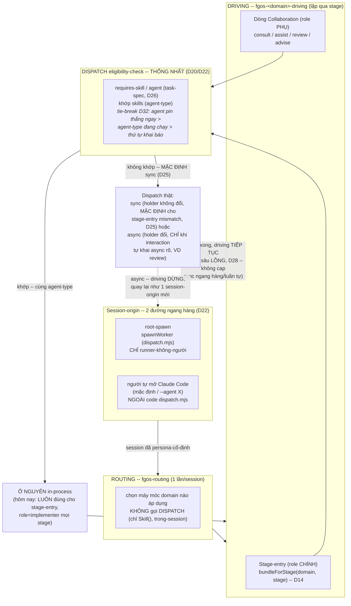
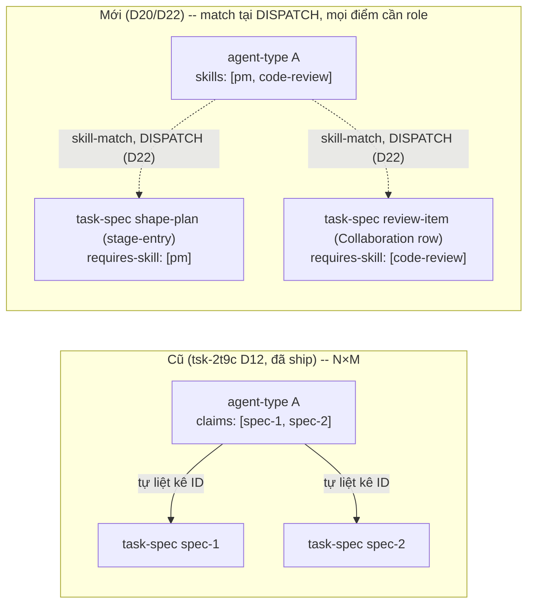

# Core-foundation vs domain-specific directory/module boundary (tsk-397)

## 1. Trạng thái hiện tại

Round 19 — opus review + D31-D34 (2026-08-19): Bật opus agent thứ 2
(`tsk397-discussion-review-2`, agent đầu bị kẹt không gửi được báo cáo)
— lần này bắt ghi báo cáo ra file thật (`plans/reports/discussion-
review-260819-2122-tsk397-boundary-report.md`) thay vì chỉ gửi qua
message. Đọc hết 1529 dòng, đối chiếu code thật (đều đúng, chỉ 1 nuance
nhỏ) — trả về **A:9 (mâu thuẫn/lỗi thời), B:6 (gap thiết kế thật), C:4
(polish)**. Trợ lý sửa hết A+C (xoá 2 khối "Còn mở" đã lỗi thời sau
D23/D24, sửa mermaid/ASCII tree thiếu node, sửa các task §7 còn trích
`registry.mjs`/`claims`/self-reference cũ) + thêm 2 task còn thiếu hoàn
toàn (D9 chưa từng có task di dời thật, D16 chưa từng có task rename
thật). Trình 4 gap B còn lại (workflows/defaultWorkflow/workflowFor mồ
côi sau D29/D30; tie-break khi nhiều agent-type cùng khớp skill; trùng
tên agent-type xuyên domain; `_shared/` chưa gán) — người xác nhận B3/
B5/B6 theo đề xuất, chọn a1 cho B4 rồi bổ sung trực tiếp "task-spec có
`agent` thì ưu tiên hơn" → **D31-D34** (seq 21349-21352). 34/34 quyết
định đã chốt.

Round 19 tiếp lần nữa nữa nữa (2026-08-19), D29-D30: Người hỏi 1 câu kỹ
thuật ("workflow khai stages trong đó luôn được không, harness chỉ
parse file... nếu vẫn muốn parse yaml tốt thì sao, thêm dependency hay
bin đọc yaml→json?"). Trợ lý scout `package.json` — xác nhận `yaml`
(`^2.9.0`) ĐÃ LÀ dependency thật DUY NHẤT của repo (không phải dev-only),
đã dùng thật ở `project-agents.mjs`; chỉ ra ràng buộc thật đã gặp trước
đó (`registrations.mjs`'s mini regex-parser cho doctor-check phải chạy
được trước `npm install`) — không áp dụng cho `workflow-stage-graphs.mjs`
(core, luôn chạy sau install). Người trả lời thẳng nguyên lý: "tôi chỉ
muốn tốt nhất cho người. Author khi authoring workflows chỉ cần biết
yaml workflow" → **D29** (seq 21348): MỌI workflow (kể cả `feature`)
thành `workflows/<name>.yaml` thật, `registry.mjs` không còn giữ
`stages`/`stepMap`/`transitions`/`skillMap`/`taskSpecMap` — giải tán
kỷ luật reference-sharing D7a (đúng cách D17 đã dùng). Người hỏi tiếp
ngay: "sao registry lại js mà không yaml?" — trợ lý xác nhận không có
rào cản kỹ thuật (nội dung còn lại thuần dữ liệu) → **D30** (seq 21347):
`registry.mjs`→`registry.yaml`, `domains/<name>/` từ nay THUẦN
YAML+prose, không còn file `.mjs` nào của riêng domain. 30/30 quyết
định đã chốt. **Việc dở dang:** §6/§7 cần rà lại TOÀN BỘ vì D29/D30 đổi
hình dạng ASCII tree/mermaid + làm {#task-domain-registry-split} (task
ĐẦU TIÊN của §7) không còn khớp thực tế (mô tả cũ: "dời `codingDomain`
nguyên vẹn 1 object JS" — nay phải tách thành `registry.yaml`
+ N file `workflows/*.yaml`). Opus agent review vẫn CHƯA gửi báo cáo.

Round 19 tiếp lần nữa nữa (2026-08-19), D25-D28: Người trả lời "không
dừng persona" cho câu hỏi treo D15 — bản chất quy trình phần mềm đúng là
team nhiều persona, làm đúng thì chất lượng tốt hơn, ép driving dừng đi
ngược lợi ích đó. Trợ lý scout `src/state/handoff.mjs`/`roleGraph.edges`
(`workflow-stage-graphs.mjs:405-441`) — xác nhận cơ chế ĐÃ CÓ SẴN (tsk-2t9c),
không cần xây mới: `evaluateHandoff` là pure legality-graph, `callstackCap:
3` đã chặn async nesting, và có sẵn 2 edge THẬT chứng minh trao đổi trực
tiếp (không qua lead) được hỗ trợ khi khai rõ. → **D25** (seq 21338):
driving không bao giờ hard-stop vì persona-ngầm-khác-stage, giải qua sync
consult. Đồng thời trong cùng round, người gộp thêm 3 điểm: (1)
`assignable-to`→`agent` (rename) → **D26** (seq 21339); (2+3) hỏi lại cơ
chế dispatch có chịu tải "đá qua lại" không + protocol qua lead hay
direct — trợ lý tìm ra ĐÃ CÓ (không phải câu hỏi mở) nhưng phát hiện 1
gap thật: `callstackCap` chỉ chặn async nesting, sync thì không — **D28**
(seq 21341, người trả lời ngay: cap cho sync LỒNG, sync ngang hàng/tuần
tự thì không cần); (4) core cần task-specs tường minh, không ẩn trong
code — trợ lý scout `docs/task-specs/` xác nhận ĐÚNG 13 file, 0 file cho
7 core-skill — gap thật chặn chính D20/D24's eligibility match → **D27**
(seq 21340): `core/task-specs/` mới cho 7 skill domain-agnostic. Người
hỏi thêm: `domains/*/registry.mjs` giờ còn giữ gì sau khi task-specs/
specs/knowledge/skills/agents/AGENTS.md đều đã tách ra folder riêng —
xem trả lời trực tiếp trong chat, đồng thời phát hiện + sửa 1 dòng chú
thích STALE trong ASCII tree §6 (câu "task-specs (fieldSchema)" là tàn
dư từ D8 SAI, chưa từng cập nhật theo D9). Cũng đã bật 1 opus agent
(`tsk397-discussion-review`) rà lại toàn bộ file tìm thiếu sót — đang
chờ báo cáo, sẽ hợp nhất vào round sau. 28/28 quyết định đã chốt.

Round 19 tiếp lần nữa (2026-08-19), D24: Người hỏi "giải thích nốt việc
cuối cùng là gì" (`agents/*.yaml` render-pair). Trợ lý giải thích lại đề
xuất round trước (giữ top-level `agents/`, KHÔNG tách domain — lý do
D20 làm agent-type domain-agnostic-by-thiết-kế). **Người bác LẦN THỨ 2**:
"có chứ mỗi domain sẽ có bộ agents riêng phù hợp chứ". Trợ lý soi lại,
nhận ra đã lẫn "cơ chế eligibility D20 domain-agnostic" (đúng) với "chỗ
CHỨA file cũng phải domain-agnostic" (SAI, non-sequitur) — chính tiền lệ
`skill` (D7) đã bác bỏ điều này từ trước: skill CŨNG load xuyên domain
được về mặt cơ chế, nhưng D7 vẫn tách `core/skills/`+`domains/*/skills/`
theo ai VIẾT/SỞ HỮU cho domain nào, không theo "có bị chặn cross-domain
hay không". Áp đúng công thức D7 cho `agents/*.yaml` → **D24** (seq
21174): `core/agents/` (domain-agnostic thật) + `domains/<name>/agents/`
(viết riêng theo flavor domain). 24/24 quyết định đã chốt — **HẾT** cả 2
việc mở cũ (doctrine D23, render-pair D24).

Round 19 tiếp nữa (2026-08-19), D23: Người hỏi "doctrine domain-scoped
là gì" — trợ lý giải thích + nhắc lại đề xuất round trước ("cố ý CHƯA
XÂY", vì tưởng chưa có nội dung doctrine domain-thật). **Người bác
thẳng**: `coding` ĐÃ có doctrine riêng thật rồi (không phải tương lai) —
đòi fgOS phải có cơ chế dẫn dắt agent tìm đến doctrine riêng từng domain.
Trợ lý grounding lại bằng chính nội dung `AGENTS.md` gốc: mục "fgOS
Workflow" gọi thẳng tên `fgos-coding-*`, mục "GitNexus — Code
Intelligence" toàn bộ code-symbol-specific — xác nhận đúng, không phải
giả thuyết. Đề xuất cơ chế: `domains/<name>/doctrine.md` + routing tự
Read khi domain đã biết (vì `@import` tĩnh của `CLAUDE.md` không điều
kiện hoá theo domain được — nạp trước khi biết domain). Người hỏi tiếp
tên file `doctrine.md` hay `domains/<name>/AGENTS.md` — trợ lý so sánh,
đề xuất `AGENTS.md` (cùng loại file với root, không bịa khái niệm mới) +
cảnh báo cơ chế nạp PHẢI dựa vào routing tự Read tường minh, không giả
định auto-discovery AGENTS.md lồng thư mục (chưa kiểm chứng). Người
chốt `AGENTS.md` → **D23** (seq 21094). 23/23 quyết định đã chốt.

Round 19 tiếp (2026-08-19), D22: Sau khi làm xong việc dở dang round 18
(xem đoạn dưới), người đặt câu hỏi mới: đã gom DISPATCH thành 1 khái
niệm dùng chung (D21) rồi thì bố cục 3-tầng DISPATCH/ROUTING/DRIVING vẽ
ở §6 (xếp chồng, chạy 1→2→3) có đúng không. Trợ lý scout `dispatch.mjs`
tìm ra 2 điểm vào thật (`spawnWorker` root-spawn vs `decideDispatchMechanism`
in-session decide) — đề xuất DISPATCH là dịch vụ bị gọi lặp lại, không
phải tầng-chạy-1-lần. Người hỏi tiếp "root-spawn là gì" — trợ lý giải
thích + chỉ ra: session tương tác NGƯỜI tự mở KHÔNG đi qua root-spawn,
là 1 đường thứ 3 ngoài `dispatch.mjs`. Người hỏi tiếp: pick(1)/discover(2)/
exploring(3)/planning(4)/executing(5)/review(6) có phải mỗi cái là 1
ứng viên dispatch — trợ lý TRẢ LỜI SAI ban đầu ("stage-entry tự nó không
dispatch, chỉ dòng Collaboration mới dispatch"). **Người bác đúng**: "nếu
không phải thì thiết kế workflow/stage/task-spec/agent/skill dispatch
(bundle mix load) làm gì?" — trợ lý scout lại (`judge-ambiguity.md`/
`lock-decisions.md`/`implement-item.md` đều `position: implementer`),
nhận ra role (seat) và skill (D20's `requires-skill`) là 2 trục khác
nhau — `bundleForStage` (D14) đã sẵn cơ chế khớp CHO CẢ stage-entry, chỉ
là hôm nay no-op vì thiếu dữ liệu (`roleGraph` 1 role + chưa ai viết
`requires-skill` khác nhau). → **D22** (seq 20826): DISPATCH
eligibility-check là 1 cơ chế THỐNG NHẤT cho MỌI điểm cần role (stage-entry
VÀ dòng Collaboration), không riêng gì Collaboration. §6's subsection
DISPATCH được viết lại HOÀN TOÀN (diagram mới: session-origin 2 đường
song song → ROUTING → DRIVING với 1 điểm ELIG dùng chung cho cả
stage-entry lẫn Collaboration-row) — hợp nhất luôn subsection "Eligibility
declaration" cũ (D20) vào chung 1 chỗ thay vì tách riêng. 22/22 quyết
định đã chốt. Người xác nhận: "đồng ý, mãi mới thấy rõ chổ này."

Round 19 (2026-08-19): Làm nốt việc dở dang round 18 để lại. (1) D20 đã
đưa vào §6: thêm subsection mới "Eligibility declaration — đảo hướng
(D20/D21)" sau khối diagram DISPATCH, mô tả cụ thể trước/sau bằng bằng
chứng scout thật — `agents/*.yaml`'s `claims` field (`scripts/
project-agents.mjs:120-125,137-147`, validate + project vào frontmatter
`.claude/agents/*.md`) và doctor check `agent-claims-resolve`
(`src/setup/registrations.mjs:419-503`, đọc `docs/task-specs/<domain>/
*.md`) là code THẬT cần đảo hướng, không phải suy diễn. Thêm task
{#task-eligibility-inversion} vào §7 (D20/D21) liệt kê đúng 4 điểm chạm
thật: schema `agents/*.yaml` (`claims`→`skills`), `project-agents.mjs`
(validate+project), doctor check (đổi hướng resolve), và schema
task-spec (`assignable-to`/`requires-skill`, header 1-dòng hiện có ở
`docs/task-specs/coding/*.md` cần thêm field). (2) Rà lại TOÀN BỘ §6
prose (không chỉ vá điểm nhắc `claims`/tên tầng như round 18 làm dở) —
tìm đúng 1 chỗ còn stale thật: đoạn so sánh marketing-cockpit (dòng ~679
cũ) vẫn khen `claims` (PULL, tsk-2t9c D12) "đã đi xa hơn" marketing-
cockpit — mâu thuẫn trực tiếp với D20 vừa đảo ngược chính `claims` đó.
Đã viết lại đoạn này: nhận ra marketing-cockpit's field `skills:` trên
agent-type, dù KHÔNG được dispatch runtime nào truy vấn (PUSH,
hardcode), lại đúng SHAPE hơn `claims` — D20 hội tụ về đúng tên field đó
(`skills:`) nhưng nối nó vào dispatch runtime thật (D21), tạo mô hình
khác cả 2 tiền lệ: đúng shape của marketing-cockpit + đúng cơ chế
runtime-wired của tsk-2t9c. Còn lại: không tìm thêm chỗ nào khác trong
§6 cần sửa. (3) Phân tích 2 việc mở cũ, ĐỀ XUẤT (chưa khoá D-ID — mới 1
round, chưa qua vòng thứ 2 theo kỷ luật D4):
`agents/*.yaml`→`.claude/agents/*.md` render-pair NÊN giữ nguyên
top-level (`agents/`, không tách vào `domains/<name>/agents/`) — vì D20
tự nó làm agent-type identity domain-agnostic-by-thiết-kế (1 agent-type
đủ điều kiện qua `skills` chung xuyên domain, đúng ví dụ marketing-lead/
tech-lead-đều-làm-PM), khác hẳn skill/task-spec/knowledge vốn thật sự
thuộc về 1 domain; `doctrine` domain-scoped nên đánh dấu "cố ý CHƯA XÂY"
(cùng lớp với D15's phần treo có chủ đích) — chưa có nội dung doctrine
domain-thật nào (marketing vẫn `proposed`, chưa code) để thiết kế theo,
ép thiết kế bây giờ là suy diễn. Cả 2 đề xuất trình bày ở §6, CHỜ người
xác nhận trước khi mint D-ID. 21/21 quyết định đã chốt (không đổi round
này — thuần regenerate §6/§7, không quyết định mới).

Round 18 (2026-08-19, PHIÊN NÀY HẾT TOKEN — session sau đọc mục này để
resume): D20 (đảo hướng eligibility: agent-type chỉ khai role+persona (`soul` intent) + skill,
task-spec khai `assignable-to`/`requires-skill`, đảo ngược 1 phần D12
tsk-2t9c đã shipped) và D21 (rút "CASTING", 3 tầng dispatch map thẳng
vào `dispatch.mjs`/`fgos-routing`/`fgos-coding-driving` đã có tên) đã
chốt — ghi qua `fgos decision --id tsk-397` (seq 20796, 20797). 21/21
quyết định đã chốt. **Việc dở dang, session sau cần làm tiếp:**
(1) D20 chưa được phản ánh vào §6's design synthesis / §7's task list —
chỉ mới ghi ở §3/§4, chưa có task cụ thể cho việc sửa `agents/*.yaml`
schema (`claims`→`skills`) + task-spec schema (thêm `assignable-to`/
`requires-skill`); (2) 2 việc còn mở CŨ vẫn treo nguyên: `agents/*.yaml`→
`.claude/agents/*.md` render-pair đặt vào D7 hay tách riêng, và
`doctrine` domain-scoped (mở từ đầu chưa ai đề xuất); (3) §6 diagram còn
1 vài chỗ tên cũ ("DISPATCH" node label) đã sửa nhưng CHƯA rà lại toàn
bộ §6 prose để khớp 100% với D20/D21 (chỉ vá đúng những chỗ trực tiếp
nhắc `claims`/tên tầng, chưa đọc lại toàn bộ).

Round 17 (2026-08-19): Người chỉ ra thêm 1 việc còn mở: "workflow" chưa
có file định nghĩa riêng — chỉ là key lồng trong `registry.mjs`. → D18:
`domains/<name>/workflows/<name>.mjs`, mirror pattern aggregator D4 một
tầng sâu hơn. Người yêu cầu tham khảo kỹ marketing-cockpit's 33 workflow
file thật (không bắt chước mù quáng) — trợ lý scout, tìm ra 7/33 file
thật ra là khái niệm `template` (multi-item batch) chứ không phải
`workflow` (single-item), xác nhận đúng ranh giới D7 tsk-2t9c đã định
nghĩa từ trước. Trợ lý làm bảng so sánh field-by-field nhưng bác vội quá
nhiều — người sửa lại 3 chỗ (`rigor`/`cognitive_tier` đáng học ở cấp
task-spec; `approval_gates` đáng học như lớp cấu hình khai báo;
`stages` shape nên tách ergonomics-viết khỏi shape-runtime, không phải
copy nguyên) → D19. Thêm 1 mục "Ý tưởng học — chưa xây" vào §6 (giữ
escalation-threshold + signal-bus như tsk-2t9c's §VI, không mất khi
quên). 19/19 quyết định đã chốt.

Round 16 (2026-08-19): Người đặt câu hỏi làm rõ GATE của task-1 (ẩn dụ
"2 tấm biển, 1 cái hộp"), rồi tự đề xuất: đang dời hộp (`codingDomain`
sang `domains/coding/registry.mjs`) thì dọn biển luôn cùng lượt, để cái
GATE đó không còn cần thiết nữa (không còn 2 đường đọc thì không có gì
để so sánh phân kỳ). Trợ lý scout chính xác — chỉ 2 điểm đọc property
phẳng còn thật (`stage-fsm.mjs:94`, `plan.mjs:519`+`loop.mjs:1297` trùng
dòng) — nhỏ hơn hẳn giả định "4 file" trước đó. → D17 (seq 20772): gộp
task-3 vào task-1, GATE cũ thành moot, không cần verify riêng nữa. 17/17
quyết định đã chốt.

Round 15 (2026-08-19): Thuật ngữ "position" (dùng lẫn với "role" suốt
round 14) đã sweep sạch về "role" — khớp tên field thật trong code
(`roleGraph.roles`, `defaultRole`). Từ đó nảy ra thảo luận role vs
persona: role = seat cố định (data, check legality); persona = ai thật
sự ngồi vào seat đó (resolve riêng, D15). Kết luận: `human-advisor` đổi
tên thành `advisor` (D16, seq 20766) — gắn "human" vào TÊN role là dư
thừa, vì `awaiting-human` (status-fsm, có TRƯỚC roleGraph) + `ask`/
`answer` đã bắt trọn phần human-specific riêng rồi; role tự nó chưa bao
giờ nhất thiết "dành cho con người" — đó là do cơ chế `advise` gọi tới.
KHÔNG thêm eligibility-resolution mới — chỉ đổi tên, hành vi giữ nguyên
100%. 16/16 quyết định đã chốt.

Round 14 (2026-08-19): Sau D9-D12 (folder-layout đã ổn định), thảo luận
mở rộng sang tầng DISPATCH/COORDINATION — trả lời "khi không gian đã tách,
cơ chế nào điều phối việc thật giữa workflow/stage/taskSpec/skill/
role/agent-type". Kết quả (D13-D15, ghi qua `fgos decision --id
tsk-397`, seq 20756-20758):

- **D13 — kiến trúc 3 tầng dispatch/routing/driving**, nguyên lý tổ chức:
  soul/persona của một session KHÔNG hoán đổi được giữa chừng (khác
  skill/task-spec — chỉ là văn xuôi đọc lại tự do). DISPATCH (chọn AI,
  một lần, trước khi session tồn tại) → ROUTING (`fgos-routing`, chọn
  MÁY MÓC nào áp dụng, xuyên domain, chạy một lần trong session đã có
  persona cố định) → DRIVING (`fgos-<domain>-driving`, lặp qua nhiều
  stage, CÙNG một persona, load lại skill+taskSpec tự do mỗi stage).
  Bằng chứng thật: `fgos-coding-driving`'s ceiling mặc định là
  `status=='awaiting-approval'` — ĐÚNG chỗ tsk-2t9c D18 gắn async review
  handoff — driving đã dừng đúng lúc persona cần đổi, dù chưa ai đặt tên
  nguyên lý này trước đây.
- **D14 — `bundleForStage(domain, stage)` trả `{skill, taskSpec}` cùng
  lúc**, sống ở tầng DRIVING — đóng gap "skill hardcode path task-spec
  trong prose" (dòng 88/177/291 của `fgos-coding-implement`).
- **D15 — persona/agent-type resolve theo `(domain, stage, role)`**,
  không chỉ `(domain, role)` — team-hợp-tác trong 1 stage = chuỗi sync
  call (consult/assist, holder không đổi) từ 1 holder chính tới nhiều
  persona chuyên biệt, KHÔNG BAO GIỜ multi-holder cùng lúc; song song thật
  = decompose ra item con (`fgos-fanout`, đã có), không phải concurrency
  trên cùng 1 worktree. CỐ Ý CHƯA XÂY: liệu ranh giới stage (persona mặc
  định đổi dù cùng role, không có handoff tường minh) có nên cũng làm
  driving dừng — chưa có bằng chứng persona đa dạng thật để thiết kế theo.

So sánh `upstreams/marketing-cockpit`'s cách gán role→agent
(`workflow.md`'s `agents:`/`stages:` hardcode tên agent, PUSH, tác giả
quyết lúc viết) đã xác nhận: field `skills:` trên agent-type của họ chỉ
là catalog khai báo (đọc bởi người/LLM lúc thiết kế), KHÔNG được dispatch
mechanism nào truy vấn runtime — `claims` của tsk-2t9c (PULL, agent tự
khai eligibility) thực ra đã đi XA HƠN marketing-cockpit, không phải thứ
cần bắt kịp.

15/15 quyết định đã chốt. Còn mở thật: `agents/*.yaml`→`.claude/agents/*.md`
render-pair đặt vào D7 hay tách riêng (đề xuất chưa lock: mirror D7,
domain riêng có `domains/<name>/agents/`), và `doctrine` domain-scoped
(mở từ đầu, chưa ai đề xuất giải pháp cụ thể).

Round 12 (2026-08-18): Xác nhận `tsk-2t9c` ĐÃ MERGE VÀO MAIN (`e268376e`)
— không phải nhánh treo. `codingDomain` thật có 10+ field (§7 task-1 đã
cập nhật đủ danh sách). Trợ lý đề xuất drop task-3 (dispatcher wiring),
bị người bác: bugfix-workflow sắp landing thật, đây chính là lý do làm
domains/ split BÂY GIỜ để tránh migrate 2 lần → D10, task-3 giữ lại, đổi
khung ("làm sẵn seam" thay vì "sửa bug"). Thêm GATE bắt buộc vào task-1:
xác nhận dynamic import giữ đúng identity `workflows.feature.stages ===
codingDomain.stages` trước khi plan thật — nếu không giữ được, cơ chế
aggregator (D4) phải đổi shape. Còn treo: `roleGraph`/`taskSpecMap`/
`agents/*.yaml`→`.claude/agents/*.md` render-pair chưa có quyết định
placement cụ thể trong `domains/coding/` — cần tiếp tục hoà giải.

Round 11 (2026-08-17): **PHÁT HIỆN QUAN TRỌNG — thảo luận này đã bỏ sót
một thiết kế đã chốt VÀ đã triển khai thật trước đó: `tsk-2t9c`
(`docs/history/fgos-marketing-domain-foundation/`, 13 quyết định, wiring
code thật trong `fgos-coding-implement`/`discovering`/`exploring`/
`planning`/`validating`, có chạy end-to-end thật trên `tsk-ogx`).**
tsk-2t9c D10 đã khoá "four-layer ontology": task-spec (contract) / skill
(know-how) / knowledge (domain expertise) / context (fact tức thời) —
KHÁC và chính xác hơn ma trận 6-concern của thảo luận này. "task-spec"
đúng nghĩa (D6/D10) là hợp đồng theo TỪNG LOẠI việc (input/output/gates/
verify-template), một file/domain/loại-việc — hoàn toàn KHÁC "task" mà
trợ lý đã dùng xuyên suốt thảo luận này (field-schema work-item,
`EDITABLE_FIELDS`/`domainFields`). D8 (cả bản sai lẫn bản sửa lần 1) đều
dựa trên định nghĩa sai này. D9 ghi sửa lại — `docs/task-specs/coding/`
(13 file thật, machine-checked bởi `registrations.mjs`'s
`task-specs-resolve`) chuyển vào `domains/coding/task-specs/`, giữ đúng
tên gọi đã có. tsk-2t9c CÒN có `roleGraph` (trục role/holder) và
`taskSpecMap` trong registry entry của domain — 2 field registry.mjs của
thảo luận này (D3/D4) chưa từng tính tới. **Câu hỏi treo cho người:**
thảo luận này có nên coi tsk-2t9c là authoritative và chỉ tự giới hạn vào
câu hỏi folder-layout ĐẶT LÊN TRÊN thiết kế đó, hay cần hoà giải đầy đủ
2 thiết kế ngay trong phiên này?

Round 10 (2026-08-17): D8 SỬA LẠI ngay sau khi chốt sai — bản đầu (seq
19349) hiểu nhầm "task-specs" thành toàn bộ `docs/specs/`, di dời cả 12
file platform/core. Người sửa ngay: chỉ tạo mới `domains/<name>/specs/`
(rỗng, chờ domain tự viết task-spec riêng); `docs/specs/` giữ nguyên
100%, không đụng gì. Bản sửa ghi qua `fgos decision --id tsk-397` (seq
19351). Layout: 5/6 concern đối xứng đầy đủ (workflow/task-schema qua
registry.mjs, skill qua skills/, knowledge qua knowledge/, task-specs qua
specs/-khi-cần) — `harness` chủ đích chỉ core (D1/D5), `doctrine` vẫn mở.
D7 (skill canonical → `core/skills/`+`domains/*/skills/`) vẫn đứng, chốt
round 9 (seq 19342) — không đổi. D7 đòi cơ chế mới (assembly step trong
`skill-wrappers.mjs`) trước khi implement thật, việc cho
`fgos-coding-planning` xử lý, không phải discussion này.

Round 7 (2026-08-17): D6 sửa lại và chốt — ghi qua `fgos decision --id
tsk-397` (seq 19297), thay bản D6 đầu (SAI, lẫn context với knowledge).
`docs/history/` là context (thô, feature-scoped, share, không tag
domain) — giữ nguyên. Domain-knowledge (curated, do team bảo trì) là
khái niệm riêng, sống tại `domains/<name>/knowledge/`, co-located theo
tinh thần D3 — tiền lệ thật `/home/vantt/projects/beegog/expertise/`.
5/6 mối quan tâm giờ có hình dạng chốt (harness/workflow/task/skill/
knowledge); chỉ còn `doctrine` domain-scoped là mở thật (không giải được
bằng tag như knowledge, vì doctrine luôn-nạp chứ không tra-theo-yêu-cầu).
Layout (ASCII + mermaid, §6) đã đồng bộ theo D6 mới.

Round 6 (2026-08-17): tầng CODE+SKILL của boundary đã chốt — D3/D4/D5,
ghi qua `fgos decision --id tsk-397` (seq 19128-19130). Hình dạng cuối:
`domains/<name>/` là folder tự chứa (registry.mjs + skills/ đi cùng nhau)
ở top-level, mirror đúng cơ chế plugin thật đã có trong chính repo này
(`plugins/fgOS/` — tự chứa manifest + skills, thêm `dogfood-fixture`
không đụng gì bên trong `fgOS/`). `workflow-stage-graphs.mjs` chỉ còn là
aggregator quét `domains/*/registry.mjs` tự động — thêm domain không sửa
file có sẵn nào. `core` (bin/, src/, herdr-plugin/) KHÔNG di dời vật lý —
881 tham chiếu `bin/fgos.mjs` trong repo + fgOS đã cài global ở nhiều
project khác (mission 0035) khiến việc di dời phá vỡ diện rộng cho lợi
ích thuần biểu tượng; `.agents/skills/core/` là chỗ duy nhất rẻ đủ để gắn
nhãn core tường minh. Người mở rộng khung phân tích thành ma trận 6 mối
quan tâm (harness/workflow/task/knowledge/skill/doctrine) × {core,
domain} — 4/6 đã có hình dạng rõ (harness chỉ ở core theo D1; workflow/
task/skill đã chốt qua D2-D4); **knowledge và doctrine domain-scoped vẫn
là câu hỏi MỞ, chưa thiết kế** — không có tiền lệ trong code hiện tại,
cần quyết định có scope cho item này hay để lại khi marketing thật bắt
tay xây. Người vừa yêu cầu vẽ layout — xem diagram đầy đủ ở §6.

Round 5 (2026-08-17): D1 (share store) và D2 (top-level = port đóng,
`domainFields` = adapter mở) đã chốt và ghi qua `fgos decision --id
tsk-397` (seq 19058/19059). §6 đã regenerate cho tầng STATE (data layer)
— đây mới là MỘT lớp của hexagon (data/store), chưa phải toàn bộ
folder-layout. Còn mở: trục (b) engine-vs-prose (tiêu chí tách + duplicate
3 cây skill), và phần domain-specific của CODE (không chỉ data) — 4 điểm
nối STR89 đã định vị (registry/discovery.mjs+decompose.mjs/fgos-routing/
skill-bundle) chưa có quyết định thư mục cụ thể nào.

Round 4 (2026-08-17): người xác nhận mục tiêu thật của item — tổ chức
folder-layout để ranh giới rõ, dễ theo hexagonal/ports-adapters, dễ giữ
contract, dễ thêm/mở rộng, VÌ sẽ có thêm domain thật (không phải suy đoán
— STR52 backlog xác nhận domain "marketing" đã proposed). Scout tìm thấy
STR89 (done) đã định vị sẵn 4 điểm nối domain-specific cần mở
(registry/`discovery.mjs`+`decompose.mjs`/`fgos-routing`/skill-bundle
riêng) — đây chính là "ports" hexagon cần thiết kế quanh, không phải suy
diễn từ đầu. Người cũng sửa cách làm việc của trợ lý: khi có đủ chất liệu
để phân tích, phải tự phân tích và đề xuất — không hỏi ngược lại người mà
chưa đưa ra khuyến nghị. Áp dụng ngay: đã phân tích 3 tiêu chí người cho
(field-compatible, security/phân vùng, performance) cho câu hỏi mở của
STR52 (share store hay cài riêng) — cả 3 đều KHÔNG chặn share-store
(field-compat đã có hạ tầng `domainFields` sẵn, security không có gì phải
build vì chỉ cần filter theo `work.domain` có sẵn, performance đã chịu
tải thật 19K events/8.4MB với incremental-replay fast path) → khuyến nghị
**share store**, chờ người xác nhận khoá. Trục (b) engine-vs-prose vẫn có
tiền lệ thật từ `/home/vantt/projects/beegog/` (đã xác nhận round 2-3),
trục (a) giờ không còn "chỉ 1 domain thật" — có domain #2 (marketing)
thật đang chờ shape.

## 2. Mục tiêu & đề bài

Mục tiêu thật (chốt round 4, lời người): tổ chức lại folder-layout của
fgOS sao cho ranh giới RÕ, phù hợp tư duy hexagonal/ports-and-adapters
(port = hợp đồng cố định mọi domain phải tuân, adapter = phần domain tự
cắm vào), giữ được contract ổn định, và dễ THÊM domain mới/mở rộng —
không phải bài tập lý thuyết, vì fgOS có domain thật thứ hai đang chờ
(STR52: "marketing", proposed, đã có scope draft). Việc tách hai trục
(core-foundation vs domain-specific; engine vs skill/prose) là công cụ để
đạt mục tiêu đó, không phải mục tiêu tự thân. Tham khảo mô hình bee
upstream — nguồn thật đã xác nhận là `/home/vantt/projects/beegog/` (live
checkout v2.7.0: packages/bee-rs = rust core 1 crate/1 binary,
packages/bee = vendor payload, skills/ = 9-skill prose) — làm tiền lệ cho
trục engine-vs-prose; bản thân beegog không có multi-domain nên KHÔNG cho
tiền lệ trục core-foundation-vs-domain-specific — trục này phải tự thiết
kế dựa trên chất liệu thật của fgOS: STR52 (scope marketing) + STR89 (4
điểm nối domain-pluggable đã xác định: `DOMAINS` registry,
`discovery.mjs`/`decompose.mjs` retrofit, `fgos-routing` domain-aware,
skill-bundle riêng theo domain) + hạ tầng `work.domainFields` (đã xây sẵn
làm "infrastructure for a FUTURE domain", decision 0027 D6). Đây là item
thảo luận kiến trúc thuần tuý — không quyết định implement gì trong
chính item này — cần shaping/discovery trước khi khoá quyết định, rồi
handoff sang `fgos-coding-exploring`/`fgos-coding-planning` cho việc thực
thi thật.

## 3. Vấn đề rõ / chưa rõ

| # | Điểm | Trạng thái | Ghi chú |
|---|------|-----------|---------|
| 1 | Domain nào trong `DOMAINS` là domain sản xuất thật, có skill/harness riêng, cần một ranh giới domain-specific để phục vụ? | Rõ (scout) | Chỉ `coding` có skillMap thật + worktree-backed. `synthetic`, `triage`, `fixture-marketing` đều tự nhận là illustrative/disposable fixture trong chính comment của code — không skill nào từng load, không worktree/merge thật. |
| 2 | Mô hình bee upstream (packages/bee-rs/packages/bee/skills, decision 0025-rust-migration-strategy) có phải một hợp đồng sống với forgentX hiện tại không? | Rõ (scout) | Không. `docs/history/bee-to-fgos-rename/CONTEXT.md` D1 (chốt 2026-08-13, người trả lời trực tiếp): forgentX đã cô lập hoàn toàn khỏi bee, không còn interop sống, "anything learned from bee has already been internalized rather than depended on". Decision 0025 của forgentX là một quyết định khác hẳn (product-priority-order), không phải rust-migration-strategy. |
| 3 | Cây thư mục hiện tại đã có tách engine (code chạy được) khỏi skill/prose chưa? | Rõ một phần (scout) | Có JS engine (`bin/`, `src/`) + Rust engine riêng (`herdr-plugin/`, crate độc lập, song song `src/` chứ không lồng trong nó) tách khỏi ba cây skill: `.claude/skills/` (16, generated wrapper), `.agents/skills/` (16, nguồn canonical thật — CLAUDE.md tự ghi rõ), `plugins/fgOS/skills/` (~52, cây route theo plugin manifest, chứa cả wrapper theo-verb lẫn các skill `fgos-coding-*` cốt lõi). Prose đã tách khỏi code, nhưng đang nhân bản qua 3 cây thay vì 1 nguồn + render. |
| 4 | `upstreams/` (path item liệt kê để khảo sát) có tồn tại trong repo không? | Rõ (scout, sửa lại round 1) | Có, trong main checkout (`upstreams/bee/`, `upstreams/beegog/`, gitignored) — round 1 chỉ kiểm trong worktree cô lập nên báo sai "không tồn tại". Cả hai đều là bản CŨ hơn `/home/vantt/projects/beegog/` (live). |
| 5 | Doctrine layer (AGENTS.md/CLAUDE.md) đã có tiền lệ "luôn nạp vs nạp theo nhu cầu" nào gần với trục engine/skill chưa? | Rõ một phần (scout) | `docs/platform-foundations.md` L8 đã khoá placement test này CHO RIÊNG tầng doctrine (standing sheet vs reference nạp theo nhu cầu) — cùng tinh thần trục (b) nhưng chưa từng generalize ra toàn cây thư mục. |
| 6 | Ranh giới cụ thể core-foundation vs domain-specific nên nằm ở đâu? | Chưa rõ (nhưng không còn speculative) | STR52 (marketing, proposed) + STR89 (done, đã định vị 4 điểm nối domain-pluggable) là chất liệu thật để thiết kế ranh giới, xem #10/#11 dưới. Vẫn cần thiết kế cụ thể layout. |
| 7 | Engine vs skill/prose tách theo tiêu chí nào (ngôn ngữ? runtime-executable vs instruction-only? mức nạp?) | Chốt — D7 | `core/skills/` + `domains/*/skills/` là canonical AUTHORING; `.agents/skills/`, `.claude/skills/`, `plugins/fgOS/skills/` cả ba đều là render target (D7, mở rộng tsk-1qi D5). |
| 8 | Mô hình plugin/extension theo domain có đáng chi phí duy trì thêm một tầng tổ chức? | Chốt — D3/D12 | Đáng. Chi phí thấp hơn dự đoán ban đầu — không cần package/workspace riêng (folder đủ, D3), và cơ chế enforce ranh giới đã có sẵn trong repo (`architecture-manifest.json`, chỉ cần mở rộng thêm 1 rule, D12) chứ không phải xây từ đầu. |
| 9 | Nguồn so sánh bee/beegog thật nằm ở đâu, và nó có tiền lệ cho trục nào? | Rõ (scout + xác nhận người, round 2) | `/home/vantt/projects/beegog/` (live checkout, KHÁC repo-con `upstreams/beegog/` đã pull nhưng vẫn cũ) có đúng cấu trúc v2.7.0: `packages/bee-rs` (1 crate, 1 binary), `packages/bee` (vendor payload), `skills/` (9 skill, giảm từ 18/15). Không tìm thấy khái niệm multi-domain nào trong beegog (`grep -i "multi-domain\|DOMAINS\b"` không ra kết quả liên quan) — beegog là tiền lệ thật cho trục (b), KHÔNG phải tiền lệ cho trục (a). |
| 10 | Domain thật thứ hai có tồn tại/đang chờ không? | Rõ (scout, round 4) | Có — `docs/backlog.md` STR52: "Domain thứ hai THẬT: marketing", status `proposed`, nêu 2026-07-18. Người dùng có sẵn workflow marketing ở project khác, muốn điều phối qua fgOS. Câu hỏi scope gốc của STR52 (share store hay cài fgOS riêng) — xem #12. |
| 11 | Domain-specific cần mở những điểm nối nào trong code hiện tại? | Rõ (scout, round 4) | STR89 (done) định vị 4 điểm: (1) `DOMAINS` registry entry riêng cho domain mới (`src/state/workflow-stage-graphs.mjs`); (2) `discovery.mjs`/`decompose.mjs` retrofit — hiện hardcode literal stage-name của coding, cảnh báo sẵn trong comment `workflow-stage-graphs.mjs:29-34`; (3) `fgos-routing` domain-pluggable hoá — tự thú nhận hôm nay "the only domain this induction targets [is coding]"; (4) bộ skill nội dung riêng theo domain-extension, song song bộ coding. Thứ tự đã xác nhận: software-dev (coding) trước, marketing sau, không chặn nhau. |
| 12 | STR52's câu hỏi scope (share store hay cài fgOS riêng cho domain mới) — trả lời thế nào? | Chốt — D1 | (nội dung phân tích giữ nguyên, xem D1 ở §4) |
| 13 | Domain-specific code+skill nên tổ chức theo layout nào (nested trong cây có sẵn, hay folder riêng)? | Chốt — D3/D4 | `domains/<name>/` tự chứa, top-level, mirror `plugins/fgOS/`. Đề xuất nested đầu tiên (`.agents/skills/domains/coding` + `src/domains/coding` tách rời) bị người bác — "không phát triển được dạng plugin/extension". |
| 14 | Core (bin/, src/, herdr-plugin/) có nên di dời vào folder `core/` tường minh để đối xứng với `domains/` không? | Chốt — D5 (cập nhật bởi D7) | `bin/`, `src/`, `herdr-plugin/` KHÔNG di dời — 881 tham chiếu `bin/fgos.mjs` + external install (mission 0035) khiến chi phí lớn hơn hẳn lợi ích biểu tượng. Riêng SKILL thì có: canonical authoring chuyển hẳn sang `core/skills/` (D7) — rẻ hơn hẳn di dời `bin/`/`src/` vì không đụng path nào external project gọi trực tiếp, chỉ đổi chỗ maintainer sửa nguồn. |
| 15 | Áp ma trận 6 mối quan tâm (harness/workflow/task/knowledge/skill/doctrine) × {core, domain} — còn chỗ nào thiếu? | Chốt — D23 | harness: chỉ core (D1). workflow/task/skill: đã chốt (D2-D4). knowledge: đã chốt (D6). **doctrine: Chốt — D23** — `domains/<name>/AGENTS.md`, routing tự Read khi domain đã biết. Cả 6/6 mối quan tâm giờ đã có hình dạng chốt. |
| 16 | `docs/history/<feature>/` có phải "knowledge" không? | Chốt — sửa lại (round 7) | KHÔNG — người chỉ ra `docs/history/` là **context** (biên bản thô, append-only, theo feature), không phải knowledge. "Knowledge" đúng nghĩa = domain-knowledge, curated, do team tự bảo trì — khác hẳn context. D6 (bản đầu, gắn tag `domain` lên `docs/history/`) SAI vì lẫn 2 khái niệm — đã thay bằng D6 mới. |
| 17 | Domain-knowledge (curated, private, do team tự bảo trì) nên sống ở đâu? | Chốt — D6 | `domains/<name>/knowledge/`, co-located cùng `skills/`, theo đúng tinh thần tự-chứa của D3. Tiền lệ thật: `/home/vantt/projects/beegog/expertise/` — hệ curated knowledge base thật (`knowledge.md` tự mô tả "craft vs project layers, harvesting from finished work, recorded trust, dated freshness, migration rot, retirement") — khác hẳn `docs/history/` (context thô). |
| 18 | `.agents/skills/core` có nên đổi thành `core/skills/` (bỏ dấu chấm, đối xứng `domains/`)? `.agents` và `.claude` có phải thin wrapper cả hai không? | Chốt — D7 | Có, nhưng không phải rename đơn thuần. `.agents/skills/*` là canonical THEO một quyết định TRƯỚC đó (tsk-1qi D5, `skill-wrappers.mjs` tự ghi rõ "the canonical, orchestrator-neutral skill source") — và `fgos setup` vendor NGUYÊN VĂN `.agents/skills/*` vào MỌI external project (`materializeSkillsIntoProject`), nên hình dạng bên ngoài (host project nhận được gì) không được đổi. D7: canonical AUTHORING chuyển sang `core/skills/` + `domains/*/skills/`; `.agents/skills/`, `.claude/skills/`, `plugins/fgOS/skills/` CẢ BA thành render target thật (thêm bước assembly trong `skill-wrappers.mjs`) — mở rộng quyết định tsk-1qi D5 (bối cảnh mới: `domains/` chưa tồn tại lúc đó), không đảo ngược nó. |
| 19 | Task-specs nên tách vào đâu? | SỬA LẠI LẦN 2 — D9 (round 11) | Cả bản D8 đầu (di dời toàn bộ `docs/specs/`) lẫn bản sửa lần 1 (định nghĩa task-specs = field-schema work-item) đều SAI. Người chỉ ra `docs/task-specs/coding/*.md` — 13 file THẬT ĐÃ TỒN TẠI, thuộc thiết kế đã chốt `tsk-2t9c` (D6/D10: task-spec = hợp đồng theo LOẠI việc, input/output/gates/verify-template — khác hẳn field-schema). Xem D9. |
| 20 | tsk-2t9c (`fgos-marketing-domain-foundation`) phủ những gì, và quan hệ với thảo luận này ra sao? | Rõ (scout round 11-12) | tsk-2t9c ĐÃ MERGE VÀO MAIN (`e268376e`) — không còn nằm trên nhánh riêng. `codingDomain` object thật hôm nay có 10+ field (stages/stepMap/transitions/skillMap/taskSpecMap/worktreeBacked/statusLabels/parkReason/classification/roleGraph + workflows/defaultWorkflow/workflowFor), không phải 4-5 field thảo luận này giả định. Người xác nhận: `bugfix` workflow (un-merge theo D7/D7a của tsk-2t9c, đang hoãn) sắp thật, không còn giả thuyết — đây chính là LÝ DO làm domains/ split BÂY GIỜ, trước khi code bugfix-workflow viết ra, để không phải migrate 2 lần. |
| 21 | Task-3 (dispatcher domain/workflow-aware) có nên drop khỏi scope thảo luận này không (trợ lý từng đề xuất drop)? | SỬA LẠI — D10 (round 12) | Trợ lý đề xuất drop vì tsk-2t9c đã chủ đích KHÔNG wiring dispatcher (lý do: chỉ 1 workflow đăng ký, wiring đổi 0 hành vi). Người bác: bugfix-workflow sắp landing thật — tiền đề "chỉ 1 workflow" sắp hết đúng. Task-3 GIỮ LẠI, đổi khung: không phải "sửa bug" mà "làm sẵn seam trước khi workflow thứ 2 tồn tại". |
| 22 | Sau khi không gian đã tách (D3-D10), cơ chế cross-boundary để đọc file/giao tiếp giữa core và domain là gì? | Chốt — D11 | `workflow-stage-graphs.mjs` ĐÃ có 13 hàm resolver (`getDomain`, `skillForStage`, `resolveWorkflow`, `roleGraphFor`, ...) — đây chính là "port" ở tầng DATA, không cần xây mới. Chỗ hổng duy nhất: `registrations.mjs` (dòng 407/424) tự ghép path thô `path.join('docs','task-specs',domainName,...)`, không qua resolver nào — sau khi D9 di dời task-specs, chỗ này vỡ trước tiên. D11 thêm `resolveTaskSpecPath(domain, specId)` để đóng nốt pattern đã có. |
| 23 | Layout nội bộ + cách kết nối module của `upstreams/pi` ("everything is a plugin") có bài học gì cho fgOS? | Chốt — D12 | Pi enforce ranh giới module bằng `package.json`'s `exports` map (path không khai = không import được, Node tự chặn) — cấp package thật, mỗi package trong workspace tự khai bề mặt công khai. fgOS là 1 package, không workspace — chuyển sang mô hình pi tốn hơn hẳn. NHƯNG fgOS đã có tương đương: `docs/architecture-manifest.json` + `test/architecture.test.mjs` (5 layer kỹ thuật: entry/use-case/infra/domain/kernel, import chỉ được xuống tầng sâu hơn, ngược tầng = test đỏ). Bài học thật: mở rộng cơ chế ĐÃ CÓ này thêm 1 rule domain-siloing, không xây cơ chế mới kiểu pi. **Lưu ý naming va chạm:** layer `"domain"` trong manifest là khái niệm DDD kỹ thuật, KHÔNG liên quan `DOMAINS` (coding/marketing) của toàn thảo luận này — cùng từ, 2 nghĩa khác nhau, cùng tồn tại trong 1 repo. |
| 24 | Sau khi domain có N workflow, mỗi workflow N stage, mỗi stage N task-spec — cơ chế điều phối (dispatch) thật là gì, ai chủ động? | Chốt — D13 | 3 tầng: DISPATCH (chọn persona, 1 lần, trước khi session tồn tại) → ROUTING (`fgos-routing`, chọn máy móc domain nào, xuyên domain, 1 lần/session) → DRIVING (`fgos-<domain>-driving`, lặp qua stage, CÙNG persona). Nguyên lý tổ chức: soul không hoán đổi giữa chừng session — khác skill/task-spec (văn xuôi, đọc lại tự do). Bằng chứng: `fgos-coding-driving` ceiling mặc định = `awaiting-approval`, ĐÚNG lúc async review handoff (D18 tsk-2t9c) fire — driving đã dừng đúng chỗ persona cần đổi từ trước, chỉ chưa ai gọi tên nguyên lý. |
| 25 | Skill có cần thiết phải hardcode load task-spec không, hay nên tách? | Chốt — D14 | Không nên hardcode trong prose (3 chỗ ở `fgos-coding-implement` dòng 88/177/291 đã hardcode literal path). `bundleForStage(domain, stage)` trả `{skill, taskSpec}` cùng lúc, sống ở tầng DRIVING (D13) — `skillMap`/`taskSpecMap` đã nằm cạnh nhau cùng object, cùng key stage, hàm này chỉ bọc lại dữ liệu có sẵn. |
| 26 | Agent-type/persona/team-collab đặt vào đâu trong cơ chế dispatch, và "2 flow nối tiếp" (PO+BA rồi Tech-Lead+SWE+Tester) có cần 2 workflow riêng? | Chốt — D15 | Không cần 2 workflow. Persona resolve theo `(domain, stage, role)` thay vì chỉ `(domain, role)` — cùng roleGraph, cùng role (`implementer`), khác persona theo cụm stage. Team-hợp-tác = chuỗi sync call (holder không đổi, D8) tới nhiều persona, KHÔNG multi-holder cùng lúc; song song thật = decompose ra item con (`fgos-fanout`, có sẵn). **[Round 19: câu so sánh marketing-cockpit gốc ở đây đã LỖI THỜI so với D20 — xem §6 subsection "Eligibility declaration" cho bản đã sửa; tóm tắt: `claims` không phải "đi xa hơn", D20 đã đảo ngược chính hướng đó.]** **[Round 19 tiếp: "CỐ Ý CHƯA XÂY" ở câu cuối ĐÃ CHỐT — xem D25: ranh giới stage-đổi-persona-ngầm KHÔNG dừng driving, giải qua sync mặc định (cùng cơ chế `handoff.mjs`/`roleGraph.edges` dòng này đã nhắc).]** |
| 27 | Workflow definition sống ở đâu — có file riêng không, hay chỉ là key lồng trong registry.mjs? | Chốt — D18/D29/D30 | Chưa có file riêng hôm nay (chỉ `codingDomain.workflows.feature`, reference-sharing với top-level field, D7a). `domains/<name>/workflows/<name>.mjs` là nơi ở chính thức mới — `registry.mjs` thành aggregator cho map `workflows` của chính nó, mirror D4 một tầng sâu hơn. **[Round 19: D29/D30 đi XA HƠN — MỌI workflow kể cả `feature` đều là `workflows/<name>.yaml` thật (không còn reference-sharing), `registry.mjs`→`registry.yaml`. Xem D29/D30.]** |
| 28 | `agents/*.yaml`→`.claude/agents/*.md` render-pair (như skill's D7) nên tách vào `domains/<name>/agents/` hay giữ nguyên top-level `agents/`? | Chốt — D24 | Scout thật: `scripts/project-agents.mjs` chiếu `agents/*.yaml` (SOURCE_DIR top-level) → `.claude/agents/*.md` (TARGET_DIR). Đề xuất đầu (giữ top-level) bị người bác 2 lần — SAI vì lẫn "eligibility domain-agnostic" với "chỗ chứa file domain-agnostic". Chốt: tách ĐÚNG công thức D7 — `core/agents/` (thật domain-agnostic) + `domains/<name>/agents/` (viết riêng theo flavor domain). Xem §6. |
| 29 | Diagram 3-tầng DISPATCH/ROUTING/DRIVING (D13) có bố cục đúng không — và stage-entry (discover/exploring/planning/executing) có phải ứng viên dispatch như dòng Collaboration không? | Chốt — D22 | KHÔNG đúng ở 2 điểm: (1) session-origin có 2 đường ngang hàng (root-spawn CHỈ runner-không-người, người tự mở session là đường khác NGOÀI `dispatch.mjs`), không chỉ 1; (2) stage-entry LÀ ứng viên dispatch, dùng CHUNG phép khớp `requires-skill`/`skills` (D20) với dòng Collaboration — nhìn no-op hôm nay chỉ vì thiếu dữ liệu (1 role xuyên mọi stage, chưa ai viết `requires-skill` khác nhau), không phải khác cơ chế. Xem §6 diagram mới. |

## 4. Quyết định đã chốt

| D-ID | Quyết định | Lý do |
|------|-----------|-------|
| D1 | Domain share MỘT store/event-log của fgOS — không cài fgOS riêng cho domain mới (trả lời câu hỏi scope của STR52). | Field-compat đã có sẵn hạ tầng `work.domainFields.<domain>.*` (decision 0027 D6, xây trước cho "future domain"); security không có gì phải xây — chỉ filter theo `work.domain` (scalar) khi cần; performance đã chịu tải thật (`.fgos/events.jsonl` 19,037 events/8.4MB, 1 domain, `replay.mjs` có incremental+snapshot fast path, không phải linear replay toàn bộ). |
| D2 | Field top-level là "port" đóng (core sở hữu, `EDITABLE_FIELDS` 22 key cố định, `store.mjs:275`, `edit` từ chối mọi key ngoài set); `domainFields.<domain>.*` là "adapter" mở duy nhất — domain ghi tự do không đụng core. Field domain-local mặc định vào `domainFields`; chỉ lên top-level nếu cần nghĩa giống nhau + đọc giống nhau ở MỌI domain. | `store.mjs:275/307-310`: `edit` hard-reject key ngoài `EDITABLE_FIELDS`. Thêm field top-level mới = sửa core, ảnh hưởng mọi domain; thêm field trong `domainFields` = không đụng core. |
| D3 | Domain code+skill sống trong folder tự chứa `domains/<name>/` (registry.mjs + skills/ đi cùng nhau), top-level, không nested trong `.agents/skills/`/`src/` có sẵn. | Mirror cơ chế plugin thật đã có (`plugins/fgOS/`: manifest + skills tự chứa, thêm `dogfood-fixture` không đụng `fgOS/`). Đề xuất nested đầu (`.agents/skills/domains/coding` tách rời `src/domains/coding`) bị bác vì vẫn rải một domain qua 2 cây + cần sửa aggregator bằng tay — không phải hình dạng plugin/extension thật. |
| D4 | `workflow-stage-graphs.mjs` chỉ còn là aggregator quét `domains/*/registry.mjs` tự động (directory scan), không phải import list sửa tay. | Điều kiện để D3 thật sự "pluggable" — thêm domain không được đụng file domain khác hay aggregator, giống hệt cách thêm `dogfood-fixture` không đụng `fgOS/`. |
| D5 | Core (`bin/`, `src/`, `herdr-plugin/`) giữ nguyên vị trí top-level — KHÔNG di dời vào folder `core/` để đối xứng với `domains/`. Chỉ `.agents/skills/core/` (sau khi domain skill dọn ra `domains/*/skills/`) được gắn nhãn tường minh. | Grep: 881 tham chiếu `bin/fgos.mjs` trong `.md`/`.mjs` toàn repo (mọi action step skill, docs, test); fgOS đã cài global ở nhiều project khác (mission 0035) gọi thẳng path đó — di dời phá vỡ diện rộng cho lợi ích thuần biểu tượng, vì `domains/` tồn tại đã làm "không phải domains/" tự nhiên đọc là core. |
| D6 | Domain-knowledge (curated, private, do team tự bảo trì) sống co-located tại `domains/<name>/knowledge/` — KHÔNG phải tag `domain` gắn lên `docs/history/` (bản đầu SAI, đã thay). `docs/history/<feature>/` là **context** (thô, append-only, theo feature) — giữ nguyên chỗ, không đổi. | Sửa theo người: knowledge ≠ context. Tiền lệ thật `/home/vantt/projects/beegog/expertise/` — hệ curated knowledge base có `knowledge.md` tự mô tả "harvesting from finished work, recorded trust, dated freshness, migration rot, retirement" — một hệ bảo trì chủ động, khác hẳn log thô. Theo tinh thần tự-chứa D3, domain-knowledge thuộc về folder riêng của domain đó. |
| D7 | Canonical skill-source AUTHORING chuyển sang `core/skills/` + `domains/<name>/skills/`; `.agents/skills/`, `.claude/skills/`, `plugins/fgOS/skills/` cả BA trở thành render target thật (thêm bước assembly trong `skill-wrappers.mjs`) — KHÔNG đổi thứ `fgos setup` vendor vào external project. | Mở rộng (không đảo ngược) quyết định trước đó tsk-1qi D5 (`skill-wrappers.mjs` tự ghi "`.agents/skills/*` is the canonical, orchestrator-neutral skill source") — bối cảnh mới: `domains/` (D3) chưa tồn tại lúc D5 đó chốt. `.agents/skills/*` được `fgos setup`'s `materializeSkillsIntoProject` vendor NGUYÊN VĂN vào MỌI external project — hình dạng/nội dung bên ngoài phải giữ nguyên byte-identical; chỉ chỗ maintainer sửa nguồn đổi. |
| D8 | ~~Task-specs tách khỏi `docs/specs/` chung vào `core/specs/` (toàn bộ 12 file) + `domains/<name>/specs/`~~ — **SAI 2 LẦN, xem D9.** | (giữ lại làm lịch sử — nội dung không còn đúng, D9 thay thế hoàn toàn định nghĩa "task-specs".) |
| D9 | "Task-spec" đúng nghĩa là khái niệm của `tsk-2t9c` (D6/D10): hợp đồng theo LOẠI việc (input/output/gates/verify-template), một file/domain/loại-việc — KHÔNG phải field-schema work-item. `docs/task-specs/coding/*.md` (13 file thật, machine-checked bởi `registrations.mjs`'s `task-specs-resolve`) chuyển vào `domains/coding/task-specs/`, giữ nguyên tên "task-specs" (không đổi thành "specs"). | Người chỉ ra folder `docs/task-specs/coding/` đã tồn tại thật — thảo luận này bỏ sót toàn bộ `tsk-2t9c` (13 quyết định đã chốt + code đã wiring thật) trong suốt các round trước. D8 (cả 2 bản) sai vì dựa trên định nghĩa "task-specs" tự chế, chưa từng đọc tsk-2t9c. Còn treo: `roleGraph`/`taskSpecMap` trong registry.mjs (D3/D4 của thảo luận này) chưa tính tới — chờ người quyết định mức hoà giải. |
| D10 | Task-3 (dispatcher domain/workflow-aware wiring) GIỮ LẠI trong scope §7 — đảo ngược đề xuất drop của chính trợ lý (round 12). | Bugfix-workflow (un-merge `feature`/`bugfix`/`lightweight` theo D7/D7a tsk-2t9c, đang hoãn) sắp landing thật, không còn giả thuyết — tiền đề tsk-2t9c dùng để hoãn wiring dispatcher (chỉ 1 workflow đăng ký, wiring đổi 0 hành vi) sắp hết đúng. Lý do sâu hơn để làm domains/ split NGAY: code bugfix-workflow viết ra ở đâu phụ thuộc `codingDomain` đang sống ở đâu lúc đó — split trước khi code đó viết ra thì nó không bao giờ chạm `workflow-stage-graphs.mjs` cũ, tránh migrate 2 lần. |
| D11 | Mở rộng pattern resolver-function đã có của `workflow-stage-graphs.mjs` sang cross-boundary FILE lookup — thêm `resolveTaskSpecPath(domain, specId)`, `registrations.mjs` gọi hàm này thay vì tự ghép `path.join('docs','task-specs',domainName,...)`. | Người: sau khi không gian đã tách hoàn toàn, việc quan trọng tiếp theo là cơ chế đọc file/giao tiếp cross-boundary. Scout: `workflow-stage-graphs.mjs` đã có 13 hàm resolver cho DATA (`getDomain`, `skillForStage`, ...) — pattern port đã tồn tại. `registrations.mjs` là chỗ DUY NHẤT còn tự ghép path thô, bỏ qua pattern — sau D9 di dời task-specs, đây là chỗ vỡ đầu tiên nếu không sửa. |
| D12 | Mở rộng `docs/architecture-manifest.json` + `test/architecture.test.mjs` thêm 1 rule domain-siloing: core không import domain cụ thể nào, `domains/<name>/` không import `domains/<other>/` — tái dùng nguyên cơ chế one-directional-import đã chứng minh cho 5 layer kỹ thuật. | So sánh `upstreams/pi` ("everything is a plugin"): pi enforce ranh giới bằng `package.json`'s `exports` map (path không khai = Node tự chặn import) — cấp package thật, cần workspace. fgOS là 1 package, không workspace — chuyển hẳn sang mô hình pi tốn hơn hẳn cái đang có. fgOS đã có tương đương thật: architecture-manifest + test đỏ khi import ngược layer. Bài học từ pi không phải "xây cơ chế mới" mà "mở rộng cơ chế đã có sang trục domain". |
| D13 | Kiến trúc 3 tầng dispatch/routing/driving. DISPATCH (`src/runner/dispatch.mjs`, `buildAgentTypeExecutor`, tsk-3sw — chọn persona, MỘT LẦN, trước khi session tồn tại) → ROUTING (`fgos-routing`, xuyên domain, chọn máy móc nào áp dụng, chạy MỘT LẦN trong session đã có persona cố định) → DRIVING (`fgos-<domain>-driving`, lặp qua stage, CÙNG persona, load lại skill+taskSpec tự do mỗi stage). | Nguyên lý tổ chức: soul/persona một session KHÔNG hoán đổi giữa chừng — khác skill/task-spec (văn xuôi đọc lại tự do). Bằng chứng thật, không phải suy diễn: `fgos-coding-driving` ceiling mặc định = `status=='awaiting-approval'`, ĐÚNG trạng thái tsk-2t9c D18 gắn async review handoff (holder đổi, D8) — driving đã dừng đúng lúc persona cần đổi từ trước khi nguyên lý này được đặt tên. Sync/async (D8) không phải lựa chọn API tuỳ tiện — cùng ràng buộc soul-không-hoán-đổi, đã mã hoá đúng sẵn. |
| D14 | `bundleForStage(domain, stage)` trả `{skill, taskSpec}` cùng lúc, sống ở tầng DRIVING (D13) — đóng gap skill hardcode literal path task-spec trong prose. | `skillMap`/`taskSpecMap` đã nằm cạnh nhau, cùng object `codingDomain`, cùng key theo stage — hàm này chỉ bọc lại dữ liệu sẵn có, không phải dữ liệu mới. Task-spec (khung sườn/hợp đồng) nên được máy móc tầng khung sườn resolve, không phải nằm rải rác hardcode bên trong skill (lớp da). |
| D15 | Persona/agent-type resolve theo `(domain, stage, role)`, không chỉ `(domain, role)`. Team-hợp-tác trong 1 stage = chuỗi sync call (consult/assist, D8, holder không đổi) từ 1 holder chính tới nhiều persona chuyên biệt — KHÔNG multi-holder cùng lúc; song song thật = decompose ra item con (`fgos-fanout`, có sẵn), không phải concurrency trên cùng 1 worktree. | Người: "flow triển khai 1 feature có thể là nối tiếp của 2 flow" (PO+BA lúc discovery/exploring, Tech-Lead+SWE+Tester lúc planning) không cần 2 workflow riêng — cùng roleGraph, cùng role (`implementer`), khác persona theo cụm stage; field key thêm không tốn gì hôm nay (1 persona chung cho mọi stage) nhưng mở cửa cho sau. So sánh marketing-cockpit: `skills:` trên agent-type của họ chỉ là catalog thiết-kế-thời, KHÔNG dispatch runtime nào truy vấn — `claims` (pull, tsk-2t9c) đã đi xa hơn họ. CỐ Ý CHƯA XÂY: ranh giới stage-đổi-persona-ngầm có nên cũng dừng driving — chưa đủ bằng chứng persona đa dạng thật (cùng kỷ luật grow-tasks-before-roles giữ roleGraph đóng ở 5 role, D10 tsk-2t9c). **[Hướng khớp eligibility đã đảo ngược, xem D20 — task-spec khai cần gì, không phải agent-type khai claim gì; `(domain, stage, role)` key ở đây vẫn đúng, chỉ đổi CÁCH agent-type được xác định đủ điều kiện.]** |
| D16 | Đổi tên role `human-advisor` → `advisor` trong `roleGraph.roles` (và các edge `to: 'human-advisor'`) — khớp hình dạng đặt tên của 4 role còn lại (tên seat thuần, không gắn persona). KHÔNG thêm cơ chế eligibility-resolution mới nào. | Người: gắn "human" vào tên role là dư thừa — `awaiting-human` (status-fsm, có TRƯỚC roleGraph) + `ask`/`answer` (verb pair, có lịch sử riêng) đã bắt trọn phần human-specific rồi, role không cần nói lại lần nữa. Reason `advise` vẫn máy móc resolve qua `fgos ask`/`answer` → `awaiting-human`, bất kể role tên gì — role tự nó chưa bao giờ nhất thiết phải "dành cho con người", đó là do cơ chế `advise` gọi tới, không phải do role đặt tên. (Trợ lý ban đầu hiểu ngược hướng phản hồi của người, đã tự sửa lại sau khi người làm rõ.) |
| D17 | Gộp task-3 (dispatcher wiring, D10) vào task-1 (registry split, D3/D4) — làm chung 1 lượt, không tách 2 lượt riêng. Scout chính xác: chỉ 2 điểm đọc property phẳng còn thật — `stage-fsm.mjs:94` (`domain.transitions.some(...)`) và `plan.mjs:519`+`loop.mjs:1297` (cùng 1 dòng trùng lặp, `domain.stages?.includes('decompose')`). Cả 2 đổi sang đọc qua `resolveWorkflow(domain, kind)`. GATE identity của round 12 (task-1) NAY MOOT — không còn 2 đường đọc để so sánh phân kỳ. | Người: đang dời hộp (`codingDomain`) rồi thì dọn biển luôn cùng lượt, để không đụng `stage-fsm.mjs` (module test dày đặc nhất repo) 2 lần riêng biệt — đúng lý luận D10 đã dùng ("dời trước khi code mới viết ra, tránh migrate 2 lần") áp thêm 1 bước. Phát hiện thêm khi scout: `resolveWorkflow` đã export nhưng CHƯA được gọi từ bất kỳ file nào bên ngoài `workflow-stage-graphs.mjs` — nên việc gộp này cũng là lần đầu hàm đó thật sự được dùng. |
| D18 | `domains/<name>/workflows/<workflow-name>.mjs` là nơi ở CHÍNH THỨC của workflow definition — `registry.mjs` chỉ còn là aggregator cho map `workflows` của CHÍNH NÓ, mirror lại đúng pattern aggregator của D4 (một tầng sâu hơn). `feature` VẪN định nghĩa bằng reference-sharing với field top-level của domain trong `registry.mjs` (giữ nguyên kỷ luật identity D7a); `bugfix`/`lightweight` (khi viết ra) thành file ĐỘC LẬP thật dưới `workflows/`, không đụng file của `feature`. **[Round 19: D29 đã đi XA HƠN — `feature` KHÔNG còn reference-share trong `registry.mjs` nữa, thành file `workflows/feature.yaml` thật như mọi workflow khác; `.mjs` cũng đổi thành `.yaml`. Giữ dòng này làm lịch sử, D29/D30 là bản đầy đủ.]** | Người chỉ ra: "workflow" chưa có file riêng nào — chỉ là key lồng trong `registry.mjs`. Ổn khi chỉ có 1 workflow (reference-sharing, 0 dữ liệu thêm) nhưng `bugfix`/`lightweight` cần graph ĐỘC LẬP thật (không share reference) — nếu để nguyên trong `registry.mjs`, sẽ phình to y hệt vấn đề `workflow-stage-graphs.mjs` từng gặp trước khi tách domain. Cùng lý luận thời điểm D10/D17: tách trước khi code bugfix-workflow viết ra, tránh migrate 2 lần. |
| D19 | Định dạng TÁC GIẢ VIẾT workflow-file tách khỏi HÌNH DẠNG RUNTIME. `domains/<name>/workflows/<name>.mjs` viết theo 1 block gộp mỗi stage (dễ đọc, học ergonomics của marketing-cockpit), NORMALIZE lúc load thành các map runtime hiện có (`stepMap`/`skillMap`/`taskSpecMap`/`transitions`, tách riêng, cùng key theo stage) — API `skillForStage`/`resolveWorkflow` KHÔNG đổi. | Người sửa lại 3 chỗ trợ lý bác vội trong bảng so sánh field-by-field: (1) `rigor`/`cognitive_tier` ĐÁNG học — đặt ở HEADER task-spec (mịn hơn cả workflow-level của họ), vì 1 stage cụ thể có thể cần rigor khác tier chung của item; (2) `approval_gates` ĐÁNG học — như 1 LỚP CẤU HÌNH khai báo nằm TRÊN cơ chế status/CTR005 sẵn có, không thay thế; (3) so sánh `stages` shape không phải chuyện copy list phẳng của họ — là tách RIÊNG ergonomics-viết (1 khối gộp mỗi stage, dễ đọc) khỏi shape-runtime (các map tách rời fgOS đã có, mọi resolver phụ thuộc, không đổi). |
| D20 | Đảo hướng khai báo eligibility. Agent-type CHỈ khai role+persona (`soul` intent) + `skills` (năng lực của chính nó, không có field `soul` riêng) — KHÔNG còn `claims: [task-spec-ids]`. Task-spec khai `assignable-to: [tên agent cụ thể]` HOẶC tối thiểu `requires-skill: [...]`. Eligibility = khớp giữa cái task-spec CẦN và cái agent-type CÓ, không phải danh sách agent-type tự liệt kê. | Người bác thẳng model `claims` của tsk-2t9c D12 (đã code thật, đã merge) — thêm 1 task-spec mới theo model cũ phải sửa MỌI agent-type liên quan (chi phí N×M); theo model mới thì KHÔNG đụng agent-type nào, chỉ khai task-spec cần skill gì. Khớp đúng ví dụ cũ "marketing-lead và tech-lead đều làm được PM" — cả 2 tự nhiên đủ điều kiện qua skill `pm` chung, không cần liệt kê tay ở 2 nơi. Đây là ĐẢO NGƯỢC thật 1 phần D12 đã shipped — cần việc thực thi riêng ngoài scope discussion này. |
| D21 | 3 tầng dispatch (D13) map THẲNG vào 3 cơ chế fgOS ĐÃ CÓ TÊN, ĐÃ BUILD — không phải khái niệm mới. DISPATCH = chính `src/runner/dispatch.mjs` (mở rộng theo D20 để resolve `agentType` qua khớp-skill thay vì đọc config tĩnh). ROUTING = chính `fgos-routing`. DRIVING = chính `fgos-coding-driving`. Rút lại đề xuất đổi tên "CASTING". | Người: đã có concept quan trọng (routing, driver) thì dùng, chế thêm từ mới không hay. Xem lại: `dispatch.mjs` đã có sẵn `buildAgentTypeExecutor(baseExecutor, agentType)` — 1 chỗ ĐÃ CHỜ SẴN để nhận `agentType` — D20 chỉ nâng cấp CÁCH giá trị đó được resolve, không phải thêm 1 tầng song song. Đóng góp thật của mô hình 3 tầng là gọi tên ĐÚNG THỨ TỰ 3 cơ chế có sẵn ghép lại, và LÝ DO (soul không hoán đổi giữa chừng session) — không phải phát minh khái niệm mới. |
| D22 | DISPATCH's eligibility-check là 1 CƠ CHẾ THỐNG NHẤT, xảy ra ở MỌI điểm cần role — không chỉ dòng Collaboration. Stage-entry (`bundleForStage`, D14, role CHÍNH) và dòng Collaboration (consult/assist/review/advise, role PHỤ) đều khớp qua CÙNG phép match D20 (`requires-skill`/`assignable-to` của task-spec ↔ `skills` của agent-type) — khác nhau chỉ ở task-spec NÀO đang được khớp. Stage-entry nhìn như no-op hôm nay CHỈ VÌ `roleGraph` có 1 role xuyên mọi stage + chưa ai viết `requires-skill` khác nhau cho từng task-spec — KHÔNG PHẢI vì cơ chế khác dòng Collaboration. Session-origin cũng có 2 đường ngang hàng dẫn vào CÙNG 1 downstream ROUTING/DRIVING: root-spawn (`spawnWorker`, chỉ runner-không-người) HOẶC người tự mở Claude Code trực tiếp (hoàn toàn ngoài code `dispatch.mjs`). | Người bác bỏ đúng phát biểu sai của trợ lý ("stage transition tự nó KHÔNG dispatch") bằng câu hỏi ngược: "nếu không phải thì thiết kế workflow/stage/task-spec/agent/skill dispatch (bundle mix load) làm gì?". Scout xác nhận `judge-ambiguity.md`/`lock-decisions.md`/`implement-item.md` đều `position: implementer` (role đứng yên mọi stage hôm nay) — nhưng role (seat, `roleGraph`) và skill (năng lực, `requires-skill` D20) là 2 TRỤC khác nhau; `bundleForStage`'s task-spec riêng mỗi stage, một khi mang `requires-skill` (D20), khiến stage-entry trở thành 1 phép khớp dispatch THẬT, chỉ suy biến thành no-op hôm nay vì thiếu đa dạng persona/skill, không phải khác biệt thiết kế. |
| D23 | Doctrine domain-scoped sống tại `domains/<name>/AGENTS.md` — CÙNG LOẠI file với root `AGENTS.md` (standing doctrine), chỉ hẹp phạm vi lại, KHÔNG phải khái niệm mới như knowledge/specs/task-specs. Root `AGENTS.md`/`CLAUDE.md` chỉ giữ phần THẬT domain-agnostic (Dispatch, priority order, DoD 6-câu-hỏi, doctor/setup gate); mục "fgOS Workflow" (hard-code tên `fgos-coding-*`) và toàn bộ "GitNexus — Code Intelligence" chuyển vào `domains/coding/AGENTS.md` — migration thật đầu tiên. Cơ chế NẠP ĐƯỢC ĐẢM BẢO: `fgos-routing` tự Read `domains/<domain>/AGENTS.md` ngay khi domain đã resolve (cùng pattern `bundleForStage` D14, một tầng cao hơn — cấp DOMAIN thay vì cấp STAGE) — KHÔNG dựa vào auto-discovery AGENTS.md lồng thư mục (chưa kiểm chứng Claude Code có hỗ trợ hay không). | Người bác đề xuất "cố ý CHƯA XÂY" của trợ lý — `coding` ĐÃ có doctrine riêng thật hôm nay, hard-mix vào `AGENTS.md` gốc (mục "fgOS Workflow" gọi thẳng tên `fgos-coding-*`, mục GitNexus toàn code-symbol-specific), không phải giả thuyết tương lai. Người đòi thẳng "1 cơ chế dẫn dắt để agent biết mà tìm đến doctrine riêng của từng domain" — trợ lý grounding bằng `@import` tĩnh (nạp trước khi biết domain, không điều kiện hoá được), đề xuất routing tự Read tường minh thay vì auto-import, đúng pattern `bundleForStage` (D14) một tầng cao hơn. Người chọn tên `AGENTS.md` thay vì `doctrine.md` — cùng loại file với root, không bịa từ mới — sau khi trợ lý nêu trade-off tên gọi + cảnh báo chưa kiểm chứng auto-discovery. |
| D24 | `agents/*.yaml` tách theo ĐÚNG công thức D7 đã dùng cho skill: `core/agents/` (agent-type THẬT domain-agnostic, VD `fgos-placeholder`) + `domains/<name>/agents/` (agent-type viết RIÊNG cho flavor domain đó, VD `domains/coding/agents/tech-lead.yaml`). `scripts/project-agents.mjs`'s `SOURCE_DIR` mở rộng quét CẢ 2 nơi (mirror cơ chế assembly D7 đã đặt cho skill), chiếu ra `.claude/agents/` không đổi. Eligibility (D20) KHÔNG bị ảnh hưởng bởi vị trí file — 1 agent-type ở `domains/coding/agents/` VẪN đủ điều kiện cho task-spec `marketing` nếu khớp `skills`, y hệt cách `core/skills/` không ngăn domain khác gọi nó. Chỗ chứa phản ánh AI VIẾT/SỞ HỮU CHO DOMAIN NÀO, không phải hàng rào giới hạn dùng. | Người bác đề xuất "giữ top-level" của trợ lý LẦN THỨ 2: "có chứ mỗi domain sẽ có bộ agents riêng phù hợp chứ". Trợ lý soi lại: đã lẫn "cơ chế eligibility D20 domain-agnostic" với "chỗ chứa file cũng phải domain-agnostic" — non-sequitur, chính tiền lệ `skill` (D7) đã bác bỏ: skill CŨNG load được xuyên domain về mặt cơ chế, nhưng D7 VẪN tách `core/skills/`+`domains/*/skills/` theo ai viết/sở hữu, không theo "có bị chặn cross-domain hay không" (chưa bao giờ chặn). |
| D25 | Driving KHÔNG BAO GIỜ hard-stop vì nhu cầu persona-ngầm-khác-stage (cùng role, persona mặc định khác, không có Collaboration-row async khai rõ) — giải quyết qua CÙNG cơ chế sync team-collaboration đã chốt (D15/tsk-2t9c D8): sync consult tới persona đủ điều kiện cho task-spec CHÍNH của stage đó, holder không đổi, driving TIẾP TỤC. Driving CHỈ dừng thật khi 1 interaction TỰ KHAI async rõ ràng (VD `review` khi verify xanh, D8 tsk-2t9c) — không bao giờ chỉ vì agent-type hiện tại thiếu `skills` cho stage mới. Xác nhận KHÔNG phải xây mới: `src/state/handoff.mjs`'s `evaluateHandoff` + `roleGraph.edges` (`workflow-stage-graphs.mjs:405-441`) đã implement ĐÚNG graph hợp pháp này, `callstackCap: 3` đã enforce cho async nesting, và ít nhất 2 edge thật đã chứng minh trao đổi TRỰC TIẾP (không qua lead) được hỗ trợ khi khai rõ (`reviewer`→`researcher`, `reviewer`→`human-advisor` — tên `human-advisor` trích NGUYÊN VĂN code thật hôm nay, D16's rename thành `advisor` CHƯA thực thi, chỉ mới chốt quyết định — stage `executing`) — protocol là DỮ LIỆU (`roleGraph.edges`), không phải luật cứng hub-only hay direct-only. | Người bác thẳng khung "cố ý CHƯA XÂY": bản chất quy trình phần mềm ĐÚNG vốn là team nhiều persona, làm đúng thì chất lượng TỐT HƠN — ép driving dừng mỗi lần persona cần khác đi ngược lợi ích đó. Trợ lý grounding bằng code THẬT đã ship (`handoff.mjs`, `roleGraph.edges`, tsk-2t9c) thay vì bịa cơ chế mới — model sync/async edge-graph sẵn có tổng quát hoá sạch sang cả stage-entry mismatch, không chỉ Collaboration-row. Gap thật tìm thấy, CHƯA giải (không chặn quyết định này): `callstackCap` chỉ chặn nesting ASYNC theo chính docstring ("sync calls never nest against this cap") — D25 dồn nhiều lưu lượng hơn sang đường SYNC không có cap, rủi ro mở cho quyết định sau. |
| D26 | Đổi tên field eligibility trên task-spec từ `assignable-to` thành `agent` (D20's field ghim cứng tên agent-type cụ thể) — ngắn hơn, giữ nguyên ý nghĩa, không đổi hành vi. `requires-skill` không đổi. | Người yêu cầu đổi tên. Sửa naming thuần trên field D20 đã chốt, không thêm ngữ nghĩa mới. |
| D27 | `core/task-specs/` — folder MỚI thật, chứa task-spec cho 7 skill domain-agnostic (`fgos-routing`, `fgos-clarifying`, `fgos-researching`, `fgos-unlock`, `fgos-fanout`, `fgos-indexing`, `distill`) — hợp đồng input/output/gates/verify-template của chúng chuyển từ CHỈ ẨN trong prose SKILL.md riêng sang file task-spec tường minh, cùng kỷ luật hình dạng `domains/coding/task-specs/` (D9). KHÔNG đảo ngược D8-revised (chỉ miễn field-schema work-item — `EDITABLE_FIELDS`/`work.mjs` — khỏi cần file spec) — giải 1 câu hỏi RIÊNG, chưa từng đặt ra: 7 core-skill có cần task-spec kiểu tsk-2t9c như mọi skill coding hay không. Xác nhận là gap THẬT, chặn thật: `docs/task-specs/` hôm nay có ĐÚNG 13 file, TOÀN BỘ dưới `docs/task-specs/coding/`, 0 file cho bất kỳ core-skill nào — nghĩa là phép khớp eligibility skill-tag của D20/D24 (`requires-skill` trên task-spec, `skills`/`agent` D26 trên agent-type) KHÔNG có chỗ neo để khai `requires-skill` cho core-skill nào hôm nay. | Người: task-specs của core cần chuẩn bị trước, tường minh đúng chỗ thay vì ẩn trong code, dễ hiểu dễ bảo trì hơn. Trợ lý scout `docs/task-specs/` xác nhận đúng — 7 core-skill thật sự 0 coverage, gap thật thảo luận này chưa từng để ý (miễn trừ D8-revised là câu hỏi KHÁC — field-schema, không phải per-skill task-spec contract) — không phải scope-creep, là lấp gap mà chính cơ chế eligibility D20/D24 đã phụ thuộc vào. |
| D28 | Giải gap `callstackCap` D25 tự nêu: cap áp dụng cho ĐỘ SÂU sync LỒNG (1 sync call tự mở 1 sync call khác trong lúc còn đang mở, chồng lên nhau) — cùng rủi ro chuỗi-chạy-vô-hạn mà `callstackCap` đã chặn cho async. Sync NGANG HÀNG/tuần tự (1 call xong hẳn rồi call khác mới bắt đầu — VD consult của stage 1 xong trước khi consult riêng của stage 2 bắt đầu sau đó) KHÔNG tính vào cap nào — không giới hạn TỔNG số sync call 1 driving session gọi suốt vòng đời, chỉ giới hạn ĐỘ SÂU lồng tại 1 thời điểm. `handoff.mjs`'s `evaluateHandoff` cần thêm tham số kiểu `openSyncDepth` (mirror `openCallDepth` hiện có, vốn chỉ tính async), chỉ tăng khi 1 sync call mở THẬT SỰ trong lúc 1 sync call khác vẫn đang mở. | Người trả lời thẳng gap D25 tự nêu: "cap cho sync là sync lồng (nested) chứ còn sync ngang hàng thì không cần cap" — phân biệt độ sâu lồng (rủi ro thật, cùng lớp async nesting đã chặn) khỏi sync tuần tự/ngang hàng suốt vòng đời driving loop (không rủi ro, vì mỗi call xong hẳn rồi call sau mới bắt đầu — cap ở đây sẽ chặn nhầm việc nhiều-stage hợp lệ, kéo dài thật). |
| D29 | MỌI workflow — kể cả `feature`, không chỉ `bugfix`/`lightweight` tương lai — thành file thật độc lập `domains/<name>/workflows/<name>.yaml` (không phải `.mjs`). `registry.mjs`/`registry.yaml` KHÔNG còn giữ `stages`/`stepMap`/`transitions`/`skillMap`/`taskSpecMap` trực tiếp — những field đó thuộc VỀ TỪNG workflow (workflow khác có thể có stage/skill khác), chuyển hẳn vào file YAML riêng của workflow đó. Giải tán kỷ luật reference-sharing của D7a (`workflows.feature.stages === registry.stages`, giữ 1 reference để tránh trôi) — đúng cách D17 đã giải gate reference-identity cũ: `feature` không còn định nghĩa ở 2 nơi (registry.mjs VÀ workflows.feature) mà chỉ còn ĐÚNG 1 nơi (`workflows/feature.yaml`), không còn gì để giữ đồng bộ. Nạp runtime dùng gói `yaml` có sẵn (dependency thật duy nhất của repo, `package.json`, đã dùng ở `project-agents.mjs`) — không thêm gói mới. D19's tách authoring-format khỏi runtime-shape KHÔNG đổi: mỗi workflow YAML viết theo 1 khối gộp mỗi stage, `workflow-stage-graphs.mjs`'s aggregator (core) normalize lúc load thành các map tách rời sẵn có — 13 hàm resolver không đổi signature. | Người: "tôi chỉ muốn tốt nhất cho người. Author khi authoring workflows chỉ cần biết yaml workflow" — tối ưu cho người viết workflow, không cần biết JS. Trợ lý chỉ ra: chỉ đổi `bugfix`/`lightweight` sang YAML mà để `feature` (workflow đầu tiên/phổ biến nhất 1 domain author viết) vẫn JS-trong-registry.mjs thì KHÔNG đạt mục tiêu đó — người xác nhận hướng giải TRIỆT ĐỂ (mọi workflow đều YAML, kể cả `feature`), không phải fix nửa vời. |
| D30 | `domains/<name>/registry.mjs` → `registry.yaml`. Sau D29, nội dung còn lại của registry (`roleGraph` + `worktreeBacked`/`statusLabels`/`parkReason`/`classification`) là DỮ LIỆU THUẦN, không còn logic riêng. Lý do nó từng là `.mjs` chỉ là quán tính lịch sử — vốn là object literal nằm trong `workflow-stage-graphs.mjs` (file lõi), D3/D4 chỉ dời VỊ TRÍ, chưa từng xét lại ĐỊNH DẠNG. Toàn bộ logic quét/nạp/normalize (đọc thư mục `domains/*/`, parse `registry.yaml` + `workflows/*.yaml` của từng domain, dựng map sẵn sàng cho resolver) sống hẳn trong `workflow-stage-graphs.mjs` (D4's aggregator, core) — domain KHÔNG còn file `.mjs`/JS nào của riêng nó. Hoàn tất công thức domain=dữ liệu/core=logic mà D3/D7/D9/D23/D24/D27 đã áp cho skill/knowledge/task-specs/doctrine/agent-type. **Hình dạng cuối:** 1 `domains/<name>/` là folder THUẦN YAML+prose (`registry.yaml`, `workflows/*.yaml`, `skills/*.md`, `task-specs/*.md`, `specs/*.md`, `knowledge/*.md`, `agents/*.yaml`, `AGENTS.md`) — viết 1 domain từ đầu tới cuối chỉ cần biết YAML+Markdown. | Người tiếp tục đúng nguyên lý đã nêu ở D29 tới tận cùng: "sao registry lại js mà không yaml?" Không có rào cản kỹ thuật — kỷ luật `Object.freeze`/reference-sharing từng cần cho `feature` (D7a) đã MOOT sau D29 (không còn 2 nơi phải giữ đồng bộ). **[Round 19, phát hiện qua opus review: liệt kê ở đây THIẾU `defaultWorkflow`/`workflowFor` (`resolveWorkflow` vẫn đọc cả 2) — xem D31 bổ sung đủ.]** |
| D31 | Bổ sung gap D30 tự để sót (phát hiện qua opus review, gap B3): `workflows` (map tên→graph) KHÔNG cần khai — core's aggregator TỰ TỔNG HỢP bằng cách quét `domains/<name>/workflows/*.yaml` (basename file = tên workflow). `defaultWorkflow` (workflow mặc định) và `workflowFor` (map kind→tên workflow) LÀ dữ liệu chọn-workflow thật, thuộc cấp DOMAIN (không riêng workflow nào) — ở lại `registry.yaml`, cùng chỗ `roleGraph`+cờ. | Opus review agent (rà độc lập) tìm ra `resolveWorkflow` (`workflow-stage-graphs.mjs:670-673`) vẫn đọc cả 3 field này từ domain object, nhưng D30's registry.yaml inventory + task-domain-registry-split đều bỏ sót sau khi D29 dời workflow-data ra ngoài. Người xác nhận hướng chia: map `workflows` suy ra (không tốn công viết), `defaultWorkflow`/`workflowFor` khai tay (lựa chọn cấp domain thật, đúng chỗ với dữ liệu cấp domain khác đã có sẵn trong `registry.yaml`). |
| D32 | Giải gap B4 (opus review): thứ tự ưu tiên khi `requires-skill` của task-spec khớp NHIỀU agent-type (D20/D22). (1) Task-spec CÓ khai `agent:` (D26's field ghim cứng) → THẮNG NGAY, bỏ qua hoàn toàn skill-matching cho lần gọi đó — ghim tường minh luôn thắng khớp suy luận. (2) KHÔNG khai `agent:`, nếu `requires-skill` khớp NHIỀU agent-type → ưu tiên agent-type ĐANG chạy nếu nó cũng khớp (đúng tinh thần D25 "ở nguyên khi có thể", tránh dispatch không cần thiết). (3) Agent-type hiện tại KHÔNG khớp mà có nhiều cái khác khớp → chọn XÁC ĐỊNH theo thứ tự khai báo (agent-type đăng ký trước thắng) — không bao giờ ngẫu nhiên, không bắt task-spec phải làm rõ trừ khi tác giả THẬT SỰ muốn ghim (đó là luật 1). | Người chọn hướng a1 (ưu tiên agent-type đang chạy, sau đó thứ tự khai báo xác định) cho trường hợp không ghim — rồi bổ sung trực tiếp: task-spec CÓ khai `agent` nên thắng toàn bộ phép khớp suy luận — ghim tường minh là lựa chọn CÓ CHỦ Ý của tác giả (D20 gọi là trường hợp hiếm/ghim cứng), không nên bị suy luận skill-match đè lên, kể cả suy luận đó tình cờ ưu tiên đúng persona đang chạy. |
| D33 | Giải gap B5 (opus review): tên agent-type PHẢI unique TOÀN CỤC xuyên `core/agents/` + MỌI `domains/*/agents/` (không theo từng domain riêng) — doctor check mới enforce. Lý do: `scripts/project-agents.mjs` gộp PHẲNG mọi nguồn agent-type (bất kể từ folder nào) vào CHUNG 1 `.claude/agents/` (đúng cam kết "hình dạng ngoài không đổi" của D24) — 2 tên trùng ở 2 folder khác nhau sẽ ghi đè ÂM THẦM, không lỗi gì. Fail loud lúc doctor-check (cùng lớp `agent-claims-resolve`/`task-specs-resolve`), không bao giờ cho ghi đè âm thầm. | Người xác nhận trực tiếp đề xuất — cam kết "hình dạng ngoài .claude/agents/ không đổi" của D24 không chừa chỗ cho giải pháp namespace-theo-tên-file, nên unique-toàn-cục + doctor-check là lựa chọn DUY NHẤT nhất quán với D24 đã chốt. |
| D34 | Giải gap B6 (opus review): fragment dùng chung `.agents/skills/_shared/executor-dispatch-fallback.md` (byte-mirror theo AGENTS.md, MỌI skill dispatch đều tham chiếu) chuyển hẳn về `core/skills/_shared/` — không thuộc sở hữu domain nào. Lý do: nó được tham chiếu bởi skill BẤT KỂ domain nào (skill dispatch, dù core hay domain-riêng, đều trỏ bước lý luận dispatch của mình về fragment này) — đúng tinh thần "core = dùng chung mọi domain" (D5's port principle), cùng lý luận D7 đã dùng để đặt 7 skill domain-agnostic vào `core/skills/`. | Người xác nhận trực tiếp. Đóng nốt entry cuối cùng chưa gán trong 16 folder thật của `.agents/skills/` ({#task-coding-skill-migration}'s đếm: 8 coding + 7 core = 15, fragment này là entry thứ 16, chưa gán tới giờ). |

## 5. Q&A log

- 2026-08-17 — Round 1 scout: đọc `src/state/workflow-stage-graphs.mjs`
  (`DOMAINS`), `docs/history/bee-to-fgos-rename/CONTEXT.md`,
  `docs/platform-foundations.md` L1/L2/L8, cây thư mục top-level +
  `.claude/skills` + `.agents/skills` + `plugins/fgOS/skills` +
  `herdr-plugin/src`. Không tìm thấy `upstreams/` hay
  `docs/decisions/0025-rust-migration-strategy.md` trong repo này
  (SAI — chỉ tìm trong worktree cô lập, xem round 2).
- 2026-08-17 — Round 2 Q&A: người chỉ ra round 1 sai — `upstreams/`
  CÓ tồn tại trong main checkout. Scout tìm thấy `upstreams/bee/` (snapshot
  nhẹ skills/+AGENTS.md, nguồn "forgent-workshop", bee v1.18.3,
  2026-07-28) và `upstreams/beegog/` (git clone `github.com/vantt/beegog`,
  1.7.10-rc @ 05a131f, 2026-07-21) — cả hai đều CŨ hơn cấu trúc v2.7.0 item
  mô tả (không có `packages/bee-rs`). Người pull `upstreams/beegog` lên
  bản mới nhất — vẫn không thấy `packages/`, skill giảm còn 15 (mất
  bee-context-locking/bee-herding/bee-qualifying) nhưng chưa tới rust-core.
  Người hỏi "upstream/bee là project gì" — trả lời: `bee` và `beegog` là
  MỘT project (không phải hai), chỉ khác cơ chế capture (`bee` = trích
  định kỳ từ workshop sống, `beegog` = git clone của repo đã push). Người
  hỏi "project nào đang có code tận v2.7?" — tìm thấy
  `/home/vantt/projects/beegog/` (live checkout riêng, khác
  `upstreams/beegog/`), xác nhận có `packages/bee-rs` (1 crate `bee`, 1
  binary), `packages/bee` (vendor payload: prompts/, hooks/, statusline/,
  agents/*.tmpl, AGENTS.block.md), `skills/` (9 skill), và
  `docs/decisions/0025-rust-migration-strategy.md` — khớp đúng mô tả của
  item. Grep "multi-domain"/"DOMAINS\b" trong beegog không ra kết quả liên
  quan — beegog không có khái niệm multi-domain. Người xác nhận: dùng
  `/home/vantt/projects/beegog/` làm nguồn so sánh cho phần còn lại của
  thảo luận.
- 2026-08-17 — Round 3 Q&A: người sửa lại mục tiêu thảo luận cho trợ lý —
  "mục tiêu là tổ chức folder-layout để rõ boundary, dễ hexagon, dễ
  contract, dễ thêm, dễ mở rộng, vì còn có thêm domain". Ghi nhận: đây
  KHÔNG phải giả định — có domain thật thứ hai đang chờ (xem round 4).
- 2026-08-17 — Round 4 Q&A: scout `docs/backlog.md` tìm STR52 (marketing
  domain, proposed) + STR89 (done, domain-pluggable seams). Trợ lý hỏi
  ngược người câu hỏi scope của STR52 (share store hay cài riêng) mà
  KHÔNG tự phân tích trước — người phản hồi: đây là việc trợ lý phải tự
  làm advisor, đưa ra 3 tiêu chí cân nhắc (field-compat, security,
  performance) và mặc định share nếu giải được hết. Trợ lý scout
  `src/state/work.mjs` (`validateDomainFields`, dòng 699-740) và
  `src/state/store.mjs`/`replay.mjs` (incremental fast path) + kiểm tra
  `.fgos/events.jsonl` thật (19,037 events/8.4MB) — cả 3 tiêu chí đều
  không chặn share-store. Khuyến nghị: share store — chờ người khoá.
- 2026-08-17 — Round 5a Q&A: người hỏi chi tiết "domain đã ghi field
  riêng ở vùng riêng chưa, common field ở top-level hay không cần chia vì
  2 domain không thể cùng tác động 1 workitem?" Trợ lý xác nhận qua code
  (`work.mjs:674-683`): `domainFields` đã shape đúng `{ [domainName]:
  {...} }`, common field đã ở top-level tách biệt, `work.domain` là
  scalar (không phải set) nên đúng — không có ca 2 domain cùng sở hữu 1
  item, đã đúng cấu trúc từ đầu.
- 2026-08-17 — Round 5b Q&A: người hỏi "vậy ghi domainFields hay
  top-level đều ổn cả?" Trợ lý SỬA — không đúng: top-level là
  `EDITABLE_FIELDS` (`store.mjs:275`), một Set 22 key CỐ ĐỊNH, `edit`
  hard-reject key lạ (`store.mjs:307-310`) — domain không tự thêm được
  field top-level mới (cần sửa core). `domainFields` mới là chỗ mở tự do
  duy nhất. Người nói "ok ghi" → D1+D2 chốt, ghi qua `fgos decision`.
- 2026-08-17 — Round 6a Q&A: người hỏi "cuối cùng thì suggest structure
  như thế nào?" Trợ lý đưa layout đầu tiên: giữ nguyên mọi cây có sẵn,
  chỉ tách `DOMAINS` registry thành file riêng + fix dispatcher. Người
  phản hồi "như cũ rồi, đâu khác gì?" — đúng: layout đó không tạo ranh
  giới THƯ MỤC, chỉ dựa naming convention (`fgos-coding-*`).
- 2026-08-17 — Round 6b Q&A: trợ lý sửa — đề xuất nested
  `.agents/skills/domains/coding` + `src/domains/coding` tách rời. Người
  bác: "nếu làm vậy thì không phát triển được dạng plugin/extension".
  Scout tìm ra tiền lệ thật trong chính repo: `plugins/fgOS/`
  (`.claude-plugin/plugin.json` + `skills/` tự chứa, đăng ký qua 1 dòng
  `marketplace.json`, thêm `dogfood-fixture` không đụng `fgOS/`) — áp
  đúng cơ chế đó cho domain → D3/D4.
- 2026-08-17 — Round 6c Q&A: người hỏi "đặt core vào cùng bối cảnh xem"
  (core có nên có folder riêng đối xứng `domains/` không). Scout: 881
  tham chiếu `bin/fgos.mjs` toàn repo + external install (mission 0035)
  → di dời phá vỡ diện rộng, không đáng — D5. Người hỏi tiếp "nếu cả
  core, domain đều có harness/workflow/task/knowledge/skill/doctrine thì
  cấu trúc thế nào?" — trợ lý map 6 mối quan tâm × {core, domain}: 4/6 đã
  có hình dạng (harness/workflow/task/skill), 2/6 mở (knowledge,
  doctrine) — chưa có tiền lệ domain-scoped trong code hiện tại.
- 2026-08-17 — Round 6d: người yêu cầu "vẽ layout đi" → diagram đầy đủ ở
  §6, D3/D4/D5 ghi qua `fgos decision`.
- 2026-08-17 — Round 7 Q&A: người hỏi "sao không vẽ ascii layout" → thêm
  cây thư mục dạng `text` (không chỉ mermaid). Người hỏi tiếp "trong từng
  domain không có workflow/task-specs/knowledge à?" — trợ lý sửa: workflow
  đã có (registry.mjs), task-specs cũng ĐÃ có trong CÙNG file
  (`fieldSchema`), riêng spec dạng văn xuôi (BA-grade) nên ở
  `docs/specs/` (shared, không lồng domains/) để giữ `reading-map.md` là
  1 điểm tra cứu duy nhất; knowledge lúc này chưa có tiền lệ, đề xuất D6
  bản đầu (tag `domain` lên `docs/history/`). Người chỉ ra core cũng
  không đối xứng — trợ lý bảo vệ D5 (881 ref), thêm bảng ánh xạ
  concern→path cho core thay vì di dời. Người yêu cầu vẽ lại ascii —
  redraw đủ 6 concern cho cả core lẫn domain. **Người sửa lại D6 bản đầu:
  `docs/history/` là CONTEXT (thô, theo feature), không phải knowledge —
  domain-knowledge là khái niệm KHÁC, curated riêng của team.** Trợ lý
  scout `/home/vantt/projects/beegog/expertise/` (chưa xem trước đó) —
  tìm thấy hệ curated knowledge-base thật với `knowledge.md` tự mô tả
  đúng khái niệm người muốn (harvesting/trust/freshness/retirement, khác
  hẳn raw log) → D6 mới: `domains/<name>/knowledge/`, co-located.
- 2026-08-17 — Round 8 Q&A: người hỏi "`.agents/skills/core` thành
  `core/skills/` được không? `.agents` và `.claude` là thin wrapper?"
  Trợ lý scout `src/setup/skill-wrappers.mjs` — tìm ra `.agents/skills/*`
  là canonical theo một quyết định TRƯỚC (tsk-1qi D5), và `fgos setup`
  vendor nguyên văn `.agents/skills/*` vào MỌI external project
  (`materializeSkillsIntoProject`) — không phải rename đơn giản. Trợ lý
  đề xuất: canonical AUTHORING chuyển sang `core/skills/` +
  `domains/*/skills/`, cả 3 cây cũ thành render target thật (thêm bước
  assembly), giữ nguyên hình dạng bên ngoài host project nhận được. Người
  xác nhận "ừ ghi D7 đi" → D7 chốt.
- 2026-08-17 — Round 9 Q&A: người nói "tôi muốn tách các task-specs từ
  docs/spec vào từng domain folder và core folder riêng luôn" — đảo ngược
  trực tiếp đề xuất trước của trợ lý (giữ `docs/specs/` chung cho
  `reading-map.md`). Trợ lý scout `docs/specs/` — cả 12 file hiện có đều
  là spec core/platform, không file nào business-spec riêng domain nào →
  D8 (SAI): toàn bộ chuyển `core/specs/`, `domains/*/specs/` khởi tạo rỗng.
- 2026-08-17 — Round 10 Q&A: người sửa ngay "sai, không di dời
  docs/specs/*.md, chỉ di dời task-specs only" — trợ lý đã hiểu nhầm
  "task-specs" thành toàn bộ khu `docs/specs/`. Đọc lại đúng ngữ cảnh
  round 7: task-specs = spec của RIÊNG concern `task`, không phải mọi
  spec nền tảng. D8 sửa lại: `docs/specs/` giữ nguyên 100%, chỉ thêm mới
  `domains/<name>/specs/` cho task-spec riêng của domain.
- 2026-08-17 — Round 11 Q&A: người hỏi "em có biết mình có folder
  `docs/task-specs/coding/*.md`? cái này là move vào task-specs trong
  domain coding." Trợ lý scout — tìm thấy 13 file thật, machine-checked
  bởi `registrations.mjs`'s `task-specs-resolve`, thuộc thiết kế đã chốt
  `tsk-2t9c` (`docs/history/fgos-marketing-domain-foundation/`, 13 quyết
  định, code đã wiring thật). D10 của tsk-2t9c khoá "four-layer ontology"
  (task-spec/skill/knowledge/context) — task-spec đúng nghĩa là hợp đồng
  theo LOẠI việc, không phải field-schema work-item mà trợ lý hiểu nhầm
  từ round 7. D9 (thảo luận này) sửa lại theo đúng định nghĩa gốc; câu
  hỏi treo cho người: hoà giải registry.mjs (D3/D4, chưa có
  `roleGraph`/`taskSpecMap`) với tsk-2t9c ở mức nào.
- 2026-08-17/18 — Round 12 Q&A: người xác nhận muốn hoà giải đầy đủ ("cần
  xem cả 2 luôn vì anh có ý định reconstruct"). Trợ lý scout xác nhận
  `tsk-2t9c` đã MERGE VÀO MAIN (`e268376e`), liệt kê đủ 10+ field thật của
  `codingDomain`, tìm thêm render-pair thứ 2 chưa biết (`agents/*.yaml` →
  `.claude/agents/*.md`, cơ chế `claims`). Trợ lý phân tích chủ động (theo
  đúng phản hồi "advisor, not mechanical worker" — tự nghiên cứu/đề xuất
  trước khi hỏi) và đề xuất DROP task-3 (dispatcher wiring), lý do:
  tsk-2t9c đã chủ đích hoãn việc này vì chỉ 1 workflow đăng ký. Người bác
  ngay: bugfix-workflow sắp landing thật, tiền đề "chỉ 1 workflow" sắp
  hết đúng, và chính đó là lý do làm domains/ split BÂY GIỜ để không phải
  migrate 2 lần → D10, task-3 giữ lại, đổi khung.
- 2026-08-18 — Round 13 Q&A: người yêu cầu tổng hợp toàn cục — trợ lý recap
  D1-D10 + việc còn mở. Người giới thiệu thêm nguồn so sánh mới:
  `upstreams/pi` ("everything is a plugin"). Trợ lý scout, tìm cơ chế
  extension-là-package-thật + `exports` map enforce (Node tự chặn import
  path không khai). Người làm rõ ưu tiên: folder/package không quan trọng
  (cả 2 chỉ là cách isolate footprint) — quan trọng là tách bạch HOÀN
  TOÀN core/domain, rồi tới cơ chế cross-boundary file/communication. →
  D11 (resolver function `resolveTaskSpecPath`, mở rộng pattern 13 hàm đã
  có). Người yêu cầu thêm: học layout nội bộ + module-connection của pi.
  Trợ lý scout `packages/agent`'s `exports` field thật, rồi tìm ra fgOS
  ĐÃ CÓ cơ chế tương đương (`architecture-manifest.json` +
  `architecture.test.mjs`) — chỉ cần mở rộng, không xây mới → D12. Người
  xác nhận "Đồng ý" — D11+D12 chốt.
- 2026-08-19 — Round 14 Q&A (ultrathink, nhiều lượt): người hỏi "domain
  đã có N workflow, mỗi workflow N stage, mỗi stage N taskSpec — cơ chế
  điều phối thật là gì, ai chủ động?", dặn tham khảo (không bắt chước)
  marketing-cockpit. Trợ lý scout `orchestration/delegation.yaml` (PUSH,
  orchestrator dispatch), `agents/seo-specialist.md` (`skills:` list —
  nhìn tưởng multi-skill repertoire), rồi phát hiện quan trọng: field
  `skills:` đó KHÔNG được bất kỳ dispatch mechanism nào truy vấn — chỉ là
  catalog thiết-kế-thời, gán agent→stage vẫn 100% hardcode trong
  `workflow.md`. Kết luận: `claims` (pull) của tsk-2t9c đã đi XA HƠN
  marketing-cockpit, không phải thứ cần bắt kịp. Người hỏi tiếp "skill có
  cần thiết hardcode load task-spec?" — trợ lý xác nhận (đọc dòng
  88/177/291 của `fgos-coding-implement`) đúng là hardcode literal path,
  đề xuất doctor-check thay vì sửa cơ chế. Người chỉnh sửa framing sâu
  hơn: "workflow/stage/taskSpec là khung sườn/hợp đồng/chữ ký của việc,
  skill+persona là lớp da giúp việc chất hơn" và nêu ràng buộc cứng
  "MỘT SESSION KHÔNG THỂ ĐỔI SOUL GIỮA CHỪNG". Trợ lý ultrathink, xác
  nhận qua code thật (`dispatch.mjs`'s `buildAgentTypeExecutor`,
  `fgos-coding-driving`'s ceiling mặc định = `awaiting-approval` — ĐÚNG
  lúc async review handoff D18 fire) → D13 (kiến trúc 3 tầng) + D14
  (`bundleForStage`). Người mở rộng vision: 1 flow có thể là 2 flow nối
  tiếp (PO+BA rồi Tech-Lead+SWE+Tester) — trợ lý brainstorm, kết luận
  không cần 2 workflow, chỉ cần persona resolve theo `(domain, stage,
  role)` → D15, người xác nhận "đồng ý vụ (domain, stage, role)".
- 2026-08-19 — Round 15-18 (rút gọn, chi tiết đủ ở §1 mỗi round): sweep
  "position"→"role" xuyên file (round 15). `human-advisor`→`advisor`
  (D16), trợ lý hiểu ngược 1 lần rồi tự sửa sau khi người làm rõ (round
  15-16). Ẩn dụ "2 biển 1 hộp" cho GATE task-1, người tự đề xuất dọn biển
  cùng lượt dời hộp → D17, gate cũ thành moot (round 16). Người chỉ ra
  workflow chưa có file riêng → D18 (`domains/<name>/workflows/`); scout
  33 workflow file thật của marketing-cockpit, xác nhận 7/33 là
  `template` chứ không phải `workflow`; trợ lý bác vội 3 field trong bảng
  so sánh, người sửa lại cả 3 (rigor cấp task-spec, approval_gates như
  lớp cấu hình, tách ergonomics-viết khỏi shape-runtime) → D19, thêm mục
  "Ý tưởng chưa xây" cho escalation-threshold + signal-bus (round 17).
- 2026-08-19 — Round 18 Q&A: người bác thẳng model `claims:
  [task-spec-ids]` của tsk-2t9c D12 — muốn agent-type chỉ khai role+persona (`soul` intent) + skill,
  task-spec khai `assignable-to`/`requires-skill` thay vì ngược lại → D20.
  Người hỏi thêm: tầng "DISPATCH" (D13) và `dispatch.mjs` thật có phải 2
  thứ không — trợ lý đề xuất đổi tên "CASTING". Người bác: đã có
  routing/driver rồi, đừng chế thêm — trợ lý xem lại, xác nhận cả 3 tầng
  đều map thẳng vào cơ chế đã có tên (`dispatch.mjs`/`fgos-routing`/
  `fgos-coding-driving`), rút "CASTING" → D21.
- 2026-08-19 — Round 19, tiếp tục việc dở dang round 18: scout code thật
  cho D20 (`scripts/project-agents.mjs` dòng 120-125/137-147,
  `src/setup/registrations.mjs` dòng 419-503 `checkAgentClaimsResolve`,
  `docs/task-specs/coding/implement-item.md` header shape, `agents/
  fgos-placeholder.yaml`, `roleGraph.roles` trong
  `workflow-stage-graphs.mjs:406`). Viết subsection "Eligibility
  declaration — đảo hướng" mới vào §6, sửa lại đoạn so sánh
  marketing-cockpit còn khen `claims` cũ (stale so với D20), thêm task
  {#task-eligibility-inversion} vào §7. Rà toàn bộ §6 còn lại — không
  tìm thêm chỗ stale nào khác. Phân tích 2 việc mở cũ (render-pair
  placement, doctrine domain-scoped), đề xuất hướng cho cả 2, CHƯA khoá
  D-ID — chờ người xác nhận round sau.
- 2026-08-19 — Round 19 tiếp, D22: người hỏi bố cục 3-tầng
  DISPATCH/ROUTING/DRIVING (§6) có đúng không sau khi D21 gom DISPATCH
  thành 1 khái niệm. Trợ lý scout `dispatch.mjs` 2 điểm vào (`spawnWorker`
  root-spawn dòng 1693, `decideDispatchMechanism` in-session decide dòng
  1275-1329) — đề xuất DISPATCH là dịch vụ lặp lại, không phải tầng-1-lần.
  Người hỏi "root-spawn là gì" — trợ lý phân biệt root-spawn (chỉ
  runner-không-người) vs người tự mở session (ngoài `dispatch.mjs`).
  Người hỏi tiếp pick/discover/exploring/planning/executing/review có
  phải mỗi cái 1 ứng viên dispatch — trợ lý trả lời SAI ("stage-entry
  không dispatch"). Người bác: "nếu không phải thì thiết kế
  workflow/stage/task-spec/agent/skill dispatch (bundle mix load) làm
  gì?" — trợ lý scout lại 3 task-spec header (`position: implementer`
  cả 3), nhận ra role≠skill là 2 trục, `bundleForStage` (D14) đã có cơ
  chế khớp cho CẢ stage-entry, chỉ no-op vì thiếu dữ liệu → D22 (seq
  20826, ghi qua `fgos decision --id tsk-397`). Người xác nhận: "đồng ý,
  mãi mới thấy rõ chổ này."
- 2026-08-19 — Round 19 tiếp nữa, D23: người hỏi "doctrine domain-scoped
  là gì" — trợ lý giải thích + nhắc lại đề xuất "cố ý CHƯA XÂY" từ round
  trước. Người bác: "có chứ phải xây, vì làm gì thì coding cũng có
  doctrine của riêng nó... fgos ở agents phải có một cơ chế dẫn dắt".
  Trợ lý grounding lại bằng nội dung `AGENTS.md` gốc thật (mục "fgOS
  Workflow" hard-code `fgos-coding-*`, mục GitNexus code-symbol-specific)
  — xác nhận đúng, rút lại đề xuất cũ. Đề xuất `domains/<name>/doctrine.md`
  + routing tự Read khi domain đã biết (giải thích `@import` tĩnh không
  điều kiện hoá theo domain được). Người hỏi tên file `doctrine.md` hay
  `domains/<name>/AGENTS.md` — trợ lý so trade-off, đề xuất `AGENTS.md`
  (cùng loại file root, không bịa khái niệm mới) kèm cảnh báo cơ chế nạp
  phải dựa routing tự Read, không giả định auto-discovery. Người chốt →
  D23 (seq 21094).
- 2026-08-19 — Round 19 tiếp lần nữa, D24: người hỏi giải thích việc mở
  cuối cùng (`agents/*.yaml` render-pair). Trợ lý nhắc lại đề xuất giữ
  top-level. **Người bác lần 2**: "có chứ mỗi domain sẽ có bộ agents
  riêng phù hợp chứ". Trợ lý nhận ra lỗi lập luận: lẫn "eligibility
  domain-agnostic" (D20, đúng) với "chỗ chứa file phải domain-agnostic"
  (sai) — tiền lệ `skill` D7 đã bác bỏ điều này (skill cũng load xuyên
  domain được nhưng vẫn tách core/domain theo ai viết). Áp lại đúng công
  thức D7 cho agent-type → D24 (seq 21174).
- 2026-08-19 — Round 19 tiếp lần nữa nữa, D25-D28: người trả lời câu hỏi
  treo D15 ("không dừng persona... team nhiều persona... chất lượng tốt
  hơn") → D25, grounding bằng `handoff.mjs`/`roleGraph.edges` thật (không
  xây mới). Cùng lượt, người gộp 4 điểm: rename `assignable-to`→`agent`
  (D26); hỏi lại protocol trao đổi team (qua lead hay direct) + cơ chế
  dispatch chịu tải "đá qua lại" — trợ lý tìm ra roleGraph.edges đã có
  sẵn (data-driven graph, có edge trực tiếp thật), nhưng phát hiện gap
  `callstackCap` chỉ chặn async — người trả lời "cap cho sync là sync
  lồng, sync ngang hàng thì không cần cap" → D28; core task-specs cần
  tường minh — trợ lý scout `docs/task-specs/` xác nhận 0/13 file cho
  core-skill, gap thật → D27. Người hỏi thêm `registry.mjs` giờ giữ gì —
  trợ lý trả lời trực tiếp (không phải D-ID, chỉ là hệ quả các quyết
  định đã chốt) + phát hiện/sửa 1 dòng ASCII-tree stale (tàn dư D8 sai).
  Đã bật opus agent rà lại toàn file, đang chờ báo cáo.
- 2026-08-19 — Round 19 tiếp lần nữa nữa nữa, D29-D30: người hỏi kỹ
  thuật về workflow-file parsing (yaml package hay bin ngoài?) — trợ lý
  scout `package.json` xác nhận `yaml` đã là dependency thật duy nhất,
  không cần thêm gì. Người trả lời nguyên lý cốt lõi ("tốt nhất cho
  người, author chỉ cần biết yaml") → D29 (mọi workflow kể cả `feature`
  thành YAML thật, giải tán reference-sharing D7a). Người hỏi tiếp ngay
  "sao registry lại js" → D30 (`registry.mjs`→`registry.yaml`, domain
  giờ thuần YAML+prose, không còn file JS riêng). Cả 2 quyết định làm
  {#task-domain-registry-split} (§7, task đầu tiên) không còn khớp thực
  tế — cần viết lại round sau.
- 2026-08-19 — Round 19, opus review lần 2 thành công: đọc hết 1529
  dòng, spot-check code thật, trả A:9/B:6/C:4. Trợ lý sửa A+C, thêm
  {#task-taskspec-migration} (D9) + {#task-role-rename} (D16) — 2 quyết
  định đã chốt từ lâu nhưng chưa từng có task thực thi. Trình 4 gap B
  còn lại kèm đề xuất cho từng cái — người xác nhận B3 (`workflows` suy
  ra, `defaultWorkflow`/`workflowFor` ở lại `registry.yaml`), B5 (doctor
  check unique tên agent-type toàn cục), B6 (`_shared/` về
  `core/skills/_shared/`), chọn a1 cho B4 (ưu tiên agent-type đang chạy,
  sau đó thứ tự khai báo) rồi tự bổ sung: "task-spec mà có agent thì ưu
  tiên hơn" — ghim tường minh (`agent:`) thắng mọi suy luận skill-match
  → D31-D34.

## 6. Thiết kế đã chốt {#design}

fgOS tổ chức folder-layout theo mô hình hexagonal: **core = port đóng,
dùng chung mọi domain; `domains/<name>/` = adapter tự chứa, mỗi domain
một folder, thêm domain mới không đụng file nào có sẵn.** Đây không phải
suy diễn lý thuyết — mirror đúng cơ chế plugin đã chạy thật trong chính
repo này (`plugins/fgOS/`: manifest + skills tự chứa, thêm
`dogfood-fixture` không đụng gì bên trong `fgOS/`).

Layout thư mục thật, đủ 6 mối quan tâm cho cả core lẫn domain:

```text
forgentX/
│
│ ── CORE (port đóng — dùng chung mọi domain, KHÔNG di dời vật lý, D5) ──
│
├── bin/                                  # harness
├── src/
│   ├── state/
│   │   ├── stage-fsm.mjs                 # workflow — FSM cơ học domain-agnostic
│   │   ├── status-fsm.mjs                # workflow — FSM cơ học domain-agnostic
│   │   ├── work.mjs                      # task — EDITABLE_FIELDS (22 key cố định, D2)
│   │   └── workflow-stage-graphs.mjs     # workflow — AGGREGATOR (D4)
│   │                                     #   trước: chứa cả codingDomain (~390 dòng) inline
│   │                                     #   sau:   quét domains/*/registry.yaml + workflows/*.yaml
│   │                                     #   (D29/D30), parse bằng gói `yaml` có sẵn, build DOMAINS tự động
│   └── intake/{discovery,plan}.mjs       # workflow — dispatcher, sửa đọc DOMAINS[item.domain] thay vì hardcode
├── herdr-plugin/                         # harness — Rust engine
├── core/
│   ├── skills/                           # ★ D7 — canonical AUTHORING (thay .agents/skills/core/)
│   │   ├── fgos-routing/  fgos-clarifying/  fgos-researching/
│   │   ├── fgos-unlock/   fgos-fanout/      fgos-indexing/   distill/
│   │   └── _shared/                      # ★ D34 — fragment dùng chung (VD executor-dispatch-
│   │       └── executor-dispatch-fallback.md  #   fallback.md), MỌI skill dispatch tham chiếu, không
│   │                                     #   thuộc riêng domain nào (entry thứ 16, trước đó chưa gán)
│   ├── agents/                           # ★ D24 — agent-type THẬT domain-agnostic (mirror skill's D7)
│   │   └── fgos-placeholder.yaml         # di dời từ agents/ top-level (chỉ file thật hôm nay)
│   └── task-specs/                       # ★ D27 — MỚI, task-spec cho 7 skill domain-agnostic ở trên
│       ├── routing.md  clarifying.md  researching.md
│       └── unlock.md   fanout.md        indexing.md    distill.md
├── docs/
│   ├── specs/                            # ★ D8 SỬA LẠI — GIỮ NGUYÊN, KHÔNG di dời (bản D8 đầu sai, đã sửa).
│   │   │                                 #   12 file platform/core (work-state, runner, distribution, ...)
│   │   │                                 #   ở đúng chỗ cũ; core's task-contract đã tự tài liệu hoá bằng
│   │   │                                 #   CODE (EDITABLE_FIELDS, D2), không cần file spec riêng ở đây.
│   │   └── reading-map.md                # không đổi
│   ├── decisions/                        # knowledge — quyết định nền tảng, domain-agnostic (craft, không phải domain)
│   └── history/                          # CONTEXT, không phải knowledge (sửa round 7) — thô, append-only,
│                                         #   theo feature, giữ nguyên chỗ, share, KHÔNG gắn tag domain
├── AGENTS.md / CLAUDE.md                 # doctrine core — ★ D23, CHỈ phần THẬT domain-agnostic
│                                         #   (Dispatch, priority order, DoD 6-câu-hỏi, doctor/setup gate)
│                                         #   "fgOS Workflow" + "GitNexus" (coding-only hôm nay) dời ra
│
│ ── DOMAINS (adapter mở — mỗi domain 1 folder tự chứa, D3) ──
│
├── domains/                              # ★ MỚI — top-level. Sau D29/D30: 1 domain là folder THUẦN
│   │                                     #   YAML+prose, KHÔNG file .mjs/JS nào của riêng nó (round 19)
│   ├── coding/
│   │   ├── registry.yaml                 # ★ D30 (đổi từ registry.mjs) — CHỈ còn: roleGraph (roles/
│   │   │   #   defaultRole/callstackCap/edges) + worktreeBacked/statusLabels/parkReason/classification
│   │   │   #   + defaultWorkflow/workflowFor (★ D31 — dữ liệu CHỌN workflow, cấp domain thật).
│   │   │   #   KHÔNG còn stages/stepMap/transitions/skillMap/taskSpecMap — những field đó thuộc về
│   │   │   #   TỪNG workflow, chuyển vào workflows/*.yaml (D29). `workflows` (map tên→graph) KHÔNG
│   │   │   #   khai ở đây — core's aggregator TỰ suy ra bằng quét thư mục workflows/ (D31). Thuần
│   │   │   #   dữ liệu, không logic.
│   │   ├── workflows/                    # ★ D18+D29 — MỌI workflow, kể cả `feature`, là file YAML thật
│   │   │   │                             #   ở đây (KHÔNG còn reference-share trong registry.yaml, D7a
│   │   │   │                             #   moot sau D29 — chỉ còn 1 nơi, không có gì để giữ đồng bộ)
│   │   │   ├── feature.yaml              # stages/stepMap/transitions/skillMap/taskSpecMap của feature —
│   │   │   │                             #   viết theo 1 khối gộp mỗi stage (D19 authoring ergonomics),
│   │   │   │                             #   workflow-stage-graphs.mjs normalize lúc load
│   │   │   └── bugfix.yaml               # ví dụ minh hoạ (chưa file thật — chưa đến lúc viết, D10/D17)
│   │   ├── skills/                       # skill — canonical AUTHORING (D7), di dời từ .agents/skills/
│   │   │   ├── discovering/  exploring/  planning/  validating/
│   │   │   └── implement/    shaping/    driving/    compounding/
│   │   ├── task-specs/                   # ★ D9 — 13 file thật, di dời từ docs/task-specs/coding/
│   │   │   ├── implement-item.md  judge-ambiguity.md  lock-decisions.md  shape-plan.md
│   │   │   └── validate-plan.md   review-item.md       ... (9 file còn lại)
│   │   ├── knowledge/                    # ★ D6 — curated domain-knowledge, riêng của team, co-located
│   │   │   # (KHÁC docs/history/ — knowledge được bảo trì chủ động, context thì thô/append-only)
│   │   │   # tiền lệ thật: /home/vantt/projects/beegog/expertise/ (knowledge.md tự mô tả
│   │   │   # harvesting/trust/dated-freshness/retirement — một hệ bảo trì, không phải log)
│   │   ├── specs/                        # ★ D8 — RỖNG hôm nay; chờ BA spec riêng của coding-domain
│   │   │   # task (data thật): domainFields.coding.* — sống trong .fgos/events.jsonl, không phải file
│   │   ├── agents/                       # ★ D24 — agent-type viết RIÊNG cho flavor coding
│   │   │   └── tech-lead.yaml            # ví dụ minh hoạ (chưa file thật — chỉ agents/fgos-placeholder.yaml tồn tại)
│   │   └── AGENTS.md                     # ★ D23 — doctrine RIÊNG coding, cùng loại file root AGENTS.md
│   │       # nhận "fgOS Workflow" + "GitNexus — Code Intelligence" dời từ root sang (migration đầu)
│   │       # nạp bởi fgos-routing tự Read khi domain=coding đã resolve, KHÔNG auto-discovery
│   │
│   └── marketing/                        # ★ tương lai (STR52) — thêm vào đây, KHÔNG sửa gì trong coding/
│       ├── registry.yaml                 # ★ D30
│       ├── workflows/                    # ★ D18+D29 — viết khi domain đó thật xây
│       ├── skills/
│       ├── task-specs/                   # ★ D9 — viết khi domain đó thật xây
│       ├── knowledge/                    # ★ D6 — curated domain-knowledge (viết khi domain đó thật xây)
│       ├── specs/                        # ★ D8 — spec business trước khi có code (luật AGENTS.md)
│       ├── agents/                       # ★ D24 — agent-type viết riêng cho flavor marketing (viết khi xây)
│       └── AGENTS.md                     # ★ D23 — doctrine riêng marketing (viết khi domain đó thật xây)
│
├── .agents/skills/                       # ★ D7 — render target (trước: canonical, tsk-1qi D5). Hình dạng/nội
│                                         #   dung KHÔNG đổi (vẫn được fgos setup vendor nguyên văn vào
│                                         #   external project) — chỉ nguồn sinh ra nó đổi (assembly step mới)
├── .claude/skills/                       # render target (không đổi cơ chế — vẫn generate, nay từ core/skills/+domains/*/skills/)
├── .claude/agents/                       # ★ D24 — render target CHO agents (project-agents.mjs, quét core/agents/+domains/*/agents/)
└── plugins/fgOS/skills/                  # render target (không đổi cơ chế — mirror plugins/fgOS/ tự nó)
```

```mermaid
flowchart TB
    subgraph CORE["core (port đóng — mọi domain dùng chung, KHÔNG di dời — D5)"]
        direction LR
        harness_core["<b>harness</b><br/>bin/, src/, herdr-plugin/<br/><i>domain không có harness riêng</i>"]
        workflow_core["<b>workflow</b><br/>stage-fsm.mjs, status-fsm.mjs<br/>+ workflow-stage-graphs.mjs<br/><i>(aggregator, D4)</i>"]
        task_core["<b>task</b><br/>EDITABLE_FIELDS<br/>(store.mjs:275, D2)"]
        skill_core["<b>skill</b><br/>core/skills/ (canonical, D7)<br/>fgos-routing, fgos-clarifying, ...<br/><i>.agents/.claude/plugins = render targets</i>"]
        taskspec_core["<b>task-spec</b> — ★ D27<br/>core/task-specs/<br/>(7 skill domain-agnostic ở trên)"]
        agent_core["<b>agent-type</b> — ★ D24<br/>core/agents/ (mirror D7)<br/>fgos-placeholder<br/><i>.claude/agents = render target</i>"]
        knowledge_core["<b>knowledge</b><br/>docs/decisions/ (craft, domain-agnostic)"]
        context_core["<i>(context ≠ knowledge)</i><br/>docs/history/&lt;feature&gt;/<br/>shared, KHÔNG gắn domain — D6"]
        doctrine_core["<b>doctrine</b> — ★ D23<br/>AGENTS.md / CLAUDE.md<br/>(luôn nạp, CHỈ phần domain-agnostic)"]
    end

    subgraph DOMAINS["domains/ (adapter mở — mỗi domain tự chứa, D3)"]
        direction LR
        subgraph CODING["domains/coding/"]
            direction TB
            wf_c["workflow — ★ D29/D30<br/>registry.yaml (roleGraph+cờ)<br/>+ workflows/*.yaml (stages/skillMap/...)"]
            tk_c["task<br/>domainFields.coding.*"]
            sk_c["skill<br/>skills/ (8 skill,<br/>di dời từ .agents/skills/)"]
            ag_c["agent-type — ★ D24<br/>agents/ (flavor coding)"]
            kn_c["<b>knowledge</b><br/>knowledge/ — curated,<br/>co-located (D6)"]
            dc_c["<b>doctrine</b> — ★ D23<br/>AGENTS.md<br/>(nhận fgOS Workflow + GitNexus)"]
        end
        subgraph MARKETING["domains/marketing/ (STR52, chưa xây)"]
            direction TB
            wf_m["workflow — ★ D29/D30<br/>registry.yaml + workflows/*.yaml"]
            tk_m["task<br/>domainFields.marketing.*"]
            sk_m["skill<br/>skills/"]
            ag_m["agent-type — ★ D24<br/>agents/ (flavor marketing)"]
            kn_m["knowledge — ★ D6<br/>knowledge/ (viết khi xây)"]
            dc_m["doctrine — ★ D23<br/>AGENTS.md (viết khi xây)"]
        end
    end

    doctrine_core -. "fgos-routing tự Read khi<br/>domain đã resolve — D23" .-> dc_c
    agent_core === |"project-agents.mjs quét CẢ 2,<br/>gộp chung 1 roster — D24<br/>(không phải phụ thuộc thứ tự)"| ag_c
    agent_core === ag_m
    doctrine_core -.-> dc_m

    workflow_core -. "quét domains/*/registry.yaml<br/>+ workflows/*.yaml tự động<br/>(D4/D29/D30, gói yaml, không sửa tay)" .-> wf_c
    workflow_core -.-> wf_m
    task_core -- "domainFields là 1 trong 22 key" --> tk_c
    task_core -.-> tk_m
```



**Quy tắc đặt field/code (D2-D4):** cần cùng nghĩa + cùng cách đọc ở MỌI
domain → core (sửa `EDITABLE_FIELDS`/aggregator, ảnh hưởng mọi domain,
cân nhắc kỹ). Chỉ một domain cần → `domains/<name>/` (`registry.yaml`+
`workflows/*.yaml` cho workflow — D29/D30, `domainFields.<name>.*` cho
task, `skills/` cho skill) — không đụng core, domain khác không thấy/
không bị ảnh hưởng.

**Core KHÔNG di dời vật lý (D5).** `bin/`, `src/`, `herdr-plugin/` giữ
nguyên vị trí — 881 tham chiếu `bin/fgos.mjs` toàn repo + external
install (mission 0035) khiến di dời phá vỡ diện rộng cho lợi ích thuần
biểu tượng. Chỉ `.agents/skills/core/` được gắn nhãn tường minh (rẻ,
không có external path phụ thuộc).

**Domain-knowledge ≠ context (D6, sửa lại round 7).** `docs/history/` là
CONTEXT — biên bản thô, append-only, theo feature — giữ nguyên chỗ, share,
KHÔNG gắn tag `domain`. "Knowledge" đúng nghĩa là curated, do team chủ
động bảo trì (harvest, đánh giá độ tin cậy, hết hạn/rút khi lỗi thời) —
tiền lệ thật là `/home/vantt/projects/beegog/expertise/`. Domain-knowledge
sống co-located tại `domains/<name>/knowledge/`, cùng tinh thần tự-chứa
với `skills/` (D3).

**Đã giải hết (round 19) — không còn câu hỏi mở nào trong ma trận 6 mối
quan tâm.** Trục engine-vs-prose ở tầng SKILL tự nhiên giải qua D3 (skill
sống trong `domains/<name>/skills/` hoặc `core/skills/`) — phát hiện
round 5: 3 cây skill cũ (`.agents/skills`, `.claude/skills`,
`plugins/fgOS/skills`) KHÔNG phải trùng lặp, mà là 1 nguồn canonical + N
target render (đúng cơ chế beegog tự dùng cho chính nó). `doctrine`
domain-scoped chốt bởi D23 (subsection ngay dưới); `agents/*.yaml`
render-pair placement chốt bởi D24 (subsection dưới nữa, tách
`core/agents/`+`domains/<name>/agents/` — KHÔNG phải giữ top-level như
đề xuất đầu tiên đã bị bác 2 lần).

### Doctrine domain-scoped — `domains/<name>/AGENTS.md` (D23, round 19)

**Rút lại đề xuất "cố ý CHƯA XÂY" — SAI, đã bị người bác đúng.** Lý do
sai: giả định "chưa có nội dung doctrine domain-thật" — KHÔNG đúng. Root
`AGENTS.md` hôm nay đã hard-mix 2 loại nội dung:
- **Thật domain-agnostic** (giữ ở core): mục "Dispatch — routing work to
  a executor", product priority order, DoD 6-câu-hỏi, install/setup/
  doctor gate.
- **Thật CODING-only, đã tồn tại, không phải giả thuyết** (phải dời):
  mục "fgOS Workflow" (gọi thẳng tên `fgos-coding-discovering`/
  `-exploring`/`-planning`/`-validating`) và toàn bộ "# GitNexus — Code
  Intelligence" (impact-analysis/symbol/call-graph — vô nghĩa với
  `marketing`).

**Quyết định (D23):** `domains/<name>/AGENTS.md` — CÙNG LOẠI file với
root `AGENTS.md` (standing doctrine), chỉ hẹp phạm vi lại, KHÔNG phải
khái niệm mới như `knowledge/`/`specs/`/`task-specs/` (đặt tên
`AGENTS.md`, không phải `doctrine.md`, theo đúng lý do đó). Root
`AGENTS.md`/`CLAUDE.md` chỉ giữ phần domain-agnostic; 2 mục coding-only ở
trên dời sang `domains/coding/AGENTS.md` — migration thật đầu tiên.

**Cơ chế nạp — ĐÂY LÀ PHẦN QUAN TRỌNG NHẤT, không được bỏ qua:**
`CLAUDE.md`'s `@AGENTS.md` là `@import` TĨNH, nạp lúc context-load, TRƯỚC
khi bất kỳ item nào được claim — chưa biết domain lúc đó, KHÔNG điều
kiện hoá theo domain được bằng `@import`. Cơ chế thật: `fgos-routing` —
đúng lớp đã biết domain đầu tiên (D13) — tự `Read` (lệnh đọc file
thường, như đọc skill/task-spec) `domains/<domain>/AGENTS.md` ngay khi
domain đã resolve. Cùng công thức `bundleForStage` (D14) — chỉ một tầng
cao hơn: doctrine ở cấp DOMAIN (routing resolve 1 lần/session), skill/
task-spec ở cấp STAGE (driving resolve mỗi lần vào stage mới). **Không
giả định** Claude Code có auto-discovery `AGENTS.md` lồng thư mục con
(chưa kiểm chứng) — nếu tooling sau này có hỗ trợ thật, đặt tên
`AGENTS.md` sẵn thì hưởng miễn phí, nhưng cơ chế ĐẢM BẢO hôm nay vẫn phải
là routing tự Read tường minh.

### `agents/*.yaml` — `core/agents/` + `domains/<name>/agents/` (D24, round 19)

**Rút lại đề xuất "giữ top-level" — SAI, bị bác 2 lần.** Lỗi lập luận:
lẫn "eligibility (D20) domain-agnostic" với "chỗ CHỨA file cũng phải
domain-agnostic" — 2 chuyện khác nhau. Chính tiền lệ `skill` (D7) đã bác
bỏ: skill CŨNG load được xuyên domain về mặt cơ chế (ROUTING/DRIVING
không hề bị chặn gọi 1 skill "core" hay skill domain khác), nhưng D7 VẪN
tách `core/skills/`+`domains/*/skills/` — theo AI VIẾT/SỞ HỮU cho domain
nào, không theo "cơ chế có chặn cross-domain hay không" (chưa bao giờ
chặn).

**Quyết định (D24):** áp ĐÚNG công thức D7 cho `agents/*.yaml`:
- `core/agents/` — agent-type THẬT domain-agnostic (hôm nay chỉ có
  `fgos-placeholder.yaml`).
- `domains/<name>/agents/` — agent-type VIẾT RIÊNG cho flavor domain đó
  (VD `tech-lead` mang giọng/quyết định kiểu engineering cho `coding`).

`scripts/project-agents.mjs`'s `SOURCE_DIR` (hôm nay chỉ quét
`agents/` phẳng) mở rộng quét CẢ `core/agents/` lẫn `domains/*/agents/`
— mirror đúng cơ chế assembly D7 đã đặt cho skill
({#task-skill-assembly-mechanism}) — rồi chiếu ra `.claude/agents/`
KHÔNG đổi (render target, hình dạng ngoài giữ nguyên).

**Eligibility (D20) không bị ảnh hưởng bởi vị trí file.** 1 agent-type
sống ở `domains/coding/agents/tech-lead.yaml` VẪN đủ điều kiện cho 1
task-spec `marketing` nếu `skills` khớp `requires-skill` — phép khớp D20
là DỮ LIỆU (`skills` field), không phải ĐƯỜNG DẪN. Chỗ chứa chỉ phản ánh
ai viết/sở hữu ban đầu, không phải hàng rào giới hạn dùng.

### Tầng DISPATCH/ROUTING/DRIVING — điều phối workflow/stage/taskSpec/skill/persona (D13-D15, D20-D22, sắp lại round 19)

Ranh giới không gian (D1-D12) trả lời "cái gì sống ở đâu". Phần này trả
lời "khi item thật chạy, ai làm gì, theo thứ tự nào, ai chủ động".
Nguyên lý tổ chức duy nhất: **soul (persona của một session) không hoán
đổi được giữa chừng session** — khác skill/task-spec, chỉ là văn xuôi đọc
lại tự do bất cứ lúc nào.

**Sửa lại bố cục (round 19, D22) — 2 phát hiện làm đổi hình dạng diagram
cũ (từng vẽ DISPATCH/ROUTING/DRIVING như 3 tầng xếp chồng, chạy 1→2→3
tuần tự):**

1. **Session-origin có 2 đường ngang hàng, không chỉ 1.** DISPATCH's
   root-spawn (`spawnWorker`, `dispatch.mjs:1693`, gọi từ `loop.mjs`) CHỈ
   xảy ra khi runner-KHÔNG-người tự tạo worktree + spawn hẳn 1 process
   headless mới. Khi NGƯỜI tự mở Claude Code (mặc định hay `claude
   --agent X`) — như chính phiên thảo luận này — KHÔNG đi qua 1 dòng code
   nào của `dispatch.mjs` cả; người tự quyết định persona. Cả 2 đường đều
   nộp lại CÙNG 1 tiền đề cho ROUTING (session đã persona-cố-định,
   `hasLiveTaskAccess` tự nhiên đúng) — ROUTING không cần biết session tới
   từ đường nào.
2. **DISPATCH không phải "tầng chạy 1 lần rồi thôi" — nó là dịch vụ bị
   gọi LẶP LẠI, từ NHIỀU điểm, dùng CHUNG 1 phép khớp (D20/D22).** Có 2
   loại điểm gọi, cả 2 đều khớp `requires-skill`/`agent` (task-spec, D26
   đổi tên từ `assignable-to`) ↔ `skills` (agent-type) — chỉ khác NGUỒN
   task-spec:
   - **Stage-entry** (role CHÍNH): mỗi lần DRIVING vào 1 stage mới,
     `bundleForStage(domain, stage)` (D14) nạp task-spec CỦA STAGE ĐÓ.
     Task-spec đó (sau D20) mang `requires-skill` riêng — phải khớp lại
     với `skills` của agent-type ĐANG chạy.
   - **Dòng Collaboration** (role PHỤ): consult/assist/review/advise
     trong bảng Collaboration của MỖI task-spec — mỗi dòng gọi 1 role
     khác (researcher/helper/reviewer/advisor), khớp `requires-skill`
     của CHÍNH interaction đó.
   Hôm nay stage-entry NHÌN như no-op (không quan sát được dispatch nào)
   — scout xác nhận `judge-ambiguity.md`/`lock-decisions.md`/
   `implement-item.md` đều `position: implementer` — nhưng đó là do (a)
   `roleGraph` chỉ 1 role xuyên mọi stage, (b) chưa ai viết
   `requires-skill` khác nhau cho từng task-spec — KHÔNG phải vì cơ chế
   khác dòng Collaboration. Khi 1 trong 2 điều đó thay đổi (persona đa
   dạng thật — D15's phần chưa xây; hoặc `requires-skill` viết thật —
   D20's task {#task-eligibility-inversion}), stage-entry sẽ TỰ NHIÊN bắt
   đầu dispatch quan sát được, không cần sửa cơ chế gì thêm.



**Team-hợp-tác trong 1 stage (D15):** chuỗi sync call (consult/assist,
holder không đổi) từ 1 holder chính tới nhiều persona chuyên biệt —
KHÔNG BAO GIỜ multi-holder cùng lúc trên 1 item (worktree/branch chỉ 1
writer). Song song thật = decompose ra item con (`fgos-fanout`, đã có),
không phải concurrency trên cùng 1 item.

**"2 flow nối tiếp" không cần 2 workflow (D15):** persona mặc định đổi
theo cụm stage (PO+BA lúc discovery/exploring → Tech-Lead+SWE+Tester lúc
planning) qua key `(domain, stage, role)` — cùng roleGraph, cùng
role (`implementer`), khác persona. Field key thêm không tốn gì hôm
nay (1 persona chung mọi stage) — chỉ mở cửa cho sau. (Round 19, D22:
đây chính xác là "stage-entry eligibility-check" ở diagram trên — persona
mặc định đổi = kết quả `ELIG` trả về "không khớp", tự nhiên kích hoạt
`handoff`, không cần cơ chế riêng.)

**Eligibility declaration — đảo hướng (D20):** tsk-2t9c D12 (đã ship)
trả lời "agent-type nào đủ điều kiện" bằng model `claims` — 2 chỗ chạm
code thật đã scout: `scripts/project-agents.mjs`'s `validateDefinition`
(dòng 120-125, chấp nhận `claims` optional trên `agents/<name>.yaml`) +
`projectAgentMarkdown` (dòng 137-147, chép `claims` vào frontmatter
`.claude/agents/<name>.md`); `src/setup/registrations.mjs`'s doctor check
`agent-claims-resolve` (dòng 419-503) đối chiếu từng `claims` ID với
`docs/task-specs/<domain>/*.md`. Vấn đề: agent-type TỰ LIỆT KÊ từng
task-spec ID nó nhận — thêm 1 task-spec mới cần sửa MỌI agent-type liên
quan (N×M), không giải thích được ví dụ "marketing-lead và tech-lead đều
làm được PM" (round 14) trừ khi cả 2 tự liệt kê tay cùng 1 ID ở 2 file
riêng. D20 đảo hướng: agent-type CHỈ khai cái NÓ CÓ (soul intent materialized via `role`/
`persona`/`decision_boundary` + `skills` MỚI, không có field `soul` riêng, KHÔNG còn `claims`);
task-spec khai cái NÓ CẦN (`agent: [...]` hiếm/ghim cứng — D26 đổi tên
từ `assignable-to` — hoặc `requires-skill: [...]` thường). D22 mở rộng:
phép khớp này áp dụng cho
CẢ stage-entry (task-spec chính) LẪN dòng Collaboration (task-spec phụ)
— không riêng gì Collaboration như bản D20 gốc ngụ ý.



4 điểm chạm code thật liệt kê ở đoạn trên là scope của task
{#task-eligibility-inversion} §7 — chưa đổi gì thêm sau D22, D22 chỉ mở
rộng PHẠM VI áp dụng của cùng 1 cơ chế, không thêm điểm chạm code mới.

**So sánh marketing-cockpit (tham khảo, không bắt chước — cập nhật round
19 theo D20):** `agents/*.md` của họ có field `skills:` (catalog
multi-skill) nhưng KHÔNG được bất kỳ dispatch mechanism nào truy vấn
runtime — gán agent→stage 100% hardcode trong `workflow.md` (PUSH, tác
giả quyết lúc viết). fgOS's `claims` (tsk-2t9c D12, PULL, agent-type tự
liệt kê `[task-spec-ids]`) từng được coi là "đi xa hơn" marketing-
cockpit vì có runtime thật — nhưng D20 đã đảo ngược chính hướng đó: SAI
hướng khai báo (agent liệt kê ID của task-spec là N×M maintenance) không
phải là "đi xa hơn", chỉ là đi khác. D20 hội tụ về đúng TÊN field
marketing-cockpit đã dùng (`skills:`, năng lực của CHÍNH agent-type,
không phải danh sách ID bên ngoài) nhưng nối nó vào dispatch runtime
thật (D21/D22 mở rộng `dispatch.mjs`) — kết quả là một mô hình khác cả 2
tiền lệ: đúng SHAPE của marketing-cockpit + đúng CƠ CHẾ runtime-wired mà
tsk-2t9c đã xây.

**ĐÃ CHỐT — D25 (round 19, không còn "cố ý chưa xây" như D15 ban đầu để
ngỏ):** ranh giới stage-đổi-persona-ngầm (cùng role, persona mặc định
khác, không có handoff tường minh) KHÔNG BAO GIỜ làm driving dừng —
driving chỉ dừng thật khi 1 interaction TỰ KHAI async rõ (VD `review`).
Giải qua CHÍNH cơ chế sync team-collaboration D15 đã có (`handoff.mjs`/
`roleGraph.edges`, code thật tsk-2t9c) — không xây cơ chế mới. `ELIG`
"không khớp" ở diagram trên MẶC ĐỊNH đi đường sync (D25), cap độ sâu
LỒNG (không cap sync ngang hàng, D28). Xem D25/D28.

### Ý tưởng học từ marketing-cockpit — CHƯA XÂY, ghi nhận để không quên (round 17)

So sánh field-by-field 33 workflow file thật của marketing-cockpit (round
17) — hầu hết field KHÔNG đáng học (đã có tương đương tốt hơn hoặc đã
chủ đích bỏ từ tsk-2t9c, xem D18/D19's ghi chú). Nhưng 2 ý CÓ giá trị,
CHƯA có tương đương trong fgOS hôm nay, cố ý CHƯA xây (giống tinh thần
"treo có chủ đích" §VI của chính tsk-2t9c):

- **Escalation-threshold cho collaboration interaction.** Ví dụ thật của
  người dùng: 1 interaction (vd `review`) thất bại N lần liên tiếp →
  TỰ ĐỘNG (nhưng KHÔNG bắt buộc) escalate sang `advise`/human, thay vì
  lặp vô hạn hoặc để agent tự judge mỗi lần. Chỗ đặt tự nhiên khi xây:
  thêm 1 cột/field vào bảng Collaboration của task-spec (D6/D10 tsk-2t9c
  đã có bảng trigger→call, đây chỉ thêm 1 field `retry-threshold` cho
  1 row). `callstackCap` hiện có (roleGraph) KHÔNG phải cái này — đó là
  giới hạn ĐỘ SÂU lồng call, không phải đếm số lần LẶP LẠI cùng 1
  interaction.
- **`emits`/`listens_for` (signal bus) cho việc điều phối xuyên
  workflow/domain.** Đã là "treo có chủ đích" của chính tsk-2t9c (§VI
  #3: "hoãn tới fan-out use-case thật"). Ghi nhận LẠI Ở ĐÂY (không phải
  chỉ 1 dòng trong file cũ của họ) vì người dùng muốn có nơi bền để nhớ
  — khi domain thứ hai (marketing) thật sự cần điều phối chéo domain,
  đây là chỗ quay lại đọc trước khi tự nghĩ lại từ đầu.

Cả 2 mục này KHÔNG phải task trong §7 — chưa đủ bằng chứng/nhu cầu thật
để thiết kế cụ thể, chỉ ghi nhận vị trí sẽ đặt khi thời điểm tới.

## 7. Danh mục hạng mục / task {#tasks}

### {#task-domain-registry-split} Tách `DOMAINS` registry thành aggregator + per-domain YAML (registry.yaml + workflows/*.yaml)

- **Mục tiêu (cập nhật round 19, D29/D30 — THAY THẾ hoàn toàn khung "dời
  nguyên vẹn 1 object JS" của round 16):** `codingDomain` — object thật
  hôm nay có 10+ field (`stages`/`stepMap`/`transitions`/`skillMap`/
  `taskSpecMap`/`worktreeBacked`/`statusLabels`/`parkReason`/
  `classification`/`roleGraph` + `workflows`/`defaultWorkflow`/
  `workflowFor`) — KHÔNG dời nguyên khối vào 1 file `registry.mjs` nữa.
  Tách theo D29/D30/D31:
  1. `roleGraph` + `worktreeBacked`/`statusLabels`/`parkReason`/
     `classification` + `defaultWorkflow`/`workflowFor` (D31 — dữ liệu
     CHỌN workflow, cấp domain thật, KHÔNG thuộc riêng workflow nào) →
     `domains/coding/registry.yaml` (YAML thuần).
  2. `stages`/`stepMap`/`transitions`/`skillMap`/`taskSpecMap` (của
     workflow `feature`, workflow DUY NHẤT tồn tại hôm nay) →
     `domains/coding/workflows/feature.yaml` — viết theo 1 khối gộp mỗi
     stage (D19 authoring ergonomics), KHÔNG phải 4 map JS rời.
  3. `workflows` (map tên→graph, D31) KHÔNG khai ở đâu cả — TỰ SUY RA
     bằng cách `workflow-stage-graphs.mjs` (core) quét thư mục
     `domains/<name>/workflows/*.yaml`, basename file = tên workflow.
  4. `workflow-stage-graphs.mjs` (core) mở rộng thành aggregator ĐỌC CẢ
     `domains/*/registry.yaml` LẪN `domains/*/workflows/*.yaml` (dùng
     gói `yaml` có sẵn, `package.json`), NORMALIZE lúc load thành đúng
     hình dạng runtime hiện có (4 map tách rời + `workflows`/
     `defaultWorkflow`/`workflowFor`, D31) để build `DOMAINS` — giữ
     nguyên `synthetic`/`triage`/`fixture-marketing` (fixture, ở lại
     core, không đổi). 13 hàm resolver (`getDomain`/`skillForStage`/
     `resolveWorkflow`/...) giữ NGUYÊN signature — chỉ nguồn dữ liệu
     phía sau đổi từ "object JS in-memory" sang "parse YAML lúc load".
  **CÙNG MỘT LƯỢT** (không tách task riêng, D17), xoá luôn 2 điểm đọc
  property phẳng còn sót — TOÀN BỘ danh sách thật, đã scout chính xác:
  1. `src/state/stage-fsm.mjs:94` — `domain.transitions.some((edge) =>
     edge.from === from && edge.to === to)` → đổi sang đọc qua
     `resolveWorkflow(domain, item.kind).transitions`.
  2. `src/intake/plan.mjs:519` VÀ `src/runner/loop.mjs:1297` — CÙNG một
     dòng bị trùng lặp ở 2 file: `domain.stages?.includes('decompose')
     && planningStage !== 'decompose' ? 'decompose' : undefined` → đổi
     cả 2 chỗ sang đọc qua `resolveWorkflow(domain, item.kind).stages`.
  Sau khi xong, KHÔNG còn consumer nào đọc property phẳng trực tiếp —
  chỉ còn đúng 1 đường đọc (`resolveWorkflow`).
- **★ GATE cũ (round 12) NAY CÀNG MOOT HƠN NỮA (D17, tăng cường bởi
  D29):** gate gốc hỏi "dynamic import có giữ identity
  `workflows.feature.stages === codingDomain.stages` không" — câu hỏi
  đó vốn chỉ có ý nghĩa khi CÓ 2 đường đọc/2 bản dữ liệu cùng tồn tại.
  Sau D29, `feature` không còn "2 bản" nào để so sánh — CHỈ 1 file
  `workflows/feature.yaml`, parse ra 1 lần, không có gì để phân kỳ.
  Không cần test identity ở bất kỳ hình thức nào.
- **§6 excerpt áp dụng:** khối `workflow` trong diagram + dòng
  `registry.yaml`/`workflows/*.yaml` trong ASCII tree + quy tắc
  aggregator D4/D29/D30.
- **D-ID áp dụng:** D3, D4, D10, D17, D29, D30.
- **Quan hệ:** nên làm TRƯỚC code bugfix-workflow (D10) — độc lập với
  task skill-migration bên dưới, có thể làm song song. KHÔNG còn task-3
  riêng — đã gộp vào đây (D17).
- **Verify nháp:** `test/state/domain-fields.test.mjs`,
  `test/e2e/fixture-marketing-domain.test.mjs`, mọi test đụng `DOMAINS`
  export vẫn xanh không đổi (hình dạng RUNTIME giữ nguyên, dù nguồn đổi);
  test hiện có của `stage-fsm.mjs` (module test dày đặc nhất repo) không
  hồi quy sau khi đổi dòng 94; test mới: parse `registry.yaml` +
  `workflows/feature.yaml` thật, xác nhận build ra ĐÚNG object hình dạng
  `codingDomain` cũ (golden-shape test, chứng minh normalize đúng);
  đăng ký 1 workflow thứ hai giả lập (`workflows/bugfix.yaml`), xác nhận
  `stage-fsm.mjs`/`plan.mjs`/`loop.mjs` chọn đúng graph theo
  `resolveWorkflow(item)`; test cho `taskSpecMap`/`roleGraph` (test hiện
  có của tsk-2t9c) không hồi quy.

### {#task-coding-skill-migration} Di dời 8 skill `fgos-coding-*` vào `domains/coding/skills/`, 7 skill còn lại vào `core/skills/`

- **Mục tiêu:** hiện thực D3+D7 cho tầng skill — di dời
  `fgos-coding-{discovering,exploring,planning,validating,implement,
  shaping,driving,compounding}` từ `.agents/skills/` sang
  `domains/coding/skills/`; 7 skill domain-agnostic còn lại
  (`fgos-routing`, `fgos-clarifying`, `fgos-researching`, `fgos-unlock`,
  `fgos-fanout`, `fgos-indexing`, `distill`) sang `core/skills/`. Hai nơi
  này trở thành nguồn canonical AUTHORING mới (D7) — `.agents/skills/`
  không còn là nơi sửa tay. **CÙNG lượt (D34):** di dời luôn
  `.agents/skills/_shared/executor-dispatch-fallback.md` sang
  `core/skills/_shared/` — entry thứ 16 trước đó chưa gán vào bucket
  nào (8 coding + 7 core = 15, thiếu 1).
- **§6 excerpt áp dụng:** khối `skill` trong cả CORE và CODING subgraph
  + dòng `_shared/` mới trong ASCII tree (D34).
- **D-ID áp dụng:** D3, D7, D34.
- **Quan hệ:** phụ thuộc task {#task-skill-assembly-mechanism} tồn tại
  trước (hoặc song song) — nếu di dời trước khi assembly-step sẵn sàng,
  `.agents/skills/` (và mọi thứ generate từ nó) sẽ trống cho tới khi cơ
  chế mới chạy.
- **Verify nháp:** mọi `/fgOS:*` slash-command action step vẫn resolve
  đúng skill sau khi đổi path; golden-file/snapshot test cho wrapper
  pointer nếu có.

### {#task-skill-assembly-mechanism} Thêm bước assembly vào `skill-wrappers.mjs`/`build-skill-wrappers.mjs`

- **Mục tiêu:** hiện thực D7 — `skill-wrappers.mjs` (và
  `scripts/build-skill-wrappers.mjs`) hiện đọc trực tiếp
  `.agents/skills/*` để sinh wrapper; thêm bước MỚI đứng trước: lắp ráp
  `.agents/skills/*` từ `core/skills/*` + `domains/*/skills/*` (copy hoặc
  symlink), rồi mới chạy generate-wrapper như cũ. `materializeSkillsIntoProject`
  (vendor vào external project) phải chạy SAU bước lắp ráp, không đổi gì
  ở phía external project nhận được.
- **§6 excerpt áp dụng:** dòng `.agents/skills/` trong ASCII tree — "★ D7
  — render target ... chỉ nguồn sinh ra nó đổi".
- **D-ID áp dụng:** D7.
- **Quan hệ:** phải xong TRƯỚC hoặc CÙNG lúc với task di dời skill ở
  trên, nếu không `.agents/skills/` sẽ mồ côi giữa chừng.
- **Verify nháp:** test coexistence/setup hiện có
  (`test/e2e/coexistence-canary.test.mjs` và tương đương cho
  `materializeSkillsIntoProject`) phải xanh KHÔNG ĐỔI — bằng chứng hình
  dạng external-project-facing không đổi; thêm test mới cho riêng bước
  assembly (input `core/skills/`+`domains/*/skills/` → output
  `.agents/skills/` đúng nội dung mong đợi).

### {#task-domain-specs-folder} Tạo `domains/coding/specs/` + `domains/marketing/specs/` rỗng

- **Mục tiêu:** hiện thực D8 (bản sửa) — CHỈ tạo thư mục
  `domains/coding/specs/` và `domains/marketing/specs/`, rỗng, làm chỗ
  chờ khi domain đó có task-spec riêng (BA-grade, hợp đồng field
  work-item của domain đó) cần viết ra. `docs/specs/` KHÔNG đụng tới —
  12 file hiện có (work-state, runner, distribution, ...) giữ nguyên
  chỗ, không phải một phần scope của item này.
- **§6 excerpt áp dụng:** dòng `specs/` trong `domains/coding/` và
  `domains/marketing/` của ASCII tree.
- **D-ID áp dụng:** D8.
- **Quan hệ:** độc lập, không phụ thuộc task nào khác — chỉ là tạo thư
  mục trống, không di dời/sửa file có sẵn nào.
- **Verify nháp:** `git status` sau khi tạo chỉ hiện thư mục mới (rỗng,
  hoặc `.gitkeep` nếu cần), không có file `docs/specs/*` nào bị đổi.

### ~~{#task-dispatcher-workflow-aware}~~ — ĐÃ GỘP vào {#task-domain-registry-split} (D17, round 16)

Giữ anchor cũ làm lịch sử. Nội dung thật (danh sách 2 điểm đọc phẳng cần
sửa, lý do, verify) nay nằm trong task-1 ở trên — làm 1 lượt thay vì 2
lượt riêng, để chỉ đụng `stage-fsm.mjs` (module test dày đặc nhất repo)
đúng 1 lần.

### {#task-taskspec-path-resolver} Thêm `resolveTaskSpecPath(domain, specId)`, sửa `registrations.mjs` gọi qua hàm này

- **Mục tiêu:** hiện thực D11 — thêm hàm resolver mới vào
  `workflow-stage-graphs.mjs` (cùng chỗ 13 hàm hiện có), trả về path thật
  của 1 task-spec theo domain (`domains/<domain>/task-specs/<specId>.md`
  sau D9, không phải `docs/task-specs/<domain>/...` cũ); sửa 2 chỗ trong
  `registrations.mjs` (dòng 407, 424) đang tự ghép `path.join` thô để gọi
  hàm này thay vì hardcode.
- **§6 excerpt áp dụng:** không có sẵn — cần bổ sung vào §6 khi diagram
  regenerate lần tới (dòng resolver-function trong khối `workflow`).
- **D-ID áp dụng:** D11.
- **Quan hệ:** phụ thuộc {#task-domain-registry-split} VÀ
  {#task-taskspec-migration} (D9 — vị trí `domains/<domain>/task-specs/`
  phải tồn tại thật, file thật đã ở đó, trước khi resolver có gì để trỏ
  tới) — cả 2 phải xong trước, không phải "định nghĩa đích path" suông.
- **Verify nháp:** 2 doctor check hiện có của tsk-2t9c
  (`task-specs-resolve`, `agent-claims-resolve`) vẫn PASS sau khi đổi path
  — đây là bằng chứng resolver đúng, không chỉ code compile được.

### {#task-architecture-manifest-domain-silo} Mở rộng `architecture-manifest.json` + `architecture.test.mjs` thêm rule domain-siloing

- **Mục tiêu:** hiện thực D12 — thêm 1 rule mới bên cạnh rule
  one-directional-layer đã có: file trong `core/` không được import từ
  bất kỳ `domains/<name>/` cụ thể nào; file trong `domains/<name>/` không
  được import từ `domains/<other>/`. Mọi giao tiếp cross-domain phải qua
  hàm resolver của core (D11) hoặc qua data (`work.domain`/`DOMAINS`), không
  bao giờ import thẳng file của domain khác.
- **§6 excerpt áp dụng:** không có sẵn — cần bổ sung vào §6.
- **D-ID áp dụng:** D12.
- **Quan hệ:** nên làm SAU khi `domains/` thật sự tồn tại (task 1+2) —
  rule domain-siloing không có gì để kiểm nếu chưa có domain thứ hai
  hoặc chưa tách folder.
- **Verify nháp:** thêm 1 fixture-import cố tình vi phạm rule (domain A
  import domain B), xác nhận `architecture.test.mjs` đỏ đúng lỗi mới;
  suite hiện có (5 layer cũ) không hồi quy.

### {#task-bundle-for-stage} Thêm `bundleForStage(domain, stage)`, sửa skill bỏ hardcode task-spec path

- **Mục tiêu:** hiện thực D14 — thêm hàm resolver mới vào
  `workflow-stage-graphs.mjs` (cùng chỗ 13 hàm hiện có), trả `{skill,
  taskSpec}` cùng lúc. **Sau D29/D30, `skillMap`/`taskSpecMap` không còn
  là 2 map phẳng trong `registry.yaml`** — chúng thuộc VỀ TỪNG workflow
  (`workflows/<name>.yaml`), nên `bundleForStage` phải gọi
  `resolveWorkflow(domain, item.kind)` TRƯỚC để lấy đúng workflow, rồi
  mới đọc `skillMap`/`taskSpecMap` CỦA workflow đó theo stage. `fgos-
  <domain>-driving` gọi hàm này MỘT LẦN mỗi stage-entry, hand cả 2 xuống
  session đang active. Sửa `fgos-coding-implement`'s SKILL.md bỏ literal
  path hardcode (dòng 88 — path đầy đủ `docs/task-specs/...`; dòng
  177/291 chỉ trích TÊN FILE, không phải path đầy đủ, nhưng cùng cần sửa
  vì cùng giả định vị trí cũ), thay bằng tham chiếu tới bundle đã resolve.
- **§6 excerpt áp dụng:** khối tầng DRIVING trong diagram dispatch mới.
- **D-ID áp dụng:** D14, D29, D30.
- **Quan hệ:** phụ thuộc task {#task-domain-registry-split} (registry+
  workflows đã tách) và {#task-taskspec-migration} (D9, task-spec đã ở
  `domains/coding/task-specs/`).
- **Verify nháp:** test mới cho `bundleForStage` (input domain+stage →
  output {skill, taskSpec} đúng); grep `docs/task-specs/coding/`/
  `domains/coding/task-specs/` literal citations trong mọi SKILL.md phải
  về 0 sau khi sửa (trừ nơi cố ý còn giữ làm tài liệu).

### {#task-persona-key-extension} Mở rộng persona/agent-type resolution key thành `(domain, stage, role)`

- **Mục tiêu:** hiện thực D15 — nơi nào đang/sẽ resolve agent-type cho
  một `(role, task-spec)` work-order (layer DISPATCH, `src/runner/
  dispatch.mjs`, resolve qua skill-match D20/D26 — KHÔNG phải `claims`,
  model đó đã bị đảo ngược) nhận thêm tham số `stage` vào key tra cứu,
  không chỉ `domain`+`role`. Hôm nay là no-op (1 persona chung mọi
  stage) — chỉ cần đúng SHAPE của key, chưa cần dữ liệu persona đa dạng
  thật.
- **§6 excerpt áp dụng:** khối tầng DISPATCH trong diagram dispatch mới.
- **D-ID áp dụng:** D15, D20.
- **Quan hệ:** độc lập, có thể làm bất cứ lúc nào — không phụ thuộc
  task nào khác, vì hôm nay không đổi hành vi.
- **Verify nháp:** test xác nhận key cũ `(domain, role)` vẫn resolve
  đúng qua wrapper mới (không hồi quy). Đa dạng persona thật KHÔNG còn
  "cố ý chưa xây" (D25 đã trả lời: resolve qua sync consult khi
  eligibility-check không khớp, xem {#task-sync-nesting-cap}) — nhưng
  vẫn KHÔNG cần test ở TASK NÀY, vì task này chỉ đổi SHAPE của key, dữ
  liệu persona đa dạng thật chỉ xuất hiện khi có agent-type thứ 2 thật
  (ngoài scope task này).

### {#task-taskspec-migration} Di dời `docs/task-specs/coding/*.md` → `domains/coding/task-specs/`

- **Mục tiêu:** hiện thực D9 — di dời NGUYÊN VẸN 13 file thật từ
  `docs/task-specs/coding/` sang `domains/coding/task-specs/`, giữ
  nguyên tên "task-specs" (không đổi thành "specs"). Sửa 2 chỗ hardcode
  path cũ trong `src/setup/registrations.mjs` (dòng ~407, ~424 —
  `path.join(cwd, 'docs', 'task-specs', domainName, ...)`) trỏ sang vị
  trí mới — đây CHÍNH LÀ 2 điểm chạm mà {#task-taskspec-path-resolver}
  (D11) đã giả định đã xong TRƯỚC khi resolver mới thay thế chúng; task
  này phải làm TRƯỚC {#task-taskspec-path-resolver}, không phải song
  song. **Phát hiện qua review (round 19):** trước bản sửa này, KHÔNG có
  task nào trong §7 thực sự di dời 13 file — dù D9 đã chốt từ round 11,
  3 task khác ({#task-taskspec-path-resolver} D11,
  {#task-bundle-for-stage} D14, {#task-eligibility-inversion} D20) đều
  ÂM THẦM giả định việc di dời đã xảy ra.
- **§6 excerpt áp dụng:** dòng `task-specs/` trong ASCII tree
  `domains/coding/`.
- **D-ID áp dụng:** D9.
- **Quan hệ:** làm TRƯỚC {#task-taskspec-path-resolver},
  {#task-bundle-for-stage}, {#task-eligibility-inversion} (bước 3) — cả
  3 đều đọc vị trí MỚI. Độc lập với {#task-domain-registry-split}.
- **Verify nháp:** `git mv` giữ lịch sử; doctor check
  `task-specs-resolve` (đọc `taskSpecMap` → path) PASS ở vị trí mới;
  `git status` xác nhận `docs/task-specs/coding/` trống/xoá hẳn, không
  còn file trùng ở 2 nơi.

### {#task-role-rename} Đổi tên role `human-advisor` → `advisor`, sweep `position`→`role` trong task-spec header

- **Mục tiêu:** hiện thực D16 — đổi `roleGraph.roles` VÀ mọi edge
  `to: 'human-advisor'` (`workflow-stage-graphs.mjs:406,414,422,424`,
  đã scout chính xác 4 điểm) thành `advisor`. Đồng thời sweep header
  1-dòng của MỌI task-spec (`domain: coding | stage: X | position: Y` →
  `role: Y`) — 13 file coding + 7 file core mới ({#task-core-task-specs},
  D27) đều cần sweep, KHÔNG chỉ `implement-item.md` như 1 dòng ghi chú
  lẻ ở {#task-eligibility-inversion} từng ngụ ý. **Phát hiện qua review
  (round 19):** D16 đã chốt round 15 nhưng CHƯA từng có task riêng thực
  thi — chỉ tồn tại như 1 mệnh đề phụ trong task khác.
- **§6 excerpt áp dụng:** không có sẵn — D16 là quyết định thuần code,
  không có khối diagram riêng.
- **D-ID áp dụng:** D16.
- **Quan hệ:** độc lập — có thể làm bất cứ lúc nào, không đổi hành vi
  (đổi tên thuần, `advise` vẫn resolve qua `fgos ask`/`answer` như cũ).
  NÊN làm CÙNG lúc hoặc TRƯỚC {#task-core-task-specs} để 7 file core
  mới viết thẳng `role:` ngay từ đầu, không phải sweep lại lần 2.
- **Verify nháp:** grep `human-advisor` trong `src/`+`docs/task-specs/`+
  `domains/` phải về 0 sau khi sửa (trừ nơi cố ý giữ làm lịch sử, VD
  trích dẫn trong chính D25's rationale ở §4 — xem ghi chú tại D25);
  test hiện có của `roleGraph`/`handoff.mjs` không hồi quy (rename thuần
  chuỗi, không đổi cấu trúc graph).

### {#task-eligibility-inversion} Đảo hướng eligibility: `agents/*.yaml` claims→skills, task-spec thêm agent/requires-skill

- **Mục tiêu:** hiện thực D20/D21 — đảo hướng khai báo eligibility ở
  đúng 4 điểm chạm code thật đã scout (round 18-19, không phải suy
  đoán):
  1. Schema `agents/<name>.yaml`: bỏ field `claims: [task-spec-ids]`
     (optional, tsk-2t9c D12); thêm field `skills: [...]` MỚI (list
     năng lực của chính agent-type, cùng tinh thần `role`/`persona` đã
     có, không phải danh sách ID bên ngoài).
  2. `scripts/project-agents.mjs`: `validateDefinition` (dòng 120-125)
     đổi validate `claims` → validate `skills` (cùng kỷ luật shape:
     list string không rỗng, giống `tool-scope`); `projectAgentMarkdown`
     (dòng 137-147) đổi chép `claims` → chép `skills` vào frontmatter
     `.claude/agents/<name>.md`.
  3. Schema task-spec (sau {#task-taskspec-migration}'s D9 di dời:
     `domains/<domain>/task-specs/*.md`, và `core/task-specs/*.md` mới
     của D27): thêm field `agent: [...]` (D26, đổi tên từ
     `assignable-to` — optional, ghim cứng tên agent cụ thể) và/hoặc
     `requires-skill: [...]` vào dòng header 1-dòng hiện có (`domain:
     coding | stage: executing | position: implementer`, ví dụ
     `implement-item.md:3` — `position`→`role` sweep là scope của
     {#task-role-rename} RIÊNG, không lặp lại ở đây).
  4. `src/setup/registrations.mjs`: `checkAgentClaimsResolve`/
     `extractClaimsFromYamlText`/`allTaskSpecIds` (dòng 419-503, doctor
     check `agent-claims-resolve`) đổi hướng resolve — kiểm mọi
     `requires-skill` của task-spec có ÍT NHẤT 1 agent-type nào đó
     `skills` khớp, và mọi `agent` trỏ tới agent-type có thật (tên check
     gợi ý đổi thành `task-spec-eligibility-resolve` hoặc tương đương,
     để phản ánh đúng hướng resolve mới; mở rộng quét CẢ
     `core/task-specs/` (D27) lẫn `domains/*/task-specs/`).
  5. `src/runner/dispatch.mjs`: mở rộng (D21) để `agentType` trong
     `buildAgentTypeExecutor` resolve qua skill-match thay vì đọc
     `claims` tĩnh — điểm chạm DISPATCH thật của toàn bộ đảo hướng này.
     Implement ĐÚNG thứ tự ưu tiên D32: `agent:` pin (nếu task-spec có
     khai) thắng ngay, bỏ qua skill-match hoàn toàn; không có pin →
     agent-type đang chạy nếu nó cũng khớp `requires-skill`; không có
     agent-type nào đang chạy khớp → chọn theo thứ tự khai báo (agent-type
     đăng ký trước thắng), không bao giờ ngẫu nhiên.
- **§6 excerpt áp dụng:** subsection "Tầng DISPATCH/ROUTING/DRIVING"
  (đoạn "Eligibility declaration (D20)" bên trong) + mermaid so sánh
  cũ/mới ngay dưới đoạn đó + node `ELIG`'s tie-break annotation (D32).
- **D-ID áp dụng:** D20, D21, D22, D26, D32 (D22: phép khớp
  `requires-skill` phải áp dụng cho task-spec CHÍNH của stage — không
  chỉ task-spec của dòng Collaboration; D26: field tên `agent`, không
  phải `assignable-to`; D32: thứ tự ưu tiên khi nhiều agent-type cùng
  khớp).
- **Verify nháp bổ sung (D32):** test 3 kịch bản tie-break — (a)
  task-spec có `agent:` pin, agent-type khác cũng khớp skill nhưng KHÔNG
  được chọn; (b) không pin, agent-type đang chạy khớp → ở nguyên; (c)
  không pin, agent-type đang chạy KHÔNG khớp, 2 agent-type khác đều khớp
  → luôn chọn đúng 1 cái theo thứ tự khai báo, chạy lặp lại nhiều lần
  cho kết quả GIỐNG NHAU (không ngẫu nhiên).
- **Quan hệ:** độc lập với {#task-domain-registry-split} (không đụng
  `codingDomain`/`registry.yaml`) — có thể làm song song; NẾU
  {#task-taskspec-migration} (D9, di dời `docs/task-specs/coding/` →
  `domains/coding/task-specs/`) đã xong trước, bước 3 sửa file ở vị trí
  mới thay vì `docs/task-specs/coding/`.
- **Verify nháp:** `test/scripts/project-agents.test.mjs` (test hiện có
  cho `validateDefinition`/`projectAgentMarkdown`) cập nhật cho `skills`
  thay `claims`, vẫn xanh; `test/setup/checks.test.mjs` cập nhật cho
  doctor check đổi hướng; grep `claims:` trong mọi `agents/*.yaml` phải
  về 0 sau khi sửa; `fgos doctor` chạy sạch trên repo thật (không còn
  agent-type nào rơi vào "không đủ điều kiện" ngoài ý muốn so với hành
  vi `claims` cũ — cần 1 bước đối chiếu thủ công trước khi xoá `claims`
  hẳn, vì đây là đảo ngược hành vi đã ship, không phải thêm mới thuần
  tuý).

### {#task-doctrine-domain-split} Tách doctrine core/domain: `AGENTS.md` gốc rút gọn, `domains/coding/AGENTS.md` mới, routing tự Read

- **Mục tiêu:** hiện thực D23 — 3 việc, 1 lượt:
  1. Root `AGENTS.md`: cắt bỏ mục "## fgOS Workflow" (gọi thẳng
     `fgos-coding-discovering`/`-exploring`/`-planning`/`-validating`) và
     toàn bộ "# GitNexus — Code Intelligence" (Always/Never Do,
     Resources, CLI table) — giữ lại phần domain-agnostic (Dispatch,
     priority order, DoD 6-câu-hỏi, install/setup/doctor gate).
  2. Tạo `domains/coding/AGENTS.md` mới, nhận nguyên 2 mục vừa cắt —
     nội dung KHÔNG đổi, chỉ đổi CHỖ ở.
  3. `fgos-routing` (skill, không phải code lõi — đây là 1 dòng sửa
     prose trong `SKILL.md` của nó): thêm bước đọc `domains/<domain>/
     AGENTS.md` NGAY SAU KHI domain đã resolve (route xong tới
     `fgos-coding-*`), TRƯỚC khi hand-off vào DRIVING — bảo đảm nạp
     thật, không dựa auto-discovery chưa kiểm chứng.
- **§6 excerpt áp dụng:** subsection "Doctrine domain-scoped —
  `domains/<name>/AGENTS.md` (D23)" + dòng `doctrine_core`/`dc_c` trong
  mermaid + dòng `AGENTS.md` trong ASCII tree (cả core lẫn
  `domains/coding/`).
- **D-ID áp dụng:** D23.
- **Quan hệ:** độc lập với mọi task khác — không đụng `codingDomain`/
  `registry.yaml`/`agents/*.yaml`; có thể làm bất cứ lúc nào, kể cả trước
  {#task-domain-registry-split} (không phụ thuộc `domains/coding/` đã
  tồn tại từ registry-split, item này TỰ tạo `domains/coding/` nếu chưa
  có — dù thực tế nên làm SAU registry-split để không tạo `domains/
  coding/` 2 lần từ 2 task khác nhau).
- **Verify nháp:** `grep "fgos-coding-" AGENTS.md` (root) phải về 0 sau
  khi sửa; `domains/coding/AGENTS.md` chứa đúng 2 mục đã cắt, byte-diff
  với bản gốc (trừ vị trí) = 0; test/kiểm tra thủ công: 1 session mới mở
  chạy `/fgOS:pick` 1 item `coding` thật, xác nhận `fgos-routing` có đọc
  `domains/coding/AGENTS.md` (log hoặc tường thuật của session xác nhận
  đã đọc file đó) trước khi vào DRIVING.

### {#task-agent-domain-split} Tách `agents/*.yaml` thành `core/agents/` + `domains/<name>/agents/`, mở rộng `project-agents.mjs` quét cả 2

- **Mục tiêu:** hiện thực D24 — 2 việc, 1 lượt:
  1. Di dời `agents/fgos-placeholder.yaml` (file thật DUY NHẤT hôm nay)
     sang `core/agents/fgos-placeholder.yaml` — nội dung không đổi, chỉ
     đổi chỗ.
  2. `scripts/project-agents.mjs`: `SOURCE_DIR` (hôm nay `path.join(REPO_ROOT,
     'agents')`, phẳng) đổi thành quét CẢ `core/agents/` lẫn
     `domains/*/agents/` — mirror đúng cơ chế assembly D7 đã đặt cho
     skill ({#task-skill-assembly-mechanism}); `TARGET_DIR`
     (`.claude/agents/`) không đổi, mọi agent-type từ CẢ 2 nguồn chiếu
     vào CHUNG 1 chỗ, không phân biệt domain ở output.
  3. **(D33, phát hiện qua opus review)** Thêm doctor check MỚI:
     tên agent-type phải UNIQUE TOÀN CỤC xuyên `core/agents/` + MỌI
     `domains/*/agents/` — vì bước 2 gộp phẳng mọi nguồn vào 1
     `.claude/agents/`, trùng tên sẽ ghi đè âm thầm không lỗi gì.
- **§6 excerpt áp dụng:** subsection "`agents/*.yaml` — `core/agents/` +
  `domains/<name>/agents/` (D24)" + dòng `core/agents/`/
  `domains/<name>/agents/` trong ASCII tree + node `agent_core`/`ag_c`/
  `ag_m` trong mermaid.
- **D-ID áp dụng:** D24, D33.
- **Quan hệ:** độc lập — có thể làm bất cứ lúc nào, không phụ thuộc
  registry-split hay skill-migration; nên làm CÙNG lúc hoặc SAU
  {#task-eligibility-inversion} (D20) để `skills` field trên
  `agents/*.yaml` đã tồn tại trước khi di dời, tránh 2 lượt sửa file.
- **Verify nháp:** `test/scripts/project-agents.test.mjs` cập nhật
  `SOURCE_DIR` giả lập (2 thư mục thay vì 1), xác nhận
  `projectAgentMarkdown` vẫn chiếu đúng cho agent-type ở CẢ `core/agents/`
  lẫn `domains/*/agents/`; `.claude/agents/fgos-placeholder.md` sinh ra
  byte-identical với trước khi di dời (hình dạng output không đổi); test
  mới cho doctor check D33 — 2 agent-type giả trùng tên ở 2 folder khác
  nhau phải fail loud, không ghi đè âm thầm.

### {#task-core-task-specs} Tạo `core/task-specs/` — 7 task-spec cho 7 skill domain-agnostic

- **Mục tiêu:** hiện thực D27 — viết 7 file task-spec MỚI (cùng khuôn
  `docs/task-specs/coding/*.md` đã có: header 1-dòng + Input/Output/
  Gates/Verify-template/Collaboration) cho `fgos-routing`,
  `fgos-clarifying`, `fgos-researching`, `fgos-unlock`, `fgos-fanout`,
  `fgos-indexing`, `distill` — đặt tại `core/task-specs/`. Nội dung mỗi
  file rút ra từ chính SKILL.md hiện có của skill đó (contract đã tồn
  tại, chỉ đang ẩn trong prose, không phải bịa mới).
- **§6 excerpt áp dụng:** dòng `core/task-specs/` trong ASCII tree.
- **D-ID áp dụng:** D27.
- **Quan hệ:** độc lập — không phụ thuộc task nào khác; NÊN làm TRƯỚC
  hoặc CÙNG {#task-eligibility-inversion} để 7 skill này có chỗ neo khai
  `requires-skill` ngay khi cơ chế match D20 triển khai, tránh 7 skill
  domain-agnostic bị bỏ sót khỏi eligibility ngay từ đầu.
- **Verify nháp:** doctor check mới (hoặc mở rộng
  `task-specs-resolve` hiện có) xác nhận `core/task-specs/*.md` tồn tại
  đủ 7 file, mỗi file có đủ 4 mục bắt buộc (Input/Output/Gates/
  Verify-template); grep SKILL.md của 7 skill này không còn mô tả
  input/output/gates trùng lặp (dời hẳn sang task-spec, SKILL.md trỏ
  tham chiếu thay vì lặp lại).

### {#task-sync-nesting-cap} Mở rộng `handoff.mjs` thêm cap độ sâu sync LỒNG

- **Mục tiêu:** hiện thực D25+D28 — `evaluateHandoff` (`src/state/
  handoff.mjs`) hiện chỉ tính `openCallDepth` cho `mode: 'async'`
  (`callstackCap: 3`, dòng 59-66). Thêm tham số `openSyncDepth` cùng kỷ
  luật — chỉ tăng khi 1 sync call MỞ THẬT trong lúc 1 sync call khác vẫn
  đang mở (lồng), KHÔNG tăng cho sync tuần tự/ngang hàng (call trước đã
  đóng hẳn). Đồng thời: driving's stage-entry (D25) khi eligibility-check
  không khớp, mặc định gọi handoff `mode: 'sync'` (không phải `async`)
  trừ khi interaction đó tự khai async rõ trong `roleGraph.edges`.
- **§6 excerpt áp dụng:** node `ELIG`/`handoff` trong mermaid DISPATCH/
  ROUTING/DRIVING, nhánh "sync -- cap độ sâu LỒNG (D28)".
- **D-ID áp dụng:** D25, D28.
- **Quan hệ:** phụ thuộc {#task-eligibility-inversion} (cần `requires-skill`
  thật trên task-spec để có gì mà eligibility-check thật sự không khớp) —
  làm SAU, không phải trước.
- **Verify nháp:** test mới cho `evaluateHandoff` — 1 chuỗi sync LỒNG
  vượt cap phải bị từ chối đúng thông báo (mirror test hiện có cho async
  cap); 1 chuỗi sync TUẦN TỰ dài (VD 10 stage liên tiếp, mỗi stage 1
  sync call riêng, không lồng) KHÔNG bị chặn — test hiện có của
  `handoff.mjs` (module test thuần, không cần store/lock) không hồi quy.

**Việc CHƯA đủ hình dạng để thành task riêng:** ranh giới
stage-đổi-persona-ngầm KHÔNG còn treo (D25 đã trả lời, giải qua sync mặc
định). 30/30 quyết định đã chốt, mọi câu hỏi mở trong §3 đều có D-ID —
xem thêm 2 task mới ({#task-taskspec-migration}, {#task-role-rename})
bổ sung round 19 sau review, D9/D16 trước đó CHƯA có task thực thi dù đã
chốt quyết định.
