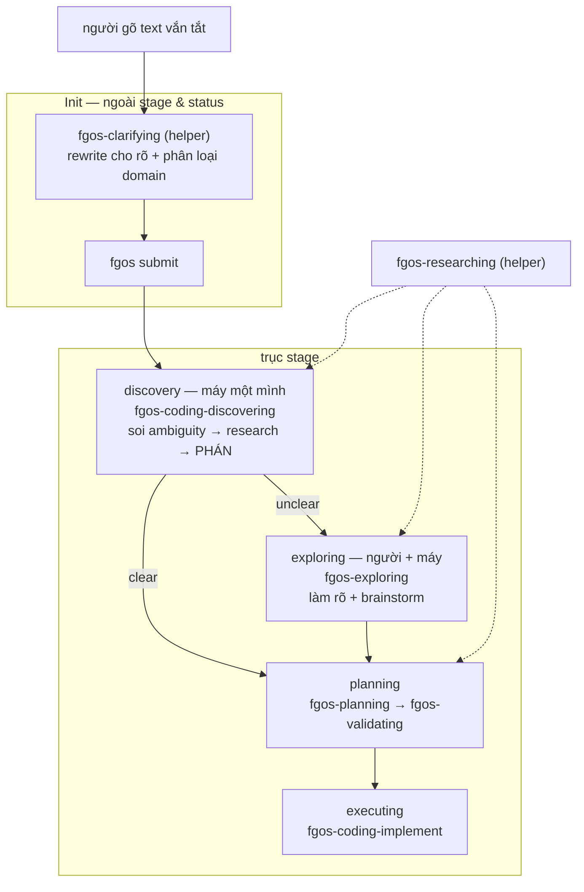

# DISCUSSION — discover: tầng skill, đồ thị stage trước planning

> Chưa có work item nào cho thảo luận này. Vì vậy các D-ID ở §4 **chưa**
> được ghi vào máy qua `fgos decision --id <item-id>` — chúng mới chỉ sống
> trong prose. Việc đầu tiên khi mở item: ghi lại toàn bộ §4 qua verb thật.

## 1. Trạng thái hiện tại

Thảo luận khởi từ một lượt chạy `/fgOS:discover tsk-463` **hỏng**
(2026-08-11). Lượt chạy đó phơi ra hai lớp vấn đề chồng nhau: prose của
skill `discover` dạy sai, và bên dưới nó là một đồ thị stage đã lệch khỏi
ý định thiết kế.

**Đã chốt:** mô hình phân tầng (orchestrator / launcher / driver /
stage-skill / engine verb); `clarifying` là helper ở bước Init, ngoài cả
trục stage lẫn status; `research` là tool, không bao giờ là stage; stage
`discovery` là pha máy-một-mình có quyền phán và cần một skill chủ riêng;
nhánh verdict clear → planning, unclear → exploring; tên skill chủ mới là
`fgos-coding-discovering`; tiền tố domain dùng `coding`.

**Còn mở:** `skillMap` một-stage-một-skill có chứa nổi hai pha
(planning → validating) không; có đổi tên stage `decompose` → `planning`
không; có sinh `decompose-next` song sinh với `discover-next` không; đợt
đổi tên thêm tiền tố `coding-` làm ngay hay tách item riêng.

**Nợ thực địa:** `tsk-1yt` đang kẹt ở stage `discovery`, status `doing`,
mang `verify` do agent tự chế (`npm test`) và một `CONTEXT.md` chưa
commit trên `main`. Xem §7 `{#task-tsk-1yt-cleanup}`.

## 2. Mục tiêu & đề bài

Một work item đi từ lúc người gõ vài chữ vắn tắt cho tới lúc nó trở thành
đơn vị công việc mà máy tự nhận và chạy được — đoạn đường đó hiện đang bị
chia sai chỗ, đặt nhầm người vào ghế chủ, và mô tả sai trong chính prose
mà agent đọc để đi. Đề bài là dựng lại đúng đoạn đường ấy theo đúng hai
ưu tiên sản phẩm cao nhất của repo: **ship faster** và **release con
người**. Cụ thể: agent phải nỗ lực tự khám phá, tự tìm hiểu, tự xét xem
mình đã hiểu rõ và đủ thông tin để làm luôn hay chưa — bước đó không cần
người; nếu đã rõ thì nhảy thẳng sang planning, chỉ khi không rõ mới kéo
người vào một pha collab để cùng làm rõ và brainstorm. Đồng thời, mọi
prose mà agent đọc phải mô tả đúng thứ nó thật sự làm, vì trong đường
chạy thật (launcher tự động của herdr, vòng lặp sweep) **không có người
ngồi cạnh để bắt lỗi** — một câu mô tả sai sẽ được nhân lên theo số item
mà không ai hay.

## 3. Vấn đề rõ / chưa rõ

| Vấn đề | Trạng thái | Ghi chú |
|---|---|---|
| `discover` có làm việc của decompose không | **Rõ** | Không, tuyệt đối. D1 |
| Sau `discover` là stage nào | **Rõ** | clear → planning, unclear → exploring. D2 |
| `research` là stage hay tool | **Rõ** | Tool/helper/capacity. Không bao giờ là stage. D4 |
| `clarifying` đứng ở đâu | **Rõ** | Bước Init, trước khi item tồn tại. Ngoài stage & status. D5 |
| Ai làm chủ stage `discovery` | **Rõ** | Skill chủ mới, không nâng research lên. D7 |
| Tên skill chủ | **Rõ** | `fgos-coding-discovering`. D8 |
| Tiền tố domain: `code` hay `coding` | **Rõ** | `coding` — khớp literal registry. D9 |
| `discover-next` claim+dispatch hay giao xuống | **Rõ** | Giao xuống `/fgOS:discover <id>`. D10 |
| `skillMap` chứa nổi hai pha (planning→validating)? | **Chưa rõ** | Hôm nay chỉ chứa 1 skill/stage; `fgos-validating` không có chỗ đứng |
| Đổi tên stage `decompose` → `planning`? | **Chưa rõ** | anh đã nêu chẩn đoán, chưa ra lệnh. Blast radius chưa đo |
| Có sinh `decompose-next` không | **Chưa rõ** | Hệ quả của D10; nếu không, pool decompose không ai rút |
| Đợt thêm tiền tố `coding-`: ngay hay tách | **Chưa rõ** | anh nghiêng "làm luôn nếu tiện"; đề xuất ngược lại ở §5 vòng 12 |
| `worker-prompt-discovery.txt` phải sửa nhiều không | **Chưa đo** | Chưa đọc nội dung file |
| `submit-assist` có trùng phần rewrite của clarifying? | **Chưa đo** | Nó đang chỉ làm tier/kind/risk |

## 4. Quyết định đã chốt

| ID | Quyết định |
|----|-----------|
| D1 | `discover` **không bao giờ** làm việc split-work của `decompose`. Khẳng định lại tsk-2b0 D1 (hard split, no fallback) và mở rộng lên tầng trên: mọi launcher/picker phía trên cũng phải tôn trọng thế chẻ đôi này, không được gộp lại. |
| D2 | Verdict của pha máy-một-mình quyết định **cạnh đi**, không chỉ đi-hay-dừng: `clear` → bỏ qua exploring, sang thẳng planning; `unclear` → sang `exploring`. `unclear` **không** còn park tại chỗ như hôm nay. |
| D3 | `exploring` là pha collab **người + máy**: cùng làm rõ và brainstorm giải pháp. Trong pha này chắc chắn có dùng helper research — vì một thông tin do người cung cấp có thể chính nó lại gây mơ hồ, buộc agent phải đi tra thêm. |
| D4 | `research` (`fgos-researching`) là **tool / helper / capacity** được các skill gọi. Nó **không phải là một stage nào cả**. Gỡ đăng ký `skillMap.discovery`; file skill giữ nguyên. |
| D5 | `clarifying` là **helper ở bước Init**, được skill/verb `submit` gọi **trước khi item tồn tại**. Việc của nó: (a) đọc text người gõ vắn tắt, phát biểu lại cho rõ và tốt hơn — **chỉ dựa vào thông tin đã submit**, thế giới đóng, không tra cứu; (b) **phân loại domain**. Có đủ dữ kiện của clarifying rồi mới gọi verb `submit`. Vì vậy `clarifying` **không liên quan tới status và stage**. Hệ quả: bỏ hẳn entry `clarify` khỏi `skillMap`, và stage `clarify` biến mất khỏi mảng `stages`. |
| D6 | Stage `discovery` là pha **máy một mình** (dispatch headless được): dựa trên thông tin đã clarify, soi xem còn gì ambiguous, dùng helper research đi tìm bằng chứng / lịch sử liên quan trên codebase hoặc tìm hiểu concept online, **rồi mới tự phán** clear/unclear. |
| D7 | Stage `discovery` cần một **skill chủ riêng**. Không nâng `fgos-researching` lên làm chủ: nó được gọi từ nhiều nơi (discovery, exploring, planning/validating), nếu vừa là tool vừa là chủ thì cùng một file lúc ghi state lúc không tuỳ ai gọi — đúng kiểu nhập nhằng đang gỡ. Định nghĩa "skill chủ": skill nằm trong `skillMap[stage]` và **tự gọi engine verb** để kết thúc stage; helper thì trả verdict về cho caller và không bao giờ ghi state. |
| D8 | Tên skill chủ mới: **`fgos-coding-discovering`** (không phải `fgos-discover`). Lý do: `fgos-discover` khác engine verb `fgos discover` đúng **một ký tự** (gạch vs cách) — mắt không phân biệt được, `rg` khớp cả hai, và agent sẽ nhập hai thứ làm một; khuôn gerund cũng là khuôn của cả chuỗi stage skill. |
| D9 | Tiền tố domain dùng **`coding`**, không phải `code`: nó là literal của registry (`DOMAINS.coding`, `DEFAULT_DOMAIN = 'coding'`), nên tên skill suy ra được cơ học từ trường `domain`; đã có domain khác đăng ký thật (`synthetic`, `triage`) nên tiền tố là phân biệt thật; và `code-` mơ hồ giữa "nhãn domain" với "tân ngữ của động từ" (`fgos-code-implement` = "implement code"). `fgos-clarifying` **không** mang tiền tố — nó chạy trước khi domain tồn tại và chính nó là thứ phân loại domain. |
| D10 | `discover-next` (launcher tầng pick) phải **giao xuống** `/fgOS:discover <id>`, không được tự claim + tự dispatch `fgos-coding-driving` + tự tính ceiling như hôm nay. Mỗi tầng một việc; tầng dưới phải là điểm hội tụ duy nhất. |

## 5. Q&A log

**2026-08-11 — vòng 1-3 (lượt chạy hỏng).**
`/fgOS:discover tsk-463` bị chặn: tsk-463 phụ thuộc tsk-1yt chưa xong.
Chuyển sang tsk-1yt. Session **nạp sai stage-skill** — gọi thẳng
`fgos-exploring` thay vì tra registry (`skillForStage(coding,'clarify')` =
`fgos-clarifying`), rồi **hỏi người** một câu mà scout đã trả lời sẵn.
anh chặn: *"mục tiêu thiết kế của discover là không hỏi người."*

**vòng 4-5 (tự đánh giá).**
Kiểm chứng ra 5 vi phạm của lượt chạy: nạp sai skill; hỏi thừa; **báo cáo
sai** ("reached ceiling at decompose" trong khi item thật ở `discovery`);
tự chế `verify` (`npm test`) đè lên placeholder thay vì snapshot; không
commit `CONTEXT.md`, viết trên `main`, không có branch `fgw/tsk-1yt`.

**vòng 6 (chuẩn chấm).**
anh: *"nếu đạt sẽ diễn giải đúng để em không thể nào sai."* Chấm lại theo
L5 DoD (stranger agent, no chat history): prose là interface cho máy, đọc
rồi làm sai thì prose hỏng. Tìm ra defect thật trong
`plugins/fgOS/skills/discover/SKILL.md`: nhắc `fgos-exploring` 4 lần
(3 lần ở thể **khẳng định**, có cả frontmatter `description`), nhắc
`fgos-clarifying` **0 lần**.

**vòng 7 (launcher).**
anh sửa mô hình tầng của em: `discover-loop` là orchestrator (quay lại,
không dừng); `discover-next` là launcher có pick (chọn 1 id rồi giao
xuống); `/fgOS:discover` vẫn là launcher (fire & forget); herdr-plugin là
orchestrator khác ở mức terminal. Kiểm chứng: ADR `0028` đã pin sẵn từ
vựng này (**launcher** = chọn 1, đứng lên, bước ra hoàn toàn, *"KHÔNG CẦN
soul"*; **orchestrator** = điều phối N đơn vị theo thời gian, đang để
dành). `herdr-plugin/src/pick.rs:17,130` gọi thẳng
`/fgOS:discover <id> --autoClose`, có cả nút bấm tay lẫn auto-launcher
(tsk-2ja). → Em rút lại kết luận "discover là cửa ít dùng": nó là **điểm
hội tụ đáy tháp**.

**vòng 8 (`discover-next` gọi decompose?).**
anh: *"sao có khái niệm discover-next gọi decompose vậy?"* Truy ra: đó là
**di sản trước tsk-2b0**. `discover` từng ôm cả hai stage
(`discover-pool.mjs:1-2` viết cho *"run `fgos discover`/`fgos decompose`
on"*); tsk-2b0 chẻ đôi tầng đáy nhưng **không chẻ tầng picker**. Triệu
chứng: nhánh `if` tính ceiling trong `discover-next`, và không hề có
`decompose-next`. → D10.

**vòng 9 (exploring gap).**
anh: sau discover chưa chắc là decompose; gọi đúng tên thì là **planning**.
clear → bỏ qua exploring → planning; unclear → exploring. Kiểm chứng:
`skillMap.decompose = 'fgos-planning'` (stage tên theo **kết cục**, skill
là planning); `nextDiscoveryEdge` chọn cạnh **thuần theo stage**, verdict
không tham gia; cả 4 cạnh anh cần **đã tồn tại hợp lệ** trong FSM
(`clarify→decompose` skip, `clarify→exploring`) — chỉ hàm chọn cạnh không
dùng. → D2.

**vòng 10 (discovery là gì).**
Phát hiện lớn: khối **DISCOVERY DISPATCH** (`loop.mjs:1060-1140`, tsk-5mj)
**đã xây xong** — worktree + `spawnWorker` + `worker-prompt-discovery.txt`
+ `RESEARCH.md`, máy một mình, headless. Nhưng comment ghi rõ: *"there is
no verdict to gate the transition on here… the item **unconditionally
advances** `discovery -> exploring`"*. Tức máy chạy xong pass nghiên cứu
đầy đủ rồi **vẫn ném hết cho người**. Và thứ tự đang **ngược**: phán ở
`clarify` **trước**, nghiên cứu ở `discovery` **sau**, rồi không phán lại.
→ Em rút lại phép đánh đổi giả ("giữ stage = release human / bỏ stage =
mất dispatch headless"): mô hình anh giữ nguyên dispatch headless **và**
thêm nhánh skip.

**vòng 11 (clarify là helper).**
anh: clarifying được submit gọi, chỉ dựa text đã submit, phát biểu lại cho
rõ, **cộng phân loại domain**; xong mới gọi verb submit; nên nó **không
liên quan status/stage**. Kiểm chứng: `fgos-clarifying/SKILL.md` D14 đã có
sẵn phần rewrite; `stepMap` comment đã chừa sẵn ô *"**Init**… happen
outside `stage` entirely (**intake before any stage exists**)"*;
`classify.mjs` là *"deterministic… **no model/LLM call**"* và **không phân
loại domain** ở đâu cả. → Em sửa một báo cáo sai của mình: SKILL.md của
`fgos-clarifying` (tự khai *"Runs at stage `discovery`"*) **không sai** —
registry mới là chỗ lệch. → D5.

**vòng 12 (tên).**
`fgos-discover` vs `fgos-discovering` → D8. Tiền tố `code` vs `coding` →
D9. anh đính chính: `fgos-executing` → `fgos-code-implement` đổi vì
**nghĩa** (xây code, không phải "thực thi" mơ hồ), `code` ở đó là tân ngữ
chứ không phải nhãn domain — nên tiền lệ tiền tố thật ra là **2/2** nghiêng
`coding`. Đo chi phí: `skillMap` value **là `capacityId`**
(`dispatch.mjs:149`), nhưng `.fgos/config.json` → `capacities` hiện
**rỗng**, nên rủi ro trong repo bằng 0; chi phí thật là chuẩn D1 của lần
rename trước (*"full rewrite… including dated historical snapshots"*)
nhân cho 6 skill. Đề xuất (chưa được chốt): tách đợt tiền tố thành item
riêng, theo priority #4 *"Polish Sau DoD — không mở scope"*.

## 6. Thiết kế đã chốt {#design}

Một work item đi qua ba vùng tách bạch: **Init** (trước khi item tồn tại),
**trục stage** (vòng đời của item), và một tập **helper** không thuộc vùng
nào — được gọi từ bên trong bất kỳ skill nào cần.

**Init** không có stage, không có status, vì chưa có item nào để mang hai
thứ đó. Người gõ một đoạn text vắn tắt, câu có thể không hoàn chỉnh. Helper
`fgos-clarifying` đọc **chỉ đoạn text ấy** — thế giới đóng, không tra
codebase, không tra online — rồi phát biểu lại cho rõ và tốt hơn, đồng thời
phân loại `domain`. Có đủ dữ kiện đó mới gọi verb `submit`. Item vì vậy
**sinh ra đã rõ, đã có domain**, không cần một lần rewrite-tại-chỗ sau này
(D5).

**Stage `discovery`** là pha **máy một mình** — dispatch cho worker headless
được, không cần người ngồi. Skill chủ `fgos-coding-discovering` soi xem
thông tin đã clarify còn chỗ nào ambiguous, gọi helper `fgos-researching`
bao nhiêu lần tuỳ nhu cầu (bằng chứng và lịch sử liên quan trên codebase,
hoặc concept trên online), ghi `RESEARCH.md`, **rồi tự phán**. Verdict của
nó quyết định **cạnh đi**, không chỉ đi-hay-dừng (D2, D6): `clear` nhảy
thẳng sang planning, bỏ qua người hoàn toàn; `unclear` mới sang `exploring`.

**Stage `exploring`** là pha **người + máy**: cùng làm rõ và brainstorm giải
pháp. Nó cũng dùng helper `fgos-researching` — vì chính thông tin người vừa
cung cấp có thể lại gây mơ hồ, buộc phải tra thêm (D3). Xong pha này thì
sang planning.

**Helper** (`fgos-clarifying`, `fgos-researching`) không bao giờ ghi state
item. Chúng trả verdict/finding về cho skill gọi chúng; skill chủ mới là
thứ tự tay gọi engine verb để kết thúc stage (D4, D7). Đó cũng là phép thử
cơ học phân biệt chủ với helper: mở file ra, có lệnh gọi `fgos <verb>`
chuyển stage không.

**Phân tầng gọi nhau** — mỗi tầng một việc, và **mỗi tầng phải chạy độc lập
được**, vì các orchestrator khác nhau nhập cuộc ở độ sâu khác nhau (herdr có
thể tự pick rồi gọi `discover <id>`, hoặc bỏ qua pick mà gọi
`discover-next`):

| Tầng | Việc duy nhất | Thành viên |
|---|---|---|
| Orchestrator | quay lại, không dừng, giữ stop-rule | `discover-loop`, herdr-plugin, `fgos-runner --watch` |
| Launcher có pick | chọn 1 id đúng nhất rồi **giao xuống** | `discover-next` |
| Launcher fire & forget | đã có id → bắn, buông tay | `/fgOS:discover`, `/fgOS:decompose` |
| Driver | vòng stage cho 1 item | `fgos-coding-driving` |
| Skill chủ | làm việc thật ở 1 stage, gọi engine verb | `fgos-coding-discovering`, `fgos-exploring`, `fgos-planning`, … |
| Engine verb | cửa ghi duy nhất | `fgos discover` / `decompose` / `return` |



**Hệ quả trên code hiện tại.** Mất: entry `skillMap.clarify`; stage
`clarify` khỏi `stages`; entry `skillMap.discovery = 'fgos-researching'`;
hai cạnh `clarify→discovery` và `discovery→exploring`; nhánh discovery
trong `nextDiscoveryEdge`; và **toàn bộ khối ngoại lệ
`## Discovery and exploring stages`** trong `fgos-coding-driving` cùng red
flag của nó — khối đó là **triệu chứng của một stage bị giao cho helper làm
chủ**, có chủ thật thì nó tự tan. Giữ nhưng đổi đích: khối DISCOVERY
DISPATCH ở `loop.mjs` quét stage đã gộp và thay `unconditionally advance`
bằng verdict. Giữ nguyên: file `fgos-researching`, chỉ gỡ đăng ký stage.

## 7. Danh mục hạng mục / task {#tasks}

### Sửa prose skill `discover` {#task-discover-skill-prose-fix}

**Mục tiêu.** `plugins/fgOS/skills/discover/SKILL.md` hiện dạy sai: nhắc
`fgos-exploring` 4 lần (3 lần ở thể khẳng định, gồm cả frontmatter
`description` — dòng được nạp vào **mọi** session), nhắc `fgos-clarifying`
0 lần. Thêm: dòng 32-33 khẳng định *"discover errors if called on an item
that isn't at stage `clarify`"* — **sai sự thật**, `nextDiscoveryEdge` nhận
cả `clarify`/`discovery`/`exploring`. Và step 4 bảo *"relay its stop reason
exactly"* mà không có bước đọc lại state thật — đó là chỗ duy nhất trong cả
hệ bảo **tin narration**, và là lý do lượt chạy hỏng báo cáo sai được.

Phải bổ sung một khối khai báo **tầng và caller** (thiếu hoàn toàn hôm nay):
skill này là launcher fire-and-forget; caller là auto-launcher của herdr
(luôn kèm `--autoClose`), `discover-next` sau khi pick, hiếm khi là người
gõ tay; **không có người ngồi xem**.

**§6 liên quan.** Bảng phân tầng; định nghĩa skill chủ vs helper.
**D-ID.** D1, D7, D8, D10.
**Quan hệ.** Phải làm cùng `{#task-discover-next-delegate}` — sửa một file
mà bỏ file kia thì hai cửa vào cùng một việc lại lệch tiếp.
**Verify nháp.**
```
npm test && grep -q "fgos-coding-discovering" plugins/fgOS/skills/discover/SKILL.md && ! grep -q "Socratic reasoning (fgos-exploring)" plugins/fgOS/skills/discover/SKILL.md
```

### Skill chủ cho stage discovery {#task-discovery-stage-owner}

**Mục tiêu.** Tạo `fgos-coding-discovering` và trỏ `skillMap.discovery` vào
nó. Nó gọi helper `fgos-researching`, ghi `RESEARCH.md`, tự phán
clear/unclear, tự gọi `fgos discover --verdict`. Gỡ khối ngoại lệ
`## Discovery and exploring stages` khỏi `fgos-coding-driving`.

**§6 liên quan.** Đoạn "Stage `discovery`"; đoạn "Helper".
**D-ID.** D4, D6, D7, D8, D9.
**Quan hệ.** Chặn `{#task-verdict-branch-edges}` — phải có ai đó phán thì
mới có verdict để rẽ nhánh.
**Verify nháp.**
```
npm test && test -f .claude/skills/fgos-coding-discovering/SKILL.md && grep -q "discovery: .fgos-coding-discovering." src/state/workflow-stage-graphs.mjs && ! grep -q "Discovery and exploring stages" .claude/skills/fgos-coding-driving/SKILL.md
```

### Nhánh verdict clear/unclear {#task-verdict-branch-edges}

**Mục tiêu.** `nextDiscoveryEdge` chọn cạnh **theo verdict**, không thuần
theo stage: `clear` → planning (bỏ qua exploring), `unclear` → exploring
(thay vì park tại chỗ). Cả hai cạnh đã hợp lệ sẵn trong FSM. Khối DISCOVERY
DISPATCH ở `loop.mjs` thay `unconditionally advance` bằng verdict thật.

**§6 liên quan.** Đoạn "Stage `discovery`"; sơ đồ Mermaid.
**D-ID.** D2, D3, D6.
**Quan hệ.** Chờ `{#task-discovery-stage-owner}`. Đây là **DoD của cả
đợt** — mọi task còn lại là dọn đường hoặc polish.
**Verify nháp.** Cần test mới khẳng định cả hai nhánh; nháp:
```
npm test && node --test test/intake/discovery.test.mjs
```

### Đưa clarifying về bước Init {#task-clarifying-to-init}

**Mục tiêu.** Gỡ `fgos-clarifying` khỏi `skillMap`; bỏ stage `clarify` khỏi
`stages`. Verb/skill `submit` gọi nó **trước** khi tạo item; nó rewrite text
và phân loại `domain` (năng lực **đang thiếu hoàn toàn** — `classify.mjs`
không đụng domain, `submit-assist` chỉ làm tier/kind/risk). Tách phần
"phán clear/unclear" hiện nằm trong nó sang skill chủ discovery.

**§6 liên quan.** Đoạn "Init".
**D-ID.** D5, D9 (không mang tiền tố `coding-`).
**Quan hệ.** Độc lập với nhánh verdict, nhưng cùng đụng `stages`/`skillMap`
với `{#task-discovery-stage-owner}` — **không chạy song song hai task này**.
**Verify nháp.**
```
npm test && ! grep -q "clarify: .fgos-clarifying." src/state/workflow-stage-graphs.mjs
```

### discover-next giao xuống discover {#task-discover-next-delegate}

**Mục tiêu.** `discover-next` thôi tự claim + tự dispatch driver + tự tính
ceiling; nó pick xong thì gọi `/fgOS:discover <id>`. Kèm quyết định còn mở:
pool `decompose` do ai rút (sinh `decompose-next`, hay để `discover-next`
route sang `/fgOS:decompose`).

**§6 liên quan.** Bảng phân tầng.
**D-ID.** D1, D10.
**Quan hệ.** Làm cùng `{#task-discover-skill-prose-fix}`.
**Verify nháp.**
```
npm test && grep -q "fgOS:discover" plugins/fgOS/skills/discover-next/SKILL.md && ! grep -q "ceiling: stage:executing" plugins/fgOS/skills/discover-next/SKILL.md
```

### Dọn nợ tsk-1yt {#task-tsk-1yt-cleanup}

**Mục tiêu.** `tsk-1yt` kẹt ở `discovery`/`doing`: runner chỉ quét `todo`
(*"Only `todo` is touched (R15)"*) nên không worker nào đụng, mà cũng không
session nào lái — đúng ca *"stranded at `discovery` forever"* mà red flag
cảnh báo. Thêm: `verify` là `npm test` do agent tự chế đè lên placeholder,
và `docs/history/tsk-1yt-verify-write-time-shell-validation/CONTEXT.md` còn
untracked trên `main`, không có branch `fgw/tsk-1yt`.

**§6 liên quan.** —— (nợ thực địa, không thuộc thiết kế).
**D-ID.** —— .
**Quan hệ.** Làm trước hoặc độc lập; đừng để nó lẫn vào đợt redesign.
**Verify nháp.** Quyết định thủ công (giữ hay bỏ CONTEXT.md, đặt lại verify
thật cho item), không có lệnh máy nào chứng minh được.

### Còn treo, chưa thành task {#task-open}

- `skillMap` một-stage-một-skill vs hai pha `planning` → `validating`
- đổi tên stage `decompose` → `planning` (blast radius chưa đo)
- đợt thêm tiền tố `coding-` cho 5 skill còn lại (`exploring`, `planning`,
  `validating`, `compounding`, `code-implement` → `coding-implement`) —
  chi phí thật là chuẩn *"full rewrite… including dated historical
  snapshots"* nhân 6, không phải capacityId (`capacities` đang rỗng)
- đọc `worker-prompt-discovery.txt` để đo phần "dạy worker phán verdict"
- kiểm `submit-assist` có trùng phần rewrite của clarifying không
