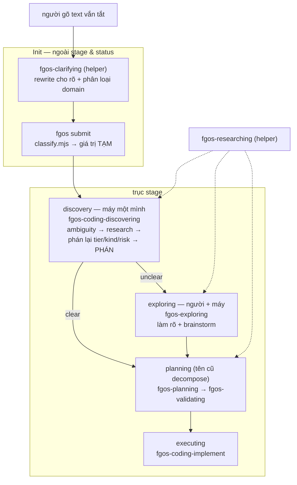

# DISCUSSION — discover: tầng skill, đồ thị stage trước planning

> Cây work item đã mở (xem §1). Toàn bộ D-ID ở §4 đã được ghi vào máy qua
> `fgos decision --id tsk-2mt`, nên một session lạnh đọc được chúng bằng
> `fgos show tsk-2mt` mà không cần đọc đúng file prose này.

## 1. Trạng thái hiện tại

Thảo luận khởi từ một lượt chạy `/fgOS:discover tsk-463` **hỏng**
(2026-08-11). Lượt chạy đó phơi ra hai lớp vấn đề chồng nhau: prose của
skill `discover` dạy sai, và bên dưới nó là một đồ thị stage đã lệch khỏi
ý định thiết kế.

**Đã chốt (D1-D14):** mô hình phân tầng (orchestrator / launcher / driver /
skill chủ / engine verb); `clarifying` là helper ở bước Init, ngoài cả trục
stage lẫn status; `research` là tool, không bao giờ là stage; stage
`discovery` là pha máy-một-mình có quyền phán và cần skill chủ riêng
(`fgos-coding-discovering`); nhánh verdict clear → planning, unclear →
exploring; tiền tố domain dùng `coding`; đổi tên **cả họ** `decompose` →
`plan`; phân loại `tier`/`kind`/`risk` chuyển xuống discovery; retire
capacity `submit-assist-classify`; giao hàng theo **một task cha gom hết
con**.

**Còn mở:** chỉ còn **một** — `skillMap` nhiều-pha-một-stage (D16): tạm
dùng phương án A (giữ chuỗi prose), B là hướng đã nghiêng nhưng chưa đủ
chín để làm trong cây task này.

**Cây đã mở (2026-08-11):** cha `tsk-2mt` · con 1 `tsk-403` · con 2
`tsk-qod` · con 3 `tsk-tku` · con 4 `tsk-2yo` · con 5 `tsk-30v` · con 6
`tsk-lya` · item thảo luận B `tsk-15u` (ngoài cây). D1-D16 đã ghi vào máy
trên `tsk-2mt`. `deps` nối theo thứ tự thi công nên engine tự cưỡng chế:
403 → qod → tku → {2yo, 30v}, và 403 → lya.

**Nợ thực địa:** `tsk-1yt` đang kẹt ở stage `discovery`, status `doing`,
mang `verify` do agent tự chế (`npm test`) và một `CONTEXT.md` chưa
commit trên `main`. Xem §7 `{#task-tsk-1yt-cleanup}`.

## 2. Mục tiêu & đề bài

Một work item đi từ lúc người gõ vài chữ vắn tắt cho tới lúc nó trở thành
đơn vị công việc mà máy tự nhận và chạy được — đoạn đường đó hiện đang bị
chia sai chỗ, đặt nhầm người vào ghế chủ, và mô tả sai trong chính prose
mà agent đọc để đi. Đề bài là dựng lại đúng đoạn đường ấy theo đúng hai
ưu tiên sản phẩm cao nhất của repo: **ship faster** và **release con
người**. Cụ thể: agent phải nỗ lực tự khám phá, tự tìm hiểu, tự xét xem
mình đã hiểu rõ và đủ thông tin để làm luôn hay chưa — bước đó không cần
người; nếu đã rõ thì nhảy thẳng sang planning, chỉ khi không rõ mới kéo
người vào một pha collab để cùng làm rõ và brainstorm. Đồng thời, mọi
prose mà agent đọc phải mô tả đúng thứ nó thật sự làm, vì trong đường
chạy thật (launcher tự động của herdr, vòng lặp sweep) **không có người
ngồi cạnh để bắt lỗi** — một câu mô tả sai sẽ được nhân lên theo số item
mà không ai hay.

## 3. Vấn đề rõ / chưa rõ

| Vấn đề | Trạng thái | Ghi chú |
|---|---|---|
| `discover` có làm việc của decompose không | **Rõ** | Không, tuyệt đối. D1 |
| Sau `discover` là stage nào | **Rõ** | clear → planning, unclear → exploring. D2 |
| `research` là stage hay tool | **Rõ** | Tool/helper/capacity. Không bao giờ là stage. D4 |
| `clarifying` đứng ở đâu | **Rõ** | Bước Init, trước khi item tồn tại. Ngoài stage & status. D5 |
| Ai làm chủ stage `discovery` | **Rõ** | Skill chủ mới, không nâng research lên. D7 |
| Tên skill chủ | **Rõ** | `fgos-coding-discovering`. D8 |
| Tiền tố domain: `code` hay `coding` | **Rõ** | `coding` — khớp literal registry. D9 |
| `discover-next` claim+dispatch hay giao xuống | **Rõ** | Giao xuống `/fgOS:discover <id>`. D10 |
| Đổi tên stage `decompose` → `planning` | **Rõ** | Đổi **cả họ**, không nửa vời. D11 |
| Pool decompose ai rút | **Rõ** | `plan-next` + `plan-loop`, sinh ra đã đúng tên. D11 |
| `submit-assist` đang làm gì | **Rõ** | 3 lớp; xem D12/D13 |
| Phân loại tier/kind/risk nằm ở đâu | **Rõ** | Xuống `discovery`, sau research. D12 |
| Capacity `submit-assist-classify` | **Rõ** | Retire, không migration. D13 |
| Chẻ nhỏ task hay gom | **Rõ** | Một cha gom hết con. D14 |
| `src/intake/decompose.mjs` có đổi tên file không | **Rõ** | Có, `plan.mjs`. Gộp vào con 1. D15 |
| Đợt thêm tiền tố `coding-`: ngay hay tách | **Rõ** | Gộp luôn vào con 1. D15 |
| `skillMap` nhiều pha một stage | **Tạm A, hướng B** | A giữ chuỗi prose; B cần dấu mốc pha + chỉ tuần tự. D16 |
| `worker-prompt-discovery.txt` phải sửa nhiều không | **Đã đo** | Con 3 không cần đụng; con 5 nhỏ hơn nhiều; con 4 to hơn. D17 ghi chi tiết |
| 4 item đang đứng trên stage `decompose` lúc rename | **Rõ** | Giữ `decompose` làm alias drain-only. D18 |
| 4 skill platform có mang tiền tố không | **Rõ** | Không bao giờ. D19 |

## 4. Quyết định đã chốt

| ID | Quyết định |
|----|-----------|
| D1 | `discover` **không bao giờ** làm việc split-work của `decompose`. Khẳng định lại tsk-2b0 D1 (hard split, no fallback) và mở rộng lên tầng trên: mọi launcher/picker phía trên cũng phải tôn trọng thế chẻ đôi này, không được gộp lại. |
| D2 | Verdict của pha máy-một-mình quyết định **cạnh đi**, không chỉ đi-hay-dừng: `clear` → bỏ qua exploring, sang thẳng planning; `unclear` → sang `exploring`. `unclear` **không** còn park tại chỗ như hôm nay. |
| D3 | `exploring` là pha collab **người + máy**: cùng làm rõ và brainstorm giải pháp. Trong pha này chắc chắn có dùng helper research — vì một thông tin do người cung cấp có thể chính nó lại gây mơ hồ, buộc agent phải đi tra thêm. |
| D4 | `research` (`fgos-researching`) là **tool / helper / capacity** được các skill gọi. Nó **không phải là một stage nào cả**. Gỡ đăng ký `skillMap.discovery`; file skill giữ nguyên. |
| D5 | `clarifying` là **helper ở bước Init**, được skill/verb `submit` gọi **trước khi item tồn tại**. Việc của nó: (a) đọc text người gõ vắn tắt, phát biểu lại cho rõ và tốt hơn — **chỉ dựa vào thông tin đã submit**, thế giới đóng, không tra cứu; (b) **phân loại domain**. Có đủ dữ kiện đó rồi mới gọi verb `submit`. Vì vậy `clarifying` **không liên quan tới status và stage**. Hệ quả: bỏ hẳn entry `clarify` khỏi `skillMap`, và stage `clarify` biến mất khỏi mảng `stages`. |
| D6 | Stage `discovery` là pha **máy một mình** (dispatch headless được): dựa trên thông tin đã clarify, soi xem còn gì ambiguous, dùng helper research đi tìm bằng chứng / lịch sử liên quan trên codebase hoặc tìm hiểu concept online, **rồi mới tự phán** clear/unclear. |
| D7 | Stage `discovery` cần một **skill chủ riêng**. Không nâng `fgos-researching` lên làm chủ: nó được gọi từ nhiều nơi, nếu vừa là tool vừa là chủ thì cùng một file lúc ghi state lúc không tuỳ ai gọi. Định nghĩa "skill chủ": skill nằm trong `skillMap[stage]` và **tự gọi engine verb** để kết thúc stage; helper thì trả verdict về cho caller và không bao giờ ghi state. |
| D8 | Tên skill chủ mới: **`fgos-coding-discovering`** (không phải `fgos-discover`). Lý do: `fgos-discover` khác engine verb `fgos discover` đúng **một ký tự** (gạch vs cách) — mắt không phân biệt được, `rg` khớp cả hai, và agent sẽ nhập hai thứ làm một; khuôn gerund cũng là khuôn của cả chuỗi stage skill. |
| D9 | Tiền tố domain dùng **`coding`**, không phải `code`: nó là literal của registry (`DOMAINS.coding`, `DEFAULT_DOMAIN = 'coding'`), nên tên skill suy ra được cơ học từ trường `domain`; đã có domain khác đăng ký thật (`synthetic`, `triage`); và `code-` mơ hồ giữa "nhãn domain" với "tân ngữ của động từ" (`fgos-code-implement` = "implement code", **không** phải một thể hiện của quy ước tiền tố). `fgos-clarifying` **không** mang tiền tố — nó chạy trước khi domain tồn tại và chính nó là thứ phân loại domain. |
| D10 | `discover-next` (launcher tầng pick) phải **giao xuống** `/fgOS:discover <id>`, không được tự claim + tự dispatch `fgos-coding-driving` + tự tính ceiling như hôm nay. Mỗi tầng một việc; tầng dưới phải là điểm hội tụ duy nhất. |
| D11 | Đổi tên **cả họ**, không nửa vời: stage `decompose` → `planning`, engine verb `fgos decompose` → `fgos plan`, launcher `/fgOS:decompose` → `/fgOS:plan`, cộng cặp mới `plan-next` + `plan-loop` (bốn cặp `<root>-next`/`<root>-loop` đã có: cleanup, discover, merge, retro — **chưa từng có cặp nào cho decompose**, pool đó vẫn ăn ké `discover-next`). Được-ăn-cả-ngã-về-không vì họ decompose hôm nay **đang nhất quán nội bộ**, chỉ nhất quán quanh chữ sai; đổi mỗi stage sẽ tái tạo đúng cái lệch verb-vs-stage đã gây ra cả phiên này. **Giá trị verdict `decompose` GIỮ NGUYÊN** — `fgos plan --verdict decompose|pass-through` đọc còn đúng hơn: chữ đó là tên một **kết cục**, không phải tên một chặng. Rename này là **tiền đề**, phải đi TRƯỚC việc chẻ picker, để `plan-next`/`plan-loop` sinh ra đã đúng tên. |
| D12 | Phân loại `tier`/`kind`/`risk` chuyển xuống stage **`discovery`**, sau research. Lý do gốc: *"khó hay không khó"* **không thể phán từ text submit** — muốn biết khó phải nhìn codebase, tức phải research xong. Hôm nay nó bị phán ở chỗ chưa ai đi tra gì. Hệ quả: (a) `src/intake/classify.mjs` **giữ nguyên** nhưng được định nghĩa lại thành *giá trị tạm lúc sinh* (verb `submit` vẫn phải tạo được item hợp lệ cho shell/cron/agent khác); (b) **step 6 của `/fgOS:submit` chẻ đôi và rời đi cả hai đầu** — phần clarify lên Init (D5), phần phán tier/kind/risk xuống discovery — nên skill submit **mất hẳn step 6** kèm cái gate "no-soul" của nó, quay về đúng bản chất wrapper mỏng; (c) xoá **vết nứt hai tầng chất lượng**: hôm nay submit-có-soul được clarify + phán lại, submit-không-soul kẹt đoán keyword vĩnh viễn — kể cả item do runner **tự sinh** ở `loop.mjs:617` từ khối `fgos-discovered`. Skill chủ discovery kế thừa nguyên luật *"Never hardcode the value set here"*: đọc từ vựng từ `getDomain(item.domain).classification`. |
| D13 | Retire capacity `submit-assist-classify`: `fgos tool remove --name submit-assist-classify`. **Thuần retire, không migration** — capacity chỉ là mô tả *cách gọi* (`kind: cli`, `command: agy`), không chứa phán đoán: thư mục `docs/history/agent-executor-submit-assist-classify/` chỉ có `CONTEXT.md` + `plan.md`, không prompt/template/tiêu chí nào. Không code nào query `--capability classification` (mọi kết quả grep đều là `getDomain(...).classification` — **từ vựng của domain**, khái niệm khác, chỉ trùng chữ). Lý do retire không phải "nó đang không chạy" (dù `capacities` rỗng nên tốn 0đ) mà là: khi phân loại xuống discovery thì **đã có một worker đang chạy với đủ context** — spawn thêm provider ngoài để phán lại là tái tạo cái worker đang cầm, đúng lãng phí mà **tsk-1ni** tìm ra và **tsk-1x3 D9** đã dùng để khai tử `judgeDiscovery`'s blind cli-spawn. Giữ nguyên decision record, không xoá. |
| D14 | Giao hàng theo **một task cha gom hết task con**, không chẻ nhỏ độc lập — chẻ rời sẽ quên. Engine đã có sẵn cơ chế đúng ý này: luật lineage (`hasOpenDescendant`, `frontier.mjs`) neo cha lại chừng nào còn con mở, và `fgos-coding-driving` báo "anchored by open children" rồi dừng. Nghĩa là "quên" bị chặn bằng máy, không bằng trí nhớ. |
| D15 | Gộp vào con 1 (`{#task-plan-family-rename}`) luôn hai việc: đổi tên file `src/intake/decompose.mjs` → `plan.mjs`, và **thêm tiền tố `coding-`** cho 5 skill còn lại (`exploring`, `planning`, `validating`, `compounding`, `code-implement` → `coding-implement`). Lý do gộp: cả ba đều là cùng một loại thao tác (rename xuyên repo theo chuẩn *"full rewrite… including dated historical snapshots"*) — tách ra thành 3 đợt là quét toàn repo 3 lần cho cùng một việc. Rủi ro capacityId bằng 0 (`.fgos/config.json` → `capacities` rỗng). |
| D16 | **Tạm dùng phương án A** cho chuyện nhiều pha trong một stage: giữ chuỗi prose `fgos-planning` → `fgos-validating`, chấp nhận `skillMap` không phản ánh đúng ai kết thúc stage `planning`. **Không** nằm trong cây task này. Nhưng **hướng đã nghiêng là B** (`skillMap` nhận danh sách pha), với ba điều kiện đã phân tích: (1) chỉ dùng cho quan hệ **chuỗi pha** (hai đồng cấp, mỗi đứa gate+artifact riêng, đứa cuối thoát stage) — **không** dùng cho quan hệ **gọi helper** (chủ gọi tool rồi vẫn chịu trách nhiệm, như `fgos-researching`), thứ vốn không cần registry; (2) **chỉ tuần tự** — song song ở lại trục item (children + `fgos-fanout` + footprint conflict đã có sẵn và đã an toàn), vì hai skill trên cùng một item chia sẻ cả event-log lock lẫn artifact, còn hai item thì độ chồng lấn đã được theo dõi; (3) phải có **dấu mốc hoàn thành pha**, nếu không driver sẽ chạy lại pha 1 — hiểm hoạ có thật, đã ghi trong `fgos-validating/SKILL.md:248` (*"unconditional… would create duplicate positional-id children while orphaning the real ones"*), và fail-safe no-progress cũng nổ oan vì stage không đổi giữa hai pha. Dấu mốc đó **đã có sẵn**: gate record mang tên pha (`fgos gate-approve --gate <name>`, bảng `view.gates[id]`) — pha nào đã có gate thì bỏ qua, an toàn theo cấu tạo. Căn cứ cho B không phải sở thích: priority #2 (`AGENTS.md`) đã ra luật *"stage/skill vì vậy phải chia nhỏ, mịn, **mỗi mảnh park/tiến độc lập**"*, mà A không thực hiện được — validating park thì cả stage park. Thêm bằng chứng trục stage đang căng: `discovery`/`exploring` là stage **không có base-workflow step nào**, được xử lý *"outside the 5-step vocabulary"* — tức repo đã dùng stage như phase một cách ứng biến vì thiếu cơ chế phase. **Câu để quyết khi nào đủ chín:** có bao giờ muốn dừng / resume / báo cáo tại ranh giới giữa hai pha không? |
| D17 | Chỉnh phạm vi sau khi đọc `worker-prompt-discovery.txt` (bài tập còn nợ ở vòng trước): **con 3 nhỏ hơn** — prompt trỏ `{skillPath}` resolve qua `skillForStage`, nên đổi `skillMap.discovery` là worker tự nạp skill mới, KHÔNG cần sửa template. **Con 5 nhỏ hơn nhiều** — tsk-4v6 đã nối dây verdict xong: worker emit khối ```fgos-verdict``` với `{clear, verify}` hoặc `{clear:false, question}`, và runner gọi `resolveDiscovery(dir, id, config, 'runner', callerVerdict)` (`loop.mjs:1132-1138`), tức verdict ĐÃ được áp dụng; phần còn thiếu chỉ là `nextDiscoveryEdge` chọn cạnh. Kèm sửa comment stale ở `loop.mjs:1068-1074` vẫn viết *"unconditionally advances"* trong khi code đã gate theo verdict. **Con 4 to hơn** — đường headless cần mở rộng schema khối `fgos-verdict` để worker báo `tier`/`kind`/`risk` dạng DATA cho runner áp dụng, vì worker bị cấm gọi `fgos`; đường tương tác thì skill tự gọi `fgos edit`. |
| D18 | Lúc rename, giữ **`decompose` làm alias legacy chỉ-để-rút-cạn**: vẫn có mặt trong `stages` + `skillMap` + giữ cạnh ra của nó, **nhưng KHÔNG có trong `stepMap`** — đúng cách `discovery`/`exploring` đang được xử lý (*"no base-workflow step of their own"*), nên `stageForStep` giữ nguyên bất biến một-stage-một-step. Lý do: **4 item đang MỞ đứng trên stage đó** — `tsk-42i` (blocked), `tsk-3at` (awaiting-human), `tsk-3m6` (doing), `tsk-1opx` (doing) — sau rename `stages.indexOf("decompose")` = -1 và `skillForStage(...,"decompose")` = null nên driver đọc ra "không có skill, dừng" và chúng kẹt vĩnh viễn. Tiền lệ compound-learn KHÔNG che ca này: 4 item cùng stage đã đóng đều terminal, còn đây là 4 đứa mở. `EDITABLE_FIELDS` (`store.mjs:257`) **không có `stage`** nên không verb nào relabel được, và D1 của lần rename trước cấm sửa tay `state.json`. Không chọn "drain trước" vì 2 trong 4 đang chờ người, mà con 1 lại chặn cả cây — đổi blocker kỹ thuật lấy blocker người là lỗ. Kèm comment "legacy, drain-only, không item mới nào vào đây nữa" + một follow-up xoá alias khi đếm về 0. |
| D19 | Bốn skill `fgos-fanout`, `fgos-indexing`, `fgos-routing`, `fgos-unlock` **không bao giờ mang tiền tố `coding-`** — không phải hoãn sang đợt sau. Theo đúng logic D9 (tiền tố = tính đúng đắn bị giới hạn trong domain coding): `routing` định tuyến item của mọi domain, `unlock` gỡ khoá main checkout, `indexing` dựng index docs end-user, `fanout` chạy con qua `/fgOS:pick` vốn domain-agnostic. Không đứa nào sở hữu một stage hay có tên trong `skillMap` của bất kỳ domain nào. Kiểm chứng: đúng 13 thư mục `fgos-*` — 2 đã có tiền tố, 5 trong con 1, 2 helper bị loại theo D9, 4 đứa này. Điều này khép kín định nghĩa done của con 1. |

## 5. Q&A log

**2026-08-11 — vòng 1-3 (lượt chạy hỏng).**
`/fgOS:discover tsk-463` bị chặn: tsk-463 phụ thuộc tsk-1yt chưa xong.
Chuyển sang tsk-1yt. Session **nạp sai stage-skill** — gọi thẳng
`fgos-exploring` thay vì tra registry (`skillForStage(coding,'clarify')` =
`fgos-clarifying`), rồi **hỏi người** một câu mà scout đã trả lời sẵn.
anh chặn: *"mục tiêu thiết kế của discover là không hỏi người."*

**vòng 4-5 (tự đánh giá).**
Kiểm chứng ra 5 vi phạm của lượt chạy: nạp sai skill; hỏi thừa; **báo cáo
sai** ("reached ceiling at decompose" trong khi item thật ở `discovery`);
tự chế `verify` (`npm test`) đè lên placeholder thay vì snapshot; không
commit `CONTEXT.md`, viết trên `main`, không có branch `fgw/tsk-1yt`.

**vòng 6 (chuẩn chấm).**
anh: *"nếu đạt sẽ diễn giải đúng để em không thể nào sai."* Chấm lại theo
L5 DoD (stranger agent, no chat history): prose là interface cho máy, đọc
rồi làm sai thì prose hỏng. Tìm ra defect thật trong
`plugins/fgOS/skills/discover/SKILL.md`: nhắc `fgos-exploring` 4 lần
(3 lần ở thể **khẳng định**, có cả frontmatter `description`), nhắc
`fgos-clarifying` **0 lần**.

**vòng 7 (launcher).**
anh sửa mô hình tầng của em: `discover-loop` là orchestrator (quay lại,
không dừng); `discover-next` là launcher có pick (chọn 1 id rồi giao
xuống); `/fgOS:discover` vẫn là launcher (fire & forget); herdr-plugin là
orchestrator khác ở mức terminal. Kiểm chứng: ADR `0028` đã pin sẵn từ
vựng này (**launcher** = chọn 1, đứng lên, bước ra hoàn toàn, *"KHÔNG CẦN
soul"*; **orchestrator** = điều phối N đơn vị theo thời gian, đang để
dành). `herdr-plugin/src/pick.rs:17,130` gọi thẳng
`/fgOS:discover <id> --autoClose`, có cả nút bấm tay lẫn auto-launcher
(tsk-2ja). → Em rút lại kết luận "discover là cửa ít dùng": nó là **điểm
hội tụ đáy tháp**.

**vòng 8 (`discover-next` gọi decompose?).**
anh: *"sao có khái niệm discover-next gọi decompose vậy?"* Truy ra: đó là
**di sản trước tsk-2b0**. `discover` từng ôm cả hai stage
(`discover-pool.mjs:1-2` viết cho *"run `fgos discover`/`fgos decompose`
on"*); tsk-2b0 chẻ đôi tầng đáy nhưng **không chẻ tầng picker**. Triệu
chứng: nhánh `if` tính ceiling trong `discover-next`, và không hề có
`decompose-next`. → D10.

**vòng 9 (exploring gap).**
anh: sau discover chưa chắc là decompose; gọi đúng tên thì là **planning**.
clear → bỏ qua exploring → planning; unclear → exploring. Kiểm chứng:
`skillMap.decompose = 'fgos-planning'` (stage tên theo **kết cục**, skill
là planning); `nextDiscoveryEdge` chọn cạnh **thuần theo stage**, verdict
không tham gia; cả 4 cạnh anh cần **đã tồn tại hợp lệ** trong FSM
(`clarify→decompose` skip, `clarify→exploring`) — chỉ hàm chọn cạnh không
dùng. → D2.

**vòng 10 (discovery là gì).**
Phát hiện lớn: khối **DISCOVERY DISPATCH** (`loop.mjs:1060-1140`, tsk-5mj)
**đã xây xong** — worktree + `spawnWorker` + `worker-prompt-discovery.txt`
+ `RESEARCH.md`, máy một mình, headless. Nhưng comment ghi rõ: *"there is
no verdict to gate the transition on here… the item **unconditionally
advances** `discovery -> exploring`"*. Tức máy chạy xong pass nghiên cứu
đầy đủ rồi **vẫn ném hết cho người**. Và thứ tự đang **ngược**: phán ở
`clarify` **trước**, nghiên cứu ở `discovery` **sau**, rồi không phán lại.
→ Em rút lại phép đánh đổi giả ("giữ stage = release human / bỏ stage =
mất dispatch headless"): mô hình anh giữ nguyên dispatch headless **và**
thêm nhánh skip.

**vòng 11 (clarify là helper).**
anh: clarifying được submit gọi, chỉ dựa text đã submit, phát biểu lại cho
rõ, **cộng phân loại domain**; xong mới gọi verb submit; nên nó **không
liên quan status/stage**. Kiểm chứng: `fgos-clarifying/SKILL.md` D14 đã có
sẵn phần rewrite; `stepMap` comment đã chừa sẵn ô *"**Init**… happen
outside `stage` entirely (**intake before any stage exists**)"*;
`classify.mjs` là *"deterministic… **no model/LLM call**"* và **không phân
loại domain** ở đâu cả. → Em sửa một báo cáo sai của mình: SKILL.md của
`fgos-clarifying` (tự khai *"Runs at stage `discovery`"*) **không sai** —
registry mới là chỗ lệch. → D5.

**vòng 12 (tên).**
`fgos-discover` vs `fgos-discovering` → D8. Tiền tố `code` vs `coding` →
D9. anh đính chính: `fgos-executing` → `fgos-code-implement` đổi vì
**nghĩa** (xây code, không phải "thực thi" mơ hồ), `code` ở đó là tân ngữ
chứ không phải nhãn domain — nên tiền lệ tiền tố thật ra là **2/2** nghiêng
`coding`. Đo chi phí: `skillMap` value **là `capacityId`**
(`dispatch.mjs:149`), nhưng `.fgos/config.json` → `capacities` **rỗng**,
nên rủi ro trong repo bằng 0; chi phí thật là chuẩn D1 của lần rename
trước (*"full rewrite… including dated historical snapshots"*) nhân 6.

**vòng 13 (plan-loop).**
anh: *"vụ decompose tưởng đã chuyển stage thành planing thì lúc đó làm
plan-loop?"* → Em **xếp sai hạng** ở vòng trước: đã gọi rename
`decompose`→`planning` là *"thuần đặt tên, không chặn"*. Sai — nó chính là
thứ quyết định tên cặp picker/loop, tức quyết định luôn câu em gọi là
"chặn thật". Kiểm chứng: 4 cặp `<root>-next`/`<root>-loop` đã có
(cleanup/discover/merge/retro), **không cặp nào cho decompose**. → D11.

**vòng 14-16 (submit-assist).**
anh hỏi `submit-assist` đang làm gì, có phải classify, và có skill
`code-submit-classify` nào còn sống không; anh nghĩ logic đó nên đem xuống
discovery. Tra ra **ba lớp**: `classify.mjs` (keyword, deterministic, mọi
caller) · `/fgOS:submit` step 6 (chỉ khi có soul: gọi `fgos-clarifying`
rồi session sống tự phán lại trên text sạch) · capacity
`submit-assist-classify` (agy/gemini, `capacities` rỗng nên không nối
dây). **Không có skill nào tên `code-submit-classify`.** Phát hiện:
tsk-5wz **đã làm phần lớn mô hình của anh rồi** —
*"`fgos-clarifying` first… and only THEN is `tier`/`kind`/`risk` re-judged
against the CLEAN text. Classifying the raw ask before clarify meant
judging the worse of the two drafts."* → D12. anh hỏi tiếp *"vậy chỉ
retire thôi?"*: đúng — capacity không chứa phán đoán nào để mang đi
(thư mục chỉ có CONTEXT.md + plan.md), và không code nào query capability
đó. → D13. anh cũng chốt cách giao hàng: gom một task cha. → D14.

**vòng 17 (nhiều pha một stage).**
anh chốt tạm A, gộp `plan.mjs` + tiền tố vào con 1 (→ D15), và nêu hướng
nghiêng B: *"mỗi stage có thể có nhiều skill nhỏ làm tuần tự hoặc song
song"* cho SRP và dễ tối ưu trên đơn vị nhỏ, kèm lo ngại *"chạy lại, chạy
trùng skill"*. Phân tích: (a) căn cứ cho B **không phải sở thích** —
priority #2 của `AGENTS.md` đã ra luật *"stage/skill vì vậy phải chia nhỏ,
mịn, mỗi mảnh park/tiến độc lập"*, mà A không làm được; (b) "nhiều skill
trong một stage" đang gộp **hai quan hệ khác nhau** — gọi-helper (không
cần registry) và chuỗi-pha (cần), chỉ cái sau mới thuộc B; (c) lo ngại
chạy trùng là **chỗ đau nhất và có tiền lệ thật** (`fgos-validating`
:248 — chạy lại pha planning đẻ con trùng, mồ côi con thật), vì hôm nay
**stage-đổi chính là tín hiệu tiến độ** mà nhiều pha thì stage không đổi
giữa chừng; (d) nhưng **dấu mốc pha đã có sẵn** — gate record mang tên pha
(`--gate <name>`, `view.gates[id]`), pha nào có gate rồi thì bỏ qua → B rút
từ "thêm trục state" xuống "đọc bảng đã có"; (e) **song song thì đừng** —
trục đó đã có ở mức item (children + fanout + footprint conflict), hai
skill trên cùng một item chia sẻ cả lock lẫn artifact; (f) bằng chứng trục
stage đang căng: `discovery`/`exploring` là stage **không có base-workflow
step nào**. → D16.

**vòng 18 (mở cây, và session lạnh bắt lỗi).**
Mở 8 item (xem §1). Ngay sau khi tạo, **một session khác** (writer
`bacf1ea7`, không phải session thảo luận) tự nhặt `tsk-403` qua auto-launcher
của herdr, chạy discover, đẩy `clarify → discovery → exploring`, rồi park
kèm hai câu hỏi. **Cả hai đều là lỗ hổng thật mà phiên thảo luận bỏ sót** —
đúng giá trị của chuẩn L5: nó đọc lạnh nên đi kiểm `state.json` và đếm thư
mục skill thay vì thừa hưởng giả định. → D18, D19. Kiểm chứng lại số liệu
của nó thì ra **4 item mở** trên stage `decompose` chứ không phải 3
(`tsk-1opx` bị sót), còn con số 13 thư mục skill thì chính xác. Cũng xác
nhận bằng engine: `fgos take tsk-2mt` bị từ chối — *"has an unmet dependency
or an open decomposed child"* — nên **không có chuyện pick cha để làm luôn
một lượt**; cha là vỏ lineage, công việc nằm ở các con, và `/fgOS:pick`
theo hợp đồng của nó *"drives exactly the one id it was given"*.

## 6. Thiết kế đã chốt {#design}

Một work item đi qua ba vùng tách bạch: **Init** (trước khi item tồn tại),
**trục stage** (vòng đời của item), và một tập **helper** không thuộc vùng
nào — được gọi từ bên trong bất kỳ skill nào cần.

**Init** không có stage, không có status, vì chưa có item nào để mang hai
thứ đó. Người gõ một đoạn text vắn tắt, câu có thể không hoàn chỉnh. Helper
`fgos-clarifying` đọc **chỉ đoạn text ấy** — thế giới đóng, không tra
codebase, không tra online — rồi phát biểu lại cho rõ và tốt hơn, đồng thời
phân loại `domain`. Domain phải biết **ngay lúc sinh** vì chính nó chọn
stage graph / skillMap nào áp dụng. Có đủ dữ kiện đó mới gọi verb `submit`.
Item vì vậy **sinh ra đã rõ, đã có domain** (D5).

Verb `submit` vẫn chạy `classify.mjs` — đếm keyword, deterministic, không
LLM — nhưng kết quả đó chỉ là **giá trị tạm lúc sinh**: nó tồn tại để một
bare shell / cron / agent khác gọi verb vẫn tạo được item hợp lệ. Nó không
còn là phán đoán thật (D12).

**Stage `discovery`** là pha **máy một mình** — dispatch cho worker headless
được, không cần người ngồi. Skill chủ `fgos-coding-discovering` soi xem
thông tin đã clarify còn chỗ nào ambiguous, gọi helper `fgos-researching`
bao nhiêu lần tuỳ nhu cầu (bằng chứng và lịch sử liên quan trên codebase,
hoặc concept trên online), ghi `RESEARCH.md`, **phán lại `tier`/`kind`/
`risk`** trên bằng chứng vừa thu — vì độ khó là thứ không phán được từ text
submit — **rồi tự phán** clear/unclear. Verdict của nó quyết định **cạnh
đi**, không chỉ đi-hay-dừng (D2, D6, D12): `clear` nhảy thẳng sang planning,
bỏ qua người hoàn toàn; `unclear` mới sang `exploring`.

**Stage `exploring`** là pha **người + máy**: cùng làm rõ và brainstorm giải
pháp. Nó cũng dùng helper `fgos-researching` — vì chính thông tin người vừa
cung cấp có thể lại gây mơ hồ, buộc phải tra thêm (D3). Xong pha này thì
sang planning.

**Stage `planning`** (tên cũ `decompose`) chạy `fgos-planning` rồi
`fgos-validating`. Verb của nó là `fgos plan`, với giá trị verdict giữ
nguyên `decompose | pass-through` — chữ `decompose` sống đúng ở chỗ nó
đúng: tên một **kết cục**, không phải tên một chặng (D11).

**Helper** (`fgos-clarifying`, `fgos-researching`) không bao giờ ghi state
item. Chúng trả verdict/finding về cho skill gọi chúng; skill chủ mới là
thứ tự tay gọi engine verb để kết thúc stage (D4, D7). Đó cũng là phép thử
cơ học phân biệt chủ với helper: mở file ra, có lệnh gọi `fgos <verb>`
chuyển stage không.

**Phân tầng gọi nhau** — mỗi tầng một việc, và **mỗi tầng phải chạy độc lập
được**, vì các orchestrator khác nhau nhập cuộc ở độ sâu khác nhau (herdr có
thể tự pick rồi gọi `discover <id>`, hoặc bỏ qua pick mà gọi
`discover-next`):

| Tầng | Việc duy nhất | Thành viên |
|---|---|---|
| Orchestrator | quay lại, không dừng, giữ stop-rule | `discover-loop`, `plan-loop`, herdr-plugin, `fgos-runner --watch` |
| Launcher có pick | chọn 1 id đúng nhất rồi **giao xuống** | `discover-next`, `plan-next` |
| Launcher fire & forget | đã có id → bắn, buông tay | `/fgOS:discover`, `/fgOS:plan` |
| Driver | vòng stage cho 1 item | `fgos-coding-driving` |
| Skill chủ | làm việc thật ở 1 stage, gọi engine verb | `fgos-coding-discovering`, `fgos-exploring`, `fgos-planning`, … |
| Engine verb | cửa ghi duy nhất | `fgos discover` / `fgos plan` / `fgos return` |



**Hệ quả trên code hiện tại.** Mất: entry `skillMap.clarify`; stage
`clarify` khỏi `stages`; entry `skillMap.discovery = 'fgos-researching'`;
hai cạnh `clarify→discovery` và `discovery→exploring`; nhánh discovery
trong `nextDiscoveryEdge`; **step 6 của `/fgOS:submit`** cùng gate no-soul;
capacity `submit-assist-classify`; và **toàn bộ khối ngoại lệ
`## Discovery and exploring stages`** trong `fgos-coding-driving` cùng red
flag của nó — khối đó là **triệu chứng của một stage bị giao cho helper làm
chủ**, có chủ thật thì nó tự tan. Giữ nhưng đổi đích: khối DISCOVERY
DISPATCH ở `loop.mjs` thay `unconditionally advance` bằng verdict thật.
Giữ nguyên: file `fgos-researching` (chỉ gỡ đăng ký stage),
`classify.mjs` (đổi vai trò, không đổi code), `DOMAINS.coding.classification`
(từ vựng), doctor check `work-classification-vocabulary` (tsk-6ax) — nó là
lưới an toàn sẵn có bắt giá trị ngoài từ vựng khi discovery bắt đầu tự ghi.

## 7. Danh mục hạng mục / task {#tasks}

Theo D14: **một task cha, các task con treo dưới nó**, cha chỉ done khi mọi
con đã done (`hasOpenDescendant` tự neo). `{#task-tsk-1yt-cleanup}` nằm
**ngoài** cây này — nó là nợ cũ, không thuộc phạm vi thiết kế.

### CHA — `tsk-2mt` Dựng lại vòng đời trước planning {#task-parent}

**Mục tiêu.** Đưa toàn bộ §6 thành hiện thực: Init sinh item đã sạch và có
domain; `discovery` là pha máy-một-mình có chủ, tự phán, tự chọn cạnh; họ
`plan` mang đúng tên; prose của tầng launcher mô tả đúng thứ nó làm.
**D-ID.** Toàn bộ D1-D14.
**Verify nháp.** Chỉ done khi mọi con done — engine tự neo, không cần lệnh.

---

### 1. `tsk-403` — Đổi tên cả họ plan {#task-plan-family-rename}

**Phải đi TRƯỚC mọi con khác** — để `plan-next`/`plan-loop` ở con số 6
sinh ra đã đúng tên, khỏi đẻ file rồi đổi.

Ba việc cùng loại, gộp một đợt quét repo (D15) thay vì ba:

1. stage `decompose` → `planning`; verb `fgos decompose` → `fgos plan`;
   launcher `/fgOS:decompose` → `/fgOS:plan`. Giá trị verdict
   `decompose|pass-through` **giữ nguyên**.
2. file `src/intake/decompose.mjs` → `plan.mjs`.
3. tiền tố `coding-` cho 5 skill còn lại: `fgos-exploring`,
   `fgos-planning`, `fgos-validating`, `fgos-compounding`, và
   `fgos-code-implement` → `fgos-coding-implement`. **Không** đụng
   `fgos-clarifying` / `fgos-researching` (helper, D9).

Chi phí nặng nhất: `.claude/skills/fgos-validating/SKILL.md` (9 chỗ),
`src/intake/decompose.mjs` (6), hai how-to doc (6+6), hai bản mirror skill
dir (`.claude/` + `.agents/`), cộng `docs/history/*` theo chuẩn D1 của lần
rename trước. Rủi ro capacityId bằng 0 (`capacities` rỗng).

Thêm hai ràng buộc từ session lạnh: giữ `decompose` làm **alias legacy
drain-only** cho 4 item đang đứng trên nó (D18), và **không** đụng
`fgos-fanout`/`fgos-indexing`/`fgos-routing`/`fgos-unlock` (D19).

**D-ID.** D11, D15, D18, D19.
**Verify nháp.**
```
npm test && grep -q "planning: .fgos-coding-planning." src/state/workflow-stage-graphs.mjs && test -f src/intake/plan.mjs && test -d plugins/fgOS/skills/plan && ! test -d plugins/fgOS/skills/decompose && ! rg -l --hidden "fgos-code-implement" --glob "!node_modules" --glob "!.git" --glob "!.fgos" --glob "!docs/history" .
```

### 2. `tsk-qod` — Đưa clarifying về bước Init {#task-clarifying-to-init}

Gỡ `fgos-clarifying` khỏi `skillMap`; bỏ stage `clarify` khỏi `stages`.
Verb/skill `submit` gọi nó **trước** khi tạo item; nó rewrite text và phân
loại `domain` (năng lực **đang thiếu hoàn toàn**). Tách phần "phán
clear/unclear" hiện nằm trong nó sang skill chủ discovery.

**D-ID.** D5, D9 (không mang tiền tố).
**Quan hệ.** Cùng đụng `stages`/`skillMap` với con số 3 — **không chạy song
song hai con này**.
**Verify nháp.**
```
npm test && ! grep -q "clarify: .fgos-clarifying." src/state/workflow-stage-graphs.mjs
```

### 3. `tsk-tku` — Skill chủ cho stage discovery {#task-discovery-stage-owner}

Tạo `fgos-coding-discovering`, trỏ `skillMap.discovery` vào nó. Nó gọi
helper `fgos-researching`, ghi `RESEARCH.md`, tự phán, tự gọi
`fgos discover --verdict`. Gỡ khối ngoại lệ `## Discovery and exploring
stages` khỏi `fgos-coding-driving`.

**D-ID.** D4, D6, D7, D8, D9.
**Quan hệ.** Chặn con số 4 và số 5.
**Verify nháp.**
```
npm test && test -f .claude/skills/fgos-coding-discovering/SKILL.md && grep -q "discovery: .fgos-coding-discovering." src/state/workflow-stage-graphs.mjs && ! grep -q "Discovery and exploring stages" .claude/skills/fgos-coding-driving/SKILL.md
```

### 4. `tsk-2yo` — Phân loại xuống discovery + retire capacity {#task-classification-to-discovery}

Skill chủ discovery phán lại `tier`/`kind`/`risk` trên bằng chứng đã
research, đọc từ vựng qua `getDomain(item.domain).classification`.
`/fgOS:submit` **mất step 6** và gate no-soul. `classify.mjs` giữ nguyên
code, đổi vai trò thành giá trị tạm. Retire capacity:
`fgos tool remove --name submit-assist-classify` — giữ decision record.

**D-ID.** D12, D13.
**Quan hệ.** Chờ con số 3.
**Verify nháp.**
```
npm test && ! grep -q "submit-assist-classify" .fgos/state.json && ! grep -q "re-judge" plugins/fgOS/skills/submit/SKILL.md
```

### 5. `tsk-30v` — Nhánh verdict clear/unclear {#task-verdict-branch-edges}

`nextDiscoveryEdge` chọn cạnh **theo verdict**: `clear` → planning (bỏ qua
exploring), `unclear` → exploring (thay vì park). Cả hai cạnh đã hợp lệ sẵn
trong FSM. Khối DISCOVERY DISPATCH ở `loop.mjs` thay `unconditionally
advance` bằng verdict thật.

**D-ID.** D2, D3, D6.
**Quan hệ.** Chờ con số 3. **Đây là DoD của cả cây** — mọi con khác là dọn
đường hoặc polish.
**Verify nháp.** Cần test mới khẳng định cả hai nhánh; nháp:
```
npm test && node --test test/intake/discovery.test.mjs
```

### 6. `tsk-lya` — Chẻ picker + sửa prose launcher {#task-picker-split-and-prose}

`discover-next` thôi tự claim + tự dispatch + tự tính ceiling; nó pick xong
gọi `/fgOS:discover <id>`. Sinh `plan-next` + `plan-loop` cho pool
`planning`. Sửa `discover/SKILL.md`: bỏ 3 câu khẳng định sai
(`fgos-exploring` → Socratic), sửa câu sai sự thật ở dòng 32-33
(`nextDiscoveryEdge` nhận cả 3 stage, không hề "errors"), thêm bước **đọc
lại state thật** trước khi báo stop reason, và thêm khối khai báo **tầng +
caller** (herdr auto-launcher luôn kèm `--autoClose`; `discover-next` sau
khi pick; hiếm khi là người — **không có ai ngồi xem**).

**D-ID.** D1, D8, D10, D11.
**Quan hệ.** Chờ con số 1.
**Verify nháp.**
```
npm test && test -d plugins/fgOS/skills/plan-next && grep -q "fgOS:discover" plugins/fgOS/skills/discover-next/SKILL.md && ! grep -q "Socratic reasoning (fgos-exploring)" plugins/fgOS/skills/discover/SKILL.md
```

---

### NGOÀI CÂY — Dọn nợ tsk-1yt {#task-tsk-1yt-cleanup}

`tsk-1yt` kẹt ở `discovery`/`doing`: runner chỉ quét `todo` (*"Only `todo`
is touched (R15)"*) nên không worker nào đụng, mà cũng không session nào
lái — đúng ca *"stranded at `discovery` forever"* mà red flag cảnh báo, với
thêm một vòng: nó kẹt **chính vì** đã bị claim. Thêm: `verify` là `npm test`
do agent tự chế đè lên placeholder, và
`docs/history/tsk-1yt-verify-write-time-shell-validation/CONTEXT.md` còn
untracked trên `main`, không có branch `fgw/tsk-1yt`.

**Verify nháp.** Quyết định thủ công (giữ hay bỏ CONTEXT.md, đặt lại verify
thật), không có lệnh máy nào chứng minh được.

### FOLLOW-UP — `tsk-15u` `skillMap` nhiều pha một stage {#task-multiphase-skillmap}

**Ngoài cây này (D16 chốt tạm A).** Nhưng phải được ghi, không để trôi:
sau khi cây này xong, `planning` là **stage duy nhất còn nói dối** —
`skillMap` khai `fgos-coding-planning` trong khi đứa thật sự gọi engine
verb là `fgos-coding-validating` (`SKILL.md:97-103, 242-249`).

Nếu làm, làm theo ba điều kiện ở D16: chỉ cho **chuỗi pha** (không cho
gọi-helper) · **chỉ tuần tự** (song song ở lại trục item) · dùng **gate
record làm dấu mốc pha** (`view.gates[id]`, pha đã có gate thì bỏ qua) để
chạy lại không đẻ con trùng.

**Câu để quyết khi nào đủ chín:** có bao giờ muốn dừng / resume / báo cáo
tại ranh giới giữa hai pha không? Priority #2 nói là **có**.

### Còn treo, chưa thành task {#task-open}

- đọc `worker-prompt-discovery.txt` để đo phần "dạy worker phán verdict"
  (bài tập của em, làm trước khi mở con 3 và con 5)
