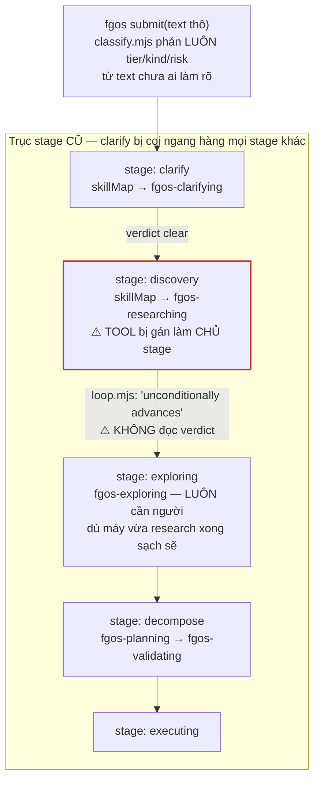
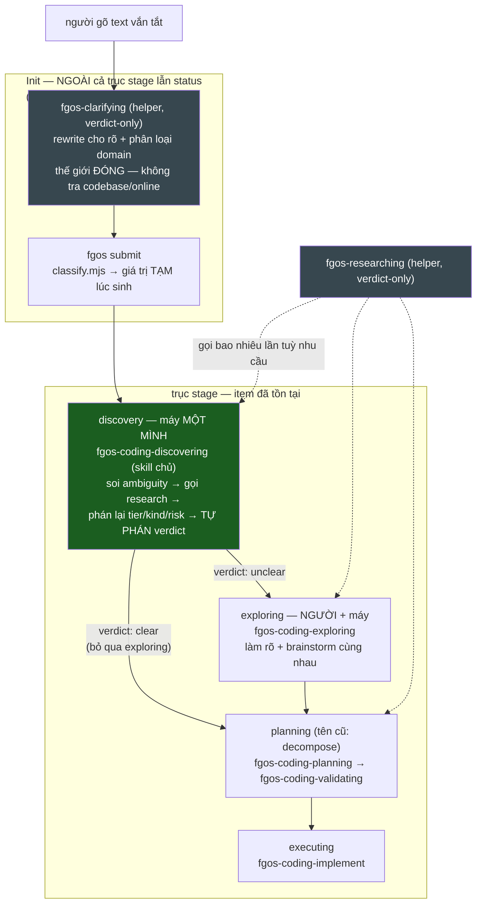
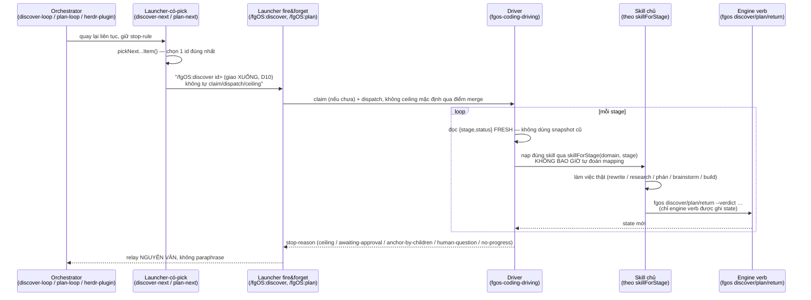
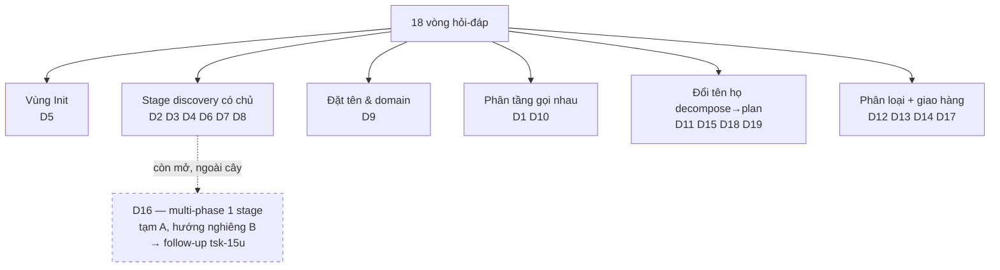
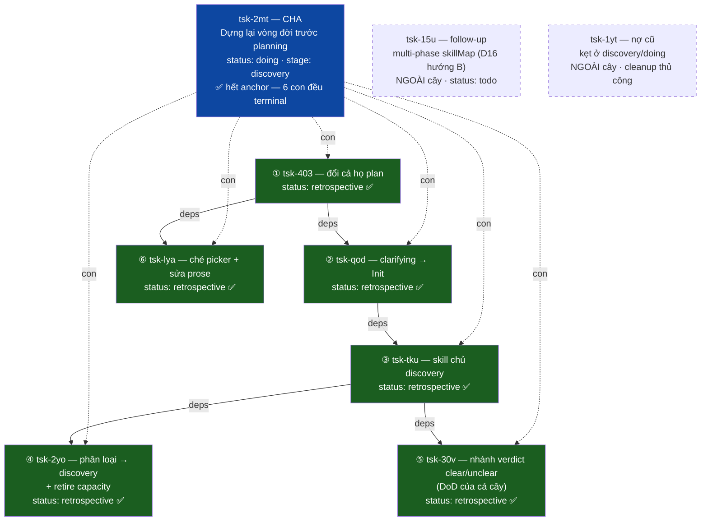
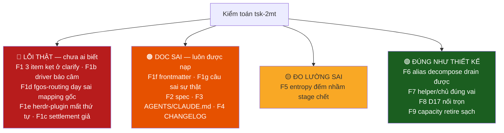
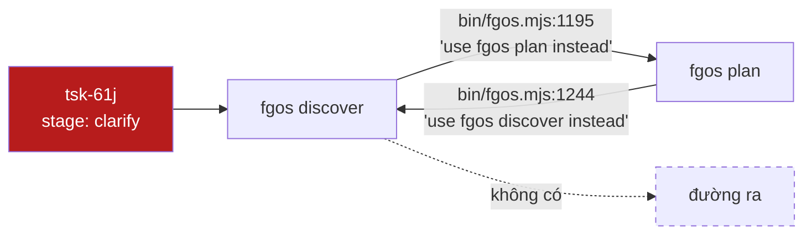
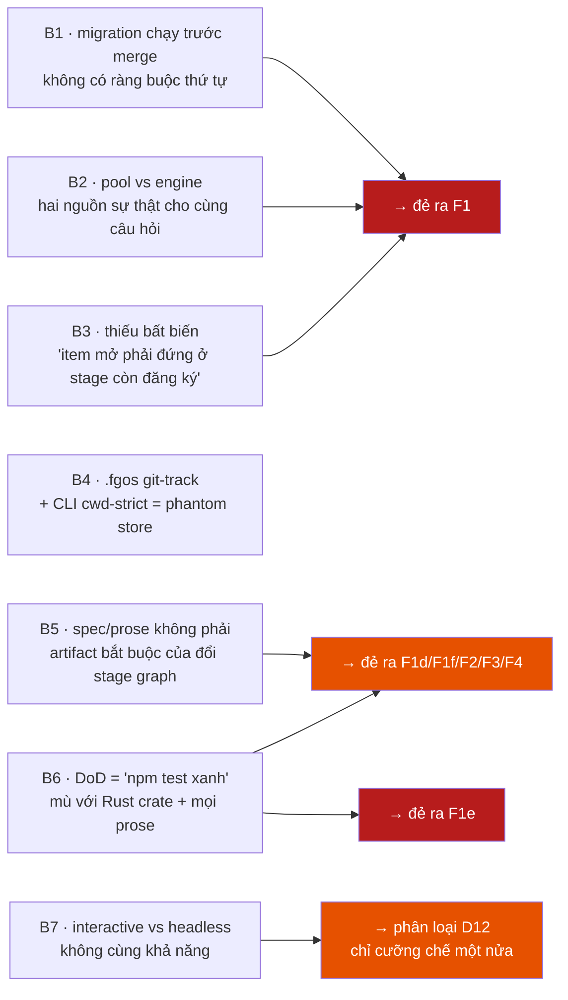

# Dựng lại vòng đời trước planning — tổng hợp thảo luận `tsk-2mt`

Nguồn: `docs/history/discover-stage-graph-and-skill-layering/{DISCUSSION,CONTEXT,plan,RESEARCH}.md`.
Tài liệu này **tổng hợp lại** để đọc nhanh, không thay thế nguồn — mọi trích
dẫn D-ID vẫn trỏ về DISCUSSION.md §4 là bản gốc.

## Tóm tắt 30 giây

Một lượt chạy `/fgOS:discover tsk-463` hỏng (2026-08-11) phơi ra: prose skill
dạy sai, và bên dưới nó một đồ thị stage đã lệch khỏi ý định — `clarify`
(soạn-lại + phân loại domain) bị coi là một stage như mọi stage khác, còn
`discovery` (pha máy-một-mình có thể tự phán) bị giao cho một *tool*
(`fgos-researching`) làm chủ rồi **luôn luôn ném cho người** bất kể verdict.
Qua 18 vòng hỏi-đáp, thiết kế được dựng lại thành ba vùng tách bạch (Init /
trục stage / helper), một stage `discovery` có chủ thật biết tự phán và tự
chọn cạnh đi, và một chuỗi tầng gọi nhau rõ ràng. Việc triển khai được gom
thành **một task cha (`tsk-2mt`) + 6 con**, theo đúng thứ tự deps engine tự
cưỡng chế. **Tính đến 2026-08-12, cả 6 con đã ở `retrospective`**,
nội dung đã nằm trọn trên `main` — chỉ còn cha `tsk-2mt` tự chạy nốt
lifecycle của chính nó, cộng một follow-up (`tsk-15u`) và một khoản nợ cũ
ngoài phạm vi (`tsk-1yt`).

> **§9-§11 là phần kiểm toán lại sau khi cây đóng** — 16 phát hiện, trong
> đó **5 lỗi thật chưa ai biết** (nặng nhất: skill `fgos-routing` nạp đầu
> tiên vẫn dạy đúng cái mapping sai đã đẻ ra cả cây này) và 7 bất ổn thiết
> kế. Đọc §9-§11 trước nếu chỉ có thời gian cho một phần.

---

## 1. Vấn đề gốc: một stage bị giao nhầm chủ

Trước khi sửa, luồng trông như sau — hai lỗi nằm chồng lên nhau:



Hai hệ quả trực tiếp:

- **Helper bị đội mũ chủ.** `fgos-researching` được gọi từ nhiều nơi (giữa
  `fgos-exploring`, giữa `fgos-planning`); nếu nó vừa là tool vừa là chủ
  stage thì cùng một file *lúc ghi state, lúc không* tuỳ ai gọi nó — D7.
- **Máy làm việc thật rồi bị bỏ phí.** Khối DISCOVERY DISPATCH
  (`loop.mjs:1060-1140`) đã dựng xong: worktree + worker headless +
  `RESEARCH.md` — nhưng comment ghi thẳng *"there is no verdict to gate the
  transition on here… unconditionally advances discovery -> exploring"*.
  Máy research xong sạch vẫn bị ném hết cho người — vòng 10 gọi đây là
  "phép đánh đổi giả" đã bị lật lại.

## 2. Kiến trúc mới: ba vùng tách bạch



Ba nguyên tắc khoá thiết kế này:

| Vùng | Đặc điểm | Vì sao |
|---|---|---|
| **Init** | Không stage, không status — item chưa tồn tại | `fgos-clarifying` chỉ đọc *đúng đoạn text vừa gõ*, đóng thế giới, phát biểu lại + phân loại `domain` **trước khi** gọi `fgos submit` — domain phải biết ngay lúc sinh vì nó chọn luôn stage graph nào áp dụng (D5) |
| **Trục stage** | `discovery → {planning \| exploring→planning} → executing` | `discovery` là pha **máy một mình**, dispatch headless được, tự phán rồi tự chọn cạnh (D2, D6); `exploring` là pha **người+máy**, luôn cần người (D3) |
| **Helper** | Không bao giờ ghi state item | Trả verdict/finding về cho skill gọi nó; skill *chủ* mới là thứ tự tay gọi engine verb để kết thúc stage (D4, D7). Phép thử cơ học: mở file, có lệnh gọi `fgos <verb>` chuyển stage không? |

## 3. Phân tầng gọi nhau — mỗi tầng một việc



Bảng thành viên mỗi tầng (§6 DISCUSSION.md):

| Tầng | Việc duy nhất | Thành viên |
|---|---|---|
| Orchestrator | quay lại, không dừng, giữ stop-rule | `discover-loop`, `plan-loop`, `herdr-plugin`, `fgos-runner --watch` |
| Launcher có pick | chọn 1 id đúng nhất rồi **giao xuống** | `discover-next`, `plan-next` |
| Launcher fire & forget | đã có id → bắn, buông tay | `/fgOS:discover`, `/fgOS:plan` |
| Driver | vòng stage cho 1 item | `fgos-coding-driving` |
| Skill chủ | làm việc thật ở 1 stage, tự gọi engine verb | `fgos-coding-discovering`, `fgos-coding-exploring`, `fgos-coding-planning`, … |
| Engine verb | cửa ghi duy nhất | `fgos discover` / `fgos plan` / `fgos return` |

Vi phạm điển hình đã bắt được ở vòng 4-9 (và đã sửa): nạp sai skill (gọi
thẳng `fgos-exploring` thay vì tra registry), hỏi người một câu scout đã trả
lời sẵn, và báo sai stop-reason ("reached ceiling at decompose" trong khi
item thật đang ở `discovery`).

## 4. Dòng thời gian 18 vòng — các bước ngoặt

```mermaid
flowchart LR
    R1["vòng 1-3<br/>lượt chạy hỏng<br/>nạp sai skill + hỏi thừa"] --> R6
    R6["vòng 6<br/>chuẩn L5<br/>'diễn giải đúng để không thể sai'"] --> R7
    R7["vòng 7<br/>tầng launcher/orchestrator<br/>ADR 0028 pin từ vựng"] --> R10
    R10["vòng 10<br/>khám phá DISCOVERY DISPATCH<br/>đã xây nhưng bị bỏ phí"] --> R11
    R11["vòng 11<br/>clarify = helper ở Init<br/>không liên quan status/stage"] --> R12
    R12["vòng 12<br/>đặt tên: fgos-coding-discovering<br/>tiền tố coding không phải code"] --> R13
    R13["vòng 13<br/>rename quyết định luôn<br/>tên cặp plan-next/plan-loop"] --> R16
    R16["vòng 14-16<br/>submit-assist: 3 lớp<br/>retire capacity, không migrate"] --> R17
    R17["vòng 17<br/>multi-phase 1 stage<br/>tạm A, hướng nghiêng B"] --> R18
    R18["vòng 18<br/>mở cây 6 con<br/>session lạnh bắt 2 lỗ hổng bị bỏ sót<br/>→ D18 (alias legacy), D19 (4 skill platform)"]

    style R6 fill:#4a148c,color:#fff
    style R10 fill:#1b5e20,color:#fff
    style R18 fill:#b71c1c,color:#fff
```



Chi tiết đáng chú ý nhất — **vòng 18**: ngay sau khi mở cây, một session khác
(không phải phiên thảo luận) tự nhặt `tsk-403` qua auto-launcher của herdr,
chạy thật, và park với hai câu hỏi thật. Cả hai câu đều lộ ra lỗ hổng mà
chính phiên thảo luận bỏ sót — đúng giá trị của session lạnh: nó không thừa
hưởng giả định, nó đi đếm `state.json` thật (ra 4 item mở, không phải 3) và
đếm thư mục skill thật. Đó là hai quyết định D18/D19 duy nhất được thêm vào
sau khi cây đã mở.

## 5. Trước / sau: bảng đối chiếu nhanh

| Khía cạnh | Trước | Sau |
|---|---|---|
| `clarify` | Một stage trong `skillMap`/`stages` | Helper ở **Init**, ngoài cả stage lẫn status (D5) |
| `discovery` | `skillMap.discovery = fgos-researching` (tool đội mũ chủ) | Skill chủ riêng `fgos-coding-discovering`, tự gọi `fgos-researching` làm helper (D7, D8) |
| Verdict discovery | Bị bỏ qua — `loop.mjs` "unconditionally advances" | Quyết định **cạnh đi**: `clear`→planning (bỏ qua exploring), `unclear`→exploring (D2) |
| `exploring` khi verdict clear | Luôn phải qua, dù máy đã research sạch | Bị **skip hoàn toàn** — người chỉ vào cuộc khi thật sự cần (D2, D3) |
| Phân loại tier/kind/risk | Phán từ text submit thô, trước khi ai research | Phán lại ở `discovery`, **sau khi** research xong, dựa bằng chứng thật (D12) |
| Tên stage `decompose` | `decompose` (verb) trùng nghĩa cả stage lẫn kết cục | `planning` là tên stage; `decompose`/`pass-through` chỉ còn là tên **kết cục verdict** (D11) |
| Tiền tố skill domain | Không nhất quán (`fgos-planning`, `fgos-code-implement`, …) | `coding-` cho 5 skill chủ domain-scoped; 4 skill platform-scoped (`fanout`/`indexing`/`routing`/`unlock`) **không bao giờ** mang tiền tố (D9, D19) |
| `discover-next` | Tự claim + tự dispatch + tự tính ceiling (di sản trước tsk-2b0) | Chỉ pick rồi **giao xuống** `/fgOS:discover <id>` — tầng dưới tự lo (D10) |
| Pool `planning` | Ăn ké chung hàm pick với `discover-next` | Có pick-function + cặp `plan-next`/`plan-loop` riêng (D11) |
| `submit-assist-classify` (capacity) | Đăng ký nhưng `capacities` rỗng, không ai query capability đó thật | Retire hẳn — thuần retire, không migration, giữ decision record (D13) |
| 4 item mở đứng trên `decompose` lúc rename | — | Giữ `decompose` làm **alias legacy drain-only**: còn trong `stages`+`skillMap`+cạnh ra, nhưng KHÔNG trong `stepMap` (D18) |

## 6. Bảng quyết định (D1-D19) — nhóm theo chủ đề



| Nhóm | D-ID | Tóm tắt một dòng |
|---|---|---|
| Vùng Init | D5 | `clarifying` là helper ở Init, đọc text thô, rewrite + phân loại domain, KHÔNG liên quan stage/status |
| Stage discovery có chủ | D2 | Verdict quyết định **cạnh đi**, không chỉ đi/dừng |
| | D3 | `exploring` là pha người+máy, luôn dùng được helper research |
| | D4 | `research` là tool/helper, không bao giờ là stage — gỡ `skillMap.discovery` cũ |
| | D6 | `discovery` là pha máy-một-mình, dispatch headless được |
| | D7 | `discovery` cần skill chủ riêng, không nâng `fgos-researching` lên |
| | D8 | Tên skill chủ: `fgos-coding-discovering` (không phải `fgos-discover` — trùng gần với engine verb) |
| Đặt tên & domain | D9 | Tiền tố domain dùng `coding` (literal registry), không phải `code` |
| Phân tầng | D1 | `discover` không bao giờ làm việc của `decompose`/`planning` — hard split, mọi tầng trên phải tôn trọng |
| | D10 | `discover-next` phải **giao xuống** `/fgOS:discover <id>`, không tự claim/dispatch/ceiling |
| Đổi tên họ | D11 | Đổi **cả họ** `decompose`→`planning` (stage, verb, launcher, cặp next/loop); giá trị verdict `decompose|pass-through` **giữ nguyên** |
| | D15 | Gộp vào con 1: đổi tên file `decompose.mjs`→`plan.mjs` + tiền tố `coding-` cho 5 skill còn lại |
| | D18 | Giữ `decompose` làm alias legacy **drain-only** cho 4 item mở đứng trên nó lúc rename |
| | D19 | 4 skill platform-scoped (`fanout`/`indexing`/`routing`/`unlock`) không bao giờ mang tiền tố |
| Phân loại + giao hàng | D12 | `tier`/`kind`/`risk` chuyển xuống `discovery`, sau research (không phán được từ text submit) |
| | D13 | Retire capacity `submit-assist-classify` — thuần retire, không migration |
| | D14 | Giao hàng theo **một task cha gom hết con** — engine tự neo qua `hasOpenDescendant` |
| | D17 | Đường headless cần mở rộng schema `fgos-verdict` để worker báo tier/kind/risk dạng DATA |
| *(ngoài cây)* | D16 | Multi-phase 1 stage: tạm dùng A (chuỗi prose), hướng nghiêng B để dành — xem §8 |

## 7. Cây công việc — trạng thái hiện tại



Đường găng (critical path) khi triển khai là 403 → qod → tku → {2yo, 30v},
4 bước tuần tự; 403 → lya rẽ nhánh song song ngay sau con 1 và không chặn ai
khác. Toàn bộ đã đi đúng thứ tự deps engine cưỡng chế, không con nào chạy
trước điều kiện tiên quyết của nó.

## 8. Còn lại / theo dõi tiếp

- **`tsk-2mt` (cha) tự nó chưa xong.** Nó vừa hết bị anchor (6 con đều
  `delivered`/`retrospective`) và đang đứng ở stage `discovery` — driver sẽ
  tự chạy `fgos-coding-discovering` cho chính nó ở lượt kế tiếp, vì cha
  cũng là một item bình thường đi qua đúng vòng đời nó vừa thiết kế.
- **`tsk-15u` — follow-up "multi-phase 1 stage" (D16), ngoài cây này.**
  `planning` sẽ là stage duy nhất còn "nói dối" sau khi cây xong:
  `skillMap` khai `fgos-coding-planning` trong khi đứa thật sự gọi engine
  verb để kết thúc stage là `fgos-coding-validating`. Nếu làm, phải theo ba
  điều kiện D16: chỉ cho **quan hệ chuỗi-pha** (không cho quan hệ gọi-helper
  như `fgos-researching`) · **chỉ tuần tự** (song song ở lại trục item,
  dùng `fgos-fanout`/children/footprint-conflict đã có) · dùng **gate
  record làm dấu mốc pha** (`view.gates[id]` — pha nào đã có gate thì bỏ
  qua khi driver chạy lại, tránh đẻ con trùng như tiền lệ đau ở
  `fgos-validating`). Câu để quyết khi nào đủ chín: *"có bao giờ muốn dừng /
  resume / báo cáo tại ranh giới giữa hai pha không?"* — priority #2 của
  `AGENTS.md` trả lời có, nhưng chưa đủ chín để làm trong cây `tsk-2mt`.
- **`tsk-1yt` — nợ cũ, ngoài phạm vi thiết kế.** Kẹt ở `discovery`/`doing`
  vì runner chỉ quét `todo` (không worker nào đụng) và cũng không session
  nào lái. Kèm `verify` tự chế (`npm test` đè placeholder) và một
  `CONTEXT.md` chưa commit trên `main`, không có branch `fgw/tsk-1yt`. Cần
  quyết định thủ công (giữ hay bỏ `CONTEXT.md`, đặt lại `verify` thật) —
  không có lệnh máy nào chứng minh được, khác mọi task trong cây chính.

## 9. Kiểm toán lại sau khi cây đóng (2026-08-12)

Quét lại toàn bộ tsk-2mt + 6 con: đối chiếu tuyên bố thiết kế với code,
state thật, doc và test. Nền: `npm test` **2960 pass / 0 fail / 5 skipped**;
`git diff --stat main..HEAD` **rỗng** (main đã có trọn nội dung, 53 commit
chênh lệch chỉ là lịch sử merge); verify string của chính `tsk-2mt` chạy
**xanh** cả hai vế grep. Cây làm đúng phần code. Vấn đề nằm ở **rìa**:
dữ liệu tồn dư, đo lường, và doc.



### F1 🔴 Ba item mắc kẹt ở stage `clarify` đã bị khai tử — bug thật, latent

`tsk-22c` (doing), `tsk-61j` (todo), `tsk-365` (todo) vẫn đứng ở stage
`clarify`. Mà `clarify` đã bị tsk-qod (D1/D2) khai tử **hoàn toàn**: không
còn trong `stages`, `skillMap`, `stepMap` — khác `decompose` chỉ là alias
drain-only.

Nguyên nhân — **cửa sổ đua giữa migration dữ liệu và merge code**:

```mermaid
gantt
    dateFormat HH:mm
    axisFormat %H:%M
    title 2026-08-11 — cửa sổ đua 1h16'
    section Dữ liệu
    migration chạy, 82 item clarify→discovery :done, m1, 15:16, 1m
    section Code
    submit vẫn default stage=clarify :crit, c1, 15:16, 76m
    submit đổi sang stages[0] (merge) :milestone, c2, 16:33, 0m
    section Item lọt
    tsk-22c sinh ra ở clarify :active, i1, 15:20, 1m
    tsk-61j + tsk-365 sinh ra ở clarify :active, i2, 16:32, 1m
```



Bằng chứng: migration chạy `15:16:32.803Z → 15:16:42.648Z` (82 event
`from:"clarify" to:"discovery" role:"system"`); `tsk-22c` có `work.add`
lúc `15:20:02.801Z` mang thẳng `"stage":"clarify"`; `tsk-61j` `16:31:59`,
`tsk-365` `16:32:25`. Tức migration chạy **trước** khi code sinh-item đổi
default sang `stages[0]`.

Hậu quả cụ thể — **pool và engine bất đồng về "stage nào discover được"**:

| Tầng | Nguồn sự thật | Với stage `clarify` |
|---|---|---|
| `src/state/discover-pool.mjs:26` | `Set(['clarify','discovery','exploring'])` hardcode | **NHẬN** → item vào pool |
| `bin/fgos.mjs:1191` | `discoverableStages(domain)` domain-aware → `['discovery','exploring']` | **TỪ CHỐI** → `StoreError` |

Nên `/fgOS:discover-next` sẽ có lúc chọn đúng item độc này, giao xuống
`/fgOS:discover`, và engine ném:

```
discover: work "tsk-61j" is at stage "clarify", not "discovery"/"exploring"
-- use "fgos plan tsk-61j" instead.
```

Câu gợi ý trong chính thông báo lỗi cũng **sai**: `plan-pool.mjs` chỉ nhận
`decompose`/`planning`, `fgos plan` cũng sẽ từ chối. Item không có đường ra
bằng verb nào.

Nặng hơn: **hai verb chỉ trỏ sang nhau thành vòng kín**.



Hiện **chưa nghẽn**, nhưng không phải vì lý do vô hại: hai item `todo` đang
bị chặn deps (`tsk-61j ← tsk-60d`, `tsk-365 ← tsk-1r6`, cả hai dep còn
`todo`) nên `isDepsAndLineageReady` loại chúng khỏi pool. Mà `tsk-1r6`
**chính là item `pickNextDiscoverItem` đang trả về đầu tiên** trên store
thật — nghĩa là `tsk-365` sẽ vào pool ngay khi `tsk-1r6` xong. Không phải
rủi ro xa.

Và khi vào pool thì nó ở lại vĩnh viễn: `compareClarifyOrder` sắp `blocks`
DESC, item không bao giờ rời pool → thành viên độc nằm mãi ở đầu hàng của
`/fgOS:discover-loop`, mà stop-rule của loop là "pool cạn".

Sửa: chạy lại `scripts/migrate-clarify-split.mjs` — idempotent by
construction (chính bộ lọc chọn ứng viên loại luôn item đã dời), nên chạy
lại là an toàn và sẽ vét đúng 3 item còn sót.

### F1b 🔴 Driver báo item mắc kẹt là "mechanical" — F1 thành lỗi câm

`skillForStage(coding, 'clarify')` trả về **`null`** (kiểm chứng trực tiếp
qua registry: `clarify → null`, `decompose → fgos-coding-planning`,
`discovery → fgos-coding-discovering`). Nhánh `null` của driver
(`.claude/skills/fgos-coding-driving/SKILL.md:314-319`) viết:

> *if skill is null: stop. This position is mechanical … nothing left for
> THIS skill to load; the caller's own next step (e.g. `fgos return`,
> `fgos cleanup`) already covers it.*

Với item ở `clarify` thì **không có** "next step nào cover" cả. Nên
`/fgOS:discover tsk-61j` sẽ dừng và báo một câu **có hình dạng thành công**
— trong khi item không nhúc nhích. `null` đang gộp hai nghĩa khác hẳn nhau:
"stage này mechanical theo thiết kế" và "stage này không còn tồn tại".

### F1c 🟠 Verdict `unclear` giờ ghi một settlement `clarify-pass` giả

tsk-30v đổi cạnh nhưng **không đổi cổng settlement**:

- `discovery.mjs:464-471` — verdict unclear giờ cũng `moveStage`
  `discovery → exploring`, mang theo
  `verify: hasRealVerify(work.verify) ? work.verify : FALLBACK_VERIFY`.
- `replay.mjs:424` — cổng chỉ gác trên `from === 'discovery'`, nên nó ghi
  `{ kind: 'clarify-pass', detail: verify }`.

Kết quả: một item **vừa bị phán là chưa rõ** và đang park chờ người lại
được ghi vào kênh settlement là đã *pass* — và nếu item chưa có verify
thật thì `detail` chính là chuỗi placeholder `FALLBACK_VERIFY` =
`'chưa xác định — bổ sung thủ công'` (`discovery.mjs:74`). Tức là ghi
"đã ngã ngũ, kèm verify" cho một trường hợp không ngã ngũ và không có
verify. Comment ngay phía trên cổng (`replay.mjs:410-411`) tự định nghĩa
settlement là *"left the domain's entry stage carrying a verify"* — vế
sau không còn đúng.

Trước tsk-30v thì không sao: unclear park tại chỗ, không đổi stage, nên
không chạm cổng này. Đây là hệ quả phụ chưa ai soi của chính D2/D3/D6.
Không crash — nó làm bẩn dữ liệu compound-learning một cách im lặng.

### F1d 🔴 `fgos-routing` — skill nạp ĐẦU TIÊN — vẫn dạy đúng cái mapping sai đã đẻ ra cả cây này

Đây là phát hiện trớ trêu nhất của cả bản kiểm toán. `AGENTS.md` viết:
*"A session opening in this repo to work an item through its lifecycle
loads `fgos-routing` first"*. Bảng "Route by stage" của nó
(`.claude/skills/fgos-routing/SKILL.md:138-143`) hiện đọc:

| stage | skill nó bảo nạp | registry thật nói |
|---|---|---|
| `discovery` | **`fgos-researching`** | `fgos-coding-discovering` |
| `exploring` | `fgos-coding-exploring` | ✅ khớp |
| `decompose` — shaping | `fgos-coding-planning` | (alias legacy) |
| `decompose` — proving | `fgos-coding-validating` | (alias legacy) |
| `executing` | `fgos-coding-implement` | ✅ khớp |
| **`planning`** | **không có dòng nào** | `fgos-coding-planning` |

Hai lỗi chồng lên nhau, đúng bằng hai lỗi §1 của tài liệu này:

1. Dòng `discovery` vẫn trỏ `fgos-researching` — **chính xác cái "tool đội
   mũ chủ" mà D7/D8 sinh ra để gỡ**, và chính xác cái đã làm hỏng lượt
   `/fgOS:discover tsk-463` khởi đầu toàn bộ 18 vòng thảo luận.
2. Stage chính hiện nay — `planning` — **không có dòng nào**. Session tra
   bảng sau khi claim một item ở `planning` sẽ không tìm thấy gì.

Nói cách khác: code đã sửa xong, nhưng tờ hướng dẫn mà mọi session đọc
trước tiên vẫn in nguyên bản cũ. Một session lạnh làm đúng quy trình
`AGENTS.md` chỉ định sẽ tái lập đúng lỗi gốc.

Cùng file còn: `:14` khai vòng lặp lõi là `clarify → decompose →
executing`; `:97,99,151` prose về claim item "still at clarify or
decompose".

### F1e 🔴 `herdr-plugin` (Rust) — hỏng thật, và nằm ngoài tầm phủ của `npm test`

`herdr-plugin/src/fgos.rs:77-87`:

```rust
fn doing_tier(status: &str, stage: &str) -> u8 {
    if status == "awaiting-approval" { return 0; }
    match stage {
        "executing" => 1,
        "decompose" => 2,
        "clarify"   => 3,
        _           => 4,
    }
}
```

Doc comment ngay trên khai ý định: *"Tier B (`doing`) sub-sorts by stage in
pipeline order"*. Sau đổi tên, `decompose`/`clarify` gần như không còn item
nào khớp, còn **cả ba stage sống thật** (`discovery`, `exploring`,
`planning`) đều rơi vào `_ => 4`. Nên phép sub-sort theo pipeline
**sụp thành một cục**: dashboard không còn phân biệt item đang research với
item đang shaping. (Không phải "đảo ngược thứ tự" — là mất hẳn thứ tự.)

Điểm đáng lo hơn bản thân bug: `herdr-plugin` là crate Rust cùng repo,
`npm test` (node --test) **không chạm tới nó**. Cả 6 con đều lấy "npm test
xanh" làm bằng chứng DoD — mà tiêu chuẩn ấy về cấu trúc không thể nhìn
thấy chỗ này. Kèm theo `herdr-plugin/src/app.rs:517` còn fixture
`stage: "decompose"`.

### F1f 🟠 Mô tả frontmatter của skill — sai ngay trong danh sách mọi session nhận được

`description` trong frontmatter được nạp vào **listing skill của mọi
session**. Em kiểm chứng được ngay trong context của chính phiên này:

| Skill | `description` đang quảng cáo | Thật |
|---|---|---|
| `fgos-coding-exploring` | "an item claimed at stage `clarify`" | chạy ở `exploring` |
| `fgos-coding-implement` | "already cleared `clarify` and `planning`" | `clarify` không còn |
| `/fgOS:discover` | "past stage clarify … `fgos-clarifying` at clarify, **`fgos-researching` at discovery**" | cùng lỗi D7 như F1d |
| `/fgOS:discover-loop` | "every item at `stage:clarify` or `stage:decompose`" | pool ấy đã thuộc `plan-loop` (D11/tsk-lya) |
| `/fgOS:cook` | "submit, clarify, decompose, real implementation" | cả hai tên đều retire |

Thân bài `/fgOS:discover/SKILL.md:33-41` còn hứa verb "errors only if called
on an item outside `{clarify, discovery, exploring}`" — trong khi
`discoverableStages` loại `clarify` ra, tức verb báo lỗi **đúng ở stage mà
doc hứa nó xử lý được**. Đây đúng hạng lỗi tsk-lya được giao đi sửa; bản
frontmatter bị bỏ sót.

### F1g 🟠 Một câu SAI SỰ THẬT (không chỉ lạc hậu) trong `fgos-coding-planning`

`.claude/skills/fgos-coding-planning/SKILL.md:227` viết: *"omitting
`--stage` here would now default to `clarify`"*. Code thật
(`bin/fgos.mjs:935` và `:1050`) resolve về `getDomain(...).stages[0]` =
**`discovery`**. Khác các mục trên (tên chết nhưng lập luận còn đúng), câu
này khiến skill suy luận từ một mặc định không tồn tại.

### F2 🟠 Spec vẫn mô tả vòng đời cũ — lỗ hổng DoD lớn nhất

`AGENTS.md` viết: *"Specs are the state layer — BA-grade, tech-agnostic —
read the spec before the code"*, và DoD câu 1 chỉ thẳng
`docs/specs/reading-map.md`. Cả hai file đó giờ **dạy sai**:

| File | Trạng thái | Bằng chứng |
|---|---|---|
| `docs/specs/reading-map.md:20` | Khai chuỗi stage của `coding` là `clarify→decompose→executing→compound-learn` | cả `clarify` lẫn `compound-learn` đều đã retire |
| `docs/specs/reading-map.md:23-24` | `discovery.mjs` = "context-discovery của stage clarify", verdict rõ → chuyển sang `decompose` | verdict giờ chọn **cạnh đi**, `clarify` không còn |
| `docs/specs/work-state.md` | `updated: 2026-07-28`, `coverage: full`, §"Giai đoạn Làm-rõ (stage clarify)" còn nguyên; **0 lần** xuất hiện `planning` như tên stage | 216KB spec mô tả một máy trạng thái không còn tồn tại |
| `docs/specs/runner.md` | 22 lần "clarify" / 1 lần "planning" | cùng bệnh |

Không con nào trong 6 con đụng tới `docs/specs/`. Đây là vi phạm trực tiếp
DoD câu 6 ("settled spec fact goes into the relevant `docs/specs/<area>.md`")
— và là thứ khiến một session lạnh đọc đúng thứ tự AGENTS.md chỉ định sẽ
nạp vào đầu một mô hình đã chết.

### F3 🟠 `AGENTS.md` và `CLAUDE.md` gọi tên skill không còn tồn tại

Hai file này được nạp vào **mọi** session:

- `AGENTS.md:80` — "points to `fgos-exploring`, `fgos-planning`, or
  `fgos-validating`"
- `CLAUDE.md:12` — "`fgos-planning`/`fgos-validating`/`fgos-code-implement`
  decide how much impact-analysis evidence…"

Cả 5 tên đều đã đổi (D15). Trên đĩa chỉ còn bản `coding-`:
`.claude/skills/` liệt kê đúng 15 thư mục, khớp D9/D19 (5 skill chủ có tiền
tố `coding-`, 4 skill platform không tiền tố) — nghĩa là **code đúng, chỉ
prose entry-point sai**. `README.md` sạch.

Quét toàn repo còn ~28 điểm cùng loại nữa, đáng kể nhất:

| Nơi | Vấn đề |
|---|---|
| `docs/tutorials/walking-a-heavy-item-through-a-3-child-split.md:54,94,167` | tutorial đầu-cuối chủ lực gọi `fgos-planning`/`fgos-validating`/`fgos-code-implement` |
| **7 file `docs/how-to/*`** | tên stage/verb đã retire nằm ngay trong **tên file**, nên `docs/enduser-docs-index.json` trưng chúng ra bằng đúng tiêu đề đó (vd `sweep-the-clarify-decompose-backlog-with-discover-loop.md`) |
| `docs/backlog.md:36,38,128,133` | dòng PBI **đang mở** trích `fgos-exploring`/`fgos-planning` |
| `docs/distribution-vision.md:151-152` | như trên |
| `plugins/fgOS/skills/{list,triage}/SKILL.md` | trưng từ vựng stage cho người dùng: `clarify \| decompose \| executing \| compound-learn` — 3/4 đã retire |
| `plugins/fgOS/skills/cleanup-next/SKILL.md:29` | "discover-next always picks the single next clarify/decompose" — sai cả hai vế sau khi chẻ pool |
| `tsk-1op-case-study-note.md:8,12` (gốc repo) | gọi `fgos-code-implement` và một đường dẫn lồng đã chết |
| `.claude/skills/fgos-coding-driving/SKILL.md:214,244,329,371,462` | ví dụ ceiling hardcode `['clarify','decompose','executing']` |

Ba thứ **sạch**, đã kiểm: không còn file `decompose.mjs` nào và **không có
import nào** trỏ tới nó; `dispatch.mjs:150` dựng đường
`.claude/skills/${skillName}/SKILL.md` từ chính `skillForStage` và mọi giá
trị `skillMap` đều resolve ra thư mục có thật; `.agents/skills` khớp
byte-for-byte với `.claude/skills`.

### F4 🟠 `CHANGELOG.md [Unreleased]` thiếu 3/6 con, và tự mâu thuẫn

Có mục cho tsk-403 (rename cả họ). **Không có mục** cho:

- tsk-qod — `clarify` rời trục stage về Init;
- **tsk-30v — nhánh verdict `clear` bỏ qua `exploring`** (chính là DoD của
  cả cây, và là thay đổi người dùng thấy rõ nhất);
- tsk-2yo — `tier`/`kind`/`risk` chuyển xuống `discovery` + retire capacity.

Nặng hơn: hai mục **đang nằm trong chính `[Unreleased]`** giờ mô tả hành vi
đã bị thay ngay trong cùng đợt phát hành:

- dòng ~134 — herdr dashboard auto-launch "for the first `clarify`-stage,
  `todo`-status item";
- dòng ~150 — "`/fgOS:submit` … then judges `tier`/`kind`/`risk` against
  the cleaned-up text" — trong khi `plugins/fgOS/skills/submit/SKILL.md:38`
  nay ghi rõ *"`tier`/`kind`/`risk` are never re-judged here at all (D12)"*.

Gate của `AGENTS.md` ("user của fgOS thấy được → thêm dòng vào
`[Unreleased]`") bị bỏ qua ở 3 con, và `fgos doctor`'s
`changelog-unreleased-stale` không bắt được vì nó chỉ kiểm "có ít nhất một
mục", không kiểm "mục có còn đúng".

### F5 🟡 `entropy` đếm nhầm stage đã chết

`src/report/entropy.mjs:126` — `countStageClarify` lọc
`w.stage === 'clarify' && !isResolvedStatus(w)`. Sau khi `clarify` retire,
chỉ số này:

- đếm đúng **3** item mắc kẹt ở F1 (và sẽ về 0 vĩnh viễn sau khi vét),
- **bỏ sót 65** item mở đang thật sự đứng ở `discovery` — tức là backlog
  "chưa qua kiểm chất lượng thông tin" mà chỉ số này sinh ra để đo.

Không ai thấy nó sai vì nó không throw, chỉ im lặng báo số nhỏ.

### F6-F9 🟢 Bốn thứ kiểm lại thấy **đúng** như thiết kế

| # | Tuyên bố | Bằng chứng kiểm chứng |
|---|---|---|
| F6 | Alias legacy `decompose` cho item drain ra được (D18) | `plan-pool.mjs` để cả `decompose` và `planning` trong `CANDIDATE_STAGES` → 5 item mở còn ở `decompose` (tsk-42i/3at/3m6/4b2/3gv) vẫn được `plan-next` chọn. Alias hoạt động thật, không phải alias chết. |
| F7 | Helper không bao giờ ghi state, skill chủ tự gọi verb (D4/D7) | Phép thử cơ học của chính §2: `fgos-coding-discovering/SKILL.md:21,81` gọi `fgos discover --verdict`; `fgos-researching/SKILL.md` **không có một lệnh ghi state nào**. |
| F8 | Đường headless báo tier/kind/risk dạng DATA (D17) | Nối **trọn ba khâu**: schema `worker-prompt-discovery.txt:26`, parse `loop.mjs:603-605`, áp dụng `classificationPatchFromVerdict` (`loop.mjs:620-627`) — có chốt chặn: chỉ áp khi outcome `clear` **và** verdict `clear`. |
| F9 | Retire capacity `submit-assist-classify` (D13) | Store thật chỉ còn `gather` + `gitnexus`. Không còn vết trong `src/setup/registrations.mjs`. Thuần retire, không migration, đúng D13. |

Một lệch nhỏ không ảnh hưởng hành vi: comment `loop.mjs:653` còn viết
"stage 'clarify'" trong khi code ngay dưới (`stage: stageForStep(...) ??
stages[0]`) đã đúng; và comment trong `workflow-stage-graphs.mjs` nói
"90-item production migration" trong khi log đếm được **82**.

## 10. Bảy bất ổn thiết kế cần raise

Đây là loại vấn đề không sửa được bằng một commit — chúng là chỗ thiếu cơ
chế, nên cùng một lỗi sẽ tái diễn ở đợt refactor sau.



**B1 — Migration dữ liệu và merge code không có thứ tự cưỡng chế.**
Bất kỳ migration one-shot nào cho một giá trị mà **code cũ còn sinh ra
được** đều mở một cửa sổ đua dài đúng bằng khoảng cách từ lúc chạy
migration tới lúc code merge vào `main`. Ở đây là 1h16'. fgOS không có chỗ
nào ràng buộc "migration chạy sau khi code land". Hướng: gắn migration vào
bước post-merge của `approve` thay vì chạy tay trong worktree.

**B2 — Pool và engine trả lời khác nhau cho cùng câu hỏi "stage nào
discover được".** `discover-pool.mjs` hardcode một `Set`, engine tính
`discoverableStages(domain)` domain-aware. Đây chính là cơ chế biến 3 item
sót thành item độc: pool mời vào, engine đuổi ra. Hướng: pool gọi thẳng
`discoverableStages` thay vì giữ bản sao literal. Cùng loại lỗi "hai bản
sao của một sự thật" mà D7 đã bắt ở tầng skill, nhưng ở tầng data chưa ai
soi.

**B3 — Không có bất biến "mọi item mở phải đứng ở một stage còn đăng ký".**
`fgos doctor` đã có `work-classification-vocabulary` bắt item mở mang
`kind`/`risk` ngoài từ vựng domain — cùng hạng bất biến, nhưng chiều `stage`
thì không có check nào. Một check `no-open-item-at-unregistered-stage` sẽ
bắt F1 ngay ngày nó xảy ra thay vì để nó nằm im. Đây là đề xuất rẻ nhất và
có đòn bẩy cao nhất trong cả danh sách.

**B4 — `.fgos` được git-track + CLI cwd-strict = phantom store trong
worktree.** ADR0020 giả định worktree bị wipe `.fgos`; nhưng
`.fgos/events.jsonl` là **file được commit** (8 file `.fgos/*` tracked),
nên mọi `git merge`/`checkout` trong worktree dựng lại nó. `dataDir()`
(`bin/fgos.mjs:92-103`) thì `strict: true` — luôn lấy `.fgos` dưới cwd,
không bao giờ resolve lên main checkout.

Em **dính thật khi đang làm bản kiểm toán này**: `node bin/fgos.mjs show
tsk-2mt` chạy trong worktree trả về `tsk-tku/2yo/30v = todo/discovery`,
trong khi store thật đã là `retrospective` — hai file lệch 14128 vs 14246
dòng event. Nếu là một verb GHI thay vì đọc, event sẽ rơi vào store ma.

Mức độ thật: **bẫy, không phải vỡ hệ thống** — đường chính thống đều an
toàn (shell function `fgos` resolve qua `--git-common-dir`; mọi
`plugins/fgOS/skills/*/SKILL.md` đều tính `root=$(git rev-parse
--path-format=absolute --git-common-dir | xargs dirname)` rồi truyền
`--dir "$root"`). Rủi ro nằm ở lệnh chạy tay và agent gọi ad-hoc. Hướng:
cho `dataDir()` từ chối khi cwd là linked worktree **và** không có `--dir`
— đúng cái guard `main-checkout-reset` đã có sẵn (`bin/fgos.mjs:4375`),
chỉ là chưa ai mở rộng cho các verb khác.

**B5 — Spec không được coi là artifact bắt buộc của một thay đổi stage
graph.** Sáu con đều test xanh, đều có iron-law evidence, đều qua gate — mà
`docs/specs/work-state.md` vẫn `coverage: full` cho một máy trạng thái
không còn tồn tại. DoD câu 6 chỉ là prose; không gate nào đọc nó. Hướng
nhẹ nhất: một doctor check đối chiếu tên stage xuất hiện trong
`docs/specs/*.md` **và trong prose skill** với `stages` thật của mỗi
domain — cùng khuôn với `decision-citation-drift.md` mà repo đã có.

**B6 — Tiêu chuẩn DoD là "`npm test` xanh", mà `npm test` mù với hai chỗ
đợt này thật sự hỏng.** `npm test` là `node --test` — nó không chạm
`herdr-plugin` (crate Rust cùng repo, F1e) và về bản chất không đọc được
prose skill (F1d/F1f/F1g). Cả 6 con đều xanh, đều có iron-law evidence,
đều qua gate — trong khi bảng route của `fgos-routing` vẫn dạy sai và
dashboard mất thứ tự. Đây không phải lỗi của người làm; là lỗ hổng cấu
trúc của chính tiêu chuẩn chứng minh. Hướng: khi một thay đổi đụng
`workflow-stage-graphs.mjs`, `verify` của item phải kèm ít nhất một phép
grep đối chiếu tên stage trong `.claude/skills/**` và `cargo test -p
herdr-plugin` — hoặc gói cả hai vào doctor check ở B5.

**B7 — Đường interactive và đường headless không có cùng khả năng.** D12
nói `tier`/`kind`/`risk` do `discovery` phán lại sau research. Thực tế
chỉ **một nửa** được cưỡng chế:

| | headless (runner) | interactive (session) |
|---|---|---|
| Kênh truyền | hợp đồng **dữ liệu** có kiểm: schema `fgos-verdict` → `loop.mjs:603-605` → `classificationPatchFromVerdict` → `editWork` | **prose**: skill tự nhớ gọi `fgos edit` |
| Verb hỗ trợ | có | **không** — `parseDiscoverCallerVerdict` (`bin/fgos.mjs:377-395`) chỉ nhận `verdict/verify/question/force`, không có `--tier/--kind/--risk` |

Thêm nữa: cả hai đường đều **không bắt buộc** — headless chỉ ghi đè khi
worker tự chọn phát các key optional, và **không bao giờ** ghi đè trên
nhánh `unclear` (guard `callerVerdict.clear`). Không có field nào đánh dấu
giá trị là tạm, nên hai consumer sống — cổng heavy-risk của `plan.mjs` và
`RISK_DISCOUNTS` của `priority-formula.mjs` — không phân biệt được đoán từ
keyword với phán từ bằng chứng. Đây chạm thẳng luật lõi "interactive và
headless phải có khả năng như nhau" mà repo tự đặt ra. Hướng tối thiểu:
thêm `--tier/--kind/--risk` cho `fgos discover` để hai đường dùng chung
một cửa.

## 11. Việc nên làm tiếp, theo thứ tự đòn bẩy

| # | Việc | Vì sao trước | Chi phí |
|---|---|---|---|
| 1 | **Sửa bảng route của `fgos-routing`** (F1d): `discovery → fgos-coding-discovering`, thêm dòng `planning` | skill nạp **đầu tiên** đang dạy đúng lỗi gốc mà cả cây sinh ra để sửa | vài dòng |
| 2 | Chạy lại `scripts/migrate-clarify-split.mjs` | vét 3 item độc; `tsk-365` vào pool ngay khi `tsk-1r6` xong | 1 lệnh, idempotent |
| 3 | Thêm doctor check `no-open-item-at-unregistered-stage` (B3) | biến F1 từ "im lặng" thành "báo ngay", chặn tái diễn | nhỏ, có khuôn sẵn |
| 4 | Sửa `frontmatter description` của 5 skill (F1f) + câu sai `fgos-coding-planning:227` (F1g) | ship trong listing của **mọi** session; một câu sai sự thật | nhỏ |
| 5 | Sửa `AGENTS.md:80` + `CLAUDE.md:12` (F3) | 2 file nạp vào **mọi** session | 2 dòng |
| 6 | Sửa `doing_tier` trong `herdr-plugin/src/fgos.rs:83` (F1e) | bug runtime thật, ngoài tầm `npm test` | nhỏ, cần `cargo` |
| 7 | Đóng cổng settlement giả cho verdict `unclear` (F1c) | đang làm bẩn dữ liệu compound-learning | nhỏ |
| 8 | Bù 3 mục CHANGELOG + sửa 2 mục tự mâu thuẫn (F4) | `[Unreleased]` chưa phát hành, sửa giờ là rẻ nhất | nhỏ |
| 9 | Cho `discover-pool` gọi `discoverableStages` (B2) | gỡ nguồn sự thật thứ hai | nhỏ |
| 10 | Trỏ `entropy` sang stage thật (F5) | chỉ số đang sai âm thầm | nhỏ |
| 11 | Thêm `--tier/--kind/--risk` cho `fgos discover` (B7) | gỡ bất đối xứng interactive/headless | vừa |
| 12 | Cập nhật spec + tutorial + 7 tên file `docs/how-to/*` (F2, F3) | lớn nhất về DoD, nhưng cũng tốn nhất; đổi tên file kéo theo `enduser-docs-index.json` | lớn — xứng một item riêng |

Ngoài phạm vi cây này, `fgos doctor` đang đỏ 7 check (config thiếu key
`gateBypass`/`invariantChecks`/`herdrOrchestrator.*`, 123 dòng source chết
trong `~/.bashrc` trỏ tới worktree đã xoá, `root-drift` ở tsk-4n7/tsk-5d4,
index end-user doc lệch 14/282). Không do tsk-2mt gây ra, nhưng đáng ghi
lại vì `gateBypass.level` thiếu chính là thứ cây này đã dựa vào để
auto-approve các gate.

## 12. Nguồn gốc / tham chiếu

- `docs/history/discover-stage-graph-and-skill-layering/DISCUSSION.md` —
  bản gốc đầy đủ D1-D19 + Q&A log 18 vòng.
- `docs/history/discover-stage-graph-and-skill-layering/CONTEXT.md` —
  feature boundary + scout evidence riêng cho từng con (`tsk-qod`,
  `tsk-lya`, `tsk-2yo`, `tsk-30v`).
- `docs/history/discover-stage-graph-and-skill-layering/plan.md`,
  `RESEARCH.md` — kế hoạch triển khai và bằng chứng research chi tiết
  file:line cho từng claim.
- ADR `0028` — từ vựng launcher/orchestrator dùng xuyên suốt §3.
- `AGENTS.md` §Product priority order — priority #2 ("release con người")
  là căn cứ sản phẩm cho D16/follow-up `tsk-15u`.
