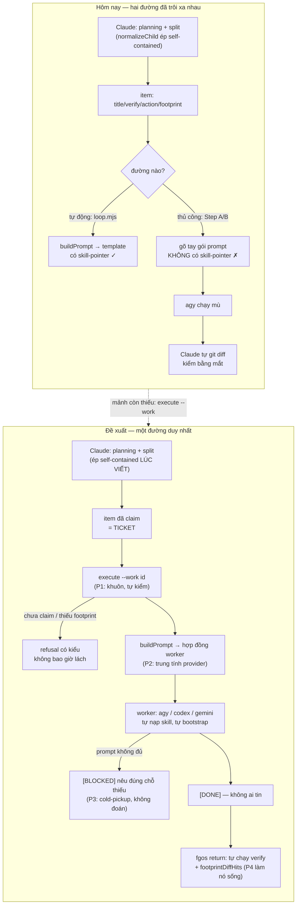

# DISCUSSION.md — dispatch: cơ chế kích hoạt & bàn giao

Item: `tsk-2uf` · bắt đầu 2026-08-18 · trạng thái: đang thảo luận (vòng 4)

---

## 1. Trạng thái hiện tại

Đã qua 4 vòng. Đề bài chuyển từ "dispatch có quá cồng kềnh không" (khung
sai, do người viết skill đặt ra) sang đúng khung của người dùng: **việc đẩy
ra ngoài là ĐÚNG; chỉ cơ chế kích hoạt và bàn giao là rườm rà.**

Đã chốt được 2 điểm (§4). Đã có bằng chứng đo được cho cả 3 chỗ hở (§3), và
đã có nghiên cứu upstream beehive/beegog v2.7.0 trên checkout sống.

**Còn mở:** hình dạng cuối của hợp đồng worker (file riêng kiểu bee, hay
fragment `_shared/`), và mức độ cứng hoá của tầng trigger (có làm
"khuôn + lưới cùng một hàm" ngay không). Người dùng đã cho toàn quyền về
phạm vi — không ngại lớn, không ngại phá legacy; tiêu chí là **rõ ràng,
tường minh, chắc chắn, đơn giản**.

**Vòng kế tiếp cần:** người dùng xác nhận §6 có đúng hình dạng mong muốn
không, rồi chốt 2 câu hỏi mở ở cuối §3.

---

## 2. Mục tiêu & đề bài

Mục tiêu gốc, do người dùng phát biểu trực tiếp và không đổi qua các vòng:
một model trí tuệ cao như Claude làm phần planning và phân mảnh task — và
**buộc phải** viết description của mỗi mảnh sao cho self-contained — sau đó
giao chính mảnh đó cho một provider chạy model rẻ hơn để thực thi. Đây là
mô hình kinh tế của cả hệ: trí tuệ đắt dùng cho việc chia việc và phán
đoán, sức lao động rẻ dùng cho việc thực thi đã được định nghĩa rõ. Vấn đề
cần giải quyết **không phải** "có nên đẩy ra ngoài không" — câu đó đã trả
lời rồi, là có — mà là ba chỗ chệch choạc trên đường đi: trigger phải nhạy
bén ở mọi điểm có thể dispatch, khi đã đúng điểm dispatch thì phải ép được
agent chuyển sang cơ chế của hệ thống chứ không để nó tự làm, và một khi đã
vào cơ chế thì bàn giao (handoff/return) phải rõ ràng và đáng tin cậy.
Người dùng cũng nêu một câu hỏi thiết kế trung tâm chưa tự trả lời được:
mảnh handoff nên là một *self-contained instruction-ticket* đầy đủ giao cho
provider khác, hay nên tổ chức hệ thống chuẩn chỉnh để mảnh handoff mỏng
như một *predefined command*, còn agent nhận thì đủ sức tự bootstrap và
hoạt động linh hoạt theo chuẩn như Claude.

---

## 3. Vấn đề rõ / chưa rõ

| # | Vấn đề | Trạng thái | Bằng chứng |
|---|---|---|---|
| V1 | Trigger có nhạy không | **Rõ — không** | Chỉ MỘT điểm ép bằng máy: hook `PreToolUse` matcher `"Agent\|Task"` → `scripts/dispatch-decide-hook.mjs` (`.claude/settings.json`). Mọi điểm khác chỉ là prose trong skill |
| V2 | Có ép được không | **Rõ — không** | Ngoài chỗ có hook là danh dự hoàn toàn. Phiên này *có* gọi `decide` ở bước Implement vì skill bảo thế, không vì có gì chặn nếu quên |
| V3 | Bàn giao có tự mâu thuẫn không | **Rõ — có** | `worker-prompt-skill-pointer.txt` bảo worker đọc `{skillPath}` và cấm `"Never call fgos yourself"`; `fgos-coding-implement/SKILL.md` (đúng file được trỏ tới) lại bảo chạy `dispatch.mjs decide` (bước 2) và `fgos return <id>` (bước 5) |
| V4 | Lời hứa verify trong template có ai thực hiện không | **Rõ — chỉ nửa** | Template hứa *"the runner runs it itself after you finish"* — đúng trên `loop.mjs`, sai trên đường thủ công: không runner nào chạy, phiên sống tự verify bằng mắt |
| V5 | Vì sao phải dựng prompt bằng tay | **Rõ** | `decide` CÓ cửa `--work <id>` (`dispatch.mjs:2168`); `executeExecutorCli` KHÔNG có tham số `work` (`dispatch.mjs:1828-1843`), chỉ nhận `--prompt` thô → không với tới `buildPrompt` (`dispatch.mjs:111`) đã có sẵn |
| V6 | Vì sao agy chạy mù | **Rõ** | Hệ quả trực tiếp của V5: gói tay không có skill-pointer. Không phải thiết kế muốn thế — template tự động đã trỏ skill đúng |
| V7 | Chi phí thật của bàn giao hiện tại | **Rõ, đo được** | tsk-3kl: ~25 tool call + 12m52s để chèn 19 dòng prose mà chính phiên Claude đã viết sẵn nguyên văn vào prompt. Không lý do nào trong 4 lý do dispatch hợp lệ được thoả |
| V8 | Kiểm tra ranh giới file có hiệu lực không | **Rõ — đang vô hiệu** | `footprintDiffHits` (`frozen-judge.mjs:89`) cờ mọi file ngoài `footprint`, nhưng D5 miễn trừ khi `footprint` rỗng. tsk-3kl/tsk-38w đều rỗng → im lặng bỏ qua đúng lúc dispatch |
| V9 | Cửa cho advise-lúc-planning có sẵn không | **Rõ — có, đang trống** | `decide --for <purpose>` đầy đủ; `.fgos/config.json` có `capabilities: []` rỗng hoàn toàn |
| V10 | Ticket dày (self-contained) hay mỏng (predefined command) | **Chưa chốt** | beehive làm cả hai (§6). Chưa được người dùng xác nhận |
| V11 | Hợp đồng worker nên sống ở đâu | **Chưa chốt** | 2 phương án: trong template, hay file riêng. beehive chọn file riêng — nhưng của họ là agent-type native Claude, không bê thẳng được |
| V12 | Có làm tầng cứng hoá "khuôn + lưới" ngay không | **Chưa chốt** | beehive trả ~120 commit / 1112 file cho tầng này. Người dùng nói không ngại lớn, nhưng tiêu chí là *đơn giản* |

---

## 4. Quyết định đã chốt

| D-ID | Quyết định | Vì sao | Vòng |
|---|---|---|---|
| **D1** | **Đẩy việc ra provider ngoài là ĐÚNG, không phải thứ cần giảm bớt.** Vấn đề nằm ở cơ chế kích hoạt và cơ chế bàn giao, không ở bản thân việc dispatch. | Người dùng phát biểu trực tiếp vòng 2, giữ nguyên khi tinh chỉnh thành 3 điểm ở vòng 3. Bác bỏ khung "dispatch nổ khi không đáng" mà phiên này đề xuất ở vòng 1. | 2–3 |
| **D2** | **Phân vai theo trí tuệ: model mạnh (Claude) làm planning + phân mảnh task với description self-contained; provider model rẻ thực thi mảnh đã chia.** | Đây là mô hình kinh tế gốc của hệ, người dùng xác nhận vòng 2 và không đổi qua vòng 3–4. Mọi thiết kế bàn giao phải phục vụ nó. | 2–4 |

*(Điểm "chọn ticket mỏng thay vì ticket dày" chưa được cấp D-ID: mới do
phiên này lập luận ở vòng 3 rồi được bằng chứng beehive tinh chỉnh lại ở
vòng 4, người dùng chưa xác nhận. Giữ ở V10.)*

---

## 5. Q&A log

**Vòng 1 — 2026-08-18.** Phiên này đo 3 lần dispatch thật và khoanh vấn đề
thành 3 nhóm: A "dispatch nổ khi không đáng" (gốc), B "bàn giao thủ công",
C "ma sát cơ học". Đề xuất gốc là A, dựa trên việc không lý do nào trong 4
lý do dispatch hợp lệ được thoả ở tsk-3kl/tsk-38w.

**Vòng 2 — người dùng bác khung này.** Nguyên văn: *"sự thật thì mong muốn
gốc vẫn là model có intelligent cao hơn như claude sẽ làm chuyện planning,
phân mảnh task (và buộc phải viết description cho task phải self-contained)
sau khi có mảnh phân việc đó thì giao cho provider có model với giá rẻ hơn.
vấn đề là cơ chế kích hoạt, cơ chế bàn giao của chúng ta rườm rà, không
hiệu quả, chứ không phải việc đẩy ra ngoài là không đúng."* → D1, D2.
Phiên này rút lại nhóm A, xác nhận nhóm B mới là trung tâm, và tìm ra V5/V6.

**Vòng 3 — người dùng tách đề bài thành 3 chỗ chệch choạc** (trigger nhạy /
ép được / bàn giao đáng tin), nêu câu hỏi ticket-dày-hay-mỏng, và kể mẫu
thấy ở nơi khác: Claude điều phối + planning, nhờ codex advise trong lúc
planning, sau khi split thì chia xuống agy/gemini. Phiên này soi ra V1, V2,
V3, V4, V9; lập luận nghiêng option 2 (ticket mỏng) vì option 1 có nghịch
lý cố hữu — viết ticket đủ dày cho executor không biết gì thì Claude làm
hết việc trong lúc viết, tiết kiệm bằng 0, đúng như tsk-3kl; và nêu phân
biệt advise-vs-execute (giá trị đến từ *bất đồng* vs từ *tuân thủ*).

**Vòng 4 — người dùng yêu cầu nghiên cứu upstream beehive.** Phiên này đọc
`docs/distillery/sources/beehive.md` và checkout sống
`/home/vantt/projects/beegog` (tag `v2.7.0`), thu 5 cơ chế (§6). Phát hiện
quan trọng nhất: beehive **không chọn giữa ticket dày và ticket mỏng** — họ
làm ticket mỏng nhưng đặt việc thẩm định tính self-contained ở **đầu nhận,
lúc chạy** (cold-pickup refusal), phá được nghịch lý ở vòng 3. Cũng tìm ra
V8. Người dùng trả lời về phạm vi: *"anh không quan tâm lớn nhỏ, đừng ngại
breakout, kết quả cuối cùng rõ ràng, tường minh, chắc chắn và đơn giản là
thật sự quan trọng… đừng vì một legacy lại bỏ hết không làm gì."*

---

## 6. Thiết kế đã chốt {#design}

> Trạng thái: **bản đề xuất của vòng 4**, chờ người dùng xác nhận. Chưa có
> D-ID nào cho nội dung mục này ngoài D1/D2 làm nền.

### Nguyên tắc trung tâm, một câu

> **Một work item đã được claim CHÍNH LÀ cái ticket.** Không có gói prompt
> nào được dựng bằng tay, ở bất kỳ đâu, nữa.

Mọi thứ dưới đây là hệ quả của câu đó.

### Vì sao câu đó giải được cả ba chỗ hở

Hôm nay fgOS lẫn lộn hai thứ khác nhau vào một file skill:

- **Skill của driver** (`fgos-coding-implement`) — cho phiên **sở hữu vòng
  đời**: claim, decide, dispatch, verify, return, Iron Law.
- **Hợp đồng của worker** — cho **người thật sự làm việc**, dù đó là chính
  driver (in-process) hay một agent ngoài (out-of-process).

Chỉ có #1 tồn tại, và template dispatch lại trỏ vào #1 → mâu thuẫn V3.

Tách ra thì được một thứ đắt giá hơn cả việc hết mâu thuẫn: **in-process và
out-of-process trở thành cùng một việc.** Driver hoặc tự thi hành hợp đồng
worker, hoặc giao nó cho người khác. Hợp đồng y hệt nhau. Đó là chỗ "đơn
giản" thật sự, không phải refactor cho gọn mắt.

### Sáu mảnh

**P1 — `execute --work <id>`: item trở thành payload.**
Đóng bất đối xứng `decide` có `--work` / `execute` không. Dùng lại
`buildPrompt` đã có. Xoá file scratchpad viết tay, và xoá phần lớn lý do
phải có wrapper script (không còn `$(cat ...)` cho guard vướng).
Được thêm miễn phí, học từ beehive: vì nó đọc item, nó **từ chối phát
payload khi item chưa được claim** — chính là claim-ownership của họ, đạt
được bằng cơ chế claim fgOS đã có. Câu của họ đáng chép: *"payload dispatch
LÀ thẩm quyền hành động trên cell — prepare không được phát nó cho người
chưa cầm claim."*

**P2 — Một hợp đồng worker duy nhất, trung tính với provider.**
Không phải agent-type file kiểu Claude (chỉ chạy được với subagent native).
Là một tài liệu hợp đồng mà template trỏ vào **thay cho** driver-skill,
mirror theo đúng kỷ luật `_shared/` fgOS đã có. Nội dung học thẳng từ
`packages/bee/agents/bee-build.md.tmpl`:

- nạp Execute-loop của `<skillPath>` — **vẫn là con trỏ, ticket vẫn mỏng**
- bạn CHỈ là phần thực thi; không claim việc khác; không gọi verb ghi state
- ranh giới là `footprint` của item; file không được nêu tên là **câu hỏi
  phạm vi cho orchestrator, không phải quyết định của bạn**
- **cold-pickup**: bạn không thấy gì ngoài prompt này; nếu không đủ để làm
  thì trả `[BLOCKED]` **nêu đúng chỗ thiếu**, tuyệt đối không đoán
- trả về đúng một token cố định
- gate/quyết định/phê duyệt thuộc về người; tổng hợp thuộc về orchestrator

**P3 — Token cố định, và không ai tin token đó.**
`[DONE] [BLOCKED] [HANDOFF] [NOOP]` — máy đọc được, thay cho prose tự do
hôm nay phải đọc bằng mắt. Niềm tin đến từ `fgos return`, thứ **đã** tự
chạy verify + kiểm tree sạch + kiểm history tiến + `footprintDiffHits` +
`frozenJudgeHits`. Hệ quả trực tiếp: phiên sống **thôi phải tự `git diff`
kiểm tay** — đúng thứ đã làm 2 lần hôm nay.

**P4 — Làm cho ranh giới có thật: `footprint` phải có trước khi dispatch.**
V8 cho thấy máy kiểm ranh giới đã có nhưng đang ăn không. `normalizeChild`
đã ép `footprint` cho child của split; item pass-through thì không. Nên:
`execute --work` đòi `footprint` (hoặc ghi audit là *unverified* khi rỗng).
Biến một kiểm tra chết thành sống, không cần cỗ máy mới nào.

**P5 — Tách slot advise khỏi slot execute; lấp `capabilities` đang rỗng.**
Thuần config, không code. `decide --for advise` → codex; `--for execute` →
agy. Đúng mẫu người dùng thấy ở nơi khác, và đúng phân biệt advise-vs-
execute ở vòng 3 (giá trị từ *bất đồng* vs từ *tuân thủ*). beehive cưỡng
chế bằng `PURPOSE MAP`: advisor có slot riêng, **không bao giờ bị ép về
slot generation**.

**P6 — Khuôn và lưới đọc chung một luật.**
beehive: *"guard là lưới, prepare là khuôn"* — `evaluateDispatch` là **một
hàm thuần** được gọi bởi **cả hook lẫn `dispatch prepare`**. fgOS hôm nay
có lưới (hook) và có `decide`, nhưng skill gọi `decide` bằng prose → hai
đường riêng. Cho `execute --work` làm khuôn: nó tự kiểm **tính hợp lệ của
lời gọi** (đã claim chưa, có `footprint` chưa, executor có cấu hình chưa)
và trả **refusal có kiểu, không bao giờ lách**.

> Ghi chú ranh giới, để khỏi đụng quyết định đã khoá: `tsk-5tm-3` D5 cấm
> `execute` **quyết định lại cơ chế** (Step A đã quyết rồi). P6 **không**
> quyết lại cơ chế — nó chỉ kiểm lời gọi có hợp lệ không. Hai việc khác
> nhau.

### Trả lời câu hỏi trung tâm của người dùng (V10)

Ticket dày hay mỏng — beehive cho thấy đó là **câu hỏi sai**, và mảnh thứ
ba mới là chỗ hay:

> Ticket **mỏng** (con trỏ + dữ liệu item), nhưng **worker là người thẩm
> định tính self-contained, tại lúc chạy**.

Nguyên văn của họ: *"If the cell cannot be executed from that prompt alone,
it failed cold-pickup review: report `[BLOCKED]` naming the gap rather than
guessing."*

Vì sao điều này phá được nghịch lý ở vòng 3: **không cần** viết ticket dày,
vì nếu mỏng quá worker sẽ trả `[BLOCKED]` chỉ đúng chỗ thiếu — rẻ, nhanh,
và dạy hệ thống ticket cần gì mà không phải đoán trước.

Và fgOS có thứ beehive **không** có: `normalizeChild` (`plan.mjs:175-219`)
đã ép self-containedness **tại lúc viết** — từ chối nguyên verdict nếu một
child thiếu `verify` thật hoặc có `action` không trích được D-ID có thật.
beehive chỉ kiểm tại lúc chạy. **Có cả hai thì chặt hơn hẳn từng cái**:
kiểm-lúc-viết bắt lỗi trước khi tiêu tiền, kiểm-lúc-chạy bắt thứ lúc viết
không thể thấy.

### Lấy gì của họ, giữ gì của mình

| Lấy của beehive | Giữ của fgOS (tốt hơn của họ) | Không bê |
|---|---|---|
| Hợp đồng worker là file riêng, vẫn trỏ skill | `normalizeChild` ép self-contained **lúc viết** | `PINNED_AGENT_TYPE` gắn `model:` vào frontmatter — chỉ chạy với subagent native Claude |
| Cold-pickup refusal | Nền executor/adapter + `allowCrossProvider` — đúng nền cho mục tiêu đa-provider của D2 | |
| Return token cố định | Ba trục `status`/`stage`/`role` + verb `handoff` | |
| Claim-ownership là điều kiện phát payload | Bộ chứng minh sẵn có của `fgos return` | |
| Khuôn + lưới đọc chung một luật | | |
| Staleness bằng **sự kiện**, không bằng TTL (*"Không bao giờ dùng TTL theo thời gian — AO13 đã một lần bỏng vì một con số bịa"*) | | |
| Tách **tiền-điều-kiện cơ học** (không ai gỡ) khỏi **checkpoint của người** (bypass gỡ được) | | |

**Mảnh ở giữa, không bên nào có:** `execute --work <id>`. Đó chính là thứ
làm nền của fgOS với tới được cơ chế của beehive.

### Hình

---

## 7. Danh mục hạng mục / task {#tasks}

> Bản nháp vòng 4 — chưa chốt, chờ xác nhận §6. Thứ tự dưới đây là thứ tự
> phụ thuộc thật: P1 mở đường cho tất cả phần còn lại.

### {#task-execute-work-door} P1 — cửa `execute --work <id>`

- **Mục tiêu:** `executeExecutorCli` nhận `work`, phân giải item, dựng
  prompt qua `buildPrompt`, và từ chối có kiểu khi item chưa `doing`.
- **Trích §6:** *"Một work item đã được claim CHÍNH LÀ cái ticket."*
- **D-ID áp dụng:** D2 (mảnh đã chia phải giao được cho provider rẻ mà
  không cần Claude dựng gói bằng tay).
- **Quan hệ:** chặn P2/P3/P4 — cả ba đều cần cửa này trước.
- **Verify nháp:** `node --test test/runner/dispatch.test.mjs`

### {#task-worker-contract} P2 — hợp đồng worker trung tính provider

- **Mục tiêu:** một tài liệu hợp đồng duy nhất, template trỏ vào đó thay
  cho driver-skill; xoá mâu thuẫn V3.
- **Trích §6:** *"in-process và out-of-process trở thành cùng một việc."*
- **D-ID áp dụng:** D1 (đẩy ra ngoài là đúng → hợp đồng phải rõ để đáng
  tin), D2.
- **Quan hệ:** cần P1; là nơi P3 phát biểu token.
- **Verify nháp:** `node --test test/skills/fgos-mirror.test.mjs` + kiểm
  template không còn trỏ driver-skill.

### {#task-return-token-and-trust} P3 — token cố định, niềm tin ở `return`

- **Mục tiêu:** `[DONE]/[BLOCKED]/[HANDOFF]/[NOOP]`; cold-pickup refusal;
  bỏ hẳn bước phiên sống tự `git diff` kiểm tay.
- **Trích §6:** *"không ai tin token đó."*
- **D-ID áp dụng:** D1.
- **Quan hệ:** cần P2 (token phát biểu trong hợp đồng).

### {#task-footprint-required} P4 — `footprint` bắt buộc trước dispatch

- **Mục tiêu:** biến `footprintDiffHits` từ chết thành sống cho item
  pass-through (V8).
- **Trích §6:** *"Biến một kiểm tra chết thành sống, không cần cỗ máy mới."*
- **D-ID áp dụng:** D2.
- **Quan hệ:** cần P1 (chỗ đòi `footprint` nằm ở khuôn).

### {#task-advise-execute-slots} P5 — tách slot advise / execute

- **Mục tiêu:** lấp `capabilities: []`; `--for advise` → codex,
  `--for execute` → agy.
- **Trích §6:** *"advisor có slot riêng, không bao giờ bị ép về slot
  generation."*
- **D-ID áp dụng:** D2.
- **Quan hệ:** **độc lập hoàn toàn** — thuần config, làm được ngay, không
  chờ P1. Rẻ nhất trong cả nhóm.

### {#task-mould-and-net} P6 — khuôn và lưới đọc chung một luật

- **Mục tiêu:** hook và `execute --work` cùng đọc một nguồn luật; refusal
  có kiểu, không lách.
- **Trích §6:** *"guard là lưới, prepare là khuôn."*
- **D-ID áp dụng:** D1.
- **Quan hệ:** cần P1 + P4; là tầng cứng hoá, làm sau khi P1–P4 có bằng
  chứng chạy thật (V12 chưa chốt).
