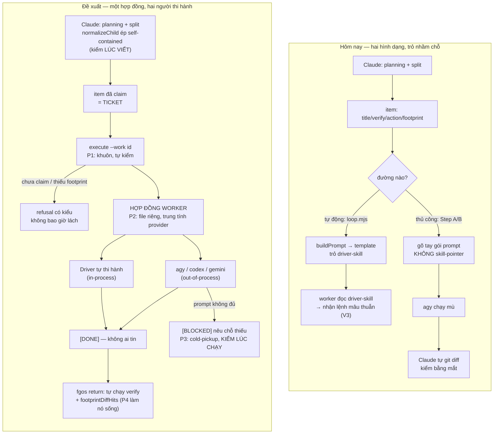

# DISCUSSION.md — dispatch: cơ chế kích hoạt & bàn giao

Item: `tsk-2uf` · bắt đầu 2026-08-18 · trạng thái: đã chia việc, 3 child thật (vòng 6)

---

## 1. Trạng thái hiện tại

Đã qua 6 vòng. **Thảo luận đã kết thúc và đã chia việc thật.**

Vòng 5 chốt hai điều lớn: tách driver/worker (D3) và trả lời tổng
quát-hay-coding — *cấu trúc tổng quát, nội dung của coding* (D4).

Vòng 6: nghiên cứu upstream `pi` (`e5dde9a`), **đính chính một khẳng định
sai của vòng 4** (xem §3 V13), rồi bàn giao qua
`fgos-coding-exploring` → `fgos-coding-planning` → `fgos-coding-validating`.
`CONTEXT.md` và `plan.md` đã viết, cả hai gate đã qua, và cổng-người của
engine đã bắt đúng chỗ footprint chồng lấn mà `plan.md` mới chỉ ghi bằng
prose — người dùng chọn `sequence`, thứ tự giờ khoá bằng `deps`
index-based.

**3 child đã thật:**

| id | risk | deps | việc |
|---|---|---|---|
| `tsk-2uf-1` | standard | — | cửa `execute --work <id>`, kiêm chỗ đòi `footprint` |
| `tsk-2uf-2` | heavy | `tsk-2uf-1` | tách driver/worker + hợp đồng worker + seam registry |
| `tsk-2uf-3` | standard | — | đăng ký capability slot advise/execute qua `fgos setup` |

**Đẻ thêm một item riêng:** `tsk-1xm` — ranh giới worker phải ép bằng
capability chứ không bằng prose (phát hiện từ `pi`, xem §3 V13).

Item cha `tsk-2uf` giờ neo bởi 3 child mở; nó không tự tiến được cho tới
khi cả ba xong.

## 2. Mục tiêu & đề bài

Mục tiêu gốc, do người dùng phát biểu trực tiếp và không đổi qua các vòng:
một model trí tuệ cao như Claude làm phần planning và phân mảnh task — và
**buộc phải** viết description của mỗi mảnh sao cho self-contained — sau đó
giao chính mảnh đó cho một provider chạy model rẻ hơn để thực thi. Đây là
mô hình kinh tế của cả hệ: trí tuệ đắt dùng cho việc chia việc và phán
đoán, sức lao động rẻ dùng cho việc thực thi đã được định nghĩa rõ. Vấn đề
cần giải quyết **không phải** "có nên đẩy ra ngoài không" — câu đó đã trả
lời rồi, là có — mà là ba chỗ chệch choạc trên đường đi: trigger phải nhạy
bén ở mọi điểm có thể dispatch, khi đã đúng điểm dispatch thì phải ép được
agent chuyển sang cơ chế của hệ thống chứ không để nó tự làm, và một khi đã
vào cơ chế thì bàn giao (handoff/return) phải rõ ràng và đáng tin cậy.
Người dùng cũng nêu một câu hỏi thiết kế trung tâm: mảnh handoff nên là một
*self-contained instruction-ticket* đầy đủ, hay nên tổ chức hệ thống chuẩn
chỉnh để mảnh handoff mỏng như một *predefined command*, còn agent nhận thì
đủ sức tự bootstrap và hoạt động linh hoạt theo chuẩn như Claude. Tiêu chí
người dùng đặt ra cho kết quả cuối: **rõ ràng, tường minh, chắc chắn, đơn
giản** — không ngại phạm vi lớn, không để legacy làm tê liệt.

---

## 3. Vấn đề rõ / chưa rõ

| # | Vấn đề | Trạng thái | Bằng chứng |
|---|---|---|---|
| V1 | Trigger có nhạy không | **Rõ — không** | Chỉ MỘT điểm ép bằng máy: hook `PreToolUse` matcher `"Agent\|Task"` → `scripts/dispatch-decide-hook.mjs` (`.claude/settings.json`). Mọi điểm khác chỉ là prose trong skill |
| V2 | Có ép được không | **Rõ — không** | Ngoài chỗ có hook là danh dự hoàn toàn |
| V3 | Bàn giao có tự mâu thuẫn không | **Rõ — có** | `worker-prompt-skill-pointer.txt` bảo worker đọc `{skillPath}` và cấm `"Never call fgos yourself"`; `fgos-coding-implement/SKILL.md` (đúng file được trỏ tới) lại bảo chạy `dispatch.mjs decide` (bước 2) và `fgos return <id>` (bước 5) |
| V4 | Lời hứa verify trong template có ai thực hiện không | **Rõ — chỉ nửa** | Template hứa *"the runner runs it itself after you finish"* — đúng trên `loop.mjs`, sai trên đường thủ công |
| V5 | Vì sao phải dựng prompt bằng tay | **Rõ** | `decide` CÓ `--work <id>` (`dispatch.mjs:2168`); `executeExecutorCli` KHÔNG có tham số `work` (`dispatch.mjs:1828-1843`) → không với tới `buildPrompt` (`dispatch.mjs:111`) |
| V6 | Vì sao agy chạy mù | **Rõ** | Hệ quả trực tiếp của V5: gói tay không có skill-pointer |
| V7 | Chi phí thật của bàn giao hiện tại | **Rõ, đo được** | tsk-3kl: ~25 tool call + 12m52s để chèn 19 dòng prose mà chính phiên Claude đã viết sẵn nguyên văn vào prompt |
| V8 | Kiểm tra ranh giới file có hiệu lực không | **Rõ — đang vô hiệu** | `footprintDiffHits` (`frozen-judge.mjs:89`) cờ mọi file ngoài `footprint`, nhưng D5 miễn trừ khi rỗng. tsk-3kl/tsk-38w đều rỗng |
| V9 | Cửa cho advise-lúc-planning có sẵn không | **Rõ — có, đang trống** | `decide --for <purpose>` đầy đủ; `.fgos/config.json` có `capabilities: []` |
| V10 | Ticket dày hay mỏng | **Rõ — câu hỏi sai** | beehive làm **mỏng + thẩm định ở đầu nhận** (cold-pickup). fgOS còn có tầng beehive không có: `normalizeChild` ép self-contained *lúc viết*. Giữ cả hai → §6 |
| V11 | Hợp đồng worker sống ở đâu | **Rõ — file riêng** | beehive `packages/bee/agents/bee-build.md.tmpl` chứng minh ở quy mô thật; fgOS đã sẵn kỷ luật mirror `_shared/`; nhét vào template thì rải luật ra các file còn phục vụ đường tự động |
| V13 | Nguyên tắc "ranh giới ép bằng capability" có với tới out-of-process không | **Rõ — CÓ. Đính chính vòng 4** | Vòng 4 kết luận không, vì beehive gắn `tools:` vào frontmatter subagent native Claude còn `agy` là cli-spawn. Tiền đề đúng, kết luận sai: `pi.md` § `built-in-tool-set` cho thấy agent cli-spawn-shaped vẫn nhận allowlist qua cờ CLI (`pi --tools read,grep,find,ls -p ...`). fgOS đã có `invocations[].args`. Hệ quả: `agy` đang chạy `--dangerously-skip-permissions` là gap thật → `tsk-1xm` |
| V12 | Có làm tầng "khuôn + lưới" riêng không | **Rõ — không cần tầng riêng** | Case của ta khác beehive: guard/prepare của họ kiểm **cùng một luật** (tier↔model khớp config) nên buộc phải gom; hook của ta kiểm *"đã hỏi decide chưa"*, khuôn kiểm *"lời gọi có hợp lệ không"* — **hai luật khác nhau, không có gì để trôi khỏi nhau**. P6 gộp vào P1 |

---

## 4. Quyết định đã chốt

| D-ID | Quyết định | Vì sao | Vòng |
|---|---|---|---|
| **D1** | **Đẩy việc ra provider ngoài là ĐÚNG**, không phải thứ cần giảm bớt. Vấn đề ở cơ chế kích hoạt và bàn giao. | Người dùng phát biểu vòng 2, giữ nguyên vòng 3. Bác khung "dispatch nổ khi không đáng" phiên này đề xuất vòng 1. | 2–3 |
| **D2** | **Phân vai theo trí tuệ:** model mạnh làm planning + phân mảnh với description self-contained; provider rẻ thực thi mảnh đã chia. | Mô hình kinh tế gốc, xác nhận vòng 2, không đổi vòng 3–5. | 2–5 |
| **D3** | **Tách `fgos-coding-implement` thành phần driver và phần worker.** Driver: claim/decide/dispatch/verify/return/Iron Law. Worker: làm trong ranh giới, chứng minh, báo token. **Phiên Claude khi không dispatch cũng thi hành đúng phần worker đó, y như agy.** | Phiên đề xuất vòng 4, người dùng chốt *"làm đi"* vòng 5. Giữ hai hình dạng riêng cho in-process/out-of-process là nguồn gốc phần lớn cảm giác cồng kềnh. | 4–5 |
| **D4** | **Hợp đồng worker: cấu trúc tổng quát, nội dung của coding.** Chỗ nối khai ở registry theo đúng khuôn opt-in per-domain của `roleGraph` (vắng mặt = domain đó không dispatch worker). Nội dung viết một bản cho coding, đặt tên coding-specific. | 3 domain ngoài `coding` trong `DOMAINS` đều tự khai *fixture/illustrative/disposable*, `skillMap` toàn `null`, `worktreeBacked: false`, không cái nào khai `roleGraph` — **không có consumer non-coding để tổng quát hoá cho**. Nội dung lại có 2 tầng: generic (chỉ là phần thực thi, ranh giới `footprint`, cold-pickup, token) và coding-specific (git commit, worktree, shell verify). Tên theo tiền lệ `fgos-coding-driving` D12: tên trung tính mời gọi dùng sai trước khi có bằng chứng. | 5 |

---

## 5. Q&A log

**Vòng 1 — 2026-08-18.** Phiên này đo 3 lần dispatch thật, khoanh thành 3
nhóm A/B/C và đề xuất A ("dispatch nổ khi không đáng") là gốc.

**Vòng 2 — người dùng bác khung này.** Nguyên văn: *"…vấn đề là cơ chế kích
hoạt, cơ chế bàn giao của chúng ta rườm rà, không hiệu quả, chứ không phải
việc đẩy ra ngoài là không đúng."* → D1, D2. Phiên này rút lại nhóm A, tìm
ra V5/V6.

**Vòng 3 — người dùng tách đề bài thành 3 chỗ chệch choạc**, nêu câu hỏi
ticket-dày-hay-mỏng, kể mẫu thấy ở nơi khác (Claude điều phối, codex advise
lúc planning, agy/gemini làm sau split). Phiên soi ra V1–V4, V9; lập luận
nghiêng ticket mỏng vì ticket dày có nghịch lý cố hữu (viết đủ dày thì
Claude làm hết việc trong lúc viết — đúng như tsk-3kl); nêu phân biệt
advise-vs-execute (giá trị từ *bất đồng* vs từ *tuân thủ*).

**Vòng 4 — người dùng yêu cầu nghiên cứu beehive.** Phiên đọc
`docs/distillery/sources/beehive.md` + checkout sống
`/home/vantt/projects/beegog` (`v2.7.0`). Phát hiện lớn nhất: beehive
**không chọn giữa dày và mỏng** — ticket mỏng, nhưng thẩm định
self-containedness ở **đầu nhận, lúc chạy** (cold-pickup refusal), phá được
nghịch lý vòng 3 → V10. Tìm thêm V8. Người dùng trả lời về phạm vi: *"anh
không quan tâm lớn nhỏ, đừng ngại breakout… rõ ràng, tường minh, chắc chắn
và đơn giản là thật sự quan trọng… đừng vì một legacy lại bỏ hết không làm
gì."*

**Vòng 5 — người dùng chốt `"làm đi, tách hai phần ra"` và hỏi: nó tổng
quát cho mọi việc sau này hay chỉ đơn thuần coding?** → D3, D4. Phiên tự
chốt V11 (file riêng) và hạ V12 (P6 gộp vào P1) sau khi phát hiện case của
fgOS khác case beehive về bản chất luật được kiểm.

---

**Vòng 6 — người dùng báo có upstream mới `pi`, hỏi có gì đáng ghép vào
mảnh đang làm.** Phiên đọc `docs/distillery/sources/pi.md` (`e5dde9a`,
chưng cất đúng cùng ngày). `pi` **cố ý không có sub-agent**, nên nó không
dạy điều phối — nó dạy **một worker runtime tử tế trông như thế nào**,
đúng câu hỏi hợp đồng worker đang hỏi. Ba thu hoạch:

1. **Đính chính vòng 4 (V13).** Kết luận "không bê nguyên được nguyên tắc
   capability của beehive" là **sai** — `pi --tools read,grep,find,ls -p
   "..."` chứng minh agent cli-spawn-shaped vẫn nhận allowlist qua cờ CLI.
   Nguyên tắc có với tới out-of-process, chỉ là qua `args` chứ không qua
   frontmatter. → item riêng `tsk-1xm`, không nhét vào child nào (khác cơ
   chế, khác file, và cần discovery thật về bề mặt permission của `agy`).
2. **Ràng buộc cách viết cho hợp đồng.** `pi` có `--mode json`/`--mode
   rpc` phát cùng bộ `AgentSessionEvent` dạng JSONL. Token cố định của ta
   đúng cho hôm nay (mẫu số chung thấp nhất), nhưng hợp đồng không được
   viết theo kiểu cấm đường một kênh có cấu trúc — kênh trả về là thuộc
   tính của từng executor. Đã gấp vào `action` của child 2.
3. **Chi tiết giữ cho sau:** JSONL framing phải LF-only; Node's
   `readline` **không tuân thủ** vì tách cả U+2028/U+2029 — hai ký tự hợp
   lệ trong chuỗi JSON.

Sau đó bàn giao: `fgos-coding-exploring` viết `CONTEXT.md` (D1–D4 render
từ log), `fgos-coding-planning` viết `plan.md` (lane high-risk, gộp 5
hạng mục còn 3 vì footprint chồng nhau), `fgos-coding-validating` chạy
cổng gộp. Hai chỗ vấp thật, đều đã sửa: một scout-table row của
`CONTEXT.md` chứa nguyên văn tên heading locked-decisions khiến regex
(không neo đầu dòng) cắt nhầm lát và verdict trả `invalid`; và `deps`
trong child spec hoá ra **index-based**, nối được ngay lúc viết chứ không
phải chờ id thật như bản nháp ghi. Cổng-người của engine bắt đúng chỗ
footprint chồng lấn `tsk-2uf-1 ↔ tsk-2uf-2`; người dùng chọn `sequence`.

---

## 6. Thiết kế đã chốt {#design}

### Nguyên tắc trung tâm, một câu

> **Một work item đã được claim CHÍNH LÀ cái ticket.** Không có gói prompt
> nào được dựng bằng tay, ở bất kỳ đâu, nữa.

### Trục chính: một hợp đồng, hai người có thể thi hành (D3)

Hôm nay fgOS lẫn hai thứ khác nhau vào một file skill — và template dispatch
trỏ vào nhầm cái, sinh ra mâu thuẫn V3:

| | Ai | Làm gì |
|---|---|---|
| **Driver** | phiên sở hữu vòng đời | claim, decide, dispatch, verify, return, Iron Law |
| **Worker** | *người thật sự làm việc* — chính driver, hoặc agy/codex/gemini | làm trong ranh giới, chứng minh, báo token |

Tách ra thì được thứ đắt giá hơn cả việc hết mâu thuẫn: **in-process và
out-of-process trở thành cùng một việc.** Driver hoặc tự thi hành hợp đồng
worker, hoặc giao nó cho người khác — hợp đồng y hệt nhau. Đó là chỗ "đơn
giản" thật, không phải dọn cho gọn mắt.

### Tổng quát ở đâu, cụ thể ở đâu (D4)

Nội dung hợp đồng worker có hai tầng, và chúng cần đối xử khác nhau:

| Tầng | Nội dung | Xử lý |
|---|---|---|
| **Generic** | chỉ là phần thực thi, không claim việc khác · ranh giới là `footprint` của item · cold-pickup refusal · token trả về cố định · gate/quyết định thuộc người | **chỗ nối** khai ở registry, khuôn opt-in per-domain y như `roleGraph` |
| **Coding-specific** | commit lên branch · ranh giới worktree · verify là lệnh shell | **nội dung** viết một bản cho coding, tên coding-specific |

Vắng mặt trong registry = domain đó không dispatch worker, đúng cách ba
skill hiện đọc `roleGraph` hôm nay. Khi có domain thật thứ hai, nó khai
contract của chính nó — không ai sửa contract của coding, và không ai lỡ
tay dùng contract của coding cho việc không phải code.

### Năm mảnh

**P1 — `execute --work <id>`: item trở thành payload, và là cái khuôn.**
Đóng bất đối xứng `decide` có `--work` / `execute` không. Dùng lại
`buildPrompt`. Xoá file scratchpad viết tay, xoá phần lớn lý do phải có
wrapper script (hết `$(cat ...)` cho guard vướng).
Vì nó đọc item, nó **từ chối phát payload khi item chưa `doing`** —
claim-ownership của beehive, đạt bằng cơ chế claim fgOS đã có. Câu của họ
đáng chép: *"payload dispatch LÀ thẩm quyền hành động trên cell — prepare
không được phát nó cho người chưa cầm claim."*
Đây cũng là **cái khuôn** (V12): nó kiểm *tính hợp lệ của lời gọi*, trả
refusal có kiểu, không bao giờ lách. Hook vẫn là lưới, kiểm luật khác —
hai bên không trùng nên không cần gom.

> Ranh giới với quyết định đã khoá: `tsk-5tm-3` D5 cấm `execute` **quyết
> định lại cơ chế**. P1 **không** quyết lại cơ chế — chỉ kiểm lời gọi hợp
> lệ. Hai việc khác nhau.

**P2 — Hợp đồng worker: file riêng, trung tính provider, template trỏ vào.**
Thay cho việc trỏ vào driver-skill → xoá V3. Không phải agent-type file
kiểu Claude (chỉ chạy với subagent native). Mirror theo kỷ luật `_shared/`.
Nội dung học từ `packages/bee/agents/bee-build.md.tmpl`:

- nạp Execute-loop của `<skillPath>` — **vẫn là con trỏ, ticket vẫn mỏng**
- bạn CHỈ là phần thực thi; không claim việc khác; không gọi verb ghi state
- ranh giới là `footprint`; file không được nêu tên là **câu hỏi phạm vi cho
  orchestrator, không phải quyết định của bạn**
- **cold-pickup**: bạn không thấy gì ngoài prompt này; không đủ thì trả
  `[BLOCKED]` **nêu đúng chỗ thiếu**, tuyệt đối không đoán
- trả về đúng một token cố định
- gate/quyết định/phê duyệt thuộc người; tổng hợp thuộc orchestrator

**P3 — Token cố định, và không ai tin token đó.**
`[DONE] [BLOCKED] [HANDOFF] [NOOP]` — máy đọc được, thay prose tự do phải
đọc bằng mắt. Niềm tin đến từ `fgos return`, thứ **đã** tự chạy verify +
kiểm tree sạch + history tiến + `footprintDiffHits` + `frozenJudgeHits`.
Hệ quả: phiên sống **thôi tự `git diff` kiểm tay** — đúng thứ đã làm 2 lần.

**P4 — `footprint` bắt buộc trước dispatch.**
V8: máy kiểm ranh giới đã có nhưng ăn không. `normalizeChild` ép `footprint`
cho child của split; item pass-through thì không. `execute --work` đòi
`footprint`, hoặc ghi audit *unverified* khi rỗng. Biến kiểm tra chết thành
sống, không cần cỗ máy mới.

**P5 — Tách slot advise / execute; lấp `capabilities` đang rỗng.**
Thuần config. `--for advise` → codex; `--for execute` → agy. Đúng mẫu người
dùng thấy ở nơi khác, đúng phân biệt advise-vs-execute vòng 3. beehive cưỡng
chế bằng `PURPOSE MAP`: advisor có slot riêng, **không bao giờ bị ép về slot
generation**.

### Trả lời câu hỏi trung tâm (V10): hai lớp, không phải một

Ticket dày hay mỏng là câu hỏi sai. Đúng là **mỏng + hai lớp kiểm**:

| Lớp | Ở đâu | Bắt được gì | Của ai |
|---|---|---|---|
| Kiểm **lúc viết** | `normalizeChild` (`plan.mjs:175-219`) — từ chối verdict nếu child thiếu `verify` thật hoặc `action` không trích được D-ID có thật | lỗi **trước khi tiêu tiền** | **của fgOS** — beehive không có |
| Kiểm **lúc chạy** | cold-pickup: *"If the cell cannot be executed from that prompt alone… report `[BLOCKED]` naming the gap rather than guessing"* | thứ lúc-viết không thể thấy | của beehive |

Có cả hai chặt hơn hẳn từng cái. Và nó phá nghịch lý vòng 3: **không cần**
viết ticket dày, vì mỏng quá thì worker trả `[BLOCKED]` chỉ đúng chỗ thiếu
— rẻ, nhanh, dạy hệ thống ticket cần gì mà không phải đoán trước.

### Lấy gì của họ, giữ gì của mình

| Lấy của beehive | Giữ của fgOS (tốt hơn của họ) | Không bê |
|---|---|---|
| Hợp đồng worker là file riêng, vẫn trỏ skill | `normalizeChild` ép self-contained **lúc viết** | `PINNED_AGENT_TYPE` gắn `model:` vào frontmatter — chỉ chạy với subagent native Claude |
| Cold-pickup refusal | Nền executor/adapter + `allowCrossProvider` — đúng nền cho mục tiêu đa-provider của D2 | `evaluateDispatch` gom guard+prepare — luật của ta không trùng nhau (V12) |
| Return token cố định | Ba trục `status`/`stage`/`role` + verb `handoff` | |
| Claim-ownership là điều kiện phát payload | Bộ chứng minh sẵn có của `fgos return` | |
| Staleness bằng **sự kiện**, không bằng TTL (*"AO13 đã một lần bỏng vì một con số bịa"*) | Khuôn opt-in per-domain của `roleGraph` (nền cho D4) | |
| Tách **tiền-điều-kiện cơ học** khỏi **checkpoint của người** | | |

**Mảnh ở giữa, không bên nào có:** `execute --work <id>` — thứ làm nền fgOS
với tới được cơ chế beehive.

### Hình

---

## 7. Danh mục hạng mục / task {#tasks}

> P1 mở đường cho P2–P4. P5 độc lập hoàn toàn, làm được ngay.

### {#task-execute-work-door} P1 — cửa `execute --work <id>` (kiêm khuôn)

- **Mục tiêu:** `executeExecutorCli` nhận `work`, phân giải item, dựng
  prompt qua `buildPrompt`; từ chối có kiểu khi item chưa `doing` hoặc
  thiếu `footprint`.
- **Trích §6:** *"Một work item đã được claim CHÍNH LÀ cái ticket."*
- **D-ID:** D2 (mảnh đã chia phải giao được mà không cần dựng gói bằng tay).
- **Quan hệ:** chặn P2/P3/P4. Đã hấp thụ P6 cũ (V12).
- **Verify nháp:** `node --test test/runner/dispatch.test.mjs`

### {#task-worker-contract} P2 — tách driver/worker + hợp đồng worker

- **Mục tiêu:** tách `fgos-coding-implement` theo D3; viết hợp đồng worker
  thành file riêng, tên coding-specific; khai chỗ nối vào registry theo
  khuôn opt-in của `roleGraph` (D4); template trỏ vào contract thay cho
  driver-skill → xoá V3.
- **Trích §6:** *"in-process và out-of-process trở thành cùng một việc."*
- **D-ID:** D1, D3, D4.
- **Quan hệ:** cần P1; là nơi P3 phát biểu token.
- **Verify nháp:** `node --test test/skills/fgos-mirror.test.mjs` + kiểm
  template không còn trỏ driver-skill.

### {#task-return-token-and-trust} P3 — token cố định, niềm tin ở `return`

- **Mục tiêu:** `[DONE]/[BLOCKED]/[HANDOFF]/[NOOP]`; cold-pickup refusal;
  bỏ hẳn bước phiên sống tự `git diff` kiểm tay.
- **Trích §6:** *"không ai tin token đó."*
- **D-ID:** D1, D3.
- **Quan hệ:** cần P2 (token phát biểu trong hợp đồng).

### {#task-footprint-required} P4 — `footprint` bắt buộc trước dispatch

- **Mục tiêu:** biến `footprintDiffHits` từ chết thành sống cho item
  pass-through (V8).
- **Trích §6:** *"Biến kiểm tra chết thành sống, không cần cỗ máy mới."*
- **D-ID:** D2.
- **Quan hệ:** cần P1 (chỗ đòi `footprint` nằm ở khuôn).

### {#task-advise-execute-slots} P5 — tách slot advise / execute

- **Mục tiêu:** lấp `capabilities: []`; `--for advise` → codex,
  `--for execute` → agy.
- **Trích §6:** *"advisor có slot riêng, không bao giờ bị ép về slot
  generation."*
- **D-ID:** D2.
- **Quan hệ:** **độc lập hoàn toàn** — thuần config, không chờ P1. Rẻ nhất.
