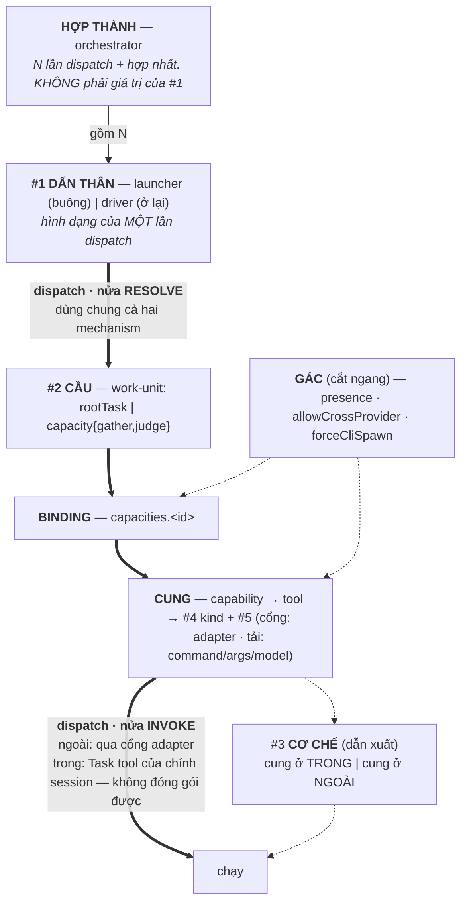
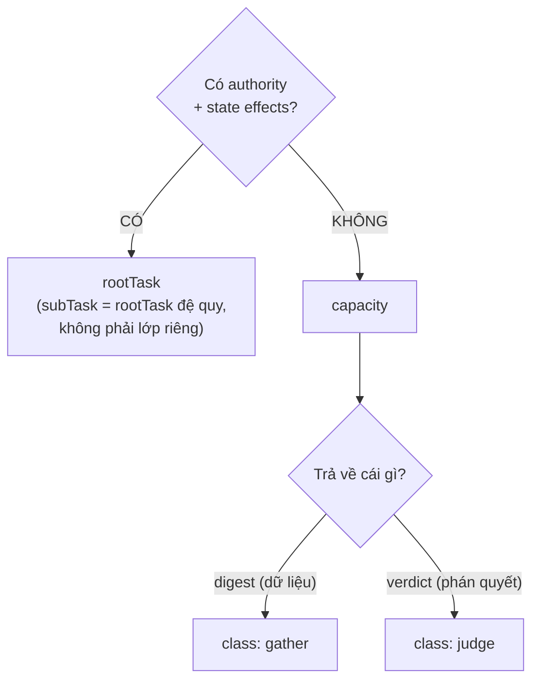

# Ranh giới khái niệm tầng dispatch — DISCUSSION

Item: `tsk-5td`. Liên quan: `tsk-2cw` (đổi `orchestrator`→`launcher`, giữ chỗ
`orchestrator`), `tsk-5kn` (đã sở hữu khái niệm gather / fan-out A, D1–D17 khoá),
`tsk-2t6` (two-layer-dispatch, D4/D9 gác exec packet B2), `tsk-umc`
(execution-fanout, D1–D10).

## 1. Trạng thái hiện tại

Vòng 9 (2026-08-08). **D1 và D2 vẫn là hai D-ID duy nhất đã mint** — cả hai
giữ qua tám vòng không bị lật, và vòng 6 còn củng cố chúng thêm (xem dưới).
Mọi thứ vòng 5–9 nêu ra đều **mới một vòng, chưa mint**.

Đang ở **Bước 0** của kế hoạch sáu bước (trả nợ §6 rồi mới chốt tầng). §6 đã
regenerate xong; vòng 9 là vòng rà chi tiết đầu tiên trên bản mới.

> ✅ **§6 đã regenerate (lần 2, bản sau vòng 8)** — vòng 5–8 đã gấp vào, kể cả
> phần "phía cung" trước đây thiếu hẳn. Đọc **§6 là đủ** để hiểu thiết kế; §5
> chỉ cần khi muốn nguyên văn Q&A một vòng cụ thể. §6 ghi rõ độ chín từng mục
> ([KHOÁ] / [HỘI TỤ] / [HỞ]) vì phần lớn nội dung ở đó **chưa mint**.

Đường đi tám vòng:

| Vòng | Việc | Kết quả |
|---|---|---|
| 1 | Scout `dispatch.mjs` + đọc thẳng upstream bee | Phát hiện bee có **ba** lớp (không phải hai), và tiêu chí của bee là **authority + state effects, không phải kích thước việc**. Chiếu sang fgOS: cả ba `capacity` hiện có đều là review-class; **chưa từng có** capacity nào thuộc lớp gather |
| 2 | Người dùng xác nhận tách gather khỏi judge; scout từ vựng sẵn có | Không cần phát minh tên — `judge`/`verdict` đã vào **code** (186 + 38 hit), `gather`/`digest` đã ghim ở **doc** (`tsk-5kn`). Bất đối xứng này tự xác nhận chẩn đoán vòng 1 |
| 3 | Người dùng báo bị lẫn *"đang phân loại cái gì"* ⇒ lùi lại dựng khung high-level | Lộ ra gốc của lộn xộn: **không phải một phân loại**, mà nhiều chiều bị đọc chung; một khối `capacities.<id>` mang câu trả lời cho nhiều chiều cùng lúc. Khung được xác nhận khớp ⇒ thành xương sống §6 |
| 4 | Người dùng hỏi *"#3 và #4 có trùng nhau không"* | **Lật một phần khung vòng 3.** Code xác nhận `hasNativeMechanism = capacity.kind === 'task'` ⇒ #3 là **dẫn xuất** của #4, không độc lập. Khung sửa thành **bốn chiều khai báo + một kết quả dẫn xuất**. Đổi lại: lý giải được vì sao `EXECUTOR_ADAPTERS` không có key `native`, và vì sao `inline` khó thành giá trị hạng nhất |
| 5 | Kiểm kê lại theo yêu cầu người dùng: phân định `rootTask`/`subTask`/`capacity` và ranh giới với `capability` | Scout lật một phần tiền đề: chồng lấn **không** nằm ở `capability` mà ở `name` — `capability` chỉ được đọc ở 3 chỗ, **không chỗ nào là dispatch**. Khung đề xuất: hai trục (đơn vị việc / capability). Đặt tên trục I |
| 5b | Người dùng chọn `work-unit` làm tên trục I | Va chạm: 0003 + system-overview đã khoá *"đơn vị việc"* = entity `work`, *"duy nhất"*. Giải bằng cách siết: `work` là giá trị **được lưu** duy nhất trên trục, không phải cả trục |
| 6 | Người dùng: *"trục 1 và trục 2 overlap; trục 2 là backend của trục 1"* | **Lật khung vòng 5.** Deep-dive tự viết của fgOS mang câu luật gốc (US-027): *"the core consults capabilities, never tools"*. Không phải hai trục — là **một quan hệ, hai phía**: cầu (#2) và cung (#4+#5), `capability` là khớp nối hợp lệ duy nhất. Bốn suy dẫn độc lập hội tụ. Lộ ra 5 điều chỉnh A1–A5, trong đó A2 là khiếm khuyết **sống** |
| 7 | Người dùng yêu cầu vẽ lại tổng quan theo khung tạm | Kiểm kê đầy đủ cái còn / cái mất / cái hở. Xác nhận: **không chiều nào trong năm chiều bị xoá** — reframe chỉ thêm một cách đọc |
| 8 | Người dùng hỏi ba chỗ hình vòng 7 im lặng: *dispatch đi đâu · adapter ở đâu · launcher/driver/orchestrator không cùng layer* | **Cùng một bệnh, lần thứ ba** (sau vòng 4 và vòng 6): một ô mang hai câu trả lời. `dispatch` = **cạnh**, tách `resolve`/`invoke` ⇒ giải luôn §3 hàng 12 và sửa chẩn đoán hàng 1–2. `adapter` = **cổng**, và trùng-chuỗi `'cli-spawn'` với mechanism cho **suy dẫn thứ 5** xác nhận A3. `#1` gộp **arity** với **engagement**; `orchestrator` là **hợp thành**, không phải ô thứ ba |

| 9 | §6 regenerate xong (Bước 0). Người dùng rà chi tiết: *"#4 nên gọi transport hay protocol?"* | **Cả hai đều sai.** `mcp`/`skill` chung nhánh probe nhưng transport ngược nhau ⇒ không phải transport; `cli`/`binary` hai giá trị một protocol ⇒ không phải protocol. `kind` = **loại nhà cung cấp** (*nhà cung cấp nằm ở đâu*). Cho **suy dẫn thứ sáu** xác nhận A3: mechanism là phép chiếu thô của `kind` xuống trong/ngoài. Ô chưa xếp mới: `cli` vs `binary` zero khác biệt cơ học |

**Điểm quan trọng nhất để một người quay lại đọc:** mọi tranh luận trong phiên
này chỉ đụng **câu hỏi #2** của khung §6 (*giao cái gì*) và cách #2 nối sang
#4/#5. Chiều #1 (`tsk-2cw`) không bị đụng, và không chiều nào bị xoá. Trước khi
bàn tiếp bất cứ điều gì, nói rõ đang bàn câu số mấy.

## 2. Mục tiêu & đề bài

fgOS đang có một tầng dispatch trưởng thành nhưng từ vựng của nó đã trôi khỏi
thứ nó thật sự làm, ở hai chỗ không tách rời được. Chỗ thứ nhất là bản thân
module: `src/runner/dispatch.mjs` đã phình thành 1186 dòng ôm sáu trách nhiệm
khác hẳn nhau, và — quan trọng hơn kích thước — nó chỉ phục vụ đúng **nửa
cli-spawn** của thế giới, trong khi cái tên `dispatch` hứa quản cả hai cơ chế;
đây đúng cùng một lỗi "tên hứa rộng hơn thứ nó làm" mà `orchestrator` vừa bị
bắt và đang được sửa ở `tsk-2cw`. Chỗ thứ hai là trục phân loại đơn vị việc
(trục A: `rootTask`/`subTask`/`capacity`, khoá ở decision 0026): người dùng
nhận ra bee đã tách sẵn gather-work khỏi executing-work bằng một tiêu chí sắc
hơn cái fgOS đang dùng, và muốn gom bài học đó vào trục A thay vì để nó nằm
rải trong prose skill. Mục tiêu phiên này là quyết định từ vựng và ranh giới
khái niệm cho cả hai chỗ — chưa phải thiết kế cách thi công, và tuyệt đối
không mở lại những quyết định các item khác đã khoá.

## 3. Vấn đề rõ / chưa rõ

| # | Điểm | Trạng thái | Bằng chứng / ghi chú |
|---|---|---|---|
| 1 | `dispatch.mjs` ôm 6 trách nhiệm | **Rõ** | 1186 dòng, 22 export. Config ~40% · payload · policy/resolution ~20% · decision ~3% · governance ~5% · execution ~25% |
| 2 | Module chỉ phục vụ nửa cli-spawn | **Rõ** | 21/22 export chỉ dùng cho nhánh cli-spawn. Chỉ `decideDispatchMechanism` (hàm thuần, không đọc config) phục vụ cả hai. `EXECUTOR_ADAPTERS` chỉ có đúng 1 key `'cli-spawn'` — không bao giờ có key `'native'` vì native theo cấu trúc không thể là adapter |
| 3 | `resolveExecutorConfig` nhồi 3 concern | **Rõ** | governance (presence-check) + policy (3 tầng `byCapacity ?? executors[tier] ?? executor`) + governance (`allowCrossProvider`). Blast radius CRITICAL: 8 upstream symbol, 7 execution flow. `tsk-3ik` đã **cố tình né** nó một lần — xây `decideDispatchMechanism` làm sibling thuần-đọc thay vì sửa vào trong |
| 4 | Bee có **ba** lớp, không phải hai | **Rõ** | `routing-and-contracts.md:342` — xem §5 vòng 1 để đọc nguyên văn |
| 5 | Tiêu chí phân định của bee | **Rõ** | *"distinguished from the I/O-offload worker by **authority and state effects**, not by task size"* — sắc hơn hẳn tiêu chí "vòng đời đầy đủ hay không" của trục A |
| 6 | Cả 3 capacity fgOS đều là review-class | **Rõ** | `judge-discovery` (phán clear/không) · `judge-decompose` (phán split/không) · `submit-assist-classify` (phán tier/kind/risk) — cả ba trả **phán quyết**, không trả **digest dữ liệu** |
| 7 | Gather của fgOS không có chỗ trong trục A | **Rõ** | `fgos-researching`'s D2 fan-out gọi thẳng Agent tool, không qua `capacities.<id>`, không config check, không log. Xác nhận sống bằng `tsk-o4l` (2026-08-08) |
| 8 | Trục A nhận chiều gather/execute thế nào | **CHỐT → D1** | Không phải hai trục vuông góc — hình **cây hai tầng** |
| 8b | Tách review khỏi gather | **CHỐT → D2** | Hai loại lỗi khác nhau ⇒ hai cách sửa khác nhau |
| 8c | Tên hai lớp con | **CHỐT → D2** | `gather`/`judge`, cả hai đã sống sẵn trong repo |
| 8d | Khung các chiều của dispatch | **Đang hội tụ, ĐÃ SỬA vòng 4** | Xương sống §6. Bản vòng 3 nói "năm câu hỏi độc lập" — **sai**; vòng 4 sửa thành **bốn chiều khai báo + một kết quả dẫn xuất** (#3 mechanism suy ra từ #4 kind + runtime). Gốc của lộn xộn không phải tên sai mà là khai-báo bị đọc lẫn với dẫn-xuất |
| 8f | `inline` là dẫn xuất, không phải giá trị khai báo | **Rõ** (vòng 4) | Kéo theo: muốn đo `inline` thì phải **ghi lại kết quả dẫn xuất** tại mỗi lần dispatch, không phải thêm một giá trị vào `kind`. Cùng khuôn `derived-never-stored` fgOS đã dùng (`frontier`, `computeSchedule`, `footprintOverlap`) |
| 8e | Giữ `capacity` làm ô cha + field `class` | **Đang hội tụ** (vòng 3, mới một vòng) | Giữ vì `capacities.<id>` đã là config key thật (bỏ = breaking). Siết định nghĩa: từ *"helper hẹp"* (mờ) sang *"đơn vị dispatch không mang authority/state effects"*. Field phân lớp là `class` (người dùng chọn, trên `returns`) vì `kind` đã bị chiếm cho **loại nhà cung cấp** (§6.3) |
| 9 | Gác theo mục đích vs gác theo target | **Chưa rõ** | Bee gác `for:'gather'`; fgOS gác theo capacity id. Liên đới cổng `allowCrossProvider` per-capacity → per-dispatch (đã ghi nhận cần sửa, chưa xác nhận đã sửa) |
| 10 | `inline` có thành mechanism hạng nhất | **Chưa rõ** | Hiện là "trạng thái vắng mặt" ⇒ không log được, không đo được |
| 11 | `dispatch` giữ nghĩa hẹp hay rộng | **Chưa rõ** | Nếu hẹp thì subsystem cần tên gì |
| 12 | Nửa native không có module nhà | **Chưa rõ** | Thiếu sót, hay bản chất (native = trong session, không đóng gói được)? |
| 13 | Tách config khỏi `dispatch.mjs` | **Chưa rõ** | Đã có `src/config/` + `src/setup/config-merge.mjs`. Có thuộc phiên này không? |
| 14 | Chồng lấn `capacity`/`capability` nằm ở đâu | **Rõ** (vòng 5) | **Không** ở `capability`. `capability` chỉ đọc ở 3 chỗ (`tool-registry.mjs:84` normalize · `command-registry.mjs:934` khai flag · `bin/fgos.mjs:3873` filter của `tool query`) — **không chỗ nào là dispatch**. Khoá nối thật là **`name`**: `dispatch.mjs:604` `if (!tools[capacityId])`, và `tools` keyed theo `name` |
| 15 | Tên trục phía cầu = `work-unit` | **Đang hội tụ** (vòng 5b, mới một vòng) | Va chạm với `0003:24` (*"Entity đơn vị việc = `work`"*) + `system-overview.md:31` (*"Đơn vị việc DUY NHẤT"*). Giải: 0003 nói về **entity được lưu**, không nói về trục ⇒ `work` là giá trị **được-lưu** duy nhất trên trục. Phải sửa `system-overview:31` một dòng |
| 16 | Quan hệ cầu↔cung: không phải hai trục | **Đang hội tụ** (vòng 6, mới một vòng) | Một quan hệ hai phía. `capability` = khớp nối hợp lệ duy nhất (US-027, `deep-dives/tool-registry.md:27`). Bốn suy dẫn độc lập hội tụ — xem §5 vòng 6 |
| 17 | `capacity` mang hai nghĩa (A1) | **Đang hội tụ** (vòng 6) | (a) lớp work-unit (D1/D2) · (b) bản ghi binding `capacities.<id>` mang #4+#5. **Khác tập hợp**: gather của `fgos-researching` là (a) mà không có (b) ⇒ khác khái niệm |
| 18 | Binding nối bằng `name`, không phải `capability` (A2) | **Rõ, là khiếm khuyết SỐNG** (vòng 6) | Vi phạm đúng luật khiến registry đáng port. Hệ quả đo được: provider thứ hai của cùng capability **không bao giờ** thoả được một capacity. Câu CLAUDE.md tự hứa (*"not the only one this gate can ever recognize"*) đúng với prose, **sai với dispatch** |
| 19 | #3 phát biểu lại: cung ở trong hay ngoài (A3) | **Đang hội tụ** (vòng 6) | `native` = nhà cung cấp là chính session gọi; `cli-spawn` = tiến trình khác. Bằng chứng: `KINDS` **không có** `task` (`CAPACITY_KINDS = [...KINDS, 'task']`) — `task` là kind duy nhất không đăng ký được, vì không ai đăng ký chính mình |
| 20 | Presence check gác theo vận chuyển, không theo nhà cung cấp (A4) | **Rõ, latent** (vòng 6) | `dispatch.mjs:603` + `:630` đều gác `kind === 'cli'`. Capacity `mcp`/`skill`/`http`/`binary` dispatch với **zero** presence check và **zero** cross-provider check. Vị từ đúng là `kind !== 'task'` — **đúng vị từ của A3**. Latent: chưa capacity nào thuộc 4 kind đó |
| 21 | Hai sổ tả cùng backend, không đối chiếu (A5) | **Rõ, latent** (vòng 6) | `capacities.submit-assist-classify` (kind cli, command agy) và `tools.submit-assist-classify` (kind cli, command agy) nối bằng name, **không so khớp**. Lệch thì dispatch dùng bản capacity, probe dùng bản tool |
| 22 | Phép thử cơ học cho D1 | **Đang hội tụ** (vòng 6) | Chuỗi nhân quả: state effects → cần vòng đời bảo vệ → cần id ổn định gắn vòng đời → **nằm trong event log**. Nên *"có id trong `.fgos/events.jsonl`"* không cạnh tranh với D1 — nó là **đầu quan sát được** của chính D1. Trả lời thẳng yêu cầu "tiêu chí test được" |
| 23 | `subTask` sau D1/D2 | **Đang hội tụ** (vòng 5) | Vẫn **không** phải lớp riêng — D1 củng cố 0026 (0026 lý giải bằng *cùng vòng đời* = hệ quả; D1 bằng *cùng câu trả lời authority* = nguyên nhân). Nhưng chữ này nói *ai giao* ⇒ thuộc **#1**, là từ **quan hệ** (field `work.parent`, `work.mjs:414`), không phải từ **phân lớp** |
| 24 | `class: transform` — lớp thứ ba? | **Chưa rõ** | Ứng viên: nhận input, trả **dạng dẫn xuất của chính input**, không đọc state ngoài (khác gather), không áp tiêu chí phán (khác judge). **Chưa tìm ra ca sống nào** — khác gather (0 đăng ký nhưng có ca sống `tsk-o4l`) |
| 26 | `dispatch` là gì trong khung | **Đang hội tụ** (vòng 8) | Là **cạnh**, không phải nút — mấy mũi tên cầu→binding→cung→chạy. Tách hai nửa: **resolve** (dùng chung cả hai mechanism) và **invoke** (external qua adapter; internal là Task tool của chính session) |
| 27 | Chẩn đoán `dispatch.mjs` sửa lại | **Đang hội tụ** (vòng 8) | "1186 dòng / 6 trách nhiệm" (hàng 1–2) là **triệu chứng**. Bệnh: trộn `resolve` (dùng chung) với `invoke-external` (một mechanism), rồi đặt tên theo cả act. Bằng chứng khớp: `decideDispatchMechanism` là hàm thuần **không đọc config** (= thuần resolve) và là export duy nhất phục vụ cả hai. Đường cắt đúng: **resolve/invoke**, không phải "chia 6" |
| 12b | Nửa native không có module nhà (giải hàng 12) | **Đang hội tụ** (vòng 8) | **Nửa nạc nửa mỡ**: `invoke` native là **bản chất** (session gọi tool của chính nó, không có biên để bắc cầu ⇒ không đóng gói được); `resolve` native là **thiếu sót** (đóng gói được, nhưng đang nằm trong module đặt tên theo cả act và định hình chỉ cho nhánh external) |
| 28 | `adapter` là gì | **Đang hội tụ** (vòng 8) | Là **cổng** (port) — doc comment tự khai *"the executor **port** is now a NAMED interface"* (`dispatch.mjs:818-830`). ⇒ #5 tách đôi: **cổng** (`adapter`) + **tải** (`command`/`args`/`model` qua `tier`) |
| 29 | `adapter` — suy dẫn thứ 5 cho A3 | **Rõ** (vòng 8) | `EXECUTOR_ADAPTERS` đúng 1 key, `DEFAULT_ADAPTER = 'cli-spawn'` — **trùng chuỗi** với giá trị mechanism #3 (dẫn xuất). Hai tầng khác nhau đội chung một chuỗi, hôm nay không phân biệt được vì chỉ có một adapter. Ngày `rpc`/`app-server` (đã deferred, cùng doc comment) được đăng ký: nhà cung cấp vẫn **ngoài** nhưng adapter là `rpc` ⇒ tên `cli-spawn` cho **mechanism** thành sai. Xác nhận A3 từ hướng hoàn toàn khác |
| 30 | #1 gộp hai câu hỏi | **Đang hội tụ** (vòng 8) — **đụng `tsk-2cw`, chờ người dùng** | `0028` (accepted, supersedes 0026) đã lập luận sẵn hai tính chất độc lập: **arity** (1 vs N) và **có ở lại không** (bước ra vs giữ liên hệ liên tục). Bảng: (1,buông)=`launcher` · (1,ở lại)=`driver` · (N,ở lại)=`orchestrator` · (N,buông)=**trống**. `0026`: *"Vai trò launcher KHÔNG CẦN soul ... THUẦN CƠ HỌC"* ⇒ nhu-cầu-phán-đoán bám theo **cột**, không theo arity |
| 31 | `orchestrator` là tầng trên, không phải ô thứ ba | **Đang hội tụ** (vòng 8) | `fgos-fanout` spawn N Agent, **mỗi Agent chạy `/fgOS:pick` end-to-end** ⇒ mỗi cái là một `driver`. Nên orchestrator = **hợp thành** (N lần dấn thân con), không phải anh em ngang hàng. Đề xuất: #1 rút về **2 giá trị**, `orchestrator` ra khỏi enum lên tầng hợp thành — đúng chỗ `tsk-2cw` đang chừa |
| 32 | Nhãn đúng của #4 (`kind`) | **Đang hội tụ** (vòng 9) | **Không phải** transport (`mcp`/`skill` chung nhánh probe nhưng transport ngược nhau), **không phải** protocol (`cli`/`binary` hai giá trị một protocol). Là **loại nhà cung cấp** — *nhà cung cấp nằm ở đâu*. Ba phép thử + suy dẫn thứ sáu cho A3: §6.3 |
| 33 | `cli` vs `binary` | **Chưa xếp** (vòng 9) | Hai giá trị, **zero khác biệt cơ học**: cùng `commandExistsOnPath`, cùng đường dispatch. Ghi nhận, chưa đào |
| 25 | Ô trống có-state-effects / không-authority (B2) | **Chưa rõ, latent** | D1 gộp `authority + state effects` thành MỘT vị từ. exec packet B2 rơi đúng khe giữa. Đang gated (`tsk-2t6` D4/D9, điều kiện (b) chưa thỏa) ⇒ chưa sống. Ngày B2 mở, vị từ D1 phải tách đôi |

## 4. Quyết định đã chốt

| D-ID | Quyết định | Vòng nêu → vòng chốt |
|---|---|---|
| **D1** | **Tiêu chí phân lớp đơn vị việc là *authority + state effects*, không phải *vòng đời đầy đủ*** — mượn thẳng tiêu chí bee (`routing-and-contracts.md:342`: *"distinguished by authority and state effects, not by task size"*). Hệ quả hình dạng: đây **không** phải chiều thứ hai vuông góc với trục A, mà là **cây hai tầng** — tầng 1 hỏi *có authority + state effects không*, tầng 2 (chỉ nhánh KHÔNG) hỏi *trả về cái gì*. Lý do bác "vuông góc": một `rootTask` không bao giờ có thể là gather, nên hai chiều không độc lập. Lý do tiêu chí này sắc hơn: vòng đời (claim/reserve/verify/merge) tồn tại **chính vì** có state effects cần bảo vệ — trục A cũ lấy *hệ quả* làm tiêu chí, bee lấy *nguyên nhân* | 1 → 3 |
| **D2** | **Nhánh không-authority tách làm hai lớp: `gather` (trả `digest`) và `judge` (trả `verdict`)** — không phải một. Lý do tách: hai loại lỗi khác nhau ⇒ hai cách sửa khác nhau (digest sai vì *đọc thiếu* → đọc lại/rộng hơn; verdict sai vì *phán sai* → cần người hoặc đổi tiêu chí); trộn lại thì mất tín hiệu sửa lỗi. Tên **không phát minh mới** — cả hai cặp `<lớp> → <cái nó trả về>` đã sống sẵn trong repo (§5 vòng 2). Bee cũng tách đúng chỗ này, gọi review-class là *"neither class"* | 1 → 3 |

## 5. Q&A log

### Vòng 1 — 2026-08-08

**Người dùng:** muốn bàn sâu chỗ `dispatch` ("chúng ta có nguyên một lib lớn
dispatch để quản chuyện này bao gồm 3 loại task, các loại agent, provider,
tier"). Xác nhận "3 loại task" ý là **trục A**, và muốn gom concept của bee
vào trục A — bee có io/gather work và executing work.

**Scout `dispatch.mjs`** — 1186 dòng, 22 export, 6 trách nhiệm (§3 hàng 1–3).

**Scout bee — nguyên văn, chép vào đây vì `upstreams/` là gitignored (không
tồn tại trong worktree, vòng sau không đọc lại được):**

`upstreams/bee/AGENTS.md:77`, rule 12:

> **Fan out the gathering; keep the deciding.** The session model is the
> orchestrator; mechanical gather/render/mine steps dispatch down-tier as I/O
> workers that return digests — delegate whenever you need the content as a
> digest, not verbatim. **Decide-altitude never delegates:** gates, synthesis,
> state writes, and conversation with the human stay on the session model.
> Transport is mandatory on every dispatch: a `model` param, or an anchored
> `[bee-tier: <tier>]` marker as the first thing in the prompt or description,
> plus the model name in the description — a bare dispatch is denied (decision
> 0023). [...] never zero I/O workers, and never zero *execution* workers for
> tiny/small cells (AO14).

`upstreams/bee/skills/bee-hive/references/routing-and-contracts.md:340-342`:

> - **Digest contract** — an I/O worker returns paths read, the facts extracted
>   (with file:line anchors), and verbatim quotes only where asked; the
>   orchestrator never re-reads what a digest already answers.
> - **Transport unchanged** — [...] I/O workers do **not** register in
>   `bee.mjs state worker add` — the registry stays swarm-cell-scoped
>   (reservations/status are execution concerns); the dispatch log is the audit
>   surface for gathers.
> - **Execution worker (AO14, second named class)** — the Delegation contract's
>   other dispatch shape, distinguished from the I/O-offload worker by
>   **authority and state effects**, not by task size. Unlike an I/O worker, an
>   execution worker **does** register in the swarm registry [...] and **does**
>   take reservations under its own nickname; it implements exactly one assigned
>   cell (claim → read `read_first` → implement within `files` → verify → cap →
>   release) and returns exactly one status token
>   (`[DONE]`/`[BLOCKED]`/`[HANDOFF]`/`[NOOP]`) — it is authority-bearing, never
>   a digest-only gather. [...] An independent reviewer or checker (plan-checker,
>   cell reviewer, panel member) is **neither** class: it is a review-class
>   dispatch — read-only, no registry entry, no reservations, no cell of its own
>   — and is never called an "execution worker."

`routing-and-contracts.md:343`, nhánh cli gather:

> **Stdout IS the digest**, framed by a delimiter contract [...] missing
> delimiters or an empty digest is a **failed run**, surfaced loudly, never
> accepted as a silent green [...] No `result.json`, no cell, no reservation,
> no `bee.mjs state worker add` registration for a gather. **Known measurement
> gap, named not solved here:** a Bash-launched gather emits zero
> `dispatch.jsonl` rows (W-d).

`swarming-reference.md:177` — `resolveTier` purpose-scope: bare/cell-purpose
resolve của một cli-shaped tier **bị từ chối**
(`{type:'refused', reason:'cli_tier_gather_only'}`); chỉ
`resolveTier(root, slot, runtime, {for:'gather'})` mới ra `{type:'cli'}`.

**Đối chiếu sang fgOS (phân tích vòng 1, chưa chốt):** cả ba capacity đang
tồn tại (`judge-discovery`, `judge-decompose`, `submit-assist-classify`) đều
trả **phán quyết**, không trả **digest** ⇒ theo phân loại bee, cả ba là
**review-class**, lớp mà bee tuyên bố tường minh là "neither class". Trong khi
đó gather thật của fgOS — fan-out hai nhánh độc lập của `fgos-researching` —
không đi qua cơ chế capacity chút nào. Nghĩa là trục A hiện **không có ô nào**
cho gather-work.

### Vòng 2 — 2026-08-08

**Người dùng:** *"Review và gather tách làm hai đúng rồi. Mà thành 2 cái gì"* —
xác nhận tách, hỏi tên.

**Scout từ vựng sẵn có trong repo (để không phát minh từ mới):**

| Cụm | Trong code (`src/`, `bin/`) | Trong prose | Kết luận |
|---|---|---|---|
| `verdict` | **186 lần** — `--verdict` CLI flag, `callerVerdict`, `resolveDiscovery`/`resolveDecompose` | `fgos-validating` 16, `fgos-researching` 12, `fgos-exploring` 6, `fgos-clarifying` 4 | Đã là **identifier thật**, khoá chặt |
| `judge` | **38** + `judgeDiscovery` 10, `judgeDecompose` 10, `judgeVerifySemanticCorrectness` 7, `runJudgeExecutor`, `frozenJudge` 4/`frozenJudgeHits` 11 | — | Đã là **prefix tên thật** của 2/3 capacity |
| `gather` | **0** | `tsk-5kn` DISCUSSION 15, `execution-fanout/CONTEXT.md` ghim *"fan-out A / gather"*, distillery (trích bee) | Đã là **thuật ngữ ghim** ở tầng doc, chưa vào code |
| `digest` | **0** | `tsk-5kn` DISCUSSION 16, `two-layer-dispatch` 8, distillery (trích bee) | Như trên |

Đối xứng lộ ra: fgOS **đã có sẵn cả hai cặp** `<lớp> → <cái nó trả về>`, chỉ là
chưa bao giờ nâng chúng lên thành tên lớp chính thức trong trục A. Bên
`judge`/`verdict` đã chín tới mức thành code; bên `gather`/`digest` mới ở tầng
doc — đúng khớp với §3 hàng 7 (gather chưa có ô nào trong trục A).

### Vòng 3 — 2026-08-08

**Người dùng:** chốt giữ `capacity` làm ô cha và chọn field `class` (thay vì
`returns`). Nhưng báo thẳng: *"discuss tới đây thì lại lẫn lộn và không rõ
đang phân loại cái gì đó. Trình bày high level chút đi."*

**Phản hồi đúng — phiên đã sa vào chi tiết.** Lùi lại dựng khung, và chính lúc
dựng khung thì lộ ra gốc thật của cảm giác lộn xộn: **không có một phân loại
nào cả, có NĂM câu hỏi độc lập** (chi tiết ở §6). Biết câu trả lời của câu này
không suy ra được câu kia — đúng điều decision 0026 đã nói bằng cách khác
(*"subTask và capacity không gộp khái niệm, chỉ gộp ở tầng cơ chế dispatch"*).

Nguyên nhân trực tiếp gây lẫn, tìm ra ở vòng này: **một khối config
`capacities.<id>` mang câu trả lời cho ba câu hỏi khác nhau cùng lúc** —
`class` (câu #2, cái gì), `kind` (câu #4, đường nào), `command`/`args`/`model`
(câu #5, chạy trên gì). Nhìn vào một khối thì thấy như một phân loại, thực ra
là một **bản khai nhiều chiều**. Không phải lỗi đặt tên.

**Người dùng xác nhận khung khớp** ⇒ khung thành xương sống §6, và thành quy
ước cho mọi vòng sau: *nói rõ đang bàn câu số mấy trước khi bàn*.

### Vòng 4 — 2026-08-08

**Người dùng:** *"số 3 (cơ chế) và số 4 (đường nào) có bị trùng lặp nhau
không."*

**Bắt đúng lỗi trong khung vòng 3.** Đọc code xác nhận
(`dispatch.mjs:685-692`):

```js
export function decideCapacityDispatchMechanism(cfg, capacityId, { hasLiveTaskAccess = false } = {}) {
  const capacity = ...;
  return decideDispatchMechanism({
    hasNativeMechanism: Boolean(capacity && capacity.kind === 'task'),   // ← #3 suy từ #4
    hasLiveTaskAccess,
    forceCliSpawn: Boolean(capacity && capacity.forceCliSpawn === true),
  });
}
```

`hasNativeMechanism` **chính là** `kind === 'task'`. Nên #3 không phải câu hỏi
độc lập ngang hàng — nó là **hàm dẫn xuất** của #4 cộng hai biến runtime
(`hasLiveTaskAccess`, `forceCliSpawn`) và trạng thái configured/present.

Không trùng *hoàn toàn* — #4 là **input tĩnh** khai trong config, #3 là
**output động** tính tại thời điểm dispatch — nhưng chắc chắn **không độc
lập**, nên khung vòng 3 phát biểu sai. §6 đã viết lại: bốn chiều khai báo +
một kết quả dẫn xuất.

Đổi lại được hai thứ trước nay chỉ ghi nhận mà chưa lý giải: vì sao
`EXECUTOR_ADAPTERS` không bao giờ có key `native`, và vì sao `inline` khó
thành "giá trị hạng nhất" (§6, phần Hệ quả).

### Vòng 5 — 2026-08-08

**Người dùng** mở lại đề bài với một bản kiểm kê đầy đủ: phân định dứt điểm
`rootTask`/`subTask`/`capacity`, làm rõ ranh giới với `capability`, và xếp cả
ba hệ (fgOS · bee · repository-harness) vào một khung chung. Kèm chẩn đoán:
vòng trước **trượt** vì đếm lá của cây phân loại rồi kết luận "có 3 lớp:
rootTask, gather, judge" — làm `capacity` rơi khỏi danh sách.

**Scout lật một phần tiền đề của chính đề bài.** Đề bài nói
`submit-assist-classify` *"vừa là capacity vừa là tool mang capability trùng
tên"*. Code nói khác — `capability` chỉ được đọc ở đúng ba chỗ:

- `tool-registry.mjs:84` — normalize lúc register
- `command-registry.mjs:934` — khai flag
- `bin/fgos.mjs:3873` — `.filter((tool) => ... tool.capability === normalizedCapability)`

Hết. **Không chỗ nào là dispatch.** Cái `resolveExecutorConfig` join là `name`:

```js
// dispatch.mjs:604-609
const tools = listWork(fgosDir).tools ?? {};
if (!tools[capacityId]) { throw ... }   // keyed theo NAME
```

Nên `kind:"cli"` capacity **buộc** `capacity id === tool name`. Chuyện tool đó
cũng mang `capability: "submit-assist-classify"` là **ngẫu nhiên** — đặt
`capability: "classification"` thì dispatch chạy y hệt.

Ba điểm khác chốt được trong vòng này:

- **Q3 (`subTask`)** — không cần phát biểu lại (§3 hàng 23).
- **Q4 (discovery vs presence)** — cùng vị trí nghi thức (gác trước effect),
  **khác mệnh đề**: hn hỏi *"mày có hứa `stories.write.v1` không"* (versioned,
  xuyên máy); fgOS hỏi *"binary có trên máy này không"* (không version,
  máy-local — presence nằm ở file gitignored, header `tool-registry.mjs` ghi
  rõ). Không phải một thứ đội hai tên. Khoảng trống thật: fgOS **không có**
  cách kiểm lời hứa, chỉ kiểm tồn tại — CLAUDE.md `tsk-j7y` đã tự thú đúng
  điểm này.
- **`class` chưa tồn tại trong code** (0 hit) ⇒ §3 hàng 8e vẫn là đề xuất
  thuần.

**Khung đề xuất (sẽ bị lật ở vòng 6):** hai trục — trục I *đơn vị việc*, trục
II *capability* — với fgOS là hệ duy nhất mang cả hai.

### Vòng 5b — 2026-08-08, đặt tên trục I

**Người dùng:** *"ok thống nhất gọi trục 1 là work-unit (hay unit of work)?"*

Khái niệm đúng, **chữ đã có chủ**:

```
docs/decisions/0003-dat-ten-va-bo-cuc-du-lieu.md:24  **Entity đơn vị việc = `work`.**
docs/specs/system-overview.md:31                     Work item (`work`) | Đơn vị việc DUY NHẤT của forgent
```

Nếu `capacity` là một giá trị trên trục `work-unit` thì nó thành một
work-unit — mâu thuẫn với *"duy nhất"*. Giải được bằng cách tách chỗ 0003 thật
sự nói: 0003 là quyết định **bố cục dữ liệu**, *"entity duy nhất"* nghĩa là
**entity được lưu** duy nhất. `capacity` không phải entity — nó là config,
không bao giờ có `work.<id>`.

Ràng buộc "duy nhất" chuyển từ **trục** xuống **một nhánh của trục**: hẹp hơn
nhưng vẫn đúng nguyên văn. Giá phải trả: sửa `system-overview:31` một dòng.

Một món nợ lộ ra, đằng nào cũng phải trả:

```
docs/explanation/why-fgos-dispatch-splits-into-gather-packets-and-a-gated-exec-packet.md:64
  along two orthogonal axes: does this unit of work carry a real ...
```

Doc này (a) đã dùng *"unit of work"* theo nghĩa rộng ⇒ drift có sẵn, không do
phiên này tạo ra; và (b) nói **"orthogonal axes"**, thứ D1 đã bác thẳng.

**Người dùng chọn `work-unit`.** Chưa mint — mới một vòng.

### Vòng 6 — 2026-08-08 — LẬT KHUNG VÒNG 5

**Người dùng:** *"tôi thấy trục 1 và trục 2 đều có cái gì đó overlap. tôi thấy
trục 2 là backend của trục 1."*

Đúng. Và câu luật gốc nằm ngay trong deep-dive **fgOS tự viết lúc port**:

```
docs/distillery/deep-dives/tool-registry.md:27
  `--capability` ... Đây là điểm khớp DUY NHẤT giữa 1 bước workflow và 1 tool
  — bước chỉ tham chiếu capability, KHÔNG BAO GIỜ tham chiếu tên tool cụ thể
  (US-027 Design Notes: "the core consults capabilities, never tools")
```

Nên khung vòng 5 sai. **Không phải hai trục song song — là một quan hệ, hai
phía**, và `capability` chính là chỗ khớp:

| | phía CẦU | phía CUNG |
|---|---|---|
| trừu tượng | **#2 work-unit** — `rootTask` · `capacity`{`gather`,`judge`} | **`capability`** |
| cụ thể | một item / một capacity id | **`tool`** (= provider) |
| bản ghi buộc hai phía | `capacities.<id>` — mang **#4 + #5** | |

Năm chiều **không đổi**, chỉ đọc lại: #2 là phía cầu; #4+#5 là phía cung.
Trước nay phía cung chưa bao giờ được đặt tên ⇒ `capability` trông như một
trục lạc loài.

**Bốn suy dẫn độc lập hội tụ** (lý do tin khung này đúng, không phải khớp ép):

1. `KINDS = [cli, binary, mcp, skill, http]` — **không có `task`**;
   `CAPACITY_KINDS = [...KINDS, 'task']` (`dispatch.mjs:395`).
2. hn tách **outbound** (lệnh compiled của chính harness, luôn có) vs
   **inbound** (tool project tự đăng ký, có thể vắng) — deep-dive dòng 12.
3. `hasNativeMechanism === (capacity.kind === 'task')` (`dispatch.mjs:688`).
4. `judge-discovery` (kind task, backend claude) và `submit-assist-classify`
   (kind cli, backend agy) — **cùng lớp `judge`, khác nhà cung cấp**.

Cả bốn nói cùng một câu: **`task` nghĩa là nhà cung cấp chính là session đang
gọi** — không đăng ký được vì không ai đăng ký chính mình. Và suy dẫn 4 chứng
minh **D1/D2 sống nguyên**: hai phía độc lập thật, đổi nhà cung cấp mà lớp
không đổi.

**3e giải xong.** Không hệ nào có trục riêng — chỉ khác **độ phủ hai phía**:
bee chỉ đặt tên phía cầu (mọi nhà cung cấp đều ở trong, toàn `task`-kind, nên
không có phía cung để đặt tên); hn đặt tên cả hai và khớp bằng `capability`
(story cần capability X → `audit` kiểm có provider present không, US-072);
fgOS đặt tên cả hai nhưng **nối sai chỗ**.

Năm điều chỉnh đề xuất — chi tiết ở §3 hàng 17–21 (A1 hai nghĩa của
`capacity` · A2 nối bằng `name` · A3 #3 là trong-hay-ngoài · A4 presence gác
sai vị từ · A5 hai sổ không đối chiếu). A4 **rơi ra miễn phí** từ A3 (cùng vị
từ `kind !== 'task'`) — dấu hiệu khung đúng.

Và một phép thử cơ học cho D1 (§3 hàng 22) — trả lời thẳng yêu cầu *"ranh giới
phát biểu bằng tiêu chí test được"*.

### Vòng 7 — 2026-08-08

**Người dùng:** *"chưa chốt, nhưng nếu tạm đồng ý theo cách này thì vẽ lại
tổng quan mô hình mấy lớp của chúng ta sẽ còn lại những gì?"*

Kiểm kê đầy đủ theo khung tạm. Kết quả quan trọng nhất: **không chiều nào
trong năm chiều bị xoá** — reframe chỉ thêm một cách đọc.

Cái **biến mất** là bốn thứ, không cái nào thuộc năm chiều:

| Biến mất | Vì sao |
|---|---|
| "trục II" | Không phải trục — là **phía cung** của cùng một quan hệ (vòng 6) |
| `subTask` như một lớp #2 | Cùng câu trả lời authority với `rootTask` ⇒ cùng nhánh. Nó nói *ai giao* ⇒ thuộc #1 |
| `native`/`cli-spawn` như "loại đường" | Đường là #4. Chúng đặt tên cho *vị trí nhà cung cấp* |
| "ba hệ ba trục" (3e) | Khác **độ phủ hai phía**, không khác trục |

(`inline` như giá trị cơ chế đã chết từ vòng 4 — ba tình huống khác nhau, không
phải một cơ chế.)

**Vòng đời không phải một tầng riêng** — nó treo dưới `rootTask` và chỉ ở đó,
theo chuỗi nhân quả ở §3 hàng 22. Nhánh `capacity` không có mắt xích nào trong
chuỗi ⇒ không claim, không worktree, không verify, không merge.

**Sáu chỗ còn hở**, xếp theo sống/latent: A2 **sống**; A4 · A5 · B2 latent;
`transform` chưa có ca sống; `class` field chưa tồn tại trong code. Bốn chỗ
đầu **cùng một gốc**: binding chưa được coi là binding, nên chưa ai hỏi *"nhà
cung cấp này ở trong hay ở ngoài, và nó hứa gì"*. Vá gốc thì A2/A4/A5 rơi ra
cùng lúc.

**Ba câu đang chờ người dùng trả lời** (nêu cuối vòng 6, chưa có câu trả lời):

1. fgOS có nhận luật US-027 (*"core consults capabilities, never tools"*) làm
   luật của mình không? Nếu nhận ⇒ A2 thành khiếm khuyết đã biết, phải mở item
   sửa. (Nghiêng: nhận — fgOS đã dán luật đó vào CLAUDE.md rồi, chỉ là code
   chưa theo.)
2. A1 — `capacity` giữ nghĩa lớp work-unit, `capacities.<id>` đọc lại thành
   binding? Nếu gật thì D1/D2 không cần sửa chữ nào, chỉ thêm một dòng định
   nghĩa.
3. A4 thuộc phiên này (chốt **vị từ đúng**) hay tách item (sửa **code**)?
   (Nghiêng: chốt vị từ ở đây, sửa code tách item.)

### Vòng 8 — 2026-08-08

**Người dùng:** *"vậy dispatch đi đâu? adapter ở đâu? launcher / driver /
orchestrator thật sự không nằm chung layer."*

Ba câu, cùng một bệnh — **lần thứ ba trong phiên**: vòng 4 `kind` bị đọc lẫn
với `mechanism`; vòng 6 `capacity` mang hai nghĩa; vòng 8 `#1` gộp hai câu
hỏi. Cùng khuôn: một ô mang câu trả lời cho hai câu.

**`dispatch` là cạnh, không phải nút** (§3 hàng 26–27, 12b). Nó không xuất
hiện trong hình vì nó *là mấy mũi tên*. Tách hai nửa `resolve` / `invoke` giải
được cả hàng 12 lẫn chẩn đoán hàng 1–2.

**`adapter` là cổng** (§3 hàng 28–29) ⇒ #5 tách đôi cổng/tải. Và trùng-chuỗi
`'cli-spawn'` giữa adapter (khai báo) và mechanism (dẫn xuất) cho **suy dẫn
thứ năm** xác nhận A3.

**#1 gộp arity với engagement** (§3 hàng 30–31). `0028` đã lập luận sẵn hai
tính chất; `fgos-fanout` chứng minh `orchestrator` là **hợp thành**, không phải
ô thứ ba.

**Khung vẽ lại — có tầng, có cạnh:**



**Câu chờ người dùng (thứ tư, cộng vào ba câu vòng 7):** #1 rút về 2 giá trị
có thuộc phiên này không? `tsk-2cw` đang sở hữu chiều #1; `0028` mới đổi *tên*,
chưa đụng *số giá trị*. Nghiêng: phiên này **ghi nhận**, để `tsk-2cw` quyết.

### Vòng 9 — 2026-08-08 — nhãn của #4

**Người dùng:** *"số 4 (kind) thật ra nên gọi là transport hoặc protocol, không
rõ cái nào tốt hơn?"*

**Scout trả lời: cả hai đều sai** — và bằng chứng giết từng chữ một. Phân tích
đầy đủ (bảng nơi-ở, ba phép thử, hệ quả A3) đặt **ngay tại chỗ nó xuất hiện**,
§6.3, không để rời rạc ở đây. Tóm tắt: `kind` chỉ điều khiển hai chỗ trong code
(`probeTool` chọn cách đi tìm; `dispatch` chỉ so `=== 'task'` và `=== 'cli'`),
và cả hai đều hỏi *nhà cung cấp nằm ở đâu*.

**Người dùng chốt:** bỏ nhãn *"transport"*, gọi #4 là **loại nhà cung cấp
(provider kind)**. Chưa mint — mới một vòng.

Vòng này cũng chốt cách trình bày: **giải thích phải nằm cạnh chỗ khái niệm
xuất hiện**, không append thành phụ lục rời.

## 6. Thiết kế đã chốt {#design}

> **Regenerate lần 2 — bản sau vòng 8.** Bản trước là bản vòng 4; vòng 5–8 đã
> được gấp vào đây. Hợp nhất, **không thêm ý mới**.
>
> Độ chín ghi rõ ở từng mục, vì §6 này phần lớn **chưa khoá**:
> **[KHOÁ]** = đã mint D-ID, giữ qua nhiều vòng · **[HỘI TỤ]** = mới một vòng,
> chưa mint, được phép lật · **[HỞ]** = biết là sai hoặc thiếu, chưa quyết cách
> sửa.
>
> Đọc §6 là đủ để hiểu thiết kế. §5 chỉ cần khi muốn nguyên văn Q&A một vòng.

### 6.1 Một lần dispatch trả lời những câu gì

fgOS giao việc đi bằng một chuỗi câu hỏi, không phải bằng một phân loại duy
nhất. Một lần dispatch trả lời: **ai** giao (#1), giao **cái gì** (#2), **ai
làm được** việc đó (phía cung: `capability` → `tool`), nhà cung cấp đó **nằm ở
đâu** (#4), chạy **trên tài nguyên** gì (#5). Câu thứ sáu — **cơ chế** (#3) —
không ai khai báo được; nó là kết quả tính ra tại thời điểm dispatch.

Toàn bộ cảm giác lộn xộn về từ vựng tầng này đến từ đúng một chuyện, và nó lặp
lại **ba lần ở ba chỗ khác nhau** trong phiên (vòng 4, vòng 6, vòng 8): **một ô
mang câu trả lời cho hai câu hỏi.** Ba lần cùng một khuôn — `kind` bị đọc lẫn
với `mechanism`; `capacity` vừa là lớp việc vừa là bản ghi cấu hình; `#1` vừa
nói *một hay nhiều* vừa nói *buông hay ở lại*. Không lần nào là lỗi đặt tên đơn
thuần.

### 6.2 Khung bao trùm: một quan hệ, hai phía [HỘI TỤ — vòng 6]

Không phải nhiều trục song song. Là **một quan hệ dispatch có hai phía**, và
`capability` là chỗ khớp:

| | phía **CẦU** (ai cần việc làm) | phía **CUNG** (ai làm được) |
|---|---|---|
| trừu tượng | **#2 work-unit** — `rootTask` · `capacity`{`gather`,`judge`} | **`capability`** |
| cụ thể | một work item / một capacity id | **`tool`** (= provider) |
| bản ghi buộc hai phía | `capacities.<id>` — mang **#4 + #5** | |

Luật khớp nối là luật fgOS **tự viết lúc port** registry
(`docs/distillery/deep-dives/tool-registry.md:27`, US-027): *"the core consults
capabilities, never tools"* — một bước workflow chỉ tham chiếu `capability`,
**không bao giờ** tham chiếu tên tool cụ thể.

Tên trục phía cầu là **`work-unit`** [HỘI TỤ — vòng 5b], với một ràng buộc để
không va `0003`: `work` là giá trị **được lưu** duy nhất trên trục, không phải
cả trục. `capacity` không phải entity — nó là config, không bao giờ có
`work.<id>`. Giá phải trả: sửa `docs/specs/system-overview.md:31` một dòng.

**Vì sao tin khung này** — năm suy dẫn độc lập, từ năm hướng không liên quan
nhau, cùng rơi vào một kết luận (A3, mục 6.10): (i) `KINDS` không có `task` ·
(ii) hn tách outbound/inbound · (iii) `hasNativeMechanism === (kind==='task')` ·
(iv) `judge-discovery` và `submit-assist-classify` cùng lớp `judge` nhưng khác
nhà cung cấp · (v) adapter `rpc` đã deferred. Riêng (iv) còn chứng minh **D1/D2
sống nguyên**: đổi nhà cung cấp mà lớp không đổi ⇒ hai phía độc lập thật.

Ba hệ (fgOS · bee · repository-harness) **không hệ nào có trục riêng** — chỉ
khác **độ phủ hai phía**: bee chỉ đặt tên phía cầu (mọi nhà cung cấp đều ở
trong, toàn `task`-kind, nên không có phía cung để đặt tên); hn đặt tên cả hai
và khớp bằng `capability`; fgOS đặt tên cả hai nhưng **nối sai chỗ** (A2).

### 6.3 Bốn chiều khai báo + một kết quả dẫn xuất

*(Bản vòng 3 gọi đây là "năm câu hỏi độc lập" — **sai, sửa ở vòng 4**: #3 là
dẫn xuất của #4, không độc lập.)*

**Khai báo / quan sát được:**

| # | Câu hỏi | Từ vựng | Giá trị | Nằm ở đâu |
|---|---|---|---|---|
| 1 | **AI** giao? | vai trò bên gọi | `launcher` · `driver` (+ `orchestrator`, xem 6.5) | thuộc tính của bên **GỌI** — tầng khác hẳn ba chiều dưới, vốn là thuộc tính của cái **BỊ** gọi |
| 2 | Giao **CÁI GÌ**? | lớp work-unit | `rootTask` · `capacity` → `class: gather\|judge` | `capacities.<id>.class` — ⚠ `class` **chưa tồn tại trong code** (0 hit) |
| 4 | Nhà cung cấp **NẰM Ở ĐÂU**? | `kind` — **loại nhà cung cấp** (*provider kind*) | `cli` `binary` `mcp` `skill` `http` `task` | `capacities.<id>.kind` |
| 5 | Chạy **TRÊN GÌ**? | executor | **cổng**: `adapter` · **tải**: command + args + provider + model (qua `tier`) | `capacities.<id>` / `executors[tier]` / `executor` |

#### #4 không phải transport, cũng không phải protocol [HỘI TỤ — vòng 9]

Nhãn cũ của hàng #4 là *"transport"*. Sai. `kind` chỉ điều khiển đúng hai chỗ
trong toàn bộ code, và cả hai đều hỏi cùng một câu — *nhà cung cấp nằm ở đâu*:

```js
// tool-registry.mjs:216-228 — probeTool: kind quyết định CÁCH ĐI TÌM
cli | binary  → commandExistsOnPath()        // tìm trên PATH
mcp | skill   → fs.existsSync(scanTarget)    // tìm một đường dẫn trên đĩa
http          → probeHttp()                  // TCP connect tới một cổng mạng

// dispatch.mjs — chỉ hai phép so sánh, không hơn
:688  kind === 'task'  → hasNativeMechanism
:603  kind === 'cli'   → presence gate   (:630 cross-provider gate)
```

| `kind` | Nhà cung cấp nằm ở | Kiểm sự tồn tại bằng |
|---|---|---|
| `cli` · `binary` | `PATH` của máy này | resolve PATH |
| `mcp` · `skill` | một đường dẫn trên đĩa | `existsSync` |
| `http` | một cổng mạng | TCP connect |
| `task` | **chính session đang gọi** | — không kiểm được: không ai đăng ký chính mình |

**Phép thử giết chữ "transport":** `mcp` và `skill` **chung một nhánh probe**,
nhưng transport của chúng ngược hẳn nhau — MCP là JSON-RPC qua stdio/SSE, còn
`skill` là file markdown **nạp thẳng vào session đang gọi, không có transport
nào cả**. Nếu `kind` là transport thì hai giá trị này không thể chung nhánh.

**Phép thử giết chữ "protocol":** `cli` và `binary` cùng probe, cùng đường
dispatch, cùng giao thức (argv vào, stdout ra) — **hai giá trị cho một
protocol**. Nếu `kind` là protocol thì hai chữ này phải gộp làm một.

**Phép thử phân biệt `kind` với `adapter`** (chữ gần nhất): `kind` nói *nhà
cung cấp ở đâu*; `adapter` nói *ta bắc cầu sang nó bằng cổng nào*. Một tool
`mcp` và một tool `cli` có thể cùng đi qua adapter `cli-spawn` — một cổng phục
vụ nhiều `kind`.

**Hệ quả — suy dẫn thứ sáu cho A3:** nếu `kind` = *nơi ở*, thì mechanism (#3)
chính là **phép chiếu thô của `kind` xuống hai giá trị trong/ngoài**. Đúng
nguyên văn code: `hasNativeMechanism = (kind === 'task')`. A3 thôi là suy đoán,
nó thành hệ quả số học của định nghĩa `kind`.

⚠ **Ô chưa xếp, không đào ở vòng này:** `cli` vs `binary` — hai giá trị, **zero
khác biệt cơ học** (cùng probe, cùng dispatch). Có thể là hai chữ cho một thứ.

**Dẫn xuất** — không khai báo được, tính lại mỗi lần dispatch:

| # | Kết quả | Giá trị | Tính từ |
|---|---|---|---|
| 3 | **CƠ CHẾ** | `native` · `cli-spawn` · `inline` | `kind` (#4) + có live Task access không + `forceCliSpawn` + capacity đã configured/present chưa |

Bảng thật (`decideDispatchMechanism`/`decideCapacityDispatchMechanism`,
`dispatch.mjs:667-692`; `hasNativeMechanism = capacity.kind === 'task'`):

| `kind` | live Task access | `forceCliSpawn` | → mechanism |
|---|---|---|---|
| `task` | có | không | **native** |
| `task` | không | — | cli-spawn |
| `task` | có | có | cli-spawn |
| `cli`/`binary`/`mcp`/`skill`/`http` | bất kỳ | — | cli-spawn (luôn) |
| *(chưa configured, hoặc backend không present)* | — | — | **inline** |

**Hệ quả của việc #3 là dẫn xuất** — giải thích được hai thứ trước nay chỉ ghi
nhận mà chưa lý giải:

- **Vì sao `EXECUTOR_ADAPTERS` không bao giờ có key `native`**: `native` không
  phải một *loại nhà cung cấp*, nó là một *kết quả*. Adapter thuộc #5;
  mechanism là #3.
- **Vì sao `inline` khó thành "giá trị hạng nhất"**: nó cũng là kết quả — cái
  xảy ra khi capacity chưa configured hoặc backend không present. Muốn log/đo
  `inline` thì phải **ghi lại kết quả dẫn xuất** tại mỗi lần dispatch, không
  phải thêm một giá trị khai báo. Cùng khuôn `derived-never-stored` fgOS đã dùng
  cho `frontier` / `computeSchedule` / `footprintOverlap`.

Cách đọc lại theo 6.2: **#2 là phía cầu; #4 + #5 là phía cung.** Năm chiều
**không chiều nào bị xoá** — reframe vòng 6 chỉ thêm một cách đọc (kiểm kê đầy
đủ ở vòng 7).

### 6.4 Câu #2 chi tiết — phần duy nhất đã KHOÁ (D1, D2)



**Tầng 1 [KHOÁ — D1]** — tiêu chí là `authority + state effects`, mượn thẳng
bee (*"distinguished by authority and state effects, not by task size"*), **không
phải** *"vòng đời đầy đủ"*. Vòng đời (claim → worktree → verify → merge) tồn tại
**chính vì** có state effects cần bảo vệ ⇒ trục cũ lấy *hệ quả* làm tiêu chí,
bee lấy *nguyên nhân*. Hình là **cây hai tầng**, **không phải** hai trục vuông
góc — một `rootTask` không bao giờ có thể là gather.

**Tầng 2 [KHOÁ — D2]** — chỉ áp cho nhánh KHÔNG-authority, phân theo *cái trả
về*:

| `class` | Trả về | Sai thì sai kiểu gì | Sửa bằng cách nào |
|---|---|---|---|
| `gather` | `digest` — dữ liệu, có `file:line` anchor | đọc thiếu | đọc lại / mở rộng phạm vi |
| `judge` | `verdict` — phán quyết | phán sai | người vào cuộc, hoặc đổi tiêu chí |

Hai loại lỗi khác nhau ⇒ hai cách sửa khác nhau; trộn lại thì mất tín hiệu sửa
lỗi. Tên **không phát minh mới**: `judge`/`verdict` đã vào code (38 + 186 hit),
`gather`/`digest` đã ghim ở doc (`tsk-5kn`).

**Phép thử cơ học cho D1** [HỘI TỤ — vòng 6]: state effects → cần vòng đời bảo
vệ → cần id ổn định gắn vòng đời → **nằm trong `.fgos/events.jsonl`**. Nên
*"có id trong event log"* không cạnh tranh với D1 — nó là **đầu quan sát được**
của chính D1.

**Vòng đời không phải một tầng riêng**: nó treo dưới `rootTask` và chỉ ở đó.
Nhánh `capacity` không có mắt xích nào trong chuỗi ⇒ không claim, không
worktree, không verify, không merge.

**`subTask` sau D1/D2**: vẫn **không** phải lớp riêng — D1 củng cố `0026` (0026
lý giải bằng *cùng vòng đời* = hệ quả; D1 bằng *cùng câu trả lời authority* =
nguyên nhân). Nhưng chữ này nói *ai giao* ⇒ nó thuộc **#1**, và là từ **quan
hệ** (field `work.parent`, `work.mjs:414`), không phải từ **phân lớp**.

### 6.5 #1 gộp hai câu hỏi [HỘI TỤ — vòng 8] ⚠ đụng `tsk-2cw`

`0028` (accepted) đã lập luận sẵn hai tính chất **độc lập** của vai trò bên gọi:
**arity** (1 hay N đơn vị) và **engagement** (bước ra hẳn, hay giữ liên hệ liên
tục). Xếp ra bảng:

| | **buông** | **ở lại** |
|---|---|---|
| **1 đơn vị** | `launcher` | `driver` |
| **N đơn vị** | *(trống)* | `orchestrator` |

Nhu-cầu-phán-đoán bám theo **cột**, không theo arity — `0026`: *"Vai trò
launcher KHÔNG CẦN soul … THUẦN CƠ HỌC"*.

Và `orchestrator` **không phải ô thứ ba** mà là **tầng hợp thành**:
`fgos-fanout` spawn N Agent, **mỗi Agent chạy `/fgOS:pick` end-to-end** ⇒ mỗi
cái là một `driver`. Orchestrator = N lần dấn thân con, không phải anh em ngang
hàng.

⇒ Đề xuất: #1 rút về **2 giá trị**, `orchestrator` ra khỏi enum lên tầng hợp
thành — đúng chỗ `tsk-2cw` đang chừa. **Chưa chốt: `tsk-2cw` sở hữu chiều #1**,
và `0028` mới đổi *tên*, chưa đụng *số giá trị*.

### 6.6 `dispatch` là cạnh, không phải nút [HỘI TỤ — vòng 8]

`dispatch` không xuất hiện như một ô trong hình vì nó **là mấy mũi tên**:
cầu → binding → cung → chạy. Tách làm hai nửa:

| nửa | làm gì | phục vụ mechanism nào |
|---|---|---|
| **resolve** | tìm binding, gác governance, ra executor | **cả hai** |
| **invoke** | chạy thật | ngoài: qua cổng `adapter` · trong: Task tool của chính session |

Hai hệ quả:

- **Giải câu "nửa native không có module nhà"** — nửa nạc nửa mỡ: `invoke`
  native là **bản chất** (session gọi tool của chính nó, không có biên để bắc
  cầu ⇒ không đóng gói được); `resolve` native là **thiếu sót** (đóng gói được,
  nhưng đang nằm trong module đặt tên theo cả act và định hình chỉ cho nhánh
  external).
- **Chẩn đoán `dispatch.mjs` sửa lại** — *"1186 dòng / 6 trách nhiệm"* là
  **triệu chứng**, không phải bệnh. Bệnh: trộn `resolve` (dùng chung) với
  `invoke-external` (một mechanism) rồi đặt tên theo cả act. Bằng chứng khớp:
  `decideDispatchMechanism` là hàm thuần **không đọc config** (= thuần resolve)
  và là export duy nhất phục vụ cả hai mechanism. **Đường cắt đúng:
  resolve/invoke, không phải "chia 6".**

### 6.7 `adapter` là cổng — #5 tách cổng/tải [HỘI TỤ — vòng 8]

Doc comment tự khai (`dispatch.mjs:818-830`): *"the executor **port** is now a
NAMED interface"*, và *"an `rpc`/`app-server` adapter … is **deferred** — only
the interface's name is bought now, not a second adapter."* `EXECUTOR_ADAPTERS`
hôm nay đúng **một** key.

⇒ #5 tách đôi: **cổng** (`adapter`) + **tải** (`command`/`args`/`model` qua
`tier`).

⚠ Và `DEFAULT_ADAPTER = 'cli-spawn'` **trùng chuỗi** với giá trị mechanism #3
(dẫn xuất). Hai tầng khác nhau đội chung một chuỗi — hôm nay không phân biệt
được vì chỉ có một adapter. Ngày `rpc` được đăng ký: nhà cung cấp vẫn **ngoài**
nhưng adapter là `rpc` ⇒ tên `cli-spawn` cho **mechanism** thành sai. Đây là
suy dẫn thứ năm xác nhận A3.

### 6.8 Vì sao nhìn vào config lại thấy lẫn

Một khối `capacities.<id>` **mang câu trả lời cho ba câu hỏi khác nhau cùng
lúc**:

```jsonc
"capacities": {
  "judge-discovery": {
    "class":   "judge",     // câu #2 — giao cái gì   (⚠ chưa tồn tại trong code)
    "kind":    "task",      // câu #4 — nhà cung cấp nằm ở đâu (ở đây: trong session)
    "command": "claude",    // câu #5 — chạy trên gì
    "args":    ["..."]      //         (tier/model cũng ở đây)
  }
}
```

Đây là **bản khai nhiều chiều**, không phải một phân loại — và theo 6.2, nó
chính là **bản ghi binding** buộc phía cầu vào phía cung. Nhận ra điều này là
cách duy nhất để đọc config mà không lẫn.

### 6.9 Hình tổng — có tầng, có cạnh


### 6.10 Năm điều chỉnh A1–A5 [HỘI TỤ — vòng 6]

| | Nội dung | Trạng thái |
|---|---|---|
| **A1** | `capacity` mang **hai nghĩa**: (a) lớp work-unit · (b) bản ghi binding. **Khác tập hợp** — gather của `fgos-researching` là (a) mà **không có** (b) ⇒ khác khái niệm, không phải hai cách gọi một thứ | — |
| **A2** | Binding nối bằng **`name`** chứ không phải `capability` (`dispatch.mjs:604` `if (!tools[capacityId])`, `tools` keyed theo name) ⇒ vi phạm đúng luật US-027 khiến registry đáng port. Hệ quả đo được: **provider thứ hai của cùng capability không bao giờ thoả được một capacity** | **SỐNG** |
| **A3** | #3 phát biểu lại: mechanism thật ra là *nhà cung cấp ở **TRONG** hay **NGOÀI***. `native`/`cli-spawn` chỉ đặt tên cho cái vỏ. `task` = nhà cung cấp chính là session đang gọi — kind duy nhất không đăng ký được, vì không ai đăng ký chính mình | — |
| **A4** | Presence check gác theo **vận chuyển** (`kind === 'cli'`, `dispatch.mjs:603` + `:630`), đáng lẽ gác theo **nhà cung cấp có ở ngoài không** (`kind !== 'task'`) — **đúng vị từ của A3**. Capacity `mcp`/`skill`/`http`/`binary` hôm nay dispatch với **zero** presence check và **zero** cross-provider check | latent |
| **A5** | `capacities.<id>` và `tools.<name>` tả **cùng một backend**, nối bằng name, **không so khớp**. Lệch thì dispatch dùng bản capacity, probe dùng bản tool | latent |

A4 **rơi ra miễn phí** từ A3 (cùng vị từ) — dấu hiệu khung đúng.

**Bốn chỗ đầu cùng một gốc**: binding chưa được coi là binding, nên chưa ai hỏi
*"nhà cung cấp này ở trong hay ở ngoài, và nó hứa gì"*. Vá gốc thì A2/A4/A5 rơi
ra cùng lúc.

### 6.11 Ô trống và chỗ hở

| Chỗ | Trạng thái |
|---|---|
| `class: gather` có **0 consumer đăng ký** | nhưng **có ca sống**: fan-out của `fgos-researching` chạy hoàn toàn ngoài cơ chế capacity — không config, không presence check, không log (xác nhận `tsk-o4l`, 2026-08-08). Bee cũng **chưa** đóng được (*"a Bash-launched gather emits zero `dispatch.jsonl` rows"*) ⇒ nếu fgOS làm, đây là chỗ **vượt** upstream |
| `class` field | **chưa tồn tại trong code** (0 hit) ⇒ toàn bộ #2 vẫn là đề xuất thuần |
| `class: transform` — lớp thứ ba? | **chưa tìm ra ca sống nào** ⇒ chưa rõ, khác hẳn gather (0 đăng ký nhưng có ca sống) |
| Ô có-state-effects / không-authority (exec packet B2) | D1 gộp `authority + state effects` thành **một** vị từ; B2 rơi đúng khe giữa. Đang gated (`tsk-2t6` D4/D9, điều kiện ≥2 ca thật **chưa thỏa**) ⇒ chưa sống. Ngày B2 mở, vị từ D1 phải tách đôi |
| Nợ doc | `why-fgos-dispatch-splits-…md:64` còn nói *"two orthogonal axes"* — D1 đã bác thẳng. `system-overview.md:31` cần sửa một dòng cho `work-unit` |

### 6.12 Trạng thái năm chiều, tính đến vòng 8

| Chiều | Tình trạng |
|---|---|
| #1 AI giao | `tsk-2cw` sở hữu (`orchestrator`→`launcher`). Vòng 8: chiều này **gộp arity với engagement**; đề xuất rút về 2 giá trị — **chờ người dùng**, đụng `tsk-2cw` |
| #2 giao cái gì | **Phiên này.** D1/D2 **đã khoá**; `capacity` + `class` đang hội tụ; A1 (hai nghĩa) chờ chốt |
| #4 nhà cung cấp nằm ở đâu | Giá trị ổn (`kind`, 6 giá trị). **Nhãn thì không**: vòng 9 bỏ *"transport"*, gọi đúng là **loại nhà cung cấp** (6.3). Vấn đề cơ chế còn lại là **vị từ gác sai** (A4) |
| #5 tài nguyên | Từ vựng ổn, và vòng 8 tách được **cổng** (`adapter`) khỏi **tải**. Vấn đề còn lại là **kiến trúc**: `resolveExecutorConfig` nhồi 3 concern, blast radius CRITICAL |
| #3 cơ chế *(dẫn xuất)* | `native`/`cli-spawn` tính đúng. **`inline` chưa được tính/ghi ở đâu cả** ⇒ không đo được. A3: tên hai giá trị này đặt theo cái vỏ, không theo vị trí nhà cung cấp |
| *(cắt ngang)* phía cung | **Chưa bao giờ được đặt tên** trước vòng 6 — đó là lý do `capability` trông như một trục lạc loài |

## 7. Danh mục hạng mục / task {#tasks}

*(chưa có — §7 chỉ điền khi §6 đã đủ cụ thể để chia việc)*
