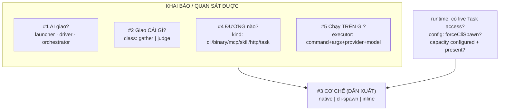
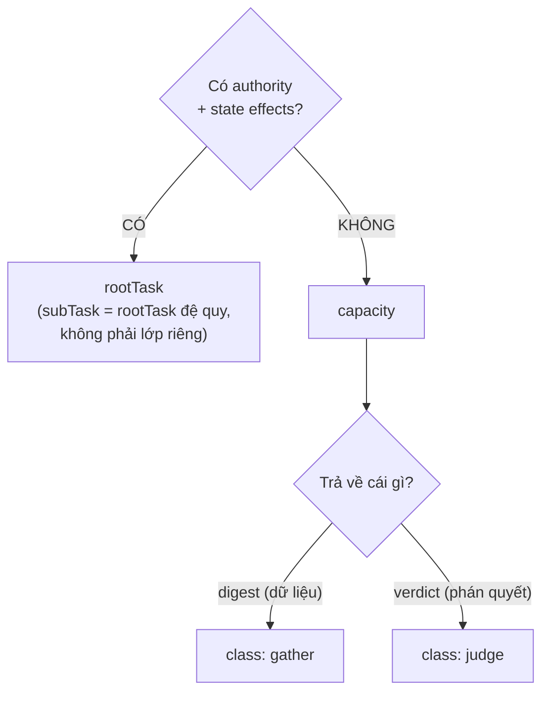

# Ranh giới khái niệm tầng dispatch — DISCUSSION

Item: `tsk-5td`. Liên quan: `tsk-2cw` (đổi `orchestrator`→`launcher`, giữ chỗ
`orchestrator`), `tsk-5kn` (đã sở hữu khái niệm gather / fan-out A, D1–D17 khoá),
`tsk-2t6` (two-layer-dispatch, D4/D9 gác exec packet B2), `tsk-umc`
(execution-fanout, D1–D10).

## 1. Trạng thái hiện tại

Vòng 4 (2026-08-08). **D1 và D2 đã mint** — cả hai giữ qua bốn vòng không bị
lật. Khung §6 vừa **bị sửa ở vòng 4** (bản vòng 3 phát biểu sai), nên chưa
mint; các điểm khác cũng mới một vòng.

Đường đi ba vòng:

| Vòng | Việc | Kết quả |
|---|---|---|
| 1 | Scout `dispatch.mjs` + đọc thẳng upstream bee | Phát hiện bee có **ba** lớp (không phải hai), và tiêu chí của bee là **authority + state effects, không phải kích thước việc**. Chiếu sang fgOS: cả ba `capacity` hiện có đều là review-class; **chưa từng có** capacity nào thuộc lớp gather |
| 2 | Người dùng xác nhận tách gather khỏi judge; scout từ vựng sẵn có | Không cần phát minh tên — `judge`/`verdict` đã vào **code** (186 + 38 hit), `gather`/`digest` đã ghim ở **doc** (`tsk-5kn`). Bất đối xứng này tự xác nhận chẩn đoán vòng 1 |
| 3 | Người dùng báo bị lẫn *"đang phân loại cái gì"* ⇒ lùi lại dựng khung high-level | Lộ ra gốc của lộn xộn: **không phải một phân loại**, mà nhiều chiều bị đọc chung; một khối `capacities.<id>` mang câu trả lời cho nhiều chiều cùng lúc. Khung được xác nhận khớp ⇒ thành xương sống §6 |
| 4 | Người dùng hỏi *"#3 và #4 có trùng nhau không"* | **Lật một phần khung vòng 3.** Code xác nhận `hasNativeMechanism = capacity.kind === 'task'` ⇒ #3 là **dẫn xuất** của #4, không độc lập. Khung sửa thành **bốn chiều khai báo + một kết quả dẫn xuất**. Đổi lại: lý giải được vì sao `EXECUTOR_ADAPTERS` không có key `native`, và vì sao `inline` khó thành giá trị hạng nhất |

**Điểm quan trọng nhất để một người quay lại đọc:** mọi tranh luận trong phiên
này chỉ đụng **câu hỏi #2** của khung §6 (*giao cái gì*). Bốn câu còn lại
không bị phiên này đổi. Trước khi bàn tiếp bất cứ điều gì, nói rõ đang bàn
câu số mấy.

## 2. Mục tiêu & đề bài

fgOS đang có một tầng dispatch trưởng thành nhưng từ vựng của nó đã trôi khỏi
thứ nó thật sự làm, ở hai chỗ không tách rời được. Chỗ thứ nhất là bản thân
module: `src/runner/dispatch.mjs` đã phình thành 1186 dòng ôm sáu trách nhiệm
khác hẳn nhau, và — quan trọng hơn kích thước — nó chỉ phục vụ đúng **nửa
cli-spawn** của thế giới, trong khi cái tên `dispatch` hứa quản cả hai cơ chế;
đây đúng cùng một lỗi "tên hứa rộng hơn thứ nó làm" mà `orchestrator` vừa bị
bắt và đang được sửa ở `tsk-2cw`. Chỗ thứ hai là trục phân loại đơn vị việc
(trục A: `rootTask`/`subTask`/`capacity`, khoá ở decision 0026): người dùng
nhận ra bee đã tách sẵn gather-work khỏi executing-work bằng một tiêu chí sắc
hơn cái fgOS đang dùng, và muốn gom bài học đó vào trục A thay vì để nó nằm
rải trong prose skill. Mục tiêu phiên này là quyết định từ vựng và ranh giới
khái niệm cho cả hai chỗ — chưa phải thiết kế cách thi công, và tuyệt đối
không mở lại những quyết định các item khác đã khoá.

## 3. Vấn đề rõ / chưa rõ

| # | Điểm | Trạng thái | Bằng chứng / ghi chú |
|---|---|---|---|
| 1 | `dispatch.mjs` ôm 6 trách nhiệm | **Rõ** | 1186 dòng, 22 export. Config ~40% · payload · policy/resolution ~20% · decision ~3% · governance ~5% · execution ~25% |
| 2 | Module chỉ phục vụ nửa cli-spawn | **Rõ** | 21/22 export chỉ dùng cho nhánh cli-spawn. Chỉ `decideDispatchMechanism` (hàm thuần, không đọc config) phục vụ cả hai. `EXECUTOR_ADAPTERS` chỉ có đúng 1 key `'cli-spawn'` — không bao giờ có key `'native'` vì native theo cấu trúc không thể là adapter |
| 3 | `resolveExecutorConfig` nhồi 3 concern | **Rõ** | governance (presence-check) + policy (3 tầng `byCapacity ?? executors[tier] ?? executor`) + governance (`allowCrossProvider`). Blast radius CRITICAL: 8 upstream symbol, 7 execution flow. `tsk-3ik` đã **cố tình né** nó một lần — xây `decideDispatchMechanism` làm sibling thuần-đọc thay vì sửa vào trong |
| 4 | Bee có **ba** lớp, không phải hai | **Rõ** | `routing-and-contracts.md:342` — xem §5 vòng 1 để đọc nguyên văn |
| 5 | Tiêu chí phân định của bee | **Rõ** | *"distinguished from the I/O-offload worker by **authority and state effects**, not by task size"* — sắc hơn hẳn tiêu chí "vòng đời đầy đủ hay không" của trục A |
| 6 | Cả 3 capacity fgOS đều là review-class | **Rõ** | `judge-discovery` (phán clear/không) · `judge-decompose` (phán split/không) · `submit-assist-classify` (phán tier/kind/risk) — cả ba trả **phán quyết**, không trả **digest dữ liệu** |
| 7 | Gather của fgOS không có chỗ trong trục A | **Rõ** | `fgos-researching`'s D2 fan-out gọi thẳng Agent tool, không qua `capacities.<id>`, không config check, không log. Xác nhận sống bằng `tsk-o4l` (2026-08-08) |
| 8 | Trục A nhận chiều gather/execute thế nào | **CHỐT → D1** | Không phải hai trục vuông góc — hình **cây hai tầng** |
| 8b | Tách review khỏi gather | **CHỐT → D2** | Hai loại lỗi khác nhau ⇒ hai cách sửa khác nhau |
| 8c | Tên hai lớp con | **CHỐT → D2** | `gather`/`judge`, cả hai đã sống sẵn trong repo |
| 8d | Khung các chiều của dispatch | **Đang hội tụ, ĐÃ SỬA vòng 4** | Xương sống §6. Bản vòng 3 nói "năm câu hỏi độc lập" — **sai**; vòng 4 sửa thành **bốn chiều khai báo + một kết quả dẫn xuất** (#3 mechanism suy ra từ #4 kind + runtime). Gốc của lộn xộn không phải tên sai mà là khai-báo bị đọc lẫn với dẫn-xuất |
| 8f | `inline` là dẫn xuất, không phải giá trị khai báo | **Rõ** (vòng 4) | Kéo theo: muốn đo `inline` thì phải **ghi lại kết quả dẫn xuất** tại mỗi lần dispatch, không phải thêm một giá trị vào `kind`. Cùng khuôn `derived-never-stored` fgOS đã dùng (`frontier`, `computeSchedule`, `footprintOverlap`) |
| 8e | Giữ `capacity` làm ô cha + field `class` | **Đang hội tụ** (vòng 3, mới một vòng) | Giữ vì `capacities.<id>` đã là config key thật (bỏ = breaking). Siết định nghĩa: từ *"helper hẹp"* (mờ) sang *"đơn vị dispatch không mang authority/state effects"*. Field phân lớp là `class` (người dùng chọn, trên `returns`) vì `kind` đã bị chiếm cho transport |
| 9 | Gác theo mục đích vs gác theo target | **Chưa rõ** | Bee gác `for:'gather'`; fgOS gác theo capacity id. Liên đới cổng `allowCrossProvider` per-capacity → per-dispatch (đã ghi nhận cần sửa, chưa xác nhận đã sửa) |
| 10 | `inline` có thành mechanism hạng nhất | **Chưa rõ** | Hiện là "trạng thái vắng mặt" ⇒ không log được, không đo được |
| 11 | `dispatch` giữ nghĩa hẹp hay rộng | **Chưa rõ** | Nếu hẹp thì subsystem cần tên gì |
| 12 | Nửa native không có module nhà | **Chưa rõ** | Thiếu sót, hay bản chất (native = trong session, không đóng gói được)? |
| 13 | Tách config khỏi `dispatch.mjs` | **Chưa rõ** | Đã có `src/config/` + `src/setup/config-merge.mjs`. Có thuộc phiên này không? |

## 4. Quyết định đã chốt

| D-ID | Quyết định | Vòng nêu → vòng chốt |
|---|---|---|
| **D1** | **Tiêu chí phân lớp đơn vị việc là *authority + state effects*, không phải *vòng đời đầy đủ*** — mượn thẳng tiêu chí bee (`routing-and-contracts.md:342`: *"distinguished by authority and state effects, not by task size"*). Hệ quả hình dạng: đây **không** phải chiều thứ hai vuông góc với trục A, mà là **cây hai tầng** — tầng 1 hỏi *có authority + state effects không*, tầng 2 (chỉ nhánh KHÔNG) hỏi *trả về cái gì*. Lý do bác "vuông góc": một `rootTask` không bao giờ có thể là gather, nên hai chiều không độc lập. Lý do tiêu chí này sắc hơn: vòng đời (claim/reserve/verify/merge) tồn tại **chính vì** có state effects cần bảo vệ — trục A cũ lấy *hệ quả* làm tiêu chí, bee lấy *nguyên nhân* | 1 → 3 |
| **D2** | **Nhánh không-authority tách làm hai lớp: `gather` (trả `digest`) và `judge` (trả `verdict`)** — không phải một. Lý do tách: hai loại lỗi khác nhau ⇒ hai cách sửa khác nhau (digest sai vì *đọc thiếu* → đọc lại/rộng hơn; verdict sai vì *phán sai* → cần người hoặc đổi tiêu chí); trộn lại thì mất tín hiệu sửa lỗi. Tên **không phát minh mới** — cả hai cặp `<lớp> → <cái nó trả về>` đã sống sẵn trong repo (§5 vòng 2). Bee cũng tách đúng chỗ này, gọi review-class là *"neither class"* | 1 → 3 |

## 5. Q&A log

### Vòng 1 — 2026-08-08

**Người dùng:** muốn bàn sâu chỗ `dispatch` ("chúng ta có nguyên một lib lớn
dispatch để quản chuyện này bao gồm 3 loại task, các loại agent, provider,
tier"). Xác nhận "3 loại task" ý là **trục A**, và muốn gom concept của bee
vào trục A — bee có io/gather work và executing work.

**Scout `dispatch.mjs`** — 1186 dòng, 22 export, 6 trách nhiệm (§3 hàng 1–3).

**Scout bee — nguyên văn, chép vào đây vì `upstreams/` là gitignored (không
tồn tại trong worktree, vòng sau không đọc lại được):**

`upstreams/bee/AGENTS.md:77`, rule 12:

> **Fan out the gathering; keep the deciding.** The session model is the
> orchestrator; mechanical gather/render/mine steps dispatch down-tier as I/O
> workers that return digests — delegate whenever you need the content as a
> digest, not verbatim. **Decide-altitude never delegates:** gates, synthesis,
> state writes, and conversation with the human stay on the session model.
> Transport is mandatory on every dispatch: a `model` param, or an anchored
> `[bee-tier: <tier>]` marker as the first thing in the prompt or description,
> plus the model name in the description — a bare dispatch is denied (decision
> 0023). [...] never zero I/O workers, and never zero *execution* workers for
> tiny/small cells (AO14).

`upstreams/bee/skills/bee-hive/references/routing-and-contracts.md:340-342`:

> - **Digest contract** — an I/O worker returns paths read, the facts extracted
>   (with file:line anchors), and verbatim quotes only where asked; the
>   orchestrator never re-reads what a digest already answers.
> - **Transport unchanged** — [...] I/O workers do **not** register in
>   `bee.mjs state worker add` — the registry stays swarm-cell-scoped
>   (reservations/status are execution concerns); the dispatch log is the audit
>   surface for gathers.
> - **Execution worker (AO14, second named class)** — the Delegation contract's
>   other dispatch shape, distinguished from the I/O-offload worker by
>   **authority and state effects**, not by task size. Unlike an I/O worker, an
>   execution worker **does** register in the swarm registry [...] and **does**
>   take reservations under its own nickname; it implements exactly one assigned
>   cell (claim → read `read_first` → implement within `files` → verify → cap →
>   release) and returns exactly one status token
>   (`[DONE]`/`[BLOCKED]`/`[HANDOFF]`/`[NOOP]`) — it is authority-bearing, never
>   a digest-only gather. [...] An independent reviewer or checker (plan-checker,
>   cell reviewer, panel member) is **neither** class: it is a review-class
>   dispatch — read-only, no registry entry, no reservations, no cell of its own
>   — and is never called an "execution worker."

`routing-and-contracts.md:343`, nhánh cli gather:

> **Stdout IS the digest**, framed by a delimiter contract [...] missing
> delimiters or an empty digest is a **failed run**, surfaced loudly, never
> accepted as a silent green [...] No `result.json`, no cell, no reservation,
> no `bee.mjs state worker add` registration for a gather. **Known measurement
> gap, named not solved here:** a Bash-launched gather emits zero
> `dispatch.jsonl` rows (W-d).

`swarming-reference.md:177` — `resolveTier` purpose-scope: bare/cell-purpose
resolve của một cli-shaped tier **bị từ chối**
(`{type:'refused', reason:'cli_tier_gather_only'}`); chỉ
`resolveTier(root, slot, runtime, {for:'gather'})` mới ra `{type:'cli'}`.

**Đối chiếu sang fgOS (phân tích vòng 1, chưa chốt):** cả ba capacity đang
tồn tại (`judge-discovery`, `judge-decompose`, `submit-assist-classify`) đều
trả **phán quyết**, không trả **digest** ⇒ theo phân loại bee, cả ba là
**review-class**, lớp mà bee tuyên bố tường minh là "neither class". Trong khi
đó gather thật của fgOS — fan-out hai nhánh độc lập của `fgos-researching` —
không đi qua cơ chế capacity chút nào. Nghĩa là trục A hiện **không có ô nào**
cho gather-work.

### Vòng 2 — 2026-08-08

**Người dùng:** *"Review và gather tách làm hai đúng rồi. Mà thành 2 cái gì"* —
xác nhận tách, hỏi tên.

**Scout từ vựng sẵn có trong repo (để không phát minh từ mới):**

| Cụm | Trong code (`src/`, `bin/`) | Trong prose | Kết luận |
|---|---|---|---|
| `verdict` | **186 lần** — `--verdict` CLI flag, `callerVerdict`, `resolveDiscovery`/`resolveDecompose` | `fgos-validating` 16, `fgos-researching` 12, `fgos-exploring` 6, `fgos-clarifying` 4 | Đã là **identifier thật**, khoá chặt |
| `judge` | **38** + `judgeDiscovery` 10, `judgeDecompose` 10, `judgeVerifySemanticCorrectness` 7, `runJudgeExecutor`, `frozenJudge` 4/`frozenJudgeHits` 11 | — | Đã là **prefix tên thật** của 2/3 capacity |
| `gather` | **0** | `tsk-5kn` DISCUSSION 15, `execution-fanout/CONTEXT.md` ghim *"fan-out A / gather"*, distillery (trích bee) | Đã là **thuật ngữ ghim** ở tầng doc, chưa vào code |
| `digest` | **0** | `tsk-5kn` DISCUSSION 16, `two-layer-dispatch` 8, distillery (trích bee) | Như trên |

Đối xứng lộ ra: fgOS **đã có sẵn cả hai cặp** `<lớp> → <cái nó trả về>`, chỉ là
chưa bao giờ nâng chúng lên thành tên lớp chính thức trong trục A. Bên
`judge`/`verdict` đã chín tới mức thành code; bên `gather`/`digest` mới ở tầng
doc — đúng khớp với §3 hàng 7 (gather chưa có ô nào trong trục A).

### Vòng 3 — 2026-08-08

**Người dùng:** chốt giữ `capacity` làm ô cha và chọn field `class` (thay vì
`returns`). Nhưng báo thẳng: *"discuss tới đây thì lại lẫn lộn và không rõ
đang phân loại cái gì đó. Trình bày high level chút đi."*

**Phản hồi đúng — phiên đã sa vào chi tiết.** Lùi lại dựng khung, và chính lúc
dựng khung thì lộ ra gốc thật của cảm giác lộn xộn: **không có một phân loại
nào cả, có NĂM câu hỏi độc lập** (chi tiết ở §6). Biết câu trả lời của câu này
không suy ra được câu kia — đúng điều decision 0026 đã nói bằng cách khác
(*"subTask và capacity không gộp khái niệm, chỉ gộp ở tầng cơ chế dispatch"*).

Nguyên nhân trực tiếp gây lẫn, tìm ra ở vòng này: **một khối config
`capacities.<id>` mang câu trả lời cho ba câu hỏi khác nhau cùng lúc** —
`class` (câu #2, cái gì), `kind` (câu #4, đường nào), `command`/`args`/`model`
(câu #5, chạy trên gì). Nhìn vào một khối thì thấy như một phân loại, thực ra
là một **bản khai nhiều chiều**. Không phải lỗi đặt tên.

**Người dùng xác nhận khung khớp** ⇒ khung thành xương sống §6, và thành quy
ước cho mọi vòng sau: *nói rõ đang bàn câu số mấy trước khi bàn*.

### Vòng 4 — 2026-08-08

**Người dùng:** *"số 3 (cơ chế) và số 4 (đường nào) có bị trùng lặp nhau
không."*

**Bắt đúng lỗi trong khung vòng 3.** Đọc code xác nhận
(`dispatch.mjs:685-692`):

```js
export function decideCapacityDispatchMechanism(cfg, capacityId, { hasLiveTaskAccess = false } = {}) {
  const capacity = ...;
  return decideDispatchMechanism({
    hasNativeMechanism: Boolean(capacity && capacity.kind === 'task'),   // ← #3 suy từ #4
    hasLiveTaskAccess,
    forceCliSpawn: Boolean(capacity && capacity.forceCliSpawn === true),
  });
}
```

`hasNativeMechanism` **chính là** `kind === 'task'`. Nên #3 không phải câu hỏi
độc lập ngang hàng — nó là **hàm dẫn xuất** của #4 cộng hai biến runtime
(`hasLiveTaskAccess`, `forceCliSpawn`) và trạng thái configured/present.

Không trùng *hoàn toàn* — #4 là **input tĩnh** khai trong config, #3 là
**output động** tính tại thời điểm dispatch — nhưng chắc chắn **không độc
lập**, nên khung vòng 3 phát biểu sai. §6 đã viết lại: bốn chiều khai báo +
một kết quả dẫn xuất.

Đổi lại được hai thứ trước nay chỉ ghi nhận mà chưa lý giải: vì sao
`EXECUTOR_ADAPTERS` không bao giờ có key `native`, và vì sao `inline` khó
thành "giá trị hạng nhất" (§6, phần Hệ quả).

## 6. Thiết kế đã chốt {#design}

### Khung: bốn chiều khai báo + một kết quả dẫn xuất

*(Bản vòng 3 gọi đây là "năm câu hỏi độc lập". **Sai, đã sửa ở vòng 4** —
người dùng hỏi thẳng #3 và #4 có trùng nhau không, và code xác nhận #3 là
DẪN XUẤT của #4, không độc lập. Xem §5 vòng 4.)*

Một câu chuyện duy nhất — *ai đó giao một đơn vị việc đi, qua đường nào, chạy
trên tài nguyên gì* — tách thành **bốn chiều khai báo được** cộng **một kết quả
tính ra tại thời điểm dispatch**:

**Khai báo / quan sát được** (tĩnh trong config hoặc đọc được từ state):

| # | Câu hỏi | Từ vựng | Giá trị | Nằm ở đâu |
|---|---|---|---|---|
| 1 | **AI** giao? | vai trò | `launcher` · `driver` · `orchestrator` | Vai trò của bên GỌI — tầng khác hẳn ba chiều dưới, vốn là thuộc tính của cái BỊ gọi |
| 2 | Giao **CÁI GÌ**? | lớp đơn vị việc | `rootTask` · `capacity` → `class: gather\|judge` | `capacities.<id>.class` |
| 4 | Đi qua **ĐƯỜNG** nào? | kind (transport) | `cli` `binary` `mcp` `skill` `http` `task` | `capacities.<id>.kind` |
| 5 | Chạy **TRÊN GÌ**? | executor | command + args + provider + model (qua `tier`) | `capacities.<id>` / `executors[tier]` / `executor` |

**Dẫn xuất** (không khai báo được — tính ra mỗi lần dispatch):

| # | Kết quả | Giá trị | Tính từ |
|---|---|---|---|
| 3 | **CƠ CHẾ** | `native` · `cli-spawn` · `inline` | `kind` (#4) + có live Task access không + `forceCliSpawn` + capacity đã configured/present chưa |

Bảng thật (`decideDispatchMechanism`/`decideCapacityDispatchMechanism`,
`dispatch.mjs:667-692`; `hasNativeMechanism = capacity.kind === 'task'`):

| `kind` | live Task access | `forceCliSpawn` | → mechanism |
|---|---|---|---|
| `task` | có | không | **native** |
| `task` | không | — | cli-spawn |
| `task` | có | có | cli-spawn |
| `cli`/`binary`/`mcp`/`skill`/`http` | bất kỳ | — | cli-spawn (luôn) |
| *(chưa configured, hoặc backend không present)* | — | — | **inline** |



**Hệ quả của việc #3 là dẫn xuất** — giải thích được hai thứ trước nay chỉ ghi
nhận mà chưa lý giải:

- **Vì sao `EXECUTOR_ADAPTERS` không bao giờ có key `native`** (§3 hàng 2):
  vì `native` không phải một *loại đường*, nó là một *kết quả*. Adapter là
  chiều #4; mechanism là chiều #3.
- **Vì sao `inline` khó thành "giá trị hạng nhất"** (§3 hàng 10): nó cũng là
  kết quả — cái xảy ra khi capacity chưa configured hoặc backend không
  present. Muốn log/đo được `inline` thì phải log **kết quả dẫn xuất**, không
  phải thêm một giá trị khai báo. Đây là cùng khuôn `derived-never-stored`
  fgOS đã dùng cho `frontier`/`computeSchedule`/`footprintOverlap`.

### Câu #2 chi tiết — phạm vi duy nhất phiên này đụng tới (D1, D2)



**Tầng 1 (D1)** — `authority + state effects`. Có thì mang vòng đời đầy đủ
(claim → worktree → verify → merge), vì vòng đời tồn tại chính là để bảo vệ
những state effects đó. Không có thì không cần vòng đời nào cả.

**Tầng 2 (D2)** — chỉ áp cho nhánh KHÔNG-authority, phân theo *cái trả về*:

| `class` | Trả về | Sai thì sai kiểu gì | Sửa bằng cách nào |
|---|---|---|---|
| `gather` | `digest` — dữ liệu, có `file:line` anchor | đọc thiếu | đọc lại / mở rộng phạm vi |
| `judge` | `verdict` — phán quyết | phán sai | người vào cuộc, hoặc đổi tiêu chí |

### Vì sao nhìn vào config lại thấy lẫn

Một khối `capacities.<id>` **mang câu trả lời cho ba câu hỏi khác nhau**:

```jsonc
"capacities": {
  "judge-discovery": {
    "class":   "judge",     // câu #2 — giao cái gì
    "kind":    "task",      // câu #4 — đi đường nào
    "command": "claude",    // câu #5 — chạy trên gì
    "args":    ["..."]      //         (tier/model cũng ở đây)
  }
}
```

Đây là **bản khai nhiều chiều**, không phải một phân loại. Nhận ra điều này là
cách duy nhất để đọc config mà không lẫn.

### Trạng thái năm câu, tính đến vòng 3

| Chiều | Tình trạng |
|---|---|
| #1 AI giao | Đang sửa ở `tsk-2cw` (`orchestrator`→`launcher`; `orchestrator` giữ chỗ cho tầng điều phối N đơn vị) |
| #2 giao cái gì | **Phiên này** — D1/D2 đã chốt; `capacity` + `class` đang hội tụ (§3 hàng 8e) |
| #4 đường nào | Ổn (`kind`, 6 giá trị) — không ai đề nghị đổi |
| #5 tài nguyên | Từ vựng ổn. Vấn đề còn lại là **kiến trúc**, không phải tên: `resolveExecutorConfig` nhồi 3 concern, blast radius CRITICAL (§3 hàng 3) |
| #3 cơ chế *(dẫn xuất)* | `native`/`cli-spawn` đã tính đúng. **`inline` chưa được tính/ghi ở đâu cả** ⇒ không đo được. Vòng 4 làm rõ đây là bài toán *ghi lại kết quả dẫn xuất*, không phải *thêm một giá trị khai báo* (§3 hàng 10) |

### Ô trống lộ ra khi áp khung này

`class: gather` hôm nay có **0 consumer đăng ký**. Gather thật của fgOS —
fan-out hai nhánh độc lập của `fgos-researching` — chạy hoàn toàn ngoài cơ chế
capacity: không config, không presence check, không log (xác nhận sống bằng
`tsk-o4l`, 2026-08-08). Đáng nói thêm: bee cũng **chưa** đóng được chỗ này,
tự ghi *"Known measurement gap [...] a Bash-launched gather emits zero
`dispatch.jsonl` rows (W-d)"*. Nếu fgOS làm, đây là chỗ **vượt** upstream chứ
không phải bắt kịp.

## 7. Danh mục hạng mục / task {#tasks}

*(chưa có — §7 chỉ điền khi §6 đã đủ cụ thể để chia việc)*
