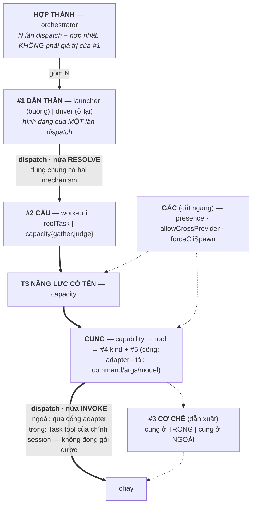
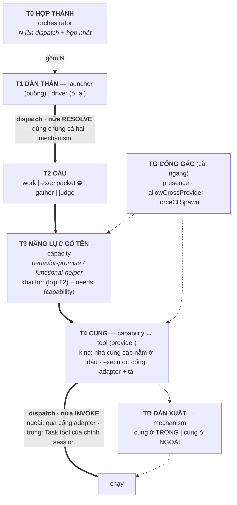
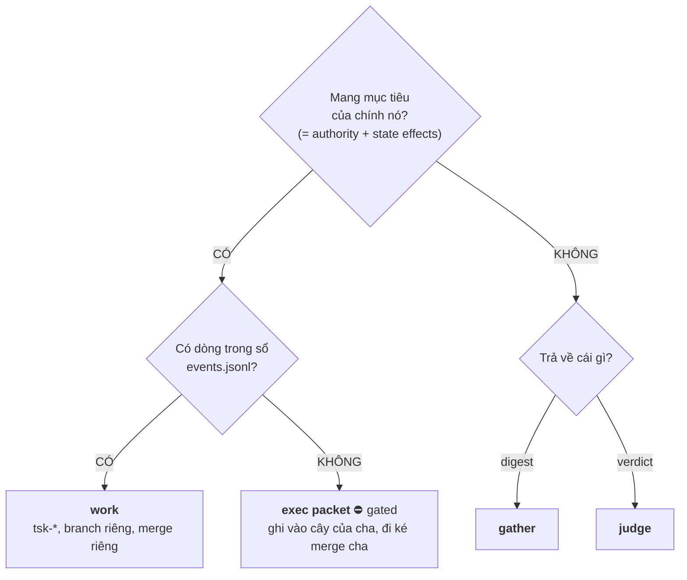

# Ranh giới khái niệm tầng dispatch — DISCUSSION

Item: `tsk-5td`. Liên quan: `tsk-2cw` (đổi `orchestrator`→`launcher`, giữ chỗ
`orchestrator`), `tsk-5kn` (đã sở hữu khái niệm gather / fan-out A, D1–D17 khoá),
`tsk-2t6` (two-layer-dispatch, D4/D9 gác exec packet B2), `tsk-umc`
(execution-fanout, D1–D10).

## 1. Trạng thái hiện tại

Vòng 10 (2026-08-09). **D1 và D2 vẫn là hai D-ID duy nhất đã mint** — cả hai
giữ qua chín vòng không bị lật, và vòng 6 lẫn vòng 10 đều củng cố thêm.
Mọi thứ vòng 5–10 nêu ra đều **chưa mint**.

**Cả sáu bước đã xong** (vòng 27). Bước 0 trả nợ §6 · Bước 1 khung bảy tầng
(D10) · Bước 2 xếp đủ 23 chữ (§6.10) · Bước 3 sáu ca một-ô-hai-nghĩa · Bước 4
rà hết kho bee/hn · **Bước 5 nằm ở §7**, tám cụm.

**Đóng (2026-08-09, `tsk-5td/plan.md`).** Cả tám cụm §7 giờ đều đã có item,
và toàn bộ đều `cleanup`/`done` hoặc đã ship — xem cột Trạng thái trong
từng cụm 7.1–7.8 bên dưới. Không còn việc nào của `tsk-5td` chưa có nơi
làm; chỉ §7.9 vẫn cố ý chưa mở, đúng như lý do gốc.

**18 D-ID.** Đọc §6 là đủ hiểu thiết kế; §7 là việc phải làm; §5 chỉ cần khi
muốn nguyên văn Q&A một vòng.

Cách làm việc từ vòng 10 trở đi, theo yêu cầu người dùng: **tổng hợp và đề
nghị, không hỏi từng câu một** — và từ vòng 21, mỗi lần cần người quyết thì
tách rõ *cái gì tự xếp được* khỏi *cái gì chỉ người quyết được*.

> ✅ **§6 đã regenerate (lần 2, bản sau vòng 8)** — vòng 5–8 đã gấp vào, kể cả
> phần "phía cung" trước đây thiếu hẳn. Đọc **§6 là đủ** để hiểu thiết kế; §5
> chỉ cần khi muốn nguyên văn Q&A một vòng cụ thể. §6 ghi rõ độ chín từng mục
> ([KHOÁ] / [HỘI TỤ] / [HỞ]) vì phần lớn nội dung ở đó **chưa mint**.

**Bàn giao đã lắp xong (vòng 27).** Bảy item đều mang `refs` trỏ **thẳng vào
anchor §7 của riêng nó**, không trỏ cả file — nên một session lạnh `/fgOS:pick`
bất kỳ item nào là rơi đúng vào phần nó cần đọc:

| Item | Anchor | Trạng thái |
|---|---|---|
| `tsk-5wf` | `#task-decision-doc-0026` | todo |
| `tsk-1o7` | `#task-demand-declares` | todo — **heavy/high**, ba chỗ sửa cùng lúc |
| `tsk-592` | `#task-gate-predicate-and-rename` | todo |
| `tsk-15d` | `#task-doc-fixes` | todo |
| `tsk-2ie5` | `#task-gather-specimen` | todo |
| `tsk-5wz` | `#task-intake` | todo |
| `tsk-33w` | `#task-audit-command` | **doing** |
| `tsk-4eu` | `#task-dead-config` | **delivered** (+ `tsk-5ge` cho nửa config) |

**Việc còn lại của `tsk-5td` không thuộc phiên này làm.** Skill
`fgos-coding-shaping` **cấm tự áp stage move**, nên item vẫn ở `doing`/`clarify`.
Một session **không chạy skill này** đưa nó tiếp: `fgos discover tsk-5td` (hoặc
`fgos return`) — bằng chứng là chính file này cộng 18 D-ID trong event log.

Đường đi tám vòng:

| Vòng | Việc | Kết quả |
|---|---|---|
| 1 | Scout `dispatch.mjs` + đọc thẳng upstream bee | Phát hiện bee có **ba** lớp (không phải hai), và tiêu chí của bee là **authority + state effects, không phải kích thước việc**. Chiếu sang fgOS: cả ba `capacity` hiện có đều là review-class; **chưa từng có** capacity nào thuộc lớp gather |
| 2 | Người dùng xác nhận tách gather khỏi judge; scout từ vựng sẵn có | Không cần phát minh tên — `judge`/`verdict` đã vào **code** (186 + 38 hit), `gather`/`digest` đã ghim ở **doc** (`tsk-5kn`). Bất đối xứng này tự xác nhận chẩn đoán vòng 1 |
| 3 | Người dùng báo bị lẫn *"đang phân loại cái gì"* ⇒ lùi lại dựng khung high-level | Lộ ra gốc của lộn xộn: **không phải một phân loại**, mà nhiều chiều bị đọc chung; một khối `capacities.<id>` mang câu trả lời cho nhiều chiều cùng lúc. Khung được xác nhận khớp ⇒ thành xương sống §6 |
| 4 | Người dùng hỏi *"#3 và #4 có trùng nhau không"* | **Lật một phần khung vòng 3.** Code xác nhận `hasNativeMechanism = capacity.kind === 'task'` ⇒ #3 là **dẫn xuất** của #4, không độc lập. Khung sửa thành **bốn chiều khai báo + một kết quả dẫn xuất**. Đổi lại: lý giải được vì sao `EXECUTOR_ADAPTERS` không có key `native`, và vì sao `inline` khó thành giá trị hạng nhất |
| 5 | Kiểm kê lại theo yêu cầu người dùng: phân định `rootTask`/`subTask`/`capacity` và ranh giới với `capability` | Scout lật một phần tiền đề: chồng lấn **không** nằm ở `capability` mà ở `name` — `capability` chỉ được đọc ở 3 chỗ, **không chỗ nào là dispatch**. Khung đề xuất: hai trục (đơn vị việc / capability). Đặt tên trục I |
| 5b | Người dùng chọn `work-unit` làm tên trục I | Va chạm: 0003 + system-overview đã khoá *"đơn vị việc"* = entity `work`, *"duy nhất"*. Giải bằng cách siết: `work` là giá trị **được lưu** duy nhất trên trục, không phải cả trục |
| 6 | Người dùng: *"trục 1 và trục 2 overlap; trục 2 là backend của trục 1"* | **Lật khung vòng 5.** Deep-dive tự viết của fgOS mang câu luật gốc (US-027): *"the core consults capabilities, never tools"*. Không phải hai trục — là **một quan hệ, hai phía**: cầu (#2) và cung (#4+#5), `capability` là khớp nối hợp lệ duy nhất. Bốn suy dẫn độc lập hội tụ. Lộ ra 5 điều chỉnh A1–A5, trong đó A2 là khiếm khuyết **sống** |
| 7 | Người dùng yêu cầu vẽ lại tổng quan theo khung tạm | Kiểm kê đầy đủ cái còn / cái mất / cái hở. Xác nhận: **không chiều nào trong năm chiều bị xoá** — reframe chỉ thêm một cách đọc |
| 8 | Người dùng hỏi ba chỗ hình vòng 7 im lặng: *dispatch đi đâu · adapter ở đâu · launcher/driver/orchestrator không cùng layer* | **Cùng một bệnh, lần thứ ba** (sau vòng 4 và vòng 6): một ô mang hai câu trả lời. `dispatch` = **cạnh**, tách `resolve`/`invoke` ⇒ giải luôn §3 hàng 12 và sửa chẩn đoán hàng 1–2. `adapter` = **cổng**, và trùng-chuỗi `'cli-spawn'` với mechanism cho **suy dẫn thứ 5** xác nhận A3. `#1` gộp **arity** với **engagement**; `orchestrator` là **hợp thành**, không phải ô thứ ba |

| 9 | §6 regenerate xong (Bước 0). Người dùng rà chi tiết: *"#4 nên gọi transport hay protocol?"* | **Cả hai đều sai.** `mcp`/`skill` chung nhánh probe nhưng transport ngược nhau ⇒ không phải transport; `cli`/`binary` hai giá trị một protocol ⇒ không phải protocol. `kind` = **loại nhà cung cấp** (*nhà cung cấp nằm ở đâu*). Cho **suy dẫn thứ sáu** xác nhận A3: mechanism là phép chiếu thô của `kind` xuống trong/ngoài. Ô chưa xếp mới: `cli` vs `binary` zero khác biệt cơ học |

| 10 | Người dùng: *"anh không xếp `work` chung với `gather`/`judge` — `work` mang tính **mục tiêu**, có **ghi sổ**; còn có loại mục tiêu **không ghi sổ**, mà `capacity` không gánh được"* | **Đúng, và nó tách được bằng máy.** Nhát cắt tầng 1 của anh trùng khít D1 trên cả bốn ca ⇒ hai tên cho một tiêu chí. Cái thiếu nằm **dưới** nhánh CÓ-mục-tiêu: fgOS chỉ có ô "ghi sổ" (`work`), thiếu ô "ngoài sổ" — bee có (`cell`), hn né bằng `run`+`changeset`. Đặt tên ô đó: **`errand`**. Đổi cách làm: từ đây **tổng hợp + đề nghị**, không hỏi từng câu. §6 regenerate lần 3 sang xương sống **bảy tầng** |

**Điểm quan trọng nhất để một người quay lại đọc:** mọi tranh luận trong phiên
này chỉ đụng **câu hỏi #2** của khung §6 (*giao cái gì*) và cách #2 nối sang
#4/#5. Chiều #1 (`tsk-2cw`) không bị đụng, và không chiều nào bị xoá. Trước khi
bàn tiếp bất cứ điều gì, nói rõ đang bàn câu số mấy.

## 2. Mục tiêu & đề bài

fgOS đang có một tầng dispatch trưởng thành nhưng từ vựng của nó đã trôi khỏi
thứ nó thật sự làm, ở hai chỗ không tách rời được. Chỗ thứ nhất là bản thân
module: `src/runner/dispatch.mjs` đã phình thành 1186 dòng ôm sáu trách nhiệm
khác hẳn nhau, và — quan trọng hơn kích thước — nó chỉ phục vụ đúng **nửa
cli-spawn** của thế giới, trong khi cái tên `dispatch` hứa quản cả hai cơ chế;
đây đúng cùng một lỗi "tên hứa rộng hơn thứ nó làm" mà `orchestrator` vừa bị
bắt và đang được sửa ở `tsk-2cw`. Chỗ thứ hai là trục phân loại đơn vị việc
(trục A: `rootTask`/`subTask`/`capacity`, khoá ở decision 0026): người dùng
nhận ra bee đã tách sẵn gather-work khỏi executing-work bằng một tiêu chí sắc
hơn cái fgOS đang dùng, và muốn gom bài học đó vào trục A thay vì để nó nằm
rải trong prose skill. Mục tiêu phiên này là quyết định từ vựng và ranh giới
khái niệm cho cả hai chỗ — chưa phải thiết kế cách thi công, và tuyệt đối
không mở lại những quyết định các item khác đã khoá.

## 3. Vấn đề rõ / chưa rõ

| # | Điểm | Trạng thái | Bằng chứng / ghi chú |
|---|---|---|---|
| 1 | `dispatch.mjs` ôm 6 trách nhiệm | **Rõ** | 1186 dòng, 22 export. Config ~40% · payload · policy/resolution ~20% · decision ~3% · governance ~5% · execution ~25% |
| 2 | Module chỉ phục vụ nửa cli-spawn | **Rõ** | 21/22 export chỉ dùng cho nhánh cli-spawn. Chỉ `decideDispatchMechanism` (hàm thuần, không đọc config) phục vụ cả hai. `EXECUTOR_ADAPTERS` chỉ có đúng 1 key `'cli-spawn'` — không bao giờ có key `'native'` vì native theo cấu trúc không thể là adapter |
| 3 | `resolveExecutorConfig` nhồi 3 concern | **Rõ** | governance (presence-check) + policy (3 tầng `byCapacity ?? executors[tier] ?? executor`) + governance (`allowCrossProvider`). Blast radius CRITICAL: 8 upstream symbol, 7 execution flow. `tsk-3ik` đã **cố tình né** nó một lần — xây `decideDispatchMechanism` làm sibling thuần-đọc thay vì sửa vào trong |
| 4 | Bee có **ba** lớp, không phải hai | **Rõ** | `routing-and-contracts.md:342` — xem §5 vòng 1 để đọc nguyên văn |
| 5 | Tiêu chí phân định của bee | **Rõ** | *"distinguished from the I/O-offload worker by **authority and state effects**, not by task size"* — sắc hơn hẳn tiêu chí "vòng đời đầy đủ hay không" của trục A |
| 6 | Cả 3 capacity fgOS đều là review-class | **Rõ** | `judge-discovery` (phán clear/không) · `judge-decompose` (phán split/không) · `submit-assist-classify` (phán tier/kind/risk) — cả ba trả **phán quyết**, không trả **digest dữ liệu** |
| 7 | Gather của fgOS không có chỗ trong trục A | **Rõ** | `fgos-researching`'s D2 fan-out gọi thẳng Agent tool, không qua `capacities.<id>`, không config check, không log. Xác nhận sống bằng `tsk-o4l` (2026-08-08) |
| 8 | Trục A nhận chiều gather/execute thế nào | **CHỐT → D1** | Không phải hai trục vuông góc — hình **cây hai tầng** |
| 8b | Tách review khỏi gather | **CHỐT → D2** | Hai loại lỗi khác nhau ⇒ hai cách sửa khác nhau |
| 8c | Tên hai lớp con | **CHỐT → D2** | `gather`/`judge`, cả hai đã sống sẵn trong repo |
| 8d | Khung các chiều của dispatch | **Đang hội tụ, ĐÃ SỬA vòng 4** | Xương sống §6. Bản vòng 3 nói "năm câu hỏi độc lập" — **sai**; vòng 4 sửa thành **bốn chiều khai báo + một kết quả dẫn xuất** (#3 mechanism suy ra từ #4 kind + runtime). Gốc của lộn xộn không phải tên sai mà là khai-báo bị đọc lẫn với dẫn-xuất |
| 8f | `inline` là dẫn xuất, không phải giá trị khai báo | **Rõ** (vòng 4) | Kéo theo: muốn đo `inline` thì phải **ghi lại kết quả dẫn xuất** tại mỗi lần dispatch, không phải thêm một giá trị vào `kind`. Cùng khuôn `derived-never-stored` fgOS đã dùng (`frontier`, `computeSchedule`, `footprintOverlap`) |
| 8e | Giữ `capacity` làm ô cha + field `class` | **Đang hội tụ** (vòng 3, mới một vòng) | Giữ vì `capacities.<id>` đã là config key thật (bỏ = breaking). Siết định nghĩa: từ *"helper hẹp"* (mờ) sang *"đơn vị dispatch không mang authority/state effects"*. Field phân lớp là `class` (người dùng chọn, trên `returns`) vì `kind` đã bị chiếm cho **loại nhà cung cấp** (§6.3) |
| 9 | Gác theo mục đích vs gác theo target | **Chưa rõ** | Bee gác `for:'gather'`; fgOS gác theo capacity id. Liên đới cổng `allowCrossProvider` per-capacity → per-dispatch (đã ghi nhận cần sửa, chưa xác nhận đã sửa) |
| 10 | `inline` có thành mechanism hạng nhất | **Chưa rõ** | Hiện là "trạng thái vắng mặt" ⇒ không log được, không đo được |
| 11 | `dispatch` giữ nghĩa hẹp hay rộng | **Chưa rõ** | Nếu hẹp thì subsystem cần tên gì |
| 12 | Nửa native không có module nhà | **Chưa rõ** | Thiếu sót, hay bản chất (native = trong session, không đóng gói được)? |
| 13 | Tách config khỏi `dispatch.mjs` | **Chưa rõ** | Đã có `src/config/` + `src/setup/config-merge.mjs`. Có thuộc phiên này không? |
| 14 | Chồng lấn `capacity`/`capability` nằm ở đâu | **Rõ** (vòng 5) | **Không** ở `capability`. `capability` chỉ đọc ở 3 chỗ (`tool-registry.mjs:84` normalize · `command-registry.mjs:934` khai flag · `bin/fgos.mjs:3873` filter của `tool query`) — **không chỗ nào là dispatch**. Khoá nối thật là **`name`**: `dispatch.mjs:604` `if (!tools[capacityId])`, và `tools` keyed theo `name` |
| 15 | ~~Tên trục phía cầu = `work-unit`~~ | **HẾT HIỆU LỰC** (vòng 10) — xương sống đổi sang bảy tầng, trục phía cầu giờ gọi thẳng là **T2 · CẦU**, không cần tên riêng. Kèm theo: va chạm với `0003` tan, và `system-overview.md:31` **hết nợ sửa** vì `work` lại là giá trị T2 duy nhất được lưu. Ghi chú gốc vòng 5b giữ lại bên dưới cho người đọc lịch sử: | Va chạm với `0003:24` (*"Entity đơn vị việc = `work`"*) + `system-overview.md:31` (*"Đơn vị việc DUY NHẤT"*). Giải: 0003 nói về **entity được lưu**, không nói về trục ⇒ `work` là giá trị **được-lưu** duy nhất trên trục. Phải sửa `system-overview:31` một dòng |
| 16 | Quan hệ cầu↔cung: không phải hai trục | **Đang hội tụ** (vòng 6, mới một vòng) | Một quan hệ hai phía. `capability` = khớp nối hợp lệ duy nhất (US-027, `deep-dives/tool-registry.md:27`). Bốn suy dẫn độc lập hội tụ — xem §5 vòng 6 |
| 17 | `capacity` mang hai nghĩa (A1) | **Đang hội tụ** (vòng 6) | (a) lớp work-unit (D1/D2) · (b) bản ghi binding `capacities.<id>` mang #4+#5. **Khác tập hợp**: gather của `fgos-researching` là (a) mà không có (b) ⇒ khác khái niệm |
| 18 | Binding nối bằng `name`, không phải `capability` (A2) | **Rõ, là khiếm khuyết SỐNG** (vòng 6) | Vi phạm đúng luật khiến registry đáng port. Hệ quả đo được: provider thứ hai của cùng capability **không bao giờ** thoả được một capacity. Câu CLAUDE.md tự hứa (*"not the only one this gate can ever recognize"*) đúng với prose, **sai với dispatch** |
| 19 | #3 phát biểu lại: cung ở trong hay ngoài (A3) | **Đang hội tụ** (vòng 6) | `native` = nhà cung cấp là chính session gọi; `cli-spawn` = tiến trình khác. Bằng chứng: `KINDS` **không có** `task` (`CAPACITY_KINDS = [...KINDS, 'task']`) — `task` là kind duy nhất không đăng ký được, vì không ai đăng ký chính mình |
| 20 | Presence check gác theo vận chuyển, không theo nhà cung cấp (A4) | **Rõ, latent** (vòng 6) | `dispatch.mjs:603` + `:630` đều gác `kind === 'cli'`. Capacity `mcp`/`skill`/`http`/`binary` dispatch với **zero** presence check và **zero** cross-provider check. Vị từ đúng là `kind !== 'task'` — **đúng vị từ của A3**. Latent: chưa capacity nào thuộc 4 kind đó |
| 21 | Hai sổ tả cùng backend, không đối chiếu (A5) | **Rõ, latent** (vòng 6) | `capacities.submit-assist-classify` (kind cli, command agy) và `tools.submit-assist-classify` (kind cli, command agy) nối bằng name, **không so khớp**. Lệch thì dispatch dùng bản capacity, probe dùng bản tool |
| 22 | Phép thử cơ học cho D1 | **Đang hội tụ** (vòng 6) | Chuỗi nhân quả: state effects → cần vòng đời bảo vệ → cần id ổn định gắn vòng đời → **nằm trong event log**. Nên *"có id trong `.fgos/events.jsonl`"* không cạnh tranh với D1 — nó là **đầu quan sát được** của chính D1. Trả lời thẳng yêu cầu "tiêu chí test được" |
| 23 | `subTask` sau D1/D2 | **Đang hội tụ** (vòng 5) | Vẫn **không** phải lớp riêng — D1 củng cố 0026 (0026 lý giải bằng *cùng vòng đời* = hệ quả; D1 bằng *cùng câu trả lời authority* = nguyên nhân). Nhưng chữ này nói *ai giao* ⇒ thuộc **#1**, là từ **quan hệ** (field `work.parent`, `work.mjs:414`), không phải từ **phân lớp** |
| 24 | `class: transform` — lớp thứ ba? | **Chưa rõ** | Ứng viên: nhận input, trả **dạng dẫn xuất của chính input**, không đọc state ngoài (khác gather), không áp tiêu chí phán (khác judge). **Chưa tìm ra ca sống nào** — khác gather (0 đăng ký nhưng có ca sống `tsk-o4l`) |
| 26 | `dispatch` là gì trong khung | **Đang hội tụ** (vòng 8) | Là **cạnh**, không phải nút — mấy mũi tên cầu→binding→cung→chạy. Tách hai nửa: **resolve** (dùng chung cả hai mechanism) và **invoke** (external qua adapter; internal là Task tool của chính session) |
| 27 | Chẩn đoán `dispatch.mjs` sửa lại | **Đang hội tụ** (vòng 8) | "1186 dòng / 6 trách nhiệm" (hàng 1–2) là **triệu chứng**. Bệnh: trộn `resolve` (dùng chung) với `invoke-external` (một mechanism), rồi đặt tên theo cả act. Bằng chứng khớp: `decideDispatchMechanism` là hàm thuần **không đọc config** (= thuần resolve) và là export duy nhất phục vụ cả hai. Đường cắt đúng: **resolve/invoke**, không phải "chia 6" |
| 12b | Nửa native không có module nhà (giải hàng 12) | **Đang hội tụ** (vòng 8) | **Nửa nạc nửa mỡ**: `invoke` native là **bản chất** (session gọi tool của chính nó, không có biên để bắc cầu ⇒ không đóng gói được); `resolve` native là **thiếu sót** (đóng gói được, nhưng đang nằm trong module đặt tên theo cả act và định hình chỉ cho nhánh external) |
| 28 | `adapter` là gì | **Đang hội tụ** (vòng 8) | Là **cổng** (port) — doc comment tự khai *"the executor **port** is now a NAMED interface"* (`dispatch.mjs:818-830`). ⇒ #5 tách đôi: **cổng** (`adapter`) + **tải** (`command`/`args`/`model` qua `tier`) |
| 29 | `adapter` — suy dẫn thứ 5 cho A3 | **Rõ** (vòng 8) | `EXECUTOR_ADAPTERS` đúng 1 key, `DEFAULT_ADAPTER = 'cli-spawn'` — **trùng chuỗi** với giá trị mechanism #3 (dẫn xuất). Hai tầng khác nhau đội chung một chuỗi, hôm nay không phân biệt được vì chỉ có một adapter. Ngày `rpc`/`app-server` (đã deferred, cùng doc comment) được đăng ký: nhà cung cấp vẫn **ngoài** nhưng adapter là `rpc` ⇒ tên `cli-spawn` cho **mechanism** thành sai. Xác nhận A3 từ hướng hoàn toàn khác |
| 30 | #1 gộp hai câu hỏi | **Đang hội tụ** (vòng 8) — **đụng `tsk-2cw`, chờ người dùng** | `0028` (accepted, supersedes 0026) đã lập luận sẵn hai tính chất độc lập: **arity** (1 vs N) và **có ở lại không** (bước ra vs giữ liên hệ liên tục). Bảng: (1,buông)=`launcher` · (1,ở lại)=`driver` · (N,ở lại)=`orchestrator` · (N,buông)=**trống**. `0026`: *"Vai trò launcher KHÔNG CẦN soul ... THUẦN CƠ HỌC"* ⇒ nhu-cầu-phán-đoán bám theo **cột**, không theo arity |
| 31 | `orchestrator` là tầng trên, không phải ô thứ ba | **Đang hội tụ** (vòng 8) | `fgos-fanout` spawn N Agent, **mỗi Agent chạy `/fgOS:pick` end-to-end** ⇒ mỗi cái là một `driver`. Nên orchestrator = **hợp thành** (N lần dấn thân con), không phải anh em ngang hàng. Đề xuất: #1 rút về **2 giá trị**, `orchestrator` ra khỏi enum lên tầng hợp thành — đúng chỗ `tsk-2cw` đang chừa |
| 40 | Nhận luật US-027 hay không | **CHỐT → D5 + D6** (vòng 13) — treo từ vòng 6 | Name-keying là **hệ quả tất yếu** của phía cầu câm, không phải lười. Nhận luật = bắt phía cầu tự khai ⇒ **gộp** với "món to nhất" của kho hn. Bên cầu phải khai **hai** field: `needs` (capability → chọn provider) + `for` (purpose → chọn lane). Hai cửa hôm nay: prose tuân, máy không. §6.4 |
| 39 | Phép thử thứ ba của D2: **ai sở hữu tiêu chí** | **Đề nghị** (vòng 11) | Dùng khi một response mang cả digest lẫn nhãn phán. `gather` = tiêu chí ở **bên gọi** · `judge` = tiêu chí ở **bên được gọi**, bên gọi **tuân**. Ca thử: `impact()` của gitnexus trả cả caller-list lẫn `risk` — nhưng `CLAUDE.md` bắt **cross-check trước khi tin** ⇒ không tuân ⇒ **gather**, `risk` là *verdict giả*. Kiểm ngược: `judge-discovery` bên gọi tuân ⇒ judge thật. §6.3 |
| 38 | 11 capability của hn xếp đâu | **Đề nghị** (vòng 11) | **T4 phía cung**, không ngang `gather`/`judge` (thuộc tính của nhà cung cấp, không của một lần dispatch). Cũng **không ngang `gitnexus`**: cả 11 tả **chính cái sổ**, do harness CLI tự khai qua `query.contract`. Ô tương ứng của fgOS — *sổ tự khai năng lực + dải schema* — **đang trống**, latent thật vì global/project install có thể lệch version. §6.5 |
| 34 | Ô "mục tiêu ngoài sổ" đã có tên | **CHỐT → D11 (bốn phép thử) + D18 (tên)** — tên `errand` của vòng 10 **đã bị thay** bằng **`exec packet`** ở vòng 26 | ~~`errand`~~ → — quét sạch 0 hit ở `src/`, `docs/`, `upstreams/`. Bác `cell` (false friend: bee's cell CÓ claim/reservation/registry) và `packet` (kéo theo khung *"orthogonal axes"* D1 đã bác). Bốn phép thử ở §6.3, sắc nhất: **không sở hữu branch/merge riêng**. Vẫn gated `tsk-2t6` |
| 35 | `capacity` rút về một nghĩa | **CHỐT → D8** (vòng 18; bản P1 vòng 10 đã bị thay bởi P1′ vòng 15) | Một nghĩa = **năng lực có tên của fgOS**, cặp *behavior-promise / functional-helper* (= D2 + D1 đọc thành định nghĩa). `capacities.<id>` là **bản khai**, không phải bản thân nó; `binding` là **cạnh** T3→T4. Bản P1 đầu sai vì bỏ mất lời hứa hành vi mà không cất vào đâu. `0026` **làm rõ**, không lật |
| 49 | `provider` xếp sai | **Rõ, ĐÃ SỬA** (vòng 19-20) | Là **chrome mang tính BẰNG CHỨNG**, không phải danh tính T4. Cổng cross-provider **cố ý không đọc** nó (`dispatch.mjs:570`) — đúng. Nhưng nó **được ghi vào `events.jsonl`** (`loop.mjs:744-758`, event `capacity.dispatch`) làm bản ghi audit, và **khai báo thắng thực tế** (`:777`). Phép thử nói dối: `command:"agy"` + `provider:"claude"` ⇒ **cổng an toàn, sổ nói dối**. Cộng `sensitiveData` chưa ship ⇒ governance cross-provider **có cổng, không có sổ đáng tin**. **CHỐT → D9**: audit ghi **cả hai** — `provider` (nhãn) và `command` (lệnh thật). Mang hai nghĩa: nhãn vs `{providers}` của `tool query` — bệnh cũ lần thứ **sáu**. §6.14 |
| 50 | Status token của bee | **Đề nghị: LẤY** (vòng 19) | Là hợp đồng trả về của **`exec packet`** (vòng 26 đổi tên từ `errand`), không phải của `work`: `work` báo bằng đổi state vì **có sổ**; `errand` **không có sổ** nên buộc phải trả về. Khép kín đối xứng T2. §6.14 |
| 51 | `digest` bắt buộc `file:line` anchor | **Đề nghị: LẤY** (vòng 19) | Không phải chữ mới — **siết hợp đồng `digest`** của D2. Đi kèm `tsk-2ie5`. Quét: 1 hit prose duy nhất |
| 52 | Degrade ladder Inactive/Degraded/Full | **Đề nghị: LẤY** (vòng 19) | 0 hit trong code, chỉ prose `CLAUDE.md`. **D6 làm nó bắt buộc**: `needs: X` ⇒ resolver phải trả lời "mấy provider của X present" — đúng ba mức. Xếp **TG**, gộp theo capability không theo tên tool |
| 53 | `lane` của hn | **Đề nghị: KHÔNG LẤY** (vòng 19) | fgOS đã có trục nghi thức trong `tier`; `tsk-503` **cố ý** Path B. Lấy `lane` = mở lại quyết định đã khoá mà **không có áp lực sống** nào đòi |
| 46 | Ranh giới ngoài cùng của tầng dispatch | **Đề nghị** (vòng 17) | Phép thử: **input đã nằm trong context bên gọi chưa**. Rồi ⇒ **không phải dispatch**, là suy nghĩ của chính session. Cổng chính thức: bốn lý do hợp lệ (`_shared/capacity-dispatch-fallback.md`); trượt cả bốn thì ở lại inline. §6.13 |
| 47 | Phân loại có phụ thuộc domain không | **Rõ** (vòng 17) | **Tách hai**: trục (to cỡ nào / loại gì / sai thì sao) **agnostic**; rubric + từ vựng **domain sở hữu**. Cùng khuôn `0027` D2/D3 (`statusCategory` agnostic + `DOMAINS[domain].statusLabels`). Lỗ hổng: `DOMAINS` không khai từ vựng phân loại ⇒ `TIERS` enum global cứng, `kind`/`risk` thả tự do. **Ba ca sống** ghi ở §6.13 |
| 48 | Hai item đã mở | **Rõ** (vòng 17) | `tsk-5wz` (tối ưu intake, dời soul-pass về sau clarify, trả phân loại cho domain) và `tsk-2ie5` (đưa gather vào cơ chế capacity — mẫu vật cross-provider thật). Cả hai `deps: tsk-5td`; `tsk-5wz` mang `mergeAfter: tsk-2ie5` để bước rút dispatch không land trước khi có thứ thay thế |
| 42 | `submit-assist-classify` vướng gì | **Rõ** (vòng 16) | (a) dispatch bằng **prose**, 0 hit trong code ⇒ fgOS có hai đường dispatch song song · (b) biến trùng-tên ngẫu nhiên thành thứ **chịu lực**: làm đúng D5 thì presence query trả rỗng và skill **âm thầm** rơi về inline · (c) capacity `kind:"cli"` **duy nhất** ⇒ gánh một mình cả ba cổng gác lẫn A2 · (d) `tier:"light"` nhưng `capacity.model` đè ⇒ ca sống của hai-nghĩa-`tier`. §6.4 |
| 44 | Nguồn gốc của trùng-tên ba chiều | **Rõ, sửa lại vòng 5** (vòng 16) | **Không** ngẫu nhiên: `CONTEXT.md` của `agent-executor-submit-assist-classify` **D3 (locked)** ghi cứng `--capability submit-assist-classify` như thể `resolveExecutorConfig` cần nó, trong khi thông báo lỗi của chính code (`dispatch.mjs:607`) nói rõ chỉ `--name` mới bắt buộc khớp, `--capability <label>` là placeholder tự do. ⇒ di trú D5 phải **supersede D3** đó, không chỉ sửa registry + skill fragment |
| 45 | `sensitiveData` — khoá nhưng chưa ship | **Rõ, là LỖ HỔNG** (vòng 16) | Cùng CONTEXT.md, **D7 (locked, người dùng xác nhận tường minh)**: thêm `sensitiveData: false` vào capacity entry **ngay**. Kiểm: 0 hit ở `.fgos/config.json` **và** ở `src/`+`bin/`. Là mảnh từ vựng governance **duy nhất** cho cross-provider; hôm nay chỉ còn `allowCrossProvider` — boolean nói *được phép ra*, không nói *cái gì được ra*. **Bước 5 mở item** |
| 43 | `executors.judge` là config **CHẾT** | **Rõ, là LỖI** (vòng 16) | `cfg.executors[tier]` với `tier ∈ {light,standard,heavy}`; validation chỉ kiểm shape, không kiểm key là tier thật ⇒ pass rồi không bao giờ đọc. Hệ quả: `judge-decompose` khi cli-spawn rơi xuống global executor, chạy **không có `Read`**. Cũng là **bằng chứng độc lập cho D6**: có người đã sờ tới `for:` trước khi nó có tên. **Bước 5 mở item** |
| 41 | `capacity` và `capability` có cùng loại vật thể không | **Chưa xếp** (vòng 15) | A5 gợi ý có: `submit-assist-classify` nằm **cả hai sổ**, cùng tên, cùng `kind:"cli"`, cùng `command:"agy"` — có thể là **một thứ ghi hai lần vì fgOS có hai sổ cho một khái niệm**, không phải "trùng lặp không đối chiếu". Chưa đủ bằng chứng để đề nghị gộp. Không đào ở vòng này |
| 36 | Bỏ `rootTask`/`subTask` | **CHỐT → D7** (vòng 14) | 0 identifier trong code; `0026` tự gọi cả hai là *vai trò* / *tên gọi tương đối*. Thay: `work` + vai trò T1 · `child work` · "một `work`/`errand` khác" |
| 37 | Khung bảy tầng (Bước 1) | **Đề nghị** (vòng 10) | T0 hợp thành · T1 dấn thân · T2 cầu · T3 binding · T4 cung · TG cổng gác (cắt ngang) · TD dẫn xuất; `dispatch`/`spawn`/`worker`/`child work` là **cạnh**, không phải tầng. §6.1 |
| 32 | Nhãn đúng của #4 (`kind`) | **Đang hội tụ** (vòng 9) | **Không phải** transport (`mcp`/`skill` chung nhánh probe nhưng transport ngược nhau), **không phải** protocol (`cli`/`binary` hai giá trị một protocol). Là **loại nhà cung cấp** — *nhà cung cấp nằm ở đâu*. Ba phép thử + suy dẫn thứ sáu cho A3: §6.3 |
| 33 | `cli` vs `binary` | **Chưa xếp** (vòng 9) | Hai giá trị, **zero khác biệt cơ học**: cùng `commandExistsOnPath`, cùng đường dispatch. Ghi nhận, chưa đào |
| 25 | Ô trống có-state-effects / không-authority (B2) | **Chưa rõ, latent** | D1 gộp `authority + state effects` thành MỘT vị từ. exec packet B2 rơi đúng khe giữa. Đang gated (`tsk-2t6` D4/D9, điều kiện (b) chưa thỏa) ⇒ chưa sống. Ngày B2 mở, vị từ D1 phải tách đôi |

## 4. Quyết định đã chốt

| D-ID | Quyết định | Vòng nêu → vòng chốt |
|---|---|---|
| **D1** | **Tiêu chí phân lớp đơn vị việc là *authority + state effects*, không phải *vòng đời đầy đủ*** — mượn thẳng tiêu chí bee (`routing-and-contracts.md:342`: *"distinguished by authority and state effects, not by task size"*). Hệ quả hình dạng: đây **không** phải chiều thứ hai vuông góc với trục A, mà là **cây hai tầng** — tầng 1 hỏi *có authority + state effects không*, tầng 2 (chỉ nhánh KHÔNG) hỏi *trả về cái gì*. Lý do bác "vuông góc": một `rootTask` không bao giờ có thể là gather, nên hai chiều không độc lập. Lý do tiêu chí này sắc hơn: vòng đời (claim/reserve/verify/merge) tồn tại **chính vì** có state effects cần bảo vệ — trục A cũ lấy *hệ quả* làm tiêu chí, bee lấy *nguyên nhân* | 1 → 3 |
| **D3** | **`kind` = loại nhà cung cấp (*provider kind*) — *nhà cung cấp nằm ở đâu*, không phải transport, cũng không phải protocol.** Giết "transport": `mcp` và `skill` chung một nhánh probe nhưng transport ngược hẳn nhau (JSON-RPC qua stdio vs file markdown nạp thẳng vào session gọi). Giết "protocol": `cli` và `binary` là hai giá trị cho một protocol (argv vào, stdout ra). Cả hai consumer của `kind` đều hỏi cùng một câu — `probeTool` chọn cách đi tìm (PATH / đĩa / TCP), `dispatch` chỉ so `kind==='task'` và `kind==='cli'`. Hệ quả: mechanism là **phép chiếu thô của `kind` xuống trong/ngoài** ⇒ suy dẫn thứ sáu cho A3 | 9 → 11 |
| **D4** | **`work` con sinh ra bởi decompose gọi là `child work` — là CẠNH giữa hai `work`, không phải lớp thứ năm trên trục phía cầu.** Chữ `child` đã sống trong code (`decompose.mjs` 83 hit, `bin/fgos.mjs` 44, `frontier`/`dep-graph`/`graph-metrics`), field lưu thật là `work.parent` (`work.mjs:414`), và `0012` đã đặt nó thành cạnh `parent-child` trong đồ thị acyclic chung với `deps`. Phép thử: một `child work` khác `work` cha **đúng một field** — cùng FSM, tự claim, tự worktree, tự verify, tự merge. **Không** mint chữ `subTask` cho nghĩa này: `0026` đã chiếm chuỗi đó cho một nghĩa khác (vai trò thoáng qua, nhìn từ bên kích hoạt), và hai nghĩa **khác tập hợp cả hai chiều** | 10 → 11 |
| **D5** | **fgOS nhận luật US-027 — binding khớp bằng *lời hứa năng lực*, không bao giờ bằng *tên tool*.** ⇒ **A2 trở thành khiếm khuyết đã biết, phải mở item sửa.** Ba lý do: (i) fgOS **tự viết** luật này lúc port registry (`deep-dives/tool-registry.md:27`) và đã dán nó vào `CLAUDE.md` gate — không nhận thì phải đi gỡ một lời hứa đang treo; (ii) giá di trú đang thấp nhất nó từng có — đúng **một** capacity bị ảnh hưởng (`submit-assist-classify`); (iii) nhận thì mở được ô `gather`, vốn **không phải "chưa làm" mà là BẤT KHẢ** với khoá tên — một prompt sinh lúc chạy không bao giờ có tên để khớp | 6 → 13 |
| **D6** | **Phía CẦU khai HAI field: `needs` (capability → chọn *provider nào*) và `for` (purpose `gather`\|`judge` → chọn *lane/nghi thức nào*).** Binding khớp bằng hai thứ đó, không bằng tên. Lý do hai chứ không một: hỏi `gitnexus` thì `for` **luôn** là `gather` và `needs` mới phân biệt; với helper thì `needs` gần như hằng số (*"chạy một prompt, trả text"*) và `for` mới phân biệt — thiếu một là mất một chiều. Phạm vi phiên từ vựng: **chỉ vị từ**; sửa code / đổi config schema / di trú là **item riêng** | 12 → 13 |
| **D7** | **Bỏ `rootTask` và `subTask` khỏi từ vựng dispatch** — dùng `work` (T2) + vai trò bên gọi (T1) cho cái thứ nhất, `child work` cho cái thứ hai. **Supersede phần từ vựng của `0026`.** Cả hai có **0 identifier trong code**; `0026` tự gọi `rootTask` là *vai trò* (*"công việc gốc **đang làm** … **Vai trò này** có tính ĐỆ QUY/fractal"*) và tự gọi `subTask` là *tên gọi **tương đối, nhìn từ góc của bên kích hoạt***. Phép thử: `tsk-5td` nằm backlog là `work`; một launcher đứng nó lên thì **cùng dòng, cùng id, state không đổi một byte** mà đổi tên gọi ⇒ từ vai trò, không phải từ phân lớp. `subTask` còn đội hai nghĩa khác tập: (a) work con do decompose, **được lưu** ⇒ `child work` (D4); (b) target của một lần dispatch đệ quy, **thoáng qua** ⇒ chỉ là một `work`/`errand` khác. **D7 chỉ đổi NHÃN trên sơ đồ D1** (nhánh CÓ: `rootTask`→`work`); **tiêu chí D1 không đổi một chữ** | 10 → 14 |
| **D8** | **`capacity` = một NĂNG LỰC CÓ TÊN của chính fgOS — cặp *behavior-promise / functional-helper*.** `capacities.<id>` là **bản khai** của nó, không phải bản thân nó; `binding` là **CẠNH** T3→T4, không phải tên tầng; T3 đổi tên **BINDING → NĂNG LỰC CÓ TÊN**. Cặp chữ là **D2 + D1 đọc thành một định nghĩa**: *behavior-promise* = nó **hứa** gì (`digest` hay `verdict`, D2) · *functional-helper* = nó **là** gì (hẹp, không authority, phục vụ mục tiêu người khác, D1). Một mình `functional-helper` thì hụt hợp đồng — đúng lý do `0026` trôi sang tiêu chí cấu trúc mà D1 đã bác; một mình `behavior-promise` thì không phân biệt được với `tool`. Bằng chứng từ D6: **một dòng config vô hồn không đi khai *nó cần gì*** — chỉ thứ có lời hứa riêng mới khai được `for`/`needs`. **A1 chết** (giờ đúng một nghĩa). **Không breaking**: config key và code giữ nguyên. `0026` chỉ **làm rõ** một mệnh đề (tiêu chí phân định → authority + state effects, D1 đã làm), **không lật** | 10 → 18 |
| **D9** | **Audit ghi CẢ HAI: `provider` (nhãn, tự do đặt) VÀ `command` (lệnh thật sự spawn)** trong event `capacity.dispatch`. Hôm nay `events.jsonl` chỉ ghi `provider`, mà `provider = executor.provider ?? executor.command` (`:777`) nên **khai báo thắng thực tế** — đặt `command:"agy"` + `provider:"claude"` thì `agy` chạy, sổ ghi `claude`, không lỗi không cảnh báo. Cổng cross-provider **không bị lừa** (đọc `executor.command`, `:630`; doc comment `:566-570` nói rõ cố ý không đọc `provider`) ⇒ **không phải lỗ hổng bảo mật mà là lỗ hổng SỔ SÁCH**. Ba đường đã cân: (A) bỏ field — thật tuyệt đối, log xấu · (B) giữ field + bảng ánh xạ vendor — đẹp và thật, phải nuôi bảng · **(C) giữ nhãn, ghi cả hai** — không bỏ gì, không nuôi bảng, nhãn sai thì `command` bên cạnh vẫn nói thật. Giá: payload dài thêm một field | 19 → 21 |
| **D10** | **Khung BẢY TẦNG**: T0 hợp thành (`orchestrator`) · T1 dấn thân (`launcher`\|`driver`) · T2 cầu (`work`\|`errand`\|`gather`\|`judge`) · T3 năng lực có tên (`capacity`) · T4 cung (`capability`\|`tool`\|`kind`\|`executor`) · TG cổng gác (cắt ngang) · TD dẫn xuất (mechanism). **`dispatch`, `spawn`, `worker`, `child work` là CẠNH**, không phải tầng. Xương sống cũ *"năm chiều"* gộp T0 với T1 làm một và **không có chỗ cho cạnh**, nên `dispatch` bị đặt tên theo nút. Năm chiều cũ **không mất cái nào** — chúng nằm gọn trong bảy tầng (#1→T0+T1 · #2→T2 · #4,#5→T4 · #3→TD) | 10 → 22 |
| **D11** | ⚠ **TÊN đã bị D18 thay** (`errand` → **`exec packet`**, vòng 26); **bốn phép thử dưới đây giữ nguyên làm định nghĩa**. — đơn vị mang mục tiêu của chính nó nhưng **NGOÀI SỔ** (không dòng nào trong `events.jsonl`, id ephemeral phạm vi cha). **Vẫn gated** theo `tsk-2t6` D4/D9. Bốn phép thử, sắc nhất là thứ tư: **không sở hữu branch/merge riêng** — ghi vào worktree của cha, đi ké merge cha; kiểm được bằng máy. Tên quét ra **0 hit** ở `src/`, `docs/`, `upstreams/`. Bác `cell` của bee vì **false friend** (cell của bee CÓ claim, CÓ reservation, CÓ registry — đúng ba thứ ô này cố ý không có); bác `packet` vì doc gốc của chữ đó dựng trên khung *"two orthogonal axes"* mà D1 đã bác | 10 → 22 |
| **D12** | **Ranh giới ngoài cùng**: **input đã nằm trong context bên gọi ⇒ KHÔNG phải một lần dispatch**, mà là **suy nghĩ của chính session**. Cổng chính thức: bốn lý do hợp lệ (model rẻ hơn · provider khác · cách ly tài nguyên · chạy song song); trượt cả bốn thì ở lại inline. Bảy tầng tả *một lần dispatch* nhưng không tả thứ nằm **ngoài** nó, nên việc không-phải-dispatch bị ép vào tầng dispatch rồi đẻ ra mẫu vật mỏng (`submit-assist-classify`). `fgos-clarifying` đã tự viết luật này ở dạng khoá. Hệ quả: soul work của intake **không có T2 unit nào, không có capacity nào** | 17 → 22 |
| **D13** | **mechanism = nhà cung cấp ở TRONG hay NGOÀI (A3)**, và presence/cross-provider gate phải gác theo **đúng vị từ đó — `kind !== 'task'`, không phải `kind === 'cli'` (A4)**. Sáu suy dẫn độc lập hội tụ (§6.6). A4 **rơi ra miễn phí** từ A3 vì cùng vị từ — dấu hiệu khung đúng. Hôm nay `dispatch.mjs:603`/`:630` gác `kind==='cli'` nên capacity `mcp`/`skill`/`http`/`binary` dispatch với **zero** presence check và **zero** cross-provider check (latent). **Chốt vị từ ở đây; sửa code là item riêng** | 6 → 22 |
| **D14** | **Phép thử thứ ba của D2 — AI SỞ HỮU TIÊU CHÍ**: `gather` = tiêu chí ở **bên gọi**, tự áp lên dữ liệu nhận được · `judge` = tiêu chí ở **bên được gọi**, bên gọi **TUÂN**. Kèm khái niệm **verdict giả** — nhãn phán do nhà cung cấp tính sẵn nhưng bên gọi đối xử như **bằng chứng**. Hai phép thử đầu không phân được response mang cả hai; ca thử thật `impact()` của gitnexus (caller-list + `risk`) phân được nhờ chính `CLAUDE.md` bắt **cross-check trước khi tin** = không tuân ⇒ **gather**. Kiểm ngược: `judge-discovery` bên gọi tuân ⇒ judge thật | 11b → 22 |
| **D15** | **`capacity` khai BA thứ, không phải hai** — `for` (lớp T2) + `needs` (capability) + **`carries`** (lớp **nội dung** nó được phép nhận). `carries` **phải có tập giá trị khai rõ, không bao giờ chuỗi tự do**, và **chỉ ship cùng lúc với thứ đọc nó** (gate ở TG). **Supersede D7** của `agent-executor-submit-assist-classify`. Hình: D8 đã đặt `capacity` là năng lực tự khai mình **LÀ** gì và **CẦN** gì ⇒ khai luôn mình được nhận **NỘI DUNG** loại nào là cùng một hình. Cụm ba mảnh: `allowCrossProvider` = *có được ra không* · `carries` = *cái gì được ra* · D9 = *đã ra tới đâu*. Tập khởi điểm (`tsk-2ie5` chốt lại trên nội dung gather thật): `user-text` · `repo-content`; `secrets`/credentials **không bao giờ** là giá trị hợp lệ. D7 **không sai, bị sự kiện vượt qua**: entry nó nhắm sắp bị dời (`tsk-5wz`), điều kiện YAGNI của chính nó (*"until a second, riskier cross-provider capacity exists"*) thoả bởi `tsk-2ie5`, và **metadata không ai đọc là pattern đã biết là xấu** — hai ca sống cùng phiên: `executors.judge` nằm chết, và chính `sensitiveData` biến mất dù đã khoá | 21 → 23 |
| **D16** | **Giá trị mechanism đổi `native`/`cli-spawn` → `in-process`/`out-of-process`.** Prose vẫn gọi **trong/ngoài** (*internal/external*), với ranh giới **ghim một lần: LUÔN so với tiến trình của BÊN GỌI**. Tên cũ tả **sai thứ** — `native` nói *cách*, `cli-spawn` nói *phương tiện*, không tên nào nói *vị trí*, trong khi D13 đã chốt mechanism **chính là** vị trí. Ngày adapter `rpc` đăng ký: nhà cung cấp vẫn **ngoài** nhưng **không có spawn nào** ⇒ `cli-spawn` sai, `out-of-process` vẫn đúng. Phép thử sờ được: *có phải dựng thêm một tiến trình, hoặc nối sang tiến trình khác, mới làm được việc này không?* **Loại** `in-session`/`out-of-session` (`session` = chữ tầng runtime, không có trong config, không kiểm được bằng máy, Claude-riêng) · **loại** `internal`/`external` **làm enum** (repo có **ba** ranh giới sống cùng lúc, và 8 comment trong `src/` dùng `internal` theo nghĩa *"của chính fgOS"* ⇒ một MCP tool do fgOS ship là *internal* theo **sở hữu** nhưng *external* theo **vị trí**) · **không mượn** `inbound`/`outbound` của hn (hn hỏi *của ai*, fgOS hỏi *ở đâu*; mượn thì tên **chạy ngược** trực giác: `kind:"task"` ở **trong** mà hn gọi là **out**bound) · **loại** mọi bản rút gọn (`out-process` không phải tiếng Anh · `in-proc`/`out-proc` viết tắt tự chế · `local`/`remote` sai vì tiến trình con cùng máy không phải remote · `self`/`spawned` **chết cùng `rpc`**). Là giá trị **dẫn xuất** — không ai gõ vào config — nên độ dài không phải chi phí thật. **Đổi chuỗi code trả về ⇒ item riêng** | 8 → 24 |
| **D17** | **T1 rút về ĐÚNG HAI giá trị — `launcher` (buông) và `driver` (ở lại).** `orchestrator` **không** phải giá trị của T1 mà là **tầng hợp thành T0**: N lần dấn thân con, hợp nhất kết quả. `0028` đổi **tên**, `tsk-2cw` đã **thi hành xong** (status `cleanup`) — **cả hai không đụng SỐ GIÁ TRỊ**, nên câu này **chưa từng có chủ**. Chính tiêu đề `tsk-2cw` ghi mục đích thứ hai: *"giải phóng từ `orchestrator` để dành cho **mục đích khác**"* rồi để trống; D17 **điền vào chỗ trống ấy**. Bằng chứng: `0028` đã lập luận sẵn hai tính chất độc lập — **arity** (1 vs N) và **engagement** (bước ra vs giữ liên hệ); nhu-cầu-phán-đoán bám theo **cột**, không theo arity (`0026`: *"launcher KHÔNG CẦN soul … THUẦN CƠ HỌC"*). `fgos-fanout` spawn N Agent, **mỗi Agent chạy `/fgOS:pick` end-to-end** ⇒ mỗi cái là một `driver` ⇒ `orchestrator` là **N lần dấn thân con** hợp lại. Ô (N, buông) trống **không phải vì thiếu**: buông N đơn vị cùng lúc thì không còn ai hợp nhất kết quả — đó là `launcher` chạy N lần, không phải vai trò mới | 8 → 25 |
| **D18** | **Đổi tên ô T2 "mục tiêu ngoài sổ": `errand` → `exec packet`** — chữ **fgOS tự có sẵn** trong `docs/history/two-layer-dispatch/CONTEXT.md`, **chính item đang gate nó**. **Supersede phần TÊN của D11**; **bốn phép thử của D11 giữ nguyên** làm định nghĩa. ⚠ `packet` là **cái được gửi** (có cả `gather packet`) ⇒ khi nói **lớp T2** phải nói đủ **`exec packet`**, không rút gọn. Ba hướng đã cân: (1) **`cell`** của bee — **không lấy được**: quét ra **63 chỗ** trong `src/`+`bin/` và chúng **không phải table cell** mà là comment do session làm việc lối bee viết, gọi **chính work item đang làm** là *"this cell"* (`store.mjs:355`/`:358`/`:651`) ⇒ trong fgOS `cell` đã ≈ `work`, tức nhánh **CÓ SỔ**; (2) **`job`** — phổ thông, 0 va chạm identifier, nhưng 28 câu *"its only job is…"* làm grep lẫn; (3) **`exec packet`** — kèm thiết kế sẵn: **sáu field bắt buộc** (id · goal · inputs · boundary · expected shape · return contract), id shape `<scope>#p<n>` **cố ý** không hợp lệ làm work-item id (`#` phá `ID_PATTERN`), counter `n` sống trong **bộ nhớ session, không bao giờ là file đếm** vì file đếm mở lại D4 bằng cửa sau. **Hai đính chính về lập luận vòng 10 của chính phiên này**: loại `packet` vì *"doc gốc dựng trên khung two-orthogonal-axes"* là **lý do yếu** — khung sai không làm danh từ sai; và loại `cell` bằng **giả định tự đưa vào** (*"bee cell có claim/reservation"*) khi chưa đọc B2 — đọc rồi thì kết luận vẫn đúng nhưng bằng chứng thật nằm ở B2: nó **từ chối mọi sổ**, đến mức từ chối cả một file đếm | 10 → 26 |
| **D2** | **Nhánh không-authority tách làm hai lớp: `gather` (trả `digest`) và `judge` (trả `verdict`)** — không phải một. Lý do tách: hai loại lỗi khác nhau ⇒ hai cách sửa khác nhau (digest sai vì *đọc thiếu* → đọc lại/rộng hơn; verdict sai vì *phán sai* → cần người hoặc đổi tiêu chí); trộn lại thì mất tín hiệu sửa lỗi. Tên **không phát minh mới** — cả hai cặp `<lớp> → <cái nó trả về>` đã sống sẵn trong repo (§5 vòng 2). Bee cũng tách đúng chỗ này, gọi review-class là *"neither class"* | 1 → 3 |

## 5. Q&A log

### Vòng 1 — 2026-08-08

**Người dùng:** muốn bàn sâu chỗ `dispatch` ("chúng ta có nguyên một lib lớn
dispatch để quản chuyện này bao gồm 3 loại task, các loại agent, provider,
tier"). Xác nhận "3 loại task" ý là **trục A**, và muốn gom concept của bee
vào trục A — bee có io/gather work và executing work.

**Scout `dispatch.mjs`** — 1186 dòng, 22 export, 6 trách nhiệm (§3 hàng 1–3).

**Scout bee — nguyên văn, chép vào đây vì `upstreams/` là gitignored (không
tồn tại trong worktree, vòng sau không đọc lại được):**

`upstreams/bee/AGENTS.md:77`, rule 12:

> **Fan out the gathering; keep the deciding.** The session model is the
> orchestrator; mechanical gather/render/mine steps dispatch down-tier as I/O
> workers that return digests — delegate whenever you need the content as a
> digest, not verbatim. **Decide-altitude never delegates:** gates, synthesis,
> state writes, and conversation with the human stay on the session model.
> Transport is mandatory on every dispatch: a `model` param, or an anchored
> `[bee-tier: <tier>]` marker as the first thing in the prompt or description,
> plus the model name in the description — a bare dispatch is denied (decision
> 0023). [...] never zero I/O workers, and never zero *execution* workers for
> tiny/small cells (AO14).

`upstreams/bee/skills/bee-hive/references/routing-and-contracts.md:340-342`:

> - **Digest contract** — an I/O worker returns paths read, the facts extracted
>   (with file:line anchors), and verbatim quotes only where asked; the
>   orchestrator never re-reads what a digest already answers.
> - **Transport unchanged** — [...] I/O workers do **not** register in
>   `bee.mjs state worker add` — the registry stays swarm-cell-scoped
>   (reservations/status are execution concerns); the dispatch log is the audit
>   surface for gathers.
> - **Execution worker (AO14, second named class)** — the Delegation contract's
>   other dispatch shape, distinguished from the I/O-offload worker by
>   **authority and state effects**, not by task size. Unlike an I/O worker, an
>   execution worker **does** register in the swarm registry [...] and **does**
>   take reservations under its own nickname; it implements exactly one assigned
>   cell (claim → read `read_first` → implement within `files` → verify → cap →
>   release) and returns exactly one status token
>   (`[DONE]`/`[BLOCKED]`/`[HANDOFF]`/`[NOOP]`) — it is authority-bearing, never
>   a digest-only gather. [...] An independent reviewer or checker (plan-checker,
>   cell reviewer, panel member) is **neither** class: it is a review-class
>   dispatch — read-only, no registry entry, no reservations, no cell of its own
>   — and is never called an "execution worker."

`routing-and-contracts.md:343`, nhánh cli gather:

> **Stdout IS the digest**, framed by a delimiter contract [...] missing
> delimiters or an empty digest is a **failed run**, surfaced loudly, never
> accepted as a silent green [...] No `result.json`, no cell, no reservation,
> no `bee.mjs state worker add` registration for a gather. **Known measurement
> gap, named not solved here:** a Bash-launched gather emits zero
> `dispatch.jsonl` rows (W-d).

`swarming-reference.md:177` — `resolveTier` purpose-scope: bare/cell-purpose
resolve của một cli-shaped tier **bị từ chối**
(`{type:'refused', reason:'cli_tier_gather_only'}`); chỉ
`resolveTier(root, slot, runtime, {for:'gather'})` mới ra `{type:'cli'}`.

**Đối chiếu sang fgOS (phân tích vòng 1, chưa chốt):** cả ba capacity đang
tồn tại (`judge-discovery`, `judge-decompose`, `submit-assist-classify`) đều
trả **phán quyết**, không trả **digest** ⇒ theo phân loại bee, cả ba là
**review-class**, lớp mà bee tuyên bố tường minh là "neither class". Trong khi
đó gather thật của fgOS — fan-out hai nhánh độc lập của `fgos-researching` —
không đi qua cơ chế capacity chút nào. Nghĩa là trục A hiện **không có ô nào**
cho gather-work.

### Vòng 2 — 2026-08-08

**Người dùng:** *"Review và gather tách làm hai đúng rồi. Mà thành 2 cái gì"* —
xác nhận tách, hỏi tên.

**Scout từ vựng sẵn có trong repo (để không phát minh từ mới):**

| Cụm | Trong code (`src/`, `bin/`) | Trong prose | Kết luận |
|---|---|---|---|
| `verdict` | **186 lần** — `--verdict` CLI flag, `callerVerdict`, `resolveDiscovery`/`resolveDecompose` | `fgos-coding-validating` 16, `fgos-researching` 12, `fgos-coding-exploring` 6, `fgos-clarifying` 4 | Đã là **identifier thật**, khoá chặt |
| `judge` | **38** + `judgeDiscovery` 10, `judgeDecompose` 10, `judgeVerifySemanticCorrectness` 7, `runJudgeExecutor`, `frozenJudge` 4/`frozenJudgeHits` 11 | — | Đã là **prefix tên thật** của 2/3 capacity |
| `gather` | **0** | `tsk-5kn` DISCUSSION 15, `execution-fanout/CONTEXT.md` ghim *"fan-out A / gather"*, distillery (trích bee) | Đã là **thuật ngữ ghim** ở tầng doc, chưa vào code |
| `digest` | **0** | `tsk-5kn` DISCUSSION 16, `two-layer-dispatch` 8, distillery (trích bee) | Như trên |

Đối xứng lộ ra: fgOS **đã có sẵn cả hai cặp** `<lớp> → <cái nó trả về>`, chỉ là
chưa bao giờ nâng chúng lên thành tên lớp chính thức trong trục A. Bên
`judge`/`verdict` đã chín tới mức thành code; bên `gather`/`digest` mới ở tầng
doc — đúng khớp với §3 hàng 7 (gather chưa có ô nào trong trục A).

### Vòng 3 — 2026-08-08

**Người dùng:** chốt giữ `capacity` làm ô cha và chọn field `class` (thay vì
`returns`). Nhưng báo thẳng: *"discuss tới đây thì lại lẫn lộn và không rõ
đang phân loại cái gì đó. Trình bày high level chút đi."*

**Phản hồi đúng — phiên đã sa vào chi tiết.** Lùi lại dựng khung, và chính lúc
dựng khung thì lộ ra gốc thật của cảm giác lộn xộn: **không có một phân loại
nào cả, có NĂM câu hỏi độc lập** (chi tiết ở §6). Biết câu trả lời của câu này
không suy ra được câu kia — đúng điều decision 0026 đã nói bằng cách khác
(*"subTask và capacity không gộp khái niệm, chỉ gộp ở tầng cơ chế dispatch"*).

Nguyên nhân trực tiếp gây lẫn, tìm ra ở vòng này: **một khối config
`capacities.<id>` mang câu trả lời cho ba câu hỏi khác nhau cùng lúc** —
`class` (câu #2, cái gì), `kind` (câu #4, đường nào), `command`/`args`/`model`
(câu #5, chạy trên gì). Nhìn vào một khối thì thấy như một phân loại, thực ra
là một **bản khai nhiều chiều**. Không phải lỗi đặt tên.

**Người dùng xác nhận khung khớp** ⇒ khung thành xương sống §6, và thành quy
ước cho mọi vòng sau: *nói rõ đang bàn câu số mấy trước khi bàn*.

### Vòng 4 — 2026-08-08

**Người dùng:** *"số 3 (cơ chế) và số 4 (đường nào) có bị trùng lặp nhau
không."*

**Bắt đúng lỗi trong khung vòng 3.** Đọc code xác nhận
(`dispatch.mjs:685-692`):

```js
export function decideCapacityDispatchMechanism(cfg, capacityId, { hasLiveTaskAccess = false } = {}) {
  const capacity = ...;
  return decideDispatchMechanism({
    hasNativeMechanism: Boolean(capacity && capacity.kind === 'task'),   // ← #3 suy từ #4
    hasLiveTaskAccess,
    forceCliSpawn: Boolean(capacity && capacity.forceCliSpawn === true),
  });
}
```

`hasNativeMechanism` **chính là** `kind === 'task'`. Nên #3 không phải câu hỏi
độc lập ngang hàng — nó là **hàm dẫn xuất** của #4 cộng hai biến runtime
(`hasLiveTaskAccess`, `forceCliSpawn`) và trạng thái configured/present.

Không trùng *hoàn toàn* — #4 là **input tĩnh** khai trong config, #3 là
**output động** tính tại thời điểm dispatch — nhưng chắc chắn **không độc
lập**, nên khung vòng 3 phát biểu sai. §6 đã viết lại: bốn chiều khai báo +
một kết quả dẫn xuất.

Đổi lại được hai thứ trước nay chỉ ghi nhận mà chưa lý giải: vì sao
`EXECUTOR_ADAPTERS` không bao giờ có key `native`, và vì sao `inline` khó
thành "giá trị hạng nhất" (§6, phần Hệ quả).

### Vòng 5 — 2026-08-08

**Người dùng** mở lại đề bài với một bản kiểm kê đầy đủ: phân định dứt điểm
`rootTask`/`subTask`/`capacity`, làm rõ ranh giới với `capability`, và xếp cả
ba hệ (fgOS · bee · repository-harness) vào một khung chung. Kèm chẩn đoán:
vòng trước **trượt** vì đếm lá của cây phân loại rồi kết luận "có 3 lớp:
rootTask, gather, judge" — làm `capacity` rơi khỏi danh sách.

**Scout lật một phần tiền đề của chính đề bài.** Đề bài nói
`submit-assist-classify` *"vừa là capacity vừa là tool mang capability trùng
tên"*. Code nói khác — `capability` chỉ được đọc ở đúng ba chỗ:

- `tool-registry.mjs:84` — normalize lúc register
- `command-registry.mjs:934` — khai flag
- `bin/fgos.mjs:3873` — `.filter((tool) => ... tool.capability === normalizedCapability)`

Hết. **Không chỗ nào là dispatch.** Cái `resolveExecutorConfig` join là `name`:

```js
// dispatch.mjs:604-609
const tools = listWork(fgosDir).tools ?? {};
if (!tools[capacityId]) { throw ... }   // keyed theo NAME
```

Nên `kind:"cli"` capacity **buộc** `capacity id === tool name`. Chuyện tool đó
cũng mang `capability: "submit-assist-classify"` là **ngẫu nhiên** — đặt
`capability: "classification"` thì dispatch chạy y hệt.

Ba điểm khác chốt được trong vòng này:

- **Q3 (`subTask`)** — không cần phát biểu lại (§3 hàng 23).
- **Q4 (discovery vs presence)** — cùng vị trí nghi thức (gác trước effect),
  **khác mệnh đề**: hn hỏi *"mày có hứa `stories.write.v1` không"* (versioned,
  xuyên máy); fgOS hỏi *"binary có trên máy này không"* (không version,
  máy-local — presence nằm ở file gitignored, header `tool-registry.mjs` ghi
  rõ). Không phải một thứ đội hai tên. Khoảng trống thật: fgOS **không có**
  cách kiểm lời hứa, chỉ kiểm tồn tại — CLAUDE.md `tsk-j7y` đã tự thú đúng
  điểm này.
- **`class` chưa tồn tại trong code** (0 hit) ⇒ §3 hàng 8e vẫn là đề xuất
  thuần.

**Khung đề xuất (sẽ bị lật ở vòng 6):** hai trục — trục I *đơn vị việc*, trục
II *capability* — với fgOS là hệ duy nhất mang cả hai.

### Vòng 5b — 2026-08-08, đặt tên trục I

**Người dùng:** *"ok thống nhất gọi trục 1 là work-unit (hay unit of work)?"*

Khái niệm đúng, **chữ đã có chủ**:

```
docs/decisions/0003-dat-ten-va-bo-cuc-du-lieu.md:24  **Entity đơn vị việc = `work`.**
docs/specs/system-overview.md:31                     Work item (`work`) | Đơn vị việc DUY NHẤT của forgent
```

Nếu `capacity` là một giá trị trên trục `work-unit` thì nó thành một
work-unit — mâu thuẫn với *"duy nhất"*. Giải được bằng cách tách chỗ 0003 thật
sự nói: 0003 là quyết định **bố cục dữ liệu**, *"entity duy nhất"* nghĩa là
**entity được lưu** duy nhất. `capacity` không phải entity — nó là config,
không bao giờ có `work.<id>`.

Ràng buộc "duy nhất" chuyển từ **trục** xuống **một nhánh của trục**: hẹp hơn
nhưng vẫn đúng nguyên văn. Giá phải trả: sửa `system-overview:31` một dòng.

Một món nợ lộ ra, đằng nào cũng phải trả:

```
docs/explanation/why-fgos-dispatch-splits-into-gather-packets-and-a-gated-exec-packet.md:64
  along two orthogonal axes: does this unit of work carry a real ...
```

Doc này (a) đã dùng *"unit of work"* theo nghĩa rộng ⇒ drift có sẵn, không do
phiên này tạo ra; và (b) nói **"orthogonal axes"**, thứ D1 đã bác thẳng.

**Người dùng chọn `work-unit`.** Chưa mint — mới một vòng.

### Vòng 6 — 2026-08-08 — LẬT KHUNG VÒNG 5

**Người dùng:** *"tôi thấy trục 1 và trục 2 đều có cái gì đó overlap. tôi thấy
trục 2 là backend của trục 1."*

Đúng. Và câu luật gốc nằm ngay trong deep-dive **fgOS tự viết lúc port**:

```
docs/distillery/deep-dives/tool-registry.md:27
  `--capability` ... Đây là điểm khớp DUY NHẤT giữa 1 bước workflow và 1 tool
  — bước chỉ tham chiếu capability, KHÔNG BAO GIỜ tham chiếu tên tool cụ thể
  (US-027 Design Notes: "the core consults capabilities, never tools")
```

Nên khung vòng 5 sai. **Không phải hai trục song song — là một quan hệ, hai
phía**, và `capability` chính là chỗ khớp:

| | phía CẦU | phía CUNG |
|---|---|---|
| trừu tượng | **#2 work-unit** — `rootTask` · `capacity`{`gather`,`judge`} | **`capability`** |
| cụ thể | một item / một capacity id | **`tool`** (= provider) |
| bản ghi buộc hai phía | `capacities.<id>` — mang **#4 + #5** | |

Năm chiều **không đổi**, chỉ đọc lại: #2 là phía cầu; #4+#5 là phía cung.
Trước nay phía cung chưa bao giờ được đặt tên ⇒ `capability` trông như một
trục lạc loài.

**Bốn suy dẫn độc lập hội tụ** (lý do tin khung này đúng, không phải khớp ép):

1. `KINDS = [cli, binary, mcp, skill, http]` — **không có `task`**;
   `CAPACITY_KINDS = [...KINDS, 'task']` (`dispatch.mjs:395`).
2. hn tách **outbound** (lệnh compiled của chính harness, luôn có) vs
   **inbound** (tool project tự đăng ký, có thể vắng) — deep-dive dòng 12.
3. `hasNativeMechanism === (capacity.kind === 'task')` (`dispatch.mjs:688`).
4. `judge-discovery` (kind task, backend claude) và `submit-assist-classify`
   (kind cli, backend agy) — **cùng lớp `judge`, khác nhà cung cấp**.

Cả bốn nói cùng một câu: **`task` nghĩa là nhà cung cấp chính là session đang
gọi** — không đăng ký được vì không ai đăng ký chính mình. Và suy dẫn 4 chứng
minh **D1/D2 sống nguyên**: hai phía độc lập thật, đổi nhà cung cấp mà lớp
không đổi.

**3e giải xong.** Không hệ nào có trục riêng — chỉ khác **độ phủ hai phía**:
bee chỉ đặt tên phía cầu (mọi nhà cung cấp đều ở trong, toàn `task`-kind, nên
không có phía cung để đặt tên); hn đặt tên cả hai và khớp bằng `capability`
(story cần capability X → `audit` kiểm có provider present không, US-072);
fgOS đặt tên cả hai nhưng **nối sai chỗ**.

Năm điều chỉnh đề xuất — chi tiết ở §3 hàng 17–21 (A1 hai nghĩa của
`capacity` · A2 nối bằng `name` · A3 #3 là trong-hay-ngoài · A4 presence gác
sai vị từ · A5 hai sổ không đối chiếu). A4 **rơi ra miễn phí** từ A3 (cùng vị
từ `kind !== 'task'`) — dấu hiệu khung đúng.

Và một phép thử cơ học cho D1 (§3 hàng 22) — trả lời thẳng yêu cầu *"ranh giới
phát biểu bằng tiêu chí test được"*.

### Vòng 7 — 2026-08-08

**Người dùng:** *"chưa chốt, nhưng nếu tạm đồng ý theo cách này thì vẽ lại
tổng quan mô hình mấy lớp của chúng ta sẽ còn lại những gì?"*

Kiểm kê đầy đủ theo khung tạm. Kết quả quan trọng nhất: **không chiều nào
trong năm chiều bị xoá** — reframe chỉ thêm một cách đọc.

Cái **biến mất** là bốn thứ, không cái nào thuộc năm chiều:

| Biến mất | Vì sao |
|---|---|
| "trục II" | Không phải trục — là **phía cung** của cùng một quan hệ (vòng 6) |
| `subTask` như một lớp #2 | Cùng câu trả lời authority với `rootTask` ⇒ cùng nhánh. Nó nói *ai giao* ⇒ thuộc #1 |
| `native`/`cli-spawn` như "loại đường" | Đường là #4. Chúng đặt tên cho *vị trí nhà cung cấp* |
| "ba hệ ba trục" (3e) | Khác **độ phủ hai phía**, không khác trục |

(`inline` như giá trị cơ chế đã chết từ vòng 4 — ba tình huống khác nhau, không
phải một cơ chế.)

**Vòng đời không phải một tầng riêng** — nó treo dưới `rootTask` và chỉ ở đó,
theo chuỗi nhân quả ở §3 hàng 22. Nhánh `capacity` không có mắt xích nào trong
chuỗi ⇒ không claim, không worktree, không verify, không merge.

**Sáu chỗ còn hở**, xếp theo sống/latent: A2 **sống**; A4 · A5 · B2 latent;
`transform` chưa có ca sống; `class` field chưa tồn tại trong code. Bốn chỗ
đầu **cùng một gốc**: binding chưa được coi là binding, nên chưa ai hỏi *"nhà
cung cấp này ở trong hay ở ngoài, và nó hứa gì"*. Vá gốc thì A2/A4/A5 rơi ra
cùng lúc.

**Ba câu đang chờ người dùng trả lời** (nêu cuối vòng 6, chưa có câu trả lời):

1. fgOS có nhận luật US-027 (*"core consults capabilities, never tools"*) làm
   luật của mình không? Nếu nhận ⇒ A2 thành khiếm khuyết đã biết, phải mở item
   sửa. (Nghiêng: nhận — fgOS đã dán luật đó vào CLAUDE.md rồi, chỉ là code
   chưa theo.)
2. A1 — `capacity` giữ nghĩa lớp work-unit, `capacities.<id>` đọc lại thành
   binding? Nếu gật thì D1/D2 không cần sửa chữ nào, chỉ thêm một dòng định
   nghĩa.
3. A4 thuộc phiên này (chốt **vị từ đúng**) hay tách item (sửa **code**)?
   (Nghiêng: chốt vị từ ở đây, sửa code tách item.)

### Vòng 8 — 2026-08-08

**Người dùng:** *"vậy dispatch đi đâu? adapter ở đâu? launcher / driver /
orchestrator thật sự không nằm chung layer."*

Ba câu, cùng một bệnh — **lần thứ ba trong phiên**: vòng 4 `kind` bị đọc lẫn
với `mechanism`; vòng 6 `capacity` mang hai nghĩa; vòng 8 `#1` gộp hai câu
hỏi. Cùng khuôn: một ô mang câu trả lời cho hai câu.

**`dispatch` là cạnh, không phải nút** (§3 hàng 26–27, 12b). Nó không xuất
hiện trong hình vì nó *là mấy mũi tên*. Tách hai nửa `resolve` / `invoke` giải
được cả hàng 12 lẫn chẩn đoán hàng 1–2.

**`adapter` là cổng** (§3 hàng 28–29) ⇒ #5 tách đôi cổng/tải. Và trùng-chuỗi
`'cli-spawn'` giữa adapter (khai báo) và mechanism (dẫn xuất) cho **suy dẫn
thứ năm** xác nhận A3.

**#1 gộp arity với engagement** (§3 hàng 30–31). `0028` đã lập luận sẵn hai
tính chất; `fgos-fanout` chứng minh `orchestrator` là **hợp thành**, không phải
ô thứ ba.

**Khung vẽ lại — có tầng, có cạnh:**



**Câu chờ người dùng (thứ tư, cộng vào ba câu vòng 7):** #1 rút về 2 giá trị
có thuộc phiên này không? `tsk-2cw` đang sở hữu chiều #1; `0028` mới đổi *tên*,
chưa đụng *số giá trị*. Nghiêng: phiên này **ghi nhận**, để `tsk-2cw` quyết.

### Vòng 9 — 2026-08-08 — nhãn của #4

**Người dùng:** *"số 4 (kind) thật ra nên gọi là transport hoặc protocol, không
rõ cái nào tốt hơn?"*

**Scout trả lời: cả hai đều sai** — và bằng chứng giết từng chữ một. Phân tích
đầy đủ (bảng nơi-ở, ba phép thử, hệ quả A3) đặt **ngay tại chỗ nó xuất hiện**,
§6.3, không để rời rạc ở đây. Tóm tắt: `kind` chỉ điều khiển hai chỗ trong code
(`probeTool` chọn cách đi tìm; `dispatch` chỉ so `=== 'task'` và `=== 'cli'`),
và cả hai đều hỏi *nhà cung cấp nằm ở đâu*.

**Người dùng chốt:** bỏ nhãn *"transport"*, gọi #4 là **loại nhà cung cấp
(provider kind)**. Chưa mint — mới một vòng.

Vòng này cũng chốt cách trình bày: **giải thích phải nằm cạnh chỗ khái niệm
xuất hiện**, không append thành phụ lục rời.

### Vòng 10 — 2026-08-09 — ô "mục tiêu ngoài sổ", và đổi cách làm

**Người dùng, hai việc.** Thứ nhất: *"đừng kêu anh chốt, em đề nghị cho anh đi;
em cứ lý lẽ ngày càng nhiều lý lẽ, mình nên làm nhiều tổng hợp và brainstorm"*.
Nhận đúng — từ vòng này trở đi skill này **tổng hợp và đề nghị**, người dùng
bác chỗ sai, thay vì bị hỏi gật/bác từng câu.

Thứ hai, phản đối có nội dung: *"anh không xếp `work` chung vào `gather` và
`judge`. `work` nó mang tính **mục tiêu**, mà mục tiêu **official, có ghi sổ**;
và có một loại mục tiêu khác **không ghi sổ** — với loại đó thì `capacity`
không gánh được."*

**Phản đối này đúng, và nó giết đề nghị "ba giá trị phẳng" của vòng trước.**
Bóp phẳng T2 làm mất đúng cấu trúc người dùng đang chỉ. Kiểm bằng bốn ca:

| | mang mục tiêu của chính nó? | authority + state effects? |
|---|---|---|
| `work` | có | có |
| bee `cell` | có | **có** — claim → implement → verify → cap → release |
| `gather` | không | không |
| `judge` | không | không |

Hai cột trùng khít ⇒ cách phát biểu của người dùng và D1 **cắt cùng một chỗ**,
chỉ khác chữ. Cái thiếu **không** ở nhát cắt tầng 1 mà ở **tầng dưới nhánh
CÓ-mục-tiêu** — đúng chỗ §6.11 bản trước đã tiên đoán (*"ngày B2 mở, vị từ D1
phải tách đôi"*), chỉ là tới từ hướng *mục tiêu* thay vì hướng *state effects*.

**Quét hn theo yêu cầu.** 11 capability của hn (`stories.read.v1`,
`changesets.apply.v1`, `isolated-db.v1`…) là *"behavioral promises, not product
names"* ⇒ chúng thuộc **phía CUNG**, không phải đơn vị việc, không lên T2. Đơn
vị việc của hn là chữ khác: `story` (19 hit) · `run` (4) · `changeset` (10) ·
`lane` (2). Xếp ba hệ theo "sổ nào ghi" cho ra bảng ở §6.3: fgOS có `work` +
**ô trống**; bee có backlog item + **`cell`**; hn không có ô đó, giải bằng
**`run`** (bản sao DB cô lập) rồi gộp bằng `changeset`. Ba hệ, ba lời giải cho
cùng một áp lực.

**Đặt tên ô trống: `errand`.** Quét collision thật (`src/`+`bin/` · `docs/` ·
`upstreams/`): `cell` 63/372/**10 146** · `packet` 1/57/206 · **`errand`
0/0/0**. Bác `cell` không vì trùng chữ mà vì **false friend** — cell của bee có
claim + reservation + registry, đúng ba thứ ô này cố ý không có. Bác `packet`
vì doc gốc của chữ đó dựng trên khung *"two orthogonal axes"* mà D1 đã bác.

**§6 regenerate lần 3**, đổi xương sống "năm chiều" → **bảy tầng**, và lần đầu
xếp đủ **cả 23 chữ** (§6.10) kèm bốn đề nghị P1–P4 (§6.11).

### Vòng 11 — 2026-08-09 — 11 capability của hn xếp đâu

**Người dùng:** *"11 loại của harness thì ngang hàng hay xếp vào 2 thứ đó?"*

**Không cái nào — khác phía.** Phép thử: `gather`/`judge` là thuộc tính của
**một lần dispatch** (cùng `claude` lúc này gather, lát sau judge); 11 capability
là thuộc tính **đứng yên của nhà cung cấp**, hỏi được cả khi không dispatch
(`query.contract`). Hai cột không giao ở tính chất nào.

Và một chỗ tôi viết chưa tới ở §6.3 bản trước: chúng cũng **không ngang hàng
`gitnexus`**. Cả 11 chữ đều tả **chính cái sổ**, do harness CLI **tự khai về
mình** — kèm `cli_version`, `schema_minimum/maximum`, `database_state`. Ánh xạ
đúng sang fgOS là `fgos` CLI + `.fgos/` tự khai, chứ không phải một tool ngoài
được đăng ký. Ô đó của fgOS **đang trống**, và latent thật (global vs project
install lệch version). Phân tích + bảng rà kho đặt tại §6.5.

### Vòng 11b — 2026-08-09 — `impact-analysis` là gather hay judge?

**Người dùng:** *"như vậy impact-analysis là gì, gather or verdict?"*

Hai lớp trả lời. **Nghiêm ngặt: sai tầng** — `impact-analysis` là một
`capability` (T4), ngang hàng `submit-assist-classify`, không ngang `gather`/
`judge` (T2). Cái *là* gather là **lần dispatch** đi hỏi nó.

**Nhưng lần dispatch đó là gì thì hai phép thử cũ của D2 không phân được**:
`impact()` trả cả danh sách caller (digest) lẫn `risk: HIGH/CRITICAL` (trông
như verdict), và cả hai kiểu lỗi đều có thật. Sinh ra **phép thử thứ ba: ai sở
hữu tiêu chí** — chi tiết và ca kiểm hai chiều đặt tại §6.3.

Kết: **gather**, `risk` là verdict giả. Bằng chứng là chính `CLAUDE.md` bắt
cross-check trước khi tin, và luật viết *"HIGH thì cảnh báo người dùng"* chứ
không phải *"HIGH thì dừng"*.

### Vòng 12 — 2026-08-09 — F: luật US-027

**Người dùng:** *"giờ giải thích rõ F"* — câu treo từ vòng 6: fgOS có nhận luật
*"the core consults capabilities, never tools"* làm luật của mình không?

**Kiểm thật trước:** `fgos tool query --capability impact-analysis` → đúng
**một** provider (`gitnexus`, kind `mcp`, `present`).

Ba thứ mới rơi ra khi giải thích, không phải nhắc lại cái cũ:

1. **Name-keying không phải lười — nó tất yếu.** Khớp nối chỉ có một đầu: phía
   cung khai `capability`, phía cầu **không khai gì cả**. Không có gì để khớp
   ⇒ code buộc rơi về cái tên.
2. ⇒ **F và "món to nhất" (phía cầu tự khai capability) là MỘT việc** nhìn từ
   hai đầu. Hai hạng mục trong kiểm kê gộp làm một.
3. **Bên cầu phải khai HAI field, không phải một** — chỗ để mập mờ từ vòng 6:
   `needs` (capability, chọn *provider nào*) và `for` (purpose, chọn *lane
   nào*). Chúng phân biệt ở chỗ khác nhau, không cạnh tranh nhau. Cả hai đang
   thiếu.

Kèm bảng "hai cửa" (prose tuân luật, máy không) và ca cắn cụ thể: provider thứ
hai cho việc phân loại **buộc phải mang tên `submit-assist-classify`** ⇒ không
thể. Chi tiết + P5 ở §6.4.

### Vòng 13 — 2026-08-09 — chốt `needs`/`for`

**Người dùng:** *"đồng ý need/for"*.

Một câu gật đóng luôn hai thứ, vì chúng là hai nửa của cùng một hình: `needs`
là nội dung của luật US-027 (phía cầu khai **năng lực** nó cần), `for` là nội
dung của P2 (phía cầu khai **mục đích** lần dispatch). Mint **D5** (nhận luật)
và **D6** (hai field). P2 bị D6 hấp thụ.

Hệ quả bắt buộc, không được quên ở Bước 5: **A2 chính thức là khiếm khuyết đã
biết** — phải có item sửa, không được để im như một đặc điểm.

### Vòng 14 — 2026-08-09 — chốt bỏ `rootTask`/`subTask`

**Người dùng:** *"ok P3 bỏ rootTask/subTask, dùng work/child."* Mint **D7**.

Đây là D-ID đầu tiên của phiên **supersede một quyết định đã khoá** (`0026`).
Tiền lệ: `0028` đã supersede `0026` một lần rồi, cho việc đổi tên
`orchestrator`→`launcher`. Nên hình thức đúng là **một decision doc mới**, mở ở
Bước 5 — và nếu P1 qua thì gộp chung một doc vì cả hai cùng sửa đúng mục định
nghĩa đó của `0026`.

Nhắc lại cho rõ, vì dễ hiểu nhầm: D7 **chỉ đổi nhãn** trên sơ đồ D1 (nhánh CÓ:
`rootTask` → `work`). **Tiêu chí của D1 không đổi một chữ** — vẫn là
*authority + state effects*.

### Vòng 15 — 2026-08-09 — P1 sai, thay bằng P1′

**Người dùng:** *"concept này `là 1 behavior promise / functional helper` rất
mạnh, sao lại bỏ nhỉ? chỗ nào đang giữ cái này? config thì chỉ là config cho
capacity thôi, chuyển nó thành binding nghe vô hồn quá."*

**Đúng, và P1 sai thật.** Trả lời thẳng câu *"chỗ nào đang giữ"*: **không chỗ
nào** — P1 làm rơi lời hứa hành vi xuống đất mà không cất vào đâu.

Gốc lỗi: quanh chữ `capacity` có **ba** thứ bị gộp, không phải hai — (1) lời
hứa hành vi có tên · (2) lớp T2 nó thuộc về · (3) bản khai nối tới backend. P1
nói `capacity` = 3, đẩy 2 sang T2, và **quên 1**.

**P1′:** `capacity` giữ thứ 1 — *năng lực có tên của chính fgOS*. `capacities
.<id>` là **bản khai** của nó, không phải bản thân nó. `binding` là **cạnh**
T3→T4, không phải tên tầng — P1 đầu đặt tên tầng theo tên cạnh, đúng cái lỗi
vòng 8 đã bắt với `dispatch`. T3 đổi tên: **BINDING → NĂNG LỰC CÓ TÊN**.

**Người dùng chốt cách phát biểu bản chất:** dùng **cặp**
`behavior-promise / functional-helper`, không một chữ. Cặp này chính là **D2 +
D1 đọc thành một định nghĩa** — và một chữ thì hụt: `functional-helper` không
nói hợp đồng (đúng lý do `0026` trôi sang tiêu chí cấu trúc mà D1 đã bác);
`behavior-promise` không phân biệt được với `tool` (tool cũng hứa hành vi).

Lập luận vòng 14 của tôi về D6 cũng **ngược**: `for`/`needs` là bằng chứng lời
hứa **tồn tại** (một dòng config vô hồn không đi khai nó cần gì), chứ không
phải bằng chứng `capacity` là bản ghi suông.

Ô chưa xếp mới: `capacity` và `capability` có cùng loại vật thể không (§3 hàng
41) — không đào ở vòng này.

### Vòng 16 — 2026-08-09 — mổ ca sống `submit-assist-classify`

**Người dùng:** *"bàn tiếp submit-assist-classify nó đang bị vướng vấn đề gì"*.

Bốn chỗ vướng (a–d) + một chỗ hàng xóm (e), chi tiết và bằng chứng đặt tại
§6.4. Hai thứ đáng nhớ nhất:

**(b)** — nó biến sự trùng-tên **ngẫu nhiên** (capacity id == tool name ==
capability) thành thứ **chịu lực** trong một skill. Nên **làm đúng D5 sẽ làm
hệ hỏng, và hỏng IM LẶNG**: presence query trả rỗng, skill rơi về inline,
không lỗi. Di trú D5 vì thế phải sửa `_shared/capacity-dispatch-fallback.md`
cùng lúc, không được sửa mỗi registry.

**(b2, phát hiện khi đọc CONTEXT.md của chính item đó)** — hai quyết định đã
khoá bị lệch với thực tế: **D3** ghi nhầm field (`--capability` thay vì
`--name`) và chính nó tạo ra sự trùng ba chiều mà vòng 5 tưởng là ngẫu nhiên;
**D7** khoá `sensitiveData: false` nhưng **chưa bao giờ ship** — 0 hit cả trong
config lẫn trong code, mất mảnh từ vựng governance duy nhất cho cross-provider.

**(e)** — `executors.judge` là **config chết**: resolver chỉ đọc
`cfg.executors[tier]`, mà `judge` không phải tier; validation chỉ kiểm shape
nên nó pass rồi bị nuốt im. Hệ quả thật: `judge-decompose` khi phải cli-spawn
chạy bằng global executor, **không có `Read`**. Và nó là **bằng chứng độc lập
cho D6** — có người đã muốn lane theo *mục đích* và viết vào config trước khi
khái niệm `for:` có tên.

### Vòng 17 — 2026-08-09 — ranh giới ngoài cùng, và hai item mở ra

Ba câu của người dùng nối thành một mạch: *"nên thay bằng cái gì hợp lý hơn"*
→ *"cân nhắc kết hợp với `fgos-clarifying`, hai thứ này support intake"* →
*"hiểu ý viết lại thì domain-agnostic, còn phân loại có phụ thuộc domain
không?"*

**Thu hoạch từ vựng — cái mà bảy tầng còn thiếu: RANH GIỚI NGOÀI CÙNG.** Bảy
tầng tả một lần dispatch nhưng không tả thứ nằm ngoài nó, nên người ta ép việc
không-phải-dispatch vào tầng dispatch. Phép thử: **input đã nằm trong context
bên gọi chưa** — rồi thì đó là **suy nghĩ của chính session**, không phải
dispatch. §6.13.

**Phân loại: không phải "có" hay "không" mà tách hai** — trục agnostic, thước
đo domain sở hữu, đúng khuôn `0027` D2/D3 đã khoá cho `status`. Và `DOMAINS`
đang thiếu đúng chỗ đó: `TIERS` enum global cứng, `kind`/`risk` thả tự do.

**Ba ca sống rơi vào tay ngay trong phiên** (`tsk-5ui`, `tsk-5wz`, `tsk-2ie5`):
bộ phân loại cơ học nhét giá trị **tier** vào field **risk** cả ba lần, và một
lần ghi `kind: "docs"` — ngoài mọi từ vựng. Không ai chặn.

**Sửa lại đề nghị vòng 16b của chính tôi:** *"gộp phân loại vào
`fgos-clarifying`"* là **sai** — `clarify` agnostic, nhét rubric coding vào đó
là hardcode một domain vào xương sống, đúng thứ `0027` D5 cấm. Hình đúng:
clarify (agnostic) viết lại → rồi resolve classifier **của chính domain item
đó**, cùng pattern `/fgOS:retro-next` dùng.

**Hai item đã mở**, chi tiết đầy đủ nằm trong chính item, không chép lại đây:
`tsk-5wz` · `tsk-2ie5` (xem §3 hàng 48).

### Vòng 18 — 2026-08-09 — chốt P1′

**Người dùng:** *"chấp nhận"*. Mint **D8**.

Đường đi của quyết định này đáng ghi lại vì nó là lần **tự sửa lớn nhất** của
phiên: đề xuất vòng 10 (P1) bị chính người dùng bác ở vòng 15 vì nó **bỏ mất
lời hứa hành vi và không cất vào đâu cả**; bản thay (P1′) giữ lời hứa, và hoá
ra **giữ đúng tinh thần `0026`** chứ không lật nó. Cặp chữ *behavior-promise /
functional-helper* là người dùng chọn — và nó chính là D2 + D1 đọc thành một
định nghĩa.

**Bước 5 được mở khoá:** D7 và D8 cùng sửa một mục định nghĩa của `0026` ⇒
**một** decision doc supersede, không phải hai. Tiền lệ `0028`.

### Vòng 19 — 2026-08-09 — rà nốt kho, và bắt một chỗ tự xếp sai

Bốn món cuối trong kho bee/hn, cộng chữ `provider` vốn được đánh dấu là chỗ
mỏng nhất bảng 23 chữ. Hoá ra không mỏng mà **sai**: `provider` là **chrome**
(nhãn log), và cổng cross-provider **cố ý không đọc nó**. Bệnh
một-chuỗi-hai-nghĩa lần thứ **sáu**.

Món đáng giá nhất: **status token lấp đúng ô hợp đồng trả về của `errand`**.
Lý do rơi ra khi xếp: `work` **có sổ** nên báo bằng đổi state; `errand`
**không có sổ** nên **buộc** phải trả về một cái gì. D2 trước nay chỉ cho
nhánh helper hợp đồng trả về; giờ đối xứng T2 khép kín.

Chi tiết cả năm ở §6.14.

### Vòng 21 — 2026-08-09 — chốt cách vá sổ audit

**Người dùng:** *"provider có vấn đề gì cần anh quyết?"* rồi *"ok C"*.

Phát biểu lại cho gọn, vì bản vòng 19-20 dài quá mức cần thiết: **cổng chặn
vẫn đúng** (nó đọc `command`), nên đây **không phải lỗ hổng bảo mật**. Nó là
**lỗ hổng sổ sách** — cái sổ dùng để trả lời *"prompt của tôi đã đi đâu"* có
thể ghi sai, và không có gì chặn.

Ba đường A/B/C, người dùng chọn **C**: giữ nhãn, ghi cả hai. Mint **D9**.

Chỗ này cũng là bài học về cách trình bày: hai vòng trước tôi dựng đủ bằng
chứng nhưng không tách được *"cái gì cần người quyết"* khỏi *"cái gì tôi tự
xếp được"*, nên người đọc phải tự lọc. Câu hỏi đúng chỉ có một dòng, và ba
lựa chọn.

### Vòng 22 — 2026-08-09 — mint xương sống

Phiên có 9 D-ID nhưng **xương sống thì chưa mint**: bảy tầng, `errand`, ranh
giới ngoài cùng đều còn nhãn *[ĐỀ NGHỊ]*, dù đã đứng 11 vòng không ai lật. Một
session lạnh đọc lại sẽ tưởng khung còn lung lay.

Mint **D10–D14** theo đúng luật của skill (*giữ qua hơn một vòng mà không bị
sửa*) — các điểm này đứng lâu hơn cả D3–D9 lúc được mint.

**Không mint, có lý do:** T1 rút về 2 giá trị — `tsk-2cw` **sở hữu** chiều đó,
không giành. P4 (đổi tên giá trị mechanism) — độ chắc *vừa* và là đổi chuỗi code
trả về ⇒ item riêng. Bảng 23 chữ — **sản phẩm dẫn xuất** của D10, không phải
quyết định riêng.

### Vòng 23 — 2026-08-09 — `carries`, và supersede D7

**Người dùng chọn đường C.** Mint **D15**: `capacity` khai **ba** thứ —
`for` · `needs` · **`carries`**.

Lập luận quyết định không phải là "governance thì tốt", mà là **bài học repo
vừa dạy hai lần trong đúng phiên này**: `executors.judge` khai đúng shape nhưng
không ai đọc ⇒ nằm chết, judge chạy không có `Read`; và chính `sensitiveData`
— một quyết định **đã khoá**, người dùng **đã xác nhận tường minh** — biến mất
không dấu vết. **Config khai mà không ai đọc thì mục im lặng.** Nên ràng buộc
cứng của D15 là *chỉ ship `carries` cùng lúc với gate đọc nó*.

D7 **không sai, bị sự kiện vượt qua** — supersede tường minh để nó thôi là một
quyết định khoá đang bị vi phạm im lặng.

Cụm governance giờ đủ ba mảnh, và **không đẻ item mới**: `carries` gộp vào
`tsk-2ie5` (desc 7210 ký tự, 10 dòng verify), D9 đã ở `tsk-33w`.

### Vòng 24 — 2026-08-09 — tên đúng cho mechanism

Người dùng hỏi thẳng hai chỗ khó: *"inbound/outbound vs in-session/out-of-session
— sao dùng `session` thì khó hiểu"*, rồi *"`internal`/`external` thì sao"*, rồi
*"gọn được không"*.

Ba câu đó lần lượt loại ba ứng viên, và mỗi lần loại đều ra một bài học chung:

1. **`inbound`/`outbound` của hn** — hn hỏi *năng lực này **của ai*** (sở hữu),
   fgOS hỏi *nhà cung cấp **ở đâu*** (vị trí). Hai trục khác nhau, tương quan
   hôm nay chỉ vì fgOS mới có hai ca. Mượn thì tên **chạy ngược** trực giác.
2. **`session`** — chữ của tầng runtime agent, **không xuất hiện trong config**,
   không kiểm được bằng máy, và Claude-riêng.
3. **`internal`/`external` làm enum** — quét thật: `external` 6 chỗ prose,
   `internal` 8 chỗ prose và gần như luôn nghĩa *"của chính fgOS"*. Repo đang
   có **ba** ranh giới sống cùng lúc. Ca đọc sai cụ thể: một MCP tool do fgOS
   ship là *internal* theo **sở hữu** nhưng *external* theo **vị trí** — đúng
   cái bẫy đã loại `inbound`/`outbound`.

Chốt **`in-process`/`out-of-process`** cho enum, giữ **trong/ngoài** cho văn
xuôi, kèm **một câu ghim ranh giới**. Mọi bản rút gọn đều bị loại có lý do.
Mint **D16**.

### Vòng 25 — 2026-08-09 — T1 hai giá trị, và một đính chính về quyền sở hữu

**Người dùng:** *"nếu chốt thì không cần làm `tsk-2cw`?"*

Câu hỏi lộ ra tôi đã **ghi sai quyền sở hữu suốt từ vòng 8**. Kiểm thật:
`tsk-2cw` ở `status: cleanup` — **đã xong** — và phạm vi nó là **đổi tên**
(`orchestrator`→`launcher`, ~15 chỗ trong `0026` + history + how-to + 3 comment
`src/runner/*`, kèm allowlist giữ `PaneOrchestrator` của herdr). Nó **không**
đụng số giá trị của T1; `0028` cũng vậy.

⇒ Không có xung đột phạm vi nào cả. Và đúng hơn nữa: chính tiêu đề `tsk-2cw`
ghi mục đích thứ hai — *"giải phóng từ `orchestrator` để dành cho **mục đích
khác**"* — rồi **để trống**. Phiên này trả lời đúng chỗ trống đó.

Mint **D17**. Cũng set `refs` của `tsk-2cw` trỏ về `DISCUSSION.md` này, để một
người đọc lại `tsk-2cw` thấy được cái tên nó giải phóng đã đi về đâu.

### Vòng 26 — 2026-08-09 — `errand` → `exec packet`

**Người dùng:** *"`errand` quá lạ, có từ nào khác không"*, rồi câu bẻ khoá:
*"trong một swarm chia nhỏ đơn vị ra thì nó là gì?"*

Câu thứ hai lôi ra hai thứ. **Một**: bee gọi nó là **`cell`** — nhưng quét
`src/`+`bin/` ra **63 chỗ** dùng chữ đó, và chúng **không phải table cell** mà
là comment do các session làm việc theo lối bee viết, gọi **chính work item
đang làm** là *"this cell"*. Trong fgOS, `cell` đã ≈ **`work`** — nhánh **CÓ
SỔ**. Lấy nó cho nhánh **ngoài sổ** là đâm vào 30+ comment nói ngược lại.

**Hai**: fgOS **đã có tên riêng** cho đúng thứ này —
`docs/history/two-layer-dispatch/CONTEXT.md`, chính item đang gate nó, gọi là
**exec packet (B2)**, kèm **sáu field bắt buộc** và một id shape **cố ý** không
hợp lệ làm work-item id.

**Hai đính chính về lập luận vòng 10 của chính tôi:** loại `packet` vì *"doc
gốc dựng trên khung two-orthogonal-axes mà D1 đã bác"* là **lý do yếu** — khung
sai không làm cái danh từ sai. Và loại `cell` bằng một **giả định tôi tự đưa
vào** (*"bee cell có claim/reservation/registry còn ô này cố ý không có"*) khi
**chưa đọc B2**; đọc rồi thì kết luận vẫn đúng, nhưng bằng chứng thật nằm ở
B2 — nó **từ chối mọi sổ**, đến mức **từ chối cả một file đếm** vì file đếm sẽ
mở lại D4 bằng cửa sau.

Mint **D18**. §6 đổi hết sang `exec packet`; **§5 giữ nguyên chữ `errand`** vì
đó là bản ghi lịch sử, append-only — người đọc lại thấy đúng thứ đã được quyết
lúc đó.

## 6. Thiết kế đã chốt {#design}

> **Regenerate lần 3 — bản sau vòng 10.** Vòng 10 đổi hình dạng thật (T2 thành
> cây bốn ô, `capacity` rút về một nghĩa, `rootTask`/`subTask` bị bỏ), nên §6
> viết lại toàn bộ theo xương sống mới là **bảy tầng**, thay cho xương sống cũ
> "năm chiều". Năm chiều không mất — chúng nằm gọn trong bảy tầng, xem 6.1.
>
> Độ chín ghi ở từng mục: **[KHOÁ]** = đã mint D-ID · **[ĐỀ NGHỊ]** = bản này
> đề xuất, chưa ai bác, chưa mint · **[HỞ]** = biết thiếu, chưa quyết.
>
> Sau vòng 22, **xương sống đã khoá**: khung bảy tầng (D10), `exec packet` (D11),
> ranh giới ngoài cùng (D12), vị từ mechanism/presence (D13), phép thử thứ ba
> (D14). Còn để mở có chủ ý: **T1 rút về 2 giá trị** (`tsk-2cw` sở hữu) và
> **P4** đổi tên giá trị mechanism (đổi chuỗi code ⇒ item riêng).

### 6.1 Đọc trong một phút — bảy tầng

Một lần dispatch đi qua bảy tầng. Mỗi tầng trả lời **đúng một** câu hỏi; chính
việc trước nay không tách bảy câu đó là nguồn của mọi lộn xộn từ vựng.

| Tầng | Câu hỏi nó trả lời | Chữ sống ở đó |
|---|---|---|
| **T0 · HỢP THÀNH** | ai gom N lần dispatch lại? | `orchestrator` |
| **T1 · DẤN THÂN** | một lần dispatch có hình dạng gì phía bên gọi? | `launcher` · `driver` |
| **T2 · CẦU** | cái gì bị giao đi? | `work` · `exec packet` · `gather` · `judge` |
| **T3 · NĂNG LỰC CÓ TÊN** | fgOS biết làm sẵn việc gì, có tên, giao đi được? | `capacity` — *behavior-promise / functional-helper* |
| **T4 · CUNG** | ai làm được, nằm ở đâu, chạy bằng gì? | `capability` · `tool` · `provider` · `kind` · `executor`{`adapter` + tải} |
| **TG · CỔNG GÁC** *(cắt ngang)* | cho đi hay chặn? | presence · `allowCrossProvider` · `forceCliSpawn` |
| **TD · DẪN XUẤT** | cái gì không ai khai được, chỉ tính ra lúc chạy? | mechanism |

**`dispatch` không phải một tầng** — nó là **cạnh**, mấy mũi tên nối các tầng
lại (6.8). Cùng loại với nó: `spawn`, `worker`, `child work`.

Ánh xạ từ xương sống cũ ("năm chiều") sang bảy tầng — không chiều nào mất:
#1 → T0+T1 (chiều cũ gộp hai tầng) · #2 → T2 · #4 và #5 → T4 · #3 → TD.



### 6.2 Bệnh nền: một ô mang câu trả lời cho hai câu hỏi

Bắt được **năm lần, năm chỗ khác nhau**, cùng một khuôn. Đây mới là phát hiện
gốc; mọi thứ khác là chỗ nó lộ ra.

| Vòng | Ô nào | Gộp hai gì | Chữa bằng |
|---|---|---|---|
| 4 | `kind` vs mechanism | khai báo tĩnh vs tính lúc chạy | tách TD ra khỏi T4 |
| 6 | `capacity` | lớp việc vs bản ghi binding | `capacity` chỉ còn T3 (6.4) |
| 8 | vai trò bên gọi | arity (1 vs N) vs engagement (buông vs ở lại) | tách T0 khỏi T1 (6.7) |
| 9 | `kind` gắn nhãn *transport* | *cách truyền* vs *nơi nhà cung cấp ở* | `kind` = loại nhà cung cấp (6.5) |
| 10 | `rootTask` | *nó LÀ gì* vs *nó đang ĐÓNG VAI gì* | bỏ `rootTask`, dùng `work` + vai trò T1 (6.3) |

### 6.3 T2 · CẦU — cây bốn ô

Hai câu hỏi, bốn ô. Tầng trên là D1; tầng dưới tách theo hai kiểu khác nhau.



**Tầng trên [KHOÁ — D1]** — tiêu chí `authority + state effects`, mượn thẳng
bee (*"distinguished by authority and state effects, not by task size"*), **không
phải** *"vòng đời đầy đủ"*: vòng đời tồn tại **chính vì** có state effects cần
bảo vệ, nên nó là *hệ quả*, không phải *phép thử*. Hình là **cây**, không phải
hai trục vuông góc.

*Cách phát biểu thứ hai, tương đương:* **"đơn vị này mang mục tiêu của chính
nó, hay phục vụ mục tiêu của người khác?"* Hai cách phát biểu cho **cùng một
kết quả trên cả bốn ca** (`work`, `exec packet`, `gather`, `judge`) — nên đây là hai
tên cho một nhát cắt, không phải hai tiêu chí cạnh tranh. Bản trực giác hơn
dùng khi nói chuyện; bản D1 dùng khi cần kiểm.

**Nhánh KHÔNG-mục-tiêu [KHOÁ — D2]** — phân theo *cái trả về*:

| lớp | Trả về | Sai thì sai kiểu gì | Sửa bằng cách nào |
|---|---|---|---|
| `gather` | `digest` — dữ liệu, có `file:line` anchor | đọc thiếu | đọc lại / mở rộng phạm vi |
| `judge` | `verdict` — phán quyết | phán sai | người vào cuộc, hoặc đổi tiêu chí |

Hai loại lỗi khác nhau ⇒ hai cách sửa khác nhau; trộn lại thì mất tín hiệu sửa
lỗi. Tên **không phát minh mới**: `judge`/`verdict` đã vào code (38 + 186 hit),
`gather`/`digest` đã ghim ở doc (`tsk-5kn`).

**Phép thử thứ ba, dùng khi một response mang cả hai kiểu: *ai sở hữu tiêu
chí?*** [KHOÁ — D14]

| | tiêu chí nằm ở đâu | bên gọi làm gì với kết quả |
|---|---|---|
| `gather` | ở **bên gọi** | tự áp tiêu chí lên dữ liệu nhận được |
| `judge` | ở **bên được gọi** | **tuân** kết quả |

Ca thử thật — hỏi `gitnexus` blast radius. `impact()` trả về *"direct callers,
affected processes, **risk level**"*: danh sách caller là **digest**; trường
`risk: HIGH/CRITICAL` trông như **verdict**. Hai kiểu lỗi cũng đều có thật
(thiếu caller vì index cũ → sửa bằng reindex; `risk` sai → đổi tiêu chí hoặc
người vào cuộc) ⇒ hai phép thử đầu không phân được.

Phép thử thứ ba phân được, và bằng chứng nằm ngay trong `CLAUDE.md` của repo
này: một *"suspicious zero-result … is worth a quick grep/rg **cross-check**
before being trusted"*, cộng `tsk-j7y` (`present` không bao giờ nghĩa *index
còn tươi*). **Đối chiếu chéo trước khi tin = không tuân** ⇒ tiêu chí nằm ở bên
gọi ⇒ **`impact()` là một `gather`**, và trường `risk` là **verdict giả** —
một nhãn nhà cung cấp tính sẵn nhưng fgOS đối xử như **bằng chứng**. Luật viết
*"HIGH thì **cảnh báo người dùng**"*, không phải *"HIGH thì dừng"* — người mới
là bên phán.

Chạy ngược lại để kiểm phép thử: `judge-discovery` sở hữu tiêu chí
clear/không-clear và bên gọi **tuân** (`fgos discover` ghi thẳng vào state)
⇒ `judge` thật. Phép thử đúng cả hai chiều.

⚠ Kèm theo: `impact-analysis` là một **`capability`** (T4), không phải giá trị
T2. Hỏi *"`impact-analysis` là gather hay judge"* là sai tầng — nó ngang hàng
`submit-assist-classify`. Cái **là** `gather` là **lần dispatch** đi hỏi nó.

#### `exec packet` — ô mục tiêu ngoài sổ [KHOÁ — D11] ⛔ vẫn gated

Ba hệ, ba câu trả lời cho **cùng một áp lực** (có việc mang mục tiêu mà không
làm phình sổ chính):

| | đơn vị mục tiêu **ghi sổ chính** | đơn vị mục tiêu **ngoài sổ chính** |
|---|---|---|
| **fgOS** | `work` — `tsk-*`, `events.jsonl` | **`exec packet`** — ô này, chưa mở |
| **bee** | backlog item | **`cell`** — sổ riêng (swarm registry), *"cell là micro-plan"*, chết khi feature đóng |
| **hn** | `story` — trong DB | *không có ô này*; giải bằng **`run`**: bản sao DB cô lập, gộp về bằng `changeset` |

Bốn phép thử cơ học của `exec packet`:

| # | Thử | `exec packet` | tách nó khỏi |
|---|---|---|---|
| 1 | Có mục tiêu của chính nó? | **có** | `gather` · `judge` |
| 2 | Ghi thật vào cây file? | **có** | `gather` · `judge` |
| 3 | Có dòng trong `events.jsonl`? | **không** — id sống trong phạm vi cha | `work` |
| 4 | Sở hữu branch + merge riêng? | **không** — ghi vào worktree của cha, đi ké merge của cha | `work` ← **phép thử sắc nhất, kiểm được bằng máy** |

**Vì sao không mượn `cell` của bee** — không phải vì trùng chữ (quét: `cell` có
63 hit trong `src/`+`bin/`, 372 trong `docs/`, **10 146** trong `upstreams/`),
mà vì nó là **false friend**: cell của bee **CÓ** claim, **CÓ** reservation,
**CÓ** registry entry — đúng ba thứ ô này cố ý không có. Mượn chữ đó là tái lập
chính cái bệnh 6.2.

**Vì sao không mượn `packet`** — fgOS đã dùng (*"exec packet"*, *"gather
packet"*), nhưng doc gốc của chữ đó dựng trên khung *"two orthogonal axes"* mà
**D1 đã bác thẳng**. Mượn chữ kéo theo khung sai.

**`exec packet`** quét ra **0 hit** ở `src/`, `docs/`, `upstreams/` — sạch tuyệt
đối. Nghĩa gốc khớp cả bốn tính chất: *việc được sai đi làm hộ, xong là xong,
không mở hồ sơ*. Trong văn tiếng Việt của tài liệu này gọi là **"việc ngoài
sổ"**.

**Trạng thái:** ô **có tên**, **chưa mở**. Vẫn gated theo `tsk-2t6` D4/D9 (điều
kiện: `tsk-3xd` merged — đã thỏa; **≥2 ca thật** — chưa có). Ca thật ngoài đời
thì có: bất kỳ Agent nào được cấp Edit/Write, sửa vài file rồi trả về, không
dòng nào trong sổ. fgOS **chưa từng dispatch hình dạng đó qua capacity** ⇒ đúng
nghĩa *latent*, không phải *vắng mặt*. Ngày mở B2, vị từ D1 tách đôi đúng ở
Q2a.

#### `child work` — quan hệ, không phải ô thứ năm

`work` sinh ra bởi decompose mang field `work.parent` (`work.mjs:414`: *"a child
work item carries `parent` — the id of the item it was decomposed from"*), và
`0012` đã đặt nó thành cạnh `parent-child` trong đồ thị acyclic chung với
`deps`. Chữ **`child`** là chữ code đang dùng (`decompose.mjs` 83 hit,
`bin/fgos.mjs` 44, `frontier`/`dep-graph`/`graph-metrics`).

Phép thử: một `child work` khác `work` cha ở chỗ nào về cơ chế? Cùng FSM, cùng
stage, tự claim, tự worktree, tự verify, tự merge. Khác **đúng một field**
⇒ **cạnh giữa hai `work`**, không phải lớp mới.

#### `rootTask` và `subTask` — bỏ khỏi từ vựng [KHOÁ — D7] ⚠ supersede `0026`

Cả hai có **0 identifier trong code** (`rg "rootTask|subTask" src/ bin/` → 2
hit, cả hai là doc-comment). Chỉ sống trong prose.

| chữ | vì sao bỏ | thay bằng |
|---|---|---|
| `rootTask` | `0026` tự gọi nó là **vai trò**: *"công việc gốc **đang làm** … **Vai trò này** có tính ĐỆ QUY/fractal"*. Phép thử: `tsk-5td` nằm backlog là `work`; một launcher đứng nó lên thì **cùng dòng, cùng id, state không đổi một byte** mà đổi tên gọi ⇒ từ vai trò, không phải từ phân lớp | `work` (T2) + vai trò T1 |
| `subTask` | `0026` tự gọi nó là **tương đối**: *"chỉ là tên gọi **tương đối, nhìn từ góc của bên kích hoạt**"*. Và nó đang đội hai nghĩa khác tập: (a) work con do decompose — **được lưu**; (b) target của một lần dispatch đệ quy — **thoáng qua** | (a) → `child work` · (b) → chỉ là một `work`/`exec packet` khác |

⚠ Bỏ hai chữ này là **đổi nghĩa `0026`** ⇒ D7 là một **supersede tường minh**,
không phải hệ quả phụ. Tiền lệ có sẵn: `0028` đã supersede `0026` một lần cho
việc đổi `orchestrator`→`launcher`. **Bước 5 phải mở một decision doc mới**
supersede phần từ vựng của `0026` — và nếu P1 cũng qua thì gộp chung một doc,
vì cả hai cùng sửa đúng mục định nghĩa đó.

### 6.4 T3 · NĂNG LỰC CÓ TÊN — `capacity` [KHOÁ — D8]

> **P1 bản đầu (vòng 10) SAI, đã thay.** Bản đó nói `capacity` = *bản ghi
> binding*, tức chỉ còn là một dòng config. Nó bỏ mất **lời hứa hành vi** —
> thứ mạnh nhất của khái niệm — và **không cất vào đâu cả**. Người dùng bắt
> đúng chỗ đó ở vòng 15. Bản dưới đây (P1′) giữ lời hứa, và đúng ra thì nó
> **giữ tinh thần `0026`** chứ không lật.

`capacity` = một **năng lực có tên của chính fgOS**:
**behavior-promise / functional-helper** — lời hứa hành vi hẹp, tái dùng được,
giao đi được. Nó **khai** mình thuộc lớp T2 nào (`for`) và cần capability gì
(`needs`).

Dùng **cặp** chứ không một chữ, vì hai nửa trả lời hai câu khác nhau, và cặp
này chính là **D1 + D2 đọc thành một định nghĩa**:

| nửa | trả lời | khoá bởi |
|---|---|---|
| **behavior-promise** | nó **hứa** gì → `digest` hay `verdict` | **D2** |
| **functional-helper** | nó **là** gì → hẹp, không authority, phục vụ mục tiêu người khác | **D1** |

Một mình `functional-helper` thì hụt hợp đồng — đó đúng là lý do `0026` trôi
sang tiêu chí cấu trúc *"không tự mang vòng đời rootTask đầy đủ"*, thứ D1 đã
bác. Một mình `behavior-promise` thì không phân biệt được với **tool** — tool
cũng hứa hành vi.

**`capacities.<id>` không phải bản thân capacity — nó là *bản khai* của
capacity đó.** Cùng quan hệ với `gitnexus` và dòng registry mô tả nó: dòng
registry không *là* `gitnexus`.

**`binding` là CẠNH T3→T4, không phải tên của tầng.** Bản P1 đầu đặt tên tầng
theo tên cạnh — đúng cái lỗi vòng 8 đã bắt với `dispatch`.

#### Ba thứ trước nay bị gộp trong một chữ

| | Thứ | Ví dụ | Chữ đúng |
|---|---|---|---|
| 1 | **lời hứa hành vi có tên** | *"cho một CONTEXT.md, phán clear hay không-clear"* | **`capacity`** (T3) |
| 2 | **lớp T2** nó thuộc về | `judge` (trả verdict) | khai bằng `for` |
| 3 | **bản khai** nối tới backend | `kind:"task"`, `command:"claude"` | khối `capacities.<id>` |

A1 (`capacity` hai nghĩa) vẫn chết: giờ nó có **đúng một** nghĩa — thứ 1.

#### D6 chứng minh P1′, không chống lại nó

```jsonc
"judge-discovery": {
  "for":   "judge",            // tôi thuộc lớp T2 nào
  "needs": "...",              // tôi cần năng lực gì
  "kind":  "task", "command": "claude"
}
```

**Một "dòng config vô hồn" không đi khai *nó cần gì*.** Chỉ thứ **có lời hứa
riêng** mới khai được — có hứa mới có nhu cầu để giữ lời hứa. `for` và `needs`
là bằng chứng lời hứa **tồn tại**.

#### `0026` sửa nhẹ, không lật

| | `0026` viết | P1′ |
|---|---|---|
| bản chất | *"đơn vị functional/helper hẹp"* | **giữ**, nâng thành cặp **behavior-promise / functional-helper** |
| tiêu chí phân định | *"không tự mang vòng đời 1 rootTask đầy đủ"* | *"không mang authority + state effects"* — **D1 đã làm** |
| quan hệ với `gather`/`judge` | chưa nói | capacity **khai** lớp T2 qua `for`, **không phải** là lớp đó |

> **Đọc nhầm dễ mắc nhất:** *"vậy `capacity` còn hai phân loại `gather`/`judge`
> à?"* — **Không. Sau P1′ `capacity` có ZERO phân loại**: nó **khai** lớp T2 của
> mình qua `for`, chứ không **là** lớp đó, và không làm ô cha của ai.
>
> | | trước | sau P1 |
> |---|---|---|
> | T2 có mấy giá trị | 2 (`rootTask`, `capacity`) + 2 con | **4 phẳng**: `work` · `exec packet` · `gather` · `judge` |
> | `capacity` có mấy phân loại | 2 | **0** — nó **khai** lớp T2 của mình qua `for`, không phân loại ai |
>
> `gather`/`judge` **không phải con của `capacity`**; chúng đứng ngang hàng
> `work` và `exec packet` ở T2. Ba câu kiểm chéo:
>
> | Câu | |
> |---|---|
> | *"`gather` là một loại capacity"* | **SAI** — sai tầng |
> | *"một prompt research sinh lúc chạy là một `gather`, và nó không có capacity nào"* | **ĐÚNG** |
> | *"`judge-discovery` là một capacity"* | **ĐÚNG** — một lời hứa hành vi có tên |
>
> Lý do trước nay dễ tưởng `capacity` *là* lớp: cả **ba** capacity đang khai
> đều tình cờ thuộc lớp `judge`. `gather` có **0 binding** nhưng vẫn là một
> lớp T2 đầy đủ, đang chạy thật ngoài cơ chế.

**Vì sao phải rút về một nghĩa** — phép thử một câu:

> *"Một prompt research sinh lúc 23:31 là một capacity."*

Theo nghĩa **lớp việc** → đúng (không authority, trả digest). Theo nghĩa **bản
ghi khai trước** → **sai vĩnh viễn** (không có tên, không khai trước được).
Một câu vừa đúng vừa sai tuỳ nghĩa nào đang dùng — đó là định nghĩa của chữ
hỏng. Sau khi rút: câu đúng là *"nó là một **`gather`**"*, và nó **không** là
capacity.

Điều này **giết A1 bằng cấu trúc** thay vì vá: gather là (a) mà không có (b)
không còn là nghịch lý, vì (a) và (b) giờ là hai chữ khác nhau ở hai tầng khác
nhau.

**Không breaking:** config key `capacities.<id>` giữ nguyên; code dispatch giữ
nguyên. ⚠ `0026` định nghĩa `capacity` là *"đơn vị functional/helper hẹp"* —
nghĩa lớp việc ⇒ supersede tường minh.

#### Khoá khớp: theo TÊN (hôm nay) hay theo MỤC ĐÍCH (đề nghị)

```js
// dispatch.mjs:604 — hôm nay tools keyed theo NAME
if (!tools[capacityId]) { throw ... }
```

Muốn dispatch được thì **phải có một cái tên đã tồn tại từ trước**. Hai hệ quả
đo được, cả hai đang **SỐNG**:

| Hệ quả | |
|---|---|
| Provider **thứ hai** của cùng một capability không bao giờ thoả được một capacity | = A2, vi phạm luật US-027 fgOS tự dán vào CLAUDE.md |
| Việc **không có tên** (prompt sinh lúc chạy) không bao giờ bind được ⇒ gather chạy ngoài cơ chế: không config, không presence check, không log | xác nhận `tsk-o4l` |

Chỗ này **không phải "chưa làm"** mà là **bất khả với khoá hiện tại**: một thứ
chưa tồn tại lúc khai thì vĩnh viễn không có tên để khớp.

Bee đã giải: `resolveTier(root, slot, runtime, **{for:'gather'}**)` — khoá theo
**mục đích của lần dispatch**. Cái khai trước là **cái vỏ** (tier/model/cổng
dùng chung cho mọi gather); cái sinh lúc chạy là **nội dung** (prompt). Vỏ đăng
ký được; nội dung không cần và không thể.

**[ĐỀ NGHỊ P2]** Với nhánh không-mục-tiêu, binding khớp theo **mục đích bên cầu
khai** (`for: gather` / `for: judge`), không theo tên target. Phiên này chỉ chốt
**vị từ**; sửa code là **item riêng** (`resolveExecutorConfig`, blast radius
CRITICAL, 8 upstream symbol).

#### Vì sao name-keying không phải lười — khớp nối chỉ có MỘT đầu [ĐỀ NGHỊ — vòng 12]

| Phía | Khai gì | Có không |
|---|---|---|
| **CUNG** (`tool`) | *"tôi hứa làm được `impact-analysis`"* | **có** |
| **CẦU** (work item / capacity block) | *"tôi cần một thứ làm được X"* | **KHÔNG** |

Không bên cầu nào nói mình cần gì ⇒ chẳng có gì để khớp với `capability` ⇒ code
buộc phải rơi về thứ duy nhất còn lại: **cái tên**. Name-keying là **hệ quả tất
yếu** của việc phía cầu câm, không phải một lựa chọn cẩu thả.

⇒ Nhận luật US-027 **chính là** bắt phía cầu tự khai — hai hạng mục tưởng riêng
(*"nhận US-027 không"* và *"phía cầu tự khai capability nó cần"*, món to nhất
trong kho hn) **là một việc nhìn từ hai đầu**.

**Và bên cầu phải khai HAI thứ, không phải một** — chỗ này bị để mập mờ từ vòng
6 đến vòng 11:

| Field | Bên cầu khai gì | Chọn cái gì | Ví dụ |
|---|---|---|---|
| **`needs:`** = capability (US-027) | tôi cần **năng lực** gì | **provider nào** | `impact-analysis` · `classification` |
| **`for:`** = purpose (P2, bee) | lần dispatch này thuộc **lớp T2** nào | **lane / nghi thức nào** | `gather` · `judge` |
| **`carries:`** = lớp nội dung (D15) | tôi được phép **nhận nội dung** loại nào | **cổng gác cho/chặn** | `user-text` · `repo-content` |

Chúng phân biệt ở chỗ khác nhau: hỏi `gitnexus` thì `for` **luôn** là `gather`,
`needs` mới là thứ phân biệt; với helper thì `needs` gần như hằng số (*"chạy một
prompt, trả text"*), `for` mới phân biệt. Thiếu một trong hai là mất một chiều.
**Cả hai đều đang thiếu.**

#### Ca sống `submit-assist-classify` — bốn chỗ vướng, cộng một chỗ hàng xóm [vòng 16]

**a. Dispatch bằng PROSE, không bằng code.** `rg "submit-assist-classify" src/
bin/` → **0 hit**. Đường duy nhất là skill đọc markdown rồi tự gõ lệnh
(`fgos-submit-assist/SKILL.md` → `_shared/capacity-dispatch-fallback.md`:
Step A config check → Step B presence → Step B.5 `dispatch.mjs decide` → Step C
exec). Đối chiếu: `judge-discovery`/`judge-decompose` do **code thật** gọi
(`runJudgeExecutor`). ⇒ fgOS có **hai đường dispatch song song** — đường code và
đường prose — và khối `capacities` là thứ duy nhất chúng dùng chung.

**b. Trùng-tên ba chiều là thứ CHỊU LỰC — và nó được chép vào một quyết định
đã khoá.** Step B chạy `tool query --capability submit-assist-classify --status
present`. Vòng 5 gọi sự trùng `capacity id == tool name == capability` là *ngẫu
nhiên*; **đọc `docs/history/agent-executor-submit-assist-classify/CONTEXT.md`
mới thấy sai về nguồn gốc** — D3 của item đó (locked) viết:

> The external CLI must be registered via `fgos tool register --kind cli
> **--capability submit-assist-classify** …` **before `resolveExecutorConfig`
> can resolve** `kind: "cli"` capacities

Nhưng thông báo lỗi của chính code (`dispatch.mjs:607`) nói field nào mới bắt
buộc:

```js
`run "fgos tool register --name ${capacityId} --kind cli --command <cmd> --capability <label>" first.`
//                        ^^^^^^^^^^^^^^^^^^ cụ thể, BẮT BUỘC khớp   ^^^^^^^ placeholder, TỰ DO
```

Code join bằng `tools[capacityId]` — **`--name`**. `--capability` là nhãn tự do,
dispatch không đọc. ⇒ **D3 nêu đúng ràng buộc nhưng viết nhầm field**: ghi cứng
`--capability submit-assist-classify` như thể resolver cần nó. Sự trùng ba chiều
không tình cờ — nó **được chép vào một quyết định khoá**, rồi một skill dựa lên.

Hệ quả cho di trú D5: **làm đúng luật** (đăng ký lại `capability:
"classification"` để provider thứ hai vào được) thì Step B trả `providers: []`,
skill in *"backend isn't available"* rồi **âm thầm rơi về tự phân loại** —
không lỗi, không cảnh báo. **Làm đúng luật thì hệ hỏng, và hỏng im lặng.** Nên
di trú phải đụng ba chỗ cùng lúc: registry · `_shared/capacity-dispatch-
fallback.md` · **supersede D3** của item đó.

**b2. `sensitiveData` — quyết định đã khoá, chưa bao giờ ship.** Cùng
CONTEXT.md, D7 (locked, người dùng xác nhận tường minh *"Add a minimal field
now"* thay vì *"document only, no field"*): thêm `sensitiveData: false` vào
`capacities.submit-assist-classify` **ngay**. Kiểm thật 2026-08-09:
`rg "sensitiveData" .fgos/config.json` → **không có**; `rg "sensitiveData" src/
bin/` → **không có**. Một quyết định khoá biến mất không dấu vết.

Và nó là mảnh **từ vựng governance duy nhất** cho cross-provider. Hôm nay cổng
duy nhất còn lại là `allowCrossProvider: true` — một boolean chỉ nói *"được
phép đi ra ngoài"*, không nói *"cái gì được phép đi ra"*. ⇒ **TG thiếu một
chiều đã từng được quyết**. Bước 5: mở item.

**c. Là capacity `kind:"cli"` DUY NHẤT** ⇒ vừa là bằng chứng sống duy nhất ba
cổng gác chạy được (registered → present → allowCrossProvider), vừa là chỗ duy
nhất A2 cắn.

**d. `tier:"light"` nhưng `model` bị đè.** `capacity.model ?? modelForTier(cfg,
tier)` (`dispatch.mjs:1104`) ⇒ `tier` ở đây chỉ còn tác dụng **nghi thức**,
nghĩa **model** vô hiệu. **Ca sống** của hai-nghĩa-`tier` mà `tsk-503` cố ý
khoá — không phải lỗi, nhưng là ví dụ thật.

**e. Hàng xóm: `executors.judge` là config CHẾT — và là bằng chứng độc lập cho
D6.** Resolver chỉ có một đường đọc `executors` (`dispatch.mjs:624`):
`cfg.executors[tier]`, với `tier ∈ {light, standard, heavy}`. `judge` **không
phải tier**. Validation (`:478-483`) chỉ kiểm **shape** của giá trị, **không
kiểm key có phải tier thật** ⇒ khối pass config-load rồi **không bao giờ được
đọc**.

Hệ quả thật: `judge-decompose` khai `{kind:"task"}`, không `command`/`args`
riêng ⇒ `byCapacity` undefined ⇒ trượt `executors[tier]` ⇒ rơi xuống **global
`executor`**, vốn chỉ có `--allowedTools Bash(git add:*),Bash(git commit:*)`.
Mỗi lần `judge-decompose` thiếu live Task access và phải cli-spawn, nó chạy như
**một judge không đọc được file**, chứ không phải bộ args rộng ai đó đã viết
sẵn trong `executors.judge`.

⇒ Ai đó đã **muốn** lane khoá theo **mục đích** (`judge`), đã viết nó vào
config, nhưng resolver chỉ biết khoá theo `tier` và config **im lặng nuốt
mất**. Một người đã sờ tới `for:` trước khi nó có tên. **Bước 5: mở item** —
(i) validate key của `executors` phải là tier thật (chết-ồn thay vì chết-im),
(ii) `judge-decompose`'s cli-spawn fallback đang thiếu `Read`.

#### Hai cửa, chỉ một cửa tuân luật [ĐỀ NGHỊ — vòng 12]

| Cửa | Ai đi qua | Khoá bằng | Tuân? |
|---|---|---|---|
| **prose** — gate trong `CLAUDE.md` | agent đọc rồi chạy `fgos tool query --capability impact-analysis --status present` | **capability** | ✅ |
| **máy** — `dispatch.mjs:604` | mọi capacity `kind:"cli"` | **name** | ❌ |

Hai cửa **chưa đụng nhau** vì đang phục vụ hai capability khác nhau (prose lo
`impact-analysis` — kiểm thật 2026-08-09: đúng **một** provider `gitnexus`, kind
`mcp`, `present`; máy lo `submit-assist-classify`). Vi phạm còn latent.

**Chỗ nó cắn, cụ thể:** muốn thêm provider thứ hai cho việc phân loại (một model
local thay `agy`), đúng luật thì đăng ký tool mới với `capability:
"classification"` rồi để hệ chọn cái nào `present`. Thực tế: provider mới
**buộc phải mang tên `submit-assist-classify`** vì `dispatch.mjs:604` tra
`tools[capacityId]` — tên đã có chủ ⇒ **không thể**. Đường duy nhất: đẻ capacity
id mới và sửa mọi chỗ gọi. Đó là A2, phát biểu bằng hệ quả đo được.

**[KHOÁ — D5]** fgOS **nhận** luật US-027, ba lý do: (i) fgOS **đã dán luật đó vào
`CLAUDE.md`**, không nhận thì phải đi gỡ một lời hứa đang treo (*"GitNexus là
provider đầu tiên, không phải provider duy nhất gate này có thể nhận"* — đúng
với prose, **sai với dispatch**); (ii) giá di trú đang thấp nhất nó từng có —
đúng **một** capacity bị ảnh hưởng; (iii) nhận thì mở được ô `gather`, vốn
không phải *chưa làm* mà là **bất khả** với khoá tên.

**[KHOÁ — D6]** Bên cầu khai `needs` + `for`; binding khớp bằng hai thứ đó,
không bằng tên. Phạm vi phiên từ vựng: **chỉ vị từ**. Sửa code, đổi config
schema, di trú: **item riêng**, mở ở Bước 5.

⇒ **P2 bị D6 hấp thụ** (`for` chính là nó), và **A2 giờ là khiếm khuyết đã
biết** theo D5 — Bước 5 **bắt buộc** mở item cho nó, không được để im.

### 6.5 T4 · CUNG — ai làm được, ở đâu, chạy bằng gì

| Chữ | Nghĩa | Phép thử |
|---|---|---|
| `capability` | **lời hứa** của phía cung | nhiều `tool` có thể cùng hứa một capability |
| `tool` | một nhà cung cấp **đã đăng ký** | có bản ghi trong registry |
| `provider` | **vendor** (claude / agy) | đổi provider mà lớp T2 không đổi — bằng chứng hai phía độc lập |
| `kind` | **loại nhà cung cấp** — *nó nằm ở đâu* | quyết định **cách probe**, xem dưới |
| `executor` | thứ thật sự chạy = **cổng** + **tải** | tách đôi, xem dưới |

Luật khớp nối là luật fgOS **tự viết lúc port** registry
(`docs/distillery/deep-dives/tool-registry.md:27`, US-027): *"the core consults
capabilities, never tools"* — một bước workflow chỉ tham chiếu `capability`,
**không bao giờ** tham chiếu tên tool cụ thể. Hôm nay code làm ngược (A2, 6.4).

#### 11 capability của hn xếp vào đâu [ĐỀ NGHỊ — vòng 11]

Câu hỏi hay gặp: *"11 loại của harness ngang hàng `gather`/`judge`, hay xếp vào
hai thứ đó?"* — **Không cái nào.** Chúng ở **phía CUNG (T4)**, cùng ô với
`capability`.

Phép thử tách hai phía — hỏi *"thuộc tính này của ai"*:

| | `gather` / `judge` (T2) | 11 capability của hn (T4) |
|---|---|---|
| thuộc tính của | **một lần dispatch** | **nhà cung cấp**, đứng yên |
| đổi khi nào | mỗi lần gọi — cùng `claude` lúc này là `gather`, lát sau là `judge` | chỉ khi cài bản CLI khác |
| hỏi được lúc **không** dispatch? | **không** | **được** — `query.contract` trả bất cứ lúc nào |

Nhưng chúng cũng **không ngang hàng `gitnexus`**. Đọc kỹ cả 11 (`stories.read`,
`stories.write`, `work-graph.read`, `story-dependencies`, `story-hierarchy`,
`changesets.apply`, `changesets.status-sha`, `entity-revision-conflicts`,
`isolated-db`, `isolated-db-snapshot`, `semantic-operation-log`): **không chữ
nào là "một công cụ ngoài giúp làm việc gì đó"** — cả 11 tả **chính cái sổ**.
Và chính harness CLI tự khai chúng qua `query.contract`, kèm `cli_version`,
`schema_minimum/maximum`, `database_state`.

| Vai | fgOS hôm nay | hn |
|---|---|---|
| công cụ ngoài mà hệ đi hỏi | `gitnexus` → `impact-analysis` | inbound tool project tự đăng ký |
| **bản thân sổ, tự khai năng lực + dải schema** | **TRỐNG** — `fgos` CLI được giả định luôn có mặt, luôn đúng version | **11 capability này** |

Ô trống đó **latent, không giả thuyết**: `docs/distribution-vision.md` cho phép
cài global và cài project cùng tồn tại (project ghi đè global) ⇒ hai bản `fgos`
khác version cùng đọc một `events.jsonl` là lệch schema thật. hn giải bằng
`database_state` + dải schema; fgOS giải bằng `fgos doctor` — kiểm **tồn tại**,
không kiểm **lời hứa** (đúng chỗ `tsk-j7y` tự thú).

Rà kho, dòng này:

| Món | Phán | Xếp đâu |
|---|---|---|
| số 11 / danh sách cụ thể | **không lấy** — API của hn, không phải của fgOS | — |
| *"capability là **lời hứa hành vi**, không phải tên sản phẩm"* | **lấy** | T4, siết định nghĩa |
| versioned `.v1` | **lấy có điều kiện** — chỉ đáng khi hai bên khác nhịp release (`fgos`↔`fgos` có; `fgos`↔`gitnexus` chưa chắc) | T4 |
| *"missing required capability = hard failure **before mutation**"* | **lấy** — fgOS mới có nửa (throw trước spawn, nhưng kiểm tồn tại chứ không kiểm lời hứa) | TG |
| *"unknown capabilities / unknown additive fields must be ignored"* | **lấy** — luật rẻ, chống vỡ khi hai version gặp nhau | TG |
| sổ tự khai mình (`query.contract`) | **ghi nhận ô trống**, chưa lấy — cần ca thật về lệch version trước | T4 |

#### `kind` không phải transport, cũng không phải protocol [ĐỀ NGHỊ — vòng 9]

`kind` chỉ điều khiển đúng hai chỗ trong toàn bộ code, và cả hai hỏi cùng một
câu — *nhà cung cấp nằm ở đâu*:

```js
// tool-registry.mjs:216-228 — probeTool: kind quyết định CÁCH ĐI TÌM
cli | binary  → commandExistsOnPath()        // tìm trên PATH
mcp | skill   → fs.existsSync(scanTarget)    // tìm một đường dẫn trên đĩa
http          → probeHttp()                  // TCP connect tới một cổng mạng

// dispatch.mjs — chỉ hai phép so sánh, không hơn
:688  kind === 'task'  → hasNativeMechanism
:603  kind === 'cli'   → presence gate   (:630 cross-provider gate)
```

| `kind` | Nhà cung cấp nằm ở | Kiểm sự tồn tại bằng |
|---|---|---|
| `cli` · `binary` | `PATH` của máy này | resolve PATH |
| `mcp` · `skill` | một đường dẫn trên đĩa | `existsSync` |
| `http` | một cổng mạng | TCP connect |
| `task` | **chính session đang gọi** | — không kiểm được: không ai đăng ký chính mình |

**Phép thử giết "transport":** `mcp` và `skill` **chung một nhánh probe**, nhưng
transport ngược hẳn nhau — MCP là JSON-RPC qua stdio/SSE, `skill` là file
markdown **nạp thẳng vào session đang gọi, không có transport nào cả**.

**Phép thử giết "protocol":** `cli` và `binary` cùng probe, cùng đường dispatch,
cùng giao thức (argv vào, stdout ra) — **hai giá trị cho một protocol**.

**Phép thử `kind` vs `adapter`:** `kind` nói *nhà cung cấp ở đâu*; `adapter` nói
*ta bắc cầu sang nó bằng cổng nào*. Một tool `mcp` và một tool `cli` có thể
cùng đi qua adapter `cli-spawn` — một cổng phục vụ nhiều `kind`.

⚠ **Ô chưa xếp:** `cli` vs `binary` — hai giá trị, **zero khác biệt cơ học**.

#### `executor` tách đôi: cổng + tải

Doc comment tự khai (`dispatch.mjs:818-830`): *"the executor **port** is now a
NAMED interface"*, và *"an `rpc`/`app-server` adapter … is **deferred** — only
the interface's name is bought now, not a second adapter."* `EXECUTOR_ADAPTERS`
hôm nay đúng **một** key.

| nửa | chữ |
|---|---|
| **cổng** | `adapter` |
| **tải** | `command` · `args` · `model` · `tier` · `agentType` |

`tier` mang **hai nghĩa cố ý** (nấc nghi thức + nấc model) — khoá ở `tsk-503`,
Path B thắng field-split. **Không mở lại.**

⚠ `DEFAULT_ADAPTER = 'cli-spawn'` **trùng chuỗi** với một giá trị mechanism ở
TD. Hai tầng khác nhau đội chung một chuỗi — hôm nay không phân biệt được vì
chỉ có một adapter. Ngày `rpc` đăng ký: nhà cung cấp vẫn **ngoài** nhưng adapter
là `rpc` ⇒ tên `cli-spawn` cho **mechanism** thành sai.

### 6.6 TD · DẪN XUẤT — mechanism

**Dẫn xuất** = *không ai viết nó ra; máy tự tính lúc chạy*. Đối lập với **khai
báo** = *người gõ vào `.fgos/config.json`, mở file ra là thấy*.

Cùng một dòng `kind:"task"`, **hai lần chạy ra hai kết quả khác nhau**: session
có Task tool → `native`; session không có (chạy từ cron/CLI) → `cli-spawn`. Nên
hỏi *"capacity này mechanism gì"* là câu hỏi sai; phải hỏi *"lần dispatch này ra
mechanism gì"*.

Bảng thật (`decideDispatchMechanism`/`decideCapacityDispatchMechanism`,
`dispatch.mjs:667-692`; `hasNativeMechanism = capacity.kind === 'task'`):

| `kind` | live Task access | `forceCliSpawn` | → mechanism |
|---|---|---|---|
| `task` | có | không | **native** |
| `task` | không | — | cli-spawn |
| `task` | có | có | cli-spawn |
| `cli`/`binary`/`mcp`/`skill`/`http` | bất kỳ | — | cli-spawn (luôn) |
| *(chưa configured, hoặc backend không present)* | — | — | **inline** |

**Mechanism thật ra là *nhà cung cấp ở TRONG hay NGOÀI*** (A3). Nếu `kind` =
*nơi ở* (6.5) thì mechanism là **phép chiếu thô của `kind` xuống hai giá trị**
— đúng nguyên văn `hasNativeMechanism = (kind === 'task')`. A3 thôi là suy
đoán, nó thành hệ quả số học của định nghĩa `kind`.

Sáu suy dẫn độc lập đều rơi vào A3: (i) `KINDS` không có `task` · (ii) hn tách
outbound/inbound · (iii) `hasNativeMechanism === (kind==='task')` ·
(iv) `judge-discovery` và `submit-assist-classify` **cùng lớp `judge`, khác nhà
cung cấp** · (v) adapter `rpc` deferred ⇒ ngày đó "ngoài" và "spawn" tách nhau ·
(vi) `kind` = nơi ở, mechanism = phép chiếu của nó. Riêng (iv) còn chứng minh
**D1/D2 sống nguyên**: đổi nhà cung cấp mà lớp T2 không đổi.

**[KHOÁ — D16]** giá trị mechanism đổi `native`/`cli-spawn` →
**`in-process`/`out-of-process`**. Đổi chuỗi code trả về ⇒ **item riêng**, không
làm trong phiên từ vựng.

> **Ghim ranh giới, đọc một lần cho cả tài liệu:** `internal`/`external` (và
> "trong/ngoài" trong văn xuôi) ở đây **luôn là so với tiến trình của BÊN GỌI**
> — không phải so với fgOS, cũng không phải so với hệ sinh thái vendor.

Prose giữ **trong/ngoài**; enum dùng `in-process`/`out-of-process`. Không phải
hai từ vựng cho một thứ — một khái niệm, một **tên máy** (chính xác) và một
**cách gọi trong văn** (dễ đọc), nối bằng đúng câu ghim trên.

**Vì sao `inline` chưa đo được:** nó cũng là kết quả dẫn xuất, và fgOS chưa bao
giờ **ghi kết quả dẫn xuất** xuống đâu cả. Muốn log/đo `inline` thì phải ghi
kết quả tính ra tại mỗi lần dispatch, không phải thêm một giá trị vào `kind`.
Cùng khuôn `derived-never-stored` đã dùng cho `frontier` / `computeSchedule` /
`footprintOverlap`.

### 6.7 T0 và T1 — vai trò bên gọi [KHOÁ — D17]

`0028` (accepted) đã lập luận sẵn hai tính chất **độc lập**: **arity** (1 hay N)
và **engagement** (bước ra hẳn, hay giữ liên hệ liên tục).

| | **buông** | **ở lại** |
|---|---|---|
| **1 đơn vị** | `launcher` | `driver` |
| **N đơn vị** | *(trống)* | `orchestrator` |

Nhu-cầu-phán-đoán bám theo **cột**, không theo arity — `0026`: *"Vai trò
launcher KHÔNG CẦN soul … THUẦN CƠ HỌC"*.

`orchestrator` **không phải ô thứ ba** mà là **tầng hợp thành (T0)**:
`fgos-fanout` spawn N Agent, **mỗi Agent chạy `/fgOS:pick` end-to-end** ⇒ mỗi
cái là một `driver`. ⇒ T1 chỉ có **hai** giá trị.

Ô **(N, buông) trống không phải vì thiếu**: buông N đơn vị cùng lúc thì không
còn ai hợp nhất kết quả — đó là `launcher` chạy N lần, không phải một vai trò
mới.

> **Đính chính (vòng 25):** các bản trước ghi *"⚠ đụng `tsk-2cw`, item đó sở
> hữu chiều này"* — **sai**. Kiểm thật: `tsk-2cw` ở `status: cleanup` (đã xong),
> và phạm vi nó là **đổi tên** `orchestrator`→`launcher`, không đụng **số giá
> trị**. `0028` cũng chỉ đổi tên. ⇒ Câu *"T1 có 2 hay 3 giá trị"* **chưa từng
> có chủ**. Hơn nữa chính tiêu đề `tsk-2cw` ghi mục đích thứ hai — *"giải phóng
> từ `orchestrator` để dành cho **mục đích khác**"* — rồi để trống. D17 **điền
> vào chỗ trống đó**, không đè lên ai.

### 6.8 `dispatch` là cạnh, không phải tầng

| nửa | làm gì | phục vụ mechanism nào |
|---|---|---|
| **resolve** | tìm binding, gác governance, ra executor | **cả hai** |
| **invoke** | chạy thật | ngoài: qua cổng `adapter` (`spawn` → `worker`) · trong: Task tool của chính session |

- **Nửa native có module nhà không** — nửa nạc nửa mỡ: `invoke` native là **bản
  chất** (session gọi tool của chính nó, không có biên để bắc cầu ⇒ không đóng
  gói được); `resolve` native là **thiếu sót** (đóng gói được, nhưng đang nằm
  trong module đặt tên theo cả act và định hình chỉ cho nhánh external).
- **Chẩn đoán `dispatch.mjs` sửa lại** — *"1186 dòng / 6 trách nhiệm"* là
  **triệu chứng**. Bệnh: trộn `resolve` (dùng chung) với `invoke-external` (một
  mechanism) rồi đặt tên theo cả act. Bằng chứng khớp: `decideDispatchMechanism`
  là hàm thuần **không đọc config** (= thuần resolve) và là export duy nhất
  phục vụ cả hai. **Đường cắt đúng: resolve/invoke, không phải "chia 6".**

`worker` = **tiến trình** đang chạy một lần invoke ngoài. Phép thử: nó là
*tiến trình*, không phải *đơn vị việc* — một `work` có thể chạy qua nhiều
worker, một worker có thể không mang `work` nào.

### 6.9 TG · CỔNG GÁC (cắt ngang)

| Cổng | Hỏi gì | Trạng thái |
|---|---|---|
| **`carries`** [KHOÁ — D15] | **cái gì** được phép rời khỏi đây | **chưa có** — ra đời cùng `tsk-2ie5`. Cụm ba mảnh: `allowCrossProvider` *có được ra không* · `carries` *cái gì được ra* · D9 *đã ra tới đâu* |
| presence — `registered`/`present`/`missing`/`unknown`/`stale` | phía cung có thật trên **máy này** không | file local, gitignored. `present` chỉ nghĩa *đã cài*, không bao giờ nghĩa *index còn tươi* (`tsk-j7y`) |
| `allowCrossProvider` | cho phép chạy backend khác vendor không | per-capacity |
| `forceCliSpawn` | ép ra ngoài dù có thể chạy trong | per-capacity |

Degrade ladder **Inactive / Degraded / Full** (0 provider → skip sạch, không
phải drift; registered nhưng missing → chạy tiếp, cờ weak proof; tất cả present
→ full) fgOS **đã có**, ở prose `CLAUDE.md` — cần ghi vào hệ, không cần phát
minh.

#### Hai đính chính, rút từ code `tsk-1o7` đã merge (vòng 29)

**1 · "Tập giá trị phải khai rõ" — tôi dặn quá rộng.** Luật đúng:

| | Cách gác | Ví dụ đã merge |
|---|---|---|
| **tập ĐÓNG** | **enum**, validate lúc config-load | `for` — `CAPACITY_PURPOSES` (`gather`\|`judge`), sai là ném ngay |
| **tập MỞ** | chuỗi tự do, nhưng **resolve phải NỔ ỒN** | `needs` — bất kỳ tool nào cũng khai được capability bất kỳ nên enum **bất khả**; guard là `candidates.length === 0` ⇒ ném kèm **câu lệnh sửa** |

Khác hẳn `kind`/`risk`: chuỗi tự do **và không bao giờ nổ** — 5 ca sai liên
tiếp. ⇒ `carries` là tập **đóng** nên enum vẫn đúng, **nhưng vì lý do này**,
không phải vì *"mọi field đều phải có enum"*.

**2 · D15 "chỉ ship cùng lúc với thứ đọc nó" — có ngoại lệ hợp lệ.** Code đã
merge ship `for` **khi chưa consumer nào đọc**. Nó an toàn nhờ **hai** lớp, và
phải có **cả hai**:

| | `executors.judge` (chết) | `sensitiveData` (chết) | `for` (an toàn) |
|---|---|---|---|
| (a) validate được, không thể mang giá trị sai | ✗ chỉ kiểm shape của **value**, không kiểm **key** | ✗ không ship | ✓ enum + throw |
| (b) có **item consumer được nêu tên** | ✗ | ✗ | ✓ comment ghi thẳng *"`tsk-2ie5` is named as the first real one"* |

⇒ Siết D15: *khai-mà-chưa-đọc chấp nhận được **khi và chỉ khi** có đủ (a) và
(b)*. Thiếu một là mục.

⚠ **A4:** presence check hôm nay gác theo **vận chuyển** (`kind === 'cli'`,
`dispatch.mjs:603` + `:630`), đáng lẽ gác theo **nhà cung cấp có ở ngoài không**
(`kind !== 'task'`) — **đúng vị từ của A3**. Capacity `mcp`/`skill`/`http`/
`binary` hôm nay dispatch với **zero** presence check và **zero** cross-provider
check. Latent: chưa capacity nào thuộc bốn kind đó.

### 6.13 Ranh giới ngoài cùng: cái gì KHÔNG phải một lần dispatch [KHOÁ — D12]

Bảy tầng tả **một lần dispatch**. Chúng không tả thứ nằm **ngoài** nó — và
thiếu ranh giới đó thì người ta ép việc không-phải-dispatch vào tầng dispatch,
rồi đẻ ra mẫu vật mỏng. Ca sống: `submit-assist-classify`.

**Phép thử ngoài cùng: input đã nằm trong context của bên gọi chưa?**

| | |
|---|---|
| **Chưa** — phải đi đọc/tìm thứ session chưa có | **là một lần dispatch**. Digest có giá trị vì nó thay cho việc caller tự đọc |
| **Rồi** — caller vừa đọc chính đoạn đó | **KHÔNG phải dispatch. Là suy nghĩ của chính session.** Giao đi = soul mù re-derive thứ soul sống đã có (`tsk-1ni`), cộng thêm độ trễ |

Cổng chính thức đã có sẵn và chỉ có **bốn** lý do hợp lệ để giao đi
(`_shared/capacity-dispatch-fallback.md`): model rẻ hơn · provider khác · cách
ly tài nguyên · **chạy song song cho nhanh**. Trượt cả bốn thì ở lại inline.

`fgos-clarifying` đã tự viết luật này ở dạng khoá, cho đúng loại việc đó:

> Never delegate this judgment to the Agent/Task tool … a live, same-provider
> soul already holds full context … spawning a subagent to re-derive it from
> less context is **pure overhead**

⇒ Soul work của intake (hiểu ý, viết lại cho tường minh, phân loại) **không có
T2 unit nào, không có capacity nào** — nó chưa bao giờ thuộc tầng dispatch.
Ép nó thành capacity chính là cách `submit-assist-classify` ra đời mỏng.

#### Phân loại: trục agnostic, thước đo domain sở hữu

| field | trục (agnostic) | rubric / từ vựng (domain) |
|---|---|---|
| `tier` | *việc này to cỡ nào* | ranh giới *"typo, rename, doc fix"* vs *"multi-system, public contract, new architecture"* — **thuần coding** |
| `kind` | *đây là loại việc gì* | `bug`/`feature`/`chore`/`task` — **thuần phần mềm** |
| `risk` | *sai thì hậu quả bao nhiêu × đảo ngược được không* — **agnostic hoàn toàn** | hiệu chuẩn *"auth/payments/data-integrity"* — **coding** |

fgOS **đã có sẵn đúng khuôn này** ở chỗ khác: `0027` D2/D3 — `statusCategory`
là tập agnostic cố định, `DOMAINS[domain].statusLabels` là nhãn do domain đặt.
Phân loại phải theo, không cần phát minh.

**Lỗ hổng đo được:** `DOMAINS[domain]`
(`src/state/workflow-stage-graphs.mjs:51`) khai `stages`/`stepMap`/
`transitions`/`statusLabels` — **không khai từ vựng phân loại**. Hệ quả ở hai
field cạnh nhau: `TIERS` (`work.mjs:145`) là enum **global cứng** cho mọi
domain, còn `kind`/`risk` (`:261`, `:334`) chỉ `requireNonEmptyString` — **thả
tự do**. Vừa quá cứng vừa quá lỏng.

**Ba ca sống, thu được ngay trong phiên này (2026-08-09):**

| item | máy gán | sai chỗ nào |
|---|---|---|
| `tsk-5ui` | `risk: "standard"` | giá trị **tier** nằm trong field **risk** |
| `tsk-5wz` | `kind: "bug"` · `risk: "heavy"` | sai loại · lại giá trị tier trong risk |
| `tsk-2ie5` | `kind: "docs"` · `risk: "light"` | **`docs` không thuộc từ vựng nào** · lại giá trị tier trong risk |

Ba lần liên tiếp, không ai chặn. Đây là lỗ đang chảy, không phải rủi ro lý
thuyết.

### 6.14 Rà kho bee/hn — bốn món cuối, và một chỗ xếp sai [ĐỀ NGHỊ — vòng 19]

#### `provider` — xếp sai ở bản trước, sửa

Bảng §6.10 hàng 11 từng ghi *"`provider` = vendor, dùng cho luật
cross-provider"*. **Sai.** `dispatch.mjs:570` tự khai:

> gating checked on the resolved `command` (**never** on `capacity.kind` alone,
> and **never on `provider`**) … `provider` is a **freely-overridable display
> alias**, not the command actually spawned

`:777` — `provider: executor.provider ?? executor.command`. **Khai luôn thắng**:
khai thì lấy khai, không khai mới lấy `command`.

**Nó không chỉ là dòng console — nó là bản ghi AUDIT.** Hai chỗ đọc nó, cả hai
đều là *ghi chép*, không chỗ nào là *quyết định*:

```js
// loop.mjs:742 — dòng in ra
log(`fgos-runner: ${worker.capacityId} — ${worker.provider} — ${worker.model}`);
// loop.mjs:744-758 — GHI VÀO events.jsonl
appendEvent(..., { type: 'capacity.dispatch',
  payload: { id, capacityId, provider: worker.provider, model, baseCommit, headRef } });
```

**Phép thử nói dối** — đặt `"command": "agy"`, `"provider": "claude"`:

| | Kết quả |
|---|---|
| Cổng cross-provider | **KHÔNG bị lừa** — vẫn đọc `command:"agy"`, vẫn đòi `allowCrossProvider` |
| Tiến trình chạy thật | `agy` |
| **`events.jsonl`** | ghi `provider: "claude"` |

⇒ **Cổng an toàn. Sổ nói dối.** Và đó là chuyện lớn chứ không phải chi tiết
chrome: `allowCrossProvider` tồn tại để kiểm soát đúng một chuyện — theo chính
thông báo lỗi của nó, *"prompt content would **leave the Claude ecosystem**"*.
Quyết định ấy được **thi hành** trên `command` ✓, nhưng **bằng chứng** nó đã
xảy ra ở đâu lại nằm ở `provider` — chuỗi tự do, không ai đối chiếu ✗. Cộng
`sensitiveData` (D7 khoá, **chưa bao giờ ship**): governance cross-provider của
fgOS hiện là **có cổng, không có sổ đáng tin, và không có từ vựng nói *cái gì*
được phép ra**.

⇒ `provider` là **chrome MANG TÍNH BẰNG CHỨNG** — không thuộc T4, nhưng cũng
không vô hại như một nhãn UI. Và là **lần thứ sáu** của bệnh
một-chuỗi-hai-nghĩa:

| chỗ | nghĩa |
|---|---|
| `capacities.<id>.provider` | nhãn hiển thị, tự do ghi đè, **không ai kiểm** |
| `fgos tool query` → `{providers: [...]}` | tool **đã đăng ký** thoả một capability — danh tính thật |

**Phép thử `provider` vs `tool`:** `tool` **probe được sự tồn tại**;
`provider` (nghĩa 1) không kiểm được gì — ghi sai cũng không ai biết, kể cả
người đọc lại `events.jsonl` sau này.

**Cách sửa [KHOÁ — D9]:** không bỏ nhãn, không nuôi bảng ánh xạ — **ghi CẢ HAI
vào audit**: `provider` (nhãn) **và** `command` (lệnh thật sự spawn). Nhãn có
sai thì sự thật nằm ngay cạnh nó trong cùng một dòng `events.jsonl`.

Hai đường đã cân và **không chọn**: (A) bỏ field, `provider` luôn = `command` —
thật tuyệt đối nhưng log thành đường dẫn xấu; (B) giữ field + bảng ánh xạ vendor
để validate — đẹp và thật nhưng phải nuôi bảng. C rẻ nhất, và không lấy đi thứ
gì đang có.

Sửa ở **Bước 5**, không sửa trong phiên từ vựng. Gắn cùng cụm governance với
`sensitiveData`.

#### Status token — **LẤY**, và nó lấp đúng ô hợp đồng trả về của `exec packet`

D2 mới cho hợp đồng trả về của **nhánh helper**. Nhánh mục-tiêu đang trống, và
lý do lộ ra ngay khi xếp:

| T2 | trả về gì |
|---|---|
| `work` | **không trả gì** — báo bằng cách **đổi state của chính nó**; nó **có sổ** để đọc |
| `exec packet` | **buộc phải trả về** — nó **không có dòng nào** trong `events.jsonl`, không ai đọc state được |
| `gather` | `digest` |
| `judge` | `verdict` |

⇒ **`[DONE]`/`[BLOCKED]`/`[HANDOFF]`/`[NOOP]` là hợp đồng trả về của
`exec packet`**, không phải của `work`. Đối xứng T2 khép kín. bee dùng token cho
execution worker vì worker cũng không phải backlog item — **cùng một lý do**.

#### `digest` bắt buộc có `file:line` anchor — **LẤY**, không phải khái niệm mới

Quét: **1 hit duy nhất**, `fgos-researching/SKILL.md`. Prose một chỗ, chưa
thành cơ chế. Nó là **siết hợp đồng `digest`** mà D2 đã đặt, không phải chữ
mới. Xếp: đi kèm `tsk-2ie5` khi gather vào cơ chế — digest không anchor =
digest hỏng, cùng cách bee xử (*"missing delimiters or an empty digest is a
failed run, surfaced loudly, never accepted as a silent green"*).

#### Degrade ladder Inactive/Degraded/Full — **LẤY**, và D6 vừa làm nó bắt buộc

Quét: **0 hit trong code**; chỉ sống ở prose `CLAUDE.md`.

Trước D6 nó là lời khuyên cho agent đọc. **Sau D6 nó thành giá trị trả về của
resolver**: bên cầu khai `needs: X` thì resolver **buộc** phải trả lời *"có mấy
provider của X đang present"*, và câu trả lời có đúng ba mức:

| | |
|---|---|
| **Inactive** | 0 provider đăng ký ⇒ skip sạch, **không phải drift** |
| **Degraded** | có đăng ký nhưng không present, hoặc present mà `stale` ⇒ chạy tiếp, cờ proof yếu |
| **Full** | present, vừa kiểm ⇒ luật áp đúng như viết |

Xếp: **TG (cổng gác)** — nó là **tên của kết quả** cổng presence trả về, gộp
theo **capability**, không theo tên tool.

#### `lane` của hn — **KHÔNG LẤY**

hn dùng `lane` cho *nấc nghi thức, scale bằng cấu trúc file*. fgOS đã có trục
đó trong `tier`, và `tsk-503` **cố ý** chọn Path B (giữ hai nghĩa, không tách
field). Lấy `lane` = mở lại một quyết định đã khoá **mà không có áp lực sống
nào đòi**. Ghi rõ lý do không lấy, không phải bỏ qua im lặng.

### 6.10 Toàn bộ 23 chữ, đã xếp

| # | Chữ | Tầng | Nghĩa một dòng | Phép thử phân biệt |
|---|---|---|---|---|
| 1 | `orchestrator` | T0 | gom N lần dispatch, hợp nhất kết quả | gồm N `driver`; không phải giá trị của T1 |
| 2 | `launcher` | T1 | đứng 1 đơn vị lên rồi **bước ra hẳn** | không giữ liên hệ sau khi bắn |
| 3 | `driver` | T1 | đứng 1 đơn vị lên và **ở lại** lái | có phán đoán giữa chừng |
| 4 | `dispatch` | *cạnh* | nối cầu→binding→cung→chạy | không phải nút; tách `resolve`/`invoke` |
| 5 | `work` | T2 | đơn vị mục tiêu **có sổ** | có `work.<id>` trong `events.jsonl`; branch + merge riêng |
| — | `exec packet` *(mới)* | T2 | đơn vị mục tiêu **ngoài sổ** ⛔ gated | không branch riêng, đi ké merge cha |
| — | `child work` *(mới)* | *cạnh* | `work` sinh ra bởi decompose | có `work.parent` |
| 6 | ~~`rootTask`~~ | — | **BỎ** | = một `work` đang được T1 đứng lên |
| 7 | ~~`subTask`~~ | — | **BỎ** | (a) → `child work` · (b) → một `work`/`exec packet` khác |
| 8 | `capacity` | **T3** | **năng lực có tên của fgOS** — *behavior-promise / functional-helper* | có **tên** và **tái dùng được**; một instance sinh lúc chạy thì không |
| 9 | `capability` | T4 | **lời hứa** của phía cung | nhiều tool cùng hứa được một capability |
| 10 | `tool` | T4 | một nhà cung cấp đã đăng ký | có bản ghi trong registry |
| 11 | `provider` | **chrome** (không phải T4) | **nhãn hiển thị** trong log — `executor.provider ?? executor.command`, tự do ghi đè | cổng cross-provider **cố ý KHÔNG đọc** nó (`dispatch.mjs:570`); nó đọc `executor.command`. ⚠ chuỗi này còn mang nghĩa thứ hai ở `tool query` → `{providers}` = tool đã đăng ký (danh tính thật) |
| 12 | `kind` | T4 | **loại nhà cung cấp** — nó nằm ở đâu | quyết định cách probe |
| 13 | `executor` | T4 | thứ thật sự chạy = cổng + tải | — |
| 14 | `adapter` | T4 | **cổng** bắc sang nhà cung cấp ngoài | một cổng phục vụ nhiều `kind` |
| 15 | `spawn` | *cạnh* | nửa `invoke` nhánh **ngoài** | không tồn tại ở nhánh trong |
| 16 | `worker` | *cạnh* | **tiến trình** chạy một lần invoke ngoài | là tiến trình, không phải đơn vị việc |
| 17 | `model` | T4 (tải) | model cụ thể | — |
| 18 | `tier` | T4 (tải) | nấc nghi thức **và** nấc model | hai nghĩa **cố ý**, khoá `tsk-503` |
| 19 | mechanism | **TD** | nhà cung cấp ở **trong** hay **ngoài** | không khai được, tính mỗi lần dispatch |
| 20 | `agentType` | T4 (tải) | biến thể executor cho spawn có agent | — |
| 21 | `forceCliSpawn` · `allowCrossProvider` | TG | ép / cấm | cắt ngang mọi tầng |
| 22 | presence (5 giá trị) | TG | phía cung có thật trên máy này không | file local, gitignored |
| 23 | `gather`/`judge` → `digest`/`verdict` | T2 | phục vụ mục tiêu **người khác** | sai kiểu khác nhau ⇒ sửa cách khác nhau |

**Ngoài phạm vi, không kéo vào:** `stage`, `status`, `deps`, `frontier`,
`merge` — vòng đời và lập lịch, không phải dispatch.

### 6.11 Năm điều chỉnh A1–A5 và bốn đề nghị P1–P4

| | Nội dung | Trạng thái sau vòng 10 |
|---|---|---|
| **A1** | `capacity` mang hai nghĩa (lớp việc / bản ghi binding), khác tập hợp | **được giải bằng P1** — hai chữ, hai tầng |
| **A2** | Binding nối bằng `name` chứ không `capability` ⇒ provider thứ hai không bao giờ dùng được | **SỐNG, và giờ là khiếm khuyết ĐÃ BIẾT** theo D5 ⇒ Bước 5 bắt buộc mở item |
| **A3** | mechanism = *nhà cung cấp ở trong hay ngoài*; `native`/`cli-spawn` chỉ đặt tên cho vỏ | sáu suy dẫn hội tụ (6.6) |
| **A4** | presence gác theo vận chuyển, đáng lẽ gác theo *có ở ngoài không* | latent (6.9) |
| **A5** | `capacities.<id>` và `tools.<name>` tả cùng backend, **không so khớp** | latent |

| | Đề nghị | Độ chắc | Đụng |
|---|---|---|---|
| ~~P1~~ → ~~P1′~~ | `capacity` = **năng lực có tên**, cặp *behavior-promise / functional-helper* | **đã khoá → D8** | `0026` **làm rõ**, không lật; nhãn sơ đồ D1 (nhánh KHÔNG: `capacity` → thẳng `gather`/`judge`). **Bước 5: gộp chung MỘT decision doc với D7** — cùng sửa một mục định nghĩa của `0026` |
| ~~**P4**~~ | mechanism → `in-process`/`out-of-process` | **đã khoá → D16** | đổi chuỗi code trả về ⇒ item riêng ở Bước 5 |
| ~~**P2**~~ | Binding khoá theo **mục đích** | **đã khoá → D6** | sửa code = item riêng (`resolveExecutorConfig`, CRITICAL) |
| ~~**P3**~~ | Bỏ `rootTask`/`subTask` khỏi từ vựng | **đã khoá → D7** | supersede `0026` (Bước 5: mở decision doc); chỉ đổi **nhãn** trên sơ đồ D1 |
| **P4** | mechanism → `in-session`/`out-of-session` | vừa | đổi chuỗi code trả về ⇒ item riêng |

**Bốn chỗ hở A2/A4/A5 + gather-ngoài-cơ-chế cùng một gốc**: binding chưa được
coi là binding, nên chưa ai hỏi *"nhà cung cấp này ở trong hay ngoài, và nó hứa
gì"*. P1+P2 vá gốc thì cả cụm rơi ra cùng lúc.

### 6.12 Ô trống, chỗ hở, nợ doc

| Chỗ | Trạng thái |
|---|---|
| `exec packet` | **có tên, chưa mở** — gated `tsk-2t6` D4/D9, chưa đủ 2 ca thật trong fgOS |
| `gather` có **0 binding** | nhưng **có ca sống**: fan-out của `fgos-researching` chạy ngoài cơ chế capacity (`tsk-o4l`). Bee cũng chưa đóng được (*"a Bash-launched gather emits zero `dispatch.jsonl` rows"*) ⇒ nếu fgOS làm, đây là chỗ **vượt** upstream |
| lớp thứ ba của nhánh phục-vụ (`transform`?) | **chưa tìm ra ca sống nào** ⇒ không đặt tên |
| `cli` vs `binary` | hai giá trị, zero khác biệt cơ học — chưa xếp |
| Nợ doc | `why-fgos-dispatch-splits-…md:64` còn nói *"two orthogonal axes"* (D1 đã bác) · `system-overview.md:31` — sau P1/P3 thì **không cần sửa nữa**, vì `work` lại là giá trị T2 duy nhất được lưu, đúng nguyên văn *"đơn vị việc duy nhất"* |

## 7. Danh mục hạng mục / task {#tasks}

**Bước 5 của kế hoạch sáu bước.** Tám cụm. Bốn cụm **đã có item**, bốn cụm
**chưa mở**. Không cụm nào cần thêm thảo luận từ vựng — mọi thứ dưới đây đã có
D-ID chống lưng.

| # | Cụm | Item | D-ID chống lưng |
|---|---|---|---|
| 1 | Decision doc supersede `0026` | **`tsk-5wf`** ✅ | D7 · D8 · D17 |
| 2 | Di trú `needs`/`for` (ba chỗ cùng lúc) | **`tsk-1o7`** ✅ | D5 · D6 |
| 3 | Vị từ gác + đổi tên mechanism | **`tsk-592`** ✅ | D13 · D16 |
| 4 | Sửa doc trôi nghĩa | **`tsk-15d`** ✅ | D1 · D3 |
| 5 | `executors` chết + judge thiếu `Read` | `tsk-4eu` — **đã `delivered`**; nửa config tách sang **`tsk-5ge`** (ADR0020 chặn `fgw/<id>` mang thay đổi `.fgos/`) | — (lỗi độc lập) |
| 6 | Audit ghi cả `command` | `tsk-33w` — **đang `doing`** | D9 |
| 7 | Gather thành mẫu vật + `carries` | `tsk-2ie5` ✅ | D6 · D13 · D15 |
| 8 | Tối ưu intake | `tsk-5wz` ✅ | D12 · D15 |

**Đổi tên gì** — gộp lại một chỗ cho dễ tra:

| Cũ | Mới | D-ID | Ở đâu |
|---|---|---|---|
| `rootTask` | `work` + vai trò T1 | D7 | prose (0 identifier trong code) |
| `subTask` | `child work` · hoặc "một `work`/`exec packet` khác" | D4 · D7 | prose |
| `capacity` = lớp việc | `capacity` = **năng lực có tên** | D8 | định nghĩa, không đổi key |
| `kind` "(transport)" | `kind` = **loại nhà cung cấp** | D3 | nhãn tài liệu |
| `native` / `cli-spawn` | `in-process` / `out-of-process` | D16 | **chuỗi code trả về** |
| `errand` | `exec packet` | D18 | chỉ tồn tại trong phiên này |
| T3 "BINDING" | T3 **"NĂNG LỰC CÓ TÊN"** | D8 | nhãn tầng |

---

### 7.0 Thứ tự triển khai {#task-order}

Tính từ **chồng lấn footprint thật**, không phải từ độ ưu tiên cảm tính.

| File | Ai đụng |
|---|---|
| **`src/runner/dispatch.mjs`** | `tsk-33w` · `tsk-592` · `tsk-1o7` · `tsk-2ie5` |
| **`.fgos/config.json`** | `tsk-1o7` · `tsk-2ie5` · `tsk-5wz` |
| `_shared/capacity-dispatch-fallback.md` | `tsk-592` · `tsk-1o7` |
| `test/runner/dispatch.test.mjs` | bốn item trên |

```
LÀN 0 — song song, zero chồng lấn
├── tsk-5wf   decision doc 0029           docs/decisions/      ← chạy ngay
├── tsk-15d   sửa doc trôi nghĩa          docs/explanation/    ← chạy ngay
└── tsk-33w   audit ghi command           (đang doing)         ← đang giữ dispatch.mjs

LÀN 1 — sau khi tsk-33w nhả dispatch.mjs
└── tsk-592   vị từ gác + đổi tên mechanism        ← MỘT MÌNH trên dispatch.mjs

LÀN 2
└── tsk-1o7   di trú needs/for                     ← MỘT MÌNH trên dispatch.mjs

LÀN 3
└── tsk-2ie5  gather thành mẫu vật + carries    (deps: tsk-1o7)

LÀN 4
└── tsk-5wz   tối ưu intake                     (mergeAfter tsk-2ie5)
```

> **Đính chính (vòng 28).** Bản đầu gắn `deps: tsk-5td` lên `tsk-2ie5` và
> `tsk-5wz`, kèm một vạch *"chặn: `tsk-5td` phải đóng"*. **Sai.** Hai item đó
> dựa vào **D6/D12/D13/D15**, mà bốn quyết định ấy **đã mint** — nằm trong
> `events.jsonl`, không phải đang chờ. `tsk-5td` đóng hay không **không thêm gì**
> cho chúng. Đó là chặn theo **nghi thức**, không theo **điều kiện thật**.
>
> Dep thật đã sửa lại: `tsk-2ie5` **`deps: [tsk-1o7]`** — vì `for:` là thứ
> `tsk-1o7` dựng và `tsk-2ie5` là **consumer đầu tiên** của nó. `tsk-5wz` bỏ
> dep hẳn, chỉ giữ `mergeAfter: tsk-2ie5` (bước rút dispatch không được land
> trước khi có thứ thay thế).
>
> Provenance **không mất**: cả hai vẫn `refs` vào anchor §7 của chính chúng.
>
> Không đặt `deps` cho cặp `tsk-592` → `tsk-1o7`: thứ tự đó là **rẻ hơn một
> chiều**, không phải **đúng-sai**. Footprint chồng nhau đã chặn chạy song song;
> lý do chọn chiều nào ghi ngay dưới đây là đủ.

**Vì sao `tsk-592` trước `tsk-1o7`.** `592` đổi chuỗi `native`/`cli-spawn` →
`in-process`/`out-of-process`. Làm `1o7` trước thì `592` phải đi đổi lại đúng
những chuỗi `1o7` vừa viết; làm `592` trước thì `1o7` chỉ rebase lên tên mới.
Rẻ hơn **một chiều**.

**Vì sao `tsk-1o7` trước `tsk-2ie5`.** `for:` là thứ `1o7` dựng; `2ie5` là
**consumer đầu tiên** của nó. Và `592` phải xong trước `2ie5` vì `2ie5` có thể
tạo ra capacity kind ngoài-`cli` **đầu tiên** — đúng cái vị từ `592` sửa.

**⚠ Ràng buộc chéo — ADR0020.** Ba item chạm `.fgos/config.json` (`tsk-1o7` ·
`tsk-2ie5` · `tsk-5wz`) sẽ đụng `fgos-write-rejected` guard: một nhánh
`fgw/<id>` **không bao giờ** mang được thay đổi `.fgos/` qua `fgos approve`.
`tsk-4eu` vừa dính và phải tách `tsk-5ge` ra hand-edit trên main checkout.
⇒ **Mỗi item trong ba cái đó phải tách phần config thành item con NGAY TỪ LÚC
PLAN**, không để tới lúc merge mới phát hiện. Đã ghi vào cả ba.

### 7.1 Decision doc supersede `0026` {#task-decision-doc-0026}

**Mục tiêu.** Một decision doc mới supersede **phần từ vựng** của `0026`, gộp
ba thay đổi cùng chạm đúng một mục định nghĩa. Tiền lệ: `0028` đã supersede
`0026` một lần cho việc đổi tên `orchestrator`→`launcher`.

**Trích §6 nó dựa vào.** §6.3 (bỏ `rootTask`/`subTask`) · §6.4 (`capacity` =
năng lực có tên) · §6.7 (T1 hai giá trị, `orchestrator` lên T0).

**D-ID áp dụng.** **D7** · **D8** · **D17**.

**Ba mệnh đề phải sửa trong `0026`:**

| `0026` viết | Sửa thành | D-ID |
|---|---|---|
| `rootTask`/`subTask` là hai chữ của từ vựng dispatch | **bỏ cả hai** — `rootTask` là *vai trò*, `subTask` là *tên gọi tương đối* (chính `0026` tự khai vậy) | D7 |
| `capacity` = *"đơn vị functional/helper hẹp … không tự mang vòng đời 1 rootTask đầy đủ"* | bản chất **giữ**, nâng thành cặp **behavior-promise / functional-helper**; **tiêu chí phân định** đổi sang *authority + state effects* (D1 đã làm) | D8 |
| vai trò bên gọi gồm cả `orchestrator` | T1 **hai** giá trị (`launcher`/`driver`); `orchestrator` = **tầng hợp thành T0** — điền vào chỗ `tsk-2cw` cố ý chừa | D17 |

**Quan hệ.** Không chặn item nào. Nên làm **trước** cụm 7.2 để di trú có doc
chống lưng, nhưng không bắt buộc.

**Verify nháp.**
```
rg -n "rootTask|subTask" docs/decisions/ src/ bin/      # còn lại phải là 0
rg -n "supersede" docs/decisions/00*-*.md | rg "0026"    # doc mới trỏ đúng 0026
npm test
```

**Trạng thái.** **shipped** — `docs/decisions/0029-sua-dinh-nghia-roottask-
subtask-capacity-t1-cua-0026.md`, committed thẳng vào `main`, trích đúng
D7/D8/D17 của `tsk-5td` (đọc qua `.fgos` event log dùng chung vì `tsk-5td`
lúc đó còn `doing` trên `fgw/tsk-5td`).

---

### 7.2 Di trú `needs`/`for` — ba chỗ cùng lúc {#task-demand-declares}

**Mục tiêu.** Cho phía cầu tự khai `needs` (capability) và `for` (purpose), và
đổi khoá khớp của binding từ **tên** sang **hai field đó**.

**Trích §6.** §6.4 — *"name-keying là **hệ quả tất yếu** của việc phía cầu câm:
phía cung khai `capability`, phía cầu không khai gì, nên code buộc rơi về cái
tên duy nhất còn lại"*.

**D-ID.** **D5** (nhận US-027) · **D6** (hai field).

**⚠ Ba chỗ phải sửa CÙNG LÚC — sửa thiếu một chỗ là hỏng IM LẶNG:**

| # | Chỗ | Vì sao không tách được |
|---|---|---|
| 1 | Registry — đăng ký lại `capability` cho đúng luật | nếu chỉ làm cái này thì `tool query --capability <id>` trả rỗng |
| 2 | `.claude/skills/_shared/capacity-dispatch-fallback.md` Step B | nó đang query bằng `--capability <CAPACITY_ID>`, tức **dựa vào sự trùng tên**; registry đổi mà đây không đổi ⇒ skill in *"backend isn't available"* rồi **âm thầm** rơi về inline, **không lỗi** |
| 3 | **Supersede D3** của `docs/history/agent-executor-submit-assist-classify/CONTEXT.md` | D3 ghi cứng `--capability submit-assist-classify` **như thể resolver cần nó**; thông báo lỗi của chính code (`dispatch.mjs:607`) nói rõ chỉ `--name` mới bắt buộc |

**Blast radius.** `resolveExecutorConfig` — **CRITICAL**, 8 upstream symbol,
7 execution flow. `tsk-3ik` đã **cố tình né** nó một lần.

**Quan hệ.** `tsk-5wz` mục 4 chạm cùng entry (`submit-assist-classify`) ⇒
**phải phối hợp thứ tự**, không chạy song song.

**Verify nháp.**
```
# provider thứ hai của cùng một capability phải dùng được
fgos tool register --name <b> --kind cli --command <b> --capability classification
# capacity khai needs: classification resolve được sang <b> mà không đổi tên
npm test
```

**Trạng thái.** **`tsk-1o7`** — `cleanup`. Footprint khớp đúng ba chỗ nêu
trên (`src/runner/dispatch.mjs`, `.claude/skills/_shared/capacity-dispatch-
fallback.md`, `docs/history/agent-executor-submit-assist-classify/
CONTEXT.md`).

---

### 7.3 Vị từ gác + đổi tên mechanism {#task-gate-predicate-and-rename}

**Mục tiêu.** Hai việc cùng chạm khái niệm mechanism và cùng nằm trong
`dispatch.mjs` ⇒ một item, một lần đọc code.

**Trích §6.** §6.6 (mechanism = trong/ngoài, sáu suy dẫn) · §6.9 (A4).

**D-ID.** **D13** (vị từ) · **D16** (tên).

| Việc | Trước | Sau |
|---|---|---|
| Vị từ cổng presence + cross-provider (`dispatch.mjs:603`, `:630`) | `kind === 'cli'` | **`kind !== 'task'`** |
| Giá trị mechanism trả về | `native` / `cli-spawn` | **`in-process` / `out-of-process`** |

**Trigger sống cho D16, không phải giả định.** `tsk-49o` đang định thêm
**adapter thứ hai** (`sandboxed-cli-spawn`) vào `EXECUTOR_ADAPTERS`. Hôm nay
map đó có **đúng một** key và chuỗi `'cli-spawn'` của nó **trùng** với giá trị
mechanism — hai tầng khác nhau đội chung một chuỗi, chưa ai phân biệt được vì
chỉ có một adapter. **Ngày `tsk-49o` land là lúc chỗ nhập nhằng đó thành lỗi
thật.** Liên quan: `tsk-6db` (cho `agy` được nhận diện cơ chế native riêng) —
nếu land thì `native` còn tệ hơn nữa, vì phải hỏi *"native của provider nào"*,
trong khi `in-process` vẫn đúng.

**Hệ quả của vị từ mới.** Capacity `mcp`/`skill`/`http`/`binary` **bắt đầu** bị
gác — hôm nay chúng dispatch với **zero** presence check và **zero**
cross-provider check. Latent hôm nay (chưa capacity nào thuộc bốn kind đó),
nhưng `tsk-2ie5` có thể tạo ra cái đầu tiên ⇒ **làm trước hoặc cùng** `tsk-2ie5`.

**⚠ Đổi chuỗi trả về là breaking cho consumer.** Phải grep mọi chỗ so sánh
chuỗi `'native'`/`'cli-spawn'` — gồm cả `dispatch.mjs decide` CLI (skill đang
đọc JSON `{"mechanism": ...}`) và `_shared/capacity-dispatch-fallback.md`
Step B.5, vốn phân nhánh theo đúng hai chuỗi đó.

**Verify nháp.**
```
rg -n "'native'|\"native\"|cli-spawn" src/ bin/ .claude/skills/   # còn lại phải là 0
npm test
```

**Trạng thái.** **`tsk-592`** — `cleanup`.

---

### 7.4 Sửa doc trôi nghĩa {#task-doc-fixes}

**Mục tiêu.** Ba dòng doc đang nói ngược với D-ID đã khoá.

**D-ID.** **D1** · **D3**.

| Chỗ | Đang nói | Phải sửa vì |
|---|---|---|
| `docs/explanation/why-fgos-dispatch-splits-into-gather-packets-and-a-gated-exec-packet.md:64` | *"along **two orthogonal axes**"* | **D1 đã bác thẳng** hình vuông góc — nó là **cây hai tầng** |
| chỗ nào còn gắn nhãn `kind` = *transport* | transport | **D3**: `kind` = **loại nhà cung cấp** |
| `docs/specs/system-overview.md:31` | *"Đơn vị việc **duy nhất**"* | **hết nợ** sau D7/D8 — `work` lại là giá trị T2 duy nhất được lưu. **Không cần sửa**, ghi ở đây để người sau khỏi đi sửa nhầm |

**Verify nháp.** `rg -n "orthogonal" docs/` → 0.

**Trạng thái.** **`tsk-15d`** — `cleanup`.

---

### 7.5 → 7.8 Bốn cụm đã có item từ trước

Không chép lại nội dung — item mang đủ chi tiết để tự chạy.

Cập nhật (2026-08-09, `tsk-5td/plan.md`): cả bốn giờ đều `cleanup`, kể cả
`tsk-2ie5`/`tsk-5wz` từng ghi `todo` ở vòng viết bảng này.

| Anchor | Item | Trạng thái | Ghi chú thứ tự |
|---|---|---|---|
| {#task-dead-config} | **`tsk-4eu`** | **`cleanup`** — code fix đã merge | Nửa config tách sang **`tsk-5ge`**: `ADR0020`'s `fgos-write-rejected` guard **cấm vĩnh viễn** một nhánh `fgw/<id>` mang thay đổi `.fgos/` qua `fgos approve` |
| {#task-audit-command} | **`tsk-33w`** | **`cleanup`** | Thuần cộng field vào payload |
| {#task-gather-specimen} | **`tsk-2ie5`** | **`cleanup`** (child `tsk-2c1` mang cụm `carries`/D15) | Mang cả cụm governance (`carries`, D15). Phải xong **trước** bước rút dispatch của `tsk-5wz` |
| {#task-intake} | **`tsk-5wz`** | **`cleanup`** | Tối ưu intake + đổi `submit-assist-classify` về coding domain |

---

### 7.9 Ô chưa xếp — **không** mở item {#task-not-yet}

Cả ba thiếu **ca sống**, không thiếu suy nghĩ. Mở item bây giờ chỉ sinh ra suy
đoán — đúng cái phiên này đã từ chối làm với `transform`.

| Ô | Điều kiện để mở |
|---|---|
| `cli` vs `binary` — hai giá trị, **zero khác biệt cơ học** | một ca thật cần phân biệt chúng |
| `transform` — lớp thứ ba của nhánh helper | **một** ca sống bất kỳ |
| `exec packet` mở cổng | **≥2 ca thật** (`tsk-2t6` D4/D9); hôm nay **0** |
| **A5** — `capacities.<id>` và `tools.<name>` tả cùng backend, không đối chiếu | **tự hết** khi 7.2 xong; không cần item riêng |
