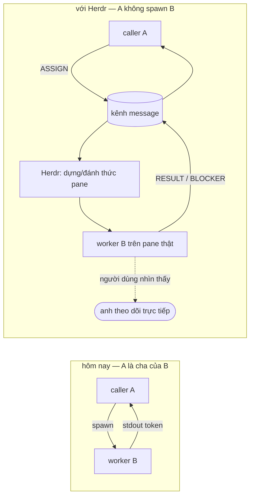
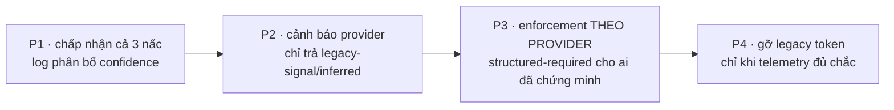

# DISCUSSION — DispatchPlan / AgentMessage protocol redesign

Item: `tsk-5x7`. Nguồn: bản phân tích của Codex (gpt-5.5 high) đọc trực tiếp
`src/runner/dispatch/*`, đề xuất tách dispatch thành DispatchPlan (routing) +
AgentMessage (control) + Artifact (data) + State store (sự thật task) +
Transport (adapter pluggable). Liên quan: `tsk-2y7` (**supersededBy** item
này — cross-provider gate blind spot), `tsk-fli`, `tsk-9tu`, `tsk-5ym`,
`tsk-492`, `tsk-2ld`, `tsk-62w`, `tsk-5fn` (các finding dispatch mở khác,
chưa rõ cái nào gấp vào đây). Doctrine đã khoá liên quan:
`docs/specs/runner.md` §0026 (Native-First Dispatch Doctrine:
launcher/rootTask/subTask/capacity), §0029 (sửa từ vựng 0026), §0033
(capacity cli-spawn-shaped luôn thắng); `docs/history/two-layer-dispatch`
(`tsk-2t6`, **done**); `docs/history/dispatch-concept-boundary` (`tsk-5td`,
**done**, 18 D-ID khoá gather/judge/orchestrator→launcher);
`docs/history/dispatch-activation-and-handoff-redesign` (`tsk-2uf` +
children, **retrospective**, driver/worker split + `prepareDispatch`).

## 1. Trạng thái hiện tại

Vòng 5 (2026-08-25). **Năm D-ID đã mint** (D1-D5, §4), kèm năm lời gọi
`fgos decision --id tsk-5x7` thật (seq 4-8). §6 đã regenerate lần 2 (D5 đổi
hình dạng lớp kết quả). **Không còn câu hỏi mở nào** — §3 đã sạch: mọi hàng
đều `Rõ` hoặc đã lên D-ID.

Vòng 5 người dùng **rút lại phần "bỏ sạch fallback stdout"** của vòng 4, sau
khi phiên nêu bằng chứng ngược, và chốt thang ba nấc có khai `confidence`
(`reported`/`legacy-signal`/`inferred`) + migration 4 pha có telemetry gác
cửa ⇒ **D5**. Bốn đổi tên còn lại của vòng 4 giữ nguyên không bị lật ⇒
**D4**. Nguyên tắc D5 phát biểu gọn: *kết quả cuối không được giả vờ cùng
độ chắc chắn.*

Phiên tìm thêm một **tiền lệ sống mạnh hơn cả `outcome:'unsignaled'`**:
`attestation-guard.mjs` (`tsk-34o5`) đã đọc `executor.dispatch` event thật
và làm ĐÚNG hình dạng D5 một tầng dưới — halt khi attestation *mâu thuẫn*
git state, nhưng *"never halt on missing event or null attestation"* (skip,
no-op). Nghĩa là `confidence` không phải triết lý mới, mà là tổng quát hoá
một posture fgOS đã tự chứng minh. Phát hiện kèm: điều này **đính chính một
tiền đề sai của `tsk-492`** (item đang mở) — item đó ghi *"hiện KHÔNG có
consumer nào đọc `executor.dispatch`"*, nhưng `attestation-guard` chính là
consumer thật đang sống; ai làm `tsk-492` cần biết trước khi lập kế hoạch.

Đã đo giá phá tương thích ở vòng 4 (giữ lại vì D4 đứng trên nó): `exec
packet` và `<scope>#p<n>` = **0 dòng code** (`tsk-2t6` D4 tự gác B2, chưa
bao giờ xây) ⇒ đổi tên gần như miễn phí; `[DONE]`/`[BLOCKED]` = **2 điểm
code** (`cli.mjs:541-542`) + 3 file prose canonical (mirror thành 7);
`carries` thì NGƯỢC LẠI — đã xây thật, gate đang chạy
(`resolve.mjs:243-258`, enum `EXECUTOR_CARRIES`), tái dùng được ngay.

Vòng 2-3 (giữ lại để đọc mạch): vòng 1 scout xong hai finding sống + quét backlog/
doctrine, đặt hai câu hỏi mở đầu (vocabulary reconciliation + phạm vi thảo
luận). Người dùng trả lời cả hai trong vòng 2, đầy đủ và có lý lẽ riêng:
`mechanism` phải là canonical output của 0026/0033 (không phải quyết định
mới), `launcher` đi vào `plan.caller`/`plan.launcher` chứ không phải
`mechanism`, `selector.type` dùng `work` (khớp 0029's rename rootTask→work)
thay vì resurrect rootTask/subTask, và scope được MỞ RỘNG thành 8 pha dưới
tên "Dispatch semantic control plane + Herdr-ready orchestration" (thêm hẳn
Herdr orchestration làm pha 6 thay vì để riêng). Đã xác minh thêm hai điều
bằng scout (không phải suy đoán): (a) `mechanism.mjs`'s
`decideDispatchMechanism`/`decideExecutorDispatchMechanism` ĐÃ LÀ triển khai
thuần/đúng của 0026/0033 hôm nay — Phase 1 thật sự "thin" như người dùng
muốn, không cần viết lại logic mechanism, chỉ cần bọc nó vào object
`DispatchPlan` + sửa bug `decide --for`; (b) `capacity`→`executor` KHÔNG
CÒN LÀ giả định "nếu" — đã có quyết định thật (`D-ADR0034`, `tsk-225`,
`docs/history/capacity-naming-rename/CONTEXT.md`) đổi tên toàn bộ
`capacity`/`capacities` (code + config) thành `executor`/`executors`, xác
nhận `.fgos/config.json`'s `runner.executors` hôm nay CHÍNH LÀ khái niệm
"capacity" của 0026/0029, không phải một field khác. Chưa có D-ID nào mint
— câu trả lời vòng 2 chưa "giữ qua hơn một vòng" theo hard rule, cần một
vòng nữa xác nhận trước khi mint. Một câu hỏi mới nổi ra từ chính đề xuất mở
rộng scope của người dùng: Herdr-as-transport (pha 6/7) có consumer thật
nào đang chờ không, hay vẫn là tầm nhìn chưa có ai cần (§3 hàng 11).

## 2. Mục tiêu & đề bài

Note gốc muốn cải tiến triệt để cơ chế dispatch của forgentX theo hướng
tường minh hơn, nhanh hơn, và flexible hơn khi dùng tool ngoài hoặc đẩy việc
giữa nhiều agent provider (Claude, Codex, AGY, pi, OpenRouter, và tương lai
mailbox/Herdr/RPC), bằng cách tách rõ năm lớp: DispatchPlan (quyết định
route/thực thi), AgentMessage (control message giữa agent), Artifact (dữ
liệu lớn/work product), State store (sự thật về task), và Transport
(CLI/stdout, HTTP, MCP, mailbox, Herdr, RPC...). Note liệt kê bảy finding cụ
thể trên code thật (từ lệch `decide --for` với `capabilities.*.prefer`, đến
cross-provider governance nhìn sai chỗ, đến protocol bị khoá cứng vào
prompt/stdout), một khái niệm `selector` để caller chỉ đích trước khi
planner resolve executor thật, một hướng đổi governance từ "chặn
cross-provider" sang "bắt khai báo egress", một schema `AgentMessage` V1, và
một kế hoạch tám pha (characterization test → DispatchPlan → protocol
decoupling → adapter v2 → invocation protocol field → artifact-based
handoff → mailbox/Herdr optional → tối ưu tốc độ).

## 3. Vấn đề rõ / chưa rõ

| # | Câu hỏi / điểm | Trạng thái | Ghi chú |
|---|---|---|---|
| 1 | Finding #1 (`decide --for` lệch `capabilities.*.prefer`) còn đúng trên code thật không? | **Rõ — xác minh sống** | `decideExecutorCli` (`src/runner/dispatch/cli.mjs:685`) gọi thẳng `resolveExecutorIdForPurpose` (raw scan `executor.for`), KHÔNG qua `resolveExecutorAndOverrides` (đọc `capabilities.<name>.prefer`, `resolve.mjs:195`). Chạy sống: `node src/runner/dispatch.mjs decide --for fgos-coding-implement` → `{"mechanism":"unavailable","configured":false}`, dù `.fgos/config.json` có `capabilities.fgos-coding-implement.prefer:"agy"`. |
| 2 | Finding #3 (cross-provider gate mù với env override) còn đúng trên code thật không? | **Rõ — xác minh sống** | `resolve.mjs:322`: `if (executorEntry && !resolvedViaAgentType && !CLAUDE_CLI_COMMANDS.includes(executor.command) && executorEntry.allowCrossProvider !== true)` — điều kiện chỉ nhìn `executor.command`, không nhìn `env`/`ANTHROPIC_BASE_URL`. Executor `glm` giữ `command:"claude"` nên `CLAUDE_CLI_COMMANDS.includes("claude")===true` → gate không bao giờ chạm tới, bất kể egress thật đi đâu. Đây đúng là gap `tsk-2y7` đã ghi — item đó đã `supersededBy: tsk-5x7`. |
| 3 | `execute --work <id>` có tồn tại chưa (Phase 5/Selector "work")? | **Rõ — chưa có** | `case 'execute'` (`cli.mjs:904-953`) chỉ nhận `--prompt`/`--prompt-file`, không có nhánh `--work`. `case 'decide'` (`cli.mjs:955-973`) THÌ ĐÃ có `--work`/`--stage` từ lâu. Đây chính là gap `tsk-fli` đang mở, khớp thẳng vào "selector.type=work" của note. |
| 4 | `selector.type` (work/purpose/executor/adHocAgent) có phải khái niệm mới, hay là đặt tên cho cái đã tồn tại rời rạc? | **Rõ — phần lớn đã tồn tại rời rạc** | `decide <executorId>` = executor selector, `decide --for <purpose>` = purpose selector, `decide --work <id>` = work selector — cả ba đã là nhánh CLI riêng biệt hôm nay (`cli.mjs:628-701`). `adHocAgent`/`needsSoul` cũng đã có nhánh riêng (`needsSoul` param, dòng 692). Note đề xuất GOM bốn nhánh này thành một object `selector` tường minh — là một formalize/refactor có cơ sở, không phải phát minh cơ chế mới. |
| 5 | `DispatchPlan` có phải khái niệm mới, hay là mở rộng của cái `decide` đã trả về hôm nay? | **Rõ — là mở rộng** | `decide` hôm nay đã trả `{mechanism, executorId?, agentType?, mcpTool?, configured}` (`cli.mjs:698-727`). `DispatchPlan` trong note thêm `selector`, `capability`, `kind`, `invocation`, `handback`, `model`, `governance`, `reasonCodes` — cùng một chỗ, chỉ giàu hơn. |
| 6 | `DispatchPlan`/`selector`/`kind` có xung đột với vocabulary ĐÃ KHOÁ (launcher/rootTask/subTask/capacity→executor, D-ADR0026/0029/0033/0034) không? | **Hội tụ vòng 2, chưa mint** | Người dùng chốt: `mechanism` PHẢI LÀ canonical output của 0026/0033, không phải quyết định mới cạnh nó — xác minh khớp code thật: `decideDispatchMechanism`/`decideExecutorDispatchMechanism` (`mechanism.mjs:42,82`) đã là triển khai thuần của đúng 4 quy tắc đó, Phase 1 chỉ cần bọc, không viết lại. `launcher` (vai trò, KHÔNG cần soul) đi vào `plan.caller`/`plan.launcher`, không phải `mechanism`. `rootTask`/`subTask` KHÔNG resurrect — 0029 đã thay bằng `work`/`child work`, khớp `selector.type=work`. `capacity` KHÔNG "nếu rename" nữa — đã CHỐT rename thành `executor` (`D-ADR0034`, `tsk-225`) — `runner.executors` hôm nay chính là khái niệm capacity của 0026. Còn treo: cần một vòng nữa giữ nguyên trước khi mint D-ID (hard rule: không mint từ một câu trả lời). |
| 7 | `two-layer-dispatch` (`tsk-2t6`, done) đã khoá 18 D-ID về L1/L2 + capacity ad-hoc packet — note có giẫm lên D-ID nào ở đó không? | **CHƯA RÕ — cần đọc lại nếu đi sâu Phase 2+** | Chưa đọc hết `docs/history/two-layer-dispatch/DISCUSSION.md` (163.9K) trong vòng này — chỉ đọc §1. Nếu phạm vi vòng này đi tới Phase 2 (`DispatchPlan` module thật), cần đối chiếu D-ID ở đó trước khi mint D-ID mới có nguy cơ trùng/lật. |
| 8 | `dispatch-concept-boundary` (`tsk-5td`, done, 18 D-ID) đã khoá gather/judge/orchestrator→launcher — `AgentMessage.message_type` (TASK/ACK/PROGRESS/...) có đụng khái niệm nào ở đó không? | **CHƯA RÕ** | Chưa đối chiếu chi tiết — cần nếu Phase 3 (protocol decoupling) được chọn làm việc thật. |
| 9 | Phase 3/6/7 (AgentMessage schema, artifact-based handoff, mailbox/Herdr) có consumer thật nào hôm nay không, hay cùng dạng YAGNI-chờ-consumer như `tsk-6db` (Native-First Phase 5, "deferred, no concrete consumer yet") và `tsk-2ld` (RPC/app-server adapter, "research/discovery scope only")? | **CHƯA RÕ — cần người quyết** | Chưa thấy bằng chứng có provider nào hôm nay THẬT SỰ cần JSON-mode/event-stream thay vì prompt/stdout — `coding-worker-contract.md`'s `[DONE]`/`[BLOCKED]` token vẫn là hợp đồng sống duy nhất. Repo có xu hướng khoá rõ "deferred, YAGNI, chưa có consumer cụ thể" cho đúng dạng việc này (`tsk-6db`) thay vì xây trước. |
| 10 | Phạm vi thảo luận vòng này: đi hết 8 pha của note, hay khoanh trước vào phần đã xác minh sống + rẻ (Finding #1, #3 — hàng 1-2 ở trên), để phần đầu cơ (AgentMessage/mailbox/Herdr) chờ một vòng riêng có consumer thật? | **Người dùng chọn: đi hết, dưới tên "Dispatch semantic control plane + Herdr-ready orchestration"** | Người dùng mở rộng scope thành 8 pha thật (DispatchPlan canonical → AgentMessage schema → protocol abstraction → structured result → artifact store → Herdr orchestration → mailbox/broker → governance egress), thứ tự triển khai rõ. Herdr được đưa vào SỚM hơn đề xuất gốc của note (pha 6/9 thay vì "optional, chưa quyết"), với ràng buộc rõ: Herdr là runtime adapter, KHÔNG BAO GIỜ quyết định task/review/blocker/artifact state — AgentMessage + fgOS state transition mới có quyền đó. Chưa trả lời trực tiếp câu hỏi "có consumer thật không" — xem hàng 11 mới. |
| 11 | Herdr-as-transport (pha 6/7 mới) có consumer thật đang chờ không, hay vẫn là tầm nhìn chưa ai cần (cùng dạng YAGNI `tsk-6db` đã tự khoá)? | **Rõ — consumer thật, cùng xây trong scope này** | Người dùng xác nhận: consumer là chính người dùng khi đang làm việc, muốn TEST/theo dõi/trace agent đang làm gì lúc dispatch — thay vì bật agent mới qua stdin/stdout mù, bật qua Herdr để thấy nó chạy trên pane thật. Hệ quả kiến trúc quan trọng: khi Herdr đứng pane lên, A (caller) KHÔNG CÒN LÀ tiến trình cha trực tiếp của B (worker) — A không spawn B, không đọc stdout của B đồng bộ — nên cần một **protocol ổn định để A/B trao đổi khi A không sở hữu tiến trình B**. Đây chính là động lực thật, cụ thể, đứng sau việc tách AgentMessage khỏi giả định "A spawn B, đọc stdout" — không phải đầu cơ. |
| 12 | `AgentMessage.payload`/`message_id` có phải phát minh từ đầu, hay đã có hình dạng tương đương bị khoá ở nơi khác? | **Rõ — chồng lấn có thật, và giá đổi tên gần bằng 0** | `two-layer-dispatch` (`tsk-2t6`) đã khoá **D18**: gói dispatch ad-hoc tên chính thức "exec packet", **SÁU field bắt buộc** (id · mục tiêu một câu · đầu vào phải đọc · ranh giới · hình dạng kết quả mong đợi · hợp đồng trả về), id shape `<scope>#p<n>` (D6b). Vòng 4 người dùng chọn đổi tên thành `DispatchAssignment` + typed id `asgn_`. **Đo giá thật:** `grep -rn "exec packet\|execPacket" src/ bin/` → **0 hit**; `<scope>#p<n>` → **0 hit**. Cả hai là quyết định đã khoá mà CHƯA BAO GIỜ xây — chính `tsk-2t6` D4 tự gác B2 lại, D9 đặt điều kiện AND để mở lại và điều kiện (b) chưa bao giờ thoả. Nên đây không phải "phá tương thích" mà là **đổi tên một thứ chưa tồn tại**; sáu ô nội dung của D18 vẫn được giữ nguyên ý nghĩa, chỉ đổi nhãn (`goal`→`objective`, `boundary`→`scope`, v.v.). |
| 13 | `governance.egress`/`carries` của note có trùng field nào đã khoá không? | **Rõ — `carries` đã XÂY THẬT và khớp 1:1, tái dùng được ngay** | (a) **D15** (`tsk-5td`) không chỉ khoá trên giấy: `EXECUTOR_CARRIES = Object.freeze(['user-text','repo-content'])` (`config.mjs:364`) và gate thật ở `resolve.mjs:243-258` — một executor khai `carries:"user-text"` sẽ TỪ CHỐI một dispatch mang `repo-content` **trước khi spawn**. `execute --carries <class>` đã là flag CLI sống (`cli.mjs:929`). Người dùng đề xuất `governance.carries:["repo-content"]` — trùng khớp enum sống, tái dùng miễn phí, không phát minh vocabulary mới. Hôm nay chưa executor nào trong `.fgos/config.json` khai `carries` nên gate đang ngủ, nhưng cơ chế thì đã có. (b) **D9** (`tsk-5td`) đã thiết kế đúng fix cho gap glm: audit ghi CẢ `provider` (nhãn tự khai) LẪN `command` (lệnh thật) — khớp `egress.declared_provider` vs `effective_target` người dùng đề xuất, chỉ khác chỗ áp (audit event vs field trên message). |
| 15-17 | Đổi `exec packet`→`DispatchAssignment`, `TASK`→`ASSIGN`, id typed prefix, `ArtifactRef` bắt buộc | **Rõ — đã lên D4 (vòng 4→5)** | Giá đo được = 0 dòng code (hàng 12). `runId`/`ArtifactRef`/`artifact://` = 0 hit → greenfield, không va chạm. Typed prefix vẫn giữ được bảo đảm-bằng-cấu-trúc của D6b (`asgn_01K...` không khớp `ID_PATTERN` vì có `_`/chữ hoa) nhưng đọc và grep được hơn `#`. |
| 18 | Bỏ HẲN parse `[DONE]`/`[BLOCKED]`, không giữ fallback | **Rõ — người dùng RÚT LẠI vòng 5, thay bằng D5** | Phiên nêu bằng chứng ngược ở vòng 4; người dùng đồng ý và chốt structured-first + degradation-aware. Bằng chứng quyết định: worker là CLI agent bên thứ ba nên prompt chỉ là *soft contract*; `cli.mjs:546` đã có `outcome:'unsignaled'`; và mạnh hơn cả — `attestation-guard.mjs` (`tsk-34o5`) đã làm đúng hình dạng này một tầng dưới: halt khi attestation *mâu thuẫn* git, nhưng *"never halt on missing event or null attestation"*. |
| 19 | Phase 1-2 của migration cần một đường ĐỌC telemetry — `executor.dispatch` có consumer thật không? | **Rõ — có, và điều này đính chính `tsk-492`** | `attestation-guard.mjs` đọc `executor.dispatch` thật (`readEvents` → lọc `type==='executor.dispatch'` theo `payload.id`, lấy bản ghi cuối để xử retry). `tsk-492` (đang mở) ghi *"hiện KHÔNG có consumer nào đọc executor.dispatch (không dashboard, không notification — đã xác nhận khi làm tsk-3kl)"* — tiền đề đó **nay đã sai**. Hệ quả cho D5: mở rộng payload `executor.dispatch` thêm `confidence` là đúng chỗ (`logExecutorDispatch`, `cli.mjs:298-301`, payload hiện có `id/executorId/provider/command/model/baseCommit/headRef`), và đã có sẵn một consumer biết đọc format đó. |
| 14 | Trục `mechanism`/`kind` của note có đụng khung bảy tầng đã khoá (D10, `tsk-5td`) không? | **Rõ — không đụng, chỉ cần đối chiếu tên khi viết code** | D10 khoá khung bảy tầng T0-T4+TG+TD (`orchestrator`/`launcher`|`driver`/`work`|`errand`→`exec packet`/`capacity`→`executor`/`capability`|`tool`|`kind`|`executor`/gate/`mechanism`). D16 đã đổi giá trị mechanism từ `native`/`cli-spawn` sang đúng `in-process`/`out-of-process` — khớp 100% với code thật hôm nay (`mechanism.mjs`). D17 khoá T1 chỉ có `launcher`/`driver` — khớp đề xuất `plan.caller`/`plan.launcher` của người dùng. Không có xung đột giá trị, chỉ cần khi viết `DispatchPlan` module thật thì đặt tên field đúng theo khung này (vd không tự bịa từ `orchestrator` cho một nghĩa khác). |

## 4. Quyết định đã chốt

_Append-only. Mỗi D-ID chỉ mint sau khi đã đứng qua **hơn một vòng** không
bị lật, kèm một lời gọi `fgos decision --id tsk-5x7` thật._

| D-ID | Quyết định | Lý do | Vòng nêu → chốt |
|---|---|---|---|
| **D1** | **`DispatchPlan.mechanism` là output canonical của Native-First Dispatch Doctrine (0026 rules 1-4, thu hẹp bởi 0033), không phải một quyết định mới đứng cạnh nó.** `launcher`/`driver` đi vào `plan.caller` (vai trò T1, D17 `tsk-5td`), không vào `mechanism`. `selector.type` dùng `work` (0029 đã thay `rootTask`/`subTask` bằng `work`/`child work`), không resurrect từ vựng cũ. `capacity` không dùng làm primary field — `D-ADR0034`/`tsk-225` đã rename `capacity`→`executor` toàn bộ code+config, `runner.executors` hôm nay CHÍNH LÀ khái niệm đó. `reasonCodes` giữ trace rule nào thắng. | Xác minh sống: `mechanism.mjs`'s `decideDispatchMechanism`/`decideExecutorDispatchMechanism` đã là triển khai thuần của đúng 4 quy tắc 0026/0033, không có drift phải dọn ⇒ Phase 1 thật sự *thin*: chỉ bọc kết quả có sẵn, không viết lại logic. Tạo tầng mechanism thứ hai = hai nguồn sự thật (doctrine trong `docs/specs` vs planner trong code). | 1 → 4 (`fgos decision` seq 4) |
| **D2** | **Scope là "Dispatch semantic control plane + Herdr-ready orchestration" — 8 pha, không khoanh hẹp vào 2 bug đã xác minh sống.** Thứ tự: (1) DispatchPlan canonical + fix `decide --for`, (2) AgentMessage schema V1, (3) protocol abstraction, (4) structured RESULT/BLOCKER/ERROR, (5) artifact store V1, (6) Herdr orchestration làm runtime adapter, (7) mailbox/broker, (8) governance egress metadata. | Người dùng chọn mở rộng thay vì khoanh hẹp, có lý do thật đứng sau (D3) chứ không phải đầu cơ. Ràng buộc cứng đi kèm: **Herdr KHÔNG BAO GIỜ quyết định** task/review/blocker/artifact state — chỉ AgentMessage + fgOS state transition có quyền đó. | 2 → 4 (`fgos decision` seq 5) |
| **D4** | **Đổi tên theo hướng thiết kế lại từ đầu, chấp nhận phá tương thích vì giá đo được = 0.** `exec packet` (D18 `tsk-2t6`) → **`DispatchAssignment`**; `TASK` → **`ASSIGN`**; id `<scope>#p<n>` (D6b) → typed prefix `tsk_`/`asgn_`/`msg_`/`run_`; artifact handoff bắt buộc qua `ArtifactRef`; prompt contract trở thành thứ **sinh ra từ** `DispatchAssignment`, không còn là protocol gốc. Sáu ô nội dung của D18 giữ nguyên **ý nghĩa**, chỉ đổi nhãn (`goal`→`objective`, `boundary`→`scope`, `expected shape`→`deliverable`, `return contract`→`return_contract`). | Đo giá thật trước khi chốt: `exec packet`/`execPacket` = **0 hit**, `<scope>#p<n>` = **0 hit**, `runId`/`ArtifactRef`/`artifact://` = **0 hit**. Cả hai khái niệm là quyết định đã khoá trên giấy nhưng CHƯA BAO GIỜ xây — `tsk-2t6` D4 tự gác B2, D9 đặt điều kiện AND mà (b) chưa bao giờ thoả ⇒ không phải phá tương thích mà là đổi tên một thứ chưa tồn tại. Lý do đổi: "exec packet" thiên transport/process trong khi thứ nó mô tả là *một phần việc được giao*; `TASK` dễ lẫn `work item` (0029 đã bỏ `rootTask`/`subTask` vì đúng loại lẫn lộn đó). | 4 → 5 (`fgos decision` seq 7) |
| **D5** | **V1 là structured-first + degradation-aware, KHÔNG phải structured-only.** Thang ba nấc tự khai độ tin: (1) structured `RESULT`/`BLOCKER` → `confidence:"reported"`; (2) stdout token `[DONE]`/`[BLOCKED]` → `confidence:"legacy-signal"`; (3) git state/artifact delta/exit code → `confidence:"inferred"`, và `status:"UNKNOWN"` chứ **không giả vờ** `SUCCESS`. `DispatchResult` mang `{status, confidence, evidence}`, `evidence` khác nhau theo nấc. Migration 4 pha: (1) chấp nhận cả ba + log phân bố confidence; (2) cảnh báo provider chỉ trả `legacy-signal`/`inferred`; (3) enforcement **theo từng provider** (`structured-required:true` cho provider đã chứng minh tuân thủ); (4) gỡ legacy token CHỈ KHI telemetry đủ chắc. | Worker là CLI agent bên thứ ba — fgOS chỉ điều khiển qua prompt/terminal nên prompt chỉ là **soft contract**, không cưỡng chế tuyệt đối được. Repo đã tự thừa nhận: `cli.mjs:546` có sẵn `outcome:'unsignaled'` + `headBefore`/`headAfter`. Tiền lệ mạnh hơn: `attestation-guard.mjs` (`tsk-34o5`) đã làm **đúng hình dạng này** một tầng dưới — halt khi attestation *mâu thuẫn* git state, nhưng *"never halt on missing event or null attestation"* ⇒ `confidence` là **tổng quát hoá một posture đã chứng minh**, không phải triết lý mới. Nguyên tắc cốt lõi: *kết quả cuối không được giả vờ cùng độ chắc chắn.* | 4 (phiên đề xuất) → 5 (người dùng chốt + bổ sung shape/migration) (`fgos decision` seq 8) |
| **D3** | **Consumer thật của Herdr-as-transport là chính người dùng khi đang làm việc** — muốn test/theo dõi/trace agent đang chạy trên pane thật thay vì stdin/stdout mù. Hệ quả kiến trúc: khi Herdr đứng pane lên, **A (caller) không còn là tiến trình cha trực tiếp của B (worker)** — A không spawn B, không đọc stdout của B đồng bộ. | Đó là lý do thật, cụ thể, đứng sau việc tách AgentMessage khỏi giả định "A spawn B rồi đọc stdout" — không phải YAGNI kiểu `tsk-6db`. Scout xác nhận đây là bề mặt MỚI: Herdr đã có tích hợp thật (`fgos gateway` `tsk-31v`, `herdrOrchestrator`, MCP surface) nhưng tất cả là REST/dashboard/automation-trigger, khác hẳn "giao AgentMessage qua Herdr-managed runtime/session". | 3 → 4 (`fgos decision` seq 6) |

## 5. Q&A log

- **2026-08-25, vòng 1** — Phiên (thay mặt Codex's note) mở discussion, claim
  `tsk-5x7`, scout sống hai finding cụ thể nhất (decide --for lệch prefer;
  cross-provider gate mù env), quét backlog tìm bảy item dispatch mở liên
  quan (`tsk-fli`, `tsk-9tu`, `tsk-5ym`, `tsk-492`, `tsk-2ld`, `tsk-62w`,
  `tsk-5fn`) và ba cụm doctrine/discussion đã khoá liên quan
  (0026/0029/0033, `two-layer-dispatch`, `dispatch-concept-boundary`,
  `dispatch-activation-and-handoff-redesign`). Chưa hỏi người dùng câu nào —
  đang trình bày phân tích trước khi hỏi (§3 hàng 10 là câu hỏi mở đầu).

- **2026-08-25, vòng 2** — Người dùng trả lời cả hai câu hỏi vòng 1.
  (a) `DispatchPlan.mechanism` = canonical output của 0026/0033 rules qua
  `compileDispatchPlan()`, không phải decision mới; `launcher`→
  `plan.caller`/`plan.launcher`; `rootTask`/`subTask` không resurrect, dùng
  `selector.type=work|purpose|executor|adHocAgent`; `capacity` nếu đã rename
  sang `executor` thì không dùng lại làm primary field; `reasonCodes` giữ
  trace rule nào thắng (vd `native-first.rule-2.live-task-access`,
  `native-first.0033.cli-spawn-shaped`). (b) Scope MỞ RỘNG thành 8 pha dưới
  tên "Dispatch semantic control plane + Herdr-ready orchestration": (1)
  DispatchPlan canonical + fix `decide --for`, (2) AgentMessage schema V1,
  (3) protocol abstraction (prompt-stdout-v1 là MỘT protocol, không phải
  protocol duy nhất), (4) structured RESULT/BLOCKER/ERROR normalization +
  legacy `[DONE]`/`[BLOCKED]` fallback, (5) artifact store V1
  (`.fgos/artifacts/<id>/...`, filesystem-backed), (6) Herdr orchestration
  (runtime adapter, KHÔNG quyết định task/review/blocker/artifact state),
  (7) mailbox/broker (`.fgos/messages/{inbox,outbox,dead-letter}`), (8)
  governance egress metadata thay `command!=claude`. Phiên scout lại và xác
  nhận: `mechanism.mjs` đã đúng thuần 0026/0033 hôm nay (Phase 1 thật sự
  thin); `capacity`→`executor` đã CHỐT thật (`D-ADR0034`/`tsk-225`), không
  còn là giả định "nếu"; và phát hiện Herdr đã có tích hợp thật
  (gateway/dashboard/automation, `tsk-31v`) nhưng KHÁC bề mặt với
  "AgentMessage qua Herdr transport" — đặt thành câu hỏi mới (§3 hàng 11).

- **2026-08-25, vòng 3** — Người dùng trả lời câu hỏi Herdr-consumer: chính
  người dùng, lúc đang làm việc, muốn test/theo dõi/trace agent đang chạy —
  bật qua Herdr để thấy trên pane thay vì stdin/stdout mù, và điều đó cần
  một protocol ổn định cho A/B trao đổi khi A không spawn B trực tiếp. Phiên
  đọc thêm D-ID table của hai discussion đã `done` (`two-layer-dispatch`
  D1-D18, `dispatch-concept-boundary` D1-D18) để đối chiếu trước khi để
  AgentMessage/governance đi xa hơn — phát hiện ba chồng lấn nặng cần người
  quyết: (1) "exec packet" (D18, `tsk-2t6`) đã khoá đúng sáu field bắt buộc
  + id shape `<scope>#p<n>` cho một gói dispatch ad-hoc — gần như cùng ý
  định với `AgentMessage.payload`/`message_id` của note, chưa rõ có nên tái
  dùng làm payload shape thay vì phát minh field mới; (2) `provider`+
  `command` dual-audit (D9, `tsk-5td`) đã là fix đã thiết kế cho đúng gap
  glm mà note gọi "egress ẩn" — cần đối chiếu tên field; (3) `carries` (D15,
  `tsk-5td`) đã khoá tập nội dung ĐƯỢC PHÉP mang — có thể là tập giá trị hợp
  lệ cho `egress.content` của note. Khung bảy tầng (D10/D16/D17,
  `tsk-5td`) xác nhận KHÔNG đụng đề xuất của người dùng (`in-process`/
  `out-of-process`, `launcher`/`driver` hai giá trị đều khớp).

- **2026-08-25, vòng 4** — Người dùng chọn **phá tương thích, thiết kế lại
  đúng từ đầu**, không bị ràng buộc bởi tên/shape cũ: `exec packet` →
  `DispatchAssignment` (tên cũ thiên transport/process-oriented); `TASK` →
  `ASSIGN` (tránh lẫn với `work item`); id `<scope>#p<n>` → typed prefix
  (`tsk_`/`asgn_`/`msg_`/`run_`); bỏ parse `[DONE]`/`[BLOCKED]`, bắt buộc
  structured RESULT; artifact handoff bắt buộc qua `ArtifactRef`; prompt
  contract trở thành thứ *sinh ra từ* `DispatchAssignment` chứ không phải
  protocol gốc; Herdr = transport/orchestration, không là state authority.
  Nghiêng về Option B cho stdout (agent ghi `.fgos/outbox/<message_id>.json`,
  stdout chỉ còn human log) để không phải scrape terminal đoán task done.
  Phiên **đo giá phá tương thích trước khi bàn**: `exec packet` = 0 hit
  code, `<scope>#p<n>` = 0 hit, `runId`/`ArtifactRef`/`artifact://` = 0 hit
  → gần như miễn phí, vì `tsk-2t6` D4 đã tự gác B2 và chưa bao giờ xây;
  `[DONE]`/`[BLOCKED]` = 2 điểm code + 3 file prose canonical; NGƯỢC LẠI
  `carries` đã xây thật (`EXECUTOR_CARRIES`, gate `resolve.mjs:243-258`,
  flag `execute --carries`) và khớp 1:1 đề xuất `governance.carries`.
  Phiên **không đồng ý một điểm** và nêu bằng chứng ngược: bỏ SẠCH fallback
  stdout (§3 hàng 18) — `cli.mjs:546` đã có sẵn `outcome:'unsignaled'` +
  `headBefore`/`headAfter`, tức repo đã phải thiết kế đường lùi vì ca
  worker-không-tuân là có thật; đề nghị thang ba nấc có đo `confidence`
  thay vì bỏ hẳn. Mint D1/D2/D3 (những điểm đã giữ qua 2→3→4).

- **2026-08-25, vòng 5** — Người dùng **rút lại phần "bỏ sạch fallback
  stdout"**, chấp nhận lập luận soft-contract: *"Nếu worker là CLI agent bên
  thứ ba thì fgOS không có quyền cưỡng chế tuyệt đối. Prompt chỉ là soft
  contract."* Chốt thang ba nấc đúng như đề nghị vòng 4, bổ sung shape cụ
  thể (`{status, confidence, evidence}` với `evidence` khác nhau từng nấc;
  nấc `inferred` mang `status:"UNKNOWN"` chứ không giả vờ `SUCCESS`) và
  migration 4 pha có telemetry gác cửa trước khi gỡ legacy. Phát biểu
  nguyên tắc: *"kết quả cuối không nên giả vờ cùng độ chắc chắn"*. Phiên
  scout thêm cho Phase 1-2 và tìm ra tiền lệ mạnh hơn `outcome:'unsignaled'`:
  `attestation-guard.mjs` (`tsk-34o5`) đọc `executor.dispatch` thật, halt
  khi attestation mâu thuẫn git nhưng skip khi thiếu — đúng hình dạng D5 một
  tầng dưới; đồng thời phát hiện điều này **đính chính tiền đề của `tsk-492`**
  (item đang mở, ghi rằng không consumer nào đọc `executor.dispatch`). Mint
  D4 (bốn đổi tên, giữ qua 4→5) và D5 (thang ba nấc, nêu vòng 4 → chốt vòng
  5). §3 không còn hàng nào `CHƯA RÕ`.

## 6. Thiết kế đã chốt {#design}

_Viết lại toàn phần mỗi khi một D-ID làm đổi hình dạng thiết kế. Bản này:
**lần 2, sau D4/D5 (vòng 5)**. Toàn bộ §6 giờ đứng trên D-ID đã mint._

### 6.1 Năm lớp, và ranh giới giữa chúng [KHOÁ — D1/D2/D3]

Thiết kế đứng trên một mệnh đề: **mỗi lớp chỉ được là sự thật của đúng một
thứ**, và không lớp nào được suy ra sự thật của lớp khác.

| Lớp | Là sự thật của | Không bao giờ được quyết |
|---|---|---|
| **DispatchPlan** | route: ai làm, cơ chế nào, provider/model nào, policy nào | nội dung việc, kết quả việc |
| **AgentMessage** | control-plane: giao việc, hỏi, chặn, trả kết quả, review | trạng thái lifecycle của work item |
| **ArtifactRef / artifact store** | dữ liệu nặng: commit, diff, test report, log | ý nghĩa của dữ liệu đó |
| **State store (`.fgos/`)** | **sự thật duy nhất** về work status | cách một dispatch được route |
| **Transport** | cách message đi tới nơi (stdio/mailbox/HTTP/MCP/Herdr) | bất cứ thứ gì mang nghĩa |

Ràng buộc sắc nhất, từ D2/D3: **Herdr nằm ở hàng Transport, không hàng State
store.** Herdr biết pane nào sống, tiến trình nào chết, terminal nào đang
chạy gì — nhưng "task xong chưa", "review qua chưa", "blocker gỡ chưa" chỉ
đến từ AgentMessage cộng với fgOS state transition. Không map trạng thái
Herdr 1:1 sang trạng thái task.

### 6.2 Vì sao AgentMessage phải tồn tại [KHOÁ — D3]

Không phải vì JSON đẹp hơn prose. Vì một sự kiện cụ thể: **khi Herdr đứng
pane lên, A không còn là cha của B.** Mô hình dispatch hôm nay giả định
ngầm rằng caller spawn worker rồi đọc stdout của chính tiến trình con đó —
toàn bộ `[DONE]`/`[BLOCKED]`, toàn bộ `outcome:'unsignaled'` đều dựa trên
giả định ấy. Bỏ giả định đó đi thì cần một kênh trao đổi không phụ thuộc
quan hệ cha-con tiến trình. Đó là AgentMessage.



### 6.3 DispatchPlan — thin, không phải tầng quyết định thứ hai [KHOÁ — D1]

`compileDispatchPlan()` **không tự phán** cơ chế. Nó gọi đúng thứ đã có
(`decideDispatchMechanism`/`decideExecutorDispatchMechanism`, triển khai
thuần của 0026 rules 1-4 thu hẹp bởi 0033) rồi đóng gói kết quả lại kèm
ngữ cảnh. Hình dạng (field name chưa mint):

```
selector   { type: work|purpose|executor|adHocAgent, value }
caller     { role: launcher|driver }        ← T1, D17 tsk-5td
mechanism  in-process | out-of-process | unavailable   ← D16 tsk-5td
executorId capability  invocation{via,adapter,protocol}  model
governance { carries, egress }
reasonCodes [ "native-first.rule-2...", "native-first.0033.cli-spawn-shaped" ]
```

`reasonCodes` là chỗ trả lời "vì sao ra kết quả này" mà hôm nay không có —
quan trọng vì mechanism là *dẫn xuất*, và một dẫn xuất không giải thích
được thì không debug được.

### 6.4 Từ vựng mới, và cái gì thật sự thay đổi [KHOÁ — D4]

| Cũ (khoá trên giấy, 0 dòng code) | Mới | Ghi chú |
|---|---|---|
| `exec packet` (D18 `tsk-2t6`) | **`DispatchAssignment`** | sáu ô nội dung giữ nguyên ý nghĩa |
| `TASK` (message type) | **`ASSIGN`** | tránh lẫn `work item`/`tsk-` |
| `<scope>#p<n>` (D6b) | `tsk_`/**`asgn_`**/`msg_`/`run_` | vẫn không hợp lệ với `ID_PATTERN`, nhưng grep được |
| prompt là protocol gốc | prompt **sinh ra từ** `DispatchAssignment` | prompt tụt xuống thành một cách *render* |

Sáu ô của D18 chỉ đổi nhãn: `id`→`assignment_id`, `goal`→`objective`,
`boundary`→`scope`, `expected shape`→`deliverable`, `return contract`→
`return_contract`. Điều thật sự thay đổi không phải tên — mà là **prompt
không còn là nguồn**: hôm nay prompt LÀ hợp đồng; sau D4 hợp đồng là
`DispatchAssignment`, prompt chỉ là một trong nhiều cách trình bày nó (một
provider có JSON mode nhận thẳng object, không cần render ra prose).

### 6.5 Thang kết quả ba nấc — nguyên tắc trung tâm [KHOÁ — D5]

*Kết quả cuối không được giả vờ cùng độ chắc chắn.* Mọi `DispatchResult`
mang `{status, confidence, evidence}`, và `evidence` phải nói được **vì sao
tin ở mức đó**:

| Nấc | `confidence` | `status` khi thành công | `evidence` mang gì |
|---|---|---|---|
| agent phát message đúng protocol | `reported` | `SUCCESS` | `message_id`, `assignment_id`, `artifact_refs` |
| agent tuân contract stdout cũ | `legacy-signal` | `SUCCESS` | `legacySignal:"DONE"`, `headBefore/After` |
| agent không signal gì | `inferred` | **`UNKNOWN`** | `headBefore/After`, `exitCode`, artifact delta |

Nấc ba **không được báo `SUCCESS`** — đó là chỗ thiết kế cũ sai: một worker
im lặng mà git có commit thì hôm nay bị đọc như thành công, trong khi sự
thật chỉ là "có gì đó đã đổi". `UNKNOWN` + `evidence` để người/driver quyết,
không phải hệ tự quyết hộ.

Migration bốn pha — telemetry gác cửa, không gỡ mù:



Chỗ ghi telemetry đã có sẵn và **đã có consumer thật**: payload của event
`executor.dispatch` (`logExecutorDispatch`, `cli.mjs:298-301`) — thêm
`confidence` vào đây, không log riêng.

### 6.6 Vì sao thang ba nấc không phải triết lý mới [KHOÁ — D5]

`attestation-guard.mjs` (`tsk-34o5`) đã sống và đã làm đúng hình dạng này
một tầng dưới, cho một câu hỏi khác (worker có commit đúng chỗ không):

- attestation **mâu thuẫn** git state → halt, không nhân nhượng;
- attestation **thiếu/null** → *"never halt"*, skip, no-op.

Tức fgOS đã tự chứng minh posture "phân biệt *sai* với *không biết*" là
đúng và dùng được. D5 chỉ tổng quát hoá nó lên lớp kết quả dispatch.

### 6.7 Cái gì tái dùng được ngay, miễn phí [KHOÁ — bằng chứng code]

- `carries` — `EXECUTOR_CARRIES = ['user-text','repo-content']` đã sống,
  gate đã chạy (`resolve.mjs:243-258`), flag `execute --carries` đã có.
  `governance.carries` của thiết kế mới dùng thẳng, không phát minh enum.
- `provider` + `command` dual-audit (D9 `tsk-5td`) — đúng fix cho gap
  glm-style, khớp `egress.declared_provider` vs `effective_target`.
- `mechanism` values `in-process`/`out-of-process` (D16) — khớp code thật.

## 7. Danh mục hạng mục / task {#tasks}

_Tám pha của D2 gom thành **sáu hạng mục** — hai chỗ gộp vì cùng footprint
và không tách được thành proof riêng. Thứ tự dưới đây là thứ tự dependency
thật, không phải thứ tự ưu tiên._

### 7.1 DispatchPlan canonical + fix `decide --for` {#task-dispatch-plan}

**Mục tiêu.** Một `compileDispatchPlan()` (module mới
`src/runner/dispatch/plan.mjs`) trả object plan đầy đủ, và **mọi** caller
hôm nay (`decideExecutorCli`, `executeExecutorCli`, `spawnWorker`,
`fanoutBatchExecutorCli`, `scripts/dispatch-decide-hook.mjs`) đọc chung một
plan thay vì mỗi chỗ tự resolve.

**Trích §6.** §6.3 — plan là *thin*: gọi `decideDispatchMechanism`/
`decideExecutorDispatchMechanism` có sẵn rồi đóng gói, **không** tự phán cơ
chế. Kèm `reasonCodes` để một dẫn xuất giải thích được chính nó.

**D-ID áp dụng.** D1 (mechanism canonical, vocabulary), D2 (pha 1).

**Kèm bug đã xác minh sống.** `decide --for <purpose>` phải đi qua
`resolveExecutorAndOverrides` để đọc `capabilities.<name>.prefer` (hôm nay
gọi thẳng `resolveExecutorIdForPurpose` nên trả `unavailable` sai).

**Quan hệ.** Nền cho mọi hạng mục sau. Không phụ thuộc ai.

**Verify nháp.** `node src/runner/dispatch.mjs decide --for
fgos-coding-implement` trả `{"mechanism":"out-of-process","executorId":"agy",
"configured":true}` + `node --test test/runner/dispatch.test.mjs` xanh.

### 7.2 `execute --work <id>` — cửa dựng prompt đúng template {#task-execute-work}

**Mục tiêu.** Thêm nhánh `--work <id>` cho `execute` (hôm nay chỉ có
`--prompt`/`--prompt-file`), resolve item rồi gọi `buildPrompt` y như
`fanoutBatchExecutorCli` đã làm nội bộ.

**Trích §6.** §6.4 — prompt là thứ *sinh ra từ* assignment; muốn thế thì
phải có một cửa CLI dựng được prompt đúng template, không để driver tự chế.

**D-ID áp dụng.** D2 (pha 1), D4 (prompt tụt xuống thành renderer).

**Quan hệ.** **Trùng hoàn toàn với `tsk-fli` đang mở** — không tạo item mới,
gấp `tsk-fli` vào lô này hoặc để nó làm chính hạng mục này.

**Verify nháp.** `execute agy --work <id>` dựng prompt khớp byte-for-byte
với `buildPrompt(workItem)`.

### 7.3 AgentMessage V1 + DispatchAssignment {#task-agent-message}

**Mục tiêu.** Schema + validator cho envelope (`ASSIGN`/`ACK`/`PROGRESS`/
`QUESTION`/`ANSWER`/`BLOCKER`/`RESULT`/`REVIEW_REQUEST`/`REVIEW_RESULT`/
`CANCEL`/`ERROR`) và cho payload `DispatchAssignment` tám ô. Worker prompt
hiện tại trở thành **renderer** từ assignment.

**Trích §6.** §6.2 (vì sao phải tồn tại: A không còn là cha của B), §6.4
(từ vựng + sáu ô của D18 đổi nhãn giữ nghĩa).

**D-ID áp dụng.** D3, D4, D2 (pha 2-3).

**Quan hệ.** Cần 7.1 xong (plan là nơi biết `selector`/`governance`).

**Verify nháp.** Round-trip: `renderPrompt(assignment)` ra đúng template
hôm nay; validator từ chối message thiếu `assignment_id`/`return_contract`.

### 7.4 Structured result + thang confidence {#task-confidence-ladder}

**Mục tiêu.** Chuẩn hoá mọi kết quả executor thành `{status, confidence,
evidence}` theo ba nấc; ghi `confidence` vào payload `executor.dispatch`;
nấc `inferred` trả `status:"UNKNOWN"`.

**Trích §6.** §6.5 (bảng ba nấc + nguyên tắc "không giả vờ cùng độ chắc
chắn"), §6.6 (tiền lệ `attestation-guard`).

**D-ID áp dụng.** D5 (toàn bộ), D2 (pha 4).

**Quan hệ.** Cần 7.3 (nấc `reported` cần message thật). Nấc 2/3 làm được
độc lập trước. **Đính chính `tsk-492`**: `executor.dispatch` ĐÃ có consumer
(`attestation-guard`) — ai làm `tsk-492` cần biết.

**Verify nháp.** Ba ca thật: worker phát RESULT → `reported`; worker in
`[DONE]` → `legacy-signal`; worker im lặng nhưng có commit → `UNKNOWN` +
`inferred`, không phải `SUCCESS`.

### 7.5 Artifact store V1 + ArtifactRef {#task-artifact-store}

**Mục tiêu.** `.fgos/artifacts/<id>/` filesystem-backed; message mang
`ref`, không mang nội dung; state store vẫn là sự thật về status.

**Trích §6.** §6.1 (ArtifactRef là sự thật của dữ liệu nặng, không của ý
nghĩa dữ liệu đó), §6.5 (`artifact_refs` trong evidence nấc `reported`).

**D-ID áp dụng.** D2 (pha 5), D4 (ArtifactRef bắt buộc).

**Quan hệ.** Cần 7.3. Greenfield (0 hit `artifact://` trong `src/`).

**Verify nháp.** Một dispatch thật trả `git://.../commit/<sha>` +
`artifact://.../test-report.json`; driver đọc được mà không cần diff trong
conversation.

### 7.6 Herdr transport + mailbox {#task-herdr-transport}

**Mục tiêu.** `HerdrTransport.deliver(message, plan)` — dựng/đánh thức pane,
giao message, chờ/stream response; mailbox `.fgos/messages/{inbox,outbox,
dead-letter}` làm semantic queue. Herdr **không bao giờ** quyết định
task/review/blocker/artifact state.

**Trích §6.** §6.1 (Herdr ở hàng Transport, không hàng State store), §6.2
(sơ đồ A-không-spawn-B).

**D-ID áp dụng.** D3 (consumer thật), D2 (pha 6-7 + ràng buộc cứng).

**Quan hệ.** Cần 7.3 + 7.4 (không có message/confidence thì Herdr không có
gì để giao và không có cách biết kết quả). Đây là hạng mục **cuối**, dù là
động lực gốc.

**Verify nháp.** Dispatch một item qua Herdr, pane hiện thật, người dùng
nhìn thấy tiến trình, kết quả về qua mailbox với `confidence:"reported"` —
và `fgos list` cho thấy status KHÔNG đổi cho tới khi fgOS state transition
chạy, dù pane đã đóng.

### 7.8 Protocol abstraction — mở cổng adapter/protocol {#task-protocol-abstraction}

> ⚠ **Mục này bổ sung 2026-08-25, sau khi người dùng hỏi "các finding ảnh
> hưởng gì, nó không còn relevant hay sao?".** Bảy mục §7.1-§7.7 ban đầu
> nuốt im lặng **pha 3 của D2** (protocol abstraction) và **Finding #2** của
> note gốc (adapter port chưa thật sự mở). Ghi lại lỗi ở đây thay vì sửa
> lặng: §7 gốc map vào pha 1,1,2,4,5,6+7,8 — thiếu đúng pha 3.

**Mục tiêu.** Thêm field `protocol` vào `invocations[]` và một registry
handler, để `prompt-stdout-v1` trở thành MỘT protocol thay vì protocol duy
nhất: `json-stdout-v1`, `agent-message-v1`, `http-json-v1`, `mcp-tool-v1`,
`herdr-v1`. Đồng thời mở `resolveExecutorConfig` cho invocation không phải
`cli`.

**Vì sao đây là blocker cứng, không phải nice-to-have.**
`resolve.mjs:280-286` hôm nay **throw** khi một executor khai `invocations`
mà không có cái nào `via:"cli"`:

> `executor "<id>" declares "invocations" but none is dispatchable via "cli"
> (has: ...) — resolveExecutorConfig only ever spawns a cli invocation`

Một executor khai `via:"herdr"` bị chặn ngay tại resolve ⇒ **§7.6 không thể
chạy** cho tới khi mục này xong. Đây đúng Finding #2 của note gốc
(`via:"api"` + `httpAdapter` có thật nhưng production resolve chỉ chọn
`via:"cli"`) — không phải phát hiện mới.

**Trích §6.** §6.1 (Transport là lớp riêng, "cách message đi tới nơi"),
§6.4 (prompt tụt xuống thành một cách *render*, hàm ý phải có chỗ khai cách
render khác).

**D-ID áp dụng.** D2 (pha 3 + pha 5 của note), D4 (prompt là renderer).

**Quan hệ.** Cần §7.1 (chỗ đặt `invocation.protocol` trong plan) và §7.3
(có `agent-message-v1` để mà khai). **Chặn §7.6.**

**Verify nháp.** Một executor khai `invocations:[{via:"herdr"}]` resolve
được thay vì throw; `node --test test/runner/dispatch.test.mjs` xanh.

### 7.9 Cố ý HOÃN, ghi rõ thay vì bỏ quên {#task-deferred}

Hai finding của note gốc **không** vào lô này, có lý do, không phải bỏ sót:

- **Finding #4 — MCP là handback, chưa là dispatch target đồng cấp.** Chính
  note gốc tự phán *"Đây là hợp lý cho V1"*. Giữ nguyên handback
  (`decide` trả `mcpTool`, caller tự gọi). Mở lại khi có consumer thật cần
  dispatch layer tự gọi MCP — cùng dạng điều kiện `tsk-2t6` D9 đã dùng cho
  B2, không phải "xem lại sau" mơ hồ.
- **Finding #7 — tốc độ workflow.** Chính note gốc đo `decide` ≈ 0.09-0.13s
  và chỉ ra bottleneck nằm ở **subprocess Node, git/worktree, pick/return,
  Monitor/wrapper** — tức KHÔNG phải vấn đề của tầng dispatch protocol.
  Nhét vào epic này sẽ trộn hai loại việc. Xứng đáng một item riêng.

### 7.7 Governance egress {#task-governance-egress}

**Mục tiêu.** Thay phép thử `command !== "claude"` bằng egress khai báo:
`{providerFamily, egress:{kind, target, content}}`; gate fail khi egress bị
ẩn hoặc tự mâu thuẫn (command là `claude` nhưng env route sang OpenRouter mà
không khai).

**Trích §6.** §6.7 — tái dùng `EXECUTOR_CARRIES` cho `egress.content` và
dual-audit `provider`+`command` (D9 `tsk-5td`) cho `effective_target`.

**D-ID áp dụng.** D2 (pha 8).

**Quan hệ.** Độc lập với 7.3-7.6, cần 7.1 (chỗ đặt `governance` trong plan).
**Item này là thứ `tsk-5x7` supersede `tsk-2y7` để làm** — gap glm đã xác
minh sống.

**Verify nháp.** Executor `glm` (command `claude`, env → OpenRouter) bị gate
từ chối khi không khai egress, và đi qua khi đã khai.
