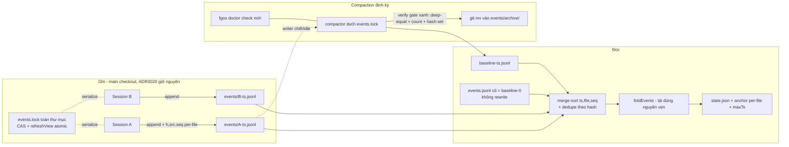

# DISCUSSION — Tầng A: content-hash identity + multi-file per-session + compaction cho `.fgos/events.jsonl`

Item: `tsk-3ve` · Feature dir: `docs/history/eventlog-tier-a-multifile-content-hash/`

## 1. Trạng thái hiện tại

Vòng 1 (2026-08-23): scout code xong toàn bộ đường ghi/đọc/guard/checkpoint của
`.fgos/events.jsonl` (chi tiết §5). Sáu điểm thiết kế D1–D6 mang từ report
`plans/reports/investigation-260821-1202-eventlog-branch-union-decision-history-report.md`
sang mô tả item đã giữ ổn qua 2 vòng (report 21/8 → submit item), scout hôm nay
xác nhận khả thi trên code thật → mint thành TA-D1…TA-D6 (§4). Review kỹ thuật
vòng này phát hiện **4 lỗ hổng thật trong mô tả gốc** (R1–R4, §3) — mỗi cái đã
có phương án đề xuất kèm bằng chứng code, ghi ở §5/§6 dưới dạng *đề xuất chưa
chốt*, chờ anh phản hồi vòng sau. §6 đã dựng synthesis đầy đủ; §7 đã chia 6
hạng mục con ứng viên với dependency tuyến tính rõ.

**Còn mở, cần anh xác nhận vòng tới:** R1–R4 + 3 điểm để-ngỏ có khuyến nghị
(naming rule, migration cutover, compaction eligibility) — xem bảng §3.

## 2. Mục tiêu & đề bài

`.fgos/events.jsonl` hiện là một file append-only duy nhất, git-tracked, 23.280
dòng (~10MB), mà mọi session cùng ghi vào qua một cửa (`appendEvent` +
`events.lock`). Kiến trúc 1-file này là nguồn gốc của cả họ sự cố đã xảy ra
thật: git 3-way merge coi 2 phía cùng append là conflict → hand-resolve làm mất
event (2026-07-28, tsk-n4i); phải vá bằng `merge=union` + resequence
(`events-jsonl-contiguity.mjs`, tsk-3wq) — band-aid, không phải thiết kế an
toàn từ gốc; và seq-làm-identity nghĩa là 2 writer từ cùng điểm chung tự đánh
trùng số. Tầng A (item này) mượn **cấu trúc dữ liệu** của repository-harness —
content-hash identity, nhiều file nhỏ mỗi-writer-một-file, compaction định kỳ
có verify gate — để loại bỏ tận gốc lớp lỗi "2 bên cùng sửa 1 file" và "seq
trùng", trong khi **không đổi vị trí ghi**: mọi write vẫn về main checkout,
ADR0020 (block-tree — worktree không mang `.fgos/`) đứng nguyên. Tầng B
(worktree tự ghi changeset riêng, giảm tải main checkout thật sự) là item khác,
cần anh xác nhận riêng vì đảo một phần quyết định đã chốt. Đích của Tầng A: hết
hẳn lớp mất-data/conflict trên event log, replay deterministic, đọc vẫn nhanh
(giữ cơ chế incremental của tsk-49e), thư mục không phình vô hạn — ổn định
nhất, không thêm gánh vận hành cho người.

## 3. Vấn đề rõ / chưa rõ

| # | Vấn đề | Trạng thái | Ghi chú |
|---|---|---|---|
| C1 | Phạm vi Tầng A: mượn cấu trúc dữ liệu, KHÔNG đảo ADR0020 | **Rõ** — TA-D0 | Ranh giới với Tầng B ghi trong mô tả item |
| C2 | Identity = SHA-256 cắt 16 hex trên nội dung dòng; seq/ts thành mô tả | **Rõ** — TA-D1 | Birthday-bound đã tính trong report; còn R3 bên dưới bổ sung |
| C3 | Mỗi session một file `.fgos/events/<...>.jsonl`, git-tracked | **Rõ** — TA-D2 | Naming rule chính xác còn mở (O1) |
| C4 | Replay đọc cả thư mục, sort theo ts trong nội dung | **Rõ** — TA-D3 | Nhưng thiếu tiebreak → R1 |
| C5 | Giữ incremental-anchor-read của state.json, chỉ đổi đơn vị anchor | **Rõ** — TA-D4 | Nhưng có mâu thuẫn với ts-sort → R2 |
| C6 | Compaction định kỳ, archive không xoá, trigger event-count (tsk-1vc D2) | **Rõ** — TA-D5 | Eligibility khi compact còn mở (O3) |
| C7 | Verify gate trước khi publish baseline, đăng ký vào doctor registry | **Rõ** — TA-D6 | |
| R1 | **Thứ tự replay chưa deterministic**: sort ts đơn thuần không định nghĩa thứ tự khi 2 event ở 2 file trùng ts (ISO ms) — 2 lần rebuild có thể cho 2 view khác nhau, vi phạm chính guarantee của `rebuildView` ("rebuilding twice must produce deep-equal views") | **Chưa chốt** — đề xuất P1 ở §5/Q1 | Mô tả gốc bỏ sót |
| R2 | **Mâu thuẫn incremental-read vs global ts-sort**: event mới ở file A có thể có ts NHỎ hơn event đã fold từ file B → "fold thêm phần mới" cho ra view khác full-rebuild | **Chưa chốt** — đề xuất P2 ở §5/Q2 | Mô tả gốc coi D4 là "chỉ đổi đơn vị anchor" — không đủ |
| R3 | **Hash collision hợp lệ**: 2 event khác nhau nhưng byte-identical (2 session, cùng ts ms, cùng payload, cùng seq nội bộ file) sẽ bị dedupe-by-hash gộp nhầm | **Chưa chốt** — đề xuất P3 ở §5/Q3 | |
| R4 | **Truncation guard + periodic checkpoint chưa có trong phạm vi**: cả 2 hiện hardcode 1 path `events.jsonl`; per-session files vẫn git-tracked nên vẫn chịu nguyên class lỗi git reset/checkout revert (tsk-cgg) và vẫn cần auto-commit | **Chưa chốt** — đề xuất P4 ở §5/Q4 | Mô tả gốc chỉ nhắc rà `events-jsonl-contiguity.mjs` |
| R5 | `events.lock` vẫn phải là lock **toàn thư mục**, không per-file — vì CAS precondition (moveWork expectedStatus, addWork dup-id) đọc toàn view rồi mới append | **Rõ sau scout** — ghi thành ràng buộc trong §6, ứng viên D-ID vòng sau | Đừng để ai "tối ưu" lock theo file |
| O1 | Naming rule file per-session: dùng gì làm định danh, chống trùng thế nào | Mở — có khuyến nghị ở §5/Q5 | Mô tả item chủ đích để planning quyết |
| O2 | Chiến lược di trú 23K dòng cũ: 1 lần chuyển vs chạy song song | Mở — có khuyến nghị mạnh ở §5/Q6 (legacy = baseline-0, không rewrite) | |
| O3 | Ngưỡng compaction cụ thể + điều kiện file nào được compact | Mở — nguyên tắc ở §5/Q7, con số chờ đo thật | Mô tả item chủ đích để lại |

## 4. Quyết định đã chốt

| D-ID | Nội dung | Nguồn gốc |
|---|---|---|
| TA-D0 | Tầng A mượn CẤU TRÚC DỮ LIỆU của harness (multi-file, content-hash, compaction), KHÔNG mượn vị trí ghi — mọi write vẫn về main checkout, ADR0020 không đảo; Tầng B là item riêng cần xác nhận riêng | report 21/8 → mô tả item, giữ ổn 2+ vòng |
| TA-D1 | Identity mỗi event = SHA-256 cắt 16 hex (64-bit) trên nội dung dòng; `seq`/`ts` giữ làm field mô tả/hiển thị, không còn là khoá định danh chính | report 21/8 (birthday-bound ~1/145 triệu/năm ở quy mô thật) → mô tả item |
| TA-D2 | Tách log thành nhiều file nhỏ theo session dưới `.fgos/events/`, git-tracked — 2 session ghi đồng thời là 2 file khác tên, không bao giờ thành git conflict; nhu cầu `merge=union` cho log này biến mất về dài hạn | report 21/8 → mô tả item |
| TA-D3 | `rebuildView`/`replayView` đổi bước liệt kê nguồn: gom mọi file trong thư mục, sort theo `ts` trong NỘI DUNG event (không theo tên file), tái dùng tối đa logic fold hiện có | report 21/8 → mô tả item |
| TA-D4 | Giữ nguyên cơ chế incremental-anchor-read của state.json (tsk-49e): chỉ đổi anchor từ byte-offset-1-file sang danh-sách-file-đã-tiêu-thụ + offset file đang dở — không viết lại cơ chế | report 21/8 → mô tả item |
| TA-D5 | Compaction định kỳ gộp file nhỏ cũ thành baseline mới; KHÔNG xoá file gốc (archive — kỷ luật log bất biến RUL11/ADR-0019); trigger tái dùng quyết định event-count-based của tsk-1vc D2 (`checkpoint.eventThreshold` precedent), không bày lịch mới | report 21/8 → mô tả item |
| TA-D6 | Gate kiểm tra trước khi publish baseline — đăng ký check mới vào `fgos doctor` registry có sẵn (`src/setup/registrations.mjs` pattern), đúng Install/setup/doctor gate rule của AGENTS.md | report 21/8 → mô tả item |

(Mỗi D-ID trên đã ghi qua `fgos decision --id tsk-3ve --relation none` cùng vòng này.)

## 5. Q&A log

**2026-08-23T17:20+07:00 — Vòng 1: scout + review mô tả gốc (session, chưa có phản hồi người).**

Scout đã đọc trực tiếp (không suy diễn):

- `src/state/events.mjs` — `appendEvent`/`appendEventCore`: seq đọc từ dòng cuối
  file, ghi 1 dòng JSON `{seq, ts, type, payload, v}` dưới `events.lock`
  (link-atomic, blocking 2s/10ms). `withEventsLock` export cho store.mjs mở
  rộng critical section trùm cả precondition-read (CAS). Lock derive từ
  `path.dirname(logPath)` — `porting-store.mjs` truyền dir khác tự có lock riêng.
- `src/state/store.mjs` — `paths(dir)` map dir → `{logPath, viewPath}` (điểm
  chạm duy nhất tên file); `withEventsLockAndRefresh` (tsk-1q5) gộp
  append+refreshView vào MỘT critical section; `refreshView` ghi state.json
  (7.9MB, atomic-rename) kèm snapshot `{size, mtimeMs, lastLine}`; các reader
  raw: `staleDoingAdvisory`, `stalePostDeliveryAdvisory`, `readRawEvents`,
  `readRawEventsAndText`.
- `src/state/replay.mjs` — `tryIncrementalRebuild`: fast-path 3 nấc (mtime+size
  y nguyên → trả view; size tăng + lastLine giữ → fold phần mới; mọi nghi ngờ →
  full read). `rebuildView` guarantee: rebuild 2 lần từ cùng log = deep-equal.
- `src/state/events-jsonl-contiguity.mjs` — dedupe theo dòng byte-identical,
  stable-sort theo ts, renumber seq 1..N. Đây là "band-aid sau union-merge" mà
  TA-D2 làm cho hết cần với cấu trúc mới.
- `src/state/events-jsonl-truncation-guard.mjs` — guard mark `{seq, hash}` cho
  MỘT file (sidecar gitignored) + `runOpportunisticMainCheckoutChecks`: periodic
  auto-commit của đúng relPath `events.jsonl` (threshold 50 event /
  `checkpoint.eventThreshold` config / 15 phút — chính là tsk-1vc D2 mà TA-D5
  tái dùng).
- `src/util/session-identity.mjs` — `resolveWriterIdentity`: env session id
  (uuid, xác nhận qua registry) → fallback ancestor-pid → UNRESOLVED. Mọi
  mutating event đã stamp `writer` từ nguồn này.
- `src/setup/registrations.mjs` — doctor checks `events-jsonl-contiguous`,
  `events-jsonl-not-truncated`, `main-checkout-guard-warnings` (pattern đăng ký
  cho TA-D6).
- Consumer của `seq` ngoài core: chỉ hiển thị/return value trong kết quả CLI
  (`seq: event.seq`) + guard mark + contiguity — `cursor.mjs` chủ đích KHÔNG
  dùng seq. Không có ai dùng seq làm khoá tra cứu chéo-item. → đổi seq thành
  per-file là an toàn về contract.
- Live log: 23.280 dòng / ~10MB; state.json 7.9MB (gitignored); guard sidecar
  gitignored.

**Q1 (R1 — session tự đặt): sort ts đơn thuần có đủ deterministic không?**
Không. ISO-8601 ms có thể trùng giữa 2 file (2 writer ghi trong cùng ms — với
lock 10ms retry thì hiếm nhưng hoàn toàn có thể; và `fixContiguity` cũng đã
từng phải dựa stable-sort để né vấn đề này trong 1 file). Với multi-file, "thứ
tự đọc dir" của OS không ổn định → vi phạm guarantee rebuild-twice-deep-equal.
**Đề xuất P1:** tổng thứ tự = `(ts, tên-file, seq-trong-file)` — trong một file
giữ nguyên thứ tự append của chính writer đó (bảo toàn causality nội-writer),
giữa các file trùng ts thì tên file làm tiebreak cố định. Deterministic, rẻ,
không cần trường mới.

**Q2 (R2 — session tự đặt): incremental anchor có sống được với ts-sort toàn cục không?**
Không nếu giữ nguyên "fold thêm phần mới": event mới của file A có thể mang ts
nhỏ hơn event đã fold từ file B (2 process, độ trễ giữa lúc lấy `new Date()` và
lúc giữ được lock). **Đề xuất P2:** snapshot anchor mới ghi thêm `maxTs` (ts
lớn nhất đã fold). Điều kiện dùng fast-path: mọi event mới đọc thêm phải có
`ts > maxTs` (strict, kể cả biên trùng thì rơi về full read); vi phạm → full
rebuild. Đúng học thuyết tsk-49e: wrong-in-doubt chỉ trả giá bằng chậm hơn 1
lần đọc, không bao giờ sai. Trong thực tế ghi tuần tự dưới lock, điều kiện này
đúng ~mọi lần → fast-path vẫn giữ được giá trị.

**Q3 (R3 — session tự đặt): hash trên nội dung dòng có thể đụng nhau hợp lệ không?**
Có: 2 session cùng ms, cùng type/payload (ví dụ 2 no-op giống hệt), cùng seq
nội bộ file → 2 dòng byte-identical ở 2 file khác nhau, nhưng là 2 event thật
khác nhau. Dedupe-by-hash sẽ gộp nhầm còn 1. **Đề xuất P3:** stamp thêm field
`src` (writer/session-file id) vào mỗi event mới — dòng trở thành duy nhất
toàn cục theo cấu trúc (không dựa may rủi), provenance đi theo event cả sau
compaction (khi ranh giới file biến mất). Hash tính trên dòng đã có `src`.
Chi phí: ~20 byte/dòng.

**Q4 (R4 — session tự đặt): guard/checkpoint hiện tại có theo được cấu trúc mới không?**
Không tự nhiên: cả truncation guard lẫn periodic auto-commit hardcode 1
relPath. Per-session files vẫn git-tracked → vẫn nguyên class lỗi git
stash/checkout/reset revert (đã gây tsk-cgg, tsk-1vc thật) và vẫn cần
checkpoint commit. **Đề xuất P4:** đưa vào scope Tầng A luôn (hạng mục con
riêng, §7): guard mark mở rộng thành map `{fileName → {seq, hash}}` trong cùng
sidecar; `getUncommittedEventCount`/auto-commit quét cả `.fgos/events/`;
`events-jsonl-contiguous` check rescope (legacy file giữ check cũ, file mới
check per-file đơn writer). Không làm phần này thì Tầng A tự mở một lỗ quan
sát mới trong khi mục tiêu là ổn định nhất.

**Q5 (O1 — khuyến nghị): naming rule.**
`<writer-id>-<ts-mở-file>.jsonl`, writer-id từ `resolveWriterIdentity` (đã
charset-safe, đã dùng làm `writer` trên mọi event), ts dạng compact
`YYYYMMDDTHHMMSSmmmZ` chống trùng khi một writer mở file mới sau compaction.
Mỗi writer có đúng 1 file "đang mở" (file mới nhất chưa archive mang prefix
của nó); process mới cùng session append tiếp vào file đó (an toàn vì
`events.lock` toàn thư mục vẫn serialize — R5). Nguồn UNRESOLVED (fallback
pid) tạo file-per-invocation — chấp nhận như degraded mode, compaction sẽ gom.

**Q6 (O2 — khuyến nghị mạnh): di trú.**
Không rewrite 23K dòng cũ (giữ đúng D7a "log lines never rewritten" + RUL11).
File `events.jsonl` hiện tại trở thành **baseline-0 nguyên trạng**: replay đọc
`events.jsonl` (nếu tồn tại) + mọi file trong `.fgos/events/`; write path mới
chỉ ghi vào `.fgos/events/`. Cutover 1 lần khi code land, không chạy song
song, không dual-write. Process cũ còn sống lỡ append vào file cũ vẫn được đọc
(file cũ vẫn là source thật) — degrade mềm. `.gitattributes merge=union` giữ
cho file cũ (vô hại, sẽ nghỉ hưu sau), KHÔNG áp cho `.fgos/events/*`.

**Q7 (O3 — nguyên tắc): compaction.**
Chỉ compact file của writer đã chết/nguội (pid/registry không còn sống + file
idle quá ngưỡng), chạy dưới `events.lock`, ghi `baseline-<ts>.jsonl` → chạy
verify gate (TA-D6: view(baseline) deep-equal view(các file gốc), đếm event +
so tập hash) → xanh mới `git mv` file gốc vào `.fgos/events/archive/`
(discovery của replay bỏ qua archive/). Crash giữa chừng (baseline đã ghi,
chưa kịp archive) không được làm sai view → **replay dedupe theo hash mọi lúc**
(với dòng legacy không có hash: dedupe theo nội dung dòng, đúng precedent
`fixContiguity`) — đây chính là chỗ TA-D1 trả giá trị lớn nhất: double-apply
trở thành cấu trúc-không-thể, không phải kỷ luật vận hành. Ngưỡng cụ thể: đo
tốc độ ghi thật rồi chọn, config key riêng theo precedent
`checkpoint.eventThreshold`.

**Ghi nhận thêm (R5):** `events.lock` giữ nguyên phạm vi TOÀN thư mục
`.fgos/` — multi-file loại git-conflict, không loại local race: CAS
precondition của store.mjs (moveWork expectedStatus, addWork dup-id, tsk-1q5
refreshView-trong-lock) cần một critical section duy nhất bao mọi writer.
Per-file lock là sai. Điểm này phải thành D-ID khi giữ ổn qua vòng sau.

## 6. Thiết kế đã chốt {#design}

*(Synthesis viết cho người lạ không có chat history. Phần đánh dấu «đề xuất»
là refinement vòng 1 chưa được anh xác nhận — mọi phần còn lại là TA-D0…TA-D6
đã chốt.)*

### Bức tranh

`.fgos/events.jsonl` (một file, mọi session cùng append, seq toàn cục làm
identity) được thay bằng một **thư mục event-sourcing** `.fgos/events/`:

- **Ghi:** mỗi writer (session identity từ `resolveWriterIdentity`) append vào
  đúng một file riêng của nó («đề xuất» naming: `<writer-id>-<openTs>.jsonl`).
  Không bao giờ có 2 writer cùng sửa 1 file → git không còn gì để conflict,
  `merge=union` + resequence hết lý do tồn tại cho log mới. Mỗi event mới mang
  thêm `h` (SHA-256 cắt 16 hex trên nội dung dòng — identity thật, TA-D1) và
  «đề xuất» `src` (writer id — chống collision cấu trúc, R3/P3). `seq` vẫn ghi
  nhưng là **per-file, thuần mô tả** — mọi consumer hiện tại của seq chỉ
  hiển thị, đã xác nhận bằng grep toàn repo.
- **Lock:** `events.lock` giữ nguyên, phạm vi toàn `.fgos/` (R5) — nó bảo vệ
  CAS-precondition + refreshView atomicity (tsk-1q5), không phải chỉ chống
  double-seq. Multi-file đổi bài toán git, không đổi bài toán concurrency
  cục bộ.
- **Đọc/replay (TA-D3):** discovery gom `events.jsonl` cũ (baseline-0 nguyên
  trạng — di trú không rewrite, Q6) + mọi `*.jsonl` trong `.fgos/events/` trừ
  `archive/`. Tổng thứ tự «đề xuất» = `(ts, tên-file, seq-trong-file)` (R1/P1
  — deterministic, bảo toàn causality nội-writer). Fold logic (`applyEvent`)
  tái dùng nguyên vẹn. Replay **dedupe theo hash** (dòng legacy: theo nội dung
  dòng) — double-apply thành bất-khả-cấu-trúc, chống cả trạng thái crash giữa
  compaction.
- **Incremental read (TA-D4):** snapshot anchor trong state.json đổi từ
  `{size, mtimeMs, lastLine}` một file thành map per-file + «đề xuất» `maxTs`;
  fast-path chỉ chạy khi mọi event mới có `ts > maxTs`, mọi nghi ngờ rơi về
  full read (R2/P2 — giữ nguyên học thuyết wrong-in-doubt-costs-speed-not-truth
  của tsk-49e).
- **Guard + checkpoint (R4/P4, «đề xuất» đưa vào scope):** truncation guard
  mark thành map per-file trong cùng sidecar gitignored; periodic auto-commit
  (`runOpportunisticMainCheckoutChecks`) quét cả thư mục; doctor checks
  rescope tương ứng.
- **Compaction (TA-D5) + gate (TA-D6):** khi tổng event trong các file nguội
  vượt ngưỡng (event-count-based, precedent tsk-1vc D2), gộp các file của
  writer đã chết/idle thành `baseline-<ts>.jsonl`, verify gate (deep-equal
  view + đếm + so tập hash — đăng ký thành doctor check) xanh mới archive
  file gốc bằng `git mv` — không xoá gì bao giờ.

### Luồng

### Cái gì KHÔNG đổi

- Vị trí ghi (main checkout), ADR0020, block-tree, merge guard
  `fgos-write-rejected` — nguyên vẹn (TA-D0).
- `foldEvents`/`applyEvent`, toàn bộ semantics fold từng event type.
- `events.mjs` core (`appendEvent(logPath)` per-file vẫn đúng nguyên dạng —
  `porting-store.mjs` với log riêng của nó không bị chạm).
- state.json vẫn được rebuild + ghi atomic-rename như cũ (write-amplification
  7.9MB/mutation của chính state.json là quan sát ngoài scope, ghi nhận cho
  item tương lai).

## 7. Danh mục hạng mục / task {#tasks}

Dependency tuyến tính: T1 → T2 → T3 → T4 → T5 → T6 (T5/T6 có thể đảo cho
nhau; T6 phụ thuộc T1+T3 vì verify gate cần hash-dedupe replay).

### T1 — Hash identity + schema per-event {#task-hash-identity-schema}

- **Goal:** mọi event mới mang `h` (16-hex SHA-256 trên nội dung dòng) và
  `src` (writer id); `seq` giữ nguyên vị trí nhưng doc lại thành per-file
  descriptive. Chưa đổi vị trí file nào.
- **§6:** mục "Ghi" — identity thật; nền cho dedupe-by-hash ở T3/T6.
- **D-IDs:** TA-D1 (+P3 nếu chốt).
- **Sibling:** mọi task sau đọc `h`; không phụ thuộc ai.
- **Verify (draft):** `node --test test/state/events.test.mjs test/state/replay.test.mjs` — event mới có `h`/`src` đúng; log cũ không `h` vẫn đọc nguyên (D7a).

### T2 — Write path multi-file {#task-multifile-write-path}

- **Goal:** store.mjs resolve file per-writer dưới `.fgos/events/` (naming rule
  chốt từ O1), append qua đúng `appendEvent` hiện có; `events.lock` giữ phạm
  vi toàn thư mục; seq derive từ dòng cuối của CHÍNH file writer đó.
- **§6:** mục "Ghi" + "Lock".
- **D-IDs:** TA-D2, R5 (khi thành D-ID).
- **Sibling:** cần T1 (event mới nên có identity ngay từ dòng multi-file đầu tiên).
- **Verify (draft):** `node --test test/state/store.test.mjs` + test mới: 2 writer giả lập ghi xen kẽ → 2 file, CAS expectedStatus vẫn đúng, không git conflict khi commit.

### T3 — Read/replay multi-file + total order + dedupe {#task-multifile-read-replay}

- **Goal:** discovery đọc baseline-0 (`events.jsonl` cũ nguyên trạng) + mọi
  file trong `events/` trừ `archive/`; merge-sort `(ts, file, seq)`; dedupe
  theo hash/nội dung dòng; mọi reader raw (`readRawEvents`,
  `staleDoingAdvisory`, show verb…) đi qua cùng một cửa đọc mới trong
  store.mjs.
- **§6:** mục "Đọc/replay" + "Cái gì không đổi" (foldEvents nguyên vẹn).
- **D-IDs:** TA-D3 (+P1 nếu chốt), Q6-cutover.
- **Sibling:** cần T2; T4 xây trên đầu ra của task này.
- **Verify (draft):** test determinism: rebuild 2 lần deep-equal với file-set trộn ts trùng nhau; fixture legacy+new trộn; `npm test` full khi contract đọc đổi.

### T4 — Incremental anchor per-file {#task-incremental-anchor-multifile}

- **Goal:** snapshot anchor thành `{files: {name: {size, lastLine}}, maxTs}`;
  fast-path 3 nấc như cũ + điều kiện `ts > maxTs` (P2); mọi nghi ngờ → full
  read.
- **§6:** mục "Incremental read".
- **D-IDs:** TA-D4 (+P2 nếu chốt).
- **Sibling:** cần T3.
- **Verify (draft):** test mở rộng `test/state/replay.test.mjs`: file mới xuất hiện, file shrink, event ts nhỏ hơn maxTs → tất cả rơi về full read và vẫn đúng; benchmark nhanh không tệ hơn hiện tại trên log thật.

### T5 — Guard + checkpoint theo thư mục {#task-guards-checkpoint-dir}

- **Goal:** truncation-guard mark map per-file; `getUncommittedEventCount` +
  periodic auto-commit quét `.fgos/events/`; doctor checks
  `events-jsonl-contiguous`/`events-jsonl-not-truncated` rescope (legacy giữ
  check cũ; file mới: per-file đơn-writer).
- **§6:** mục "Guard + checkpoint".
- **D-IDs:** R4/P4 (khi thành D-ID), TA-D6 (pattern registry).
- **Sibling:** cần T2 (có thư mục để guard); độc lập T3/T4.
- **Verify (draft):** `node --test test/state/events-jsonl-truncation-guard.test.mjs test/setup/registrations.test.mjs` mở rộng: revert 1 file per-session → guard bắt được; auto-commit gom đủ file mới.

### T6 — Compaction + verify gate {#task-compaction-verify-gate}

- **Goal:** compactor (chỉ file writer chết/idle, dưới `events.lock`) ghi
  `baseline-<ts>.jsonl`; verify gate deep-equal view + count + hash-set, đăng
  ký doctor check; xanh mới `git mv` vào `archive/`; trigger event-count
  config key riêng (precedent `checkpoint.eventThreshold`); ngưỡng số cụ thể
  chọn sau khi đo (O3).
- **§6:** mục "Compaction + gate".
- **D-IDs:** TA-D5, TA-D6 (+Q7 nguyên tắc khi thành D-ID).
- **Sibling:** cần T1 (hash) + T3 (dedupe replay làm crash-giữa-compaction vô hại).
- **Verify (draft):** test: compact fixture nhiều file → view trước/sau deep-equal; crash-giữa-chừng (baseline + gốc cùng tồn tại) → replay vẫn đúng nhờ dedupe; gate đỏ → không archive gì.
