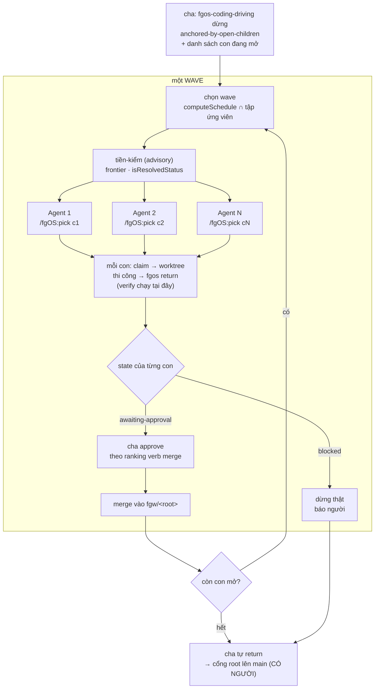

# Execution fan-out (fan-out B) — DISCUSSION

`tsk-umc` · tier `heavy` · risk `heavy` · kind `feature` ·
`docsRef` = `docs/history/execution-fanout/`

## 1. Trạng thái hiện tại

**Vòng 10 (2026-08-07) — HỘI TỤ.** Người dùng chốt hai câu cuối ⇒ mint
**D5** (phương án C: cha tiền-kiểm, con claim qua `/fgOS:pick` nguyên vẹn,
cha merge) và **D6** (gom = đọc state + approve theo ranking verb `merge`,
không giao thức báo cáo; lá `blocked` là điểm dừng thật).

Sáu D-ID đủ để dựng hình. **§6 đã regenerate lần đầu** kèm sơ đồ vòng
wave; **§7 chia ba hạng mục**: `#task-wave-selector` (thuần, làm trước
được) → `#task-fanout-skill` → `#task-cook-wiring`.

Kết luận lớn của mười vòng: **gần như toàn bộ hạ tầng đã có** — decompose
đã sinh `deps`, con đã sinh thẳng ở `executing` mang `action`, `frontier`
đã lọc thứ tự, `claim-port` đã cưỡng chế `deps-not-merged`, lá đã fork từ
và merge về `fgw/<root>`, `computeSchedule` đã xếp wave, verb `merge` đã
xếp hạng, `targets` đã lo cụm epic. **Thiếu duy nhất bộ dispatcher.** Phần
lớn công sức của item này là *đừng xây lại*.

Ba việc liền kề cố ý để ngoài: cần gạt view (D3) · TTL nhận biết lá ·
`rollup` hiểu `targets`.

**Vòng 9 (2026-08-07) — D4 chốt, và một phương án thứ ba cho câu "ai
claim".** Người dùng đồng ý case 2 dùng `goalTier`+`targets` ⇒ mint **D4**
(seq 8919). Hai câu còn lại người dùng xin tư vấn.

**Ai claim — nhị phân A/B là giả.** Bóc `claimWork` ra thì ở *cả hai*
phương án nó đều chạy vào cùng một store trên main checkout; khác biệt chỉ
là **tiến trình nào gọi**. Và cha cần ba thứ, chỉ **một** đòi gọi claim:
chọn wave (hàm thuần) · biết con nào claim được (hàm thuần) · **merge**
(buộc main checkout). ⇒ **Phương án C**: cha tiền-kiểm bằng hàm thuần đã
có, con chạy `/fgOS:pick` nguyên vẹn, cha merge. C giữ đúng thứ A mua được
mà không trả khoản giá nào ở hàng 71. Kèm hai đính chính vòng 7: hình dạng
sập **không bên nào thắng sạch**, và tiền lệ runner **yếu hơn** tôi trình
bày (runner chọn A vì nó là bộ lập lịch có kế toán năng lực, không vì A an
toàn hơn).

**Gom kết quả về** — hệ quả chưa ai nói của D2: `approve` buộc chạy trên
main checkout ⇒ **con không tự approve được** ⇒ "gom" chính là **cha
approve từng lá**, không phải giao thức truyền tin. Khuyến nghị: **đọc
state, đừng nghe kể** (Agent trả về = tín hiệu, state = nội dung), và thứ
tự approve **dùng lại ranking của verb `merge`** thay vì tự chế.

**Vòng 8 (2026-08-07) — ba D-ID đầu tiên đã chốt, và case 2 hoá ra đã có
nhà sẵn.** Người dùng chốt: con là work item thật (**D1**), autonomy giữ
nguyên khuyến nghị vòng 7 (**D2**), bài messy giải bằng cần gạt view
(**D3**). Cả ba đã ghi thật qua `fgos decision --id tsk-umc` (seq 8896/
8897/8898).

Câu mới của người dùng — *cụm component/epic thì quản lý và triển khai thế
nào, cha fan-out cho con dạng đó được không* — scout ra câu trả lời tốt
hơn dự đoán: **`goalTier` + `targets` (str67) đã là đúng cạnh đó**.
`targets` **không đi qua `resolveRoot`** nên mỗi target giữ root riêng và
merge độc lập lên main — chính xác case 2. ⇒ **"Fix B" đề xuất ở vòng 5 là
thừa**; sự tách lineage-khỏi-merge-topology đã tồn tại sẵn dưới dạng cạnh
thứ hai. Lỗ hổng còn lại thu về đúng một chỗ: `fgos rollup` chỉ hiểu
`parent`, chưa hiểu `targets`.

Và **cha fan-out được cho cả hai ca**: dispatcher chỉ cần một **tập ứng
viên** rồi `computeSchedule` ∩ tập đó — case 1 lấy `children(parent)`,
case 2 lấy `targets`, runner lấy cả frontier. Một dispatcher, tập ứng viên
cắm được. Điều này cũng **sửa lại hàng 9 của vòng 1**: `computeSchedule`
chạy trên toàn frontier là mặc định *đúng*, không phải khiếm khuyết.

Còn treo: **ai claim** (người dùng nghiêng cha; tôi đã kể đủ giá ở §5 vòng
8, gồm chỗ vòng 7 tôi nói chưa công bằng — cha-claim **đổi hình dạng** rủi
ro sập chứ không giảm) và **"gom kết quả về"**.

**Vòng 7 (2026-08-07) — "cha merge" không phải lựa chọn, code đã cưỡng
chế; và điều đó quyết luôn câu "ai claim".** `approve` **từ chối chạy từ
bên trong worktree** bằng hai guard riêng biệt, nguyên văn *"approve must
land on the main checkout, which a session worktree structurally is not"*.
⇒ một agent con sống trong worktree của nó **về cấu trúc không thể tự
merge**. Merge lá bắt buộc do một bên đứng trên main checkout làm — tức
**cha**, đúng như trực giác người dùng.

Hệ quả cho câu "ai claim": cha **buộc phải sống suốt fan-out** trên main
checkout để merge từng lá xong. Nên cha-claim **không thêm vai trò mới**,
nó gộp một vai vốn đã bắt buộc tồn tại. Cộng với: cha biết mình claim gì
⇒ dọn được khi con chết (`startupReap` **cố ý** bỏ qua claim session) ·
không tranh lock · và **runner đã implement đúng khuôn này** —
`claimAndDispatch` rồi `spawnWorker(item, config, wt.path, …)`. Giá phải
trả: cần **một cửa vào mới cho con** (con không chạy `/fgOS:pick` được nữa
vì item đã `doing`). Phân tích đầy đủ ở §5 vòng 7.

Về autonomy (người dùng hỏi tư vấn): khuyến nghị **tự động approve LÁ, giữ
cổng ROOT bắt buộc**. Ba chỗ tựa: `return` **vẫn chạy verify** và block
khi đỏ ⇒ bỏ approve lá là bỏ một **lượt review**, không bỏ **bằng chứng** ·
lá merge vào `fgw/<root>`, **không bao giờ chạm main** · cổng root lên main
vẫn còn, muộn hơn và bao quát hơn. Cổng lá là **cổng trùng hạ một tầng**.

Người dùng **chưa chốt**. Chưa mint D-ID — nhưng ba điểm đã đủ chín, chỉ
chờ một câu xác nhận (§3 hàng 43, 62, 63).

**Vòng 6 (2026-08-07) — harness cho chuỗi tuần tự ĐÃ CÓ ĐỦ; thứ thiếu
đúng bằng `tsk-umc`.** Người dùng mô tả cấu trúc thật của decompose: một
**đồ thị phụ thuộc**, tiến trình hỗn hợp tuần tự + song song — A xong,
merge vào cha, rồi B mới fork và dùng code đã merge của A; nhánh không phụ
thuộc chạy song song, merge tuỳ thích; cuối cùng cha nhận hết. Và: **tiến
trình này không cần hỏi người** vì mọi hình thái thiết kế đã chốt ở các
khâu trước.

Scout: **toàn bộ cấu trúc đó đã được mô hình hoá VÀ cưỡng chế rồi.**
`claim-port.mjs:158-166` từ chối claim một lá còn dep chưa `done` với lỗi
`deps-not-merged`, nói thẳng *"forking from `<rootBranch>` now risks
missing their content; approve/merge them into `<rootBranch>` first"* —
đúng kịch bản A-trước-B. `decompose.mjs:992` đã sinh sẵn `deps` giữa các
con. `frontier` lọc dep chưa xong, `computeSchedule` lọc footprint — hai
tầng đã đúng chỗ. **Thiếu duy nhất bộ dispatcher chạy phần song song đồng
thời — đúng bằng `tsk-umc`.**

Về "không cần hỏi người": `gate-bypass.mjs` đã tự động hoá **cổng thiết kế**
(exploring/planning) nhưng **cố ý không đụng** `approve`. Nên lượt người
duy nhất còn lại trong một fan-out chính là **approve từng lá** — đúng nửa
sau của Fix A, giờ có thêm lý lẽ của người dùng đứng sau.

Về câu hỏi phụ (wave không đụng file thì cần worktree riêng không): trả
lời ở §5 vòng 6 — footprint là **tự khai, không cưỡng chế**; và chính yêu
cầu A-merge-rồi-B-fork ở trên **đòi phải có nhánh riêng** mới thực hiện
được. Chi phí anh cảm thấy nằm ở **thời gian giữ** (TTL 7 ngày), không ở
**việc tạo** (0.18s/20MB) — Fix A gỡ đúng chỗ đó mà không phải bỏ cách ly.

Người dùng **chưa chốt** (còn mảnh chi tiết chưa soi). Chưa mint D-ID nào.

**Vòng 5 (2026-08-07) — người dùng đặt trục đúng: ĐƠN VỊ MERGE.** Không
phải "mảnh có cần rollback riêng không" (trục tôi đề vòng 2) mà: **đơn vị
merge cuối cùng là cha hay là từng con?** Case 1 (phần lớn) — chia để chạy
song song cho nhanh, **merge ở cha**. Case 2 — qua thảo luận con dần thành
item độc lập liên kết nhau như epic, **con merge riêng**.

Scout ra hai điều:

1. **Case 1 fgOS ĐÃ implement sẵn.** `resolveRoot` (`root-affinity.mjs:66`)
   đi theo `parent`; lá fork từ `fgw/<root>` và `approve` của lá **merge
   vào `fgw/<root>`, không phải main** — comment trong `bin/fgos.mjs` gọi
   thẳng là *"leaf→root and root→main share this one branch path"*. Đơn vị
   merge đã là cha rồi.
2. **Case 2 vướng đúng một chỗ**: `parent` đang **gánh hai việc** —
   (a) lineage/gộp nhóm (`hasOpenDescendant`, `rollup`, epic) và (b)
   topology merge (fork/merge vào `fgw/<root>`). Case 2 cần (a) **không**
   cần (b). Bỏ `parent` thì được (b) đúng ý nhưng **mất (a)**.

⇒ Hướng 4 được củng cố và **tách làm hai**, chi phí rất khác nhau:
**Fix A** (case 1, phần lớn) — chính sách hậu kỳ của lá, và giờ có lý lẽ
từ topology chứ không phải phỏng đoán: nhánh lá **thừa ngay sau khi merge
vào `fgw/<root>`** vì nội dung đã nằm trên một nhánh sống lâu hơn nó.
**Fix B** (case 2) — tách lineage khỏi merge-topology, đụng mô hình cạnh
của `0012`, và **không cần cho `tsk-umc`**.

Người dùng nói rõ **chưa chốt**. Vẫn chưa mint D-ID nào — nhưng có **một
điểm đã đủ chín** để mint nếu anh xác nhận (§3 hàng 43).

**Vòng 4 (2026-08-07) — ĐÍNH CHÍNH vòng 3, và người dùng đúng ở cả hai
vế.** Vòng 3 kết luận "con không phải nguyên nhân messy" dựa trên **một
lỗi số học của tôi**: câu *"xoá sạch mọi con: 237 → 226, giảm 4.6%"* lấy
nhầm **11 con đang sống** vào một câu nói về **toàn bộ con**. Số đúng:
open children = **59/237 = 25%**, xoá hết thì **237 → 178, giảm 25%**.

Sai thứ hai: khuyến nghị "rút hàng đợi là xong". Đo ra **0/99 item trong
pool `cleanup` đã hết TTL 7 ngày** — không rút được cái nào. Rút hết
những gì rút được ngay (54 dòng `retrospective`, không có TTL) chỉ đưa
237 → **183**, không phải → 84. Và **0 worktree** thu hồi được ⇒ ~2GB bị
giữ có cấu trúc suốt 7 ngày.

Và thứ tôi chưa từng đo — **chi phí hành chính thật** — giờ có số: con đi
đường hiện đại tốn **5-6 chuyển trạng thái**, **trung vị 2 lượt role
`human`**, **7 ngày nằm trong `cleanup`**, **20MB worktree giữ suốt thời
gian đó**. Nhân với N. Người dùng bổ sung: thuật toán tách chưa
implement nên N hôm nay còn nhỏ (3.27); tách tốt thì N sẽ lớn hơn nhiều.

⇒ **Cả hai phiền phức đều thật.** Nhưng lời giải **không phải B2**: đo kỹ
thì ba khoản chi phí đó **không khoản nào là bản chất của việc-là-work-
item** — chúng là *chính sách sau merge* (TTL toàn cục + approve từng lá).
Và chính code đã mời sửa: comment ở `registrations.mjs:540-544` ghi TTL
global là **"YAGNI — no demonstrated need yet"**. Phép đo này chính là
demonstrated need đó. Hướng thứ tư ở §5 vòng 4.

**Vòng 3 (2026-08-07) — đo thật, và động cơ thật của đề xuất không đứng
vững.** Người dùng nói rõ lý do đặt vấn đề: *danh sách task con show ra quá
nhiều gây messy task-list* — tức bài toán **không phải chi phí hành chính**
mà là **nhiễu danh sách**; đồng thời tự nêu phản biện (cách hiện tại cho
phép con được pick và thi công độc lập bởi bất kỳ worker nào) và mời đo để
cân nhắc **không đổi**.

Đo `.fgos` thật: `fgos list` mặc định hiện **237 dòng**, trong đó **153
dòng (65%) là hàng đợi TTL sau merge** (cleanup 99 + retrospective 54) —
việc đã xong, chờ hai loop cơ học rút. Sống thật: 84. **Con của decompose
chỉ chiếm 11 trong 84 dòng sống — 4.6% của 237.** Xoá sạch mọi con khỏi hệ
thống thì danh sách đi từ 237 xuống 226. **Con không phải nguyên nhân
messy.**

Cùng một nguyên nhân giải thích luôn cả đĩa: 104 worktree đang tồn tại
(~20MB/cái ≈ 2GB), mà `fgos cleanup` chính là thứ gỡ worktree + xoá nhánh
+ đẩy item sang `done` (rơi khỏi view mặc định). **Một hàng đợi chưa rút,
hai triệu chứng.**

Giá worktree đo thật: **0.18s, 20MB** một cái — không phải điểm nghẽn.

⇒ Hướng đang nghiêng (chưa mint D-ID, chờ giữ qua một vòng nữa): **không
đổi mô hình**; fan-out B giữ nguyên con-là-work-item-thật. Bài messy giải
bằng *rút hàng đợi* (không đổi thiết kế) và nếu còn thì bằng *cần gạt
view* — mà `fgos list` hôm nay chỉ có đúng hai chế độ, không có bộ lọc nào
(§3 hàng 24). Chi tiết §5 vòng 3.

**Vòng 2 (2026-08-07) — ba câu của vòng 1 vẫn treo, và một trục mới mở
ra.** Người dùng nêu: có ca children là *vấn đề hoàn toàn độc lập* ⇒ đáng
thành work item thật; có ca cha chỉ chẻ ra *mảnh việc* giao con ⇒ không
đáng đi qua tiến trình hành chính. Scout cho thấy ý này **đã có tên và đã
bị gác**: nó chính là ô **B2 "exec packet"** mà `D4` của
`docs/history/two-layer-dispatch` gác, kèm `D9` đặt điều kiện mở lại đo
được — mà **một nửa điều kiện đã thoả**.

Đồng thời phép thử do chính D4 đặt ra (*"nếu con work-item thật đã mang
được `action` prose thì B2 có thể thừa"*) giờ trả lời được bằng code: con
của decompose **sinh ra đã ở stage `executing`** và **đã mang `action`
prose**. Nên phần "hành chính cồng kềnh" mà tiền đề nói tới **không tồn
tại ở đầu vào**; thứ còn lại không phải giấy tờ mà là bốn cơ chế cách ly.
Chi tiết §5 vòng 2.

Trục mới cần người quyết: có **ba ca chứ không phải hai** (§3 hàng 16), và
ca ở giữa — mảnh ghi thẳng vào worktree cha, cha commit/merge một lần —
**có thể đã hợp lệ sẵn** dưới D3 chứ không bị D4 gác (§3 hàng 17).

Vẫn chưa có D-ID nào.

**Vòng 1 (2026-08-07) — vừa mở, chưa chốt gì.** Đây là file thảo luận
riêng của **fan-out B (execution fan-out)**, tách khỏi
`docs/history/fanout-and-delegation-rubric/DISCUSSION.md` — file đó mang
`tsk-5kn` và giải **fan-out A (gather)**. Ranh giới hai bài toán đã được
chốt ở vòng 7 của file kia (§3 hàng 36/37/38), không mở lại ở đây.

Vòng 1 làm hai việc: (a) scout code thật để đặt câu hỏi có bằng chứng, và
(b) nêu **một phát hiện đi ngược mô tả item** — câu "dùng lại
`computeSchedule`/`selectWave` thay vì viết logic mới" không đứng vững như
đã viết: hai hàm đó chọn theo **hai trục khác nhau**, và `selectWave` là
trục *sai* cho bài toán này. Chi tiết ở §5 vòng 1.

Câu hỏi đang chờ người trả lời: **ai claim** (§3 hàng 38, chuyển sang đây
thành hàng 3) — và câu hỏi phụ mới phát sinh từ scout: **chọn wave bằng
gì**, khi `selectWave` bị loại.

Chưa có D-ID nào. §6/§7 còn trống — đúng theo luật: không mint D-ID từ một
câu trả lời đơn lẻ, và không dựng §6 khi hình dạng chưa thật.

## 2. Mục tiêu & đề bài

Sau khi một item được `decompose` ra N children, fgOS hôm nay **luôn chạy N
children đó tuần tự** — `/fgOS:cook` đẩy chúng lên đầu một hàng đợi rồi
rút từng cái một, `fgos-coding-driving` gặp children mở thì dừng hẳn và
trả danh sách id về cho caller chứ không tự chạy tiếp. Trong khi đó không
luật nào cấm chạy song song: children của decompose là work item thật, tức
rootTask thật, nên dispatch N cái đồng thời chính là kích hoạt N rootTask —
đúng định nghĩa launcher của `docs/decisions/0026`, và đã có bằng
chứng chạy thật (`tsk-1sj` → `tsk-30z`/`tsk-50ic`, hai Agent chồng lấn
~184s ở trạng thái `doing`) nhưng làm hoàn toàn bằng tay. Việc cần làm là
biến cơ chế đã chứng minh bằng tay đó thành **đường đi mặc định**: một
skill nhận danh sách children không đụng footprint, bắn N Agent dispatch
đồng thời, mỗi con claim và thi công một child, rồi gom kết quả về — cho
**session tương tác**, không phụ thuộc `fgos-runner` (runner là cơ chế phụ,
bật sau, và tới nay chưa từng chạy thật). Câu thiết kế thật chưa ai trả
lời là **ai đặt lock**: orchestrator claim trước rồi mới spawn (cách bee,
*"workers never self-select"*), hay mỗi child session tự claim với id do
cha chỉ định (cách demo đã làm) — hai cách khác nhau ở chỗ đặt lock và ở
chuyện gì xảy ra khi một worker chết giữa chừng.

## 3. Vấn đề rõ / chưa rõ

| # | Vấn đề | Trạng thái | Bằng chứng |
|---|---|---|---|
| 1 | Fan-out B không bị luật nào chặn — chỉ chưa ai xây. Children của decompose là rootTask thật ⇒ dispatch N cái = kích hoạt N rootTask đúng `0026`. Không vi phạm luật cấm delegation của `tsk-29i` (luật đó chỉ cấm *ad hoc* sub-dispatch và tự chỉ đường qua capacity-dispatch) | **Rõ** — kế thừa từ `fanout-and-delegation-rubric` §3 hàng 37, D2 | `docs/history/fanout-and-delegation-rubric/DISCUSSION.md` §3:37, §4 D2 |
| 2 | Chỗ móc vào đã có sẵn và chỉ có **một**: `fgos-coding-driving` dừng ở "anchored-by-open-children" và **báo danh sách child id về cho caller** — nói thẳng "This is never this skill's own job to resolve: the caller decides whether to drive each open child next". `/fgOS:cook` là caller duy nhất hôm nay, và nó đẩy children lên **đầu một hàng đợi tuần tự** | **Rõ** | `.claude/skills/fgos-coding-driving/SKILL.md:86-102`; `plugins/fgOS/skills/cook/SKILL.md:90-96` |
| 3 | **Ai claim?** (a) orchestrator claim trước rồi spawn (bee: *workers never self-select*), hay (b) mỗi child session tự claim với id cha chỉ định (demo `tsk-1sj`) | **Chưa rõ — câu hỏi chính vòng 1** | `fanout-and-delegation-rubric` §3:38; xem phân tích §5 vòng 1 |
| 4 | Cách (a) **đã có sẵn code chạy được**: `claimAndDispatch` claim trước, rồi mới `dispatchClaimedItem` spawn worker. Nhưng nó nằm trong `fgos-runner` — đường chưa từng chạy thật (0 sự kiện `capacity.dispatch` trong lịch sử repo) | **Rõ** | `src/runner/loop.mjs:938-956`, `:654` |
| 5 | Mọi claim (CLI `take`, CLI `pick`, runner `claimItem`) đã đi qua **một cửa duy nhất** `claim-port.mjs` — nên cả (a) lẫn (b) đều không phải viết đường claim mới, chỉ khác ai gọi và gọi từ tiến trình nào | **Rõ** | `src/runner/claim-port.mjs:1-8` "single choke-point for all claim flows (tsk-53f D1)" |
| 6 | `main-checkout.lock` là lock **ngắn hạn theo từng claim** (`releaseOnExit: true`), không giữ suốt phiên; và đã có `lock-wait.mjs` retry-with-backoff ở tầng CLI ⇒ N claim đồng thời **không deadlock**, chỉ xếp hàng | **Rõ** | `claim-port.mjs:104`; `src/runner/lock-wait.mjs:1-5,78` |
| 7 | **Chi phí thật của cách (b) không nằm ở lock mà ở lúc worker chết**: `startupReap` **cố tình bỏ qua** claim của người/session. Một child do session tự claim mà chết giữa chừng sẽ kẹt `doing` và không có đường tự hồi phục — chỉ `/fgOS:stale` báo cáo | **Rõ** | `claim-port.mjs` comment "(startupReap skips human/session claims by design)" |
| 8 | **Mô tả item nói sai một nửa**: "dùng lại `computeSchedule`/`selectWave`" — hai hàm chọn theo hai trục khác nhau. `computeSchedule` xếp wave theo **footprint** (đúng trục cần); `selectWave` xếp theo **root affinity** với trần `maxRoots` — mà N children của fan-out B **cùng đúng một root** ⇒ `selectWave` sẽ bóp cả wave xuống `maxLeavesPerRoot` của một root duy nhất. Nó là selector *sai* cho bài toán này, không phải thứ để dùng lại | **Rõ — phát hiện vòng 1** | `src/state/graph-metrics.mjs:703-733` vs `src/runner/loop.mjs:156-171` |
| 9 | `computeSchedule` cũng **không dùng thẳng được**: nó chạy trên **toàn bộ frontier**, không scope theo một parent. Fan-out B cần `waves ∩ children(parent)` — hoặc một biến thể nhận sẵn tập ứng viên | **Rõ — phát hiện vòng 1** | `graph-metrics.mjs:704` `const candidates = frontier(view)` |
| 10 | Leaf claim đã tự fork từ `fgw/<rootId>` khi nhánh root tồn tại, và đã có guard thứ tự merge giữa các sibling (dep chưa resolved ⇒ từ chối claim) ⇒ hạ tầng nhánh/worktree cho N sibling song song **đã có**, không phải xây | **Rõ** | `claim-port.mjs:130-160` |
| 11 | Một child Agent có thật sự chạy được `/fgOS:pick` + `EnterWorktree` trong phiên con của nó không (bộ tool của subagent khác bộ của phiên chính)? Demo `tsk-1sj` chạy được bằng tay, nhưng bằng tay là người tự spawn | **Chưa rõ** | demo `tsk-1sj`→`tsk-30z`/`tsk-50ic`; chưa scout bộ tool subagent |
| 12 | Gom kết quả về: mỗi child tự chạy tới `awaiting-approval` rồi dừng (luật dừng của `fgos-coding-driving`). Vậy "gom về" là gom **báo cáo** hay chỉ là đợi rồi đọc lại state? | **Chưa rõ** | `fgos-coding-driving/SKILL.md:75-84` |
| 13 | Ý "mảnh việc không cần work item hoàn chỉnh" **không phải ý mới** — nó là ô **B2 "exec packet"** (helper CÓ ghi file, id ephemeral) mà `D4` gác. Lý do gác: *"hễ cần reserve, attest, commit và merge thì đã là vòng đời, mà vòng đời là thứ định nghĩa rootTask"* ⇒ mở nó phải nới `capacity` cho ghi file **hoặc** supersede `0026`, cả hai đụng luật khoá | **Rõ** | `docs/history/two-layer-dispatch/DISCUSSION.md` §4 D4, §5:544-549 |
| 14 | `D9` đặt điều kiện mở lại D4, **AND hai vế**: (a) `tsk-3xd` đã merge — **ĐÃ THỎA 2026-08-06**; (b) **≥2 ca thật**, ghi bằng capture/friction, cha cần con GHI file mà việc đó không đáng thành work item — **CHƯA**. Thiếu (b) thì D4 giữ nguyên vô thời hạn ("YAGNI có răng, đo bằng ca thật chứ không phải cảm giác") | **Rõ** | `two-layer-dispatch/DISCUSSION.md` §4 D9 |
| 15 | **Phép thử của chính D4 giờ trả lời được, và trả lời NGƯỢC tiền đề**: D4 viết *"xét lại sau khi `tsk-3xd` xong: nếu con work-item thật đã mang được `action` prose thì B2 có thể thừa"*. Code hôm nay: con của decompose sinh ra với `stage: stageForStep(domain, 'Execute')` — **bỏ qua cả clarify lẫn decompose** — và mang `action: child.action` (đúng lỗ `tsk-3xd` vá). Tức **không có tiến trình hành chính nào ở đầu vào** để mà cồng kềnh | **Rõ — phát hiện vòng 2** | `src/intake/plan.mjs:988-1012` (`stage` :1008, `action` :1001, `parent` :1009) |
| 15b | Thứ còn lại sau khi bỏ front-end **không phải giấy tờ mà là bốn cơ chế**: claim+worktree = cách ly (N agent không ghi chung một cây) · verify = quy trách nhiệm lỗi theo mảnh · merge vào `fgw/<root>` = đường bytes quay về · retrospective/cleanup = TTL cơ học, không có người. Đúng câu D4 đã nói | **Rõ** | `claim-port.mjs:130-160`; `/fgOS:retro-loop`, `/fgOS:cleanup-loop` |
| 16 | **Có BA ca, không phải hai**: (1) mảnh chỉ ĐỌC, trả digest ⇒ không vòng đời — nhưng đó là **fan-out A**, đất của `tsk-5kn`, không thuộc file này · (2) mảnh GHI thẳng vào worktree **cha đã claim sẵn**, cha commit+merge một lần cho cả cụm ⇒ mảnh không claim/reserve/verify/merge gì · (3) mảnh GHI và cần nhánh + rollback riêng ⇒ **là work item, theo định nghĩa** | **Chưa rõ — nêu vòng 2** | §5 vòng 2 |
| 17 | **Ca (2) có thể đã hợp lệ sẵn dưới D3, không bị D4 gác.** Cổng của D4 đặt trên **vòng đời**, không phải trên chuyện ghi byte: hợp đồng gói viết *"never a lifecycle id: no claim, no reserve, no cap, no merge"* — không chỗ nào nói read-only. Và ô `boundary` của D6 đọc nguyên văn *"what must not be touched/written"* ⇒ **tiền giả định worker CÓ thể ghi** | **Chưa rõ — nêu vòng 2, cần người quyết** | `_shared/capacity-dispatch-fallback.md:131,134` |
| 18 | **Giá của ca (2), nói thẳng**: không rollback theo mảnh (undo duy nhất của cha là cả cây) · verify all-or-nothing trên hợp của các mảnh, không quy được lỗi về mảnh nào · mảnh chết giữa chừng để lại file dở **không dấu vết** · tranh git index nếu mảnh nào chạm git. Bốn thứ đó đúng là bốn thứ worktree+branch+verify+merge mua về | **Rõ — nêu vòng 2** | §5 vòng 2 |
| 19 | Phép thử tách ca (2) khỏi ca (3) **không phải "việc to hay nhỏ"** mà là: *mảnh này có cần ranh giới rollback/verify riêng không?* — cơ học, đo được. Còn "có đáng thành work item không" là cảm giác | **Chưa rõ — đề xuất vòng 2** | §5 vòng 2 |
| 20 | Ca (2) thuộc phạm vi `tsk-umc` hay là item riêng? Tiền lệ đã có: hàng 39 của rubric đẩy ô review-class ra ngoài vì *"không liên quan gì tới fan-out"* | **Chưa rõ** | `fanout-and-delegation-rubric` §3:39 |
| 21 | **Động cơ thật của đề xuất là NHIỄU DANH SÁCH, không phải chi phí hành chính** — người dùng nói thẳng vòng 3. Hai bài toán khác hẳn nhau, và bài nhiễu danh sách chưa từng được đo | **Rõ** | §5 vòng 3 |
| 65 | **CASE 2 ĐÃ CÓ NHÀ, và không phải `parent`.** `goalTier` + `targets` (str67-goal-directed-planning D1/D2): `targets` là *"the set of items this item considers 'part of' it — a milestone's targets are ordinary work ids"*. **`targets` KHÔNG đi qua `resolveRoot`** ⇒ mỗi target giữ root riêng ⇒ **merge độc lập lên main**. Đúng định nghĩa case 2: gộp nhóm mà không dính topology merge | **Rõ — scout vòng 8** | `src/state/work.mjs:567-577`; `docs/how-to/close-out-a-goaltier-milestone-after-all-targets-are-done.md` |
| 66 | ⇒ **"Fix B — tách lineage khỏi merge-topology" (đề xuất vòng 5) LÀ THỪA.** Sự tách đó **đã tồn tại sẵn dưới dạng cạnh thứ hai**. Không cần đổi mô hình cạnh của `0012` | **Rõ — sửa lại hàng 41/44 vòng 8** | hàng 65 |
| 67 | **Lỗ hổng còn lại của case 2 chỉ còn MỘT: `fgos rollup` chỉ hiểu `parent`** (`bin/fgos.mjs:729`, `w.parent === id`), không hiểu `targets`. Nhỏ hơn hẳn "Fix B" ước lượng ở vòng 5 | **Rõ — vòng 8** | `bin/fgos.mjs:729` |
| 68 | **Cha FAN-OUT được cho cụm case-2.** Dispatcher không quan tâm cạnh nào định nghĩa cụm — nó cần một **tập ứng viên**, rồi `computeSchedule` ∩ tập đó. Case 1 ⇒ `children(parent)`, merge về `fgw/<root>` · Case 2 ⇒ `targets` của milestone, merge lên main từng cái · runner hôm nay ⇒ cả frontier. **Một dispatcher, tập ứng viên cắm được** | **Rõ — vòng 8** | hàng 47 + hàng 65 |
| 69 | **Sửa lại hàng 9**: `computeSchedule` chạy trên **toàn frontier không phải khiếm khuyết** — đó là mặc định ĐÚNG cho case 2 và cho runner; case 1 chỉ cần giao thêm với `children(parent)` | **Rõ — sửa vòng 8** | hàng 68 |
| 70 | **Chuỗi tuần tự vẫn chạy trong case 2**: A merge lên main, B fork từ main HEAD ⇒ đã có A. `deps` + `frontier` lo thứ tự y hệt case 1, chỉ khác đích merge | **Rõ — vòng 8** | hàng 46 + hàng 65 |
| 71 | **Giá của cha-claim, kể đủ (sửa lại chỗ vòng 7 nói chưa công bằng)**: (a) **cần cửa vào mới cho con** — con không `/fgOS:pick` được item đã `doing` · (b) **rủi ro sập bị TẬP TRUNG vào cha** — con tự claim: một con chết, một item kẹt; cha claim: **cha chết, cả N item kẹt cùng lúc**; `startupReap` bỏ qua claim session ở **cả hai** đường · (c) **hai đường claim cùng tồn tại** (`/fgOS:pick` cho người + đường fan-out), rủi ro phân kỳ về sau · (d) bàn giao worktree — mẫu đã có nhưng mới với phiên tương tác | **Rõ — vòng 8** | §5 vòng 8 |
| 72 | ⇒ **Lý do đúng để chọn cha-claim không phải "an toàn hơn khi sập"** (hàng 71b cho thấy nó đổi hình dạng rủi ro chứ không giảm), mà là **cha đã bị ghim vào main checkout suốt fan-out để merge** (hàng 56/57) — nên nó là bên duy nhất vừa claim vừa dọn nhất quán được, và là **một chỗ biết cả cụm** | **Gần rõ — vòng 8, chờ người dùng chốt** | hàng 56/57/71 |
| 56 | **`approve` CƯỠNG CHẾ chạy trên main checkout** — hai guard riêng: từ chối khi cwd là session worktree (*"approve must land on the main checkout, which a session worktree structurally is not"*) và từ chối khi cwd là bất kỳ worktree nào. ⇒ agent con sống trong worktree của nó **về cấu trúc không thể tự merge**. "Cha merge lá" **không phải lựa chọn thiết kế, là ràng buộc đã có** | **Rõ — scout vòng 7** | `bin/fgos.mjs` case `approve`, hai nhánh `refusing to run` |
| 57 | ⇒ **Cha buộc phải sống suốt fan-out** trên main checkout để merge từng lá xong. Nên **cha-claim không thêm vai trò mới**, nó gộp một vai vốn bắt buộc tồn tại. Đây là lập luận quyết định cho §3 hàng 3, mạnh hơn mọi lập luận vòng 1 | **Rõ — vòng 7** | hàng 56 |
| 58 | **Runner đã implement đúng khuôn cha-claim**: `claimAndDispatch` (claim trước, từ chối thì để poll sau) rồi `spawnWorker(item, config, wt.path, …)` — **truyền thẳng đường dẫn worktree cho worker**. Mẫu bàn giao worktree đã có, không phải phát minh | **Rõ — vòng 7** | `src/runner/loop.mjs:938`, `:707` |
| 59 | **Giá của cha-claim: cần MỘT CỬA VÀO MỚI CHO CON.** Cha claim rồi thì con không chạy `/fgOS:pick <id>` được nữa (item đã `doing`) — cần lối vào kiểu "worktree đã dựng ở `<path>`, vào đó thi công". Ngược lại con-tự-claim **dùng lại `/fgOS:pick` nguyên vẹn** (đúng đường demo `tsk-1sj`) | **Rõ — vòng 7** | `plugins/fgOS/skills/pick/SKILL.md`; hàng 58 |
| 60 | **`return` VẪN CHẠY VERIFY và block khi đỏ** (`resolveVerifyTimeoutMs('return', …)`, và có hẳn how-to *diagnose-a-blocked-return-from-an-unrelated-verify-failure*). ⇒ tự động approve lá là bỏ một **lượt REVIEW**, không bỏ **BẰNG CHỨNG** | **Rõ — scout vòng 7** | `bin/fgos.mjs:2229-2231`; `docs/how-to/diagnose-a-blocked-return-from-an-unrelated-verify-failure.md` |
| 61 | **Cổng approve của lá là cổng TRÙNG hạ một tầng**: lá merge vào `fgw/<root>` không bao giờ chạm main (hàng 39); cổng root lên main **muộn hơn và bao quát hơn**, vẫn còn nguyên. Hai cổng bảo vệ cùng một thứ | **Rõ — vòng 7** | hàng 39 + hàng 60 |
| 62 | **Khuyến nghị autonomy: tự động approve LÁ, giữ cổng ROOT bắt buộc và có người.** Đúng Ship Faster #1 mà không bỏ một lớp bảo vệ thật nào (verify còn, cổng root còn) | **Chưa chốt — tư vấn vòng 7 theo yêu cầu người dùng** | hàng 60/61 |
| 63 | **Giá thật của khuyến nghị 62 — độ mịn review**, không phải an toàn: người xem **một diff hợp nhất** ở root thay vì N diff nhỏ. Union to thì review kém đi. Giảm nhẹ (chi tiết cho planning): approve của root hiển thị diff **theo từng lá** | **Rõ — vòng 7** | §5 vòng 7 |
| 64 | **Ngoại lệ duy nhất nên giữ**: risk-keyword ghi đè cứng của `gateBypass` D4 — lá chạm vùng risk vẫn hỏi. Gần như miễn phí, và giữ nhất quán với một quyết định đang khoá thay vì mở một đường tự-động thứ hai không cùng luật | **Chưa chốt — đề xuất vòng 7** | `gate-bypass.mjs:1-14` |
| 45 | **Decompose sinh ra một ĐỒ THỊ PHỤ THUỘC, tiến trình hỗn hợp tuần tự+song song** — A xong, merge vào cha, B mới fork và dùng code đã merge của A; nhánh độc lập chạy song song merge tuỳ thích; cuối cùng cha nhận hết | **Rõ — người dùng nêu vòng 6** | §5 vòng 6 |
| 46 | **Harness cho chuỗi tuần tự ĐÃ CÓ ĐỦ, không phải xây.** `claim-port.mjs:158-166` từ chối claim lá còn dep chưa `done` (`ClaimError('deps-not-merged')`), nguyên văn *"forking from `<rootBranch>` now risks missing their content; approve/merge them into `<rootBranch>` first"*. Cộng: `decompose.mjs:992` sinh sẵn `deps` giữa các con · lá fork từ `fgw/<root>` (đã chứa nội dung A) · `frontier` loại item còn dep chưa xong | **Rõ — scout vòng 6** | `src/runner/claim-port.mjs:158-166`; `src/intake/plan.mjs:992`; `src/state/frontier.mjs` |
| 47 | **Hai tầng lọc đã đúng chỗ, không chồng nhau**: `frontier` lo **deps** (thứ tự), `computeSchedule` lo **footprint** (đụng file). Nên bộ chọn wave của fan-out B = `computeSchedule` ∩ `children(parent)` — khớp đúng phát hiện vòng 1 (hàng 8/9) | **Rõ — vòng 6** | `graph-metrics.mjs:704`; hàng 46 |
| 48 | ⇒ **Thứ thiếu duy nhất là bộ dispatcher chạy phần song song đồng thời** — đúng bằng phạm vi `tsk-umc`, không hơn. Mô hình, cưỡng chế thứ tự, topology nhánh: đủ cả | **Rõ — vòng 6** | hàng 46/47 |
| 49 | **"Không cần hỏi người" — fgOS đã tự động hoá cổng thiết kế, cố ý chừa `approve`.** `gate-bypass.mjs` auto-approve *"fgos-coding-exploring's 'Approve CONTEXT.md?', fgos-coding-planning's 'Approve work shape?'"*, và *"Never touches the `awaiting-human` park"*; không chỗ nào đụng `approve`. ⇒ lượt người duy nhất còn lại trong một fan-out là **approve từng lá** = đúng nửa sau Fix A | **Rõ — scout vòng 6** | `src/state/gate-bypass.mjs:1-14` |
| 50 | **Nếu tự động hoá approve của lá thì phải theo hình dạng gateBypass đã có**, không phải "không bao giờ hỏi": có **bậc** theo tier (`LEVELS = ['off', ...TIERS]`) · **cơ học** chứ không đọc-độ-tự-tin (D2: zero open items) · **fail closed** (mọi lỗi đọc rơi về an toàn nhất) · **risk-keyword ghi đè cứng** (D4). Đây là tiền lệ ràng buộc, không phải gợi ý | **Rõ — vòng 6** | `gate-bypass.mjs:1-14,23-26` |
| 51 | **Footprint là TỰ KHAI, không cưỡng chế** — `footprintOverlapAmong` là *"advisory, never blocking"*, và *"an item with no declared footprint never conflicts with anything"*. Nên "wave không đụng file" là **lời khai của agent**, không phải sự thật đã kiểm | **Rõ — vòng 6** | `src/state/graph-metrics.mjs:690-701` |
| 52 | **Dựa vào footprint tự khai để bỏ cách ly = đúng thứ `D8` của two-layer-dispatch đã bác** cho một field khác: *"một cờ tự khai là chỗ DUY NHẤT agent tự phong, mà người viết cờ chính là agent muốn qua cổng"*. Cùng một sai lầm, hạ xuống tầng an toàn | **Rõ — vòng 6** | `two-layer-dispatch/DISCUSSION.md` §4 D8 |
| 53 | **Kể cả file thật sự rời nhau, một cây làm việc vẫn không an toàn**: chung git index (race `add`/`commit`) · một HEAD ⇒ mọi con commit lên cùng một nhánh, mất quy trách nhiệm + rollback từng con · **verify chạy trong cây** — footprint nói về file được SỬA, không nói về code CHẠY lúc verify; hai con sửa file rời nhau vẫn chạy chung một test suite trên cùng một cây nửa-viết | **Rõ — vòng 6** | §5 vòng 6 |
| 54 | **Bỏ worktree mâu thuẫn với chính yêu cầu ở hàng 45**: "A merge vào cha xong rồi B mới fork và dùng code của A" **đòi phải có nhánh riêng** — không có nhánh per-con thì không có bước "merge A vào cha" để B đứng lên | **Rõ — vòng 6** | hàng 45 + hàng 46 |
| 55 | **Chi phí worktree nằm ở THỜI GIAN GIỮ, không ở việc TẠO**: tạo 0.18s + 20MB (đo vòng 3); đắt là 20MB × N × **7 ngày** vì TTL (đo vòng 4). Fix A gỡ đúng khoản giữ mà không phải bỏ cách ly ⇒ trực giác của người dùng đúng chỗ đau, sai chỗ chữa | **Rõ — vòng 6** | hàng 25 + hàng 32 |
| 38 | **Trục đúng là ĐƠN VỊ MERGE, không phải "cần rollback riêng không"** (trục tôi đề vòng 2, bỏ). Case 1 (phần lớn): chia để chạy song song, **merge ở cha**. Case 2: con dần thành item độc lập liên kết như epic, **con merge riêng** | **Rõ — người dùng nêu vòng 5** | §5 vòng 5 |
| 39 | **Case 1 đã được implement sẵn.** `resolveRoot` (`root-affinity.mjs:66-78`) chỉ đi theo `parent`; lá fork từ `fgw/<root>`, và `approve` của lá merge vào `fgw/<root>` **không phải main** — comment nguyên văn *"leaf→root and root→main share this one branch path"*. Đơn vị merge đã là cha | **Rõ — scout vòng 5** | `src/runner/root-affinity.mjs:66`; `bin/fgos.mjs` case `approve`, nhánh `rootId !== id`; `claim-port.mjs:130-160` |
| 40 | **Hệ quả cho hàng 37 (TTL 7 ngày để làm gì)**: với LÁ, lý lẽ an toàn yếu hẳn — nhánh lá **thừa ngay sau khi merge vào `fgw/<root>`**, vì nội dung đã nằm trên một nhánh **sống lâu hơn nó** (root chưa merge lên main). Đây là lý lẽ từ topology, không còn là phỏng đoán như vòng 4. Vẫn phải đọc lý do gốc trước khi sửa | **Gần rõ — vòng 5** | hàng 39 + `bin/fgos.mjs:1203-1209` |
| 41 | **`parent` đang gánh HAI việc**: (a) lineage/gộp nhóm — `frontier.hasOpenDescendant`, `fgos rollup`, cái nhìn epic; (b) **topology merge** — `resolveRoot` quyết lá fork từ đâu và merge vào đâu. Case 1 cần cả hai. **Case 2 cần (a) mà không cần (b)** — và hôm nay không diễn đạt được: bỏ `parent` thì được (b) đúng ý nhưng mất sạch (a) | **Rõ — nêu vòng 5** | `root-affinity.mjs:66-78`; `0012` (deps/parent tách về lưu trữ+ngữ nghĩa, hợp nhất chỉ để cycle-check) |
| 42 | **Case 2 hôm nay vẫn làm được, chỉ mất phần gộp nhóm** — submit thành item gốc riêng, xâu bằng `deps`/`mergeAfter` (`work.mjs:278-288`, field đã có). Chính `tsk-5kn`/`tsk-umc` là ca case-2 thật: xuất phát từ một câu hỏi fan-out, tách thành hai item gốc độc lập, **không dùng `parent`**. Nên lỗ hổng của case 2 hẹp hơn nó nghe: không phải "không merge riêng được" mà là "**merge riêng thì mất rollup/epic**" | **Rõ — nêu vòng 5** | `tsk-5kn`/`tsk-umc` đều `parent` rỗng |
| 43 | **Đã đủ chín để mint D-ID nếu người dùng xác nhận**: *fan-out B giữ con là work item thật* — nêu vòng 3, giữ qua vòng 4 (đo lại vẫn đứng), và **chính khung case-1/case-2 của người dùng vòng 5 đã giả định con LÀ item** ở cả hai ca (chỉ khác đơn vị merge). Đứng qua ba vòng không bị sửa | **Chờ xác nhận** | §5 vòng 3/4/5 |
| 44 | **Fix A và Fix B chi phí rất khác nhau, và Fix B KHÔNG cần cho `tsk-umc`.** Fan-out B chỉ lo *N con chạy đồng thời*; con merge vào root hay lên main là **trục vuông góc** với chuyện chạy song song | **Rõ — nêu vòng 5** | §5 vòng 5 |
| 22-SAI | ~~**Đo thật: con KHÔNG phải nguyên nhân messy.** Xoá sạch mọi con: 237 → 226, giảm 4.6%~~ — **SAI, đính chính hàng 30**. Lỗi: lấy 11 con *đang sống* vào câu nói về *toàn bộ* con | **BỊ BÁC — vòng 4** | §5 vòng 4 |
| 30 | **Số đúng: con chiếm 25% danh sách.** open 237 · **open children 59 (25%)** · non-children 178. Xoá sạch mọi con: **237 → 178, giảm 25%**. Trong 59 con đó: 48 nằm trong hàng đợi TTL, 11 sống | **Rõ — đo lại vòng 4** | `.fgos` 2026-08-07 |
| 31 | **"Rút hàng đợi là xong" cũng SAI.** `cleanup` TTL = **7 ngày** (`DEFAULT_CLEANUP_TTL_DAYS = 7`), và đo ra **0/99 item đã hết hạn** ⇒ không rút được cái nào, **0 worktree** thu hồi được. `retrospective` **không có TTL** ⇒ rút được cả 54. Rút hết những gì rút được ngay: 237 → **183**, không phải → 84 | **Rõ — đo vòng 4** | `src/setup/registrations.mjs:545`; `src/state/retro-pool.mjs:6-10`; đo TTL trên `.fgos` |
| 32 | **Chi phí hành chính THẬT của một con, đo chứ không phán** (39/121 con đã đi đường hiện đại `doing → awaiting-approval → delivered → retrospective → cleanup`): **5-6 chuyển trạng thái** · **trung vị 2 lượt role `human`** (212 lượt trên 121 con = 1.75/con) · **7 ngày cư trú bắt buộc trong `cleanup`** · **20MB worktree giữ suốt 7 ngày đó**. Nhân với N | **Rõ — đo vòng 4** | `.fgos/events.jsonl`, `work.move` theo role |
| 33 | **N sẽ lớn hơn nhiều.** Thuật toán tách chưa implement nên trung bình hôm nay mới 3.27 con/parent; tách tốt thì số con tăng mạnh. Cảnh báo ở hàng 29 không còn là giả định — người dùng xác nhận vòng 4 | **Rõ** | người dùng nêu vòng 4 |
| 34 | **Nhưng KHÔNG khoản nào trong ba khoản đó là bản chất của việc-là-work-item.** 7 ngày × N dòng ← `cleanup.ttlDays` là **config toàn cục** · 2 lượt người × N ← mỗi lá cần `approve` riêng (chính sách gate) · 20MB × N × 7 ngày ← hệ quả của TTL. Phần *bản chất* của vòng đời (claim/verify/merge = cách ly · quy trách nhiệm · đường bytes về) **không nằm trong ba dòng đó** | **Rõ — nêu vòng 4** | §5 vòng 4 |
| 35 | **Chính code đã mời sửa.** `registrations.mjs:540-544`: *"the cleanup-stage TTL is global config, not per-item/per-domain (**YAGNI — no demonstrated need yet**)"* (D7 của `work-item-status-delivered-retrospective-cleanup`). Phép đo vòng 4 **chính là** demonstrated need đó. Cấp bằng chứng cho D7 **không** mở lại D4, **không** đụng `0026` | **Rõ — nêu vòng 4** | `src/setup/registrations.mjs:540-545` |
| 36 | **Hướng thứ tư**: giữ con là work item thật, làm rẻ **chính sách sau merge cho LÁ** — TTL nhận biết lá (lá ngắn/0, root giữ 7 ngày) + gộp approve ở cấp cha thay vì N lượt lá. Đánh trúng cả hai khoản đo được, giữ nguyên toàn bộ bảng "mất gì" (hàng 26) | **Chưa rõ — đề xuất vòng 4** | §5 vòng 4 |
| 37 | **Chưa kiểm**: TTL 7 ngày tồn tại để làm gì? Nếu nó là lưới an toàn chống xoá nhánh sớm thì lá **an toàn hơn root** (nội dung lá đã merge vào `fgw/<root>`, mà nhánh root vẫn còn) — nhưng đó là suy luận, chưa đọc lý do gốc. Phải xác minh trước khi rút ngắn TTL cho lá | **Chưa rõ** | `docs/history/work-item-status-delivered-retrospective-cleanup/` chưa đọc |
| 22 | **Đo thật: con KHÔNG phải nguyên nhân messy.** `fgos list` mặc định 237 dòng → **153 (65%) là hàng đợi TTL sau merge** (cleanup 99 + retrospective 54), sống thật 84, **con sống chỉ 11** (todo 6 · doing 4 · delivered 1). Xoá sạch mọi con: 237 → 226, giảm **4.6%**. Con không sống 73 dòng | **Rõ — đo vòng 3** | `.fgos` state, 2026-08-07; 425 item tổng, 121 có `parent`, 37 parent, trung bình 3.27 con |
| 23 | **Một hàng đợi chưa rút giải thích cả hai triệu chứng.** `fgos cleanup <id>` gọi `cleanupMergedBranch` ⇒ `reclaimOrphanedCheckout` (`git worktree remove --force`) + `git branch -D`, rồi đẩy item sang `done` (rơi khỏi view mặc định). 99 item pool cleanup ≈ **104 worktree đang tồn tại** (~20MB/cái ≈ 2GB đĩa). Rút hàng đợi trả lại **cả 153 dòng lẫn ~2GB**, không đổi một dòng thiết kế nào | **Rõ — đo vòng 3** | `bin/fgos.mjs:1203-1209`; `src/runner/merge.mjs` `cleanupMergedBranch`; `git worktree list` = 104 |
| 24 | **`fgos list` hôm nay chỉ có ĐÚNG HAI chế độ**: mặc định (ẩn `done`/`wontfix`) và `--all`. **Không** bộ lọc status, **không** gộp con dưới cha, **không** cách nào ẩn hàng đợi TTL. Đây mới là lỗ hổng thật ứng với cái đau người dùng mô tả — và nó là lỗ hổng **VIEW**, không phải lỗ hổng **MÔ HÌNH** | **Rõ — đo vòng 3** | `bin/fgos.mjs` case `'list'`, chỉ `flags.all` + `flags.id` |
| 25 | Giá worktree **đo thật**: `git worktree add` + `remove` = **0.18s wall, 20MB đĩa**. Fan-out 4-8 con ≈ 1.5s và 80-160MB, tạm thời, thu hồi lúc cleanup. Không phải điểm nghẽn | **Rõ — đo vòng 3** | đo trực tiếp trên repo này, 2026-08-07 |
| 26 | **Thứ mô hình cha-tự-spawn-một-luồng đánh mất** (chính người dùng nêu nửa đầu): cha chết ⇒ mất sạch (mảnh không claim, không nhánh, không dấu) · không resume qua phiên/ngày · vô hình với `/fgOS:stale`, `/fgOS:merge-list`, `/fgOS:conflicts`, `/fgOS:graph` (đều khoá theo item thật) · không retry được từng mảnh · không xếp thứ tự merge bằng `mergeAfter`/`deps` | **Rõ** | §5 vòng 3 |
| 27 | **Vòng 3 làm GIẢM bằng chứng mở lại D4, không tăng.** D9 vế (b) đòi ≥2 ca thật *cha cần con ghi file mà việc đó không đáng thành work item*. Ca số 1 vừa được kiểm tra và **không phải ca thật** — cái đau truy về housekeeping, không về chi phí item con | **Rõ — nêu vòng 3** | §3 hàng 22/23; `two-layer-dispatch` D9 |
| 28 | Hướng: **không đổi mô hình**, fan-out B giữ con-là-work-item-thật; bài messy giải bằng rút hàng đợi + cần gạt view, và **cần gạt view là item riêng**, không thuộc `tsk-umc` | **Gần rõ (vòng 3)** — chờ giữ qua một vòng trước khi mint D-ID | §5 vòng 3 |
| 29 | **Cảnh báo về chính phép đo**: đây là ảnh chụp backlog HÔM NAY, khi con phần lớn tạo thủ công/tuần tự. Nếu fan-out B thành đường mặc định thì tốc độ sinh con tăng, con số 11 sẽ lớn lên. Không được tuyên bố thắng dựa trên số cũ — nhưng cách chữa vẫn là view, không phải mô hình | **Rõ — nêu vòng 3** | §5 vòng 3 |

## 4. Quyết định đã chốt

Item mang việc này: **`tsk-umc`**. Mỗi D-ID dưới đây đã được ghi thật qua
`fgos decision --id tsk-umc`.

| D-ID | Quyết định | Vòng chốt |
|---|---|---|
| **D1** | **Fan-out B giữ con là work item thật** — không mở ô exec-packet/B2 mà `D4` của `two-layer-dispatch` đang gác. Chi phí một con (5-6 chuyển trạng thái · trung vị 2 lượt người · 7 ngày `cleanup` · 20MB worktree) là **chính sách hậu kỳ**, chỉnh được bằng config; phần *bản chất* (claim/verify/merge) chỉ tốn 0.18s + 20MB lúc chạy. Bỏ vòng đời để né hậu kỳ là trả giá sai chỗ | nêu vòng 3, đứng qua 4/5/6/7, người dùng chốt vòng 8. `fgos decision` seq **8896** |
| **D2** | **Tự động approve LÁ; giữ cổng ROOT bắt buộc và có người; giữ nguyên ngoại lệ risk-keyword của `gateBypass` D4.** `return` vẫn chạy verify và block khi đỏ ⇒ bỏ approve lá là bỏ một *lượt review*, không bỏ *bằng chứng*. Lá merge vào `fgw/<root>`, không chạm main; cổng root vẫn còn, muộn hơn và bao quát hơn ⇒ cổng lá là **cổng trùng hạ một tầng**. Giá thật là **độ mịn review**, không phải an toàn | nêu vòng 7, người dùng giữ nguyên vòng 8. `fgos decision` seq **8897** |
| **D5** | **Phương án C — cha tiền-kiểm, con claim, cha merge.** Nhị phân cha-claim/con-claim là giả: `claimWork` chạy vào cùng một store ở cả hai, khác biệt chỉ là tiến trình nào gọi. Cha cần ba thứ, chỉ **một** đòi gọi claim ⇒ cha lọc bằng hàm thuần đã có, con chạy `/fgOS:pick` nguyên vẹn. Không cửa vào mới, một đường claim, sập cứng kẹt 1 thay vì N. Quyền làm chủ nằm ở **merge**, không ở claim | nêu vòng 9, người dùng chốt vòng 10. `fgos decision` seq **8924** |
| **D6** | **Gom kết quả về = cha đọc STATE rồi approve theo ranking của verb `merge`.** Không giao thức báo cáo: Agent trả về đã là tín hiệu, state đáng tin hơn lời tự thuật (D8), và `mergeAfter` đã có bộ xếp hạng sẵn. **Lá `blocked` là điểm dừng thật, không tự thử lại** — D2 tự động hoá *review*, không tự động hoá *chữa lỗi* | nêu vòng 9, người dùng chốt vòng 10. `fgos decision` seq **8925** |
| **D4** | **Case 2 (cụm component/epic, con merge riêng) dùng `goalTier` + `targets` đã có sẵn** — không đẻ cạnh mới, không tách lineage khỏi merge-topology. `targets` **không đi qua `resolveRoot`** ⇒ mỗi target giữ root riêng ⇒ merge độc lập lên main. "Fix B" đề xuất vòng 5 là **thừa**. Lỗ hổng còn lại thu về đúng một chỗ: `fgos rollup` chỉ hiểu `parent` | nêu vòng 8, người dùng đồng ý vòng 9. `fgos decision` seq **8919** |
| **D3** | **Bài messy task-list giải bằng CẦN GẠT VIEW (list/view loại con khỏi danh sách), không bằng đổi mô hình — và là ITEM RIÊNG, không thuộc `tsk-umc`.** Con chiếm 59/237 = 25% danh sách mở; `fgos list` chỉ có đúng hai chế độ, không lọc status, không gộp con dưới cha. Rút hàng đợi không cứu được: 0/99 item `cleanup` đã hết TTL 7 ngày | nêu vòng 3, giữ qua 4/5, người dùng chốt và làm sắc vòng 8. `fgos decision` seq **8898** |

## 5. Q&A log

### 2026-08-07 — Vòng 1: scout mở màn, và một phát hiện đi ngược mô tả item

**Scout đã đọc thật:** `src/runner/loop.mjs` (`selectWave` :156,
`claimAndDispatch` :938, `dispatchClaimedItem` :654, `runOnce` wave dispatch
:1124-1131), `src/state/graph-metrics.mjs` (`computeSchedule` :703),
`src/runner/claim-port.mjs` (toàn bộ đường claim), `src/runner/lock-wait.mjs`,
`.claude/skills/fgos-coding-driving/SKILL.md`,
`plugins/fgOS/skills/cook/SKILL.md`,
`.claude/skills/_shared/capacity-dispatch-fallback.md`.

**Phát hiện 1 — chỗ móc vào chỉ có một, và nó đã sẵn sàng.**
`fgos-coding-driving` đã dừng đúng chỗ cần dừng và đã trả về đúng thứ cần
trả: danh sách child id đang mở, kèm câu tuyên bố rõ ràng rằng giải quyết
chúng *không phải việc của nó*. `/fgOS:cook` hôm nay nhận danh sách đó và
đẩy vào một hàng đợi tuần tự. Fan-out B không cần sửa driver, không cần
stage mới, không cần verb mới — nó là **một cách xử lý khác cho đúng cái
danh sách đó**.

**Phát hiện 2 — mô tả item nói sai về `selectWave` (§3 hàng 8).** Mô tả
`tsk-umc` viết *"computeSchedule và selectWave trong
src/state/graph-metrics.mjs đã tính sẵn wave không đụng footprint"*. Đọc
code thì:

- `computeSchedule` (`graph-metrics.mjs:703`) đúng là xếp wave theo
  footprint — gói frontier vào wave sớm nhất không đụng nhau, deferred chứ
  không refuse. Trục đúng.
- `selectWave` **không nằm trong `graph-metrics.mjs`** mà là hàm private
  của `src/runner/loop.mjs:156`, và nó chọn theo trục **hoàn toàn khác**:
  gom theo root rồi lấy tối đa `maxRoots` root, mỗi root tối đa
  `maxLeavesPerRoot` item. Với fan-out B thì **cả N children cùng một
  root** — nên `selectWave` sẽ cắt wave xuống còn `maxLeavesPerRoot` item
  của một root duy nhất. Nó là cơ chế *giới hạn đồng thời theo root*, đúng
  cho runner (chạy nhiều root khác nhau), **sai** cho fan-out B (một root,
  nhiều lá).

Nên câu "dùng lại cả hai thay vì viết logic mới" không đứng: dùng lại được
đúng **một** (`computeSchedule`), và ngay cả nó cũng cần chỉnh — nó chạy
trên toàn frontier, còn fan-out B cần scope vào children của đúng một
parent (§3 hàng 9).

**Phát hiện 3 — cách (a) không phải lý thuyết, code đã có.**
`claimAndDispatch` (`loop.mjs:938`) chính là mô hình bee: claim trước
(`claimItem`), claim bị từ chối thì bỏ qua để poll sau, claim được rồi mới
`dispatchClaimedItem` spawn worker. Tức fgOS **đã** implement
"orchestrator claim trước" — chỉ có điều nó nằm trong `fgos-runner`, đường
chưa từng chạy thật.

**Phát hiện 4 — trục đánh đổi thật của câu "ai claim" không phải lock.**
Trực giác ban đầu là cách (b) sẽ kẹt lock vì N phiên con cùng đòi
`main-checkout.lock`. Đọc code thì lock đó ngắn hạn theo từng claim
(`releaseOnExit: true`) và đã có `lock-wait.mjs` retry-with-backoff — N
claim đồng thời chỉ **xếp hàng**, không deadlock. Chi phí thật nằm ở chỗ
khác: `claim-port.mjs` ghi thẳng trong comment rằng *`startupReap` cố ý bỏ
qua claim của người/session*. Nghĩa là:

| | (a) orchestrator claim trước | (b) child tự claim |
|---|---|---|
| Lock | tuần tự trong một tiến trình, không tranh | N claim xếp hàng qua backoff — chậm hơn chút, không deadlock |
| Worker chết giữa chừng | cha còn biết mình đã claim gì ⇒ có chỗ để reap | item kẹt `doing`, `startupReap` **cố ý** không đụng ⇒ chỉ `/fgOS:stale` báo, người dọn tay |
| Đã có code chưa | có, `claimAndDispatch` (nhưng ở runner) | có, chính là `/fgOS:pick <id>` — và demo đã chạy thật |
| Rủi ro chưa biết | con nhận worktree đã claim sẵn kiểu gì? | subagent có `EnterWorktree` không? (§3 hàng 11) |

**Câu hỏi gửi người dùng (vòng 1):**

1. **Ai claim?** Nghiêng về (a) hay (b) — và nếu (a) thì cha claim xong,
   phiên con nhận worktree đã dựng sẵn bằng đường nào? Nếu (b) thì chấp
   nhận chuyện child chết là kẹt `doing` chờ người dọn, hay muốn có đường
   reap?
2. **`selectWave` bị loại (§3 hàng 8) — có ai phản đối không?** Nếu không,
   vòng sau sẽ bàn hình dạng đúng của bộ chọn wave scope-theo-parent.
3. Ngoài lề nhưng đáng hỏi sớm: **"gom kết quả về" nghĩa là gì** (§3 hàng
   12) — mỗi child tự chạy tới `awaiting-approval` rồi tự dừng theo luật
   của driver, nên cha có thể chỉ cần *đợi rồi đọc lại state*, không cần
   giao thức báo cáo riêng.

### 2026-08-07 — Vòng 2: "mảnh việc không cần work item" — ô đã bị gác, và phép thử vừa có đáp án

**Người dùng nêu:** children chia thành hai loại — vấn đề hoàn toàn độc lập
⇒ tạo work item con hoàn chỉnh có id; còn ca cha chỉ chẻ nhỏ thành *mảnh
việc* giao con thì không cần work item hoàn chỉnh để phải đi qua một tiến
trình hành chính quá cồng kềnh.

**Việc đầu tiên phải làm là nhận diện: đây không phải ý mới.** Nó là ô
**B2 "exec packet"** — helper CÓ ghi file, id ephemeral — và `D4` của
`two-layer-dispatch` đã gác nó, bằng một lập luận vẫn còn nguyên giá trị:

> *"Nó không phải ý tồi; nó là thứ đòi ngồi ở hàng có-vòng-đời trong khi
> tước đi chính vòng đời: hễ cần reserve, attest, commit và merge thì đã
> là vòng đời, mà vòng đời là thứ định nghĩa rootTask."*

Và `D9` không để nó thành zombie — nó đặt điều kiện mở lại **đo được, AND
hai vế**: (a) `tsk-3xd` merge xong — **đã thoả 2026-08-06**; (b) **≥2 ca
thật**, ghi bằng capture/friction, cha cần con ghi file mà việc đó không
đáng thành work item — **chưa**. Nguyên văn lý do: *"YAGNI có răng, đo
bằng ca thật chứ không phải cảm giác."*

Nên trạng thái đúng của ý này là: **không bị bác, đang bị gác, và một nửa
cổng đã mở.** Cuộc thảo luận này chưa phải một trong hai ca — D9 đòi ca
ghi bằng capture/friction, không phải một đề xuất trong phòng thiết kế.

**Phát hiện vòng 2 — phép thử của chính D4 giờ trả lời được, và nó trả
lời ngược tiền đề.** D4 tự đặt hạn: *"xét lại sau khi `tsk-3xd` xong: nếu
con work-item thật đã mang được `action` prose thì B2 có thể thừa."* Đọc
`src/intake/plan.mjs:988-1012`:

```js
addWork(dir, {
  ...
  action: child.action,                        // :1001 — tsk-3xd tầng 3
  stage: stageForStep(domain, 'Execute'),      // :1008
  parent: id,                                  // :1009
});
```

Con của decompose **sinh ra thẳng ở stage `executing`** — nó không đi qua
clarify, không đi qua decompose, không chạm cổng người nào ở đầu vào — và
nó **đã mang `action` prose** (đúng lỗ `tsk-3xd` vá). Nghĩa là *"tiến
trình hành chính quá cồng kềnh"* mà tiền đề nói tới **không tồn tại ở đầu
vào** cho con của decompose. Phần nặng, phần có cổng người, đã bị bỏ qua
sẵn.

**Vậy phần "hành chính" còn lại thật ra là gì?** Đúng bốn thứ — và không
thứ nào là giấy tờ:

| Cơ chế | Nó mua về cái gì |
|---|---|
| claim + worktree | **cách ly** — N agent không cùng ghi vào một cây làm việc |
| verify | **quy trách nhiệm** — hỏng thì biết mảnh nào hỏng |
| merge vào `fgw/<root>` | **đường bytes quay về** nhánh cha |
| retrospective / cleanup | TTL cơ học, FIFO, **không có người** trong vòng |

Đó chính là câu D4 nói: *"hễ cần reserve, attest, commit và merge thì đã
là vòng đời."*

**Nhưng người dùng đang chỉ vào một thứ có thật, và nó không hoàn toàn
trùng B2.** Tách cho đúng thì có **ba ca, không phải hai**:

| Ca | Mảnh làm gì | Ai giữ vòng đời | Trạng thái luật |
|---|---|---|---|
| **(1)** | chỉ ĐỌC, trả digest | không ai — không cần | **đã mở** (D3 gói tự do). Nhưng đây là **fan-out A**, đất `tsk-5kn` — không thuộc file này |
| **(2)** | GHI vào worktree **cha đã claim sẵn**; cha commit + merge **một lần** cho cả cụm | **cha**, một vòng đời cho N mảnh | **chưa rõ** — có thể đã hợp lệ dưới D3, xem dưới |
| **(3)** | GHI, cần nhánh + rollback riêng | mỗi mảnh | **là work item, theo định nghĩa** — và rẻ hơn tưởng (sinh thẳng ở `executing`) |

**Ca (2) là câu hỏi thật, và có lý do tin nó KHÔNG bị D4 gác.** Cổng của
D4 đặt trên **vòng đời**, không phải trên chuyện ghi byte. Hợp đồng gói
viết nguyên văn: id gói *"never a lifecycle id: no claim, no reserve, no
cap, no merge"* — không một chỗ nào nói gói phải read-only. Ngược lại, ô
`boundary` trong sáu ô bắt buộc của D6 đọc là *"what must not be
touched/written"* — cách nói đó **tiền giả định worker có thể ghi**, nếu
không thì ô ranh giới ghi để làm gì.

Một mảnh ghi vào worktree cha thì: không claim, không reserve, không cap,
không merge — cả bốn đều do cha làm, một lần. Đọc theo **chữ** của hợp
đồng thì nó nằm trong ô D3 đã mở, không phải ô D4 đang gác.

**Giá của ca (2), nói thẳng, không giấu:**

- **Không rollback theo mảnh.** Undo duy nhất của cha là cả cây. Một mảnh
  làm bậy thì bẩn chung.
- **Verify all-or-nothing.** Cha verify hợp của các mảnh; hỏng thì không
  quy được về mảnh nào.
- **Mảnh chết giữa chừng để lại file dở không dấu vết** — không có
  `status: doing` nào để `/fgOS:stale` nhìn thấy.
- **Tranh git index** nếu mảnh nào chạm git.

Bốn thứ đó đúng là bốn thứ worktree + branch + verify + merge mua về. Đây
là đánh đổi thật, không phải chi phí thừa.

**Đề xuất phép thử tách ca (2) khỏi ca (3)** — thay cho câu "việc này có
đáng thành work item không", vốn là cảm giác:

> **Mảnh này có cần ranh giới rollback/verify riêng không?**
> Không ⇒ ca (2). Có ⇒ work item.

Cơ học, trả lời được, không phụ thuộc ai đang cầm bút.

**Câu hỏi gửi người dùng (vòng 2):**

1. Ca (2) — ghi vào worktree cha, cha merge một lần — **có phải đúng thứ
   anh đang nói tới không**, hay anh đang nghĩ tới ca (3) rẻ hơn (mảnh có
   nhánh riêng nhưng bỏ bớt thủ tục)? Hai cái đòi hai chỗ sửa khác nhau.
2. Nếu là ca (2): chấp nhận bốn cái giá ở trên chứ? Cái đắt nhất là *mảnh
   chết để lại file dở không dấu vết*.
3. Đọc-theo-chữ ở §3 hàng 17 (ca 2 nằm trong D3, không phải D4) — anh
   thấy thuyết phục hay thấy đó là lách cửa sau vào ô D4 đang gác? Nếu là
   lách thì phải đi đường D9 (gom đủ 2 ca thật) chứ không tự mở.
4. Ca (2) thuộc `tsk-umc` hay tách item riêng? Tiền lệ: rubric hàng 39 đã
   đẩy ô review-class ra ngoài vì không liên quan fan-out.

*(Ba câu vòng 1 — ai claim · `selectWave` bị loại · "gom kết quả về" nghĩa
là gì — vẫn treo, chưa được trả lời.)*

### 2026-08-07 — Vòng 3: đo cái đau thật, và nó không nằm ở chỗ đang đào

**Người dùng cung cấp động cơ thật:** *"lý do tôi đặt vấn đề này là gì:
danh sách task con showup ra quá nhiều gây messy task-list"* — kèm phản
biện tự nêu (*"cách làm hiện tại có thể được orches tại chính cha và có
thể được pick và thực hiện độc lập với bất kỳ worker độc lập nào"*) và một
lời mời thẳng: nếu đo được rằng cách hiện tại không tốn thêm bao nhiêu thì
**cân nhắc để không thay đổi**.

Đây là đổi khung, không phải làm rõ. Vòng 2 tưởng bài toán là **chi phí
hành chính**; bài toán thật là **nhiễu danh sách**. Hai thứ đó không cùng
lời giải — và cái thứ hai chưa từng được đo. Nên vòng 3 đi đo.

#### Đo 1 — con có phải nguyên nhân messy không? Không.

`.fgos` thật, 2026-08-07: 425 item tổng, 121 mang `parent`, 37 parent khác
nhau, trung bình 3.27 con/parent.

Nhưng `fgos list` mặc định không hiện 425 — nó ẩn `done`/`wontfix`, còn
**237 dòng**. Bóc 237 đó ra:

| Nhóm | Số dòng | |
|---|---|---|
| **Hàng đợi TTL sau merge** (`cleanup` 99 + `retrospective` 54) | **153** | **65%** — việc đã merge xong, chờ hai loop cơ học rút, không có người trong vòng |
| Sống thật | 84 | todo 61 · awaiting-human 8 · doing 7 · delivered 6 · blocked 1 · awaiting-approval 1 |

Và trong 84 dòng sống đó, **con của decompose chỉ có 11** — todo 6, doing
4, delivered 1. Dòng sống KHÔNG phải con: 73.

> **Xoá sạch mọi work item con khỏi hệ thống thì danh sách đi từ 237 xuống
> 226 — giảm 4.6%.**

Con không gây ra messy. 65% nhiễu là **việc đã xong mà không ai rút hàng
đợi**.

#### Đo 2 — một hàng đợi chưa rút, hai triệu chứng

`git worktree list` = **104 worktree** đang tồn tại, ~20MB/cái ≈ **2GB**.
Số này gần khớp 99 item trong pool `cleanup`. Không trùng hợp — đọc
`bin/fgos.mjs:1203-1209`:

```js
if (domain.worktreeBacked) {
  const branch = branchNameFor(id);
  if (branchExists(repoRoot, branch)) {
    const result = cleanupMergedBranch(repoRoot, branch);   // git worktree remove --force + git branch -D
  }
}
const { event } = moveWork(dir, { id, to: 'done', ... });   // rơi khỏi view mặc định
```

`fgos cleanup <id>` làm cả ba việc một lúc: gỡ worktree, xoá nhánh, đẩy
item sang `done`. Nên **cùng một hàng đợi chưa rút vừa tạo 153 dòng nhiễu
vừa giữ ~2GB đĩa**. Rút nó (`/fgOS:retro-loop` rồi `/fgOS:cleanup-loop` —
cả hai đã tồn tại, cơ học, FIFO, không cần người) trả lại cả hai, **không
đổi một dòng thiết kế nào**.

#### Đo 3 — giá worktree, đo chứ không phán

`git worktree add --detach` + `git worktree remove --force` trên chính
repo này: **0.18s wall, 20MB đĩa**. Fan-out 4-8 con ≈ 1.5s, 80-160MB, tạm
thời, thu hồi lúc cleanup. Không phải điểm nghẽn.

*(Đính chính nhỏ: vòng 1 tôi nói hạ tầng worktree **đã có sẵn, không phải
xây** — không nói nó rẻ. Giờ mới có số thật để nói.)*

#### Phản biện của chính người dùng là phản biện đúng, và mạnh hơn người
dùng nói

*"có thể được pick và thực hiện độc lập với bất kỳ worker độc lập nào"* —
đúng, và đó chính là thứ mô hình cha-tự-chia-tự-spawn-tự-tổng-hợp-một-luồng
đánh mất. Cụ thể:

| Mất gì | Vì sao |
|---|---|
| **Cha chết = mất sạch** | mảnh không claim, không nhánh, không dấu vết — không có gì để phiên sau nhặt. Con thật: cha chết vẫn để lại N item claim được |
| **Không resume qua phiên/ngày** | cả cụm sống trong một luồng; đóng máy là hết |
| **Vô hình với công cụ** | `/fgOS:stale`, `/fgOS:merge-list`, `/fgOS:conflicts`, `/fgOS:graph` đều khoá theo item thật. Mảnh không xuất hiện ở đâu cả |
| **Không retry từng mảnh** | một mảnh hỏng ⇒ chạy lại cả cha |
| **Không xếp thứ tự merge** | `mergeAfter`/`deps` là thuộc tính của item |

Trớ trêu: đề xuất sinh ra để **giảm chi phí**, nhưng nó đổi lấy **mất khả
năng phục hồi song song** — cho một cái messy mà đo ra thì không do con
gây ra.

#### Lỗ hổng thật, và nó là lỗ VIEW

Cái đau người dùng mô tả có thật. Chỉ là nó nằm ở tầng khác: `fgos list`
hôm nay có **đúng hai chế độ** — mặc định (ẩn `done`/`wontfix`) và
`--all`. Không lọc theo status, không gộp con dưới cha, **không cách nào
ẩn hàng đợi TTL**. Một cái đau về *cách nhìn danh sách* mà cần gạt duy
nhất là một cờ nhị phân.

Đó là lỗ hổng **view**, không phải lỗ hổng **mô hình**. Vá nó không đụng
`D4`, không đụng `0026`, không đụng gì trong file này.

#### Hệ quả cho D9

`D9` vế (b) đòi **≥2 ca thật** *cha cần con GHI file mà việc đó không đáng
thành work item*. Ca số 1 vừa được đem ra kiểm tra và **không phải ca
thật** — cái đau truy về housekeeping chứ không về chi phí item con. Nên
vòng 3 **làm giảm** bằng chứng mở lại D4, không tăng. D4 giữ nguyên, đúng
tinh thần *"đo bằng ca thật chứ không phải cảm giác"*.

#### Cảnh báo về chính phép đo này

Đây là ảnh chụp backlog **hôm nay**, khi con phần lớn được tạo thủ công và
chạy tuần tự. Nếu fan-out B thành đường mặc định thì tốc độ sinh con tăng
và con số 11 sẽ lớn lên. Không được tuyên bố thắng dựa trên số cũ. Nhưng
kể cả khi nó lớn lên, cách chữa vẫn là **cần gạt view**, không phải bỏ
vòng đời — vì mọi thứ ở bảng "mất gì" bên trên không hề rẻ đi.

#### Khuyến nghị vòng 3

**Không đổi mô hình.** Fan-out B giữ nguyên con-là-work-item-thật. Hai
việc thay thế, theo thứ tự:

1. **Rút hàng đợi** — `/fgOS:retro-loop` rồi `/fgOS:cleanup-loop`. Không
   đổi thiết kế. 237 → ~84 dòng, và ~2GB đĩa về.
2. **Nếu 84 vẫn ồn** — thêm cần gạt view cho `fgos list` (lọc status, gộp
   con dưới cha). **Item riêng**, không thuộc `tsk-umc`: `tsk-umc` là
   execution fan-out, một bộ lọc danh sách không phải fan-out. Tiền lệ
   đúng là hàng 39 của rubric.

**Câu hỏi vòng 3:**

1. Chạy `/fgOS:retro-loop` + `/fgOS:cleanup-loop` ngay bây giờ để xác nhận
   237 → ~84 chứ? Đó là phép thử rẻ nhất cho cả chẩn đoán này.
2. Sau khi rút, nếu danh sách vẫn ồn thì cần gạt view nào đúng ý anh: lọc
   theo status · gộp con dưới cha (một dòng cha + đếm) · cả hai?
3. Chốt hướng "không đổi mô hình" (§3 hàng 28) chứ? Nếu chốt, ba câu vòng
   1 (ai claim · `selectWave` bị loại · gom kết quả về) trở lại thành
   đường chính và `tsk-umc` đi tiếp trên nền con-là-work-item-thật.

### 2026-08-07 — Vòng 4: đính chính vòng 3, và chi phí hành chính thật

**Người dùng:** *"sự thật thì nó là cả 2 phiền phức, cả chi phí hành chính
và tasklist messy"* — kèm bổ sung sau đó: *"thuật toán tách chưa implement
nên số con chia có thể ít, sau này nếu chia tốt thì số con sẽ rất nhiều."*

#### Đính chính 1 — số học vòng 3 sai

Vòng 3 tôi viết:

> ~~"Xoá sạch mọi work item con khỏi hệ thống thì danh sách đi từ 237
> xuống 226 — giảm 4.6%."~~

Sai. Tôi lấy **11 con đang sống** vào một câu nói về **toàn bộ con**. Số
đúng:

| | |
|---|---|
| open rows | 237 |
| **open children** | **59 = 25%** |
| non-children | 178 |
| **xoá sạch mọi con** | **237 → 178, giảm 25%** |

Trong 59 con: 48 nằm trong hàng đợi TTL, 11 sống. Con chiếm **một phần
tư** danh sách, không phải 4.6%.

#### Đính chính 2 — "rút hàng đợi là xong" cũng sai

`cleanup` có TTL **7 ngày** (`DEFAULT_CLEANUP_TTL_DAYS = 7`). Đo trên
`.fgos` thật:

| Pool | Số dòng | Rút được ngay? |
|---|---|---|
| `retrospective` | 54 | **được cả 54** — không có TTL (`retro-pool.mjs:6-10`) |
| `cleanup` | 99 | **0/99** — chưa item nào hết 7 ngày |

⇒ rút hết những gì rút được ngay: **237 → 183**, không phải → 84. Và
**0 worktree** thu hồi được — ~2GB bị giữ **có cấu trúc** suốt 7 ngày,
không phải do ai lười rút.

Khuyến nghị #1 của vòng 3 dựa trên giả định sai. Nó không cứu được bài
toán.

#### Cái tôi chưa từng đo, giờ có số: chi phí hành chính một con

39/121 con đã đi đường hiện đại. Đo từ `.fgos/events.jsonl`:

```
tsk-3go-2 : doing -> awaiting-approval -> delivered -> retrospective -> cleanup -> done
```

| Khoản | Số đo |
|---|---|
| chuyển trạng thái | **5-6** mỗi con |
| **lượt role `human`** | **trung vị 2/con** (212 lượt trên 121 con = 1.75 trung bình) |
| cư trú `cleanup` | **7 ngày bắt buộc** |
| worktree giữ | **20MB suốt 7 ngày đó** |

**Nhân với N.** Hôm nay N trung bình 3.27 ⇒ một lần decompose ≈ 6-7 lượt
người, 23 dòng-ngày, 65MB. Người dùng vừa xác nhận N sẽ lớn hơn nhiều khi
thuật toán tách chạy tốt. Ở N=10: **20 lượt người, 70 dòng-ngày, 200MB**
cho một lần decompose.

**Anh đúng ở cả hai vế. Vòng 3 tôi kết luận sai trên một con số sai.**

#### Nhưng lời giải vẫn không phải B2 — vì không khoản nào là bản chất

Bóc ba khoản chi phí ra theo nguồn:

| Chi phí | Nguồn thật | Có phải bản chất của "là work item" không? |
|---|---|---|
| 7 ngày × N dòng | `cleanup.ttlDays` — **config toàn cục** | **Không.** Một cái knob |
| 2 lượt người × N | mỗi lá cần `approve` riêng | **Không.** Chính sách gate |
| 20MB × N × 7 ngày | worktree giữ tới cleanup | **Không.** Hệ quả của TTL bên trên |

Phần **bản chất** của vòng đời — claim (cách ly), verify (quy trách
nhiệm), merge (đường bytes về) — **không nằm trong ba dòng nào ở trên**.
Nó tốn 0.18s và 20MB *trong lúc chạy*. Tất cả phần đắt là **hậu kỳ**, và
hậu kỳ là chính sách, không phải mô hình.

Bỏ vòng đời (B2) để né chi phí hậu kỳ là **trả giá sai chỗ**: mất toàn bộ
bảng hàng 26 (cha chết mất sạch · không resume · vô hình với
stale/merge-list/conflicts/graph · không retry từng mảnh) để tiết kiệm ba
thứ vốn chỉnh được bằng config.

#### Và chính code đã mời sửa

`src/setup/registrations.mjs:540-544`, nguyên văn:

> *"work-item-status-delivered-retrospective-cleanup D7: the cleanup-stage
> TTL is global config, **not per-item/per-domain (YAGNI — no demonstrated
> need yet)**."*

D7 không đóng cửa — nó nói *chưa có nhu cầu được chứng minh*. **Phép đo
vòng 4 chính là nhu cầu đó**: 25% danh sách là con, 0/99 rút được, N sắp
tăng mạnh. Cấp bằng chứng cho D7 **không mở lại D4, không đụng `0026`** —
nó thoả một điều kiện mà một quyết định đang sống đã cố ý để ngỏ.

Đối chiếu: D9 của D4 đòi *≥2 ca thật cha cần con GHI file mà việc đó không
đáng thành work item*. Vòng 4 vẫn **không** cấp ca nào cho D9 — cái đau đo
được là *hậu kỳ của item*, không phải *chi phí tồn tại của item*. Hai cửa
khác nhau, và vòng 4 gõ đúng cửa D7.

#### Hướng thứ tư

> **Giữ con là work item thật. Làm rẻ CHÍNH SÁCH SAU MERGE cho lá.**
>
> - **TTL nhận biết lá** — lá TTL ngắn hoặc 0; root giữ 7 ngày.
> - **Gộp approve ở cấp cha** — một lượt người cho cả cụm thay vì N lượt lá.

Đánh trúng đúng hai khoản đo được (7 ngày × N, 2 lượt người × N), giữ
nguyên toàn bộ bảng "mất gì". Và nó là **item riêng, không thuộc
`tsk-umc`** — `tsk-umc` là execution fan-out; chính sách hậu kỳ của lá là
việc khác. Nhưng hai cái **phải đi cùng nhau**: bật fan-out B mà không hạ
chi phí hậu kỳ thì đúng là nhân N lần cái đau người dùng đang tả.

#### Chưa kiểm — phải xác minh trước khi rút ngắn TTL

TTL 7 ngày **tồn tại để làm gì**? Suy luận (chưa xác minh): nếu nó là lưới
an toàn chống xoá nhánh sớm thì **lá an toàn hơn root** — nội dung lá đã
merge vào `fgw/<root>`, mà nhánh root vẫn còn nguyên, nên xoá nhánh lá sớm
mất ít hơn xoá nhánh root sớm. Nhưng đó mới là suy luận; chưa đọc
`docs/history/work-item-status-delivered-retrospective-cleanup/`. **Không
được rút ngắn TTL trước khi đọc lý do gốc** (§3 hàng 37).

**Câu hỏi vòng 4:**

1. Hướng thứ tư (TTL nhận biết lá + gộp approve ở cha) có đúng thứ anh
   cần không? Nó giữ con là item thật nhưng bỏ đúng phần đắt.
2. Nếu đúng: mở item riêng cho nó ngay, hay để `tsk-umc` mang luôn? Tôi
   nghiêng **item riêng, `mergeAfter` với `tsk-umc`** — nhưng phải làm,
   không phải "để sau", vì fan-out B nhân N lần cái đau này.
3. Gộp approve ở cấp cha — anh chấp nhận **không xem từng lá** trước khi
   merge chứ? Đây là đổi mức kiểm soát thật, không phải dọn dẹp.

### 2026-08-07 — Vòng 5: trục đúng là ĐƠN VỊ MERGE, và case 1 đã có sẵn

**Người dùng:** chưa chốt, nhưng cảm nhận hướng 4 đúng — và đặt lại trục
bằng hai ca:

> **Case 1 (phần lớn):** chia nhỏ để đẩy song song cho nhanh, nhưng **đơn
> vị merge cuối cùng là work item cha**, không phải từng con.
> **Case 2:** xuất phát từ một cha, nhưng qua thảo luận dần thành các item
> độc lập vẫn liên kết nhau như một component lớn/epic — khi này **con cần
> merge riêng**.

Trục này **sắc hơn trục tôi đề ở vòng 2** ("mảnh có cần ranh giới rollback
riêng không"). Bỏ trục cũ. Trục đúng là **đơn vị merge**.

#### Phát hiện 1 — case 1 fgOS đã implement sẵn, không phải xây

`resolveRoot` (`src/runner/root-affinity.mjs:66-78`) leo **duy nhất theo
`parent`**:

```js
const parent = item?.parent;
if (!parent || !work[parent]) return current;
current = parent;
```

Và `approve` của một lá (`bin/fgos.mjs`, nhánh `rootId !== id`) merge vào
`fgw/<rootId>`, **không phải main**. Comment ngay tại chỗ nói thẳng:
*"leaf→root and root→main share this one branch path."* `claim-port.mjs`
khớp đầu kia: lá **fork từ** `fgw/<root>`.

> **Case 1 — "đơn vị merge là cha" — đã là hành vi hôm nay.** Không phải
> thứ cần thiết kế. Con merge vào nhánh cha; chỉ cha chạm main.

#### Phát hiện 2 — điều này trả lời luôn câu treo ở hàng 37

Vòng 4 tôi để ngỏ: *TTL 7 ngày tồn tại để làm gì, và lá có an toàn hơn
root không?* — lúc đó mới là suy luận. Giờ topology trả lời:

Ngay sau khi lá merge vào `fgw/<root>`, **nhánh của lá là thừa** — nội
dung của nó đã nằm trên một nhánh **sống lâu hơn nó** (root chưa merge lên
main, nhánh root vẫn còn nguyên). Xoá nhánh lá sớm mất **không gì cả**;
xoá nhánh root sớm mới mất thật.

⇒ Lý lẽ an toàn của TTL 7 ngày **rất yếu với lá, mạnh với root**. Đúng
hình dạng của Fix A. *(Vẫn phải đọc lý do gốc ở
`docs/history/work-item-status-delivered-retrospective-cleanup/` trước khi
sửa — có bằng chứng ủng hộ không đồng nghĩa với được bỏ qua bước đọc.)*

#### Phát hiện 3 — case 2 vướng đúng một chỗ: `parent` gánh hai việc

| `parent` đang làm | Cơ chế | Case 1 cần? | Case 2 cần? |
|---|---|---|---|
| **(a) lineage / gộp nhóm** | `frontier.hasOpenDescendant` (cha bị chặn tới khi con xong), `fgos rollup`, cái nhìn epic | có | **có** |
| **(b) topology merge** | `resolveRoot` ⇒ lá fork từ và merge vào `fgw/<root>` | có | **không** |

Case 2 cần (a) mà không cần (b). **Hôm nay không diễn đạt được** — hai
việc dính vào cùng một trường.

Nhưng lỗ hổng **hẹp hơn nó nghe**: case 2 vẫn làm được hôm nay bằng cách
submit thành item gốc riêng, xâu bằng `deps`/`mergeAfter` (field đã có,
`work.mjs:278-288`). Bằng chứng sống: **`tsk-5kn` và `tsk-umc` chính là
một ca case-2 thật** — xuất phát từ đúng một câu hỏi fan-out, qua bảy vòng
thảo luận tách thành hai item gốc độc lập, `parent` rỗng cả hai, merge
riêng. Nó hoạt động.

Cái mất là **rollup/epic**: hai item đó không gộp nhóm được, không có
`fgos rollup` chung, không nhìn thấy nhau như một component. Đó mới là
lỗ hổng thật của case 2 — **không phải "không merge riêng được"**.

#### Hướng 4, chỉnh lại theo trục mới — tách làm hai, chi phí rất khác

**Fix A — case 1 (phần lớn). Chính sách hậu kỳ của lá.**
Đánh đúng ba khoản đo được ở vòng 4, và giờ có lý lẽ topology:
- TTL nhận biết lá (lá ngắn/0 — nhánh đã thừa; root giữ 7 ngày)
- gộp approve ở cấp cha (lá approve vốn là **cổng review**, không phải
  quyết định merge — quyết định merge thật nằm ở lúc root lên main)

**Fix B — case 2 (thiểu số). Tách lineage khỏi merge-topology.**
Đụng mô hình cạnh của `0012`, đắt hơn hẳn. Và **không cần cho `tsk-umc`**:
fan-out B chỉ lo *N con chạy đồng thời*; chuyện con merge vào root hay lên
main là **trục vuông góc** với chuyện chạy song song.

#### Một điểm đã đủ chín để mint D-ID

*"Fan-out B giữ con là work item thật"* — nêu vòng 3, giữ qua vòng 4 (đo
lại vẫn đứng dù hai số bị đính chính), và vòng 5 **chính khung case-1/
case-2 của người dùng đã giả định con LÀ item** ở cả hai ca, chỉ khác đơn
vị merge. Đứng ba vòng, chưa lần nào bị sửa.

Chưa mint — người dùng nói rõ chưa chốt. Chờ một câu xác nhận.

**Câu hỏi vòng 5:**

1. Case 1 đã là hành vi hôm nay (con merge vào nhánh cha) — **đúng thứ anh
   mô tả chứ**, hay anh muốn hơn thế (con thậm chí không có nhánh riêng)?
2. Lỗ hổng case 2 tôi đọc ra là **mất rollup/epic**, không phải mất khả
   năng merge riêng (`tsk-5kn`/`tsk-umc` đang chạy đúng kiểu đó). Đọc vậy
   có khớp cái anh gặp không?
3. Chốt "fan-out B giữ con là work item thật" (§3 hàng 43) để mint D1 chứ?
   Chốt xong thì ba câu vòng 1 trở lại đường chính và `tsk-umc` đi tiếp.

### 2026-08-07 — Vòng 6: harness đã có đủ, và câu hỏi worktree

**Người dùng, bốn ý:** (1) con merge cha là đúng, nhưng chưa rõ đã có
harness chưa; (2) decompose thật ra sinh **một đồ thị phụ thuộc** — tuần
tự chỗ cần (A merge vào cha rồi B mới dùng code của A), song song chỗ
không phụ thuộc, cuối cùng cha nhận hết; (3) **tiến trình này không cần
hỏi người** — thiết kế đã chốt ở khâu trước, đây là chỗ agent tự biến task
thành chiến lược nhanh nhất; (4) bàn riêng, không phủ định: nếu đã có
thuật toán tính parallel-wave thì file không đụng nhau — **không đụng thì
có cần worktree riêng không?**

#### (1)+(2) — harness đã có ĐỦ. Thiếu đúng bộ dispatcher.

`src/runner/claim-port.mjs:158-166`:

```js
if (isolate && isLeaf) {
  const unmergedDeps = (item.deps ?? []).filter((dep) => !isResolvedStatus(view.work[dep]));
  if (unmergedDeps.length > 0) {
    throw new ClaimError('deps-not-merged',
      `leaf "${id}" has dep(s) not yet status:done — ${unmergedDeps.join(', ')} — `
    + `forking from "${rootBranch}" now risks missing their content; `
    + `approve/merge them into "${rootBranch}" first.`);
  }
}
```

Đây **đúng nguyên văn kịch bản của anh**: B không claim được chừng nào A
chưa `done` (= chưa merge vào `fgw/<root>`); và khi B claim được, nó fork
từ `fgw/<root>` — nhánh **đã chứa** nội dung A.

Ghép đủ bốn mảnh, cả đồ thị đã sống:

| Mảnh | Ở đâu |
|---|---|
| decompose sinh `deps` giữa các con | `decompose.mjs:992` — `deps: child.deps.map(i => childIds[i])` |
| item còn dep chưa xong bị loại khỏi frontier | `frontier.mjs` |
| lá còn dep chưa merge **bị từ chối claim** | `claim-port.mjs:158-166` |
| lá fork từ `fgw/<root>`, approve merge ngược vào đó | `claim-port.mjs:130-160`; `bin/fgos.mjs` nhánh `rootId !== id` |

Và hai tầng lọc **không chồng nhau, đã đúng chỗ**: `frontier` lo **thứ tự**
(deps), `computeSchedule` lo **đụng file** (footprint). Nên bộ chọn wave
của fan-out B = `computeSchedule` ∩ `children(parent)` — khớp đúng phát
hiện vòng 1.

> **Kết luận: mô hình có, cưỡng chế thứ tự có, topology nhánh có. Thiếu
> duy nhất bộ dispatcher chạy phần song song đồng thời — đúng bằng
> `tsk-umc`, không hơn một chữ.**

#### (3) — fgOS đã tự động hoá cổng thiết kế, cố ý chừa `approve`

`src/state/gate-bypass.mjs:1-14` nói rõ phạm vi: auto-approve *"fgos-
exploring's 'Approve CONTEXT.md?', fgos-coding-planning's 'Approve work shape?'"*,
và *"Never touches the `awaiting-human` park"*. Không dòng nào đụng
`approve`.

Tức lập luận của anh — *thiết kế đã chốt ở các khâu trước nên không cần hỏi
lại* — **chính là phạm vi gateBypass đã tự nhận**. Lượt người duy nhất còn
sót trong một fan-out là **`approve` từng lá**. Đúng nửa sau của Fix A.

**Nhưng nếu tự động hoá nó thì phải theo hình dạng gateBypass đã đặt**, chứ
không phải "không bao giờ hỏi":

- **có bậc** theo tier (`LEVELS = ['off', ...TIERS]`)
- **cơ học**, không đọc-độ-tự-tin (D2: zero open items)
- **fail closed** — mọi lỗi đọc rơi về an toàn nhất
- **risk-keyword ghi đè cứng** (D4), thắng cả hai trục trên

Đây là tiền lệ ràng buộc, không phải gợi ý. Một cổng lá tự động mà không
mang bốn tính chất này là mở rộng quyền, không phải tái dùng cơ chế.

#### (4) — worktree: câu hỏi hay, ba lớp trả lời

**Lớp 1 — footprint là TỰ KHAI, không phải sự thật đã kiểm.**
`graph-metrics.mjs:690-701` nói thẳng: `footprintOverlapAmong` là
*"advisory, never blocking"*, và *"an item with no declared footprint never
conflicts with anything"*. Nên "wave không đụng file" là **lời khai của
agent viết ra item**, không phải kết quả kiểm chứng.

Dựa vào lời khai đó để **bỏ cách ly** chính là thứ `D8` của
two-layer-dispatch đã bác cho một field khác: *"một cờ tự khai là chỗ DUY
NHẤT agent tự phong, mà người viết cờ chính là agent muốn qua cổng."* Cùng
một sai lầm, chỉ hạ xuống tầng an toàn — nơi giá của việc sai cao hơn.

**Lớp 2 — kể cả file thật sự rời nhau, một cây vẫn không an toàn.**

| Vấn đề | Vì sao footprint không cứu được |
|---|---|
| chung git index | hai con `git add`/`commit` đồng thời là race, không liên quan file nào bị sửa |
| một HEAD | mọi con commit lên cùng một nhánh ⇒ mất quy trách nhiệm và rollback từng con |
| **verify chạy trong cây** | footprint nói về file **được SỬA**, không nói về code **CHẠY lúc verify**. Hai con sửa file rời nhau vẫn chạy chung một test suite, trên một cây đang nửa-viết |

Lớp thứ ba là lớp giết: hai con hoàn toàn không đụng file của nhau vẫn có
thể làm hỏng verify của nhau.

**Lớp 3 — và nó mâu thuẫn với chính yêu cầu (2) của anh.**
"A merge vào cha xong rồi B mới fork và dùng code đã merge của A" **đòi
phải có nhánh riêng**. Không có nhánh per-con thì không tồn tại bước "merge
A vào cha" để B đứng lên. Bỏ worktree là bỏ luôn chuỗi tuần tự vừa mô tả.

**Nhưng trực giác của anh đúng chỗ đau — chỉ sai chỗ chữa.** Đo lại hai số
đã có: **tạo** worktree = 0.18s + 20MB (vòng 3); **giữ** worktree = 20MB ×
N × **7 ngày** (vòng 4). Cái đắt là **thời gian giữ**, không phải việc
tạo. Fix A gỡ đúng khoản giữ mà không phải trả lại tính cách ly.

**Câu hỏi vòng 6:**

1. Harness chuỗi tuần tự đã có đủ (hàng 46) — vậy `tsk-umc` thu về đúng
   **bộ dispatcher**: chọn wave = `computeSchedule` ∩ children, bắn N
   Agent, đợi, lặp wave sau. Phạm vi đó **đủ chưa, hay còn thiếu gì** anh
   đang thấy?
2. Approve lá tự động theo hình dạng gateBypass (có bậc · cơ học · fail
   closed · risk ghi đè) — chấp nhận ràng buộc đó chứ, hay anh muốn thẳng
   "fan-out không bao giờ hỏi"?
3. Ba câu vòng 1 giờ mới là chỗ nghẽn thật: **ai claim** · bộ chọn wave
   (đã rõ hình dạng: `computeSchedule` ∩ children, bỏ `selectWave`) ·
   "gom kết quả về". Câu **ai claim** giờ có thêm dữ kiện: `claim-port`
   là cửa duy nhất và nó **đã** biết từ chối lá có dep chưa merge — nên
   cha claim trước hay con tự claim, cả hai đều đi qua đúng guard đó.

### 2026-08-07 — Vòng 7: "cha merge" là ràng buộc đã có, và nó quyết luôn "ai claim"

**Người dùng:** (1) phạm vi dispatcher — **đủ**. (2) muốn **autonomous
nhiều nhất có thể** (thiết kế đã duyệt · mới chỉ merge về cha · toàn colab
nội bộ · hỏi nhiều thì mệt và phạm Ship Faster) nhưng tự nhận chưa đủ dữ
kiện để quyết, xin tư vấn. (3) cảm nhận **cha claim** — và hỏi thẳng: *khi
fan-out thì tiến trình cha vẫn còn đó, thậm chí việc merge khi một lá xong
cũng phải do cha làm đúng không?*

#### (3) — đúng, và nó không phải lựa chọn: code đã cưỡng chế

`bin/fgos.mjs`, case `approve`, **hai guard riêng biệt**:

> *"approve: refusing to run from inside session `<id>` worktree at
> `<path>` — **approve must land on the main checkout, which a session
> worktree structurally is not**."*
>
> *"approve: refusing to run from `<repoRoot>` — this is a git worktree,
> not the repository's main working tree, whether or not it was created
> through `fgos session start`."*

Một agent con sống trong worktree của nó **về cấu trúc không thể tự
merge**. Merge lá bắt buộc do một bên đứng trên **main checkout** làm.
Trong một fan-out, bên đó là **cha**.

> Trực giác của anh đúng, và mạnh hơn một cảm nhận: đây là ràng buộc đã
> được cưỡng chế trong code, không phải một phương án đang cân nhắc.

#### Và điều đó quyết luôn câu "ai claim"

Vì cha **buộc phải sống suốt fan-out** trên main checkout để merge từng lá
xong, cha đã là một điều phối viên dài hạn **dù muốn hay không**. Nên
cha-claim **không thêm vai trò mới** — nó gộp một vai vốn bắt buộc tồn
tại. Lập luận này mạnh hơn mọi lập luận ở vòng 1.

**Phân tích lợi hại đầy đủ:**

| | **Cha claim** (bee) | **Con tự claim** (demo `tsk-1sj`) |
|---|---|---|
| Vai trò cha | đã bắt buộc tồn tại (phải merge) ⇒ **không thêm gì** | vẫn phải tồn tại để merge — nên **cũng không tiết kiệm được vai nào** |
| Con chết giữa chừng | cha biết đã claim gì ⇒ **dọn được** | item kẹt `doing`; `startupReap` **cố ý** bỏ qua claim session ⇒ chờ người + `/fgOS:stale` |
| Tranh lock | tuần tự trong một tiến trình ⇒ **không tranh** | N tiến trình tranh `main-checkout.lock`, có backoff nên không deadlock nhưng chậm hơn |
| Guard `deps-not-merged` | cha claim ⇒ **biết ngay** con nào chưa claim được, không bắn nhầm | con bắn ra rồi mới chết ở claim — tốn một vòng spawn vô ích |
| Code đã có chưa | **có, đúng khuôn**: `claimAndDispatch` (`loop.mjs:938`) rồi `spawnWorker(item, config, wt.path, …)` (`:707`) — bàn giao worktree bằng đường dẫn | có: `/fgOS:pick <id>` nguyên vẹn |
| **Giá phải trả** | **cần một cửa vào mới cho con** — cha claim rồi thì con không `/fgOS:pick` được nữa (item đã `doing`); cần lối "worktree đã dựng ở `<path>`, vào đó thi công" | **không cần gì mới** — đây chính là đường demo đã chạy thật |

**Khuyến nghị: cha claim.** Điểm quyết định không phải lock cũng không
phải tốc độ — mà là **cha đã bị ghim vào main checkout suốt fan-out để
merge**, nên nó là bên duy nhất có thể vừa claim vừa dọn một cách nhất
quán. Cái giá (một cửa vào mới cho con) là **đúng một mảnh việc**, và
runner đã chứng minh mẫu bàn giao worktree-bằng-đường-dẫn hoạt động.

#### (2) — tư vấn về autonomy

Anh hỏi thẳng nên tôi trả lời thẳng: **tự động approve LÁ, giữ cổng ROOT
bắt buộc và có người.**

Ba chỗ tựa, không phải cảm tính:

1. **`return` vẫn chạy verify và block khi đỏ.** `bin/fgos.mjs:2229-2231`
   resolve verify timeout ngay ở case `return`, và repo có hẳn how-to
   *diagnose-a-blocked-return-from-an-unrelated-verify-failure*. ⇒ bỏ
   approve lá là bỏ một **lượt review**, **không** bỏ **bằng chứng**. DoD
   (ưu tiên #2) không bị đụng.
2. **Lá merge vào `fgw/<root>`, không bao giờ chạm main** (vòng 5). Một lá
   xấu bẩn đúng nhánh root, không ra ngoài.
3. **Cổng root lên main vẫn còn** — muộn hơn, bao quát hơn. Cổng lá và
   cổng root **bảo vệ cùng một thứ**; cổng lá là **cổng trùng hạ một
   tầng**.

Ghép ba lại: tự động approve lá **không gỡ một lớp bảo vệ nào**, nó gỡ một
lớp **lặp**. Đúng lập luận của anh — thiết kế đã duyệt, đây là colab nội
bộ — và đúng Ship Faster #1.

**Giá thật, nói rõ: độ mịn review, không phải an toàn.** Người sẽ xem
**một diff hợp nhất** ở root thay vì N diff nhỏ. Union to thì chất lượng
review giảm — đó là chi phí có thật, chỉ không phải chi phí *an toàn*.
Giảm nhẹ (chi tiết để planning lo): approve của root hiển thị diff **theo
từng lá** thay vì một khối.

**Một ngoại lệ nên giữ:** risk-keyword ghi đè cứng của `gateBypass` D4 —
lá chạm vùng risk vẫn hỏi. Gần như miễn phí, và giữ nhất quán với một
quyết định đang khoá thay vì mở một đường tự-động thứ hai không cùng luật.
Bốn tính chất kia của gateBypass (bậc theo tier · cơ học · fail closed) là
**hình dạng** đáng mượn; ngoại lệ risk là thứ đáng **giữ nguyên**.

#### Ba điểm đã đủ chín để mint D-ID

| Điểm | Nêu vòng | Trạng thái |
|---|---|---|
| Fan-out B giữ **con là work item thật** | 3 | đứng 4 vòng, khung case-1/case-2 của người dùng cũng giả định vậy |
| **Cha claim** | 1 (câu hỏi) → 7 (có lập luận quyết định) | người dùng cảm nhận vậy; giờ có ràng buộc code đứng sau |
| **Tự động approve lá, giữ cổng root** | 7 | mới nêu — cần một vòng nữa theo luật |

Chưa mint gì. Chờ anh xác nhận.

**Câu hỏi vòng 7:**

1. Chốt **cha claim** chứ? Giá là một cửa vào mới cho con ("worktree đã
   dựng ở `<path>`, vào đó thi công") thay cho `/fgOS:pick`.
2. Khuyến nghị autonomy (tự động lá · giữ cổng root · chừa ngoại lệ risk)
   — nhận nguyên, hay anh muốn bỏ luôn cả ngoại lệ risk?
3. Chốt luôn **"con là work item thật"** để mint D1 chứ? Nó đã đứng bốn
   vòng và không còn bị thách thức từ vòng nào.

### 2026-08-07 — Vòng 8: ba D-ID đầu tiên, và case 2 đã có nhà sẵn

**Người dùng:** (1) hỏi **giá của cha-claim là gì**, và đặt câu mới: *một
work item ban đầu bị chia thành nhiều item liên quan theo hình thái
component/epic thì xử lý sao để quản lý và triển khai thành cụm — cha có
fan-out cho các con dạng đó được không?* (2) autonomy — **giữ nguyên**.
(3) **OK** con là work item thật ⇒ việc cần làm là **sửa list/view để loại
con khỏi danh sách**.

⇒ Mint **D1, D2, D3** (§4), mỗi cái một lời gọi `fgos decision --id
tsk-umc` thật: seq 8896, 8897, 8898.

#### (1a) — giá của cha-claim, kể đủ, kể cả chỗ vòng 7 tôi nói chưa công bằng

| Giá | Nội dung |
|---|---|
| **(a) cửa vào mới cho con** | cha claim rồi thì con **không `/fgOS:pick` được nữa** (item đã `doing`). Cần lối "worktree đã dựng ở `<path>`, vào đó thi công". Đây là mảnh việc thật, không phải thủ tục |
| **(b) rủi ro sập bị TẬP TRUNG** | vòng 7 tôi ghi cha-claim "dọn được khi con chết" như một thắng lợi rõ. **Chưa công bằng.** Con tự claim: một con chết ⇒ **một** item kẹt. Cha claim: cha chết ⇒ **cả N item đã claim kẹt cùng lúc**. Và `startupReap` **cố ý bỏ qua claim session ở cả hai đường**. Nó **đổi hình dạng rủi ro**, không giảm rủi ro |
| **(c) hai đường claim cùng tồn tại** | `/fgOS:pick` (người) + đường cha-claim (fan-out). Hai đường cho cùng một việc là rủi ro phân kỳ về sau |
| **(d) bàn giao worktree** | mẫu đã có (`spawnWorker(item, config, wt.path, …)`) nhưng chưa dùng cho phiên tương tác bao giờ |

**Nên lý do đúng để chọn cha-claim không phải "an toàn hơn khi sập"** —
(b) cho thấy không phải vậy. Lý do đúng là **cha đã bị ghim vào main
checkout suốt fan-out để merge** (vòng 7): nó là bên duy nhất vừa claim
vừa dọn nhất quán được, và là **một chỗ biết cả cụm** thay vì N chỗ mỗi
chỗ biết một mảnh.

#### (1b) — câu epic: fgOS ĐÃ CÓ NHÀ cho case 2, và không phải `parent`

`src/state/work.mjs:567-577`, `goalTier` + `targets`
(str67-goal-directed-planning D1/D2):

> *"the set of items this item considers **'part of' it** (an MVP's targets
> are milestone ids; a milestone's targets are ordinary work ids)"*

Và có sẵn how-to `close-out-a-goaltier-milestone-after-all-targets-are-done`.

Điểm quyết định: **`targets` KHÔNG đi qua `resolveRoot`** — chỉ `parent`
mới đi (vòng 5). Nên mỗi target **giữ root của chính nó** ⇒ **merge độc
lập lên main**.

> **Đó chính xác là case 2: gộp nhóm mà không dính topology merge.**
> Cái tôi gọi là "Fix B — tách lineage khỏi merge-topology" ở vòng 5 **là
> thừa** — sự tách đó **đã tồn tại sẵn dưới dạng cạnh thứ hai**. Không cần
> đụng mô hình cạnh của `0012`.

Lỗ hổng còn lại của case 2 thu về **đúng một chỗ**: `fgos rollup` chỉ hiểu
`parent` (`bin/fgos.mjs:729`, `w.parent === id`), không hiểu `targets`.
Nhỏ hơn hẳn ước lượng vòng 5.

#### Và cha fan-out được cho cụm dạng đó — ĐƯỢC

Dispatcher **không quan tâm cạnh nào định nghĩa cụm**. Nó cần đúng hai
thứ: một **tập ứng viên**, rồi `computeSchedule` ∩ tập đó.

| Ca | Tập ứng viên | Con merge về |
|---|---|---|
| **Case 1** (children) | `children(parent)` | `fgw/<root>` — cha gom |
| **Case 2** (epic/milestone) | `targets` của milestone | **main, từng cái** |
| runner hôm nay | cả frontier | tuỳ root từng cái |

**Một dispatcher, tập ứng viên cắm được.** Ba ca chỉ khác ở dòng đầu tiên.

Và điều này **sửa lại phát hiện vòng 1** (hàng 9): `computeSchedule` chạy
trên toàn frontier **không phải khiếm khuyết** — đó là mặc định *đúng* cho
case 2 và cho runner; case 1 chỉ cần giao thêm.

Chuỗi tuần tự vẫn chạy trong case 2: A merge lên main, B fork từ main HEAD
⇒ đã có A. `deps` + `frontier` lo thứ tự y hệt, chỉ khác đích merge.

#### (3) — view lever, đã chốt thành D3

Hình dạng anh nói ("loại con ra khỏi danh sách") đã ghi vào D3. Lưu ý một
chi tiết cho item đó: **loại con thì phải thay bằng chỉ báo ở dòng cha**
(ví dụ `tsk-38t (3/8)`), không thì mất luôn khả năng thấy tiến độ cụm —
đúng cái `fgos rollup` đang làm, chỉ đưa lên tầng list.

**Câu hỏi vòng 8:**

1. Với (b) ở trên — rủi ro sập bị tập trung vào cha — anh vẫn chọn
   **cha-claim** chứ? Nếu có, mint D4 vòng sau.
2. Case 2 dùng `goalTier: milestone` + `targets` (đã có sẵn) thay vì đẻ
   cạnh mới — khớp ý anh không? Nếu khớp thì lỗ hổng duy nhất là **rollup
   hiểu `targets`**, và đó là item riêng nhỏ.
3. Ba câu vòng 1 giờ còn đúng **một**: **"gom kết quả về"** nghĩa là gì —
   cha đợi rồi đọc lại state, hay cần giao thức báo cáo riêng? (ai claim
   đang ở câu 1 trên; bộ chọn wave đã rõ: `computeSchedule` ∩ tập ứng
   viên, bỏ `selectWave`.)

### 2026-08-07 — Vòng 9: brainstorm sâu hai câu cuối, và một phương án thứ ba

**Người dùng:** (1) khó chọn "ai claim", xin brainstorm sâu + tư vấn. (2)
case 2 dùng `targets` — **đồng ý** ⇒ mint **D4**. (3) xin tư vấn về "gom
kết quả về".

#### (1) Bóc "claim" ra xem nó thật sự làm gì

`claim-port.mjs` `claimWork` làm sáu việc: lấy `main-checkout.lock` · kiểm
`deps-not-merged` (chỉ lá, chỉ khi isolate) · `moveWork` sang `doing` ·
dựng worktree/nhánh · `addOutcome` predicted · nhả lock.

**Điểm mấu chốt: ở CẢ HAI phương án, `claimWork` đều chạy vào cùng một
store trên main checkout.** Khác biệt duy nhất là **tiến trình nào gọi
nó**. Nên đừng hỏi "ai sở hữu việc claim" — hỏi "**gọi từ đâu thì hỏng ít
hơn**".

**Bất đối xứng thật số 1 — B đặt một lỗi vào chỗ không sửa được.**
Ở B, con spawn ra rồi mới gọi claim. Claim có thể trượt vì
`deps-not-merged`, vì lock, vì item đã bị ai claim. Khi đó **con cầm một
lỗi nó không có thẩm quyền sửa** — chỉ báo về rồi chết, phí một lượt spawn.
Ở A cha không bao giờ bắn ra một con không claim được.

**Bất đối xứng thật số 2 — hình dạng sập, kể cho công bằng.**

| | A (cha claim) | B (con claim) |
|---|---|---|
| thoát êm (người đóng, lỗi có bắt) | cha **nhả được** cả cụm — một tiến trình, một chỗ dọn | không ai nhả được, mỗi con độc lập |
| sập cứng (crash) | **N item kẹt** cùng lúc | **1 item kẹt** |

A tốt hơn khi hỏng êm, tệ hơn khi hỏng cứng. B đều đều tầm tầm. **Không
bên nào thắng sạch** — vòng 7 tôi nhấn A quá tay ở đây.

**Và một chỗ tôi trích runner sai trọng số ở vòng 7.** Runner dùng A
(`claimAndDispatch`) — nhưng **không phải vì A an toàn hơn**. Runner là
một **bộ lập lịch** có kế toán năng lực (`maxRoots`/`maxLeavesPerRoot`,
ownership store, breaker); nó *phải* biết cái gì đang bay trước khi bắn
thêm. Một fan-out tương tác **không có kế toán năng lực** — nó là một loạt
bắn một lần. Nên tiền lệ runner **yếu hơn** tôi trình bày vòng 7.

#### Phương án C — lai: cha tiền-kiểm, con claim

Nhị phân A/B là giả. Bóc ra thì cha cần **ba** thứ, và chỉ **một** trong
đó đòi gọi `claimWork`:

| Cha cần | Đòi gọi claim không? |
|---|---|
| chọn wave (`computeSchedule` ∩ tập ứng viên) | không — hàm thuần |
| biết con nào **claim được** trước khi bắn | không — đọc `frontier`/`isResolvedStatus`, thuần |
| **merge từng lá xong** | có, nhưng là `approve`, và **buộc** chạy trên main checkout |

⇒ **Cha tiền-kiểm bằng hàm thuần đã có, rồi để con chạy `/fgOS:pick <id>`
nguyên vẹn.**

| | A | B | **C** |
|---|---|---|---|
| cửa vào mới cho con | **cần** | không | **không** |
| spawn phí vì claim trượt | không | **có, thường xuyên** | **hiếm** (chỉ khi đua) |
| sập cứng | N kẹt | 1 kẹt | **1 kẹt** |
| số đường claim tồn tại | **2** | 1 | **1** |
| đã chạy thật chưa | runner (khác mô hình worker) | **demo `tsk-1sj`** | dùng lại đúng đường demo |

C giữ đúng thứ A mua được (không bắn con không claim được) mà **không trả
một xu nào** trong bốn khoản giá ở hàng 71.

**Hướng fail-safe của C đúng chiều fgOS đang quen**: tiền-kiểm **lạc
quan, advisory**; `claimWork` mới là **thẩm quyền**. Đúng khuôn
`footprintOverlapAmong` (*"advisory, never blocking"*) và thói quen
derived-never-stored.

> **Khuyến nghị: phương án C.** Và nó **không hề mâu thuẫn với trực giác
> "cha là chủ"** của anh: cha vẫn chọn wave, vẫn tiền-kiểm, vẫn bắn, vẫn
> đợi, vẫn **merge** — chỉ là nó không cần tự gọi cái syscall claim để làm
> chủ. Quyền làm chủ nằm ở **merge** (ràng buộc main-checkout, vòng 7),
> không nằm ở claim.

#### (3) "Gom kết quả về" — tư vấn

**Trước hết, một hệ quả của D2 chưa ai nói ra**: D2 tự động approve lá,
nhưng `approve` **buộc chạy trên main checkout** ⇒ **con không tự approve
được**. Nên "gom kết quả về" **không phải** chuyện báo cáo — nó chính là
**cha approve từng lá xong**. Việc gom bị ràng buộc kỹ thuật ép thành một
vòng merge, không phải một giao thức truyền tin.

**Có cần giao thức báo cáo riêng không? Không.** Ba lý do:

1. **Tín hiệu hoàn thành đã miễn phí** — Agent trả về *là* tín hiệu. Không
   cần token, không cần polling.
2. **Nội dung đã miễn phí và đáng tin hơn** — state đã mang sự thật đã
   commit: `awaiting-approval` (verify xanh) hay `blocked` + `reason`
   (verify đỏ). `fgos return` chỉ đưa được sang `awaiting-approval` **sau
   khi verify xanh**.
3. **Lời tự thuật của con là thứ fgOS vốn đã không tin.** `D8` của
   two-layer-dispatch: *"một cờ tự khai là chỗ DUY NHẤT agent tự phong, mà
   người viết cờ chính là agent muốn qua cổng."* Một Agent có thể trả về
   "xong rồi" mà chẳng làm gì; state thì không nói dối được.

> **Đọc state, đừng nghe kể.** Agent trả về = tín hiệu; state = nội dung.
> Không đẻ giao thức.

**Nhưng thứ tự approve thì đừng tự chế.** Cha nhận N lá xong, approve theo
thứ tự nào? Đừng theo thứ tự về đích — `mergeAfter` là ràng buộc thật, và
**fgOS đã có sẵn bộ xếp hạng**: verb `merge` (thứ mà `/fgOS:merge-list` và
`/fgOS:merge-next` đọc) đã tính "cái nào sẵn sàng merge, dep-wait sạch,
không đụng footprint, xếp theo tác động".

⇒ **Bước gom của cha = `fgos merge` ranking + approve, tức đúng
`/fgOS:merge-next` thu hẹp vào phạm vi wave.** Dùng lại, không viết logic
thứ tự mới.

**Và lá `blocked` là điểm dừng thật, không tự thử lại.** Đúng luật
`fgos-coding-driving` đã đặt (*một block là thứ không bao giờ được đi vòng
qua trong im lặng*). D2 tự động hoá **review**, không tự động hoá **chữa
lỗi**. Verify đỏ ⇒ báo người.

**Câu hỏi vòng 9:**

1. Chốt **phương án C** chứ (cha tiền-kiểm + con `/fgOS:pick`, cha merge)?
   Chốt thì mint D5.
2. Chốt "gom = đọc state + approve theo ranking của verb `merge`, không
   giao thức báo cáo" chứ? Chốt thì mint D6.
3. Chốt xong hai câu này là §6 dựng được và §7 chia hạng mục — hết vòng
   thảo luận, sang `fgos-coding-exploring`/`fgos-coding-planning`.

### 2026-08-07 — Vòng 10: hội tụ

**Người dùng chốt cả hai câu cuối** ⇒ mint **D5** (phương án C) và **D6**
(gom = đọc state + ranking `merge`), seq 8924/8925.

Sáu D-ID đủ để dựng hình. **§6 regenerate lần đầu** (trước đó cố ý để
trống — hình dạng chưa thật), kèm sơ đồ vòng wave. **§7 chia ba hạng mục**:
bộ chọn wave (thuần, làm trước được) → skill dispatcher → nối vào
`/fgOS:cook`. Ba việc liền kề cố ý để ngoài item này: cần gạt view (D3),
TTL nhận biết lá, `rollup` hiểu `targets`.

Không câu hỏi mở nào còn lại trong phạm vi `tsk-umc`. Ba câu vòng 1 đã
trả lời hết: **ai claim** ⇒ D5 · **bộ chọn wave** ⇒ `computeSchedule` ∩
tập ứng viên, bỏ `selectWave` · **gom kết quả về** ⇒ D6.

### 2026-08-07 — Vòng 11: chống bỏ sót ba việc liền kề

**Người dùng xác nhận hội tụ**, và hỏi đúng câu đáng hỏi: *làm sao để không
miss 3 việc phụ mới?*

Câu trả lời không phải "ghi kỹ hơn trong file này" — một mục trong file
thảo luận **không phải backlog**, không xuất hiện ở `fgos list`/`ready`/
`triage`, nên chắc chắn bị bỏ sót. Cùng logic của **D1**: thứ cần được
theo dõi thì phải là **work item thật**.

⇒ Submit cả ba, kèm bằng chứng đo được và đường dẫn ngữ cảnh trong chính
`description`:

| Item | tier | Việc |
|---|---|---|
| `tsk-4fg` | light | cần gạt view cho `fgos list` (D3) |
| `tsk-59x` | light | TTL nhận biết lá |
| `tsk-1ug` | light | `fgos rollup` hiểu `targets` (D4) |

Cả ba mang `docsRef` = `docs/history/execution-fanout/` ⇒ tìm lại cùng
nhau được, và một phiên nguội mở bất kỳ cái nào cũng về đúng file này.

**Ràng buộc thứ tự đã cưỡng chế, không để trong văn xuôi**: §6 ghi view
lever *"phải làm cùng đợt"* — nhưng một câu trong doc không chặn được gì.
Đã chạy `fgos edit tsk-umc --merge-after tsk-4fg` (seq 8946): fan-out
không merge trước khi danh sách biết ẩn con. `mergeAfter` chỉ xếp thứ tự
**lúc merge** (`work.mjs:278-288`) nên hai item vẫn clarify/plan/thi công
song song — không mất tốc độ, đúng tiền lệ D1 của `two-layer-dispatch`.

## 6. Thiết kế đã chốt {#design}

*(Dựng lần đầu ở vòng 10, sau khi D1-D6 đủ. Viết cho người đọc không có
lịch sử chat.)*

### Vấn đề

Khi một work item được `decompose`, nó sinh ra N item con. fgOS hôm nay
**luôn chạy N con đó tuần tự**: `/fgOS:cook` đẩy chúng lên đầu một hàng
đợi rồi rút từng cái, và `fgos-coding-driving` gặp con đang mở thì dừng
hẳn, trả danh sách id về cho caller. Không luật nào cấm chạy song song —
đã có bằng chứng chạy thật (`tsk-1sj` → `tsk-30z`/`tsk-50ic`, hai Agent
chồng lấn ~184s) nhưng **làm bằng tay**.

### Thứ hoá ra ĐÃ CÓ

Điều tra vòng 6-8 cho thấy gần như toàn bộ hạ tầng đã tồn tại, và phần
lớn công sức của item này là **đừng xây lại**:

| Đã có | Ở đâu |
|---|---|
| decompose sinh `deps` giữa các con | `src/intake/plan.mjs:992` |
| con sinh thẳng ở `stage: executing`, mang `action` prose | `decompose.mjs:1001,1008` |
| item còn dep chưa xong bị loại khỏi frontier | `src/state/frontier.mjs` |
| **lá còn dep chưa merge bị TỪ CHỐI claim** | `src/runner/claim-port.mjs:158-166` (`deps-not-merged`) |
| lá fork từ `fgw/<root>`; approve của lá merge **ngược vào đó**, không phải main | `claim-port.mjs:130-160`; `bin/fgos.mjs` case `approve` |
| xếp wave không đụng footprint | `src/state/graph-metrics.mjs:703` `computeSchedule` |
| xếp hạng cái nào sẵn sàng merge | verb `merge` (`/fgOS:merge-list`) |
| cụm epic không dính topology merge | `goalTier` + `targets` (`work.mjs:567-577`) |

⇒ **Thiếu duy nhất một bộ dispatcher** chạy phần song song đồng thời.

### Hai ràng buộc cưỡng chế định hình mọi thứ

1. **`approve` buộc chạy trên main checkout.** Hai guard riêng biệt trong
   `bin/fgos.mjs` từ chối khi cwd là worktree: *"approve must land on the
   main checkout, which a session worktree structurally is not."* ⇒ một
   agent con sống trong worktree của nó **về cấu trúc không thể tự
   merge**. Merge lá bắt buộc do cha làm.
2. **`claim-port.mjs` là cửa claim duy nhất**, và nó đã tự biết từ chối
   một lá có dep chưa merge. Mọi phương án claim đều đi qua đúng guard đó.

### Thiết kế

**Cha giữ vai điều phối; con giữ vòng đời của chính nó.**

- **Con là work item thật** (D1). Không mở ô "mảnh việc không vòng đời" —
  chi phí đắt của một con nằm ở *chính sách hậu kỳ* (TTL 7 ngày, approve
  từng lá), không ở *bản chất* claim/verify/merge (0.18s + 20MB lúc chạy).
- **Cha chọn wave** = `computeSchedule` ∩ **tập ứng viên**. Tập ứng viên
  cắm được: `children(parent)` cho case 1, `targets` của milestone cho
  case 2 (D4), cả frontier cho runner. Một dispatcher, ba ca.
  `selectWave` của runner **không dùng** — nó xếp theo root affinity với
  trần `maxRoots`, mà fan-out là *một root nhiều lá*, nên nó bóp wave sai
  hướng.
- **Cha tiền-kiểm, con claim** (D5). Cha lọc bằng hai hàm thuần đã có
  (`frontier`, `isResolvedStatus`) để không bắn ra con không claim được;
  rồi mỗi con chạy `/fgOS:pick <id>` **nguyên vẹn**. Tiền-kiểm là
  *advisory*; `claimWork` mới là *thẩm quyền* — cùng hướng fail-safe
  `footprintOverlapAmong` đã dùng. Quyền làm chủ của cha nằm ở **merge**,
  không ở claim.
- **Gom = đọc state, không nghe kể** (D6). Agent trả về *là* tín hiệu
  hoàn thành; nội dung đọc từ state (`awaiting-approval` chỉ đạt được sau
  verify xanh). Không giao thức báo cáo — lời tự thuật của con là thứ
  fgOS vốn không tin.
- **Cha approve theo ranking của verb `merge`** (D6), không theo thứ tự
  về đích — `mergeAfter` là ràng buộc thật và bộ xếp hạng đã có sẵn.
- **Approve lá tự động; cổng root giữ nguyên có người** (D2). Lá merge
  vào `fgw/<root>` chứ không chạm main, và cổng root lên main muộn hơn +
  bao quát hơn ⇒ cổng lá là **cổng trùng hạ một tầng**. Ngoại lệ giữ
  nguyên: lá chạm risk-keyword vẫn hỏi (`gateBypass` D4).
- **Lá `blocked` là điểm dừng thật.** D2 tự động hoá *review*, không tự
  động hoá *chữa lỗi*. Verify đỏ ⇒ báo người, không tự thử lại.



### Cái này KHÔNG làm

- Không mở ô exec-packet/B2 mà `D4` của `two-layer-dispatch` đang gác —
  `D9` đòi ≥2 ca thật, và cuộc đo ở vòng 3-4 **không** cấp ca nào (cái đau
  truy về *hậu kỳ của item*, không về *chi phí tồn tại của item*).
- Không đổi mô hình cạnh của `0012` — case 2 đã có `targets`.
- Không bỏ worktree riêng: footprint là **tự khai, advisory**; và chuỗi
  A-merge-rồi-B-fork **đòi phải có nhánh**.
- Không cần `fgos-runner` chạy được trước — đây là đường cho phiên tương
  tác; runner là cơ chế phụ.

### Việc liền kề, cố ý để NGOÀI item này

Cả ba **đã được submit thành work item thật** (vòng 11) — một ghi chú trong
file thảo luận không phải backlog và chắc chắn sẽ bị bỏ sót. Cả ba mang
`docsRef` = `docs/history/execution-fanout/` nên tìm lại cùng nhau được.

| Item | Việc | Vì sao ngoài `tsk-umc` |
|---|---|---|
| **`tsk-4fg`** | **Cần gạt view** cho `fgos list` — loại con khỏi danh sách, thay bằng chỉ báo tiến độ ở dòng cha (D3) | bộ lọc danh sách không phải fan-out. Nhưng **phải làm cùng đợt**: fan-out nhân N lần cái đau này ⇒ đã cưỡng chế bằng `fgos edit tsk-umc --merge-after tsk-4fg` (seq 8946) — `mergeAfter` chỉ xếp thứ tự lúc merge, hai item vẫn clarify/plan/thi công song song |
| **`tsk-59x`** | **TTL nhận biết lá** — lá TTL ngắn/0, root giữ 7 ngày | chính sách hậu kỳ, không phải dispatch. Lý lẽ đã có: nhánh lá **thừa ngay sau khi merge vào `fgw/<root>`** vì nội dung nằm trên một nhánh sống lâu hơn nó. **Phải đọc `docs/history/work-item-status-delivered-retrospective-cleanup/` trước khi sửa** |
| **`tsk-1ug`** | **`fgos rollup` hiểu `targets`** | lỗ hổng duy nhất còn lại của case 2 (D4) |

## 7. Danh mục hạng mục / task {#tasks}

### Bộ chọn wave scope-theo-tập-ứng-viên {#task-wave-selector}

**Mục tiêu.** Cho `computeSchedule` xếp wave trên một **tập ứng viên cho
trước** thay vì luôn trên toàn frontier.

**Trích §6.** *"Cha chọn wave = `computeSchedule` ∩ tập ứng viên. Tập ứng
viên cắm được: `children(parent)` cho case 1, `targets` của milestone cho
case 2, cả frontier cho runner."* — và: *"`computeSchedule` chạy trên toàn
frontier **không phải khiếm khuyết** — đó là mặc định đúng cho case 2 và
runner; case 1 chỉ cần giao thêm."*

**D-ID áp dụng.** D4 (tập ứng viên là `targets` hay `children`), và ràng
buộc "không dùng `selectWave`" (§3 hàng 8).

**Quan hệ anh em.** Là đầu vào thuần của `#task-fanout-skill`. Không phụ
thuộc hai cái kia; làm trước được.

**Verify nháp.** `npm test -- test/state/graph-metrics.test.mjs` — thêm ca:
tập ứng viên rỗng ⇒ không wave; tập con của frontier ⇒ chỉ xếp trong tập
đó; item ngoài tập không bao giờ lọt vào wave.

---

### Skill fan-out dispatcher {#task-fanout-skill}

**Mục tiêu.** Skill nhận (id cha + tập ứng viên), chạy vòng wave: tiền-kiểm
→ bắn N Agent → đợi → đọc state → approve theo ranking verb `merge` → lặp
tới khi hết con mở.

**Trích §6.** *"Cha tiền-kiểm, con claim. Cha lọc bằng hai hàm thuần đã có
để không bắn ra con không claim được; rồi mỗi con chạy `/fgOS:pick <id>`
nguyên vẹn."* · *"Gom = đọc state, không nghe kể — Agent trả về là tín
hiệu, nội dung đọc từ state."* · *"Cha approve theo ranking của verb
`merge`."* · *"Lá `blocked` là điểm dừng thật."*

**D-ID áp dụng.** D1 (con là item thật) · D2 (tự động approve lá, giữ
ngoại lệ risk-keyword) · D5 (tiền-kiểm advisory, claim là thẩm quyền) ·
D6 (đọc state, ranking `merge`, blocked là dừng thật).

**Quan hệ anh em.** Phụ thuộc `#task-wave-selector`. Là thứ
`#task-cook-wiring` gọi vào.

**Verify nháp.** Chạy lại kịch bản `tsk-1sj` không dùng tay: một cha có 2
con footprint rời nhau ⇒ `.fgos/events.jsonl` cho thấy hai `work.move` sang
`doing` chồng lấn thời gian, cả hai đạt `awaiting-approval`, cả hai được
approve vào `fgw/<root>`, và không có lượt hỏi người nào ngoài cổng root.

---

### Nối dispatcher vào `/fgOS:cook` {#task-cook-wiring}

**Mục tiêu.** Thay nhánh "anchored by open children" của `/fgOS:cook` —
hiện đẩy mọi child id lên **đầu một hàng đợi tuần tự** — bằng lời gọi
`#task-fanout-skill`.

**Trích §6.** *"fgOS hôm nay luôn chạy N con đó tuần tự: `/fgOS:cook` đẩy
chúng lên đầu một hàng đợi rồi rút từng cái."* — chỗ móc vào chỉ có một, và
`fgos-coding-driving` đã trả sẵn đúng danh sách cần (`SKILL.md:86-102`,
*"the caller decides whether to drive each open child next"*).

**D-ID áp dụng.** D5 (cha điều phối, con tự claim) — `/fgOS:cook` là cha.

**Quan hệ anh em.** Phụ thuộc `#task-fanout-skill`. Làm cuối.

**Verify nháp.** `/fgOS:cook` trên một mô tả tách được thành ≥2 con không
đụng footprint ⇒ hai con vào `doing` chồng lấn (đo từ `events.jsonl`), thay
vì tuần tự như hôm nay. `npm test` xanh toàn bộ.
