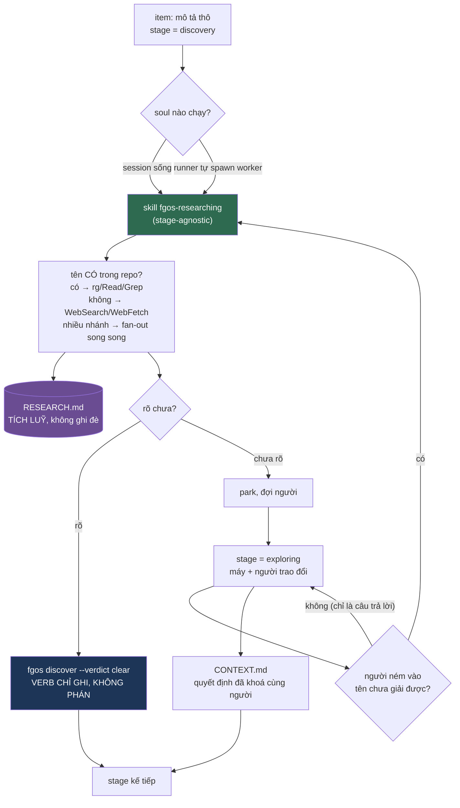

# Fan-out & delegation rubric — DISCUSSION

## 1. Trạng thái hiện tại

Hết vòng 4b, ngày 2026-08-06. **Vẫn chưa mint D-ID nào** — đúng kỷ luật:
mỗi vòng tới nay đều sửa lại kết luận của vòng trước, chưa điểm nào giữ
nguyên qua hai vòng liên tiếp. Không phải chậm tiến độ; là điều kiện mint
chưa đạt.

**Đường đi của bốn vòng — mỗi vòng lật kết luận vòng trước:**

| Vòng | Kết luận | Bị lật bởi |
|---|---|---|
| 1 | "ô L1-whether trống, cần lấp bằng rubric bee" | vòng 1 (scout): ô không trống, `tsk-29i` đã điền chữ "không" |
| 2 | "phải thu hẹp luật `tsk-29i`" | vòng 4: **không cần** — luật chỉ cấm *ad-hoc*, tự chỉ đường dispatch-có-hợp-đồng |
| 3 | tường thuật `tsk-1ni` từ decision doc | vòng 3 (đọc code): doc kể lịch sử, code kể hiện tại — bug đã vá, 3 nhánh chứ không 1 |
| 4/4b | — | — |

**Hình dạng đang hội tụ** (chưa chốt, chờ giữ qua một vòng nữa):
- Tách stage: `discovery` (máy một mình) → park nếu chưa rõ → `exploring`
  (máy + người). Người dùng chọn Hình 1.
- Skill `fgos-researching` **stage-agnostic, tái dùng** — gọi được từ stage
  discovery, gọi được giữa chừng exploring khi người đưa dữ kiện mới.
- Verb về đúng vai **cửa ghi sổ**; caller-verdict thành mặc định, judge
  trong verb thành fallback cho caller không-soul (runner).
- **Fan-out có nhà**: skill research là gather-altitude, fan-out là chế độ
  mặc định của nó. `tsk-29i` (decide-altitude, exploring) **giữ nguyên,
  không sửa** — luật đã kê sẵn cửa dispatch-có-hợp-đồng.

**Vòng 5 đặt tên được sai lầm gốc** (§3 hàng 31): *"item đã rõ chưa?"* bị
phân loại nhầm thành **thuộc tính tính được tại lúc ghi**, trong khi nó là
**một việc**. Bốn triệu chứng đo được đều chảy từ đó — 612 dòng máy móc
retry/timeout/fail-safe, mất trí nhớ khiến vòng lặp không hội tụ (15 vòng/0
clear), không với tới native dispatch, và một bộ spawn thứ hai kém hơn cái
`dispatch.mjs` đã có. Lý do biện hộ cuối cùng ("runner không có soul") cũng
sụp: runner **đã** tự `spawnWorker` cho thi công (`loop.mjs:707`).

**Đã có item: `tsk-5kn`** (tier `heavy`, risk `heavy`, `docsRef` trỏ vào thư
mục này). **8 D-ID đã mint thật** qua `fgos decision --id tsk-5kn` — xem §4.
Không còn điểm nào trong diện chờ.

**§6 đã viết đầy đủ** (tổng hợp thiết kế + sơ đồ Mermaid), **§7 đã chia
5 hạng mục** với anchor riêng, D-ID áp dụng, quan hệ phụ thuộc và verify
nháp. `#task-skill` và `#task-stage` chạy song song được; ba hạng mục còn
lại chờ `#task-skill`.

**Discussion coi như đã hội tụ.** Bước tiếp theo là handoff: gắn `refs` của
`tsk-5kn` (hoặc từng item con sau khi split) vào đúng anchor `{#task-...}`,
rồi claim item và chạy `fgos-coding-exploring` → `fgos-coding-planning` ngay trong session
có đầy đủ ngữ cảnh này.

**⚠ Ranh giới phạm vi — đọc trước khi tưởng discussion này giải hết fan-out.**
Có **hai** bài toán fan-out (§3 hàng 36). `tsk-5kn` chỉ giải **fan-out A**
(gather — trong một item, research bắn nhánh song song). **Fan-out B**
(execution — sau decompose bung N children chạy đồng thời), tức chính câu
hỏi mở màn session này, **nằm ở item riêng `tsk-umc`**, không phụ thuộc
`tsk-5kn`, làm song song được.

Đề bài ban đầu đặt ra là "ô L1-whether còn trống, cần lấp bằng rubric của
bee". Vòng 1 lật tiền đề đó: **ô không trống — nó đã chứa một chữ "không",
được audit có chủ đích vào 4 stage skill qua `tsk-29i`**
(`docs/history/fgos-stage-skills-task-delegation-audit/CONTEXT.md`). Vòng 2
lật tiếp một lần nữa: trục phân biệt mà luật đang dùng ("có phải scout
không") **sai trục** — trục đúng là "session đã cầm thứ đó trong tay chưa",
đo được bằng số thật (§5 vòng 2: nén ~80:1, 410K token đọc → ~5K vào context
cha). Hướng đang nghiêng về **thu hẹp phạm vi luật `tsk-29i`**, không lật
ngược nó.

Câu hỏi kế tiếp còn mở: rubric 3 ca có đúng hình dạng không (§3 hàng 8b),
áp cho stage nào, và đặt luật ở đâu (§3 hàng 12).

Chưa gắn với work item nào — việc chọn item (mới, hay nối vào lineage
`tsk-29i`, hay mục backlog:86) là một trong các câu hỏi mở ở §3.

## 2. Mục tiêu & đề bài

fgOS muốn một session sống có thể tự quyết định đẩy việc ra ngoài (fan-out)
một cách uyển chuyển, ở mọi lúc mọi nơi phù hợp — không chỉ sau `decompose`
mà cả trong `clarify`/`discover` và cả những lượt hội thoại không skill nào
routing — với cơ chế dispatch trong suốt giữa native agent và external
cli/process. Hôm nay fgOS đã có gần trọn bộ máy để làm việc đó: hình dạng
gói (D6 sáu ô bắt buộc), quyết định cơ chế native-vs-cli/spawn
(`dispatch.mjs decide`, tsk-3ik), và backend thật (`resolveExecutorConfig`).
Cái chưa có không phải bộ máy mà là **luật nói khi nào nên dùng nó** — và
chỗ luật ấy nên đứng để nó thật sự với tới mọi lượt, thay vì chỉ sống trong
những skill có trỏ vào nó. Việc này cần đối chiếu với bee (upstream đã chạy
doctrine tương đương nhiều tháng) nhưng không được import mù: bee dùng chữ
"orchestrator" theo nghĩa mà fgOS đã dành riêng cho vai trò khác, và fgOS
đã có những mảnh mạnh hơn bee (worktree riêng + footprint thay reservations,
`fgos return` engine tự verify thay parse status token) không nên đánh đổi.

## 3. Vấn đề rõ / chưa rõ

| # | Vấn đề | Trạng thái | Bằng chứng |
|---|---|---|---|
| 1 | fgOS đã có L1-shape: D6 sáu ô bắt buộc (id/mục tiêu/đầu vào/ranh giới/kết quả mong đợi/hợp đồng trả về), fail-safe thiếu ô ⇒ không dispatch | **Rõ** | `_shared/capacity-dispatch-fallback.md:129-137`; `two-layer-dispatch/DISCUSSION.md:586-593` |
| 2 | fgOS đã có L2: `dispatch.mjs decide` + Step B.5 + `resolveExecutorConfig` | **Rõ** | `capacity-dispatch-fallback.md:78-110`; tsk-3ik (4 children, cleanup) |
| 3 | "orchestrator" đã bị dành riêng, nghĩa khác hẳn bee | **Rõ** | `two-layer-dispatch/CONTEXT.md:33` "L2 is never called orchestrator"; `DISCUSSION.md:102`; `0026:34-52` (fgOS: chọn rootTask nào, "KHÔNG CẦN soul") vs bee `routing-and-contracts.md:264` (session model ở decide-altitude, chính nó LÀ soul) |
| 4 | `AGENTS.md` (tầng luôn nạp) hoàn toàn im lặng về delegation; mọi luật delegation chỉ nạp khi 1 skill trỏ vào hoặc đọc-khi-gọi-tên | **Rõ** | `CLAUDE.md:6` `@AGENTS.md`; `AGENTS.md` 133 dòng, không mục nào về dispatch/subagent |
| 5 | Fan-out **execute** N children không bị luật nào chặn — children của decompose là rootTask thật, dispatch song song = kích hoạt N rootTask đúng định nghĩa 0026 | **Rõ** | `0026:34-56`; demo `tsk-1sj`→`tsk-30z`/`tsk-50ic` đã chạy thật, ~184s overlap đo được |
| 6 | Cái bị D4 gác là "exec packet" — helper ghi file mà không mang vòng đời. D9 mở lại khi (a) `tsk-3xd` merged [đã thoả 2026-08-06] + (b) ≥2 ca thật [chưa] | **Rõ** | `two-layer-dispatch/DISCUSSION.md:120,126,546-549` |
| 7 | **Ô L1-whether KHÔNG trống** — `tsk-29i` đã cố ý đặt luật cấm ad-hoc Task/Agent delegation vào `fgos-coding-exploring`, `fgos-coding-planning`, `fgos-coding-validating`, `fgos-coding-implement`; `fgos-coding-driving` audit xong kết luận không cần | **Rõ** | `fgos-stage-skills-task-delegation-audit/CONTEXT.md` D1/D2 |
| 8 | Luật `tsk-29i` nêu lý do là "re-deriving what a live soul already knows", nhưng văn bản lại cấm cả bước **scout** (`Bash/Grep/rg/Read/WebSearch`) — thứ session *chưa* biết. Lý do nêu và phạm vi cấm có khớp nhau không? | **Gần rõ** (vòng 2) — không khớp; trục đúng là "đã cầm trong tay chưa", không phải "có phải scout không". Chờ giữ nguyên thêm 1 vòng trước khi mint D-ID | `fgos-coding-exploring/SKILL.md:47-64`; §5 vòng 2 |
| 8b | Rubric 3 ca (đã-biết ⇒ inline · chưa-biết + chỉ cần kết luận ⇒ delegate · chưa-biết + cần byte thô ⇒ inline) có phải hình dạng đúng của L1-whether không | **Chưa rõ — đề xuất vòng 2, chưa giữ qua vòng nào** | §5 vòng 2 |
| 8c | Tiết kiệm context và tăng tốc là **hai lợi ích độc lập** (context có kể cả khi dispatch tuần tự 1 con; tốc độ chỉ có khi bắn đồng thời). D2 đã có vế tốc độ, thiếu đúng vế context | **Rõ** | `two-layer-dispatch/DISCUSSION.md:576-577`; đo thật §5 vòng 2 |
| 9 | `fgos-coding-shaping` (skill đang chạy discussion này) **không** nằm trong phạm vi audit `tsk-29i`, nên hiện không có luật cấm delegate — nhất quán hay là lỗ hổng? | **Chưa rõ** | `tsk-29i` CONTEXT.md liệt kê 4 skill, không có coding-shaping |
| 10 | Có thêm "tiết kiệm context window" làm lý do hợp lệ thứ 5 không (đụng D2 "Bốn, no more") | **Chưa rõ** | `capacity-dispatch-fallback.md:26-38`; `two-layer-dispatch/DISCUSSION.md:576-577` |
| 11 | Danh sách never-delegate (gates/synthesis/state writes/đối thoại người) có nhận thành D-ID fgOS không — hiện mới là trích dẫn upstream, chưa D-ID nào nhận | **Chưa rõ** | `DISCUSSION.md:72-73` trích `upstreams/bee/AGENTS.md:77`; khái niệm decide-altitude có ở `architecture-map.md:333` |
| 12 | Đặt luật ở `AGENTS.md` ra sao mà không phình tầng luôn-nạp | **Chưa rõ** | — |
| 13 | Tên gọi vai trò (đề xuất "rootTask host", 0026 đã tự dùng chữ "host" trong prose) | **Chưa rõ** | `0026:58-65` |
| 14 | Thứ tự làm: fan-out gather trước hay execute trước | **Chưa rõ** | — |
| 15 | Item nào mang việc này: mới, nối lineage `tsk-29i`, hay mục mở `docs/backlog.md:86` ("audit ranh giới planner-vs-orchestrator và chốt bằng decision record") | **Chưa rõ** | `docs/backlog.md:86` |
| 16 | **Ngân sách research + quyền fan-out đang nằm sai phía**: tiến trình spawn (ít thông tin hơn) được khuyến khích fan-out Task song song + ~5 lượt research; session sống (đầy đủ context) bị cấm delegate + đúng 1 lượt grep | **Rõ** | prompt `src/intake/discovery.mjs` bước 4 vs `tsk-29i` + `fgos-coding-exploring/SKILL.md` Flow bước 1; §5 vòng 3 |
| 17 | **Pha "discovery" (máy một mình: scout hệ sinh thái + research online + tự đánh giá) không tồn tại dưới dạng skill** — chỉ tồn tại như prompt bên trong spawn. `fgos-coding-exploring` hướng về người ngay bước 1 | **Rõ** | §5 vòng 3 |
| 18 | Có tách `clarify` thành hai pha tường minh (discovery máy-một-mình → park → exploring máy+người) không, hay giữ một stage và chỉ chuyển ngân sách research sang session sống? | **Gần rõ (vòng 4)** — người dùng chọn **Hình 1: tách stage**. Chờ giữ nguyên thêm 1 vòng trước khi mint D-ID | §5 vòng 4 |
| 21 | Stage và skill là **hai trục vuông góc**: stage `discovery` (vị trí vòng đời) + skill `fgos-researching` (năng lực tái dùng, gọi được cả từ giữa chừng exploring). Skill phải **stage-agnostic** | **Gần rõ (vòng 4)** | §5 vòng 4, yêu cầu re-entrancy của người dùng |
| 22 | **`tsk-29i` KHÔNG cần sửa** — luật cấm "ad hoc sub-dispatch" và tự chỉ đường "route it explicitly through the capacity-dispatch mechanism". Skill research có hợp đồng chính là đường đó. Vòng 1-2 đuổi sai hướng | **Rõ** | nguyên văn `fgos-coding-exploring/SKILL.md:47-64`; §5 vòng 4 |
| 23 | Nguyên nhân `claude -p`: **ranh giới tiến trình**. Verb Node là tiến trình con của Bash tool, không còn Task. Transparent dispatch chỉ tác dụng PHÍA TRÊN ranh giới (tầng skill). Dời research lên skill ⇒ ăn ngay, không cần cơ chế mới. `claude -p` về đúng vai đường-lui-khi-không-có-soul-sống (0026 quy tắc 3/4) | **Rõ** | §5 vòng 4; `capacity-dispatch-fallback.md` Step B.5 |
| 24 | **Đính chính hàng 10**: fan-out nhiều nhánh **đã hợp lệ** dưới lý do 4 ("chạy song song cho nhanh"). Chỉ ca **một-nhánh-nặng** mới không lọt lý do nào ⇒ việc thêm lý do thứ 5 nhỏ hơn nhiều so với ước lượng vòng 2 | **Rõ** | §5 vòng 4 |
| 25 | Ghi nhận research hỏng 3 đường: ghi đè thay vì tích luỹ · chỉ bắt `rg` (mất WebSearch/WebFetch) · cơ chế cạo-transcript sẽ chết khi research lên skill | **Rõ** | `discovery.mjs:384-385`; `judge-executor.mjs:147`, `:125-192` |
| 26 | **"Lời giải cụ thể" chưa có nhà** — `CONTEXT.md` giữ quyết định đã khoá (sau khi có người), `scout-notes.md` giữ grep thô; bản tổng hợp sau research không có chỗ nào | **Gần rõ (vòng 5)** — người dùng chọn **(a): file riêng `docs/history/<feature>/RESEARCH.md`, tích luỹ theo vòng**. Lý do: research là *phán đoán máy, có thể sai/lỗi thời*; `CONTEXT.md` là *cam kết đã chốt với người* — không trộn hai độ tin cậy | §5 vòng 5 |
| 31 | **Sai lầm gốc: phân loại nhầm.** "Item đã rõ chưa?" bị coi là *thuộc tính tính được tại lúc ghi*, trong khi nó là *một VIỆC*. Bốn triệu chứng (612 dòng máy móc · mất trí nhớ ⇒ không hội tụ · không với tới native · bộ spawn thứ hai) đều chảy từ đây | **Rõ** | §5 vòng 5 |
| 32 | **Ca "không có soul khả dụng" KHÔNG tồn tại** — runner đã tự `spawnWorker` cho thi công (`loop.mjs:707`), và worker spawn là agent loop thật (0026 nesting rule) ⇒ judge-trong-verb hết lý do tồn tại | **Rõ** | §5 vòng 5 |
| 33 | **Đối xứng có sẵn**: `executing` giao worker chạy skill thi công → `fgos return`; `discovery` giao worker chạy skill research → `fgos discover --verdict`. Cùng đường, khác skill | **Gần rõ (vòng 5)** | §5 vòng 5 |
| 34 | Nếu research là *việc*, nó là **work item riêng** hay **một stage của item đã có, dispatch tới worker như `executing`**? | **Rõ — đã mint D7** (người dùng chọn B1 ở vòng 6, giữ nguyên vòng 7). Lưu ý phạm vi, để không bị đọc rộng hơn thực tế: D7 khoá *research là một stage dispatch được của item đã có*; nó KHÔNG khoá việc stage đó phải mượn nguyên nghi thức của `executing`. Bản thi công cố ý **không** chạy goal-check ở `discovery` (`src/runner/loop.mjs:1066-1072`: *"No goal-check — discovery has no `verify` of its own to prove, that stays executing's job"*) — điều kiện duy nhất là worker có commit thật (`branchFacts().aheadCount > 0`); và session sống ở stage này gọi thẳng `fgos-researching` inline, không worktree, không commit (`workflow-stage-graphs.mjs`'s `skillMap.discovery`) | §5 vòng 6; §4 D7; `CONTEXT.md:50` |
| 36 | **CÓ HAI BÀI TOÁN FAN-OUT, KHÁC HẲN NHAU — `tsk-5kn` chỉ giải một.** (A) *gather fan-out*: trong MỘT item, research chẻ câu hỏi thành nhánh độc lập, bắn subagent song song, gom digest — I/O worker, không vòng đời ⇒ giải ở `#task-skill`. (B) *execution fan-out*: sau decompose ra N children, dispatch N worker đồng thời, mỗi worker claim + thi công một child — execution worker, vòng đời đầy đủ, worktree/claim/verify/merge ⇒ **`tsk-5kn` KHÔNG giải; cần item riêng** | **Rõ — nêu vòng 7** | §5 vòng 7 |
| 37 | Fan-out B **không bị gì chặn, chỉ là chưa ai xây**: children của decompose là rootTask thật ⇒ dispatch N cái = kích hoạt N rootTask đúng định nghĩa `0026`; demo `tsk-1sj`→`tsk-30z`/`tsk-50ic` đã chạy thật (~184s overlap) nhưng bằng tay; `computeSchedule`/`selectWave` đã có nhưng chỉ `fgos-runner` tiêu thụ mà runner chưa từng chạy; mọi loop skill hiện tại đều tuần tự | **Rõ** | §5 vòng 7 |
| 36b | Fan-out B đã có item riêng: **`tsk-umc`** (tier `heavy`, risk `heavy`, kind `feature`, `docsRef` trỏ về thư mục này). Không phụ thuộc `tsk-5kn`, làm song song được | **Rõ** | submit vòng 7 |
| 38 | Câu thiết kế thật của fan-out B, chưa trả lời: **ai claim?** bee bắt orchestrator claim TRƯỚC rồi mới spawn (*"workers never self-select"*); demo fgOS để mỗi child session tự claim với id do cha chỉ định. Khác nhau ở chỗ đặt lock và cách xử lý khi worker chết giữa chừng | **Chưa rõ** | §5 vòng 7 |
| 39 | **Dung nạp 3 lớp dispatch của bee vào lưới L1 của fgOS: cú merge nhỏ hơn nó trông.** bee's *execution worker* ≡ fgOS's *work item* (D4 định nghĩa vòng đời chính là "cần reserve, attest, commit và merge" = đúng thẩm quyền — cùng trục, khác tên). bee's *I/O worker* ↔ fgOS chẻ tiếp thành *capacity* / *gói tự do* (trục "đăng ký trước", bee không có, và fgOS có lý do thật: D6 bảo đảm "cùng một câu hỏi mỗi lần"). Thứ fgOS **thật sự thiếu** là ô **review-class** — dispatch chỉ-đọc soi lại đầu ra của chính mình (`judgeVerifySemanticCorrectness` đúng loại này nhưng chưa có tên). **Ô đó không liên quan gì tới fan-out** | **Rõ — nêu vòng 7** | §5 vòng 7 |
| 35 | **Trigger research giữa chừng exploring**: KHÔNG phải "có thông tin mới" — phần lớn input của người *làm rõ hơn*. Trigger là **người đưa vào một tên riêng (library/công nghệ/concept) mà agent không giải được**. Chốt chặn cơ học đề xuất: tên đó có trong repo/docs không? Không có ⇒ tra, đừng nhớ lại (vì self-test "tôi có biết không" là chỗ LLM dở nhất — sẽ bịa) | **Chưa rõ — nêu vòng 6** | §5 vòng 6 |
| 27 | Research gọi lại từ **giữa chừng** exploring: có phải một lần chuyển stage không, hay là lời gọi trong-stage? (đụng stage machine) | **Chưa rõ** | §5 vòng 4 |
| 28 | Verb đứng đó là **đúng cho phần GHI** (luật one-door-write). Sai là ở chỗ gộp "verb phải GHI verdict" với "verb phải TẠO RA verdict" — `claude -p` là hệ quả bắt buộc của cú gộp, không phải lựa chọn | **Rõ** | §5 vòng 4b |
| 29 | Judge-trong-verb có đúng **một** caller chính đáng: `loop.mjs:1031` (runner headless, không soul). Nhưng runner **chưa từng chạy** (0 `capacity.dispatch`) ⇒ đường fallback đang phục vụ đường chạy-hằng-ngày. Nguyên nhân cấu trúc của 15 vòng/0 clear | **Rõ** | `src/runner/loop.mjs:1031` vs `bin/fgos.mjs:1085`; §5 vòng 4b |
| 30 | Sửa về khái niệm chỉ là **đảo thứ tự ưu tiên** (caller-verdict thành mặc định, judge thành fallback). `tsk-27y` đã xây nửa dưới; thiếu nửa trên là skill research | **Gần rõ (vòng 4b)** | §5 vòng 4b |
| 19 | `judgeDiscovery` bị đóng đinh vào `claude -p` vì caller là verb Node (không thể gọi Task). Dời quyết định lên tầng skill là đường duy nhất để nó thành subagent — nhưng "đặt lớp quyết định ở đâu" là câu 0026 để ngỏ, chưa ai trả lời | **Rõ (nguyên nhân) / Chưa rõ (chỗ đặt)** | how-to `wire-a-skill-...:84-104`; `0026` mục "Việc chưa quyết" |
| 20 | Đo được: blind-judge chạy 15 vòng, clear 0 item, park 4 | **Rõ** | `src/intake/discovery.mjs:382-383` |

## 4. Quyết định đã chốt

Item mang việc này: **`tsk-5kn`** (tier `heavy`, risk `heavy`, `docsRef` =
`docs/history/fanout-and-delegation-rubric/`). Mỗi D-ID dưới đây đã được ghi
thật qua `fgos decision --id tsk-5kn`.

| D-ID | Quyết định | Vòng chốt |
|---|---|---|
| **D1** | **Verb là cửa ghi sổ thuần; skill là bên sản xuất verdict.** Luật one-door-write chỉ đòi mọi GHI đi qua CLI — không đòi verb phải TẠO RA giá trị được ghi. Gộp hai chuyện đó chính là nguyên nhân bắt buộc `claude -p`. `bin/fgos.mjs:1085` đã nhận `callerVerdict` (`tsk-27y`) ⇒ nửa dưới có sẵn, thiếu nửa trên là skill | nêu vòng 4b, giữ vòng 5 |
| **D2** | **`tsk-29i` KHÔNG cần sửa** — luật chỉ cấm *"ad hoc sub-dispatch"* và tự chỉ đường *"route it explicitly through the capacity-dispatch mechanism"*. Skill research có hợp đồng chính là đường đó. Vòng 1-2 (thu hẹp luật) là đuổi sai hướng | nêu vòng 4, giữ vòng 5 |
| **D3** | **Tách stage**: `discovery` (máy một mình) tách khỏi `exploring` (máy + người) — Hình 1. Hôm nay `clarify` gộp cả hai, và pha máy-một-mình chỉ tồn tại dưới dạng prompt bên trong spawn | người dùng chọn vòng 4, giữ vòng 5 |
| **D4** | **Research là SKILL tái dùng, stage-agnostic** — không phải một pha cố định. Stage và skill là hai trục vuông góc, cần cả hai. Skill nhận *(mô tả + những gì đã biết)*, trả *(lời giải cụ thể + verdict)*, không được biết mình bị gọi từ stage nào | nêu vòng 4, giữ vòng 5 |

| **D5** | **Bản đúc kết research ở file riêng `docs/history/<feature>/RESEARCH.md`, TÍCH LUỸ theo vòng.** Không trộn vào `CONTEXT.md` — research là *phán đoán máy, có thể sai/lỗi thời*, `CONTEXT.md` là *cam kết đã chốt với người*. Phải bắt cả WebSearch/WebFetch, không chỉ `rg` | người dùng chọn vòng 5, giữ vòng 6 |
| **D6** | **Ca "không có soul khả dụng" KHÔNG tồn tại** ⇒ judge-trong-verb hết lý do tồn tại. Runner đã `spawnWorker` cho thi công (`loop.mjs:707`), và worker spawn là agent loop thật (nesting rule `0026`) | nêu vòng 5, giữ vòng 6 |

| **D7** | **Research giữa chừng exploring là lời gọi TRONG-STAGE** (không quay ngược stage); và **research là một stage dispatch được của item đã có**, không phải work item riêng. Hai vế củng cố nhau: research là *năng lực* thì không cần vòng đời riêng — tránh luôn ô mà D4 của `two-layer-dispatch` đã gác | người dùng chọn vòng 6, giữ vòng 7 |
| **D8** | **Trigger research bỏ hẳn câu hỏi "agent có biết cái này không"** — chỉ hỏi *research bằng ĐƯỜNG NÀO*. Mặc định LUÔN research khi có tên riêng chưa giải; tên **có** trong repo ⇒ đọc tại chỗ (`rg`/Read/Grep), **không có** ⇒ tra ngoài (WebSearch/WebFetch). Lý do bỏ self-test: LLM nghe tên lạ thì bịa, nên trigger dựa vào tự đánh giá không bắn đúng lúc cần nhất | nêu vòng 6, người dùng chốt vòng 7 |

## 5. Q&A log

### 2026-08-06 — Vòng 1: scout mở màn

**Đã scout:**
- `upstreams/beegog/skills/bee-swarming/SKILL.md` (toàn bộ) — Operating Contract 8 bước, wave analysis, 1 cell/worker, isolation contract.
- `upstreams/beegog/skills/bee-hive/references/routing-and-contracts.md:262-284` — Delegation contract nguyên văn: 3 lớp dispatch (I/O worker · execution worker · review-class), phân biệt bằng **thẩm quyền + tác dụng lên state, không phải kích thước việc**; D2 rubric ">3 files HOẶC digest-not-verbatim"; digest contract; cli gather branch với delimiter `<<<BEE_DIGEST`.
- `upstreams/beegog/AGENTS.md` rule 13 — luật đặt ở tầng luôn nạp, lý do nêu: *"'no skill is running' is exactly when the rule is most often forgotten"*.
- `docs/history/two-layer-dispatch/{CONTEXT,DISCUSSION}.md` — D1-D12 đầy đủ.
- `docs/decisions/0026-*.md` — 4 quy tắc native-vs-cli/spawn, vocabulary launcher/rootTask/subTask/capacity.
- `.claude/skills/_shared/capacity-dispatch-fallback.md` — Step A/B/B.5/C/D + gói ad-hoc 6 ô.
- `docs/history/fgos-stage-skills-task-delegation-audit/CONTEXT.md` — **phát hiện lật tiền đề**, xem dưới.
- `.claude/skills/fgos-{exploring,planning,validating,code-implement}/SKILL.md` — nguyên văn luật cấm delegation.
- Claude Code docs — xác nhận `/subtask` (kế thừa context cha) và `/fork` (clone session) tồn tại thật; Agent tool + Agent Teams mặc định fresh context.

**Phát hiện chính:** tiền đề "ô L1-whether trống" **sai**. `tsk-29i` đã điền
vào ô đó một chữ "không", có chủ đích, qua audit, với 2 quyết định khoá
(D1: `fgos-coding-validating` được luật riêng thay vì dựa vào D6 sẵn có; D2: mở
rộng phạm vi audit sang `fgos-coding-driving`).

**Căng thẳng lộ ra:** lý do nêu trong luật và phạm vi luật cấm không khớp
nhau — xem §3 hàng 8. Đây là câu hỏi mở của vòng 1, chưa kết luận.

**Bằng chứng thực nghiệm sống (chưa diễn giải):** chính session đang chạy
discussion này đã dispatch 5 Explore subagent để scout (bee swarming,
two-layer-dispatch, bản đồ vocabulary "orchestrator", ngữ nghĩa fork của
Claude Code, delegation contract của bee). Mỗi cái trả về digest. Tổng dung
lượng nguồn đọc qua chỉ riêng `beegog.md` là 105KB. Session này **không**
chạy `fgos-coding-exploring`/`fgos-coding-planning` nên không vi phạm luật `tsk-29i` —
nhưng nó là một mẫu quan sát được về đúng hành vi đang bàn.

### 2026-08-06 — Vòng 2: đo thật chi phí, và trục phân biệt được đặt lại

**Người dùng chất vấn tiền đề của vòng 1:** *"chưa hiểu tại sao delegate lại
tốn context? nếu main session cần 3 scouts, nếu nó không làm mà nhờ 3
subagents để làm thì tốn context làm sao? tốc độ còn được x3. nếu bản thân
nó đã scout và kêu sub làm lại thì mới tốn chứ?"*

Chất vấn đúng. Vòng 1 diễn đạt tối nghĩa ("thứ bị tiêu là context window"
đọc ra thành *delegate* tiêu context, trong khi ý là *làm inline* tiêu).

**Đo thật, trên chính session này** (6 subagent đã chạy trước khi discussion
mở):

| Agent | Token nó tự đốt |
|---|---|
| cơ chế parallel dispatch | 65.483 |
| trigger decompose→execute | 56.547 |
| delegation doctrine của bee | 87.913 |
| fresh vs fork của Claude Code | 58.701 |
| two-layer-dispatch | 76.667 |
| bản đồ "orchestrator" | 64.670 |
| **tổng** | **~410.000** |

Rơi vào context của session cha: 6 digest × ~600-900 token ⇒ **~5.000**. Tỉ
lệ nén **~80:1**. Context window của session cha là 200K — đọc inline chỗ đó
sẽ tràn gấp đôi.

**Sòng phẳng về giá:** delegate làm **tổng token TĂNG** (mỗi subagent tự nạp
lại CLAUDE.md, project context, prompt riêng). Thứ đổi được là context của
cha (giảm mạnh) và wall-clock (giảm, nếu bắn đồng thời). bee ghi thẳng lựa
chọn này: *"The scarce resource is the orchestrator's context window, not
tokens"*.

**Hai lợi ích tách rời** (ghi vào §3 hàng 8c): tiết kiệm context có kể cả
với 1 subagent tuần tự; tốc độ chỉ có khi bắn đồng thời trong một message.
D2 của fgOS đã có vế tốc độ, thiếu đúng vế context.

**Trục phân biệt được đặt lại — phát biểu của người dùng gọn hơn cả `tsk-29i`
lẫn vòng 1:** lãng phí không nằm ở *"delegate việc scout"* mà ở *"delegate
thứ mình đã cầm trong tay"*. Từ đó ra rubric 3 ca (đề xuất, chưa chốt):

| Ca | Đã biết đáp án? | Cần byte thô sau đó? | Đúng cách |
|---|---|---|---|
| 1 | **Rồi** | — | **inline** — dispatch = làm lại, đúng bug `tsk-1ni` |
| 2 | Chưa | Không, chỉ cần kết luận | **delegate** — thắng cả context lẫn tốc độ |
| 3 | Chưa | **Có** — phải trích nguyên văn, hoặc phải tự nhìn sắc thái mới nghĩ ra câu hỏi | **inline** — digest làm mất đúng thứ cần |

Ca 3 giữ lại được thứ `tsk-29i` muốn bảo vệ ở `fgos-coding-exploring`. Nên hướng
xử lý không phải lật ngược luật, mà **thu phạm vi**: từ "cấm delegate scout"
xuống "cấm delegate thứ đã cầm", cộng ca 3 làm ngoại lệ có lý do nêu rõ.

### 2026-08-06 — Phụ lục bằng chứng: đối chiếu đầy đủ bee ↔ fgOS

*(Ghi bổ sung sau vòng 2. Nội dung này được sản xuất trong scout vòng 1
nhưng khi đó chỉ được tóm tắt vào §3 — ghi lại nguyên vẹn ở đây để người
đọc không có lịch sử chat vẫn dùng được. Không sửa các entry vòng 1/2 ở
trên.)*

#### A. Delegation contract của bee — nguyên văn phần khung

`upstreams/beegog/skills/bee-hive/references/routing-and-contracts.md:262-284`,
tiêu đề mục: *"Delegation contract (fan-out: decide-altitude vs
gather-altitude)"*.

> "The one orchestration pattern bee runs: the session model (the owner's
> best model) stays the orchestrator in every phase, and mechanical
> gather/render/mine steps dispatch down-tier as I/O workers that return
> digests (D1 — replaces the advisor pattern in full, decisions 0013/0015
> reversed)."

- **Decide-altitude ở lại session model**: gates, câu hỏi Socratic, mode
  gate, tổng hợp phát hiện, chấp nhận/từ chối kết quả worker, ghi state,
  đối thoại với người.
- **D2 rubric**: delegate khi cần đọc **>3 file** HOẶC nội dung chỉ cần
  dạng **digest, không cần verbatim**. *"Prose-ruled — no new hook enforces
  the threshold."*
- **D3 lane rule**: áp mọi lane, mọi phase. "0 subagents" của lane
  tiny/small nghĩa là 0 subagent **ceremony**; I/O worker được miễn.
- **Digest contract**: worker trả về đường dẫn đã đọc, các dữ kiện kèm
  neo `file:line`, trích nguyên văn chỉ ở chỗ được yêu cầu; *"the
  orchestrator never re-reads what a digest already answers"*.
- **cli gather branch**: chạy lệnh cấu hình **nguyên văn**, prompt vào
  **stdin**, mọi đường dẫn **tuyệt đối**, read-only theo hợp đồng; **stdout
  CHÍNH LÀ digest**, đóng khung giữa `<<<BEE_DIGEST` và `BEE_DIGEST>>>`;
  thiếu delimiter hoặc digest rỗng = **lần chạy hỏng**, phải la lớn, không
  bao giờ nuốt im.

`upstreams/beegog/AGENTS.md` rule 13 đặt cùng luật này ở tầng luôn nạp, lý
do nêu: *"This holds in every phase and every lane... and in plain
conversation turns where no bee skill routed at all — 'no skill is running'
is exactly when the rule is most often forgotten."* Và:
*"The scarce resource is the orchestrator's context window, not tokens."*

#### B. Ba lớp dispatch của bee — trục phân biệt

Điểm thiết kế đáng học nhất: phân lớp theo **thẩm quyền + tác dụng lên
state**, **không phải theo kích thước việc**.

| Lớp | Đăng ký registry? | Giữ reservation? | Trả về gì | Dùng ở đâu |
|---|---|---|---|---|
| **I/O worker** (gather) | Không | Không | digest | hive (onboarding scan), exploring (gray-area scout), planning (bootstrap + discovery research) |
| **Execution worker** (AO14) | **Có** (`state worker add`) | **Có** | đúng 1 status token | chỉ bee-swarming |
| **Review-class** | Không | Không | nhận xét read-only | plan-checker, cell reviewer, panel |

Nguyên văn: *"distinguished from the I/O-offload worker by **authority and
state effects**, not by task size"*; và review-class *"is **neither** class
... and is never called an 'execution worker.'"*

#### C. Delegation contract của fgOS — map từng ô với bee

fgOS **đã có** contract này: `.claude/skills/_shared/capacity-dispatch-fallback.md`
(gói ad-hoc 6 ô) + `docs/history/two-layer-dispatch/` (D1-D12).

| bee (isolation contract + digest contract) | fgOS (D6 — sáu ô bắt buộc) |
|---|---|
| cell id | `id` = `<scope>#p<n>` |
| đường dẫn CONTEXT.md, plan.md | `đầu vào` — *"read these; nothing else will be provided"* |
| global constraints | `ranh giới` (fgOS tự nhận tương đương `forbidden_paths` của symphony) |
| — | `mục tiêu` một câu — *"thứ duy nhất worker không suy ra được từ file"* |
| digest contract (paths, `file:line`) | `kết quả mong đợi` |
| status-token protocol | `hợp đồng trả về` (fgOS tự nhận tương đương bee: *"exiting is not signaling"*) |
| reservation nickname | **không có** — cố ý, theo D4 |

**Ba chỗ fgOS chặt hơn bee:**
- **D6 fail-safe** — thiếu bất kỳ ô nào ⇒ *"skill **từ chối dispatch và làm
  inline**"*. bee không có luật này.
- **D6b** — `#` khiến packet id **về cấu trúc** không bao giờ hợp lệ với
  `work.mjs:24 ID_PATTERN` ⇒ *"không thể nhầm thành work item"*. bee chỉ
  dựa quy ước.
- **D11** — *"**Cấm xây file đếm**: file đếm là state, và nó mở lại D4 bằng
  cửa sau."*

#### D. L1/L2 — soi 4 mảnh vào lát cắt của chính fgOS (D5)

D5 chia dispatch thành **L1 = cái được dispatch (gói + người nhận)** và
**L2 = cơ chế kích hoạt (native/cli-spawn + backend nào chạy)**
(`two-layer-dispatch/DISCUSSION.md:477-479`).

| Mảnh | fgOS có? | Ở đâu |
|---|---|---|
| **L1 — hình dạng gói** | ✅ chặt | D6/D6b, `capacity-dispatch-fallback.md:129-137` |
| **L1 — CÓ NÊN đẩy ra không** | ❌ trống (vòng 1) → **sai trục** (vòng 2) | luật `tsk-29i` đang đứng chỗ này với chữ "không" |
| **L2 — chọn cơ chế** | ✅ | Step B.5 + `dispatch.mjs decide`, tsk-3ik |
| **L2 — backend thật** | ✅ | `resolveExecutorConfig` |

**Quan sát then chốt:** chỗ đáng lẽ là L1-whether hiện chứa "4 lý do hợp
lệ" — nhưng cả 4 đều trả lời câu hỏi **L2/backend**, không phải L1:

> model rẻ hơn (backend) · khác provider (backend) · cách ly tài nguyên
> (môi trường chạy) · chạy song song cho nhanh (lịch chạy)

Không ô nào nói về **payload** — thứ chảy ngược vào context của session.
Nên lý do L1-thuần duy nhất bị rơi mất: **tiết kiệm context window**.

#### E. Bảng đối chiếu tổng — ai mạnh hơn ở đâu

| Khía cạnh | bee | fgOS |
|---|---|---|
| Phân loại dispatch | 3 lớp theo thẩm quyền + tác dụng state | 2 trục vuông góc: có/không vòng đời × đăng ký trước/soạn lúc chạy (D5) — factoring gọn hơn |
| Ai claim | orchestrator claim TRƯỚC rồi mới spawn; *"workers never self-select"* | mỗi session tự `fgos take` theo identity của mình; demo `tsk-1sj` cho child tự `/fgOS:pick <id>` (parent chỉ định id ⇒ không phải self-select) |
| Chống 2 worker đụng file | reservations trong 1 checkout chung | **worktree riêng mỗi item** + `footprint` + `footprintConflicts` — mạnh hơn |
| Bằng chứng "xong" | status token + orchestrator tự chạy lại verify + frozen judge + semantic judge | `fgos return` — **engine tự chạy lại verify**, tự check clean tree + advanced history. Mạnh hơn: máy ép, không parse token |
| Ép transport (tier) | hook `bee-model-guard` **DENY** dispatch trần | ô `provider`/`tier` để trống, *"chưa có logic chọn đứng sau"* (D10) — yếu hơn |
| Lịch wave | `cells schedule --json`, orchestrator dùng thật mỗi wave | `computeSchedule`/`selectWave` có, nhưng **chỉ `fgos-runner` tiêu thụ** — chưa skill nào gọi |
| Danh sách không-bao-giờ-delegate | khoá rõ 7 mục | khái niệm `decide-altitude` **có** (`architecture-map.md:333`), danh sách cụ thể mới là **trích dẫn upstream**, chưa D-ID nào nhận |
| Nơi đặt luật delegation | `AGENTS.md` — **luôn nạp** | rải rác, **không cái nào luôn nạp** (bảng G) |

#### F. Va chạm từ vựng "orchestrator"

| | fgOS (`0026:34-52`) | bee (`routing-and-contracts.md:264`) |
|---|---|---|
| nghĩa | thứ **quyết định kích hoạt rootTask nào** | **session model** ở decide-altitude, fan out gather |
| cần soul? | *"KHÔNG CẦN soul"* — picker thuần cơ học | **chính nó LÀ soul** |
| tầng | trên vòng đời (chọn việc) | trong 1 việc (chọn delegate gì) |

Đã có lệnh dành riêng chữ này: `two-layer-dispatch/CONTEXT.md:33` —
*"L2 is never called \"launcher\""*; `DISCUSSION.md:102` —
*"**Rõ — đừng gọi \"launcher\"** | 0026 dòng 34-56 đã gán
\"launcher\" cho vai trò quyết định kích hoạt rootTask nào — tầng CAO
hơn, không phải transport. Thuật ngữ sẵn có cho L2 là **\"cơ chế
dispatch\"**; **\"executor\"** để dành cho backend đích"*.

(Ghi chú 2026-08-08, `tsk-2cw`: đoạn trích trên phản ánh nội dung
`two-layer-dispatch/CONTEXT.md`/`DISCUSSION.md` **sau** khi `0028` đổi tên
"orchestrator" → "launcher" — xem `0028-doi-ten-orchestrator-thanh-
launcher.md`. Toàn bộ phần còn lại của mục F này (và §3 hàng 3, dòng 88) mô
tả VÒNG THẢO LUẬN LỊCH SỬ về va chạm từ vựng giữa fgOS và bee — giữ nguyên
chữ "orchestrator" có chủ đích vì đó chính là chủ đề đang được phân tích.)

Tên fgOS-native đề xuất cho khái niệm của bee: **rootTask host** — `0026:58-65`
đã tự viết chữ "host": *"bất kỳ ai đang là 'host' thực thi cho 1 việc, tại
thời điểm nó tự kích hoạt việc con bên dưới, chính nó lại đóng vai rootTask
cho những việc con đó"*.

#### G. Luật delegation của fgOS đang sống ở đâu, nạp kiểu gì

| Nơi | Chế độ nạp |
|---|---|
| `AGENTS.md` (qua `CLAUDE.md:6` `@AGENTS.md`) | **luôn nạp, mọi session, mọi turn** — và **im lặng hoàn toàn về delegation** (133 dòng, không mục nào) |
| `_shared/capacity-dispatch-fallback.md` | chỉ nạp khi 1 skill trỏ vào — 5 skill đang trỏ (`fgos-coding-exploring:63`, `fgos-coding-planning:64`, `fgos-coding-validating:73`, `fgos-coding-implement:50`, `fgos-submit-assist:50`) |
| `docs/decisions/0026-*.md` | đọc-khi-được-gọi-tên |
| `docs/how-to/wire-a-skill-through-the-native-vs-cli-spawn-dispatch-decision.md` | đọc-khi-được-gọi-tên |
| `docs/history/two-layer-dispatch/{CONTEXT,DISCUSSION}.md` | đọc-khi-được-gọi-tên |

⇒ **Hôm nay không luật delegation nào chạy "mọi lúc mọi nơi"** — mọi luật
đều nằm sau một quyết định routing.

#### H. Fresh vs fork context — sự thật kỹ thuật

Claude Code **có thật** 2 cơ chế ngoài Agent tool mặc định:
- **`/subtask`** — subagent **kế thừa toàn bộ context hội thoại cha**
- **`/fork`** — clone cả session hiện tại thành session nền chạy song song

Mặc định (Agent tool, Agent Teams) = **fresh 100%**: không lịch sử cha, chỉ
prompt dispatch + project context (CLAUDE.md/skills). `isolation:"worktree"`
là cách ly **filesystem git**, không liên quan context.

**Cả bee lẫn fgOS đều cố ý không dùng fork:**
- bee-swarming Red Flags: *"full session context **forked** into a routine
  worker"* — liệt kê thẳng là dấu hiệu sai
- bee-swarming step 3: *"**nothing else, never session history, never a
  literal session id** (D3)"*
- bee-exploring:84: reviewer spawn *"with **no conversation history**"*
- fgOS `orchestration-protocol.md`: *"Do not pass full conversation
  history. Summarize only decisions needed for the subtask."*

Lý do trùng nhau: worker ké context = *"soul re-deriving what a live soul
already knows"* — đúng lớp lãng phí `tsk-1ni` tìm ra.

#### I. Fan-out — cái nào bị chặn, cái nào không

- **Fan-out gather (I/O worker)** — **không luật nào chặn**. D3 đã mở ad-hoc
  packet, D6 đã khoá shape, L2 xong. Thiếu: luật nói *khi nào*, và chưa
  skill nào làm.
- **Fan-out execute N children** — **không luật nào chặn**. Children của
  decompose **là work item thật = rootTask thật**; dispatch song song =
  kích hoạt N rootTask, đúng định nghĩa launcher của `0026`. Demo
  `tsk-1sj`→`tsk-30z`/`tsk-50ic` đã chạy thật (~184s overlap đo được từ
  `.fgos/events.jsonl`). Thiếu: chưa skill nào tự làm — mọi loop skill hiện
  tại đều *"lần lượt"* (tuần tự).
- **Cái BỊ chặn thật** — "exec packet": helper **ghi file** mà không mang
  vòng đời (D4). Lý do nguyên văn: *"hễ cần reserve, attest, commit và merge
  thì đã là vòng đời, mà vòng đời là thứ định nghĩa rootTask."* D9 cho mở
  lại khi đủ 2 điều kiện: (a) `tsk-3xd` merged — **đã thoả 2026-08-06**;
  (b) ≥2 ca thật được ghi nhận — **chưa**.

⇒ Không cần sửa luật khoá nào để có fan-out. Cần: luật nói *khi nào* + 1
skill chịu làm.

### 2026-08-06 — Vòng 3: đọc CODE thật, phát hiện fan-out đang nằm sai phía

**Người dùng bác bỏ toàn bộ tường thuật vòng 2 về `tsk-1ni`**, nêu mô hình
họ đã yêu cầu từ lâu: *"một task với description, chưa làm gì, active
session sẽ chạy skill discovery, nó sẽ tự đọc hiểu description, cố gắng làm
rõ, sau đó sẽ scout để nắm thông tin hệ sinh thái và online research về các
thứ chưa hiểu. sau research nó tự đánh giá là rõ hay chưa. chưa rõ thì
parking đợi human và kích hoạt chu trình exploring (lúc này máy người cùng
trao đổi làm việc)"*. Và: *"chổ spawn -p này sẽ là 1 skill research/discover,
có kích hoạt nó thì dispatch thì đúng sẽ là subagent, sao cứ claude -p
miết?"*

**Lỗi phương pháp của vòng 2 (ghi lại để không lặp):** tường thuật vòng 2
lấy từ phần *mô tả bug* trong `docs/decisions/0026` (viết 2026-08-03) và
trình bày như hành vi hiện tại. Doc kể ý định và lịch sử; code kể hiện tại.
Đây là lần thứ ba trong cùng session mắc lỗi này (trước đó: "fgos-runner
chưa từng chạy" → thực ra có code + e2e test; "fgOS không có delegation
contract" → người dùng sửa).

**Code thật — `resolveDiscovery(dir, id, cfg, role, callerVerdict)` có BA
nhánh:**

| Nhánh | Điều kiện | Có gọi model không |
|---|---|---|
| **A** | `callerVerdict` được truyền vào | **Không** — ghi decision *"caller-supplied: session already reasoned live (fgos-coding-exploring)"* (`tsk-27y` D2) |
| **B1** | `docsRef` trỏ tới `CONTEXT.md` đã commit, không rỗng | **Không** — ghi decision *"trusted committed CONTEXT.md, no model call"* (`tsk-ozl` D2) |
| **B2** | còn lại | Có — `judgeDiscovery` → `runJudgeExecutor` → `spawnSync` |

⇒ Kịch bản "session Socratic xong rồi mới spawn thằng mù" **không rơi vào
nhánh nào**: Socratic xong thì có `CONTEXT.md` ⇒ B1; hoặc `/fgOS:discover`
tự khai verdict ⇒ A. Lãng phí đó đã được vá.

**"Mù" là phóng đại — người dùng bác đúng.** Tiến trình spawn nhận: mô tả
item, **nội dung thật của từng dependency**, lịch sử hỏi-đáp với người, các
verdict trước, scout notes, graph/impact context. Cộng tool
`Task, WebSearch, WebFetch, Read, Bash(rg:*)`
(`.fgos-runner.json` → `capacities.judge-discovery`, nâng cấp `tsk-4rd`).
Nó chỉ không thấy **hội thoại của session sống**.

**PHÁT HIỆN CHÍNH — mô hình người dùng ĐÃ được viết, nhưng viết vào chỗ
sai.** Nguyên văn prompt giao cho tiến trình spawn (`src/intake/discovery.mjs`,
bước 4):

> "**Nếu CHƯA đủ rõ và bạn có công cụ — TỰ ĐI TÌM THÊM bằng chứng trước khi
> kết luận unclear**, chọn công cụ theo loại câu hỏi: Câu hỏi riêng của repo
> này → `Bash rg`/Read/Grep/Glob. Câu hỏi khái niệm/cơ chế/giải pháp kỹ
> thuật chung → **WebSearch/WebFetch**, tra cứu ngoài thay vì đoán. Câu hỏi
> có **NHIỀU nhánh độc lập** → **giao việc qua Task cho nhiều subagent chạy
> SONG SONG** thay vì tự làm tuần tự... Ngân sách: khoảng 5 lượt gọi công cụ
> nghiên cứu... **CHỈ kết luận unclear SAU KHI đã thử tìm thêm**."

Đó chính xác là pha "discovery" người dùng mô tả, **kể cả fan-out song
song**.

**Mâu thuẫn thẳng trong cùng một repo:**

| Ai | Lệnh về fan-out | Ngân sách scout |
|---|---|---|
| Session sống (`fgos-coding-exploring`) | **CẤM** delegate qua Task (`tsk-29i`) | đúng **một** lượt `rg ... \| head -20` |
| Tiến trình spawn (`judge-discovery`) | **KHUYẾN KHÍCH** fan-out Task song song | ~5 lượt research, có WebSearch/WebFetch |

Bên **ít thông tin hơn** được cấp quyền fan-out và ngân sách nghiên cứu;
bên **nắm đầy đủ context** bị giới hạn một cú grep và bị cấm delegate.

**Kết quả đo được**, ghi ngay trong code (`src/intake/discovery.mjs:382-383`):
*"dogfood observed: **15-round discover-loop run, 0 cleared, 4 parked**"*.

**Vì sao cứ `claude -p` — nguyên nhân là CẤU TRÚC, không phải lựa chọn
thiết kế.** Config tự khai `"kind": "task"` (tức đã thiết kế để đủ tư cách
native) nhưng args cứng `["-p", "{prompt}", ...]`. Lý do: `judgeDiscovery`
được gọi từ **bên trong một verb Node**, mà hàm Node **không có** tool Task —
không phải "chưa dùng" mà **không thể**. Đã ghi ở hai nơi:
- `docs/how-to/wire-a-skill-through-the-native-vs-cli-spawn-dispatch-decision.md:84-104`
  — gọi `decide` ở đó *"would only ever pass `hasLiveTaskAccess: false`,
  which can never resolve to anything but `cli-spawn` — **a dead branch, not
  real wiring**"*.
- `0026` mục "Việc chưa quyết" — *"trong `resolveExecutorConfig` bản thân nó
  (**không thể — là hàm Node thuần, không tự gọi Task được**), hay ở tầng
  gọi nó (skill/engine-verb caller, nơi có soul thật)?"* — **câu hỏi này vẫn
  chưa được trả lời**.

⇒ Muốn nó thành subagent chạy skill research: phải **dời quyết định lên tầng
skill**. `tsk-27y` đã dời **verdict** lên; **chưa ai dời phần research lên**.

**Lệch gốc rễ — fgOS không tách discovery khỏi exploring:**

| | Mô hình người dùng | fgOS hiện tại |
|---|---|---|
| Pha 1 | **discovery** — máy một mình: đọc description → scout hệ sinh thái → research online → tự đánh giá rõ/chưa | **không tồn tại dưới dạng skill**; chỉ tồn tại dưới dạng đoạn prompt bên trong tiến trình spawn |
| Pha 2 | **exploring** — chỉ vào khi pha 1 kết luận *chưa rõ*: park, đợi người, máy+người trao đổi | `fgos-coding-exploring` — hướng về người **ngay từ bước 1** (một lượt grep rồi sinh câu hỏi) |
| Cửa vào | — | `/fgOS:discover` nghe như pha 1 nhưng route thẳng vào `fgos-coding-exploring`, tức pha 2 |

### 2026-08-06 — Vòng 4: chốt hướng Hình 1, và fan-out tìm được nhà

**Người dùng xác nhận mô hình đã phát biểu đúng**, chọn **Hình 1** (tách
stage cho rõ ràng, khỏi nhập nhằng), và bổ sung ba yêu cầu mới:
1. *"nên có **skill riêng cho research để tái dùng**... từ một mô tả ban đầu
   sẽ đi làm rõ nó ra thành **1 lời giải cụ thể**. và **tự trả lời là đã rõ
   ràng hay chưa**"*
2. *"thậm chí trong exploring thì khi trao đổi qua lại, **dữ kiện mới của
   con người cung cấp làm phát sinh trạng thái unclear mới khiến phải đi
   research lại**"*
3. *"tất cả những gì **đúc kết sau research đều phải được ghi nhận lại theo
   task để khỏi mất công làm lại**"*

#### Vì sao `claude -p` — nguyên nhân là RANH GIỚI TIẾN TRÌNH

```
Session Claude Code            ← CÓ tool Task
 └─ Bash: node bin/fgos.mjs discover <id>     ═══ RANH GIỚI TIẾN TRÌNH ═══
     └─ resolveDiscovery()      ← tiến trình Node mới, KHÔNG có tool nào
         └─ judgeDiscovery() → runJudgeExecutor() → spawnAttempt()
             └─ spawnSync('claude', ['-p', ...])   ← tiến trình thứ 3
```

Vượt ranh giới đó thì tool Task **biến mất** — không IPC, không callback,
không đường nào nói với session cha "gọi Task hộ tôi". `dispatch.mjs decide`
đứng đó chỉ có thể trả `cli-spawn`, **không phải vì ai chọn `claude -p` mà
vì ở độ sâu đó không còn cửa nào khác**.

**Transparent dispatch không hỏng — nó chỉ tác dụng được PHÍA TRÊN ranh
giới**, tức tầng skill, trước khi gọi Bash (`capacity-dispatch-fallback.md`
Step B.5: skill hỏi `decide` khi **còn cầm tool**, thấy `native` thì tự gọi
Task). Bộ máy đó đã build xong (`tsk-3ik`).

⇒ **Dời research lên thành skill = nó ở phía trên ranh giới = transparent
dispatch ăn ngay, không cần thêm cơ chế nào.** Và `claude -p` không biến
mất, nó về đúng vai 0026 quy tắc 3/4: đường lui khi **không có session
sống** (runner headless, cross-provider, config ép cách ly). Đó chính là
transparent dispatch chạy đúng thiết kế: một năng lực, hai transport, chọn
theo *có soul sống hay không*.

#### Stage và skill là hai trục vuông góc — cần cả hai

Yêu cầu re-entrancy (#2) chứng minh research **không phải một pha** mà là
**một năng lực gọi được từ nhiều chỗ**:

- **stage `discovery`** — vị trí vòng đời, nhìn `stage` biết đang ở đâu (Hình 1)
- **skill `fgos-researching`** — năng lực tái dùng: gọi từ stage discovery,
  gọi **giữa chừng** exploring khi người cung cấp dữ kiện mới, sau này gọi
  được từ planning/validating

Hệ quả thiết kế: skill research phải **stage-agnostic** — đầu vào *mô tả +
những gì đã biết tới giờ*, đầu ra *lời giải cụ thể + phán quyết rõ/chưa rõ*.
Không được biết mình bị gọi từ stage nào.

#### PHÁT HIỆN LỚN: `tsk-29i` đã kê sẵn cửa — vòng 1-2 đuổi sai hướng

Vòng 1-2 kết luận "phải thu hẹp luật `tsk-29i`". **Không cần.** Nguyên văn:

> "never delegate them to the Agent/Task tool **as an ad hoc sub-dispatch**...
> If a step genuinely needs a different backend for a narrow helper task,
> **route it explicitly through the capacity-dispatch mechanism instead of
> an ad hoc Task call**"

Luật cấm **ad-hoc** và **tự chỉ thẳng** đường hợp lệ: dispatch **có hợp
đồng**. Một skill research có tên, gọi qua cơ chế capacity, **chính là**
đường đó. `tsk-29i` không chặn — nó kê sẵn. Cái thiếu là **chưa ai xây thứ
để đi qua cánh cửa đã mở**.

Tầng lớp sạch ra:

| Skill | Độ cao | Fan-out |
|---|---|---|
| `fgos-coding-exploring` — đối thoại với người | **decide-altitude** | **cấm** — `tsk-29i` giữ nguyên, và đúng |
| `fgos-researching` — máy tự tìm | **gather-altitude** | **là chế độ mặc định** |

Ranh giới hai skill này chính là lát cắt decide/gather của bee — nhưng đến
từ dữ kiện của chính fgOS, không import. Điểm hội tụ độc lập: prompt judge
hiện tại (viết sớm hơn, bởi người khác) tự nó đã kết luận *"câu hỏi có NHIỀU
nhánh độc lập → giao việc qua Task cho nhiều subagent chạy SONG SONG"*.

#### Đính chính: lỗ hổng context-economy HẸP HƠN vòng 2 nói

Soi skill research qua cổng "4 lý do hợp lệ" (D2):
- Research **nhiều nhánh độc lập** (quét repo ∥ tra web ∥ đọc dependency) →
  lý do 4 *"chạy song song cho nhanh"* ✓ **đã hợp lệ hôm nay**
- Research **một nhánh nhưng nặng** (một cú quét sâu 20 file, không song
  song) → **không lọt lý do nào trong 4**

⇒ Việc "thêm lý do thứ 5" chỉ cần cho ca một-nhánh-nặng, **không cần cho
fan-out**. Nhỏ hơn nhiều so với ước lượng vòng 2 (§3 hàng 10 cần đọc lại
theo đính chính này).

#### Chỗ ghi nhận research — hiện hỏng ba đường (yêu cầu #3)

| Vấn đề | Bằng chứng |
|---|---|
| **Ghi đè, không tích luỹ** — vòng sau xoá sạch vòng trước ⇒ research **đang bị làm lại thật** | `writeScoutNotes` ghi đè toàn bộ; `src/intake/discovery.mjs:384-385` xác nhận *"overwrites scout-notes.md with THIS round's fresh evidence (writeScoutNotes already overwrites wholesale)"* |
| **Chỉ bắt lệnh `rg`** — kết quả WebSearch/WebFetch (đúng phần "online research") **không được ghi** | `src/intake/judge-executor.mjs:147` — chỉ nhận `tool_use` là Bash và command bắt đầu bằng `rg` |
| **Cơ chế bắt là cạo transcript** — chỉ chạy được nhờ spawn có `--output-format stream-json`. Session sống không phát luồng đó ⇒ **dời research lên skill là cơ chế ghi hiện tại chết theo** | `src/intake/judge-executor.mjs:125-192` |

Điểm 3 thực ra là cải thiện (skill **chủ động viết** bản đúc kết > bị cạo
lại mấy lệnh grep) nhưng là việc phải làm, không miễn phí.

**Khoảng trống còn lại:** "lời giải cụ thể" **chưa có nhà**. `CONTEXT.md`
giữ quyết định đã khoá (sau khi có người); `scout-notes.md` giữ output grep
thô. Bản tổng hợp sau research chưa có chỗ nào.

### 2026-08-06 — Vòng 4b: vì sao một verb Node đứng ở chỗ đáng ra là skill

**Người dùng hỏi:** *"tại sao lại nhét node ngay chổ đúng ra phải là 1 skill.
chổ đó cần phải cao siêu gì mà gắn một cái node ngay đó?"*

**Verb ở đó là đúng — cho phần GHI.** Luật khoá one-door-write
(`docs/platform-foundations.md`, single-writer): mọi ghi state đi qua CLI.
Ghi verdict, dời stage, append discovery log — bắt buộc là verb.

**Não bị nhét vào theo là sai** — do gộp hai chuyện khác nhau:
- *"verb phải **GHI** verdict"* ← đúng, luật khoá
- *"verb phải **TẠO RA** verdict"* ← không suy ra được từ trên

Verb cần một *giá trị* verdict để ghi; thay vì bắt caller đưa vào, nó được
cho tự đẻ ra. Hàm Node không nghĩ được ⇒ buộc spawn thứ biết nghĩ.
**`claude -p` không phải lựa chọn thiết kế — nó là hệ quả bắt buộc của cú
gộp đó.** Chỗ đó bản chất là **cửa ghi sổ**; nó mọc não vì đầu ra của não bị
cần đúng vào lúc ghi.

**Lý do chính đáng duy nhất để giữ judge trong verb** — kiểm ai gọi
`resolveDiscovery`:

| Caller | role | Đưa verdict vào? |
|---|---|---|
| `bin/fgos.mjs:1085` (CLI verb) | `'session'` | **Có** — nhận `callerVerdict` |
| `src/runner/loop.mjs:1031` (runner headless) | `'runner'` | **Không** — gọi 4 tham số |

Runner headless thật sự không có soul ⇒ nhu cầu fallback có thật. **Nhưng
runner chưa từng chạy trong repo này** (0 sự kiện `capacity.dispatch`).

⇒ Nghịch lý cấu trúc: đường **fallback** (cho caller không não) có lý do
tồn tại **chưa bao giờ xảy ra**; đường **chạy hằng ngày** (session sống gọi
`fgos discover` trần) lại rơi đúng vào fallback đó dù có đủ context và tool.
**Đây là nguyên nhân cấu trúc của con số 15 vòng / 0 clear.**

**Hình đúng — một nửa đã có sẵn:**

| Thành phần | Việc của nó |
|---|---|
| **Verb** | cửa ghi sổ thuần: nhận verdict, ghi, không phán — `bin/fgos.mjs:1085` **đã nhận `callerVerdict`** |
| **Skill research** | tạo ra verdict, trong session, có tool, fan-out native được — **chưa tồn tại** |
| **Judge trong verb** | **chỉ** là đường lui cho caller thật sự không có soul (runner), không phải mặc định |

Về khái niệm chỉ là **đảo thứ tự ưu tiên**: hôm nay judge là mặc định,
caller-verdict là ngoại lệ; đúng ra phải ngược lại. `tsk-27y` đã xây nửa
dưới; thiếu nửa trên.

### 2026-08-06 — Vòng 5: gọi tên sai lầm gốc — phân loại nhầm việc thành phép tính

**Người dùng chọn (a)** cho chỗ ghi research: file riêng
`docs/history/<feature>/RESEARCH.md`, tích luỹ theo vòng.

**Và chất vấn thẳng thiết kế hiện tại:** *"Nếu node đơn thuần là chức năng
ghi sổ thì tại sao, tại sao skill research không phải là đơn vị soul điều
phối trước rồi đưa kết quả có được xuống harness ghi thuần túy? tại sao việc
ghi sổ lại kích hoạt một tiến trình soul bên trong nó để làm gì?"*

**SAI LẦM GỐC (đặt tên):** fgOS đối xử với *"item này đã đủ rõ chưa?"* như
một **thuộc tính tính được tại lúc ghi** (kiểu checksum), trong khi nó thực
chất là **một VIỆC** — có chi phí, thời lượng, bằng chứng, cách thất bại, và
sản phẩm đáng giữ. Thuộc tính tính được thì nằm trong verb; **việc thì thuộc
về hệ thống việc**.

**Bốn triệu chứng, đều chảy từ cú phân loại nhầm đó:**

| # | Triệu chứng | Số/bằng chứng |
|---|---|---|
| 1 | **612 dòng máy móc ép thứ bất định thành hàm thuần** — 3 lần thử, prompt-nghiêm-khắc-hơn khi retry, đàm phán timeout với harness cha, fail log. Chỉ tồn tại vì đường GHI đòi một giá trị từ cú gọi mạng bất định | `wc -l`: `judge-executor.mjs` 612 · `judge-fail-log.mjs` 92 · `discovery.mjs` 779. Comment tự khai: *"the refusal is **probabilistic**... single retry wasn't enough headroom"* (str68); *"could get killed by THAT external timeout instead of ever seeing this codebase's own already-existing clean fail-safe"* (tsk-wo5) |
| 2 | **Mất trí nhớ ⇒ không hội tụ.** Phép tính thì vô trạng thái ⇒ `writeScoutNotes` ghi đè toàn bộ ⇒ mỗi vòng xoá bằng chứng vòng trước và tính lại từ 0. Vòng lặp mất trí nhớ **không thể hội tụ**, chỉ tung xúc xắc lại | 15 vòng / 0 clear (`discovery.mjs:382-383`) — **nguyên nhân là cấu trúc, không phải model kém**. Xác nhận lựa chọn (a): `RESEARCH.md` phải tích luỹ |
| 3 | **Không với tới native dispatch** — phép tính chạy trong tiến trình, việc chạy trong session. Đã phân loại là phép tính ⇒ nằm trong hàm Node ⇒ native bất khả về cấu trúc | §5 vòng 4 (ranh giới tiến trình) |
| 4 | **Đẻ ra bộ spawn thứ hai, kém hơn cái đã có** — vì "thuộc tính tính được" không được dùng hệ thống việc, nó tự mọc spawner riêng | `src/runner/dispatch.mjs` (spawnWorker + worktree + executor + capacity + native-vs-cli + worker log) vs `src/intake/judge-executor.mjs` (spawnSync riêng, retry riêng, timeout riêng, cạo transcript riêng) |

**LÝ DO CUỐI CÙNG SỤP ĐỔ.** Biện hộ duy nhất còn lại cho judge-trong-verb là
*"runner headless không có soul"*. Nhưng **runner đã tự spawn soul rồi**:

```js
// src/runner/loop.mjs:707
const worker = await spawnWorker(item, config, wt.path, { ... });
```

Nó dựng worktree + spawn `claude` worker đầy đủ để thi công. Và theo chính
quy tắc lồng nhau của `0026`: *"1 `claude` bị spawn qua cli/spawn, một khi
đã chạy, **chính nó lại là 1 Claude Code agent loop thật**, có thể tiếp tục
dispatch xuống 1 tầng nữa"* ⇒ worker spawn **có tool, fan-out được, viết
`RESEARCH.md` được**.

⇒ **Ca "không có soul nào khả dụng" KHÔNG TỒN TẠI.** Hoặc có session sống,
hoặc runner tự spawn một cái (đã làm vậy cho thi công). Không có ca thứ ba
bắt buộc tiến trình vô hồn tự tính verdict. **Judge-nằm-trong-verb không còn
lý do nào để tồn tại.**

**Hình đúng:**

```
soul  =  session sống   HOẶC   worker do runner spawn
  └─ skill fgos-researching     ← có tool · fan-out được · viết RESEARCH.md
      └─ ra:  {clear, verify?, question?}  +  RESEARCH.md tích luỹ
                        │
                        ▼
   node bin/fgos.mjs discover <id> --verdict ...   ← cửa ghi sổ THUẦN, không não
```

Một vai sản xuất (skill), hai chỗ trú (session sống / worker spawn), một cửa
ghi (verb), **một** cơ chế spawn (`dispatch.mjs`). Phần lớn 612 dòng
`judge-executor.mjs` bốc hơi.

**Đối xứng với thứ fgOS đã làm được** — fgOS đã biết giao việc của một stage
cho worker:

| Stage | Worker chạy skill gì | Sản phẩm | Ghi qua |
|---|---|---|---|
| `executing` | skill thi công | code + verify xanh | `fgos return` |
| `discovery` | **skill research** | `RESEARCH.md` + verdict | `fgos discover --verdict` |

Cùng một con đường, khác skill. Discovery không đi đường đó **không vì lý do
kỹ thuật** — mà vì bị xếp nhầm loại từ đầu.

### 2026-08-06 — Vòng 6: A2+B1, và trigger research được thu hẹp

**Người dùng chọn A2 + B1** (§4 diện chờ): research giữa chừng exploring là
**lời gọi trong-stage**, không quay ngược stage; và research là **một stage
dispatch được của item đã có**, không phải work item riêng.

**Và thu hẹp trigger** — *"không phải bất kỳ thông tin mới nào của human
cũng khiến unclear vì phần lớn thông tin cung cấp thêm sẽ làm rõ hơn chứ ít
khi khiến unclear. nhưng vd chúng ta đang bàn về một vấn đề, tự nhiên human
nhớ tới tên/concept về một công nghệ hoặc library có thể giải quyết bài
toán, khi đó agent cần đi tìm hiểu về concept đó."*

**Hai loại đầu vào từ người, ngược chiều nhau:**

| Loại | Ví dụ | Tác dụng |
|---|---|---|
| **Trả lời** | "dùng OAuth" | **đóng** một unclear — không bao giờ kích hoạt research |
| **Ném vào một cái tên** | "hay là dùng Temporal cho chỗ này?" | không trả lời gì; **mở rộng sân** — có thể kích hoạt research |

⇒ Trigger: **người đưa vào một tên riêng (library/công nghệ/concept/pattern)
mà agent không giải thích và áp dụng được một cách trung thực từ thứ nó
đang có.** Không phải "có thông tin mới" — mà "có một cái tên chưa giải
được". Và chỉ khi agent thật sự không nắm (người nói "dùng JSON" ⇒ không
research).

**Chỗ yếu của trigger, và chốt chặn đề xuất:** self-test *"tôi có biết cái
này không"* là chỗ LLM dở nhất — nghe "Temporal" thì tự tin mô tả một thư
viện nhớ mang máng, hoặc bịa hẳn. Trigger dựa vào tự đánh giá sẽ **bỏ sót
đúng ca nguy hiểm nhất**. Đề xuất thay bằng kiểm cơ học:

> Tên riêng người vừa nêu **có trong repo/docs không**? Không có ⇒ nó là
> thứ **bên ngoài** ⇒ **tra, đừng nhớ lại**.

Kiểm bằng một cú `rg`, không cần agent tự thú nhận dốt.

**Giá trị thật của trigger này không phải "agent thông minh hơn" mà "agent
thôi bịa".** Hôm nay không có bước research, agent nghe một tên lạ chỉ có
hai đường: hỏi lại một câu ngu, hoặc chém. Trigger mở đường thứ ba.

**Điểm hội tụ:** rubric chọn công cụ **đã có sẵn** trong prompt judge hiện
tại — *"Câu hỏi riêng của repo này → `Bash rg`/Read/Grep/Glob"* vs *"Câu hỏi
khái niệm/cơ chế/giải pháp kỹ thuật chung (VD một thuật toán, **một API bên
ngoài**) → **WebSearch/WebFetch**"*. Vế thứ hai chính là ca này. Chỉ cần
chuyển từ prompt-trong-spawn sang skill research. Và ăn khớp với D5: tra
"Temporal" một lần, ghi vào `RESEARCH.md`, item khác đụng lại thì đã có.

### 2026-08-07 — Vòng 7: ranh giới phạm vi — `tsk-5kn` chỉ giải một nửa bài toán fan-out

**Người dùng hỏi thẳng:** *"rốt cuộc thì bài toán fanout sẽ được giải chổ
nào?"* — cùng lúc muốn dung nạp các lớp dispatch của bee vào khái niệm
dispatch type của fgOS.

**Trả lời thẳng: bài toán fan-out ban đầu CHƯA được `tsk-5kn` giải.**

| | **Fan-out A — gather** | **Fan-out B — execution** |
|---|---|---|
| Là gì | Trong **một** item, research chẻ câu hỏi thành nhánh độc lập, bắn subagent song song, gom digest | Sau decompose ra **N children**, dispatch N worker chạy đồng thời, mỗi worker claim + thi công một child |
| Lớp dispatch (bee) | **I/O worker** — không vòng đời, không state, trả digest | **execution worker** — vòng đời đầy đủ, worktree, claim, verify, merge |
| Giải ở đâu | `tsk-5kn` → `#task-skill` | **Chưa có item nào** |

Câu hỏi mở màn cả session này — *"sau decompose thì execute có kích hoạt
song song theo cơ chế cell giống bee được không"* — là **fan-out B**. Bảy
vòng vừa rồi giải **fan-out A**. Không phí: dọc đường đào ra một lỗi sâu hơn
và đáng sửa hơn (phân loại nhầm việc thành phép tính, 15 vòng/0 clear).
Nhưng thứ hỏi đầu tiên **vẫn còn nguyên**.

**Fan-out B không bị gì chặn — chỉ chưa ai xây** (§3 hàng 37). Thiếu đúng
một skill: sau khi decompose ra N children không đụng footprint, tự bắn N
Agent, mỗi con chạy `/fgOS:pick <child>` + thi công, rồi gom về. Kèm một câu
thiết kế thật chưa trả lời: **ai claim** — orchestrator claim trước rồi mới
spawn (cách bee), hay mỗi child session tự claim với id do cha chỉ định
(cách demo `tsk-1sj` đã làm)? Khác nhau ở chỗ đặt lock và cách xử lý khi
worker chết giữa chừng (§3 hàng 38).

**Về dung nạp 3 lớp dispatch của bee** (§3 hàng 39): cú merge nhỏ hơn nó
trông. Trục thẩm quyền của bee **fgOS đã có**, chỉ gọi tên khác ("có vòng
đời" — D4 định nghĩa nó chính là *"cần reserve, attest, commit và merge"*).
Trục "đăng ký trước" của fgOS là thứ **bee không có**, và nó có lý do thật
(D6: bảo đảm *"cùng một câu hỏi mỗi lần"*). Thứ fgOS **thật sự thiếu** là ô
**review-class** — dispatch chỉ-đọc soi lại đầu ra của chính mình. Nhưng ô
đó **không liên quan gì tới fan-out**, nên nó là việc riêng, không thuộc
`tsk-5kn` lẫn item fan-out B.

## 6. Thiết kế đã chốt {#design}

*(Regenerate toàn bộ ở vòng 7. Viết cho người đọc không có lịch sử chat.)*

### Vấn đề

fgOS coi câu hỏi *"item này đã đủ rõ để thi công chưa?"* như một **thuộc
tính tính được tại lúc ghi** — giống checksum — thay vì như **một việc** có
chi phí, bằng chứng và sản phẩm đáng giữ. Cú phân loại nhầm đó nằm ở
`resolveDiscovery`: verb cần một giá trị verdict để ghi, nên nó tự đẻ ra
verdict; mà hàm Node không nghĩ được nên phải `spawnSync` một `claude -p`.

Bốn hệ quả đo được: ~704 dòng máy móc retry/timeout/fail-safe bọc quanh một
cú gọi LLM bất định nằm trong đường ghi state; `scout-notes.md` bị ghi đè
mỗi vòng khiến vòng lặp mất trí nhớ (dogfood: **15 vòng, 0 item clear**);
native dispatch bất khả về cấu trúc vì judge nằm dưới ranh giới tiến trình;
và một bộ spawn thứ hai kém hơn cái `src/runner/dispatch.mjs` đã có.

### Thiết kế

**Tách hai stage** (D3). `discovery` là pha **máy làm một mình**: đọc mô tả,
quét hệ sinh thái repo, tra cứu bên ngoài, rồi tự kết luận rõ/chưa rõ. Chỉ
khi kết luận *chưa rõ* thì item mới park đợi người và mở sang `exploring` —
pha **máy + người** cùng trao đổi. Nhìn `stage` là biết đang ở pha nào.

**Một skill tái dùng, không phải một pha cố định** (D4). `fgos-researching`
nhận *(mô tả + những gì đã biết tới giờ)* và trả *(lời giải cụ thể + verdict
rõ/chưa rõ)*. Nó **không được biết mình bị gọi từ stage nào** — vì nó được
gọi từ stage `discovery`, từ **giữa chừng** `exploring`, và sau này từ
`planning`/`validating`.

**Verb là cửa ghi sổ thuần** (D1). Luật one-door-write chỉ đòi mọi *ghi*
state đi qua CLI; nó không đòi verb phải *tạo ra* giá trị được ghi. Skill
sản xuất verdict, verb chỉ nhận và ghi: `fgos discover <id> --verdict ...`.
Đường này đã tồn tại (`bin/fgos.mjs:1085`, `tsk-27y`) — việc còn lại là đảo
nó thành mặc định.

**Judge-trong-verb bị gỡ, không phải giữ làm fallback** (D6). Biện hộ duy
nhất của nó là "runner headless không có soul", nhưng runner **đã** tự
`spawnWorker` dựng worktree và spawn `claude` worker đầy đủ cho thi công
(`src/runner/loop.mjs:707`) — và theo nesting rule của quyết định `0026`,
một `claude` được spawn **chính là một Claude Code agent loop thật**, có
tool, fan-out được. Nên hoặc có session sống, hoặc runner tự spawn một cái.
**Không tồn tại ca thứ ba** buộc một tiến trình vô hồn tự tính verdict.

**Research chạy trong một soul, và soul đó luôn có tool.** Đó là điều làm
transparent dispatch tự nhiên hoạt động: skill nằm **phía trên** ranh giới
tiến trình nên `dispatch.mjs decide` mới có gì để quyết — session sống thì
native Task, không có session thì runner spawn worker. `claude -p` không
biến mất, nó về đúng vai quy tắc 3/4 của `0026`: đường lui khi thật sự
không có soul tại chỗ.

**Fan-out có nhà** (D2). Skill research là **gather-altitude** — nó chưa
biết đáp án, và nó chỉ cần kết luận chứ không cần byte thô — nên fan-out
song song là chế độ mặc định của nó khi câu hỏi có nhiều nhánh độc lập.
Luật cấm delegation ở `fgos-coding-exploring` (`tsk-29i`) **giữ nguyên, không
sửa**: nó cấm *"ad hoc sub-dispatch"* và tự chỉ đường *"route it explicitly
through the capacity-dispatch mechanism"* — một skill có tên, gọi qua cơ chế
capacity, chính là đường đó. `fgos-coding-exploring` là decide-altitude và ở lại
decide-altitude.

**Sản phẩm research được giữ lại** (D5). `docs/history/<feature>/RESEARCH.md`,
**tích luỹ theo vòng** chứ không ghi đè, và bắt cả WebSearch/WebFetch chứ
không chỉ `rg`. Nó tách khỏi `CONTEXT.md` vì hai độ tin cậy khác hẳn nhau:
research là *phán đoán máy, có thể sai và lỗi thời*; `CONTEXT.md` là *cam
kết đã chốt cùng người*. Ghi đè chính là nguyên nhân của con số 15 vòng/0
clear — một vòng lặp mất trí nhớ không hội tụ được, nó chỉ tung lại xúc xắc.

**Quay lại research giữa chừng đối thoại** (D7, D8). Phần lớn thứ người nói
là *câu trả lời* — chúng **đóng** unclear, không mở. Tín hiệu cần research
là khi người **ném vào một tên riêng** (library, công nghệ, concept) chưa
được giải. Lúc đó **không hỏi "agent có biết cái này không"** — đó đúng chỗ
LLM dở nhất, nghe tên lạ là mô tả tự tin từ trí nhớ mờ. Thay bằng luật cơ
học hai nhánh, **mặc định luôn có research, chỉ khác công cụ**: tên **có**
trong repo/docs ⇒ đọc tại chỗ; **không có** ⇒ tra ngoài. Và đó là **lời gọi
trong-stage**, không phải quay ngược stage (D7) — `stage` vẫn là `exploring`,
skill research chỉ là năng lực được gọi.

**Đối xứng với thứ fgOS đã làm được:**

| Stage | Worker chạy skill gì | Sản phẩm | Ghi qua verb |
|---|---|---|---|
| `executing` | skill thi công | code + verify xanh | `fgos return` |
| `discovery` | **skill research** | `RESEARCH.md` + verdict | `fgos discover --verdict` |

Cùng một con đường, khác skill.



Mũi tên `I → C` là chỗ D7 nói: **lời gọi trong-stage**, `stage` không đổi,
chỉ là skill được gọi lại rồi trả về đúng chỗ cũ.

## 7. Danh mục hạng mục / task {#tasks}

Năm hạng mục. `#task-skill` và `#task-stage` không đụng nhau nên **chạy song
song được**; ba cái còn lại chờ `#task-skill`.

### `fgos-researching` skill {#task-skill}

**Mục tiêu.** Dựng skill research stage-agnostic: nhận *(mô tả + đã biết gì)*,
trả *(lời giải + verdict)*, ghi `RESEARCH.md` tích luỹ. Bao gồm luật chọn
đường của D8 (trong repo ⇒ đọc tại chỗ; ngoài repo ⇒ tra ngoài; nhiều nhánh
độc lập ⇒ fan-out song song) và hợp đồng `RESEARCH.md` của D5 (tích luỹ,
mỗi vòng một mục có ngày, bắt cả WebSearch/WebFetch).

**Trích §6.** *"`fgos-researching` nhận (mô tả + những gì đã biết tới giờ) và
trả (lời giải cụ thể + verdict rõ/chưa rõ). Nó không được biết mình bị gọi
từ stage nào."*

**D-ID áp dụng.** D4, D5, D8. Fan-out hợp lệ qua D2 (dispatch có hợp đồng,
không phải ad-hoc) và lý do 4 của `two-layer-dispatch` D2 (chạy song song
cho nhanh).

**Quan hệ.** Nền của mọi hạng mục còn lại. Không phụ thuộc cái nào.

**Verify nháp.** `npm test` + kiểm prose: skill file tồn tại, có mục luật
chọn đường hai nhánh, có hợp đồng `RESEARCH.md` tích luỹ, và **không** chứa
câu hỏi tự-đánh-giá kiểu "bạn có biết X không" (negative check của D8).

### stage `discovery` {#task-stage}

**Mục tiêu.** Thêm `discovery` vào stage machine và tách `clarify` hiện tại
thành `discovery` → (park nếu chưa rõ) → `exploring`. Gồm cạnh hợp lệ,
migration cho item đang ở `clarify`, và cập nhật mọi chỗ đọc `stage`.

**Trích §6.** *"`discovery` là pha máy làm một mình... Chỉ khi kết luận chưa
rõ thì item mới park đợi người và mở sang `exploring`."*

**D-ID áp dụng.** D3, và D7 (research giữa chừng exploring **không** sinh
stage move — quan trọng cho việc thiết kế cạnh).

**Quan hệ.** Song song được với `#task-skill`. `#task-runner` chờ cả hai.

**Verify nháp.** `npm test` + test stage machine: cạnh `discovery`→`exploring`
và `discovery`→(stage kế) hợp lệ; item cũ ở `clarify` migrate đúng; gọi
research từ `exploring` **không** đổi `stage`.

### verb về cửa ghi sổ thuần {#task-verb}

**Mục tiêu.** Đảo mặc định của `resolveDiscovery`: caller-verdict thành
đường chính, gỡ `judgeDiscovery` khỏi verb, gỡ phần lớn
`src/intake/judge-executor.mjs` + `judge-fail-log.mjs` cùng cơ chế cạo
transcript ghi `scout-notes.md` (bị `RESEARCH.md` thay).

**Trích §6.** *"Luật one-door-write chỉ đòi mọi ghi state đi qua CLI; nó
không đòi verb phải tạo ra giá trị được ghi."*

**D-ID áp dụng.** D1, D6.

**Quan hệ.** Chờ `#task-skill` (gỡ judge trước khi có thứ sản xuất verdict
là để lại một lỗ hổng). Nhánh trust-signal `readLockedContext` (`tsk-ozl`)
giữ nguyên.

**Verify nháp.** `npm test` + `fgos discover <id>` không có `--verdict`
phải **từ chối rõ ràng** thay vì âm thầm spawn; `judge-executor.mjs` không
còn được `discovery.mjs` import.

### exploring gọi lại research {#task-exploring}

**Mục tiêu.** Nối luật D7/D8 vào `fgos-coding-exploring`: nhận diện lúc người ném
vào một tên riêng chưa giải được, gọi `fgos-researching` **trong-stage**,
nhận kết quả rồi quay lại đối thoại. Không đụng luật `tsk-29i` (D2) — đây
là dispatch có hợp đồng, không phải ad-hoc.

**Trích §6.** *"Tín hiệu cần research là khi người ném vào một tên riêng
chưa được giải... đó là lời gọi trong-stage, không phải quay ngược stage."*

**D-ID áp dụng.** D7, D8, D2.

**Quan hệ.** Chờ `#task-skill`. Độc lập với `#task-verb`.

**Verify nháp.** `npm test` + kiểm prose `fgos-coding-exploring/SKILL.md`: có luật
gọi lại research với hai nhánh công cụ; **không** có câu tự-đánh-giá kiểu
"nếu bạn không biết X"; luật cấm ad-hoc delegation của `tsk-29i` còn nguyên
văn (negative check của D2).

### runner dispatch research worker {#task-runner}

**Mục tiêu.** Cho `fgos-runner` giao stage `discovery` cho worker chạy skill
research qua chính `spawnWorker`/`createWorktree` nó đã dùng cho `executing`,
rồi gọi verb với verdict — thay cho lời gọi `resolveDiscovery` không
caller-verdict ở `src/runner/loop.mjs:1031`.

**Trích §6.** *"hoặc có session sống, hoặc runner tự spawn một cái. Không
tồn tại ca thứ ba buộc một tiến trình vô hồn tự tính verdict."*

**D-ID áp dụng.** D6, D1.

**Quan hệ.** Chờ `#task-skill` **và** `#task-stage`.

**Verify nháp.** `npm test` + test runner: một vòng quét trên item ở
`discovery` sinh ra một lần dispatch worker (không phải một lần gọi
`judgeDiscovery`), và verdict về qua đường caller-supplied.
