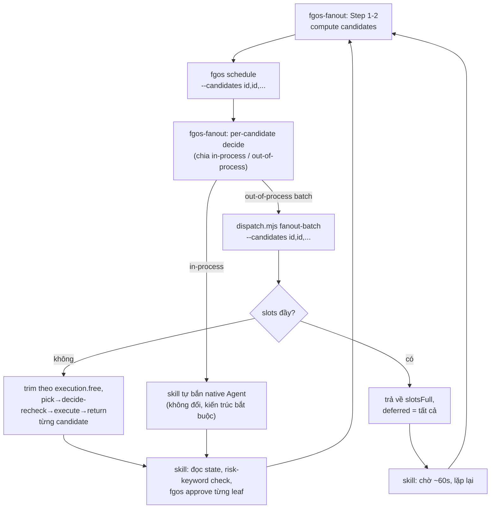

# fanout-execute-consolidation — DISCUSSION

## 1. Trạng thái hiện tại

**Hội tụ.** Người quyết định (2026-08-19): "đủ để làm rồi vì đó là giới
hạn của harness, giải quyết theo cách của em" — uỷ quyền chốt 3 điểm còn
nghiêng + thiết kế cụ thể. D1-D4 đã chốt (D1 giữ ổn định 2 round, D2-D4
chốt theo uỷ quyền round 4). §6/§7 đã viết bản cuối. Sẵn sàng terminal
handoff sang `fgos-coding-exploring`.

## 2. Mục tiêu & đề bài

`fgos-fanout`'s workflow hiện tại spell ra từng bước bash/prose cho agent
tự chạy tuần tự: đọc `fgos list --json`, gọi `computeSchedule` (thật ra
đây là 1 hàm JS pure, không phải verb CLI — nghĩa là hiện tại KHÔNG agent
nào gọi trực tiếp được hàm này qua CLI, phải suy luận lại logic của nó
bằng tay từ mô tả prose), đọc `fgos slots --json`, tự trim batch theo
`execution.free`, rồi với mỗi candidate out-of-process: 3 lệnh riêng
(`fgos pick` → `dispatch.mjs execute --cwd <worktree>` → `fgos return`).
Đây chính là phần "code nhúng trong skill" bị nghi ngờ — không phải bash
đơn lẻ (như hầu hết skill khác), mà là 1 thuật toán nhiều bước với biến
truyền qua các bước, loop, điều kiện.

Mục tiêu của item này: gom phần đó thành verb thật, giữ nguyên phần bắt
buộc ở lại skill vì lý do kiến trúc thật.

**Ràng buộc kiến trúc đã xác nhận (sự thật kỹ thuật, không phải điểm cần
bàn)**: nhánh in-process của Step 3/4 (fire native Agent chạy
`/fgOS:pick <id>`) không thể gom vào `dispatch.mjs`/`fgos` verb — `dispatch.mjs`
tự nhận nó "has no Task/Agent tool to call (a passive CLI/library)". Chỉ
live session mới gọi được Agent tool. Vòng lặp đó ở lại skill vĩnh viễn.

**Bối cảnh bổ sung (không phải quyết định thiết kế)**: nhánh in-process có
1 known hazard (worktree-isolation race khi nhiều Agent chạy song song) —
đây là giới hạn ở tầng **harness Claude Code** (cờ "đang ở worktree nào"
lưu theo session, không theo từng Agent song song), không phải lỗi trong
code `dispatch.mjs` hay `fanout`. Không có code trong repo sửa được hành
vi harness. Item này không chạm, không sửa hazard đó ở bất kỳ phạm vi nào.

## 3. Vấn đề rõ / chưa rõ

Tất cả đã chốt — xem §4.

## 4. Quyết định đã chốt

| D-ID | Tóm tắt | Round chốt |
|---|---|---|
| D1 | Verb mới đặt làm subcommand mới trong `dispatch.mjs` (cạnh `decide`/`execute`/`log`), không tạo verb riêng trong `bin/fgos.mjs`. | Round 2, giữ ổn định qua round 3 → chốt round 3. |
| D2 | Verb mới gom CẢ 2 phần: chain out-of-process (pick→execute→return) VÀ slot-poll/trim-batch — không tách riêng. | Round 3, uỷ quyền xác nhận round 4. |
| D3 | Risk-keyword approve check GIỮ LỘ RA ở skill — verb mới chỉ lo tới `awaiting-approval`, không tự approve, để không ẩn gate an toàn cuối cùng trong 1 verb black-box. | Round 3, uỷ quyền xác nhận round 4. |
| D4 | Mở rộng `fgos schedule` verb có sẵn thêm `--candidates <id,id,...>` optional filter — không tạo verb schedule riêng cho fanout. | Round 3, uỷ quyền xác nhận round 4. |
| D5 | Known hazard worktree-isolation race: ghi 1 dòng tường minh trong `CONTEXT.md` (ở bước `fgos-coding-exploring`) rằng item này không chạm/không sửa hazard đó — tránh hiểu nhầm "tiện thể fix luôn". | Round 3, uỷ quyền. Hành động thực hiện tại stage exploring, không phải ở đây. |

## 5. Q&A log

- **2026-08-19 (round 1, kickoff)** — Item tạo từ audit dispatch-execute
  optimization pass cùng ngày và quan sát của user: "code ở skill nhiều
  quá có tốt không... dispatch xử được không". Scout `fgos-fanout/SKILL.md`
  + `references/wave-dispatch-mechanics.md` (nguồn duy nhất trong 14
  dev-skill có loop/điều kiện đa bước thật) + xác nhận `computeSchedule`/
  `hasWorkerSlotRoom`/`countWorkerSlots` là hàm JS pure có sẵn + `fgos
  schedule` verb có sẵn nhưng chỉ bản KHÔNG scoped. Đặt 5 câu hỏi.
- **2026-08-19 (round 2)** — Trả lời câu 2 (verb theo `dispatch`). Giải
  thích lại câu 1/3/4/5 bằng ví dụ cụ thể.
- **2026-08-19 (round 3)** — Trả lời câu 1 (gom cả 2 phần), câu 3 (giữ lộ
  ra skill), câu 5 (mở rộng `fgos schedule`), uỷ quyền câu 4. Hỏi thêm
  nhánh in-process lỗi gì — trả lời: lỗi harness, không phải dispatch/
  fanout. D1 mint.
- **2026-08-19 (round 4, hội tụ)** — "đủ để làm rồi vì đó là giới hạn của
  harness, giải quyết theo cách của em." D2/D3/D4/D5 mint theo uỷ quyền.
  §6/§7 viết bản cuối. Terminal handoff.

## 6. Thiết kế đã chốt {#design}

**`fgos schedule` mở rộng (D4)**: thêm flag optional `--candidates
<id,id,...>`. Khi có, `bin/fgos.mjs`'s `schedule` case truyền
candidateIds xuống `store.mjs`'s `computedSchedule(dir, candidateIds)` →
`computeSchedule(view, candidateIds)` thay vì tính cả frontier. Không có
cờ → hành vi y hệt hôm nay (mọi caller cũ không đổi).

**`dispatch.mjs fanout-batch` — subcommand mới (D1 + D2)**: nhận 1 danh
sách candidate id đã qua bước schedule ở trên (`--candidates <id,...>`),
tự làm:
1. Đọc `fgos slots --json` **một lần**. Nếu `hasRoom: false` → trả về
   ngay `{fired: [], deferred: <toàn bộ candidate>, slotsFull: true}`,
   KHÔNG tự chờ/tự poll lại bên trong verb — việc chờ-rồi-thử-lại giữa
   nhiều lần gọi verb là việc của vòng lặp ngoài (skill), verb chỉ trả
   lời true/false cho 1 lần hỏi, giữ verb nhỏ/nhanh/dễ test, không block
   process gọi nó cả chục phút.
2. Trim candidate xuống `execution.free` khi là số thật (giữ nguyên logic
   `min(batch.length, execution.free)`; `null` = không trim).
3. Với từng candidate đã trim, tuần tự: gọi lại `decide --work <id>
   --has-live-task-access` (đề phòng race giữa lúc skill hỏi lần đầu và
   lúc verb này chạy thật — mechanism có thể đã đổi) → nếu vẫn
   `out-of-process`: `fgos pick <id>` → `dispatch.mjs execute
   <executorId> --cwd <worktreePath>` → thành công thì `fgos return
   <id>`. Nếu mechanism đã đổi hoặc `unavailable`: không claim, xếp vào
   `mechanismChanged`/`unavailable`.
4. Trả về JSON: `{fired: [{id, status, ...}], mechanismChanged: [...],
   unavailable: [...], deferred: [...candidate bị trim, chưa chạm]}`.

**Approve vẫn ở skill (D3)**: sau khi verb trên trả về, `fgos-fanout` tự
đọc lại state (`fgos list --json`), tự chạy risk-keyword check +
`fgos approve` cho từng leaf đạt `awaiting-approval` — y hệt hành vi hôm
nay, chỉ khác là không còn tự tay lo claim/execute/return/slot-poll/trim
nữa.

**Vòng lặp ngoài (skill, không đổi bản chất)**: `fgos-fanout`'s Step 6
("go back to Step 1") vẫn giữ nguyên — khi `fanout-batch` trả về
`slotsFull: true` hoặc còn `deferred`, skill tự chờ ~60s rồi gọi lại
đúng như hôm nay, chỉ khác là 1 lệnh thay vì tự tay làm 5+ bước.

**Nhánh in-process, hazard**: không đổi (§2).

## 7. Danh mục hạng mục / task {#tasks}

### {#task-fanout-execute-consolidation}

**Goal**: gom nhánh out-of-process của `fgos-fanout` (schedule scoped +
slot-poll/trim + pick/execute/return) vào 2 verb thật (`fgos schedule
--candidates`, `dispatch.mjs fanout-batch`), viết lại
`wave-dispatch-mechanics.md` để agent chỉ cần gọi 2 lệnh thay vì tự tay
làm ~15 bước bash. Risk-keyword approve + nhánh in-process không đổi.

**§6 excerpt áp dụng**: toàn bộ §6 ở trên — cả 2 verb mới, cả phần "vẫn ở
skill".

**D-ID áp dụng**: D1, D2, D3, D4, D5.

**Quan hệ với item khác**: không có sibling — 1 khối thay đổi liền mạch,
không tách nhỏ hơn (đổi `fgos schedule` và thêm `fanout-batch` phải đi
cùng nhau để `wave-dispatch-mechanics.md` viết lại 1 lần, không viết 2
lần cho 2 nửa việc).

**Draft verify**: `npm test` xanh (đặc biệt `test/cli/fgos-schedule*`,
`test/runner/dispatch.test.mjs` mới thêm cho `fanout-batch`) + 1 test
CLI thật gọi `dispatch.mjs fanout-batch` với executor giả (echo script,
theo đúng pattern `writeEchoExecutor` đã có trong `dispatch.test.mjs`)
xác nhận trả JSON đúng shape ở cả 2 nhánh (`slotsFull`, và fire thành
công).
