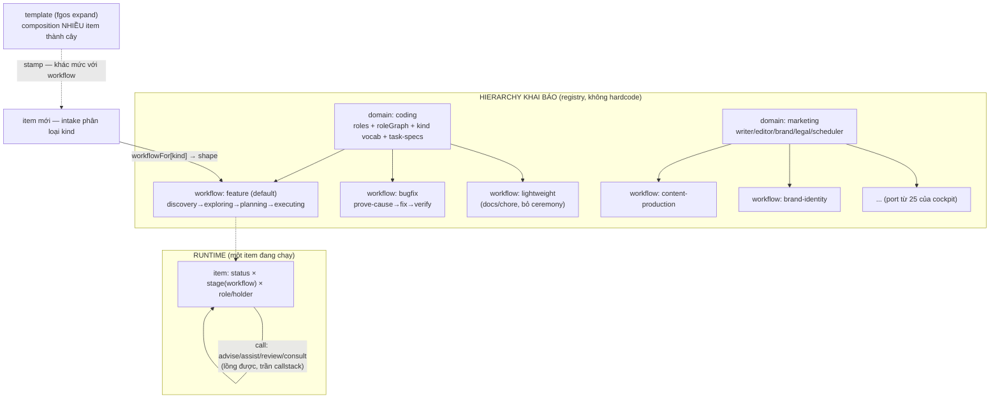

# fgOS × marketing-cockpit — foundation absorption discussion

## 1. Trạng thái hiện tại

Vòng 8: **HỘI TỤ.** Người dùng đồng ý D8 (seq 18070) — mọi câu hỏi thiết
kế của phần coding-harness đã đóng, nền chốt là **D1–D8** (§4). Chỉ còn
treo có chủ đích: #7 (judge-gate vs L5 — quyết khi tới lượt marketing)
và #15 (team overlay trên domain — YAGNI). §6 ổn định, §7 thật. Theo
terminal-handoff của skill shaping: `refs` của tsk-2t9c đã trỏ vào
`{#task-role-axis-coding}`, bước tiếp theo là native-first dispatch sang
`fgos-coding-exploring` → `fgos-coding-planning` cho task đó.

## 2. Mục tiêu & đề bài

fgOS hiện có engine điều phối work-item đã chứng minh cho một domain
("coding") nhưng được thiết kế multi-domain ngay từ đầu — có sẵn registry
`DOMAINS` và một fixture domain tên `fixture-marketing` (proof-of-concept,
chưa phải thật). Mục tiêu sản phẩm (đã chốt ở cấp chủ dự án, không tranh
luận lại): gom foundation của marketing-cockpit — một hệ thống AI marketing-ops
trưởng thành hơn (39 skills, 25 workflows, brand/content/campaign automation)
— vào fgOS, rồi triển khai lại một domain "marketing" thật sự trên engine của
fgOS, thay vì để hai hệ thống song song hoặc fgOS tự phát minh lại từ đầu.
Discussion này tồn tại để trả lời: cơ chế nào của cockpit đáng học/absorb,
cơ chế nào fgOS đã có tốt hơn hoặc khác đi mà không cần cockpit, và hình hài
cụ thể của domain "marketing" trên fgOS sẽ trông như thế nào.

## 3. Vấn đề rõ / chưa rõ

| # | Điểm | Trạng thái | Ghi chú |
|---|------|-----------|---------|
| 1 | fgOS đã multi-domain-capable ở mức code (DOMAINS registry, không hardcode) | Rõ | Xác nhận bằng scout — thêm domain mới chỉ cần 1 entry trong `workflow-stage-graphs.mjs`, domain lạ fold về `coding` với warning |
| 2 | marketing-cockpit có cơ chế signal/pub-sub cross-workflow mà fgOS chưa có tương đương | Rõ | fgOS chỉ có event log append-only tuyến tính (`.fgos/events.jsonl`), không có typed signal catalog/emitter-consumer |
| 3 | `fgOS-design/` trong cockpit có liên quan đến orchestration không | Rõ — không | Đó là UI/UX handoff package cho một desktop app riêng (Wails), không phải orchestration logic |
| 4 | cockpit's checkpoint/resume (per-stage, context_snapshot) có hạt mịn hơn stage FSM của fgOS không | Rõ | fgOS chỉ resume ở mức item-stage; cockpit resume ở mức stage-trong-workflow với context_snapshot riêng |
| 5 | fgOS nên port nguyên cơ chế signal/routing/priority 3-file của cockpit, hay chỉ port khái niệm và biểu diễn lại qua DOMAINS registry + event log? | Rõ (đề xuất của fable) | Routing/delegation/priority 3-file → gộp về 1 DOMAINS entry (fgOS thắng, prose-enforced protocol là liability). Signal → biểu diễn lại như event có typed payload trong `.fgos/events.jsonl` + projection theo consumer cursor, KHÔNG tạo store thứ hai — chỉ phần "frontier trở nên ready khi có signal khớp, kể cả cho item chưa tồn tại" là engine work thật (deps không biểu diễn được fan-out tới item chưa sinh ra) |
| 6 | Domain "marketing" thật trên fgOS cần engine mới (capability thật) ở đâu, và đâu chỉ là cấu hình (thêm DOMAINS entry)? | Rõ (đề xuất của fable) | Cấu hình thuần: DOMAINS entry (stages/skillMap/statusLabels/parkReason/worktreeBacked), gate-rigor table. Engine thật: (a) signal event + consumer projection + frontier signal-readiness, (b) `fgos expand <template>` verb (workflow-template → item-tree stamper), (c) `fgos gate` judge-runner nhỏ, (d) không có scheduler — đề xuất cron ngoài gọi `fgos add` trước, chỉ xây trigger primitive nếu cron chứng minh không đủ |
| 7 | Judge-gate (LLM-graded rubric cho brand voice/legal/factual) có được tính là "proof" hợp lệ theo luật L5 DoD (platform-foundations.md, "reproducibly verifiable result") không? | Chưa rõ — cần người quyết | Đây là rủi ro sắc nhất fable nêu: nếu không chấp nhận, mọi item marketing rơi về `awaiting-human`, frontier nghẽn ở người, "release con người" (ưu tiên #2) sụp đổ đúng domain vừa thêm, và compound-learn loop mất tín hiệu hữu ích. Cần quyết định tường minh trước khi làm, không phải phát hiện ở item thứ 30 |
| 8 | Ping-pong đa role (review/cải thiện qua lại nhiều vòng, nhiều agent-type) biểu diễn bằng gì: trục thứ ba `role/holder` + verb `handoff` có guard, hay child-item mỗi vòng, hay loop qua status FSM? | Rõ dần — trục role, người dùng xây tiếp trên đề xuất qua vòng 4 không sửa | Chưa mint D-ID — chờ giữ ổn thêm vòng nữa theo luật D4. Vòng 4 tinh chỉnh thêm: handoff tách 2 loại — **call** (round-trip, bóng về người gửi; 4 reason: advise/assist/review/consult — đúng 4 lý do người dùng nêu) và **pass** (chuyển giao theo stage, không quay lại). Tiền lệ engine: ask/answer đã là call-to-human |
| 9 | Trục role bật cho domain nào trước? | Rõ — người dùng quyết: **coding trước**, ổn rồi mới marketing | Vòng 4. Đảo đề xuất marketing-first của em — quyết định của người dùng, và có lý riêng: coding đã có đủ 4 tương tác call ở dạng ngầm (fgos-researching/code-review/subagent/ask-answer), dogfood hằng ngày cho feedback nhanh nhất; marketing vào sau trên harness đã được chứng minh |
| 10 | "Team soul" bên trên harness — định nghĩa cụ thể? | Rõ — người dùng trả lời: **cả hai** | Soul = agent-type hiểu vai trò mình + hiểu vấn đề + biết cần ai support → tự đẩy việc linh hoạt (advise / tay chân / phản biện / chuyên môn). Harness = an toàn, điều phối cứng theo luật/gate (vd chỗ không được quay lại). Đích: uyển chuyển hơn nhưng ổn định hơn |
| 11 | Call trong-session (subagent, đồng bộ, vài giây) có ghi thành handoff event như call liên-session (park chờ role khác, bất đồng bộ) không, hay chỉ ghi loại async? | Rõ — **D8** (đồng ý v8) | Async call (park chờ role khác) = handoff event đầy đủ, holder đổi, checkpoint đầy đủ — bắt buộc, vì frontier/routing phụ thuộc. Sync call trong-session (subagent) = KHÔNG đổi holder (bóng chưa rời session, session vẫn chịu trách nhiệm), ghi MỘT event `call-summary` gọn lúc hoàn thành (reason, callee role, outcome ref) — không cặp start/end. Lý do: trục holder tồn tại để trả lời "ai phải hành động tiếp" qua ranh giới scheduling — subagent sync không đổi câu trả lời đó nên không phải handoff thật; nhưng "implementer đã consult researcher" là tín hiệu compound-learn quý → một event tóm tắt đủ tín hiệu học mà không nhiễu state machine. Guard invariant sạch: holder chỉ đổi qua async handoff |
| 12 | Call lồng nhau — cho phép không, guard kiểu gì? | Rõ — người dùng quyết vòng 5: **cho phép lồng, giới hạn trần callstack** | Trần cụ thể (con số, per-domain hay global) chưa chốt — để planning quyết, không phải điểm sản phẩm |
| 13 | Danh sách one-way gate cho coding | Rõ — **D5** (đồng ý v7) | Nguyên tắc: gate hard một-chiều ⟺ side effect đã vượt ranh giới item/worktree (merge vào main, publish ra ngoài, terminal done/wontfix, cleanup đã xoá worktree). Mọi gate nội bộ item = soft: quay lại được nhưng bắt buộc ghi reason vào event log |
| 14 | Task-spec (contract, WHAT) tách khỏi skill (know-how, HOW) triển khai thế nào? | Rõ — **D6** (đồng ý v7) | Người dùng vòng 5 nêu task của cockpit "rất hay", fgOS đang gói contract lẫn know-how trong skill. A-lite: file task-spec khai báo riêng per-domain (như cockpit `.fgOS/tasks/`), skillMap trỏ stage → (task-spec, skill); ban đầu chỉ là read-first material qua refs, CHƯA có engine enforcement (đúng advise YAGNI của fable). Lý do chọn A thay vì nhét vào frontmatter SKILL.md hay giữ nguyên: (1) 30 task-spec của cockpit port gần verbatim khi tới marketing; (2) một contract chạy được bởi nhiều skill/role khác nhau; (3) soul nâng cấp know-how không đụng contract |
| 15 | Key khai báo flow-shape là `domain` hay `team`? | Chưa rõ — YAGNI nghiêng domain-as-team-flow | Người dùng vòng 5: "mỗi team có thể có đặc thù cơ học flow riêng". Hiện registry key là domain; nếu sau này 2 team cùng domain cần shape khác nhau mới cần overlay theo team — chưa xây trước |
| 16 | Ranh giới dispatch vs router/driver vs guard | Rõ — người dùng xác nhận vòng 5 | Dispatch (`src/runner/dispatch.mjs` decide/execute) = chọn executor chạy task. Router/driver (fgos-routing, fgos-coding-driving) = who/what-next. Guard (FSM + roleGraph + gate) = legality. Ba tầng không giẫm nhau |
| 17 | Mỗi domain có NHIỀU workflow (marketing rất nhiều; coding đang gộp 1 mà đúng ra là nhiều) — biểu diễn thế nào? | Rõ — **D7** (đồng ý v7) | Thêm một mức vào hierarchy khai báo: domain → N workflow (mỗi workflow = stage graph + gates + roleGraph riêng) → item. Selector: TÁI DÙNG `kind` (đã là classification per-domain: coding = bug/chore/design/docs/feature/task, intake đã phân loại sẵn) + map `workflowFor: {kind → workflowName}` có default trong DOMAINS — item KHÔNG cần field mới, không phân loại hai lần. Bằng chứng coding đang gồng vì gộp 1: discovery-verdict skip (clear → nhảy cọc exploring) là nhánh vá lên một graph duy nhất; luật "bug phải prove cause trước khi sửa" (primary-workflow) khác bản chất feature nhưng đang chung tên stage; docs/chore bị ép qua ceremony discovery→planning thừa. Phân biệt quan trọng: workflow (shape MỘT item) ≠ template (composition NHIỀU item, `fgos expand`) — 25 workflow của cockpit khi port sẽ được phân về một trong hai, tuỳ cái |

## 4. Quyết định đã chốt

| D-ID | Nội dung | Chốt vòng | Event seq |
|------|----------|-----------|-----------|
| D1 | Work item có trục thứ ba `role/holder`; verb `handoff` bị guard bởi roleGraph khai báo per-domain trong DOMAINS; route ngoài graph bị REFUSED kèm danh sách edge hợp lệ | Đề xuất v3, giữ v4–v5, mint v5 | 18029 |
| D2 | Trình tự coding-first: nâng 4 tương tác ngầm sẵn có của coding (researching/review/fanout/ask-answer) thành handoff hữu hình trước; marketing vào sau trên harness đã chứng minh | Người dùng quyết v4, giữ v5, mint v5 | 18030 |
| D3 | Tách mechanism/policy: harness gác legality + ghi sự thật + đánh thức đúng vai, không phán đoán; soul = agent-type hiểu vai trò/vấn đề/cần ai support, tự chọn edge hợp lệ | Người dùng chốt v4, giữ v5, mint v5 | 18031 |
| D4 | Handoff hai loại: call (round-trip, 4 reason advise/assist/review/consult, tổng quát hoá ask/answer) và pass (một chiều theo stage); cùng item → handoff, khác item/cây → signal | Đề xuất v4 từ 4 lý do người dùng nêu, xây tiếp v5, mint v5 | 18032 |
| D5 | One-way gate theo nguyên tắc hard/soft: hard ⟺ side effect vượt ranh giới item/worktree; nội bộ item = soft, cross-back bắt buộc ghi reason | Em advise v5 theo uỷ quyền, giữ v6, người dùng đồng ý v7 | 18058 |
| D6 | Task-spec A-lite: tách contract (task-spec, file per-domain) khỏi know-how (skill); skillMap trỏ (task-spec, skill); chưa engine enforcement | Recommend v5, giữ v6, đồng ý v7 | 18059 |
| D7 | Hierarchy domain → N workflow → item; selector tái dùng `kind` + `workflowFor` map có default; coding un-gộp thành feature (default) / bugfix / lightweight; workflow (shape 1 item) ≠ template (composition nhiều item) | Người dùng nêu v6, đồng ý v7 | 18060 |
| D8 | Async call = handoff event đầy đủ (holder đổi); sync call trong-session = một event `call-summary` gọn, KHÔNG đổi holder. Guard invariant: holder chỉ đổi qua async handoff | Em advise v7, người dùng đồng ý v8 | 18070 |

## 5. Q&A log

- **2026-08-15 — Scout round 1 (fgOS)**: agent `scout-fgos-orchestration`
  (haiku) đọc `src/state/work.mjs`, `workflow-stage-graphs.mjs`,
  `status-fsm.mjs`/`stage-fsm.mjs`, `src/runner/loop.mjs`/`dispatch.mjs`,
  `src/state/frontier.mjs`, `.claude/skills/fgos-routing/SKILL.md`,
  `docs/specs/work-state.md`, `docs/specs/runner.md`,
  `docs/routing-handoff-contract.md`. Kết luận chính: work item phẳng với
  hai FSM trực giao (status universal, stage per-domain qua DOMAINS
  registry); không có entity "workflow" riêng — thay vào đó là cây
  parent/children + DAG deps + frontier; event log append-only là nguồn sự
  thật (không có signal/pub-sub); routing qua DOMAINS registry +
  `fgos-routing` skill; domain abstraction đã đầy đủ, thêm domain mới chỉ
  cần 1 entry registry.

- **2026-08-15 — Scout round 1 (marketing-cockpit)**: agent
  `scout-cockpit-orchestration` (haiku) đọc README/AGENTS.md/CLAUDE.md,
  `fgOS-design/` (folder trùng tên tình cờ, hoá ra là UI/UX handoff, không
  liên quan orchestration), `.fgOS/FRAMEWORK.md`, `.fgOS/workflows/`,
  `.fgOS/orchestration/{routing,delegation,priority}.yaml`,
  `.fgOS/runtime/config/domain-signal-catalog.yaml`, `.fgOS/tasks/`,
  `.fgOS/runtime/state.yaml`, `.workspace/runs/{run_id}/run.yaml`. Kết luận
  chính: task = atomic unit (yaml schema), workflow = container of stages
  (mỗi stage dispatch 1 task), run = execution instance (run.yaml là single
  source of truth); FSM per-run (pending/in_progress/paused/completed/
  failed/cancelled); hai loại quality gate (approval gate + inline quality
  gate với 5 loại rigor); signal = cơ chế coupling cross-workflow duy nhất,
  file-based pub/sub với catalog domain-organized (emitter/consumer/TTL/typed
  payload); checkpoint/resume ở mức stage với context_snapshot; routing
  per-workflow qua 3 file protocol (routing/delegation/priority), không có
  dispatcher trung tâm; multi-platform qua adapter pattern (`.claude/`,
  `.gemini/`, `.codex/`, `.openai/` đọc core `.fgOS/` và override theo
  platform, kèm `ADAPTER-SPEC.md` contract bắt buộc status vocabulary
  DONE/DONE_WITH_CONCERNS/BLOCKED/NEEDS_CONTEXT — trùng khớp với vocabulary
  status protocol nội bộ mà orchestration-protocol.md của user cũng dùng).

- **2026-08-15 — Fable comparison round**: agent `fable-compare` (model
  claude-fable-5, subagent `brainstormer`) phản biện 2 scout report, so
  sánh theo 7 trục (unit-of-work, stage FSM, workflow composition,
  signal/event, routing, adapter, checkpoint/resume, quality gates).
  Verdict rút gọn: fgOS thắng ở stage FSM (status×stage trực giao) và
  routing (1 DOMAINS entry engine-enforced > 3 file YAML prose-enforced);
  cockpit thắng ở workflow composition (named reusable process),
  checkpoint/resume hạt mịn hơn, và quality gates (5 loại judge-gate có
  rigor mapping, fgOS chỉ có 1 verify command + human approval); signal/
  event là khoảng trống thật của fgOS (event log là ledger, không phải
  bus). Đề xuất: port signal như event có typed payload (không tạo store
  thứ hai), port workflow như "template stamp ra item-tree" (không tạo
  entity workflow runtime mới), port gate-type như skill sau một
  `fgos gate` CLI mỏng. Cockpit nên bỏ: `run.yaml` (source-of-truth kép),
  run FSM riêng, 3-file routing protocol, phần lớn checkpoint machinery
  (đã có free từ event log + worktree commit). Rủi ro sắc nhất: judge-gate
  có tính là "proof" theo luật L5 DoD không — nếu không, domain marketing
  sẽ nghẽn hết ở `awaiting-human`, đánh thẳng vào ưu tiên #2 "release con
  người". Đường đi tối giản day-one: DOMAINS entry + port skill +
  template-stamper + cron-driven `fgos add`, hoãn signal bus tới khi có
  use-case fan-out cụ thể (vd brand-voice invalidation).

- **2026-08-15 15:02 — Người dùng mở rộng đề bài (vòng 3)**: bối cảnh team
  (coding hoặc marketing) có nhiều agent-type (role/title), nhiều loại
  task, các vòng review/cải thiện đẩy việc qua lại nhiều lần — flow không
  được giới hạn tuyến tính; agent đẩy việc qua lại tự do, nhưng FSM/routing
  core phải gác không cho đi sai đường (agent route bậy thì bị chặn). Yêu
  cầu: kết hợp cả bốn — FSM/routing + workflow-composition + checkpoint
  hạt mịn + signal/event bus — thành bộ core harness cứng, cơ học, đẩy
  việc uyển chuyển, làm foundation cho một "team soul" hoàn chỉnh hoạt
  động bên trên (soul hiện tại còn cơ học và tuyến tính). → Phản hồi của
  em (tóm tắt; đầy đủ ở tin nhắn phiên làm việc): đề xuất tách
  "mechanism vs policy" — harness chỉ gác legality + ghi sự thật, soul
  chọn edge; thêm trục thứ ba `role/holder` (trực giao với status × stage)
  + verb `handoff` có guard theo role-graph khai báo per-domain trong
  DOMAINS; ping-pong review = chuỗi handoff event trong CÙNG một item
  (không phải stage mới, không phải item mới); mỗi handoff là một
  checkpoint tự nhiên (context snapshot trong event payload + worktree
  commit); quy tắc phân ranh: cùng item → handoff, khác item/cây → signal.
  Cảnh giác YAGNI: coding hiện chỉ có 1 vòng ping-pong (doing ↔
  awaiting-approval) và đang đủ — role-graph chỉ bật cho domain khai báo
  nó, không retrofit coding ngay. Ba câu hỏi mở đã đặt cho anh: (a) chấp
  nhận trục role/holder là trục thứ ba của work item, hay muốn biểu diễn
  ping-pong cách khác (child-item mỗi vòng / loop qua status); (b) coding
  có nâng cấp ngay không hay marketing dùng trước; (c) "team soul" anh
  hình dung cụ thể là gì — persona/judgment per role như cockpit's
  agents, hay một tầng orchestration thông minh hơn? Chưa chốt gì.

- **2026-08-15 15:49 — Người dùng trả lời vòng 3 (vòng 4)**: (#9) làm
  domain coding trước, ổn rồi mới thêm marketing. (#10) soul là cả hai —
  agent-type trong team hiểu vai trò của nó, hiểu vấn đề công việc của
  nó, biết cần ai support, vì thế flexible đẩy việc khi cần advise, khi
  cần người phụ làm tay chân, khi cần đánh giá phản biện, hoặc khi cần
  hỏi chuyên môn. Harness đóng vai trò an toàn, điều phối cứng theo luật
  theo gate, ví dụ chỗ nào thì không được quay lại. Đích: uyển chuyển
  hơn, không tuyến tính cứng nhắc như hiện tại, nhưng vẫn ổn định hơn.
  → Phản hồi của em: 4 lý do = taxonomy **handoff-call** (round-trip —
  cả 4 đều có tính chất "bóng quay về người gửi"), tách khỏi
  **handoff-pass** (chuyển giao theo stage, một chiều). Tiền lệ engine đã
  có: `fgos ask`/`answer` + `awaiting-human` chính là call-to-human có
  park-và-trả — thiết kế tổng quát hoá nó thành call-to-role. Coding đã
  chứa đủ 4 tương tác này dạng ngầm trong session: `fgos-researching` =
  consult, `code-review` = review, subagent fanout = assist, ask/answer =
  advise → "coding trước" = nâng 4 tương tác có sẵn thành move hữu hình
  có guard, không phát minh tương tác mới. Ghi chú ranh giới: role ≠
  capacity — `src/runner/dispatch.mjs` (decide/execute, một cửa) chọn
  *executor* chạy việc; roleGraph chọn *vai* cầm việc; hai tầng không
  giẫm nhau. Câu hỏi mới nêu: #11 (ghi call sync in-session vào log
  không), #12 (call lồng nhau), #13 (danh sách one-way gate coding).

- **2026-08-15 16:11 — Người dùng trả lời vòng 4 (vòng 5)**: (#12) cho
  phép call lồng nhau, giới hạn trần callstack. (#13) uỷ quyền cho em
  dùng expertise advise thêm. Định hình lại harness: lớp harness (có thể
  tương ứng, không khẳng định liên quan đến routing/driving hiện tại)
  dùng để *xác định một hình dạng cơ học về các giai đoạn của một
  workflow*; mỗi team có thể có đặc thù cơ học riêng về flow của mình.
  Lưu ý (a): khái niệm **task** của marketing-cockpit rất hay — thứ đó
  fgOS hiện đang triển khai như 1 skill. Lưu ý (b): dispatch hiện tại
  của fgOS dùng để xác định và điều phối một *executor* cho 1 task,
  không phải là *who (agent-type nào) nên làm việc gì tiếp theo
  (task/stage)* — phần đó nên là router/driver, giống cách đang dùng.
  → Phản hồi của em: mint D1–D4 (đủ độ ổn theo luật D4 của skill);
  advise nguyên tắc one-way gate hard/soft (hard ⟺ side effect vượt
  ranh giới item/worktree — chi tiết §6); đề xuất A-lite cho task-spec
  (tách contract khỏi know-how, file khai báo riêng per-domain, chưa
  enforcement — chi tiết §3 #14); xác nhận và đặt tên ba tầng
  dispatch / router-driver / guard (§3 #16); ghi nhận nuance team-vs-
  domain làm điểm mở #15 (YAGNI: domain-as-team-flow đủ cho hiện tại).

- **2026-08-15 16:27 — Người dùng lưu ý vòng 6**: mỗi domain có thể có
  nhiều workflow khác nhau — marketing điển hình rất nhiều; thật ra với
  coding, chúng ta đang gộp 1 chứ đúng thì nó là nhiều workflow. → Phản
  hồi của em: xác nhận bằng bằng chứng code rằng graph đơn của coding
  đang gồng (discovery-verdict skip là nhánh vá; bug-prove-cause khác
  bản chất feature nhưng chung stage; docs/chore chịu ceremony thừa).
  Đề xuất: hierarchy khai báo thêm một mức — domain → N workflow → item;
  selector tái dùng `kind` (classification per-domain sẵn có, xác nhận
  trong `workflow-stage-graphs.mjs` dòng 346: coding kind =
  bug/chore/design/docs/feature/task) + map `workflowFor` có default,
  item không cần field mới. Phân biệt tường minh: workflow = shape một
  item; template (`fgos expand`) = composition nhiều item. Trình tự đề
  xuất: role-axis đáp lên graph đơn hiện tại trước (D2 giữ nguyên), rồi
  un-gộp coding thành 2–3 workflow thật (feature / bugfix / spike-hoặc-
  lightweight cho docs-chore). Graph hiện tại trở thành workflow
  `feature` (default) — item cũ không vỡ, giống DEFAULT_DOMAIN fold.
  Chưa mint (điểm mới 1 vòng).

- **2026-08-15 18:51 — Người dùng đồng ý (vòng 7)**: "đồng ý, cập nhật
  chưa" — xác nhận cụm đang chờ từ v5–v6. → Em mint D5 (hard/soft gate,
  seq 18058), D6 (task-spec A-lite, seq 18059), D7
  (workflow-multiplicity + kind-selector, seq 18060); cập nhật
  §3 (#13/#14/#17 → Rõ), §4, §6 (đổi marker đề-xuất thành D-ID). Advise
  nốt #11 theo pattern uỷ quyền: async call = handoff event đầy đủ
  (holder đổi); sync call trong-session = một event `call-summary` gọn
  lúc hoàn thành, KHÔNG đổi holder — chi tiết và lý do ở §3 #11, chờ
  gật là thành D8.

- **2026-08-15 19:01 — Người dùng đồng ý D8 (vòng 8, hội tụ)**: "đồng ý
  D8" → mint D8 (seq 18070). Mọi câu hỏi thiết kế phần coding-harness
  đã đóng; discussion hội tụ, chuyển sang terminal handoff native-first
  (`refs` → `{#task-role-axis-coding}`, dispatch
  `fgos-coding-exploring` → `fgos-coding-planning`).

## 6. Thiết kế đã chốt {#design}

> Synthesis vòng 7. Nền: D1–D7 đã chốt (§4). Chỉ còn #11 (call-summary,
> đã advise chờ gật) và #7/#15 treo có chủ đích. Viết cho người lạ không
> có chat history.

### Bức tranh lớn (D2, D3)

fgOS xây một **core harness cơ học** cho team agent đa role, dùng chung
cho mọi domain — coding triển khai trước, marketing vào sau như khách
hàng absorption đầu tiên. Harness xác định *hình dạng cơ học các giai
đoạn của workflow*; engine không hardcode shape nào.

- **Mechanism (harness)** — cứng, không phán đoán: gác legality của mọi
  move, ghi sự thật vào event log, đánh thức đúng vai kế tiếp.
- **Policy (soul)** — agent-type hiểu vai trò mình, hiểu vấn đề, biết cần
  ai support, tự chọn edge hợp lệ (advise / tay chân / phản biện / chuyên
  môn). Soul thay được, sai được — harness đảm bảo sai không phá.

### Hierarchy khai báo: domain → N workflow → item (D7)

Mỗi domain có NHIỀU workflow — marketing điển hình (25 của cockpit),
coding cũng vậy nhưng đang gộp 1 (nhận định người dùng v6, bằng chứng
code: discovery-verdict skip là nhánh vá lên graph đơn; luật "bug phải
prove cause" khác bản chất feature nhưng đang chung stage; docs/chore
chịu ceremony discovery→planning thừa).

- **domain (team)** — owns: roles + roleGraph vocabulary, task-spec
  catalog, classification (`kind`/`risk`), statusLabels/parkReason.
- **workflow (per domain, nhiều)** — một shape cơ học có tên: stage graph
  + transitions + gates + stepMap. Ví dụ coding: `feature` (graph 4 stage
  hiện tại, làm default), `bugfix` (prove-cause → fix → verify),
  `lightweight` (docs/chore, bỏ ceremony thừa).
- **item (instance)** — chọn workflow qua selector, không cần field mới.

**Selector: tái dùng `kind`.** `kind` đã là classification per-domain
(coding: bug/chore/design/docs/feature/task —
`workflow-stage-graphs.mjs:346`), intake đã phân loại sẵn. DOMAINS thêm
map `workflowFor: {kind → workflowName}` + default; nhiều kind chung
được một workflow. Item cũ không workflow → default của domain (giống
DEFAULT_DOMAIN fold — không vỡ gì).

**Phân biệt hai nghĩa của "workflow"** (tránh lẫn về sau): *workflow* =
shape lifecycle MỘT item (điều mục này nói); *template* (`fgos expand`)
= composition NHIỀU item thành cây. 25 workflow của cockpit khi port sẽ
phân về một trong hai, tuỳ cái — cái nào là chuỗi stage một sản phẩm thì
thành workflow, cái nào là dây chuyền nhiều sản phẩm thì thành template.

### Ba tầng điều phối, không giẫm nhau (v5)

| Tầng | Vai trò | Hiện thân |
|------|---------|-----------|
| Router/Driver | who + what-next | `fgos-routing`, `fgos-coding-driving` |
| Guard/Harness | legality: FSM 3 trục + roleGraph + gates + event log | status-fsm/stage-fsm + phần mới |
| Dispatch | executor nào chạy task đã quyết | `dispatch.mjs` decide/execute (một cửa) |

### Ba trục trực giao của work item (D1)

`status` (lifecycle phổ quát, 11 trạng thái) × `stage` (tiến độ — giờ
thuộc workflow đã chọn, không thuộc thẳng domain) × `role/holder` (ai cầm
bóng, per-domain roleGraph, opt-in).

### Handoff: hai loại, một guard (D1, D4)

- **Call (round-trip)** — 4 reason `advise`/`assist`/`review`/`consult`;
  tổng quát hoá `fgos ask`/`answer`. **Lồng được, trần callstack** (v5;
  con số trần để planning quyết).
- **Pass (transfer)** — một chiều theo stage/status.
- **Guard** — roleGraph edge hợp lệ per stage; route bậy → REFUSED kèm
  danh sách edge hợp lệ.
- **Checkpoint hạt mịn miễn phí** — handoff event mang context snapshot,
  worktree commit mang artifact state.
- **Ghi log hai mức (D8)** — async call (park chờ role khác) = handoff
  event đầy đủ, holder đổi; sync call trong-session (subagent) = một
  event `call-summary` gọn lúc hoàn thành (reason, callee role, outcome
  ref), KHÔNG đổi holder. Invariant: holder chỉ đổi qua async handoff.

### One-way gate: nguyên tắc hard/soft (D5)

**Hard một-chiều ⟺ side effect vượt ranh giới item/worktree.** Nội bộ
item = soft: quay lại được nhưng bắt buộc ghi reason vào log.

- Hard trong coding: approve/merge vào main (CTR005), terminal
  `done`/`wontfix`, `cleanup` đã xoá worktree. Vùng hậu-merge một chiều:
  rework sau merge = item MỚI.
- Soft: executing → planning (replan), reject, mọi handoff-call —
  cross-back mang reason key → rework thành tín hiệu compound-learn.
- Marketing sau này dùng nguyên xi: publish-to-platform = hard, editorial
  approval = soft.

### Task-spec: tách contract khỏi know-how (D6, A-lite)

- **task-spec (WHAT)** — contract: input, output, gate, verify template;
  file khai báo per-domain (mô hình cockpit `.fgOS/tasks/`).
- **skill (HOW)** — know-how; nhiều skill/role chạy được cùng contract.
- **work item (INSTANCE)** — như hiện có.

A-lite: bắt đầu là read-first material qua refs, chưa engine enforcement
(YAGNI). Trả cổ tức khi port 30 task-spec cockpit.

### Ranh giới giữa các cơ chế (D4 + v2)

Cùng item → handoff; khác item/cây → signal (hoãn tới use-case fan-out
thật). Registry key là `domain`; overlay theo team chỉ khi 2 team cùng
domain cần shape khác (#15, chưa xây).

### Trình tự triển khai (D2 + v6)

1. **Role-axis đáp lên graph đơn hiện tại** — nâng 4 tương tác ngầm
   (researching/review/fanout/ask-answer) thành handoff hữu hình.
2. **Un-gộp coding** thành 2–3 workflow thật (feature = default, bugfix,
   lightweight) — chứng minh mức workflow của hierarchy.
3. **Marketing**: DOMAINS entry + port skill/task-spec + template
   (`fgos expand`); judge-gate vs L5 (#7) quyết ở bước này.

## 7. Danh mục hạng mục / task {#tasks} (đề xuất, chưa chốt)

### {#task-role-axis-coding}
- **Mục tiêu**: trục `role/holder` + verb `handoff` (call/pass, guard
  roleGraph, trần callstack) vào engine; roleGraph coding đầu tiên
  (Researcher/Reviewer/Helper/Human-advisor quanh Implementer);
  ask/answer thành case đặc biệt của call; soft-gate cross-back bắt buộc
  reason.
- **D-ID áp dụng**: D1, D3, D4.
- **Quan hệ**: nền cho mọi task sau; còn chờ #11 và trần callstack cụ
  thể (planning quyết). Đáp lên graph đơn hiện tại — KHÔNG chờ
  workflow-multiplicity.
- **Verify nháp**: call review → verdict → bóng về, đủ trong event log;
  handoff ngoài roleGraph bị REFUSED kèm edge hợp lệ; call lồng vượt
  trần bị REFUSED.

### {#task-workflow-multiplicity}
- **Mục tiêu**: hierarchy domain → N workflow: DOMAINS entry coding un-gộp
  thành `feature` (graph hiện tại, default) / `bugfix` / `lightweight`;
  selector `workflowFor: {kind → workflow}`; stage-fsm/frontier/driver
  đọc shape qua workflow đã chọn thay vì thẳng domain.
- **D-ID áp dụng**: D7.
- **Quan hệ**: sau `{#task-role-axis-coding}`; item cũ fold về default —
  không migration.
- **Verify nháp**: item kind=bug đi graph bugfix, kind=feature đi graph
  feature; item không match nào fold về default kèm warning.

### {#task-task-spec-convention}
- **Mục tiêu**: convention task-spec A-lite cho coding (contract file
  per-domain, skillMap trỏ (task-spec, skill); chưa enforcement).
- **Quan hệ**: độc lập, chạy song song được.
- **Verify nháp**: một stage-skill coding đọc task-spec từ refs; verify
  item khớp verify-template của spec.

### {#task-marketing-domain-registry}
- **Mục tiêu**: entry `marketing` thật (thay `fixture-marketing`): bộ
  workflow marketing đầu tiên + roleGraph
  (writer/editor/brand/legal/scheduler), `worktreeBacked: true`.
- **D-ID áp dụng**: D1, D2.
- **Quan hệ**: sau role-axis + workflow-multiplicity ổn.
- **Verify nháp**: item marketing đi hết workflow đã chọn, ping-pong
  writer↔editor qua call, không fold về coding.

### {#task-marketing-skill-port}
- **Mục tiêu**: port tập con skill + task-spec cockpit đủ chạy 1 workflow
  mẫu (content-creation) end-to-end.
- **Quan hệ**: phụ thuộc marketing-domain-registry + task-spec-convention.
- **Verify nháp**: artifact thật trong worktree, verify pass.

### {#task-expand-template-verb}
- **Mục tiêu**: `fgos expand <template>` — stamp cây item; các workflow
  đa-sản-phẩm của cockpit thành decomposition recipe.
- **Quan hệ**: cần cho marketing thật; độc lập role-axis.
- **Verify nháp**: `fgos expand editorial-calendar --slots 3` sinh 1
  parent + 3 children deps đúng.

### {#task-gate-runner} — BLOCKED bởi #7 (§3)
- **Mục tiêu**: `fgos gate` judge-runner như skill, kết quả vào event
  log. Quyết judge-proof vs L5 DoD trước, tới lượt marketing mới cần.

### {#task-signal-bus} — hoãn
- **Mục tiêu**: verb `signal` + projection + frontier signal-readiness.
  Hoãn tới use-case fan-out thật (YAGNI).
