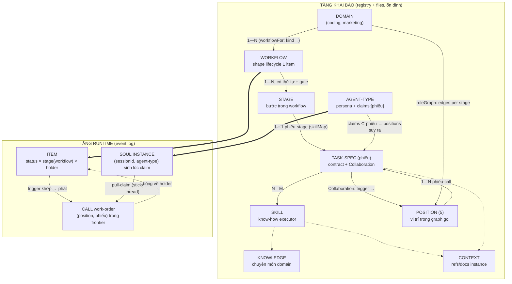

# fgOS × marketing-cockpit — foundation absorption discussion

## 1. Trạng thái hiện tại

**Cập nhật 2026-08-16 (round 6) — D18: TEST THẬT LẦN 1 HỎNG (thí nghiệm
rỗng), LẦN 2 BẮT ĐƯỢC BUG THẬT, ĐÃ FIX.** Người dùng: "muốn" (chạy item
thật qua đúng skill flow, không gọi hàm hộ). Tạo `tsk-ogx` thật, bung 1
agent mới hoàn toàn (isolation: worktree) tự claim và chạy qua
`fgos-routing` → discovering → planning → validating → implement — thành
công thật, `awaiting-approval`, verify 100/100 xanh. Nhưng grep event log
thấy **0 event `work.handoff`** — nghi ngờ D14's review handoff không
chạy. Bung Opus chẩn đoán: phát hiện agent chạy trên `main`, không phải
`fgw/tsk-2t9c` — **thí nghiệm rỗng** (main không có verb `handoff` — verify
lại bằng `git show main:bin/fgos.mjs`, đúng 0 kết quả). Lỗi thiết kế thí
nghiệm của em: bung agent isolation:worktree mà quên ghim branch.

Người dùng chọn: sửa engine + chạy lại đúng. Dù thí nghiệm lần 1 rỗng,
phần chẩn đoán prose của Opus (đọc thẳng `fgos-coding-implement` trên
`fgw/tsk-2t9c`) vẫn đúng độc lập: bước Return ra lệnh rõ ràng nhưng nằm
cuối, lặp lại 2 lần (return/catchup), không gì kiểm tra khi bị bỏ sót.
Áp dụng fix (b) của Opus: `moveWork` tự bắn `handoff --to reviewer
--reason review` khi đạt `awaiting-approval` (D18), y hệt pattern D16 đã
làm cho `delivered`. Sửa luôn prose thành mô tả thay vì ra lệnh, sửa mâu
thuẫn ở `## Next`, và vá lỗ hổng phụ agent driver tự phát hiện (`fgos
take` không có đường về `return`, thông báo lỗi giờ nêu thẳng `fgos
session start`). 1 test cũ (`loop.test.mjs`) cần cập nhật danh sách event
kỳ vọng (thêm `work.handoff:reviewer` — đúng, không phải regression).
`npm test`: 7 lỗi còn lại trong `dispatch.test.mjs` xác nhận không liên
quan (drift `.fgos/config.json`'s `agy` capacity, không đụng gì tới
handoff). **Sắp chạy lại agent driver lần 2, lần này ghim đúng
`fgw/tsk-2t9c`, để có bằng chứng thật.**

**Cập nhật 2026-08-16 (round 5) — D17: FIX GỌN GÀNG HƠN CHO WORKFLOW/KIND.**
Sau D16, người dùng hỏi tiếp: "fgos-coding-driving có nên là cross/inter-
workflow router cho 1 domain không, hay bug/chore lại cần driving riêng".
Bung 1 agent Opus độc lập đọc code thật, trả lời: KHÔNG cần driving riêng
(mọi điều kiện dừng của loop nằm trên trục status dùng chung, workflow chỉ
đổi stage graph) — nhưng phát hiện lỗ hổng khác nặng hơn: `resolveWorkflow`
chưa có nơi nào gọi thật (0 production callers), và `kind` (thứ chọn
workflow) nằm trong `EDITABLE_FIELDS`, sửa tự do không kiểm tra — sửa
`kind` giữa chừng có thể âm thầm đổi cả stage graph của item.

Em đề xuất "thêm field `work.workflow` ghim 1 lần + verb đổi có kiểm
tra" — người dùng bác thẳng: verb "đổi có kiểm tra" chỉ là mở lại đúng lỗ
hổng dưới vỏ bọc an toàn ("em đang để ra một vấn đề về security mà lại đi
mở đường cho hưu chạy"). Người dùng tự đề xuất fix đúng: khoá `kind`
ngay khi `status` rời `todo`, không cần field `workflow` riêng.

Verify trước khi làm: `fgos-coding-driving`'s hard rule xác nhận claim
(`todo`→`doing`) chỉ xảy ra ngay trước lần gọi đầu tiên vào skill
`executing` — nghĩa là discovery/exploring/planning LUÔN chạy khi
`status` còn `todo`. Grep ra đúng 3 chỗ ghi `kind`: `submit` (tạo),
`discover` (phán lại có bằng chứng — LUÔN chạy lúc còn `todo`), `edit`
(tự do, không kiểm soát — đây mới là lỗ hổng thật). Vậy khoá `kind` ở
`editWork` khi `status !== 'todo'` không hề chặn nhánh `discover` hợp lệ.

Đã sửa: `store.mjs`'s `editWork` (guard mới), `workflow-stage-graphs.mjs`
(sửa lại doc comment của `resolveWorkflow` — không còn nói sai "đọc
`domain.stages` thẳng luôn an toàn", giờ giải thích đúng là nhờ kind-lock
chứ không phải trùng hợp). 4 test mới, `npm test`: 3379 pass/5 skip/0
fail (tăng từ 3375). **Chưa commit.**

**Cập nhật 2026-08-16 (round 4) — D16: REVIEW ĐỘC LẬP + FIX HẾT BUG.**
Người dùng: "Get an independent review of the D14+D15 batch". Bung một
`code-reviewer` agent hoàn toàn mới (không chia sẻ context, để review
thật độc lập) chạy trên `git diff 91c677b6~1..9fb5ce9d`. Kết quả: 2 HIGH,
3 MED, 4 LOW, 1 INFO. Tự verify 2 finding HIGH trước khi tin (đọc thẳng
file, grep `recordCallReturn`'s call site) — cả hai đều thật.

Người dùng quyết: fix hết. Câu #2 (holder treo vĩnh viễn trên item
delivered) chọn sửa engine thật. Câu #3 (nên dồn reclaim vào đâu) — người
dùng nêu rõ vision: `fgos-routing` sẽ lo cross/inter-domain routing,
`fgos-coding-driving` sẽ là vòng lặp điều phối trong-luồng đưa item tới
đích — concept này có TRƯỚC cả workflow/task-spec, và giờ không chỉ
multi-domain mà mỗi domain còn multi-workflow, output workflow A còn có
thể thành input workflow B. Em tra lại thấy `fgos-coding-driving`'s
SKILL.md đã có sẵn 1 quyết định D12 xác nhận đúng hướng này: thân skill
cố ý viết THUẦN CƠ CHẾ, không lẫn coding-specific, chỉ CÁI TÊN giữ
coding-specific vì sợ bị lạm dụng generalize sớm cho domain chưa tồn tại.
Đồng thời phát hiện thêm: dồn vào `fgos-routing` sẽ KHÔNG fix được #1,
vì `fgos-coding-driving` không hề gọi lại `fgos-routing` như một skill
mỗi vòng lặp — nó tự đọc thẳng cùng bảng registry, theo đúng comment D12
"a driver, not a router". Sửa thẳng vào `fgos-coding-driving` mới đúng
chỗ.

Đã fix toàn bộ 10 finding (chi tiết seq 18382, D16 trong CONTEXT.md):
2 HIGH (driving-loop reclaim tổng quát theo registry + `moveWork` tự đóng
call thread khi `delivered`), 3 MED (exploring same-session reclaim,
reclaim lặp tới khi về `implementer`, task-spec `implement-item.md` sửa
trigger sai), 1 MED-LOW (`roleGraph.edges.decompose` alias `planning`,
cùng reference), 4 LOW (thống nhất cách diễn đạt 5 skill). Tiện thể sửa
luôn 2 lỗ hổng citation phát hiện được lúc anh hỏi "task-specs có được
dùng không" (`judge-ambiguity.md`/`compound-learn.md` đăng ký
`taskSpecMap` nhưng chưa từng được skill trích dẫn) và 1 lỗi số liệu nhỏ
trong `write-a-task-spec.md` ("sáu" → "năm" task-spec sở hữu stage).
Đồng bộ + build:skills + mirror test (13/13) + full `npm test`: 3375
pass/5 skip/0 fail (tăng từ 3369, +6 test mới). **Chưa commit.**

**Cập nhật 2026-08-16 (round 3) — D15: 4 SKILL CÒN LẠI ĐÃ NỐI DÂY THẬT.**
Người dùng: "Wire the other skills too". Đã nối `fgos-coding-discovering`/
`exploring`/`planning`/`validating` vào `handoff`/`handoff-return` cùng
mức độ nghiêm ngặt như D14 (seq 18381). Hai lỗ hổng thật phát hiện được
KHI nối dây, không phải lúc review thiết kế: (1) `roleGraph` không có
cạnh nào ở stage `discovery` — giả định sai "machine-only = không tương
tác gì", trong khi discovery thật sự gọi `fgos-researching` (consult
thật); đã thêm cạnh, và sửa `judge-ambiguity.md` từng ghi nhầm một dòng
`advise` ở đây. (2) `shape-plan.md` và `validate-plan.md` đều ghi nhầm
dòng `advise (async)` cho trigger thật ra giải quyết ngay trong phiên,
không park: gap của `CONTEXT.md` ở planning chỉ là hand-back (dispatch)
sang exploring — chính exploring mới quyết định có park thật hay không;
Gate của validating không hề có `fgos ask` ở đâu cả, chỉ giải quyết ngay
qua `gate-approve --actor human` — cả hai bảng đã sửa lại. Cũng phân
biệt rõ capacity-dispatch (đổi executor, cùng một việc) với consult-qua-
`fgos-researching` (gọi một skill khác hẳn) sau khi suýt lẫn lộn hai cái
lúc nối exploring. Đồng bộ cả 4 nguồn `.agents/skills/` →
`plugins/fgOS/skills/` (byte-identical) → `.claude/skills/` wrapper
(build:skills, 0 diff); `test/skills/fgos-mirror.test.mjs` 13/13,
`npm test` không đổi baseline (3369/5/0, tăng so với 3367 do 2 test mới
cho cạnh discovery). **Còn lại thật sự CHƯA làm**: review độc lập (ngoài
self-review) toàn bộ batch D14+D15 vẫn chưa có; chưa commit.

**Cập nhật 2026-08-16 (round 2) — D14: `fgos-coding-implement` ĐÃ NỐI DÂY
THẬT VÀO HANDOFF.** Người dùng bắt đúng chỗ báo cáo trước overclaim: "harness
hoạt động" (mảnh ①②③) không đồng nghĩa "coding domain đã chuyển" — skill
thật (`fgos-coding-implement`) trước đó CHƯA hề gọi `fgos handoff`. Đã sửa
3 điểm (D14, seq 18355): Orient reclaim, 3 trigger Collaboration lúc
Implement, và review-handoff CHỈ SAU KHI return/catchup thành công (self-
review bắt lỗi thứ tự: gọi trước thì nhánh `blocked` vẫn ghi sai
`holder: reviewer`). Đồng bộ `.agents/skills/` (nguồn) →
`plugins/fgOS/skills/` (byte-identical, test xanh) → `.claude/skills/`
wrapper (build:skills, 0 diff). Smoke test riêng xác nhận đúng chuỗi lệnh.
`npm test` không đổi (3367/3372). **Còn lại thật sự CHƯA làm**: các skill
khác (`fgos-coding-exploring`/`planning`/`validating`/`discovering`) vẫn
chưa gọi `handoff`; review độc lập (ngoài self-review) vẫn chưa có.

**Cập nhật 2026-08-16 (round 1) — ĐÃ IMPLEMENT + TỰ REVIEW + SMOKE TEST
XONG CẢ 3 MẢNH, ĐANG CHỜ NGƯỜI DÙNG DUYỆT ĐỂ MERGE.** Sau khi validating tạo 3 item
con (①②③, xem đoạn dưới), người dùng ra lệnh làm hết tới trước implement
rồi dừng cho xem; người dùng duyệt và ra lệnh tiếp tục toàn bộ. Cả 3
mảnh đã code, test, tự review, commit tuần tự TRÊN CHÍNH branch
`fgw/tsk-2t9c` (không tách worktree con): `a4fbd250` (①), `33937a93`
(③), `a3958e60` (②, deviation khỏi plan gốc ghi công khai — không nối
hot-path vì `workflows.feature` là tham chiếu giống hệt domain-level
fields, nối dây không đổi hành vi mà thêm rủi ro), `9561340c` (fix bug
tự review tìm ra: `recordCall` đọc `work.stage` thô thay vì
`effectiveStage`, khiến handoff trên item lazy-default stage bị từ chối
sai). Smoke test end-to-end qua CLI thật (không gọi hàm nội bộ): item
feature thật đi hết `submit→discover→plan→executing→delivered→
retrospective`, cả 3 kiểu handoff (consult sync/review async/return)
chạy đúng, refusal đúng, `fgos doctor` degrade sạch trên project trống.
`npm test` cuối: 3367/3372 xanh, 0 fail — không hồi quy. Chi tiết đầy đủ:
`design-distill.md` §VIII-a. **Chưa merge main, chưa push** — để người
dùng quyết. Discussion coi như đã đạt điểm dừng tự nhiên (converge →
explore/plan/validate/implement đã đi hết); không có câu hỏi thiết kế
nào đang treo ngoài #7/#15 (có chủ đích, chờ lượt marketing).

Vòng 20: nền chốt là **D1–D12** (§4) — thiết kế coding-harness ĐÓNG.
Sau hội tụ vòng 8 (exploring + planning đã chạy: CONTEXT.md + plan.md
high-risk 3 mảnh, đều commit; người dùng ra lệnh dừng trước implement),
chuỗi vòng đào sâu 9–20 bổ sung: roleGraph draft coding (ghim plan.md),
Collaboration trigger (D9), ontology 4 tầng (D10), agent-type = title
với một field `claims` duy nhất — không roster/humans/pools (D12),
binding pull/sticky/targeted (D11), và sơ đồ quan hệ toàn cục sáu khái
niệm + walkthrough marketing kiểm chứng đa domain (§6 cuối). Treo có
chủ đích: #7 (judge-gate vs L5 — lượt marketing), #15 (team overlay —
YAGNI). Trạng thái máy: tsk-2t9c ở stage `planning`, chờ lệnh chạy
`fgos-coding-validating` (gate + materialize 3 children) — **chưa
implement gì**.

## 2. Mục tiêu & đề bài

fgOS hiện có engine điều phối work-item đã chứng minh cho một domain
("coding") nhưng được thiết kế multi-domain ngay từ đầu — có sẵn registry
`DOMAINS` và một fixture domain tên `fixture-marketing` (proof-of-concept,
chưa phải thật). Mục tiêu sản phẩm (đã chốt ở cấp chủ dự án, không tranh
luận lại): gom foundation của marketing-cockpit — một hệ thống AI marketing-ops
trưởng thành hơn (39 skills, 25 workflows, brand/content/campaign automation)
— vào fgOS, rồi triển khai lại một domain "marketing" thật sự trên engine của
fgOS, thay vì để hai hệ thống song song hoặc fgOS tự phát minh lại từ đầu.
Discussion này tồn tại để trả lời: cơ chế nào của cockpit đáng học/absorb,
cơ chế nào fgOS đã có tốt hơn hoặc khác đi mà không cần cockpit, và hình hài
cụ thể của domain "marketing" trên fgOS sẽ trông như thế nào.

## 3. Vấn đề rõ / chưa rõ

| # | Điểm | Trạng thái | Ghi chú |
|---|------|-----------|---------|
| 1 | fgOS đã multi-domain-capable ở mức code (DOMAINS registry, không hardcode) | Rõ | Xác nhận bằng scout — thêm domain mới chỉ cần 1 entry trong `workflow-stage-graphs.mjs`, domain lạ fold về `coding` với warning |
| 2 | marketing-cockpit có cơ chế signal/pub-sub cross-workflow mà fgOS chưa có tương đương | Rõ | fgOS chỉ có event log append-only tuyến tính (`.fgos/events.jsonl`), không có typed signal catalog/emitter-consumer |
| 3 | `fgOS-design/` trong cockpit có liên quan đến orchestration không | Rõ — không | Đó là UI/UX handoff package cho một desktop app riêng (Wails), không phải orchestration logic |
| 4 | cockpit's checkpoint/resume (per-stage, context_snapshot) có hạt mịn hơn stage FSM của fgOS không | Rõ | fgOS chỉ resume ở mức item-stage; cockpit resume ở mức stage-trong-workflow với context_snapshot riêng |
| 5 | fgOS nên port nguyên cơ chế signal/routing/priority 3-file của cockpit, hay chỉ port khái niệm và biểu diễn lại qua DOMAINS registry + event log? | Rõ (đề xuất của fable) | Routing/delegation/priority 3-file → gộp về 1 DOMAINS entry (fgOS thắng, prose-enforced protocol là liability). Signal → biểu diễn lại như event có typed payload trong `.fgos/events.jsonl` + projection theo consumer cursor, KHÔNG tạo store thứ hai — chỉ phần "frontier trở nên ready khi có signal khớp, kể cả cho item chưa tồn tại" là engine work thật (deps không biểu diễn được fan-out tới item chưa sinh ra) |
| 6 | Domain "marketing" thật trên fgOS cần engine mới (capability thật) ở đâu, và đâu chỉ là cấu hình (thêm DOMAINS entry)? | Rõ (đề xuất của fable) | Cấu hình thuần: DOMAINS entry (stages/skillMap/statusLabels/parkReason/worktreeBacked), gate-rigor table. Engine thật: (a) signal event + consumer projection + frontier signal-readiness, (b) `fgos expand <template>` verb (workflow-template → item-tree stamper), (c) `fgos gate` judge-runner nhỏ, (d) không có scheduler — đề xuất cron ngoài gọi `fgos add` trước, chỉ xây trigger primitive nếu cron chứng minh không đủ |
| 7 | Judge-gate (LLM-graded rubric cho brand voice/legal/factual) có được tính là "proof" hợp lệ theo luật L5 DoD (platform-foundations.md, "reproducibly verifiable result") không? | Chưa rõ — cần người quyết | Đây là rủi ro sắc nhất fable nêu: nếu không chấp nhận, mọi item marketing rơi về `awaiting-human`, frontier nghẽn ở người, "release con người" (ưu tiên #2) sụp đổ đúng domain vừa thêm, và compound-learn loop mất tín hiệu hữu ích. Cần quyết định tường minh trước khi làm, không phải phát hiện ở item thứ 30 |
| 8 | Ping-pong đa role (review/cải thiện qua lại nhiều vòng, nhiều agent-type) biểu diễn bằng gì: trục thứ ba `role/holder` + verb `handoff` có guard, hay child-item mỗi vòng, hay loop qua status FSM? | Rõ dần — trục role, người dùng xây tiếp trên đề xuất qua vòng 4 không sửa | Chưa mint D-ID — chờ giữ ổn thêm vòng nữa theo luật D4. Vòng 4 tinh chỉnh thêm: handoff tách 2 loại — **call** (round-trip, bóng về người gửi; 4 reason: advise/assist/review/consult — đúng 4 lý do người dùng nêu) và **pass** (chuyển giao theo stage, không quay lại). Tiền lệ engine: ask/answer đã là call-to-human |
| 9 | Trục role bật cho domain nào trước? | Rõ — người dùng quyết: **coding trước**, ổn rồi mới marketing | Vòng 4. Đảo đề xuất marketing-first của em — quyết định của người dùng, và có lý riêng: coding đã có đủ 4 tương tác call ở dạng ngầm (fgos-researching/code-review/subagent/ask-answer), dogfood hằng ngày cho feedback nhanh nhất; marketing vào sau trên harness đã được chứng minh |
| 10 | "Team soul" bên trên harness — định nghĩa cụ thể? | Rõ — người dùng trả lời: **cả hai** | Soul = agent-type hiểu vai trò mình + hiểu vấn đề + biết cần ai support → tự đẩy việc linh hoạt (advise / tay chân / phản biện / chuyên môn). Harness = an toàn, điều phối cứng theo luật/gate (vd chỗ không được quay lại). Đích: uyển chuyển hơn nhưng ổn định hơn |
| 11 | Call trong-session (subagent, đồng bộ, vài giây) có ghi thành handoff event như call liên-session (park chờ role khác, bất đồng bộ) không, hay chỉ ghi loại async? | Rõ — **D8** (đồng ý v8) | Async call (park chờ role khác) = handoff event đầy đủ, holder đổi, checkpoint đầy đủ — bắt buộc, vì frontier/routing phụ thuộc. Sync call trong-session (subagent) = KHÔNG đổi holder (bóng chưa rời session, session vẫn chịu trách nhiệm), ghi MỘT event `call-summary` gọn lúc hoàn thành (reason, callee role, outcome ref) — không cặp start/end. Lý do: trục holder tồn tại để trả lời "ai phải hành động tiếp" qua ranh giới scheduling — subagent sync không đổi câu trả lời đó nên không phải handoff thật; nhưng "implementer đã consult researcher" là tín hiệu compound-learn quý → một event tóm tắt đủ tín hiệu học mà không nhiễu state machine. Guard invariant sạch: holder chỉ đổi qua async handoff |
| 12 | Call lồng nhau — cho phép không, guard kiểu gì? | Rõ — người dùng quyết vòng 5: **cho phép lồng, giới hạn trần callstack** | Trần cụ thể (con số, per-domain hay global) chưa chốt — để planning quyết, không phải điểm sản phẩm |
| 13 | Danh sách one-way gate cho coding | Rõ — **D5** (đồng ý v7) | Nguyên tắc: gate hard một-chiều ⟺ side effect đã vượt ranh giới item/worktree (merge vào main, publish ra ngoài, terminal done/wontfix, cleanup đã xoá worktree). Mọi gate nội bộ item = soft: quay lại được nhưng bắt buộc ghi reason vào event log |
| 14 | Task-spec (contract, WHAT) tách khỏi skill (know-how, HOW) triển khai thế nào? | Rõ — **D6** (đồng ý v7) | Người dùng vòng 5 nêu task của cockpit "rất hay", fgOS đang gói contract lẫn know-how trong skill. A-lite: file task-spec khai báo riêng per-domain (như cockpit `.fgOS/tasks/`), skillMap trỏ stage → (task-spec, skill); ban đầu chỉ là read-first material qua refs, CHƯA có engine enforcement (đúng advise YAGNI của fable). Lý do chọn A thay vì nhét vào frontmatter SKILL.md hay giữ nguyên: (1) 30 task-spec của cockpit port gần verbatim khi tới marketing; (2) một contract chạy được bởi nhiều skill/role khác nhau; (3) soul nâng cấp know-how không đụng contract |
| 15 | Key khai báo flow-shape là `domain` hay `team`? | Chưa rõ — YAGNI nghiêng domain-as-team-flow | Người dùng vòng 5: "mỗi team có thể có đặc thù cơ học flow riêng". Hiện registry key là domain; nếu sau này 2 team cùng domain cần shape khác nhau mới cần overlay theo team — chưa xây trước |
| 18 | Ontology mấy tầng, tách task/skill được gì so với giữ một? | Rõ — **D10** (đồng ý v15) | 4 tầng task-spec/skill/knowledge/context (người dùng sửa: knowledge = domain-knowledge, cái map trước đó là context). Lợi ích tách: review-item có 3 executor; engine chỉ parse được contract (tsk-59a); tần suất đổi khác nhau → gate khác nhau; có-phiếu-trước-có-tay-nghề-sau khi port cockpit. Case không đáng tách (1 executor vĩnh viễn, không engine coupling) → A-lite không tách đại trà |
| 19 | Chức danh (PO/PM/TL/SE/Tester) và binding soul↔role khi team đông hơn role? | Rõ — **D10 + D11** (v15–16) | Chức danh = persona tầng soul (roster per-team: title → positions + phiếu + authority); harness giữ 5 position. Binding: role per-item, call nhắm (position, phiếu) → pull qua frontier, eligibility = position ∩ phiếu ∩ authority; sticky per call-thread; targeted `--to-soul` là ngoại lệ ghi event; solo mode thoái hoá êm |
| 16 | Ranh giới dispatch vs router/driver vs guard | Rõ — người dùng xác nhận vòng 5 | Dispatch (`src/runner/dispatch.mjs` decide/execute) = chọn executor chạy task. Router/driver (fgos-routing, fgos-coding-driving) = who/what-next. Guard (FSM + roleGraph + gate) = legality. Ba tầng không giẫm nhau |
| 17 | Mỗi domain có NHIỀU workflow (marketing rất nhiều; coding đang gộp 1 mà đúng ra là nhiều) — biểu diễn thế nào? | Rõ — **D7** (đồng ý v7) | Thêm một mức vào hierarchy khai báo: domain → N workflow (mỗi workflow = stage graph + gates + roleGraph riêng) → item. Selector: TÁI DÙNG `kind` (đã là classification per-domain: coding = bug/chore/design/docs/feature/task, intake đã phân loại sẵn) + map `workflowFor: {kind → workflowName}` có default trong DOMAINS — item KHÔNG cần field mới, không phân loại hai lần. Bằng chứng coding đang gồng vì gộp 1: discovery-verdict skip (clear → nhảy cọc exploring) là nhánh vá lên một graph duy nhất; luật "bug phải prove cause trước khi sửa" (primary-workflow) khác bản chất feature nhưng đang chung tên stage; docs/chore bị ép qua ceremony discovery→planning thừa. Phân biệt quan trọng: workflow (shape MỘT item) ≠ template (composition NHIỀU item, `fgos expand`) — 25 workflow của cockpit khi port sẽ được phân về một trong hai, tuỳ cái |

## 4. Quyết định đã chốt

| D-ID | Nội dung | Chốt vòng | Event seq |
|------|----------|-----------|-----------|
| D1 | Work item có trục thứ ba `role/holder`; verb `handoff` bị guard bởi roleGraph khai báo per-domain trong DOMAINS; route ngoài graph bị REFUSED kèm danh sách edge hợp lệ | Đề xuất v3, giữ v4–v5, mint v5 | 18029 |
| D2 | Trình tự coding-first: nâng 4 tương tác ngầm sẵn có của coding (researching/review/fanout/ask-answer) thành handoff hữu hình trước; marketing vào sau trên harness đã chứng minh | Người dùng quyết v4, giữ v5, mint v5 | 18030 |
| D3 | Tách mechanism/policy: harness gác legality + ghi sự thật + đánh thức đúng vai, không phán đoán; soul = agent-type hiểu vai trò/vấn đề/cần ai support, tự chọn edge hợp lệ | Người dùng chốt v4, giữ v5, mint v5 | 18031 |
| D4 | Handoff hai loại: call (round-trip, 4 reason advise/assist/review/consult, tổng quát hoá ask/answer) và pass (một chiều theo stage); cùng item → handoff, khác item/cây → signal | Đề xuất v4 từ 4 lý do người dùng nêu, xây tiếp v5, mint v5 | 18032 |
| D5 | One-way gate theo nguyên tắc hard/soft: hard ⟺ side effect vượt ranh giới item/worktree; nội bộ item = soft, cross-back bắt buộc ghi reason | Em advise v5 theo uỷ quyền, giữ v6, người dùng đồng ý v7 | 18058 |
| D6 | Task-spec A-lite: tách contract (task-spec, file per-domain) khỏi know-how (skill); skillMap trỏ (task-spec, skill); chưa engine enforcement | Recommend v5, giữ v6, đồng ý v7 | 18059 |
| D7 | Hierarchy domain → N workflow → item; selector tái dùng `kind` + `workflowFor` map có default; coding un-gộp thành feature (default) / bugfix / lightweight; workflow (shape 1 item) ≠ template (composition nhiều item) | Người dùng nêu v6, đồng ý v7 | 18060 |
| D7a | **Bổ sung cho D7 (mechanism-first).** Mảnh ② land hierarchy + selector `workflowFor` với DUY NHẤT workflow `feature` đăng ký (giữ graph hiện tại byte-for-byte, mọi `kind` map về nó) — chứng minh cơ chế ở mức rủi ro migration bằng không. Hai graph `bugfix`/`lightweight` tách thành item riêng, tạo hình sau khi có dữ liệu vận hành thật. Phần hierarchy, selector và tách bạch workflow-vs-template của D7 giữ nguyên; chỉ "un-gộp thành ba graph ngay" bị hoãn | Gate validating hỏi, người dùng chọn (b) ở v25 | 18248 |
| D8 | Async call = handoff event đầy đủ (holder đổi); sync call trong-session = một event `call-summary` gọn, KHÔNG đổi holder. Guard invariant: holder chỉ đổi qua async handoff | Em advise v7, người dùng đồng ý v8 | 18070 |
| D9 | Task-spec bắt buộc có section Collaboration: bảng trigger-prose per call-edge, khai báo per (workflow, stage) — khi nào gọi, reason gì, tới role nào, bóng về mang gì. Ba tầng: prose dạy (task-spec) / soul quyết / guard chặn (roleGraph); lệch pattern hiện ra ở compound-learn qua call-summary/handoff event | Người dùng nêu câu hỏi v9, em thiết kế, xác nhận v10 | 18110 |
| D10 | Ontology 4 tầng task-spec/skill/knowledge/context (knowledge = chuyên môn domain — coding dựa model weights, marketing là tài sản file thật của cockpit; context = refs/docs sẵn có). Nở-task-trước-nở-role-sau; coding đóng ở 5 position × ~13 phiếu. Chức danh (PO/PM/TechLead/SE/Tester) = persona tầng soul: roster per-team gói positions + phiếu + thẩm quyền, không encode vào harness. PM cổ điển đã máy hoá (frontier/triage/stale/merge) | Bàn các vòng 11–14 (ontology, lợi ích tách với evidence tsk-59a + review-item 3 executor, roster, map chức danh), người dùng đồng ý v15 | 18189 |
| D11 | Binding soul↔role khi team đông hơn role: role là thuộc tính per-item, không phải ghế team. (1) Call nhắm (position, phiếu), giải quyết bằng pull qua frontier — soul đủ điều kiện tự claim, không push-assign; (2) sticky trong một call-thread — vòng sau về đúng soul giữ context, thread mới rebind; (3) targeted call (--to-soul) là ngoại lệ có chủ đích, guard vẫn chỉ check position, ghi event cho compound-learn. Solo (soul ít hơn role) thoái hoá êm: một soul nhiều title, self-review hữu hình trong log | Người dùng hỏi v16, em trình binding model, xác nhận cập nhật | 18229 |
| D12 | Title/persona = agent-type definition sẵn có; eligibility = MỘT field frontmatter `claims: [phiếu]` trên agent-type (positions suy ra từ phiếu); claim event ghi (sessionId, agent-type); concurrency = worker-slots sẵn có; spawn-on-demand = runner/dispatch sẵn có. Không roster file, không humans registry, không agent-pools — thẩm quyền human ở pull-door verbs tới khi có team đa người thật. Soul instance = runtime record sinh lúc claim, không phải config | Người dùng đập bản roster qua v17–18 (fix list không scale; humans/agent-pools thừa; agent-type map vào đâu), em rút gọn, đồng ý v19 | 18232 |
| D13 | Ép artifact-schema tách đôi: **harness** cấp validator + chokepoint (validate TRƯỚC dispatch để không đẻ item con mồ côi; lỗi trả về machine-readable để agent tự sửa; luôn có đường soft ghi reason, không chặn cứng), **schema là domain data** khai cạnh task-spec, không nằm trong engine. Họ declaration-schema (agent/skill/workflow/runtime) học ngay ở mảnh ③ dạng doctor check; họ artifact-schema (~33 file cockpit) đi cùng port marketing — KHÔNG làm cho coding vì artifact coding là văn xuôi | Người dùng nêu cockpit hay sai schema + hỏi bộ 41 schema (v23), em scout thật rồi phân tích, đồng ý v24 | 18242 |

## 5. Q&A log

- **2026-08-15 — Scout round 1 (fgOS)**: agent `scout-fgos-orchestration`
  (haiku) đọc `src/state/work.mjs`, `workflow-stage-graphs.mjs`,
  `status-fsm.mjs`/`stage-fsm.mjs`, `src/runner/loop.mjs`/`dispatch.mjs`,
  `src/state/frontier.mjs`, `.claude/skills/fgos-routing/SKILL.md`,
  `docs/specs/work-state.md`, `docs/specs/runner.md`,
  `docs/routing-handoff-contract.md`. Kết luận chính: work item phẳng với
  hai FSM trực giao (status universal, stage per-domain qua DOMAINS
  registry); không có entity "workflow" riêng — thay vào đó là cây
  parent/children + DAG deps + frontier; event log append-only là nguồn sự
  thật (không có signal/pub-sub); routing qua DOMAINS registry +
  `fgos-routing` skill; domain abstraction đã đầy đủ, thêm domain mới chỉ
  cần 1 entry registry.

- **2026-08-15 — Scout round 1 (marketing-cockpit)**: agent
  `scout-cockpit-orchestration` (haiku) đọc README/AGENTS.md/CLAUDE.md,
  `fgOS-design/` (folder trùng tên tình cờ, hoá ra là UI/UX handoff, không
  liên quan orchestration), `.fgOS/FRAMEWORK.md`, `.fgOS/workflows/`,
  `.fgOS/orchestration/{routing,delegation,priority}.yaml`,
  `.fgOS/runtime/config/domain-signal-catalog.yaml`, `.fgOS/tasks/`,
  `.fgOS/runtime/state.yaml`, `.workspace/runs/{run_id}/run.yaml`. Kết luận
  chính: task = atomic unit (yaml schema), workflow = container of stages
  (mỗi stage dispatch 1 task), run = execution instance (run.yaml là single
  source of truth); FSM per-run (pending/in_progress/paused/completed/
  failed/cancelled); hai loại quality gate (approval gate + inline quality
  gate với 5 loại rigor); signal = cơ chế coupling cross-workflow duy nhất,
  file-based pub/sub với catalog domain-organized (emitter/consumer/TTL/typed
  payload); checkpoint/resume ở mức stage với context_snapshot; routing
  per-workflow qua 3 file protocol (routing/delegation/priority), không có
  dispatcher trung tâm; multi-platform qua adapter pattern (`.claude/`,
  `.gemini/`, `.codex/`, `.openai/` đọc core `.fgOS/` và override theo
  platform, kèm `ADAPTER-SPEC.md` contract bắt buộc status vocabulary
  DONE/DONE_WITH_CONCERNS/BLOCKED/NEEDS_CONTEXT — trùng khớp với vocabulary
  status protocol nội bộ mà orchestration-protocol.md của user cũng dùng).

- **2026-08-15 — Fable comparison round**: agent `fable-compare` (model
  claude-fable-5, subagent `brainstormer`) phản biện 2 scout report, so
  sánh theo 7 trục (unit-of-work, stage FSM, workflow composition,
  signal/event, routing, adapter, checkpoint/resume, quality gates).
  Verdict rút gọn: fgOS thắng ở stage FSM (status×stage trực giao) và
  routing (1 DOMAINS entry engine-enforced > 3 file YAML prose-enforced);
  cockpit thắng ở workflow composition (named reusable process),
  checkpoint/resume hạt mịn hơn, và quality gates (5 loại judge-gate có
  rigor mapping, fgOS chỉ có 1 verify command + human approval); signal/
  event là khoảng trống thật của fgOS (event log là ledger, không phải
  bus). Đề xuất: port signal như event có typed payload (không tạo store
  thứ hai), port workflow như "template stamp ra item-tree" (không tạo
  entity workflow runtime mới), port gate-type như skill sau một
  `fgos gate` CLI mỏng. Cockpit nên bỏ: `run.yaml` (source-of-truth kép),
  run FSM riêng, 3-file routing protocol, phần lớn checkpoint machinery
  (đã có free từ event log + worktree commit). Rủi ro sắc nhất: judge-gate
  có tính là "proof" theo luật L5 DoD không — nếu không, domain marketing
  sẽ nghẽn hết ở `awaiting-human`, đánh thẳng vào ưu tiên #2 "release con
  người". Đường đi tối giản day-one: DOMAINS entry + port skill +
  template-stamper + cron-driven `fgos add`, hoãn signal bus tới khi có
  use-case fan-out cụ thể (vd brand-voice invalidation).

- **2026-08-15 15:02 — Người dùng mở rộng đề bài (vòng 3)**: bối cảnh team
  (coding hoặc marketing) có nhiều agent-type (role/title), nhiều loại
  task, các vòng review/cải thiện đẩy việc qua lại nhiều lần — flow không
  được giới hạn tuyến tính; agent đẩy việc qua lại tự do, nhưng FSM/routing
  core phải gác không cho đi sai đường (agent route bậy thì bị chặn). Yêu
  cầu: kết hợp cả bốn — FSM/routing + workflow-composition + checkpoint
  hạt mịn + signal/event bus — thành bộ core harness cứng, cơ học, đẩy
  việc uyển chuyển, làm foundation cho một "team soul" hoàn chỉnh hoạt
  động bên trên (soul hiện tại còn cơ học và tuyến tính). → Phản hồi của
  em (tóm tắt; đầy đủ ở tin nhắn phiên làm việc): đề xuất tách
  "mechanism vs policy" — harness chỉ gác legality + ghi sự thật, soul
  chọn edge; thêm trục thứ ba `role/holder` (trực giao với status × stage)
  + verb `handoff` có guard theo role-graph khai báo per-domain trong
  DOMAINS; ping-pong review = chuỗi handoff event trong CÙNG một item
  (không phải stage mới, không phải item mới); mỗi handoff là một
  checkpoint tự nhiên (context snapshot trong event payload + worktree
  commit); quy tắc phân ranh: cùng item → handoff, khác item/cây → signal.
  Cảnh giác YAGNI: coding hiện chỉ có 1 vòng ping-pong (doing ↔
  awaiting-approval) và đang đủ — role-graph chỉ bật cho domain khai báo
  nó, không retrofit coding ngay. Ba câu hỏi mở đã đặt cho anh: (a) chấp
  nhận trục role/holder là trục thứ ba của work item, hay muốn biểu diễn
  ping-pong cách khác (child-item mỗi vòng / loop qua status); (b) coding
  có nâng cấp ngay không hay marketing dùng trước; (c) "team soul" anh
  hình dung cụ thể là gì — persona/judgment per role như cockpit's
  agents, hay một tầng orchestration thông minh hơn? Chưa chốt gì.

- **2026-08-15 15:49 — Người dùng trả lời vòng 3 (vòng 4)**: (#9) làm
  domain coding trước, ổn rồi mới thêm marketing. (#10) soul là cả hai —
  agent-type trong team hiểu vai trò của nó, hiểu vấn đề công việc của
  nó, biết cần ai support, vì thế flexible đẩy việc khi cần advise, khi
  cần người phụ làm tay chân, khi cần đánh giá phản biện, hoặc khi cần
  hỏi chuyên môn. Harness đóng vai trò an toàn, điều phối cứng theo luật
  theo gate, ví dụ chỗ nào thì không được quay lại. Đích: uyển chuyển
  hơn, không tuyến tính cứng nhắc như hiện tại, nhưng vẫn ổn định hơn.
  → Phản hồi của em: 4 lý do = taxonomy **handoff-call** (round-trip —
  cả 4 đều có tính chất "bóng quay về người gửi"), tách khỏi
  **handoff-pass** (chuyển giao theo stage, một chiều). Tiền lệ engine đã
  có: `fgos ask`/`answer` + `awaiting-human` chính là call-to-human có
  park-và-trả — thiết kế tổng quát hoá nó thành call-to-role. Coding đã
  chứa đủ 4 tương tác này dạng ngầm trong session: `fgos-researching` =
  consult, `code-review` = review, subagent fanout = assist, ask/answer =
  advise → "coding trước" = nâng 4 tương tác có sẵn thành move hữu hình
  có guard, không phát minh tương tác mới. Ghi chú ranh giới: role ≠
  capacity — `src/runner/dispatch.mjs` (decide/execute, một cửa) chọn
  *executor* chạy việc; roleGraph chọn *vai* cầm việc; hai tầng không
  giẫm nhau. Câu hỏi mới nêu: #11 (ghi call sync in-session vào log
  không), #12 (call lồng nhau), #13 (danh sách one-way gate coding).

- **2026-08-15 16:11 — Người dùng trả lời vòng 4 (vòng 5)**: (#12) cho
  phép call lồng nhau, giới hạn trần callstack. (#13) uỷ quyền cho em
  dùng expertise advise thêm. Định hình lại harness: lớp harness (có thể
  tương ứng, không khẳng định liên quan đến routing/driving hiện tại)
  dùng để *xác định một hình dạng cơ học về các giai đoạn của một
  workflow*; mỗi team có thể có đặc thù cơ học riêng về flow của mình.
  Lưu ý (a): khái niệm **task** của marketing-cockpit rất hay — thứ đó
  fgOS hiện đang triển khai như 1 skill. Lưu ý (b): dispatch hiện tại
  của fgOS dùng để xác định và điều phối một *executor* cho 1 task,
  không phải là *who (agent-type nào) nên làm việc gì tiếp theo
  (task/stage)* — phần đó nên là router/driver, giống cách đang dùng.
  → Phản hồi của em: mint D1–D4 (đủ độ ổn theo luật D4 của skill);
  advise nguyên tắc one-way gate hard/soft (hard ⟺ side effect vượt
  ranh giới item/worktree — chi tiết §6); đề xuất A-lite cho task-spec
  (tách contract khỏi know-how, file khai báo riêng per-domain, chưa
  enforcement — chi tiết §3 #14); xác nhận và đặt tên ba tầng
  dispatch / router-driver / guard (§3 #16); ghi nhận nuance team-vs-
  domain làm điểm mở #15 (YAGNI: domain-as-team-flow đủ cho hiện tại).

- **2026-08-15 16:27 — Người dùng lưu ý vòng 6**: mỗi domain có thể có
  nhiều workflow khác nhau — marketing điển hình rất nhiều; thật ra với
  coding, chúng ta đang gộp 1 chứ đúng thì nó là nhiều workflow. → Phản
  hồi của em: xác nhận bằng bằng chứng code rằng graph đơn của coding
  đang gồng (discovery-verdict skip là nhánh vá; bug-prove-cause khác
  bản chất feature nhưng chung stage; docs/chore chịu ceremony thừa).
  Đề xuất: hierarchy khai báo thêm một mức — domain → N workflow → item;
  selector tái dùng `kind` (classification per-domain sẵn có, xác nhận
  trong `workflow-stage-graphs.mjs` dòng 346: coding kind =
  bug/chore/design/docs/feature/task) + map `workflowFor` có default,
  item không cần field mới. Phân biệt tường minh: workflow = shape một
  item; template (`fgos expand`) = composition nhiều item. Trình tự đề
  xuất: role-axis đáp lên graph đơn hiện tại trước (D2 giữ nguyên), rồi
  un-gộp coding thành 2–3 workflow thật (feature / bugfix / spike-hoặc-
  lightweight cho docs-chore). Graph hiện tại trở thành workflow
  `feature` (default) — item cũ không vỡ, giống DEFAULT_DOMAIN fold.
  Chưa mint (điểm mới 1 vòng).

- **2026-08-15 18:51 — Người dùng đồng ý (vòng 7)**: "đồng ý, cập nhật
  chưa" — xác nhận cụm đang chờ từ v5–v6. → Em mint D5 (hard/soft gate,
  seq 18058), D6 (task-spec A-lite, seq 18059), D7
  (workflow-multiplicity + kind-selector, seq 18060); cập nhật
  §3 (#13/#14/#17 → Rõ), §4, §6 (đổi marker đề-xuất thành D-ID). Advise
  nốt #11 theo pattern uỷ quyền: async call = handoff event đầy đủ
  (holder đổi); sync call trong-session = một event `call-summary` gọn
  lúc hoàn thành, KHÔNG đổi holder — chi tiết và lý do ở §3 #11, chờ
  gật là thành D8.

- **2026-08-15 19:01 — Người dùng đồng ý D8 (vòng 8, hội tụ)**: "đồng ý
  D8" → mint D8 (seq 18070). Mọi câu hỏi thiết kế phần coding-harness
  đã đóng; discussion hội tụ, chuyển sang terminal handoff native-first
  (`refs` → `{#task-role-axis-coding}`, dispatch
  `fgos-coding-exploring` → `fgos-coding-planning`).

- **2026-08-15 19:10–19:19 — Hậu hội tụ, người dùng soi chi tiết trước
  validating (vòng 9)**: exploring + planning đã chạy xong (CONTEXT.md,
  plan.md high-risk 3 mảnh); người dùng ra lệnh dừng trước implement,
  hỏi (a) ví dụ role xuất hiện trong graph cụ thể với coding — em phác
  draft roleGraph đầu tiên: 5 role, defaultRole implementer,
  callstackCap 3, bảng edge per-stage (exploring: advise/consult;
  planning: advise/consult; executing: đủ 4 + edge lồng
  reviewer→researcher/human-advisor) — điểm neo: flow hiện tại ánh xạ
  1-1 vào graph (return→awaiting-approval = call review async, ask =
  advise async, fgos-researching = consult sync, fanout = assist sync),
  mảnh 1 là đặt-tên-cái-đang-chạy chứ không đổi behavior; (b) role chỉ
  mô tả ai-gọi-được-ai — còn task nào ở stage nào, và làm sao agent
  biết khi nào nên hỏi gì/hỏi ai (prose trigger)? → Em thiết kế tầng
  thiếu: bảng **Collaboration** trong task-spec (D9), trigger-prose per
  edge per (workflow, stage); prototype đã chạy thật ở dạng ngầm
  (material/grounded/answerable = trigger advise; description
  fgos-researching = trigger consult). Người dùng xác nhận (v10 "cập
  nhật chưa") → mint D9 (seq 18110), roleGraph draft + Collaboration
  requirement ghim vào plan.md.

- **2026-08-15 19:33–20:39 — Chuỗi vòng 11–15: ontology và tầng soul**:
  (v11) người dùng cấn "task cũng hướng dẫn, skill cũng hướng dẫn" → em
  trình ontology 3 tầng, phát hiện cockpit trộn process-steps vào task
  yaml; (v12) soi cụ thể coding: skill hiện tại trộn cả contract lẫn
  knowledge/context inline — sự cố tsk-59a (đổi prose Mode→Lane gãy
  regex engine) là evidence chi phí của việc trộn; (v13) người dùng sửa
  đúng: knowledge = domain-knowledge, cái em map là **context** →
  ontology thành 4 tầng; người dùng hỏi lợi ích thật của tách task/skill
  → em đưa 4 lý do (review-item 3 executor; engine chỉ parse được
  contract; tần suất đổi khác nhau — compound-learn rewrite skill tự do;
  có-phiếu-trước-có-tay-nghề-sau khi port 30 task cockpit) + nói thật
  case không đáng tách; (v14) brainstorm roster: 5 position × ~13 phiếu,
  nguyên tắc nở-task-trước-nở-role-sau (security-auditor = Reviewer +
  phiếu khác, không phải role mới); người dùng hỏi "sao không thấy
  PO/PM/TechLead/SE/Tester" → em map: chức danh = persona tầng soul
  (title = gói positions + phiếu + thẩm quyền), PM đã máy hoá bằng
  frontier/triage/stale/merge, cockpit tách role/agent y hệt
  (`agents: [{role: orchestrator, agent: campaign-manager}]`); (v15)
  người dùng đồng ý → mint D10 (seq 18189), và yêu cầu bàn sâu tiếp:
  team có số soul NHIỀU HƠN số role thì cấu hình kiểu gì — em trình
  binding model (position per-item, roster eligibility, pull-claim,
  narrow bằng phiếu, sticky trong call-thread) ở vòng kế.

- **2026-08-15 20:39–21:21 — Vòng 16: binding soul↔role**: em trình mô
  hình binding với roster ví dụ 9 soul / 5 role (4 SE-agent song song,
  3 reviewer khác persona phân hoá bằng PHIẾU chứ không nở role:
  review-item cho rev-strict/rev-edge/anh-van, audit-security chỉ sec-1,
  approve-merge chỉ ai có authority hard-gate) + 3 luật: pull qua
  frontier (call = work-order nhỏ, soul đủ điều kiện tự claim — đúng
  pull-door sẵn có), sticky per call-thread (giữ context reviewer qua
  các vòng reject), targeted `--to-soul` là ngoại lệ ghi event. Chiều
  solo thoái hoá êm — self-review thành hữu hình trong log. Người dùng:
  "cập nhật thảo luận tới đây chưa" → xác nhận, mint D11 (seq 18229),
  regenerate §6 theo shape D1–D11.

- **2026-08-15 21:27–21:52 — Vòng 17–19: đập bản roster, rút về
  agent-type**: (v17) người dùng chỉ ra danh sách soul cố định (id
  se-1..se-4) không scale — agent là ephemeral → em tách config
  (titles/humans/agent-pools) khỏi runtime identity (sinh lúc claim);
  (v18) người dùng đập tiếp: humans + agent-pools là "cố gắng quá, chưa
  thấy lợi ích", và hỏi agent-type map vào đâu → em nhận over-engineer:
  **agent-type CHÍNH LÀ title** — mọi mảnh còn lại đều đã tồn tại
  (worker-slots = pool size, runner/dispatch = spawn-on-demand,
  pull-door verbs = thẩm quyền human, session tự xưng lúc claim = soul
  instance); config delta rút về một field frontmatter
  `claims: [phiếu]` + claim event ghi agent-type; (v19) người dùng đồng
  ý → mint D12 (seq 18232). Ý sống sót duy nhất của bản roster: soul
  instance là runtime record, không phải config. Người dùng yêu cầu vòng
  kế: áp vào bối cảnh rộng hơn, chỉ ra quan hệ
  workflow/stage/task/skill/position/agent-type toàn cục.

- **2026-08-15 22:38–23:15 — Vòng 21–24: planning chi tiết + schema**:
  (v21) người dùng duyệt bản distill làm bằng chứng →
  `design-distill.md`; (v22) yêu cầu planning chi tiết, đặc biệt hỏi
  setup/config/doctor có ảnh hưởng không, test kỹ với coding trước → em
  scout thật `src/setup/registrations.mjs`, `checks.mjs`,
  `workflow-stage-graphs.mjs`, `work.mjs`, `replay.mjs`, `store.mjs`,
  `command-registry.mjs`, `test/architecture.test.mjs`,
  `docs/architecture-manifest.json`, `agents/*.yaml` và viết plan chi
  tiết 363 dòng. Ba phát hiện đáng kể: (a) **mảnh ①② KHÔNG cần config
  default nào** — `callstackCap` để trong DOMAINS (code) thay vì
  `.fgos/config.json` để tránh đúng lớp lỗi present-but-unarmed mà
  `checkWorkerSlotCeilingUsable` phải sinh ra để bắt; **mảnh ③ thì gate
  cắn thật** → 2 doctor check mới (`task-specs-resolve`,
  `agent-claims-resolve`) vì task-spec là file skill mong đợi tồn tại
  lúc chạy; (b) file mới `src/state/handoff.mjs` BẮT BUỘC có row trong
  `docs/architecture-manifest.json` nếu không `test/architecture.test.mjs`
  đỏ, và phải pure (cap/depth do caller truyền — khuôn
  `hasWorkerSlotRoom({ceiling})`); (c) `domainFields`+`fieldSchema` đã
  tồn tại nhưng CỐ Ý không dùng cho `holder` — nó là payload
  domain-opaque engine không diễn giải, còn holder thì guard/frontier/
  router đều phải đọc. (v23) người dùng hỏi "A-lite nghĩa là sao, không
  lite thì có gì hơn" → em trình cái thang lite→full (engine đọc phiếu,
  ép verify-template, ép output-schema, gate data-driven, chặn input
  thiếu, claims enforcement lúc claim) + 4 tín hiệu leo thang đọc được
  từ event log; người dùng cho biết **cockpit thường xuyên gặp lỗi
  không đúng schema** và hỏi bộ schema của họ dùng làm gì, có nên học →
  em scout `.fgOS/schemas/`: 41 file JSON-Schema draft-07 có
  `_meta.version` + ADR ref, validate bởi script tại chokepoint
  (`validate-dispatch-brief.py` ghi rõ "catches missing required fields
  at the dispatcher level so no orphan child runs are created"), chia
  **hai họ**: declaration (~8: agent/skill/workflow/runtime) và artifact
  (~33: brief/slot/calendar/persona/brand-profile). Kết luận: việc
  cockpit hay sai schema là bằng chứng ỦNG HỘ gate cơ học cho structured
  data do LLM sinh, đồng thời cảnh báo enforcement không có đường sửa
  thì item kẹt; artifact coding là văn xuôi nên nhu cầu thấp hẳn — thêm
  một lý do A-lite đúng cho coding. (v24) người dùng đồng ý → mint D13
  (seq 18242).

- **2026-08-15 23:21–23:30 — Vòng 25: validating + gate**:
  `fgos-coding-validating` chạy thật — reality gate 6/6 PASS (mọi
  path/function plan dựa vào đều được đọc trực tiếp có cite dòng),
  feasibility matrix 6 dòng có bằng chứng thật + 1 dòng blast-radius ghi
  rõ `degraded`, verdict **READY WITH CONSTRAINTS**. `gate-check --gate
  validateApprove --cost EXPENSIVE` → `canAutoApprove: false` (hard-gate
  keyword `schema`/`migration` trong child spec, `risk-keywords.mjs`:18–26
  — true positive: mảnh ① thật sự tiến hoá event schema của một store
  event-sourced). Em hỏi ĐÚNG MỘT chỗ kẹt theo D6/T1: cam kết hình dạng
  `bugfix`/`lightweight` ngay hay để sau. Tier A đã chạy trước khi hỏi:
  đếm backlog thật (**768 item, `bug` 363 = 47%**), đọc luật bug của repo
  (`primary-workflow.md:17` "prove the cause before changing behavior" —
  xác nhận D7 có cơ sở), đọc tiền lệ chi phí khi graph sai (alias
  drain-only `decompose` + `scripts/migrate-clarify-split.mjs` migrate 90
  item). Chính con số 47% cắt cả hai chiều nên không tự quyết được →
  người dùng chọn **(b) mechanism-first** → mint **D7a** (seq 18248).

- **2026-08-15 21:52–21:59 — Vòng 20: quan hệ toàn cục, người dùng chốt**:
  em trình sơ đồ quan hệ đầy đủ sáu khái niệm (khai báo + runtime), bảng
  cardinality hai domain, và walkthrough một item marketing đi hết vòng
  đời gọi tên đủ sáu khái niệm — kiểm chứng cùng bộ xương chở được cả
  coding lẫn marketing. Hai bất biến cấu trúc được nêu: task-spec là
  trục giữa; position là khớp nối duy nhất giữa graph gọi và thế giới
  phiếu. Người dùng đồng ý → ghi vào §6 (không quyết định mới — đây là
  cách trình bày lại D1–D12), và yêu cầu distill toàn bộ thảo luận
  trình bày lại chi tiết.

- **2026-08-15 22:07 — Vòng 21: chốt bản distill làm bằng chứng**:
  người dùng duyệt bản distill toàn cục ("Đồng ý, viết lại bản distill
  này làm bằng chứng, không là lát lại quên tùm lum") → ghi thành
  `design-distill.md` (cùng thư mục): hành trình, D1–D12 theo cụm chủ
  đề kèm event seq, kết luận so sánh cockpit + quy tắc port tách-bốn,
  5 điểm treo có chủ đích, trạng thái máy, bước kế tiếp. Đây là văn bản
  đối chiếu nhanh — DISCUSSION.md vẫn là nguồn sử liệu đầy đủ,
  CONTEXT.md vẫn là bảng quyết định chuẩn cho stage-skills.

## 6. Thiết kế đã chốt {#design}

> Synthesis vòng 16. Nền: **D1–D11 đã chốt** (§4). Treo có chủ đích: #7
> (judge-gate vs L5 — quyết ở lượt marketing), #15 (team overlay — YAGNI).
> Viết cho người lạ không có chat history.

### Bức tranh lớn (D2, D3)

fgOS xây một **core harness cơ học** cho team agent đa role, dùng chung
cho mọi domain — coding triển khai trước, marketing vào sau như khách
hàng absorption đầu tiên. Harness xác định *hình dạng cơ học các giai
đoạn của workflow*; engine không hardcode shape nào.

- **Mechanism (harness)** — cứng, không phán đoán: gác legality, ghi sự
  thật vào event log, đánh thức đúng vai kế tiếp.
- **Policy (soul)** — agent-type hiểu vai trò mình, hiểu vấn đề, biết cần
  ai support, tự chọn edge hợp lệ. Soul thay được, sai được — harness đảm
  bảo sai không phá.

### Ontology bốn tầng (D6, D9, D10)

| Tầng | Là gì | Sống ở đâu |
|---|---|---|
| **task-spec** (WHAT) | Phiếu giao việc: input, output, gates, verify-template, **+ section Collaboration bắt buộc** (D9: bảng trigger-prose per call-edge, per workflow×stage — khi nào gọi, reason gì, tới role nào, bóng về mang gì) | `docs/task-specs/<domain>/` |
| **skill** (HOW) | Know-how của một executor; nhiều skill/role chạy cùng một phiếu | `.agents/skills/` |
| **knowledge** | Chuyên môn domain, đúng với mọi dự án trong lĩnh vực — coding phần lớn nằm trong model weights; marketing là tài sản file thật của cockpit (frameworks, formulas) | file knowledge per-domain (quan trọng từ đợt marketing) |
| **context** | Bối cảnh của instance này — repo/brand/item | `refs`/`docsRef`, `docs/specs`, CONTEXT.md D-IDs, memory (sẵn có, không xây gì) |

Phân công runtime: **prose dạy (task-spec) — soul quyết — guard chặn
(roleGraph)**; lệch pattern hiện ra ở compound-learn qua
call-summary/handoff event. Bằng chứng chi phí của việc trộn tầng: sự cố
tsk-59a (contract `Mode:` chôn trong skill prose, đổi văn phong gãy regex
engine).

### Position vs chức danh, và binding (D10, D11)

- **Position (harness, đóng ở 5)**: implementer / researcher / reviewer /
  helper / human-advisor — vị trí trong graph gọi, bất biến theo team.
  Nguyên tắc **nở task trước, nở role sau**: chuyên hoá mới = phiếu mới
  cho position sẵn có (audit-security là phiếu của reviewer, không phải
  role mới).
- **Chức danh/persona = agent-type definition sẵn có (D12)**:
  PO/PM/TechLead/SE/Tester hay "reviewer khó tính" đều là agent-type
  (`.claude/agents/*.md` — persona prompt, tools, model), khai eligibility
  bằng MỘT field frontmatter `claims: [phiếu]`; positions suy ra từ
  phiếu. Không roster file, không humans registry, không agent-pools:
  pool size = worker-slots sẵn có, spawn-on-demand = runner/dispatch sẵn
  có, thẩm quyền human = pull-door verbs sẵn có (approve/answer do người
  chạy). PM cổ điển phần lớn đã máy hoá (frontier/triage/stale/merge).
  Cockpit tách role/agent y hệt:
  `agents: [{role: orchestrator, agent: campaign-manager}]`.
- **Binding khi soul ≠ role (D11, D12)**: role là thuộc tính *per-item*,
  không phải ghế team. Cross-item: nhiều soul cùng position chạy song
  song (parallel claims sẵn có). Trong item: call nhắm `(position,
  phiếu)` → rơi vào frontier như work-order nhỏ → session mang agent-type
  có phiếu đó trong `claims` **tự claim** (pull, không push), claim event
  ghi (sessionId, agent-type); **sticky trong một call-thread** (vòng sau
  về đúng soul giữ context); **targeted call** (`--to-soul`) là ngoại lệ
  có chủ đích, ghi event. Soul instance là runtime record sinh lúc claim
  — không phải config. Solo mode thoái hoá êm: một soul mang nhiều
  agent-type/verb, self-review vẫn hữu hình trong log.

### Hierarchy khai báo: domain → N workflow → item (D7)

Mỗi domain nhiều workflow; selector tái dùng `kind` qua map `workflowFor`
có default. Coding un-gộp thành `feature` (graph hiện tại, default) /
`bugfix` / `lightweight`; item cũ fold về default. **workflow** = shape
lifecycle MỘT item; **template** (`fgos expand`) = composition NHIỀU item
— hai nghĩa tách bạch.

### Ba tầng điều phối, không giẫm nhau (v5)

| Tầng | Vai trò | Hiện thân |
|---|---|---|
| Router/Driver | who + what-next | `fgos-routing`, `fgos-coding-driving` |
| Guard/Harness | legality: FSM 3 trục + roleGraph + gates + event log | status-fsm/stage-fsm + phần mới |
| Dispatch | executor nào chạy soul đã claim | `dispatch.mjs` decide/execute (một cửa) |

### Ba trục trực giao của work item (D1)

`status` (lifecycle phổ quát) × `stage` (thuộc workflow đã chọn) ×
`role/holder` (ai cầm bóng — per-domain roleGraph, opt-in).

### Handoff: hai loại, một guard (D1, D4, D8)

- **Call (round-trip)** — 4 reason `advise`/`assist`/`review`/`consult`;
  tổng quát hoá `fgos ask`/`answer`. Lồng được, trần callstack (mặc định
  3, config override).
- **Pass (transfer)** — một chiều theo stage/status.
- **Guard** — roleGraph edge hợp lệ per stage; route bậy → REFUSED kèm
  danh sách edge hợp lệ.
- **Ghi log hai mức (D8)** — async call = handoff event đầy đủ, holder
  đổi; sync call trong-session = một event `call-summary`, holder giữ
  nguyên. Invariant: holder chỉ đổi qua async handoff.
- **Checkpoint hạt mịn miễn phí** — handoff event mang context snapshot,
  worktree commit mang artifact state.

### One-way gate: nguyên tắc hard/soft (D5)

**Hard một-chiều ⟺ side effect vượt ranh giới item/worktree** (merge vào
main CTR005, publish ra ngoài, terminal done/wontfix, cleanup đã xoá
worktree; vùng hậu-merge một chiều — rework = item mới). Nội bộ item =
soft: quay lại được nhưng bắt buộc ghi reason → rework thành tín hiệu
compound-learn. Marketing dùng nguyên xi: publish = hard, editorial
approval = soft.

### Ranh giới giữa các cơ chế (D4 + v2)

Cùng item → handoff; khác item/cây → signal (event typed payload +
projection — hoãn tới use-case fan-out thật). Registry key là `domain`;
overlay theo team chỉ khi 2 team cùng domain cần shape khác (#15).

### Trình tự triển khai (D2 + v6)

1. **Role-axis đáp lên graph đơn hiện tại** — nâng 4 tương tác ngầm
   (researching = consult, code-review = review, fanout = assist,
   ask/answer = advise) thành handoff hữu hình. Draft roleGraph coding đã
   ghim trong plan.md.
2. **Un-gộp coding** thành feature/bugfix/lightweight (D7).
3. **Task-spec A-lite** cho coding: ~13 phiếu (6 phiếu stage của
   implementer + 7 phiếu call-target), ưu tiên phiếu có ≥2 executor
   (review-item, approve-merge) hoặc engine đang parse (shape-plan,
   lock-decisions). Chạy song song 1–2 được.
4. **Marketing**: DOMAINS entry + roster writer/editor/brand/legal/
   scheduler + port skill/task-spec/knowledge cockpit (quy tắc tách-bốn:
   schema/gates → task-spec, process-steps → seed skill, frameworks →
   knowledge, studio/brand → context) + template `fgos expand`;
   judge-gate vs L5 (#7) quyết ở bước này.

### Quan hệ toàn cục sáu khái niệm (chốt v20)

Hai bất biến cấu trúc: **task-spec là trục giữa** — stage bind nó,
position sở hữu nó, skill thực hiện nó, agent-type claim nó,
Collaboration của nó phát call; **position là khớp nối duy nhất** giữa
graph gọi và thế giới phiếu — nhờ vậy roleGraph đóng ở 5 node trong khi
phiếu/persona nở tự do.

Walkthrough kiểm chứng đa domain (một item marketing đi hết vòng đời,
gọi tên đủ sáu khái niệm): submit "viết blog về sản phẩm X" → domain
`marketing`, kind `blog-post` → workflow `content-production`
(briefing→producing→gating→distributing). Briefing: phiếu
`prepare-brief`; trigger "chưa rõ đối tượng đọc" → call `advise` (human
qua pull-door). Producing: phiếu `draft-blog-post`, holder writer;
trigger "chưa chắc tông giọng" → call `consult` sync tới position
researcher, agent-type `brand-guardian` (claims chứa phiếu đó) claim,
trả finding — một event `call-summary`, holder không đổi (D8); skill
của nó đọc knowledge (công thức copywriting, luật SEO) + context (brand
voice của brand X). Gating: call `review` async phiếu
`brand-voice-check`; reject vòng 1 → ping-pong trong cùng item, sticky
về đúng brand-guardian ở vòng 2 (D11); phiếu `legal-check` → human,
soft gate. Distributing: phiếu `publish-post` qua gate **hard** (side
effect ra platform ngoài, D5) — một chiều, rework hậu-publish = item
mới. Toàn bộ handoff/call-summary nằm trong event log → compound-learn
đọc được "bài này reject brand-check 3 vòng". Thay tên phiếu/skill/
workflow là ra đúng câu chuyện coding — cùng bộ xương, hai domain.
## 7. Danh mục hạng mục / task {#tasks} (đề xuất, chưa chốt)

### {#task-role-axis-coding}
- **Mục tiêu**: trục `role/holder` + verb `handoff` (call/pass, guard
  roleGraph, trần callstack) vào engine; roleGraph coding đầu tiên
  (Researcher/Reviewer/Helper/Human-advisor quanh Implementer);
  ask/answer thành case đặc biệt của call; soft-gate cross-back bắt buộc
  reason.
- **D-ID áp dụng**: D1, D3, D4.
- **Quan hệ**: nền cho mọi task sau; còn chờ #11 và trần callstack cụ
  thể (planning quyết). Đáp lên graph đơn hiện tại — KHÔNG chờ
  workflow-multiplicity.
- **Verify nháp**: call review → verdict → bóng về, đủ trong event log;
  handoff ngoài roleGraph bị REFUSED kèm edge hợp lệ; call lồng vượt
  trần bị REFUSED.

### {#task-workflow-multiplicity}
- **Mục tiêu**: hierarchy domain → N workflow: DOMAINS entry coding un-gộp
  thành `feature` (graph hiện tại, default) / `bugfix` / `lightweight`;
  selector `workflowFor: {kind → workflow}`; stage-fsm/frontier/driver
  đọc shape qua workflow đã chọn thay vì thẳng domain.
- **D-ID áp dụng**: D7.
- **Quan hệ**: sau `{#task-role-axis-coding}`; item cũ fold về default —
  không migration.
- **Verify nháp**: item kind=bug đi graph bugfix, kind=feature đi graph
  feature; item không match nào fold về default kèm warning.

### {#task-task-spec-convention}
- **Mục tiêu**: convention task-spec A-lite cho coding (contract file
  per-domain, skillMap trỏ (task-spec, skill); chưa enforcement).
- **Quan hệ**: độc lập, chạy song song được.
- **Verify nháp**: một stage-skill coding đọc task-spec từ refs; verify
  item khớp verify-template của spec.

### {#task-marketing-domain-registry}
- **Mục tiêu**: entry `marketing` thật (thay `fixture-marketing`): bộ
  workflow marketing đầu tiên + roleGraph
  (writer/editor/brand/legal/scheduler), `worktreeBacked: true`.
- **D-ID áp dụng**: D1, D2.
- **Quan hệ**: sau role-axis + workflow-multiplicity ổn.
- **Verify nháp**: item marketing đi hết workflow đã chọn, ping-pong
  writer↔editor qua call, không fold về coding.

### {#task-marketing-skill-port}
- **Mục tiêu**: port tập con skill + task-spec cockpit đủ chạy 1 workflow
  mẫu (content-creation) end-to-end.
- **Quan hệ**: phụ thuộc marketing-domain-registry + task-spec-convention.
- **Verify nháp**: artifact thật trong worktree, verify pass.

### {#task-expand-template-verb}
- **Mục tiêu**: `fgos expand <template>` — stamp cây item; các workflow
  đa-sản-phẩm của cockpit thành decomposition recipe.
- **Quan hệ**: cần cho marketing thật; độc lập role-axis.
- **Verify nháp**: `fgos expand editorial-calendar --slots 3` sinh 1
  parent + 3 children deps đúng.

### {#task-gate-runner} — BLOCKED bởi #7 (§3)
- **Mục tiêu**: `fgos gate` judge-runner như skill, kết quả vào event
  log. Quyết judge-proof vs L5 DoD trước, tới lượt marketing mới cần.

### {#task-signal-bus} — hoãn
- **Mục tiêu**: verb `signal` + projection + frontier signal-readiness.
  Hoãn tới use-case fan-out thật (YAGNI).
