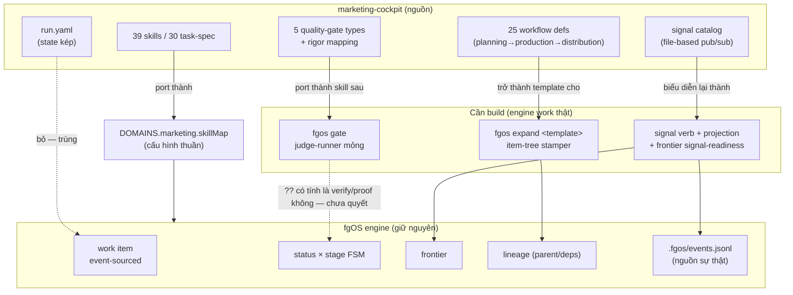

# fgOS × marketing-cockpit — foundation absorption discussion

## 1. Trạng thái hiện tại

Vòng 2: hai scout rẻ (haiku) đã quét xong cơ chế điều phối của fgOS và của
marketing-cockpit; tiến trình `fable` (model claude-fable-5, agent
`brainstormer`) đã phản biện/so sánh xong (§5, §6). Kết quả đã trình bày cho
người dùng, đang mở vòng thảo luận trực tiếp — chưa D-ID nào được chốt (§4
còn trống, đúng như kỳ vọng của giai đoạn brainstorm mở). Câu hỏi trọng tâm
đang chờ người dùng phản hồi: (a) có chấp nhận judge-gate (LLM-graded
rubric) là "proof" hợp lệ cho domain marketing, đối chiếu luật L5 DoD đã
khoá hay không; (b) có đồng ý với phạm vi "day-one" tối giản mà fable đề
xuất (DOMAINS entry + port skill + template-stamper + cron-driven `fgos
add`, hoãn signal bus) hay không.

## 2. Mục tiêu & đề bài

fgOS hiện có engine điều phối work-item đã chứng minh cho một domain
("coding") nhưng được thiết kế multi-domain ngay từ đầu — có sẵn registry
`DOMAINS` và một fixture domain tên `fixture-marketing` (proof-of-concept,
chưa phải thật). Mục tiêu sản phẩm (đã chốt ở cấp chủ dự án, không tranh
luận lại): gom foundation của marketing-cockpit — một hệ thống AI marketing-ops
trưởng thành hơn (39 skills, 25 workflows, brand/content/campaign automation)
— vào fgOS, rồi triển khai lại một domain "marketing" thật sự trên engine của
fgOS, thay vì để hai hệ thống song song hoặc fgOS tự phát minh lại từ đầu.
Discussion này tồn tại để trả lời: cơ chế nào của cockpit đáng học/absorb,
cơ chế nào fgOS đã có tốt hơn hoặc khác đi mà không cần cockpit, và hình hài
cụ thể của domain "marketing" trên fgOS sẽ trông như thế nào.

## 3. Vấn đề rõ / chưa rõ

| # | Điểm | Trạng thái | Ghi chú |
|---|------|-----------|---------|
| 1 | fgOS đã multi-domain-capable ở mức code (DOMAINS registry, không hardcode) | Rõ | Xác nhận bằng scout — thêm domain mới chỉ cần 1 entry trong `workflow-stage-graphs.mjs`, domain lạ fold về `coding` với warning |
| 2 | marketing-cockpit có cơ chế signal/pub-sub cross-workflow mà fgOS chưa có tương đương | Rõ | fgOS chỉ có event log append-only tuyến tính (`.fgos/events.jsonl`), không có typed signal catalog/emitter-consumer |
| 3 | `fgOS-design/` trong cockpit có liên quan đến orchestration không | Rõ — không | Đó là UI/UX handoff package cho một desktop app riêng (Wails), không phải orchestration logic |
| 4 | cockpit's checkpoint/resume (per-stage, context_snapshot) có hạt mịn hơn stage FSM của fgOS không | Rõ | fgOS chỉ resume ở mức item-stage; cockpit resume ở mức stage-trong-workflow với context_snapshot riêng |
| 5 | fgOS nên port nguyên cơ chế signal/routing/priority 3-file của cockpit, hay chỉ port khái niệm và biểu diễn lại qua DOMAINS registry + event log? | Rõ (đề xuất của fable) | Routing/delegation/priority 3-file → gộp về 1 DOMAINS entry (fgOS thắng, prose-enforced protocol là liability). Signal → biểu diễn lại như event có typed payload trong `.fgos/events.jsonl` + projection theo consumer cursor, KHÔNG tạo store thứ hai — chỉ phần "frontier trở nên ready khi có signal khớp, kể cả cho item chưa tồn tại" là engine work thật (deps không biểu diễn được fan-out tới item chưa sinh ra) |
| 6 | Domain "marketing" thật trên fgOS cần engine mới (capability thật) ở đâu, và đâu chỉ là cấu hình (thêm DOMAINS entry)? | Rõ (đề xuất của fable) | Cấu hình thuần: DOMAINS entry (stages/skillMap/statusLabels/parkReason/worktreeBacked), gate-rigor table. Engine thật: (a) signal event + consumer projection + frontier signal-readiness, (b) `fgos expand <template>` verb (workflow-template → item-tree stamper), (c) `fgos gate` judge-runner nhỏ, (d) không có scheduler — đề xuất cron ngoài gọi `fgos add` trước, chỉ xây trigger primitive nếu cron chứng minh không đủ |
| 7 | Judge-gate (LLM-graded rubric cho brand voice/legal/factual) có được tính là "proof" hợp lệ theo luật L5 DoD (platform-foundations.md, "reproducibly verifiable result") không? | Chưa rõ — cần người quyết | Đây là rủi ro sắc nhất fable nêu: nếu không chấp nhận, mọi item marketing rơi về `awaiting-human`, frontier nghẽn ở người, "release con người" (ưu tiên #2) sụp đổ đúng domain vừa thêm, và compound-learn loop mất tín hiệu hữu ích. Cần quyết định tường minh trước khi làm, không phải phát hiện ở item thứ 30 |

## 4. Quyết định đã chốt

(chưa có D-ID nào — còn đang ở vòng scout/brainstorm đầu tiên)

## 5. Q&A log

- **2026-08-15 — Scout round 1 (fgOS)**: agent `scout-fgos-orchestration`
  (haiku) đọc `src/state/work.mjs`, `workflow-stage-graphs.mjs`,
  `status-fsm.mjs`/`stage-fsm.mjs`, `src/runner/loop.mjs`/`dispatch.mjs`,
  `src/state/frontier.mjs`, `.claude/skills/fgos-routing/SKILL.md`,
  `docs/specs/work-state.md`, `docs/specs/runner.md`,
  `docs/routing-handoff-contract.md`. Kết luận chính: work item phẳng với
  hai FSM trực giao (status universal, stage per-domain qua DOMAINS
  registry); không có entity "workflow" riêng — thay vào đó là cây
  parent/children + DAG deps + frontier; event log append-only là nguồn sự
  thật (không có signal/pub-sub); routing qua DOMAINS registry +
  `fgos-routing` skill; domain abstraction đã đầy đủ, thêm domain mới chỉ
  cần 1 entry registry.

- **2026-08-15 — Scout round 1 (marketing-cockpit)**: agent
  `scout-cockpit-orchestration` (haiku) đọc README/AGENTS.md/CLAUDE.md,
  `fgOS-design/` (folder trùng tên tình cờ, hoá ra là UI/UX handoff, không
  liên quan orchestration), `.fgOS/FRAMEWORK.md`, `.fgOS/workflows/`,
  `.fgOS/orchestration/{routing,delegation,priority}.yaml`,
  `.fgOS/runtime/config/domain-signal-catalog.yaml`, `.fgOS/tasks/`,
  `.fgOS/runtime/state.yaml`, `.workspace/runs/{run_id}/run.yaml`. Kết luận
  chính: task = atomic unit (yaml schema), workflow = container of stages
  (mỗi stage dispatch 1 task), run = execution instance (run.yaml là single
  source of truth); FSM per-run (pending/in_progress/paused/completed/
  failed/cancelled); hai loại quality gate (approval gate + inline quality
  gate với 5 loại rigor); signal = cơ chế coupling cross-workflow duy nhất,
  file-based pub/sub với catalog domain-organized (emitter/consumer/TTL/typed
  payload); checkpoint/resume ở mức stage với context_snapshot; routing
  per-workflow qua 3 file protocol (routing/delegation/priority), không có
  dispatcher trung tâm; multi-platform qua adapter pattern (`.claude/`,
  `.gemini/`, `.codex/`, `.openai/` đọc core `.fgOS/` và override theo
  platform, kèm `ADAPTER-SPEC.md` contract bắt buộc status vocabulary
  DONE/DONE_WITH_CONCERNS/BLOCKED/NEEDS_CONTEXT — trùng khớp với vocabulary
  status protocol nội bộ mà orchestration-protocol.md của user cũng dùng).

- **2026-08-15 — Fable comparison round**: agent `fable-compare` (model
  claude-fable-5, subagent `brainstormer`) phản biện 2 scout report, so
  sánh theo 7 trục (unit-of-work, stage FSM, workflow composition,
  signal/event, routing, adapter, checkpoint/resume, quality gates).
  Verdict rút gọn: fgOS thắng ở stage FSM (status×stage trực giao) và
  routing (1 DOMAINS entry engine-enforced > 3 file YAML prose-enforced);
  cockpit thắng ở workflow composition (named reusable process),
  checkpoint/resume hạt mịn hơn, và quality gates (5 loại judge-gate có
  rigor mapping, fgOS chỉ có 1 verify command + human approval); signal/
  event là khoảng trống thật của fgOS (event log là ledger, không phải
  bus). Đề xuất: port signal như event có typed payload (không tạo store
  thứ hai), port workflow như "template stamp ra item-tree" (không tạo
  entity workflow runtime mới), port gate-type như skill sau một
  `fgos gate` CLI mỏng. Cockpit nên bỏ: `run.yaml` (source-of-truth kép),
  run FSM riêng, 3-file routing protocol, phần lớn checkpoint machinery
  (đã có free từ event log + worktree commit). Rủi ro sắc nhất: judge-gate
  có tính là "proof" theo luật L5 DoD không — nếu không, domain marketing
  sẽ nghẽn hết ở `awaiting-human`, đánh thẳng vào ưu tiên #2 "release con
  người". Đường đi tối giản day-one: DOMAINS entry + port skill +
  template-stamper + cron-driven `fgos add`, hoãn signal bus tới khi có
  use-case fan-out cụ thể (vd brand-voice invalidation).

## 6. Thiết kế đã chốt {#design}

> **Lưu ý:** đây là bản tổng hợp ĐỀ XUẤT từ scout + fable, chưa có D-ID nào
> support nó — người dùng chưa xác nhận. Sẽ viết lại toàn bộ mục này ngay
> khi có phản hồi làm đổi shape.

fgOS đã multi-domain-capable ở mức code (registry `DOMAINS`, một entry mới
= một domain, không cần sửa CLI) và đã có fixture `fixture-marketing` chứng
minh slot này chạy được. Việc "gom foundation marketing-cockpit vào fgOS"
không có nghĩa là mang nguyên state machine của cockpit sang — nó có nghĩa
là: giữ engine của fgOS (event-sourced work item, status×stage FSM trực
giao, frontier, worktree-per-item), và chỉ thêm đúng những capability fgOS
thật sự thiếu để chở được mô hình vận hành của cockpit.

Cockpit đóng góp 3 thứ đáng lấy, không thứ nào cần sao chép nguyên xi:

1. **39 skills + 30 task-spec** — tài sản thật sự đang được "gom" — trở
   thành nội dung của `skillMap` trong DOMAINS entry `marketing` mới, và
   input/output schema của mỗi task-spec ban đầu chỉ sống như convention ở
   mức skill/refs (chưa cần engine ép kiểu — YAGNI).
2. **Signal (cross-workflow coupling)** — khoảng trống thật của fgOS
   (event log hiện là ledger tuyến tính, không phải bus). Biểu diễn lại
   bằng một verb `signal` ghi event có typed payload vào
   `.fgos/events.jsonl`, tiêu thụ qua projection theo consumer cursor —
   giữ đúng luật "replay-from-zero là sự thật". Phần việc engine thật duy
   nhất: frontier phải "ready" được khi có signal khớp, kể cả cho item
   CHƯA tồn tại (vd "brand-voice cập nhật → tạo lại audit cho mọi content
   đang live") — deps hiện tại không biểu diễn được fan-out kiểu này vì
   đòi hỏi consumer đã tồn tại lúc emit.
3. **Quality gate có rigor** — 5 loại gate (brand/content/seo/legal/
   factual) với bảng ánh xạ rigor, port thành skill đứng sau một `fgos
   gate` CLI mỏng, để `verify` của work item vẫn giữ nguyên hợp đồng "một
   lệnh shell". Đây là chỗ chạm luật L5 DoD trực tiếp nhất (xem vấn đề #7
   ở §3) — quyết định "judge verdict có tính là proof không" phải có
   trước khi build, không phải phát hiện giữa chừng.

Ba thứ cockpit nên bỏ khi vào fgOS, vì fgOS đã giải quyết khác đi và tốt
hơn: `run.yaml` (source-of-truth kép — event-sourced work item thay thế),
FSM riêng theo run (status FSM 11 trạng thái của fgOS đã bao trùm, có phân
biệt `awaiting-human` vs `awaiting-approval` vs `retrospective` mà cockpit
không có), và bộ 3 file `routing/delegation/priority.yaml` (một DOMAINS
entry được engine ép buộc mạnh hơn protocol chỉ dựa vào prose).

"Ba lớp" planning/production/distribution của cockpit KHÔNG map thành 3
stage của một item — chúng map thành cây item: editorial-calendar là item
cha, mỗi calendar slot sinh ra 1 item con production (deps được template
gài sẵn), distribution là các item con downstream tiếp theo. Đây chính là
mô hình lineage/frontier fgOS đã có sẵn, không phải thứ mới.

Đường đi tối giản (day-one, theo đề xuất của fable, chưa xác nhận):
DOMAINS entry `marketing` (cấu hình thuần) + port skill + `fgos expand
<template>` (item-tree stamper, engine work nhỏ) + cron ngoài gọi `fgos
add` cho lịch biên tập (chưa cần scheduler primitive mới) — hoãn signal
bus tới khi có use-case fan-out cụ thể xuất hiện thật.

## 7. Danh mục hạng mục / task {#tasks} (đề xuất, chưa chốt)

### {#task-marketing-domain-registry}
- **Mục tiêu**: thêm entry `marketing` thật vào `DOMAINS` registry
  (`src/state/workflow-stage-graphs.mjs`), thay thế `fixture-marketing`,
  với stages `briefing → producing → gating → distributing`, skillMap trỏ
  vào skill đã port từ cockpit, statusLabels/parkReason bằng tiếng phù hợp
  domain marketing, `worktreeBacked: true`.
- **Trích §6**: đoạn "Đường đi tối giản (day-one)" + đoạn "Ba lớp... KHÔNG
  map thành 3 stage".
- **D-ID áp dụng**: chưa có.
- **Quan hệ**: nền tảng cho mọi task khác trong danh mục này — không
  block bởi chúng.
- **Verify nháp**: `fgos add --domain marketing ...` tạo được item, đi hết
  4 stage tới `executing` mà không rơi về `coding` mặc định.

### {#task-marketing-skill-port}
- **Mục tiêu**: port một tập con nhỏ (không phải cả 39) skill từ
  `upstreams/marketing-cockpit/.fgOS/tasks/` sang skill format của fgOS,
  đủ để chạy hết 1 workflow mẫu (vd content-creation) end-to-end.
- **Trích §6**: đoạn "39 skills + 30 task-spec... trở thành nội dung của
  skillMap".
- **D-ID áp dụng**: chưa có.
- **Quan hệ**: phụ thuộc `{#task-marketing-domain-registry}`.
- **Verify nháp**: một item domain=marketing chạy qua skill đã port, sinh
  ra artifact thật trong worktree, `verify` pass.

### {#task-expand-template-verb}
- **Mục tiêu**: `fgos expand <template>` — sinh cây item (cha + con theo
  slot, deps prewired) từ một định nghĩa template khai báo, tương đương
  25 workflow của cockpit trở thành "decomposition recipe".
- **Trích §6**: đoạn "fgos expand <template> (item-tree stamper, engine
  work nhỏ)".
- **D-ID áp dụng**: chưa có.
- **Quan hệ**: độc lập với gate/signal; nên làm sau khi có ít nhất 1 skill
  port xong để có gì đó thật để expand ra.
- **Verify nháp**: chạy `fgos expand editorial-calendar --slots 3` sinh
  đúng 1 parent + 3 children với deps đúng thứ tự.

### {#task-gate-runner} — BLOCKED bởi câu hỏi #7 ở §3
- **Mục tiêu**: `fgos gate` CLI mỏng chạy judge-gate (brand/content/seo/
  legal/factual) như skill, kết quả ghi vào event log.
- **Trích §6**: đoạn "Quality gate có rigor" + rủi ro sắc nhất ở §3 #7.
- **D-ID áp dụng**: chưa có — **không nên bắt đầu task này trước khi
  người dùng quyết định judge-verdict có tính là proof hợp lệ với luật L5
  DoD hay không.**
- **Quan hệ**: domain marketing vẫn dùng được (qua `awaiting-human`) nếu
  task này bị hoãn — không phải blocker cứng cho toàn bộ absorption, chỉ
  block tự động hoá thật.
- **Verify nháp**: chưa viết — phụ thuộc quyết định trên.

### {#task-signal-bus} — hoãn, chưa cần task cụ thể
- **Mục tiêu**: verb `signal` + projection theo consumer cursor + frontier
  signal-readiness cho fan-out tới item chưa tồn tại.
- **Trích §6**: đoạn "Signal (cross-workflow coupling)".
- **D-ID áp dụng**: chưa có.
- **Quan hệ**: theo đề xuất fable, hoãn tới khi có use-case fan-out cụ thể
  xuất hiện thật (không làm trước theo YAGNI).
- **Verify nháp**: chưa viết — chưa tới lúc.
