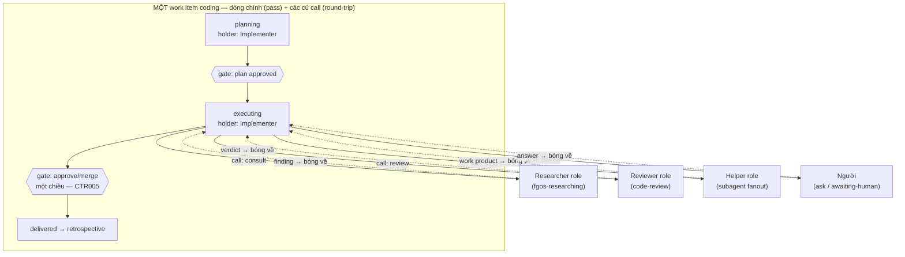

# fgOS × marketing-cockpit — foundation absorption discussion

## 1. Trạng thái hiện tại

Vòng 4: người dùng đã trả lời các câu hỏi vòng 3 — (#9) làm domain
**coding trước**, ổn rồi mới thêm marketing (đảo lại đề xuất
marketing-first của em, là quyết định của người dùng); (#10) soul = **cả
hai**: agent-type trong team hiểu vai trò mình, hiểu vấn đề công việc,
biết cần ai support — nên đẩy việc linh hoạt khi cần *advise*, cần *người
phụ làm tay chân*, cần *đánh giá phản biện*, cần *hỏi chuyên môn*; harness
giữ vai trò an toàn — điều phối cứng theo luật/gate, vd chỗ nào không được
quay lại. Mục tiêu: uyển chuyển hơn hiện tại nhưng ổn định hơn. Em đã
phản hồi: 4 lý do đó là taxonomy handoff-call (round-trip, bóng về người
gửi), tách với handoff-pass (chuyển giao theo stage); tiền lệ engine có
sẵn là ask/answer (call-to-human) — thiết kế chỉ tổng quát hoá nó thành
call-to-role; coding đã có đủ 4 tương tác này ở dạng ngầm trong session
(fgos-researching = consult, code-review = review, subagent fanout =
assist, ask/answer = advise) — việc cần làm là nâng chúng thành move hữu
hình có guard. §6 đã regenerate theo shape mới. Chưa mint D-ID (điểm
role-axis mới giữ ổn qua 1 vòng; các câu trả lời vòng 4 mới 1 lần nêu —
chờ giữ ổn thêm vòng nữa). Còn mở: #7 (judge-gate vs L5 — chỉ chạm khi
tới lượt marketing), #11–#13 (mới, xem §3).

## 2. Mục tiêu & đề bài

fgOS hiện có engine điều phối work-item đã chứng minh cho một domain
("coding") nhưng được thiết kế multi-domain ngay từ đầu — có sẵn registry
`DOMAINS` và một fixture domain tên `fixture-marketing` (proof-of-concept,
chưa phải thật). Mục tiêu sản phẩm (đã chốt ở cấp chủ dự án, không tranh
luận lại): gom foundation của marketing-cockpit — một hệ thống AI marketing-ops
trưởng thành hơn (39 skills, 25 workflows, brand/content/campaign automation)
— vào fgOS, rồi triển khai lại một domain "marketing" thật sự trên engine của
fgOS, thay vì để hai hệ thống song song hoặc fgOS tự phát minh lại từ đầu.
Discussion này tồn tại để trả lời: cơ chế nào của cockpit đáng học/absorb,
cơ chế nào fgOS đã có tốt hơn hoặc khác đi mà không cần cockpit, và hình hài
cụ thể của domain "marketing" trên fgOS sẽ trông như thế nào.

## 3. Vấn đề rõ / chưa rõ

| # | Điểm | Trạng thái | Ghi chú |
|---|------|-----------|---------|
| 1 | fgOS đã multi-domain-capable ở mức code (DOMAINS registry, không hardcode) | Rõ | Xác nhận bằng scout — thêm domain mới chỉ cần 1 entry trong `workflow-stage-graphs.mjs`, domain lạ fold về `coding` với warning |
| 2 | marketing-cockpit có cơ chế signal/pub-sub cross-workflow mà fgOS chưa có tương đương | Rõ | fgOS chỉ có event log append-only tuyến tính (`.fgos/events.jsonl`), không có typed signal catalog/emitter-consumer |
| 3 | `fgOS-design/` trong cockpit có liên quan đến orchestration không | Rõ — không | Đó là UI/UX handoff package cho một desktop app riêng (Wails), không phải orchestration logic |
| 4 | cockpit's checkpoint/resume (per-stage, context_snapshot) có hạt mịn hơn stage FSM của fgOS không | Rõ | fgOS chỉ resume ở mức item-stage; cockpit resume ở mức stage-trong-workflow với context_snapshot riêng |
| 5 | fgOS nên port nguyên cơ chế signal/routing/priority 3-file của cockpit, hay chỉ port khái niệm và biểu diễn lại qua DOMAINS registry + event log? | Rõ (đề xuất của fable) | Routing/delegation/priority 3-file → gộp về 1 DOMAINS entry (fgOS thắng, prose-enforced protocol là liability). Signal → biểu diễn lại như event có typed payload trong `.fgos/events.jsonl` + projection theo consumer cursor, KHÔNG tạo store thứ hai — chỉ phần "frontier trở nên ready khi có signal khớp, kể cả cho item chưa tồn tại" là engine work thật (deps không biểu diễn được fan-out tới item chưa sinh ra) |
| 6 | Domain "marketing" thật trên fgOS cần engine mới (capability thật) ở đâu, và đâu chỉ là cấu hình (thêm DOMAINS entry)? | Rõ (đề xuất của fable) | Cấu hình thuần: DOMAINS entry (stages/skillMap/statusLabels/parkReason/worktreeBacked), gate-rigor table. Engine thật: (a) signal event + consumer projection + frontier signal-readiness, (b) `fgos expand <template>` verb (workflow-template → item-tree stamper), (c) `fgos gate` judge-runner nhỏ, (d) không có scheduler — đề xuất cron ngoài gọi `fgos add` trước, chỉ xây trigger primitive nếu cron chứng minh không đủ |
| 7 | Judge-gate (LLM-graded rubric cho brand voice/legal/factual) có được tính là "proof" hợp lệ theo luật L5 DoD (platform-foundations.md, "reproducibly verifiable result") không? | Chưa rõ — cần người quyết | Đây là rủi ro sắc nhất fable nêu: nếu không chấp nhận, mọi item marketing rơi về `awaiting-human`, frontier nghẽn ở người, "release con người" (ưu tiên #2) sụp đổ đúng domain vừa thêm, và compound-learn loop mất tín hiệu hữu ích. Cần quyết định tường minh trước khi làm, không phải phát hiện ở item thứ 30 |
| 8 | Ping-pong đa role (review/cải thiện qua lại nhiều vòng, nhiều agent-type) biểu diễn bằng gì: trục thứ ba `role/holder` + verb `handoff` có guard, hay child-item mỗi vòng, hay loop qua status FSM? | Rõ dần — trục role, người dùng xây tiếp trên đề xuất qua vòng 4 không sửa | Chưa mint D-ID — chờ giữ ổn thêm vòng nữa theo luật D4. Vòng 4 tinh chỉnh thêm: handoff tách 2 loại — **call** (round-trip, bóng về người gửi; 4 reason: advise/assist/review/consult — đúng 4 lý do người dùng nêu) và **pass** (chuyển giao theo stage, không quay lại). Tiền lệ engine: ask/answer đã là call-to-human |
| 9 | Trục role bật cho domain nào trước? | Rõ — người dùng quyết: **coding trước**, ổn rồi mới marketing | Vòng 4. Đảo đề xuất marketing-first của em — quyết định của người dùng, và có lý riêng: coding đã có đủ 4 tương tác call ở dạng ngầm (fgos-researching/code-review/subagent/ask-answer), dogfood hằng ngày cho feedback nhanh nhất; marketing vào sau trên harness đã được chứng minh |
| 10 | "Team soul" bên trên harness — định nghĩa cụ thể? | Rõ — người dùng trả lời: **cả hai** | Soul = agent-type hiểu vai trò mình + hiểu vấn đề + biết cần ai support → tự đẩy việc linh hoạt (advise / tay chân / phản biện / chuyên môn). Harness = an toàn, điều phối cứng theo luật/gate (vd chỗ không được quay lại). Đích: uyển chuyển hơn nhưng ổn định hơn |
| 11 | Call trong-session (subagent, đồng bộ, vài giây) có ghi thành handoff event như call liên-session (park chờ role khác, bất đồng bộ) không, hay chỉ ghi loại async? | Chưa rõ — trade-off hạt mịn vs nhiễu log | Vòng 4 nêu. Ghi hết thì event log thấy toàn bộ team-interaction (đẹp cho compound-learn) nhưng nhiễu; chỉ ghi async thì log gọn nhưng mù phần subagent |
| 12 | Call lồng nhau (Reviewer đang giữ bóng lại consult Legal) — cho phép sâu bao nhiêu, guard kiểu gì (stack depth limit? cấm lồng?) | Chưa rõ | Vòng 4 nêu — cần trước khi viết roleGraph schema |
| 13 | Danh sách one-way gate cho coding: các điểm không-quay-lại hiện có trên status FSM (approve/merge CTR005) đã đủ chưa, hay cần thêm one-way trong stage? | Chưa rõ — cần người dùng liệt kê chỗ "không được quay lại" theo ý anh | Vòng 4 nêu |

## 4. Quyết định đã chốt

(chưa có D-ID nào — còn đang ở vòng scout/brainstorm đầu tiên)

## 5. Q&A log

- **2026-08-15 — Scout round 1 (fgOS)**: agent `scout-fgos-orchestration`
  (haiku) đọc `src/state/work.mjs`, `workflow-stage-graphs.mjs`,
  `status-fsm.mjs`/`stage-fsm.mjs`, `src/runner/loop.mjs`/`dispatch.mjs`,
  `src/state/frontier.mjs`, `.claude/skills/fgos-routing/SKILL.md`,
  `docs/specs/work-state.md`, `docs/specs/runner.md`,
  `docs/routing-handoff-contract.md`. Kết luận chính: work item phẳng với
  hai FSM trực giao (status universal, stage per-domain qua DOMAINS
  registry); không có entity "workflow" riêng — thay vào đó là cây
  parent/children + DAG deps + frontier; event log append-only là nguồn sự
  thật (không có signal/pub-sub); routing qua DOMAINS registry +
  `fgos-routing` skill; domain abstraction đã đầy đủ, thêm domain mới chỉ
  cần 1 entry registry.

- **2026-08-15 — Scout round 1 (marketing-cockpit)**: agent
  `scout-cockpit-orchestration` (haiku) đọc README/AGENTS.md/CLAUDE.md,
  `fgOS-design/` (folder trùng tên tình cờ, hoá ra là UI/UX handoff, không
  liên quan orchestration), `.fgOS/FRAMEWORK.md`, `.fgOS/workflows/`,
  `.fgOS/orchestration/{routing,delegation,priority}.yaml`,
  `.fgOS/runtime/config/domain-signal-catalog.yaml`, `.fgOS/tasks/`,
  `.fgOS/runtime/state.yaml`, `.workspace/runs/{run_id}/run.yaml`. Kết luận
  chính: task = atomic unit (yaml schema), workflow = container of stages
  (mỗi stage dispatch 1 task), run = execution instance (run.yaml là single
  source of truth); FSM per-run (pending/in_progress/paused/completed/
  failed/cancelled); hai loại quality gate (approval gate + inline quality
  gate với 5 loại rigor); signal = cơ chế coupling cross-workflow duy nhất,
  file-based pub/sub với catalog domain-organized (emitter/consumer/TTL/typed
  payload); checkpoint/resume ở mức stage với context_snapshot; routing
  per-workflow qua 3 file protocol (routing/delegation/priority), không có
  dispatcher trung tâm; multi-platform qua adapter pattern (`.claude/`,
  `.gemini/`, `.codex/`, `.openai/` đọc core `.fgOS/` và override theo
  platform, kèm `ADAPTER-SPEC.md` contract bắt buộc status vocabulary
  DONE/DONE_WITH_CONCERNS/BLOCKED/NEEDS_CONTEXT — trùng khớp với vocabulary
  status protocol nội bộ mà orchestration-protocol.md của user cũng dùng).

- **2026-08-15 — Fable comparison round**: agent `fable-compare` (model
  claude-fable-5, subagent `brainstormer`) phản biện 2 scout report, so
  sánh theo 7 trục (unit-of-work, stage FSM, workflow composition,
  signal/event, routing, adapter, checkpoint/resume, quality gates).
  Verdict rút gọn: fgOS thắng ở stage FSM (status×stage trực giao) và
  routing (1 DOMAINS entry engine-enforced > 3 file YAML prose-enforced);
  cockpit thắng ở workflow composition (named reusable process),
  checkpoint/resume hạt mịn hơn, và quality gates (5 loại judge-gate có
  rigor mapping, fgOS chỉ có 1 verify command + human approval); signal/
  event là khoảng trống thật của fgOS (event log là ledger, không phải
  bus). Đề xuất: port signal như event có typed payload (không tạo store
  thứ hai), port workflow như "template stamp ra item-tree" (không tạo
  entity workflow runtime mới), port gate-type như skill sau một
  `fgos gate` CLI mỏng. Cockpit nên bỏ: `run.yaml` (source-of-truth kép),
  run FSM riêng, 3-file routing protocol, phần lớn checkpoint machinery
  (đã có free từ event log + worktree commit). Rủi ro sắc nhất: judge-gate
  có tính là "proof" theo luật L5 DoD không — nếu không, domain marketing
  sẽ nghẽn hết ở `awaiting-human`, đánh thẳng vào ưu tiên #2 "release con
  người". Đường đi tối giản day-one: DOMAINS entry + port skill +
  template-stamper + cron-driven `fgos add`, hoãn signal bus tới khi có
  use-case fan-out cụ thể (vd brand-voice invalidation).

- **2026-08-15 15:02 — Người dùng mở rộng đề bài (vòng 3)**: bối cảnh team
  (coding hoặc marketing) có nhiều agent-type (role/title), nhiều loại
  task, các vòng review/cải thiện đẩy việc qua lại nhiều lần — flow không
  được giới hạn tuyến tính; agent đẩy việc qua lại tự do, nhưng FSM/routing
  core phải gác không cho đi sai đường (agent route bậy thì bị chặn). Yêu
  cầu: kết hợp cả bốn — FSM/routing + workflow-composition + checkpoint
  hạt mịn + signal/event bus — thành bộ core harness cứng, cơ học, đẩy
  việc uyển chuyển, làm foundation cho một "team soul" hoàn chỉnh hoạt
  động bên trên (soul hiện tại còn cơ học và tuyến tính). → Phản hồi của
  em (tóm tắt; đầy đủ ở tin nhắn phiên làm việc): đề xuất tách
  "mechanism vs policy" — harness chỉ gác legality + ghi sự thật, soul
  chọn edge; thêm trục thứ ba `role/holder` (trực giao với status × stage)
  + verb `handoff` có guard theo role-graph khai báo per-domain trong
  DOMAINS; ping-pong review = chuỗi handoff event trong CÙNG một item
  (không phải stage mới, không phải item mới); mỗi handoff là một
  checkpoint tự nhiên (context snapshot trong event payload + worktree
  commit); quy tắc phân ranh: cùng item → handoff, khác item/cây → signal.
  Cảnh giác YAGNI: coding hiện chỉ có 1 vòng ping-pong (doing ↔
  awaiting-approval) và đang đủ — role-graph chỉ bật cho domain khai báo
  nó, không retrofit coding ngay. Ba câu hỏi mở đã đặt cho anh: (a) chấp
  nhận trục role/holder là trục thứ ba của work item, hay muốn biểu diễn
  ping-pong cách khác (child-item mỗi vòng / loop qua status); (b) coding
  có nâng cấp ngay không hay marketing dùng trước; (c) "team soul" anh
  hình dung cụ thể là gì — persona/judgment per role như cockpit's
  agents, hay một tầng orchestration thông minh hơn? Chưa chốt gì.

- **2026-08-15 15:49 — Người dùng trả lời vòng 3 (vòng 4)**: (#9) làm
  domain coding trước, ổn rồi mới thêm marketing. (#10) soul là cả hai —
  agent-type trong team hiểu vai trò của nó, hiểu vấn đề công việc của
  nó, biết cần ai support, vì thế flexible đẩy việc khi cần advise, khi
  cần người phụ làm tay chân, khi cần đánh giá phản biện, hoặc khi cần
  hỏi chuyên môn. Harness đóng vai trò an toàn, điều phối cứng theo luật
  theo gate, ví dụ chỗ nào thì không được quay lại. Đích: uyển chuyển
  hơn, không tuyến tính cứng nhắc như hiện tại, nhưng vẫn ổn định hơn.
  → Phản hồi của em: 4 lý do = taxonomy **handoff-call** (round-trip —
  cả 4 đều có tính chất "bóng quay về người gửi"), tách khỏi
  **handoff-pass** (chuyển giao theo stage, một chiều). Tiền lệ engine đã
  có: `fgos ask`/`answer` + `awaiting-human` chính là call-to-human có
  park-và-trả — thiết kế tổng quát hoá nó thành call-to-role. Coding đã
  chứa đủ 4 tương tác này dạng ngầm trong session: `fgos-researching` =
  consult, `code-review` = review, subagent fanout = assist, ask/answer =
  advise → "coding trước" = nâng 4 tương tác có sẵn thành move hữu hình
  có guard, không phát minh tương tác mới. Ghi chú ranh giới: role ≠
  capacity — `src/runner/dispatch.mjs` (decide/execute, một cửa) chọn
  *executor* chạy việc; roleGraph chọn *vai* cầm việc; hai tầng không
  giẫm nhau. Câu hỏi mới nêu: #11 (ghi call sync in-session vào log
  không), #12 (call lồng nhau), #13 (danh sách one-way gate coding).

## 6. Thiết kế đã chốt {#design}

> **Lưu ý:** synthesis ĐỀ XUẤT (regenerate vòng 4) — chưa có D-ID support,
> các điểm chính mới giữ ổn 1 vòng. Viết cho người lạ không có chat history.

### Bức tranh lớn

fgOS xây một **core harness cơ học** hai tầng cho team agent đa role, dùng
chung cho mọi domain (coding trước, marketing là khách hàng absorption đầu
tiên vào sau):

- **Mechanism (harness)** — cứng, không phán đoán: gác legality của mọi
  move, ghi sự thật vào event log, đánh thức đúng vai kế tiếp. Không bao
  giờ chọn đường thay agent.
- **Policy (soul)** — agent-type hiểu vai trò mình, hiểu vấn đề, biết cần
  ai support, tự chọn edge hợp lệ để đẩy việc: cần advise, cần người phụ
  tay chân, cần phản biện, cần hỏi chuyên môn. Soul thay được, sai được,
  nâng cấp tự do — harness đảm bảo sai không phá.

Đích: flow uyển chuyển hơn hiện tại (không tuyến tính cứng) nhưng ổn định
hơn (mọi bước lệch bị guard chặn kèm chỉ dẫn edge hợp lệ).

### Ba trục trực giao của work item

1. `status` — lifecycle phổ quát (giữ nguyên 11 trạng thái).
2. `stage` — tiến độ theo domain (giữ nguyên, per-DOMAINS).
3. `role/holder` — **mới**: ai đang cầm bóng. Khai báo per-domain trong
   DOMAINS (`roleGraph`), chỉ domain nào khai báo mới có.

### Handoff: hai loại, một guard

- **Call (round-trip)** — bóng quay về người gửi. Đúng 4 reason người
  dùng nêu: `advise` (xin lời khuyên), `assist` (nhờ làm tay chân, trả
  work product), `review` (xin phản biện, trả verdict), `consult` (hỏi
  chuyên môn, trả finding). Tiền lệ engine có sẵn: `fgos ask`/`answer` +
  `awaiting-human` chính là call-to-human — thiết kế tổng quát hoá thành
  call-to-role, không phát minh cơ chế mới.
- **Pass (transfer)** — chuyển giao một chiều theo stage/status, không
  quay lại; đây là các edge stage FSM hiện có.
- **Guard** — roleGraph per-domain khai báo edge hợp lệ (from-role,
  to-role, reason) theo stage; one-way gate đánh dấu chỗ "không được quay
  lại" (coding đã có sẵn: approve/merge CTR005). Route bậy → REFUSED kèm
  danh sách edge hợp lệ (chặn và dạy tại chỗ).
- **Checkpoint hạt mịn miễn phí** — mỗi handoff event mang context
  snapshot (đã xong gì, concern gì mở) + worktree commit mang artifact
  state; chết session → resume ở handoff gần nhất, không làm lại cả stage.

### Ranh giới giữa các cơ chế

- Cùng item → **handoff**. Khác item/cây → **signal** (event typed
  payload + projection, hoãn tới khi có use-case fan-out thật — giữ
  nguyên kết luận vòng 2).
- Role ≠ capacity: roleGraph chọn *vai cầm việc*; dispatch một cửa
  (`src/runner/dispatch.mjs` decide/execute) chọn *executor chạy việc*.
  Hai tầng không giẫm nhau.
- Workflow = template stamp ra cây item (`fgos expand`), không phải
  runtime entity — giữ nguyên kết luận vòng 2.

### Trình tự triển khai (quyết định người dùng vòng 4)

**Coding trước** — vì coding đã chứa đủ 4 tương tác call ở dạng ngầm
trong session, chỉ cần nâng thành move hữu hình có guard:

| Reason | Tương tác ngầm hiện có |
|---|---|
| consult | `fgos-researching` gọi từ giữa exploring/planning |
| review | `code-review` / approve-reject loop |
| assist | subagent fanout (`fgos-fanout`, Agent tool) |
| advise | `fgos ask`/`answer` + `awaiting-human` |

Ổn rồi mới thêm domain marketing: DOMAINS entry + port skill cockpit +
`fgos expand` template (§6 vòng 2 vẫn đúng cho phần marketing, xếp sau).
Câu hỏi judge-gate vs luật L5 DoD (#7) chỉ cần quyết khi tới lượt
marketing.

## 7. Danh mục hạng mục / task {#tasks} (đề xuất, chưa chốt — re-sequenced vòng 4)

### {#task-role-axis-coding}
- **Mục tiêu**: thêm trục `role/holder` + verb `handoff` (call/pass, guard
  theo roleGraph) vào engine, khai báo roleGraph đầu tiên cho domain
  coding với 4 role: Researcher/Reviewer/Helper/Human-advisor quanh
  Implementer; ask/answer trở thành case đặc biệt của call.
- **Trích §6**: "Handoff: hai loại, một guard" + bảng 4 tương tác ngầm.
- **D-ID áp dụng**: chưa có.
- **Quan hệ**: nền cho mọi task sau; blocked bởi câu hỏi #11/#12/#13 (§3).
- **Verify nháp**: một item coding thực hiện call review → verdict → bóng
  về implementer, toàn bộ hiện trong event log; một handoff ngoài
  roleGraph bị REFUSED kèm danh sách edge hợp lệ.

### {#task-marketing-domain-registry}
- **Mục tiêu**: entry `marketing` thật trong DOMAINS (thay
  `fixture-marketing`): stages briefing → producing → gating →
  distributing, roleGraph marketing (writer/editor/brand/legal/
  scheduler), `worktreeBacked: true`.
- **Trích §6**: "Trình tự triển khai" — xếp sau coding.
- **Quan hệ**: phụ thuộc `{#task-role-axis-coding}` đã ổn.
- **Verify nháp**: item domain=marketing đi hết 4 stage, ping-pong
  writer↔editor qua handoff-call, không rơi về `coding` mặc định.

### {#task-marketing-skill-port}
- **Mục tiêu**: port tập con skill từ cockpit `.fgOS/tasks/` đủ chạy 1
  workflow mẫu (content-creation) end-to-end trên fgOS.
- **Quan hệ**: phụ thuộc `{#task-marketing-domain-registry}`.
- **Verify nháp**: item marketing chạy skill port, sinh artifact thật
  trong worktree, verify pass.

### {#task-expand-template-verb}
- **Mục tiêu**: `fgos expand <template>` — stamp cây item (cha + con +
  deps prewired) từ template khai báo; 25 workflow cockpit thành
  decomposition recipe.
- **Quan hệ**: cần cho marketing thật; độc lập với role-axis.
- **Verify nháp**: `fgos expand editorial-calendar --slots 3` sinh đúng
  1 parent + 3 children deps đúng thứ tự.

### {#task-gate-runner} — BLOCKED bởi câu hỏi #7 (§3)
- **Mục tiêu**: `fgos gate` judge-runner (brand/content/seo/legal/
  factual) như skill, kết quả vào event log.
- **Quan hệ**: chỉ cần khi tới lượt marketing; quyết định judge-proof vs
  L5 DoD phải có trước.
- **Verify nháp**: chưa viết — phụ thuộc quyết định trên.

### {#task-signal-bus} — hoãn, chưa cần task cụ thể
- **Mục tiêu**: verb `signal` + projection consumer cursor + frontier
  signal-readiness cho fan-out tới item chưa tồn tại.
- **Quan hệ**: hoãn tới khi use-case fan-out thật xuất hiện (YAGNI).
- **Verify nháp**: chưa viết — chưa tới lúc.
