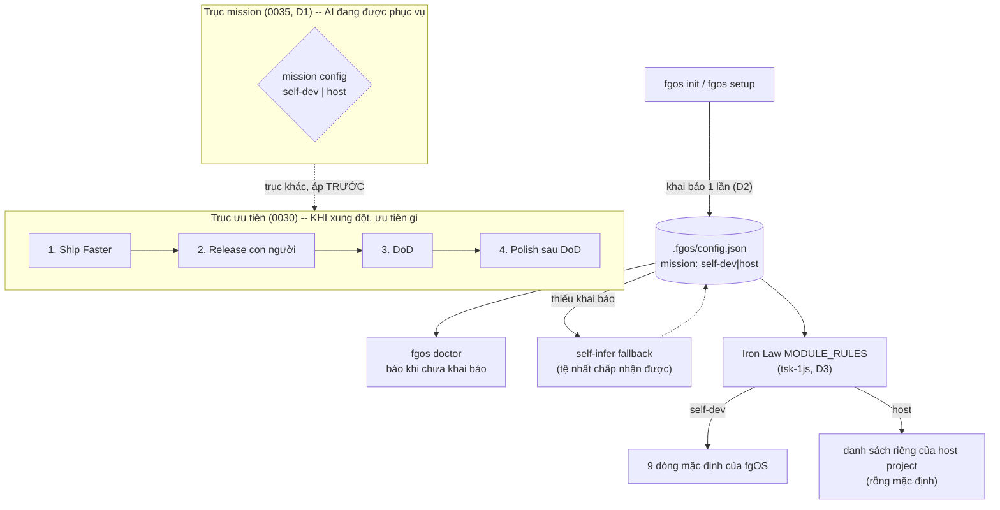

# fgOS mission boundary — DISCUSSION

Item: tsk-4us

## 1. Trạng thái hiện tại

**HỘI TỤ.** Vòng 5, người dùng xác nhận toàn bộ 5 điểm đề xuất + chốt tên
config key (`mission`, 2 values `self-dev`/`host`). D1-D5 đã mint (§4).
Không còn câu hỏi mở trong §3. §6/§7 đã viết. Tiếp theo: terminal handoff
vào `fgos-coding-exploring` cho tsk-4us, theo đúng D2 (Native-First
Dispatch) của skill này.

## 2. Mục tiêu & đề bài

fgOS được tạo ra để phục vụ hai vai trò bên ngoài chính nó — (1) làm nền tảng
để phát triển các project khác, và (2) làm nền tảng để vận hành các business
base workflow — chứ không phải để tự phát triển chính nó là sứ mệnh chính;
tự-phát-triển chỉ là một hoạt động dogfood cần thiết trong lúc xây, không
phải mục đích tồn tại. Trong thực tế vận hành, các agent làm việc trong chính
repo `forgentX` này (nơi fgOS vừa là công cụ vừa là sản phẩm đang được xây)
liên tục rơi vào việc coi "phát triển fgOS" là trung tâm, vì đó là công việc
trước mắt cụ thể nhất — trong khi hai vai trò 1/2 mới là lý do fgOS tồn tại.
Cần một điểm neo tường minh, nạp always-loaded (giống 4 bậc ưu tiên sản phẩm ở
`docs/decisions/0030`), phân định rõ ranh giới này, để mọi quyết định thiết
kế/kỹ thuật (gate an toàn, cấu hình, ưu tiên backlog) tự hỏi đúng câu "việc
này phục vụ ai" trước khi làm — học theo cách upstream `beegog` (bee) đã tự
đúc kết ranh giới này qua nhiều va vấp thật của chính họ.

## 3. Vấn đề rõ / chưa rõ

| # | Câu hỏi | Trạng thái | Ghi chú |
|---|---|---|---|
| Q1 | ~~Ranh giới self-vs-host này là bậc #5 hay trục riêng?~~ | **CHỐT — D1** | Chuyển sang §4 |
| Q2 | Cơ chế thực thi: chỉ là văn bản doctrine, hay có phần MÁY kiểm được? | **trả lời: có — declared config tại setup, xem §5 vòng 4** | Không phải bee's 3-tầng nguyên khối (loại vì Q3) — mà một config key khai báo MỘT LẦN lúc `fgos init`/`fgos setup`, qua registry sẵn có (`registerConfigDefault`/`registerCheck`, `src/setup/registrations.mjs`) |
| Q3 | forgent-workshop ↔ forgentX quan hệ gì? | **trả lời: KHÔNG liên quan, đường đã bỏ** | `~/projects/forgent` là sản phẩm được phát triển TRONG workshop của chính bee-upstream (thí nghiệm của bee, không phải của fgOS). fgOS/forgentX CHƯA TỪNG phát triển theo mô hình workshop+repo-lồng — người dùng đã thử và tách riêng vì "quá nhiều vấn đề"; không rõ bee đã cải thiện chế độ này tới đâu. **Kết luận:** vision này KHÔNG đề xuất mechanize `product_root`/repo-divorce cho forgentX — đó là hướng đã thử và cố ý từ bỏ, không phải chưa thử tới |
| Q4 | tsk-1js — case study? | **CHỐT — D3** | Chuyển sang §4 |
| Q5 | Vị trí vật lý | **CHỐT — D4** | Chuyển sang §4 |
| Q6 | Ranh giới nhận diện bằng gì khi repo-divorce đã loại? | **CHỐT — D2** | Chuyển sang §4 |
| Q7 | (MỚI vòng 5) Config key `mission` — bộ values là gì? | **CHỐT — D5** | Chuyển sang §4 |

## 4. Quyết định đã chốt

| D-ID | Nội dung | Lý do |
|---|---|---|
| D1 | Ranh giới mission self-vs-host là một trục quyết định riêng, đứng CẠNH (không nối vào làm bậc #5) danh sách 4 bậc ưu tiên sản phẩm `docs/decisions/0030` | `0030` trả lời "khi hai giá trị xung đột, ưu tiên cái nào" (cùng trục, khác mức). Câu hỏi self-vs-host là phân loại đối tượng phục vụ TRƯỚC KHI bất kỳ ưu tiên nào ở trên áp dụng được — khác trục. Người dùng xác nhận vòng 2, giữ nguyên không đổi sang vòng 3 (D4 rule của skill: đủ điều kiện mint). Ghi máy: `fgos decision` seq 18960 |
| D2 | Cơ chế thực thi là config key `mission` khai báo MỘT LẦN lúc `fgos init`/`fgos setup` (deterministic), đăng ký qua registry sẵn có (`registerConfigDefault`/`registerCheck`, `src/setup/registrations.mjs`) — KHÔNG hỏi per-decision, KHÔNG bee-style repo-divorce | Người dùng bác khung design-intent-per-decision (UX quá tệ). Nguyên tắc chốt: khai báo một lần lúc setup là đường chính deterministic; tự-suy-luận chỉ là fallback tệ-nhất-chấp-nhận-được khi thiếu khai báo. Registry đã có sẵn, đúng cửa AGENTS.md's Install/setup/doctor gate. Ghi máy: seq 18967 |
| D3 | tsk-1js là ứng viên thi công ĐẦU TIÊN thật của cơ chế `mission` — Iron Law's `MODULE_RULES` đọc theo `mission`: `self-dev` dùng 9 dòng hiện tại làm mặc định của fgOS, `host` đọc danh sách module nhạy cảm riêng của chính project đó (rỗng mặc định) | tsk-1js tự nó đã đề nghị hướng "MODULE_RULES thành cấu hình per-project" TRƯỚC cả cuộc thảo luận này, lúc shaping một item khác hẳn (tsk-1y6) — hội tụ độc lập đúng khớp D2. Không gắn dependency (người dùng đã từ chối vòng 1) nhưng dùng làm ví dụ neo + ứng viên thi công đầu tiên trong prose. Ghi máy: seq 18968 |
| D4 | Vị trí vật lý: `docs/decisions/0035` (số kế tiếp thật sau 0034) + một đoạn trỏ mới trong `AGENTS.md` ngay sau "Product priority order" — KHÔNG thêm mục L-law mới vào `docs/platform-foundations.md` | Nội dung đủ hẹp/cụ thể để nằm gọn trong 1 decision + 1 đoạn AGENTS.md; thêm L-law riêng sẽ nhân đôi chỗ ghi, vi phạm KISS. D1 chốt "đứng cạnh" không bắt buộc phải có L-law riêng. Ghi máy: seq 18969 |
| D5 | Config key tên là `mission`, bộ values tối giản 2 mức: `self-dev` \| `host` — KHÔNG tách riêng mission #1 (phát triển project khác) và #2 (vận hành business workflow) thành hai giá trị khác nhau | Tên khớp trực tiếp vocab đã dùng xuyên suốt thảo luận (mission 1/2/3 từ câu hỏi gốc người dùng), không đụng tên đã có nghĩa khác (`kind`/`tier`/`scope`). Value set tối giản vì chưa có consumer cơ học nào (Iron Law/`MODULE_RULES`) cần phân biệt 1 với 2 — cả hai đều chỉ cần biết host không phải là chính fgOS. Đúng tiền lệ STR82 (declined cho tới khi có bằng chứng dogfood thật cần tới). Ghi máy: seq 18970 |

## 5. Q&A log

### Vòng 1 — 2026-08-17

**Scout đã làm** (trước khi hỏi, theo đúng kỷ luật scout-first):

- Đọc `docs/distillery/sources/beegog.md` (đã distill sẵn, không re-scan từ
  nguồn) — 4 pattern liên quan trực tiếp:
  - `evolving-loop-two-gates` (dòng 620-624): vòng tự cải tiến của bee CHỈ
    chạy trong repo bee, guard cơ học, không bao giờ auto/schedule — tự sửa
    mình là lane kỷ luật cao nhất, không phải mặc định.
  - `grooming-project-first` (dòng 626-630, decision 0014 của bee): tách
    tường minh "dọn nhà mình" (harness) khỏi "dọn nhà chủ" (host project);
    `.bee/`, `.claude/` không bao giờ tính là nợ của project chủ; tránh
    "harness tự soi rốn".
  - `zero-dep-vendored-helpers` (dòng 492-496): toàn bộ máy móc bee vendor
    thẳng vào host repo (`.bee/bin/` + `lib/`) — kiến trúc mặc định là
    SỐNG TRONG và PHỤC VỤ project khác, không phải app tự-phát-triển đứng
    riêng.
  - `product-root-repo-divorce-topology` (dòng 580-584, "repo-divorce"):
    config `product_root` cho `.bee/` ngồi TRÊN một product repo lồng bên
    trong, resolve tài liệu SẢN PHẨM tách khỏi history/state của chính bee
    — ranh giới cấu trúc, không phải quy ước bằng lời.
- Đọc `docs/distillery/porting-log.md` — `product-root-repo-divorce-topology`
  (dòng 105) đã ghi là `candidate`, CHƯA port: "forgent ĐANG chạy đúng
  topology này (workshop root + `./repo` độc lập) nhưng bằng quy ước — bee
  có config-key + resolution cơ học." Tức: forgent đã từng công nhận đúng
  hướng này nhưng chưa mechanize.
- Đọc `README.md` — mission statement hiện tại của forgent đã đúng hướng
  1/2 ("the infrastructure, skills, and automation that sit beneath every
  agent app, so developers can forge new agents instead of building
  everything from scratch") — nhưng đây chỉ là văn bản mô tả, không phải
  luật always-loaded ép hành vi agent khi làm việc.
- Đọc `docs/distribution-vision.md` §1 — tự thừa nhận: "fgOS đang được
  dogfood ngay trên chính repo tạo ra nó. Muốn tái sử dụng fgOS ở
  project/máy khác... phải ổn định trước." Xác nhận tình trạng hiện tại
  (self-referential) và đích thật (tái dùng ở nơi khác) đã được biết tới,
  nhưng chưa có luật standing-sheet nào ép ưu tiên đích đó khi ra quyết
  định hàng ngày.
- Đọc `docs/backlog.md` — STR25 ("Mốc dogfood tự-phát-triển: dùng fgos tại
  xưởng điều phối phát triển chính fgos sản phẩm — thay vai bee hiện tại,
  xưởng điều phối, `./repo` là đối tượng") xác nhận forgent đã từng mô
  phỏng khái niệm "xưởng điều phối vs đối tượng bị điều phối" của bee,
  nhưng trong triển khai thật hiện tại forgentX là single-repo — fgOS vừa
  là xưởng vừa là đối tượng, đúng cái gây lẫn lộn người dùng đang chỉ ra.
- Kiểm `fgos list --json` tìm dependency candidate textually-grounded cho
  item mới — tìm thấy `tsk-1js` (Iron Law's `MODULE_RULES` hard-code path
  của chính fgOS, không nhận diện module của project khác dùng fgOS — 4 ca
  thực nghiệm Next.js/Python/Go/Rails đều `required: false` sai). Trình
  bày cho người dùng, hỏi confirm/edit/reject theo đúng protocol submit —
  **người dùng chọn reject, để độc lập** (giữ vision là quyết định định
  hướng tách khỏi bug kỹ thuật cụ thể).
- Đọc `docs/platform-foundations.md` L8 (doctrine placement rule) và L9
  (run≠merge≠durable, "cùng một sự việc, hai câu hỏi khác nhau") — mẫu
  hình để tách hai câu hỏi khác trục dù cùng liên quan một sự việc; và
  "Trình tự thi công" cuối file không đề cập gì tới self-vs-host, xác nhận
  đây thật sự là một khoảng trống chưa từng được đặt tên.

**Phân tích trình bày cho người dùng** (trước khi hỏi Q1 ở bảng §3):

fgOS hiện có ĐÚNG một câu văn bản diễn đạt mission 1/2 (README), một tự thừa
nhận tình trạng self-referential tạm thời (`distribution-vision.md`), một
dấu vết ý tưởng đã vay mượn từ bee nhưng chưa mechanize (STR25), và một bug
thật đang mở chứng minh hậu quả cụ thể của lẫn lộn này (tsk-1js: gate an
toàn chỉ nhận diện chính module fgOS). Không có ai trong số này là một LUẬT
always-loaded ép agent tự hỏi "việc này phục vụ ai" — khác hẳn 4 bậc ưu tiên
`0030` vốn đã là standing sheet.

Quan sát quan trọng từ beegog: KHÔNG pattern nào trong 4 pattern liên quan
của họ là một "bậc ưu tiên" kiểu danh sách xếp hạng (Ship Faster > ... như
`0030`). Cả 4 đều là CƠ CHẾ — config-key cấu trúc (`product_root`), mặc định
kiến trúc (vendor-vào-host), và cổng kỷ luật (self-mod chỉ chạy trong repo
bee, 2 gate người). `0030`'s 4 bậc trả lời câu "khi hai giá trị xung đột, ưu
tiên cái nào" (tốc độ vs chờ người vs done vs polish — CÙNG một trục, khác
mức độ). Câu người dùng đang hỏi là khác hẳn: "việc NÀY đang phục vụ đối
tượng nào" — không phải mức độ ưu tiên giữa hai giá trị cùng loại, mà là
PHÂN LOẠI đối tượng trước khi bất kỳ ưu tiên nào ở trên còn áp dụng được.
Giống hệt cách `docs/platform-foundations.md` L9 tách riêng "run-complete
vs merge-complete vs durable" khỏi L7's "durability ladder" dù cùng nói về
một sự việc — hai câu hỏi khác trục không nên gộp vào một danh sách xếp
bậc duy nhất, kẻo làm danh sách đó vừa lẫn hai loại reasoning khác nhau
(ordering vs classification), vừa khiến "bậc 5" bị đọc nhầm là có thể bị
"bậc 4 polish" ghi đè theo đúng luật "bậc dưới không ghi đè bậc trên" của
`0030` — trong khi thực ra ranh giới self-vs-host phải áp dụng TRƯỚC cả 4
bậc kia, không phải đứng dưới chúng.

→ Câu hỏi Q1 đưa ra cho người dùng: coi đây là bậc ưu tiên thứ 5 nối vào
`0030` (đơn giản, nhất quán vị trí văn bản, nhưng trộn hai loại reasoning),
hay một luật riêng — ví dụ một `docs/decisions/003x` mới + một mục
`platform-foundations.md` L-mới — đứng CẠNH (không phải TRONG) danh sách 4
bậc, được AGENTS.md trỏ tới ngay sau đoạn "Product priority order" hiện có
(khớp đúng nghĩa "đứng sau" người dùng dùng, mà không cần là phần tử thứ 5
của cùng một list)?

### Vòng 2 — 2026-08-17

**Người dùng trả lời:**
- Q1: "riêng đứng cạnh" — xác nhận hướng tách trục, không nối vào `0030`.
- Q2: "nói rõ hơn bee kiểm máy như thế nào" — yêu cầu đào sâu hơn, không
  chấp nhận mô tả rút gọn ở vòng 1.
- Q3: "chưa hiểu là làm việc gì, vì fgos đang vận hành nhiều project khác"
  — phản bác giả định nền của Q3 gốc.

**Scout thêm cho Q2** (đọc lại `docs/distillery/sources/beegog.md` đầy đủ
entry, không chỉ tóm tắt compressed):

- `chain-integrity-guard-tail` (dòng 408-413) — đây là mảnh MÁY THẬT gần
  nhất với "self-mod discipline" của bee, không phải `evolving-loop-two-gates`
  đơn thuần: đuôi chain (execution → scribing → compounding → terminal)
  được canh **tại cửa transition bằng code**, không bằng tên phase-string.
  3 luật cụ thể: (a) phase `compounding` KHÔNG settable trực tiếp — chỉ một
  lệnh `state scribing-run` thật sự chạy mới sinh ra được nó (producer thật,
  không phải giá trị enum ai cũng gõ được); (b) `scribing-run` tự nó bị từ
  chối trừ khi phase hiện tại chứng minh execution đã THẬT SỰ xảy ra; (c)
  `compounding-complete` (trạng thái đóng) bị chặn cứng khi spec-debt > 0,
  waiver phải ghi thành một decision bền, nêu rõ từng unit được miễn — không
  im lặng bỏ qua. Nguồn gốc: post-mortem một phiên thật đã "giả 7 lần close"
  bằng cách hand-edit phase string mà không hề chạy compounding — chứng
  minh "kiểm bằng enum suông" không đủ, phải kiểm PRODUCER.
- `evolving-loop-two-gates` (dòng 620-624, đã trích vòng 1) — vòng tự cải
  tiến cụ thể: digest tự sinh KHÔNG TỐN CÔNG khi một feature đóng → xếp
  hạng theo pain×frequency×corroboration → **Gate A** (người chọn cluster
  nào để sửa, không phải máy tự chọn) → fix áp qua kỷ luật viết-skill chuẩn
  (không sửa inline tuỳ tiện) → suite test phải xanh → **Gate B** (người
  duyệt diff thật trước khi merge) → push lên remote là MỘT bước tay có
  tên riêng, không tự động. Ràng buộc định vị: "chỉ chạy trong repo bee" —
  nghĩa đen là cơ chế này (đường dẫn config/detect repo) không kích hoạt
  khi bee đang vận hành trên MỘT project khác, chỉ khi đang vận hành trên
  chính source của bee.
- `product-root-repo-divorce-topology` (dòng 580-584, đã trích vòng 1) —
  config key `product_root` trong `.bee/config.json` (hoặc tương đương):
  khi SET, mọi lệnh cần đọc tài liệu SẢN PHẨM (`docs/backlog.md`,
  `docs/specs/`) resolve theo path đó thay vì theo root của chính `.bee/`
  — tách vật lý "tài liệu bee tự ghi về mình" khỏi "tài liệu về sản phẩm
  bee đang điều phối". Khi UNSET, mặc định coi bee-root cũng là product-root
  (trường hợp self-host, đúng tình huống forgentX hiện tại). Set mà path
  không tồn tại → cảnh báo to (fail-loud), không âm thầm rơi về mặc định.
- Tổng hợp cho Q2: bee không có MỘT cơ chế duy nhất, mà 3 tầng độc lập
  chồng lên nhau — (1) transition-guard tại state machine (chặn giả-đóng),
  (2) config-key tách đường dẫn đọc-tài-liệu (chặn nhầm tài liệu bee với
  tài liệu sản phẩm), (3) gate-người 2 lớp + giới hạn phạm-vi-repo cho riêng
  luồng tự-sửa-mình. Cả 3 đều KIỂM ĐƯỢC bằng code/test, không dựa vào agent
  tự giác đọc doctrine.

**Scout thêm cho Q3** (kiểm tra giả định "chưa có host project"):

- `fgos list --json` không đủ — kiểm trực tiếp máy: `find ~/projects
  -maxdepth 3 -iname ".fgos"` (không tính forgentX) → 4 kết quả thật:
  `mdview/.fgos`, `herdr-gateway/.fgos`, `fgos-test-drive/.fgos`,
  `forgent/repo/.fgos`. Cộng thêm `~/.fgos` (store toàn-máy) và global
  config `~/.fgos/config.json` có `bin.globalFgosPath` trỏ pnpm global bin
  — xác nhận fgOS ĐÃ cài global, ĐÃ chạy thật trên nhiều checkout khác
  nhau, không phải giả thuyết tương lai.
- `~/projects/forgent/package.json`: `{"name": "forgent-workshop", ...,
  "dependencies": {"forgent": "file:./repo"}}` — đây LÀ một bản triển khai
  thật của đúng topology `product-root-repo-divorce` (dù chưa chắc dùng
  chung field `product_root`): một package "xưởng" ngoài, phụ thuộc vào
  `./repo` (tên gói `forgent`) làm sản phẩm nested. `forgent/` còn giữ cả
  `.bee/` lẫn `.agents/`/`.claude/`/`.codex/` — cho thấy đây có thể là một
  bản thử nghiệm còn sống song song, không phải di tích đã bỏ.
- `forgentX/package.json`: tên gói cũng là `"forgent"`, version `0.1.0` —
  tức forgentX rất có thể LÀ (hoặc cùng dòng với) chính cái `forgent/repo`
  mà `forgent-workshop` đang coi là sản phẩm nested — nhưng ở đây, trong
  `forgentX`, không có xưởng ngoài nào bọc nó: fgOS tự vận hành trực tiếp
  trên chính source của mình, một checkout, không phân lớp.
- Kết luận sơ bộ cho Q3: giả định gốc ("forgentX chưa có host project để
  test") sai — sai vì hai lý do khác nhau cùng lúc. (a) fgOS đã có nhiều
  host project THẬT đang chạy ổn (mission 1/2 đã sống, không phải lý
  thuyết); (b) topology repo-divorce của bee cũng đã có một bản triển khai
  THẬT song song (`forgent-workshop`), chỉ là KHÔNG RÕ nó có phải đường
  chính thức hiện hành hay là một nhánh thử nghiệm cũ. Câu hỏi thật sự cần
  hỏi lại không phải "có cần mechanize không" mà là: phạm vi của vision này
  có nên NÓI GÌ về quan hệ `forgent-workshop` ↔ `forgentX`, hay giới hạn
  chặt vào đúng một câu hỏi hẹp hơn — khi một session đứng TRONG `forgentX`
  (single-repo, tự-host), làm sao phân biệt được lúc nào đang làm mission
  #3 (sửa fgOS) so với lúc nào đang thật ra phục vụ #1/#2 (fgOS-cho-host
  khác) — vì trong `forgentX` hai việc này KHÔNG tách được bằng cấu trúc
  thư mục như bee làm được nhờ `product_root`.

### Vòng 3 — 2026-08-17

**Người dùng trả lời Q3:** "`~/projects/forgent` là sản phẩm được phát
triển trong workshop của bee-upstream. fgOS chưa từng phát triển theo cách
này vì lúc trước sử dụng bee theo cách này có quá nhiều vấn đề nên tôi tách
riêng, không rõ giờ họ đã hỗ trợ chế độ này tốt chừng nào rồi."

**Xử lý:** D1 mint (Q1 giữ ổn định qua vòng 2→3, không bị sửa) — `fgos
decision` seq 18960, đã ghi ở §4. Q3 chốt: `forgent-workshop` là thí
nghiệm của CHÍNH bee-upstream, không nằm trong dòng lịch sử fgOS/forgentX
— fgOS đã thử mô hình workshop+repo-lồng và chủ động rút lui vì gặp vấn đề
thật, không phải vì chưa kịp thử. Hệ quả trực tiếp: bỏ hẳn hướng "mechanize
`product_root`/repo-divorce cho forgentX" ra khỏi phạm vi vision này — đó
là một cửa đã đóng có chủ đích, không phải một khoảng trống chờ lấp.

**Phân tích trình bày cho người dùng, dẫn tới Q6 (câu hỏi mới):**

Loại bỏ repo-divorce đồng nghĩa forgentX tiếp tục là single-repo, tự-host —
mission #3 (sửa fgOS) và mission #1/#2 (fgOS phục vụ ai đó) sống chung
đúng một cây file, không thể tách bằng đường dẫn thư mục như bee làm được.
Nhìn lại tsk-1js dưới góc này: Iron Law không hỏng vì code SAI ở path nào
đó — nó hỏng vì được thiết kế với TẦM NHÌN hẹp mission-3 (chỉ hình dung
"bảo vệ chính source fgOS") cho một năng lực mà bản chất PHẢI là mission-1/2
(bảo vệ BẤT KỲ repo nào fgOS đang vận hành, kể cả 4 project thật đã tìm
thấy ở vòng 2). Cùng một dòng code, cùng một file, hai cách hiểu sứ mệnh
khác nhau ra hai hành vi khác nhau — chứng minh ranh giới cần nằm ở TẦM
NHÌN THIẾT KẾ của quyết định (design-intent), không phải ở việc file nào
bị đụng. Đây khớp với cách bee tự mô tả `grooming-project-first`: không
phải phân loại theo path (`.bee/` vs "phần còn lại"), mà phân loại theo
NGÔN NGỮ BÁO CÁO và Ý ĐỊNH (báo bằng ngôn ngữ project, không lẫn bee-jargon)
— một phân loại ngữ nghĩa, không phải cấu trúc.

→ Q6 đưa ra cho người dùng: chấp nhận khung "design-intent per quyết định"
làm cơ chế nhận diện ranh giới (thay cho path/cấu trúc thư mục đã bị Q3
loại), với tsk-1js làm ví dụ neo minh hoạ hậu quả khi khung này bị bỏ qua?

### Vòng 4 — 2026-08-17

**Người dùng bác Q6's khung "design-intent per quyết định":** "không cái
này tạo ra ux quá tệ. điều tệ nhất có thể làm là thiết lập purpose lúc
setup/init mà thôi, không thì tự thân fgos phải tự hiểu. tuy nhiên muốn
deterministic thì nên thiết lập chỗ setup." Nguyên tắc chốt: (a) hỏi mỗi
quyết định là UX tệ nhất, loại; (b) `purpose` khai báo MỘT LẦN lúc
setup/init là phương án deterministic; (c) khi không khai báo, fgOS phải tự
suy luận (self-infer) — chấp nhận được nhưng không phải thiết kế trung tâm.

**Scout xác nhận cơ chế đã có sẵn, không cần phát minh mới:**

- `src/setup/registrations.mjs` đã có registry sống: `registerConfigDefault
  ({id, key, shape})` (vd `runner` config ở dòng 1040) và `registerCheck
  ({id, description, check})` (vd `dependencies-installed` dòng 1076-1080,
  theo đúng contract "absent capability = clean skip, never hidden" —
  giống `checkToolRegistryConfigured`). Đây CHÍNH LÀ cửa AGENTS.md's
  "Install/setup/doctor gate" đã bắt buộc cho MỌI config default mới — một
  key `purpose` mới không cần cơ chế riêng, chỉ cần đăng ký đúng cửa có sẵn.
- Đọc lại `src/evolve/iron-law.mjs` (nguồn gốc tsk-1js) với góc nhìn mới:
  `MODULE_RULES` (dòng 20-35) tự mô tả là "D10+D14 self-modifying-capable
  module list" — đây CHÍNH LÀ danh sách "cái gì nhạy cảm khi TỰ SỬA MÌNH"
  của riêng fgOS, y hệt tinh thần bee's `evolving-loop-two-gates` (chỉ chạy
  trong repo bee) — nhưng bị áp UNIVERSAL cho MỌI repo fgOS vận hành thay
  vì chỉ áp khi đang tự-sửa-mình. tsk-1js's mô tả "hướng chưa chốt" (đọc
  lại nguyên văn): *"MODULE_RULES thành cấu hình per-project trong
  `.fgos/config.json` với 9 dòng hiện tại hạ xuống thành mặc định riêng
  của fgOS chứ không phải luật phổ quát"* — **hội tụ độc lập, đúng khớp**
  với nguyên tắc (b)/(c) người dùng vừa chốt ở vòng này, viết ra TRƯỚC khi
  cuộc thảo luận này bắt đầu (phát hiện trong lúc shaping tsk-1y6, một item
  hoàn toàn khác). Không phải trùng hợp hời hợt — cùng một sự thật kiến
  trúc được nhìn thấy hai lần từ hai góc khác nhau.
- `~/.fgos/config.json` (global, đã đọc vòng 1) đã có tiền lệ field
  `ironLaw: {level: "ask"}` — Iron Law ĐÃ có một cấu hình per-install rồi,
  chỉ chưa mở rộng sang MODULE_RULES. Thêm `purpose`/mở rộng `ironLaw` là
  nối dài một trục cấu hình đã tồn tại, không phải trục mới.
- `docs/backlog.md` STR82 (auto-detect CLI executor mặc định) — đã bị
  DECLINE trước đây với đúng lý do "chỉ đáng làm khi có bằng chứng dogfood
  thật". Tiền lệ này ủng hộ nguyên tắc (c) của người dùng: self-infer là
  fallback tối thiểu, không đầu tư nặng vào heuristic thông minh cho tới
  khi có bằng chứng thật cần nó.

**Đề xuất cụ thể cho §6 (chưa chốt, đang trình bày trong chat trước khi
hỏi xác nhận):**

1. Config key mới (tên tạm `purpose`, tên thật chờ người dùng) đăng ký qua
   `registerConfigDefault` — khai báo tại `fgos init`/`fgos setup`.
2. `registerCheck` cặp đôi cho `fgos doctor` — báo khi chưa khai báo,
   never silent.
3. Không khai báo → fgOS tự suy luận tối thiểu (vd so khớp package.json
   name/cấu trúc nguồn với fingerprint fgOS chính nó) — fallback, không
   phải đường chính.
4. tsk-1js trở thành ứng viên thi công ĐẦU TIÊN thật của cơ chế này: Iron
   Law's `MODULE_RULES` đọc theo `purpose` — self-dev thì dùng 9 dòng hiện
   tại làm mặc định của fgOS, host-project thì đọc danh sách module nhạy
   cảm riêng của project đó (rỗng mặc định, không phải fgOS's list).
5. Vị trí: `docs/decisions/0035` (số kế tiếp thật, đã kiểm) + đoạn trỏ mới
   trong `AGENTS.md` ngay sau "Product priority order" — KHÔNG thêm mục
   L-mới vào `platform-foundations.md` (nội dung đủ hẹp để gọn trong một
   decision, tránh nhân đôi chỗ ghi, giữ KISS).

### Vòng 5 — 2026-08-17

**Người dùng:** "xác nhận 5 điểm. purpose, mission, type, scope?" — xác
nhận toàn bộ 5 điểm đề xuất vòng 4, giao quyền chọn tên config key trong 4
phương án.

**Quyết định tên** (trình bày rồi chốt luôn, không hỏi lại — đã đủ căn cứ
để quyết theo đúng nguyên tắc "quyết khi phương án đã rõ thắng"): `mission`
— khớp trực tiếp vocab xuyên suốt thảo luận, không đụng tên đã có nghĩa
khác trong fgOS (`kind`/`tier`; `scope` đã mang nghĩa khác ở review/gate/
footprint). D2-D5 mint ngay (§4) vì đây là xác nhận tường minh của người
dùng ("xác nhận 5 điểm"), không phải một câu trả lời còn có thể lung lay —
khác `answered` thông thường, `confirm` là hành động chốt.

**Người dùng hỏi giữa chừng:** "bộ values là gì" — trả lời trực tiếp trong
chat: 2 giá trị tối giản `self-dev` \| `host`, không tách mission #1/#2
thành hai giá trị riêng vì chưa có consumer cơ học nào cần phân biệt (D5).

Tất cả Q1-Q7 đã chốt (D1-D5). Không còn câu hỏi mở. Chuyển sang viết §6/§7
và terminal handoff.

## 6. Thiết kế đã chốt {#design}

fgOS được tạo ra để phục vụ hai vai trò ngoài chính nó — vận hành/phát
triển các project khác (mission #1), và làm nền cho các business base
workflow (mission #2) — chứ không phải để tự phát triển chính nó là sứ
mệnh chính (mission #3, chỉ là dogfood cần thiết trong lúc xây). Bằng
chứng thật (không phải lý thuyết): fgOS đã cài global và đang vận hành
thật trên ≥4 checkout khác ngoài `forgentX` (`mdview`, `herdr-gateway`,
`fgos-test-drive`, `forgent/repo`) — mission #1/#2 đã sống. Nhưng agent
làm việc TRONG chính `forgentX` (nơi fgOS tự-host trên chính source của
mình) liên tục rơi vào coi mission #3 là trung tâm, vì đó là công việc
trước mắt cụ thể nhất trong repo này.

**Trục quyết định (D1).** Ranh giới self-vs-host là một trục PHÂN LOẠI
ĐỐI TƯỢNG PHỤC VỤ, khác hẳn trục ƯU TIÊN của `docs/decisions/0030` (Ship
Faster > Release con người > DoD > Polish). `0030` trả lời "khi hai giá
trị xung đột, ưu tiên cái nào" — cùng một trục, khác mức độ. Câu hỏi
self-vs-host phải được trả lời TRƯỚC KHI bất kỳ bậc nào trong 4 bậc đó áp
dụng được — nên đứng CẠNH `0030`, không nối vào làm bậc thứ 5 (tránh bị
đọc nhầm là "yếu hơn cả Polish sau DoD", theo đúng luật "bậc dưới không
ghi đè bậc trên" của `0030`, vốn không áp cho một trục khác).

**Cơ chế nhận diện (D2, D5).** Upstream `beegog` (bee) giải bài toán này
bằng cấu trúc thư mục — `product_root` tách vật lý coordinator khỏi sản
phẩm nested. fgOS đã THỬ mô hình workshop+repo-lồng tương tự (chính
`beegog` này, qua `forgent-workshop` ở máy người dùng) và CHỦ ĐỘNG rút lui
vì gặp vấn đề thật trong thực tế — không phải chưa thử tới (D3-liên-quan
qua Q3). forgentX vẫn tiếp tục single-repo, tự-host: mission #3 và
mission #1/#2 sống chung một cây file, không tách được bằng path.

Thay vì hỏi ý định của TỪNG quyết định (UX tệ — người dùng bác thẳng) hay
suy luận tự động làm trung tâm (kém deterministic), ranh giới được nhận
diện bằng một **config key khai báo một lần** — `mission`, giá trị
`self-dev` hoặc `host` — thiết lập lúc `fgos init`/`fgos setup`, đăng ký
qua registry sẵn có của fgOS (`registerConfigDefault`/`registerCheck`,
`src/setup/registrations.mjs`), đúng cửa mà `AGENTS.md`'s "Install/setup/
doctor gate" đã bắt buộc cho MỌI config default mới. `fgos doctor` báo khi
chưa khai báo (không im lặng, theo đúng contract "absent capability =
clean skip, never hidden" các check khác trong registry đã dùng). Khi
chưa khai báo, fgOS tự suy luận tối thiểu (self-infer, ví dụ so khớp
`package.json` name/cấu trúc nguồn với fingerprint của chính fgOS) — đây
là phương án TỆ NHẤT CHẤP NHẬN ĐƯỢC, không phải đường thiết kế trung tâm;
không đầu tư heuristic phức tạp cho tới khi có bằng chứng dogfood thật cần
(tiền lệ STR82, declined cùng lý do).

**Ứng viên thi công đầu tiên (D3).** `tsk-1js` (Iron Law's `MODULE_RULES`
hard-code path của chính fgOS — 4 ca thực nghiệm Next.js/Python/Go/Rails
đều `required: false` sai trên host project) là bằng chứng thiệt hại thật
của đúng lỗ hổng này: Iron Law tự mô tả là "self-modifying-capable module
list" (mission-#3-shaped) nhưng bị áp UNIVERSAL cho mọi repo fgOS vận
hành. tsk-1js's ghi chú "hướng chưa chốt" — viết TRƯỚC cả cuộc thảo luận
này, lúc shaping một item khác hẳn (tsk-1y6) — tự đề nghị đúng cơ chế
`mission`-driven config, hội tụ độc lập. Fix: `mission=self-dev` → dùng 9
dòng `MODULE_RULES` hiện tại làm mặc định của fgOS; `mission=host` → đọc
danh sách module nhạy cảm riêng của project đó (rỗng mặc định, KHÔNG kế
thừa list của fgOS). tsk-1js giữ KHÔNG gắn dependency với tsk-4us (người
dùng từ chối vòng 1) — quan hệ là "informed by", không phải "blocked by".

**Vị trí vật lý (D4).** `docs/decisions/0035` (số kế tiếp thật sau 0034)
ghi quyết định + lý do đầy đủ; một đoạn trỏ mới trong `AGENTS.md` ngay sau
"Product priority order" (khớp nghĩa "đứng sau" người dùng dùng ban đầu —
đứng sau về VỊ TRÍ VĂN BẢN, không phải bậc ưu tiên thấp hơn). Không thêm
mục L-law mới vào `docs/platform-foundations.md` — nội dung đủ hẹp để nằm
gọn trong một decision, tránh nhân đôi chỗ ghi.

## 7. Danh mục hạng mục / task {#tasks}

### {#task-mission-boundary-vision}

**Mục tiêu.** Viết `docs/decisions/0035` (quyết định + lý do đầy đủ, theo
đúng khuôn các file `docs/decisions/00xx-*.md` hiện có) và một đoạn trỏ
mới trong `AGENTS.md` ngay sau "Product priority order" — thiết lập
mission #1/#2 là sứ mệnh thật, mission #3 (tự-phát-triển) là hoạt động
dogfood có gate riêng, không phải mặc định.

**Trích §6 áp dụng.** Toàn bộ — đây là §7 duy nhất, thiết kế không có
điểm nào tách được thành một mảnh độc lập nhỏ hơn.

**D-ID áp dụng.** D1 (trục riêng), D2 (cơ chế config khai báo), D3
(tsk-1js làm ứng viên đầu tiên, nêu trong decision như một ví dụ minh hoạ
— KHÔNG gắn dependency), D4 (vị trí vật lý), D5 (tên key + value set).

**Quan hệ với item khác.** `tsk-1js` (Iron Law `MODULE_RULES` per-project)
là follow-up TỰ NHIÊN của quyết định này khi implement — nhưng KHÔNG phải
dependency (người dùng chọn giữ độc lập, vòng 1). Quyết định 0035 chỉ cần
NÊU tsk-1js làm ví dụ, không cần tsk-1js đóng trước.

**Verify nháp.** `test -f docs/decisions/0035-*.md && grep -q "mission"
docs/decisions/0035-*.md && grep -q "0035" AGENTS.md && grep -q "mission"
AGENTS.md` — kiểm decision doc tồn tại + có nội dung + AGENTS.md thật sự
trỏ tới nó. Phạm vi có cần thêm code (`registerConfigDefault`/
`registerCheck` cho key `mission`) hay chỉ dừng ở tài liệu quyết định là
câu hỏi của `fgos-coding-planning` (split-work judgment), không quyết ở
đây.
