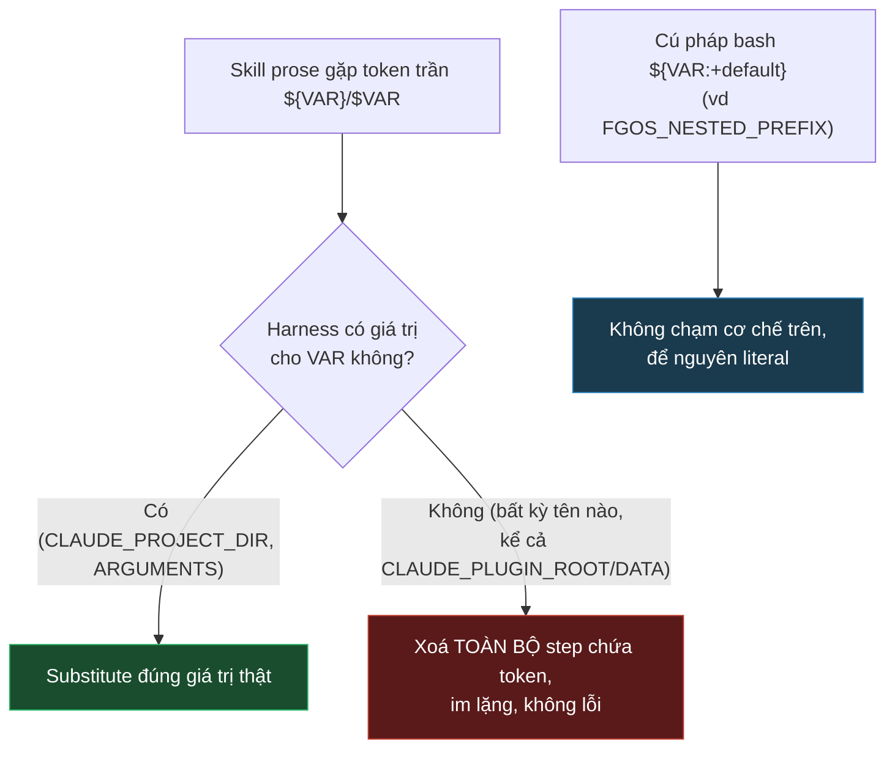

# fgOS plugin skill CLI resolution across install shapes

## 1. Trạng thái hiện tại

Round 3 xong, **D1 đã khoá** (xem §4/§5): ma trận 7 test thật (round 2 +
round 3) xác nhận chắc chắn — bất kỳ token `${VAR}`/`$VAR` trần nào không
có giá trị resolve được sẽ làm **im lặng biến mất cả step chứa nó**, không
đặc thù riêng `CLAUDE_PLUGIN_ROOT`. Loại bỏ hẳn hướng marketplace
self-locate (không chỉ "chưa đủ bằng chứng" như round 2 kết luận, mà giờ
**chủ động không an toàn**, độc lập với kiểu cài directory/github vì cùng
một nội dung file chạy cả hai nơi). Hướng còn lại: quay về D3 đã khoá ở
`tsk-1no` (PATH-fallback, mirror `scripts/fgos-shell-integration.sh`).

`tsk-1ri` thu hẹp phạm vi còn lại đúng như đã dự kiến ở round 2: chỉ còn
câu hỏi pillar 6 "global/project/dev-checkout priority" (vấn đề #5 ở §3),
chưa bắt đầu round nào cho nó.

Item nền `tsk-1no` (fix hẹp 23 file, PATH-fallback) đang đứng chờ approve
gate riêng, độc lập với discussion này — không bị ảnh hưởng bởi kết luận
này trừ khi người quyết định đổi hướng.

## 2. Mục tiêu & đề bài

Chủ sản phẩm muốn `/fgOS:*` (và về sau, lý tưởng là cả lớp dev-skill
`.agents/skills/fgos-*` nếu được tái dùng cho agent provider khác) chạy
được thật trên một **consumer project** — cụ thể là `herdr-gateway`, một
project đang phát triển sản phẩm khác, cài fgOS như một công cụ backlog,
không phải fork/dev fgOS. Bài toán rộng hơn `tsk-1no`: không chỉ vá 23 file
để không crash, mà thiết kế đúng cách fgOS tự nhận biết và ưu tiên đúng
giữa ba ngữ cảnh cài đặt luôn cùng tồn tại — global npm install, một
project đang phát triển sản phẩm khác (cài fgOS làm tool), và chính
forgent dev-checkout (tự dogfood) — không xung đột, theo đúng pillar 6 của
`docs/distribution-vision.md`.

## 3. Vấn đề rõ / chưa rõ

| # | Trạng thái | Vấn đề |
|---|---|---|
| 1 | **Rõ** | Plugin fgOS chỉ là UX kích hoạt `/fgOS:*`, không tự ý bundle CLI vào `plugin.json`'s declared content (D1, tsk-1no, chủ sản phẩm đã xác nhận) |
| 2 | **Rõ** | `claude plugin marketplace add <github-repo>` clone toàn bộ source repo (xác nhận thật bằng cách đọc `~/.claude/plugins/marketplaces/caveman/` trên máy dev — có `bin/`, `.git/`, toàn bộ cây, không chỉ phần plugin khai báo) |
| 3 | **Rõ (round 2)** | `${CLAUDE_PLUGIN_ROOT}` KHÔNG an toàn dùng trong skill prose — spike thật (§5 round 2) cho thấy nó âm thầm xoá cả block chứa nó thay vì substitute hay báo lỗi. Loại bỏ hướng marketplace-self-locate qua token này. |
| 4 | Đã loại bỏ cùng #3 | *(không còn áp dụng — không đi hướng này nữa)* |
| 5 | **Chưa rõ** | Cơ chế "project ghi đè global" (pillar 6) — hiện KHÔNG có tầng global config nào tồn tại trong code (`src/setup/config-merge.mjs` chỉ merge fill-missing-only cho MỘT file `.fgos/config.json` per-project, không đọc `~/.fgos/config.json` hay biến môi trường global nào). `docs/coexistence.md` là doctrine khác (fgOS chạy cạnh MỘT HARNESS KHÁC trong cùng project, không phải fgOS-vs-fgOS giữa nhiều cấp cài đặt) |
| 6 | **Rõ (round 2)** | Không còn câu hỏi "thay thế hay ưu tiên trước" — PATH-fallback (D3, tsk-1no) là hướng duy nhất còn lại cho phần "skill tự locate CLI" |

## 4. Quyết định đã chốt

| ID | Quyết định |
|----|---|
| D1 | Token `${VAR}`/`$VAR` trần (không có cú pháp bash default-expansion `:+`) không có giá trị resolve được sẽ làm harness **im lặng xoá cả step đánh số chứa nó** khỏi bản render skill prose — không đặc thù riêng namespace `CLAUDE_PLUGIN_*`, áp dụng cho BẤT KỲ token trần nào. Cú pháp `${VAR:+default}` (như `FGOS_NESTED_PREFIX` đang dùng) KHÔNG bị ảnh hưởng — để nguyên literal. Kết luận: loại bỏ hẳn `${CLAUDE_PLUGIN_ROOT}`/`${CLAUDE_PLUGIN_DATA}` khỏi mọi thiết kế cho plugin skill prose — không phải "chưa đủ chứng cứ" mà là "chủ động không an toàn", vì cùng một nội dung file chạy trên cả kiểu cài `directory` (dev, đã test trực tiếp) lẫn `github` (case herdr-gateway thật) — một token an toàn ở nơi này nhưng xoá nội dung im lặng ở nơi kia là một cái bẫy không chấp nhận được, bất kể hành vi thật trên `github`-source ra sao. |

## 5. Q&A log

**[2026-08-08 06:55] Scout (session, round 1):**
Đọc `src/setup/registrations.mjs:583-703` — phát hiện `fgos doctor --fix`
ĐÃ tự động hoá việc cài plugin marketplace cho consumer:
`claude plugin marketplace add vantt/forgent` rồi
`claude plugin install fgOS@fgos-plugins`. Đây là bằng chứng thật rằng lớp
phân phối PLUGIN (khác lớp phân phối CLI qua npm) đã có sẵn cơ chế tự
động, không phải một gap chưa thiết kế như tsk-1no ban đầu tưởng — gap thật
duy nhất là "skill tự locate CLI thật ở đâu", không phải "làm sao đưa
skill tới consumer project".

Kiểm tra thật trên máy dev: `claude plugin marketplace list --json` cho
thấy marketplace `fgos-plugins` ở máy NÀY được add kiểu
`"source": "directory", "path": "/home/vantt/projects/forgentX"` (add thủ
công lúc dev, trỏ thẳng checkout) — KHÁC với case thật một consumer chạy
`fgos doctor --fix`, case đó sẽ add kiểu `"source": "github", "repo":
"vantt/forgent"` (như `caveman`/`claude-plugins-official` đang thấy trong
list, cả hai đều có `"installLocation":
"/home/vantt/.claude/plugins/marketplaces/<name>"`). Đã xác nhận bằng
`find` trên `~/.claude/plugins/marketplaces/caveman/` — chứa nguyên `bin/`,
`.git/`, toàn bộ cây nguồn, không chỉ phần `skills/` plugin khai báo.

Dispatch `claude-code-guide` agent xác minh biến `${CLAUDE_PLUGIN_ROOT}`:
tài liệu chính thức (Plugins reference § Environment variables, v2.1+) xác
nhận biến này THẬT SỰ TỒN TẠI, trỏ tới thư mục cài của chính plugin — nhưng
chỉ export chắc chắn cho hook process + MCP/LSP subprocess. Claim của agent
rằng nó cũng substitute trong skill-embedded bash là suy luận, không trích
dẫn được nguồn chính thức cho đúng trường hợp này — cần một spike thật
(sửa một file plugin skill để echo `${CLAUDE_PLUGIN_ROOT}`, chạy slash
command thật, đọc output) trước khi khoá design theo hướng này.

**Câu hỏi cho người, round 1:** Trước khi đi tiếp — anh muốn ưu tiên hướng
nào để thiết kế tiếp?

(a) **Spike thật `${CLAUDE_PLUGIN_ROOT}` trước** — sửa tạm một file plugin
skill, chạy thật một slash command trên máy này, xem biến có substitute
không. Nếu đúng, đây là fix đẹp hơn nhiều: plugin tự chứa CLI thật qua
marketplace clone, không phụ thuộc PATH/npm nào nữa, giải quyết cả pillar 6
cho riêng lớp plugin (không cần global-config-priority phức tạp). Tốn thời
gian một spike nhỏ trước khi khoá.

(b) **Đi thẳng theo D3 đã khoá ở tsk-1no** (PATH-fallback, mirror
`scripts/fgos-shell-integration.sh`) — không phụ thuộc giả định chưa verify
được, chạy chắc chắn với mọi cách cài (kể cả không qua Claude Code plugin).
Không tận dụng được marketplace-clone dù nó có sẵn.

(c) **Cả hai** — thử `${CLAUDE_PLUGIN_ROOT}` trước, PATH-fallback (D3) làm
lớp dự phòng cuối nếu (a) không substitute hoặc người dùng không qua
Claude Code plugin.

**Người chọn (a).**

**[2026-08-08 07:14] Spike (session, round 2):**
Test thật trên 2 file plugin skill riêng biệt, mỗi lần dùng skill CHƯA
từng gọi trong phiên này (Skill tool dedup theo tên skill trong phiên —
gọi lại cùng tên không re-render file, phải dùng tên mới mỗi lần thử):

- Lần 1 (`plugins/fgOS/skills/ready/SKILL.md`): thêm step số "0." (lệch
  dãy số 1,2,3 gốc) chứa `echo "SPIKE_PLUGIN_ROOT=[${CLAUDE_PLUGIN_ROOT}]"`.
  Gọi `/fgOS:ready` → step "0." biến mất hoàn toàn khỏi bản render, nhảy
  thẳng từ header "## Steps" sang "1. **Ignore...**". Confound: có thể do
  số thứ tự lệch dãy, không chắc do `CLAUDE_PLUGIN_ROOT`.
- Lần 2 (`plugins/fgOS/skills/stale/SKILL.md`, chưa gọi lần nào trong
  phiên): thêm đúng step số "4." (nối tiếp dãy 1,2,3 gốc, không lệch số)
  cùng nội dung echo `${CLAUDE_PLUGIN_ROOT}`. Gọi `/fgOS:stale` → step "4."
  **vẫn biến mất hoàn toàn**, dù đúng dãy số liên tục. Cùng bản render đó,
  `${CLAUDE_PROJECT_DIR}` ở step 2 substitute đúng thành
  `/home/vantt/projects/forgentX`, `$ARGUMENTS` ở step 1 substitute thành
  rỗng — hai token khác hoạt động bình thường ngay trong cùng file.

Loại trừ được confound số thứ tự. Kết luận: `${CLAUDE_PLUGIN_ROOT}` là
token có thật (harness nhận diện, đúng như docs chính thức) nhưng ở kiểu
cài `"source": "directory"` (dev/local, đúng case máy này — plugin trỏ
thẳng checkout, không qua clone marketplace thật) không có giá trị thật để
gán, và thay vì để nguyên token hay báo lỗi, harness **âm thầm xoá cả
block chứa nó**. Failure mode này tệ hơn bug gốc của tsk-1no (crash rõ
ràng) — mất instruction hoàn toàn không dấu vết, agent chạy tiếp mà không
biết thiếu bước.

Cả 2 file spike đã `git checkout --` revert sạch ngay sau test, xác nhận
`git status --short` trống trên cả hai.

**Giới hạn của kết luận này:** chỉ test được trên kiểu cài
`"source": "directory"` (máy dev). Chưa test được trên kiểu cài thật
`"source": "github"` (case herdr-gateway thật sẽ dùng, qua `fgos doctor
--fix`) — có khả năng (dù không chắc) hành vi khác khi plugin thật sự nằm
trong `~/.claude/plugins/marketplaces/<name>/` thay vì trỏ thẳng dev
checkout. Test đó cần một máy/project cài thật qua github source, ngoài
tầm một spike rẻ trong phiên này.

**Đề xuất round 2:** loại bỏ hướng (a)/(c) cho tới khi có bằng chứng khác
từ một cài đặt github-source thật. Đi theo (b) — giữ nguyên D3 đã khoá ở
`tsk-1no` (PATH-fallback) làm hướng duy nhất cho câu hỏi "skill tự locate
CLI thật ở đâu". `tsk-1ri` thu hẹp phạm vi lại đúng như tên: chỉ còn giải
quyết pillar 6 phần "global/project/dev-checkout priority" (vấn đề #5 ở
§3), tách biệt khỏi câu hỏi CLI-resolution mà `tsk-1no` đã khoá xong.

**[2026-08-08 07:23] Ma trận test mở rộng (session, round 3):**
Người yêu cầu làm thêm nhiều test để chắc chắn trước khi khoá quyết định.
Chạy 5 test có kiểm soát, mỗi test tách một biến số, dùng skill ĐỌC-ONLY
chưa gọi lần nào trong phiên (list, graph, conflicts, triage, rollup — nối
đúng dãy số step tiếp theo, không phải case lệch số như round 2 lần 1) —
mỗi lần: sửa file, gọi `/fgOS:<verb>`, đọc bản render, `git checkout --`
revert ngay, xác nhận `git status --short` trống trước khi sang test kế:

| Test | File | Biến test | Kết quả |
|---|---|---|---|
| A | `list` | Token lạ hoàn toàn `${CLAUDE_TOTALLY_UNKNOWN_XYZ123}` (không phải `CLAUDE_PLUGIN_*`) | Step biến mất — **bác bỏ** giả thuyết "chỉ riêng namespace CLAUDE_PLUGIN_*" |
| B | `graph` | `${CLAUDE_PLUGIN_DATA}` (biến chính thức thứ 2, cùng họ với ROOT) | Step biến mất — nhất quán |
| C | `conflicts` | `$CLAUDE_PLUGIN_ROOT` (không dấu ngoặc `{}`) | Step biến mất — hành vi giống có ngoặc |
| D | `triage` | `${CLAUDE_PLUGIN_ROOT}` viết trong câu văn thường, KHÔNG trong code fence | Step biến mất — không phải do nằm trong code fence |
| E | `rollup` | `${CLAUDE_PLUGIN_ROOT}` ở đầu step + một dòng đánh dấu khác KHÔNG chứa token nào ngay sau đó, cùng step | **Cả 2 dòng biến mất cùng nhau** — xác nhận drop ở cấp TOÀN STEP, không phải chỉ riêng dòng chứa token |

Đối chiếu ngược với dữ liệu đã có sẵn trong chính các file (không cần sửa
gì thêm để quan sát): `${FGOS_NESTED_PREFIX:+/$FGOS_NESTED_PREFIX}` (cú
pháp bash default-expansion) xuất hiện y nguyên, không đổi, không mất,
trong MỌI lần render ở cả 7 test (round 2 + round 3) — cùng lúc
`${CLAUDE_PROJECT_DIR}` (token trần, có giá trị thật) luôn substitute đúng
thành path thật. Ba hành vi khác nhau, nhất quán 100% qua toàn bộ 7 lần
test độc lập:
1. Token trần CÓ giá trị (`CLAUDE_PROJECT_DIR`, `ARGUMENTS`) → substitute
   đúng.
2. Token trần KHÔNG có giá trị (bất kỳ tên nào, không riêng
   `CLAUDE_PLUGIN_*`) → xoá cả step chứa nó, im lặng, không lỗi.
3. Cú pháp bash default-expansion (`${VAR:+...}`) → để nguyên literal,
   không chạm tới cơ chế 1/2 ở trên.

Bonus safety check: `rg` toàn bộ 23 file `plugins/fgOS/skills/*/SKILL.md`
xác nhận hôm nay chỉ có đúng 3 pattern token đang dùng thật —
`${CLAUDE_PROJECT_DIR`, `$ARGUMENTS`, `${FGOS_NESTED_PREFIX:+...}` — không
có token trần nào khác đang âm thầm có nguy cơ bị xoá. Không phát hiện bug
tiềm ẩn nào khác ngoài phạm vi đã biết.

Toàn bộ 7 file spike (`ready`, `stale`, `list`, `graph`, `conflicts`,
`triage`, `rollup`) đã revert sạch, `git status --short` xác nhận repo
sạch (chỉ còn thay đổi thật từ các lệnh `fgos submit/edit/decision` của
chính discussion này, không phải từ spike).

**Kết luận round 3, khoá thành D1:** loại bỏ hẳn `${CLAUDE_PLUGIN_ROOT}`/
`${CLAUDE_PLUGIN_DATA}` khỏi thiết kế — không phải vì "chưa đủ test" như
round 2 còn để ngỏ, mà vì cơ chế drop áp dụng cho MỌI token trần không
resolve được, và cùng một nội dung file phải chạy đúng trên cả kiểu cài
`directory` (dev) lẫn `github` (production) — test trên `github`-source
thật (nếu có) không thể đổi kết luận này, vì bản thân `directory`-source
đã đủ chứng minh cơ chế nguy hiểm tồn tại trong chính cách harness diễn
giải file, độc lập với nguồn cài. Hướng duy nhất còn lại là D3 (tsk-1no,
PATH-fallback).

## 6. Thiết kế đã chốt {#design}

**Kết luận cho phần "skill tự locate CLI thật ở đâu":** giải quyết xong,
KHÔNG nằm trong `tsk-1ri` — thuộc `tsk-1no` (đã khoá D1-D3 riêng, xem
`docs/history/plugin-skill-cli-path-fallback/CONTEXT.md`), hướng
PATH-fallback (local `bin/fgos.mjs` → PATH `fgos` → lỗi rõ ràng, mirror
`scripts/fgos-shell-integration.sh`). Hướng thay thế "plugin tự chứa CLI
qua marketplace clone" (`${CLAUDE_PLUGIN_ROOT}`) đã bị loại bỏ dứt khoát
bởi D1 — không phải vì thiếu khả thi kỹ thuật của marketplace clone (điều
đó vẫn đúng: clone thật có `bin/fgos.mjs`), mà vì cơ chế render skill prose
của harness không an toàn cho BẤT KỲ token trần nào không chắc chắn
resolve được ở mọi ngữ cảnh cài đặt — một giới hạn của chính nền tảng
Claude Code plugin, không phải của thiết kế fgOS.

**Phạm vi còn lại của `tsk-1ri`, sau khi §3 vấn đề #1-4/#6 đã đóng bởi D1:**
chỉ còn duy nhất vấn đề #5 — pillar 6 "global/project/dev-checkout
priority" (không có tầng global config nào tồn tại trong code hôm nay,
`src/setup/config-merge.mjs` chỉ merge fill-missing-only cho MỘT file
per-project). Chưa mở round nào cho phần này — round 4 trở đi sẽ đi vào
đây khi người sẵn sàng tiếp tục.

## 7. Danh mục hạng mục / task

*(chưa có — §6 mới giải quyết một nhánh (CLI-resolution, giao lại cho
tsk-1no), nhánh còn lại (pillar 6 priority) chưa đủ hình dạng cụ thể để
tách task)*

## 7. Danh mục hạng mục / task

*(chưa có — chờ §6 ổn định)*
