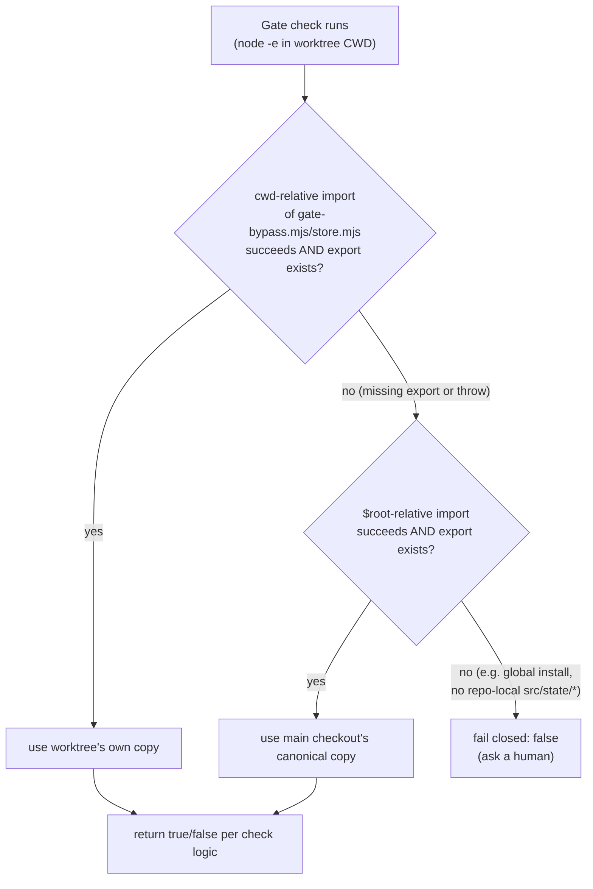

# gate-bypass — design discussion

Continuation of the `gate-bypass` feature (`CONTEXT.md` D1-D6, `plan.md`),
scoped to `tsk-1vi`: `canAutoApproveValidate`'s check throws on stale
`fgw/<id>` branches instead of returning a clean `false`.

## 1. Trạng thái hiện tại

Converged. Design locked as D7/D8 (recorded via `fgos decision --id
tsk-1vi`, seq 11476/11477). The fix is: all three skill-embedded
gate-bypass Gate sections (`fgos-coding-exploring`, `fgos-coding-planning`,
`fgos-coding-validating`) try the cwd-relative import first, fall back to a
`$root`-relative import only when the needed export is missing or the
import throws. The related but out-of-scope "global install always
crashes" gap was split out as its own backlog item, `tsk-65q`. Ready to
hand off to `fgos-coding-exploring` for `tsk-1vi`.

## 2. Mục tiêu & đề bài

`tsk-1vi` reports that `fgos-coding-validating`'s `validateApprove` gate-bypass
check (`.claude/skills/fgos-coding-validating/SKILL.md:181-191`) calls
`canAutoApproveValidate` via a `node -e` one-liner that dynamically
imports `./src/state/gate-bypass.mjs` — a path relative to the shell's
current working directory, not to `$root` (the main checkout). When a
session is working a claimed item inside its own `fgw/<id>` worktree
(the normal case per `fgOS:pick`), that CWD is the worktree, so the
import resolves to whatever copy of `gate-bypass.mjs` is checked out on
that branch. `tsk-5lr` forked its branch on 2026-08-06 and only reached
`validateApprove` on 2026-08-09 — three days later — by which point
`canAutoApproveValidate` (D6, landed 2026-08-09 per `CONTEXT.md`) had been
added to `main` but not yet to `tsk-5lr`'s branch. The destructured import
came back `undefined`, and calling it threw `TypeError:
canAutoApproveValidate is not a function`. The `node -e` script has no
try/catch around that call, so the exception propagated as an uncaught
error — which happened to fail closed (the session fell through to
asking a human) only because an uncaught exception's stdout is empty,
and the Gate section's own rule already treats anything other than
literal `true` on stdout as `false`.

Scouting `fgos-coding-exploring`'s and `fgos-coding-planning`'s own Gate sections
(`SKILL.md:286`, `SKILL.md:299`) surfaced that the cwd-relative import is
not an oversight: both carry the explicit line "the code
(`gate-bypass.mjs`/`store.mjs`) imports cwd-relative — this worktree's
own branch already carries whatever version it needs." That rationale
protects a real case — an item that is itself modifying
`gate-bypass.mjs` (the original D1-D5 rollout, or D6 adding
`canAutoApproveValidate`) needs its own gate check to run against its
own branch's in-progress code, since `main` doesn't have the new
function yet. A flat switch to `$root`-only import would fix `tsk-5lr`'s
class of bug but regress that self-referential case.

The person's own framing sharpened this further: forgentX runs fgOS in a
third, distinct context beyond global/project install — "dev-checkout
self-hosting" (`docs/distribution-vision.md` §2 trụ cột 6, updated
2026-08-01) — where fgOS develops itself, so the self-referential case is
real and current. Asked what happens when fgOS develops a *different*
product instead: project-local installs hit the same class of bug as
`tsk-5lr` (vendored code goes stale relative to an item's branch) but the
self-referential case essentially never applies (product engineers don't
edit fgOS's own internals); global installs have no repo-local
`src/state/*.mjs` at all, at either `./` or `$root`, so the import
crashes unconditionally for every item, not just stale ones — a
different, deeper gap than `tsk-1vi`'s.

The goal: make the fail-closed outcome an intentional, designed property
of the check (not an accident of an unhandled exception), fix the
stale-branch class of failure, and do it in a way that holds across all
three contexts (self-hosting, project-local, global) without expanding
`tsk-1vi`'s own scope into fixing the global-install gap.

## 3. Vấn đề rõ / chưa rõ

| # | Item | Status | Notes |
|---|------|--------|-------|
| 1 | Root cause is CWD-relative dynamic import resolving to the worktree's (possibly stale) branch copy of `gate-bypass.mjs`, not `$root`'s canonical copy | Rõ | Confirmed by reading `SKILL.md:181-191`, comparing `tsk-5lr`'s `branchHeadAtTake` (2026-08-06) against its `validateApprove` gate timing (2026-08-09). |
| 2 | Today's fail-closed outcome rides an uncaught-exception side effect, not an explicit check | Rõ | No try/catch around the call; saved only by the Gate section's own "anything but exactly `true` → false" consumer rule. |
| 3 | Cwd-relative import is a documented, deliberate choice for the self-referential case (an item editing `gate-bypass.mjs` itself must test its own branch's code) | Rõ | `SKILL.md:286` (fgos-coding-exploring), `SKILL.md:299` (fgos-coding-planning) both state this explicitly; `fgos-coding-validating`'s Gate section is missing the same explanatory line. |
| 4 | Fix scope: narrow try/catch vs. flat `$root`-only import vs. local-first-fallback-to-root | Rõ → D7 | Flat `$root`-only rejected: regresses the self-referential case. Local-first-fallback-to-root chosen: correct in both the self-referential case and the stale-branch case, and matches every other `fgos <verb>` call's already-established `$root`-relative convention (`node "$root/bin/fgos.mjs" ... --dir "$root"`) for everything except this one documented exception. |
| 5 | Whether the same fix generalizes across install contexts (self-hosting, project-local, global) | Rõ → D7/D8 | Self-hosting and project-local: local-first-fallback-to-root is correct in both. Global install: neither `./` nor `$root` has the file at all — separate, deeper gap, split out as `tsk-65q` rather than folded into `tsk-1vi`. |
| 6 | "Rebase long-idle branches before re-entering decompose" (bug report's third idea) | Chưa rõ, deprioritized | Not raised again after the code-level fix converged; the local-first-fallback-to-root design makes branch staleness self-healing without requiring a rebase step, so this was implicitly superseded rather than separately decided. Left open here in case a future round wants a process safeguard on top. |

## 4. Quyết định đã chốt

| ID | Decision |
|----|----------|
| D7 | All three gate-bypass Gate sections (`fgos-coding-exploring`/`fgos-coding-planning`'s `canAutoApprove` check, `fgos-coding-validating`'s `canAutoApproveValidate` check) try the cwd-relative import (`gate-bypass.mjs`/`store.mjs`) first; if the needed export is missing/undefined or the import throws, fall back to a `$root`-relative import before deciding `false`. Preserves the documented self-referential case (an item modifying `gate-bypass.mjs` itself still tests its own in-progress code) while fixing `tsk-5lr`'s stale-branch class (falls back to `main`'s canonical code when the worktree's copy lacks a newer export). A flat `$root`-only import was considered and rejected: it would regress the self-referential case that `fgos-coding-exploring`/`fgos-coding-planning`'s own SKILL.md already documents as intentional. |
| D8 | The global-install case (fgOS via `npm install -g`, no repo-local `src/state/*.mjs` at either `./` or `$root`) crashes the same import unconditionally for every item, not just stale branches — a different, deeper failure mode than `tsk-1vi`'s. Out of scope here; split out as its own backlog item (`tsk-65q`) rather than expanding `tsk-1vi`'s scope, per AGENTS.md's DoD-before-polish / no-scope-creep priority order. |

## 5. Q&A log

- **2026-08-10 10:40 (round 1, assistant → person):** Scouted
  `.claude/skills/fgos-coding-validating/SKILL.md:181-191`, `fgos-coding-exploring`'s and
  `fgos-coding-planning`'s equivalent Gate sections, `src/state/gate-bypass.mjs`,
  `docs/history/gate-bypass/CONTEXT.md` D6, and `tsk-5lr`'s own gate
  timestamps. Presented two candidate directions: (a) narrow try/catch
  around just the `validateApprove` call; (b) root-cause — switch all
  three Gate sections to `$root`-relative import. Also asked whether the
  bug report's "rebase long-idle branches" idea should be pursued
  alongside either. Awaited the person's answer.
- **2026-08-10 09:53 (round 2, person → assistant):** "2 - Root-cause
  fix." Chose the flat `$root`-only import direction.
- **2026-08-10 09:53 (round 2, assistant → person):** Before locking,
  re-read `fgos-coding-exploring`'s and `fgos-coding-planning`'s Gate sections in full
  and found the cwd-relative import is explicitly documented as
  intentional ("this worktree's own branch already carries whatever
  version it needs") — protecting the case where an item is itself
  modifying `gate-bypass.mjs`. Flagged that the person's chosen flat
  `$root`-only fix would regress that case, and proposed a third option:
  try local first, fall back to `$root` only if the needed export is
  missing. Presented per Review/Audit rule (verified decision, new
  evidence, trade-off, concrete options) rather than silently overriding
  the person's round-2 answer.
- **2026-08-10 10:00 (round 3, person → assistant):** "đồng ý" — Vietnamese for
  "understood/right." Confirmed the local-first-fallback-to-root reading
  directly maps to `docs/distribution-vision.md`'s three install
  contexts: dev-checkout self-hosting (forgentX developing itself — the
  self-referential case is real), project-local install (same
  stale-branch bug class, but self-referential editing of `gate-bypass.mjs`
  essentially never applies to a downstream product's own engineers), and
  global install (no repo-local `src/state/*.mjs` at all — a different,
  always-crash failure mode, not this item's scope).
- **2026-08-10 10:00 (round 3, assistant → person):** Answered both parts
  of the question directly, reconfirmed local-first-fallback-to-root holds
  across all three contexts, and proposed splitting the global-install gap
  into its own backlog item rather than expanding `tsk-1vi`. Asked the
  person to confirm both the design and the split.
- **2026-08-10 10:05 (round 3, person → assistant):** "đồng ý." Confirmed
  both. D7 and D8 minted and logged via `fgos decision --id tsk-1vi`
  (seq 11476, 11477). `tsk-65q` submitted for the global-install gap.

## 6. Thiết kế đã chốt {#design}

**Problem.** Three skill-embedded gate-bypass checks
(`fgos-coding-exploring`'s `contextApprove`, `fgos-coding-planning`'s `planApprove`,
`fgos-coding-validating`'s `validateApprove`) each run an inline `node -e`
script that dynamically imports `./src/state/gate-bypass.mjs` (and
`store.mjs`) relative to the shell's current working directory. Because a
claimed item's session normally works inside that item's own `fgw/<id>`
worktree, this import silently resolves to whatever copy of the file is
checked out on that item's branch — which can predate a function added to
`gate-bypass.mjs` by a different, already-merged item. `tsk-5lr`
demonstrated this: its branch forked before D6 added
`canAutoApproveValidate`, so the check crashed with an uncaught
`TypeError` and only "worked" because the crash's empty stdout happened
to satisfy the Gate section's existing "anything but `true` is `false`"
rule.

**Why not just always import from `$root`.** `fgos-coding-exploring`'s and
`fgos-coding-planning`'s own Gate sections already document that the
cwd-relative import is deliberate: an item that is itself modifying
`gate-bypass.mjs` (as the original D1-D5 rollout or D6 did) needs its own
gate check to exercise its own branch's in-progress code, since `main`
hasn't merged that change yet. Switching unconditionally to `$root` would
fix `tsk-5lr`'s bug but silently break that self-referential
self-testing case — an item extending `gate-bypass.mjs` would stop being
able to verify its own new behavior before merge.

**Design: local-first, fall back to `$root`.** Each Gate section's
`node -e` script tries the cwd-relative import first. If the needed
named export comes back `undefined`, or the import throws, it retries the
same import from `${root}/src/state/...` before falling through to
`false`. This holds correctly in all three scenarios that came up during
this discussion:

- **Self-hosting, self-referential item** (an item editing
  `gate-bypass.mjs` itself): worktree copy has the new export → path B-yes
  → uses its own in-progress code, unchanged from today's behavior.
- **Self-hosting or project-local install, unrelated item with a stale
  branch** (`tsk-5lr`'s class): worktree copy is missing the export →
  path B-no, D-yes → falls back to `$root`'s current code → check runs
  correctly instead of crashing.
- **Global install** (no repo-local `src/state/*.mjs` at either path):
  both imports fail → path B-no, D-no → falls through to the existing
  `false` fail-closed behavior, unchanged from today (still broken, but no
  more broken than before — `tsk-65q` owns fixing this separately).

This also brings the Gate sections' code-resolution behavior in line with
every other `fgos <verb>` invocation elsewhere in these same skill files,
which already resolve `bin/fgos.mjs` via `$root` (`node
"$root/bin/fgos.mjs" ... --dir "$root"`) rather than cwd-relative — the
Gate sections were the one place still diverging from that convention,
and now diverge from it only in the one case (self-referential editing)
that has a documented reason to.

**Touch points:** `.claude/skills/fgos-coding-exploring/SKILL.md` (Gate
section, `canAutoApprove` check), `.claude/skills/fgos-coding-planning/SKILL.md`
(Gate section, `canAutoApprove` check), `.claude/skills/fgos-coding-validating/
SKILL.md` (Gate section, `canAutoApproveValidate` check). No changes to
`src/state/gate-bypass.mjs` or `src/state/store.mjs` themselves — this is
purely a change to how the three `node -e` scripts resolve their own
imports.

## 7. Danh mục hạng mục / task {#tasks}

### {#task-gate-bypass-local-first-fallback}

**Goal:** replace the plain `import('./src/state/...')` calls in all
three Gate sections with a local-first, fallback-to-`$root` import
sequence, per §6's design and diagram.

**§6 excerpt this draws from:** the "Design: local-first, fall back to
`$root`" subsection and its diagram, above.

**Applicable D-IDs:** D7 (the fix itself), D8 (confirms the
global-install branch of the fallback intentionally still fails closed,
not fixed here).

**Sibling relationship:** single piece — the same fix pattern applied to
three files (`fgos-coding-exploring`, `fgos-coding-planning`, `fgos-coding-validating` Gate
sections). Whether these are worked as one task or split
file-by-file is `fgos-coding-planning`'s call, not decided here; nothing about
the three touch points has independent value or a different design.

**Draft verify:** existing `test/state/gate-bypass.test.mjs` covers
`canAutoApprove`/`canAutoApproveValidate`'s own logic and stays
untouched (no changes to `gate-bypass.mjs` itself). The new behavior
lives in the three `SKILL.md` Gate sections' shell snippets, which have
no existing automated test harness — verify by exercise: simulate a
stale worktree missing an export (e.g. temporarily stub an older
`gate-bypass.mjs` copy at the worktree-relative path used by the `node
-e` script) and confirm the check falls back to `$root`'s copy instead of
throwing, for at least one of the three Gate sections (`validateApprove`,
since that's `tsk-1vi`'s reported case).
