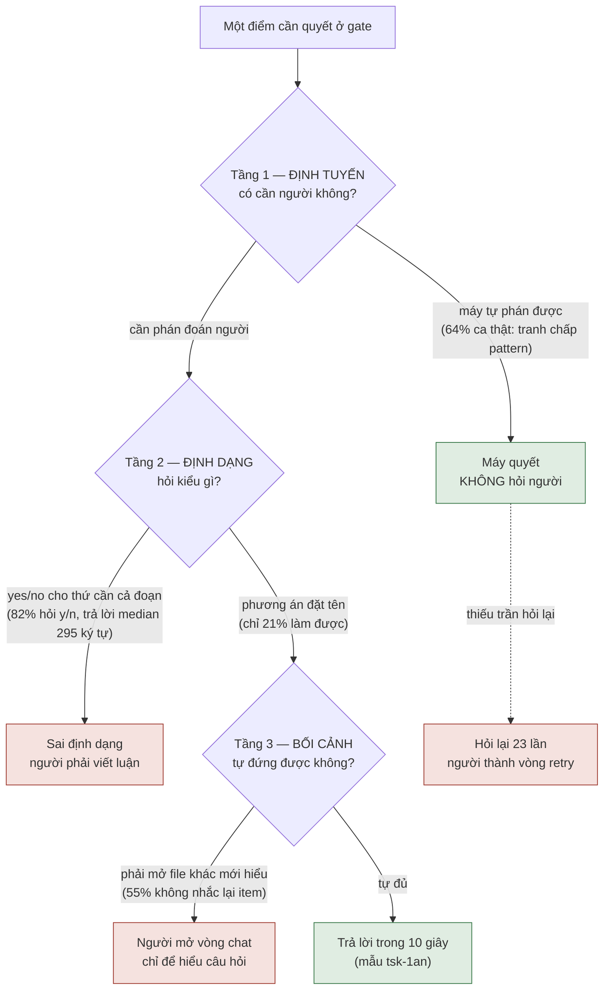

# Chất lượng và định tuyến câu hỏi gate — DISCUSSION

**Items:** `tsk-65i` (STR71b, định tuyến) · `tsk-539` (STR71, trình bày)
**Bắt đầu:** 2026-08-08 · **Vòng gần nhất:** 1

---

## 1. Trạng thái hiện tại

Vòng 1 vừa xong. Đây là vòng **đưa bằng chứng lên bàn**, chưa chốt thiết kế nào.

**Đã có:** một bộ số đo trực tiếp từ `.fgos/state.json` (445 work item, 314 lượt hỏi người thật)
định lượng được vấn đề mà STR71 mô tả bằng cảm nhận. Số đo cho thấy vấn đề **rộng hơn** phạm vi
STR71 đang giữ: STR71 lo *câu hỏi khó hiểu* (trình bày), nhưng phần lớn khối lượng nằm ở *câu hỏi
lẽ ra không nên tới người* (định tuyến) và *câu hỏi sai định dạng* (yes/no cho thứ không phải
yes/no).

**Đang mở:** toàn bộ phần thiết kế. Chưa chốt luật định tuyến, chưa chốt trần hỏi lại, chưa chốt
định dạng câu hỏi bắt buộc, chưa chốt cái này sống ở lớp nào (contract CTR004 / verb / skill prose).

**Vòng sau cần:** người chủ sản phẩm xác nhận cách phân ranh giới giữa "đừng hỏi" và "hỏi cho tốt",
vì nó quyết định `tsk-65i` và `tsk-539` là hai item hay một.

---

## 2. Mục tiêu & đề bài

Người vận hành fgOS phải trả lời quá nhiều câu hỏi, và phần lớn câu hỏi đó không đáng được hỏi —
hoặc vì máy tự phán được, hoặc vì được hỏi sai định dạng nên người phải bỏ công giải mã trước khi
bàn nội dung. Hệ quả không chỉ là mệt: vì 301/305 item chạy chế độ `sync`, một câu hỏi đậu lại
đồng nghĩa **phiên làm việc của người đứng im**, dù ở mức hệ thống thì các item khác vẫn chạy được.
Người mô tả trải nghiệm này nguyên văn là *"toàn những câu hỏi yes/no mà nếu không ngồi canh là cả
tiến trình dừng lại"*. Mục tiêu của cụm này là cắt khối lượng câu hỏi tới người xuống còn những thứ
thật sự cần phán đoán con người, và với phần còn lại thì hỏi sao cho trả lời được ngay mà không
phải mở một vòng chat chỉ để hiểu đang hỏi gì. Việc này gắn chặt với thứ tự triển khai kênh chú-ý
(STR48): xây kênh push trước khi sửa chất lượng câu hỏi sẽ khuếch đại đúng thứ đang cần giảm.

---

## 3. Vấn đề rõ / chưa rõ

### Đã rõ — số đo trực tiếp, không suy luận

Nguồn: `.fgos/state.json` (`gates`, `work`, `frictions`, `settlements`), đo ngày 2026-08-08.

| # | Sự thật đo được | Con số |
|---|---|---|
| R1 | Lượt hỏi người là **tranh chấp verify máy-vs-máy** (hai judge bất đồng về một lệnh/pattern) | **202 / 314 · 64%** |
| R2 | Lượt hỏi mang **dạng xác nhận / yes-no** | **258 / 314 · 82%** |
| R3 | Nhưng **câu trả lời median dài 295 ký tự**; chỉ 2/145 câu trả lời ngắn ≤20 ký tự | định dạng lệch |
| R4 | Câu hỏi có **phương án rõ ràng** (a)/(b) | 32 / 152 · 21% |
| R5 | Câu hỏi **tự nhắc lại item đang bàn** | 68 / 152 · 45% |
| R6 | Câu hỏi hỏi về **một lệnh shell** | 57 / 152 · 38% |
| R7 | Câu hỏi bắt **tra chéo ≥2 task id khác** | 19 / 152 · 13% |
| R8 | Item bị **hỏi lại ≥3 lần** | 34 |
| R9 | **Số lần hỏi nhiều nhất trên một item** | **23** (`tsk-48i`) |
| R10 | Item bị hỏi 10 lần | `tsk-4xg`, `tsk-66o` |
| R11 | Item dính ít nhất một tranh chấp verify | 70 / 152 |
| R12 | Item có settlement `answer/human` (tức phải lôi người vào) | 142 / 359 · 40% |
| R13 | Đậu vào `awaiting-human` theo stage | clarify 265 (84%) · decompose 40 · executing 9 |
| R14 | `verify-miss` trong tổng friction event | 87 / 141 · 62% |
| R15 | Item chạy `mode: sync` vs `async` | 301 vs 4 |
| R16 | Câu hỏi là boilerplate "Không phán được rõ ràng" | 7 / 152 · 5% |

**Diễn giải đã rõ:**

- **R1 + R6 → hỏi sai người.** Phán một pattern `grep` có chặt đủ không là thứ máy kiểm được bằng
  cách chạy thử và xem nó khớp gì. Người không có lợi thế thông tin nào ở đây. Khuôn lặp đi lặp lại:

  > *"Đề xuất verify bị nghi ngờ (chưa ghi vào clarify->decompose, cần xác nhận) — vòng 1 đề xuất:
  > `grep -q '\.parkReason' test/cli/fgos.test.mjs && node --test ...` — vòng 2 (kiểm tra độc lập)
  > không đồng ý: Pin quá lỏng và trùng tên với thứ đã hoạt động sẵn…"*

- **R2 + R3 → sai định dạng.** 82% hỏi yes/no nhưng người phải viết trung bình 295 ký tự mới trả
  lời được. Hai khả năng, và cả hai đều là lỗi: nếu thật sự là yes/no thì máy tự phán được; nếu cần
  cả đoạn giải thích thì lẽ ra phải là câu hỏi có phương án đặt tên (R4 cho thấy chỉ 21% làm vậy).

- **R8 + R9 → người bị dùng làm vòng retry.** `tsk-48i` bị hỏi 23 lần, mỗi lần là một biến thể
  `grep` hơi khác. Người không được hỏi *một quyết định*; người bị hỏi lại cho tới khi máy tự mò ra
  lệnh đúng. **Không có trần nào chặn việc này.**

- **R5 + R7 → không tự mang bối cảnh.** Hơn nửa câu hỏi buộc người chạy `fgos show <id>` mới hiểu
  đang bàn gì. Trường hợp nặng nhất: `tsk-42i` hỏi về nội dung một file **không tồn tại trong
  checkout** (`docs/history/gate-dialogue-continuity/CONTEXT.md`) — người về mặt vật lý không mở
  được thứ đang được hỏi.

- **R13 + R15 → nghịch lý chặn.** Kiến trúc khẳng định đậu không chặn (CTR004: *"hệ KHÔNG chặn,
  việc khác chạy tiếp"*), và đúng ở mức hệ thống — `fgos ready` loại item `awaiting-human` ra, item
  khác vẫn pick được. Nhưng vì 301/305 item chạy `sync`, thứ người **cảm nhận** là phiên của chính
  mình đứng im. Không mâu thuẫn: **hệ không chặn, phiên thì chặn.** Với tỉ lệ sync hiện tại, cái
  người sống cùng là vế thứ hai.

- **R1 + R14 → cùng một gốc.** 64% tranh chấp verify và 62% friction `verify-miss` không phải hai
  vấn đề. `verify` sinh kém lúc submit/clarify vừa gây hỏng lúc chạy vừa gây cãi lúc thẩm định.

- **Làm tốt được, và mẫu đã có sẵn trong chính dữ liệu.** 21% ở R4 chứng minh điều đó. Ví dụ
  `tsk-1an`, 222 ký tự, trả lời trong 10 giây không cần mở file nào:

  > *"Should fgOS worktrees use the lock-in-tree strategy (symlink `.fgos/` to shared store,
  > matching `session.mjs`) or the isolated-tree strategy (bootstrap-copy `.fgos/` per worktree
  > with union-merge at merge-back, matching beegog)?"*

  Hai phương án đặt tên, mỗi cái neo vào một thứ đã tồn tại trong repo để so sánh.

### Chưa rõ — cần bàn

| # | Câu hỏi mở | Vì sao chưa quyết được |
|---|---|---|
| Q1 | **Ranh giới "đừng hỏi" vs "hỏi cho tốt" nằm ở đâu?** | Quyết định này định đoạt `tsk-65i` và `tsk-539` là hai item hay một. Nếu ranh giới sắc (định tuyến quyết trước, trình bày chỉ áp cho phần lọt qua) thì tách; nếu mờ thì gộp. |
| Q2 | **Luật định tuyến phát biểu thế nào cho không quá tay?** | Đề xuất hiện tại: "bất đồng về *pattern/lệnh* là việc máy; chỉ escalate khi bất đồng về *mục tiêu* của verify". Chưa kiểm: có ca nào bất đồng pattern mà thật sự cần người không? |
| Q3 | **Trần hỏi lại N bằng bao nhiêu, và tại trần thì làm gì?** | Chuyển `blocked` kèm chẩn đoán là đề xuất, nhưng `blocked` cũng cần người. Có thể cần một trạng thái/nhãn khác, hoặc hạ verify xuống mức yếu hơn có khai báo. |
| Q4 | **Định dạng câu hỏi có nên cưỡng chế bằng máy không?** | R4/R5 gợi ý một validator (bắt buộc có phương án + nhắc lại item + không trỏ file không tồn tại). Nhưng cưỡng chế định dạng lên một trường văn xuôi tự do là thứ dễ phản tác dụng. |
| Q5 | **Cái này sống ở lớp nào?** | Contract CTR004 (ask/answer) / verb `ask` tự validate / skill prose / judge-executor. Ảnh hưởng tới việc nó có phải thay đổi hợp đồng hay không. |
| Q6 | **Sửa gốc `verify` có làm Q2 thành thừa không?** | Nếu `verify` sinh ra đủ tốt thì hai judge hết cãi, 64% tự biến mất. Có thể luật định tuyến chỉ là lưới an toàn, không phải giải pháp chính. Chưa biết tỉ trọng. |
| Q7 | **Quan hệ với STR70a/STR70b/tsk-42i?** | Cụm gate-dialogue đã có sẵn, nhưng nguồn thiết kế của nó (`gate-dialogue-continuity/CONTEXT.md`) **chưa bao giờ vào git** (`git log --all` rỗng) — 5 item và 2 dòng backlog đang trích một file không tồn tại. Cần biết phần nào của cụm đó còn đứng vững. |

---

## 4. Quyết định đã chốt

*(Trống — vòng 1. Theo luật của skill này, một điểm chỉ được cấp D-ID sau khi đứng vững qua hơn một
vòng mà không bị sửa. Mọi thứ ở §3 hiện là **bằng chứng** hoặc **đề xuất**, chưa phải quyết định.)*

| D-ID | Quyết định | Vòng chốt | `fgos decision` |
|---|---|---|---|
| — | — | — | — |

**Ứng viên D-ID cho vòng 2** (đã nêu ở vòng 1, chờ đứng vững thêm một vòng):

- Ràng buộc thứ tự với STR48: kênh chú-ý phải đi **sau hoặc đồng thời**, không bao giờ trước.
- Tranh chấp về pattern/lệnh không escalate lên người.
- Mỗi câu hỏi phải tự đứng được mà không cần mở file khác.

---

## 5. Q&A log

### 2026-08-08 — Vòng 1: quét toàn hệ, phát hiện vấn đề

**Bối cảnh khởi phát.** Người chủ sản phẩm yêu cầu quét toàn hệ fgOS đối chiếu tầm nhìn với thực
trạng vận hành (vision, 3 tiêu chí sản phẩm, code, tiêu chí UX), rồi mô tả quy trình mong muốn và
khoảng cách. Năm agent quét song song (vision / CLI+FSM / skills / backlog / UX+friction), cộng đo
trực tiếp trên `.fgos/events.jsonl` (9.693 event) và `.fgos/state.json` (445 item).

**Phát hiện ban đầu (sai một phần, đã sửa).** Chẩn đoán đầu tiên là "ba nút tắc, chưa ai bấm nút":
clarify kẹt 51 item (46 tự do chạy, 0 từng qua discovery), cleanup tồn 128 item (112 là leaf TTL 0
ngày, sẵn sàng đóng), async chỉ 4/305. Kết luận lúc đó: gỡ bằng cách chạy loop.

**Sửa lại sau khi quét lớp hợp đồng I/O.** Nguyên nhân gốc nằm cao hơn một bậc và là **quyết định
cố ý**: fgOS chưa có kênh chú-ý (attention/push) nào — mô hình pull đồng bộ thuần tuý, và
`system-overview.md:55` ghi nguyên văn *"poll bắt đầu khó chịu là tín hiệu kênh chú-ý đến lượt"*
(STR48 chưa khởi động, nằm ngoài core theo decision `0014`). Chuỗi: không có kênh chú-ý → async
không gọi được người quay lại → mọi người chạy sync → người dù sao cũng ngồi đó → nên lái tay thay
vì chạy loop → loop không chạy → clarify và cleanup dồn.

**Người chủ sản phẩm bổ sung quan sát then chốt (thời điểm này):**

> *"tôi muốn thêm vào 1 quan sát rất quan trọng đi kèm việc async/push notification là chất lượng
> đặt câu hỏi và thể hiện bối cảnh rất kém khiến người khó trả lời."*

**Đo kiểm quan sát đó** → toàn bộ bảng R1–R16 ở §3. Kết quả: quan sát đúng, và sắc hơn dự đoán —
64% lượt hỏi không phải câu hỏi khó hiểu mà là câu hỏi **không nên tới người**.

**Hệ quả về thứ tự ưu tiên (đề xuất tại vòng này).** Ban đầu xếp "xây kênh chú-ý" là việc số 1.
Sai thứ tự: đẩy câu hỏi hiện tại lên điện thoại = 23 thông báo về `grep` trên một item. Kênh chú-ý
khuếch đại chất lượng câu hỏi, tốt lẫn xấu. Nên sửa chất lượng/định tuyến câu hỏi **trước hoặc
đồng thời**.

**Người chủ sản phẩm bổ sung tiếp:**

> *"vấn đề rất mệt mỏi, toàn những câu hỏi yes/no mà nếu không ngồi canh là cả tiến trình dừng
> lại. `Không cái nào hỏi: câu hỏi này có nên tới người không?`"*

**Đo kiểm bổ sung** → R2 (82% dạng xác nhận/yes-no) và R3 (nhưng câu trả lời median 295 ký tự,
chỉ 2/145 ngắn ≤20 ký tự). Kết luận thêm: **định dạng câu hỏi lệch với hình dạng quyết định**.
Và làm rõ nghịch lý chặn: hệ không chặn (CTR004 đúng), nhưng phiên thì chặn — với 301/305 sync,
cái người sống cùng là vế thứ hai.

**Kiểm trùng trước khi tạo item (luật Scout First).** Phát hiện cả một cụm đã tồn tại:

| Item | Trạng thái | Nội dung |
|---|---|---|
| STR69a | done | chiếu `ask` vào `awaitingContext` |
| STR70a `tsk-19zm` | done | checkpoint distillate + record chốt 3 phần lên gate |
| STR70b `tsk-5dj` | todo | raw backstop — **chờ Q1 trong file đã mất** |
| STR71 `tsk-539` | todo @ clarify | chất lượng câu hỏi gate (ask self-sufficiency) |
| `tsk-42i` | **blocked** | đối thoại Socratic đồng bộ — **chặn vì file đã mất** |

`tsk-539` đúng là quan sát của người chủ sản phẩm, nhưng **hẹp hơn bằng chứng**: nó ghi *"người trả
lời gate thường không rõ nó đang hỏi gì"* → giải pháp viết `ask` tự đứng. Đó là **trình bày**. Cả
STR69/70/71 đều giả định câu hỏi là chính đáng, chỉ trình bày kém hoặc mất liên tục. Không cái nào
hỏi *"câu hỏi này có nên tới người không?"* — chính là chỗ 64% khối lượng nằm.

Trớ trêu phụ: `tsk-539` mang `verify: "chưa xác định — P15 bổ sung"` — item về chất lượng câu hỏi
đang mang đúng cái gốc gây ra 64% tranh chấp.

**Bằng chứng cho nhu cầu ghi nhận bền (lý do file này tồn tại).**
`docs/history/gate-dialogue-continuity/CONTEXT.md` — nguồn thiết kế mà STR70a/STR70b/STR71 đều
trích D1–D5/Q1 — **chưa bao giờ vào git** (`git log --all` rỗng cho đường dẫn đó). 5 work item và
2 dòng backlog đang phụ thuộc một file không tồn tại. `tsk-42i` đang `blocked` **chính vì** không
đọc được Q1 trong đó; `tsk-5dj` cũng đang chờ Q1 từ đó. Tức nỗi lo "đánh mất bối cảnh" không phải
giả thuyết — nó đã xảy ra, đúng trong khu vực này, và đang chặn việc thật.

**Quyết định phạm vi (người chủ sản phẩm chọn).** Tạo một item mới cho phần định tuyến
(`tsk-65i`), rồi shape cụm gồm nó + `tsk-539` trong một `DISCUSSION.md` chung, thay vì nới
`tsk-539` hay shape suông không tạo item.

**Yêu cầu chốt vòng:**

> *"nhớ thu hết tất cả research/finding thảo luận trong chat này vào phần discussion của task liên
> quan để giữ bối cảnh không mất"*

→ file này.

---

## 6. Thiết kế đã chốt {#design}

**Chưa có thiết kế để chốt.** Vòng 1 mới dựng xong đề bài và bằng chứng; mọi câu hỏi thiết kế
(Q1–Q7 ở §3) còn mở. Viết một §6 giả vờ đã hội tụ ở đây sẽ vi phạm đúng tinh thần của skill này.

Cái **đã** đứng vững đủ để một người lạ đọc và hiểu ngay, và cần giữ nguyên qua các vòng sau:

### Hình dạng vấn đề

Câu hỏi gate hỏng ở **ba tầng độc lập nhau**, và ba tầng này cần ba loại giải pháp khác nhau —
gộp chúng lại là lý do STR71 bị hẹp:

- **Tầng 1 · Định tuyến** — `tsk-65i`. Chỗ 64% khối lượng nằm. Chưa item nào từng phủ.
- **Tầng 2 · Định dạng** — chưa item nào phủ rõ; phát hiện mới ở vòng 1 (R2/R3).
- **Tầng 3 · Bối cảnh** — `tsk-539` / STR71. Đã có item.
- **Trần hỏi lại** — cắt ngang cả ba tầng, chưa item nào phủ.

### Ràng buộc thứ tự đã nhận diện

Không được xây kênh chú-ý STR48 trước khi xử lý tầng 1 và 2 — kênh push **khuếch đại** chất lượng
câu hỏi theo cả hai chiều. Đẩy 23 thông báo về `grep` lên điện thoại làm trải nghiệm tệ hơn hiện
tại, không tốt hơn.

Ràng buộc này đứng độc lập với việc chọn giải pháp nào cho từng tầng, nên nó là ứng viên D-ID
mạnh nhất cho vòng 2.

### Neo vào tiêu chí sản phẩm

Cụm này thuộc **tiêu chí 1 (Ship Faster)** — cụ thể hai vế *"không đoán mò"* và *"ít chờ đợi"*.
Theo `docs/decisions/0025`, thước đo là tốc độ của **project đang dùng fgOS**, và khi một lựa chọn
rẻ cho fgOS làm người vận hành chậm hơn thì chọn vế người vận hành. Hoãn cụm này để ưu tiên STR48
là đúng loại đánh đổi mà `0025` bảo không được làm.

---

## 7. Danh mục hạng mục / task {#tasks}

*(Tạm thời, theo hình dạng ba tầng ở §6. Sẽ chốt lại sau khi Q1 ngã ngũ — Q1 quyết định đây là hai
item hay một.)*

### tsk-65i · Định tuyến câu hỏi {#task-routing}

- **Mục tiêu:** câu hỏi chỉ tới người khi thật sự cần phán đoán người. Cắt phần lớn 64% ở R1.
- **Trích §6:** tầng 1 trong sơ đồ; nhánh "máy tự phán được".
- **D-ID áp dụng:** chưa có (vòng 1).
- **Quan hệ anh em:** đứng **trước** `tsk-539` trong luồng — chỉ thứ lọt qua tầng 1 mới cần tầng
  2/3. Nếu Q1 kết luận ranh giới mờ thì gộp với `tsk-539`.
- **Câu hỏi mở riêng:** Q2 (phát biểu luật), Q6 (sửa gốc verify có làm luật này thành thừa không).
- **Draft verify:** chưa xác định — phải chờ Q5 (cái này sống ở lớp nào) mới viết được lệnh thật.
  *Cố ý để trống thay vì bịa một lệnh `grep`, đúng thứ item này đang phê phán.*

### tsk-539 · Bối cảnh và định dạng câu hỏi {#task-self-sufficiency}

- **Mục tiêu:** câu hỏi lọt qua tầng 1 phải tự đứng được — nhắc lại item đang bàn, nêu phương án
  đặt tên, không trỏ vào thứ người không mở được.
- **Trích §6:** tầng 2 và tầng 3 trong sơ đồ.
- **D-ID áp dụng:** chưa có (vòng 1).
- **Quan hệ anh em:** phụ thuộc `tsk-65i` về mặt luồng (không phải về mặt dep cứng — hai cái sửa
  được song song).
- **Câu hỏi mở riêng:** Q4 (có cưỡng chế định dạng bằng máy không).
- **Ghi chú:** phạm vi hiện tại của item chỉ ôm tầng 3. Tầng 2 (định dạng yes/no lệch, R2/R3) là
  phát hiện mới — cần quyết cho vào đây hay tách.
- **Draft verify:** chưa xác định — chờ Q4.

### Chưa có item · Trần hỏi lại {#task-reask-cap}

- **Mục tiêu:** không item nào bị hỏi 23 lần. Tại trần, chuyển sang một trạng thái có chẩn đoán
  thay vì hỏi tiếp.
- **Trích §6:** nhánh đứt nét "thiếu trần hỏi lại" cắt ngang sơ đồ.
- **Quan hệ anh em:** cắt ngang cả `tsk-65i` và `tsk-539` — có thể là con của một trong hai, hoặc
  item riêng.
- **Câu hỏi mở riêng:** Q3 (N bằng bao nhiêu, tại trần làm gì — `blocked` cũng cần người nên có thể
  không phải đáp án đúng).
- **Chưa submit** — chờ Q1/Q3 để biết nó là item riêng hay con.

---

## Nguồn

- Số đo: `.fgos/state.json` (`gates` · `work` · `frictions` · `settlements`),
  `.fgos/events.jsonl` (9.693 event), đo 2026-08-08.
- Báo cáo quét đầy đủ:
  `plans/reports/from-scan-team-to-product-owner-260808-1241-end-to-end-operating-ux-gap-analysis-report.md`
  (§4.3b chất lượng câu hỏi, §5.1b chuỗi nhân quả thứ hai).
- Bản gọn + trang đọc: `plans/reports/fgos-operating-ux-gap.html`.
- Cụm liên quan: backlog `STR69a` / `STR70a` / `STR70b` / `STR71`;
  `docs/history/checkpoint-distillate-gate-provenance/` (STR70a, còn sống).
- ⚠️ `docs/history/gate-dialogue-continuity/CONTEXT.md` — **không tồn tại, chưa bao giờ vào git**,
  dù 5 item và 2 dòng backlog trích nó làm nguồn thiết kế.
