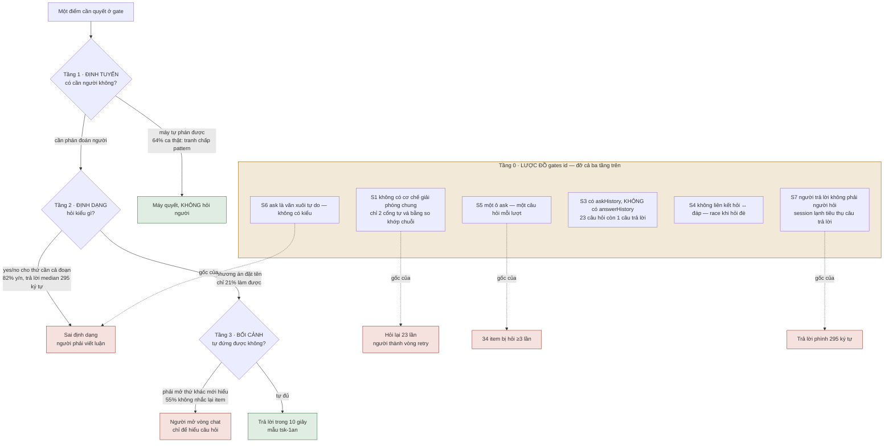
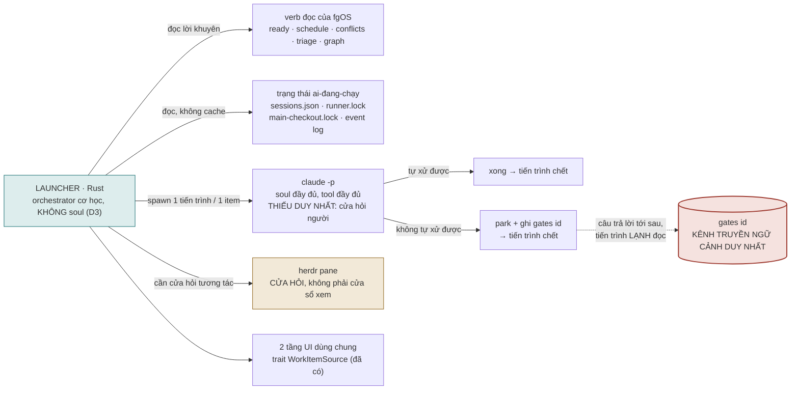
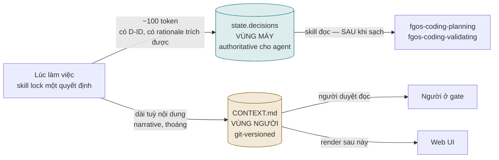

# Chất lượng và định tuyến câu hỏi gate — DISCUSSION

**Items:** `tsk-65i` (STR71b, định tuyến) · `tsk-539` (STR71, trình bày)
**Bắt đầu:** 2026-08-08 · **Vòng gần nhất:** 7

---

## 1. Trạng thái hiện tại

Năm vòng, cùng một ngày. Cuộc bàn đã mở rộng từ *"câu hỏi gate viết kém"* thành *"kiến trúc vận
hành nào khiến câu hỏi gate trở nên trả lời được"*.

**Đường đi của cuộc bàn:**

| Vòng | Đưa vào |
|---|---|
| 1 | Số đo trên 314 lượt hỏi thật — vấn đề rộng hơn phạm vi STR71 |
| 2 | Đọc code `ask`/`answer` → bảy vấn đề lược đồ S1–S7; khung ba tầng thành **bốn tầng** |
| 3 | Yêu cầu hai trục (lịch sử + nhận thức) → S8/S9/S10; **tự sửa một kết luận sai của vòng 1** |
| 4 | Đề xuất kiến trúc: một binary Rust = launcher + webserver + TUI, điều phối herdr/runner |
| 5 | Phản biện có bằng chứng → sửa lại thứ tự; **launcher và tầng 0 là cùng một việc** |
| 6 | Kiểm Q12 → **judge thứ hai ĐÃ bị khai tử trước cuộc bàn này**; 64% là ảnh chụp một cửa sổ đã đóng |
| 7 | Người chủ sản phẩm bác kết luận vòng 6 → **đo nhầm kênh**; yes/no thật nằm ở `gate-approve`, gấp 8 lần, và cơ chế giảm nó đã chết |
| 8-9 | `tsk-5hg` giao và **tự chứng minh chính nó**; `tsk-3vv` đo độ trôi backlog; ràng buộc đa ngôn ngữ hoá ra vốn đã nới |
| 10 | `contextApprove` sạch sau khi gỡ judge; Q16 trả lời; **`validateApprove` không phải cổng sản phẩm** — người chủ sản phẩm sửa tôi |
| 11 | D6 chốt; red-check + bài toán chọn test ghi nhận |
| 12 | Quay về nhu cầu gốc: **hai vùng lưu trữ cho hai người đọc**. Q8 chốt hoãn. **D7** |

**⚠️ Hai chỗ phải đọc trước khi dùng bất kỳ con số nào ở dưới — §3 "Bị lật ở vòng 6" và "Bị lật ở
vòng 7".**

- **Vòng 6:** con số **64% hỏi sai người** là ảnh chụp một cửa sổ đã đóng — LLM judge gây ra nó đã
  bị `tsk-1x3` khai tử **2026-08-07 11:39 +07** (commit `794df20`), giữa lúc dữ liệu được đo.
- **Vòng 7:** kết luận "vấn đề đã tự khỏi" của vòng 6 **cũng sai** — nó đo kênh `gates[id].ask` rồi
  tuyên bố về toàn bộ gánh nặng yes/no. Kênh thật là **`work.gate-approve`** (ba cổng skill), lớn
  **gấp 8 lần** và vẫn sống. Cơ chế `gate-bypass` sinh ra để giảm nó **đã bật nhưng gần như không
  bao giờ chạy được**: 1,6% trên toàn lịch sử, 0% kể từ 2026-08-07.

**Kết luận lớn nhất tới giờ (vòng 5):** một-tiến-trình-một-item (thiết kế launcher) biến S7 từ
*khuyết điểm* thành *bất biến cấu trúc*. Cắt ngữ cảnh giữa các item cũng cắt luôn ngữ cảnh giữa
câu hỏi và câu trả lời. Nên `gates[id]` chuyển từ "nên đầy đủ" thành **chịu lực** — nó là kênh
truyền ngữ cảnh **duy nhất** giữa tiến trình hỏi và tiến trình đọc câu trả lời. Tầng 0 không phải
nhánh song song với launcher; nó là **hạ tầng của launcher**.

**Đã chốt:** D1 (thứ tự với STR48), D2 (phải chạm lược đồ, không chỉ prose), D3 (launcher là
orchestrator cơ học không-soul).

**Đã bị sửa, không cấp D-ID** — bằng chứng luật D-ID hoạt động đúng:
- khung "ba tầng" (V1) → bốn tầng (V2)
- *"người bị dùng làm vòng retry"* (V1) → **sai**, người đang gỡ lỗi thật (V3)
- *"launcher chạy loop gỡ được 51+128"* (V4) → **sai một nửa**, chỉ đúng với cleanup (V5)
- *"launcher không làm được luật 2 của 0026"* (V4) → **phát biểu sai khung** (V5)

**Đang mở:** Q1–Q11, cộng Q12–Q15 mới.

**Vòng sau cần:** (a) kiểm giả thuyết rẻ nhất — judge thứ hai đang thẩm định *lệnh* thay vì *mục
tiêu*; (b) người chủ sản phẩm chốt Q14 (một tiến trình một item = song song hay tuần tự thật).

---

## 2. Mục tiêu & đề bài

Người vận hành fgOS phải trả lời quá nhiều câu hỏi, và phần lớn câu hỏi đó không đáng được hỏi —
hoặc vì máy tự phán được, hoặc vì được hỏi sai định dạng nên người phải bỏ công giải mã trước khi
bàn nội dung. Hệ quả không chỉ là mệt: vì 301/305 item chạy chế độ `sync`, một câu hỏi đậu lại
đồng nghĩa **phiên làm việc của người đứng im**, dù ở mức hệ thống thì các item khác vẫn chạy được.
Người mô tả trải nghiệm này nguyên văn là *"toàn những câu hỏi yes/no mà nếu không ngồi canh là cả
tiến trình dừng lại"*. Mục tiêu của cụm này là cắt khối lượng câu hỏi tới người xuống còn những thứ
thật sự cần phán đoán con người, và với phần còn lại thì hỏi sao cho trả lời được ngay mà không
phải mở một vòng chat chỉ để hiểu đang hỏi gì. Việc này gắn chặt với thứ tự triển khai kênh chú-ý
(STR48): xây kênh push trước khi sửa chất lượng câu hỏi sẽ khuếch đại đúng thứ đang cần giảm.

---

## 3. Vấn đề rõ / chưa rõ

### Đã rõ — số đo trực tiếp, không suy luận

Nguồn: `.fgos/state.json` (`gates`, `work`, `frictions`, `settlements`), đo ngày 2026-08-08.

| # | Sự thật đo được | Con số |
|---|---|---|
| R1 | Lượt hỏi người là **tranh chấp verify máy-vs-máy** (hai judge bất đồng về một lệnh/pattern) | **202 / 314 · 64%** |
| R2 | Lượt hỏi mang **dạng xác nhận / yes-no** | **258 / 314 · 82%** |
| R3 | Nhưng **câu trả lời median dài 295 ký tự**; chỉ 2/145 câu trả lời ngắn ≤20 ký tự | định dạng lệch |
| R4 | Câu hỏi có **phương án rõ ràng** (a)/(b) | 32 / 152 · 21% |
| R5 | Câu hỏi **tự nhắc lại item đang bàn** | 68 / 152 · 45% |
| R6 | Câu hỏi hỏi về **một lệnh shell** | 57 / 152 · 38% |
| R7 | Câu hỏi bắt **tra chéo ≥2 task id khác** | 19 / 152 · 13% |
| R8 | Item bị **hỏi lại ≥3 lần** | 34 |
| R9 | **Số lần hỏi nhiều nhất trên một item** | **23** (`tsk-48i`) |
| R10 | Item bị hỏi 10 lần | `tsk-4xg`, `tsk-66o` |
| R11 | Item dính ít nhất một tranh chấp verify | 70 / 152 |
| R12 | Item có settlement `answer/human` (tức phải lôi người vào) | 142 / 359 · 40% |
| R13 | Đậu vào `awaiting-human` theo stage | clarify 265 (84%) · decompose 40 · executing 9 |
| R14 | `verify-miss` trong tổng friction event | 87 / 141 · 62% |
| R15 | Item chạy `mode: sync` vs `async` | 301 vs 4 |
| R16 | Câu hỏi là boilerplate "Không phán được rõ ràng" | 7 / 152 · 5% |

**Diễn giải đã rõ:**

- **R1 + R6 → hỏi sai người.** Phán một pattern `grep` có chặt đủ không là thứ máy kiểm được bằng
  cách chạy thử và xem nó khớp gì. Người không có lợi thế thông tin nào ở đây. Khuôn lặp đi lặp lại:

  > *"Đề xuất verify bị nghi ngờ (chưa ghi vào clarify->decompose, cần xác nhận) — vòng 1 đề xuất:
  > `grep -q '\.parkReason' test/cli/fgos.test.mjs && node --test ...` — vòng 2 (kiểm tra độc lập)
  > không đồng ý: Pin quá lỏng và trùng tên với thứ đã hoạt động sẵn…"*

- **R2 + R3 → sai định dạng.** 82% hỏi yes/no nhưng người phải viết trung bình 295 ký tự mới trả
  lời được. Hai khả năng, và cả hai đều là lỗi: nếu thật sự là yes/no thì máy tự phán được; nếu cần
  cả đoạn giải thích thì lẽ ra phải là câu hỏi có phương án đặt tên (R4 cho thấy chỉ 21% làm vậy).

- **R8 + R9 → người bị dùng làm vòng retry.** `tsk-48i` bị hỏi 23 lần, mỗi lần là một biến thể
  `grep` hơi khác. Người không được hỏi *một quyết định*; người bị hỏi lại cho tới khi máy tự mò ra
  lệnh đúng. **Không có trần nào chặn việc này.**

- **R5 + R7 → không tự mang bối cảnh.** Hơn nửa câu hỏi buộc người chạy `fgos show <id>` mới hiểu
  đang bàn gì. Trường hợp nặng nhất: `tsk-42i` hỏi về nội dung một file **không tồn tại trong
  checkout** (`docs/history/gate-dialogue-continuity/CONTEXT.md`) — người về mặt vật lý không mở
  được thứ đang được hỏi.

- **R13 + R15 → nghịch lý chặn.** Kiến trúc khẳng định đậu không chặn (CTR004: *"hệ KHÔNG chặn,
  việc khác chạy tiếp"*), và đúng ở mức hệ thống — `fgos ready` loại item `awaiting-human` ra, item
  khác vẫn pick được. Nhưng vì 301/305 item chạy `sync`, thứ người **cảm nhận** là phiên của chính
  mình đứng im. Không mâu thuẫn: **hệ không chặn, phiên thì chặn.** Với tỉ lệ sync hiện tại, cái
  người sống cùng là vế thứ hai.

- **R1 + R14 → cùng một gốc.** 64% tranh chấp verify và 62% friction `verify-miss` không phải hai
  vấn đề. `verify` sinh kém lúc submit/clarify vừa gây hỏng lúc chạy vừa gây cãi lúc thẩm định.

- **Làm tốt được, và mẫu đã có sẵn trong chính dữ liệu.** 21% ở R4 chứng minh điều đó. Ví dụ
  `tsk-1an`, 222 ký tự, trả lời trong 10 giây không cần mở file nào:

  > *"Should fgOS worktrees use the lock-in-tree strategy (symlink `.fgos/` to shared store,
  > matching `session.mjs`) or the isolated-tree strategy (bootstrap-copy `.fgos/` per worktree
  > with union-merge at merge-back, matching beegog)?"*

  Hai phương án đặt tên, mỗi cái neo vào một thứ đã tồn tại trong repo để so sánh.

### Đã rõ — bảy vấn đề cấu trúc của `ask`/`answer` (vòng 2, đọc code trực tiếp)

Nguồn: `src/state/replay.mjs:196-230` (fold gate), `src/intake/plan.mjs:625-655` (bypass),
grep toàn `src/`.

| # | Vấn đề cấu trúc | Bằng chứng |
|---|---|---|
| S1 | **Không có cơ chế chung "câu trả lời này giải phóng câu hỏi kia"** — chỉ 2 cổng tự vá tay (`keywordRiskGate`, `blastRadiusGate`); cổng tranh chấp verify (64% khối lượng) **không có kiểm nào** | `decompose.mjs:638,646` |
| S2 | **So khớp chuỗi làm hợp đồng** — điều kiện giải phóng là `gate.ask.includes("<literal>")`; đổi câu chữ câu hỏi thì câu trả lời cũ thôi tác dụng | `decompose.mjs:638` |
| S3 | **`askHistory` có, `answerHistory` KHÔNG** — grep toàn `src/` ra 0. `tsk-48i` giữ đủ 23 câu hỏi nhưng **chỉ còn câu trả lời cuối**; 22 quyết định của người đã bốc hơi | `replay.mjs:214` vs grep |
| S4 | **Không có liên kết câu hỏi ↔ câu trả lời** — hai ô độc lập trên cùng object, không id, không con trỏ. Hỏi đè trước khi người kịp trả lời ⇒ câu trả lời gắn vào câu hỏi **mới** trong khi người đang đọc câu **cũ** | `replay.mjs:202,215` |
| S5 | **Một item chỉ hỏi được một câu tại một thời điểm** — `gates[id]` một object, một ô `ask`. Session có 3 câu hỏi độc lập phải tuần tự hoá thành 3 vòng người-quay-lại | `replay.mjs:200` |
| S6 | **Câu hỏi không có kiểu** — `ask` là văn xuôi tự do. Không định tuyến/gộp/render phương án/tự-trả-lời-một-lớp/validate-trước-khi-đậu được | không có trường `kind` trong fold |
| S7 | **Người trả lời không phải người hỏi** — `answer` đưa item về `todo`; session đã hỏi đã chết, một session **lạnh** khác tiêu thụ câu trả lời. Nên **câu trả lời cũng phải tự đứng được**, vế chưa ai nhìn | `store.mjs` `answerAwaiting` |

**Tiền lệ đã được ghi trong chính code.** Comment tại `decompose.mjs:630-635` mô tả đúng sự cố mà
R9 đo lại được, và đã từng vá một lần:

> *"this hard risk gate used to re-fire unconditionally on every call — a human answering
> `fgos answer` never released it, **re-parking the exact same question forever** (dogfood,
> 2026-07-28)"*

Bản vá đó **chỉ áp cho 2 cổng**, bằng so khớp chuỗi. Cổng chiếm 64% khối lượng không được vá.

**Ánh xạ ngược: mọi con số lớn đều có gốc ở tầng dữ liệu**

| Số đo (§3 trên) | Gốc cấu trúc |
|---|---|
| R9 — 23 lần hỏi trên một item | S1 thiếu cơ chế giải phóng chung |
| R2 — 82% dạng yes/no | S6 không có kiểu câu hỏi để chọn |
| R3 — trả lời median 295 ký tự | S7 người đang bù ngữ cảnh cho một người đọc vô hình |
| R8 — 34 item bị hỏi ≥3 lần | S5 một câu hỏi mỗi lượt |

Đây là lý do vòng 2 kết luận **sửa ở tầng skill/prompt không đủ**.

### Đã rõ — ba lỗ của trục thời gian và trục nhận thức (vòng 3)

Bật ra từ yêu cầu: *"phải tổ chức trình bày câu hỏi step by step theo tiến trình lịch sử và tiến
trình nhận thức (mức độ rõ ràng) dẫn tới câu hỏi hiện tại."*

| # | Vấn đề | Bằng chứng |
|---|---|---|
| S8 | **`askHistory` trong view là chuỗi trần** — không `ts`, không `seq`, không ghép được với `discovery`/`decisions`/timeline. Event log **có** đủ `ts`; chính bước fold làm rơi | `replay.mjs:214` vs `discovery` entries có `ts` |
| S9 | **Không có trục "mức độ rõ ràng"** — `discovery.clear` là boolean phát lại mỗi vòng, không phải đại lượng tiến hoá. `tsk-48i`: 27 entry, ba entry đầu đều `clear:true` trong 60 giây trong khi verify vẫn đang đổi | `state.discovery['tsk-48i']` |
| S10 | **Câu hỏi không tích luỹ nhận thức** — **23/23** ask mở đầu `"vòng 1 đề xuất"`; vòng thứ 17 vẫn tự giới thiệu là vòng 1. **0/23** ask nhắc lại thứ người đã phát hiện (`tier`/`Haiku`/`Opus`/`binary path`) | `gates['tsk-48i'].askHistory` |

**S10 giải thích R3 tốt hơn S7.** Câu trả lời phình 295 ký tự vì mỗi vòng người phải dựng lại ngữ
cảnh từ đầu cho một câu hỏi vừa quên sạch.

**Tự sửa một kết luận của vòng 1.** Vòng 1 viết *"người bị dùng làm vòng retry chứ không phải người
ra quyết định"*. Đọc 46 event thật của `tsk-48i` (03:12→03:52, 23 cặp ask/answer) thì **sai**:

| Thời điểm | Người phát hiện |
|---|---|
| 03:21 | đổi hướng — item phải tách thành 2 con |
| **03:25** | **root cause: tier `light` dùng judge Haiku, không đủ ổn định** |
| **03:36** | **bug thật: `parkReasonFor('doing')` là `undefined`** |
| 03:41 | nâng tier lên `heavy` — `standard` vẫn chưa đủ |
| 03:46 | binary path cứng trỏ main checkout thay vì code thật |

Đây là một phiên gỡ lỗi thật, không phải 23 lần bấm nút. **Thứ hỏng không phải người bị hỏi lại —
mà là 23 vòng suy luận của người bị nén còn 1 ô.** Điều này làm S3 nặng hơn nhiều so với đánh giá
vòng 2: 22 thứ mất đi gồm cả một chẩn đoán root cause và một bug thật.

### Đã rõ — vì sao loop không dùng được, và runner đứng ở đâu (vòng 5)

| # | Sự thật đo được | Con số |
|---|---|---|
| R17 | **Item đã được phán rõ đầu bài VẪN bị judge thứ hai chặn** | **70/227 · 31%** |
| R18 | Item ở clarify chưa từng có discovery entry | **0/51** — chưa ai chạm |
| R19 | `triage` hôm nay: phân bố `blocks` | **70/77 = 0**, chỉ 7 item = 1 |
| R20 | Runner chọn item bằng | **FIFO thuần** (`loop.mjs:3,979`), không dùng `triage`/`schedule` |
| R21 | `--once` rút bao nhiêu item | **bounded drain nhiều item**, tới `maxRoots`×`maxLeavesPerRoot` |
| R22 | Chi phí spawn một verb đọc | **0,13s** (đo 3 lần, ổn định) |
| R23 | Park theo stage | clarify 265 (84%) · decompose 40 · **executing 9** |

**Cơ chế thật khiến `discover-loop` bị bỏ.** Spec ghi rõ park *"never a reason to stop"* — nên loop
**không** tự tắt vì park (auto-stop thật chỉ có: pool rỗng, lock-timeout, trần 15 vòng). Nhưng có
**hai judge nối tiếp**: judge 1 (`discovery.clear`) pass 88%, rồi judge 2 (verify semantic check)
vẫn chặn **31%** số đã pass. `tsk-48i` là ca mẫu — 27 entry discovery đều `clear:true`, mà vẫn 23
câu hỏi. Người chạy loop thấy cứ 3 item thì 1 cái đậu với câu hỏi `grep` không trả lời được, năng
suất sụp, rồi bỏ. R18 là dấu vết: 51 item chưa từng được chạm.

**Hệ quả cho thiết kế launcher:**

| Loop | Launcher cơ học gỡ được? |
|---|---|
| `cleanup-loop` | ✅ toàn cơ học (TTL/nội dung/merge-ancestry), không judge LLM, không hỏi — chính vì vậy nó **không có trần vòng lặp**. Gỡ trọn 112 item |
| `discover-loop` | ❌ 31% park; launcher chỉ sinh câu hỏi không người trả lời nhanh hơn |
| `merge-loop` | ⚠️ phần lớn cơ học, Iron Law block vẫn cần người |

**`code-implement` headless hoá được ngay:** `doing → awaiting-approval` median **0,3h**, park ở
executing chỉ **9 lần** (R23). Khâu này không chờ gì cả.

**Về `0026` luật 2 — sửa một phát biểu sai của vòng 4.** Vòng 4 viết *"launcher không làm được luật
2"*. Sai khung. `claude -p` là một tiến trình agent **đầy đủ tool và quyền**; thứ duy nhất nó thiếu
so với interactive là **cửa hỏi người**. Nên:

- Ở biên **Rust → Claude**, luật 2 không áp dụng — không có soul nào ở trên để kế thừa ngữ cảnh.
- Con Claude vừa spawn **chính là soul sống**; khi nó cần một capacity, luật 2 áp dụng **bên trong
  nó**, thấp hơn một tầng.
- Launcher không hụt gì so với `0026`.

**Và điều này chứng minh ngược lại điểm về loop:** cơ chế `ask` là thứ **duy nhất** làm vận hành
headless gãy. `0026` luật 1–4 nói về *kế thừa ngữ cảnh*, hoàn toàn trực giao với vấn đề *kênh
người*. Một `claude -p` có đủ soul mà không có cửa hỏi — nên pane herdr không phải để **xem**, mà
là **cửa hỏi** cho một tiến trình vốn không có cửa nào.

### 🔴 BỊ LẬT Ở VÒNG 6 — judge thứ hai đã bị khai tử trước cuộc bàn này

Kiểm Q12 bằng cách đọc code. Kết quả lật cột chống lớn nhất của vòng 1.

**`judgeVerifySemanticCorrectness` hôm nay KHÔNG còn là LLM judge.** Nó là một hàm cơ học 14 dòng
(`src/intake/verify-pattern-check.mjs`) kiểm đúng **một** bẫy có tài liệu (`node --test` kèm grep
`^# pass`/`^# fail`), còn lại trả `{agrees: true}`. Header file tự khai:

> *"mechanical-only replacement for the **retired** judgeVerifySemanticCorrectness LLM second-pass
> (tsk-1x3 D17). The old function ran unconditionally on every accepted verdict… D9 retires
> runJudgeExecutor's every consumer."*

Commit `794df20`, **2026-08-07 11:39 +07**. `tsk-1x3` status `done`.

| # | Bằng chứng | Con số |
|---|---|---|
| R24 | Tranh chấp verify theo ngày | 08-03: 8 · 08-04: 33 · **08-05: 120** · 08-06: 33 · 08-07: 8 · **08-08: 0** |
| R25 | Tranh chấp sau giờ commit (04:39 UTC ngày 08-07) | **3**, đều trong 2 giờ đầu — session còn chạy code cũ |
| R26 | Tranh chấp trong ~26 giờ gần nhất | **0** |
| R27 | Hệ có đứng im không? | **Không** — 783 event, **33 item tiến stage** sau khi gỡ |
| R28 | Tỉ lệ hỏi người, chuẩn hoá theo `work.stage` | **trước 0,53 → sau 0,18 · giảm 65%** |

**Hệ quả — cái gì đổ, cái gì đứng:**

| Phát biểu vòng 1–2 | Sau vòng 6 |
|---|---|
| R1 — 64% lượt hỏi là tranh chấp verify máy-vs-máy | 🔴 **lịch sử** — nguyên nhân đã gỡ |
| R11 — 70/152 item dính tranh chấp | 🔴 **lịch sử** |
| R17 — 31% item đã rõ vẫn bị judge 2 chặn | 🔴 **lịch sử** |
| R9 — một item bị hỏi 23 lần | 🟡 **còn**, nhưng nguyên nhân nay khác: S1 (thiếu cơ chế giải phóng) vẫn nguyên, chỉ là nguồn sinh câu hỏi đã bớt |
| R2/R3 — 82% yes/no, trả lời 295 ký tự | 🟢 **còn nguyên** — không liên quan judge |
| R4/R5/R7 — 21% có phương án, 45% nhắc lại item | 🟢 **còn nguyên** |
| R8 — 34 item bị hỏi ≥3 lần | 🟢 **còn nguyên** |
| S1, S3, S4, S5, S6, S7, S8, S9, S10 | 🟢 **còn nguyên** — không cái nào đụng tới judge |
| S2 — so khớp chuỗi làm hợp đồng | 🟢 **còn nguyên** |

**Tóm lại: tầng 1 (định tuyến) đã tự khỏi phần lớn; tầng 0, 2, 3 còn nguyên vẹn.**

**D2 vẫn đứng, dù mất một cột chống.** D2 dựa trên bốn ánh xạ R9→S1, R2→S6, R3→S10, R8→S5. Ba cái
sau còn nguyên; R9 còn nhưng đổi nguyên nhân. Prose vẫn không ép được S2–S10.

**Một cái giá đã được khai báo, chưa được kiểm.** Chính file thay thế ghi thẳng:

> *"this file does **NOT** catch the class of defect the old LLM branch caught **twice, live** — a
> verify that is syntactically fine shell but targets the wrong claim. That responsibility now
> belongs to whichever skill calls `fgos discover`/`fgos plan`, backed by `fgos-coding-validating`'s
> own reality-gate discipline."*

Trách nhiệm **chuyển**, không biến mất — từ một subprocess mù sang một phiên sống (vốn hỏi tốt hơn
nhiều). Hướng đúng, nhưng 26 giờ chưa đủ để nói nó bắt được. `verify-miss` (R14: 87/141 = 62%
friction) chính là loại lỗi đó → thành Q16.

**Bài học phương pháp, đáng giữ:** cả cuộc bàn suýt thiết kế một cơ chế lớn cho một vấn đề đã được
vá ba ngày trước, vì đo state mà không đọc code. Số đo nói *cái gì đã xảy ra*, không nói *hôm nay
còn xảy ra không*. Với một repo đổi nhanh như repo này, **mọi số đo cần một mốc "code tại thời
điểm nào"** kèm theo.

### 🔴 BỊ LẬT Ở VÒNG 7 — đo nhầm kênh; yes/no thật nằm ở `gate-approve`

Người chủ sản phẩm bác kết luận vòng 6: *"sai sót 64% tôi vẫn cảm thấy vẫn còn vì còn quá nhiều
câu hỏi dạng yes no vẫn còn bị hỏi."* Kiểm lại — **đúng, và vòng 1–6 đã đo sai kênh.**

Toàn bộ số đo từ vòng 1 tới vòng 6 đọc `gates[id].ask`. Nhưng ba cổng skill —
`contextApprove` / `planApprove` / `validateApprove` — **không đi qua `ask`**. Chúng đi qua event
`work.gate-approve`, một kênh riêng chưa từng được xét.

| # | Bằng chứng | Con số |
|---|---|---|
| R29 | `gate-approve` **trước** gỡ judge | 318 (`contextApprove` 132+6bypass · `planApprove` 95 · `validateApprove` 85) |
| R30 | `gate-approve` **sau** gỡ judge | **48** (`contextApprove` 8 · `planApprove` 19 · `validateApprove` 21) — so với **6** lượt `ask` cùng kỳ |
| R31 | Tỉ lệ bypass thực tế toàn lịch sử | **6/366 = 1,6%**; **0** kể từ 2026-08-07 |
| R32 | `CONTEXT.md` qua được `hasOpenItems` | **21/197 = 11%** (chặn: thiếu mục 142 · TODO/FIXME 34) |
| R33 | `plan.md` qua được `hasOpenItems` | **1/189 = 1%** (chặn: thiếu mục 161 · TODO/FIXME 27) |

**Gánh nặng yes/no thật lớn gấp 8 lần kênh đã đo** — và đây là dạng yes/no thuần tuý nhất, hỏi
trên **mỗi item** đi qua exploring/planning/validating.

**Vì sao cơ chế giảm nó không chạy.** `.fgos/gate-bypass.json` = `{"level":"standard"}` (bật, phủ
tier light+standard ≈ 82% item). Nhưng `canAutoApprove` đòi ba điều kiện, và `hasOpenItems` chặn
gần hết: nó yêu cầu artifact có mục **đúng chữ** `## Outstanding questions` với body **đúng chữ**
`None`.

**Nguyên nhân gốc:** `fgos-coding-exploring/SKILL.md` và `fgos-coding-planning/SKILL.md` **không hề nhắc tới
`Outstanding questions`**. Skill viết artifact không biết mình phải viết mục đó.
`gate-bypass.mjs` tự ghi *"the convention this item's own CONTEXT.md/plan.md already follow"* —
tác giả tưởng quy ước đã được tuân thủ; thực tế 89% `CONTEXT.md` và **99% `plan.md`** không có.

**Ba mảnh, độ khó khác nhau:**

| Mảnh | Bản chất | Sửa |
|---|---|---|
| Bypass chết vì thiếu quy ước (R32/R33 "thiếu mục") | **bug thật** — hai lớp không khớp nhau | Rẻ nhất: nối quy ước vào hai skill viết artifact. Không nới luật an toàn nào — fail-closed khi thiếu mục là **đúng** |
| `TODO`/`FIXME` chặn 34+27 ca | **không phải bug** | Artifact còn TODO thì không nên tự duyệt |
| `validateApprove` không bao giờ bypass được | **thiết kế có chủ ý** — `actor` hardcode `human` | Chiếm **21/48 = 44%** cổng gần đây. Kể cả sửa xong mảnh 1, ~1/3 cổng vẫn là người. Câu hỏi thiết kế thật → Q18 |

**Hệ quả lên khung bốn tầng:** ba cổng này là yes/no **theo cấu trúc**, không do viết kém — chúng
chỉ có thể là duyệt/không-duyệt, không thể thành câu hỏi có phương án. Nên với chúng, hướng đi
không phải *"hỏi cho tốt hơn"* (tầng 2/3) mà là ***"hỏi ít hơn"*** — tức đúng cơ chế bypass đang
chết. Đây là một nhánh riêng của tầng 2, chưa từng có trong khung.

**Và nó sửa lại kết luận vòng 6:** *"tầng 1 đã tự khỏi"* chỉ đúng cho kênh `ask`. Tính cả
`gate-approve`, gánh nặng hỏi người **không hề giảm** — chỉ chuyển kênh trong mắt người đo.

**Bài học phương pháp thứ hai, bổ sung cho vòng 6:** vòng 6 dạy *"đo state phải kèm mốc code"*.
Vòng 7 dạy *"đo một kênh rồi kết luận về toàn bộ hiện tượng là sai"* — người dùng cảm nhận **tổng**
gánh nặng, không cảm nhận theo từng bảng dữ liệu. Khi số đo mâu thuẫn với cảm nhận của người vận
hành, **giả định mặc định phải là đo thiếu kênh**, không phải người nhớ nhầm.

### Làm rõ ở vòng 9 — ràng buộc ngôn ngữ vốn đã nới, không ai dùng

Người chủ sản phẩm hỏi: *"nếu phát biểu là lib thì tất cả đầu ra phải develop cùng 1 ngôn ngữ…
có thể chuyển lib thành core và nới rộng ràng buộc đầu ra hay không?"*

**Đọc `0014` trực tiếp thì ràng buộc đó chưa bao giờ tồn tại.** Chốt 1 nguyên văn:

> *"Contract chuẩn = SCHEMA event-log + giao thức append/read/subscribe, **KHÔNG phải một lib link
> được**… bất kỳ tiến trình nào (**khác ngôn ngữ cũng được**) nói đúng log-format là một
> participant đầy đủ — **chống Node-monoculture**, đúng định vị substrate đa-app."*

Chốt 2: *"Lib chỉ là **CLIENT tham chiếu (Node)** của contract, không phải bản thân contract."*

Thứ làm nó **trông** như ràng buộc là chữ "lib" trong dòng backlog `p-09351985` — nghe như lib là
trung tâm, trong khi `0014` xếp nó là một client.

**Giao thức CÓ được đặc tả**, không chỉ nằm trong code: `docs/specs/work-state.md` RUL10 mô tả
`.fgos/events.lock` đủ chi tiết để hiện thực lại bằng ngôn ngữ khác — primitive wx-atomic-create +
gặt-pid-chết, chính sách chặn-có-timeout với backoff, phạm trù lỗi `lock-timeout`, và
`withEventsLock` bọc trọn chuỗi đọc–tiền-kiểm–ghi để đóng đua CAS ở `store.mjs`.

**Hoà giải chốt 1 với chốt 4** (chốt 4 bắt daemon đi qua CLI, không link lib, để *"thừa hưởng
identity-gate + validation + single-door-lock miễn phí"* và *"không chế được đường ghi mới"* — L10):
tách **đọc** khỏi **ghi**.

| | Ngôn ngữ tự do? | Cách làm | Vì sao |
|---|---|---|---|
| Đọc | ✅ hoàn toàn | gọi verb đọc (`list --json`/`ready`/`triage`) | không phải viết lại `replay.mjs` |
| Đọc thô log | ✅ được nhưng **đắt** | tự parse `events.jsonl` | phải **tự hiện thực fold** — mỗi guard trong `replay.mjs` là một bug đã trả giá |
| **Ghi** | ✅ ngôn ngữ tự do | **spawn `fgos <verb>`** | thừa hưởng lock + CAS + validation + identity gate; không mở đường ghi thứ hai |

**Đọc qua verb, ghi qua verb — ngôn ngữ hoàn toàn tự do, không cần refactor gì.**
`herdr-plugin` đã làm đúng vậy: Rust, `trait WorkItemSource` gọi `fgos … --json`, không đụng log
thô, không đụng lib.

Thứ duy nhất **thật sự** khoá vào Node là ai muốn **fold log thô trong tiến trình của mình** — mà
không consumer nào trong hướng đang bàn cần.

**Hệ quả lên `p-09351985`:** không chặn gì trong hướng launcher/UI. `RECONCILIATION.md` chấm nó
`partial` (state layer import được, nhưng `bin/fgos.mjs` vẫn 4.439 dòng với thân verb inline). Nó
chỉ có giá trị khi xuất hiện một consumer Node **cùng tiến trình** — mà `0014` chốt 4/5 đã loại bỏ
khả năng đó cho mọi consumer ngoài CLI và TUI-local.

**Lỗ thật, nhỏ:** không có tài liệu nào nói *"đây là hợp đồng để trở thành participant"*. Nó rải ra
`io-contract.md` (cửa CLI + envelope) · `work-state.md` RUL10 (giao thức lock) · `SCHEMA_VERSION`
(hình dạng event) · `replay.mjs` (luật fold). Người viết client Rust hôm nay phải đọc spec 215KB
rồi tự suy ra. Một trang gom bốn thứ đó lại biến chốt 1 của `0014` từ **tuyên bố** thành **dùng
được**. → item **`tsk-64e`** (kind `docs`, `todo/clarify`).

### Vòng 10 — `contextApprove` đã sạch, và `validateApprove` bị hiểu sai

**A. `contextApprove` lặp 30% — cũng là judge, cũng đã hết.**

| | Item | Bị hỏi lại | Nhiều nhất |
|---|---|---|---|
| Trước gỡ judge | 90 | **27 · 30%** | 6 lần |
| Sau gỡ judge | 9 | **0 · 0%** | 1 lần |

Cơ chế truy được tận gốc từ `tsk-f38` (04-08, 6 lần trong 14 phút — tất cả **trước** khi stage tiến,
nên **không** phải quay lại từ planning):

```
gate contextApprove (người duyệt)
  → discover --verdict clear
    → park: "Đề xuất verify bị nghi ngờ…"        ← judge verify chặn
      → người sửa lệnh verify
        → discover lại → park lại → … 6 vòng
```

Người bị hỏi *"context đủ chưa"* đúng **một lần**; năm lần sau là bị kéo lại vì một judge **khác**
chặn ở downstream, và mỗi lần quay lại thì gate bị đóng dấu lại từ đầu.

**Trả lời câu hỏi "context đầy đủ sau bước nào":** sau bước 3 của `fgos-coding-exploring` — gate đặt
**đúng chỗ**. Thứ chưa đủ không phải context mà là lệnh `verify`. Khớp với `validateApprove`
**0/108 lần lặp** — tới đó verify đã chốt.

**B. Q16 trả lời: cái giá `tsk-1x3` khai báo KHÔNG thành hiện thực.**

`verify-miss` trên mỗi item `delivered`: **trước 0,45 → sau 0,43**. Phẳng.

Nên LLM judge đó là **chi phí thuần** — tạo ra 202 lượt hỏi người và 30% `contextApprove` lặp lại,
trong khi chất lượng verify không nhờ nó. Lưu ý phạm vi: 28 item sau khi gỡ, ~1,5 ngày; đủ để nói
"không tệ đi", chưa đủ để nói "không bao giờ".

`verify-miss` vẫn là lớp friction lớn nhất — **12/16 = 75%** friction sau khi gỡ judge. Không tệ
đi, nhưng cao. Đó là chuyện **chất lượng viết verify lúc submit/clarify**, không phải chuyện judge.

**C. `validateApprove` KHÔNG phải cổng quyết-định-sản-phẩm — sửa phát biểu của vòng 7.**

Người chủ sản phẩm bác: *"validate này là shape để execute thôi đúng không, đâu còn gì cần quyết
định về tiêu chí sản phẩm?"* — **đúng**, và skill tự nói vậy:

- Câu hỏi nguyên văn: *"**Feasibility** validated. Approve moving to executing?"*
- **Dùng lại** `planApprove.verify`, *"does not design a new one"*
- `NOT READY` **bỏ qua câu hỏi hoàn toàn**, trả về `fgos-coding-planning`

Quyết định sản phẩm đã chốt ở `contextApprove`; hình dạng ở `planApprove`. Tới đây chỉ còn *"bằng
chứng có đủ không"* — phán đoán **kỹ thuật/bằng chứng**, không phải sản phẩm.

**D. Cổng này có bao giờ nói không chưa — gần như không.**

| | |
|---|---|
| Item qua `planApprove` | 105 |
| Item qua `validateApprove` | 108 |
| Qua plan nhưng **không** qua validate | **1** (`tsk-38t`) |
| Verdict `NOT READY` | **1** |
| `READY WITH CONSTRAINTS` | 13 |

**1/105 lần từ chối.** Nhưng 13 ca `READY WITH CONSTRAINTS` cho thấy cổng **không** phải con dấu
trắng — giá trị của nó là **ghi ràng buộc**, không phải **chặn**.

**E. Phân loại 13 ràng buộc đó** (đọc được đầy đủ 8/13; 5 ca không ghi chi tiết — tỉ lệ dưới là
ước lượng, cần đọc lại từ `docs/history/*/plan.md` trước khi thi công):

| Máy làm được — 9 | Bằng chứng |
|---|---|
| #1 | *"blocked on tsk-4j9… **engine-enforced via deps**"* — **thừa**, deps đã cưỡng chế |
| #3 | *"~11 decompose test fixtures need reason field"* — đếm được |
| **#8** | *"Reality gate **initially FAILED** repo-fit — plan misattributed `checkConfigNotStale` to `checks.mjs`; real home is `registrations.mjs`"* — **bắt lỗi sự thật trong plan**, kiểm bằng grep |
| #10 | *"all PASS with real evidence… live `node --test`: 172/172 pass"* — verify chạy xanh |
| #12 | *"mode fit PASS, repo fit PASS (`bin/fgos.mjs:3713` confirmed live), assumptions PASS, smaller-path PASS, proof surface PASS"* — 5 check có trích file:line |
| #13 | *"GitNexus **degraded** (474 commit stale), cross-check bằng `rg`"* — trạng thái tool đo được |

| Cần người — 3 | Vì sao |
|---|---|
| #2 | *"real herdr smoke test… confirm `min_herdr_version`"* — thế nào là đủ |
| #4 | *"Pha B chạy thủ công sau merge, best-effort, **rủi ro đã đo THẤP, tự-chữa-lành**"* — **chấp nhận rủi ro** |
| #9 | *"SKILL.md's classify-branch proof **necessarily live-walkthrough + prose review**"* — thuần prose, **không có bề mặt test** |

**F. Reality gate vốn đã là checklist có tên.** Ca #10/#12 liệt kê 5–6 mục (*mode fit · repo fit ·
assumptions · smaller path · proof surface · impact-analysis posture*), mỗi mục PASS kèm trích dẫn.
Cơ học hoá được. Và ba ca cần người đều có **dấu hiệu máy đọc được**:

| Ca | Dấu hiệu |
|---|---|
| #9 prose-only | `footprint` chỉ gồm `*.md`/`SKILL.md` → không bề mặt test |
| #4 chấp nhận rủi ro | verdict có hoãn-sang-sau-merge / best-effort |
| #13 tool degraded | `fgos tool query` báo stale |

### G. Red-check và bài toán chọn test (vòng 11 — ghi nhận là việc cần làm)

**Sửa một phát biểu sai của tôi ở vòng 10.** Tôi đề xuất "cưỡng chế verify phải chạy xanh" như một
trục của Q18. Người chủ sản phẩm bác: *"verify việc gì khi mà chưa làm gì hết?"* — **đúng.** Tại
`validateApprove`, item ở `decompose` sắp sang `executing`, **chưa viết dòng code nào**. Verify
đương nhiên đỏ.

**Phép kiểm đúng không phải "xanh chưa" mà là:**

1. **Verify có chạy được không** — lệnh parse được, file test nó nhắc có tồn tại, binary có thật.
   Không hỏi kết quả, chỉ hỏi nó có cho ra phán quyết dứt khoát không.
2. **Verify có ĐỎ không** — một verify **đã xanh sẵn trước khi làm gì cả là một verify vô nghĩa**;
   nó không đo cái thay đổi. Đây chính là lớp `verify-miss`, và là bẫy phiên này tự sa vào sáng
   2026-08-08 khi viết verify cho `tsk-5hg` (throw trong `.then()` async ⇒ `exit=0` dù kiểm hỏng).

Đây là **thời điểm cuối cùng bắt được nó với giá rẻ**, trước khi đổ công vào `executing`. Và nó
nhắm đúng lớp friction lớn nhất còn lại: `verify-miss` **0,43/item, 75% toàn bộ friction** sau khi
gỡ judge.

**Tách bạch với D6:** D6 giải quyết *gánh nặng yes/no* (43% → ~6%). Red-check giải quyết
*`verify-miss`*. Hai vấn đề khác nhau, D6 đứng vững một mình.

**Chi phí, và bài toán người chủ sản phẩm muốn giải.** Nhiều verify bắt đầu bằng `npm test` —
**186 giây, 2.638 test**. Chạy toàn bộ suite ở mọi cổng cho một item chỉ đụng một file là lãng phí
thấy được.

> *"ngay từ những giai đoạn đầu anh đã từng phát hiện là một thay đổi nhỏ phải test hết cả bộ, bài
> toán anh vẫn muốn giải là liệu có một loại graph/filter để xác định cụ thể một nhóm test liên
> quan cần chạy thôi."*

**Nguyên liệu đã có sẵn, chưa ai nối:**

| Có sẵn | Cho gì |
|---|---|
| GitNexus `impact({target, direction})` | blast radius của một symbol — file nào, flow nào bị ảnh hưởng |
| GitNexus `detect_changes()` | thay đổi này chạm symbol/flow nào |
| `fgos` item's `footprint` | file item dự kiến chạm, **khai sẵn lúc submit** |
| `fgos tool query --capability impact-analysis` | biết graph có present/stale không |

Đường nối còn thiếu: **`footprint` → symbol → caller → file test**. Cả bốn mảnh đều tồn tại; chưa
có ai ghép chúng thành một bộ chọn test.

**Không trùng `tsk-3wr`** (done) — item đó về test **thừa và khó đọc** (34/70 file nhúng mã quyết
định vào tên test), không phải test **chọn lọc**. Vấn đề này chưa ai giữ.

**Cảnh báo đã ghi trong `AGENTS.md`:** trạng thái `present` của GitNexus *"chỉ nghĩa là tool đã cài,
không bao giờ nghĩa là index còn tươi"* — bộ chọn test dựa trên graph **phải** xử lý ca stale, nếu
không nó sẽ im lặng bỏ sót test. Chính phiên này vừa gặp: index hỏng FTS, `analyze` báo **exit 0
dù thất bại**.

### H. Hai vùng lưu trữ cho hai người đọc (vòng 12)

Người chủ sản phẩm quay về nhu cầu gốc của cả phiên, và tách nó thành **hai bài toán song song**:

> *"1) cung cấp thông tin rõ ràng và chi tiết, phong cách viết tường minh, narrative, trình bày
> thoáng, đẹp dễ đọc giúp cho người nhanh nắm bắt vấn đề và quyết định — đây là giảm gánh nặng nhận
> thức, là vấn đề UX; 2) đồng thời cùng loại và lượng thông tin đó, đôi khi chúng ta cần 1 version
> nó cô đọng hơn ngắn gọn, đủ, chính xác dành cho agent để giảm context và token."*

**Phát hiện: hai vùng ĐÃ tồn tại, và vùng máy-đọc không ai đọc.**

| Vùng | Kích thước | Ai đọc |
|---|---|---|
| `CONTEXT.md` (người) | 199 file · **~1.973 token**/file · cao nhất 4.978 | **mọi skill** — `fgos-coding-planning`, `fgos-coding-validating` |
| `state.decisions` (máy) | **1.711 bản ghi** · ~100 token/bản | **0 skill** — chỉ `fgos show` (`bin/fgos.mjs:1700`) và một bộ đếm (`:2015`) |

Chênh **~20 lần**. Chi phí token **đang bị trả rồi**: mỗi lượt clarify/planning, agent nuốt ~2.000
token văn xuôi viết cho người để lấy thứ đã có sẵn dạng ~100 token có cấu trúc.

`fgos-coding-shaping` §4 đã phát biểu đúng nguyên tắc từ lâu — *"machine-readable safety net for a
cold pickup later, **independent of anyone re-reading the prose correctly**"* — nhưng chưa ai thi hành.

**Đây là lần thứ BA trong cùng phiên gặp cùng một bệnh:**

| Thứ được ghi tử tế | Người đọc |
|---|---|
| quy ước `## Outstanding questions` | skill không biết nó tồn tại (đến `tsk-5hg`) |
| `askHistory` — 314 entry, 184KB | **0** |
| `state.decisions` — 1.711 bản | **0 skill** |

Cả ba đều là *"ghi trước, nối dây sau"* — và dây không bao giờ được nối.

**Vì sao gộp hai mục đích vào một file làm hỏng cả hai.** `CONTEXT.md` hôm nay phải phục vụ cả người
lẫn máy, nên nó không dám dài dòng tường minh (agent phải đọc) mà cũng không dám cô đọng (người phải
hiểu). Kết quả là thứ ở giữa — đúng lời phàn nàn gốc: *"agent cứ mỗi lần hỏi là trích một đoạn ngắn
thiếu thông tin, khó hiểu"*.

**Tách audience ra thì cả hai được tự do tối ưu.**

### I. Chất lượng vùng máy hiện tại — chỗ phải siết

Người chủ sản phẩm cảnh báo đúng: *"phải làm thật chặt không thì `state.decisions` lại không còn
thông tin gì cho agent"*. Đo thử:

| | Số | Tỉ lệ |
|---|---|---|
| **Ghi-sổ máy móc** (`discovery caller-supplied`, `decompose verdict`, `auto-approved`…) | **592** | **35%** |
| Quyết định thật | 1.119 | 65% |
| — không có `rationale` | 130 | 12% của phần thật |
| — `rationale` mỏng (<80 ký tự) | 180 | 16% |

Độ dài quyết định thật: median **288 ký tự (~82 token)**, p10 171, p90 854.

**Tin tốt: kích thước đã đúng ngưỡng anh muốn.** Vấn đề không phải dài dòng — là **lẫn tạp và thiếu
bằng chứng**.

**Lỗ hổng cưỡng chế:** `fgos decision` khai `--rationale` là **bắt buộc**, nhưng 130 bản ghi rỗng
vẫn lọt — tất cả đều **không khai `source`**, và có cả D-ID thật (`D1/D2/D3 (tsk-64s)`).
`store.mjs:835` `appendEvent({type:'decision'})` không cưỡng chế, nên bất cứ ai gọi thẳng store
facade đều lách được validation của CLI.

### K. S4 và S6 đo lại (vòng 12b) — S4 mất một nửa, S6 co lại còn 11%

**S4 gồm HAI vế, và chỉ một vế chết.** Vòng 2 phát biểu:

> *"Không có liên kết câu hỏi ↔ câu trả lời — hai ô độc lập trên cùng object, không id, không con
> trỏ. **(a)** … Hỏi đè trước khi người kịp trả lời ⇒ câu trả lời gắn vào câu hỏi mới trong khi
> người đang đọc câu cũ **(b)**."*

**S4(b) — race — chưa từng xảy ra. Chết.**

Đo trên toàn bộ 314 lượt hỏi: **0 lần** một `ask` ghi đè khi chưa có `answer`. Không phải may —
**status FSM đã chặn sẵn**:

```
todo/doing --ask--> awaiting-human --answer--> todo/doing
```

Item đang `awaiting-human` **rời khỏi frontier**; không session nào pick lên để hỏi đè. Muốn hỏi
lần hai phải về `doing`, mà đường duy nhất về là **qua một câu trả lời**.

S4(b) là mối nguy lý thuyết **đã được chặn ở tầng khác** (status FSM, không phải lược đồ gate). Nó
được ghi thành vấn đề ở vòng 2 vì đọc code fold (`replay.mjs:202,215` — hai ô độc lập, không id
liên kết) mà **không kiểm FSM có cho phép kịch bản đó không**. Cùng mô-típ "phát biểu trước, kiểm
sau" đã lặp nhiều lần trong phiên.

**S4(a) — thiếu liên kết — vẫn đúng, nhưng hệ quả nhẹ hơn nhiều.**

`gates[id]` vẫn không nối `ask` với `answer`: nhìn vào `tsk-48i` (23 câu hỏi trong `askHistory`,
một ô `answer`) thì không biết câu trả lời đang trả lời câu nào.

Nhưng vì luồng chạy **tuần tự nghiêm ngặt** (chính FSM ép vậy), **vị trí ngụ ý cặp đôi** — câu trả
lời ngay sau một câu hỏi là trả lời câu đó, ghép lại được từ event log bằng thứ tự `seq`.

Nên S4(a) không phải *"mất thông tin"* mà là *"bản chiếu làm rơi thứ log đang có"* — **cùng loại
với S3 và S8**, thuộc nhóm hạ tầng cho UI chưa vẽ, không phải nhóm đau hôm nay.

**Tự sửa (vòng 12b):** lượt đầu tôi kết luận *"gỡ S4, còn 9 vấn đề"* — **quá mạnh**. Tôi giết cả
vế (a) trong khi chỉ chứng minh được vế (b) sai. Vẫn **10 vấn đề**; S4 mất một nửa và nửa còn lại
đổi nhóm.

**S6 — đúng, nhưng phạm vi co lại còn ~11%.**

`ask` vẫn là văn xuôi tự do không có trường `kind`, và mọi hệ quả dây chuyền vẫn đúng. Nhưng **D4
đã đổi mẫu số**:

| Kênh | Lượt (sau khi gỡ judge) | S6 áp dụng? |
|---|---|---|
| `gate-approve` | **48** | ❌ yes/no **theo cấu trúc** — không có gì để "gõ kiểu" |
| `ask` | **6** | ✅ đúng chỗ S6 nói |

S6 nhắm **6/54 = 11%** gánh nặng, không phải toàn bộ như vòng 2 giả định.

**Phân loại S1–S10 sau hai phép đo này:**

| Nhóm | Thành viên |
|---|---|
| **Đau hôm nay** | **S2, S5** — và cả hai sửa được **không** đụng lược đồ event |
| Hạ tầng cho UI chưa vẽ | S3, S8, S9, S10 |
| Đã co lại | S1, S7, **S6** (xuống 11%) |
| ~~Chỉ đau khi có consumer~~ | ~~S4~~ → **đã bị FSM chặn, gỡ khỏi danh sách** |

**Còn 9 vấn đề, không phải 10.** Q8 = hoãn càng vững: trong 9 cái còn lại chỉ 2 đau hôm nay, và cả
hai không cần chạm lược đồ event append-only.

### Chưa rõ — cần bàn

| # | Câu hỏi mở | Vì sao chưa quyết được |
|---|---|---|
| Q1 | **Ranh giới "đừng hỏi" vs "hỏi cho tốt" nằm ở đâu?** | Quyết định này định đoạt `tsk-65i` và `tsk-539` là hai item hay một. Nếu ranh giới sắc (định tuyến quyết trước, trình bày chỉ áp cho phần lọt qua) thì tách; nếu mờ thì gộp. |
| Q2 | **Luật định tuyến phát biểu thế nào cho không quá tay?** | Đề xuất hiện tại: "bất đồng về *pattern/lệnh* là việc máy; chỉ escalate khi bất đồng về *mục tiêu* của verify". Chưa kiểm: có ca nào bất đồng pattern mà thật sự cần người không? |
| Q3 | **Trần hỏi lại N bằng bao nhiêu, và tại trần thì làm gì?** | Chuyển `blocked` kèm chẩn đoán là đề xuất, nhưng `blocked` cũng cần người. Có thể cần một trạng thái/nhãn khác, hoặc hạ verify xuống mức yếu hơn có khai báo. |
| Q4 | **Định dạng câu hỏi có nên cưỡng chế bằng máy không?** | R4/R5 gợi ý một validator (bắt buộc có phương án + nhắc lại item + không trỏ file không tồn tại). Nhưng cưỡng chế định dạng lên một trường văn xuôi tự do là thứ dễ phản tác dụng. |
| Q5 | **Cái này sống ở lớp nào?** | Contract CTR004 (ask/answer) / verb `ask` tự validate / skill prose / judge-executor. Ảnh hưởng tới việc nó có phải thay đổi hợp đồng hay không. |
| Q6 | **Sửa gốc `verify` có làm Q2 thành thừa không?** | Nếu `verify` sinh ra đủ tốt thì hai judge hết cãi, 64% tự biến mất. Có thể luật định tuyến chỉ là lưới an toàn, không phải giải pháp chính. Chưa biết tỉ trọng. |
| Q7 | **Quan hệ với STR70a/STR70b/tsk-42i?** | Cụm gate-dialogue đã có sẵn, nhưng nguồn thiết kế của nó (`gate-dialogue-continuity/CONTEXT.md`) **chưa bao giờ vào git** (`git log --all` rỗng) — 5 item và 2 dòng backlog đang trích một file không tồn tại. Cần biết phần nào của cụm đó còn đứng vững. |
| ~~Q8~~ | ~~Tầng 0 là item riêng hay điều kiện tiên quyết?~~ | ✅ **ĐÓNG ở vòng 12 — HOÃN tầng 0 như một khối.** Phân loại lại S1–S10: chỉ **S2/S5 đau hôm nay**; **S3/S8/S9/S10 phục vụ một màn hình chưa vẽ**; S1/S7 đã co lại sau khi gỡ judge; S4/S6 chỉ đau khi có consumer chưa có. Đổi lược đồ event append-only là quyết định **một chiều** — `askHistory` đã chứng minh bằng thực nghiệm điều gì xảy ra khi làm trước khi có người đọc (314 entry, 184KB, **0 reader**). Nhu cầu thật nằm ở **tầng 3 + hai vùng lưu trữ** (§3-H), không phải `gates[id]`. Tách riêng **S2** nếu trần-hỏi-lại được làm — nó là hợp đồng giải phóng cổng, hỏng thật, và sửa được mà **không** đụng lược đồ event. |
| Q9 | **Sửa tầng 0 có phải đổi hợp đồng CTR004 không, và nếu có thì theo luật nào?** | Thêm `answerHistory`/liên kết hỏi-đáp/kiểu câu hỏi đều là mở rộng lược đồ event. L10 (add-through-not-alongside) bắt mở rộng QUA cửa hiện có; `0011` bắt mọi contract khai version tường minh. Chưa rõ đây là bump version CTR004 hay chỉ thêm trường tuỳ chọn. |
| Q10 | **Cơ chế giải phóng chung (S1) hình dạng thế nào?** | Thay `ask.includes(<literal>)` bằng gì: một `gateId` ổn định trên mỗi ask? Một `releases` trỏ ngược? Chưa bàn. Đây là thứ quyết định `tsk-65i` là luật định tuyến hay là một cơ chế dữ liệu. |
| Q11 | **Câu trả lời tự-đứng-được (S7) có cần cấu trúc không?** | STR70a đã dựng `rationale`/`alternatives`/`source` cho answer — có thể phần này đã giải quyết một nửa S7. Cần đọc `checkpoint-distillate-gate-provenance/` xem còn thiếu gì, trước khi thiết kế mới. |
| ~~Q12~~ | ~~Judge thứ hai có đang thẩm định sai tầng không?~~ | ✅ **ĐÓNG ở vòng 6 — câu hỏi lỗi thời.** LLM judge đã bị `tsk-1x3` khai tử 2026-08-07 (commit `794df20`); thứ còn lại là hàm cơ học 14 dòng. Không cần sửa gì. Chi tiết + số đo: §3 "Bị lật ở vòng 6". |
| **Q19** | **Red-check: verify phải chạy được VÀ đỏ trước khi vào `executing`** — và bài toán tối ưu đi kèm: có graph/filter nào xác định được **nhóm test liên quan** thay vì chạy cả bộ? | **Ghi nhận vòng 11 là việc CẦN LÀM.** Xem §3-G. |
| **Q17** | **Nối quy ước `## Outstanding questions` vào hai skill viết artifact — đủ chưa, hay `hasOpenItems` cũng cần nới?** | Sửa phía skill là đúng hướng (giữ nguyên fail-closed). Nhưng chưa rõ: quy ước tiếng Anh cứng có hợp lý trong repo viết artifact bằng tiếng Việt không? Và `plan.md` có nên dùng cùng một mục với `CONTEXT.md`, hay mục riêng? |
| **Q18** | **Trục cơ học nào cho phép `validateApprove` bypass?** *(viết lại ở vòng 10 — bản cũ hỏi "có đáng luôn cần người không" và gọi nhầm là quyết định sản phẩm)* | Không phải cổng sản phẩm: nó kiểm **khả thi**, dùng lại `planApprove.verify`, `NOT READY` bỏ qua câu hỏi. Hai cổng kia có `hasOpenItems` làm trục cơ học; cổng này **không có gì tương đương** nên nhảy thẳng sang "luôn hỏi người". Phân loại 13 ràng buộc (§3-E): ~9 máy làm được, ~3 cần người — và cả ba đều có dấu hiệu máy đọc được. Cần chốt: bộ trục cụ thể, và có cưỡng chế "verify phải chạy xanh thật" không. |
| ~~Q16~~ | ~~Cái giá `tsk-1x3` khai báo có thành hiện thực không?~~ | ✅ **ĐÓNG ở vòng 10 — chưa.** `verify-miss`/item delivered: trước **0,45** → sau **0,43**, phẳng. Judge đó là chi phí thuần. Phạm vi: 28 item, ~1,5 ngày. Chi tiết §3-B. |
| ~~Q16-cũ~~ | ~~(bản gốc, giữ để tra ngược)~~ — bản thay thế cơ học tự khai KHÔNG bắt được "verify đúng cú pháp nhưng nhắm sai mục tiêu"; trách nhiệm chuyển sang skill gọi + `fgos-coding-validating`. | Thay Q12. Đo bằng xu hướng `verify-miss` (nền: 87/141 = 62% friction, tính tới 2026-08-08). Nếu tăng sau vài ngày ⇒ việc chuyển trách nhiệm chưa được đỡ. **Chỉ đo được bằng thời gian**, không đọc code ra được. |
| ~~Q13~~ | ~~Web UI nên là Rust thứ hai hay tiến trình Node cạnh CLI?~~ | ✅ **ĐÓNG ở vòng 9 — câu hỏi đặt sai tiền đề.** Lựa chọn **không** phụ thuộc `p-09351985` như vòng 4 giả định: theo `0014` chốt 4, kể cả chọn Node thì web server vẫn phải spawn `fgos <verb>`, **không được link lib**. Ngôn ngữ hoàn toàn tự do — tiêu chí thật chỉ là tái dùng `ports.rs`/`WorkItemSource` đã có. Chi tiết §3 "Làm rõ ở vòng 9". |
| **Q14** | **"Một item một lần" nghĩa là một-tiến-trình-một-item (vẫn song song), hay tuần tự thật?** | Config đang khai `parallel: {maxRoots:4, maxLeavesPerRoot:4}` và `fgos schedule` đã tính sẵn sóng song song theo footprint. Tuần tự thật làm hai thứ đó chết và tụt throughput (~40 item/ngày hiện tại) — chấp nhận được nếu là lựa chọn có ý thức, không phải hệ quả phụ. Đề xuất: một tiến trình một item, nhiều tiến trình song song theo `schedule`. |
| **Q15** | **Launcher có tự chạy mặc định không?** | Tự chạy gỡ được tắc nghẽn nhưng biến nó thành thứ hành động không ai giám sát trên repo thật — mà `p-73d99989` (force-xoá worktree, hạng CRITICAL) **vẫn chưa vá**. |

---

## 4. Quyết định đã chốt

| D-ID | Quyết định | Vòng chốt | `fgos decision` |
|---|---|---|---|
| **D1** | **Kênh chú-ý (STR48) đi SAU hoặc ĐỒNG THỜI với việc sửa chất lượng/định tuyến câu hỏi — không bao giờ trước.** Kênh push khuếch đại chất lượng câu hỏi theo cả hai chiều; đẩy câu hỏi hiện tại lên điện thoại làm trải nghiệm tệ hơn hiện tại, không tốt hơn. | 2 (nêu V1, không bị sửa ở V2) | ✅ seq 9733 |
| **D2** | **Sửa ở tầng skill/prompt là không đủ — phải chạm lược đồ `gates[id]`.** Mọi con số lớn đều truy về lược đồ: R9→S1, R2→S6, R3→S10, R8→S5. Prose đã không ép được suốt 152 lần. | 5 (nêu V2, không bị sửa ở V3/V4/V5) | ✅ seq 9744 |
| **D3** | **Launcher là orchestrator cơ học không-soul** — thi hành lời khuyên của verb đọc (`ready`/`schedule`/`conflicts`/`triage`/`graph`), không tự phán, và **không tự giữ trạng thái "ai đang chạy"** (đọc `sessions.json`/`runner.lock`/`main-checkout.lock`/event log). Tự phán hoặc tự cache = nguồn sự thật thứ hai, đúng loại lỗi đã gây bug production với herdr `agent_status`. | 5 (nêu V4, người chủ sản phẩm khẳng định lại V5) | ✅ seq 9745 |

| **D4** | **Gánh nặng yes/no nằm chủ yếu ở kênh `work.gate-approve` (ba cổng skill), không phải `gates[id].ask`.** Sau khi gỡ judge: 48 gate-approve vs 6 ask — gấp 8 lần. Ba cổng này là yes/no **theo cấu trúc**, nên hướng đi là ***hỏi ít hơn*** (sửa bypass), không phải *hỏi cho tốt hơn*. | 7 (đo trực tiếp, người chủ sản phẩm nêu từ cảm nhận vận hành) | ✅ seq **9771** (`tsk-539`) |

> **Sự cố ghi nhận, vòng 8 — đúng thứ §4 sinh ra để chặn.** Lần ghi D4 đầu tiên **không vào được
> event log**. Lệnh `fgos decision` in ra `seq 9759`, nhưng đọc ngược thì seq đó thuộc về
> `decompose verdict` của `tsk-1ri` — một session khác. Ghi thất bại đúng lúc main-checkout lock
> đang bị session khác giữ (cùng thời điểm commit vòng 7 bị guard chặn). Suốt ~2 giờ, D4 chỉ tồn
> tại trong prose; `fgos show tsk-539` báo **0 decisions**.
>
> Phát hiện được nhờ kiểm tra thật thay vì tin trí nhớ. Bài học vận hành, đúng tinh thần luật của
> §4 (*"machine-readable safety net… independent of anyone re-reading the prose correctly"*):
> **không tin echo của lệnh ghi — đọc ngược để xác minh.** Trong checkout dùng chung, `seq` in ra
> có thể thuộc về writer khác.

> **Sự cố thứ hai, vòng 8 — suýt ship một verify vacuous-pass.** Lúc viết `verify` cho `tsk-5hg`,
> bản đầu dùng `node -e "import(...).then(async m => { … throw … })"`. Chạy thử thì phần kiểm
> **thất bại đúng như mong đợi** (skill chưa có quy ước) nhưng tiến trình trả **`exit=0`** — throw
> nằm trong callback `.then()` async nên Node không truyền mã lỗi ra. Verify sẽ báo **xanh dù kiểm
> hỏng**.
>
> Đây đúng lớp lỗi `verify-miss` (R14: 87/141 = 62% toàn bộ friction) mà chính cụm này đang bàn —
> và nó suýt lọt vào item sinh ra để sửa chất lượng câu hỏi. Chỉ bắt được vì **chạy thử**, không
> phải vì đọc lại.
>
> Bản đã sửa được chứng minh **cả hai chiều** trước khi ghi vào item: đỏ (`exit=1`) khi skill chưa
> có quy ước, xanh (`exit=0`) khi có. Bài học: **một `verify` chưa từng chạy đỏ thì chưa phải một
> `verify`** — chứng minh cả hai chiều, không chỉ chiều xanh.

| **D5** | **Đọc qua verb, ghi qua verb — ngôn ngữ hoàn toàn tự do.** Mọi consumer ngoài CLI/TUI-local gọi `fgos <verb>` cho cả hai chiều; không link lib, không fold log thô, không ghi thẳng `events.jsonl`. Hoà giải `0014` chốt 1 (polyglot) với chốt 4 (đi qua cửa CLI), và làm `p-09351985` thành **không-chặn**. | 10 (nêu V9, không bị sửa ở V10) | prose (chưa ghi event — xem ghi chú dưới) |
| **D6** | **`validateApprove` bypass khi reality gate KHÔNG sinh ra ràng buộc nào; có bất kỳ ràng buộc nào → hỏi người.** Khớp chính xác dữ liệu: 94/108 (87%) không ràng buộc, 13 ca có ràng buộc đúng là những ca đáng hỏi, 0 lần phải hỏi lại. Chọn một-trục-tự-báo-cáo thay vì năm-trục-đoán-trước, vì hai trong ba ca cần phán đoán (#2, #4) **không phát hiện được từ trước** — chúng chỉ lộ khi skill viết verdict, mà chính skill là bên biết. Tái dùng nguyên `canAutoApprove`, chỉ thay `hasOpenItems`. | 10 (người chủ sản phẩm chọn phương án 5) | ✅ seq **9891** (`tsk-539`) |

| **D7** | **Hai vùng lưu trữ cho hai người đọc.** `state.decisions` là nguồn **authoritative cho agent** (ngắn, đủ bằng chứng); `CONTEXT.md` tự do tối ưu **cho người** (narrative, thoáng, markdown đầy đủ). **Ràng buộc thứ tự là phần chính của quyết định**: KHÔNG nối skill vào `state.decisions` cho tới khi phép kiểm độ sạch xanh — hiện 35% là ghi-sổ máy móc và 12% quyết định thật thiếu `rationale`. | 12 (người chủ sản phẩm nêu nhu cầu, số đo xác nhận) | ✅ seq **10187** (`tsk-539`) |

> **D6 đã bị supersede bởi `tsk-224`** (2026-08-13,
> `docs/history/coding-planning-validating-gate-redesign/CONTEXT.md` D1/D8;
> bản ghi supersede chính thức là D9 trong `docs/history/gate-bypass/
> CONTEXT.md`, nơi D6 cũng sống). Lý do: `tsk-224` gộp `planApprove` +
> `validateApprove` thành **đúng một** gate đặt tại
> `fgos-coding-validating`, ngay trước lúc materialize item con — nên cái
> gate mà trục bypass của D6 phục vụ không còn tồn tại độc lập nữa. Trục
> verdict của D6 (`READY` → bypass, có ràng buộc → hỏi) được thay bằng
> tiêu chí hai tầng + ba trigger của `tsk-224`, cấp cho export mới
> `canAutoApproveMergedGate`; `canAutoApproveValidate` bị xoá.
>
> **Số đo của D6 không bị bác** — 94/108 (87%) không ràng buộc, 0 lần phải
> hỏi lại vẫn đúng, và nó là trục tốt cho cái gate nó phục vụ. Chỉ là gate
> đó không còn. Dòng D6 phía trên giữ nguyên chữ, không sửa tại chỗ (luật
> AGENTS.md "Changing a locked law").

**Ứng viên D-ID cho vòng 8** (chưa đứng đủ vững):

- Bypass chết vì quy ước `## Outstanding questions` chưa được nối vào hai skill viết artifact —
  *mới ở V7, nhưng là sự thật đo được (R32/R33) hơn là một quyết định.*

**Ứng viên cũ từ vòng 5** (vẫn chờ):

- Một-tiến-trình-một-item biến S7 thành bất biến cấu trúc ⇒ `gates[id]` chịu lực — *mới ở V5.*
- Pane herdr là **cửa hỏi**, không phải cửa sổ xem — *mới ở V5.*
- Vẽ UI làm công cụ sinh đặc tả cho tầng 0 — *nêu V4, chưa được khẳng định tường minh.*
- Mỗi câu hỏi phải tự đứng được mà không cần mở file khác.
- Tranh chấp về pattern/lệnh không escalate lên người — *vẫn lung lay*, chờ Q12: nếu judge thứ hai
  đang thẩm định sai tầng thì đây không phải luật định tuyến mà là bug của một judge.

**Đã bị sửa, không cấp D-ID** — bằng chứng luật D-ID hoạt động đúng, giữ lại làm hồ sơ:

| Phát biểu | Vòng nêu | Vòng sửa | Sửa thành |
|---|---|---|---|
| Khung "ba tầng" | 1 | 2 | bốn tầng — thêm tầng 0 lược đồ |
| "Người bị dùng làm vòng retry" | 1 | 3 | **sai** — người đang gỡ lỗi thật, tìm ra root cause và một bug thật |
| "Launcher chạy loop gỡ được 51+128" | 4 | 5 | **sai một nửa** — chỉ đúng với `cleanup-loop` (112); `discover-loop` park 31% |
| "Launcher không làm được luật 2 của 0026" | 4 | 5 | **sai khung** — luật 2 chưa bao giờ là việc của launcher, nó áp dụng bên trong con Claude được spawn |
| "64% đã tự khỏi, vấn đề hỏi-sai-người hết" | 6 | **7** | **đo nhầm kênh** — chỉ đúng cho `ask`; kênh `gate-approve` lớn gấp 8 lần và vẫn sống |
| "Tầng 1 (định tuyến) đã tự khỏi phần lớn" | 6 | **7** | chỉ đúng cho `ask`; tính cả `gate-approve` thì gánh nặng hỏi người **không giảm** |
| "`validateApprove` là quyết định sản phẩm" | 7 | **10** | **sai** — kiểm khả thi, dùng lại verify của planApprove, `NOT READY` bỏ qua câu hỏi |
| "Cưỡng chế verify phải chạy xanh ở validate gate" | 10 | **11** | **vô nghĩa** — chưa viết dòng code nào thì verify đương nhiên đỏ; phép kiểm đúng là *chạy được* + *đang đỏ* |
| "Cần `answerHistory`, 22/23 câu trả lời bốc hơi" | 12 | **12** | **quá lời, tự rút lại cùng vòng** — log append-only giữ nguyên; và `askHistory` có **0 nơi đọc** |
| "Tóm tắt 3 tầng có cấu trúc trong artifact" | 12 | **12** | **sai hướng** — lại nhét cấu trúc-cho-máy vào file-cho-người; thứ đúng là **gỡ buộc** hai audience |

---

## 5. Q&A log

### 2026-08-08 — Vòng 1: quét toàn hệ, phát hiện vấn đề

**Bối cảnh khởi phát.** Người chủ sản phẩm yêu cầu quét toàn hệ fgOS đối chiếu tầm nhìn với thực
trạng vận hành (vision, 3 tiêu chí sản phẩm, code, tiêu chí UX), rồi mô tả quy trình mong muốn và
khoảng cách. Năm agent quét song song (vision / CLI+FSM / skills / backlog / UX+friction), cộng đo
trực tiếp trên `.fgos/events.jsonl` (9.693 event) và `.fgos/state.json` (445 item).

**Phát hiện ban đầu (sai một phần, đã sửa).** Chẩn đoán đầu tiên là "ba nút tắc, chưa ai bấm nút":
clarify kẹt 51 item (46 tự do chạy, 0 từng qua discovery), cleanup tồn 128 item (112 là leaf TTL 0
ngày, sẵn sàng đóng), async chỉ 4/305. Kết luận lúc đó: gỡ bằng cách chạy loop.

**Sửa lại sau khi quét lớp hợp đồng I/O.** Nguyên nhân gốc nằm cao hơn một bậc và là **quyết định
cố ý**: fgOS chưa có kênh chú-ý (attention/push) nào — mô hình pull đồng bộ thuần tuý, và
`system-overview.md:55` ghi nguyên văn *"poll bắt đầu khó chịu là tín hiệu kênh chú-ý đến lượt"*
(STR48 chưa khởi động, nằm ngoài core theo decision `0014`). Chuỗi: không có kênh chú-ý → async
không gọi được người quay lại → mọi người chạy sync → người dù sao cũng ngồi đó → nên lái tay thay
vì chạy loop → loop không chạy → clarify và cleanup dồn.

**Người chủ sản phẩm bổ sung quan sát then chốt (thời điểm này):**

> *"tôi muốn thêm vào 1 quan sát rất quan trọng đi kèm việc async/push notification là chất lượng
> đặt câu hỏi và thể hiện bối cảnh rất kém khiến người khó trả lời."*

**Đo kiểm quan sát đó** → toàn bộ bảng R1–R16 ở §3. Kết quả: quan sát đúng, và sắc hơn dự đoán —
64% lượt hỏi không phải câu hỏi khó hiểu mà là câu hỏi **không nên tới người**.

**Hệ quả về thứ tự ưu tiên (đề xuất tại vòng này).** Ban đầu xếp "xây kênh chú-ý" là việc số 1.
Sai thứ tự: đẩy câu hỏi hiện tại lên điện thoại = 23 thông báo về `grep` trên một item. Kênh chú-ý
khuếch đại chất lượng câu hỏi, tốt lẫn xấu. Nên sửa chất lượng/định tuyến câu hỏi **trước hoặc
đồng thời**.

**Người chủ sản phẩm bổ sung tiếp:**

> *"vấn đề rất mệt mỏi, toàn những câu hỏi yes/no mà nếu không ngồi canh là cả tiến trình dừng
> lại. `Không cái nào hỏi: câu hỏi này có nên tới người không?`"*

**Đo kiểm bổ sung** → R2 (82% dạng xác nhận/yes-no) và R3 (nhưng câu trả lời median 295 ký tự,
chỉ 2/145 ngắn ≤20 ký tự). Kết luận thêm: **định dạng câu hỏi lệch với hình dạng quyết định**.
Và làm rõ nghịch lý chặn: hệ không chặn (CTR004 đúng), nhưng phiên thì chặn — với 301/305 sync,
cái người sống cùng là vế thứ hai.

**Kiểm trùng trước khi tạo item (luật Scout First).** Phát hiện cả một cụm đã tồn tại:

| Item | Trạng thái | Nội dung |
|---|---|---|
| STR69a | done | chiếu `ask` vào `awaitingContext` |
| STR70a `tsk-19zm` | done | checkpoint distillate + record chốt 3 phần lên gate |
| STR70b `tsk-5dj` | todo | raw backstop — **chờ Q1 trong file đã mất** |
| STR71 `tsk-539` | todo @ clarify | chất lượng câu hỏi gate (ask self-sufficiency) |
| `tsk-42i` | **blocked** | đối thoại Socratic đồng bộ — **chặn vì file đã mất** |

`tsk-539` đúng là quan sát của người chủ sản phẩm, nhưng **hẹp hơn bằng chứng**: nó ghi *"người trả
lời gate thường không rõ nó đang hỏi gì"* → giải pháp viết `ask` tự đứng. Đó là **trình bày**. Cả
STR69/70/71 đều giả định câu hỏi là chính đáng, chỉ trình bày kém hoặc mất liên tục. Không cái nào
hỏi *"câu hỏi này có nên tới người không?"* — chính là chỗ 64% khối lượng nằm.

Trớ trêu phụ: `tsk-539` mang `verify: "chưa xác định — P15 bổ sung"` — item về chất lượng câu hỏi
đang mang đúng cái gốc gây ra 64% tranh chấp.

**Bằng chứng cho nhu cầu ghi nhận bền (lý do file này tồn tại).**
`docs/history/gate-dialogue-continuity/CONTEXT.md` — nguồn thiết kế mà STR70a/STR70b/STR71 đều
trích D1–D5/Q1 — **chưa bao giờ vào git** (`git log --all` rỗng cho đường dẫn đó). 5 work item và
2 dòng backlog đang phụ thuộc một file không tồn tại. `tsk-42i` đang `blocked` **chính vì** không
đọc được Q1 trong đó; `tsk-5dj` cũng đang chờ Q1 từ đó. Tức nỗi lo "đánh mất bối cảnh" không phải
giả thuyết — nó đã xảy ra, đúng trong khu vực này, và đang chặn việc thật.

**Quyết định phạm vi (người chủ sản phẩm chọn).** Tạo một item mới cho phần định tuyến
(`tsk-65i`), rồi shape cụm gồm nó + `tsk-539` trong một `DISCUSSION.md` chung, thay vì nới
`tsk-539` hay shape suông không tạo item.

**Yêu cầu chốt vòng:**

> *"nhớ thu hết tất cả research/finding thảo luận trong chat này vào phần discussion của task liên
> quan để giữ bối cảnh không mất"*

→ file này.

### 2026-08-08 — Vòng 2: đào xuống code `ask`/`answer`

**Người chủ sản phẩm hỏi:**

> *"như vậy phát sinh mấy vấn đề lớn phải giải quyết liên quan đến việc ask/answer?"*

**Scout: đọc code thật thay vì suy đoán.** `src/state/replay.mjs:196-230` (fold gate),
`src/intake/plan.mjs:625-655` (bypass), grep `answerHistory` toàn `src/`.

**Kết quả: bảy vấn đề cấu trúc S1–S7** (bảng ở §3). Điểm quan trọng nhất không phải số lượng mà là
**vị trí**: cả bảy nằm ở **lược đồ dữ liệu**, dưới tầng nội dung câu hỏi mà vòng 1 đang bàn.

**Bằng chứng đắt nhất — code tự ghi lại tiền lệ.** `decompose.mjs:630-635`:

> *"this hard risk gate used to re-fire unconditionally on every call — a human answering
> `fgos answer` never released it, re-parking the exact same question forever (dogfood,
> 2026-07-28)"*

Tức pattern "hỏi 23 lần" của R9 **đã xảy ra trước đây và đã được vá một lần** — nhưng vá riêng cho
2 cổng, bằng `ask.includes(<chuỗi literal>)`. Cổng tranh chấp verify, chiếm 64% khối lượng, không
được vá. Đó là gốc kỹ thuật trực tiếp của `tsk-48i` bị hỏi 23 lần.

**Phát hiện phụ đáng lo riêng:** `askHistory` là mảng (giữ đủ 23 câu hỏi) nhưng **`answerHistory`
không tồn tại** — grep ra 0 trong toàn `src/`. Nên đọc lại được cả 23 câu hỏi mà chỉ còn **câu trả
lời cuối cùng**. 22 quyết định của người đã mất. Cùng loại "đánh mất bối cảnh" đã thúc đẩy việc tạo
file này, nhưng ở tầng dữ liệu chứ không phải tầng tài liệu — và lần này mất thứ do **người** tạo
ra, không phải do agent.

**Ánh xạ ngược** (bảng ở §3): R9→S1, R2→S6, R3→S7, R8→S5. Mọi con số lớn ở vòng 1 đều có gốc ở
tầng dữ liệu.

**Hệ quả lên khung vòng 1.** Khung "ba tầng" bị sửa thành **bốn tầng** — thêm tầng 0 (lược đồ dữ
liệu) nằm dưới cả ba. Kết luận: **sửa ở tầng skill/prompt không đủ.** Q5 của vòng 1 ("cái này sống
ở lớp nào") nay có hướng: phải chạm lược đồ.

**Chốt D1.** Ràng buộc thứ tự với STR48 nêu ở vòng 1, không bị sửa ở vòng 2 → đủ điều kiện cấp
D-ID. Ghi qua `fgos decision --id tsk-65i` (seq 9733).

**Không chốt ứng viên còn lại.** "Tranh chấp pattern không escalate lên người" đang lung lay: S1
gợi ý cách sửa có thể là một *cơ chế giải phóng* ở tầng dữ liệu chứ không phải một *luật định
tuyến* ở tầng nội dung. Để mở thành Q10.

**Bốn câu hỏi mở mới:** Q8 (tầng 0 là item riêng hay tiên quyết), Q9 (có phải bump CTR004 không,
theo L10/`0011`), Q10 (hình dạng cơ chế giải phóng), Q11 (STR70a's `rationale`/`alternatives`/
`source` đã giải quyết bao nhiêu phần của S7).

### 2026-08-08 — Vòng 3: hai trục, và một kết luận sai bị lật

**Người chủ sản phẩm bổ sung yêu cầu:**

> *"Thêm là phải tổ chức trình bày câu hỏi, vấn đề nền step by step theo tiến trình lịch sử và
> tiến trình nhận thức (mức độ rõ ràng) dẫn tới câu hỏi hiện tại."*

**Scout để xem dữ liệu có đủ dựng hai trục không** → S8/S9/S10 (bảng ở §3).

**Trong lúc scout, đọc 46 event thật của `tsk-48i` và phát hiện vòng 1 đã kết luận sai.** Vòng 1
viết *"người bị dùng làm vòng retry"*. Thực tế: một phiên gỡ lỗi 40 phút, người tìm ra root cause
(judge tier `light` dùng Haiku không đủ ổn định), tìm ra một bug thật (`parkReasonFor('doing')` là
`undefined`), và đổi hướng decompose. Đã ghi lại nguyên văn ở §3.

Kết luận sửa lại: **thứ hỏng không phải người bị hỏi lại, mà là 23 vòng suy luận của người bị nén
còn 1 ô.** S3 nặng hơn đánh giá vòng 2 rất nhiều.

**Đảo giá trị của UI.** Vòng 4 sẽ bàn UI; nhưng vòng 3 đã đặt nền: một dòng `ask` trong terminal
không bao giờ trình bày được hai trục. Nên UI **không** còn là lớp trang trí trên lược đồ hỏng —
nó là **lý do lược đồ phải đổi**.

**Ba backlog row chồng lấn, phải tra trước khi thiết kế:** STR69b (*vệt event gần nhất + diff giàu
hơn khi người quay lại gate* → trục lịch sử), **STR70a đã `done`** (distillate `{đã-loại,
còn-treo}` → phôi thai của trục nhận thức), STR61 (*context continuity khi ngắt quãng dài*).
Vì STR70a đã done, có thể một phần trục nhận thức đã tồn tại mà `tsk-48i` (chạy 2026-08-05) không
dùng — Q11 từ vòng 2 nay thành chặn.

### 2026-08-08 — Vòng 4: đề xuất kiến trúc launcher

**Người chủ sản phẩm đề xuất:**

> *"liệu chúng ta mở rộng herdr-plugin, biến nó thành 1 webserver nhỏ, cung cấp ui để xem task và
> trả lời câu hỏi"* … *"một rust đóng gói khi chạy mở webserver và điều phối cả tui, thật ra là 2
> mức độ ui, một launcher điều phối thông minh sử dụng herdr hoặc runner."*

**Scout — ba phát hiện làm đề xuất vững hơn dự kiến:**

1. **`ports.rs` đã có sẵn đúng seam cần thiết**: `trait WorkItemSource` (`fetch_triage`/
   `fetch_doing`/`fetch_need_answer`/`fetch_after_deliver`/`fetch_merge_list`) và
   `trait PaneRegistry`. Comment: *"fgOS data source seam (tsk-3t9 D1) — the domain asks for rows
   through this trait instead of importing `crate::fgos` directly."* Hai tầng UI dùng chung một
   lõi **không phải viết lại**.
2. **Kỷ luật "herdr là chrome" đã nằm trong code**, không chỉ runbook: `fgos.rs:48` — *"never
   herdr's own `agent_status` either way"*. Mọi chỗ `agent_status` xuất hiện đều là test fixture.
3. **Chi phí spawn 0,13s/verb** (R22) — kiến trúc "Rust spawn `fgos`" chạy được thật.

**Khớp hai quyết định đã khoá.** `0026`: orchestrator là một **vai trò**, đã liệt kê sẵn
`fgos-runner` và `herdr-plugin`; và vai trò đó **không cần soul**. `0014`: daemon ngoài core, nói
qua CLI, mọi UI không-phải-terminal là client của daemon. Launcher Rust spawn `fgos` = đúng khuôn.

**Phản biện đưa ra ở vòng này:** "điều phối thông minh" phải định nghĩa lại — launcher **không**
thông minh, nó thi hành lời khuyên của chính fgOS qua verb đọc. Ba ràng buộc: không tự giữ trạng
thái "ai đang chạy"; identity gate trước khi mở cổng HTTP (STR38 tự ghi: `verify` chạy như shell ⇒
injection vector); `fgos.rs` đang literal-match chuỗi status, không đọc `statusCategory` (`0027`).

→ thành D3 ở vòng 5.

### 2026-08-08 — Vòng 5: hai phản biện của người chủ sản phẩm, cả hai đúng

**Phản biện (1):**

> *"Launcher cơ học, người không dùng vì vướng đúng cơ chế bị hỏi. Nó cứ dừng lại hỏi liên tục và
> tự tắt loop. Có là dùng herdr như là một loop riêng, bật pane để xử lý từng item."*

**Kiểm:** spec `discover-loop` ghi park *"never a reason to stop"* — nên loop **không** tự tắt vì
park. Nhưng đo ra cơ chế thật và nó tệ hơn: **hai judge nối tiếp**, judge 2 chặn **31%** số item
judge 1 đã phán rõ (R17). Bằng chứng người đã bỏ: **0/51** item clarify từng có discovery entry
(R18).

→ *"Launcher chạy loop gỡ được 51+128"* của vòng 4 **sai một nửa**: đúng với `cleanup-loop` (thuần
cơ học, không trần vòng lặp, gỡ 112), sai với `discover-loop`. Và **giải pháp herdr-pane của người
chủ sản phẩm đúng hơn**: pane là **cửa hỏi** cho tiến trình headless, không phải cửa sổ xem.

**Phản biện (2):**

> *"rust là process control, khi nó bật Claude thì Claude vẫn là một tiến trình agent với đầy đủ
> tool và quyền chỉ là không interactive?"*

**Đúng, và vòng 4 đã phát biểu sai khung.** Chi tiết ở §3. Điểm quan trọng rút ra: thứ **duy nhất**
headless Claude mất là **cửa hỏi người** — nên cơ chế `ask` chính xác là thứ duy nhất làm vận hành
headless gãy. Phản biện (2) chứng minh phản biện (1).

**Người chủ sản phẩm làm rõ hướng tiến hoá:**

> *"headless runner sẽ và nên được dùng để xử lý các tiến trình không cần người như: clarifying,
> code-implement khi mọi thứ đã rõ ràng… dần sẽ tiến tới không dùng loop mà sẽ có launcher tổng để
> bật và làm từng item, xong từng cái một, nếu không tự xử lý được thì cũng ghi nhận đợi human và
> tắt process đó. Launcher thực chất đóng vai trò như loop cơ học, dùng harness như ready hoặc
> triage để chọn item."*

**Scout runner hiện tại** → R19–R23. Ba thứ còn thiếu so với thiết kế: picker vẫn **FIFO thuần**
(`triage`/`schedule` tồn tại nhưng runner không dùng); `--once` là **bounded drain nhiều item**
chứ không một-item-một-tiến-trình; park xong chạy tiếp thay vì tắt tiến trình.

**Đóng góp lớn nhất của vòng này — mối nối launcher ↔ tầng 0:**

Một-tiến-trình-một-item biến S7 từ *khuyết điểm* thành **bất biến cấu trúc**. Nếu tiến trình chết
khi park thì câu trả lời **luôn luôn** được tiêu thụ bởi một tiến trình lạnh. Context sạch (ưu
điểm) và câu-trả-lời-cho-người-lạ (nhược điểm) là hai mặt cùng một đồng xu. Hệ quả: `gates[id]`
chuyển từ "nên đầy đủ" thành **chịu lực** — kênh truyền ngữ cảnh duy nhất giữa tiến trình hỏi và
tiến trình đọc. **Tầng 0 là hạ tầng của launcher, không phải nhánh song song.**

**Hai cảnh báo đo được:** `triage` hôm nay gần như không có tín hiệu (R19: 70/77 item `blocks=0`),
nên dùng làm picker thì thứ tự đến từ `goalTier` chứ không từ đòn bẩy thật. Và headless *clarify*
là đúng chỗ `ask` cắn mạnh nhất (84% park, 31% clear-vẫn-chặn) — chỉ chạy được sau khi judge 2
được sửa; trong khi headless *code-implement* chạy được **ngay** (median 0,3h, chỉ 9 park).

**Giả thuyết rẻ nhất bật ra, chưa kiểm** → Q12: judge thứ hai có đang thẩm định *lệnh* thay vì
*mục tiêu* không? Nếu đúng, phần lớn 64% biến mất bằng cách sửa một judge.

### 2026-08-08 — Vòng 6: kiểm Q12, và cột chống lớn nhất đổ

**Người chủ sản phẩm:** *"Kiểm tra giúp nhé."*

**Đọc code thay vì đo state** → `src/intake/verify-pattern-check.mjs`. LLM second-pass đã bị khai
tử bởi `tsk-1x3` (commit `794df20`, 2026-08-07 11:39 +07). Thứ còn lại là hàm cơ học 14 dòng.

**Kiểm chứng bằng dữ liệu** (R24–R28 ở §3): tranh chấp verify đạt đỉnh 120 ca ngày 08-05, còn 8 ca
ngày 08-07 (3 ca cuối sau giờ commit, từ session còn chạy code cũ), và **0 ca** suốt 26 giờ gần
nhất. Loại trừ khả năng "hệ đứng im": 783 event, 33 item tiến stage sau khi gỡ. Chuẩn hoá theo
`work.stage`, tỉ lệ hỏi người **giảm 65%** (0,53 → 0,18).

**Kết luận:** Q12 lỗi thời — không có gì để sửa. Con số 64% là ảnh chụp một cửa sổ đã đóng; bản vá
rơi đúng vào ngày áp chót của cửa sổ đo.

**Cái gì đổ, cái gì đứng** (bảng đầy đủ ở §3): tầng 1 (định tuyến) tự khỏi phần lớn — R1/R11/R17
thành lịch sử. Tầng 0/2/3 còn nguyên vẹn: S1–S10 không cái nào đụng tới judge, và R2/R3/R4/R5/R7/R8
không liên quan judge.

**D2 vẫn đứng** dù mất một trong bốn cột chống — ba ánh xạ còn lại (R2→S6, R3→S10, R8→S5) nguyên vẹn.

**Hệ quả lên `tsk-65i`** (STR71b): item được submit dựa trên chính con số 64%. Luận cứ tiêu đề của
nó nay đã bốc hơi. Còn lại hai mảnh thật: **trần hỏi lại** (chưa ai chặn ở lần 23, gốc S1) và **D1**
(thứ tự với STR48). Cả hai đều là chuyện tầng 0, nên item nhiều khả năng phải **tan vào
`#task-gate-schema`** thay vì đứng riêng — chờ Q8.

**Cái giá chưa kiểm được → Q16.** `tsk-1x3` tự khai bản thay thế không bắt được "verify đúng cú
pháp nhưng nhắm sai mục tiêu"; trách nhiệm chuyển sang skill gọi. Hướng đúng (subprocess mù →
phiên sống), nhưng phải đo bằng xu hướng `verify-miss` sau vài ngày.

**Bài học phương pháp** (ghi ở §3, đáng giữ ngoài phạm vi cụm này): cả cuộc bàn suýt thiết kế một
cơ chế lớn cho một vấn đề đã được vá ba ngày trước, vì **đo state mà không đọc code**. Mọi số đo
trong repo này cần kèm một mốc "code tại thời điểm nào".

### 2026-08-08 — Vòng 7: người vận hành bác số đo, và đúng

**Người chủ sản phẩm, sau khi đọc kết luận vòng 6:**

> *"Thật ra sai sót 64% tôi vẫn cảm thấy vẫn còn vì còn quá nhiều câu hỏi dạng yes no vẫn còn bị
> hỏi."*

**Kiểm — và vòng 1 tới 6 đã đo sai kênh.** Toàn bộ số đo đọc `gates[id].ask`. Nhưng ba cổng skill
đi qua event `work.gate-approve`, một kênh riêng chưa từng được xét: **48 lượt sau khi gỡ judge, so
với 6 lượt `ask`** — gấp 8 lần (R29/R30).

**Đào tiếp vì sao cơ chế giảm nó không chạy** → R31/R32/R33. `gate-bypass` đã bật ở mức `standard`
(phủ ~82% item theo tier) nhưng chỉ chạy được **1,6%** toàn lịch sử và **0%** kể từ 2026-08-07.
Nguyên nhân: `hasOpenItems` đòi mục đúng chữ `## Outstanding questions`, mà **hai skill viết
artifact không hề nhắc tới nó** — chỉ 11% `CONTEXT.md` và **1% `plan.md`** qua được.

Đây là **hai lớp không khớp nhau**: lớp kiểm giả định một quy ước, lớp sinh artifact không biết quy
ước đó tồn tại. `gate-bypass.mjs` tự ghi *"the convention this item's own CONTEXT.md/plan.md already
follow"* — giả định sai.

**Tách ba mảnh** (bảng ở §3): bug thật (quy ước chưa nối) · không phải bug (`TODO`/`FIXME` chặn là
đúng) · quyết định sản phẩm (`validateApprove` hardcode human, 44% số cổng).

**Đóng góp khái niệm của vòng này:** ba cổng skill là yes/no **theo cấu trúc** — chúng không thể
thành câu hỏi có phương án, chỉ có thể là duyệt/không-duyệt. Nên với chúng, hướng đi không phải
*"hỏi cho tốt hơn"* (tầng 2/3 của khung) mà là ***"hỏi ít hơn"***. Đó là một nhánh riêng của tầng
2, chưa từng có trong khung → chốt thành **D4**.

**Sửa lại vòng 6:** *"tầng 1 đã tự khỏi"* chỉ đúng cho kênh `ask`. Tính cả `gate-approve`, gánh
nặng hỏi người **không hề giảm** — chỉ chuyển kênh trong mắt người đo.

**Bài học phương pháp thứ hai** (ghi ở §3): khi số đo mâu thuẫn với cảm nhận của người vận hành,
giả định mặc định phải là **đo thiếu kênh**, không phải người nhớ nhầm. Vòng 6 dạy "đo state phải
kèm mốc code"; vòng 7 dạy "đo một kênh rồi kết luận về toàn bộ hiện tượng là sai".

### 2026-08-09 — Vòng 12: quay về nhu cầu gốc, và tìm ra hai vùng đã có sẵn

**Người chủ sản phẩm kéo cuộc bàn về điểm xuất phát:**

> *"từ đầu phiên là chúng ta có nhu cầu để làm webui giúp việc trả lời câu hỏi được rõ ràng và tự
> tin dễ hiểu hơn. hiện nay agent cứ mỗi lần hỏi là trích một đoạn ngắn thiếu thông tin, khó hiểu.
> tôi muốn bằng một cách nào đó thì trong quá trình làm ghi đầy đủ chi tiết, sắp xếp theo một trình
> tự nào đó mở ra từ từ theo tiến trình… nếu dung lượng quá lớn thì ở bước retro/cleanup có thể
> tổng hợp thành 1 bản cuối cùng rồi cleanup các thứ dư thừa?"*

**Đề xuất này đã có tiền lệ bị chặn: `STR70b`** (*"Raw backstop cho cuộc bàn ở gate"*, đào
2026-07-21). Ba nhà đã bị loại: O1 event core (log append-only bất khả xâm phạm, **không có cơ chế
redact/prune/TTL** ⇒ *"drop khi chốt"* bất khả thi) · O2 kho phụ trong core (vướng L1) · O3
daemon-consumer (đúng nhà theo `0014` nhưng **chưa tồn tại**).

**Tôi đề xuất nhà thứ tư rồi tự rút lại.** Đọc L1 thì thấy nó tự nêu ví dụ cho cả hai vật lý **và
cả hai đều nằm trong cây docs** (`plans/reports/` là Log, `docs/distillery/sources/*.md` là State)
— nên `docs/history/` là nhà hợp lệ, với file = State (nén được) và lịch sử git = Log (giữ vĩnh
viễn, `git log -p`). Không cần mở L1, không cần chờ daemon.

Nhưng rút lại vì: artifact đã mang detail sẵn; thêm file thứ tư mỗi feature là tăng dung lượng
không tăng thông tin; và `askHistory` là bằng chứng sống về việc ghi trước khi có người đọc.

**Người chủ sản phẩm tách nhu cầu thành hai bài toán song song** — UX cho người vs token cho agent
— và hỏi có nên tách vùng lưu trữ. **Kiểm thì hai vùng đã tồn tại sẵn** (§3-H): `CONTEXT.md`
~1.973 token/file mọi skill đọc, `state.decisions` 1.711 bản ~100 token/bản **0 skill đọc**.
Chi phí token đang bị trả rồi.

**Tôi rút lại khuyến nghị của chính mình ở lượt trước** (*"tóm tắt 3 tầng có cấu trúc trong
artifact"*) — sai hướng: nó lại nhét thêm cấu trúc-cho-máy vào file-cho-người, tức làm nặng đúng
chỗ đang bị buộc. Thứ đúng là **gỡ buộc**, không phải thêm tầng.

**Người chủ sản phẩm đặt ràng buộc quyết định:** *"phải làm thật chặt không thì `state.decisions`
lại không còn thông tin gì cho agent… phiên bản máy đọc cũng cần đủ thông tin, đủ bằng chứng nhưng
ngắn gọn không dài dòng."* Đo thử (§3-I): 35% ghi-sổ máy móc, 12% thiếu `rationale`, nhưng
**kích thước đã đúng** (median ~82 token). Truy được lỗ hổng cưỡng chế: `store.mjs:835` không bắt
`rationale` dù CLI khai bắt buộc.

→ **D7** (seq 10187), kèm ràng buộc thứ tự làm phần chính: bước 4 (kiểm độ sạch xanh) là **cổng**
trước khi nối skill.

**Q8 chốt HOÃN.** Phân loại lại S1–S10: chỉ S2/S5 đau hôm nay; S3/S8/S9/S10 phục vụ màn hình chưa
vẽ. Nhu cầu thật nằm ở hai vùng lưu trữ, không phải `gates[id]`.

**Ghi nhận thêm:** `answerHistory` — tôi đề xuất rồi tự rút lại trong cùng một vòng, sau khi grep
ra `askHistory` có **0 nơi đọc** và `priorRejection` (consumer duy nhất nó nêu tên) đã biến mất
cùng judge. Dữ liệu **không** mất — log append-only giữ nguyên; tôi nói "bốc hơi" là quá lời.

---

## 6. Thiết kế đã chốt {#design}

**Chưa có giải pháp để chốt** — Q1–Q11 còn mở. Nhưng **hình dạng vấn đề** đã đủ vững để một người
lạ đọc và làm việc được, và nó đã thay đổi ở vòng 2.

### Hình dạng vấn đề — bốn tầng, không phải ba

Câu hỏi gate hỏng ở bốn tầng cần bốn loại giải pháp khác nhau. Ba tầng trên nằm ở **nội dung câu
hỏi**; tầng 0 nằm ở **lược đồ dữ liệu** và đỡ cả ba tầng kia.



| Tầng | Nội dung | Kênh | Item phủ | Trạng thái sau vòng 7 |
|---|---|---|---|---|
| **0 · Lược đồ** | S1–S10 trên `gates[id]` | `ask` | **chưa có** | 🟢 **còn nguyên** |
| 1 · Định tuyến | có nên hỏi người không | `ask` | `tsk-65i` | 🔴 **phần lớn tự khỏi** — `tsk-1x3` gỡ LLM judge; còn lại chỉ **trần hỏi lại** (gốc S1) |
| 2 · Định dạng | yes/no cho thứ không phải yes/no | `ask` | **chưa có** | 🟢 **còn nguyên** (R2/R3); gốc S6 |
| **2b · Hỏi ít hơn** ⭐ | ba cổng skill — yes/no **theo cấu trúc**, không sửa được bằng cách viết hay hơn | **`gate-approve`** | **chưa có** | 🔴 **MỚI, VÒNG 7 — chỗ khối lượng thật.** 48 vs 6 lượt `ask`. Bypass đã bật nhưng chạy 1,6% |
| 3 · Bối cảnh | câu hỏi tự đứng được | `ask` | `tsk-539` | 🟢 **còn nguyên** (R4/R5/R7) |
| ⊥ Trần hỏi lại | không ai chặn ở lần 23 | `ask` | **chưa có** | 🟢 **còn nguyên** — gốc S1 |

**Vòng 7 đảo lại trọng tâm.** Vòng 6 kết luận hình dạng nghiêng về tầng 0 (kênh `ask`). Nhưng cả
sáu dòng trên trừ 2b đều nằm trong **một kênh chiếm 6/54 lượt hỏi người gần đây**. Tầng 2b — kênh
`gate-approve` — chiếm **48/54**, và chưa item nào phủ.

**Hai hướng khác hẳn nhau, không được trộn:**

| | Tầng 0/1/2/3 (kênh `ask`) | Tầng 2b (kênh `gate-approve`) |
|---|---|---|
| Bản chất câu hỏi | văn xuôi tự do, sửa được bằng cách hỏi hay hơn | yes/no **theo cấu trúc**, không thể thành câu hỏi có phương án |
| Hướng đi | **hỏi cho tốt hơn** — lược đồ, kiểu, bối cảnh | **hỏi ít hơn** — sửa bypass |
| Khối lượng gần đây | 6/54 | **48/54** |
| Chi phí sửa | lớn (đổi lược đồ event append-only) | **nhỏ** (nối một quy ước vào hai skill) |

Nghịch lý: **phần rẻ nhất lại là phần chiếm khối lượng lớn nhất**, và nó chưa từng có trong khung
cho tới vòng 7.

### Hai trục mà một câu hỏi phải mang theo (vòng 3)

Câu hỏi hiện tại chỉ trả lời được khi người đọc thấy **đường đi tới nó**, trên hai trục:

| Trục | Dữ liệu cần | Tình trạng |
|---|---|---|
| **Lịch sử** | mỗi ask/answer có `ts`+`seq`, ghép được với discovery/decisions/stage | **có trong event log, rơi ở bước fold** (S8) — rẻ, chỉ là ngừng làm mất |
| **Nhận thức** | cái gì đã chốt ở vòng nào, cái gì còn mờ, ask mang theo tích luỹ | **chưa có gì** (S9, S10) — thiết kế mới thật |

`tsk-48i` là ca kiểm chứng: người tìm ra root cause lúc 03:25, nhưng câu hỏi lúc 03:34, 03:41,
03:52 vẫn mở đầu *"vòng 1 đề xuất"*. Hệ mất trí nhớ, không phải người lặp lại.

### Kiến trúc vận hành (vòng 4–5)

Ba vai, ranh giới rõ:



**Launcher** thay `--watch` daemon và thay loop: chọn item qua verb đọc, bật **một tiến trình một
item**, tiến trình chết khi xong hoặc khi park. `fgos-runner --once` đã là phôi, còn thiếu ba thứ:
picker vẫn FIFO (R20), `--once` rút nhiều item chứ không một (R21), park xong chạy tiếp thay vì
tắt.

**Tiến trình con** (`claude -p`) có soul đầy đủ. Thiếu **duy nhất** cửa hỏi người — đó là toàn bộ
lý do vận hành headless gãy hôm nay.

**Pane herdr** là **cửa hỏi**, không phải cửa sổ xem. Đây là chỗ herdr thôi là chrome thuần: nó
cấp cho tiến trình headless cái cửa mà bản thân tiến trình không có. Kỷ luật cũ vẫn giữ nguyên —
mọi tín hiệu trạng thái đến từ event log, không bao giờ từ `agent_status` của herdr.

### Mối nối quyết định: launcher làm tầng 0 thành chịu lực

Đây là kết luận trung tâm của toàn bộ cuộc bàn tới giờ.

Một-tiến-trình-một-item cho context sạch — nhưng **cắt ngữ cảnh giữa các item cũng cắt luôn ngữ
cảnh giữa câu hỏi và câu trả lời**. Nếu tiến trình chết khi park, thì S7 (người lạ tiêu thụ câu
trả lời) không còn là trường hợp xấu mà là **bất biến của thiết kế**.

Hệ quả: `gates[id]` là **kênh truyền ngữ cảnh duy nhất** giữa tiến trình hỏi và tiến trình đọc.
Mọi thứ không nằm trong đó là mất vĩnh viễn. Nên tầng 0 không phải nhánh song song với launcher —
nó là **hạ tầng của launcher**, và S8/S9/S10 chính là thứ tiến trình lạnh cần để nối lại mạch.

### Thứ tự triển khai (sửa lại ở vòng 5)

| # | Việc | Phụ thuộc | Vì sao ở vị trí này |
|---|---|---|---|
| 0 | Vá `p-73d99989` (force-xoá worktree) | — | CRITICAL, chưa vá; launcher tự chạy sẽ tăng tần suất gặp (Q15) |
| **0b** | **Nối quy ước `## Outstanding questions` vào `fgos-coding-exploring` + `fgos-coding-planning`** — **`tsk-5hg`** | — | ⭐ **Đòn bẩy tốt nhất của cả bảng.** Chạm 48/54 lượt hỏi gần đây, chi phí gần bằng không, không nới luật an toàn nào. Q17 đi kèm item, trả lời lúc clarify |
| ~~1~~ | ~~Kiểm Q12~~ | — | ✅ **xong ở vòng 6** — judge đã bị gỡ từ trước, không có gì để sửa |
| 2 | Launcher chạy `cleanup-loop` | — | Thuần cơ học, gỡ 112 item, không đụng gate |
| 3 | Headless `code-implement` | — | Median 0,3h, chỉ 9 park — chạy được ngay |
| 4 | Tầng 0 — lược đồ `gates[id]` | ~~Q12~~ **đã gỡ chặn** | Hạ tầng của launcher; dùng bản vẽ UI làm công cụ sinh đặc tả |
| 5 | Pane herdr làm cửa hỏi | 4 | Mở đường cho headless clarify |
| 6 | Headless `clarify` | 4, 5 | 84% park nằm ở đây — **nhưng số này đo trước khi gỡ judge, cần đo lại** |
| 7 | Hai tầng UI | 4 | Dựng trên `WorkItemSource` đã có; giờ mới có dữ liệu hai trục để hiện |
| 8 | Kênh chú-ý (STR48) | 4, 6 | **D1** — không bao giờ trước |
| ↻ | **Theo dõi Q16** — xu hướng `verify-miss` | — | Chạy song song mọi thứ; chỉ đo được bằng thời gian |

**Vòng 6 gỡ chặn bước 4 và 6.** Q12 từng chặn cả hai; nay đóng. Bước 6 vẫn cần đo lại vì con số
84% park-tại-clarify được đo trước khi judge bị gỡ.

### Ràng buộc bảo mật phải nằm trong thiết kế từ đầu

`verify` chạy như một lệnh shell (`dispatch.mjs`). Hôm nay `fgos` chỉ nghe từ terminal của chính
người dùng. Mở cổng HTTP đổi hẳn threat model: ai tới được cổng đó đều ghi được `verify`, và
`verify` được thực thi. STR38 đã tự ghi yêu cầu identity gate *"ai được nói verb nào"* trước khi
dịch xuống CTR001 — không vá sau được.

### Vì sao tầng 0 quyết định phạm vi cả cụm

Vòng 1 xếp `tsk-65i` là "luật định tuyến" — một quy tắc nói *khi nào được escalate*. Vòng 2 cho
thấy vấn đề có thể không phải thiếu quy tắc, mà là **thiếu chỗ để ghi quy tắc đó vào**: không có
`gateId` ổn định để một câu trả lời trỏ vào, nên hai cổng duy nhất từng vá phải so khớp chuỗi câu
hỏi. Nếu vậy thì `tsk-65i` không phải một luật, mà là một **cơ chế dữ liệu** — và điều đó đổi hẳn
hình dạng công việc. Đây là Q10, và nó chặn việc chốt phạm vi `tsk-65i`.

Tương tự với `tsk-539`: viết `ask` tự đứng được là việc tầng 3, nhưng nếu `ask` vẫn là một ô văn
xuôi tự do bị ghi đè (S5/S6) thì không có chỗ nào để **cưỡng chế** yêu cầu đó — chỉ còn cách nhắc
trong prose, tức đúng cơ chế đã không hoạt động suốt 152 lần.

### Hình dạng đề xuất cho `validateApprove` (vòng 10, chưa chốt)

Đối xứng với hai cổng kia, **tái dùng nguyên `canAutoApprove`** — chỉ thay `hasOpenItems` bằng một
trục mới. Không luật mới, không lược đồ mới.

| | Điều kiện |
|---|---|
| **Bypass** | mọi mục reality gate PASS · verify **chạy xanh thật** · tier được phủ · không trúng từ khoá rủi ro · footprint **có bề mặt test** (không prose-only) |
| **Hỏi người** | bất kỳ mục nào FAIL · verify đỏ hoặc chưa chạy · có hoãn-sang-sau-merge/best-effort · prose-only · `heavy` · tool impact-analysis degraded |

Cả năm điều kiện "hỏi người" đều **đo được**, không phải cảm nhận — xem bảng dấu hiệu ở §3-F.

Điểm mạnh nhất của hình dạng này: nó giữ đúng ca #8 (plan trỏ sai file) trong vùng máy bắt được —
"symbol plan nhắc có nằm trong file plan nói không" là một phép grep, không phải phán đoán.

### Hợp đồng hai vùng (D7, vòng 12)

Trục này **cắt ngang** khung sáu tầng ở trên — nó không thuộc tầng nào, nó nói **thông tin sống ở
đâu và ai đọc**.



| | Vùng máy | Vùng người |
|---|---|---|
| Nhà | `state.decisions` (event log) | `docs/history/<feature>/CONTEXT.md` (git) |
| Kích thước mục tiêu | **median ~288 ký tự / ~82 token**, trần mềm ~850 (p90 hiện tại) | không giới hạn |
| Tiêu chuẩn | đủ bằng chứng, trích được `file:line`/`seq`/số đo | người nắm nhanh, quyết được |
| Phong cách | cô đọng, chính xác, không dài dòng | narrative, tường minh, markdown đầy đủ |
| Đọc bởi | skill (sau khi sạch) | người ở gate · web UI sau này |

**Bốn luật của vùng máy — mỗi luật phải kiểm được bằng máy:**

1. **Tách ghi-sổ máy móc khỏi quyết định thiết kế** — thêm `kind: engine|design`, hoặc engine
   ngừng dùng kênh này. Hiện 592/1.711 = **35% nhiễu**.
2. **`rationale` bắt buộc, cưỡng chế ở tầng store** — không chỉ ở CLI; 130 bản đã lách qua
   `store.mjs:835`.
3. **`rationale` phải trích được thứ kiểm lại được** — `file:line`, `seq`, hoặc số đo. Không trích
   dẫn thì là ý kiến, không phải bằng chứng.
4. **Giữ kích thước hiện tại** — median 288 ký tự đã đúng ngưỡng. Đừng nới.

**Thứ tự triển khai — bước 4 là cổng:**

```
1. Thêm kind: engine|design, tách 592 bản nhiễu
2. Cưỡng chế rationale ở tầng store
3. Thêm kiểm "rationale có trích dẫn kiểm được không"
4. Chạy kiểm — phải XANH trên toàn bộ 1.119 quyết định thật   ← CỔNG
5. Chỉ khi đó mới đổi fgos-coding-planning sang đọc state.decisions
6. Giải phóng CONTEXT.md cho người
```

Nếu 130 bản thiếu `rationale` không vá ngược được (item cũ), luật áp cho bản ghi **mới** và phép
kiểm chỉ soi từ một mốc thời gian trở đi — vẫn chặt, không phải đi sửa lịch sử.

**Vì sao thứ tự này, không phải thứ tự ngược:** ba lần trong cùng phiên đã thấy mô-típ *"ghi trước,
nối dây sau"* mà dây không bao giờ được nối (§3-H). Bước 4 tồn tại đúng để chặn việc lặp lại.

### Ràng buộc thứ tự đã chốt (D1)

Không xây kênh chú-ý STR48 trước khi xử lý tầng 0/1/2. Kênh push **khuếch đại** chất lượng câu hỏi
theo cả hai chiều: đẩy nguyên trạng hiện tại lên điện thoại (23 thông báo về `grep` trên một item)
làm trải nghiệm **tệ hơn** hiện tại.

Ràng buộc này độc lập với mọi lựa chọn giải pháp bên trong bốn tầng, nên nó chốt được sớm trong
khi phần còn lại vẫn mở.

### Neo vào tiêu chí sản phẩm

Cụm này thuộc **tiêu chí 1 (Ship Faster)** — hai vế *"không đoán mò"* và *"ít chờ đợi"*. Theo
`docs/decisions/0025`, thước đo là tốc độ của **project đang dùng fgOS**, và khi một lựa chọn rẻ
cho fgOS làm người vận hành chậm hơn thì chọn vế người vận hành. Hoãn cụm này để ưu tiên STR48 là
đúng loại đánh đổi mà `0025` bảo không được làm.

Một lưu ý về mức độ nghiêm trọng của S3: hệ đang **mất dữ liệu do người tạo ra** (22/23 câu trả
lời), không chỉ dữ liệu do agent tạo ra. Xét theo tiêu chí 2 (DoD — *evidence-linked
documentation*), đây là lỗ hổng bằng chứng, không chỉ lỗ hổng trải nghiệm.

---

## 7. Danh mục hạng mục / task {#tasks}

*(Tạm thời, theo §6. Chốt lại sau khi Q12 được kiểm và Q1/Q8/Q14 ngã ngũ.)*

### ✅ ĐÃ ĐÓNG · Kiểm giả thuyết judge-2-sai-tầng {#task-judge2-hypothesis}

Làm ngay trong cuộc bàn ở vòng 6, không cần item. **Kết quả: câu hỏi lỗi thời** — LLM judge đã bị
`tsk-1x3` khai tử 2026-08-07 (commit `794df20`). Không gỡ chặn bằng cách sửa, mà bằng cách phát
hiện nó đã được sửa. Chi tiết §3 "Bị lật ở vòng 6".

### ⭐ `tsk-5hg` · Hồi sinh gate-bypass {#task-revive-gate-bypass}

- **Mục tiêu:** làm `gate-bypass` chạy được thật. Hiện đã bật (`level: standard`, phủ ~82% item
  theo tier) nhưng chỉ chạy **1,6%** toàn lịch sử, **0%** kể từ 2026-08-07.
- **Nguyên nhân đã xác minh:** `hasOpenItems` đòi mục đúng chữ `## Outstanding questions`; hai skill
  viết artifact không hề nhắc tới nó. Chỉ **21/197** `CONTEXT.md` và **1/189** `plan.md` qua được
  (R32/R33).
- **Trích §6:** tầng **2b** — nhánh "hỏi ít hơn"; bảng "hai hướng khác hẳn nhau".
- **D-ID áp dụng:** **D4**.
- **Vì sao đây là đòn bẩy tốt nhất:** chạm **48/54** lượt hỏi người gần đây, chi phí gần bằng
  không (thêm một mục vào hai file SKILL.md), và **không nới luật an toàn nào** — fail-closed khi
  thiếu mục là đúng, chỉ là chưa ai dạy skill viết mục đó.
- **Không đụng tới:** `TODO`/`FIXME` vẫn chặn (đúng), `validateApprove` vẫn hardcode human (Q18).
  Nên trần trên của hiệu quả là ~56% số cổng, không phải 100%.
- **Câu hỏi mở riêng:** Q17 (hình dạng quy ước — tiếng Anh cứng trong repo viết tiếng Việt?
  `plan.md` dùng chung mục với `CONTEXT.md` hay mục riêng?). **Mang vào mô tả item**, trả lời lúc
  clarify — không chặn submit.
- **Draft verify:** đo lại tỉ lệ `contextApprove/bypass` và `planApprove/bypass` trên event log sau
  N item — phải > 0, hiện là 0.
- **Bằng chứng thêm cho Q17 (vòng 8):** quy ước **chưa hề thống nhất** ngay trong repo.
  `docs/history/context-md-enforcement-scope/CONTEXT.md:83` dùng
  `## Outstanding, deferred to a follow-up item` — khác hẳn `## Outstanding questions` mà
  `hasOpenItems` đòi. Nên Q17 không chỉ là "tiếng Anh hay tiếng Việt", mà là **chuẩn hoá một
  heading đang tồn tại ở nhiều biến thể**.
- **Hàng xóm, không trùng:** `tsk-47e` (`docs/history/context-md-enforcement-scope/`, đang
  `executing`) ép item **có** `CONTEXT.md` (docsRef enforcement). `tsk-5hg` ép **nội dung bên
  trong** có mục mà `hasOpenItems` đòi. Hai lớp khác nhau của cùng một kỷ luật artifact — nên đọc
  `tsk-47e` D1–D4 trước khi shape `tsk-5hg`.
- **✅ Đã submit `tsk-5hg`** (tier `light`, kind `bug`, `todo/clarify`, `refs` trỏ về anchor này).
  Kiểm trùng trước khi submit: `tsk-6bx`/`tsk-6bx-1`/`tsk-6bx-2` đều đã `done` — chúng dựng **cơ
  chế** bypass, không cái nào dạy skill viết ra cái mục mà cơ chế đó đòi. Không trùng.
- **Sửa một phán đoán của vòng 7:** file này từng ghi "chưa submit — chờ Q17". Sai — Q17 là câu hỏi
  của khâu clarify, không phải điều kiện để submit. Và để nó nằm dạng prose là đúng rủi ro vừa xảy
  ra với D4 (mất 2 giờ vì chỉ có trong prose): `fgos ready`/`triage`/`list` không thấy thứ chỉ sống
  trong `DISCUSSION.md`.

### Chưa có item · `validateApprove` bypass theo D6 {#task-validate-bypass}

- **Mục tiêu:** cho `validateApprove` một trục cơ học — bypass khi reality gate không sinh ràng
  buộc nào. Hạ 43% số cổng xuống ~6%.
- **D-ID áp dụng:** **D6** (seq 9891).
- **Tái dùng:** nguyên `canAutoApprove` (`src/state/gate-bypass.mjs`), chỉ thay `hasOpenItems` bằng
  trục "verdict có ràng buộc không". Không luật mới, không lược đồ mới.
- **Sửa ở:** `.claude/skills/fgos-coding-validating/SKILL.md` khối `## Gate` (hiện hardcode
  `--actor human`, dòng 182-184).
- **Giữ nguyên, không đụng:** `NOT READY` vẫn bỏ qua câu hỏi và trả về planning; từ khoá rủi ro
  vẫn override; tier vẫn phải được phủ.
- **Draft verify:** chưa xác định — cần một test trên trục mới, tương tự
  `test/state/gate-bypass.test.mjs` đã có cho `hasOpenItems`.
- **Việc rẻ tách riêng, lộ ra từ phân loại:** ca #1 và #7 là **`deps` bị viết thành văn xuôi**. Nếu
  ràng buộc dạng "chờ item X xong" luôn khai thành `deps`, chúng biến mất khỏi cổng — engine đã
  cưỡng chế sẵn.
- **Chưa submit.**

### Chưa có item · Red-check + bộ chọn test {#task-red-check}

- **Mục tiêu:** (1) verify phải **chạy được và đỏ** trước khi vào `executing`; (2) một graph/filter
  chọn **nhóm test liên quan** thay vì chạy cả 2.638 test.
- **Trích §3-G.**
- **Quan hệ:** độc lập D6. Nhắm `verify-miss` (0,43/item, 75% friction), không nhắm gánh nặng gate.
- **Nguyên liệu đã có:** GitNexus `impact`/`detect_changes` · `footprint` của item ·
  `fgos tool query`. Đường nối thiếu: `footprint → symbol → caller → file test`.
- **Rủi ro phải xử lý từ đầu:** index stale ⇒ bỏ sót test im lặng. `AGENTS.md` đã cảnh báo
  `present ≠ tươi`; phiên này vừa gặp ca `analyze` báo exit 0 dù thất bại.
- **Chưa submit** — cần đo chi phí thật trước (bao nhiêu verify chứa `npm test`).

### `tsk-64e` · Trang hợp đồng participant {#task-participant-contract}

- **Mục tiêu:** một trang gom bốn mảnh hợp đồng đang rải rác, để người viết client bằng ngôn ngữ
  khác Node không phải đọc spec 215KB rồi tự suy ra. Biến `0014` chốt 1 từ tuyên bố thành dùng được.
- **Trích §3:** "Làm rõ ở vòng 9" — bảng đọc/ghi và ba dòng ngôn-ngữ-tự-do.
- **Quan hệ anh em:** mở đường cho `#task-launcher` và `#task-ui-tiers` mà **không** cần
  `p-09351985`. Không chặn ai, không bị ai chặn.
- **Không thuộc phạm vi:** viết spec mới cho giao thức lock (RUL10 đã đủ), đổi hợp đồng, refactor
  `bin/fgos.mjs`.
- **Tiền lệ đã có:** `herdr-plugin` (Rust, ~4.900 dòng) đã tự mò ra đúng cách làm — nhưng đó là
  kinh nghiệm trong đầu người viết, không phải hợp đồng viết ra.

### Chưa có item · Theo dõi cái giá của `tsk-1x3` {#task-verify-miss-watch}

- **Mục tiêu:** trả lời Q16 — bản thay thế cơ học tự khai KHÔNG bắt được "verify đúng cú pháp nhưng
  nhắm sai mục tiêu"; trách nhiệm chuyển sang skill gọi + `fgos-coding-validating`. Cái giá đó có thành
  hiện thực không?
- **Nền để so:** `verify-miss` 87/141 = 62% toàn bộ friction, tính tới 2026-08-08.
- **Quan hệ anh em:** không chặn gì, chạy song song mọi thứ.
- **Đặc thù:** **chỉ đo được bằng thời gian** — đọc code không ra. Cần một mốc đo lại sau vài ngày.
- **Chưa submit** — có thể chỉ là một dòng nhắc trong file này, không cần item riêng.

### Chưa có item · Launcher — orchestrator cơ học {#task-launcher}

- **Mục tiêu:** thay `--watch`/loop bằng launcher chọn item qua verb đọc, bật **một tiến trình một
  item**, tiến trình chết khi xong hoặc khi park.
- **Trích §6:** sơ đồ kiến trúc vận hành + mối nối "launcher làm tầng 0 thành chịu lực".
- **D-ID áp dụng:** **D3** (không-soul, không cache trạng thái).
- **Đã có phôi:** `fgos-runner --once`. Thiếu ba thứ: picker FIFO → `triage`/`schedule` (R20);
  bounded drain → một item (R21); park xong chạy tiếp → tắt tiến trình.
- **Câu hỏi mở riêng:** Q14 (song song hay tuần tự thật), Q15 (tự chạy mặc định không).
- **Cảnh báo:** `triage` hôm nay 70/77 item có `blocks=0` (R19) — làm picker thì thứ tự đến từ
  `goalTier`, không từ đòn bẩy thật.
- **Lát cắt đầu chạy được ngay, không phụ thuộc gì:** launcher chỉ chạy `cleanup-loop` (112 item).
- **Chưa submit** — chờ Q14.

### Chưa có item · Hai tầng UI + cửa hỏi {#task-ui-tiers}

- **Mục tiêu:** TUI và web dùng chung `trait WorkItemSource` (đã có ở `ports.rs`); pane herdr làm
  **cửa hỏi** cho tiến trình headless.
- **Trích §6:** sơ đồ kiến trúc; bảng hai trục.
- **Phụ thuộc cứng:** `#task-gate-schema` — không có dữ liệu hai trục thì màn hình không hiện được
  gì ngoài thứ hôm nay đã có.
- **Câu hỏi mở riêng:** Q13 (Rust thứ hai hay tiến trình Node).
- **Ràng buộc bảo mật:** identity gate trước khi mở cổng HTTP — `verify` chạy như shell.
- **Dùng ngược làm công cụ:** vẽ màn hình trước, không code — bản vẽ sinh ra đặc tả cho tầng 0.
- **Chưa submit** — chờ tầng 0.

### ⭐ `tsk-1ud` · Làm sạch vùng máy (D7 bước 1+3) {#task-clean-machine-zone}

- **Mục tiêu:** đưa `state.decisions` đủ sạch để skill đọc thay `CONTEXT.md`. Bốn luật ở §6
  "Hợp đồng hai vùng".
- **D-ID áp dụng:** **D7** (seq 10187).
- **Số đo nền:** 1.711 bản · 592 (35%) ghi-sổ máy móc · 130/1.119 (12%) thiếu `rationale` ·
  median 288 ký tự (~82 token) — kích thước **đã đúng**, chỉ cần lọc tạp và siết bằng chứng.
- **⚠️ ĐÍNH CHÍNH (seq 10223):** rationale của D7 nói *"`store.mjs:835` không cưỡng chế
  `rationale`"* — **sai**. `addDecision` (`store.mjs:826-838`) **có** validate, throw
  `StoreError('validation')` khi `text`/`rationale` rỗng, và tự set `source: 'session'`. Grep toàn
  repo: `type:'decision'` xuất hiện **đúng một chỗ**. 130 bản thiếu `rationale` đều từ 2026-07-16
  → 07-29, **zero sau 2026-08-01** ⇒ di sản, không phải lỗ hổng đang mở.
  **Hệ quả: bước 2 của D7 không còn việc gì phải làm** — item chỉ còn bước 1 và 3.
- **Là CỔNG cho:** `tsk-3uw` bên dưới. Không xong thì không được nối.
- **Bẫy phải tránh:** tách engine bằng **khớp-prefix-chuỗi** chính là lỗi S2 mà cụm này đang phê
  phán (`gate.ask.includes(<literal>)`, `decompose.mjs:638,646`). Dùng một trường thật.
- **Nguồn ghi engine:** `discovery.mjs:151,166,274` · `decompose.mjs:141,552`.
- **✅ Đã submit `tsk-1ud`** — mô tả 4.293 ký tự, footprint 3 file.

### `tsk-3uw` · Nối skill vào vùng máy (D7 bước 5+6) {#task-wire-machine-zone}

- **Mục tiêu:** `fgos-coding-planning`/`fgos-coding-validating` đọc quyết định từ `state.decisions` thay vì parse
  `CONTEXT.md`. Cắt ~1.900 token mỗi lượt.
- **Phụ thuộc CỨNG:** `#task-clean-machine-zone` phải xanh trước. Nối sớm = agent nhận 35% nhiễu.
- **Kéo theo:** `CONTEXT.md` được giải phóng — viết narrative, thoáng, markdown đầy đủ, dài tuỳ nội
  dung, mở dần theo tiến trình. Đây là thứ web UI render sau này, không cần xây thêm gì.
- **Rủi ro phải xử lý:** nếu `state.decisions` thiếu một quyết định mà `CONTEXT.md` có, skill mất
  thông tin **im lặng**. Cần đối chiếu: mỗi D-ID trong `CONTEXT.md` phải có một bản ghi decision.
  `fgos-coding-shaping` §4 đã yêu cầu điều này (*"never deferred to the terminal handoff"*) nhưng
  **chưa ai kiểm**.
- **✅ Đã submit `tsk-3uw`** — mô tả 3.698 ký tự, `deps: [tsk-1ud]` (phụ thuộc **cứng**, đã khai
  thành dữ liệu chứ không phải văn xuôi — đúng bài học từ ca #1/#7 ở §3-E).

### Chưa có item · Lược đồ gate — tầng 0 {#task-gate-schema}

> ⛔ **Q8 chốt HOÃN ở vòng 12.** Không đổi lược đồ event append-only cho consumer chưa tồn tại.
> Chỉ **S2** (so khớp chuỗi làm hợp đồng giải phóng cổng) đáng tách riêng nếu trần-hỏi-lại được
> làm — và nó sửa được **không** đụng lược đồ event.


- **Mục tiêu:** cho `gates[id]` đủ cấu trúc để ba tầng trên **cưỡng chế được** thay vì chỉ nhắc
  trong prose. Ứng viên: `gateId` ổn định để câu trả lời trỏ vào (thay `ask.includes(<literal>)`),
  `answerHistory` đối xứng với `askHistory`, liên kết hỏi↔đáp, trường `kind` cho câu hỏi.
- **Trích §6:** subgraph "Tầng 0", cộng bảng ánh xạ ngược R9→S1 / R2→S6 / R3→S7 / R8→S5.
- **D-ID áp dụng:** chưa có.
- **Quan hệ anh em:** nằm **dưới** cả `tsk-65i` và `tsk-539`. Q8 quyết định nó là điều kiện tiên
  quyết (chặn hai item kia) hay item song song có phần giao phải chốt.
- **Câu hỏi mở riêng:** Q8 (riêng hay tiên quyết), Q9 (có bump CTR004 không, theo L10 và `0011`),
  Q10 (hình dạng cơ chế giải phóng), Q11 (STR70a đã giải quyết bao nhiêu phần của S7).
- **Rủi ro riêng:** đây là thay đổi lược đồ event trên một log append-only bất khả xoá (L3/RUL11) —
  không sửa lại được sau khi phát hành. Cần `fgos-coding-validating` thật sự, không chỉ plan.
- **Chưa submit** — chờ Q8.
- **Draft verify:** chưa xác định — chờ Q9 (phạm vi hợp đồng quyết định cái gì kiểm được).

### tsk-65i · Định tuyến câu hỏi {#task-routing}

> ⚠️ **VÒNG 6 LÀM RỖNG PHẦN LỚN ITEM NÀY.** Item được submit dựa trên con số 64% (R1), mà nguyên
> nhân đã bị `tsk-1x3` gỡ từ 2026-08-07. Còn lại đúng hai mảnh: **trần hỏi lại** (gốc S1) và **D1**
> (thứ tự với STR48). Cả hai đều là chuyện tầng 0 → item nhiều khả năng phải **tan vào
> `#task-gate-schema`** thay vì đứng riêng. Chờ Q8. Cân nhắc `wontfix` nếu Q8 chọn gộp.

- **Mục tiêu (đã hẹp lại):** trần hỏi lại + cơ chế giải phóng câu hỏi. ~~Cắt 64% ở R1~~ — đã tự khỏi.
- **Trích §6:** tầng 1 trong sơ đồ; nhánh "máy tự phán được".
- **D-ID áp dụng:** chưa có (vòng 1).
- **Quan hệ anh em:** đứng **trước** `tsk-539` trong luồng — chỉ thứ lọt qua tầng 1 mới cần tầng
  2/3. Nằm **trên** `#task-gate-schema`. Nếu Q1 kết luận ranh giới mờ thì gộp với `tsk-539`.
- **Câu hỏi mở riêng:** Q2 (phát biểu luật), Q6 (sửa gốc verify có làm luật này thành thừa không),
  Q10 (**quan trọng nhất** — nếu đây là cơ chế dữ liệu chứ không phải luật thì item này đổi hẳn
  hình dạng, có thể tan vào tầng 0).
- **Draft verify:** chưa xác định — phải chờ Q5/Q10 mới viết được lệnh thật.
  *Cố ý để trống thay vì bịa một lệnh `grep`, đúng thứ item này đang phê phán.*

### tsk-539 · Bối cảnh và định dạng câu hỏi {#task-self-sufficiency}

- **Mục tiêu:** câu hỏi lọt qua tầng 1 phải tự đứng được — nhắc lại item đang bàn, nêu phương án
  đặt tên, không trỏ vào thứ người không mở được.
- **Trích §6:** tầng 2 và tầng 3 trong sơ đồ.
- **D-ID áp dụng:** chưa có (vòng 1).
- **Quan hệ anh em:** phụ thuộc `tsk-65i` về mặt luồng (không phải về mặt dep cứng — hai cái sửa
  được song song).
- **Câu hỏi mở riêng:** Q4 (có cưỡng chế định dạng bằng máy không).
- **Ghi chú:** phạm vi hiện tại của item chỉ ôm tầng 3. Tầng 2 (định dạng yes/no lệch, R2/R3) là
  phát hiện mới — cần quyết cho vào đây hay tách.
- **Chặn ngầm bởi tầng 0:** không có chỗ nào **cưỡng chế** được yêu cầu "tự đứng được" khi `ask`
  vẫn là ô văn xuôi tự do bị ghi đè (S5/S6) — chỉ còn cách nhắc trong prose, tức đúng cơ chế đã
  không hoạt động suốt 152 lần. Q4 và Q8 gắn nhau.
- **Draft verify:** chưa xác định — chờ Q4.

### Chưa có item · Trần hỏi lại {#task-reask-cap}

- **Mục tiêu:** không item nào bị hỏi 23 lần. Tại trần, chuyển sang một trạng thái có chẩn đoán
  thay vì hỏi tiếp.
- **Trích §6:** nhánh đứt nét "thiếu trần hỏi lại" cắt ngang sơ đồ.
- **Quan hệ anh em:** cắt ngang cả `tsk-65i` và `tsk-539` — có thể là con của một trong hai, hoặc
  item riêng.
- **Câu hỏi mở riêng:** Q3 (N bằng bao nhiêu, tại trần làm gì — `blocked` cũng cần người nên có thể
  không phải đáp án đúng).
- **Chưa submit** — chờ Q1/Q3 để biết nó là item riêng hay con.

---

## Nguồn

- Số đo: `.fgos/state.json` (`gates` · `work` · `frictions` · `settlements`),
  `.fgos/events.jsonl` (9.693 event), đo 2026-08-08.
- Báo cáo quét đầy đủ:
  `plans/reports/from-scan-team-to-product-owner-260808-1241-end-to-end-operating-ux-gap-analysis-report.md`
  (§4.3b chất lượng câu hỏi, §5.1b chuỗi nhân quả thứ hai).
- Bản gọn + trang đọc: `plans/reports/fgos-operating-ux-gap.html`.
- Cụm liên quan: backlog `STR69a` / `STR70a` / `STR70b` / `STR71`;
  `docs/history/checkpoint-distillate-gate-provenance/` (STR70a, còn sống).
- ⚠️ `docs/history/gate-dialogue-continuity/CONTEXT.md` — **không tồn tại, chưa bao giờ vào git**,
  dù 5 item và 2 dòng backlog trích nó làm nguồn thiết kế.
