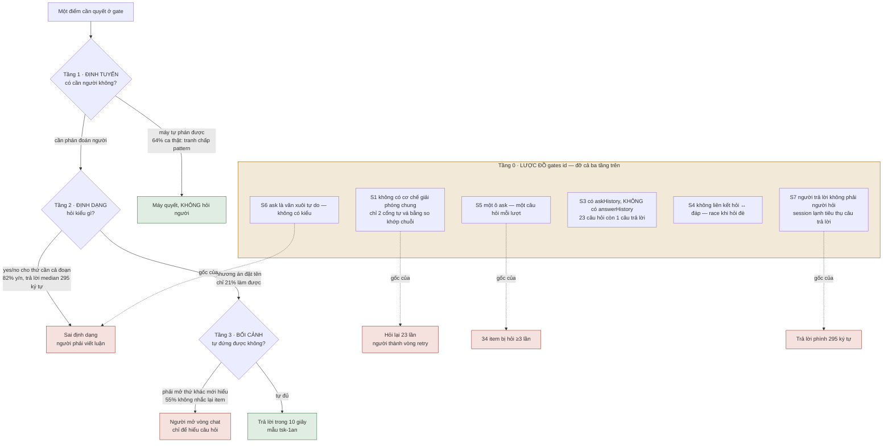

# Chất lượng và định tuyến câu hỏi gate — DISCUSSION

**Items:** `tsk-65i` (STR71b, định tuyến) · `tsk-539` (STR71, trình bày)
**Bắt đầu:** 2026-08-08 · **Vòng gần nhất:** 2

---

## 1. Trạng thái hiện tại

Vòng 2 vừa xong. Vòng 1 đưa **bằng chứng đo được** lên bàn; vòng 2 đào xuống **code thật** của
`ask`/`answer` và tìm ra gốc kỹ thuật của từng con số.

**Đổi lớn ở vòng 2:** hình dạng vấn đề từ **ba tầng** thành **bốn tầng**. Vòng 1 xếp vấn đề ở tầng
nội dung câu hỏi (định tuyến / định dạng / bối cảnh). Vòng 2 phát hiện một **tầng 0 nằm dưới cả
ba**: lược đồ dữ liệu và hợp đồng của chính `gates[id]`. Bốn con số lớn nhất ở §3 đều có gốc ở
tầng 0, nên sửa ở tầng skill/prompt sẽ **không đủ**.

**Đã chốt:** D1 — ràng buộc thứ tự với STR48 (kênh chú-ý đi sau hoặc đồng thời, không bao giờ
trước). Điểm này đứng vững qua cả hai vòng không bị sửa.

**Đã bị sửa (đúng như dự kiến của luật D-ID):** khung "ba tầng" của vòng 1 — may là chưa cấp D-ID.

**Đang mở:** Q1–Q7 của vòng 1 vẫn mở, cộng Q8–Q11 mới về tầng 0. Q5 ("sống ở lớp nào") đã có
hướng: **phải chạm lược đồ, không chỉ prose.**

**Vòng sau cần:** người chủ sản phẩm quyết Q1 (ranh giới đừng-hỏi vs hỏi-cho-tốt) và Q8 (tầng 0 là
item riêng hay điều kiện tiên quyết của hai item hiện có).

---

## 2. Mục tiêu & đề bài

Người vận hành fgOS phải trả lời quá nhiều câu hỏi, và phần lớn câu hỏi đó không đáng được hỏi —
hoặc vì máy tự phán được, hoặc vì được hỏi sai định dạng nên người phải bỏ công giải mã trước khi
bàn nội dung. Hệ quả không chỉ là mệt: vì 301/305 item chạy chế độ `sync`, một câu hỏi đậu lại
đồng nghĩa **phiên làm việc của người đứng im**, dù ở mức hệ thống thì các item khác vẫn chạy được.
Người mô tả trải nghiệm này nguyên văn là *"toàn những câu hỏi yes/no mà nếu không ngồi canh là cả
tiến trình dừng lại"*. Mục tiêu của cụm này là cắt khối lượng câu hỏi tới người xuống còn những thứ
thật sự cần phán đoán con người, và với phần còn lại thì hỏi sao cho trả lời được ngay mà không
phải mở một vòng chat chỉ để hiểu đang hỏi gì. Việc này gắn chặt với thứ tự triển khai kênh chú-ý
(STR48): xây kênh push trước khi sửa chất lượng câu hỏi sẽ khuếch đại đúng thứ đang cần giảm.

---

## 3. Vấn đề rõ / chưa rõ

### Đã rõ — số đo trực tiếp, không suy luận

Nguồn: `.fgos/state.json` (`gates`, `work`, `frictions`, `settlements`), đo ngày 2026-08-08.

| # | Sự thật đo được | Con số |
|---|---|---|
| R1 | Lượt hỏi người là **tranh chấp verify máy-vs-máy** (hai judge bất đồng về một lệnh/pattern) | **202 / 314 · 64%** |
| R2 | Lượt hỏi mang **dạng xác nhận / yes-no** | **258 / 314 · 82%** |
| R3 | Nhưng **câu trả lời median dài 295 ký tự**; chỉ 2/145 câu trả lời ngắn ≤20 ký tự | định dạng lệch |
| R4 | Câu hỏi có **phương án rõ ràng** (a)/(b) | 32 / 152 · 21% |
| R5 | Câu hỏi **tự nhắc lại item đang bàn** | 68 / 152 · 45% |
| R6 | Câu hỏi hỏi về **một lệnh shell** | 57 / 152 · 38% |
| R7 | Câu hỏi bắt **tra chéo ≥2 task id khác** | 19 / 152 · 13% |
| R8 | Item bị **hỏi lại ≥3 lần** | 34 |
| R9 | **Số lần hỏi nhiều nhất trên một item** | **23** (`tsk-48i`) |
| R10 | Item bị hỏi 10 lần | `tsk-4xg`, `tsk-66o` |
| R11 | Item dính ít nhất một tranh chấp verify | 70 / 152 |
| R12 | Item có settlement `answer/human` (tức phải lôi người vào) | 142 / 359 · 40% |
| R13 | Đậu vào `awaiting-human` theo stage | clarify 265 (84%) · decompose 40 · executing 9 |
| R14 | `verify-miss` trong tổng friction event | 87 / 141 · 62% |
| R15 | Item chạy `mode: sync` vs `async` | 301 vs 4 |
| R16 | Câu hỏi là boilerplate "Không phán được rõ ràng" | 7 / 152 · 5% |

**Diễn giải đã rõ:**

- **R1 + R6 → hỏi sai người.** Phán một pattern `grep` có chặt đủ không là thứ máy kiểm được bằng
  cách chạy thử và xem nó khớp gì. Người không có lợi thế thông tin nào ở đây. Khuôn lặp đi lặp lại:

  > *"Đề xuất verify bị nghi ngờ (chưa ghi vào clarify->decompose, cần xác nhận) — vòng 1 đề xuất:
  > `grep -q '\.parkReason' test/cli/fgos.test.mjs && node --test ...` — vòng 2 (kiểm tra độc lập)
  > không đồng ý: Pin quá lỏng và trùng tên với thứ đã hoạt động sẵn…"*

- **R2 + R3 → sai định dạng.** 82% hỏi yes/no nhưng người phải viết trung bình 295 ký tự mới trả
  lời được. Hai khả năng, và cả hai đều là lỗi: nếu thật sự là yes/no thì máy tự phán được; nếu cần
  cả đoạn giải thích thì lẽ ra phải là câu hỏi có phương án đặt tên (R4 cho thấy chỉ 21% làm vậy).

- **R8 + R9 → người bị dùng làm vòng retry.** `tsk-48i` bị hỏi 23 lần, mỗi lần là một biến thể
  `grep` hơi khác. Người không được hỏi *một quyết định*; người bị hỏi lại cho tới khi máy tự mò ra
  lệnh đúng. **Không có trần nào chặn việc này.**

- **R5 + R7 → không tự mang bối cảnh.** Hơn nửa câu hỏi buộc người chạy `fgos show <id>` mới hiểu
  đang bàn gì. Trường hợp nặng nhất: `tsk-42i` hỏi về nội dung một file **không tồn tại trong
  checkout** (`docs/history/gate-dialogue-continuity/CONTEXT.md`) — người về mặt vật lý không mở
  được thứ đang được hỏi.

- **R13 + R15 → nghịch lý chặn.** Kiến trúc khẳng định đậu không chặn (CTR004: *"hệ KHÔNG chặn,
  việc khác chạy tiếp"*), và đúng ở mức hệ thống — `fgos ready` loại item `awaiting-human` ra, item
  khác vẫn pick được. Nhưng vì 301/305 item chạy `sync`, thứ người **cảm nhận** là phiên của chính
  mình đứng im. Không mâu thuẫn: **hệ không chặn, phiên thì chặn.** Với tỉ lệ sync hiện tại, cái
  người sống cùng là vế thứ hai.

- **R1 + R14 → cùng một gốc.** 64% tranh chấp verify và 62% friction `verify-miss` không phải hai
  vấn đề. `verify` sinh kém lúc submit/clarify vừa gây hỏng lúc chạy vừa gây cãi lúc thẩm định.

- **Làm tốt được, và mẫu đã có sẵn trong chính dữ liệu.** 21% ở R4 chứng minh điều đó. Ví dụ
  `tsk-1an`, 222 ký tự, trả lời trong 10 giây không cần mở file nào:

  > *"Should fgOS worktrees use the lock-in-tree strategy (symlink `.fgos/` to shared store,
  > matching `session.mjs`) or the isolated-tree strategy (bootstrap-copy `.fgos/` per worktree
  > with union-merge at merge-back, matching beegog)?"*

  Hai phương án đặt tên, mỗi cái neo vào một thứ đã tồn tại trong repo để so sánh.

### Đã rõ — bảy vấn đề cấu trúc của `ask`/`answer` (vòng 2, đọc code trực tiếp)

Nguồn: `src/state/replay.mjs:196-230` (fold gate), `src/intake/decompose.mjs:625-655` (bypass),
grep toàn `src/`.

| # | Vấn đề cấu trúc | Bằng chứng |
|---|---|---|
| S1 | **Không có cơ chế chung "câu trả lời này giải phóng câu hỏi kia"** — chỉ 2 cổng tự vá tay (`keywordRiskGate`, `blastRadiusGate`); cổng tranh chấp verify (64% khối lượng) **không có kiểm nào** | `decompose.mjs:638,646` |
| S2 | **So khớp chuỗi làm hợp đồng** — điều kiện giải phóng là `gate.ask.includes("<literal>")`; đổi câu chữ câu hỏi thì câu trả lời cũ thôi tác dụng | `decompose.mjs:638` |
| S3 | **`askHistory` có, `answerHistory` KHÔNG** — grep toàn `src/` ra 0. `tsk-48i` giữ đủ 23 câu hỏi nhưng **chỉ còn câu trả lời cuối**; 22 quyết định của người đã bốc hơi | `replay.mjs:214` vs grep |
| S4 | **Không có liên kết câu hỏi ↔ câu trả lời** — hai ô độc lập trên cùng object, không id, không con trỏ. Hỏi đè trước khi người kịp trả lời ⇒ câu trả lời gắn vào câu hỏi **mới** trong khi người đang đọc câu **cũ** | `replay.mjs:202,215` |
| S5 | **Một item chỉ hỏi được một câu tại một thời điểm** — `gates[id]` một object, một ô `ask`. Session có 3 câu hỏi độc lập phải tuần tự hoá thành 3 vòng người-quay-lại | `replay.mjs:200` |
| S6 | **Câu hỏi không có kiểu** — `ask` là văn xuôi tự do. Không định tuyến/gộp/render phương án/tự-trả-lời-một-lớp/validate-trước-khi-đậu được | không có trường `kind` trong fold |
| S7 | **Người trả lời không phải người hỏi** — `answer` đưa item về `todo`; session đã hỏi đã chết, một session **lạnh** khác tiêu thụ câu trả lời. Nên **câu trả lời cũng phải tự đứng được**, vế chưa ai nhìn | `store.mjs` `answerAwaiting` |

**Tiền lệ đã được ghi trong chính code.** Comment tại `decompose.mjs:630-635` mô tả đúng sự cố mà
R9 đo lại được, và đã từng vá một lần:

> *"this hard risk gate used to re-fire unconditionally on every call — a human answering
> `fgos answer` never released it, **re-parking the exact same question forever** (dogfood,
> 2026-07-28)"*

Bản vá đó **chỉ áp cho 2 cổng**, bằng so khớp chuỗi. Cổng chiếm 64% khối lượng không được vá.

**Ánh xạ ngược: mọi con số lớn đều có gốc ở tầng dữ liệu**

| Số đo (§3 trên) | Gốc cấu trúc |
|---|---|
| R9 — 23 lần hỏi trên một item | S1 thiếu cơ chế giải phóng chung |
| R2 — 82% dạng yes/no | S6 không có kiểu câu hỏi để chọn |
| R3 — trả lời median 295 ký tự | S7 người đang bù ngữ cảnh cho một người đọc vô hình |
| R8 — 34 item bị hỏi ≥3 lần | S5 một câu hỏi mỗi lượt |

Đây là lý do vòng 2 kết luận **sửa ở tầng skill/prompt không đủ**.

### Chưa rõ — cần bàn

| # | Câu hỏi mở | Vì sao chưa quyết được |
|---|---|---|
| Q1 | **Ranh giới "đừng hỏi" vs "hỏi cho tốt" nằm ở đâu?** | Quyết định này định đoạt `tsk-65i` và `tsk-539` là hai item hay một. Nếu ranh giới sắc (định tuyến quyết trước, trình bày chỉ áp cho phần lọt qua) thì tách; nếu mờ thì gộp. |
| Q2 | **Luật định tuyến phát biểu thế nào cho không quá tay?** | Đề xuất hiện tại: "bất đồng về *pattern/lệnh* là việc máy; chỉ escalate khi bất đồng về *mục tiêu* của verify". Chưa kiểm: có ca nào bất đồng pattern mà thật sự cần người không? |
| Q3 | **Trần hỏi lại N bằng bao nhiêu, và tại trần thì làm gì?** | Chuyển `blocked` kèm chẩn đoán là đề xuất, nhưng `blocked` cũng cần người. Có thể cần một trạng thái/nhãn khác, hoặc hạ verify xuống mức yếu hơn có khai báo. |
| Q4 | **Định dạng câu hỏi có nên cưỡng chế bằng máy không?** | R4/R5 gợi ý một validator (bắt buộc có phương án + nhắc lại item + không trỏ file không tồn tại). Nhưng cưỡng chế định dạng lên một trường văn xuôi tự do là thứ dễ phản tác dụng. |
| Q5 | **Cái này sống ở lớp nào?** | Contract CTR004 (ask/answer) / verb `ask` tự validate / skill prose / judge-executor. Ảnh hưởng tới việc nó có phải thay đổi hợp đồng hay không. |
| Q6 | **Sửa gốc `verify` có làm Q2 thành thừa không?** | Nếu `verify` sinh ra đủ tốt thì hai judge hết cãi, 64% tự biến mất. Có thể luật định tuyến chỉ là lưới an toàn, không phải giải pháp chính. Chưa biết tỉ trọng. |
| Q7 | **Quan hệ với STR70a/STR70b/tsk-42i?** | Cụm gate-dialogue đã có sẵn, nhưng nguồn thiết kế của nó (`gate-dialogue-continuity/CONTEXT.md`) **chưa bao giờ vào git** (`git log --all` rỗng) — 5 item và 2 dòng backlog đang trích một file không tồn tại. Cần biết phần nào của cụm đó còn đứng vững. |
| Q8 | **Tầng 0 là item riêng, hay điều kiện tiên quyết của `tsk-65i`/`tsk-539`?** | S1–S7 nằm ở lược đồ dữ liệu, sâu hơn cả hai item hiện có. Nếu là tiên quyết thì hai item kia bị chặn cho tới khi nó xong; nếu là item riêng song song thì phải chốt phần giao. |
| Q9 | **Sửa tầng 0 có phải đổi hợp đồng CTR004 không, và nếu có thì theo luật nào?** | Thêm `answerHistory`/liên kết hỏi-đáp/kiểu câu hỏi đều là mở rộng lược đồ event. L10 (add-through-not-alongside) bắt mở rộng QUA cửa hiện có; `0011` bắt mọi contract khai version tường minh. Chưa rõ đây là bump version CTR004 hay chỉ thêm trường tuỳ chọn. |
| Q10 | **Cơ chế giải phóng chung (S1) hình dạng thế nào?** | Thay `ask.includes(<literal>)` bằng gì: một `gateId` ổn định trên mỗi ask? Một `releases` trỏ ngược? Chưa bàn. Đây là thứ quyết định `tsk-65i` là luật định tuyến hay là một cơ chế dữ liệu. |
| Q11 | **Câu trả lời tự-đứng-được (S7) có cần cấu trúc không?** | STR70a đã dựng `rationale`/`alternatives`/`source` cho answer — có thể phần này đã giải quyết một nửa S7. Cần đọc `checkpoint-distillate-gate-provenance/` xem còn thiếu gì, trước khi thiết kế mới. |

---

## 4. Quyết định đã chốt

| D-ID | Quyết định | Vòng chốt | `fgos decision` |
|---|---|---|---|
| **D1** | **Kênh chú-ý (STR48) đi SAU hoặc ĐỒNG THỜI với việc sửa chất lượng/định tuyến câu hỏi — không bao giờ trước.** Kênh push khuếch đại chất lượng câu hỏi theo cả hai chiều; đẩy câu hỏi hiện tại lên điện thoại làm trải nghiệm tệ hơn hiện tại, không tốt hơn. | 2 (nêu V1, không bị sửa ở V2) | ✅ `tsk-65i` |

**Ứng viên D-ID cho vòng 3** (chưa đứng đủ vững):

- Tranh chấp về pattern/lệnh không escalate lên người — *đang lung lay*: vòng 2 (S1) cho thấy cách
  sửa có thể là một **cơ chế giải phóng** ở tầng dữ liệu chứ không phải một **luật định tuyến** ở
  tầng nội dung. Chờ Q10.
- Mỗi câu hỏi phải tự đứng được mà không cần mở file khác.
- Sửa tầng skill/prompt là không đủ; phải chạm lược đồ dữ liệu — *mới nêu ở vòng 2, chờ một vòng.*

**Đã bị sửa, không cấp D-ID** (ghi lại để thấy luật D-ID hoạt động đúng):

- Khung "ba tầng" của vòng 1 → thành **bốn tầng** ở vòng 2. May là chưa cấp D-ID cho nó.

---

## 5. Q&A log

### 2026-08-08 — Vòng 1: quét toàn hệ, phát hiện vấn đề

**Bối cảnh khởi phát.** Người chủ sản phẩm yêu cầu quét toàn hệ fgOS đối chiếu tầm nhìn với thực
trạng vận hành (vision, 3 tiêu chí sản phẩm, code, tiêu chí UX), rồi mô tả quy trình mong muốn và
khoảng cách. Năm agent quét song song (vision / CLI+FSM / skills / backlog / UX+friction), cộng đo
trực tiếp trên `.fgos/events.jsonl` (9.693 event) và `.fgos/state.json` (445 item).

**Phát hiện ban đầu (sai một phần, đã sửa).** Chẩn đoán đầu tiên là "ba nút tắc, chưa ai bấm nút":
clarify kẹt 51 item (46 tự do chạy, 0 từng qua discovery), cleanup tồn 128 item (112 là leaf TTL 0
ngày, sẵn sàng đóng), async chỉ 4/305. Kết luận lúc đó: gỡ bằng cách chạy loop.

**Sửa lại sau khi quét lớp hợp đồng I/O.** Nguyên nhân gốc nằm cao hơn một bậc và là **quyết định
cố ý**: fgOS chưa có kênh chú-ý (attention/push) nào — mô hình pull đồng bộ thuần tuý, và
`system-overview.md:55` ghi nguyên văn *"poll bắt đầu khó chịu là tín hiệu kênh chú-ý đến lượt"*
(STR48 chưa khởi động, nằm ngoài core theo decision `0014`). Chuỗi: không có kênh chú-ý → async
không gọi được người quay lại → mọi người chạy sync → người dù sao cũng ngồi đó → nên lái tay thay
vì chạy loop → loop không chạy → clarify và cleanup dồn.

**Người chủ sản phẩm bổ sung quan sát then chốt (thời điểm này):**

> *"tôi muốn thêm vào 1 quan sát rất quan trọng đi kèm việc async/push notification là chất lượng
> đặt câu hỏi và thể hiện bối cảnh rất kém khiến người khó trả lời."*

**Đo kiểm quan sát đó** → toàn bộ bảng R1–R16 ở §3. Kết quả: quan sát đúng, và sắc hơn dự đoán —
64% lượt hỏi không phải câu hỏi khó hiểu mà là câu hỏi **không nên tới người**.

**Hệ quả về thứ tự ưu tiên (đề xuất tại vòng này).** Ban đầu xếp "xây kênh chú-ý" là việc số 1.
Sai thứ tự: đẩy câu hỏi hiện tại lên điện thoại = 23 thông báo về `grep` trên một item. Kênh chú-ý
khuếch đại chất lượng câu hỏi, tốt lẫn xấu. Nên sửa chất lượng/định tuyến câu hỏi **trước hoặc
đồng thời**.

**Người chủ sản phẩm bổ sung tiếp:**

> *"vấn đề rất mệt mỏi, toàn những câu hỏi yes/no mà nếu không ngồi canh là cả tiến trình dừng
> lại. `Không cái nào hỏi: câu hỏi này có nên tới người không?`"*

**Đo kiểm bổ sung** → R2 (82% dạng xác nhận/yes-no) và R3 (nhưng câu trả lời median 295 ký tự,
chỉ 2/145 ngắn ≤20 ký tự). Kết luận thêm: **định dạng câu hỏi lệch với hình dạng quyết định**.
Và làm rõ nghịch lý chặn: hệ không chặn (CTR004 đúng), nhưng phiên thì chặn — với 301/305 sync,
cái người sống cùng là vế thứ hai.

**Kiểm trùng trước khi tạo item (luật Scout First).** Phát hiện cả một cụm đã tồn tại:

| Item | Trạng thái | Nội dung |
|---|---|---|
| STR69a | done | chiếu `ask` vào `awaitingContext` |
| STR70a `tsk-19zm` | done | checkpoint distillate + record chốt 3 phần lên gate |
| STR70b `tsk-5dj` | todo | raw backstop — **chờ Q1 trong file đã mất** |
| STR71 `tsk-539` | todo @ clarify | chất lượng câu hỏi gate (ask self-sufficiency) |
| `tsk-42i` | **blocked** | đối thoại Socratic đồng bộ — **chặn vì file đã mất** |

`tsk-539` đúng là quan sát của người chủ sản phẩm, nhưng **hẹp hơn bằng chứng**: nó ghi *"người trả
lời gate thường không rõ nó đang hỏi gì"* → giải pháp viết `ask` tự đứng. Đó là **trình bày**. Cả
STR69/70/71 đều giả định câu hỏi là chính đáng, chỉ trình bày kém hoặc mất liên tục. Không cái nào
hỏi *"câu hỏi này có nên tới người không?"* — chính là chỗ 64% khối lượng nằm.

Trớ trêu phụ: `tsk-539` mang `verify: "chưa xác định — P15 bổ sung"` — item về chất lượng câu hỏi
đang mang đúng cái gốc gây ra 64% tranh chấp.

**Bằng chứng cho nhu cầu ghi nhận bền (lý do file này tồn tại).**
`docs/history/gate-dialogue-continuity/CONTEXT.md` — nguồn thiết kế mà STR70a/STR70b/STR71 đều
trích D1–D5/Q1 — **chưa bao giờ vào git** (`git log --all` rỗng cho đường dẫn đó). 5 work item và
2 dòng backlog đang phụ thuộc một file không tồn tại. `tsk-42i` đang `blocked` **chính vì** không
đọc được Q1 trong đó; `tsk-5dj` cũng đang chờ Q1 từ đó. Tức nỗi lo "đánh mất bối cảnh" không phải
giả thuyết — nó đã xảy ra, đúng trong khu vực này, và đang chặn việc thật.

**Quyết định phạm vi (người chủ sản phẩm chọn).** Tạo một item mới cho phần định tuyến
(`tsk-65i`), rồi shape cụm gồm nó + `tsk-539` trong một `DISCUSSION.md` chung, thay vì nới
`tsk-539` hay shape suông không tạo item.

**Yêu cầu chốt vòng:**

> *"nhớ thu hết tất cả research/finding thảo luận trong chat này vào phần discussion của task liên
> quan để giữ bối cảnh không mất"*

→ file này.

### 2026-08-08 — Vòng 2: đào xuống code `ask`/`answer`

**Người chủ sản phẩm hỏi:**

> *"như vậy phát sinh mấy vấn đề lớn phải giải quyết liên quan đến việc ask/answer?"*

**Scout: đọc code thật thay vì suy đoán.** `src/state/replay.mjs:196-230` (fold gate),
`src/intake/decompose.mjs:625-655` (bypass), grep `answerHistory` toàn `src/`.

**Kết quả: bảy vấn đề cấu trúc S1–S7** (bảng ở §3). Điểm quan trọng nhất không phải số lượng mà là
**vị trí**: cả bảy nằm ở **lược đồ dữ liệu**, dưới tầng nội dung câu hỏi mà vòng 1 đang bàn.

**Bằng chứng đắt nhất — code tự ghi lại tiền lệ.** `decompose.mjs:630-635`:

> *"this hard risk gate used to re-fire unconditionally on every call — a human answering
> `fgos answer` never released it, re-parking the exact same question forever (dogfood,
> 2026-07-28)"*

Tức pattern "hỏi 23 lần" của R9 **đã xảy ra trước đây và đã được vá một lần** — nhưng vá riêng cho
2 cổng, bằng `ask.includes(<chuỗi literal>)`. Cổng tranh chấp verify, chiếm 64% khối lượng, không
được vá. Đó là gốc kỹ thuật trực tiếp của `tsk-48i` bị hỏi 23 lần.

**Phát hiện phụ đáng lo riêng:** `askHistory` là mảng (giữ đủ 23 câu hỏi) nhưng **`answerHistory`
không tồn tại** — grep ra 0 trong toàn `src/`. Nên đọc lại được cả 23 câu hỏi mà chỉ còn **câu trả
lời cuối cùng**. 22 quyết định của người đã mất. Cùng loại "đánh mất bối cảnh" đã thúc đẩy việc tạo
file này, nhưng ở tầng dữ liệu chứ không phải tầng tài liệu — và lần này mất thứ do **người** tạo
ra, không phải do agent.

**Ánh xạ ngược** (bảng ở §3): R9→S1, R2→S6, R3→S7, R8→S5. Mọi con số lớn ở vòng 1 đều có gốc ở
tầng dữ liệu.

**Hệ quả lên khung vòng 1.** Khung "ba tầng" bị sửa thành **bốn tầng** — thêm tầng 0 (lược đồ dữ
liệu) nằm dưới cả ba. Kết luận: **sửa ở tầng skill/prompt không đủ.** Q5 của vòng 1 ("cái này sống
ở lớp nào") nay có hướng: phải chạm lược đồ.

**Chốt D1.** Ràng buộc thứ tự với STR48 nêu ở vòng 1, không bị sửa ở vòng 2 → đủ điều kiện cấp
D-ID. Ghi qua `fgos decision --id tsk-65i` (seq 9733).

**Không chốt ứng viên còn lại.** "Tranh chấp pattern không escalate lên người" đang lung lay: S1
gợi ý cách sửa có thể là một *cơ chế giải phóng* ở tầng dữ liệu chứ không phải một *luật định
tuyến* ở tầng nội dung. Để mở thành Q10.

**Bốn câu hỏi mở mới:** Q8 (tầng 0 là item riêng hay tiên quyết), Q9 (có phải bump CTR004 không,
theo L10/`0011`), Q10 (hình dạng cơ chế giải phóng), Q11 (STR70a's `rationale`/`alternatives`/
`source` đã giải quyết bao nhiêu phần của S7).

---

## 6. Thiết kế đã chốt {#design}

**Chưa có giải pháp để chốt** — Q1–Q11 còn mở. Nhưng **hình dạng vấn đề** đã đủ vững để một người
lạ đọc và làm việc được, và nó đã thay đổi ở vòng 2.

### Hình dạng vấn đề — bốn tầng, không phải ba

Câu hỏi gate hỏng ở bốn tầng cần bốn loại giải pháp khác nhau. Ba tầng trên nằm ở **nội dung câu
hỏi**; tầng 0 nằm ở **lược đồ dữ liệu** và đỡ cả ba tầng kia.

| Tầng | Nội dung | Item phủ | Ghi chú |
|---|---|---|---|
| **0 · Lược đồ** | S1–S7 trên `gates[id]` | **chưa có** | Sâu nhất; mọi con số lớn đều có gốc ở đây |
| 1 · Định tuyến | có nên hỏi người không (64%) | `tsk-65i` | Cách sửa có thể là cơ chế tầng 0, không phải luật tầng 1 (Q10) |
| 2 · Định dạng | yes/no cho thứ không phải yes/no | **chưa có** | Phát hiện vòng 1 (R2/R3); gốc là S6 |
| 3 · Bối cảnh | câu hỏi tự đứng được | `tsk-539` | Phạm vi hiện tại của STR71 |
| ⊥ Trần hỏi lại | không ai chặn ở lần 23 | **chưa có** | Cắt ngang; gốc là S1 |

### Vì sao tầng 0 quyết định phạm vi cả cụm

Vòng 1 xếp `tsk-65i` là "luật định tuyến" — một quy tắc nói *khi nào được escalate*. Vòng 2 cho
thấy vấn đề có thể không phải thiếu quy tắc, mà là **thiếu chỗ để ghi quy tắc đó vào**: không có
`gateId` ổn định để một câu trả lời trỏ vào, nên hai cổng duy nhất từng vá phải so khớp chuỗi câu
hỏi. Nếu vậy thì `tsk-65i` không phải một luật, mà là một **cơ chế dữ liệu** — và điều đó đổi hẳn
hình dạng công việc. Đây là Q10, và nó chặn việc chốt phạm vi `tsk-65i`.

Tương tự với `tsk-539`: viết `ask` tự đứng được là việc tầng 3, nhưng nếu `ask` vẫn là một ô văn
xuôi tự do bị ghi đè (S5/S6) thì không có chỗ nào để **cưỡng chế** yêu cầu đó — chỉ còn cách nhắc
trong prose, tức đúng cơ chế đã không hoạt động suốt 152 lần.

### Ràng buộc thứ tự đã chốt (D1)

Không xây kênh chú-ý STR48 trước khi xử lý tầng 0/1/2. Kênh push **khuếch đại** chất lượng câu hỏi
theo cả hai chiều: đẩy nguyên trạng hiện tại lên điện thoại (23 thông báo về `grep` trên một item)
làm trải nghiệm **tệ hơn** hiện tại.

Ràng buộc này độc lập với mọi lựa chọn giải pháp bên trong bốn tầng, nên nó chốt được sớm trong
khi phần còn lại vẫn mở.

### Neo vào tiêu chí sản phẩm

Cụm này thuộc **tiêu chí 1 (Ship Faster)** — hai vế *"không đoán mò"* và *"ít chờ đợi"*. Theo
`docs/decisions/0025`, thước đo là tốc độ của **project đang dùng fgOS**, và khi một lựa chọn rẻ
cho fgOS làm người vận hành chậm hơn thì chọn vế người vận hành. Hoãn cụm này để ưu tiên STR48 là
đúng loại đánh đổi mà `0025` bảo không được làm.

Một lưu ý về mức độ nghiêm trọng của S3: hệ đang **mất dữ liệu do người tạo ra** (22/23 câu trả
lời), không chỉ dữ liệu do agent tạo ra. Xét theo tiêu chí 2 (DoD — *evidence-linked
documentation*), đây là lỗ hổng bằng chứng, không chỉ lỗ hổng trải nghiệm.

---

## 7. Danh mục hạng mục / task {#tasks}

*(Tạm thời, theo hình dạng bốn tầng ở §6. Chốt lại sau khi Q1 và Q8 ngã ngũ.)*

### Chưa có item · Lược đồ gate — tầng 0 {#task-gate-schema}

- **Mục tiêu:** cho `gates[id]` đủ cấu trúc để ba tầng trên **cưỡng chế được** thay vì chỉ nhắc
  trong prose. Ứng viên: `gateId` ổn định để câu trả lời trỏ vào (thay `ask.includes(<literal>)`),
  `answerHistory` đối xứng với `askHistory`, liên kết hỏi↔đáp, trường `kind` cho câu hỏi.
- **Trích §6:** subgraph "Tầng 0", cộng bảng ánh xạ ngược R9→S1 / R2→S6 / R3→S7 / R8→S5.
- **D-ID áp dụng:** chưa có.
- **Quan hệ anh em:** nằm **dưới** cả `tsk-65i` và `tsk-539`. Q8 quyết định nó là điều kiện tiên
  quyết (chặn hai item kia) hay item song song có phần giao phải chốt.
- **Câu hỏi mở riêng:** Q8 (riêng hay tiên quyết), Q9 (có bump CTR004 không, theo L10 và `0011`),
  Q10 (hình dạng cơ chế giải phóng), Q11 (STR70a đã giải quyết bao nhiêu phần của S7).
- **Rủi ro riêng:** đây là thay đổi lược đồ event trên một log append-only bất khả xoá (L3/RUL11) —
  không sửa lại được sau khi phát hành. Cần `fgos-validating` thật sự, không chỉ plan.
- **Chưa submit** — chờ Q8.
- **Draft verify:** chưa xác định — chờ Q9 (phạm vi hợp đồng quyết định cái gì kiểm được).

### tsk-65i · Định tuyến câu hỏi {#task-routing}

- **Mục tiêu:** câu hỏi chỉ tới người khi thật sự cần phán đoán người. Cắt phần lớn 64% ở R1.
- **Trích §6:** tầng 1 trong sơ đồ; nhánh "máy tự phán được".
- **D-ID áp dụng:** chưa có (vòng 1).
- **Quan hệ anh em:** đứng **trước** `tsk-539` trong luồng — chỉ thứ lọt qua tầng 1 mới cần tầng
  2/3. Nằm **trên** `#task-gate-schema`. Nếu Q1 kết luận ranh giới mờ thì gộp với `tsk-539`.
- **Câu hỏi mở riêng:** Q2 (phát biểu luật), Q6 (sửa gốc verify có làm luật này thành thừa không),
  Q10 (**quan trọng nhất** — nếu đây là cơ chế dữ liệu chứ không phải luật thì item này đổi hẳn
  hình dạng, có thể tan vào tầng 0).
- **Draft verify:** chưa xác định — phải chờ Q5/Q10 mới viết được lệnh thật.
  *Cố ý để trống thay vì bịa một lệnh `grep`, đúng thứ item này đang phê phán.*

### tsk-539 · Bối cảnh và định dạng câu hỏi {#task-self-sufficiency}

- **Mục tiêu:** câu hỏi lọt qua tầng 1 phải tự đứng được — nhắc lại item đang bàn, nêu phương án
  đặt tên, không trỏ vào thứ người không mở được.
- **Trích §6:** tầng 2 và tầng 3 trong sơ đồ.
- **D-ID áp dụng:** chưa có (vòng 1).
- **Quan hệ anh em:** phụ thuộc `tsk-65i` về mặt luồng (không phải về mặt dep cứng — hai cái sửa
  được song song).
- **Câu hỏi mở riêng:** Q4 (có cưỡng chế định dạng bằng máy không).
- **Ghi chú:** phạm vi hiện tại của item chỉ ôm tầng 3. Tầng 2 (định dạng yes/no lệch, R2/R3) là
  phát hiện mới — cần quyết cho vào đây hay tách.
- **Chặn ngầm bởi tầng 0:** không có chỗ nào **cưỡng chế** được yêu cầu "tự đứng được" khi `ask`
  vẫn là ô văn xuôi tự do bị ghi đè (S5/S6) — chỉ còn cách nhắc trong prose, tức đúng cơ chế đã
  không hoạt động suốt 152 lần. Q4 và Q8 gắn nhau.
- **Draft verify:** chưa xác định — chờ Q4.

### Chưa có item · Trần hỏi lại {#task-reask-cap}

- **Mục tiêu:** không item nào bị hỏi 23 lần. Tại trần, chuyển sang một trạng thái có chẩn đoán
  thay vì hỏi tiếp.
- **Trích §6:** nhánh đứt nét "thiếu trần hỏi lại" cắt ngang sơ đồ.
- **Quan hệ anh em:** cắt ngang cả `tsk-65i` và `tsk-539` — có thể là con của một trong hai, hoặc
  item riêng.
- **Câu hỏi mở riêng:** Q3 (N bằng bao nhiêu, tại trần làm gì — `blocked` cũng cần người nên có thể
  không phải đáp án đúng).
- **Chưa submit** — chờ Q1/Q3 để biết nó là item riêng hay con.

---

## Nguồn

- Số đo: `.fgos/state.json` (`gates` · `work` · `frictions` · `settlements`),
  `.fgos/events.jsonl` (9.693 event), đo 2026-08-08.
- Báo cáo quét đầy đủ:
  `plans/reports/from-scan-team-to-product-owner-260808-1241-end-to-end-operating-ux-gap-analysis-report.md`
  (§4.3b chất lượng câu hỏi, §5.1b chuỗi nhân quả thứ hai).
- Bản gọn + trang đọc: `plans/reports/fgos-operating-ux-gap.html`.
- Cụm liên quan: backlog `STR69a` / `STR70a` / `STR70b` / `STR71`;
  `docs/history/checkpoint-distillate-gate-provenance/` (STR70a, còn sống).
- ⚠️ `docs/history/gate-dialogue-continuity/CONTEXT.md` — **không tồn tại, chưa bao giờ vào git**,
  dù 5 item và 2 dòng backlog trích nó làm nguồn thiết kế.
