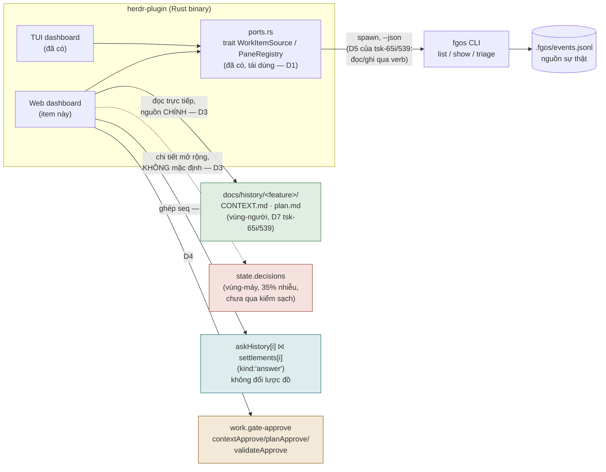
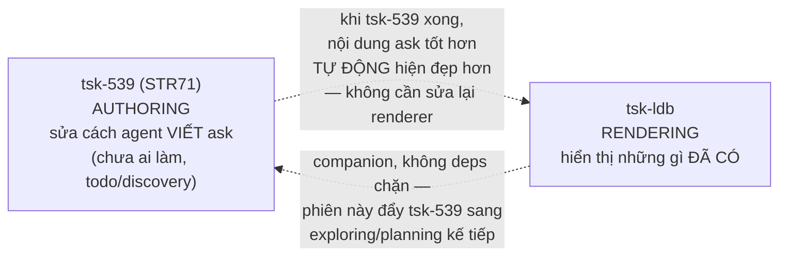

# DISCUSSION — herdr-web-dashboard

Item: tsk-ldb — "nâng cấp herdr-plugin thành 1 orchestrator thật thụ có các
core component: 1) herdr orchestrator (đã làm), 2) tui dashboard chạy trên
herdr (đã làm), 3) web dashboard, webserver tự quản tự host frontend..."

## 1. Trạng thái hiện tại

Vòng 3, hội tụ. Cả 2 câu hỏi ranh giới (tsk-ldb↔tsk-539, bảo mật) đã được
người dùng trả lời rõ ràng, không mơ hồ — 6 D-ID (D1-D6) đã mint và ghi
qua `fgos decision --id tsk-ldb` (seq 14637-14642). §6 đã tổng hợp đầy đủ,
§7 đã tách 3 task ứng viên + 1 companion item (`tsk-539`). Bước tiếp theo:
người dùng xác nhận thiết kế đã ổn để bàn giao sang `fgos-coding-exploring`
→ `fgos-coding-planning` (native-first handoff), sau đó phiên này tiếp tục
đẩy `tsk-539` (D5) sang trạng thái hoạt động.

## 2. Mục tiêu & đề bài

herdr-plugin hiện có 2 trong 3 core component người dùng hình dung cho một
"orchestrator thật thụ": (1) herdr-orchestrator — cơ chế tự launch pane
theo settings bật/tắt cho discover/merge/retro/cleanup (tsk-2xt và các con
tsk-2m5/tsk-2ja/tsk-57q, đều đã `done`), và (2) TUI dashboard chạy ngay
trong herdr — cockpit hiển thị work-items, in-progress list, action queues
(NEED ANSWER/MERGE LIST/AFTER DELIVER), detail modal, mouse/keyboard focus,
đã qua rất nhiều vòng nâng cấp (từ tsk-19y tới tsk-bvh, phần lớn `done`).
Component còn thiếu là (3): một **web dashboard** — tự chạy webserver,
tự host frontend của chính nó (không phụ thuộc herdr's TUI runtime) — với
trọng tâm là một taskboard đẹp, và đặc biệt là **view chi tiết một task**:
lịch sử những gì agent đã thực sự làm trên task đó, lịch sử các câu hỏi đã
hỏi/đã trả lời, và — quan trọng nhất theo lời người dùng — phần "câu hỏi
cần trả lời" (câu hỏi đang treo, item đang ở `awaiting-human`) phải được
framing lại thành một narrative ngắn gọn, dễ hiểu, đủ chi tiết để một
người không có context trong đầu vẫn trả lời được nhanh, thay vì hiện
nguyên văn dữ liệu thô.

## 3. Vấn đề rõ / chưa rõ

| # | Nội dung | Trạng thái | Ghi chú |
|---|----------|-----------|---------|
| 1 | Component 1 (herdr-orchestrator) và 2 (TUI dashboard) đã tồn tại và `done` | Rõ | tsk-2xt/2m5/2ja/57q (orchestrator); tsk-19y…tsk-bvh (TUI) — xác nhận qua `fgos list --all --json` |
| 2 | Chưa có item nào từng đề cập "web dashboard"/"webserver" trong toàn bộ backlog hiện tại | Rõ | grep title+description của 57 item herdr-* — 0 match |
| 3 | Repo hiện KHÔNG có dependency web/http nào (`package.json` chỉ có `yaml`) | Rõ | không Express/Fastify/http.createServer nào tồn tại trong `src/` |
| 4 | Dữ liệu "lịch sử task agent đã làm" đã có sẵn qua `fgos show <id> --json`: `discovery`, `decisions`, `gates`, `outcome`, `friction`, `settlement`, `learning` | Rõ | xác nhận bằng lệnh `show --json` thật trên tsk-2xt |
| 5 | Dữ liệu câu hỏi/trả lời: `ask` (câu hỏi) nằm trên event `work.move` khi chuyển sang `awaiting-human`; `gates[id]` còn giữ `askRationale/askAlternatives/askSource` (checkpoint lúc hỏi) và `rationale/alternatives/source` (lời cuối lúc trả lời) — theo `src/state/awaiting-context.mjs` | Rõ | đọc trực tiếp file nguồn |
| 6 | Một item bị park nhiều lần (nhiều vòng hỏi/đáp) có giữ lại TOÀN BỘ lịch sử Q&A hay chỉ giữ bản mới nhất | Rõ | Hỗn hợp: `gates[id].ask`/`.answer` GHI ĐÈ (chỉ giữ bản mới nhất); nhưng `gates[id].askHistory` là mảng CỘNG DỒN mọi câu hỏi (xác minh thật: tsk-48i park 23 lần → `askHistory.length===23`); câu trả lời đầy đủ nằm ở `settlements[id]` (mảng `{kind:'answer',...}`, cũng 23 bản ghi cho tsk-48i) chứ không phải ở `gates`. `show`/`check` hiện cap hiển thị 5 bản ghi settlement gần nhất (`SETTLEMENT_DISPLAY_CAP=5`, bin/fgos.mjs:564) dù `count` vẫn phản ánh tổng thật. Raw `.fgos/events.jsonl` luôn giữ đủ 100% — không mất gì. `docs/specs/work-state.md` §"Bản ghi cổng-người" mô tả G3/G4 là ghi đè nhưng KHÔNG document `askHistory`. |
| 7 | Stack: chấp nhận thêm dependency thật, miễn build ra MỘT binary kèm asset nhúng sẵn để chạy | Rõ | Người dùng chốt vòng 2. Khớp với `tsk-65i`/`tsk-539` DISCUSSION.md Q13 (đóng vòng 9): *"lựa chọn không phụ thuộc p-09351985… ngôn ngữ hoàn toàn tự do — tiêu chí thật chỉ là tái dùng `ports.rs`/`WorkItemSource` đã có"* — herdr-plugin đã Rust, đã có `trait WorkItemSource`/`PaneRegistry` làm seam sẵn, và Rust có `rust-embed`/`include_dir!` để nhúng frontend build vào 1 binary. Không xung đột gì với quyết định cũ. |
| 8 | Vòng đời webserver: gắn vào herdr-plugin (không phải lệnh `fgos web` riêng, không phải launcher tổng chưa tồn tại) | Rõ | Người dùng chốt vòng 2. `tsk-65i`/`tsk-539` round 4-5 có đề xuất một "launcher tổng" rộng hơn (điều phối cả herdr lẫn runner) nhưng đó **vẫn đang ở stage discovery, chưa hiện thực** — tsk-ldb đi trên hạ tầng CÓ SẴN (herdr-plugin binary đã chạy được) thay vì chờ launcher tổng. |
| 9 | Ranh giới với TUI dashboard: chạy song song, KHÔNG thay thế; mục đích riêng là môi trường tương tác thoải mái hơn — đặc biệt cho approve/duyệt, vì UI/UX của TUI hiện "quá bó hẹp, gây mental pressure" | Rõ | Người dùng chốt vòng 2. Mở rộng phạm vi thêm: không chỉ Q&A, còn cả **cơ chế duyệt/approve** (gate-approve — xem hàng 12 dưới, đây là kênh chiếm khối lượng hỏi-người LỚN NHẤT theo `tsk-539` D4: 48/54 lượt gần đây, gấp 8 lần kênh `ask`). |
| 10 | "Framing câu hỏi dễ hiểu": CẦN một bước tổng hợp nội dung mới, không chỉ render lại dữ liệu thô — vì hiện agent viết `ask` quá brief, hay trích luật D1/D2 mà người đọc lại (nhất là sau thời gian dài, nhiều việc) không còn nhớ nghĩa | Rõ | Người dùng xác nhận. Đây **chính là mục tiêu của `tsk-539`** (STR71, "ask self-sufficiency, ask tự đứng được" — cùng cluster). Xem Q-mới bên dưới về ranh giới tsk-ldb ↔ tsk-539. |
| 11 | Cấu trúc dữ liệu ask/answer hiện tại: có phải chỉ lưu Q+A thô, không có "brief"? | Rõ — KHÔNG đúng như giả định | Thực tế đã có sẵn đúng 2 tầng người dùng mô tả: **câu hỏi** → `gates[id].askHistory` (mảng, CỘNG DỒN mọi lần hỏi — không cần đổi); **brief/rationale lúc hỏi** → `gates[id].askRationale/askAlternatives/askSource` (GHI ĐÈ, chỉ giữ bản mới nhất — đúng như người dùng muốn, "brief không cần history"). Không cần đổi schema cho ý này. |
| 12 | Q&A không phải kênh yes/no lớn nhất — kênh `work.gate-approve` (3 cổng skill duyệt: contextApprove/planApprove/validateApprove) lớn gấp 8 lần (48 vs 6 lượt, sau khi gỡ 1 LLM judge dư) | Rõ, từ `tsk-539` D4 (đã chốt, seq 9771) | Trực tiếp giải thích lý do người dùng thấy TUI "gây mental pressure" ở khâu duyệt — không phải cảm giác, có số đo. Ảnh hưởng scope: nếu web dashboard muốn thật sự giảm mental pressure ở approve, cần hiển thị/thao tác được cả `gate-approve` events, không chỉ `ask`/`answer`. |
| 13 | Ghép cặp nhiều câu hỏi ↔ nhiều câu trả lời (điều người dùng nhớ đã từng đặt vấn đề) — có cần thêm liên kết tường minh (id/con trỏ) vào lược đồ event không? | Rõ — KHÔNG cần, đã kiểm chứng | `tsk-65i`/`tsk-539` S4(b) (vòng 12b): FSM chặn sẵn — item rời `frontier` ngay khi vào `awaiting-human`, không session nào hỏi-đè được trước khi có `answer`. Nên `askHistory[i]` ghép với bản ghi `answer` thứ i trong `settlements[id]` (lọc `kind:'answer'`) **theo đúng thứ tự `seq`** là đủ, không có race, không cần trường liên kết mới. Q8 (tsk-65i/539) đã đóng "HOÃN" chính vì lý do này — không đổi lược đồ event, nhu cầu thật nằm ở tầng đọc/trình bày. |
| 14 | Nguồn dữ liệu narrative "lịch sử agent đã làm": `CONTEXT.md` (vùng người, git-versioned) hay `state.decisions` (vùng máy) | Rõ | Áp dụng thẳng D7 của `tsk-65i`/`tsk-539` (đã chốt nơi khác, không re-derive): `CONTEXT.md`/`plan.md` là nguồn chính; `decisions[]` chỉ hiện như chi tiết mở rộng, không phải mặc định. Không có phản đối từ người dùng ở vòng 2 — giữ nguyên đề xuất. |
| 15 | Mở cổng HTTP đổi threat model của fgOS (hiện chỉ nghe từ terminal người dùng) | Rõ | Người dùng chốt vòng 3: thêm lớp auth tối thiểu ngay từ v1 (không chấp nhận "localhost-only, không auth"). |
| 16 | Ranh giới tsk-ldb ↔ tsk-539 | Rõ | Người dùng chốt vòng 3: **tách rời** (phương án (a) — tsk-ldb không nuốt phạm vi, không chờ tsk-539), nhưng muốn "gom/kéo theo" tsk-539 để nó cũng được deliver — xem D5 ở §4 cho cách cụ thể (không phải `deps` chặn). |

## 4. Quyết định đã chốt

| D-ID | Quyết định | Vòng chốt | `fgos decision` |
|---|---|---|---|
| **D1** | Web dashboard là một **subsystem mới trong binary herdr-plugin hiện có** (Rust), không phải tiến trình/binary riêng, không chờ "launcher tổng" (đang discovery, chưa hiện thực). Chấp nhận dependency thật (HTTP server crate + embed-asset crate), miễn kết quả build vẫn là MỘT binary kèm asset frontend nhúng sẵn. Tái dùng `ports.rs`'s `trait WorkItemSource`/`PaneRegistry` làm lớp đọc dữ liệu — không viết lại. | 2-3 | ✅ seq 14637 |
| **D2** | **Không đổi lược đồ event** để ghép nhiều câu hỏi↔câu trả lời. Ghép `gates[id].askHistory[i]` với bản ghi thứ i có `kind:'answer'` trong `settlements[id]`, theo đúng thứ tự `seq`, tại tầng đọc của web dashboard. Grounded từ `tsk-65i`/`tsk-539` Q8 (đóng HOÃN) + S4(b) (FSM đã chặn hỏi-đè, không có race). | 2 | ✅ seq 14638 |
| **D3** | Nguồn chính cho "lịch sử agent đã làm" là `CONTEXT.md`/`plan.md` của item (vùng-người, narrative, git-versioned) — theo D7 (`tsk-65i`/`tsk-539`, đã chốt nơi khác). `fgos show --json`'s `decisions/discovery/gates/outcome/friction/settlement/learning` chỉ hiện như chi tiết mở rộng (expandable), không phải nội dung mặc định — vì 35% `decisions` hiện là ghi-sổ máy móc, chưa qua "phép kiểm sạch" D7 yêu cầu trước khi làm nguồn chính cho một consumer mới. | 3 | ✅ seq 14639 |
| **D4** | Phạm vi "câu hỏi cần trả lời" trong task-detail bao gồm **cả hai kênh**: `ask` (gates, đã park ở `awaiting-human`) VÀ `work.gate-approve` (contextApprove/planApprove/validateApprove). Kênh `gate-approve` là kênh nặng nhất thực tế (8x khối lượng gần đây theo D4 của `tsk-539`) và đúng là nguồn "mental pressure ở khâu duyệt" người dùng nêu ở vòng 2 — chỉ làm `ask` sẽ bỏ sót phần lớn vấn đề thật. | 3 | ✅ seq 14640 |
| **D5** | **Ranh giới tsk-ldb ↔ tsk-539: tách rời, không phải `deps` chặn.** tsk-ldb render best-effort trên nội dung `ask`/`gate-approve` hiện có, kể cả khi còn brief/trích D-ID khó hiểu — khi `tsk-539` cải thiện chất lượng authoring sau này, dashboard tự động hưởng lợi mà không cần sửa lại (hai việc tách bạch theo thiết kế: authoring vs rendering). "Kéo theo deliver" thực hiện bằng cách: `tsk-539` được ghi nhận là companion item trong §7, và phiên này sẽ tiếp tục đẩy `tsk-539` (đang `todo/discovery`, không ai giữ) sang `exploring`/`planning` ngay sau khi tsk-ldb hội tụ — không phải một `deps` edge trong state. | 3 | ✅ seq 14641 |
| **D6** | Bảo mật: webserver bind `127.0.0.1` mặc định (không expose ra mạng ngoài máy) **cộng thêm một lớp auth tối thiểu (token) bắt buộc ngay từ v1** — không hoãn sang sau, theo đúng cảnh báo *"không vá sau được"* (STR38, trích từ `tsk-65i`/`tsk-539`). | 3 | ✅ seq 14642 |

## 5. Q&A log

**[2026-08-12, vòng 1 — scouting]** Scout trước khi hỏi (bắt buộc theo
fgos-coding-shaping D6):
- `fgos list --all --json` → 57 item có chữ "herdr" trong title/description;
  0 item nhắc "web dashboard"/"webserver"/"self-host" — xác nhận đây là
  scope mới, không trùng việc đã có.
- `docs/decisions/0028`, `0029` D17, `0031`: từ "orchestrator" từng bị cấm
  dùng (đổi thành "launcher") rồi được **gán nghĩa mới chính thức** —
  "tầng hợp thành T0: điều phối N đơn vị chạy đồng thời, ở lại" — khớp
  đúng với việc người dùng gọi herdr-orchestrator (tsk-2xt, tự launch
  nhiều pane theo settings) là "orchestrator". Không có xung đột thuật ngữ.
- `package.json`: chỉ 1 dependency (`yaml`) — toàn bộ fgOS hiện tại là
  Node thuần, không framework. Đây là tín hiệu triết lý mạnh, cần người
  dùng xác nhận có muốn giữ hay chấp nhận phá lệ cho web dashboard.
- `fgos show tsk-2xt --json` → xác nhận shape thật: `{work, discovery,
  decisions, gates, outcome, friction, settlement, learning}` — đây chính
  là nguồn "lịch sử task agent đã làm".
- `src/state/awaiting-context.mjs` → xác nhận shape Q&A: `ask` (câu hỏi
  tại lần park hiện tại), `askRationale/askAlternatives/askSource` (agent
  tự chú giải lúc hỏi), `rationale/alternatives/source` (người trả lời
  lúc đáp), cộng `changedSinceAsk` (parent đổi gì kể từ lúc hỏi).

**Câu hỏi mở gửi người dùng (chưa trả lời):**

1. Web dashboard này phục vụ mục đích khác TUI dashboard ở điểm nào — xem
   từ xa/điện thoại không cần mở terminal herdr? Hay đơn giản là "cùng dữ
   liệu, giao diện đẹp hơn cho phần task-detail/Q&A" và có thể chạy song
   song, không thay thế TUI?
2. Về "framing câu hỏi dễ hiểu, ngắn gọn": bạn hình dung đây là một UI/layout
   tốt render lại dữ liệu thô sẵn có (ask/askRationale/askAlternatives),
   hay cần một bước tổng hợp nội dung mới (ví dụ agent tự viết một đoạn
   narrative ngắn NGAY LÚC `ask`, lưu lại làm field riêng, để web dashboard
   chỉ việc hiển thị)?
3. Stack: fgOS hiện tại zero-dependency (chỉ `yaml`). Bạn có chấp nhận thêm
   dependency thật cho web dashboard (vd một framework nhẹ như Fastify/Hono
   phía server, hoặc thậm chí chỉ Node `http` thuần + static HTML/JS không
   build step), hay muốn giữ nguyên triết lý zero-dep càng nhiều càng tốt?
4. Vòng đời webserver: chạy thường trực (daemon riêng, tự khởi động), hay
   chỉ chạy khi người dùng gõ lệnh (vd `fgos web` mở server + browser), hay
   gắn vào herdr-orchestrator để tự bật/tắt như 4 domain kia (discover/
   merge/retro/cleanup)?
5. "Lịch sử câu hỏi" — bạn muốn thấy TOÀN BỘ các lần hỏi/đáp qua nhiều vòng
   park của một task (nếu có), hay chỉ cần câu hỏi/trả lời gần nhất là đủ?
   Đã xác minh: dữ liệu ĐỦ để hiển thị full history (mọi câu hỏi trong
   `gates[id].askHistory`, mọi câu trả lời trong `settlements[id]`), nhưng
   nằm ở 2 chỗ khác nhau và `show`/`check` hiện tại chỉ hiện 5 bản ghi gần
   nhất — nên đây vẫn là quyết định thiết kế (web dashboard có tự query đủ
   cả 2 nguồn + ghép cặp ask/answer theo thứ tự thời gian không, hay chỉ
   cần cap 5 như hành vi hiện có là đủ).

**[2026-08-12, vòng 1 — bổ sung]** Research agent xác nhận câu hỏi #6 ở §3
(xem cột Ghi chú). Cập nhật câu hỏi #5 ở trên theo phát hiện này.

### 2026-08-12 — Vòng 2

**Người dùng trả lời cả 5 câu hỏi vòng 1** (tóm tắt, chi tiết ở §3 hàng 7-12):
1. Chạy song song TUI, không thay thế; mục đích riêng: môi trường tương
   tác thoải mái hơn, đặc biệt ở khâu duyệt/approve — TUI hiện "quá bó hẹp,
   gây mental pressure".
2. Xác nhận CẦN bước tổng hợp nội dung mới cho câu hỏi (không chỉ render
   dữ liệu thô) — vì agent hiện viết `ask` quá brief, hay trích D1/D2 mà
   người đọc lại không còn nhớ nghĩa. Đồng thời xác nhận: câu hỏi cần giữ
   FULL HISTORY, "brief" (rationale) chỉ cần bản mới nhất — không cần
   history của brief.
3. Chấp nhận thêm dependency thật, miễn build ra một binary kèm asset để
   chạy.
4. Gắn vào herdr-plugin.
5. Cần lịch sử TẤT CẢ câu hỏi, trình bày rõ và thoải mái nhất có thể.
   Nhắc lại: "trước đã đặt vấn đề xử lý nhiều câu hỏi và map câu hỏi ->
   câu trả lời rồi."

**Scout theo gợi ý #5 — tìm cuộc bàn trước đó (luật Scout First + tránh
quyết định lại cái đã quyết).** `grep` toàn `docs/` ra
`docs/history/gate-question-quality-and-routing/DISCUSSION.md` (items
`tsk-65i` + `tsk-539`, cả hai `todo/discovery`, 12+ vòng bàn, bắt đầu
2026-08-08). Đọc toàn bộ 1614 dòng. Đây không phải một cuộc bàn tình cờ
liên quan — nó **đã đề xuất gần như đúng kiến trúc item này** (round 4:
*"mở rộng herdr-plugin, biến nó thành 1 webserver nhỏ, cung cấp ui để xem
task và trả lời câu hỏi… một rust đóng gói khi chạy mở webserver và điều
phối cả tui"*) và đã CHỐT nhiều điểm liên quan trực tiếp:

- **Q13 (đóng, vòng 9):** ngôn ngữ implementation hoàn toàn tự do — chỉ
  cần đọc/ghi qua `fgos <verb>` (spawn, không link lib), tái dùng
  `ports.rs`'s `trait WorkItemSource` đã có trong herdr-plugin. Khớp thẳng
  với câu trả lời #3/#4 của người dùng hôm nay — không xung đột.
- **Q8 (đóng "HOÃN", vòng 12) + S4(b) (vòng 12b):** KHÔNG cần đổi lược đồ
  event (không cần `answerHistory`, không cần trường liên kết ask↔answer
  mới). FSM status đã chặn sẵn hỏi-đè (item rời `frontier` ngay khi vào
  `awaiting-human`), nên ghép `askHistory[i]` với bản `answer` thứ i trong
  `settlements[id]` theo thứ tự `seq` là đủ — đúng câu trả lời cho #5.
- **D7 (chốt, vòng 12, seq 10187):** "hai vùng lưu trữ cho hai người đọc"
  — `state.decisions` là vùng-máy (authoritative cho agent, ngắn, nhưng
  hiện 35% là ghi-sổ máy móc + 12% thiếu rationale, CHƯA đủ sạch cho
  consumer mới); `CONTEXT.md`/`plan.md` là vùng-người (narrative, tự do
  dài, git-versioned) — và sơ đồ D7 trong chính file đó đã vẽ mũi tên
  `CONTEXT.md → Web UI`. Đây gần như là câu trả lời sẵn có cho #2 của
  người dùng hôm nay: "framing dễ hiểu" = web dashboard đọc `CONTEXT.md`
  (đã narrative, đã tường minh) làm nguồn chính, KHÔNG phải cố render đẹp
  dữ liệu máy-đọc thô.
- **`tsk-539` (STR71, "ask self-sufficiency")** — mục tiêu nguyên văn của
  item này trùng gần như 100% với câu trả lời #2 của người dùng hôm nay
  (agent viết `ask` quá brief/trích D-ID mà người đọc không hiểu). Đây là
  một CHỒNG LẤN THẬT cần người dùng phân xử (xem câu hỏi mới #1 dưới).
- **Cảnh báo bảo mật (đã ghi sẵn trong file đó, chưa có trong item nào):**
  mở cổng HTTP đổi threat model — `verify` chạy như shell command, ai tới
  được cổng đều có khả năng kích hoạt nó; cần identity/auth gate trước khi
  chạm CTR001, "không vá sau được".
- **Kênh yes/no lớn nhất KHÔNG phải `ask`** mà là `work.gate-approve` (3
  cổng skill duyệt) — gấp 8 lần khối lượng gần đây (D4, tsk-539). Điều này
  củng cố trực tiếp lời người dùng ở #1 ("đặc biệt trong cơ chế duyệt và
  approve") bằng số đo thật, không chỉ cảm nhận.

**Hai câu hỏi mới cần người dùng quyết trước khi viết §6:**

1. **Ranh giới tsk-ldb ↔ tsk-539.** `tsk-539` (todo/discovery, chưa ai
   làm) đã tồn tại đúng để giải quyết "agent viết `ask` brief, trích D-ID
   khó hiểu" — đây là việc AUTHORING (sửa cách agent viết lúc hỏi, có thể
   ở tầng skill/prompt). tsk-ldb là việc RENDERING (dashboard hiển thị
   những gì đã có). Ba lựa chọn: (a) tsk-ldb chỉ làm phần render, dựa vào
   `CONTEXT.md`/plan.md sẵn có (D7) + không đợi `tsk-539`, và `tsk-539`
   tiếp tục là item độc lập cải thiện chất lượng `ask` tại nguồn; (b)
   tsk-ldb phụ thuộc `tsk-539` — chờ authoring tốt hơn trước khi build UI
   hiển thị; (c) tsk-ldb NUỐT LUÔN phạm vi của `tsk-539` (dashboard tự làm
   bước tổng hợp/viết lại câu hỏi cũ tại thời điểm render, không chờ sửa
   authoring). Đề xuất mặc định: (a) — tách rời, vì `CONTEXT.md` theo D7
   vốn đã là narrative đủ tốt để render ngay, không cần chờ `tsk-539`.
2. **Lập trường bảo mật cho webserver.** Mở cổng HTTP đổi threat model
   (cảnh báo có sẵn ở trên). Bind mặc định `localhost`-only (không expose
   ra ngoài máy), không auth (chấp nhận rủi ro vì chỉ nghe loopback)? Hay
   cần thêm một lớp auth tối thiểu (token/cookie) ngay từ v1? Đây là quyết
   định phải nằm trong thiết kế từ đầu, không vá sau được (theo cảnh báo
   STR38 đã trích ở trên).

### 2026-08-12 — Vòng 3

**Người dùng trả lời cả 2 câu hỏi:**
1. "tách rời. nhưng có thể gom task kia vào để lôi kéo nói deliver luôn?"
   → chọn phương án (a) (tách rời), cộng thêm một ý mới: muốn tận dụng đà
   của cụm này để đẩy `tsk-539` (đang không ai giữ) ra khỏi trạng thái
   đứng im. → D5: companion item, không phải `deps` chặn (xem lý do ở D5
   — một `deps` edge sẽ mâu thuẫn với chính "tách rời", vì D7/D2 đã chứng
   minh tsk-ldb không cần chờ kỹ thuật gì từ tsk-539).
2. "thêm lớp auth tối thiểu." → D6.

Cả hai đủ rõ ràng, không mơ hồ, không cần vòng thứ hai để xác nhận lại —
mint D-ID ngay (D1-D6 ở §4), khác với các điểm còn đang tranh luận/suy
diễn (không có điểm nào như vậy còn sót trong cụm này).

## 6. Thiết kế đã chốt {#design}

herdr-plugin hôm nay có 2/3 core component: **herdr-orchestrator** (tự
launch pane theo settings discover/merge/retro/cleanup, `done`) và **TUI
dashboard** (cockpit trong herdr, `done`). Mảnh còn thiếu là **web
dashboard**: một subsystem mới, cùng sống trong binary herdr-plugin hiện
có (D1), tự host một webserver + frontend đã compile sẵn, chạy **song
song** với TUI chứ không thay thế nó. Lý do tồn tại không phải "cùng dữ
liệu, giao diện đẹp hơn" — mà là một môi trường tương tác thoải mái hơn
hẳn, nhắm thẳng vào chỗ TUI đang gây "mental pressure" nhất: khâu
duyệt/approve và trả lời câu hỏi treo.

Đây không phải đất trống. Cụm `docs/history/gate-question-quality-and-
routing/` (`tsk-65i`+`tsk-539`, 12+ vòng, cả hai vẫn `todo/discovery`,
chưa ai chạm code) đã đo được chính xác cái gì đang tạo ra "mental
pressure" đó, và đã tự đề xuất kiến trúc gần giống hệt item này ở vòng 4
của chính nó. Thiết kế dưới đây xây trên nền quyết định đã chốt ở đó
(D7, Q8, Q13, S4(b), D4 của `tsk-539`) thay vì phát minh lại.

### Vì sao web dashboard, và nhắm vào đâu

Số đo thật (từ `tsk-539` D4, đo trên toàn lịch sử `.fgos/events.jsonl`):
kênh yes/no nặng nhất **không phải** `ask` (Q&A treo, 6 lượt gần đây) mà
là `work.gate-approve` — ba cổng duyệt skill (`contextApprove`/
`planApprove`/`validateApprove`), **48 lượt gần đây, gấp 8 lần**. Đây
chính xác là "cơ chế duyệt và approve" người dùng chỉ tên là nguồn mental
pressure. Nên (D4) task-detail's "câu hỏi cần trả lời" phải hiển thị và
cho thao tác trên **cả hai kênh**, không chỉ Q&A hẹp — chỉ làm `ask` sẽ bỏ
sót 8/9 khối lượng thật.

### Nguồn dữ liệu — không phát minh, tái dùng seam có sẵn

- **Taskboard** (danh sách task): đọc qua `WorkItemSource` y hệt TUI —
  không có nguồn dữ liệu mới, chỉ có renderer mới.
- **Task detail — "lịch sử agent đã làm"**: nguồn chính là `CONTEXT.md`/
  `plan.md` của item (đã narrative, đã git-versioned, D3) — không phải
  `decisions[]` thô, vì 35% hiện là ghi-sổ máy móc chưa qua kiểm sạch
  (D7 cấm nối consumer mới vào vùng-máy trước khi sạch). `decisions[]`
  vẫn hiện được, nhưng dưới dạng "xem thêm", không phải mặc định.
- **Task detail — "lịch sử câu hỏi"**: ghép `gates[id].askHistory[i]`
  với bản `answer` thứ i trong `settlements[id]` theo `seq` (D2) — an
  toàn vì FSM đã chặn hỏi-đè (S4(b), không có race). Không đổi lược đồ
  event, không cần `answerHistory`/liên kết mới — đúng quyết định Q8 đã
  đóng ở cụm kia.
- **Task detail — "câu hỏi cần trả lời"**: cả `ask` hiện tại VÀ mọi
  `gate-approve` đang chờ (D4). Render best-effort trên nội dung hiện có
  — không tự viết lại/tổng hợp nội dung `ask` cũ (đó là việc của
  `tsk-539`, D5) — nhưng layout phải tách rõ 3 phần luôn có sẵn trong dữ
  liệu: **câu hỏi** (`ask`)/**vì sao đang hỏi** (`askRationale`/
  `askAlternatives`/`askSource`)/**bối cảnh item** (`awaitingContext`),
  để ngay cả nội dung brief hôm nay cũng đọc thoải mái hơn TUI's một dòng
  văn xuôi hiện tại.

### Bảo mật — nằm trong thiết kế từ đầu (D6)

Mở cổng HTTP đổi threat model: `verify` chạy như shell command
(`dispatch.mjs`), ai gọi được verb đều có khả năng kích hoạt nó. Web
dashboard bind `127.0.0.1` mặc định + một token tối thiểu (sinh lúc
herdr-plugin khởi động, bắt buộc trên mọi request) — không hoãn sang
version sau.

### Ranh giới tsk-ldb ↔ tsk-539 (D5)

Hai việc tách bạch theo thiết kế — không phải vì ngại làm chung, mà vì
ghép chúng sẽ làm renderer phải đợi một item khác chưa ai giữ. Tách ra
cho phép tsk-ldb chạy ngay trên dữ liệu hiện có, và tsk-539 cải thiện độc
lập, có lợi ích cộng dồn tự nhiên.

## 7. Danh mục hạng mục / task

### {#task-webserver-core} Nền webserver trong herdr-plugin

**Mục tiêu:** embed một HTTP server + frontend asset đã build vào binary
herdr-plugin hiện có; bind `127.0.0.1`, sinh token khởi động, mọi request
phải kèm token (D1, D6). Chưa có UI thật — chỉ có bộ khung phục vụ
static asset + một endpoint health-check.

**Trích §6 áp dụng:** "Nguồn dữ liệu — không phát minh, tái dùng seam có
sẵn" (sơ đồ HP), "Bảo mật".

**D-ID áp dụng:** D1, D6.

**Quan hệ với sibling:** nền tảng cho `#task-taskboard-view` và
`#task-detail-history` — cả hai dựng trên webserver này.

**Draft verify:** `cargo test --manifest-path herdr-plugin/Cargo.toml
webserver_ && cargo build --release --manifest-path
herdr-plugin/Cargo.toml`

### {#task-taskboard-view} Taskboard chính trên web dashboard

**Mục tiêu:** view danh sách task (tương đương Work Items panel của TUI:
tabs TODO/DOING/REVIEW/DONE, sort theo priority) render qua HTML/JS,
đọc data qua `WorkItemSource` có sẵn — không có API/data mới.

**Trích §6 áp dụng:** "Taskboard".

**D-ID áp dụng:** D1.

**Quan hệ với sibling:** phụ thuộc `#task-webserver-core`; điểm vào tới
`#task-detail-history` (click task → detail view).

**Draft verify:** `cargo test --manifest-path herdr-plugin/Cargo.toml
web_taskboard_`

### {#task-detail-history} Task detail: lịch sử agent + lịch sử câu hỏi + câu hỏi cần trả lời

**Mục tiêu:** view chi tiết 1 task — phần trọng tâm của toàn bộ item
theo lời người dùng gốc. Ba khối: (1) lịch sử agent đã làm, đọc
`CONTEXT.md`/`plan.md` làm nguồn chính (D3); (2) lịch sử câu hỏi, ghép
`askHistory`↔`settlements` theo `seq` (D2); (3) câu hỏi cần trả lời, phủ
cả `ask` và `gate-approve` (D4), layout tách 3 phần
câu-hỏi/vì-sao/bối-cảnh.

**Trích §6 áp dụng:** toàn bộ phần "Nguồn dữ liệu" + sơ đồ HP.

**D-ID áp dụng:** D2, D3, D4.

**Quan hệ với sibling:** phụ thuộc `#task-webserver-core` và
`#task-taskboard-view` (điểm vào).

**Draft verify:** `cargo test --manifest-path herdr-plugin/Cargo.toml
web_task_detail_ web_qa_history_ web_gate_approve_`

---

**Companion item (không phải con của tsk-ldb — D5):** `tsk-539` (STR71,
"ask self-sufficiency") nên được đẩy sang `exploring`/`planning` ngay sau
khi cụm này hội tụ, tận dụng đà của phiên này thay vì để tiếp tục nằm
`todo/discovery` không ai giữ.
