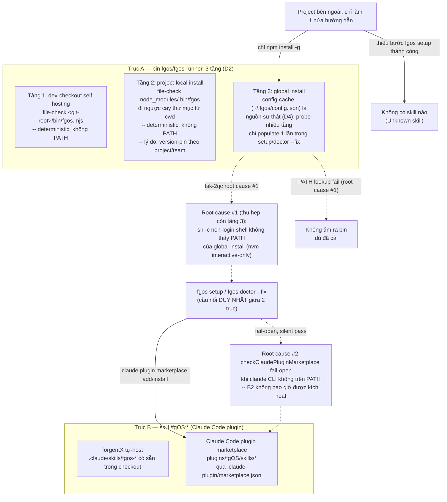
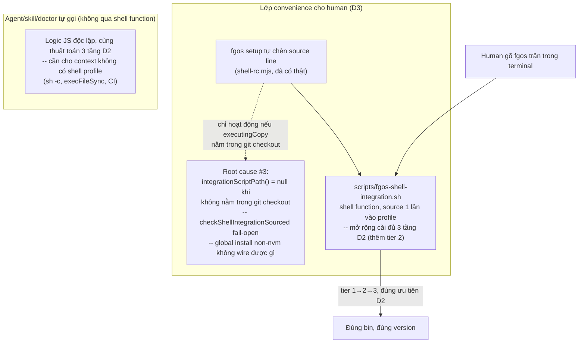

# Discussion — install/setup reliability for external projects (tsk-2qc)

## 1. Trạng thái hiện tại

Round 6. D1-D4 đã khoá — D1 (2 trục độc lập), D2 (bin = 3 tầng
deterministic), D3 (mở rộng shell-integration cho human + tự lỗ hổng
fail-open riêng), D4 (tier 3 global = config-cache làm nguồn sự thật,
probe làm cơ chế populate/repair, tự lành qua existsSync-staleness). Còn
đúng 1 câu hỏi mở: hướng sửa root cause #2 gốc (marketplace check
fail-open) — WARN thẳng hay tự phân biệt case trước.

## 2. Mục tiêu & đề bài

`fgos setup`/`fgos doctor` hiện chỉ thật sự được luyện (dogfood) trong
context tự-host của chính forgentX — nơi `bin/fgos.mjs` luôn có sẵn tại
cwd nên phần lớn logic PATH-lookup không bao giờ thực sự bị exercise.
Với một project bên ngoài đi đúng con đường cài đặt được document
(`npm install -g github:vantt/forgent`, rồi cài fgOS Claude Code plugin),
hai mảnh hạ tầng lẽ ra phải tự-verify/tự-fix — tìm ra bin `fgos` toàn cục,
và đăng ký Claude Code plugin marketplace để có skill — đều có đường fail
âm thầm: không báo lỗi, không tự sửa, và không có gì nhắc người dùng biết
để chạy lại. Kết quả quan sát được: project khác "luôn không tìm ra skill
hoặc không tìm ra bin". Mục tiêu của item này là thiết kế lại 2 cơ chế đó
sao cho: (a) verify thật (không fail-open khi không chắc), (b) tự sửa được
khi có thể, (c) báo rõ ràng cho người khi không tự sửa được, đúng tinh
thần 3 trụ cột của `docs/distribution-vision.md` (setup/doctor tự sửa
được mọi thứ cần, aware nhiều context trên 1 máy, mọi module đăng ký được
config/check của riêng nó) — không phải một bản vá cục bộ cho 2 hàm.

## 3. Vấn đề rõ / chưa rõ

| # | Điểm | Trạng thái | Ghi chú |
|---|------|-----------|---------|
| 1 | Root cause #1 (bin discovery) đã xác nhận bằng code+thực nghiệm | Rõ | `checkPluginSkillCliReachable` (`src/setup/registrations.mjs:1205-1219`) và `plugins/fgOS/skills/pick/SKILL.md:41` đều resolve global `fgos` qua `sh -c "command -v fgos"` — non-login, non-interactive. nvm chỉ export global bin dir trong block interactive của `~/.bashrc`/`~/.zshrc`. Test thật trên máy này: `npm prefix -g` trỏ vào thư mục nvm, nhưng `command -v fgos` chỉ tìm thấy vì có một bản cài **thứ hai, dư thừa** qua pnpm (`~/.local/share/pnpm/bin`, path này được export theo cách non-interactive shell cũng đọc được) — một máy chỉ cài đúng 1 lần theo đường npm/nvm khuyến nghị sẽ luôn fail. |
| 2 | Root cause #2 (plugin/marketplace fail-open) đã xác nhận bằng đọc code | Rõ | `checkClaudePluginMarketplace` (`src/setup/registrations.mjs:1118-1124`) trả `passed: true` khi lệnh `claude` không có trên PATH tại thời điểm check chạy — coi là "not applicable" thay vì "chưa verify được". Fix tương ứng (`claude plugin marketplace add`/`install`, dòng ~1160-1172) vì vậy không bao giờ chạy trong tình huống này. Không có cơ chế nào tự động chạy lại doctor/setup sau đó. |
| 3 | `claude` binary có thực sự đáng tin là "thước đo Claude Code có mặt hay không" không? | Chưa rõ | Người dùng có thể dùng Claude Code qua desktop app/IDE extension mà không có binary `claude` riêng trên PATH — lúc đó check #2 "not applicable" lại ĐÚNG theo nghĩa khác (Claude Code không dùng CLI marketplace mechanism theo cách này). Cần phân biệt "claude thật sự không áp dụng" khỏi "claude có áp dụng nhưng tạm thời không thấy trên PATH lúc check chạy" — 2 case khác nhau, hiện bị gộp làm một. |
| 4 | Vì sao project-local cần tồn tại riêng, không gộp về global-only? | Rõ (D2) | Version-pinning/team-consistency: global-only nghĩa là mọi project trên máy dùng chung 1 version, nâng cấp cho project này làm vỡ project khác im lặng — cùng lớp vấn đề `tsk-jtb` đang giải ở tầng release tag. `node_modules/.bin` không nằm trên PATH thường (chỉ có qua `npm run`/`npx`) nên phải resolve bằng file-check, không phải PATH lookup. |
| 5 | Hướng sửa root cause #1 (tầng global): probe nhiều tầng hay cache path đã resolve? | Rõ (D4) | Cache-in-config làm nguồn sự thật (đọc rẻ, không subprocess), probe nhiều tầng chỉ chạy 1 lần trong `fgos setup`/`doctor --fix` để populate/sửa, tự lành qua `existsSync`-staleness check khi cache sai. |
| 6 | Hướng sửa root cause #2: check nên fail loud hay tìm cách tự phân biệt "claude không áp dụng" khỏi "claude tạm thời không thấy"? | Chưa rõ | Cùng cần quyết định trước khi khoá D-ID. |
| 7 | Root cause #3 (mới phát hiện, D3): cơ chế human-convenience (shell function) tự wiring qua `fgos setup` có lỗ hổng fail-open riêng | Rõ | `integrationScriptPath()` (`src/setup/registrations.mjs:228-239`) trả `null` khi bản đang chạy không nằm trong git checkout nào; `checkShellIntegrationSourced` (dòng 276-280) coi `null` là `passed: true` — cùng pattern silent-pass với root cause #2. Global install qua nvm tình cờ vẫn ổn (`~/.nvm` tự nó là git clone), nhưng Homebrew/system-npm/Volta/fnm thì không wire được gì, doctor vẫn báo xanh. Yêu cầu "phải trong git checkout" vốn chỉ để tránh rác 1-dòng-source-mỗi-worktree — rủi ro đó không áp dụng cho bản cài qua npm. |

## 4. Quyết định đã chốt

| D-ID | Quyết định | Lý do |
|------|-----------|-------|
| D1 | Cài đặt fgOS có **2 trục độc lập, không bắc cầu tự động**: (a) trục bin — npm/pnpm/yarn global, project-local, hoặc dev-checkout self-hosting; (b) trục skill — forgentX tự-host (`.claude/skills/fgos-*`) hoặc Claude Code plugin marketplace (`plugins/fgOS/skills/*`). Cầu nối DUY NHẤT giữa 2 trục là `fgos setup`/`doctor --fix`. | Xác nhận bằng đọc `package.json` `files` allowlist (không có `plugins/`), `plugins/fgOS/.claude-plugin/plugin.json` (không có `scripts`/postinstall, đúng RUL6), và `.claude-plugin/marketplace.json` (skill của project ngoài chỉ tới được qua plugin marketplace). Nền tảng bắt buộc trước khi thiết kế bin-discovery — vì 1 project hoàn toàn có thể chỉ thoả 1 trục. |
| D2 | Trục A (bin) resolve theo **3 tầng deterministic**, không phải nhóm "PATH-dependent vs không" mơ hồ như trước: (1) dev-checkout self-hosting — file-check `<git-root>/bin/fgos.mjs`; (2) project-local install — file-check `node_modules/.bin/fgos`, đi ngược cây thư mục từ cwd (giống Node module resolution); (3) global install — tầng DUY NHẤT thật sự cần PATH lookup hoặc config-cache. **Project-local giữ lại là chế độ riêng, không gộp về global-only.** | Global-only làm mọi project trên máy dùng chung 1 version — nâng cấp cho project A làm vỡ project B im lặng, cùng lớp vấn đề `tsk-jtb` đang giải ở tầng release tag; project-local (qua `package.json`+lockfile) pin version theo từng project/team, đúng pattern chuẩn CLI npm (eslint/prettier). `node_modules/.bin` xác nhận không nằm trên PATH ngoài context `npm run`/`npx` nên phải resolve bằng file-check, không phải PATH — thu hẹp câu hỏi probe-vs-cache trước đó xuống chỉ còn tầng global. |
| D3 | Mở rộng cơ chế "human gõ `fgos` trần, hệ thống tự resolve" theo 2 phần: (a) nội dung `scripts/fgos-shell-integration.sh` cài đủ 3 tầng của D2 (thêm tier 2 — hiện chỉ có tier 1 → PATH fallback); (b) `integrationScriptPath()`/`checkShellIntegrationSourced` (`src/setup/registrations.mjs`) BỎ yêu cầu "phải nằm trong git checkout" đối với bản cài qua npm (global/project-local) — chỉ giữ yêu cầu đó cho dev-checkout self-hosting, nơi rủi ro rác-1-dòng-mỗi-worktree là thật; bản cài npm dùng thẳng path ổn định từ `import.meta.url`. | `checkShellIntegrationSourced` trả `passed: true` khi `integrationScriptPath()` là `null` — cùng pattern fail-open với root cause #2 (`src/setup/registrations.mjs:228-239,270-281`; `src/runner/paths.mjs:72-85`). Global install qua nvm tình cờ vẫn wire được (`~/.nvm` tự nó là git clone), nhưng Homebrew/system-npm/Volta/fnm thì không — doctor vẫn báo xanh. Yêu cầu git-checkout chỉ cần thiết để tránh rác rc-line khi xoá worktree (dev-checkout only), không áp dụng cho bản cài npm vốn đã có path ổn định sẵn. |
| D4 | Tầng 3 (global) trong D2 dùng **config-cache làm nguồn sự thật**: `fgos setup`/`doctor --fix` chạy probe nhiều tầng (PATH thường → ép login-shell `command -v` → probe trực tiếp vị trí global-install đã biết, không qua PATH) đúng 1 lần, ghi absolute path vào `~/.fgos/config.json`. Mọi lần gọi khác đọc cache trước (rẻ, không subprocess); cache sai/thiếu (`existsSync` fail) mới trigger probe lại + ghi đè — tự lành, không trả phí probe mỗi lần gọi. | Probe-mỗi-lần tốn 2-3 subprocess/lần gọi — đắt khi 1 phiên gọi `fgos` nhiều lần. Cache-read là 1 lần đọc file rẻ. Staleness tự sửa qua `existsSync`, chỉ trả phí probe đầy đủ đúng lúc cache thật sự sai (gỡ cài/đổi package manager/đổi version nvm). Khớp pattern act-then-report đã có sẵn của `fgos setup`/`doctor --fix` (RUL10), không phát minh cơ chế mới. |

## 5. Q&A log

- **2026-08-13, vòng 1** — Người dùng (anh) yêu cầu tạo work item mới và
  mở code-shaping để cùng thiết kế cơ chế cài đặt/setup đúng chuẩn, nói rõ
  đã tin tưởng agent có đủ kiến thức để chủ động đề xuất. Agent (em) đã
  scout xong 2 root cause cụ thể (bằng chứng ở §3 #1-2) từ phiên thảo luận
  trước khi mở discussion này; đang trình bày 2 hướng thiết kế cho từng
  root cause trực tiếp trong hội thoại, chưa nhận câu trả lời.
- **2026-08-13, vòng 2** — Anh yêu cầu thống nhất cơ chế cài đặt (bao
  nhiêu chế độ, bin/skill nằm đâu mỗi chế độ, cách đóng gói) TRƯỚC khi bàn
  bin-discovery. Em scout `package.json` `files`, `plugins/fgOS/.claude-
  plugin/plugin.json`, `.claude-plugin/marketplace.json`, trình bày ma
  trận 2 trục độc lập. Anh xác nhận, không thêm chế độ nào khác, yêu cầu
  "cập nhật" — đã ghi D1, cập nhật §3/§6.
- **2026-08-13, vòng 3** — Anh hỏi tại sao trục A, project-local không
  đơn giản dùng bin global. Em trình bày 2 lý do: (a) version-pinning/
  team-consistency (global-only làm mọi project chung 1 version, nâng cấp
  cho 1 project vỡ project khác im lặng — cùng lớp vấn đề `tsk-jtb`), (b)
  `node_modules/.bin` không nằm trên PATH thường nên phải resolve bằng
  file-check, thu hẹp câu hỏi bin-discovery ban đầu xuống chỉ còn tầng
  global. Anh đồng ý, yêu cầu "cập nhật tài liệu kèm lý do tương thích
  version" — đã ghi D2, cập nhật §3/§4/§6.
- **2026-08-13, vòng 4** — Với model 3-tầng đã chốt, anh hỏi: cho agent/
  system tự chạy thì tự resolve path được rồi, nhưng với human gõ tay, có
  cách tiện dùng `fgos` trần mà hệ thống vẫn tự resolve đúng theo 3 tầng
  không? Em đề xuất mở rộng shell function có sẵn
  (`scripts/fgos-shell-integration.sh`, hiện chỉ làm tier 1→PATH) thành
  cài đủ 3 tầng, source 1 lần vào profile — cùng cơ chế phục vụ cả người
  gõ tay lẫn agent qua Bash tool (đã xác nhận Bash tool session cũng có
  function này). Anh đồng ý, hỏi lại xin quyết trước khi khoá.
- **2026-08-13, vòng 5** — Trước khi khoá, anh nhắc: doctor đã có fix
  chuyện wiring source này rồi (`scripts/fgos-shell-integration.sh`). Em
  đọc lại `src/setup/shell-rc.mjs`/`registrations.mjs` — xác nhận cơ chế
  wiring có thật (`fgos setup` tự chèn source line), NHƯNG phát hiện thêm
  root cause #3: `integrationScriptPath()` trả `null` — và
  `checkShellIntegrationSourced` coi đó là `passed: true` — khi bản đang
  chạy không nằm trong git checkout nào, đúng pattern fail-open của root
  cause #2, chặn mất cơ chế convenience này cho global install không qua
  nvm. Anh yêu cầu gộp phát hiện này vào D3 luôn — đã ghi D3, cập nhật
  §3/§4/§6.
- **2026-08-13, vòng 6** — Anh yêu cầu "advise 1" — em khuyến nghị thẳng
  cho câu hỏi tier-3 (§3 #5 cũ): config-cache làm nguồn sự thật, probe
  nhiều tầng chỉ làm cơ chế populate 1 lần trong `fgos setup`/`doctor
  --fix`, tự lành qua `existsSync`-staleness. Lý do: chi phí subprocess
  nếu probe mỗi lần gọi, cache-read rẻ hơn nhiều bậc, khớp pattern
  act-then-report đã có sẵn. Anh đồng ý — đã ghi D4, cập nhật §3/§4/§6.

## 6. Thiết kế đã chốt {#design}

fgOS có 2 hệ phân phối độc lập (D1) — **bin** (`fgos`/`fgos-runner`, npm
package) và **skill** (`/fgOS:*`, Claude Code plugin) — đóng gói tách
biệt, cài tách biệt, và không có gì tự động nối chúng lại ngoài
`fgos setup`/`doctor --fix` (bản thân đang có 2 lỗ hổng fail-silent, xem
§3 #1-2).

Trục A (bin) tự nó không phải một khối "global hay local" đơn giản mà là
**3 tầng deterministic, mỗi tầng một lý do tồn tại riêng và một cách
resolve riêng** (D2):

1. **dev-checkout self-hosting** — file-check `<git-root>/bin/fgos.mjs`.
   Tồn tại cho contributor tự dogfood chính forgentX, không cần cài gì.
2. **project-local install** — file-check `node_modules/.bin/fgos`, đi
   ngược cây thư mục từ cwd. Tồn tại để **pin version theo từng
   project/team**, tránh global-only làm mọi project trên máy dùng chung
   1 version rồi vỡ đồng loạt khi 1 project cần nâng cấp — cùng lớp vấn đề
   `tsk-jtb` đang giải ở tầng release tag, chỉ khác là D2 giải ở tầng cài
   đặt cục bộ thay vì tầng phân phối từ nguồn.
3. **global install** — PATH lookup (hoặc config-cache, câu hỏi vẫn mở ở
   §3 #5). Tồn tại cho dùng nhanh/cá nhân, không cần version pin riêng.

Chỉ tầng 3 thật sự có root cause #1 (PATH không thấy trong non-interactive
shell) — tầng 1-2 vốn đã deterministic bằng file-check, không phụ thuộc
PATH nên không có gì để tranh luận thêm.

Kết luận thiết kế tới thời điểm này: bất kỳ hướng sửa bin-discovery nào
cũng phải đứng trên nền D1+D2 — tầng 1-2 giữ nguyên file-check hiện có
(đã đúng, không cần sửa), toàn bộ nỗ lực root cause #1 chỉ tập trung vào
tầng 3 (global). **Tầng 3 đã chốt (D4): config-cache làm nguồn sự thật.**
Còn mở duy nhất: hướng sửa root cause #2 gốc (WARN thẳng vs phân biệt
case "claude không áp dụng" khỏi "claude tạm thời không thấy").

**Tầng 3 cụ thể (D4):** `fgos setup`/`doctor --fix` chạy multi-tier probe
đúng 1 lần (PATH thường → ép login-shell `command -v` → probe trực tiếp
vị trí global-install đã biết), ghi absolute path vào
`~/.fgos/config.json`. Mọi caller khác — cả JS-side (agent/skill/CI) lẫn
shell function (D3, khi tier 1-2 đều miss) — đọc cache trước, chỉ probe
lại khi `existsSync` phát hiện cache sai.

**Lớp thứ 3 vừa thêm (D3) — convenience cho human, tách biệt khỏi
agent/system tự resolve:** khi agent/skill/doctor tự gọi `fgos` theo D2,
3 tầng tự resolve được (không cần PATH cho tier 1-2, chỉ tier 3 cần bàn).
Nhưng khi HUMAN gõ `fgos` trần trong terminal, cách tiện dụng nhất là
cùng 1 shell function đã có sẵn cho tier 1
(`scripts/fgos-shell-integration.sh`, source 1 lần vào profile, luôn
thắng PATH binary cùng tên) — chỉ cần MỞ RỘNG nó cài đủ cả 3 tầng thay vì
chỉ tier 1→PATH như hiện tại. Cơ chế `fgos setup` tự wiring dòng source
này vào `~/.bashrc`/`~/.zshrc` đã có thật (`shell-rc.mjs`), nhưng bản thân
việc wiring lại có lỗ hổng fail-open riêng — `integrationScriptPath()`
trả `null` khi bản đang chạy không nằm trong git checkout nào, và
`checkShellIntegrationSourced` coi đó là "nothing to check" thay vì báo
thiếu. Yêu cầu git-checkout đó vốn chỉ để tránh rác rc-line khi xoá
dev-checkout worktree — không nên áp cho bản cài qua npm, vốn đã có path
ổn định từ `import.meta.url`.

Nguyên tắc thiết kế chốt ở đây: **1 thuật toán 3 tầng (D2), 2 nơi hiện
thực song song** — shell function cho tiện gõ tay/agent-qua-Bash-tool, JS
độc lập cho context non-interactive thật sự (skill gọi `sh -c`, doctor
check, CI) — không phải việc mới, mà là đồng bộ hoá 2 chỗ hiện đang làm
dở dang khác nhau (script hiện chỉ có tier 1+3, JS check hiện cũng chỉ có
tier 1+3, cả 2 đều thiếu tier 2; và JS-wiring còn thêm root cause #3
riêng của nó).

## 7. Danh mục hạng mục / task {#tasks}

(chưa có — chờ §6 có nội dung cụ thể)
