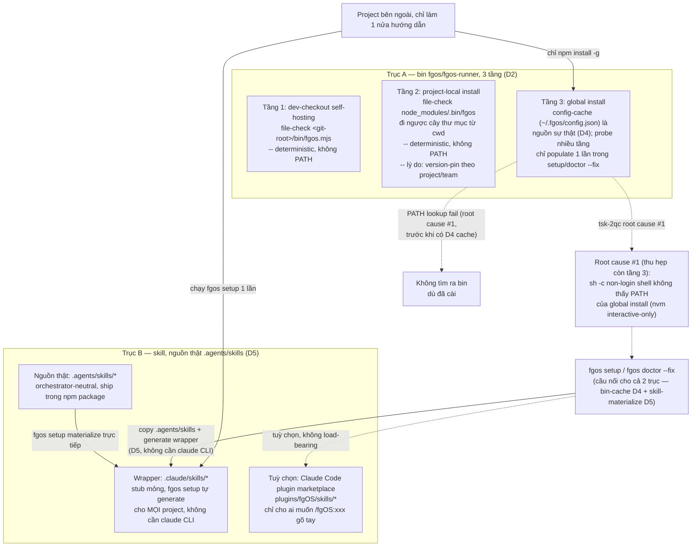
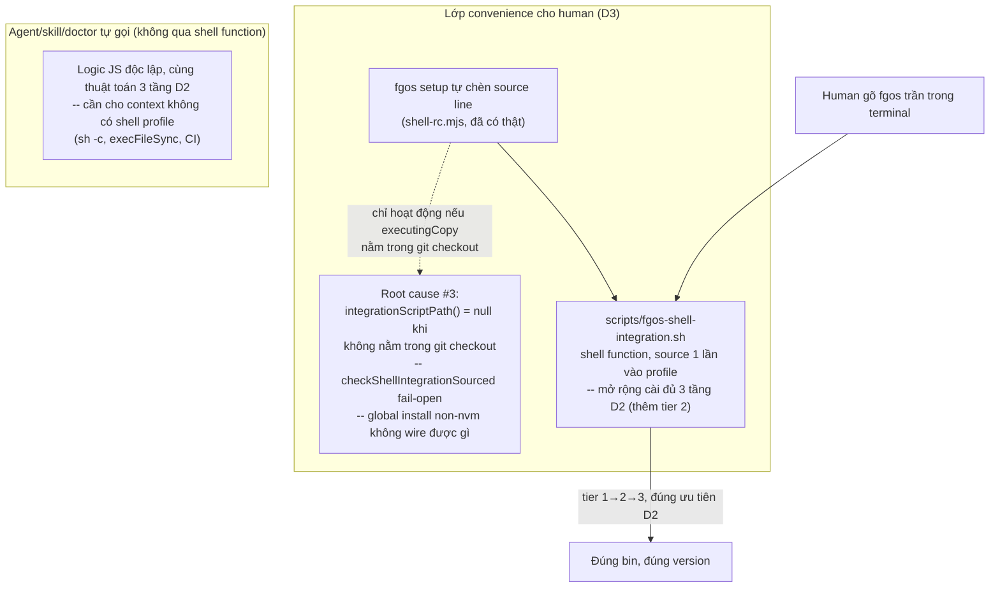
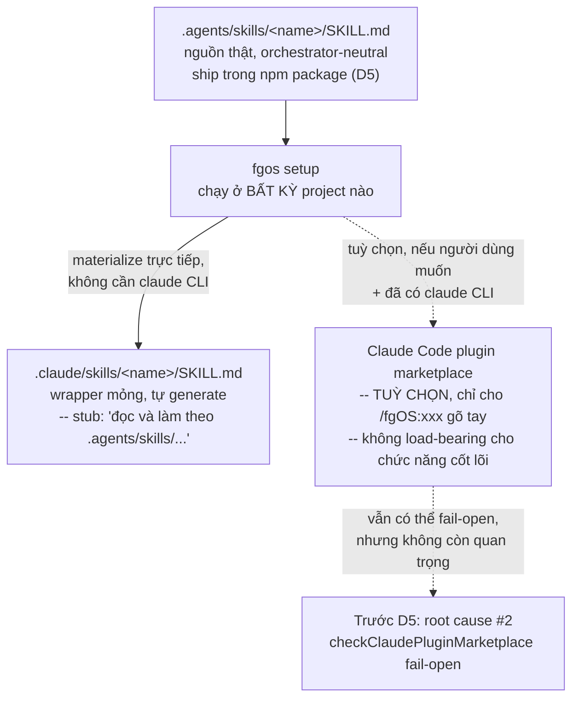

# Discussion — install/setup reliability for external projects (tsk-2qc)

## 1. Trạng thái hiện tại

Round 14. D1-D7 đã khoá, hội tụ. D7 (round 12) chốt cơ chế build: 1 hàm
generator dùng chung cho `npm run build:skills` (forgentX tự dogfood) và
`fgos setup` (project ngoài), wrapper luôn tự chứa trong project đích
(copy cả `.agents/skills` + `.claude/skills`, không trỏ ngược global).
Round 13 (câu hỏi về `upstreams/bee`) không sinh quyết định mới — xác
nhận bee không có case tương đương để so sánh (workshop nội bộ, không
phân phối ra ngoài). Anh xác nhận "tiếp tục" — chuyển sang §7 chia task
cụ thể + chuẩn bị handoff sang `fgos-coding-exploring`/`fgos-coding-planning`.

## 2. Mục tiêu & đề bài

`fgos setup`/`fgos doctor` hiện chỉ thật sự được luyện (dogfood) trong
context tự-host của chính forgentX — nơi `bin/fgos.mjs` luôn có sẵn tại
cwd nên phần lớn logic PATH-lookup không bao giờ thực sự bị exercise.
Với một project bên ngoài đi đúng con đường cài đặt được document
(`npm install -g github:vantt/forgent`, rồi cài fgOS Claude Code plugin),
hai mảnh hạ tầng lẽ ra phải tự-verify/tự-fix — tìm ra bin `fgos` toàn cục,
và đăng ký Claude Code plugin marketplace để có skill — đều có đường fail
âm thầm: không báo lỗi, không tự sửa, và không có gì nhắc người dùng biết
để chạy lại. Kết quả quan sát được: project khác "luôn không tìm ra skill
hoặc không tìm ra bin". Mục tiêu của item này là thiết kế lại 2 cơ chế đó
sao cho: (a) verify thật (không fail-open khi không chắc), (b) tự sửa được
khi có thể, (c) báo rõ ràng cho người khi không tự sửa được, đúng tinh
thần 3 trụ cột của `docs/distribution-vision.md` (setup/doctor tự sửa
được mọi thứ cần, aware nhiều context trên 1 máy, mọi module đăng ký được
config/check của riêng nó) — không phải một bản vá cục bộ cho 2 hàm.

## 3. Vấn đề rõ / chưa rõ

| # | Điểm | Trạng thái | Ghi chú |
|---|------|-----------|---------|
| 1 | Root cause #1 (bin discovery) đã xác nhận bằng code+thực nghiệm | Rõ | `checkPluginSkillCliReachable` (`src/setup/registrations.mjs:1205-1219`) và `plugins/fgOS/skills/pick/SKILL.md:41` đều resolve global `fgos` qua `sh -c "command -v fgos"` — non-login, non-interactive. nvm chỉ export global bin dir trong block interactive của `~/.bashrc`/`~/.zshrc`. Test thật trên máy này: `npm prefix -g` trỏ vào thư mục nvm, nhưng `command -v fgos` chỉ tìm thấy vì có một bản cài **thứ hai, dư thừa** qua pnpm (`~/.local/share/pnpm/bin`, path này được export theo cách non-interactive shell cũng đọc được) — một máy chỉ cài đúng 1 lần theo đường npm/nvm khuyến nghị sẽ luôn fail. |
| 2 | Root cause #2 (plugin/marketplace fail-open) đã xác nhận bằng đọc code | Rõ | `checkClaudePluginMarketplace` (`src/setup/registrations.mjs:1118-1124`) trả `passed: true` khi lệnh `claude` không có trên PATH tại thời điểm check chạy — coi là "not applicable" thay vì "chưa verify được". Fix tương ứng (`claude plugin marketplace add`/`install`, dòng ~1160-1172) vì vậy không bao giờ chạy trong tình huống này. Không có cơ chế nào tự động chạy lại doctor/setup sau đó. |
| 3 | `claude` binary có thực sự đáng tin là "thước đo Claude Code có mặt hay không" không? | Chưa rõ | Người dùng có thể dùng Claude Code qua desktop app/IDE extension mà không có binary `claude` riêng trên PATH — lúc đó check #2 "not applicable" lại ĐÚNG theo nghĩa khác (Claude Code không dùng CLI marketplace mechanism theo cách này). Cần phân biệt "claude thật sự không áp dụng" khỏi "claude có áp dụng nhưng tạm thời không thấy trên PATH lúc check chạy" — 2 case khác nhau, hiện bị gộp làm một. |
| 4 | Vì sao project-local cần tồn tại riêng, không gộp về global-only? | Rõ (D2) | Version-pinning/team-consistency: global-only nghĩa là mọi project trên máy dùng chung 1 version, nâng cấp cho project này làm vỡ project khác im lặng — cùng lớp vấn đề `tsk-jtb` đang giải ở tầng release tag. `node_modules/.bin` không nằm trên PATH thường (chỉ có qua `npm run`/`npx`) nên phải resolve bằng file-check, không phải PATH lookup. |
| 5 | Hướng sửa root cause #1 (tầng global): probe nhiều tầng hay cache path đã resolve? | Rõ (D4) | Cache-in-config làm nguồn sự thật (đọc rẻ, không subprocess), probe nhiều tầng chỉ chạy 1 lần trong `fgos setup`/`doctor --fix` để populate/sửa, tự lành qua `existsSync`-staleness check khi cache sai. |
| 6 | Hướng sửa root cause #2: check nên fail loud hay tìm cách tự phân biệt "claude không áp dụng" khỏi "claude tạm thời không thấy"? | Rõ (D5, khác hướng ban đầu) | Không sửa check nữa — bỏ luôn phụ thuộc `claude` CLI cho chức năng cốt lõi. Xem #8. |
| 7 | Root cause #3 (mới phát hiện, D3): cơ chế human-convenience (shell function) tự wiring qua `fgos setup` có lỗ hổng fail-open riêng | Rõ | `integrationScriptPath()` (`src/setup/registrations.mjs:228-239`) trả `null` khi bản đang chạy không nằm trong git checkout nào; `checkShellIntegrationSourced` (dòng 276-280) coi `null` là `passed: true` — cùng pattern silent-pass với root cause #2. Global install qua nvm tình cờ vẫn ổn (`~/.nvm` tự nó là git clone), nhưng Homebrew/system-npm/Volta/fnm thì không wire được gì, doctor vẫn báo xanh. Yêu cầu "phải trong git checkout" vốn chỉ để tránh rác 1-dòng-source-mỗi-worktree — rủi ro đó không áp dụng cho bản cài qua npm. |
| 8 | "Thật sự có cần plugin marketplace không?" (câu hỏi gốc của anh, round 7) | Rõ (D5) | Không cần cho chức năng CỐT LÕI. Bằng chứng dư thừa quan sát trực tiếp trong chính session này: 14 dev-skill load 2 lần (bản không-prefix từ `.claude/skills/`, bản `fgOS:`-prefix từ plugin) — vì forgentX vừa là nguồn `.claude/skills/` vừa tự cài plugin của mình để dogfood. `.agents/skills/` đã tồn tại sẵn (14 skill y hệt) — đúng hướng orchestrator-neutral anh muốn. Quyết: `.agents/skills` thành nguồn thật, `.claude/skills` thành wrapper mỏng do `fgos setup` tự generate cho MỌI project — plugin marketplace hạ xuống tuỳ chọn. |
| 9 | 14 dev-skill nội bộ (chỉ dùng khi fgOS tự dispatch) có cách nào không đăng ký thành `/skill` discoverable không? | Rõ (D6), còn 1 việc verify | Claude Code có frontmatter `user-invocable: false` — đúng use case ("background knowledge users shouldn't invoke directly", xác nhận qua research claude-code-guide). Chưa xác nhận 100% từ docs liệu có gỡ khỏi listing model thấy hay chỉ gỡ khỏi menu `/` người gõ tay — cần verify thực nghiệm trên 1 skill trước khi áp rộng. |
| 10 | Build/git-flow/packaging có cần thiết kế thêm để support D5's wrapper-generation không? | Rõ (D7 cho phần build; git-flow/semver gác lại — đã có cơ chế ở `tsk-jtb`, không phải việc của item này) | Build: 1 hàm generator dùng chung cho `npm run build:skills` + `fgos setup`; wrapper luôn tự chứa trong project đích. Packaging: `.agents/` thiếu trong `files` allowlist (đã ghi D5); plugin channel có tự generate theo `.agents/skills` hay không vẫn để mở, không chặn thiết kế cốt lõi. |
| 11 | `upstreams/bee` có cơ chế nào đáng copy cho build/wrapper không? | Rõ, không có gì để copy | `bee` là workshop nội bộ (`.bee/bin/bee.mjs`, dev-checkout self-hosting), không có `package.json`/`bin`, không có install/distribution doc nào — chưa từng cần giải bài toán "project khác cài vào dùng". Xác nhận độ khó D1-D7 đang giải là cái giá của việc fgOS chọn tái dùng được across project, không phải thiếu sót thiết kế. |

## 4. Quyết định đã chốt

| D-ID | Quyết định | Lý do |
|------|-----------|-------|
| D1 | Cài đặt fgOS có **2 trục độc lập, không bắc cầu tự động**: (a) trục bin — npm/pnpm/yarn global, project-local, hoặc dev-checkout self-hosting; (b) trục skill — forgentX tự-host (`.claude/skills/fgos-*`) hoặc Claude Code plugin marketplace (`plugins/fgOS/skills/*`). Cầu nối DUY NHẤT giữa 2 trục là `fgos setup`/`doctor --fix`. | Xác nhận bằng đọc `package.json` `files` allowlist (không có `plugins/`), `plugins/fgOS/.claude-plugin/plugin.json` (không có `scripts`/postinstall, đúng RUL6), và `.claude-plugin/marketplace.json` (skill của project ngoài chỉ tới được qua plugin marketplace). Nền tảng bắt buộc trước khi thiết kế bin-discovery — vì 1 project hoàn toàn có thể chỉ thoả 1 trục. |
| D2 | Trục A (bin) resolve theo **3 tầng deterministic**, không phải nhóm "PATH-dependent vs không" mơ hồ như trước: (1) dev-checkout self-hosting — file-check `<git-root>/bin/fgos.mjs`; (2) project-local install — file-check `node_modules/.bin/fgos`, đi ngược cây thư mục từ cwd (giống Node module resolution); (3) global install — tầng DUY NHẤT thật sự cần PATH lookup hoặc config-cache. **Project-local giữ lại là chế độ riêng, không gộp về global-only.** | Global-only làm mọi project trên máy dùng chung 1 version — nâng cấp cho project A làm vỡ project B im lặng, cùng lớp vấn đề `tsk-jtb` đang giải ở tầng release tag; project-local (qua `package.json`+lockfile) pin version theo từng project/team, đúng pattern chuẩn CLI npm (eslint/prettier). `node_modules/.bin` xác nhận không nằm trên PATH ngoài context `npm run`/`npx` nên phải resolve bằng file-check, không phải PATH — thu hẹp câu hỏi probe-vs-cache trước đó xuống chỉ còn tầng global. |
| D3 | Mở rộng cơ chế "human gõ `fgos` trần, hệ thống tự resolve" theo 2 phần: (a) nội dung `scripts/fgos-shell-integration.sh` cài đủ 3 tầng của D2 (thêm tier 2 — hiện chỉ có tier 1 → PATH fallback); (b) `integrationScriptPath()`/`checkShellIntegrationSourced` (`src/setup/registrations.mjs`) BỎ yêu cầu "phải nằm trong git checkout" đối với bản cài qua npm (global/project-local) — chỉ giữ yêu cầu đó cho dev-checkout self-hosting, nơi rủi ro rác-1-dòng-mỗi-worktree là thật; bản cài npm dùng thẳng path ổn định từ `import.meta.url`. | `checkShellIntegrationSourced` trả `passed: true` khi `integrationScriptPath()` là `null` — cùng pattern fail-open với root cause #2 (`src/setup/registrations.mjs:228-239,270-281`; `src/runner/paths.mjs:72-85`). Global install qua nvm tình cờ vẫn wire được (`~/.nvm` tự nó là git clone), nhưng Homebrew/system-npm/Volta/fnm thì không — doctor vẫn báo xanh. Yêu cầu git-checkout chỉ cần thiết để tránh rác rc-line khi xoá worktree (dev-checkout only), không áp dụng cho bản cài npm vốn đã có path ổn định sẵn. |
| D4 | Tầng 3 (global) trong D2 dùng **config-cache làm nguồn sự thật**: `fgos setup`/`doctor --fix` chạy probe nhiều tầng (PATH thường → ép login-shell `command -v` → probe trực tiếp vị trí global-install đã biết, không qua PATH) đúng 1 lần, ghi absolute path vào `~/.fgos/config.json`. Mọi lần gọi khác đọc cache trước (rẻ, không subprocess); cache sai/thiếu (`existsSync` fail) mới trigger probe lại + ghi đè — tự lành, không trả phí probe mỗi lần gọi. | Probe-mỗi-lần tốn 2-3 subprocess/lần gọi — đắt khi 1 phiên gọi `fgos` nhiều lần. Cache-read là 1 lần đọc file rẻ. Staleness tự sửa qua `existsSync`, chỉ trả phí probe đầy đủ đúng lúc cache thật sự sai (gỡ cài/đổi package manager/đổi version nvm). Khớp pattern act-then-report đã có sẵn của `fgos setup`/`doctor --fix` (RUL10), không phát minh cơ chế mới. |
| D5 (sửa lại phần trục B của D1) | Nguồn thật cho nội dung skill chuyển sang `.agents/skills/<name>/SKILL.md` (orchestrator-neutral, đã tồn tại sẵn, hiện đang hand-mirror byte-identical vào `.claude/skills` + `plugins/fgOS/skills` qua `test/skills/fgos-mirror.test.mjs`). `.claude/skills/<name>/SKILL.md` thành **wrapper mỏng** — stub ngắn "đọc và làm theo `.agents/skills/<name>/SKILL.md`", cùng pattern dispatch-sang-skill-thật fgOS đã dùng khắp nơi (`plugins/fgOS/skills/coding-shape` → `fgos-coding-shaping`). `fgos setup` chạy ở BẤT KỲ project nào (không riêng forgentX) tự materialize `.agents/skills/*` (ship trong npm package, cần thêm `.agents/` vào `files` allowlist) + wrapper `.claude/skills/*` generate tự động — không cần `claude` CLI, không cần đăng ký plugin marketplace cho chức năng cốt lõi. Plugin/marketplace hạ xuống tuỳ chọn, chỉ cho ai muốn thêm `/fgOS:xxx` gõ tay. | Theo định hướng chủ sản phẩm: skill fgOS phải chuẩn hoá theo hướng agent điều phối không nhất thiết là Claude — `.agents/skills` đã tồn tại đúng vai trò này. Gộp 3-chân-mirror-tay hiện tại (tsk-32b) thành 1 nguồn thật + wrapper tự sinh vừa bỏ gánh nặng đồng bộ tay, vừa bỏ luôn phụ thuộc `claude` CLI — giải quyết root cause #2 bằng kiến trúc, không phải vá check. Tác động kéo theo đã ghi nhận: `test/skills/fgos-mirror.test.mjs` hiện assert byte-identical cả 3 chân — phải đổi thành assert "wrapper trỏ đúng chỗ" khi `.claude/skills` không còn là full copy. |
| D6 | 14 dev-skill (nguồn `.agents/skills`, D5) mang frontmatter `user-invocable: false` trong wrapper `.claude/skills` — dispatch-only, không đăng ký discoverable cho human. ~35 CLI-wrapper skill (tạo work-item: submit/ask/answer/...; launcher/orchestrator: pick/cook/discover/plan/*-next/*-loop/terminal/goal/...) giữ nguyên `user-invocable: true` — đây mới là nhóm human thật sự gõ. Khớp thẳng ranh giới sẵn có trong Data Dictionary #4b (`distribution.md`), không cần phân loại lại. **Còn 1 việc verify thực nghiệm chưa xong**: chưa xác nhận `user-invocable: false` có gỡ khỏi listing model thấy hay chỉ gỡ khỏi menu `/` người gõ. | Anh chỉ rõ human chủ yếu dùng skill tạo work-item + launcher/orchestrator kiểu `loop.next` — khớp đúng ranh giới wrapper-vs-dev-skill đã có sẵn trong code. Research qua claude-code-guide xác nhận `user-invocable: false` là field đúng use case ("background knowledge users shouldn't invoke directly"), nhưng docs không xác nhận 100% phạm vi gỡ-khỏi-listing. |
| D7 | Wrapper generation dùng **1 hàm generator dùng chung** (vd `src/setup/skill-wrappers.mjs`), gọi từ 2 nơi: (1) `npm run build:skills` — forgentX tự dogfood, giữ `.claude/skills/*` đồng bộ với `.agents/skills/*`, thay/mở rộng assertion của `test/skills/fgos-mirror.test.mjs` (byte-identical → wrapper-đúng-chỗ); (2) `fgos setup`'s external-project materialize path (D5). Cùng nguyên tắc "1 thuật toán, nhiều nơi gọi" đã áp cho D3. **Wrapper luôn tự chứa trong project đích**: `fgos setup` copy CẢ `.agents/skills/*` (nguồn) LẪN `.claude/skills/*` (wrapper sinh ra) vào project ngoài, path tương đối sibling — không bao giờ trỏ ngược về vị trí cài global (tránh lặp lại đúng loại fragility PATH/location mà D2/D4 đã giải cho bin). | Anh yêu cầu ưu tiên "build chạy đúng trước", và theo feedback chuẩn của anh (quyết khi đã thấy rõ hướng thắng, không hỏi vòng vo) — em advise thẳng thay vì hỏi lại. Dùng chung generator tránh lệch giữa bản forgentX tự dogfood và bản `fgos setup` sinh cho project ngoài. Tự chứa trong project đích tránh tái tạo đúng lớp fragility mà cả item này sinh ra để giải. |

## 5. Q&A log

- **2026-08-13, vòng 1** — Người dùng (anh) yêu cầu tạo work item mới và
  mở code-shaping để cùng thiết kế cơ chế cài đặt/setup đúng chuẩn, nói rõ
  đã tin tưởng agent có đủ kiến thức để chủ động đề xuất. Agent (em) đã
  scout xong 2 root cause cụ thể (bằng chứng ở §3 #1-2) từ phiên thảo luận
  trước khi mở discussion này; đang trình bày 2 hướng thiết kế cho từng
  root cause trực tiếp trong hội thoại, chưa nhận câu trả lời.
- **2026-08-13, vòng 2** — Anh yêu cầu thống nhất cơ chế cài đặt (bao
  nhiêu chế độ, bin/skill nằm đâu mỗi chế độ, cách đóng gói) TRƯỚC khi bàn
  bin-discovery. Em scout `package.json` `files`, `plugins/fgOS/.claude-
  plugin/plugin.json`, `.claude-plugin/marketplace.json`, trình bày ma
  trận 2 trục độc lập. Anh xác nhận, không thêm chế độ nào khác, yêu cầu
  "cập nhật" — đã ghi D1, cập nhật §3/§6.
- **2026-08-13, vòng 3** — Anh hỏi tại sao trục A, project-local không
  đơn giản dùng bin global. Em trình bày 2 lý do: (a) version-pinning/
  team-consistency (global-only làm mọi project chung 1 version, nâng cấp
  cho 1 project vỡ project khác im lặng — cùng lớp vấn đề `tsk-jtb`), (b)
  `node_modules/.bin` không nằm trên PATH thường nên phải resolve bằng
  file-check, thu hẹp câu hỏi bin-discovery ban đầu xuống chỉ còn tầng
  global. Anh đồng ý, yêu cầu "cập nhật tài liệu kèm lý do tương thích
  version" — đã ghi D2, cập nhật §3/§4/§6.
- **2026-08-13, vòng 4** — Với model 3-tầng đã chốt, anh hỏi: cho agent/
  system tự chạy thì tự resolve path được rồi, nhưng với human gõ tay, có
  cách tiện dùng `fgos` trần mà hệ thống vẫn tự resolve đúng theo 3 tầng
  không? Em đề xuất mở rộng shell function có sẵn
  (`scripts/fgos-shell-integration.sh`, hiện chỉ làm tier 1→PATH) thành
  cài đủ 3 tầng, source 1 lần vào profile — cùng cơ chế phục vụ cả người
  gõ tay lẫn agent qua Bash tool (đã xác nhận Bash tool session cũng có
  function này). Anh đồng ý, hỏi lại xin quyết trước khi khoá.
- **2026-08-13, vòng 5** — Trước khi khoá, anh nhắc: doctor đã có fix
  chuyện wiring source này rồi (`scripts/fgos-shell-integration.sh`). Em
  đọc lại `src/setup/shell-rc.mjs`/`registrations.mjs` — xác nhận cơ chế
  wiring có thật (`fgos setup` tự chèn source line), NHƯNG phát hiện thêm
  root cause #3: `integrationScriptPath()` trả `null` — và
  `checkShellIntegrationSourced` coi đó là `passed: true` — khi bản đang
  chạy không nằm trong git checkout nào, đúng pattern fail-open của root
  cause #2, chặn mất cơ chế convenience này cho global install không qua
  nvm. Anh yêu cầu gộp phát hiện này vào D3 luôn — đã ghi D3, cập nhật
  §3/§4/§6.
- **2026-08-13, vòng 6** — Anh yêu cầu "advise 1" — em khuyến nghị thẳng
  cho câu hỏi tier-3 (§3 #5 cũ): config-cache làm nguồn sự thật, probe
  nhiều tầng chỉ làm cơ chế populate 1 lần trong `fgos setup`/`doctor
  --fix`, tự lành qua `existsSync`-staleness. Lý do: chi phí subprocess
  nếu probe mỗi lần gọi, cache-read rẻ hơn nhiều bậc, khớp pattern
  act-then-report đã có sẵn. Anh đồng ý — đã ghi D4, cập nhật §3/§4/§6.
- **2026-08-13, vòng 7** — Anh hỏi thẳng: "thật sự có cần plugins không?
  cảm thấy có gì đó dư thừa". Em phát hiện bằng chứng dư thừa THẬT ngay
  trong session này (14 dev-skill load 2 lần, prefix và không-prefix),
  trình bày hướng thay thế: `fgos setup` copy thẳng skill content vào
  `.claude/skills/` của project ngoài, bỏ phụ thuộc plugin marketplace
  làm cơ chế bắt buộc — plugin chỉ còn tuỳ chọn cho `/fgOS:xxx`. Anh nói
  "muốn đồng ý" nhưng bổ sung định hướng quan trọng: bộ skill đang chuẩn
  hoá để agent điều phối không nhất thiết là Claude, nên nguồn thật nên ở
  `.agents/skills`, `.claude/skills` chỉ là wrapper mỏng.
- **2026-08-13, vòng 8** — Em scout xác nhận `.agents/skills/` đã tồn tại
  thật (14 skill y hệt `.claude/skills`), và `test/skills/fgos-mirror.
  test.mjs` đã có sẵn cơ chế mirror 3 chân (`.claude/skills` ↔
  `.agents/skills` ↔ `plugins/fgOS/skills`) — hiện maintain bằng tay,
  `.claude/skills` là bản được sửa theo `distribution.md`. Em đề xuất
  hình dạng wrapper cụ thể: stub ngắn kiểu dispatch-sang-skill-thật fgOS
  đã dùng sẵn khắp nơi. Anh xác nhận đúng — đã ghi D5, cập nhật §3/§4/§6.
- **2026-08-13, vòng 9** — Anh hỏi: có skill "rất nội bộ" (chỉ fgOS tự
  dùng, human ít khi gõ) — có cách nào không đăng ký thành `/skill`
  discoverable không? Đây là câu hỏi platform Claude Code, không suy ra
  được từ code fgOS — em spawn agent `claude-code-guide` research thật.
  Kết quả: có field `user-invocable: false` đúng use case, nhưng chưa xác
  nhận 100% có gỡ khỏi listing model thấy hay chỉ gỡ menu `/`. Em đề xuất
  verify thực nghiệm trước khi áp rộng, hỏi có khoá D6 tạm không.
- **2026-08-13, vòng 10** — Anh xác nhận dùng `user-invocable: false`, và
  chỉ rõ ranh giới: human chủ yếu chỉ dùng skill tạo work-item hoặc dạng
  launcher/orchestrator (`loop.next`-kiểu). Em nhận ra ranh giới này khớp
  thẳng với phân loại ~35-CLI-wrapper vs 14-dev-skill đã có sẵn trong
  `distribution.md` Data Dictionary #4b — không cần phân loại lại. Đã ghi
  D6, cập nhật §3/§4/§6.
- **2026-08-13, vòng 11** — Anh yêu cầu liệt kê cụ thể 14 skill ẩn + 35
  skill visible. Em đọc trực tiếp `.agents/skills/` + `plugins/fgOS/
  skills/`, liệt kê đủ tên, phát hiện thêm 1 điểm: `.agents/skills/` có
  `distill` không thuộc bộ 14 dev-skill (không prefix `fgos-`, mirror test
  không đụng tới) — không ảnh hưởng D5/D6. Anh xác nhận đồng ý — danh sách
  cụ thể ghi vào §7 làm tham chiếu cho việc chia task.
- **2026-08-13, vòng 12** — Anh hỏi có cần thiết kế thêm cho git-flow/
  build/packaging để support cài đặt chuẩn không. Em scout: `git tag -l`
  chỉ có `pre-tsk-3ce` (chưa có semver tag thật, dù `tsk-jtb` đã viết
  runbook), pre-commit hook không trực tiếp enforce mirror (nằm ở
  `npm test`). Trình bày 3 điểm (git-flow/semver, build, packaging). Anh
  gác git-flow/semver sang bên ("đã có cơ chế, tag thôi mà"), yêu cầu tập
  trung build. Em trình bày 2 việc (forgentX tự dogfood, project ngoài
  runtime) + hỏi xác nhận trước khi khoá.
- **2026-08-13, vòng 13** — Anh nói "em advise đi" — đúng lúc memory vừa
  được cập nhật thêm rule "quyết khi đã thấy rõ hướng thắng, không giả vờ
  hỏi nhiều lựa chọn". Em khoá thẳng D7 (1 generator dùng chung + wrapper
  tự chứa) không hỏi lại. Giữa lúc ghi, anh gửi câu hỏi tangent: "bee họ
  giải quyết chuyện này như nào, có gì hay copy không". Em scout
  `upstreams/bee` — không có gì để copy (bee là workshop nội bộ, không
  phân phối ra ngoài, chưa từng có case này).
- **2026-08-13, vòng 14** — Anh hỏi tiếp "vậy sao họ vẫn chạy được cho các
  case" — em xác nhận: vì bee chưa từng nhận lấy phạm vi "tái dùng được
  cho project khác" mà fgOS tự đặt ra (`AGENTS.md`), nên chưa từng cần
  giải root cause #1/#2/#3. Anh xác nhận "ok tiếp tục" — chuyển sang §7 +
  chuẩn bị handoff.

## 6. Thiết kế đã chốt {#design}

fgOS có 2 hệ phân phối độc lập (D1) — **bin** (`fgos`/`fgos-runner`, npm
package) và **skill** — đóng gói tách biệt, cài tách biệt. Khác với
khung D1 ban đầu (skill chỉ tới được qua Claude Code plugin marketplace),
D5 xoay trục B sang: **`.agents/skills` là nguồn thật (orchestrator-
neutral), `fgos setup` tự materialize wrapper vào từng agent-harness cụ
thể** (`.claude/skills` là wrapper đầu tiên) — không còn phụ thuộc
`claude` CLI/plugin marketplace cho chức năng cốt lõi; xem chi tiết cuối
mục này.

Trục A (bin) tự nó không phải một khối "global hay local" đơn giản mà là
**3 tầng deterministic, mỗi tầng một lý do tồn tại riêng và một cách
resolve riêng** (D2):

1. **dev-checkout self-hosting** — file-check `<git-root>/bin/fgos.mjs`.
   Tồn tại cho contributor tự dogfood chính forgentX, không cần cài gì.
2. **project-local install** — file-check `node_modules/.bin/fgos`, đi
   ngược cây thư mục từ cwd. Tồn tại để **pin version theo từng
   project/team**, tránh global-only làm mọi project trên máy dùng chung
   1 version rồi vỡ đồng loạt khi 1 project cần nâng cấp — cùng lớp vấn đề
   `tsk-jtb` đang giải ở tầng release tag, chỉ khác là D2 giải ở tầng cài
   đặt cục bộ thay vì tầng phân phối từ nguồn.
3. **global install** — PATH lookup (hoặc config-cache, câu hỏi vẫn mở ở
   §3 #5). Tồn tại cho dùng nhanh/cá nhân, không cần version pin riêng.

Chỉ tầng 3 thật sự có root cause #1 (PATH không thấy trong non-interactive
shell) — tầng 1-2 vốn đã deterministic bằng file-check, không phụ thuộc
PATH nên không có gì để tranh luận thêm.

Kết luận thiết kế tới thời điểm này: bất kỳ hướng sửa bin-discovery nào
cũng phải đứng trên nền D1+D2 — tầng 1-2 giữ nguyên file-check hiện có
(đã đúng, không cần sửa), toàn bộ nỗ lực root cause #1 chỉ tập trung vào
tầng 3 (global). **Tầng 3 đã chốt (D4): config-cache làm nguồn sự thật.**
Root cause #2 gốc không còn là câu hỏi mở nữa — D5 giải quyết bằng kiến
trúc (xem cuối mục này), không phải vá check.

**Tầng 3 cụ thể (D4):** `fgos setup`/`doctor --fix` chạy multi-tier probe
đúng 1 lần (PATH thường → ép login-shell `command -v` → probe trực tiếp
vị trí global-install đã biết), ghi absolute path vào
`~/.fgos/config.json`. Mọi caller khác — cả JS-side (agent/skill/CI) lẫn
shell function (D3, khi tier 1-2 đều miss) — đọc cache trước, chỉ probe
lại khi `existsSync` phát hiện cache sai.

**Lớp thứ 3 vừa thêm (D3) — convenience cho human, tách biệt khỏi
agent/system tự resolve:** khi agent/skill/doctor tự gọi `fgos` theo D2,
3 tầng tự resolve được (không cần PATH cho tier 1-2, chỉ tier 3 cần bàn).
Nhưng khi HUMAN gõ `fgos` trần trong terminal, cách tiện dụng nhất là
cùng 1 shell function đã có sẵn cho tier 1
(`scripts/fgos-shell-integration.sh`, source 1 lần vào profile, luôn
thắng PATH binary cùng tên) — chỉ cần MỞ RỘNG nó cài đủ cả 3 tầng thay vì
chỉ tier 1→PATH như hiện tại. Cơ chế `fgos setup` tự wiring dòng source
này vào `~/.bashrc`/`~/.zshrc` đã có thật (`shell-rc.mjs`), nhưng bản thân
việc wiring lại có lỗ hổng fail-open riêng — `integrationScriptPath()`
trả `null` khi bản đang chạy không nằm trong git checkout nào, và
`checkShellIntegrationSourced` coi đó là "nothing to check" thay vì báo
thiếu. Yêu cầu git-checkout đó vốn chỉ để tránh rác rc-line khi xoá
dev-checkout worktree — không nên áp cho bản cài qua npm, vốn đã có path
ổn định từ `import.meta.url`.

Nguyên tắc thiết kế chốt ở đây: **1 thuật toán 3 tầng (D2), 2 nơi hiện
thực song song** — shell function cho tiện gõ tay/agent-qua-Bash-tool, JS
độc lập cho context non-interactive thật sự (skill gọi `sh -c`, doctor
check, CI) — không phải việc mới, mà là đồng bộ hoá 2 chỗ hiện đang làm
dở dang khác nhau (script hiện chỉ có tier 1+3, JS check hiện cũng chỉ có
tier 1+3, cả 2 đều thiếu tier 2; và JS-wiring còn thêm root cause #3
riêng của nó).

**Trục B — bước ngoặt kiến trúc (D5):** ban đầu (D1) khung thiết kế coi
Claude Code plugin marketplace là cách DUY NHẤT đưa skill tới project
ngoài — root cause #2 khi đó chỉ là "vá cái check fail-open". Nhưng quan
sát trực tiếp trong chính session này (14 dev-skill load 2 lần, bản
không-prefix từ `.claude/skills/` VÀ bản `fgOS:`-prefix từ plugin, cùng
tồn tại song song) lộ ra: bản thân việc PHẢI đi qua plugin marketplace
mới là dư thừa, không phải chỉ cái check bị hỏng. Kết hợp với định hướng
sản phẩm (chuẩn hoá để agent điều phối không nhất thiết là Claude),
`.agents/skills/` — đã tồn tại sẵn trong repo, cùng 14 skill, hiện
hand-mirror byte-identical qua `test/skills/fgos-mirror.test.mjs` — trở
thành nguồn thật. `.claude/skills/` (và bất kỳ agent-harness nào khác
trong tương lai) chỉ còn là wrapper mỏng, tự generate bởi `fgos setup`,
không cần tay copy, không cần `claude` CLI.

Tác động triển khai cần lưu ý (không phải chỉ prose): `plugins/`
không nằm trong npm `files` allowlist hôm nay — cần thêm `.agents/` vào
đó. `test/skills/fgos-mirror.test.mjs` hiện assert byte-identical cả 3
chân — phải đổi bản chất assertion khi `.claude/skills` ngừng là full
copy.

**Ẩn skill nội bộ khỏi discoverable (D6):** ranh giới human-facing vs
dispatch-only KHÔNG PHẢI phân loại mới — trùng khớp hoàn toàn với ranh
giới ~35 CLI-wrapper skill (tạo work-item + launcher/orchestrator, human
thật sự gõ) vs 14 coding-domain dev-skill (chỉ dispatch nội bộ) đã có sẵn
trong kiến trúc hiện tại. Wrapper mỏng (D5) mà `fgos setup` generate cho
14 dev-skill mang thêm `user-invocable: false` trong frontmatter; wrapper
cho ~35 CLI-wrapper skill giữ nguyên `user-invocable: true` (mặc định).
**Chưa đóng hẳn:** cần 1 bước verify thực nghiệm (set flag trên 1 skill,
kiểm tra cả menu `/` lẫn listing model thấy) trước khi áp cho toàn bộ 14
dev-skill — đưa vào §7 như 1 task riêng, không giả định đã đúng.

**Build cho D5 (D7):** wrapper `.claude/skills/*` (và tương lai bất kỳ
agent-harness nào khác) không phải sinh ra 2 lần bằng 2 logic khác nhau —
1 hàm generator duy nhất, gọi từ `npm run build:skills` (forgentX tự
dogfood, thay assertion byte-identical của `fgos-mirror.test.mjs` bằng
assertion wrapper-đúng-chỗ) VÀ từ `fgos setup`'s external-materialize
path. Wrapper luôn tự chứa: `fgos setup` copy cả `.agents/skills/*`
(nguồn) lẫn `.claude/skills/*` (wrapper) thẳng vào project đích, path
tương đối sibling — không bao giờ trỏ ngược vị trí cài global (tránh tái
tạo đúng lớp fragility PATH/location D2/D4 vừa giải cho bin).

Git-flow/semver (D2's giả định "pin version sạch") gác lại — thuộc phạm
vi `tsk-jtb` (đã có runbook, chưa cắt tag thật — `git tag -l` chỉ có
`pre-tsk-3ce`), không phải việc của item này. D2 vẫn đúng dù pin bằng
commit SHA thay vì semver tag.

## 7. Danh mục hạng mục / task {#tasks}

**Tham chiếu — danh sách skill cụ thể cho D6 (xác nhận round 11):**

14 dev-skill (`.agents/skills/fgos-*`, `user-invocable: false`):
`fgos-clarifying`, `fgos-coding-compounding`, `fgos-coding-discovering`,
`fgos-coding-driving`, `fgos-coding-exploring`, `fgos-coding-implement`,
`fgos-coding-planning`, `fgos-coding-shaping`, `fgos-coding-validating`,
`fgos-fanout`, `fgos-indexing`, `fgos-researching`, `fgos-routing`,
`fgos-unlock`.

35 CLI-wrapper skill (`plugins/fgOS/skills/` trừ 14 trên + `_shared`,
`user-invocable: true`): tạo/sửa work-item — `submit`, `ask`, `answer`,
`move`, `unlock`; launcher/orchestrator — `pick`, `cook`, `discover`,
`plan`, `coding-shape`, `coding-shape-distill`, `return`; vòng lặp/next —
`discover-next`, `discover-loop`, `plan-next`, `plan-loop`, `merge-next`,
`merge-loop`, `merge-list`, `retro-next`, `retro-loop`, `cleanup-next`,
`cleanup-loop`; đọc/báo cáo — `list`, `show`, `ready`, `stale`, `graph`,
`rollup`, `conflicts`, `triage`, `check`; khác — `goal`, `terminal`,
`terminal-close`.

Ghi chú: `.agents/skills/distill` KHÔNG thuộc bộ 14 — không prefix
`fgos-`, ngoài phạm vi mirror/D5/D6.

---

### Bin-discovery: 3-tầng + config-cache + shell-integration {#task-bin-discovery}

**Mục tiêu:** `fgos` resolve đúng theo D2's 3 tầng ở MỌI nơi gọi — JS-side
(doctor/skill/CI) và shell function (D3) — với tầng global dùng
config-cache (D4) thay vì probe mỗi lần, và wiring convenience cho human
không còn fail-open (root cause #3).

**Excerpt §6:** "Trục A (bin)... 3 tầng deterministic" + "Tầng 3 cụ thể
(D4)" + "Lớp thứ 3 vừa thêm (D3)".

**D-ID áp dụng:** D2, D3, D4.

**Quan hệ với task khác:** độc lập với 2 task dưới — không chung file
(chỉ chạm `src/setup/registrations.mjs`, `src/setup/shell-rc.mjs`,
`scripts/fgos-shell-integration.sh`, `src/config/global-config.mjs`),
có thể làm song song.

**Verify nháp:** test thật cho `checkPluginSkillCliReachable`/tương đương
resolve qua config-cache khi PATH-lookup thường thất bại (giả lập máy chỉ
có global install, không pnpm dự phòng); test cho
`integrationScriptPath()` không còn trả `null` khi bản cài không nằm
trong git checkout (giả lập bằng thư mục tạm không phải git repo, gắn
copy của script); test shell function (bash) cho cả 3 tầng qua fixture.

### Skill source-of-truth: `.agents/skills` + generator + wrapper {#task-skill-source-of-truth}

**Mục tiêu:** `.agents/skills/*` là nguồn thật, ship trong npm package;
1 generator dùng chung sinh `.claude/skills/*` wrapper mỏng — cho cả
forgentX tự dogfood (`npm run build:skills`) lẫn `fgos setup` ở project
ngoài (tự chứa, không trỏ ngược global).

**Excerpt §6:** "Trục B — bước ngoặt kiến trúc (D5)" + "Build cho D5
(D7)".

**D-ID áp dụng:** D5, D7 (và phần trục B đã sửa của D1).

**Quan hệ với task khác:** độc lập file với bin-discovery. Là điều kiện
tiên quyết mềm cho task ẩn-skill bên dưới (wrapper phải tồn tại trước khi
gắn `user-invocable: false` vào nó) — nên làm trước hoặc cùng lúc, không
sau.

**Verify nháp:** thêm `.agents/` vào `package.json` `files`; viết
`src/setup/skill-wrappers.mjs` (hay tên tương đương) + unit test; sửa
`test/skills/fgos-mirror.test.mjs` từ byte-identical sang assert
wrapper-content đúng dạng redirect-stub trỏ đúng file nguồn; test thật
`fgos setup` chạy trong 1 thư mục scratch (git repo trống, không có
`claude` CLI trên PATH) sinh ra đủ `.agents/skills/*` + `.claude/skills/*`
tương ứng.

### Ẩn 14 dev-skill khỏi discoverable {#task-hide-dev-skills}

**Mục tiêu:** 14 dev-skill mang `user-invocable: false`, không xuất hiện
trong menu người gõ tay (và lý tưởng là cả listing model thấy) — 35
CLI-wrapper skill giữ nguyên visible.

**Excerpt §6:** "Ẩn skill nội bộ khỏi discoverable (D6)".

**D-ID áp dụng:** D6.

**Quan hệ với task khác:** phụ thuộc mềm vào task
skill-source-of-truth ở trên (wrapper phải được generator sinh ra kèm
frontmatter này, không phải sửa tay từng file). Bước ĐẦU TIÊN của task
này là verify thực nghiệm (chưa xác nhận 100% qua docs) — làm trên 1
skill (`fgos-unlock`, ít rủi ro nhất) trước khi áp cho cả 14.

**Verify nháp:** set `user-invocable: false` trên `fgos-unlock`, restart
session, kiểm tra thủ công: (a) biến mất khỏi menu `/`, (b) 1 skill khác
gọi tường minh `Skill({skill: "fgos-unlock"})` vẫn thành công. Nếu cả 2
đúng, áp cho 13 skill còn lại + test/kiểm tra generator (task trên) luôn
sinh đúng frontmatter này cho 14 dev-skill, không cho 35 wrapper skill.
