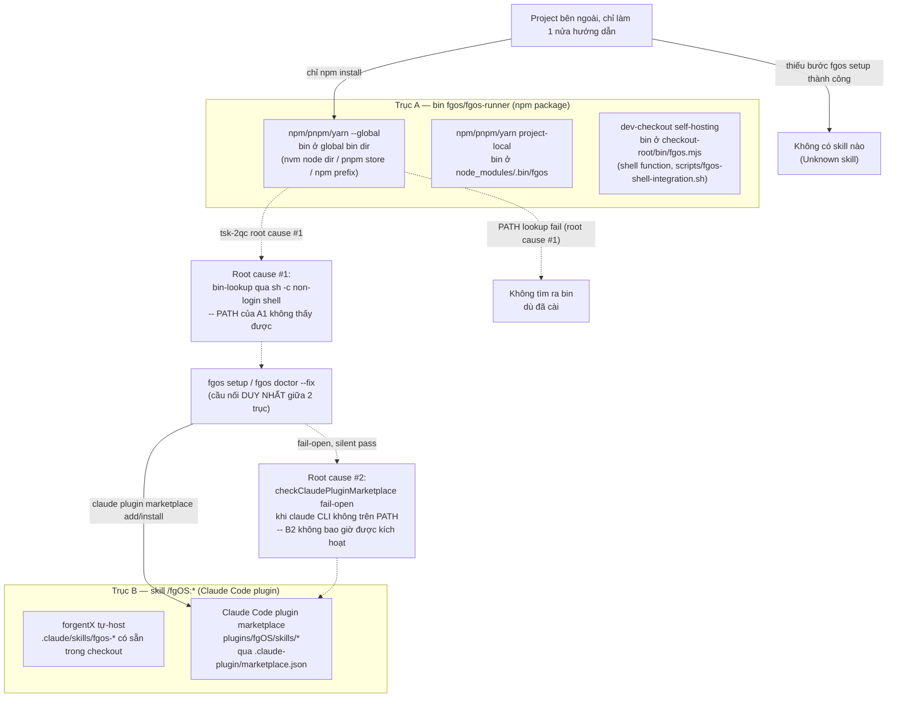

# Discussion — install/setup reliability for external projects (tsk-2qc)

## 1. Trạng thái hiện tại

Round 2. D1 đã khoá: cài đặt fgOS có 2 trục độc lập (bin vs skill), không
bắc cầu tự động cho nhau — xem §6 cho bản đồ đầy đủ + diagram. Root cause
#1/#2 (§3) vẫn đang chờ quyết hướng sửa, giờ đặt trên nền D1 đã chốt thay
vì tự đứng riêng. Tiếp theo: quay lại 2 câu hỏi hướng sửa đã đặt ra ở
cuối round trước.

## 2. Mục tiêu & đề bài

`fgos setup`/`fgos doctor` hiện chỉ thật sự được luyện (dogfood) trong
context tự-host của chính forgentX — nơi `bin/fgos.mjs` luôn có sẵn tại
cwd nên phần lớn logic PATH-lookup không bao giờ thực sự bị exercise.
Với một project bên ngoài đi đúng con đường cài đặt được document
(`npm install -g github:vantt/forgent`, rồi cài fgOS Claude Code plugin),
hai mảnh hạ tầng lẽ ra phải tự-verify/tự-fix — tìm ra bin `fgos` toàn cục,
và đăng ký Claude Code plugin marketplace để có skill — đều có đường fail
âm thầm: không báo lỗi, không tự sửa, và không có gì nhắc người dùng biết
để chạy lại. Kết quả quan sát được: project khác "luôn không tìm ra skill
hoặc không tìm ra bin". Mục tiêu của item này là thiết kế lại 2 cơ chế đó
sao cho: (a) verify thật (không fail-open khi không chắc), (b) tự sửa được
khi có thể, (c) báo rõ ràng cho người khi không tự sửa được, đúng tinh
thần 3 trụ cột của `docs/distribution-vision.md` (setup/doctor tự sửa
được mọi thứ cần, aware nhiều context trên 1 máy, mọi module đăng ký được
config/check của riêng nó) — không phải một bản vá cục bộ cho 2 hàm.

## 3. Vấn đề rõ / chưa rõ

| # | Điểm | Trạng thái | Ghi chú |
|---|------|-----------|---------|
| 1 | Root cause #1 (bin discovery) đã xác nhận bằng code+thực nghiệm | Rõ | `checkPluginSkillCliReachable` (`src/setup/registrations.mjs:1205-1219`) và `plugins/fgOS/skills/pick/SKILL.md:41` đều resolve global `fgos` qua `sh -c "command -v fgos"` — non-login, non-interactive. nvm chỉ export global bin dir trong block interactive của `~/.bashrc`/`~/.zshrc`. Test thật trên máy này: `npm prefix -g` trỏ vào thư mục nvm, nhưng `command -v fgos` chỉ tìm thấy vì có một bản cài **thứ hai, dư thừa** qua pnpm (`~/.local/share/pnpm/bin`, path này được export theo cách non-interactive shell cũng đọc được) — một máy chỉ cài đúng 1 lần theo đường npm/nvm khuyến nghị sẽ luôn fail. |
| 2 | Root cause #2 (plugin/marketplace fail-open) đã xác nhận bằng đọc code | Rõ | `checkClaudePluginMarketplace` (`src/setup/registrations.mjs:1118-1124`) trả `passed: true` khi lệnh `claude` không có trên PATH tại thời điểm check chạy — coi là "not applicable" thay vì "chưa verify được". Fix tương ứng (`claude plugin marketplace add`/`install`, dòng ~1160-1172) vì vậy không bao giờ chạy trong tình huống này. Không có cơ chế nào tự động chạy lại doctor/setup sau đó. |
| 3 | `claude` binary có thực sự đáng tin là "thước đo Claude Code có mặt hay không" không? | Chưa rõ | Người dùng có thể dùng Claude Code qua desktop app/IDE extension mà không có binary `claude` riêng trên PATH — lúc đó check #2 "not applicable" lại ĐÚNG theo nghĩa khác (Claude Code không dùng CLI marketplace mechanism theo cách này). Cần phân biệt "claude thật sự không áp dụng" khỏi "claude có áp dụng nhưng tạm thời không thấy trên PATH lúc check chạy" — 2 case khác nhau, hiện bị gộp làm một. |
| 4 | Hướng sửa root cause #1: probe nhiều tầng hay cache path đã resolve? | Chưa rõ | 2 hướng không loại trừ nhau — xem phân tích trình bày trực tiếp trong hội thoại bên dưới, cần người quyết định ưu tiên hướng nào làm nền tảng. |
| 5 | Hướng sửa root cause #2: check nên fail loud hay tìm cách tự phân biệt case 3? | Chưa rõ | Cùng cần quyết định trước khi khoá D-ID. |

## 4. Quyết định đã chốt

| D-ID | Quyết định | Lý do |
|------|-----------|-------|
| D1 | Cài đặt fgOS có **2 trục độc lập, không bắc cầu tự động**: (a) trục bin — npm/pnpm/yarn global, project-local, hoặc dev-checkout self-hosting; (b) trục skill — forgentX tự-host (`.claude/skills/fgos-*`) hoặc Claude Code plugin marketplace (`plugins/fgOS/skills/*`). Cầu nối DUY NHẤT giữa 2 trục là `fgos setup`/`doctor --fix`. | Xác nhận bằng đọc `package.json` `files` allowlist (không có `plugins/`), `plugins/fgOS/.claude-plugin/plugin.json` (không có `scripts`/postinstall, đúng RUL6), và `.claude-plugin/marketplace.json` (skill của project ngoài chỉ tới được qua plugin marketplace). Nền tảng bắt buộc trước khi thiết kế bin-discovery — vì 1 project hoàn toàn có thể chỉ thoả 1 trục. |

## 5. Q&A log

- **2026-08-13, vòng 1** — Người dùng (anh) yêu cầu tạo work item mới và
  mở code-shaping để cùng thiết kế cơ chế cài đặt/setup đúng chuẩn, nói rõ
  đã tin tưởng agent có đủ kiến thức để chủ động đề xuất. Agent (em) đã
  scout xong 2 root cause cụ thể (bằng chứng ở §3 #1-2) từ phiên thảo luận
  trước khi mở discussion này; đang trình bày 2 hướng thiết kế cho từng
  root cause trực tiếp trong hội thoại, chưa nhận câu trả lời.
- **2026-08-13, vòng 2** — Anh yêu cầu thống nhất cơ chế cài đặt (bao
  nhiêu chế độ, bin/skill nằm đâu mỗi chế độ, cách đóng gói) TRƯỚC khi bàn
  bin-discovery. Em scout `package.json` `files`, `plugins/fgOS/.claude-
  plugin/plugin.json`, `.claude-plugin/marketplace.json`, trình bày ma
  trận 2 trục độc lập. Anh xác nhận, không thêm chế độ nào khác, yêu cầu
  "cập nhật" — đã ghi D1, cập nhật §3/§6.

## 6. Thiết kế đã chốt {#design}

fgOS có 2 hệ phân phối độc lập (D1) — **bin** (`fgos`/`fgos-runner`, npm
package) và **skill** (`/fgOS:*`, Claude Code plugin) — đóng gói tách
biệt, cài tách biệt, và không có gì tự động nối chúng lại ngoài
`fgos setup`/`doctor --fix` (bản thân đang có 2 lỗ hổng fail-silent, xem
§3 #1-2).

Kết luận thiết kế tới thời điểm này: bất kỳ hướng sửa bin-discovery nào
cũng phải đứng trên nền D1 — nghĩa là không chỉ sửa 1 hàm lookup, mà phải
làm cho Trục A tự-verify/tự-báo được độc lập với Trục B, và cầu nối
(`fgos setup`/`doctor --fix`) phải fail loud thay vì fail-silent ở cả 2
đầu. Chưa chốt cơ chế cụ thể (probe nhiều tầng vs cache-in-config cho bin;
WARN vs phân biệt case cho marketplace check) — hai câu hỏi này vẫn mở,
chờ vòng tiếp theo.

## 7. Danh mục hạng mục / task {#tasks}

(chưa có — chờ §6 có nội dung cụ thể)
