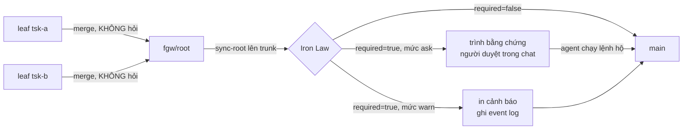

# Iron Law gate — UX cho con người

Item neo: `tsk-1y6`

## 1. Trạng thái hiện tại

Hết vòng 3. Hình dạng đã rõ và §6 đã viết được lần đầu.

Đã chốt (§4): cổng chỉ hỏi ở ranh giới trunk (**D1**); người quyết, agent
thao tác (**D2**).

Vừa thống nhất vòng 3, chưa đủ tuổi để mint D-ID (chờ đứng vững thêm một
vòng): hai mức `ask` (mặc định, giữ nguyên hành vi hiện tại) và `warn`
(bật qua config → thông báo rồi đi tiếp). Không làm field bypass trên
workitem.

Còn treo: **Q7** — nửa từ-khoá của `classifyIronLaw` mất coverage khi
gate dời về trunk; chọn (a) chấp nhận hay (b) gom mô tả con. Đây là điểm
duy nhất chặn §6 khỏi ổn định hoàn toàn.

### Nền code đã xác nhận (không suy đoán)

- Cổng bắn ở **ba** nơi trong `bin/fgos.mjs`, logic copy-paste gần như
  nguyên văn: `approve` (~L3498), `sync-root` (~L4101), `merge next`'s
  `wouldTripIronLaw` (~L2477).
- Cổng **không** nhìn merge target, dù đã có sẵn biến để nhìn. `approve`
  tính `rootBranchForIronLaw` rồi vẫn classify bất kể; `sync-root` tính
  `targetBranch = item.parent ? branchNameFor(item.parent) :
  detectTrunk(repoRoot)` rồi cũng vậy.
- `changedFiles` (`src/runner/merge.mjs:440`) dùng three-dot diff
  `${trunk}...${branch}` → ở ranh giới trunk, diff của gốc **đã chứa đủ**
  mọi file mọi con đã đụng. Phép thử **module** không mất gì khi bỏ hỏi ở
  ranh giới con→cha.
- Nhưng cả ba nơi đều gọi `classifyIronLaw({filesChanged, description:
  item.description})` — `item` ở trunk là **gốc**, nên mô tả của con
  không còn ở đâu để khớp. Phép thử **từ khoá** mất coverage cho con.
- **Không tồn tại** skill `/fgOS:approve`. `plugins/fgOS/skills/` có
  ask/answer/move/return/merge-next/merge-loop/pick/... nhưng không có
  `approve/` — trong khi `merge-loop/SKILL.md:101` và `merge-next/SKILL.md`
  đều bảo người "run `/fgOS:approve <id> --acknowledge-iron-law`
  themselves". Đây là nguồn trực tiếp của "phải copy/paste vào terminal".
- Luật cấm: RUL34/RUL37 (`docs/specs/runner.md`) + `merge-loop` §4a —
  câu chữ thật là agent không được chạy cờ *"on this skill's own
  authority"*.
- Config đã có hạ tầng: `.fgos/config.json` → `gateBypass.level` (repo
  đang chạy `standard`), `src/state/gate-bypass.mjs`. Đăng ký
  check/fix theo khuôn `src/setup/registrations.mjs:884-931` (id/key/
  check/fix) — thêm một key mới là việc rẻ, đã có tiền lệ.
- `docs/explanation/gate-bypass-design.md` D4: floor của `gateBypass`
  **cố ý** không bao giờ chạm Iron Law → mức `warn` phải là key config
  **riêng**, không nhét vào `gateBypass`.

## 2. Mục tiêu & đề bài

Cổng Iron Law hiện đúng về mặt an toàn nhưng sai về mặt trải nghiệm: khi
nó chặn, agent gom được bằng chứng và trình ra, nhưng rồi dừng lại và bắt
chính con người mở terminal gõ lệnh `approve`/`sync-root
--acknowledge-iron-law`. Người gõ xong thì gặp lỗi mà agent không nhìn
thấy (agent không chạy lệnh nên không có stdout/exit code), nên người lại
phải copy/paste lỗi ngược vào chat cho agent đọc — một vòng lặp thủ công
hoàn toàn không cần thiết. Người dùng đặt vấn đề: việc con người phải
*quyết định* là hợp lý, nhưng việc con người phải *thao tác* thì không —
"chỉ nhắc nhở con người là đủ rồi". Kèm theo một hướng gợi mở (config để
tắt chức năng) và một ràng buộc bổ sung quan trọng: nếu bản merge đó
không thật sự land lên `main` thì không cần hỏi gì cả; chỉ khi land lên
trunk mới nên hỏi. Câu hỏi thật của đề bài vì thế không phải "có nên bỏ
Iron Law không" mà là "cổng này nên hỏi ở đâu, hỏi bao nhiêu lần, và ai
được phép gõ phím sau khi người đã quyết".

## 3. Vấn đề rõ / chưa rõ

| # | Điểm | Trạng thái | Ghi chú |
|---|------|-----------|---------|
| 1 | Gate bắn 3 nơi, code lặp 3 lần | Rõ | `bin/fgos.mjs` ~L2477 / ~L3498 / ~L4101; backlog đã có item ghi nhận việc lặp này |
| 2 | Gate không nhìn merge target | Rõ → **D1** | Cả hai nơi đã có sẵn biến target, chỉ thiếu nhánh rẽ |
| 3 | `/fgOS:approve` không tồn tại | Rõ | Phải xây, là một phần của D2 |
| 4 | Luật cấm là về *thẩm quyền*, không phải *thao tác* | Rõ → **D2** | Doc explanation lý giải cần "second, independent party actually **looking** at it" — về ai NHÌN, không về ai GÕ |
| 5 | Đánh đổi tần suất vs độ nặng khi dời gate về trunk | Rõ, chấp nhận | Ít lần hỏi hơn, lần cuối nặng hơn — người dùng chấp nhận, `tsk-2sj`/`tsk-51m` là tiền lệ sống |
| 6 | Mức `warn` = mặc định mới hay opt-in? | Rõ (vòng 3) | **Opt-in**: không cấu hình gì thì giữ nguyên `ask` |
| 7 | Field bypass trên workitem | Rõ (vòng 2) | **Không làm** — loại khỏi scope |
| 8 | Có tái dùng `gateBypass.level` không? | Rõ | **Không** — D4 của gate-bypass-design.md cấm; dùng key riêng |
| 9 | Nửa từ-khoá mất coverage ở con | **Chưa rõ** | Q7: (a) chấp nhận / (b) gom mô tả con. Điểm treo duy nhất |
| 10 | RUL34/RUL37 phải supersede tới đâu? | **Chưa rõ** | Cả D1, D2 lẫn mức `warn` đều đụng luật khoá; phạm vi supersede chưa chốt |

## 4. Quyết định đã chốt

| D-ID | Quyết định | Lý do | Vòng chốt |
|------|-----------|-------|-----------|
| D1 | Cổng Iron Law chỉ chạy khi merge target **là trunk**. Leaf→`fgw/<root>` và `sync-root` vào nhánh cha đi thẳng, không hỏi. | Chưa land lên main thì main chưa chịu rủi ro. Three-dot diff (`merge.mjs:440`) bảo đảm phép thử module bắt lại đủ 100% ở ranh giới trunk, nên bỏ hỏi ở ranh giới trong không tạo lỗ hổng module nào. | 1→3 |
| D2 | Người **quyết định**, agent **thao tác**. Người trả lời "approve" trong chat là đủ; agent chạy lệnh, đọc exit code, tự sửa lỗi cơ học, tự retry. | RUL34/RUL37 cấm agent tự cấp phép cho mình ("on this skill's own authority"); doc lý giải cần "a second, independent party actually looking at it" — nói về ai NHÌN. Người đã đọc bằng chứng và trả lời thì bên thứ hai đã nhìn rồi; ai gõ phím không đổi tính chất đó. | 1→3 |

## 5. Q&A log

### 2026-08-15 — vòng 1 (mở)

**Người dùng (đề bài gốc):** "cải thiện acknowledge-iron-law để hỗ trợ con
người, hiện nay agent cứ hỏi chổ này, hỏi người approve là được, nó bắt
chính người phải chạy lệnh là không cần thiết, và khi humn chạy thì có
những error agent không tự bắt nên người cũng phải copy/paste vào
terminal, nên quy trình này quá phiền phức. hãy thảo luận thêm. chỉ nhắc
nhở con người là đủ rồi. ux phải tốt lên. có thể cho config để tắt chức
năng, hoặc workitem có field để quyết định bypass"

**Người dùng (bổ sung, cùng vòng):** "thêm là nếu không merge về main thì
không cần hỏi đâu, khi nào về main mới nên hỏi."

**Agent —** scout (kết quả ở §1), rồi hỏi Q1 (ranh giới agent gõ hộ),
Q2 ("config để tắt" là tắt hẳn hay hạ cấp), Q3 (field bypass ai set),
Q4 (chấp nhận lần hỏi cuối nặng hơn không).

### 2026-08-15 — vòng 2

**Người dùng:** "Q1. người approve, agent làm hộ. Q2. nhắc rồi đi tiếp;
Q3. không làm cái này; Q4. nếu con merge vô cha, có iron-law thì khi lên
main còn hỏi?"

**Agent —** trả lời Q4 bằng code thật: có, còn hỏi, nhưng chỉ nửa module.
`changedFiles` dùng three-dot diff nên diff của gốc đã chứa đủ file của
con; còn `description` truyền vào `classifyIronLaw` là mô tả của **gốc**,
nên nửa từ-khoá mất coverage cho con. Nêu tiền lệ nửa từ-khoá hay báo
động giả (item backlog: mô tả ghi "khong dung schema store" mà vẫn
`matchedFlags: [schema]`), đề xuất hướng (a) chấp nhận. Chỉ ra Q1 và Q2
chồng nhau → đề xuất tách hai mức `ask`/`warn`. Hỏi Q5 (mặc định hay
opt-in), Q6 (xác nhận hai mức), Q7 ((a) hay (b)).

### 2026-08-15 — vòng 3

**Người dùng:** "nếu để y hiejn tại không có cấu hình chồng đè thì agent
yêu cầu người duyệt rồi ai hỗ trợ. còn nếu có cấu hình tắt đi thì thông
báo rồi đi qua."

→ Q5 = **opt-in** (không cấu hình gì thì giữ `ask`). Q6 = xác nhận **hai
mức**. Q7 vẫn chưa trả lời.

**Agent —** mint D1/D2 (đã đứng vững qua hai vòng), viết §6 lần đầu, hỏi
lại Q7 + Q8 (phạm vi supersede RUL34/RUL37).

## 6. Thiết kế đã chốt {#design}

Cổng Iron Law giữ nguyên chức năng an toàn của nó, nhưng đổi **ba** thứ
độc lập nhau: hỏi *ở đâu*, *ai gõ phím*, và *có một cần gạt để hạ cấp*.

### Trục 1 — Hỏi ở đâu (D1)

Cả `approve` lẫn `sync-root` đã tính sẵn merge target của mình rồi mới
chạy `classifyIronLaw`, chỉ là chưa dùng giá trị đó để rẽ nhánh. D1 thêm
đúng nhánh rẽ ấy: cổng chỉ chạy khi target là trunk.

Không mất coverage phía module: `changedFiles` dùng three-dot diff
`main...fgw/<root>`, mà nhánh gốc đã hấp thụ commit của mọi con, nên mọi
file mọi con đã đụng đều xuất hiện lại ở ranh giới trunk. Đánh đổi thật
nằm chỗ khác — lần hỏi cuối gộp nhiều con nên nặng hơn, bằng chứng phải
gom rải rác; `tsk-2sj`/`tsk-51m` trong backlog là tiền lệ sống của đúng
cảnh đó. Người dùng chấp nhận đánh đổi này.

### Trục 2 — Ai gõ phím (D2)

Luật hiện tại gộp hai thứ khác nhau làm một: *thẩm quyền quyết định* và
*thao tác cơ học*. RUL34/RUL37 cấm agent tự cấp phép — hợp lý; nhưng nó
kéo theo hệ quả không ai chủ ý là con người phải tự mở terminal gõ lệnh.
Mà lệnh đó lại chạy ngoài tầm nhìn của agent, nên mọi lỗi cơ học (sai
đường dẫn, cây bẩn, lock kẹt) đều quay về dạng người copy/paste ngược.

D2 tách hai thứ: người đọc bằng chứng và trả lời trong chat là hành vi
"bên thứ hai độc lập nhìn vào" mà doc lý giải yêu cầu; agent chạy lệnh
sau đó chỉ là thao tác. Agent giữ được stdout/exit code nên tự sửa được
lỗi cơ học và tự retry — đúng phần việc mà hôm nay đang đổ lên đầu người.

Điều kiện cần: **`/fgOS:approve` phải được xây**, vì hôm nay nó không tồn
tại dù hai skill khác đã trỏ người tới nó.

### Trục 3 — Cần gạt hạ cấp (opt-in, chưa mint D-ID)

Hai mức, key config **riêng** (không nhét vào `gateBypass` — D4 của
`gate-bypass-design.md` cấm floor đó bị chạm):

- **`ask`** — mặc định, và là hành vi khi không cấu hình gì. Cổng dừng,
  agent gom + trình bằng chứng, người duyệt trong chat, agent chạy lệnh
  hộ (Trục 2).
- **`warn`** — bật tường minh qua config. Cổng không dừng: in cảnh báo,
  ghi vào event log, rồi merge tiếp.

Đăng ký check/fix theo đúng khuôn `src/setup/registrations.mjs:884-931`
(`gateBypass` đã có tiền lệ id/key/check/fix), để `fgos doctor` nhìn thấy
được — bắt buộc theo install/setup/doctor gate của AGENTS.md.

### Ngoài scope, đã loại tường minh

- Field bypass trên workitem (vòng 2). Nếu agent tự set được lúc
  submit/implement thì cổng tự cấp phép cho chính mình.
- Gộp ba bản copy-paste của gate thành một helper — đã có item backlog
  riêng ghi nhận, không kéo vào đây.

### Còn treo

Nửa từ-khoá của `classifyIronLaw` mất coverage cho con khi gate dời về
trunk (Q7). Và phạm vi supersede RUL34/RUL37 (Q8) — cả ba trục đều đụng
luật khoá.

## 7. Danh mục hạng mục / task {#tasks}

*(chờ Q7/Q8 chốt xong — chia task sớm lúc §6 còn treo hai điểm sẽ phải
chia lại)*
