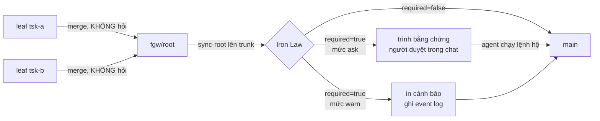

# Iron Law gate — UX cho con người

Item neo: `tsk-1y6`

## 1. Trạng thái hiện tại

Hết vòng 8. Thiết kế đã hội tụ: §6 ổn định, §7 đã chia task. Sẵn sàng bàn
giao sang `fgos-coding-exploring`.

Đã chốt (§4): **D1** cổng chỉ hỏi ở ranh giới trunk · **D2** người quyết,
agent thao tác · **D3** hai mức `ask`/`warn`, opt-in, key config riêng ·
**D4** không làm field bypass trên workitem · **D5** không chặn item khác,
và không dùng `awaiting-human` để làm việc đó · **D6** Q7 ra khỏi scope,
chuyển thành phụ thuộc `tsk-1js`.

**Không còn điểm treo trong scope này.** Q7 (hạ nửa từ-khoá xuống `warn`)
đã tách sang `tsk-1js` — xem D6 và §3 hàng 12.

### Nền code đã xác nhận (không suy đoán)

- Cổng bắn ở **ba** nơi trong `bin/fgos.mjs`, logic copy-paste gần như
  nguyên văn: `approve` (~L3498), `sync-root` (~L4101), `merge next`'s
  `wouldTripIronLaw` (~L2476).
- Cổng **không** nhìn merge target, dù đã có sẵn biến để nhìn. `approve`
  tính `rootBranchForIronLaw` rồi vẫn classify bất kể; `sync-root` tính
  `targetBranch = item.parent ? branchNameFor(item.parent) :
  detectTrunk(repoRoot)` rồi cũng vậy.
- `changedFiles` (`src/runner/merge.mjs:440`) dùng three-dot diff
  `${trunk}...${branch}` → ở ranh giới trunk, diff của gốc **đã chứa đủ**
  mọi file mọi con đã đụng. Phép thử **module** không mất gì khi bỏ hỏi ở
  ranh giới con→cha.
- Nhưng cả ba nơi đều gọi `classifyIronLaw({filesChanged, description:
  item.description})` — `item` ở trunk là **gốc**, nên mô tả của con
  không còn ở đâu để khớp. Phép thử **từ khoá** mất coverage cho con (Q7).
- **Park-và-đi-tiếp đã có sẵn ở tầng engine.** `merge next`
  (`bin/fgos.mjs:2557-2567`) đi hết danh sách xếp hạng, bỏ qua ứng viên
  trip Iron Law, ghi vào `skipped`, merge item sạch đầu tiên; chỉ trả
  `{picked: null, reason: 'every ready item is blocked', skipped}` khi
  tất cả đều bị chặn. Chủ ý ghi rõ trong comment: *"instead of always
  returning ready[0] and letting a caller loop on the same blocked item
  forever (tsk-2ej's own measured 13 repeats)"*.
- **Nhưng `merge-loop/SKILL.md` không đọc `skipped` hay `every ready item
  is blocked`** — grep cả file, không khớp dòng nào. Engine sản xuất tín
  hiệu, skill không tiêu thụ: đúng hình dạng lỗi `gate-bypass-design.md`
  đã ghi lại từ `tsk-5hg`.
- `src/state/status-fsm.mjs:146-147` chỉ có **hai** cạnh vào
  `awaiting-human`: từ `todo` và từ `doing`. Item bị Iron Law chặn đang ở
  `awaiting-approval` → **không có cạnh nào**. `fgos ask` lên nó sẽ hỏng
  đúng kiểu bug `no transition from proposed to awaiting-human` đã có
  trong backlog. Và thêm cạnh đó phải sửa `src/state/status-fsm.mjs` —
  chính nó nằm trong `MODULE_RULES` của Iron Law, nên bản vá sẽ trip đúng
  cổng nó đi sửa.
- **Không tồn tại** skill `/fgOS:approve`. `plugins/fgOS/skills/` có
  ask/answer/move/return/merge-next/merge-loop/pick/... nhưng không có
  `approve/` — trong khi `merge-loop/SKILL.md:101` và `merge-next/SKILL.md`
  đều bảo người "run `/fgOS:approve <id> --acknowledge-iron-law`
  themselves". Đây là nguồn trực tiếp của "phải copy/paste vào terminal".
- Luật cấm: RUL34/RUL37 (`docs/specs/runner.md`), truy về `D16/D17
  self-improve-loop`. **Không** nằm trong `docs/platform-foundations.md`
  (đã grep) → không phải "đổi luật khoá" theo nghĩa nặng của AGENTS.md.
- Config đã có hạ tầng: `.fgos/config.json` → `gateBypass.level` (repo
  đang chạy `standard`). Khuôn đăng ký check/fix ở
  `src/setup/registrations.mjs:884-931` (id/key/check/fix) — thêm key mới
  là việc rẻ, đã có tiền lệ.
- `docs/explanation/gate-bypass-design.md` D4: floor của `gateBypass`
  **cố ý** không bao giờ chạm Iron Law → mức `warn` phải là key config
  **riêng**, không nhét vào `gateBypass`.
- **Đo thật trên 250 bản `docs/history/*/iron-law-evidence*.md`** (parse
  được 204): chỉ-module 138 (68%), **chỉ-từ-khoá 42 (21%)**, cả hai 24
  (12%). Nửa từ-khoá KHÔNG hiếm — cứ 5 ca thì 1. Trong 42 ca đó chỉ 9 tự
  khai false positive; 33 ca không, và trong 33 ca có
  `main-checkout-destructive-git-safety-net` (chính là `tsk-3au`, ca
  `git reset --hard` mà AGENTS.md đang dẫn) và
  `events-jsonl-merge-driver-recurring-write-loss` — hai ca mất-dữ-liệu
  thật với `matchedModules` rỗng.
- Hai phép thử hỏng theo **hai chiều ngược nhau**, không cái nào "chất
  lượng hơn": module khớp chuỗi đường dẫn nên không thể báo bậy, nhưng
  spec tự ghi danh sách là *"MINH HỌA, không đóng khung"* (D10) → chế độ
  hỏng là **bỏ sót**. Từ khoá quét prose tự do → chế độ hỏng là **báo
  bậy**, ít bỏ sót.
- **`MODULE_RULES` đóng cứng đường dẫn của riêng fgOS, không có mặt cấu
  hình nào.** Hằng số private trong `src/evolve/iron-law.mjs`; grep toàn
  `src/`+`bin/` xác nhận không caller nào truyền rule vào, không key
  config, không đọc `.fgos/config.json`. `docs/specs/distribution.md` và
  `docs/distribution-vision.md` không nhắc Iron Law một chữ. Chạy thật
  `classifyIronLaw` với đường dẫn project khác: Next.js
  auth+`prisma/schema.prisma` → `required:false`; Python xoá bảng +
  `infra/terraform/rds.tf` → `required:false`; Go
  `.github/workflows/deploy.yml` deploy production → `required:false`;
  cả bốn `modules: []`. → **Ngoài fgOS, nửa module chết 100%, chỉ còn
  nửa từ-khoá.** Đã tách sang `tsk-1js` (risk `heavy`).
- Ba chân skill (`test/skills/fgos-mirror.test.mjs:10-43`): `.agents/skills`
  là nguồn canonical cho 14 dev-skill, `.claude/skills` là wrapper sinh ra
  bởi `npm run build:skills`, còn `plugins/fgOS/skills/` giữ ~35 skill
  bọc-CLI. `/fgOS:approve`, `merge-loop`, `merge-next` đều thuộc chân thứ
  ba.

## 2. Mục tiêu & đề bài

Cổng Iron Law hiện đúng về mặt an toàn nhưng sai về mặt trải nghiệm: khi
nó chặn, agent gom được bằng chứng và trình ra, nhưng rồi dừng lại và bắt
chính con người mở terminal gõ lệnh `approve`/`sync-root
--acknowledge-iron-law`. Người gõ xong thì gặp lỗi mà agent không nhìn
thấy (agent không chạy lệnh nên không có stdout/exit code), nên người lại
phải copy/paste lỗi ngược vào chat cho agent đọc — một vòng lặp thủ công
hoàn toàn không cần thiết. Người dùng đặt vấn đề: việc con người phải
*quyết định* là hợp lý, nhưng việc con người phải *thao tác* thì không —
"chỉ nhắc nhở con người là đủ rồi". Kèm theo một hướng gợi mở (config để
tắt chức năng) và một ràng buộc bổ sung quan trọng: nếu bản merge đó
không thật sự land lên `main` thì không cần hỏi gì cả; chỉ khi land lên
trunk mới nên hỏi. Câu hỏi thật của đề bài vì thế không phải "có nên bỏ
Iron Law không" mà là "cổng này nên hỏi ở đâu, hỏi bao nhiêu lần, và ai
được phép gõ phím sau khi người đã quyết".

## 3. Vấn đề rõ / chưa rõ

| # | Điểm | Trạng thái | Ghi chú |
|---|------|-----------|---------|
| 1 | Gate bắn 3 nơi, code lặp 3 lần | Rõ | Gộp thành helper đã có item backlog riêng — **không** kéo vào scope này |
| 2 | Gate không nhìn merge target | Rõ → **D1** | Cả hai nơi đã có sẵn biến target, chỉ thiếu nhánh rẽ |
| 3 | `/fgOS:approve` không tồn tại | Rõ | `#task-approve-skill` |
| 4 | Luật cấm là về *thẩm quyền*, không phải *thao tác* | Rõ → **D2** | Doc explanation lý giải cần "second, independent party actually **looking** at it" — về ai NHÌN, không về ai GÕ |
| 5 | Đánh đổi tần suất vs độ nặng khi dời gate về trunk | Rõ, chấp nhận | Ít lần hỏi hơn, lần cuối nặng hơn; `tsk-2sj`/`tsk-51m` là tiền lệ sống |
| 6 | Mức `warn` = mặc định mới hay opt-in? | Rõ → **D3** | Opt-in; không cấu hình gì thì giữ `ask` |
| 7 | Field bypass trên workitem | Rõ → **D4** | Loại khỏi scope |
| 8 | Có tái dùng `gateBypass.level` không? | Rõ → **D3** | Không — D4 của gate-bypass-design.md cấm |
| 9 | Nửa từ-khoá mất coverage ở con | Rõ → **D6** | Q7 ra khỏi scope, phụ thuộc `tsk-1js`. (a) chấp nhận đã bị số liệu bác (21% ca là keyword-only, gồm cả ca mất-dữ-liệu thật); (b) gom mô tả thuần cũng hỏng (32% item đơn dính từ khoá → gốc 5 con ≈ 85% luôn trip) |
| 10 | Phạm vi supersede RUL34/RUL37 | Rõ | Không thuộc platform-foundations → sửa spec tại chỗ + decision record supersede D16/D17 |
| 11 | Cơ chế "không chặn item khác" | Rõ → **D5** | Engine đã làm sẵn; `awaiting-human` là cửa sai và cửa đó khoá |
| 12 | Iron Law có quản được project khác dùng fgOS không? | Rõ: **KHÔNG** | Đã chứng minh thực nghiệm (§1). Tách sang `tsk-1js`, risk `heavy` — không nhét vào item UX này |
| 13 | Làm sao khẳng định chất lượng một tín hiệu? | **Chưa rõ, thuộc `tsk-1js`** | Không khẳng định được, chỉ đo được — mà hôm nay không ai ghi lại kết quả duyệt nên chưa có nhãn nào. Hướng đã nêu chưa chốt: D2 đặt sẵn chỗ lấy nhãn gần như miễn phí (người đang trả lời trong chat), routing về sau chạy theo precision đo được thay vì theo danh sách người đoán |

## 4. Quyết định đã chốt

| D-ID | Quyết định | Lý do | Vòng chốt |
|------|-----------|-------|-----------|
| D1 | Cổng Iron Law chỉ chạy khi merge target **là trunk**. Leaf→`fgw/<root>` và `sync-root` vào nhánh cha đi thẳng, không hỏi. | Chưa land lên main thì main chưa chịu rủi ro. Three-dot diff (`merge.mjs:440`) bảo đảm phép thử module bắt lại đủ 100% ở ranh giới trunk, nên bỏ hỏi ở ranh giới trong không tạo lỗ hổng module nào. | 1→3 |
| D2 | Người **quyết định**, agent **thao tác**. Người trả lời "approve" trong chat là đủ; agent chạy lệnh, đọc exit code, tự sửa lỗi cơ học, tự retry. | RUL34/RUL37 cấm agent tự cấp phép cho mình ("on this skill's own authority"); doc lý giải cần "a second, independent party actually looking at it" — nói về ai NHÌN. Người đã đọc bằng chứng và trả lời thì bên thứ hai đã nhìn rồi; ai gõ phím không đổi tính chất đó. | 1→3 |
| D3 | Hai mức: `ask` (mặc định, và là hành vi khi không cấu hình gì) và `warn` (bật tường minh → in cảnh báo, ghi event log, merge tiếp). Key config **riêng**, không nhét vào `gateBypass`. | Opt-in giữ hành vi hiện tại nguyên vẹn cho ai không đụng config. Key riêng vì `gate-bypass-design.md` D4 khoá floor của `gateBypass` là không bao giờ chạm Iron Law — nhét vào đó là phá một quyết định đã chốt vì lý do không liên quan. | 3→4 |
| D4 | **Không** làm field bypass trên workitem. | Nếu agent tự set được field lúc submit/implement thì cổng tự cấp phép cho chính nó — mất đúng tính chất "bên thứ hai độc lập" mà D2 dựa vào. | 2→4 |
| D5 | Một item bị Iron Law chặn **không được chặn** item khác còn merge được. Nhưng cơ chế là *bỏ qua và đi tiếp*, item **ở nguyên `awaiting-approval`** — **không** `fgos ask`, **không** `awaiting-human`, **không** `/fgOS:answer`. | Ý "không nghẽn việc khác" khớp ưu tiên #2 AGENTS.md và engine đã làm sẵn (`bin/fgos.mjs:2557-2567`, `skipped`). Nhưng `awaiting-human` là cửa sai: FSM không có cạnh từ `awaiting-approval` (`status-fsm.mjs:146-147`), thêm cạnh phải sửa `status-fsm.mjs` — chính là module Iron Law, nên bản vá trip đúng cổng nó sửa. Và `awaiting-approval` vốn đã nghĩa là "chờ người duyệt": dựng thêm state là hai tên cho một nghĩa. | 4→5 |
| D6 | **Q7 ra khỏi scope `tsk-1y6`**, chuyển thành phụ thuộc `tsk-1js`. Item này không đụng gì tới nửa từ-khoá — không hạ cấp, không gom mô tả con, không thêm nhóm từ khoá thảm hoạ. | Số đo bác cả hai phương án đã nêu: (a) chấp nhận mất — nhưng keyword-only là 21% số ca và gồm cả `tsk-3au` (destructive git) lẫn ca mất event log, `matchedModules` rỗng; (b) gom mô tả thuần — 32% item đơn đã dính từ khoá nên gốc 5 con trip ≈ 85%, phá sạch cái lợi của D1. Và quyết định đúng phụ thuộc một sự thật lớn hơn vừa phát hiện: ngoài fgOS nửa module chết 100%, nên nửa từ-khoá **là toàn bộ cổng** — hạ nó xuống `warn` là tắt Iron Law cho mọi người dùng fgOS. Không quyết được ở tầng item UX này. | 8 |

## 5. Q&A log

### 2026-08-15 — vòng 1 (mở)

**Người dùng (đề bài gốc):** "cải thiện acknowledge-iron-law để hỗ trợ con
người, hiện nay agent cứ hỏi chổ này, hỏi người approve là được, nó bắt
chính người phải chạy lệnh là không cần thiết, và khi humn chạy thì có
những error agent không tự bắt nên người cũng phải copy/paste vào
terminal, nên quy trình này quá phiền phức. hãy thảo luận thêm. chỉ nhắc
nhở con người là đủ rồi. ux phải tốt lên. có thể cho config để tắt chức
năng, hoặc workitem có field để quyết định bypass"

**Người dùng (bổ sung, cùng vòng):** "thêm là nếu không merge về main thì
không cần hỏi đâu, khi nào về main mới nên hỏi."

**Agent —** scout (kết quả ở §1), rồi hỏi Q1 (ranh giới agent gõ hộ),
Q2 ("config để tắt" là tắt hẳn hay hạ cấp), Q3 (field bypass ai set),
Q4 (chấp nhận lần hỏi cuối nặng hơn không).

### 2026-08-15 — vòng 2

**Người dùng:** "Q1. người approve, agent làm hộ. Q2. nhắc rồi đi tiếp;
Q3. không làm cái này; Q4. nếu con merge vô cha, có iron-law thì khi lên
main còn hỏi?"

**Agent —** trả lời Q4 bằng code thật: có, còn hỏi, nhưng chỉ nửa module.
`changedFiles` dùng three-dot diff nên diff của gốc đã chứa đủ file của
con; còn `description` truyền vào `classifyIronLaw` là mô tả của **gốc**,
nên nửa từ-khoá mất coverage cho con. Nêu tiền lệ nửa từ-khoá hay báo
động giả (item backlog: mô tả ghi "khong dung schema store" mà vẫn
`matchedFlags: [schema]`), đề xuất hướng (a). Chỉ ra Q1 và Q2 chồng nhau
→ đề xuất tách hai mức `ask`/`warn`. Hỏi Q5 (mặc định hay opt-in), Q6
(xác nhận hai mức), Q7 ((a) hay (b)).

### 2026-08-15 — vòng 3

**Người dùng:** "nếu để y hiejn tại không có cấu hình chồng đè thì agent
yêu cầu người duyệt rồi ai hỗ trợ. còn nếu có cấu hình tắt đi thì thông
báo rồi đi qua."

→ Q5 = **opt-in**. Q6 = xác nhận **hai mức**. Q7 chưa trả lời.

**Agent —** mint D1/D2, viết §6 lần đầu. Tự trả lời phạm vi supersede
bằng grep: Iron Law không nằm trong `platform-foundations.md` nên là sửa
spec + supersede D16/D17, nhẹ hơn dự đoán vòng 2. Hỏi lại Q7 và Q8
(`merge-loop` ở mức `ask` thì dừng hay park-rồi-đi-tiếp).

### 2026-08-15 — vòng 4

**Người dùng (chọn Q8):** "Park rồi đi tiếp — `fgos ask <id>` đẩy item vào
awaiting-human kèm bằng chứng, vòng lặp chạy tiếp sang item sau (không bị
chặn bơi item đang kẹt); người quay lại trả lời gom một lượt qua
`/fgOS:answer`, rồi agent chạy lệnh hộ theo D2"

**Agent —** scout trước khi ghi, phát hiện hai điều ngược lại: (1)
park-và-đi-tiếp **đã có sẵn** ở engine (`bin/fgos.mjs:2557-2567`,
`skipped`), chỉ `merge-loop/SKILL.md` không đọc tín hiệu đó; (2)
`fgos ask` là cửa **sai và khoá** — FSM không có cạnh `awaiting-approval →
awaiting-human` (`status-fsm.mjs:146-147`), và thêm cạnh phải sửa
`status-fsm.mjs`, chính là module Iron Law. Đề nghị giữ ý, bỏ cơ chế.

### 2026-08-15 — vòng 5

**Người dùng:** "đồng ý"

**Agent —** mint D3/D4/D5, regenerate §6, chia §7. Q7 vẫn treo, nằm gọn
trong `#task-engine-gate`.

### 2026-08-15 — vòng 6

**Người dùng:** "tư vấn giúp. mình đẩy ship fast, release human nhưng
không thể bừa bãi"

**Agent —** thay vì cãi, đi đo 250 bản `iron-law-evidence.md`. Kết quả
(§1) **bác bỏ đề xuất (a) của chính agent ở vòng 2 và 3**: keyword-only là
21% chứ không phải nhiễu, và gồm cả `tsk-3au` (destructive git) lẫn ca
mất event log với `matchedModules` rỗng. Cũng bác (b) thuần bằng số:
32% item đơn đã dính từ khoá → gốc 5 con trip ≈ 85%. Đề xuất (c): định
tuyến theo loại tín hiệu (module → `ask`, từ-khoá-only → `warn`), kèm
biến thể giữ `ask` cho nhóm từ khoá thảm hoạ.

### 2026-08-15 — vòng 7

**Người dùng:** "khó quyết, module là kiểm tra sao, từ khóa thì quá bậy,
chứng mình nó không dúng, nhóm thảm họa làm sao test, như em nói chất
lượng tín hiệu, làm sao khẳng định chật lượng tín hiệu chứ hễ là hỏi mà
chẳng đúng sự thật thì rất bực mình."

**Agent —** thừa nhận ba điểm: (1) nói "module chất lượng cao hơn" là
ẩu — hai phép thử hỏng theo hai chiều ngược nhau (module bỏ sót, từ khoá
báo bậy), không cái nào hơn; (2) **rút đề xuất nhóm từ khoá thảm hoạ** —
nó đúng y hệt loại vật thể `MODULE_RULES` đang là, tức vá một danh sách
đoán bằng một danh sách đoán khác; (3) chất lượng tín hiệu **không khẳng
định được, chỉ đo được**, mà hôm nay chưa ai ghi lại kết quả duyệt nên
con số 9/42 ở vòng 6 là *ước lượng từ prose*, không phải đo. Đề xuất
hai giai đoạn: giai đoạn 1 không nới gì, chỉ thu nhãn qua chính câu trả
lời của người ở cổng `ask` (D2 đã đặt sẵn chỗ); giai đoạn 2 routing chạy
theo precision đo được. Chưa được chốt — người dùng chuyển hướng sang
câu hỏi lớn hơn ở vòng 8.

### 2026-08-15 — vòng 8

**Người dùng:** "anh thấy siêu nghiêm trọng ở một vấn đè Iron Law. là nếu
chúng ta dùng fgos để phát triển project khác thì iron-law có quản lý
được không hay chỉ quản fgos?"

**Agent —** chạy `classifyIronLaw` thật với đường dẫn của bốn project
khác (§1): cả bốn `modules: []`, ba trong bốn `required: false` kể cả ca
xoá bảng + Terraform RDS và ca deploy production. Ngoài fgOS nửa module
chết 100%; ca duy nhất bắt được trúng nhờ may vì "thanh toán" tình cờ có
trong `HEAVY_KEYWORDS`. Tệ hơn "không chạy": `approve` vẫn chạy gate và
trả `required: false`, tức **báo đã kiểm và an toàn trong khi không kiểm
gì liên quan**. Chỉ ra thứ tự bị ngược — Q7 không quyết được trước câu
hỏi này. Đề nghị tách item riêng.

**Người dùng:** "ok" → submit `tsk-1js` (risk `heavy`). Agent mint D6.

## 6. Thiết kế đã chốt {#design}

Cổng Iron Law giữ nguyên chức năng an toàn của nó. Bốn thứ đổi, độc lập
nhau: hỏi *ở đâu*, *ai gõ phím*, *có cần gạt hạ cấp*, và *một câu hỏi
treo có được phép nghẽn việc khác không*.

### Trục 1 — Hỏi ở đâu (D1)

Cả `approve` lẫn `sync-root` đã tính sẵn merge target của mình rồi mới
chạy `classifyIronLaw`, chỉ là chưa dùng giá trị đó để rẽ nhánh. D1 thêm
đúng nhánh rẽ ấy: cổng chỉ chạy khi target là trunk.

Không mất coverage phía module: `changedFiles` dùng three-dot diff
`main...fgw/<root>`, mà nhánh gốc đã hấp thụ commit của mọi con, nên mọi
file mọi con đã đụng đều xuất hiện lại ở ranh giới trunk. Đánh đổi thật
nằm chỗ khác — lần hỏi cuối gộp nhiều con nên nặng hơn, bằng chứng phải
gom rải rác; `tsk-2sj`/`tsk-51m` trong backlog là tiền lệ sống của đúng
cảnh đó. Người dùng chấp nhận đánh đổi này.

### Trục 2 — Ai gõ phím (D2)

Luật hiện tại gộp hai thứ khác nhau làm một: *thẩm quyền quyết định* và
*thao tác cơ học*. RUL34/RUL37 cấm agent tự cấp phép — hợp lý; nhưng nó
kéo theo hệ quả không ai chủ ý là con người phải tự mở terminal gõ lệnh.
Mà lệnh đó lại chạy ngoài tầm nhìn của agent, nên mọi lỗi cơ học (sai
đường dẫn, cây bẩn, lock kẹt) đều quay về dạng người copy/paste ngược.

D2 tách hai thứ: người đọc bằng chứng và trả lời trong chat là hành vi
"bên thứ hai độc lập nhìn vào" mà doc lý giải yêu cầu; agent chạy lệnh
sau đó chỉ là thao tác. Agent giữ được stdout/exit code nên tự sửa được
lỗi cơ học và tự retry — đúng phần việc mà hôm nay đang đổ lên đầu người.

Điều kiện cần: **`/fgOS:approve` phải được xây**, vì hôm nay nó không tồn
tại dù hai skill khác đã trỏ người tới nó.

### Trục 3 — Cần gạt hạ cấp (D3)

Hai mức, key config **riêng** (không nhét vào `gateBypass` — D4 của
`gate-bypass-design.md` khoá floor đó là không bao giờ chạm Iron Law):

- **`ask`** — mặc định, và là hành vi khi không cấu hình gì. Cổng dừng,
  agent gom + trình bằng chứng, người duyệt trong chat, agent chạy lệnh
  hộ (Trục 2).
- **`warn`** — bật tường minh qua config. Cổng không dừng: in cảnh báo,
  ghi vào event log, rồi merge tiếp.

Đăng ký check/fix theo đúng khuôn `src/setup/registrations.mjs:884-931`,
để `fgos doctor` nhìn thấy được — bắt buộc theo install/setup/doctor gate
của AGENTS.md.

### Trục 4 — Câu hỏi treo không nghẽn việc khác (D5)

Engine đã đúng rồi: `merge next` bỏ qua ứng viên bị chặn, ghi `skipped`,
merge item sạch đầu tiên. Cái hỏng nằm ở tầng skill —
`merge-loop/SKILL.md` §4a dừng cả vòng lặp, và không đọc `skipped` /
`every ready item is blocked` mà engine trả về.

Sửa ở đúng tầng đó, không dựng state mới: `merge-loop` đọc tín hiệu,
tiếp tục sang item sau, tích luỹ danh sách Iron-Law đang đọng, và cuối
vòng trình một lượt kèm bằng chứng đọc từ
`docs/history/<id>/iron-law-evidence.md` (hợp đồng `tsk-5t3` đã có sẵn).
Item không rời `awaiting-approval` một giây nào — trạng thái đó vốn đã
nghĩa là "chờ người duyệt". Người quay lại duyệt gom một lượt, agent chạy
lệnh hộ theo D2.

### Phạm vi thiết kế này **chỉ đúng bên trong fgOS** (D6)

Lý lẽ của D1 dựa vào một sự thật chỉ đúng ở repo này: three-dot diff bảo
đảm phép thử **module** bắt lại 100% ở ranh giới trunk, nên bỏ hỏi ở
ranh giới con→cha không tạo lỗ hổng. Ngoài fgOS, phép thử module **luôn
rỗng** (`MODULE_RULES` đóng cứng đường dẫn repo này, không có mặt cấu
hình) — nên "bắt lại 100%" là bắt lại 100% của *không gì cả*.

Thiết kế ở đây vì thế đúng và đáng ship **cho fgOS tự dogfood**, nhưng
không được đọc như một phát biểu về Iron Law nói chung. Việc làm cho
cổng này có nghĩa với project khác nằm ở `tsk-1js`, và nó lớn hơn item
này — đụng ưu tiên #1 của AGENTS.md ("tốc độ ship của project ĐANG DÙNG
fgOS").

### Ngoài scope, đã loại tường minh

- Field bypass trên workitem (**D4**).
- Gộp ba bản copy-paste của gate thành một helper — đã có item backlog
  riêng ghi nhận.
- Thêm cạnh FSM `awaiting-approval → awaiting-human` (**D5**).
- **Mọi thay đổi lên nửa từ-khoá** (**D6**) — hạ cấp, gom mô tả con, hay
  thêm nhóm từ khoá thảm hoạ. Sang `tsk-1js`.
- Cơ chế đo precision của từng tín hiệu (§3 hàng 13) — nêu ở vòng 7,
  chưa chốt, thuộc `tsk-1js`.

## 7. Danh mục hạng mục / task {#tasks}

Chia theo **file sở hữu**, để bốn task không đụng cùng dòng (repo có
`fgos conflicts` đúng vì lý do này). T4 gom mọi thay đổi spec/decision về
một chỗ thay vì để bốn phiên cùng sửa `docs/specs/runner.md`.

### `#task-engine-gate` — cổng ở trunk + mức ask/warn

Trích §6: Trục 1 + Trục 3. D-ID áp dụng: **D1**, **D3**.

Gộp D1 và D3 làm một task vì cả hai sửa **đúng cùng khối điều kiện** ở ba
gate site — tách ra là bảo đảm xung đột footprint.

- File: `bin/fgos.mjs` (~L2476 `wouldTripIronLaw`, ~L3498 `approve`,
  ~L4101 `sync-root`), `src/setup/registrations.mjs`, `.fgos/config.json`.
- **Không đụng nửa từ-khoá** (D6). Chỉ thêm nhánh rẽ theo merge target và
  đọc mức config; `classifyIronLaw` giữ nguyên chữ ký và hành vi.
- Anh em: không phụ thuộc task nào; T4 phụ thuộc nó. `tsk-1js` sẽ sửa
  tiếp cùng vùng code này về sau — ghi footprint rõ để hai bên không đua.
- Verify nháp: `node --test test/cli/fgos-approve.test.mjs
  test/cli/fgos-merge.test.mjs test/evolve/iron-law.test.mjs` + test mới
  cho hai ca: leaf→root **không** trip; root→trunk **có** trip.

### `#task-approve-skill` — xây `/fgOS:approve`

Trích §6: Trục 2. D-ID áp dụng: **D2**.

- File: `plugins/fgOS/skills/approve/SKILL.md` (mới). Chân skill thứ ba
  (`test/skills/fgos-mirror.test.mjs:30-43`) — skill bọc-CLI, không cần
  mirror `.agents/`; xác nhận lại lúc plan.
- Skill phải: gom + trình bằng chứng, nhận câu duyệt của người, tự chạy
  lệnh, tự đọc exit code, tự sửa lỗi cơ học và retry — không đẩy lệnh cho
  người gõ.
- Anh em: T3 phụ thuộc nó (prose của T3 trỏ tới skill này).
- Verify nháp: `node --test test/skills/fgos-mirror.test.mjs` + skill tồn
  tại và trỏ đúng verb.

### `#task-merge-loop-park` — đọc `skipped`, đi tiếp, trình gom một lượt

Trích §6: Trục 4. D-ID áp dụng: **D5**, **D2**.

- File: `plugins/fgOS/skills/merge-loop/SKILL.md` (§4a + bước 5/6),
  `plugins/fgOS/skills/merge-next/SKILL.md`.
- Bỏ lệnh cấm "never call `fgos ask <id> to park it`" khỏi §4a **theo
  đúng nghĩa hẹp**: vẫn không park bằng `awaiting-human` (D5), chỉ thôi
  dừng cả vòng lặp.
- Sửa cả hai chỗ đang trỏ người tới `/fgOS:approve` để khớp D2.
- Anh em: phụ thuộc `#task-approve-skill`.
- Verify nháp: `node --test test/skills/fgos-mirror.test.mjs` + grep xác
  nhận SKILL.md đọc `skipped` / `every ready item is blocked`.

### `#task-spec-supersede` — RUL34/RUL37 + decision record

Trích §6: cả bốn trục đều đụng luật.

- File: `docs/specs/runner.md` (RUL34, RUL37), `docs/decisions/` (record
  mới supersede mệnh đề "hard refuse always" của `D16/D17
  self-improve-loop`), `CHANGELOG.md` `## [Unreleased]`.
- Không sửa `docs/platform-foundations.md` — đã grep, Iron Law không nằm
  ở đó.
- Anh em: phụ thuộc T1/T2/T3 (spec ghi lại hành vi đã có thật).
- Verify nháp: `node --test test/scripts/check-decision-citation-drift.test.mjs`
  + `npm test`.
